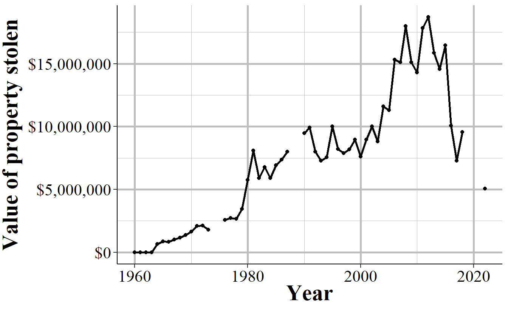

# Property Stolen and Recovered (Supplement to Return A) {#stolen_property}

The Property Stolen and Recovered data - sometimes called the Supplement to Return A (Return A being another name for the Offenses Known and Clearances by Arrest dataset, the "crime" dataset) - provides monthly information about property-related offenses (theft, motor vehicle theft, robbery, and burglary), including the location of the offense (in broad categories like "gas station" or "residence"), what was stolen (e.g. clothing, livestock, firearms), and how much the stolen items were worth.^[It also includes the value of items stolen during rapes and murders, if anything was stolen.] It also includes robberies so is really the "stuff taken during a crime" dataset than the dataset about property crimes. The "recovered" part of this dataset covers the type and value of property recovered so you can use this, along with the type and value of property stolen, to determine what percent and type of items the police managed to recover. 

Like most other SRS datasets this is at the agency-month level so you can, for example, learn how often burglaries occur at the victim's home during the day, and if that rate changes over the year or differs across agencies. The data, however, provides no information about the offender or the victim (other than if the victim was an individual or a commercial business ^[based on the location of the incident - "bank", "gas station", etc.]). The value of the property stolen is primarily based on the victim's estimate of how much the item is worth (items that are decreased in value once used - such as cars - are supposed to be valued at the current market rate, but the data provides no indication of when it uses the current market rate or the victim's estimate) so it should be used as a very rough estimate of value.  

Before getting into the details of this data, let's look at one example of how this data can measure property crime in a few different ways. This data is highly useful to use as a rough measure of the cost of crime. This cost is limited to just the value of the property stolen - so excludes things like injuries, mental health effects of victimization, etc. - but is still better than nothing. Since this data includes, for some types of property stolen, both the number of offenses per month (broken down by type of theft and items stolen) and the value of the stolen property, we can also see if the average value of these thefts change over time. Though since we don't have the value of items stolen from each individual crime we don't know when outliers are skewing results.

We'll look at home burglaries that occur during the day in Philadelphia. First, we can look at the number of these kinds of burglaries each month or year. Figure \@ref(fig:phillyHomeBurglaryCount) shows the annual number of daytime home burglaries and in recent years it has declined sharply into having the fewest on record in 2020 followed by a very low number of crimes in 2021 and 2022. So citywide, Philadelphia has never been safer (averaging across the last few years) when it comes to daytime home burglaries. As you should be aware by this point in the book, SRS data is optional and not all agencies report data every year. In this case 2019, 2020, and 2021 data are all partial, with only 9, 4, and 9 months, respectively, reported for each of these years. Every previous year other than 1974, 1975, 1988, and 1989^[1974 had11 months, 1975 had 9 months, 1988 had 10 months, and 1989 had 11 months of data.] had a full 12-months of data reported. So it makes sense the 2019-2021 had fewer crimes if they only submitted data for part of the year. This is something that's pretty obvious - you can't compare 12 months of data with <12 months of data - but it's a common mistake so you should check how many months are reported every time you compare multiple years. 

(\#fig:phillyHomeBurglaryCount)The annual number of daytime home burglaries reported in Philadelphia, PA, 1960-2022.

When considering the cost of crime, we also want to know the actually monetary cost of that incident. This encompasses a lot of different values including physical and emotional harm to the victim (including harm to structures such as broken doors and windows) and changes in people's behavior (e.g. quit job to avoid going to a certain part of town), and spending on additional precautions such as a home security system to prevent future crimes. With this data we only have the value of the physical items stolen, so while it is still a cost of crime it's a rather shallow one.  

Figure \@ref(fig:PhillyBurglaryCost) measures this cost of crime by showing the annual sum of the value of the property stolen for daytime home burglaries in Philadelphia. The years without 12 months of data are excluded from the figure. Like many variables in the SRS, there is no reported crime value until 1964 so the data shows a value of 0 from 1960-1963. The trend here is different than the previous graph which showed undulations in the number of burglaries but not major trend changes until the 2010s; here is a steady increase over the long term, though with varying speed of increase, until it peaked in the late 2000s/early 2010s before declining substantially in recent years. While the number of burglaries peaked in the early 1980s, the total value of burglaries didn't peak until the early 2010s, so the cost of this crime (even this very narrow measure of cost) can't be ascertained from knowing the number of burglaries alone. From this measure we can say that daytime home burglaries were worse in the early 2010s and are substantially better currently. At least this is true among burglaries reported to the police in Philly.  

(\#fig:PhillyBurglaryCost)The total annual cost of daytime home burglaries in Philadelphia.

The final way we can measure daytime home burglaries is to put the previous variables together to look at the cost per burglary. This will give us the average amount of property stolen from each burglary victim. Figure \@ref(fig:phillyHomeCostPerBurglary) shows the cost average cost per burglary for each year of data available. Now we have a different story than the other graphs. Even though the number of daytime home burglaries declined substantially over the last decade and the total cost is around the level seen in the 1980s, the cost per burglary remains at record highs in recent years, though down from the peak in the mid-2010s. This suggests that while burglaries are down, the burden on each burglary victim has continued to grow.

A perhaps obvious issue here is that we had no way to determining how much outliers are affecting results. If one year has, for example, a home burglary where $10 million worth of jewelry is stolen then that year's total value of property stolen would be much higher just due to a single burglary. There is, unfortunately, no way to handle this in this dataset, though the NIBRS' version of the data does let you check for outliers.^[Having an outlier, as long as it isn't just a data entry error, shouldn't necessarily mean you remove it. If we removed rare events after all we'd have to drop murders from our data as murders are very uncommon crimes.] 

(\#fig:phillyHomeCostPerBurglary)The annual number of burglaries and cost per burglary for daytime home burglaries in Philadelphia, 1960-2022.

Part of this - and part of the long-term increase seen in Figure \@ref(fig:PhillyBurglaryCost) - is simply due to inflation. \$1 in 1964, the first year we have data on the value of burglaries, is worth \$9.84 in 2023, according to the Bureau of Labor Statistics.^[Based on June of both years] The values in this data are *not* adjusted for inflation so you need to do that adjustment yourself before any analyses, otherwise your results will be quite a bit off. When we adjust all values to 2023 dollars, as shown in Figure \@ref(fig:phillyHomeCostPerBurglaryInflation), the trend becomes changes a bit. There's still a steady increase in cost per burglary over time but it is far more gradual than in Figure \@ref(fig:phillyHomeCostPerBurglary). And now the difference from the cost in early years and late years are far smaller. 

