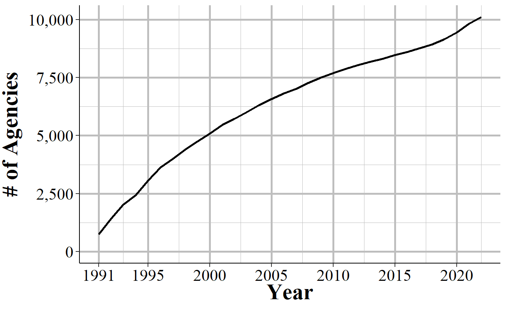
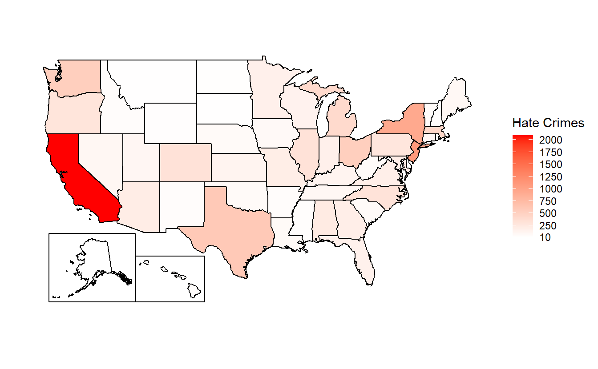

# Hate Crime Data {#hate_crimes}

This data set covers crimes that are reported to the police and judged by the police to be motivated by hate. More specifically, they are crimes which were motivated - at least in part - by bias towards a certain person or group of people because of characteristics about them such as race, sexual orientation, or religion. The first part is key: incidents must first be crimes—specifically, the types of crimes the FBI includes in this data set. Actions motivated by bias that do not meet the legal standard of a crime, or fall outside the specific crime categories covered by this data, are not recorded as hate crimes.

For example, if someone yells racial slurs at a Black person, it’s clearly a biased and racist action, but it wouldn’t be included in this data unless it involved a specific crime like intimidation. Racial slurs alone, without additional criminal behavior, are generally not illegal and thus wouldn’t be reported as a hate crime in this data set. For the second part, the bias motivation, it must be against a group that the FBI includes in this data. For example, when this data collection began in 1991, there was no way to collect information about hate crimes against transgender people specifically. Instead it would be counted in the "Anti-Lesbian, Gay, Bisexual, Or Transgender, Mixed Group (LGBT) bias motivation. So if a transgender person was assaulted or killed because they were transgender, there would not be a way to count that until 2013 when anti-transgender was first recorded in this data. 

In the previous example the offender shouted a racial slur, clear that the actions were motivated by bias. What about a hate crime where there is no explicit evidence of hate? Say, a White man robs a Black man and targets him because he is Black. The offender does not wear any insignia suggesting bias and never says a word to the victim. If the offender is never caught this robbery would not be considered a hate crime as there is no evidence that it is motivated by hate. Even if the offender is caught this would only be considered a hate crime if the police uncover evidence of bias, such as a confession or text messages between the offender and another person explaining why the victim was targeted. I think many - perhaps even most - hate crimes fall into this category. Where it was in fact a hate crime but there is not sufficient evidence - both in terms of evidence the police can gather and even the victim's own perception - that it was a hate crime. 

This data is a more limited measure of hate crimes than it may initially appear. It represents only (some) crimes, motivated by (some) types of hate, that are both reported to the police and where the police have gathered sufficient evidence to determine bias. It is also the data set with the fewest agencies reporting, with most agencies not reporting any hate crimes to the FBI in a given year. This may be true for most agencies as hate crimes are rare and many agencies are small with relatively few crimes of any type reported. However, there is evidence that some agencies that likely have hate crimes still do not report. This leads to gaps in the data with some states having few agencies that report hate crimes, agencies reporting some bias motivations but not others, and agencies reporting some years but not others. While these problems exist for all of the SRS data sets, it is more severe in this data. This problem is further complicated by hate crimes being rare even in agencies that report them. With such rare events, even minor changes in which agencies report or whether victims report the crime to the police can drastically change the reported number of hate crimes. For these reasons I strongly advise caution to anyone using these data. 

## Agencies reporting

We will start by looking at how many agencies report hate crime each year. This is a bit tricky since there can be multiple ways to examine how agencies report, and since agencies can truly have no hate crimes in a year it is hard to differentiate the true zeroes from the non-reporters. 

Figure \@ref(fig:hateAgencies) shows the number of agencies that report at least one hate crime incident in that year. During the first year of data in 1991 there were about 750 agencies reporting and that grew steadily to about 2,000 agencies in year 2000. From there it increased a bit over the next decade before declining to below 1,750 in the early 2010s and rising again to around 3,000 agencies at the end of our data.

(\#fig:hateAgencies)The annual number of police agencies that report at least one hate crime incident in that year.

The 3,000 or so agencies that report each year are not the same every year. Figure \@ref(fig:hateCrimesEver) shows the cumulative number of agencies that have reported at least one hate crime between 1991 and 2022. There is a steady growth in the cumulative number of agencies, with about 350 new agencies each year. In each year some new agencies report hate crimes for the first time while some agencies that reported a hate crime in previous years do not report any hate crimes in the current year.

(\#fig:hateCrimesEver)The cumulative number of agencies that have reported one or more hate crimes between 1991 and 2022

Figure \@ref(fig:hateCrimesPreviousYear) puts this into hard numbers by showing the percent of agencies who reported a hate crime in a certain year who *also* reported a hate crime in the previous year. For most years between 50% and 60% of agencies which reported a hate crime in the year shown on the x-axis also reported a hate crime in the previous year, indicating somewhat high consistency in which agencies have hate crimes. 

(\#fig:hateCrimesPreviousYear)The percent of agencies that report a hate crime in a given year that also reported a hate crime in the previous year, 1992-2023

Another way to understand reporting is to look at the number of reported hate crimes by state and see which states report and which do not. Figure \@ref(fig:hateCrimesMap) does this for 2022 data by showing the number of reported hate crime incidents by state. Unfortunately what we have done here is basically create a population map, though with California as a clear outlier. Counting up and graphing or mapping the number of crimes is a common first response to getting new data but is not actually that helpful. Here we see that the states with the biggest populations - California, New York, Texas,  - have the most hate crimes. To be more useful let us look at state-level reporting after adjusting to the number of agencies in the state and to the civilian population.

(\#fig:hateCrimesMap)Total reported hate crimes by state, 2023

We will start with the rate of agencies reporting though this incorrectly assumes that each agency in the state is comparable. For example, say a state has 10 agencies; one that has jurisdiction over 91% of the state's population, and nine that have jurisdiction over 1% of the population each. If the one big agency reports and none of the nine do then we will say that only 10% of agencies report data. But this one covers 91% of the state so this is actually great coverage. Conversely, having that one agency not report means that even with the other nine agencies reporting we actually cover less than one-tenth of the state's population. Still, this is a useful starting point for understanding this data's reporting and usually answering these kinds of questions requires multiple answers that are all wrong in their own way.

Figure \@ref(fig:statePercentReporting) shows the percent of agencies for each state that reported at least one hate crime in 2022. In New Jersey, the state with the highest percent of agencies reporting, 39% of agencies reported at least one hate crime. It is neighboring states of Pennsylvania, Delaware, and New York have a much lower rate of reporting at 4% (the lowest of any state), 11%, and 14%, respectively. This difference is likely due to a 2019 request by the New Jersey Attorney General to police officers that they [https://www.washingtonpost.com/national-security/2022/01/29/hate-crimes-nj-fbi-asian/]("more thoroughly report on bias incidents.") To me this suggests that decisions at the state level can lead to drastic changes in reporting rates by agencies, and is a possible solution to low reporting rates. 

In 15 states, fewer than 10% of agencies reported a hate crime, and in one state (Pennsylvania) fewer than 5% of agencies did so. One interesting finding from this map is the more liberal states - New Jersey, Washington, California, Connecticut, etc. - have the highest share of agencies reporting a hate crime, indicating that the culture of the state may influence either the propensity of hate crimes, whether victims report, whether agencies report hate crimes, or simply that more hate crimes happen in these areas.   

(\#fig:statePercentReporting)The percent of agencies in each state that reported at least one hate crime in 2022, excluding agencies covered by another agency.

To examine how population affects our results, Figure \@ref(fig:statePercentReportingPop) shows the percent of each state's population that is covered by an agency that reported at least one hate crime. Results are similar to Figure \@ref(fig:statePercentReporting) but now show that there is more reporting than it appeared in that figure. That is because while not all agencies report a hate crime, the ones that do report are generally larger (in terms of population) than the ones that do not. And that is to be expected since smaller agencies will have fewer crimes than larger ones meaning that it is less likely that have a hate crime.

So measuring by population we see that about half of the people in the country lives in the jurisdiction of an agency which reported at least one hate crime. The average state also covers about half of the population in a hate-crime-reporting agency. The state with the lowest population covered is Mississippi with 17% of its residents in a jurisdiction with an agency reporting data; the state with the highest share is Hawaii at 86%.

Is this good? We do not necessarily want 100% of agencies to report a hate crime since not all agencies will experience a hate crime in their jurisdiction. The ideal data set would have all hate crimes reported but without knowing how many hates crimes there actually are we cannot tell how well this data captures hate crimes.

This is also a fairly poor measure of reporting as it just measures agencies reporting at least one hate crime. If an agency had many hate crimes but only reported very few - and here let us think about that as both agencies not knowing a crime was a hate crime and also knowing but not reporting a hate crime - that is also quite bad for our understanding of hate crimes. However, it is far more likely that a hate crime is not reported than a non-hate crime being reported as a hate crime. Since we know the likely direction of any errors we can think about this entire data set as being the lower-bound of hate crime data.

(\#fig:statePercentReportingPop)The percent of population in each state in agencies that reported at least one hate crime in 2022, excluding agencies that are covered by another agency.

## Tree of Life synagogue shooting {#treeOfLife}

One way I like to check the quality of data is to see how it reports something that I know occurred. Here we will look at how the anti-Semitic attack on a synagogue in Pittsburgh was reported. In October of 2018 the deadliest attack on Jewish people in US history occurred at the Tree of Life synagogue in Pittsburgh, PA. There, 11 congregants were murdered, and several other people, including police officers, were injured by the shooter. Yet according to this data, however, those murders never occurred. Not in Pittsburgh at least. No murders with an anti-Jewish bias were reported in Pittsburgh in 2018. Instead, the shooting was reported by the FBI's Pittsburgh field office, which, like many federal agencies that have offices across the country, is included in the data as its own agency.

This is good and bad. Of course it is good that when a crime happens it is reported in the data. The bad part is that it is counted as hate crimes that occurred in the FBI's Pittsburgh agency, and not the Pittsburgh Police Department. Most research occurs at the local level - usually studying an agency or county. So if a study is examining agency-level characteristics that are related to hate crimes it would almost certainly exclude these murders as they are reported by a federal agency and not the local Pittsburgh agency. 

This also gets complicated as FBI rules say that a crime should be reported by the most local jurisdiction. This is true even when there is overlapping jurisdiction. 11 people were murdered in Pittsburgh, and several Pittsburgh Police officers were injured. That should mean that the crime is reported by Pittsburgh Police, not by the FBI. Pittsburgh does report these murders in their Offenses Known data, making it even more odd that they are Pittsburgh crimes in one data set and not another.^[The murders of nine Black parishioners in the Emanuel African Methodist Episcopal Church in Charleston, South Carolina, in 2015 was reported by the Charleston Police Department, making it even more inconsistent for when the FBI reports hate crime murders.] 

## Important variables

This data has the standard set of variables describing the agency that is reporting. This includes the agency ORI - which is the unique ID for that agency - the agency name, their state, and the population under their jurisdiction. It then has more detailed information about each crime such as what crime happened, what type of bias it involved, where it occurred, and some demographics of the offender.

### Date and time

This data says the exact date that the hate crime occurred on - though not the date it was reported on. Figure \@ref(fig:hateCrimesByDay) shows the percent of hates crimes between 1991 and 2022 that occurred on each day of the week. Interestingly, the most common days for a hate crime to occur is on Friday, which is also when non-hate crimes most frequently occur. This suggests that hate crimes do follow the same trends - at least partially - as other crimes.

(\#fig:hateCrimesByDay)The day of the week that hate crimes occurred on, 1991-2023

We can also look at which day of the month is most common, as shown in Figure \@ref(fig:hateCrimesByMonthDay). There's no pattern that I can see other than the the 1st of the most has the most hate crimes and the end of the month has the fewest. Not all months have more than 28 days so it makes sense that the 29th, 30th, and 31st are the least common days. Is the 1st of the month really the most dangerous? I think this is likely just a quirk of the data, and is something we also see in NIBRS data. When an agency does not report an actual date they may use the 1st of the month as a placeholder which then looks to us like the 1st is an especially prolific day for hate crimes. 

(\#fig:hateCrimesByMonthDay)The day of the month that hate crimes occurred on, 1991-2023

### The bias motivation (who the hate is against)

The most important variable in this data is the "bias motivation" which is the FBI's term for the cause of the hate. A hate crime targeted against Black people would be an "anti-Black" bias motivation. For the police to classify an incident as a hate crime, and to assign a particular bias motivation, the police must have *some* evidence that the crime was motivated by hate. The victim saying that the crime is a hate crime alone is not sufficient - though if large portions of the victim's community believe that the crime is a hate crime, this can be a factor in the police's assessment. 

The evidence required is not major. It includes evidence as explicit as slurs said during an incident and less obvious factors like the crime occurring on an important holiday for that community (e.g. Martin Luther King Day, religious holidays). The FBI also encourages police to consider the totality of the evidence even if none alone strongly suggests that the crime was a hate crime in making their determination about whether the incident was a hate crime or not. This also means that many (perhaps most) hate crimes will not be recorded as hate crimes since there is no evidence that the crime is motivated by hate. 

Consider, for example, a person who is biased against Asian people and decides to rob them because they are Asian. This is clearly a hate crime. And say this persons robs 10 Asian people in 10 different incidents, causing 10 hate crimes. All of the victims report it to the police but only two of them tell the police that they think it was a hate crime; the other eight do not think it is a hate crime. Without additional information the police would likely not report any of these robberies as hate crimes. And if all ten of the victims happened to be surveyed about crime victimization, such as through the Bureau of Justice Statistics' National Crime Victimization Survey, only two of the 10 victims would report being the victim of a hate crime. Using FBI data the anti-Asian hate crimes would be zero; using victimization surveys would undercount anti-Asian hate crimes enormously. This is the main problem with using hate crime data, even with perfect reporting or surveys of everyone possibly victimized we may still be getting data that is completely incorrect.

In the FBI data bias motivation is based on the offender's perceptions of the victim so even if they are incorrect in who their victim is, if they intended to target someone for their perceived group membership, that is still a hate crime. For example, if a person assaults a man because they think he is gay, that is a hate crime because the assault was motivated by hate towards gay people. Whether the victim is actually gay or not is not relevant - the offender perceived him to be gay so it is an anti-gay hate crime. To make this even more complicated, the offender must have committed the crime because they are motivated, at least to some degree, by their bias against the victim. Being biased against the victim but targeting them for some other reason means that the crime is not a hate crime. 

The biases that the FBI includes in this data have grown over time, with new bias motivations being added in 1997, 2012, 2013, and 2015. Table \@ref(tab:hateBiasMotivation) shows each bias motivation in this data, the year it was first reported, how many hate crimes there were for this bias motivation from 1991-2023 and what percent of hate crimes that bias motivation makes up. 

To make the most common bias motivations easier to identify, the table is sorted by the frequency of incidents. The "first year" column reflects the first year that the bias motivation was officially recorded, though some biases may have existed earlier but were not yet captured in the data. The last column in this table shows the percent of hate crime incidents from 1991-2023. 

This sorting makes it easy to see the most common bias motivations, but that is not actually that useful to most people since we usually care more about a rate than a count. For example, according to this table there were almost three times as many anti-Black hate crimes than anti-Jewish hate crimes, showing that anti-Black hate crimes are more of a problem in this country. But this is not right. We cannot just count of the number of offenses or we risk accidentally just measuring the population of these groups. Black people, for example, make up about 14% of the United States population while Jewish people make up about 2%.^[For simplicity I am treating these groups as independent though of course some Black people can be Jewish.] If we adjust the numbers to equalize population then we see that there is a much higher anti-Jewish hate crime rate than anti-Black rate. 

And even this is not that useful since you really need a much deeper dive into the data before pulling out these seemingly simple statistics. For example, maybe areas with more Jewish people have better reporting than areas with more Black people. Or that Jewish victims would report to the police at higher rates than Black victims. Maybe these are both true at certain times between 1992 and 2022 but have changed over the years. It is not hard to think of possible explanations for differences between groups so without running down each of these explanations I recommend caution before putting out even something as seemingly simple at the number of crimes by bias group. 

<table class="table table-striped" style="width: auto !important; margin-left: auto; margin-right: auto;">
<caption>(\#tab:hateBiasMotivation)The bias motivation for hate crime incidents. In incidents with multiple bias motivation, this shows only the first bias motivation recorded.</caption>
 <thead>
  <tr>
   <th style="text-align:left;"> Bias Motivation </th>
   <th style="text-align:left;"> First Year Reported </th>
   <th style="text-align:right;"> # of Incidents </th>
   <th style="text-align:right;"> % of Incidents </th>
  </tr>
 </thead>
<tbody>
  <tr>
   <td style="text-align:left;"> Total </td>
   <td style="text-align:left;">  </td>
   <td style="text-align:right;"> 252,093 </td>
   <td style="text-align:right;"> 100\% </td>
  </tr>
  <tr>
   <td style="text-align:left;"> Anti-Black </td>
   <td style="text-align:left;"> 1991 </td>
   <td style="text-align:right;"> 84,508 </td>
   <td style="text-align:right;"> 33.52\% </td>
  </tr>
  <tr>
   <td style="text-align:left;"> Anti-Jewish </td>
   <td style="text-align:left;"> 1991 </td>
   <td style="text-align:right;"> 31,838 </td>
   <td style="text-align:right;"> 12.63\% </td>
  </tr>
  <tr>
   <td style="text-align:left;"> Anti-White </td>
   <td style="text-align:left;"> 1991 </td>
   <td style="text-align:right;"> 28,192 </td>
   <td style="text-align:right;"> 11.18\% </td>
  </tr>
  <tr>
   <td style="text-align:left;"> Anti-Gay (Male) </td>
   <td style="text-align:left;"> 1991 </td>
   <td style="text-align:right;"> 24,927 </td>
   <td style="text-align:right;"> 9.89\% </td>
  </tr>
  <tr>
   <td style="text-align:left;"> Anti-Hispanic Or Latino </td>
   <td style="text-align:left;"> 1991 </td>
   <td style="text-align:right;"> 16,231 </td>
   <td style="text-align:right;"> 6.44\% </td>
  </tr>
  <tr>
   <td style="text-align:left;"> Anti-Other Race, Ethnicity, Ancestry, Or National Origin </td>
   <td style="text-align:left;"> 1991 </td>
   <td style="text-align:right;"> 11,899 </td>
   <td style="text-align:right;"> 4.72\% </td>
  </tr>
  <tr>
   <td style="text-align:left;"> Anti-Lesbian, Gay, Bisexual, Or Transgender (Mixed Group) </td>
   <td style="text-align:left;"> 1991 </td>
   <td style="text-align:right;"> 8,684 </td>
   <td style="text-align:right;"> 3.44\% </td>
  </tr>
  <tr>
   <td style="text-align:left;"> Anti-Asian </td>
   <td style="text-align:left;"> 1991 </td>
   <td style="text-align:right;"> 8,088 </td>
   <td style="text-align:right;"> 3.21\% </td>
  </tr>
  <tr>
   <td style="text-align:left;"> Anti-Multiple Races, Group </td>
   <td style="text-align:left;"> 1991 </td>
   <td style="text-align:right;"> 5,876 </td>
   <td style="text-align:right;"> 2.33\% </td>
  </tr>
  <tr>
   <td style="text-align:left;"> Anti-Lesbian (Female) </td>
   <td style="text-align:left;"> 1991 </td>
   <td style="text-align:right;"> 5,041 </td>
   <td style="text-align:right;"> 2.00\% </td>
  </tr>
  <tr>
   <td style="text-align:left;"> Anti-Islamic (Muslim) </td>
   <td style="text-align:left;"> 1991 </td>
   <td style="text-align:right;"> 4,468 </td>
   <td style="text-align:right;"> 1.77\% </td>
  </tr>
  <tr>
   <td style="text-align:left;"> Anti-Other Religion </td>
   <td style="text-align:left;"> 1991 </td>
   <td style="text-align:right;"> 3,741 </td>
   <td style="text-align:right;"> 1.48\% </td>
  </tr>
  <tr>
   <td style="text-align:left;"> Anti-American Indian Or Native Alaskan </td>
   <td style="text-align:left;"> 1991 </td>
   <td style="text-align:right;"> 2,878 </td>
   <td style="text-align:right;"> 1.14\% </td>
  </tr>
  <tr>
   <td style="text-align:left;"> Anti-Catholic </td>
   <td style="text-align:left;"> 1991 </td>
   <td style="text-align:right;"> 1,894 </td>
   <td style="text-align:right;"> 0.75\% </td>
  </tr>
  <tr>
   <td style="text-align:left;"> Anti-Transgender </td>
   <td style="text-align:left;"> 2013 </td>
   <td style="text-align:right;"> 1,855 </td>
   <td style="text-align:right;"> 0.74\% </td>
  </tr>
  <tr>
   <td style="text-align:left;"> Anti-Arab </td>
   <td style="text-align:left;"> 1991 </td>
   <td style="text-align:right;"> 1,633 </td>
   <td style="text-align:right;"> 0.65\% </td>
  </tr>
  <tr>
   <td style="text-align:left;"> Anti-Mental Disability </td>
   <td style="text-align:left;"> 1997 </td>
   <td style="text-align:right;"> 1,439 </td>
   <td style="text-align:right;"> 0.57\% </td>
  </tr>
  <tr>
   <td style="text-align:left;"> Anti-Protestant </td>
   <td style="text-align:left;"> 1991 </td>
   <td style="text-align:right;"> 1,389 </td>
   <td style="text-align:right;"> 0.55\% </td>
  </tr>
  <tr>
   <td style="text-align:left;"> Anti-Multiple Religions, Group </td>
   <td style="text-align:left;"> 1991 </td>
   <td style="text-align:right;"> 1,352 </td>
   <td style="text-align:right;"> 0.54\% </td>
  </tr>
  <tr>
   <td style="text-align:left;"> Anti-Physical Disability </td>
   <td style="text-align:left;"> 1997 </td>
   <td style="text-align:right;"> 870 </td>
   <td style="text-align:right;"> 0.35\% </td>
  </tr>
  <tr>
   <td style="text-align:left;"> Anti-Sikh </td>
   <td style="text-align:left;"> 2015 </td>
   <td style="text-align:right;"> 821 </td>
   <td style="text-align:right;"> 0.33\% </td>
  </tr>
  <tr>
   <td style="text-align:left;"> Anti-Bisexual </td>
   <td style="text-align:left;"> 1991 </td>
   <td style="text-align:right;"> 684 </td>
   <td style="text-align:right;"> 0.27\% </td>
  </tr>
  <tr>
   <td style="text-align:left;"> Anti-Gender Non-Conforming </td>
   <td style="text-align:left;"> 2012 </td>
   <td style="text-align:right;"> 653 </td>
   <td style="text-align:right;"> 0.26\% </td>
  </tr>
  <tr>
   <td style="text-align:left;"> Anti-Heterosexual </td>
   <td style="text-align:left;"> 1991 </td>
   <td style="text-align:right;"> 627 </td>
   <td style="text-align:right;"> 0.25\% </td>
  </tr>
  <tr>
   <td style="text-align:left;"> Anti-Female </td>
   <td style="text-align:left;"> 2012 </td>
   <td style="text-align:right;"> 539 </td>
   <td style="text-align:right;"> 0.21\% </td>
  </tr>
  <tr>
   <td style="text-align:left;"> Anti-Other Christian </td>
   <td style="text-align:left;"> 2015 </td>
   <td style="text-align:right;"> 472 </td>
   <td style="text-align:right;"> 0.19\% </td>
  </tr>
  <tr>
   <td style="text-align:left;"> Anti-Eastern Orthodox (Greek, Russian, Other) </td>
   <td style="text-align:left;"> 2015 </td>
   <td style="text-align:right;"> 441 </td>
   <td style="text-align:right;"> 0.17\% </td>
  </tr>
  <tr>
   <td style="text-align:left;"> Anti-Atheism/Agnosticism </td>
   <td style="text-align:left;"> 1991 </td>
   <td style="text-align:right;"> 218 </td>
   <td style="text-align:right;"> 0.09\% </td>
  </tr>
  <tr>
   <td style="text-align:left;"> Anti-Native Hawaiian Or Other Pacific Islander </td>
   <td style="text-align:left;"> 2013 </td>
   <td style="text-align:right;"> 198 </td>
   <td style="text-align:right;"> 0.08\% </td>
  </tr>
  <tr>
   <td style="text-align:left;"> Anti-Male </td>
   <td style="text-align:left;"> 2013 </td>
   <td style="text-align:right;"> 194 </td>
   <td style="text-align:right;"> 0.08\% </td>
  </tr>
  <tr>
   <td style="text-align:left;"> Anti-Buddhist </td>
   <td style="text-align:left;"> 2015 </td>
   <td style="text-align:right;"> 130 </td>
   <td style="text-align:right;"> 0.05\% </td>
  </tr>
  <tr>
   <td style="text-align:left;"> Anti-Hindu </td>
   <td style="text-align:left;"> 2015 </td>
   <td style="text-align:right;"> 128 </td>
   <td style="text-align:right;"> 0.05\% </td>
  </tr>
  <tr>
   <td style="text-align:left;"> Anti-Church of Jesus Christ (Mormon) </td>
   <td style="text-align:left;"> 2015 </td>
   <td style="text-align:right;"> 118 </td>
   <td style="text-align:right;"> 0.05\% </td>
  </tr>
  <tr>
   <td style="text-align:left;"> Anti-Jehovahs Witness </td>
   <td style="text-align:left;"> 2015 </td>
   <td style="text-align:right;"> 67 </td>
   <td style="text-align:right;"> 0.03\% </td>
  </tr>
</tbody>
</table>

2015 is the year with the most bias additions, as of data through 2022. This year added a number of religions such as Anti-Buddhist, Anti-Sikh, and Anti-Jehovah's Witness. In 2013, anti-Transgender was added and this is the most common of the bias motivations added since data began in 1991 with 1500 hate crimes between 2013-2023 - 0.62% of all hate crime incidents from 1991-2023. That year also added anti-male and Anti-Native Hawaiian or Other Pacific Islander, which is the most recent racial group added. In 2012, anti-gender non-conforming and anti-female were included, while in 1997 both anti-mental and anti-physical disability were added. In part due to having fewer years of data available, these newer bias motivations make up a small percent of total hate crimes. 

The original hate crimes - that is, those in the data in 1991 when this data set was released - are far more common. The most common bias motivation is anti-Black at 34% of hate crimes, anti-Jewish at 12%, anti-White at 11%, anti-male homosexual (gay) at 10%, anti-Hispanic at 6%, and anti-ethnicity other than Hispanic (this group means a crime against an ethnic group that is not Hispanic, though it is occasionally reported as anti-non-Hispanic which is incorrect.) at 5%. All other bias motivations are less than 5% of hate crimes and consist of a variety of ethnic, racial, religious, or sexual orientation. Some hate crimes can potentially fall in multiple categories. For example, there is a bias motivation of "anti-male homosexual (gay)" and of "anti-lesbian, gay, bisexual, or transgender, mixed group (LGBT)" so there is some overlap between them. When an incident involves multiple bias motivations we can track that in the data as police can report up to 10 bias motivations per incident. In practice, however, most incidents involve only a single bias motivation.

### The crime that occurred

The "crime" part of hate crimes is which criminal offense occurred during the incident. A hateful act where the action is not one of the crimes that the FBI records would not be considered a hate crime. This is likely most common when considering something like a person calling someone by a hateful slur (e.g. "You're a [slur]," "go back to your own country", etc.) but where the action is not technically a crime. Another layer of difficulty in using this data is that not all crimes that the FBI includes were initially included when data become available in 1991. Every several years the FBI adds new crimes to be included in this data. Table \@ref(tab:hateOffense) shows each crime in the data, the first year that this crime was reported, the total number of these crimes reported between 1991 and 2022, and the percent of all incidents this crime makes up.^[This tables uses only the first offense in an incident so counts are slightly lower than if all crimes in every incident is used.] 

Each hate crime incident can cover up to 10 different crimes occurring - for example, a person who burglarizes a synagogue and spray paints a swastika on the wall would have both burglary and vandalism reported in this data. With each crime, this data has the bias motivation for that crime, the location of the crime (in broad categories, not the actual location in the city like a street address would have), and the number of victims for that offense. In practice, in most hate crimes with multiple offenses recorded, the bias motivation, location, and victim count is the same for each offense.

Figure \@ref(fig:crimesPerHateCrime) shows the number of crimes per incident for each hate crime reported between 1991 and 2022. In 96.6% of cases, there is only one offense in that incident.^[In 0.0004% of hate crimes there is no recorded offense. This is not shown in the graph.] This drops sharply to 3.2% of incidents having two offenses, 0.21% having three offenses, 0.019% having four offenses, and 0.002% having five offenses. Even though this data does allow up to 10 offenses per hate crime incident, there has never been a recorded case with more than five offenses. Results are nearly identical when examining the number of bias motivations and locations reported in an incident. 

(\#fig:crimesPerHateCrime)The number of offenses per hate crime incident.

Nearly all hate crimes are vandalism/destruction of property (30%), intimidation (30%), and simple assault (20%) or aggravated assault (11%) with no remaining crime making up more than 2% of total hate crimes. 

<table class="table table-striped" style="width: auto !important; margin-left: auto; margin-right: auto;">
<caption>(\#tab:hateOffense)The offense type for hate crime incidents. In incidents with multiple offense types, this shows only the first offense type recorded.</caption>
 <thead>
  <tr>
   <th style="text-align:left;"> Offense </th>
   <th style="text-align:left;"> First Year Reported </th>
   <th style="text-align:right;"> # of Incidents </th>
   <th style="text-align:right;"> % of Incidents </th>
  </tr>
 </thead>
<tbody>
  <tr>
   <td style="text-align:left;"> Total </td>
   <td style="text-align:left;">  </td>
   <td style="text-align:right;"> 252,094 </td>
   <td style="text-align:right;"> 100\% </td>
  </tr>
  <tr>
   <td style="text-align:left;"> Destruction/Damage/Vandalism of Property </td>
   <td style="text-align:left;"> 1991 </td>
   <td style="text-align:right;"> 75,524 </td>
   <td style="text-align:right;"> 29.96\% </td>
  </tr>
  <tr>
   <td style="text-align:left;"> Assault Offenses - Intimidation </td>
   <td style="text-align:left;"> 1991 </td>
   <td style="text-align:right;"> 75,381 </td>
   <td style="text-align:right;"> 29.90\% </td>
  </tr>
  <tr>
   <td style="text-align:left;"> Assault Offenses - Simple Assault </td>
   <td style="text-align:left;"> 1991 </td>
   <td style="text-align:right;"> 50,410 </td>
   <td style="text-align:right;"> 20.00\% </td>
  </tr>
  <tr>
   <td style="text-align:left;"> Assault Offenses - Aggravated Assault </td>
   <td style="text-align:left;"> 1991 </td>
   <td style="text-align:right;"> 28,127 </td>
   <td style="text-align:right;"> 11.16\% </td>
  </tr>
  <tr>
   <td style="text-align:left;"> Robbery </td>
   <td style="text-align:left;"> 1991 </td>
   <td style="text-align:right;"> 4,509 </td>
   <td style="text-align:right;"> 1.79\% </td>
  </tr>
  <tr>
   <td style="text-align:left;"> Burglary/Breaking And Entering </td>
   <td style="text-align:left;"> 1991 </td>
   <td style="text-align:right;"> 4,023 </td>
   <td style="text-align:right;"> 1.60\% </td>
  </tr>
  <tr>
   <td style="text-align:left;"> Larceny/Theft Offenses - All Other Larceny </td>
   <td style="text-align:left;"> 1993 </td>
   <td style="text-align:right;"> 3,010 </td>
   <td style="text-align:right;"> 1.19\% </td>
  </tr>
  <tr>
   <td style="text-align:left;"> Arson </td>
   <td style="text-align:left;"> 1991 </td>
   <td style="text-align:right;"> 1,518 </td>
   <td style="text-align:right;"> 0.60\% </td>
  </tr>
  <tr>
   <td style="text-align:left;"> Drug/Narcotic Offenses - Drug/Narcotic Violations </td>
   <td style="text-align:left;"> 1993 </td>
   <td style="text-align:right;"> 1,462 </td>
   <td style="text-align:right;"> 0.58\% </td>
  </tr>
  <tr>
   <td style="text-align:left;"> Larceny/Theft Offenses - Theft From Motor Vehicle </td>
   <td style="text-align:left;"> 1993 </td>
   <td style="text-align:right;"> 942 </td>
   <td style="text-align:right;"> 0.37\% </td>
  </tr>
  <tr>
   <td style="text-align:left;"> Larceny/Theft Offenses - Other </td>
   <td style="text-align:left;"> 1991 </td>
   <td style="text-align:right;"> 925 </td>
   <td style="text-align:right;"> 0.37\% </td>
  </tr>
  <tr>
   <td style="text-align:left;"> Larceny/Theft Offenses - Shoplifting </td>
   <td style="text-align:left;"> 1993 </td>
   <td style="text-align:right;"> 853 </td>
   <td style="text-align:right;"> 0.34\% </td>
  </tr>
  <tr>
   <td style="text-align:left;"> Larceny/Theft Offenses - Theft From Building </td>
   <td style="text-align:left;"> 1994 </td>
   <td style="text-align:right;"> 685 </td>
   <td style="text-align:right;"> 0.27\% </td>
  </tr>
  <tr>
   <td style="text-align:left;"> Motor Vehicle Theft </td>
   <td style="text-align:left;"> 1992 </td>
   <td style="text-align:right;"> 614 </td>
   <td style="text-align:right;"> 0.24\% </td>
  </tr>
  <tr>
   <td style="text-align:left;"> Weapon Law Violations </td>
   <td style="text-align:left;"> 1993 </td>
   <td style="text-align:right;"> 501 </td>
   <td style="text-align:right;"> 0.20\% </td>
  </tr>
  <tr>
   <td style="text-align:left;"> Drug/Narcotic Offenses - Drug Equipment Violations </td>
   <td style="text-align:left;"> 1995 </td>
   <td style="text-align:right;"> 403 </td>
   <td style="text-align:right;"> 0.16\% </td>
  </tr>
  <tr>
   <td style="text-align:left;"> Fraud Offenses - False Pretenses/Swindle/Confidence Game </td>
   <td style="text-align:left;"> 1997 </td>
   <td style="text-align:right;"> 378 </td>
   <td style="text-align:right;"> 0.15\% </td>
  </tr>
  <tr>
   <td style="text-align:left;"> Murder/Nonnegligent Manslaughter </td>
   <td style="text-align:left;"> 1991 </td>
   <td style="text-align:right;"> 348 </td>
   <td style="text-align:right;"> 0.14\% </td>
  </tr>
  <tr>
   <td style="text-align:left;"> Sex Offenses - Rape </td>
   <td style="text-align:left;"> 1991 </td>
   <td style="text-align:right;"> 329 </td>
   <td style="text-align:right;"> 0.13\% </td>
  </tr>
  <tr>
   <td style="text-align:left;"> Larceny/Theft Offenses - Theft of Motor Vehicle Parts/Accessories </td>
   <td style="text-align:left;"> 1993 </td>
   <td style="text-align:right;"> 265 </td>
   <td style="text-align:right;"> 0.11\% </td>
  </tr>
  <tr>
   <td style="text-align:left;"> Sex Offenses - Fondling - Indecent Liberties/Child Molest </td>
   <td style="text-align:left;"> 1993 </td>
   <td style="text-align:right;"> 265 </td>
   <td style="text-align:right;"> 0.11\% </td>
  </tr>
  <tr>
   <td style="text-align:left;"> Counterfeiting/Forgery </td>
   <td style="text-align:left;"> 1993 </td>
   <td style="text-align:right;"> 256 </td>
   <td style="text-align:right;"> 0.10\% </td>
  </tr>
  <tr>
   <td style="text-align:left;"> Fraud Offenses - Credit Card/Atm Fraud </td>
   <td style="text-align:left;"> 1995 </td>
   <td style="text-align:right;"> 189 </td>
   <td style="text-align:right;"> 0.07\% </td>
  </tr>
  <tr>
   <td style="text-align:left;"> Kidnapping/Abduction </td>
   <td style="text-align:left;"> 1994 </td>
   <td style="text-align:right;"> 173 </td>
   <td style="text-align:right;"> 0.07\% </td>
  </tr>
  <tr>
   <td style="text-align:left;"> Fraud Offenses - Impersonation </td>
   <td style="text-align:left;"> 2001 </td>
   <td style="text-align:right;"> 155 </td>
   <td style="text-align:right;"> 0.06\% </td>
  </tr>
  <tr>
   <td style="text-align:left;"> Stolen Property Offenses (Receiving, Selling, Etc.) </td>
   <td style="text-align:left;"> 1996 </td>
   <td style="text-align:right;"> 148 </td>
   <td style="text-align:right;"> 0.06\% </td>
  </tr>
  <tr>
   <td style="text-align:left;"> Fraud Offenses - Other </td>
   <td style="text-align:left;"> 2016 </td>
   <td style="text-align:right;"> 122 </td>
   <td style="text-align:right;"> 0.05\% </td>
  </tr>
  <tr>
   <td style="text-align:left;"> Pornography/Obscene Material </td>
   <td style="text-align:left;"> 1995 </td>
   <td style="text-align:right;"> 89 </td>
   <td style="text-align:right;"> 0.04\% </td>
  </tr>
  <tr>
   <td style="text-align:left;"> Sex Offenses - Sodomy </td>
   <td style="text-align:left;"> 1995 </td>
   <td style="text-align:right;"> 86 </td>
   <td style="text-align:right;"> 0.03\% </td>
  </tr>
  <tr>
   <td style="text-align:left;"> Extortion/Blackmail </td>
   <td style="text-align:left;"> 1997 </td>
   <td style="text-align:right;"> 77 </td>
   <td style="text-align:right;"> 0.03\% </td>
  </tr>
  <tr>
   <td style="text-align:left;"> Embezzlement </td>
   <td style="text-align:left;"> 1995 </td>
   <td style="text-align:right;"> 71 </td>
   <td style="text-align:right;"> 0.03\% </td>
  </tr>
  <tr>
   <td style="text-align:left;"> Sex Offenses - Sexual Assault With An Object </td>
   <td style="text-align:left;"> 1996 </td>
   <td style="text-align:right;"> 50 </td>
   <td style="text-align:right;"> 0.02\% </td>
  </tr>
  <tr>
   <td style="text-align:left;"> Larceny/Theft Offenses - Purse-Snatching </td>
   <td style="text-align:left;"> 1995 </td>
   <td style="text-align:right;"> 31 </td>
   <td style="text-align:right;"> 0.01\% </td>
  </tr>
  <tr>
   <td style="text-align:left;"> Larceny/Theft Offenses - Pocket-Picking </td>
   <td style="text-align:left;"> 1996 </td>
   <td style="text-align:right;"> 30 </td>
   <td style="text-align:right;"> 0.01\% </td>
  </tr>
  <tr>
   <td style="text-align:left;"> Fraud Offenses - Wire Fraud </td>
   <td style="text-align:left;"> 2006 </td>
   <td style="text-align:right;"> 29 </td>
   <td style="text-align:right;"> 0.01\% </td>
  </tr>
  <tr>
   <td style="text-align:left;"> Sex Offenses - Statutory Rape </td>
   <td style="text-align:left;"> 1999 </td>
   <td style="text-align:right;"> 22 </td>
   <td style="text-align:right;"> 0.01\% </td>
  </tr>
  <tr>
   <td style="text-align:left;"> Undocumented Code </td>
   <td style="text-align:left;"> 2018 </td>
   <td style="text-align:right;"> 17 </td>
   <td style="text-align:right;"> 0.01\% </td>
  </tr>
  <tr>
   <td style="text-align:left;"> Larceny/Theft Offenses - Theft Rom Coin-Operated Machine Or Device </td>
   <td style="text-align:left;"> 1999 </td>
   <td style="text-align:right;"> 16 </td>
   <td style="text-align:right;"> 0.01\% </td>
  </tr>
  <tr>
   <td style="text-align:left;"> Prostitution Offenses - Prostitution </td>
   <td style="text-align:left;"> 2001 </td>
   <td style="text-align:right;"> 15 </td>
   <td style="text-align:right;"> 0.01\% </td>
  </tr>
  <tr>
   <td style="text-align:left;"> Fraud Offenses - Welfare Fraud </td>
   <td style="text-align:left;"> 1996 </td>
   <td style="text-align:right;"> 10 </td>
   <td style="text-align:right;"> 0.00\% </td>
  </tr>
  <tr>
   <td style="text-align:left;"> Negligent Manslaughter </td>
   <td style="text-align:left;"> 1999 </td>
   <td style="text-align:right;"> 8 </td>
   <td style="text-align:right;"> 0.00\% </td>
  </tr>
  <tr>
   <td style="text-align:left;"> Prostitution Offenses - Assisting Or Promoting Prostitution </td>
   <td style="text-align:left;"> 2013 </td>
   <td style="text-align:right;"> 7 </td>
   <td style="text-align:right;"> 0.00\% </td>
  </tr>
  <tr>
   <td style="text-align:left;"> Sex Offenses - Incest </td>
   <td style="text-align:left;"> 1997 </td>
   <td style="text-align:right;"> 7 </td>
   <td style="text-align:right;"> 0.00\% </td>
  </tr>
  <tr>
   <td style="text-align:left;"> Bribery </td>
   <td style="text-align:left;"> 2014 </td>
   <td style="text-align:right;"> 6 </td>
   <td style="text-align:right;"> 0.00\% </td>
  </tr>
  <tr>
   <td style="text-align:left;"> Human Trafficking - Commercial Sex Acts </td>
   <td style="text-align:left;"> 2017 </td>
   <td style="text-align:right;"> 4 </td>
   <td style="text-align:right;"> 0.00\% </td>
  </tr>
  <tr>
   <td style="text-align:left;"> Prostitution Offenses - Purchasing Prostitution </td>
   <td style="text-align:left;"> 2013 </td>
   <td style="text-align:right;"> 2 </td>
   <td style="text-align:right;"> 0.00\% </td>
  </tr>
  <tr>
   <td style="text-align:left;"> Human Trafficking - Involuntary Servitude </td>
   <td style="text-align:left;"> 2021 </td>
   <td style="text-align:right;"> 1 </td>
   <td style="text-align:right;"> 0.00\% </td>
  </tr>
  <tr>
   <td style="text-align:left;"> Gambling Offenses - Betting/Wagering </td>
   <td style="text-align:left;"> 2017 </td>
   <td style="text-align:right;"> 1 </td>
   <td style="text-align:right;"> 0.00\% </td>
  </tr>
</tbody>
</table>

Agencies that report to the FBI's National Incident-Based Reporting System (NIBRS) can also report bias motivations for their crimes, and these reports are included in this data set. One tricky thing is that the crimes included are different depending on if the agency reported through NIBRS or to the data set directly, and are not NIBRS reporting agencies. NIBRS agencies report all of the crimes as the agencies directly submitting SRS data, but have a wider variety of crimes they can report. In practice, however, both NIBRS and SRS reporting agencies can report the most common offenses so there is relatively little difference.

<table class="table table-striped" style="width: auto !important; margin-left: auto; margin-right: auto;">
<caption>(\#tab:hateBiasOffense)The number and percent of offenses by bias motivation, 2023.</caption>
 <thead>
  <tr>
   <th style="text-align:left;">   </th>
   <th style="text-align:left;"> Bias Motivation </th>
   <th style="text-align:left;"> Offense </th>
   <th style="text-align:right;"> \# of Incidents </th>
   <th style="text-align:right;"> \% of Incidents </th>
  </tr>
 </thead>
<tbody>
  <tr>
   <td style="text-align:left;"> ...1 </td>
   <td style="text-align:left;"> Anti-American Indian Or Native Alaskan </td>
   <td style="text-align:left;"> Assault Offenses - Simple Assault </td>
   <td style="text-align:right;"> 561 </td>
   <td style="text-align:right;"> 19.49\% </td>
  </tr>
  <tr>
   <td style="text-align:left;"> ...2 </td>
   <td style="text-align:left;"> Anti-American Indian Or Native Alaskan </td>
   <td style="text-align:left;"> Assault Offenses - Intimidation </td>
   <td style="text-align:right;"> 432 </td>
   <td style="text-align:right;"> 15.01\% </td>
  </tr>
  <tr>
   <td style="text-align:left;"> ...3 </td>
   <td style="text-align:left;"> Anti-American Indian Or Native Alaskan </td>
   <td style="text-align:left;"> Destruction/Damage/Vandalism of Property </td>
   <td style="text-align:right;"> 415 </td>
   <td style="text-align:right;"> 14.42\% </td>
  </tr>
  <tr>
   <td style="text-align:left;"> ...4 </td>
   <td style="text-align:left;"> Anti-American Indian Or Native Alaskan </td>
   <td style="text-align:left;"> Assault Offenses - Aggravated Assault </td>
   <td style="text-align:right;"> 284 </td>
   <td style="text-align:right;"> 9.87\% </td>
  </tr>
  <tr>
   <td style="text-align:left;"> ...5 </td>
   <td style="text-align:left;"> Anti-American Indian Or Native Alaskan </td>
   <td style="text-align:left;"> Larceny/Theft Offenses - All Other Larceny </td>
   <td style="text-align:right;"> 202 </td>
   <td style="text-align:right;"> 7.02\% </td>
  </tr>
  <tr>
   <td style="text-align:left;"> ...6 </td>
   <td style="text-align:left;"> Anti-American Indian Or Native Alaskan </td>
   <td style="text-align:left;"> All Other </td>
   <td style="text-align:right;"> 984 </td>
   <td style="text-align:right;"> 34.16\% </td>
  </tr>
  <tr>
   <td style="text-align:left;"> ...7 </td>
   <td style="text-align:left;"> Anti-American Indian Or Native Alaskan </td>
   <td style="text-align:left;"> Total </td>
   <td style="text-align:right;"> 2,878 </td>
   <td style="text-align:right;"> 100\% </td>
  </tr>
  <tr>
   <td style="text-align:left;"> ...8 </td>
   <td style="text-align:left;"> Anti-Arab </td>
   <td style="text-align:left;"> Assault Offenses - Intimidation </td>
   <td style="text-align:right;"> 634 </td>
   <td style="text-align:right;"> 38.82\% </td>
  </tr>
  <tr>
   <td style="text-align:left;"> ...9 </td>
   <td style="text-align:left;"> Anti-Arab </td>
   <td style="text-align:left;"> Assault Offenses - Simple Assault </td>
   <td style="text-align:right;"> 385 </td>
   <td style="text-align:right;"> 23.58\% </td>
  </tr>
  <tr>
   <td style="text-align:left;"> ...10 </td>
   <td style="text-align:left;"> Anti-Arab </td>
   <td style="text-align:left;"> Destruction/Damage/Vandalism of Property </td>
   <td style="text-align:right;"> 308 </td>
   <td style="text-align:right;"> 18.86\% </td>
  </tr>
  <tr>
   <td style="text-align:left;"> ...11 </td>
   <td style="text-align:left;"> Anti-Arab </td>
   <td style="text-align:left;"> Assault Offenses - Aggravated Assault </td>
   <td style="text-align:right;"> 182 </td>
   <td style="text-align:right;"> 11.15\% </td>
  </tr>
  <tr>
   <td style="text-align:left;"> ...12 </td>
   <td style="text-align:left;"> Anti-Arab </td>
   <td style="text-align:left;"> Burglary/Breaking And Entering </td>
   <td style="text-align:right;"> 21 </td>
   <td style="text-align:right;"> 1.29\% </td>
  </tr>
  <tr>
   <td style="text-align:left;"> ...13 </td>
   <td style="text-align:left;"> Anti-Arab </td>
   <td style="text-align:left;"> All Other </td>
   <td style="text-align:right;"> 103 </td>
   <td style="text-align:right;"> 6.27\% </td>
  </tr>
  <tr>
   <td style="text-align:left;"> ...14 </td>
   <td style="text-align:left;"> Anti-Arab </td>
   <td style="text-align:left;"> Total </td>
   <td style="text-align:right;"> 1,633 </td>
   <td style="text-align:right;"> 100\% </td>
  </tr>
  <tr>
   <td style="text-align:left;"> ...15 </td>
   <td style="text-align:left;"> Anti-Asian </td>
   <td style="text-align:left;"> Assault Offenses - Intimidation </td>
   <td style="text-align:right;"> 2,683 </td>
   <td style="text-align:right;"> 33.17\% </td>
  </tr>
  <tr>
   <td style="text-align:left;"> ...16 </td>
   <td style="text-align:left;"> Anti-Asian </td>
   <td style="text-align:left;"> Destruction/Damage/Vandalism of Property </td>
   <td style="text-align:right;"> 2,067 </td>
   <td style="text-align:right;"> 25.56\% </td>
  </tr>
  <tr>
   <td style="text-align:left;"> ...17 </td>
   <td style="text-align:left;"> Anti-Asian </td>
   <td style="text-align:left;"> Assault Offenses - Simple Assault </td>
   <td style="text-align:right;"> 1,920 </td>
   <td style="text-align:right;"> 23.74\% </td>
  </tr>
  <tr>
   <td style="text-align:left;"> ...18 </td>
   <td style="text-align:left;"> Anti-Asian </td>
   <td style="text-align:left;"> Assault Offenses - Aggravated Assault </td>
   <td style="text-align:right;"> 803 </td>
   <td style="text-align:right;"> 9.93\% </td>
  </tr>
  <tr>
   <td style="text-align:left;"> ...19 </td>
   <td style="text-align:left;"> Anti-Asian </td>
   <td style="text-align:left;"> Burglary/Breaking And Entering </td>
   <td style="text-align:right;"> 157 </td>
   <td style="text-align:right;"> 1.94\% </td>
  </tr>
  <tr>
   <td style="text-align:left;"> ...20 </td>
   <td style="text-align:left;"> Anti-Asian </td>
   <td style="text-align:left;"> All Other </td>
   <td style="text-align:right;"> 458 </td>
   <td style="text-align:right;"> 5.63\% </td>
  </tr>
  <tr>
   <td style="text-align:left;"> ...21 </td>
   <td style="text-align:left;"> Anti-Asian </td>
   <td style="text-align:left;"> Total </td>
   <td style="text-align:right;"> 8,088 </td>
   <td style="text-align:right;"> 100\% </td>
  </tr>
  <tr>
   <td style="text-align:left;"> ...22 </td>
   <td style="text-align:left;"> Anti-Atheism/Agnosticism </td>
   <td style="text-align:left;"> Destruction/Damage/Vandalism of Property </td>
   <td style="text-align:right;"> 75 </td>
   <td style="text-align:right;"> 34.40\% </td>
  </tr>
  <tr>
   <td style="text-align:left;"> ...23 </td>
   <td style="text-align:left;"> Anti-Atheism/Agnosticism </td>
   <td style="text-align:left;"> Assault Offenses - Simple Assault </td>
   <td style="text-align:right;"> 25 </td>
   <td style="text-align:right;"> 11.47\% </td>
  </tr>
  <tr>
   <td style="text-align:left;"> ...24 </td>
   <td style="text-align:left;"> Anti-Atheism/Agnosticism </td>
   <td style="text-align:left;"> Larceny/Theft Offenses - All Other Larceny </td>
   <td style="text-align:right;"> 24 </td>
   <td style="text-align:right;"> 11.01\% </td>
  </tr>
  <tr>
   <td style="text-align:left;"> ...25 </td>
   <td style="text-align:left;"> Anti-Atheism/Agnosticism </td>
   <td style="text-align:left;"> Assault Offenses - Intimidation </td>
   <td style="text-align:right;"> 21 </td>
   <td style="text-align:right;"> 9.63\% </td>
  </tr>
  <tr>
   <td style="text-align:left;"> ...26 </td>
   <td style="text-align:left;"> Anti-Atheism/Agnosticism </td>
   <td style="text-align:left;"> Burglary/Breaking And Entering </td>
   <td style="text-align:right;"> 14 </td>
   <td style="text-align:right;"> 6.42\% </td>
  </tr>
  <tr>
   <td style="text-align:left;"> ...27 </td>
   <td style="text-align:left;"> Anti-Atheism/Agnosticism </td>
   <td style="text-align:left;"> All Other </td>
   <td style="text-align:right;"> 59 </td>
   <td style="text-align:right;"> 27.09\% </td>
  </tr>
  <tr>
   <td style="text-align:left;"> ...28 </td>
   <td style="text-align:left;"> Anti-Atheism/Agnosticism </td>
   <td style="text-align:left;"> Total </td>
   <td style="text-align:right;"> 218 </td>
   <td style="text-align:right;"> 100\% </td>
  </tr>
  <tr>
   <td style="text-align:left;"> ...29 </td>
   <td style="text-align:left;"> Anti-Bisexual </td>
   <td style="text-align:left;"> Assault Offenses - Simple Assault </td>
   <td style="text-align:right;"> 196 </td>
   <td style="text-align:right;"> 28.65\% </td>
  </tr>
  <tr>
   <td style="text-align:left;"> ...30 </td>
   <td style="text-align:left;"> Anti-Bisexual </td>
   <td style="text-align:left;"> Assault Offenses - Intimidation </td>
   <td style="text-align:right;"> 134 </td>
   <td style="text-align:right;"> 19.59\% </td>
  </tr>
  <tr>
   <td style="text-align:left;"> ...31 </td>
   <td style="text-align:left;"> Anti-Bisexual </td>
   <td style="text-align:left;"> Destruction/Damage/Vandalism of Property </td>
   <td style="text-align:right;"> 93 </td>
   <td style="text-align:right;"> 13.60\% </td>
  </tr>
  <tr>
   <td style="text-align:left;"> ...32 </td>
   <td style="text-align:left;"> Anti-Bisexual </td>
   <td style="text-align:left;"> Assault Offenses - Aggravated Assault </td>
   <td style="text-align:right;"> 67 </td>
   <td style="text-align:right;"> 9.80\% </td>
  </tr>
  <tr>
   <td style="text-align:left;"> ...33 </td>
   <td style="text-align:left;"> Anti-Bisexual </td>
   <td style="text-align:left;"> Larceny/Theft Offenses - All Other Larceny </td>
   <td style="text-align:right;"> 47 </td>
   <td style="text-align:right;"> 6.87\% </td>
  </tr>
  <tr>
   <td style="text-align:left;"> ...34 </td>
   <td style="text-align:left;"> Anti-Bisexual </td>
   <td style="text-align:left;"> All Other </td>
   <td style="text-align:right;"> 147 </td>
   <td style="text-align:right;"> 21.49\% </td>
  </tr>
  <tr>
   <td style="text-align:left;"> ...35 </td>
   <td style="text-align:left;"> Anti-Bisexual </td>
   <td style="text-align:left;"> Total </td>
   <td style="text-align:right;"> 684 </td>
   <td style="text-align:right;"> 100\% </td>
  </tr>
  <tr>
   <td style="text-align:left;"> ...36 </td>
   <td style="text-align:left;"> Anti-Black </td>
   <td style="text-align:left;"> Assault Offenses - Intimidation </td>
   <td style="text-align:right;"> 30,996 </td>
   <td style="text-align:right;"> 36.68\% </td>
  </tr>
  <tr>
   <td style="text-align:left;"> ...37 </td>
   <td style="text-align:left;"> Anti-Black </td>
   <td style="text-align:left;"> Destruction/Damage/Vandalism of Property </td>
   <td style="text-align:right;"> 24,150 </td>
   <td style="text-align:right;"> 28.58\% </td>
  </tr>
  <tr>
   <td style="text-align:left;"> ...38 </td>
   <td style="text-align:left;"> Anti-Black </td>
   <td style="text-align:left;"> Assault Offenses - Simple Assault </td>
   <td style="text-align:right;"> 15,481 </td>
   <td style="text-align:right;"> 18.32\% </td>
  </tr>
  <tr>
   <td style="text-align:left;"> ...39 </td>
   <td style="text-align:left;"> Anti-Black </td>
   <td style="text-align:left;"> Assault Offenses - Aggravated Assault </td>
   <td style="text-align:right;"> 10,128 </td>
   <td style="text-align:right;"> 11.98\% </td>
  </tr>
  <tr>
   <td style="text-align:left;"> ...40 </td>
   <td style="text-align:left;"> Anti-Black </td>
   <td style="text-align:left;"> Burglary/Breaking And Entering </td>
   <td style="text-align:right;"> 1,003 </td>
   <td style="text-align:right;"> 1.19\% </td>
  </tr>
  <tr>
   <td style="text-align:left;"> ...41 </td>
   <td style="text-align:left;"> Anti-Black </td>
   <td style="text-align:left;"> All Other </td>
   <td style="text-align:right;"> 2,750 </td>
   <td style="text-align:right;"> 3.23\% </td>
  </tr>
  <tr>
   <td style="text-align:left;"> ...42 </td>
   <td style="text-align:left;"> Anti-Black </td>
   <td style="text-align:left;"> Total </td>
   <td style="text-align:right;"> 84,508 </td>
   <td style="text-align:right;"> 100\% </td>
  </tr>
  <tr>
   <td style="text-align:left;"> ...43 </td>
   <td style="text-align:left;"> Anti-Buddhist </td>
   <td style="text-align:left;"> Destruction/Damage/Vandalism of Property </td>
   <td style="text-align:right;"> 41 </td>
   <td style="text-align:right;"> 31.54\% </td>
  </tr>
  <tr>
   <td style="text-align:left;"> ...44 </td>
   <td style="text-align:left;"> Anti-Buddhist </td>
   <td style="text-align:left;"> Assault Offenses - Simple Assault </td>
   <td style="text-align:right;"> 17 </td>
   <td style="text-align:right;"> 13.08\% </td>
  </tr>
  <tr>
   <td style="text-align:left;"> ...45 </td>
   <td style="text-align:left;"> Anti-Buddhist </td>
   <td style="text-align:left;"> Larceny/Theft Offenses - All Other Larceny </td>
   <td style="text-align:right;"> 13 </td>
   <td style="text-align:right;"> 10.00\% </td>
  </tr>
  <tr>
   <td style="text-align:left;"> ...46 </td>
   <td style="text-align:left;"> Anti-Buddhist </td>
   <td style="text-align:left;"> Assault Offenses - Aggravated Assault </td>
   <td style="text-align:right;"> 8 </td>
   <td style="text-align:right;"> 6.15\% </td>
  </tr>
  <tr>
   <td style="text-align:left;"> ...47 </td>
   <td style="text-align:left;"> Anti-Buddhist </td>
   <td style="text-align:left;"> Burglary/Breaking And Entering </td>
   <td style="text-align:right;"> 6 </td>
   <td style="text-align:right;"> 4.62\% </td>
  </tr>
  <tr>
   <td style="text-align:left;"> ...48 </td>
   <td style="text-align:left;"> Anti-Buddhist </td>
   <td style="text-align:left;"> All Other </td>
   <td style="text-align:right;"> 45 </td>
   <td style="text-align:right;"> 34.65\% </td>
  </tr>
  <tr>
   <td style="text-align:left;"> ...49 </td>
   <td style="text-align:left;"> Anti-Buddhist </td>
   <td style="text-align:left;"> Total </td>
   <td style="text-align:right;"> 130 </td>
   <td style="text-align:right;"> 100\% </td>
  </tr>
  <tr>
   <td style="text-align:left;"> ...50 </td>
   <td style="text-align:left;"> Anti-Catholic </td>
   <td style="text-align:left;"> Destruction/Damage/Vandalism of Property </td>
   <td style="text-align:right;"> 1,115 </td>
   <td style="text-align:right;"> 58.87\% </td>
  </tr>
  <tr>
   <td style="text-align:left;"> ...51 </td>
   <td style="text-align:left;"> Anti-Catholic </td>
   <td style="text-align:left;"> Assault Offenses - Intimidation </td>
   <td style="text-align:right;"> 213 </td>
   <td style="text-align:right;"> 11.25\% </td>
  </tr>
  <tr>
   <td style="text-align:left;"> ...52 </td>
   <td style="text-align:left;"> Anti-Catholic </td>
   <td style="text-align:left;"> Assault Offenses - Simple Assault </td>
   <td style="text-align:right;"> 97 </td>
   <td style="text-align:right;"> 5.12\% </td>
  </tr>
  <tr>
   <td style="text-align:left;"> ...53 </td>
   <td style="text-align:left;"> Anti-Catholic </td>
   <td style="text-align:left;"> Burglary/Breaking And Entering </td>
   <td style="text-align:right;"> 86 </td>
   <td style="text-align:right;"> 4.54\% </td>
  </tr>
  <tr>
   <td style="text-align:left;"> ...54 </td>
   <td style="text-align:left;"> Anti-Catholic </td>
   <td style="text-align:left;"> Larceny/Theft Offenses - All Other Larceny </td>
   <td style="text-align:right;"> 63 </td>
   <td style="text-align:right;"> 3.33\% </td>
  </tr>
  <tr>
   <td style="text-align:left;"> ...55 </td>
   <td style="text-align:left;"> Anti-Catholic </td>
   <td style="text-align:left;"> All Other </td>
   <td style="text-align:right;"> 320 </td>
   <td style="text-align:right;"> 16.89\% </td>
  </tr>
  <tr>
   <td style="text-align:left;"> ...56 </td>
   <td style="text-align:left;"> Anti-Catholic </td>
   <td style="text-align:left;"> Total </td>
   <td style="text-align:right;"> 1,894 </td>
   <td style="text-align:right;"> 100\% </td>
  </tr>
  <tr>
   <td style="text-align:left;"> ...57 </td>
   <td style="text-align:left;"> Anti-Church of Jesus Christ (Mormon) </td>
   <td style="text-align:left;"> Destruction/Damage/Vandalism of Property </td>
   <td style="text-align:right;"> 51 </td>
   <td style="text-align:right;"> 43.22\% </td>
  </tr>
  <tr>
   <td style="text-align:left;"> ...58 </td>
   <td style="text-align:left;"> Anti-Church of Jesus Christ (Mormon) </td>
   <td style="text-align:left;"> Assault Offenses - Intimidation </td>
   <td style="text-align:right;"> 14 </td>
   <td style="text-align:right;"> 11.86\% </td>
  </tr>
  <tr>
   <td style="text-align:left;"> ...59 </td>
   <td style="text-align:left;"> Anti-Church of Jesus Christ (Mormon) </td>
   <td style="text-align:left;"> Burglary/Breaking And Entering </td>
   <td style="text-align:right;"> 13 </td>
   <td style="text-align:right;"> 11.02\% </td>
  </tr>
  <tr>
   <td style="text-align:left;"> ...60 </td>
   <td style="text-align:left;"> Anti-Church of Jesus Christ (Mormon) </td>
   <td style="text-align:left;"> Assault Offenses - Simple Assault </td>
   <td style="text-align:right;"> 12 </td>
   <td style="text-align:right;"> 10.17\% </td>
  </tr>
  <tr>
   <td style="text-align:left;"> ...61 </td>
   <td style="text-align:left;"> Anti-Church of Jesus Christ (Mormon) </td>
   <td style="text-align:left;"> Arson </td>
   <td style="text-align:right;"> 7 </td>
   <td style="text-align:right;"> 5.93\% </td>
  </tr>
  <tr>
   <td style="text-align:left;"> ...62 </td>
   <td style="text-align:left;"> Anti-Church of Jesus Christ (Mormon) </td>
   <td style="text-align:left;"> All Other </td>
   <td style="text-align:right;"> 21 </td>
   <td style="text-align:right;"> 17.78\% </td>
  </tr>
  <tr>
   <td style="text-align:left;"> ...63 </td>
   <td style="text-align:left;"> Anti-Church of Jesus Christ (Mormon) </td>
   <td style="text-align:left;"> Total </td>
   <td style="text-align:right;"> 118 </td>
   <td style="text-align:right;"> 100\% </td>
  </tr>
  <tr>
   <td style="text-align:left;"> ...64 </td>
   <td style="text-align:left;"> Anti-Eastern Orthodox (Greek, Russian, Other) </td>
   <td style="text-align:left;"> Destruction/Damage/Vandalism of Property </td>
   <td style="text-align:right;"> 74 </td>
   <td style="text-align:right;"> 16.78\% </td>
  </tr>
  <tr>
   <td style="text-align:left;"> ...65 </td>
   <td style="text-align:left;"> Anti-Eastern Orthodox (Greek, Russian, Other) </td>
   <td style="text-align:left;"> Assault Offenses - Simple Assault </td>
   <td style="text-align:right;"> 49 </td>
   <td style="text-align:right;"> 11.11\% </td>
  </tr>
  <tr>
   <td style="text-align:left;"> ...66 </td>
   <td style="text-align:left;"> Anti-Eastern Orthodox (Greek, Russian, Other) </td>
   <td style="text-align:left;"> Larceny/Theft Offenses - All Other Larceny </td>
   <td style="text-align:right;"> 49 </td>
   <td style="text-align:right;"> 11.11\% </td>
  </tr>
  <tr>
   <td style="text-align:left;"> ...67 </td>
   <td style="text-align:left;"> Anti-Eastern Orthodox (Greek, Russian, Other) </td>
   <td style="text-align:left;"> Drug/Narcotic Offenses - Drug/Narcotic Violations </td>
   <td style="text-align:right;"> 41 </td>
   <td style="text-align:right;"> 9.30\% </td>
  </tr>
  <tr>
   <td style="text-align:left;"> ...68 </td>
   <td style="text-align:left;"> Anti-Eastern Orthodox (Greek, Russian, Other) </td>
   <td style="text-align:left;"> Burglary/Breaking And Entering </td>
   <td style="text-align:right;"> 34 </td>
   <td style="text-align:right;"> 7.71\% </td>
  </tr>
  <tr>
   <td style="text-align:left;"> ...69 </td>
   <td style="text-align:left;"> Anti-Eastern Orthodox (Greek, Russian, Other) </td>
   <td style="text-align:left;"> All Other </td>
   <td style="text-align:right;"> 194 </td>
   <td style="text-align:right;"> 44.02\% </td>
  </tr>
  <tr>
   <td style="text-align:left;"> ...70 </td>
   <td style="text-align:left;"> Anti-Eastern Orthodox (Greek, Russian, Other) </td>
   <td style="text-align:left;"> Total </td>
   <td style="text-align:right;"> 441 </td>
   <td style="text-align:right;"> 100\% </td>
  </tr>
  <tr>
   <td style="text-align:left;"> ...71 </td>
   <td style="text-align:left;"> Anti-Female </td>
   <td style="text-align:left;"> Assault Offenses - Intimidation </td>
   <td style="text-align:right;"> 149 </td>
   <td style="text-align:right;"> 27.64\% </td>
  </tr>
  <tr>
   <td style="text-align:left;"> ...72 </td>
   <td style="text-align:left;"> Anti-Female </td>
   <td style="text-align:left;"> Assault Offenses - Simple Assault </td>
   <td style="text-align:right;"> 137 </td>
   <td style="text-align:right;"> 25.42\% </td>
  </tr>
  <tr>
   <td style="text-align:left;"> ...73 </td>
   <td style="text-align:left;"> Anti-Female </td>
   <td style="text-align:left;"> Assault Offenses - Aggravated Assault </td>
   <td style="text-align:right;"> 69 </td>
   <td style="text-align:right;"> 12.80\% </td>
  </tr>
  <tr>
   <td style="text-align:left;"> ...74 </td>
   <td style="text-align:left;"> Anti-Female </td>
   <td style="text-align:left;"> Destruction/Damage/Vandalism of Property </td>
   <td style="text-align:right;"> 67 </td>
   <td style="text-align:right;"> 12.43\% </td>
  </tr>
  <tr>
   <td style="text-align:left;"> ...75 </td>
   <td style="text-align:left;"> Anti-Female </td>
   <td style="text-align:left;"> Sex Offenses - Rape </td>
   <td style="text-align:right;"> 16 </td>
   <td style="text-align:right;"> 2.97\% </td>
  </tr>
  <tr>
   <td style="text-align:left;"> ...76 </td>
   <td style="text-align:left;"> Anti-Female </td>
   <td style="text-align:left;"> All Other </td>
   <td style="text-align:right;"> 101 </td>
   <td style="text-align:right;"> 18.76\% </td>
  </tr>
  <tr>
   <td style="text-align:left;"> ...77 </td>
   <td style="text-align:left;"> Anti-Female </td>
   <td style="text-align:left;"> Total </td>
   <td style="text-align:right;"> 539 </td>
   <td style="text-align:right;"> 100\% </td>
  </tr>
  <tr>
   <td style="text-align:left;"> ...78 </td>
   <td style="text-align:left;"> Anti-Gay (Male) </td>
   <td style="text-align:left;"> Assault Offenses - Simple Assault </td>
   <td style="text-align:right;"> 7,944 </td>
   <td style="text-align:right;"> 31.87\% </td>
  </tr>
  <tr>
   <td style="text-align:left;"> ...79 </td>
   <td style="text-align:left;"> Anti-Gay (Male) </td>
   <td style="text-align:left;"> Assault Offenses - Intimidation </td>
   <td style="text-align:right;"> 6,771 </td>
   <td style="text-align:right;"> 27.16\% </td>
  </tr>
  <tr>
   <td style="text-align:left;"> ...80 </td>
   <td style="text-align:left;"> Anti-Gay (Male) </td>
   <td style="text-align:left;"> Destruction/Damage/Vandalism of Property </td>
   <td style="text-align:right;"> 4,271 </td>
   <td style="text-align:right;"> 17.13\% </td>
  </tr>
  <tr>
   <td style="text-align:left;"> ...81 </td>
   <td style="text-align:left;"> Anti-Gay (Male) </td>
   <td style="text-align:left;"> Assault Offenses - Aggravated Assault </td>
   <td style="text-align:right;"> 3,999 </td>
   <td style="text-align:right;"> 16.04\% </td>
  </tr>
  <tr>
   <td style="text-align:left;"> ...82 </td>
   <td style="text-align:left;"> Anti-Gay (Male) </td>
   <td style="text-align:left;"> Robbery </td>
   <td style="text-align:right;"> 1,079 </td>
   <td style="text-align:right;"> 4.33\% </td>
  </tr>
  <tr>
   <td style="text-align:left;"> ...83 </td>
   <td style="text-align:left;"> Anti-Gay (Male) </td>
   <td style="text-align:left;"> All Other </td>
   <td style="text-align:right;"> 863 </td>
   <td style="text-align:right;"> 3.48\% </td>
  </tr>
  <tr>
   <td style="text-align:left;"> ...84 </td>
   <td style="text-align:left;"> Anti-Gay (Male) </td>
   <td style="text-align:left;"> Total </td>
   <td style="text-align:right;"> 24,927 </td>
   <td style="text-align:right;"> 100\% </td>
  </tr>
  <tr>
   <td style="text-align:left;"> ...85 </td>
   <td style="text-align:left;"> Anti-Gender Non-Conforming </td>
   <td style="text-align:left;"> Assault Offenses - Simple Assault </td>
   <td style="text-align:right;"> 150 </td>
   <td style="text-align:right;"> 22.97\% </td>
  </tr>
  <tr>
   <td style="text-align:left;"> ...86 </td>
   <td style="text-align:left;"> Anti-Gender Non-Conforming </td>
   <td style="text-align:left;"> Destruction/Damage/Vandalism of Property </td>
   <td style="text-align:right;"> 104 </td>
   <td style="text-align:right;"> 15.93\% </td>
  </tr>
  <tr>
   <td style="text-align:left;"> ...87 </td>
   <td style="text-align:left;"> Anti-Gender Non-Conforming </td>
   <td style="text-align:left;"> Assault Offenses - Intimidation </td>
   <td style="text-align:right;"> 74 </td>
   <td style="text-align:right;"> 11.33\% </td>
  </tr>
  <tr>
   <td style="text-align:left;"> ...88 </td>
   <td style="text-align:left;"> Anti-Gender Non-Conforming </td>
   <td style="text-align:left;"> Larceny/Theft Offenses - All Other Larceny </td>
   <td style="text-align:right;"> 58 </td>
   <td style="text-align:right;"> 8.88\% </td>
  </tr>
  <tr>
   <td style="text-align:left;"> ...89 </td>
   <td style="text-align:left;"> Anti-Gender Non-Conforming </td>
   <td style="text-align:left;"> Assault Offenses - Aggravated Assault </td>
   <td style="text-align:right;"> 57 </td>
   <td style="text-align:right;"> 8.73\% </td>
  </tr>
  <tr>
   <td style="text-align:left;"> ...90 </td>
   <td style="text-align:left;"> Anti-Gender Non-Conforming </td>
   <td style="text-align:left;"> All Other </td>
   <td style="text-align:right;"> 210 </td>
   <td style="text-align:right;"> 32.16\% </td>
  </tr>
  <tr>
   <td style="text-align:left;"> ...91 </td>
   <td style="text-align:left;"> Anti-Gender Non-Conforming </td>
   <td style="text-align:left;"> Total </td>
   <td style="text-align:right;"> 653 </td>
   <td style="text-align:right;"> 100\% </td>
  </tr>
  <tr>
   <td style="text-align:left;"> ...92 </td>
   <td style="text-align:left;"> Anti-Heterosexual </td>
   <td style="text-align:left;"> Assault Offenses - Intimidation </td>
   <td style="text-align:right;"> 156 </td>
   <td style="text-align:right;"> 24.88\% </td>
  </tr>
  <tr>
   <td style="text-align:left;"> ...93 </td>
   <td style="text-align:left;"> Anti-Heterosexual </td>
   <td style="text-align:left;"> Destruction/Damage/Vandalism of Property </td>
   <td style="text-align:right;"> 154 </td>
   <td style="text-align:right;"> 24.56\% </td>
  </tr>
  <tr>
   <td style="text-align:left;"> ...94 </td>
   <td style="text-align:left;"> Anti-Heterosexual </td>
   <td style="text-align:left;"> Assault Offenses - Simple Assault </td>
   <td style="text-align:right;"> 116 </td>
   <td style="text-align:right;"> 18.50\% </td>
  </tr>
  <tr>
   <td style="text-align:left;"> ...95 </td>
   <td style="text-align:left;"> Anti-Heterosexual </td>
   <td style="text-align:left;"> Assault Offenses - Aggravated Assault </td>
   <td style="text-align:right;"> 43 </td>
   <td style="text-align:right;"> 6.86\% </td>
  </tr>
  <tr>
   <td style="text-align:left;"> ...96 </td>
   <td style="text-align:left;"> Anti-Heterosexual </td>
   <td style="text-align:left;"> Larceny/Theft Offenses - All Other Larceny </td>
   <td style="text-align:right;"> 24 </td>
   <td style="text-align:right;"> 3.83\% </td>
  </tr>
  <tr>
   <td style="text-align:left;"> ...97 </td>
   <td style="text-align:left;"> Anti-Heterosexual </td>
   <td style="text-align:left;"> All Other </td>
   <td style="text-align:right;"> 134 </td>
   <td style="text-align:right;"> 21.41\% </td>
  </tr>
  <tr>
   <td style="text-align:left;"> ...98 </td>
   <td style="text-align:left;"> Anti-Heterosexual </td>
   <td style="text-align:left;"> Total </td>
   <td style="text-align:right;"> 627 </td>
   <td style="text-align:right;"> 100\% </td>
  </tr>
  <tr>
   <td style="text-align:left;"> ...99 </td>
   <td style="text-align:left;"> Anti-Hindu </td>
   <td style="text-align:left;"> Assault Offenses - Intimidation </td>
   <td style="text-align:right;"> 39 </td>
   <td style="text-align:right;"> 30.47\% </td>
  </tr>
  <tr>
   <td style="text-align:left;"> ...100 </td>
   <td style="text-align:left;"> Anti-Hindu </td>
   <td style="text-align:left;"> Destruction/Damage/Vandalism of Property </td>
   <td style="text-align:right;"> 33 </td>
   <td style="text-align:right;"> 25.78\% </td>
  </tr>
  <tr>
   <td style="text-align:left;"> ...101 </td>
   <td style="text-align:left;"> Anti-Hindu </td>
   <td style="text-align:left;"> Assault Offenses - Simple Assault </td>
   <td style="text-align:right;"> 25 </td>
   <td style="text-align:right;"> 19.53\% </td>
  </tr>
  <tr>
   <td style="text-align:left;"> ...102 </td>
   <td style="text-align:left;"> Anti-Hindu </td>
   <td style="text-align:left;"> Assault Offenses - Aggravated Assault </td>
   <td style="text-align:right;"> 8 </td>
   <td style="text-align:right;"> 6.25\% </td>
  </tr>
  <tr>
   <td style="text-align:left;"> ...103 </td>
   <td style="text-align:left;"> Anti-Hindu </td>
   <td style="text-align:left;"> Burglary/Breaking And Entering </td>
   <td style="text-align:right;"> 5 </td>
   <td style="text-align:right;"> 3.91\% </td>
  </tr>
  <tr>
   <td style="text-align:left;"> ...104 </td>
   <td style="text-align:left;"> Anti-Hindu </td>
   <td style="text-align:left;"> All Other </td>
   <td style="text-align:right;"> 18 </td>
   <td style="text-align:right;"> 14.04\% </td>
  </tr>
  <tr>
   <td style="text-align:left;"> ...105 </td>
   <td style="text-align:left;"> Anti-Hindu </td>
   <td style="text-align:left;"> Total </td>
   <td style="text-align:right;"> 128 </td>
   <td style="text-align:right;"> 100\% </td>
  </tr>
  <tr>
   <td style="text-align:left;"> ...106 </td>
   <td style="text-align:left;"> Anti-Hispanic Or Latino </td>
   <td style="text-align:left;"> Assault Offenses - Intimidation </td>
   <td style="text-align:right;"> 5,033 </td>
   <td style="text-align:right;"> 31.01\% </td>
  </tr>
  <tr>
   <td style="text-align:left;"> ...107 </td>
   <td style="text-align:left;"> Anti-Hispanic Or Latino </td>
   <td style="text-align:left;"> Assault Offenses - Simple Assault </td>
   <td style="text-align:right;"> 4,278 </td>
   <td style="text-align:right;"> 26.36\% </td>
  </tr>
  <tr>
   <td style="text-align:left;"> ...108 </td>
   <td style="text-align:left;"> Anti-Hispanic Or Latino </td>
   <td style="text-align:left;"> Assault Offenses - Aggravated Assault </td>
   <td style="text-align:right;"> 2,994 </td>
   <td style="text-align:right;"> 18.45\% </td>
  </tr>
  <tr>
   <td style="text-align:left;"> ...109 </td>
   <td style="text-align:left;"> Anti-Hispanic Or Latino </td>
   <td style="text-align:left;"> Destruction/Damage/Vandalism of Property </td>
   <td style="text-align:right;"> 2,694 </td>
   <td style="text-align:right;"> 16.60\% </td>
  </tr>
  <tr>
   <td style="text-align:left;"> ...110 </td>
   <td style="text-align:left;"> Anti-Hispanic Or Latino </td>
   <td style="text-align:left;"> Robbery </td>
   <td style="text-align:right;"> 544 </td>
   <td style="text-align:right;"> 3.35\% </td>
  </tr>
  <tr>
   <td style="text-align:left;"> ...111 </td>
   <td style="text-align:left;"> Anti-Hispanic Or Latino </td>
   <td style="text-align:left;"> All Other </td>
   <td style="text-align:right;"> 688 </td>
   <td style="text-align:right;"> 4.24\% </td>
  </tr>
  <tr>
   <td style="text-align:left;"> ...112 </td>
   <td style="text-align:left;"> Anti-Hispanic Or Latino </td>
   <td style="text-align:left;"> Total </td>
   <td style="text-align:right;"> 16,231 </td>
   <td style="text-align:right;"> 100\% </td>
  </tr>
  <tr>
   <td style="text-align:left;"> ...113 </td>
   <td style="text-align:left;"> Anti-Islamic (Muslim) </td>
   <td style="text-align:left;"> Assault Offenses - Intimidation </td>
   <td style="text-align:right;"> 1,808 </td>
   <td style="text-align:right;"> 40.47\% </td>
  </tr>
  <tr>
   <td style="text-align:left;"> ...114 </td>
   <td style="text-align:left;"> Anti-Islamic (Muslim) </td>
   <td style="text-align:left;"> Destruction/Damage/Vandalism of Property </td>
   <td style="text-align:right;"> 1,174 </td>
   <td style="text-align:right;"> 26.28\% </td>
  </tr>
  <tr>
   <td style="text-align:left;"> ...115 </td>
   <td style="text-align:left;"> Anti-Islamic (Muslim) </td>
   <td style="text-align:left;"> Assault Offenses - Simple Assault </td>
   <td style="text-align:right;"> 856 </td>
   <td style="text-align:right;"> 19.16\% </td>
  </tr>
  <tr>
   <td style="text-align:left;"> ...116 </td>
   <td style="text-align:left;"> Anti-Islamic (Muslim) </td>
   <td style="text-align:left;"> Assault Offenses - Aggravated Assault </td>
   <td style="text-align:right;"> 332 </td>
   <td style="text-align:right;"> 7.43\% </td>
  </tr>
  <tr>
   <td style="text-align:left;"> ...117 </td>
   <td style="text-align:left;"> Anti-Islamic (Muslim) </td>
   <td style="text-align:left;"> Arson </td>
   <td style="text-align:right;"> 61 </td>
   <td style="text-align:right;"> 1.37\% </td>
  </tr>
  <tr>
   <td style="text-align:left;"> ...118 </td>
   <td style="text-align:left;"> Anti-Islamic (Muslim) </td>
   <td style="text-align:left;"> All Other </td>
   <td style="text-align:right;"> 237 </td>
   <td style="text-align:right;"> 5.28\% </td>
  </tr>
  <tr>
   <td style="text-align:left;"> ...119 </td>
   <td style="text-align:left;"> Anti-Islamic (Muslim) </td>
   <td style="text-align:left;"> Total </td>
   <td style="text-align:right;"> 4,468 </td>
   <td style="text-align:right;"> 100\% </td>
  </tr>
  <tr>
   <td style="text-align:left;"> ...120 </td>
   <td style="text-align:left;"> Anti-Jehovahs Witness </td>
   <td style="text-align:left;"> Destruction/Damage/Vandalism of Property </td>
   <td style="text-align:right;"> 22 </td>
   <td style="text-align:right;"> 32.84\% </td>
  </tr>
  <tr>
   <td style="text-align:left;"> ...121 </td>
   <td style="text-align:left;"> Anti-Jehovahs Witness </td>
   <td style="text-align:left;"> Assault Offenses - Intimidation </td>
   <td style="text-align:right;"> 10 </td>
   <td style="text-align:right;"> 14.93\% </td>
  </tr>
  <tr>
   <td style="text-align:left;"> ...122 </td>
   <td style="text-align:left;"> Anti-Jehovahs Witness </td>
   <td style="text-align:left;"> Assault Offenses - Simple Assault </td>
   <td style="text-align:right;"> 9 </td>
   <td style="text-align:right;"> 13.43\% </td>
  </tr>
  <tr>
   <td style="text-align:left;"> ...123 </td>
   <td style="text-align:left;"> Anti-Jehovahs Witness </td>
   <td style="text-align:left;"> Assault Offenses - Aggravated Assault </td>
   <td style="text-align:right;"> 6 </td>
   <td style="text-align:right;"> 8.96\% </td>
  </tr>
  <tr>
   <td style="text-align:left;"> ...124 </td>
   <td style="text-align:left;"> Anti-Jehovahs Witness </td>
   <td style="text-align:left;"> Larceny/Theft Offenses - All Other Larceny </td>
   <td style="text-align:right;"> 4 </td>
   <td style="text-align:right;"> 5.97\% </td>
  </tr>
  <tr>
   <td style="text-align:left;"> ...125 </td>
   <td style="text-align:left;"> Anti-Jehovahs Witness </td>
   <td style="text-align:left;"> All Other </td>
   <td style="text-align:right;"> 16 </td>
   <td style="text-align:right;"> 23.89\% </td>
  </tr>
  <tr>
   <td style="text-align:left;"> ...126 </td>
   <td style="text-align:left;"> Anti-Jehovahs Witness </td>
   <td style="text-align:left;"> Total </td>
   <td style="text-align:right;"> 67 </td>
   <td style="text-align:right;"> 100\% </td>
  </tr>
  <tr>
   <td style="text-align:left;"> ...127 </td>
   <td style="text-align:left;"> Anti-Jewish </td>
   <td style="text-align:left;"> Destruction/Damage/Vandalism of Property </td>
   <td style="text-align:right;"> 20,381 </td>
   <td style="text-align:right;"> 64.01\% </td>
  </tr>
  <tr>
   <td style="text-align:left;"> ...128 </td>
   <td style="text-align:left;"> Anti-Jewish </td>
   <td style="text-align:left;"> Assault Offenses - Intimidation </td>
   <td style="text-align:right;"> 8,246 </td>
   <td style="text-align:right;"> 25.90\% </td>
  </tr>
  <tr>
   <td style="text-align:left;"> ...129 </td>
   <td style="text-align:left;"> Anti-Jewish </td>
   <td style="text-align:left;"> Assault Offenses - Simple Assault </td>
   <td style="text-align:right;"> 1,665 </td>
   <td style="text-align:right;"> 5.23\% </td>
  </tr>
  <tr>
   <td style="text-align:left;"> ...130 </td>
   <td style="text-align:left;"> Anti-Jewish </td>
   <td style="text-align:left;"> Assault Offenses - Aggravated Assault </td>
   <td style="text-align:right;"> 471 </td>
   <td style="text-align:right;"> 1.48\% </td>
  </tr>
  <tr>
   <td style="text-align:left;"> ...131 </td>
   <td style="text-align:left;"> Anti-Jewish </td>
   <td style="text-align:left;"> Burglary/Breaking And Entering </td>
   <td style="text-align:right;"> 341 </td>
   <td style="text-align:right;"> 1.07\% </td>
  </tr>
  <tr>
   <td style="text-align:left;"> ...132 </td>
   <td style="text-align:left;"> Anti-Jewish </td>
   <td style="text-align:left;"> All Other </td>
   <td style="text-align:right;"> 734 </td>
   <td style="text-align:right;"> 2.32\% </td>
  </tr>
  <tr>
   <td style="text-align:left;"> ...133 </td>
   <td style="text-align:left;"> Anti-Jewish </td>
   <td style="text-align:left;"> Total </td>
   <td style="text-align:right;"> 31,838 </td>
   <td style="text-align:right;"> 100\% </td>
  </tr>
  <tr>
   <td style="text-align:left;"> ...134 </td>
   <td style="text-align:left;"> Anti-Lesbian (Female) </td>
   <td style="text-align:left;"> Assault Offenses - Intimidation </td>
   <td style="text-align:right;"> 1,684 </td>
   <td style="text-align:right;"> 33.41\% </td>
  </tr>
  <tr>
   <td style="text-align:left;"> ...135 </td>
   <td style="text-align:left;"> Anti-Lesbian (Female) </td>
   <td style="text-align:left;"> Assault Offenses - Simple Assault </td>
   <td style="text-align:right;"> 1,284 </td>
   <td style="text-align:right;"> 25.47\% </td>
  </tr>
  <tr>
   <td style="text-align:left;"> ...136 </td>
   <td style="text-align:left;"> Anti-Lesbian (Female) </td>
   <td style="text-align:left;"> Destruction/Damage/Vandalism of Property </td>
   <td style="text-align:right;"> 1,100 </td>
   <td style="text-align:right;"> 21.82\% </td>
  </tr>
  <tr>
   <td style="text-align:left;"> ...137 </td>
   <td style="text-align:left;"> Anti-Lesbian (Female) </td>
   <td style="text-align:left;"> Assault Offenses - Aggravated Assault </td>
   <td style="text-align:right;"> 620 </td>
   <td style="text-align:right;"> 12.30\% </td>
  </tr>
  <tr>
   <td style="text-align:left;"> ...138 </td>
   <td style="text-align:left;"> Anti-Lesbian (Female) </td>
   <td style="text-align:left;"> Burglary/Breaking And Entering </td>
   <td style="text-align:right;"> 64 </td>
   <td style="text-align:right;"> 1.27\% </td>
  </tr>
  <tr>
   <td style="text-align:left;"> ...139 </td>
   <td style="text-align:left;"> Anti-Lesbian (Female) </td>
   <td style="text-align:left;"> All Other </td>
   <td style="text-align:right;"> 289 </td>
   <td style="text-align:right;"> 5.74\% </td>
  </tr>
  <tr>
   <td style="text-align:left;"> ...140 </td>
   <td style="text-align:left;"> Anti-Lesbian (Female) </td>
   <td style="text-align:left;"> Total </td>
   <td style="text-align:right;"> 5,041 </td>
   <td style="text-align:right;"> 100\% </td>
  </tr>
  <tr>
   <td style="text-align:left;"> ...141 </td>
   <td style="text-align:left;"> Anti-Lesbian, Gay, Bisexual, Or Transgender (Mixed Group) </td>
   <td style="text-align:left;"> Destruction/Damage/Vandalism of Property </td>
   <td style="text-align:right;"> 2,488 </td>
   <td style="text-align:right;"> 28.65\% </td>
  </tr>
  <tr>
   <td style="text-align:left;"> ...142 </td>
   <td style="text-align:left;"> Anti-Lesbian, Gay, Bisexual, Or Transgender (Mixed Group) </td>
   <td style="text-align:left;"> Assault Offenses - Intimidation </td>
   <td style="text-align:right;"> 2,122 </td>
   <td style="text-align:right;"> 24.44\% </td>
  </tr>
  <tr>
   <td style="text-align:left;"> ...143 </td>
   <td style="text-align:left;"> Anti-Lesbian, Gay, Bisexual, Or Transgender (Mixed Group) </td>
   <td style="text-align:left;"> Assault Offenses - Simple Assault </td>
   <td style="text-align:right;"> 2,104 </td>
   <td style="text-align:right;"> 24.23\% </td>
  </tr>
  <tr>
   <td style="text-align:left;"> ...144 </td>
   <td style="text-align:left;"> Anti-Lesbian, Gay, Bisexual, Or Transgender (Mixed Group) </td>
   <td style="text-align:left;"> Assault Offenses - Aggravated Assault </td>
   <td style="text-align:right;"> 1,027 </td>
   <td style="text-align:right;"> 11.83\% </td>
  </tr>
  <tr>
   <td style="text-align:left;"> ...145 </td>
   <td style="text-align:left;"> Anti-Lesbian, Gay, Bisexual, Or Transgender (Mixed Group) </td>
   <td style="text-align:left;"> Larceny/Theft Offenses - All Other Larceny </td>
   <td style="text-align:right;"> 320 </td>
   <td style="text-align:right;"> 3.68\% </td>
  </tr>
  <tr>
   <td style="text-align:left;"> ...146 </td>
   <td style="text-align:left;"> Anti-Lesbian, Gay, Bisexual, Or Transgender (Mixed Group) </td>
   <td style="text-align:left;"> All Other </td>
   <td style="text-align:right;"> 623 </td>
   <td style="text-align:right;"> 7.16\% </td>
  </tr>
  <tr>
   <td style="text-align:left;"> ...147 </td>
   <td style="text-align:left;"> Anti-Lesbian, Gay, Bisexual, Or Transgender (Mixed Group) </td>
   <td style="text-align:left;"> Total </td>
   <td style="text-align:right;"> 8,684 </td>
   <td style="text-align:right;"> 100\% </td>
  </tr>
  <tr>
   <td style="text-align:left;"> ...148 </td>
   <td style="text-align:left;"> Anti-Male </td>
   <td style="text-align:left;"> Assault Offenses - Simple Assault </td>
   <td style="text-align:right;"> 50 </td>
   <td style="text-align:right;"> 25.77\% </td>
  </tr>
  <tr>
   <td style="text-align:left;"> ...149 </td>
   <td style="text-align:left;"> Anti-Male </td>
   <td style="text-align:left;"> Assault Offenses - Intimidation </td>
   <td style="text-align:right;"> 41 </td>
   <td style="text-align:right;"> 21.13\% </td>
  </tr>
  <tr>
   <td style="text-align:left;"> ...150 </td>
   <td style="text-align:left;"> Anti-Male </td>
   <td style="text-align:left;"> Destruction/Damage/Vandalism of Property </td>
   <td style="text-align:right;"> 21 </td>
   <td style="text-align:right;"> 10.82\% </td>
  </tr>
  <tr>
   <td style="text-align:left;"> ...151 </td>
   <td style="text-align:left;"> Anti-Male </td>
   <td style="text-align:left;"> Assault Offenses - Aggravated Assault </td>
   <td style="text-align:right;"> 19 </td>
   <td style="text-align:right;"> 9.79\% </td>
  </tr>
  <tr>
   <td style="text-align:left;"> ...152 </td>
   <td style="text-align:left;"> Anti-Male </td>
   <td style="text-align:left;"> Burglary/Breaking And Entering </td>
   <td style="text-align:right;"> 10 </td>
   <td style="text-align:right;"> 5.15\% </td>
  </tr>
  <tr>
   <td style="text-align:left;"> ...153 </td>
   <td style="text-align:left;"> Anti-Male </td>
   <td style="text-align:left;"> All Other </td>
   <td style="text-align:right;"> 53 </td>
   <td style="text-align:right;"> 27.38\% </td>
  </tr>
  <tr>
   <td style="text-align:left;"> ...154 </td>
   <td style="text-align:left;"> Anti-Male </td>
   <td style="text-align:left;"> Total </td>
   <td style="text-align:right;"> 194 </td>
   <td style="text-align:right;"> 100\% </td>
  </tr>
  <tr>
   <td style="text-align:left;"> ...155 </td>
   <td style="text-align:left;"> Anti-Mental Disability </td>
   <td style="text-align:left;"> Assault Offenses - Simple Assault </td>
   <td style="text-align:right;"> 381 </td>
   <td style="text-align:right;"> 26.48\% </td>
  </tr>
  <tr>
   <td style="text-align:left;"> ...156 </td>
   <td style="text-align:left;"> Anti-Mental Disability </td>
   <td style="text-align:left;"> Assault Offenses - Intimidation </td>
   <td style="text-align:right;"> 223 </td>
   <td style="text-align:right;"> 15.50\% </td>
  </tr>
  <tr>
   <td style="text-align:left;"> ...157 </td>
   <td style="text-align:left;"> Anti-Mental Disability </td>
   <td style="text-align:left;"> Destruction/Damage/Vandalism of Property </td>
   <td style="text-align:right;"> 177 </td>
   <td style="text-align:right;"> 12.30\% </td>
  </tr>
  <tr>
   <td style="text-align:left;"> ...158 </td>
   <td style="text-align:left;"> Anti-Mental Disability </td>
   <td style="text-align:left;"> Assault Offenses - Aggravated Assault </td>
   <td style="text-align:right;"> 147 </td>
   <td style="text-align:right;"> 10.22\% </td>
  </tr>
  <tr>
   <td style="text-align:left;"> ...159 </td>
   <td style="text-align:left;"> Anti-Mental Disability </td>
   <td style="text-align:left;"> Larceny/Theft Offenses - All Other Larceny </td>
   <td style="text-align:right;"> 118 </td>
   <td style="text-align:right;"> 8.20\% </td>
  </tr>
  <tr>
   <td style="text-align:left;"> ...160 </td>
   <td style="text-align:left;"> Anti-Mental Disability </td>
   <td style="text-align:left;"> All Other </td>
   <td style="text-align:right;"> 393 </td>
   <td style="text-align:right;"> 27.35\% </td>
  </tr>
  <tr>
   <td style="text-align:left;"> ...161 </td>
   <td style="text-align:left;"> Anti-Mental Disability </td>
   <td style="text-align:left;"> Total </td>
   <td style="text-align:right;"> 1,439 </td>
   <td style="text-align:right;"> 100\% </td>
  </tr>
  <tr>
   <td style="text-align:left;"> ...162 </td>
   <td style="text-align:left;"> Anti-Multiple Races, Group </td>
   <td style="text-align:left;"> Destruction/Damage/Vandalism of Property </td>
   <td style="text-align:right;"> 2,899 </td>
   <td style="text-align:right;"> 49.34\% </td>
  </tr>
  <tr>
   <td style="text-align:left;"> ...163 </td>
   <td style="text-align:left;"> Anti-Multiple Races, Group </td>
   <td style="text-align:left;"> Assault Offenses - Intimidation </td>
   <td style="text-align:right;"> 1,570 </td>
   <td style="text-align:right;"> 26.72\% </td>
  </tr>
  <tr>
   <td style="text-align:left;"> ...164 </td>
   <td style="text-align:left;"> Anti-Multiple Races, Group </td>
   <td style="text-align:left;"> Assault Offenses - Simple Assault </td>
   <td style="text-align:right;"> 657 </td>
   <td style="text-align:right;"> 11.18\% </td>
  </tr>
  <tr>
   <td style="text-align:left;"> ...165 </td>
   <td style="text-align:left;"> Anti-Multiple Races, Group </td>
   <td style="text-align:left;"> Assault Offenses - Aggravated Assault </td>
   <td style="text-align:right;"> 415 </td>
   <td style="text-align:right;"> 7.06\% </td>
  </tr>
  <tr>
   <td style="text-align:left;"> ...166 </td>
   <td style="text-align:left;"> Anti-Multiple Races, Group </td>
   <td style="text-align:left;"> Burglary/Breaking And Entering </td>
   <td style="text-align:right;"> 105 </td>
   <td style="text-align:right;"> 1.79\% </td>
  </tr>
  <tr>
   <td style="text-align:left;"> ...167 </td>
   <td style="text-align:left;"> Anti-Multiple Races, Group </td>
   <td style="text-align:left;"> All Other </td>
   <td style="text-align:right;"> 230 </td>
   <td style="text-align:right;"> 3.93\% </td>
  </tr>
  <tr>
   <td style="text-align:left;"> ...168 </td>
   <td style="text-align:left;"> Anti-Multiple Races, Group </td>
   <td style="text-align:left;"> Total </td>
   <td style="text-align:right;"> 5,876 </td>
   <td style="text-align:right;"> 100\% </td>
  </tr>
  <tr>
   <td style="text-align:left;"> ...169 </td>
   <td style="text-align:left;"> Anti-Multiple Religions, Group </td>
   <td style="text-align:left;"> Destruction/Damage/Vandalism of Property </td>
   <td style="text-align:right;"> 793 </td>
   <td style="text-align:right;"> 58.65\% </td>
  </tr>
  <tr>
   <td style="text-align:left;"> ...170 </td>
   <td style="text-align:left;"> Anti-Multiple Religions, Group </td>
   <td style="text-align:left;"> Assault Offenses - Intimidation </td>
   <td style="text-align:right;"> 204 </td>
   <td style="text-align:right;"> 15.09\% </td>
  </tr>
  <tr>
   <td style="text-align:left;"> ...171 </td>
   <td style="text-align:left;"> Anti-Multiple Religions, Group </td>
   <td style="text-align:left;"> Assault Offenses - Simple Assault </td>
   <td style="text-align:right;"> 94 </td>
   <td style="text-align:right;"> 6.95\% </td>
  </tr>
  <tr>
   <td style="text-align:left;"> ...172 </td>
   <td style="text-align:left;"> Anti-Multiple Religions, Group </td>
   <td style="text-align:left;"> Larceny/Theft Offenses - All Other Larceny </td>
   <td style="text-align:right;"> 54 </td>
   <td style="text-align:right;"> 3.99\% </td>
  </tr>
  <tr>
   <td style="text-align:left;"> ...173 </td>
   <td style="text-align:left;"> Anti-Multiple Religions, Group </td>
   <td style="text-align:left;"> Burglary/Breaking And Entering </td>
   <td style="text-align:right;"> 49 </td>
   <td style="text-align:right;"> 3.62\% </td>
  </tr>
  <tr>
   <td style="text-align:left;"> ...174 </td>
   <td style="text-align:left;"> Anti-Multiple Religions, Group </td>
   <td style="text-align:left;"> All Other </td>
   <td style="text-align:right;"> 158 </td>
   <td style="text-align:right;"> 11.68\% </td>
  </tr>
  <tr>
   <td style="text-align:left;"> ...175 </td>
   <td style="text-align:left;"> Anti-Multiple Religions, Group </td>
   <td style="text-align:left;"> Total </td>
   <td style="text-align:right;"> 1,352 </td>
   <td style="text-align:right;"> 100\% </td>
  </tr>
  <tr>
   <td style="text-align:left;"> ...176 </td>
   <td style="text-align:left;"> Anti-Native Hawaiian Or Other Pacific Islander </td>
   <td style="text-align:left;"> Assault Offenses - Simple Assault </td>
   <td style="text-align:right;"> 40 </td>
   <td style="text-align:right;"> 20.20\% </td>
  </tr>
  <tr>
   <td style="text-align:left;"> ...177 </td>
   <td style="text-align:left;"> Anti-Native Hawaiian Or Other Pacific Islander </td>
   <td style="text-align:left;"> Assault Offenses - Intimidation </td>
   <td style="text-align:right;"> 27 </td>
   <td style="text-align:right;"> 13.64\% </td>
  </tr>
  <tr>
   <td style="text-align:left;"> ...178 </td>
   <td style="text-align:left;"> Anti-Native Hawaiian Or Other Pacific Islander </td>
   <td style="text-align:left;"> Destruction/Damage/Vandalism of Property </td>
   <td style="text-align:right;"> 21 </td>
   <td style="text-align:right;"> 10.61\% </td>
  </tr>
  <tr>
   <td style="text-align:left;"> ...179 </td>
   <td style="text-align:left;"> Anti-Native Hawaiian Or Other Pacific Islander </td>
   <td style="text-align:left;"> Assault Offenses - Aggravated Assault </td>
   <td style="text-align:right;"> 19 </td>
   <td style="text-align:right;"> 9.60\% </td>
  </tr>
  <tr>
   <td style="text-align:left;"> ...180 </td>
   <td style="text-align:left;"> Anti-Native Hawaiian Or Other Pacific Islander </td>
   <td style="text-align:left;"> Larceny/Theft Offenses - All Other Larceny </td>
   <td style="text-align:right;"> 14 </td>
   <td style="text-align:right;"> 7.07\% </td>
  </tr>
  <tr>
   <td style="text-align:left;"> ...181 </td>
   <td style="text-align:left;"> Anti-Native Hawaiian Or Other Pacific Islander </td>
   <td style="text-align:left;"> All Other </td>
   <td style="text-align:right;"> 77 </td>
   <td style="text-align:right;"> 38.94\% </td>
  </tr>
  <tr>
   <td style="text-align:left;"> ...182 </td>
   <td style="text-align:left;"> Anti-Native Hawaiian Or Other Pacific Islander </td>
   <td style="text-align:left;"> Total </td>
   <td style="text-align:right;"> 198 </td>
   <td style="text-align:right;"> 100\% </td>
  </tr>
  <tr>
   <td style="text-align:left;"> ...183 </td>
   <td style="text-align:left;"> Anti-Other Christian </td>
   <td style="text-align:left;"> Destruction/Damage/Vandalism of Property </td>
   <td style="text-align:right;"> 238 </td>
   <td style="text-align:right;"> 50.42\% </td>
  </tr>
  <tr>
   <td style="text-align:left;"> ...184 </td>
   <td style="text-align:left;"> Anti-Other Christian </td>
   <td style="text-align:left;"> Assault Offenses - Intimidation </td>
   <td style="text-align:right;"> 80 </td>
   <td style="text-align:right;"> 16.95\% </td>
  </tr>
  <tr>
   <td style="text-align:left;"> ...185 </td>
   <td style="text-align:left;"> Anti-Other Christian </td>
   <td style="text-align:left;"> Assault Offenses - Simple Assault </td>
   <td style="text-align:right;"> 33 </td>
   <td style="text-align:right;"> 6.99\% </td>
  </tr>
  <tr>
   <td style="text-align:left;"> ...186 </td>
   <td style="text-align:left;"> Anti-Other Christian </td>
   <td style="text-align:left;"> Arson </td>
   <td style="text-align:right;"> 28 </td>
   <td style="text-align:right;"> 5.93\% </td>
  </tr>
  <tr>
   <td style="text-align:left;"> ...187 </td>
   <td style="text-align:left;"> Anti-Other Christian </td>
   <td style="text-align:left;"> Burglary/Breaking And Entering </td>
   <td style="text-align:right;"> 25 </td>
   <td style="text-align:right;"> 5.30\% </td>
  </tr>
  <tr>
   <td style="text-align:left;"> ...188 </td>
   <td style="text-align:left;"> Anti-Other Christian </td>
   <td style="text-align:left;"> All Other </td>
   <td style="text-align:right;"> 68 </td>
   <td style="text-align:right;"> 14.4\% </td>
  </tr>
  <tr>
   <td style="text-align:left;"> ...189 </td>
   <td style="text-align:left;"> Anti-Other Christian </td>
   <td style="text-align:left;"> Total </td>
   <td style="text-align:right;"> 472 </td>
   <td style="text-align:right;"> 100\% </td>
  </tr>
  <tr>
   <td style="text-align:left;"> ...190 </td>
   <td style="text-align:left;"> Anti-Other Race, Ethnicity, Ancestry, Or National Origin </td>
   <td style="text-align:left;"> Assault Offenses - Intimidation </td>
   <td style="text-align:right;"> 4,131 </td>
   <td style="text-align:right;"> 34.72\% </td>
  </tr>
  <tr>
   <td style="text-align:left;"> ...191 </td>
   <td style="text-align:left;"> Anti-Other Race, Ethnicity, Ancestry, Or National Origin </td>
   <td style="text-align:left;"> Destruction/Damage/Vandalism of Property </td>
   <td style="text-align:right;"> 3,378 </td>
   <td style="text-align:right;"> 28.39\% </td>
  </tr>
  <tr>
   <td style="text-align:left;"> ...192 </td>
   <td style="text-align:left;"> Anti-Other Race, Ethnicity, Ancestry, Or National Origin </td>
   <td style="text-align:left;"> Assault Offenses - Simple Assault </td>
   <td style="text-align:right;"> 2,343 </td>
   <td style="text-align:right;"> 19.69\% </td>
  </tr>
  <tr>
   <td style="text-align:left;"> ...193 </td>
   <td style="text-align:left;"> Anti-Other Race, Ethnicity, Ancestry, Or National Origin </td>
   <td style="text-align:left;"> Assault Offenses - Aggravated Assault </td>
   <td style="text-align:right;"> 1,164 </td>
   <td style="text-align:right;"> 9.78\% </td>
  </tr>
  <tr>
   <td style="text-align:left;"> ...194 </td>
   <td style="text-align:left;"> Anti-Other Race, Ethnicity, Ancestry, Or National Origin </td>
   <td style="text-align:left;"> Burglary/Breaking And Entering </td>
   <td style="text-align:right;"> 190 </td>
   <td style="text-align:right;"> 1.60\% </td>
  </tr>
  <tr>
   <td style="text-align:left;"> ...195 </td>
   <td style="text-align:left;"> Anti-Other Race, Ethnicity, Ancestry, Or National Origin </td>
   <td style="text-align:left;"> All Other </td>
   <td style="text-align:right;"> 693 </td>
   <td style="text-align:right;"> 5.84\% </td>
  </tr>
  <tr>
   <td style="text-align:left;"> ...196 </td>
   <td style="text-align:left;"> Anti-Other Race, Ethnicity, Ancestry, Or National Origin </td>
   <td style="text-align:left;"> Total </td>
   <td style="text-align:right;"> 11,899 </td>
   <td style="text-align:right;"> 100\% </td>
  </tr>
  <tr>
   <td style="text-align:left;"> ...197 </td>
   <td style="text-align:left;"> Anti-Other Religion </td>
   <td style="text-align:left;"> Destruction/Damage/Vandalism of Property </td>
   <td style="text-align:right;"> 2,111 </td>
   <td style="text-align:right;"> 56.43\% </td>
  </tr>
  <tr>
   <td style="text-align:left;"> ...198 </td>
   <td style="text-align:left;"> Anti-Other Religion </td>
   <td style="text-align:left;"> Assault Offenses - Intimidation </td>
   <td style="text-align:right;"> 746 </td>
   <td style="text-align:right;"> 19.94\% </td>
  </tr>
  <tr>
   <td style="text-align:left;"> ...199 </td>
   <td style="text-align:left;"> Anti-Other Religion </td>
   <td style="text-align:left;"> Assault Offenses - Simple Assault </td>
   <td style="text-align:right;"> 238 </td>
   <td style="text-align:right;"> 6.36\% </td>
  </tr>
  <tr>
   <td style="text-align:left;"> ...200 </td>
   <td style="text-align:left;"> Anti-Other Religion </td>
   <td style="text-align:left;"> Burglary/Breaking And Entering </td>
   <td style="text-align:right;"> 161 </td>
   <td style="text-align:right;"> 4.30\% </td>
  </tr>
  <tr>
   <td style="text-align:left;"> ...201 </td>
   <td style="text-align:left;"> Anti-Other Religion </td>
   <td style="text-align:left;"> Assault Offenses - Aggravated Assault </td>
   <td style="text-align:right;"> 119 </td>
   <td style="text-align:right;"> 3.18\% </td>
  </tr>
  <tr>
   <td style="text-align:left;"> ...202 </td>
   <td style="text-align:left;"> Anti-Other Religion </td>
   <td style="text-align:left;"> All Other </td>
   <td style="text-align:right;"> 366 </td>
   <td style="text-align:right;"> 9.8\% </td>
  </tr>
  <tr>
   <td style="text-align:left;"> ...203 </td>
   <td style="text-align:left;"> Anti-Other Religion </td>
   <td style="text-align:left;"> Total </td>
   <td style="text-align:right;"> 3,741 </td>
   <td style="text-align:right;"> 100\% </td>
  </tr>
  <tr>
   <td style="text-align:left;"> ...204 </td>
   <td style="text-align:left;"> Anti-Physical Disability </td>
   <td style="text-align:left;"> Assault Offenses - Simple Assault </td>
   <td style="text-align:right;"> 248 </td>
   <td style="text-align:right;"> 28.51\% </td>
  </tr>
  <tr>
   <td style="text-align:left;"> ...205 </td>
   <td style="text-align:left;"> Anti-Physical Disability </td>
   <td style="text-align:left;"> Assault Offenses - Intimidation </td>
   <td style="text-align:right;"> 182 </td>
   <td style="text-align:right;"> 20.92\% </td>
  </tr>
  <tr>
   <td style="text-align:left;"> ...206 </td>
   <td style="text-align:left;"> Anti-Physical Disability </td>
   <td style="text-align:left;"> Destruction/Damage/Vandalism of Property </td>
   <td style="text-align:right;"> 91 </td>
   <td style="text-align:right;"> 10.46\% </td>
  </tr>
  <tr>
   <td style="text-align:left;"> ...207 </td>
   <td style="text-align:left;"> Anti-Physical Disability </td>
   <td style="text-align:left;"> Assault Offenses - Aggravated Assault </td>
   <td style="text-align:right;"> 78 </td>
   <td style="text-align:right;"> 8.97\% </td>
  </tr>
  <tr>
   <td style="text-align:left;"> ...208 </td>
   <td style="text-align:left;"> Anti-Physical Disability </td>
   <td style="text-align:left;"> Larceny/Theft Offenses - All Other Larceny </td>
   <td style="text-align:right;"> 69 </td>
   <td style="text-align:right;"> 7.93\% </td>
  </tr>
  <tr>
   <td style="text-align:left;"> ...209 </td>
   <td style="text-align:left;"> Anti-Physical Disability </td>
   <td style="text-align:left;"> All Other </td>
   <td style="text-align:right;"> 202 </td>
   <td style="text-align:right;"> 23.13\% </td>
  </tr>
  <tr>
   <td style="text-align:left;"> ...210 </td>
   <td style="text-align:left;"> Anti-Physical Disability </td>
   <td style="text-align:left;"> Total </td>
   <td style="text-align:right;"> 870 </td>
   <td style="text-align:right;"> 100\% </td>
  </tr>
  <tr>
   <td style="text-align:left;"> ...211 </td>
   <td style="text-align:left;"> Anti-Protestant </td>
   <td style="text-align:left;"> Destruction/Damage/Vandalism of Property </td>
   <td style="text-align:right;"> 818 </td>
   <td style="text-align:right;"> 58.89\% </td>
  </tr>
  <tr>
   <td style="text-align:left;"> ...212 </td>
   <td style="text-align:left;"> Anti-Protestant </td>
   <td style="text-align:left;"> Assault Offenses - Intimidation </td>
   <td style="text-align:right;"> 134 </td>
   <td style="text-align:right;"> 9.65\% </td>
  </tr>
  <tr>
   <td style="text-align:left;"> ...213 </td>
   <td style="text-align:left;"> Anti-Protestant </td>
   <td style="text-align:left;"> Burglary/Breaking And Entering </td>
   <td style="text-align:right;"> 93 </td>
   <td style="text-align:right;"> 6.70\% </td>
  </tr>
  <tr>
   <td style="text-align:left;"> ...214 </td>
   <td style="text-align:left;"> Anti-Protestant </td>
   <td style="text-align:left;"> Assault Offenses - Simple Assault </td>
   <td style="text-align:right;"> 72 </td>
   <td style="text-align:right;"> 5.18\% </td>
  </tr>
  <tr>
   <td style="text-align:left;"> ...215 </td>
   <td style="text-align:left;"> Anti-Protestant </td>
   <td style="text-align:left;"> Larceny/Theft Offenses - All Other Larceny </td>
   <td style="text-align:right;"> 64 </td>
   <td style="text-align:right;"> 4.61\% </td>
  </tr>
  <tr>
   <td style="text-align:left;"> ...216 </td>
   <td style="text-align:left;"> Anti-Protestant </td>
   <td style="text-align:left;"> All Other </td>
   <td style="text-align:right;"> 208 </td>
   <td style="text-align:right;"> 14.97\% </td>
  </tr>
  <tr>
   <td style="text-align:left;"> ...217 </td>
   <td style="text-align:left;"> Anti-Protestant </td>
   <td style="text-align:left;"> Total </td>
   <td style="text-align:right;"> 1,389 </td>
   <td style="text-align:right;"> 100\% </td>
  </tr>
  <tr>
   <td style="text-align:left;"> ...218 </td>
   <td style="text-align:left;"> Anti-Sikh </td>
   <td style="text-align:left;"> Destruction/Damage/Vandalism of Property </td>
   <td style="text-align:right;"> 124 </td>
   <td style="text-align:right;"> 15.10\% </td>
  </tr>
  <tr>
   <td style="text-align:left;"> ...219 </td>
   <td style="text-align:left;"> Anti-Sikh </td>
   <td style="text-align:left;"> Larceny/Theft Offenses - All Other Larceny </td>
   <td style="text-align:right;"> 116 </td>
   <td style="text-align:right;"> 14.13\% </td>
  </tr>
  <tr>
   <td style="text-align:left;"> ...220 </td>
   <td style="text-align:left;"> Anti-Sikh </td>
   <td style="text-align:left;"> Assault Offenses - Simple Assault </td>
   <td style="text-align:right;"> 100 </td>
   <td style="text-align:right;"> 12.18\% </td>
  </tr>
  <tr>
   <td style="text-align:left;"> ...221 </td>
   <td style="text-align:left;"> Anti-Sikh </td>
   <td style="text-align:left;"> Drug/Narcotic Offenses - Drug/Narcotic Violations </td>
   <td style="text-align:right;"> 62 </td>
   <td style="text-align:right;"> 7.55\% </td>
  </tr>
  <tr>
   <td style="text-align:left;"> ...222 </td>
   <td style="text-align:left;"> Anti-Sikh </td>
   <td style="text-align:left;"> Burglary/Breaking And Entering </td>
   <td style="text-align:right;"> 53 </td>
   <td style="text-align:right;"> 6.46\% </td>
  </tr>
  <tr>
   <td style="text-align:left;"> ...223 </td>
   <td style="text-align:left;"> Anti-Sikh </td>
   <td style="text-align:left;"> All Other </td>
   <td style="text-align:right;"> 366 </td>
   <td style="text-align:right;"> 44.56\% </td>
  </tr>
  <tr>
   <td style="text-align:left;"> ...224 </td>
   <td style="text-align:left;"> Anti-Sikh </td>
   <td style="text-align:left;"> Total </td>
   <td style="text-align:right;"> 821 </td>
   <td style="text-align:right;"> 100\% </td>
  </tr>
  <tr>
   <td style="text-align:left;"> ...225 </td>
   <td style="text-align:left;"> Anti-Transgender </td>
   <td style="text-align:left;"> Assault Offenses - Simple Assault </td>
   <td style="text-align:right;"> 610 </td>
   <td style="text-align:right;"> 32.88\% </td>
  </tr>
  <tr>
   <td style="text-align:left;"> ...226 </td>
   <td style="text-align:left;"> Anti-Transgender </td>
   <td style="text-align:left;"> Assault Offenses - Intimidation </td>
   <td style="text-align:right;"> 467 </td>
   <td style="text-align:right;"> 25.18\% </td>
  </tr>
  <tr>
   <td style="text-align:left;"> ...227 </td>
   <td style="text-align:left;"> Anti-Transgender </td>
   <td style="text-align:left;"> Assault Offenses - Aggravated Assault </td>
   <td style="text-align:right;"> 345 </td>
   <td style="text-align:right;"> 18.60\% </td>
  </tr>
  <tr>
   <td style="text-align:left;"> ...228 </td>
   <td style="text-align:left;"> Anti-Transgender </td>
   <td style="text-align:left;"> Destruction/Damage/Vandalism of Property </td>
   <td style="text-align:right;"> 164 </td>
   <td style="text-align:right;"> 8.84\% </td>
  </tr>
  <tr>
   <td style="text-align:left;"> ...229 </td>
   <td style="text-align:left;"> Anti-Transgender </td>
   <td style="text-align:left;"> Robbery </td>
   <td style="text-align:right;"> 71 </td>
   <td style="text-align:right;"> 3.83\% </td>
  </tr>
  <tr>
   <td style="text-align:left;"> ...230 </td>
   <td style="text-align:left;"> Anti-Transgender </td>
   <td style="text-align:left;"> All Other </td>
   <td style="text-align:right;"> 198 </td>
   <td style="text-align:right;"> 10.65\% </td>
  </tr>
  <tr>
   <td style="text-align:left;"> ...231 </td>
   <td style="text-align:left;"> Anti-Transgender </td>
   <td style="text-align:left;"> Total </td>
   <td style="text-align:right;"> 1,855 </td>
   <td style="text-align:right;"> 100\% </td>
  </tr>
  <tr>
   <td style="text-align:left;"> ...232 </td>
   <td style="text-align:left;"> Anti-White </td>
   <td style="text-align:left;"> Assault Offenses - Simple Assault </td>
   <td style="text-align:right;"> 8,233 </td>
   <td style="text-align:right;"> 29.20\% </td>
  </tr>
  <tr>
   <td style="text-align:left;"> ...233 </td>
   <td style="text-align:left;"> Anti-White </td>
   <td style="text-align:left;"> Assault Offenses - Intimidation </td>
   <td style="text-align:right;"> 6,280 </td>
   <td style="text-align:right;"> 22.28\% </td>
  </tr>
  <tr>
   <td style="text-align:left;"> ...234 </td>
   <td style="text-align:left;"> Anti-White </td>
   <td style="text-align:left;"> Assault Offenses - Aggravated Assault </td>
   <td style="text-align:right;"> 4,528 </td>
   <td style="text-align:right;"> 16.06\% </td>
  </tr>
  <tr>
   <td style="text-align:left;"> ...235 </td>
   <td style="text-align:left;"> Anti-White </td>
   <td style="text-align:left;"> Destruction/Damage/Vandalism of Property </td>
   <td style="text-align:right;"> 3,811 </td>
   <td style="text-align:right;"> 13.52\% </td>
  </tr>
  <tr>
   <td style="text-align:left;"> ...236 </td>
   <td style="text-align:left;"> Anti-White </td>
   <td style="text-align:left;"> Robbery </td>
   <td style="text-align:right;"> 1,153 </td>
   <td style="text-align:right;"> 4.09\% </td>
  </tr>
  <tr>
   <td style="text-align:left;"> ...237 </td>
   <td style="text-align:left;"> Anti-White </td>
   <td style="text-align:left;"> All Other </td>
   <td style="text-align:right;"> 4,187 </td>
   <td style="text-align:right;"> 14.83\% </td>
  </tr>
  <tr>
   <td style="text-align:left;"> ...238 </td>
   <td style="text-align:left;"> Anti-White </td>
   <td style="text-align:left;"> Total </td>
   <td style="text-align:right;"> 28,192 </td>
   <td style="text-align:right;"> 100\% </td>
  </tr>
  <tr>
   <td style="text-align:left;"> 1 </td>
   <td style="text-align:left;"> Undocumented Code </td>
   <td style="text-align:left;"> Destruction/Damage/Vandalism of Property </td>
   <td style="text-align:right;"> 1 </td>
   <td style="text-align:right;"> 100.00\% </td>
  </tr>
  <tr>
   <td style="text-align:left;"> NA </td>
   <td style="text-align:left;"> NA </td>
   <td style="text-align:left;"> NA </td>
   <td style="text-align:right;"> NA </td>
   <td style="text-align:right;"> NA </td>
  </tr>
  <tr>
   <td style="text-align:left;"> NA.1 </td>
   <td style="text-align:left;"> NA </td>
   <td style="text-align:left;"> NA </td>
   <td style="text-align:right;"> NA </td>
   <td style="text-align:right;"> NA </td>
  </tr>
  <tr>
   <td style="text-align:left;"> NA.2 </td>
   <td style="text-align:left;"> NA </td>
   <td style="text-align:left;"> NA </td>
   <td style="text-align:right;"> NA </td>
   <td style="text-align:right;"> NA </td>
  </tr>
  <tr>
   <td style="text-align:left;"> NA.3 </td>
   <td style="text-align:left;"> NA </td>
   <td style="text-align:left;"> NA </td>
   <td style="text-align:right;"> NA </td>
   <td style="text-align:right;"> NA </td>
  </tr>
  <tr>
   <td style="text-align:left;"> ...244 </td>
   <td style="text-align:left;"> Undocumented Code </td>
   <td style="text-align:left;"> All Other </td>
   <td style="text-align:right;"> NA </td>
   <td style="text-align:right;"> NA\% </td>
  </tr>
  <tr>
   <td style="text-align:left;"> ...245 </td>
   <td style="text-align:left;"> Undocumented Code </td>
   <td style="text-align:left;"> Total </td>
   <td style="text-align:right;"> 1 </td>
   <td style="text-align:right;"> 100\% </td>
  </tr>
</tbody>
</table>

<table class="table table-striped" style="width: auto !important; margin-left: auto; margin-right: auto;">
<caption>(\#tab:hateOffenseBias)The number and percent of biases by offense, 2023.</caption>
 <thead>
  <tr>
   <th style="text-align:left;">   </th>
   <th style="text-align:left;"> Offense </th>
   <th style="text-align:left;"> Bias Motivation </th>
   <th style="text-align:right;"> \# of Incidents </th>
   <th style="text-align:right;"> \% of Incidents </th>
  </tr>
 </thead>
<tbody>
  <tr>
   <td style="text-align:left;"> ...1 </td>
   <td style="text-align:left;"> Arson </td>
   <td style="text-align:left;"> Anti-Black </td>
   <td style="text-align:right;"> 449 </td>
   <td style="text-align:right;"> 29.58\% </td>
  </tr>
  <tr>
   <td style="text-align:left;"> ...2 </td>
   <td style="text-align:left;"> Arson </td>
   <td style="text-align:left;"> Anti-Jewish </td>
   <td style="text-align:right;"> 178 </td>
   <td style="text-align:right;"> 11.73\% </td>
  </tr>
  <tr>
   <td style="text-align:left;"> ...3 </td>
   <td style="text-align:left;"> Arson </td>
   <td style="text-align:left;"> Anti-Other Religion </td>
   <td style="text-align:right;"> 110 </td>
   <td style="text-align:right;"> 7.25\% </td>
  </tr>
  <tr>
   <td style="text-align:left;"> ...4 </td>
   <td style="text-align:left;"> Arson </td>
   <td style="text-align:left;"> Anti-Gay (Male) </td>
   <td style="text-align:right;"> 97 </td>
   <td style="text-align:right;"> 6.39\% </td>
  </tr>
  <tr>
   <td style="text-align:left;"> ...5 </td>
   <td style="text-align:left;"> Arson </td>
   <td style="text-align:left;"> Anti-White </td>
   <td style="text-align:right;"> 96 </td>
   <td style="text-align:right;"> 6.32\% </td>
  </tr>
  <tr>
   <td style="text-align:left;"> ...6 </td>
   <td style="text-align:left;"> Arson </td>
   <td style="text-align:left;"> All Other </td>
   <td style="text-align:right;"> 588 </td>
   <td style="text-align:right;"> 38.75\% </td>
  </tr>
  <tr>
   <td style="text-align:left;"> ...7 </td>
   <td style="text-align:left;"> Arson </td>
   <td style="text-align:left;"> Total </td>
   <td style="text-align:right;"> 1,518 </td>
   <td style="text-align:right;"> 100\% </td>
  </tr>
  <tr>
   <td style="text-align:left;"> ...8 </td>
   <td style="text-align:left;"> Assault Offenses - Aggravated Assault </td>
   <td style="text-align:left;"> Anti-Black </td>
   <td style="text-align:right;"> 10,128 </td>
   <td style="text-align:right;"> 36.01\% </td>
  </tr>
  <tr>
   <td style="text-align:left;"> ...9 </td>
   <td style="text-align:left;"> Assault Offenses - Aggravated Assault </td>
   <td style="text-align:left;"> Anti-White </td>
   <td style="text-align:right;"> 4,528 </td>
   <td style="text-align:right;"> 16.10\% </td>
  </tr>
  <tr>
   <td style="text-align:left;"> ...10 </td>
   <td style="text-align:left;"> Assault Offenses - Aggravated Assault </td>
   <td style="text-align:left;"> Anti-Gay (Male) </td>
   <td style="text-align:right;"> 3,999 </td>
   <td style="text-align:right;"> 14.22\% </td>
  </tr>
  <tr>
   <td style="text-align:left;"> ...11 </td>
   <td style="text-align:left;"> Assault Offenses - Aggravated Assault </td>
   <td style="text-align:left;"> Anti-Hispanic Or Latino </td>
   <td style="text-align:right;"> 2,994 </td>
   <td style="text-align:right;"> 10.64\% </td>
  </tr>
  <tr>
   <td style="text-align:left;"> ...12 </td>
   <td style="text-align:left;"> Assault Offenses - Aggravated Assault </td>
   <td style="text-align:left;"> Anti-Other Race, Ethnicity, Ancestry, Or National Origin </td>
   <td style="text-align:right;"> 1,164 </td>
   <td style="text-align:right;"> 4.14\% </td>
  </tr>
  <tr>
   <td style="text-align:left;"> ...13 </td>
   <td style="text-align:left;"> Assault Offenses - Aggravated Assault </td>
   <td style="text-align:left;"> All Other </td>
   <td style="text-align:right;"> 5,314 </td>
   <td style="text-align:right;"> 18.89\% </td>
  </tr>
  <tr>
   <td style="text-align:left;"> ...14 </td>
   <td style="text-align:left;"> Assault Offenses - Aggravated Assault </td>
   <td style="text-align:left;"> Total </td>
   <td style="text-align:right;"> 28,127 </td>
   <td style="text-align:right;"> 100\% </td>
  </tr>
  <tr>
   <td style="text-align:left;"> ...15 </td>
   <td style="text-align:left;"> Assault Offenses - Intimidation </td>
   <td style="text-align:left;"> Anti-Black </td>
   <td style="text-align:right;"> 30,996 </td>
   <td style="text-align:right;"> 41.12\% </td>
  </tr>
  <tr>
   <td style="text-align:left;"> ...16 </td>
   <td style="text-align:left;"> Assault Offenses - Intimidation </td>
   <td style="text-align:left;"> Anti-Jewish </td>
   <td style="text-align:right;"> 8,246 </td>
   <td style="text-align:right;"> 10.94\% </td>
  </tr>
  <tr>
   <td style="text-align:left;"> ...17 </td>
   <td style="text-align:left;"> Assault Offenses - Intimidation </td>
   <td style="text-align:left;"> Anti-Gay (Male) </td>
   <td style="text-align:right;"> 6,771 </td>
   <td style="text-align:right;"> 8.98\% </td>
  </tr>
  <tr>
   <td style="text-align:left;"> ...18 </td>
   <td style="text-align:left;"> Assault Offenses - Intimidation </td>
   <td style="text-align:left;"> Anti-White </td>
   <td style="text-align:right;"> 6,280 </td>
   <td style="text-align:right;"> 8.33\% </td>
  </tr>
  <tr>
   <td style="text-align:left;"> ...19 </td>
   <td style="text-align:left;"> Assault Offenses - Intimidation </td>
   <td style="text-align:left;"> Anti-Hispanic Or Latino </td>
   <td style="text-align:right;"> 5,033 </td>
   <td style="text-align:right;"> 6.68\% </td>
  </tr>
  <tr>
   <td style="text-align:left;"> ...20 </td>
   <td style="text-align:left;"> Assault Offenses - Intimidation </td>
   <td style="text-align:left;"> All Other </td>
   <td style="text-align:right;"> 18,055 </td>
   <td style="text-align:right;"> 23.96\% </td>
  </tr>
  <tr>
   <td style="text-align:left;"> ...21 </td>
   <td style="text-align:left;"> Assault Offenses - Intimidation </td>
   <td style="text-align:left;"> Total </td>
   <td style="text-align:right;"> 75,381 </td>
   <td style="text-align:right;"> 100\% </td>
  </tr>
  <tr>
   <td style="text-align:left;"> ...22 </td>
   <td style="text-align:left;"> Assault Offenses - Simple Assault </td>
   <td style="text-align:left;"> Anti-Black </td>
   <td style="text-align:right;"> 15,481 </td>
   <td style="text-align:right;"> 30.71\% </td>
  </tr>
  <tr>
   <td style="text-align:left;"> ...23 </td>
   <td style="text-align:left;"> Assault Offenses - Simple Assault </td>
   <td style="text-align:left;"> Anti-White </td>
   <td style="text-align:right;"> 8,233 </td>
   <td style="text-align:right;"> 16.33\% </td>
  </tr>
  <tr>
   <td style="text-align:left;"> ...24 </td>
   <td style="text-align:left;"> Assault Offenses - Simple Assault </td>
   <td style="text-align:left;"> Anti-Gay (Male) </td>
   <td style="text-align:right;"> 7,944 </td>
   <td style="text-align:right;"> 15.76\% </td>
  </tr>
  <tr>
   <td style="text-align:left;"> ...25 </td>
   <td style="text-align:left;"> Assault Offenses - Simple Assault </td>
   <td style="text-align:left;"> Anti-Hispanic Or Latino </td>
   <td style="text-align:right;"> 4,278 </td>
   <td style="text-align:right;"> 8.49\% </td>
  </tr>
  <tr>
   <td style="text-align:left;"> ...26 </td>
   <td style="text-align:left;"> Assault Offenses - Simple Assault </td>
   <td style="text-align:left;"> Anti-Other Race, Ethnicity, Ancestry, Or National Origin </td>
   <td style="text-align:right;"> 2,343 </td>
   <td style="text-align:right;"> 4.65\% </td>
  </tr>
  <tr>
   <td style="text-align:left;"> ...27 </td>
   <td style="text-align:left;"> Assault Offenses - Simple Assault </td>
   <td style="text-align:left;"> All Other </td>
   <td style="text-align:right;"> 12,131 </td>
   <td style="text-align:right;"> 24.06\% </td>
  </tr>
  <tr>
   <td style="text-align:left;"> ...28 </td>
   <td style="text-align:left;"> Assault Offenses - Simple Assault </td>
   <td style="text-align:left;"> Total </td>
   <td style="text-align:right;"> 50,410 </td>
   <td style="text-align:right;"> 100\% </td>
  </tr>
  <tr>
   <td style="text-align:left;"> ...29 </td>
   <td style="text-align:left;"> Bribery </td>
   <td style="text-align:left;"> Anti-Black </td>
   <td style="text-align:right;"> 2 </td>
   <td style="text-align:right;"> 33.33\% </td>
  </tr>
  <tr>
   <td style="text-align:left;"> ...30 </td>
   <td style="text-align:left;"> Bribery </td>
   <td style="text-align:left;"> Anti-White </td>
   <td style="text-align:right;"> 1 </td>
   <td style="text-align:right;"> 16.67\% </td>
  </tr>
  <tr>
   <td style="text-align:left;"> ...31 </td>
   <td style="text-align:left;"> Bribery </td>
   <td style="text-align:left;"> Anti-Heterosexual </td>
   <td style="text-align:right;"> 1 </td>
   <td style="text-align:right;"> 16.67\% </td>
  </tr>
  <tr>
   <td style="text-align:left;"> ...32 </td>
   <td style="text-align:left;"> Bribery </td>
   <td style="text-align:left;"> Anti-Arab </td>
   <td style="text-align:right;"> 1 </td>
   <td style="text-align:right;"> 16.67\% </td>
  </tr>
  <tr>
   <td style="text-align:left;"> ...33 </td>
   <td style="text-align:left;"> Bribery </td>
   <td style="text-align:left;"> Anti-Gay (Male) </td>
   <td style="text-align:right;"> 1 </td>
   <td style="text-align:right;"> 16.67\% </td>
  </tr>
  <tr>
   <td style="text-align:left;"> ...34 </td>
   <td style="text-align:left;"> Bribery </td>
   <td style="text-align:left;"> All Other </td>
   <td style="text-align:right;"> NA </td>
   <td style="text-align:right;"> NA\% </td>
  </tr>
  <tr>
   <td style="text-align:left;"> ...35 </td>
   <td style="text-align:left;"> Bribery </td>
   <td style="text-align:left;"> Total </td>
   <td style="text-align:right;"> 6 </td>
   <td style="text-align:right;"> 100\% </td>
  </tr>
  <tr>
   <td style="text-align:left;"> ...36 </td>
   <td style="text-align:left;"> Burglary/Breaking And Entering </td>
   <td style="text-align:left;"> Anti-Black </td>
   <td style="text-align:right;"> 1,003 </td>
   <td style="text-align:right;"> 24.93\% </td>
  </tr>
  <tr>
   <td style="text-align:left;"> ...37 </td>
   <td style="text-align:left;"> Burglary/Breaking And Entering </td>
   <td style="text-align:left;"> Anti-White </td>
   <td style="text-align:right;"> 641 </td>
   <td style="text-align:right;"> 15.93\% </td>
  </tr>
  <tr>
   <td style="text-align:left;"> ...38 </td>
   <td style="text-align:left;"> Burglary/Breaking And Entering </td>
   <td style="text-align:left;"> Anti-Jewish </td>
   <td style="text-align:right;"> 341 </td>
   <td style="text-align:right;"> 8.48\% </td>
  </tr>
  <tr>
   <td style="text-align:left;"> ...39 </td>
   <td style="text-align:left;"> Burglary/Breaking And Entering </td>
   <td style="text-align:left;"> Anti-Gay (Male) </td>
   <td style="text-align:right;"> 241 </td>
   <td style="text-align:right;"> 5.99\% </td>
  </tr>
  <tr>
   <td style="text-align:left;"> ...40 </td>
   <td style="text-align:left;"> Burglary/Breaking And Entering </td>
   <td style="text-align:left;"> Anti-Hispanic Or Latino </td>
   <td style="text-align:right;"> 212 </td>
   <td style="text-align:right;"> 5.27\% </td>
  </tr>
  <tr>
   <td style="text-align:left;"> ...41 </td>
   <td style="text-align:left;"> Burglary/Breaking And Entering </td>
   <td style="text-align:left;"> All Other </td>
   <td style="text-align:right;"> 1,585 </td>
   <td style="text-align:right;"> 39.4\% </td>
  </tr>
  <tr>
   <td style="text-align:left;"> ...42 </td>
   <td style="text-align:left;"> Burglary/Breaking And Entering </td>
   <td style="text-align:left;"> Total </td>
   <td style="text-align:right;"> 4,023 </td>
   <td style="text-align:right;"> 100\% </td>
  </tr>
  <tr>
   <td style="text-align:left;"> ...43 </td>
   <td style="text-align:left;"> Counterfeiting/Forgery </td>
   <td style="text-align:left;"> Anti-White </td>
   <td style="text-align:right;"> 103 </td>
   <td style="text-align:right;"> 40.23\% </td>
  </tr>
  <tr>
   <td style="text-align:left;"> ...44 </td>
   <td style="text-align:left;"> Counterfeiting/Forgery </td>
   <td style="text-align:left;"> Anti-Black </td>
   <td style="text-align:right;"> 25 </td>
   <td style="text-align:right;"> 9.77\% </td>
  </tr>
  <tr>
   <td style="text-align:left;"> ...45 </td>
   <td style="text-align:left;"> Counterfeiting/Forgery </td>
   <td style="text-align:left;"> Anti-American Indian Or Native Alaskan </td>
   <td style="text-align:right;"> 21 </td>
   <td style="text-align:right;"> 8.20\% </td>
  </tr>
  <tr>
   <td style="text-align:left;"> ...46 </td>
   <td style="text-align:left;"> Counterfeiting/Forgery </td>
   <td style="text-align:left;"> Anti-Catholic </td>
   <td style="text-align:right;"> 11 </td>
   <td style="text-align:right;"> 4.30\% </td>
  </tr>
  <tr>
   <td style="text-align:left;"> ...47 </td>
   <td style="text-align:left;"> Counterfeiting/Forgery </td>
   <td style="text-align:left;"> Anti-Sikh </td>
   <td style="text-align:right;"> 10 </td>
   <td style="text-align:right;"> 3.91\% </td>
  </tr>
  <tr>
   <td style="text-align:left;"> ...48 </td>
   <td style="text-align:left;"> Counterfeiting/Forgery </td>
   <td style="text-align:left;"> All Other </td>
   <td style="text-align:right;"> 86 </td>
   <td style="text-align:right;"> 33.54\% </td>
  </tr>
  <tr>
   <td style="text-align:left;"> ...49 </td>
   <td style="text-align:left;"> Counterfeiting/Forgery </td>
   <td style="text-align:left;"> Total </td>
   <td style="text-align:right;"> 256 </td>
   <td style="text-align:right;"> 100\% </td>
  </tr>
  <tr>
   <td style="text-align:left;"> ...50 </td>
   <td style="text-align:left;"> Destruction/Damage/Vandalism of Property </td>
   <td style="text-align:left;"> Anti-Black </td>
   <td style="text-align:right;"> 24,150 </td>
   <td style="text-align:right;"> 31.98\% </td>
  </tr>
  <tr>
   <td style="text-align:left;"> ...51 </td>
   <td style="text-align:left;"> Destruction/Damage/Vandalism of Property </td>
   <td style="text-align:left;"> Anti-Jewish </td>
   <td style="text-align:right;"> 20,381 </td>
   <td style="text-align:right;"> 26.99\% </td>
  </tr>
  <tr>
   <td style="text-align:left;"> ...52 </td>
   <td style="text-align:left;"> Destruction/Damage/Vandalism of Property </td>
   <td style="text-align:left;"> Anti-Gay (Male) </td>
   <td style="text-align:right;"> 4,271 </td>
   <td style="text-align:right;"> 5.66\% </td>
  </tr>
  <tr>
   <td style="text-align:left;"> ...53 </td>
   <td style="text-align:left;"> Destruction/Damage/Vandalism of Property </td>
   <td style="text-align:left;"> Anti-White </td>
   <td style="text-align:right;"> 3,811 </td>
   <td style="text-align:right;"> 5.05\% </td>
  </tr>
  <tr>
   <td style="text-align:left;"> ...54 </td>
   <td style="text-align:left;"> Destruction/Damage/Vandalism of Property </td>
   <td style="text-align:left;"> Anti-Other Race, Ethnicity, Ancestry, Or National Origin </td>
   <td style="text-align:right;"> 3,378 </td>
   <td style="text-align:right;"> 4.47\% </td>
  </tr>
  <tr>
   <td style="text-align:left;"> ...55 </td>
   <td style="text-align:left;"> Destruction/Damage/Vandalism of Property </td>
   <td style="text-align:left;"> All Other </td>
   <td style="text-align:right;"> 19,533 </td>
   <td style="text-align:right;"> 25.87\% </td>
  </tr>
  <tr>
   <td style="text-align:left;"> ...56 </td>
   <td style="text-align:left;"> Destruction/Damage/Vandalism of Property </td>
   <td style="text-align:left;"> Total </td>
   <td style="text-align:right;"> 75,524 </td>
   <td style="text-align:right;"> 100\% </td>
  </tr>
  <tr>
   <td style="text-align:left;"> ...57 </td>
   <td style="text-align:left;"> Drug/Narcotic Offenses - Drug Equipment Violations </td>
   <td style="text-align:left;"> Anti-White </td>
   <td style="text-align:right;"> 131 </td>
   <td style="text-align:right;"> 32.51\% </td>
  </tr>
  <tr>
   <td style="text-align:left;"> ...58 </td>
   <td style="text-align:left;"> Drug/Narcotic Offenses - Drug Equipment Violations </td>
   <td style="text-align:left;"> Anti-American Indian Or Native Alaskan </td>
   <td style="text-align:right;"> 58 </td>
   <td style="text-align:right;"> 14.39\% </td>
  </tr>
  <tr>
   <td style="text-align:left;"> ...59 </td>
   <td style="text-align:left;"> Drug/Narcotic Offenses - Drug Equipment Violations </td>
   <td style="text-align:left;"> Anti-Eastern Orthodox (Greek, Russian, Other) </td>
   <td style="text-align:right;"> 26 </td>
   <td style="text-align:right;"> 6.45\% </td>
  </tr>
  <tr>
   <td style="text-align:left;"> ...60 </td>
   <td style="text-align:left;"> Drug/Narcotic Offenses - Drug Equipment Violations </td>
   <td style="text-align:left;"> Anti-Sikh </td>
   <td style="text-align:right;"> 24 </td>
   <td style="text-align:right;"> 5.96\% </td>
  </tr>
  <tr>
   <td style="text-align:left;"> ...61 </td>
   <td style="text-align:left;"> Drug/Narcotic Offenses - Drug Equipment Violations </td>
   <td style="text-align:left;"> Anti-Black </td>
   <td style="text-align:right;"> 19 </td>
   <td style="text-align:right;"> 4.71\% </td>
  </tr>
  <tr>
   <td style="text-align:left;"> ...62 </td>
   <td style="text-align:left;"> Drug/Narcotic Offenses - Drug Equipment Violations </td>
   <td style="text-align:left;"> All Other </td>
   <td style="text-align:right;"> 145 </td>
   <td style="text-align:right;"> 35.96\% </td>
  </tr>
  <tr>
   <td style="text-align:left;"> ...63 </td>
   <td style="text-align:left;"> Drug/Narcotic Offenses - Drug Equipment Violations </td>
   <td style="text-align:left;"> Total </td>
   <td style="text-align:right;"> 403 </td>
   <td style="text-align:right;"> 100\% </td>
  </tr>
  <tr>
   <td style="text-align:left;"> ...64 </td>
   <td style="text-align:left;"> Drug/Narcotic Offenses - Drug/Narcotic Violations </td>
   <td style="text-align:left;"> Anti-White </td>
   <td style="text-align:right;"> 495 </td>
   <td style="text-align:right;"> 33.86\% </td>
  </tr>
  <tr>
   <td style="text-align:left;"> ...65 </td>
   <td style="text-align:left;"> Drug/Narcotic Offenses - Drug/Narcotic Violations </td>
   <td style="text-align:left;"> Anti-Black </td>
   <td style="text-align:right;"> 248 </td>
   <td style="text-align:right;"> 16.96\% </td>
  </tr>
  <tr>
   <td style="text-align:left;"> ...66 </td>
   <td style="text-align:left;"> Drug/Narcotic Offenses - Drug/Narcotic Violations </td>
   <td style="text-align:left;"> Anti-American Indian Or Native Alaskan </td>
   <td style="text-align:right;"> 156 </td>
   <td style="text-align:right;"> 10.67\% </td>
  </tr>
  <tr>
   <td style="text-align:left;"> ...67 </td>
   <td style="text-align:left;"> Drug/Narcotic Offenses - Drug/Narcotic Violations </td>
   <td style="text-align:left;"> Anti-Sikh </td>
   <td style="text-align:right;"> 62 </td>
   <td style="text-align:right;"> 4.24\% </td>
  </tr>
  <tr>
   <td style="text-align:left;"> ...68 </td>
   <td style="text-align:left;"> Drug/Narcotic Offenses - Drug/Narcotic Violations </td>
   <td style="text-align:left;"> Anti-Hispanic Or Latino </td>
   <td style="text-align:right;"> 46 </td>
   <td style="text-align:right;"> 3.15\% </td>
  </tr>
  <tr>
   <td style="text-align:left;"> ...69 </td>
   <td style="text-align:left;"> Drug/Narcotic Offenses - Drug/Narcotic Violations </td>
   <td style="text-align:left;"> All Other </td>
   <td style="text-align:right;"> 455 </td>
   <td style="text-align:right;"> 31.15\% </td>
  </tr>
  <tr>
   <td style="text-align:left;"> ...70 </td>
   <td style="text-align:left;"> Drug/Narcotic Offenses - Drug/Narcotic Violations </td>
   <td style="text-align:left;"> Total </td>
   <td style="text-align:right;"> 1,462 </td>
   <td style="text-align:right;"> 100\% </td>
  </tr>
  <tr>
   <td style="text-align:left;"> ...71 </td>
   <td style="text-align:left;"> Embezzlement </td>
   <td style="text-align:left;"> Anti-White </td>
   <td style="text-align:right;"> 24 </td>
   <td style="text-align:right;"> 33.80\% </td>
  </tr>
  <tr>
   <td style="text-align:left;"> ...72 </td>
   <td style="text-align:left;"> Embezzlement </td>
   <td style="text-align:left;"> Anti-American Indian Or Native Alaskan </td>
   <td style="text-align:right;"> 9 </td>
   <td style="text-align:right;"> 12.68\% </td>
  </tr>
  <tr>
   <td style="text-align:left;"> ...73 </td>
   <td style="text-align:left;"> Embezzlement </td>
   <td style="text-align:left;"> Anti-Mental Disability </td>
   <td style="text-align:right;"> 6 </td>
   <td style="text-align:right;"> 8.45\% </td>
  </tr>
  <tr>
   <td style="text-align:left;"> ...74 </td>
   <td style="text-align:left;"> Embezzlement </td>
   <td style="text-align:left;"> Anti-Black </td>
   <td style="text-align:right;"> 5 </td>
   <td style="text-align:right;"> 7.04\% </td>
  </tr>
  <tr>
   <td style="text-align:left;"> ...75 </td>
   <td style="text-align:left;"> Embezzlement </td>
   <td style="text-align:left;"> Anti-Physical Disability </td>
   <td style="text-align:right;"> 5 </td>
   <td style="text-align:right;"> 7.04\% </td>
  </tr>
  <tr>
   <td style="text-align:left;"> ...76 </td>
   <td style="text-align:left;"> Embezzlement </td>
   <td style="text-align:left;"> All Other </td>
   <td style="text-align:right;"> 22 </td>
   <td style="text-align:right;"> 31.02\% </td>
  </tr>
  <tr>
   <td style="text-align:left;"> ...77 </td>
   <td style="text-align:left;"> Embezzlement </td>
   <td style="text-align:left;"> Total </td>
   <td style="text-align:right;"> 71 </td>
   <td style="text-align:right;"> 100\% </td>
  </tr>
  <tr>
   <td style="text-align:left;"> ...78 </td>
   <td style="text-align:left;"> Extortion/Blackmail </td>
   <td style="text-align:left;"> Anti-Gay (Male) </td>
   <td style="text-align:right;"> 17 </td>
   <td style="text-align:right;"> 22.08\% </td>
  </tr>
  <tr>
   <td style="text-align:left;"> ...79 </td>
   <td style="text-align:left;"> Extortion/Blackmail </td>
   <td style="text-align:left;"> Anti-White </td>
   <td style="text-align:right;"> 9 </td>
   <td style="text-align:right;"> 11.69\% </td>
  </tr>
  <tr>
   <td style="text-align:left;"> ...80 </td>
   <td style="text-align:left;"> Extortion/Blackmail </td>
   <td style="text-align:left;"> Anti-Lesbian, Gay, Bisexual, Or Transgender (Mixed Group) </td>
   <td style="text-align:right;"> 7 </td>
   <td style="text-align:right;"> 9.09\% </td>
  </tr>
  <tr>
   <td style="text-align:left;"> ...81 </td>
   <td style="text-align:left;"> Extortion/Blackmail </td>
   <td style="text-align:left;"> Anti-Black </td>
   <td style="text-align:right;"> 7 </td>
   <td style="text-align:right;"> 9.09\% </td>
  </tr>
  <tr>
   <td style="text-align:left;"> ...82 </td>
   <td style="text-align:left;"> Extortion/Blackmail </td>
   <td style="text-align:left;"> Anti-Other Race, Ethnicity, Ancestry, Or National Origin </td>
   <td style="text-align:right;"> 7 </td>
   <td style="text-align:right;"> 9.09\% </td>
  </tr>
  <tr>
   <td style="text-align:left;"> ...83 </td>
   <td style="text-align:left;"> Extortion/Blackmail </td>
   <td style="text-align:left;"> All Other </td>
   <td style="text-align:right;"> 30 </td>
   <td style="text-align:right;"> 38.97\% </td>
  </tr>
  <tr>
   <td style="text-align:left;"> ...84 </td>
   <td style="text-align:left;"> Extortion/Blackmail </td>
   <td style="text-align:left;"> Total </td>
   <td style="text-align:right;"> 77 </td>
   <td style="text-align:right;"> 100\% </td>
  </tr>
  <tr>
   <td style="text-align:left;"> ...85 </td>
   <td style="text-align:left;"> Fraud Offenses - Credit Card/Atm Fraud </td>
   <td style="text-align:left;"> Anti-White </td>
   <td style="text-align:right;"> 57 </td>
   <td style="text-align:right;"> 30.16\% </td>
  </tr>
  <tr>
   <td style="text-align:left;"> ...86 </td>
   <td style="text-align:left;"> Fraud Offenses - Credit Card/Atm Fraud </td>
   <td style="text-align:left;"> Anti-American Indian Or Native Alaskan </td>
   <td style="text-align:right;"> 18 </td>
   <td style="text-align:right;"> 9.52\% </td>
  </tr>
  <tr>
   <td style="text-align:left;"> ...87 </td>
   <td style="text-align:left;"> Fraud Offenses - Credit Card/Atm Fraud </td>
   <td style="text-align:left;"> Anti-Sikh </td>
   <td style="text-align:right;"> 14 </td>
   <td style="text-align:right;"> 7.41\% </td>
  </tr>
  <tr>
   <td style="text-align:left;"> ...88 </td>
   <td style="text-align:left;"> Fraud Offenses - Credit Card/Atm Fraud </td>
   <td style="text-align:left;"> Anti-Mental Disability </td>
   <td style="text-align:right;"> 14 </td>
   <td style="text-align:right;"> 7.41\% </td>
  </tr>
  <tr>
   <td style="text-align:left;"> ...89 </td>
   <td style="text-align:left;"> Fraud Offenses - Credit Card/Atm Fraud </td>
   <td style="text-align:left;"> Anti-Black </td>
   <td style="text-align:right;"> 10 </td>
   <td style="text-align:right;"> 5.29\% </td>
  </tr>
  <tr>
   <td style="text-align:left;"> ...90 </td>
   <td style="text-align:left;"> Fraud Offenses - Credit Card/Atm Fraud </td>
   <td style="text-align:left;"> All Other </td>
   <td style="text-align:right;"> 76 </td>
   <td style="text-align:right;"> 40.23\% </td>
  </tr>
  <tr>
   <td style="text-align:left;"> ...91 </td>
   <td style="text-align:left;"> Fraud Offenses - Credit Card/Atm Fraud </td>
   <td style="text-align:left;"> Total </td>
   <td style="text-align:right;"> 189 </td>
   <td style="text-align:right;"> 100\% </td>
  </tr>
  <tr>
   <td style="text-align:left;"> ...92 </td>
   <td style="text-align:left;"> Fraud Offenses - False Pretenses/Swindle/Confidence Game </td>
   <td style="text-align:left;"> Anti-White </td>
   <td style="text-align:right;"> 123 </td>
   <td style="text-align:right;"> 32.54\% </td>
  </tr>
  <tr>
   <td style="text-align:left;"> ...93 </td>
   <td style="text-align:left;"> Fraud Offenses - False Pretenses/Swindle/Confidence Game </td>
   <td style="text-align:left;"> Anti-Black </td>
   <td style="text-align:right;"> 34 </td>
   <td style="text-align:right;"> 8.99\% </td>
  </tr>
  <tr>
   <td style="text-align:left;"> ...94 </td>
   <td style="text-align:left;"> Fraud Offenses - False Pretenses/Swindle/Confidence Game </td>
   <td style="text-align:left;"> Anti-Mental Disability </td>
   <td style="text-align:right;"> 29 </td>
   <td style="text-align:right;"> 7.67\% </td>
  </tr>
  <tr>
   <td style="text-align:left;"> ...95 </td>
   <td style="text-align:left;"> Fraud Offenses - False Pretenses/Swindle/Confidence Game </td>
   <td style="text-align:left;"> Anti-Sikh </td>
   <td style="text-align:right;"> 28 </td>
   <td style="text-align:right;"> 7.41\% </td>
  </tr>
  <tr>
   <td style="text-align:left;"> ...96 </td>
   <td style="text-align:left;"> Fraud Offenses - False Pretenses/Swindle/Confidence Game </td>
   <td style="text-align:left;"> Anti-American Indian Or Native Alaskan </td>
   <td style="text-align:right;"> 18 </td>
   <td style="text-align:right;"> 4.76\% </td>
  </tr>
  <tr>
   <td style="text-align:left;"> ...97 </td>
   <td style="text-align:left;"> Fraud Offenses - False Pretenses/Swindle/Confidence Game </td>
   <td style="text-align:left;"> All Other </td>
   <td style="text-align:right;"> 146 </td>
   <td style="text-align:right;"> 38.62\% </td>
  </tr>
  <tr>
   <td style="text-align:left;"> ...98 </td>
   <td style="text-align:left;"> Fraud Offenses - False Pretenses/Swindle/Confidence Game </td>
   <td style="text-align:left;"> Total </td>
   <td style="text-align:right;"> 378 </td>
   <td style="text-align:right;"> 100\% </td>
  </tr>
  <tr>
   <td style="text-align:left;"> ...99 </td>
   <td style="text-align:left;"> Fraud Offenses - Impersonation </td>
   <td style="text-align:left;"> Anti-White </td>
   <td style="text-align:right;"> 43 </td>
   <td style="text-align:right;"> 27.74\% </td>
  </tr>
  <tr>
   <td style="text-align:left;"> ...100 </td>
   <td style="text-align:left;"> Fraud Offenses - Impersonation </td>
   <td style="text-align:left;"> Anti-Black </td>
   <td style="text-align:right;"> 23 </td>
   <td style="text-align:right;"> 14.84\% </td>
  </tr>
  <tr>
   <td style="text-align:left;"> ...101 </td>
   <td style="text-align:left;"> Fraud Offenses - Impersonation </td>
   <td style="text-align:left;"> Anti-American Indian Or Native Alaskan </td>
   <td style="text-align:right;"> 23 </td>
   <td style="text-align:right;"> 14.84\% </td>
  </tr>
  <tr>
   <td style="text-align:left;"> ...102 </td>
   <td style="text-align:left;"> Fraud Offenses - Impersonation </td>
   <td style="text-align:left;"> Anti-Hispanic Or Latino </td>
   <td style="text-align:right;"> 11 </td>
   <td style="text-align:right;"> 7.10\% </td>
  </tr>
  <tr>
   <td style="text-align:left;"> ...103 </td>
   <td style="text-align:left;"> Fraud Offenses - Impersonation </td>
   <td style="text-align:left;"> Anti-Catholic </td>
   <td style="text-align:right;"> 5 </td>
   <td style="text-align:right;"> 3.23\% </td>
  </tr>
  <tr>
   <td style="text-align:left;"> ...104 </td>
   <td style="text-align:left;"> Fraud Offenses - Impersonation </td>
   <td style="text-align:left;"> All Other </td>
   <td style="text-align:right;"> 50 </td>
   <td style="text-align:right;"> 32.32\% </td>
  </tr>
  <tr>
   <td style="text-align:left;"> ...105 </td>
   <td style="text-align:left;"> Fraud Offenses - Impersonation </td>
   <td style="text-align:left;"> Total </td>
   <td style="text-align:right;"> 155 </td>
   <td style="text-align:right;"> 100\% </td>
  </tr>
  <tr>
   <td style="text-align:left;"> ...106 </td>
   <td style="text-align:left;"> Fraud Offenses - Other </td>
   <td style="text-align:left;"> Anti-White </td>
   <td style="text-align:right;"> 34 </td>
   <td style="text-align:right;"> 27.87\% </td>
  </tr>
  <tr>
   <td style="text-align:left;"> ...107 </td>
   <td style="text-align:left;"> Fraud Offenses - Other </td>
   <td style="text-align:left;"> Anti-Sikh </td>
   <td style="text-align:right;"> 12 </td>
   <td style="text-align:right;"> 9.84\% </td>
  </tr>
  <tr>
   <td style="text-align:left;"> ...108 </td>
   <td style="text-align:left;"> Fraud Offenses - Other </td>
   <td style="text-align:left;"> Anti-Black </td>
   <td style="text-align:right;"> 12 </td>
   <td style="text-align:right;"> 9.84\% </td>
  </tr>
  <tr>
   <td style="text-align:left;"> ...109 </td>
   <td style="text-align:left;"> Fraud Offenses - Other </td>
   <td style="text-align:left;"> Anti-American Indian Or Native Alaskan </td>
   <td style="text-align:right;"> 12 </td>
   <td style="text-align:right;"> 9.84\% </td>
  </tr>
  <tr>
   <td style="text-align:left;"> ...110 </td>
   <td style="text-align:left;"> Fraud Offenses - Other </td>
   <td style="text-align:left;"> Anti-Mental Disability </td>
   <td style="text-align:right;"> 6 </td>
   <td style="text-align:right;"> 4.92\% </td>
  </tr>
  <tr>
   <td style="text-align:left;"> ...111 </td>
   <td style="text-align:left;"> Fraud Offenses - Other </td>
   <td style="text-align:left;"> All Other </td>
   <td style="text-align:right;"> 46 </td>
   <td style="text-align:right;"> 37.72\% </td>
  </tr>
  <tr>
   <td style="text-align:left;"> ...112 </td>
   <td style="text-align:left;"> Fraud Offenses - Other </td>
   <td style="text-align:left;"> Total </td>
   <td style="text-align:right;"> 122 </td>
   <td style="text-align:right;"> 100\% </td>
  </tr>
  <tr>
   <td style="text-align:left;"> 1...113 </td>
   <td style="text-align:left;"> Fraud Offenses - Welfare Fraud </td>
   <td style="text-align:left;"> Anti-White </td>
   <td style="text-align:right;"> 6 </td>
   <td style="text-align:right;"> 60.00\% </td>
  </tr>
  <tr>
   <td style="text-align:left;"> 2...114 </td>
   <td style="text-align:left;"> Fraud Offenses - Welfare Fraud </td>
   <td style="text-align:left;"> Anti-Mental Disability </td>
   <td style="text-align:right;"> 2 </td>
   <td style="text-align:right;"> 20.00\% </td>
  </tr>
  <tr>
   <td style="text-align:left;"> 3...115 </td>
   <td style="text-align:left;"> Fraud Offenses - Welfare Fraud </td>
   <td style="text-align:left;"> Anti-American Indian Or Native Alaskan </td>
   <td style="text-align:right;"> 1 </td>
   <td style="text-align:right;"> 10.00\% </td>
  </tr>
  <tr>
   <td style="text-align:left;"> 4...116 </td>
   <td style="text-align:left;"> Fraud Offenses - Welfare Fraud </td>
   <td style="text-align:left;"> Anti-Arab </td>
   <td style="text-align:right;"> 1 </td>
   <td style="text-align:right;"> 10.00\% </td>
  </tr>
  <tr>
   <td style="text-align:left;"> NA...117 </td>
   <td style="text-align:left;"> NA </td>
   <td style="text-align:left;"> NA </td>
   <td style="text-align:right;"> NA </td>
   <td style="text-align:right;"> NA </td>
  </tr>
  <tr>
   <td style="text-align:left;"> ...118 </td>
   <td style="text-align:left;"> Fraud Offenses - Welfare Fraud </td>
   <td style="text-align:left;"> All Other </td>
   <td style="text-align:right;"> NA </td>
   <td style="text-align:right;"> NA\% </td>
  </tr>
  <tr>
   <td style="text-align:left;"> ...119 </td>
   <td style="text-align:left;"> Fraud Offenses - Welfare Fraud </td>
   <td style="text-align:left;"> Total </td>
   <td style="text-align:right;"> 10 </td>
   <td style="text-align:right;"> 100\% </td>
  </tr>
  <tr>
   <td style="text-align:left;"> ...120 </td>
   <td style="text-align:left;"> Fraud Offenses - Wire Fraud </td>
   <td style="text-align:left;"> Anti-White </td>
   <td style="text-align:right;"> 8 </td>
   <td style="text-align:right;"> 27.59\% </td>
  </tr>
  <tr>
   <td style="text-align:left;"> ...121 </td>
   <td style="text-align:left;"> Fraud Offenses - Wire Fraud </td>
   <td style="text-align:left;"> Anti-Gender Non-Conforming </td>
   <td style="text-align:right;"> 3 </td>
   <td style="text-align:right;"> 10.34\% </td>
  </tr>
  <tr>
   <td style="text-align:left;"> ...122 </td>
   <td style="text-align:left;"> Fraud Offenses - Wire Fraud </td>
   <td style="text-align:left;"> Anti-Catholic </td>
   <td style="text-align:right;"> 2 </td>
   <td style="text-align:right;"> 6.90\% </td>
  </tr>
  <tr>
   <td style="text-align:left;"> ...123 </td>
   <td style="text-align:left;"> Fraud Offenses - Wire Fraud </td>
   <td style="text-align:left;"> Anti-Female </td>
   <td style="text-align:right;"> 2 </td>
   <td style="text-align:right;"> 6.90\% </td>
  </tr>
  <tr>
   <td style="text-align:left;"> ...124 </td>
   <td style="text-align:left;"> Fraud Offenses - Wire Fraud </td>
   <td style="text-align:left;"> Anti-Multiple Races, Group </td>
   <td style="text-align:right;"> 2 </td>
   <td style="text-align:right;"> 6.90\% </td>
  </tr>
  <tr>
   <td style="text-align:left;"> ...125 </td>
   <td style="text-align:left;"> Fraud Offenses - Wire Fraud </td>
   <td style="text-align:left;"> All Other </td>
   <td style="text-align:right;"> 12 </td>
   <td style="text-align:right;"> 41.4\% </td>
  </tr>
  <tr>
   <td style="text-align:left;"> ...126 </td>
   <td style="text-align:left;"> Fraud Offenses - Wire Fraud </td>
   <td style="text-align:left;"> Total </td>
   <td style="text-align:right;"> 29 </td>
   <td style="text-align:right;"> 100\% </td>
  </tr>
  <tr>
   <td style="text-align:left;"> 1...127 </td>
   <td style="text-align:left;"> Gambling Offenses - Betting/Wagering </td>
   <td style="text-align:left;"> Anti-Physical Disability </td>
   <td style="text-align:right;"> 1 </td>
   <td style="text-align:right;"> 100.00\% </td>
  </tr>
  <tr>
   <td style="text-align:left;"> NA...128 </td>
   <td style="text-align:left;"> NA </td>
   <td style="text-align:left;"> NA </td>
   <td style="text-align:right;"> NA </td>
   <td style="text-align:right;"> NA </td>
  </tr>
  <tr>
   <td style="text-align:left;"> NA.1...129 </td>
   <td style="text-align:left;"> NA </td>
   <td style="text-align:left;"> NA </td>
   <td style="text-align:right;"> NA </td>
   <td style="text-align:right;"> NA </td>
  </tr>
  <tr>
   <td style="text-align:left;"> NA.2...130 </td>
   <td style="text-align:left;"> NA </td>
   <td style="text-align:left;"> NA </td>
   <td style="text-align:right;"> NA </td>
   <td style="text-align:right;"> NA </td>
  </tr>
  <tr>
   <td style="text-align:left;"> NA.3...131 </td>
   <td style="text-align:left;"> NA </td>
   <td style="text-align:left;"> NA </td>
   <td style="text-align:right;"> NA </td>
   <td style="text-align:right;"> NA </td>
  </tr>
  <tr>
   <td style="text-align:left;"> ...132 </td>
   <td style="text-align:left;"> Gambling Offenses - Betting/Wagering </td>
   <td style="text-align:left;"> All Other </td>
   <td style="text-align:right;"> NA </td>
   <td style="text-align:right;"> NA\% </td>
  </tr>
  <tr>
   <td style="text-align:left;"> ...133 </td>
   <td style="text-align:left;"> Gambling Offenses - Betting/Wagering </td>
   <td style="text-align:left;"> Total </td>
   <td style="text-align:right;"> 1 </td>
   <td style="text-align:right;"> 100\% </td>
  </tr>
  <tr>
   <td style="text-align:left;"> 1...134 </td>
   <td style="text-align:left;"> Human Trafficking - Commercial Sex Acts </td>
   <td style="text-align:left;"> Anti-Transgender </td>
   <td style="text-align:right;"> 1 </td>
   <td style="text-align:right;"> 25.00\% </td>
  </tr>
  <tr>
   <td style="text-align:left;"> 2...135 </td>
   <td style="text-align:left;"> Human Trafficking - Commercial Sex Acts </td>
   <td style="text-align:left;"> Anti-Asian </td>
   <td style="text-align:right;"> 1 </td>
   <td style="text-align:right;"> 25.00\% </td>
  </tr>
  <tr>
   <td style="text-align:left;"> 3...136 </td>
   <td style="text-align:left;"> Human Trafficking - Commercial Sex Acts </td>
   <td style="text-align:left;"> Anti-Physical Disability </td>
   <td style="text-align:right;"> 1 </td>
   <td style="text-align:right;"> 25.00\% </td>
  </tr>
  <tr>
   <td style="text-align:left;"> 4...137 </td>
   <td style="text-align:left;"> Human Trafficking - Commercial Sex Acts </td>
   <td style="text-align:left;"> Anti-Black </td>
   <td style="text-align:right;"> 1 </td>
   <td style="text-align:right;"> 25.00\% </td>
  </tr>
  <tr>
   <td style="text-align:left;"> NA...138 </td>
   <td style="text-align:left;"> NA </td>
   <td style="text-align:left;"> NA </td>
   <td style="text-align:right;"> NA </td>
   <td style="text-align:right;"> NA </td>
  </tr>
  <tr>
   <td style="text-align:left;"> ...139 </td>
   <td style="text-align:left;"> Human Trafficking - Commercial Sex Acts </td>
   <td style="text-align:left;"> All Other </td>
   <td style="text-align:right;"> NA </td>
   <td style="text-align:right;"> NA\% </td>
  </tr>
  <tr>
   <td style="text-align:left;"> ...140 </td>
   <td style="text-align:left;"> Human Trafficking - Commercial Sex Acts </td>
   <td style="text-align:left;"> Total </td>
   <td style="text-align:right;"> 4 </td>
   <td style="text-align:right;"> 100\% </td>
  </tr>
  <tr>
   <td style="text-align:left;"> 1...141 </td>
   <td style="text-align:left;"> Human Trafficking - Involuntary Servitude </td>
   <td style="text-align:left;"> Anti-Female </td>
   <td style="text-align:right;"> 1 </td>
   <td style="text-align:right;"> 100.00\% </td>
  </tr>
  <tr>
   <td style="text-align:left;"> NA...142 </td>
   <td style="text-align:left;"> NA </td>
   <td style="text-align:left;"> NA </td>
   <td style="text-align:right;"> NA </td>
   <td style="text-align:right;"> NA </td>
  </tr>
  <tr>
   <td style="text-align:left;"> NA.1...143 </td>
   <td style="text-align:left;"> NA </td>
   <td style="text-align:left;"> NA </td>
   <td style="text-align:right;"> NA </td>
   <td style="text-align:right;"> NA </td>
  </tr>
  <tr>
   <td style="text-align:left;"> NA.2...144 </td>
   <td style="text-align:left;"> NA </td>
   <td style="text-align:left;"> NA </td>
   <td style="text-align:right;"> NA </td>
   <td style="text-align:right;"> NA </td>
  </tr>
  <tr>
   <td style="text-align:left;"> NA.3...145 </td>
   <td style="text-align:left;"> NA </td>
   <td style="text-align:left;"> NA </td>
   <td style="text-align:right;"> NA </td>
   <td style="text-align:right;"> NA </td>
  </tr>
  <tr>
   <td style="text-align:left;"> ...146 </td>
   <td style="text-align:left;"> Human Trafficking - Involuntary Servitude </td>
   <td style="text-align:left;"> All Other </td>
   <td style="text-align:right;"> NA </td>
   <td style="text-align:right;"> NA\% </td>
  </tr>
  <tr>
   <td style="text-align:left;"> ...147 </td>
   <td style="text-align:left;"> Human Trafficking - Involuntary Servitude </td>
   <td style="text-align:left;"> Total </td>
   <td style="text-align:right;"> 1 </td>
   <td style="text-align:right;"> 100\% </td>
  </tr>
  <tr>
   <td style="text-align:left;"> ...148 </td>
   <td style="text-align:left;"> Kidnapping/Abduction </td>
   <td style="text-align:left;"> Anti-Black </td>
   <td style="text-align:right;"> 31 </td>
   <td style="text-align:right;"> 17.92\% </td>
  </tr>
  <tr>
   <td style="text-align:left;"> ...149 </td>
   <td style="text-align:left;"> Kidnapping/Abduction </td>
   <td style="text-align:left;"> Anti-White </td>
   <td style="text-align:right;"> 31 </td>
   <td style="text-align:right;"> 17.92\% </td>
  </tr>
  <tr>
   <td style="text-align:left;"> ...150 </td>
   <td style="text-align:left;"> Kidnapping/Abduction </td>
   <td style="text-align:left;"> Anti-Gay (Male) </td>
   <td style="text-align:right;"> 13 </td>
   <td style="text-align:right;"> 7.51\% </td>
  </tr>
  <tr>
   <td style="text-align:left;"> ...151 </td>
   <td style="text-align:left;"> Kidnapping/Abduction </td>
   <td style="text-align:left;"> Anti-Hispanic Or Latino </td>
   <td style="text-align:right;"> 11 </td>
   <td style="text-align:right;"> 6.36\% </td>
  </tr>
  <tr>
   <td style="text-align:left;"> ...152 </td>
   <td style="text-align:left;"> Kidnapping/Abduction </td>
   <td style="text-align:left;"> Anti-Transgender </td>
   <td style="text-align:right;"> 9 </td>
   <td style="text-align:right;"> 5.20\% </td>
  </tr>
  <tr>
   <td style="text-align:left;"> ...153 </td>
   <td style="text-align:left;"> Kidnapping/Abduction </td>
   <td style="text-align:left;"> All Other </td>
   <td style="text-align:right;"> 78 </td>
   <td style="text-align:right;"> 45.08\% </td>
  </tr>
  <tr>
   <td style="text-align:left;"> ...154 </td>
   <td style="text-align:left;"> Kidnapping/Abduction </td>
   <td style="text-align:left;"> Total </td>
   <td style="text-align:right;"> 173 </td>
   <td style="text-align:right;"> 100\% </td>
  </tr>
  <tr>
   <td style="text-align:left;"> ...155 </td>
   <td style="text-align:left;"> Larceny/Theft Offenses - All Other Larceny </td>
   <td style="text-align:left;"> Anti-White </td>
   <td style="text-align:right;"> 824 </td>
   <td style="text-align:right;"> 27.38\% </td>
  </tr>
  <tr>
   <td style="text-align:left;"> ...156 </td>
   <td style="text-align:left;"> Larceny/Theft Offenses - All Other Larceny </td>
   <td style="text-align:left;"> Anti-Lesbian, Gay, Bisexual, Or Transgender (Mixed Group) </td>
   <td style="text-align:right;"> 320 </td>
   <td style="text-align:right;"> 10.63\% </td>
  </tr>
  <tr>
   <td style="text-align:left;"> ...157 </td>
   <td style="text-align:left;"> Larceny/Theft Offenses - All Other Larceny </td>
   <td style="text-align:left;"> Anti-Black </td>
   <td style="text-align:right;"> 271 </td>
   <td style="text-align:right;"> 9.00\% </td>
  </tr>
  <tr>
   <td style="text-align:left;"> ...158 </td>
   <td style="text-align:left;"> Larceny/Theft Offenses - All Other Larceny </td>
   <td style="text-align:left;"> Anti-American Indian Or Native Alaskan </td>
   <td style="text-align:right;"> 202 </td>
   <td style="text-align:right;"> 6.71\% </td>
  </tr>
  <tr>
   <td style="text-align:left;"> ...159 </td>
   <td style="text-align:left;"> Larceny/Theft Offenses - All Other Larceny </td>
   <td style="text-align:left;"> Anti-Mental Disability </td>
   <td style="text-align:right;"> 118 </td>
   <td style="text-align:right;"> 3.92\% </td>
  </tr>
  <tr>
   <td style="text-align:left;"> ...160 </td>
   <td style="text-align:left;"> Larceny/Theft Offenses - All Other Larceny </td>
   <td style="text-align:left;"> All Other </td>
   <td style="text-align:right;"> 1,275 </td>
   <td style="text-align:right;"> 42.36\% </td>
  </tr>
  <tr>
   <td style="text-align:left;"> ...161 </td>
   <td style="text-align:left;"> Larceny/Theft Offenses - All Other Larceny </td>
   <td style="text-align:left;"> Total </td>
   <td style="text-align:right;"> 3,010 </td>
   <td style="text-align:right;"> 100\% </td>
  </tr>
  <tr>
   <td style="text-align:left;"> ...162 </td>
   <td style="text-align:left;"> Larceny/Theft Offenses - Other </td>
   <td style="text-align:left;"> Anti-Black </td>
   <td style="text-align:right;"> 178 </td>
   <td style="text-align:right;"> 19.24\% </td>
  </tr>
  <tr>
   <td style="text-align:left;"> ...163 </td>
   <td style="text-align:left;"> Larceny/Theft Offenses - Other </td>
   <td style="text-align:left;"> Anti-Jewish </td>
   <td style="text-align:right;"> 176 </td>
   <td style="text-align:right;"> 19.03\% </td>
  </tr>
  <tr>
   <td style="text-align:left;"> ...164 </td>
   <td style="text-align:left;"> Larceny/Theft Offenses - Other </td>
   <td style="text-align:left;"> Anti-Gay (Male) </td>
   <td style="text-align:right;"> 84 </td>
   <td style="text-align:right;"> 9.08\% </td>
  </tr>
  <tr>
   <td style="text-align:left;"> ...165 </td>
   <td style="text-align:left;"> Larceny/Theft Offenses - Other </td>
   <td style="text-align:left;"> Anti-White </td>
   <td style="text-align:right;"> 76 </td>
   <td style="text-align:right;"> 8.22\% </td>
  </tr>
  <tr>
   <td style="text-align:left;"> ...166 </td>
   <td style="text-align:left;"> Larceny/Theft Offenses - Other </td>
   <td style="text-align:left;"> Anti-Lesbian, Gay, Bisexual, Or Transgender (Mixed Group) </td>
   <td style="text-align:right;"> 62 </td>
   <td style="text-align:right;"> 6.70\% </td>
  </tr>
  <tr>
   <td style="text-align:left;"> ...167 </td>
   <td style="text-align:left;"> Larceny/Theft Offenses - Other </td>
   <td style="text-align:left;"> All Other </td>
   <td style="text-align:right;"> 349 </td>
   <td style="text-align:right;"> 37.73\% </td>
  </tr>
  <tr>
   <td style="text-align:left;"> ...168 </td>
   <td style="text-align:left;"> Larceny/Theft Offenses - Other </td>
   <td style="text-align:left;"> Total </td>
   <td style="text-align:right;"> 925 </td>
   <td style="text-align:right;"> 100\% </td>
  </tr>
  <tr>
   <td style="text-align:left;"> ...169 </td>
   <td style="text-align:left;"> Larceny/Theft Offenses - Pocket-Picking </td>
   <td style="text-align:left;"> Anti-Black </td>
   <td style="text-align:right;"> 8 </td>
   <td style="text-align:right;"> 26.67\% </td>
  </tr>
  <tr>
   <td style="text-align:left;"> ...170 </td>
   <td style="text-align:left;"> Larceny/Theft Offenses - Pocket-Picking </td>
   <td style="text-align:left;"> Anti-White </td>
   <td style="text-align:right;"> 7 </td>
   <td style="text-align:right;"> 23.33\% </td>
  </tr>
  <tr>
   <td style="text-align:left;"> ...171 </td>
   <td style="text-align:left;"> Larceny/Theft Offenses - Pocket-Picking </td>
   <td style="text-align:left;"> Anti-Hispanic Or Latino </td>
   <td style="text-align:right;"> 4 </td>
   <td style="text-align:right;"> 13.33\% </td>
  </tr>
  <tr>
   <td style="text-align:left;"> ...172 </td>
   <td style="text-align:left;"> Larceny/Theft Offenses - Pocket-Picking </td>
   <td style="text-align:left;"> Anti-American Indian Or Native Alaskan </td>
   <td style="text-align:right;"> 3 </td>
   <td style="text-align:right;"> 10.00\% </td>
  </tr>
  <tr>
   <td style="text-align:left;"> ...173 </td>
   <td style="text-align:left;"> Larceny/Theft Offenses - Pocket-Picking </td>
   <td style="text-align:left;"> Anti-Physical Disability </td>
   <td style="text-align:right;"> 2 </td>
   <td style="text-align:right;"> 6.67\% </td>
  </tr>
  <tr>
   <td style="text-align:left;"> ...174 </td>
   <td style="text-align:left;"> Larceny/Theft Offenses - Pocket-Picking </td>
   <td style="text-align:left;"> All Other </td>
   <td style="text-align:right;"> 6 </td>
   <td style="text-align:right;"> 19.98\% </td>
  </tr>
  <tr>
   <td style="text-align:left;"> ...175 </td>
   <td style="text-align:left;"> Larceny/Theft Offenses - Pocket-Picking </td>
   <td style="text-align:left;"> Total </td>
   <td style="text-align:right;"> 30 </td>
   <td style="text-align:right;"> 100\% </td>
  </tr>
  <tr>
   <td style="text-align:left;"> ...176 </td>
   <td style="text-align:left;"> Larceny/Theft Offenses - Purse-Snatching </td>
   <td style="text-align:left;"> Anti-White </td>
   <td style="text-align:right;"> 10 </td>
   <td style="text-align:right;"> 32.26\% </td>
  </tr>
  <tr>
   <td style="text-align:left;"> ...177 </td>
   <td style="text-align:left;"> Larceny/Theft Offenses - Purse-Snatching </td>
   <td style="text-align:left;"> Anti-Black </td>
   <td style="text-align:right;"> 3 </td>
   <td style="text-align:right;"> 9.68\% </td>
  </tr>
  <tr>
   <td style="text-align:left;"> ...178 </td>
   <td style="text-align:left;"> Larceny/Theft Offenses - Purse-Snatching </td>
   <td style="text-align:left;"> Anti-American Indian Or Native Alaskan </td>
   <td style="text-align:right;"> 3 </td>
   <td style="text-align:right;"> 9.68\% </td>
  </tr>
  <tr>
   <td style="text-align:left;"> ...179 </td>
   <td style="text-align:left;"> Larceny/Theft Offenses - Purse-Snatching </td>
   <td style="text-align:left;"> Anti-Gay (Male) </td>
   <td style="text-align:right;"> 2 </td>
   <td style="text-align:right;"> 6.45\% </td>
  </tr>
  <tr>
   <td style="text-align:left;"> ...180 </td>
   <td style="text-align:left;"> Larceny/Theft Offenses - Purse-Snatching </td>
   <td style="text-align:left;"> Anti-Bisexual </td>
   <td style="text-align:right;"> 2 </td>
   <td style="text-align:right;"> 6.45\% </td>
  </tr>
  <tr>
   <td style="text-align:left;"> ...181 </td>
   <td style="text-align:left;"> Larceny/Theft Offenses - Purse-Snatching </td>
   <td style="text-align:left;"> All Other </td>
   <td style="text-align:right;"> 11 </td>
   <td style="text-align:right;"> 35.51\% </td>
  </tr>
  <tr>
   <td style="text-align:left;"> ...182 </td>
   <td style="text-align:left;"> Larceny/Theft Offenses - Purse-Snatching </td>
   <td style="text-align:left;"> Total </td>
   <td style="text-align:right;"> 31 </td>
   <td style="text-align:right;"> 100\% </td>
  </tr>
  <tr>
   <td style="text-align:left;"> ...183 </td>
   <td style="text-align:left;"> Larceny/Theft Offenses - Shoplifting </td>
   <td style="text-align:left;"> Anti-White </td>
   <td style="text-align:right;"> 285 </td>
   <td style="text-align:right;"> 33.41\% </td>
  </tr>
  <tr>
   <td style="text-align:left;"> ...184 </td>
   <td style="text-align:left;"> Larceny/Theft Offenses - Shoplifting </td>
   <td style="text-align:left;"> Anti-Black </td>
   <td style="text-align:right;"> 92 </td>
   <td style="text-align:right;"> 10.79\% </td>
  </tr>
  <tr>
   <td style="text-align:left;"> ...185 </td>
   <td style="text-align:left;"> Larceny/Theft Offenses - Shoplifting </td>
   <td style="text-align:left;"> Anti-American Indian Or Native Alaskan </td>
   <td style="text-align:right;"> 88 </td>
   <td style="text-align:right;"> 10.32\% </td>
  </tr>
  <tr>
   <td style="text-align:left;"> ...186 </td>
   <td style="text-align:left;"> Larceny/Theft Offenses - Shoplifting </td>
   <td style="text-align:left;"> Anti-Sikh </td>
   <td style="text-align:right;"> 35 </td>
   <td style="text-align:right;"> 4.10\% </td>
  </tr>
  <tr>
   <td style="text-align:left;"> ...187 </td>
   <td style="text-align:left;"> Larceny/Theft Offenses - Shoplifting </td>
   <td style="text-align:left;"> Anti-Other Race, Ethnicity, Ancestry, Or National Origin </td>
   <td style="text-align:right;"> 31 </td>
   <td style="text-align:right;"> 3.63\% </td>
  </tr>
  <tr>
   <td style="text-align:left;"> ...188 </td>
   <td style="text-align:left;"> Larceny/Theft Offenses - Shoplifting </td>
   <td style="text-align:left;"> All Other </td>
   <td style="text-align:right;"> 322 </td>
   <td style="text-align:right;"> 37.77\% </td>
  </tr>
  <tr>
   <td style="text-align:left;"> ...189 </td>
   <td style="text-align:left;"> Larceny/Theft Offenses - Shoplifting </td>
   <td style="text-align:left;"> Total </td>
   <td style="text-align:right;"> 853 </td>
   <td style="text-align:right;"> 100\% </td>
  </tr>
  <tr>
   <td style="text-align:left;"> ...190 </td>
   <td style="text-align:left;"> Larceny/Theft Offenses - Theft From Building </td>
   <td style="text-align:left;"> Anti-White </td>
   <td style="text-align:right;"> 206 </td>
   <td style="text-align:right;"> 30.07\% </td>
  </tr>
  <tr>
   <td style="text-align:left;"> ...191 </td>
   <td style="text-align:left;"> Larceny/Theft Offenses - Theft From Building </td>
   <td style="text-align:left;"> Anti-Black </td>
   <td style="text-align:right;"> 61 </td>
   <td style="text-align:right;"> 8.91\% </td>
  </tr>
  <tr>
   <td style="text-align:left;"> ...192 </td>
   <td style="text-align:left;"> Larceny/Theft Offenses - Theft From Building </td>
   <td style="text-align:left;"> Anti-American Indian Or Native Alaskan </td>
   <td style="text-align:right;"> 54 </td>
   <td style="text-align:right;"> 7.88\% </td>
  </tr>
  <tr>
   <td style="text-align:left;"> ...193 </td>
   <td style="text-align:left;"> Larceny/Theft Offenses - Theft From Building </td>
   <td style="text-align:left;"> Anti-Lesbian, Gay, Bisexual, Or Transgender (Mixed Group) </td>
   <td style="text-align:right;"> 47 </td>
   <td style="text-align:right;"> 6.86\% </td>
  </tr>
  <tr>
   <td style="text-align:left;"> ...194 </td>
   <td style="text-align:left;"> Larceny/Theft Offenses - Theft From Building </td>
   <td style="text-align:left;"> Anti-Other Race, Ethnicity, Ancestry, Or National Origin </td>
   <td style="text-align:right;"> 33 </td>
   <td style="text-align:right;"> 4.82\% </td>
  </tr>
  <tr>
   <td style="text-align:left;"> ...195 </td>
   <td style="text-align:left;"> Larceny/Theft Offenses - Theft From Building </td>
   <td style="text-align:left;"> All Other </td>
   <td style="text-align:right;"> 284 </td>
   <td style="text-align:right;"> 41.49\% </td>
  </tr>
  <tr>
   <td style="text-align:left;"> ...196 </td>
   <td style="text-align:left;"> Larceny/Theft Offenses - Theft From Building </td>
   <td style="text-align:left;"> Total </td>
   <td style="text-align:right;"> 685 </td>
   <td style="text-align:right;"> 100\% </td>
  </tr>
  <tr>
   <td style="text-align:left;"> ...197 </td>
   <td style="text-align:left;"> Larceny/Theft Offenses - Theft From Motor Vehicle </td>
   <td style="text-align:left;"> Anti-White </td>
   <td style="text-align:right;"> 313 </td>
   <td style="text-align:right;"> 33.23\% </td>
  </tr>
  <tr>
   <td style="text-align:left;"> ...198 </td>
   <td style="text-align:left;"> Larceny/Theft Offenses - Theft From Motor Vehicle </td>
   <td style="text-align:left;"> Anti-American Indian Or Native Alaskan </td>
   <td style="text-align:right;"> 102 </td>
   <td style="text-align:right;"> 10.83\% </td>
  </tr>
  <tr>
   <td style="text-align:left;"> ...199 </td>
   <td style="text-align:left;"> Larceny/Theft Offenses - Theft From Motor Vehicle </td>
   <td style="text-align:left;"> Anti-Black </td>
   <td style="text-align:right;"> 91 </td>
   <td style="text-align:right;"> 9.66\% </td>
  </tr>
  <tr>
   <td style="text-align:left;"> ...200 </td>
   <td style="text-align:left;"> Larceny/Theft Offenses - Theft From Motor Vehicle </td>
   <td style="text-align:left;"> Anti-Sikh </td>
   <td style="text-align:right;"> 43 </td>
   <td style="text-align:right;"> 4.56\% </td>
  </tr>
  <tr>
   <td style="text-align:left;"> ...201 </td>
   <td style="text-align:left;"> Larceny/Theft Offenses - Theft From Motor Vehicle </td>
   <td style="text-align:left;"> Anti-Hispanic Or Latino </td>
   <td style="text-align:right;"> 40 </td>
   <td style="text-align:right;"> 4.25\% </td>
  </tr>
  <tr>
   <td style="text-align:left;"> ...202 </td>
   <td style="text-align:left;"> Larceny/Theft Offenses - Theft From Motor Vehicle </td>
   <td style="text-align:left;"> All Other </td>
   <td style="text-align:right;"> 353 </td>
   <td style="text-align:right;"> 37.46\% </td>
  </tr>
  <tr>
   <td style="text-align:left;"> ...203 </td>
   <td style="text-align:left;"> Larceny/Theft Offenses - Theft From Motor Vehicle </td>
   <td style="text-align:left;"> Total </td>
   <td style="text-align:right;"> 942 </td>
   <td style="text-align:right;"> 100\% </td>
  </tr>
  <tr>
   <td style="text-align:left;"> ...204 </td>
   <td style="text-align:left;"> Larceny/Theft Offenses - Theft of Motor Vehicle Parts/Accessories </td>
   <td style="text-align:left;"> Anti-White </td>
   <td style="text-align:right;"> 91 </td>
   <td style="text-align:right;"> 34.34\% </td>
  </tr>
  <tr>
   <td style="text-align:left;"> ...205 </td>
   <td style="text-align:left;"> Larceny/Theft Offenses - Theft of Motor Vehicle Parts/Accessories </td>
   <td style="text-align:left;"> Anti-Black </td>
   <td style="text-align:right;"> 27 </td>
   <td style="text-align:right;"> 10.19\% </td>
  </tr>
  <tr>
   <td style="text-align:left;"> ...206 </td>
   <td style="text-align:left;"> Larceny/Theft Offenses - Theft of Motor Vehicle Parts/Accessories </td>
   <td style="text-align:left;"> Anti-American Indian Or Native Alaskan </td>
   <td style="text-align:right;"> 26 </td>
   <td style="text-align:right;"> 9.81\% </td>
  </tr>
  <tr>
   <td style="text-align:left;"> ...207 </td>
   <td style="text-align:left;"> Larceny/Theft Offenses - Theft of Motor Vehicle Parts/Accessories </td>
   <td style="text-align:left;"> Anti-Sikh </td>
   <td style="text-align:right;"> 14 </td>
   <td style="text-align:right;"> 5.28\% </td>
  </tr>
  <tr>
   <td style="text-align:left;"> ...208 </td>
   <td style="text-align:left;"> Larceny/Theft Offenses - Theft of Motor Vehicle Parts/Accessories </td>
   <td style="text-align:left;"> Anti-Other Race, Ethnicity, Ancestry, Or National Origin </td>
   <td style="text-align:right;"> 10 </td>
   <td style="text-align:right;"> 3.77\% </td>
  </tr>
  <tr>
   <td style="text-align:left;"> ...209 </td>
   <td style="text-align:left;"> Larceny/Theft Offenses - Theft of Motor Vehicle Parts/Accessories </td>
   <td style="text-align:left;"> All Other </td>
   <td style="text-align:right;"> 97 </td>
   <td style="text-align:right;"> 36.59\% </td>
  </tr>
  <tr>
   <td style="text-align:left;"> ...210 </td>
   <td style="text-align:left;"> Larceny/Theft Offenses - Theft of Motor Vehicle Parts/Accessories </td>
   <td style="text-align:left;"> Total </td>
   <td style="text-align:right;"> 265 </td>
   <td style="text-align:right;"> 100\% </td>
  </tr>
  <tr>
   <td style="text-align:left;"> ...211 </td>
   <td style="text-align:left;"> Larceny/Theft Offenses - Theft Rom Coin-Operated Machine Or Device </td>
   <td style="text-align:left;"> Anti-White </td>
   <td style="text-align:right;"> 4 </td>
   <td style="text-align:right;"> 25.00\% </td>
  </tr>
  <tr>
   <td style="text-align:left;"> ...212 </td>
   <td style="text-align:left;"> Larceny/Theft Offenses - Theft Rom Coin-Operated Machine Or Device </td>
   <td style="text-align:left;"> Anti-American Indian Or Native Alaskan </td>
   <td style="text-align:right;"> 3 </td>
   <td style="text-align:right;"> 18.75\% </td>
  </tr>
  <tr>
   <td style="text-align:left;"> ...213 </td>
   <td style="text-align:left;"> Larceny/Theft Offenses - Theft Rom Coin-Operated Machine Or Device </td>
   <td style="text-align:left;"> Anti-Physical Disability </td>
   <td style="text-align:right;"> 3 </td>
   <td style="text-align:right;"> 18.75\% </td>
  </tr>
  <tr>
   <td style="text-align:left;"> ...214 </td>
   <td style="text-align:left;"> Larceny/Theft Offenses - Theft Rom Coin-Operated Machine Or Device </td>
   <td style="text-align:left;"> Anti-Black </td>
   <td style="text-align:right;"> 2 </td>
   <td style="text-align:right;"> 12.50\% </td>
  </tr>
  <tr>
   <td style="text-align:left;"> ...215 </td>
   <td style="text-align:left;"> Larceny/Theft Offenses - Theft Rom Coin-Operated Machine Or Device </td>
   <td style="text-align:left;"> Anti-Sikh </td>
   <td style="text-align:right;"> 1 </td>
   <td style="text-align:right;"> 6.25\% </td>
  </tr>
  <tr>
   <td style="text-align:left;"> ...216 </td>
   <td style="text-align:left;"> Larceny/Theft Offenses - Theft Rom Coin-Operated Machine Or Device </td>
   <td style="text-align:left;"> All Other </td>
   <td style="text-align:right;"> 3 </td>
   <td style="text-align:right;"> 18.75\% </td>
  </tr>
  <tr>
   <td style="text-align:left;"> ...217 </td>
   <td style="text-align:left;"> Larceny/Theft Offenses - Theft Rom Coin-Operated Machine Or Device </td>
   <td style="text-align:left;"> Total </td>
   <td style="text-align:right;"> 16 </td>
   <td style="text-align:right;"> 100\% </td>
  </tr>
  <tr>
   <td style="text-align:left;"> ...218 </td>
   <td style="text-align:left;"> Motor Vehicle Theft </td>
   <td style="text-align:left;"> Anti-White </td>
   <td style="text-align:right;"> 173 </td>
   <td style="text-align:right;"> 28.18\% </td>
  </tr>
  <tr>
   <td style="text-align:left;"> ...219 </td>
   <td style="text-align:left;"> Motor Vehicle Theft </td>
   <td style="text-align:left;"> Anti-Black </td>
   <td style="text-align:right;"> 87 </td>
   <td style="text-align:right;"> 14.17\% </td>
  </tr>
  <tr>
   <td style="text-align:left;"> ...220 </td>
   <td style="text-align:left;"> Motor Vehicle Theft </td>
   <td style="text-align:left;"> Anti-American Indian Or Native Alaskan </td>
   <td style="text-align:right;"> 81 </td>
   <td style="text-align:right;"> 13.19\% </td>
  </tr>
  <tr>
   <td style="text-align:left;"> ...221 </td>
   <td style="text-align:left;"> Motor Vehicle Theft </td>
   <td style="text-align:left;"> Anti-Sikh </td>
   <td style="text-align:right;"> 31 </td>
   <td style="text-align:right;"> 5.05\% </td>
  </tr>
  <tr>
   <td style="text-align:left;"> ...222 </td>
   <td style="text-align:left;"> Motor Vehicle Theft </td>
   <td style="text-align:left;"> Anti-Other Race, Ethnicity, Ancestry, Or National Origin </td>
   <td style="text-align:right;"> 25 </td>
   <td style="text-align:right;"> 4.07\% </td>
  </tr>
  <tr>
   <td style="text-align:left;"> ...223 </td>
   <td style="text-align:left;"> Motor Vehicle Theft </td>
   <td style="text-align:left;"> All Other </td>
   <td style="text-align:right;"> 217 </td>
   <td style="text-align:right;"> 35.34\% </td>
  </tr>
  <tr>
   <td style="text-align:left;"> ...224 </td>
   <td style="text-align:left;"> Motor Vehicle Theft </td>
   <td style="text-align:left;"> Total </td>
   <td style="text-align:right;"> 614 </td>
   <td style="text-align:right;"> 100\% </td>
  </tr>
  <tr>
   <td style="text-align:left;"> ...225 </td>
   <td style="text-align:left;"> Murder/Nonnegligent Manslaughter </td>
   <td style="text-align:left;"> Anti-Black </td>
   <td style="text-align:right;"> 82 </td>
   <td style="text-align:right;"> 23.56\% </td>
  </tr>
  <tr>
   <td style="text-align:left;"> ...226 </td>
   <td style="text-align:left;"> Murder/Nonnegligent Manslaughter </td>
   <td style="text-align:left;"> Anti-Gay (Male) </td>
   <td style="text-align:right;"> 65 </td>
   <td style="text-align:right;"> 18.68\% </td>
  </tr>
  <tr>
   <td style="text-align:left;"> ...227 </td>
   <td style="text-align:left;"> Murder/Nonnegligent Manslaughter </td>
   <td style="text-align:left;"> Anti-White </td>
   <td style="text-align:right;"> 52 </td>
   <td style="text-align:right;"> 14.94\% </td>
  </tr>
  <tr>
   <td style="text-align:left;"> ...228 </td>
   <td style="text-align:left;"> Murder/Nonnegligent Manslaughter </td>
   <td style="text-align:left;"> Anti-Hispanic Or Latino </td>
   <td style="text-align:right;"> 42 </td>
   <td style="text-align:right;"> 12.07\% </td>
  </tr>
  <tr>
   <td style="text-align:left;"> ...229 </td>
   <td style="text-align:left;"> Murder/Nonnegligent Manslaughter </td>
   <td style="text-align:left;"> Anti-Lesbian, Gay, Bisexual, Or Transgender (Mixed Group) </td>
   <td style="text-align:right;"> 16 </td>
   <td style="text-align:right;"> 4.60\% </td>
  </tr>
  <tr>
   <td style="text-align:left;"> ...230 </td>
   <td style="text-align:left;"> Murder/Nonnegligent Manslaughter </td>
   <td style="text-align:left;"> All Other </td>
   <td style="text-align:right;"> 91 </td>
   <td style="text-align:right;"> 26.14\% </td>
  </tr>
  <tr>
   <td style="text-align:left;"> ...231 </td>
   <td style="text-align:left;"> Murder/Nonnegligent Manslaughter </td>
   <td style="text-align:left;"> Total </td>
   <td style="text-align:right;"> 348 </td>
   <td style="text-align:right;"> 100\% </td>
  </tr>
  <tr>
   <td style="text-align:left;"> ...232 </td>
   <td style="text-align:left;"> Negligent Manslaughter </td>
   <td style="text-align:left;"> Anti-American Indian Or Native Alaskan </td>
   <td style="text-align:right;"> 2 </td>
   <td style="text-align:right;"> 25.00\% </td>
  </tr>
  <tr>
   <td style="text-align:left;"> ...233 </td>
   <td style="text-align:left;"> Negligent Manslaughter </td>
   <td style="text-align:left;"> Anti-Physical Disability </td>
   <td style="text-align:right;"> 2 </td>
   <td style="text-align:right;"> 25.00\% </td>
  </tr>
  <tr>
   <td style="text-align:left;"> ...234 </td>
   <td style="text-align:left;"> Negligent Manslaughter </td>
   <td style="text-align:left;"> Anti-Black </td>
   <td style="text-align:right;"> 2 </td>
   <td style="text-align:right;"> 25.00\% </td>
  </tr>
  <tr>
   <td style="text-align:left;"> ...235 </td>
   <td style="text-align:left;"> Negligent Manslaughter </td>
   <td style="text-align:left;"> Anti-Hispanic Or Latino </td>
   <td style="text-align:right;"> 1 </td>
   <td style="text-align:right;"> 12.50\% </td>
  </tr>
  <tr>
   <td style="text-align:left;"> ...236 </td>
   <td style="text-align:left;"> Negligent Manslaughter </td>
   <td style="text-align:left;"> Anti-White </td>
   <td style="text-align:right;"> 1 </td>
   <td style="text-align:right;"> 12.50\% </td>
  </tr>
  <tr>
   <td style="text-align:left;"> ...237 </td>
   <td style="text-align:left;"> Negligent Manslaughter </td>
   <td style="text-align:left;"> All Other </td>
   <td style="text-align:right;"> NA </td>
   <td style="text-align:right;"> NA\% </td>
  </tr>
  <tr>
   <td style="text-align:left;"> ...238 </td>
   <td style="text-align:left;"> Negligent Manslaughter </td>
   <td style="text-align:left;"> Total </td>
   <td style="text-align:right;"> 8 </td>
   <td style="text-align:right;"> 100\% </td>
  </tr>
  <tr>
   <td style="text-align:left;"> ...239 </td>
   <td style="text-align:left;"> Pornography/Obscene Material </td>
   <td style="text-align:left;"> Anti-Black </td>
   <td style="text-align:right;"> 15 </td>
   <td style="text-align:right;"> 16.85\% </td>
  </tr>
  <tr>
   <td style="text-align:left;"> ...240 </td>
   <td style="text-align:left;"> Pornography/Obscene Material </td>
   <td style="text-align:left;"> Anti-White </td>
   <td style="text-align:right;"> 10 </td>
   <td style="text-align:right;"> 11.24\% </td>
  </tr>
  <tr>
   <td style="text-align:left;"> ...241 </td>
   <td style="text-align:left;"> Pornography/Obscene Material </td>
   <td style="text-align:left;"> Anti-Female </td>
   <td style="text-align:right;"> 7 </td>
   <td style="text-align:right;"> 7.87\% </td>
  </tr>
  <tr>
   <td style="text-align:left;"> ...242 </td>
   <td style="text-align:left;"> Pornography/Obscene Material </td>
   <td style="text-align:left;"> Anti-Gay (Male) </td>
   <td style="text-align:right;"> 6 </td>
   <td style="text-align:right;"> 6.74\% </td>
  </tr>
  <tr>
   <td style="text-align:left;"> ...243 </td>
   <td style="text-align:left;"> Pornography/Obscene Material </td>
   <td style="text-align:left;"> Anti-American Indian Or Native Alaskan </td>
   <td style="text-align:right;"> 6 </td>
   <td style="text-align:right;"> 6.74\% </td>
  </tr>
  <tr>
   <td style="text-align:left;"> ...244 </td>
   <td style="text-align:left;"> Pornography/Obscene Material </td>
   <td style="text-align:left;"> All Other </td>
   <td style="text-align:right;"> 45 </td>
   <td style="text-align:right;"> 50.54\% </td>
  </tr>
  <tr>
   <td style="text-align:left;"> ...245 </td>
   <td style="text-align:left;"> Pornography/Obscene Material </td>
   <td style="text-align:left;"> Total </td>
   <td style="text-align:right;"> 89 </td>
   <td style="text-align:right;"> 100\% </td>
  </tr>
  <tr>
   <td style="text-align:left;"> ...246 </td>
   <td style="text-align:left;"> Prostitution Offenses - Assisting Or Promoting Prostitution </td>
   <td style="text-align:left;"> Anti-Mental Disability </td>
   <td style="text-align:right;"> 2 </td>
   <td style="text-align:right;"> 28.57\% </td>
  </tr>
  <tr>
   <td style="text-align:left;"> ...247 </td>
   <td style="text-align:left;"> Prostitution Offenses - Assisting Or Promoting Prostitution </td>
   <td style="text-align:left;"> Anti-White </td>
   <td style="text-align:right;"> 1 </td>
   <td style="text-align:right;"> 14.29\% </td>
  </tr>
  <tr>
   <td style="text-align:left;"> ...248 </td>
   <td style="text-align:left;"> Prostitution Offenses - Assisting Or Promoting Prostitution </td>
   <td style="text-align:left;"> Anti-Gender Non-Conforming </td>
   <td style="text-align:right;"> 1 </td>
   <td style="text-align:right;"> 14.29\% </td>
  </tr>
  <tr>
   <td style="text-align:left;"> ...249 </td>
   <td style="text-align:left;"> Prostitution Offenses - Assisting Or Promoting Prostitution </td>
   <td style="text-align:left;"> Anti-Black </td>
   <td style="text-align:right;"> 1 </td>
   <td style="text-align:right;"> 14.29\% </td>
  </tr>
  <tr>
   <td style="text-align:left;"> ...250 </td>
   <td style="text-align:left;"> Prostitution Offenses - Assisting Or Promoting Prostitution </td>
   <td style="text-align:left;"> Anti-Male </td>
   <td style="text-align:right;"> 1 </td>
   <td style="text-align:right;"> 14.29\% </td>
  </tr>
  <tr>
   <td style="text-align:left;"> ...251 </td>
   <td style="text-align:left;"> Prostitution Offenses - Assisting Or Promoting Prostitution </td>
   <td style="text-align:left;"> All Other </td>
   <td style="text-align:right;"> 1 </td>
   <td style="text-align:right;"> 14.29\% </td>
  </tr>
  <tr>
   <td style="text-align:left;"> ...252 </td>
   <td style="text-align:left;"> Prostitution Offenses - Assisting Or Promoting Prostitution </td>
   <td style="text-align:left;"> Total </td>
   <td style="text-align:right;"> 7 </td>
   <td style="text-align:right;"> 100\% </td>
  </tr>
  <tr>
   <td style="text-align:left;"> 1...253 </td>
   <td style="text-align:left;"> Prostitution Offenses - Prostitution </td>
   <td style="text-align:left;"> Anti-White </td>
   <td style="text-align:right;"> 10 </td>
   <td style="text-align:right;"> 66.67\% </td>
  </tr>
  <tr>
   <td style="text-align:left;"> 2...254 </td>
   <td style="text-align:left;"> Prostitution Offenses - Prostitution </td>
   <td style="text-align:left;"> Anti-Asian </td>
   <td style="text-align:right;"> 3 </td>
   <td style="text-align:right;"> 20.00\% </td>
  </tr>
  <tr>
   <td style="text-align:left;"> 3...255 </td>
   <td style="text-align:left;"> Prostitution Offenses - Prostitution </td>
   <td style="text-align:left;"> Anti-Lesbian (Female) </td>
   <td style="text-align:right;"> 1 </td>
   <td style="text-align:right;"> 6.67\% </td>
  </tr>
  <tr>
   <td style="text-align:left;"> 4...256 </td>
   <td style="text-align:left;"> Prostitution Offenses - Prostitution </td>
   <td style="text-align:left;"> Anti-Other Religion </td>
   <td style="text-align:right;"> 1 </td>
   <td style="text-align:right;"> 6.67\% </td>
  </tr>
  <tr>
   <td style="text-align:left;"> NA...257 </td>
   <td style="text-align:left;"> NA </td>
   <td style="text-align:left;"> NA </td>
   <td style="text-align:right;"> NA </td>
   <td style="text-align:right;"> NA </td>
  </tr>
  <tr>
   <td style="text-align:left;"> ...258 </td>
   <td style="text-align:left;"> Prostitution Offenses - Prostitution </td>
   <td style="text-align:left;"> All Other </td>
   <td style="text-align:right;"> NA </td>
   <td style="text-align:right;"> NA\% </td>
  </tr>
  <tr>
   <td style="text-align:left;"> ...259 </td>
   <td style="text-align:left;"> Prostitution Offenses - Prostitution </td>
   <td style="text-align:left;"> Total </td>
   <td style="text-align:right;"> 15 </td>
   <td style="text-align:right;"> 100\% </td>
  </tr>
  <tr>
   <td style="text-align:left;"> 1...260 </td>
   <td style="text-align:left;"> Prostitution Offenses - Purchasing Prostitution </td>
   <td style="text-align:left;"> Anti-Asian </td>
   <td style="text-align:right;"> 1 </td>
   <td style="text-align:right;"> 50.00\% </td>
  </tr>
  <tr>
   <td style="text-align:left;"> 2...261 </td>
   <td style="text-align:left;"> Prostitution Offenses - Purchasing Prostitution </td>
   <td style="text-align:left;"> Anti-Heterosexual </td>
   <td style="text-align:right;"> 1 </td>
   <td style="text-align:right;"> 50.00\% </td>
  </tr>
  <tr>
   <td style="text-align:left;"> NA...262 </td>
   <td style="text-align:left;"> NA </td>
   <td style="text-align:left;"> NA </td>
   <td style="text-align:right;"> NA </td>
   <td style="text-align:right;"> NA </td>
  </tr>
  <tr>
   <td style="text-align:left;"> NA.1...263 </td>
   <td style="text-align:left;"> NA </td>
   <td style="text-align:left;"> NA </td>
   <td style="text-align:right;"> NA </td>
   <td style="text-align:right;"> NA </td>
  </tr>
  <tr>
   <td style="text-align:left;"> NA.2...264 </td>
   <td style="text-align:left;"> NA </td>
   <td style="text-align:left;"> NA </td>
   <td style="text-align:right;"> NA </td>
   <td style="text-align:right;"> NA </td>
  </tr>
  <tr>
   <td style="text-align:left;"> ...265 </td>
   <td style="text-align:left;"> Prostitution Offenses - Purchasing Prostitution </td>
   <td style="text-align:left;"> All Other </td>
   <td style="text-align:right;"> NA </td>
   <td style="text-align:right;"> NA\% </td>
  </tr>
  <tr>
   <td style="text-align:left;"> ...266 </td>
   <td style="text-align:left;"> Prostitution Offenses - Purchasing Prostitution </td>
   <td style="text-align:left;"> Total </td>
   <td style="text-align:right;"> 2 </td>
   <td style="text-align:right;"> 100\% </td>
  </tr>
  <tr>
   <td style="text-align:left;"> ...267 </td>
   <td style="text-align:left;"> Robbery </td>
   <td style="text-align:left;"> Anti-White </td>
   <td style="text-align:right;"> 1,153 </td>
   <td style="text-align:right;"> 25.57\% </td>
  </tr>
  <tr>
   <td style="text-align:left;"> ...268 </td>
   <td style="text-align:left;"> Robbery </td>
   <td style="text-align:left;"> Anti-Gay (Male) </td>
   <td style="text-align:right;"> 1,079 </td>
   <td style="text-align:right;"> 23.93\% </td>
  </tr>
  <tr>
   <td style="text-align:left;"> ...269 </td>
   <td style="text-align:left;"> Robbery </td>
   <td style="text-align:left;"> Anti-Black </td>
   <td style="text-align:right;"> 673 </td>
   <td style="text-align:right;"> 14.93\% </td>
  </tr>
  <tr>
   <td style="text-align:left;"> ...270 </td>
   <td style="text-align:left;"> Robbery </td>
   <td style="text-align:left;"> Anti-Hispanic Or Latino </td>
   <td style="text-align:right;"> 544 </td>
   <td style="text-align:right;"> 12.06\% </td>
  </tr>
  <tr>
   <td style="text-align:left;"> ...271 </td>
   <td style="text-align:left;"> Robbery </td>
   <td style="text-align:left;"> Anti-Lesbian, Gay, Bisexual, Or Transgender (Mixed Group) </td>
   <td style="text-align:right;"> 215 </td>
   <td style="text-align:right;"> 4.77\% </td>
  </tr>
  <tr>
   <td style="text-align:left;"> ...272 </td>
   <td style="text-align:left;"> Robbery </td>
   <td style="text-align:left;"> All Other </td>
   <td style="text-align:right;"> 845 </td>
   <td style="text-align:right;"> 18.71\% </td>
  </tr>
  <tr>
   <td style="text-align:left;"> ...273 </td>
   <td style="text-align:left;"> Robbery </td>
   <td style="text-align:left;"> Total </td>
   <td style="text-align:right;"> 4,509 </td>
   <td style="text-align:right;"> 100\% </td>
  </tr>
  <tr>
   <td style="text-align:left;"> ...274 </td>
   <td style="text-align:left;"> Sex Offenses - Fondling - Indecent Liberties/Child Molest </td>
   <td style="text-align:left;"> Anti-White </td>
   <td style="text-align:right;"> 62 </td>
   <td style="text-align:right;"> 23.40\% </td>
  </tr>
  <tr>
   <td style="text-align:left;"> ...275 </td>
   <td style="text-align:left;"> Sex Offenses - Fondling - Indecent Liberties/Child Molest </td>
   <td style="text-align:left;"> Anti-Black </td>
   <td style="text-align:right;"> 33 </td>
   <td style="text-align:right;"> 12.45\% </td>
  </tr>
  <tr>
   <td style="text-align:left;"> ...276 </td>
   <td style="text-align:left;"> Sex Offenses - Fondling - Indecent Liberties/Child Molest </td>
   <td style="text-align:left;"> Anti-Gay (Male) </td>
   <td style="text-align:right;"> 32 </td>
   <td style="text-align:right;"> 12.08\% </td>
  </tr>
  <tr>
   <td style="text-align:left;"> ...277 </td>
   <td style="text-align:left;"> Sex Offenses - Fondling - Indecent Liberties/Child Molest </td>
   <td style="text-align:left;"> Anti-Mental Disability </td>
   <td style="text-align:right;"> 18 </td>
   <td style="text-align:right;"> 6.79\% </td>
  </tr>
  <tr>
   <td style="text-align:left;"> ...278 </td>
   <td style="text-align:left;"> Sex Offenses - Fondling - Indecent Liberties/Child Molest </td>
   <td style="text-align:left;"> Anti-American Indian Or Native Alaskan </td>
   <td style="text-align:right;"> 14 </td>
   <td style="text-align:right;"> 5.28\% </td>
  </tr>
  <tr>
   <td style="text-align:left;"> ...279 </td>
   <td style="text-align:left;"> Sex Offenses - Fondling - Indecent Liberties/Child Molest </td>
   <td style="text-align:left;"> All Other </td>
   <td style="text-align:right;"> 106 </td>
   <td style="text-align:right;"> 39.98\% </td>
  </tr>
  <tr>
   <td style="text-align:left;"> ...280 </td>
   <td style="text-align:left;"> Sex Offenses - Fondling - Indecent Liberties/Child Molest </td>
   <td style="text-align:left;"> Total </td>
   <td style="text-align:right;"> 265 </td>
   <td style="text-align:right;"> 100\% </td>
  </tr>
  <tr>
   <td style="text-align:left;"> ...281 </td>
   <td style="text-align:left;"> Sex Offenses - Incest </td>
   <td style="text-align:left;"> Anti-White </td>
   <td style="text-align:right;"> 2 </td>
   <td style="text-align:right;"> 28.57\% </td>
  </tr>
  <tr>
   <td style="text-align:left;"> ...282 </td>
   <td style="text-align:left;"> Sex Offenses - Incest </td>
   <td style="text-align:left;"> Anti-American Indian Or Native Alaskan </td>
   <td style="text-align:right;"> 1 </td>
   <td style="text-align:right;"> 14.29\% </td>
  </tr>
  <tr>
   <td style="text-align:left;"> ...283 </td>
   <td style="text-align:left;"> Sex Offenses - Incest </td>
   <td style="text-align:left;"> Anti-Heterosexual </td>
   <td style="text-align:right;"> 1 </td>
   <td style="text-align:right;"> 14.29\% </td>
  </tr>
  <tr>
   <td style="text-align:left;"> ...284 </td>
   <td style="text-align:left;"> Sex Offenses - Incest </td>
   <td style="text-align:left;"> Anti-Lesbian (Female) </td>
   <td style="text-align:right;"> 1 </td>
   <td style="text-align:right;"> 14.29\% </td>
  </tr>
  <tr>
   <td style="text-align:left;"> ...285 </td>
   <td style="text-align:left;"> Sex Offenses - Incest </td>
   <td style="text-align:left;"> Anti-Bisexual </td>
   <td style="text-align:right;"> 1 </td>
   <td style="text-align:right;"> 14.29\% </td>
  </tr>
  <tr>
   <td style="text-align:left;"> ...286 </td>
   <td style="text-align:left;"> Sex Offenses - Incest </td>
   <td style="text-align:left;"> All Other </td>
   <td style="text-align:right;"> 1 </td>
   <td style="text-align:right;"> 14.29\% </td>
  </tr>
  <tr>
   <td style="text-align:left;"> ...287 </td>
   <td style="text-align:left;"> Sex Offenses - Incest </td>
   <td style="text-align:left;"> Total </td>
   <td style="text-align:right;"> 7 </td>
   <td style="text-align:right;"> 100\% </td>
  </tr>
  <tr>
   <td style="text-align:left;"> ...288 </td>
   <td style="text-align:left;"> Sex Offenses - Rape </td>
   <td style="text-align:left;"> Anti-White </td>
   <td style="text-align:right;"> 83 </td>
   <td style="text-align:right;"> 25.23\% </td>
  </tr>
  <tr>
   <td style="text-align:left;"> ...289 </td>
   <td style="text-align:left;"> Sex Offenses - Rape </td>
   <td style="text-align:left;"> Anti-Lesbian (Female) </td>
   <td style="text-align:right;"> 50 </td>
   <td style="text-align:right;"> 15.20\% </td>
  </tr>
  <tr>
   <td style="text-align:left;"> ...290 </td>
   <td style="text-align:left;"> Sex Offenses - Rape </td>
   <td style="text-align:left;"> Anti-Black </td>
   <td style="text-align:right;"> 46 </td>
   <td style="text-align:right;"> 13.98\% </td>
  </tr>
  <tr>
   <td style="text-align:left;"> ...291 </td>
   <td style="text-align:left;"> Sex Offenses - Rape </td>
   <td style="text-align:left;"> Anti-Mental Disability </td>
   <td style="text-align:right;"> 20 </td>
   <td style="text-align:right;"> 6.08\% </td>
  </tr>
  <tr>
   <td style="text-align:left;"> ...292 </td>
   <td style="text-align:left;"> Sex Offenses - Rape </td>
   <td style="text-align:left;"> Anti-Female </td>
   <td style="text-align:right;"> 16 </td>
   <td style="text-align:right;"> 4.86\% </td>
  </tr>
  <tr>
   <td style="text-align:left;"> ...293 </td>
   <td style="text-align:left;"> Sex Offenses - Rape </td>
   <td style="text-align:left;"> All Other </td>
   <td style="text-align:right;"> 114 </td>
   <td style="text-align:right;"> 34.63\% </td>
  </tr>
  <tr>
   <td style="text-align:left;"> ...294 </td>
   <td style="text-align:left;"> Sex Offenses - Rape </td>
   <td style="text-align:left;"> Total </td>
   <td style="text-align:right;"> 329 </td>
   <td style="text-align:right;"> 100\% </td>
  </tr>
  <tr>
   <td style="text-align:left;"> ...295 </td>
   <td style="text-align:left;"> Sex Offenses - Sexual Assault With An Object </td>
   <td style="text-align:left;"> Anti-Gay (Male) </td>
   <td style="text-align:right;"> 12 </td>
   <td style="text-align:right;"> 24.00\% </td>
  </tr>
  <tr>
   <td style="text-align:left;"> ...296 </td>
   <td style="text-align:left;"> Sex Offenses - Sexual Assault With An Object </td>
   <td style="text-align:left;"> Anti-Black </td>
   <td style="text-align:right;"> 7 </td>
   <td style="text-align:right;"> 14.00\% </td>
  </tr>
  <tr>
   <td style="text-align:left;"> ...297 </td>
   <td style="text-align:left;"> Sex Offenses - Sexual Assault With An Object </td>
   <td style="text-align:left;"> Anti-White </td>
   <td style="text-align:right;"> 7 </td>
   <td style="text-align:right;"> 14.00\% </td>
  </tr>
  <tr>
   <td style="text-align:left;"> ...298 </td>
   <td style="text-align:left;"> Sex Offenses - Sexual Assault With An Object </td>
   <td style="text-align:left;"> Anti-Lesbian (Female) </td>
   <td style="text-align:right;"> 5 </td>
   <td style="text-align:right;"> 10.00\% </td>
  </tr>
  <tr>
   <td style="text-align:left;"> ...299 </td>
   <td style="text-align:left;"> Sex Offenses - Sexual Assault With An Object </td>
   <td style="text-align:left;"> Anti-Transgender </td>
   <td style="text-align:right;"> 4 </td>
   <td style="text-align:right;"> 8.00\% </td>
  </tr>
  <tr>
   <td style="text-align:left;"> ...300 </td>
   <td style="text-align:left;"> Sex Offenses - Sexual Assault With An Object </td>
   <td style="text-align:left;"> All Other </td>
   <td style="text-align:right;"> 15 </td>
   <td style="text-align:right;"> 30\% </td>
  </tr>
  <tr>
   <td style="text-align:left;"> ...301 </td>
   <td style="text-align:left;"> Sex Offenses - Sexual Assault With An Object </td>
   <td style="text-align:left;"> Total </td>
   <td style="text-align:right;"> 50 </td>
   <td style="text-align:right;"> 100\% </td>
  </tr>
  <tr>
   <td style="text-align:left;"> ...302 </td>
   <td style="text-align:left;"> Sex Offenses - Sodomy </td>
   <td style="text-align:left;"> Anti-Gay (Male) </td>
   <td style="text-align:right;"> 27 </td>
   <td style="text-align:right;"> 31.40\% </td>
  </tr>
  <tr>
   <td style="text-align:left;"> ...303 </td>
   <td style="text-align:left;"> Sex Offenses - Sodomy </td>
   <td style="text-align:left;"> Anti-White </td>
   <td style="text-align:right;"> 11 </td>
   <td style="text-align:right;"> 12.79\% </td>
  </tr>
  <tr>
   <td style="text-align:left;"> ...304 </td>
   <td style="text-align:left;"> Sex Offenses - Sodomy </td>
   <td style="text-align:left;"> Anti-Lesbian, Gay, Bisexual, Or Transgender (Mixed Group) </td>
   <td style="text-align:right;"> 10 </td>
   <td style="text-align:right;"> 11.63\% </td>
  </tr>
  <tr>
   <td style="text-align:left;"> ...305 </td>
   <td style="text-align:left;"> Sex Offenses - Sodomy </td>
   <td style="text-align:left;"> Anti-Heterosexual </td>
   <td style="text-align:right;"> 8 </td>
   <td style="text-align:right;"> 9.30\% </td>
  </tr>
  <tr>
   <td style="text-align:left;"> ...306 </td>
   <td style="text-align:left;"> Sex Offenses - Sodomy </td>
   <td style="text-align:left;"> Anti-Transgender </td>
   <td style="text-align:right;"> 7 </td>
   <td style="text-align:right;"> 8.14\% </td>
  </tr>
  <tr>
   <td style="text-align:left;"> ...307 </td>
   <td style="text-align:left;"> Sex Offenses - Sodomy </td>
   <td style="text-align:left;"> All Other </td>
   <td style="text-align:right;"> 23 </td>
   <td style="text-align:right;"> 26.75\% </td>
  </tr>
  <tr>
   <td style="text-align:left;"> ...308 </td>
   <td style="text-align:left;"> Sex Offenses - Sodomy </td>
   <td style="text-align:left;"> Total </td>
   <td style="text-align:right;"> 86 </td>
   <td style="text-align:right;"> 100\% </td>
  </tr>
  <tr>
   <td style="text-align:left;"> ...309 </td>
   <td style="text-align:left;"> Sex Offenses - Statutory Rape </td>
   <td style="text-align:left;"> Anti-White </td>
   <td style="text-align:right;"> 7 </td>
   <td style="text-align:right;"> 31.82\% </td>
  </tr>
  <tr>
   <td style="text-align:left;"> ...310 </td>
   <td style="text-align:left;"> Sex Offenses - Statutory Rape </td>
   <td style="text-align:left;"> Anti-Gay (Male) </td>
   <td style="text-align:right;"> 2 </td>
   <td style="text-align:right;"> 9.09\% </td>
  </tr>
  <tr>
   <td style="text-align:left;"> ...311 </td>
   <td style="text-align:left;"> Sex Offenses - Statutory Rape </td>
   <td style="text-align:left;"> Anti-Black </td>
   <td style="text-align:right;"> 2 </td>
   <td style="text-align:right;"> 9.09\% </td>
  </tr>
  <tr>
   <td style="text-align:left;"> ...312 </td>
   <td style="text-align:left;"> Sex Offenses - Statutory Rape </td>
   <td style="text-align:left;"> Anti-Heterosexual </td>
   <td style="text-align:right;"> 2 </td>
   <td style="text-align:right;"> 9.09\% </td>
  </tr>
  <tr>
   <td style="text-align:left;"> ...313 </td>
   <td style="text-align:left;"> Sex Offenses - Statutory Rape </td>
   <td style="text-align:left;"> Anti-American Indian Or Native Alaskan </td>
   <td style="text-align:right;"> 2 </td>
   <td style="text-align:right;"> 9.09\% </td>
  </tr>
  <tr>
   <td style="text-align:left;"> ...314 </td>
   <td style="text-align:left;"> Sex Offenses - Statutory Rape </td>
   <td style="text-align:left;"> All Other </td>
   <td style="text-align:right;"> 7 </td>
   <td style="text-align:right;"> 31.85\% </td>
  </tr>
  <tr>
   <td style="text-align:left;"> ...315 </td>
   <td style="text-align:left;"> Sex Offenses - Statutory Rape </td>
   <td style="text-align:left;"> Total </td>
   <td style="text-align:right;"> 22 </td>
   <td style="text-align:right;"> 100\% </td>
  </tr>
  <tr>
   <td style="text-align:left;"> ...316 </td>
   <td style="text-align:left;"> Stolen Property Offenses (Receiving, Selling, Etc.) </td>
   <td style="text-align:left;"> Anti-White </td>
   <td style="text-align:right;"> 47 </td>
   <td style="text-align:right;"> 31.76\% </td>
  </tr>
  <tr>
   <td style="text-align:left;"> ...317 </td>
   <td style="text-align:left;"> Stolen Property Offenses (Receiving, Selling, Etc.) </td>
   <td style="text-align:left;"> Anti-American Indian Or Native Alaskan </td>
   <td style="text-align:right;"> 20 </td>
   <td style="text-align:right;"> 13.51\% </td>
  </tr>
  <tr>
   <td style="text-align:left;"> ...318 </td>
   <td style="text-align:left;"> Stolen Property Offenses (Receiving, Selling, Etc.) </td>
   <td style="text-align:left;"> Anti-Black </td>
   <td style="text-align:right;"> 17 </td>
   <td style="text-align:right;"> 11.49\% </td>
  </tr>
  <tr>
   <td style="text-align:left;"> ...319 </td>
   <td style="text-align:left;"> Stolen Property Offenses (Receiving, Selling, Etc.) </td>
   <td style="text-align:left;"> Anti-Sikh </td>
   <td style="text-align:right;"> 8 </td>
   <td style="text-align:right;"> 5.41\% </td>
  </tr>
  <tr>
   <td style="text-align:left;"> ...320 </td>
   <td style="text-align:left;"> Stolen Property Offenses (Receiving, Selling, Etc.) </td>
   <td style="text-align:left;"> Anti-Mental Disability </td>
   <td style="text-align:right;"> 6 </td>
   <td style="text-align:right;"> 4.05\% </td>
  </tr>
  <tr>
   <td style="text-align:left;"> ...321 </td>
   <td style="text-align:left;"> Stolen Property Offenses (Receiving, Selling, Etc.) </td>
   <td style="text-align:left;"> All Other </td>
   <td style="text-align:right;"> 50 </td>
   <td style="text-align:right;"> 33.79\% </td>
  </tr>
  <tr>
   <td style="text-align:left;"> ...322 </td>
   <td style="text-align:left;"> Stolen Property Offenses (Receiving, Selling, Etc.) </td>
   <td style="text-align:left;"> Total </td>
   <td style="text-align:right;"> 148 </td>
   <td style="text-align:right;"> 100\% </td>
  </tr>
  <tr>
   <td style="text-align:left;"> ...323 </td>
   <td style="text-align:left;"> Undocumented Code </td>
   <td style="text-align:left;"> Anti-White </td>
   <td style="text-align:right;"> 5 </td>
   <td style="text-align:right;"> 29.41\% </td>
  </tr>
  <tr>
   <td style="text-align:left;"> ...324 </td>
   <td style="text-align:left;"> Undocumented Code </td>
   <td style="text-align:left;"> Anti-Black </td>
   <td style="text-align:right;"> 4 </td>
   <td style="text-align:right;"> 23.53\% </td>
  </tr>
  <tr>
   <td style="text-align:left;"> ...325 </td>
   <td style="text-align:left;"> Undocumented Code </td>
   <td style="text-align:left;"> Anti-American Indian Or Native Alaskan </td>
   <td style="text-align:right;"> 3 </td>
   <td style="text-align:right;"> 17.65\% </td>
  </tr>
  <tr>
   <td style="text-align:left;"> ...326 </td>
   <td style="text-align:left;"> Undocumented Code </td>
   <td style="text-align:left;"> Anti-Catholic </td>
   <td style="text-align:right;"> 1 </td>
   <td style="text-align:right;"> 5.88\% </td>
  </tr>
  <tr>
   <td style="text-align:left;"> ...327 </td>
   <td style="text-align:left;"> Undocumented Code </td>
   <td style="text-align:left;"> Anti-Male </td>
   <td style="text-align:right;"> 1 </td>
   <td style="text-align:right;"> 5.88\% </td>
  </tr>
  <tr>
   <td style="text-align:left;"> ...328 </td>
   <td style="text-align:left;"> Undocumented Code </td>
   <td style="text-align:left;"> All Other </td>
   <td style="text-align:right;"> 3 </td>
   <td style="text-align:right;"> 17.64\% </td>
  </tr>
  <tr>
   <td style="text-align:left;"> ...329 </td>
   <td style="text-align:left;"> Undocumented Code </td>
   <td style="text-align:left;"> Total </td>
   <td style="text-align:right;"> 17 </td>
   <td style="text-align:right;"> 100\% </td>
  </tr>
  <tr>
   <td style="text-align:left;"> ...330 </td>
   <td style="text-align:left;"> Weapon Law Violations </td>
   <td style="text-align:left;"> Anti-Black </td>
   <td style="text-align:right;"> 179 </td>
   <td style="text-align:right;"> 35.73\% </td>
  </tr>
  <tr>
   <td style="text-align:left;"> ...331 </td>
   <td style="text-align:left;"> Weapon Law Violations </td>
   <td style="text-align:left;"> Anti-White </td>
   <td style="text-align:right;"> 98 </td>
   <td style="text-align:right;"> 19.56\% </td>
  </tr>
  <tr>
   <td style="text-align:left;"> ...332 </td>
   <td style="text-align:left;"> Weapon Law Violations </td>
   <td style="text-align:left;"> Anti-American Indian Or Native Alaskan </td>
   <td style="text-align:right;"> 26 </td>
   <td style="text-align:right;"> 5.19\% </td>
  </tr>
  <tr>
   <td style="text-align:left;"> ...333 </td>
   <td style="text-align:left;"> Weapon Law Violations </td>
   <td style="text-align:left;"> Anti-Hispanic Or Latino </td>
   <td style="text-align:right;"> 26 </td>
   <td style="text-align:right;"> 5.19\% </td>
  </tr>
  <tr>
   <td style="text-align:left;"> ...334 </td>
   <td style="text-align:left;"> Weapon Law Violations </td>
   <td style="text-align:left;"> Anti-Other Race, Ethnicity, Ancestry, Or National Origin </td>
   <td style="text-align:right;"> 20 </td>
   <td style="text-align:right;"> 3.99\% </td>
  </tr>
  <tr>
   <td style="text-align:left;"> ...335 </td>
   <td style="text-align:left;"> Weapon Law Violations </td>
   <td style="text-align:left;"> All Other </td>
   <td style="text-align:right;"> 152 </td>
   <td style="text-align:right;"> 30.38\% </td>
  </tr>
  <tr>
   <td style="text-align:left;"> ...336 </td>
   <td style="text-align:left;"> Weapon Law Violations </td>
   <td style="text-align:left;"> Total </td>
   <td style="text-align:right;"> 501 </td>
   <td style="text-align:right;"> 100\% </td>
  </tr>
</tbody>
</table>

### The location of the crime

This data is interesting because it includes the location - in categories for types of places, not actual addresses - of the incident. This is important since the type of location can be a factor in whether the incident is classified as a hate crime. For example, spray paint on a synagogue or a mosque is much more likely to be a hate crime than spray paint on a wall of an abandoned building. Table \@ref(tab:hateLocations) shows the locations of hate crimes, including the first year that location was reported. Each hate crime incident can have multiple locations (up to ten) since each offense can have its own incident, but in most cases (96.6%) a hate crime only has a single location. 

As with the crime and the bias motivation, the available locations have increased as time went on, though these newer locations are relatively uncommon. One important change in location is that starting in 2010 the location of "school/college" was split to have one location be for elementary and high schools and another location be for colleges and universities. The majority of hate crimes occur in the victim's home (30%), on a road or alley (19%), in an other or unknown location (13%), and in a parking lot or parking garage (6%). All other locations occur in fewer than 5% of hate crimes. 

<table class="table table-striped" style="width: auto !important; margin-left: auto; margin-right: auto;">
<caption>(\#tab:hateLocations)The location of hate crime incidents. In incidents with multiple locations, this shows only the first location recorded.</caption>
 <thead>
  <tr>
   <th style="text-align:left;"> Location </th>
   <th style="text-align:left;"> First Year Reported </th>
   <th style="text-align:right;"> # of Incidents </th>
   <th style="text-align:right;"> % of Incidents </th>
  </tr>
 </thead>
<tbody>
  <tr>
   <td style="text-align:left;"> Total </td>
   <td style="text-align:left;">  </td>
   <td style="text-align:right;"> 252,094 </td>
   <td style="text-align:right;"> 100\% </td>
  </tr>
  <tr>
   <td style="text-align:left;"> Residence/Home </td>
   <td style="text-align:left;"> 1991 </td>
   <td style="text-align:right;"> 73,887 </td>
   <td style="text-align:right;"> 29.31\% </td>
  </tr>
  <tr>
   <td style="text-align:left;"> Highway/Road/Alley/Street/Sidewalk </td>
   <td style="text-align:left;"> 1991 </td>
   <td style="text-align:right;"> 47,006 </td>
   <td style="text-align:right;"> 18.65\% </td>
  </tr>
  <tr>
   <td style="text-align:left;"> Other/Unknown </td>
   <td style="text-align:left;"> 1991 </td>
   <td style="text-align:right;"> 32,073 </td>
   <td style="text-align:right;"> 12.72\% </td>
  </tr>
  <tr>
   <td style="text-align:left;"> School/College </td>
   <td style="text-align:left;"> 1991 </td>
   <td style="text-align:right;"> 17,679 </td>
   <td style="text-align:right;"> 7.01\% </td>
  </tr>
  <tr>
   <td style="text-align:left;"> Parking Lot/Drop Lot/Parking Garage </td>
   <td style="text-align:left;"> 1991 </td>
   <td style="text-align:right;"> 14,389 </td>
   <td style="text-align:right;"> 5.71\% </td>
  </tr>
  <tr>
   <td style="text-align:left;"> Church/Synagogue/Temple/Mosque </td>
   <td style="text-align:left;"> 1991 </td>
   <td style="text-align:right;"> 9,454 </td>
   <td style="text-align:right;"> 3.75\% </td>
  </tr>
  <tr>
   <td style="text-align:left;"> Commercial/Office Building </td>
   <td style="text-align:left;"> 1991 </td>
   <td style="text-align:right;"> 5,673 </td>
   <td style="text-align:right;"> 2.25\% </td>
  </tr>
  <tr>
   <td style="text-align:left;"> Restaurant </td>
   <td style="text-align:left;"> 1991 </td>
   <td style="text-align:right;"> 5,419 </td>
   <td style="text-align:right;"> 2.15\% </td>
  </tr>
  <tr>
   <td style="text-align:left;"> School - Elementary/Secondary </td>
   <td style="text-align:left;"> 2010 </td>
   <td style="text-align:right;"> 4,899 </td>
   <td style="text-align:right;"> 1.94\% </td>
  </tr>
  <tr>
   <td style="text-align:left;"> Bar/Nightclub </td>
   <td style="text-align:left;"> 1991 </td>
   <td style="text-align:right;"> 4,270 </td>
   <td style="text-align:right;"> 1.69\% </td>
  </tr>
  <tr>
   <td style="text-align:left;"> Government/Public Building </td>
   <td style="text-align:left;"> 1991 </td>
   <td style="text-align:right;"> 3,785 </td>
   <td style="text-align:right;"> 1.50\% </td>
  </tr>
  <tr>
   <td style="text-align:left;"> Convenience Store </td>
   <td style="text-align:left;"> 1991 </td>
   <td style="text-align:right;"> 3,531 </td>
   <td style="text-align:right;"> 1.40\% </td>
  </tr>
  <tr>
   <td style="text-align:left;"> Specialty Store (Tv, Fur, Etc.) </td>
   <td style="text-align:left;"> 1991 </td>
   <td style="text-align:right;"> 2,926 </td>
   <td style="text-align:right;"> 1.16\% </td>
  </tr>
  <tr>
   <td style="text-align:left;"> Air/Bus/Train Terminal </td>
   <td style="text-align:left;"> 1991 </td>
   <td style="text-align:right;"> 2,728 </td>
   <td style="text-align:right;"> 1.08\% </td>
  </tr>
  <tr>
   <td style="text-align:left;"> Service/Gas Station </td>
   <td style="text-align:left;"> 1991 </td>
   <td style="text-align:right;"> 2,414 </td>
   <td style="text-align:right;"> 0.96\% </td>
  </tr>
  <tr>
   <td style="text-align:left;"> Park/Playground </td>
   <td style="text-align:left;"> 2010 </td>
   <td style="text-align:right;"> 2,356 </td>
   <td style="text-align:right;"> 0.93\% </td>
  </tr>
  <tr>
   <td style="text-align:left;"> School - College/University </td>
   <td style="text-align:left;"> 2010 </td>
   <td style="text-align:right;"> 2,351 </td>
   <td style="text-align:right;"> 0.93\% </td>
  </tr>
  <tr>
   <td style="text-align:left;"> Grocery/Supermarket </td>
   <td style="text-align:left;"> 1991 </td>
   <td style="text-align:right;"> 2,325 </td>
   <td style="text-align:right;"> 0.92\% </td>
  </tr>
  <tr>
   <td style="text-align:left;"> Field/Woods </td>
   <td style="text-align:left;"> 1991 </td>
   <td style="text-align:right;"> 2,241 </td>
   <td style="text-align:right;"> 0.89\% </td>
  </tr>
  <tr>
   <td style="text-align:left;"> Department/Discount Store </td>
   <td style="text-align:left;"> 1991 </td>
   <td style="text-align:right;"> 2,159 </td>
   <td style="text-align:right;"> 0.86\% </td>
  </tr>
  <tr>
   <td style="text-align:left;"> Drug Store/Doctors Office/Hospital </td>
   <td style="text-align:left;"> 1991 </td>
   <td style="text-align:right;"> 2,121 </td>
   <td style="text-align:right;"> 0.84\% </td>
  </tr>
  <tr>
   <td style="text-align:left;"> Jail/Prison/Penitentiary/Corrections Facility </td>
   <td style="text-align:left;"> 1991 </td>
   <td style="text-align:right;"> 1,858 </td>
   <td style="text-align:right;"> 0.74\% </td>
  </tr>
  <tr>
   <td style="text-align:left;"> Hotel/Motel/Etc. </td>
   <td style="text-align:left;"> 1991 </td>
   <td style="text-align:right;"> 1,738 </td>
   <td style="text-align:right;"> 0.69\% </td>
  </tr>
  <tr>
   <td style="text-align:left;"> Construction Site </td>
   <td style="text-align:left;"> 1991 </td>
   <td style="text-align:right;"> 698 </td>
   <td style="text-align:right;"> 0.28\% </td>
  </tr>
  <tr>
   <td style="text-align:left;"> Bank/Savings And Loan </td>
   <td style="text-align:left;"> 1991 </td>
   <td style="text-align:right;"> 596 </td>
   <td style="text-align:right;"> 0.24\% </td>
  </tr>
  <tr>
   <td style="text-align:left;"> Undocumented Code </td>
   <td style="text-align:left;"> 2016 </td>
   <td style="text-align:right;"> 590 </td>
   <td style="text-align:right;"> 0.23\% </td>
  </tr>
  <tr>
   <td style="text-align:left;"> Liquor Store </td>
   <td style="text-align:left;"> 1991 </td>
   <td style="text-align:right;"> 492 </td>
   <td style="text-align:right;"> 0.20\% </td>
  </tr>
  <tr>
   <td style="text-align:left;"> Lake/Waterway/Beach </td>
   <td style="text-align:left;"> 1991 </td>
   <td style="text-align:right;"> 436 </td>
   <td style="text-align:right;"> 0.17\% </td>
  </tr>
  <tr>
   <td style="text-align:left;"> Shopping Mall </td>
   <td style="text-align:left;"> 2010 </td>
   <td style="text-align:right;"> 325 </td>
   <td style="text-align:right;"> 0.13\% </td>
  </tr>
  <tr>
   <td style="text-align:left;"> Rental Storage Facility </td>
   <td style="text-align:left;"> 1991 </td>
   <td style="text-align:right;"> 276 </td>
   <td style="text-align:right;"> 0.11\% </td>
  </tr>
  <tr>
   <td style="text-align:left;"> Community Center </td>
   <td style="text-align:left;"> 2013 </td>
   <td style="text-align:right;"> 264 </td>
   <td style="text-align:right;"> 0.10\% </td>
  </tr>
  <tr>
   <td style="text-align:left;"> Shelter - Mission/Homeless </td>
   <td style="text-align:left;"> 2011 </td>
   <td style="text-align:right;"> 202 </td>
   <td style="text-align:right;"> 0.08\% </td>
  </tr>
  <tr>
   <td style="text-align:left;"> Industrial Site </td>
   <td style="text-align:left;"> 2010 </td>
   <td style="text-align:right;"> 155 </td>
   <td style="text-align:right;"> 0.06\% </td>
  </tr>
  <tr>
   <td style="text-align:left;"> Arena/Stadium/Fairgrounds/Coliseum </td>
   <td style="text-align:left;"> 2011 </td>
   <td style="text-align:right;"> 106 </td>
   <td style="text-align:right;"> 0.04\% </td>
  </tr>
  <tr>
   <td style="text-align:left;"> Camp/Campground </td>
   <td style="text-align:left;"> 2010 </td>
   <td style="text-align:right;"> 94 </td>
   <td style="text-align:right;"> 0.04\% </td>
  </tr>
  <tr>
   <td style="text-align:left;"> Auto Dealership New/Used </td>
   <td style="text-align:left;"> 2011 </td>
   <td style="text-align:right;"> 92 </td>
   <td style="text-align:right;"> 0.04\% </td>
  </tr>
  <tr>
   <td style="text-align:left;"> Abandoned/Condemned Structure </td>
   <td style="text-align:left;"> 2011 </td>
   <td style="text-align:right;"> 90 </td>
   <td style="text-align:right;"> 0.04\% </td>
  </tr>
  <tr>
   <td style="text-align:left;"> Gambling Facility/Casino/Race Track </td>
   <td style="text-align:left;"> 2010 </td>
   <td style="text-align:right;"> 79 </td>
   <td style="text-align:right;"> 0.03\% </td>
  </tr>
  <tr>
   <td style="text-align:left;"> Rest Area </td>
   <td style="text-align:left;"> 2011 </td>
   <td style="text-align:right;"> 68 </td>
   <td style="text-align:right;"> 0.03\% </td>
  </tr>
  <tr>
   <td style="text-align:left;"> Dock/Wharf/Freight/Modal Terminal </td>
   <td style="text-align:left;"> 2012 </td>
   <td style="text-align:right;"> 55 </td>
   <td style="text-align:right;"> 0.02\% </td>
  </tr>
  <tr>
   <td style="text-align:left;"> Daycare Facility </td>
   <td style="text-align:left;"> 2011 </td>
   <td style="text-align:right;"> 52 </td>
   <td style="text-align:right;"> 0.02\% </td>
  </tr>
  <tr>
   <td style="text-align:left;"> Amusement Park </td>
   <td style="text-align:left;"> 2011 </td>
   <td style="text-align:right;"> 52 </td>
   <td style="text-align:right;"> 0.02\% </td>
  </tr>
  <tr>
   <td style="text-align:left;"> Farm Facility </td>
   <td style="text-align:left;"> 2011 </td>
   <td style="text-align:right;"> 39 </td>
   <td style="text-align:right;"> 0.02\% </td>
  </tr>
  <tr>
   <td style="text-align:left;"> Tribal Lands </td>
   <td style="text-align:left;"> 2011 </td>
   <td style="text-align:right;"> 27 </td>
   <td style="text-align:right;"> 0.01\% </td>
  </tr>
  <tr>
   <td style="text-align:left;"> Atm Separate From Bank </td>
   <td style="text-align:left;"> 2011 </td>
   <td style="text-align:right;"> 18 </td>
   <td style="text-align:right;"> 0.01\% </td>
  </tr>
  <tr>
   <td style="text-align:left;"> Military Installation </td>
   <td style="text-align:left;"> 2015 </td>
   <td style="text-align:right;"> 6 </td>
   <td style="text-align:right;"> 0.00\% </td>
  </tr>
</tbody>
</table>

<table class="table table-striped" style="width: auto !important; margin-left: auto; margin-right: auto;">
<caption>(\#tab:hatelocationOffense)The number and percent of offenses by location, 2023.</caption>
 <thead>
  <tr>
   <th style="text-align:left;"> Location </th>
   <th style="text-align:left;"> Offense </th>
   <th style="text-align:right;"> \# of Incidents </th>
   <th style="text-align:right;"> \% of Incidents </th>
  </tr>
 </thead>
<tbody>
  <tr>
   <td style="text-align:left;"> Abandoned/Condemned Structure </td>
   <td style="text-align:left;"> Destruction/Damage/Vandalism of Property </td>
   <td style="text-align:right;"> 51 </td>
   <td style="text-align:right;"> 56.67\% </td>
  </tr>
  <tr>
   <td style="text-align:left;"> Abandoned/Condemned Structure </td>
   <td style="text-align:left;"> Assault Offenses - Intimidation </td>
   <td style="text-align:right;"> 9 </td>
   <td style="text-align:right;"> 10.00\% </td>
  </tr>
  <tr>
   <td style="text-align:left;"> Abandoned/Condemned Structure </td>
   <td style="text-align:left;"> Assault Offenses - Simple Assault </td>
   <td style="text-align:right;"> 8 </td>
   <td style="text-align:right;"> 8.89\% </td>
  </tr>
  <tr>
   <td style="text-align:left;"> Abandoned/Condemned Structure </td>
   <td style="text-align:left;"> Burglary/Breaking And Entering </td>
   <td style="text-align:right;"> 6 </td>
   <td style="text-align:right;"> 6.67\% </td>
  </tr>
  <tr>
   <td style="text-align:left;"> Abandoned/Condemned Structure </td>
   <td style="text-align:left;"> Assault Offenses - Aggravated Assault </td>
   <td style="text-align:right;"> 4 </td>
   <td style="text-align:right;"> 4.44\% </td>
  </tr>
  <tr>
   <td style="text-align:left;"> Abandoned/Condemned Structure </td>
   <td style="text-align:left;"> All Other </td>
   <td style="text-align:right;"> 12 </td>
   <td style="text-align:right;"> 13.32\% </td>
  </tr>
  <tr>
   <td style="text-align:left;"> Abandoned/Condemned Structure </td>
   <td style="text-align:left;"> Total </td>
   <td style="text-align:right;"> 90 </td>
   <td style="text-align:right;"> 100\% </td>
  </tr>
  <tr>
   <td style="text-align:left;"> Air/Bus/Train Terminal </td>
   <td style="text-align:left;"> Assault Offenses - Simple Assault </td>
   <td style="text-align:right;"> 1,088 </td>
   <td style="text-align:right;"> 39.88\% </td>
  </tr>
  <tr>
   <td style="text-align:left;"> Air/Bus/Train Terminal </td>
   <td style="text-align:left;"> Assault Offenses - Intimidation </td>
   <td style="text-align:right;"> 588 </td>
   <td style="text-align:right;"> 21.55\% </td>
  </tr>
  <tr>
   <td style="text-align:left;"> Air/Bus/Train Terminal </td>
   <td style="text-align:left;"> Assault Offenses - Aggravated Assault </td>
   <td style="text-align:right;"> 458 </td>
   <td style="text-align:right;"> 16.79\% </td>
  </tr>
  <tr>
   <td style="text-align:left;"> Air/Bus/Train Terminal </td>
   <td style="text-align:left;"> Destruction/Damage/Vandalism of Property </td>
   <td style="text-align:right;"> 415 </td>
   <td style="text-align:right;"> 15.21\% </td>
  </tr>
  <tr>
   <td style="text-align:left;"> Air/Bus/Train Terminal </td>
   <td style="text-align:left;"> Robbery </td>
   <td style="text-align:right;"> 106 </td>
   <td style="text-align:right;"> 3.89\% </td>
  </tr>
  <tr>
   <td style="text-align:left;"> Air/Bus/Train Terminal </td>
   <td style="text-align:left;"> All Other </td>
   <td style="text-align:right;"> 73 </td>
   <td style="text-align:right;"> 2.7\% </td>
  </tr>
  <tr>
   <td style="text-align:left;"> Air/Bus/Train Terminal </td>
   <td style="text-align:left;"> Total </td>
   <td style="text-align:right;"> 2,728 </td>
   <td style="text-align:right;"> 100\% </td>
  </tr>
  <tr>
   <td style="text-align:left;"> Amusement Park </td>
   <td style="text-align:left;"> Assault Offenses - Intimidation </td>
   <td style="text-align:right;"> 16 </td>
   <td style="text-align:right;"> 30.77\% </td>
  </tr>
  <tr>
   <td style="text-align:left;"> Amusement Park </td>
   <td style="text-align:left;"> Assault Offenses - Simple Assault </td>
   <td style="text-align:right;"> 15 </td>
   <td style="text-align:right;"> 28.85\% </td>
  </tr>
  <tr>
   <td style="text-align:left;"> Amusement Park </td>
   <td style="text-align:left;"> Destruction/Damage/Vandalism of Property </td>
   <td style="text-align:right;"> 8 </td>
   <td style="text-align:right;"> 15.38\% </td>
  </tr>
  <tr>
   <td style="text-align:left;"> Amusement Park </td>
   <td style="text-align:left;"> Assault Offenses - Aggravated Assault </td>
   <td style="text-align:right;"> 6 </td>
   <td style="text-align:right;"> 11.54\% </td>
  </tr>
  <tr>
   <td style="text-align:left;"> Amusement Park </td>
   <td style="text-align:left;"> Larceny/Theft Offenses - All Other Larceny </td>
   <td style="text-align:right;"> 3 </td>
   <td style="text-align:right;"> 5.77\% </td>
  </tr>
  <tr>
   <td style="text-align:left;"> Amusement Park </td>
   <td style="text-align:left;"> All Other </td>
   <td style="text-align:right;"> 4 </td>
   <td style="text-align:right;"> 7.68\% </td>
  </tr>
  <tr>
   <td style="text-align:left;"> Amusement Park </td>
   <td style="text-align:left;"> Total </td>
   <td style="text-align:right;"> 52 </td>
   <td style="text-align:right;"> 100\% </td>
  </tr>
  <tr>
   <td style="text-align:left;"> Arena/Stadium/Fairgrounds/Coliseum </td>
   <td style="text-align:left;"> Assault Offenses - Simple Assault </td>
   <td style="text-align:right;"> 48 </td>
   <td style="text-align:right;"> 45.28\% </td>
  </tr>
  <tr>
   <td style="text-align:left;"> Arena/Stadium/Fairgrounds/Coliseum </td>
   <td style="text-align:left;"> Assault Offenses - Intimidation </td>
   <td style="text-align:right;"> 24 </td>
   <td style="text-align:right;"> 22.64\% </td>
  </tr>
  <tr>
   <td style="text-align:left;"> Arena/Stadium/Fairgrounds/Coliseum </td>
   <td style="text-align:left;"> Destruction/Damage/Vandalism of Property </td>
   <td style="text-align:right;"> 21 </td>
   <td style="text-align:right;"> 19.81\% </td>
  </tr>
  <tr>
   <td style="text-align:left;"> Arena/Stadium/Fairgrounds/Coliseum </td>
   <td style="text-align:left;"> Assault Offenses - Aggravated Assault </td>
   <td style="text-align:right;"> 8 </td>
   <td style="text-align:right;"> 7.55\% </td>
  </tr>
  <tr>
   <td style="text-align:left;"> Arena/Stadium/Fairgrounds/Coliseum </td>
   <td style="text-align:left;"> Larceny/Theft Offenses - All Other Larceny </td>
   <td style="text-align:right;"> 1 </td>
   <td style="text-align:right;"> 0.94\% </td>
  </tr>
  <tr>
   <td style="text-align:left;"> Arena/Stadium/Fairgrounds/Coliseum </td>
   <td style="text-align:left;"> All Other </td>
   <td style="text-align:right;"> 4 </td>
   <td style="text-align:right;"> 3.76\% </td>
  </tr>
  <tr>
   <td style="text-align:left;"> Arena/Stadium/Fairgrounds/Coliseum </td>
   <td style="text-align:left;"> Total </td>
   <td style="text-align:right;"> 106 </td>
   <td style="text-align:right;"> 100\% </td>
  </tr>
  <tr>
   <td style="text-align:left;"> Atm Separate From Bank </td>
   <td style="text-align:left;"> Assault Offenses - Simple Assault </td>
   <td style="text-align:right;"> 5 </td>
   <td style="text-align:right;"> 27.78\% </td>
  </tr>
  <tr>
   <td style="text-align:left;"> Atm Separate From Bank </td>
   <td style="text-align:left;"> Assault Offenses - Intimidation </td>
   <td style="text-align:right;"> 4 </td>
   <td style="text-align:right;"> 22.22\% </td>
  </tr>
  <tr>
   <td style="text-align:left;"> Atm Separate From Bank </td>
   <td style="text-align:left;"> Larceny/Theft Offenses - All Other Larceny </td>
   <td style="text-align:right;"> 2 </td>
   <td style="text-align:right;"> 11.11\% </td>
  </tr>
  <tr>
   <td style="text-align:left;"> Atm Separate From Bank </td>
   <td style="text-align:left;"> Fraud Offenses - Credit Card/Atm Fraud </td>
   <td style="text-align:right;"> 2 </td>
   <td style="text-align:right;"> 11.11\% </td>
  </tr>
  <tr>
   <td style="text-align:left;"> Atm Separate From Bank </td>
   <td style="text-align:left;"> Fraud Offenses - False Pretenses/Swindle/Confidence Game </td>
   <td style="text-align:right;"> 1 </td>
   <td style="text-align:right;"> 5.56\% </td>
  </tr>
  <tr>
   <td style="text-align:left;"> Atm Separate From Bank </td>
   <td style="text-align:left;"> All Other </td>
   <td style="text-align:right;"> 4 </td>
   <td style="text-align:right;"> 22.24\% </td>
  </tr>
  <tr>
   <td style="text-align:left;"> Atm Separate From Bank </td>
   <td style="text-align:left;"> Total </td>
   <td style="text-align:right;"> 18 </td>
   <td style="text-align:right;"> 100\% </td>
  </tr>
  <tr>
   <td style="text-align:left;"> Auto Dealership New/Used </td>
   <td style="text-align:left;"> Assault Offenses - Intimidation </td>
   <td style="text-align:right;"> 32 </td>
   <td style="text-align:right;"> 34.78\% </td>
  </tr>
  <tr>
   <td style="text-align:left;"> Auto Dealership New/Used </td>
   <td style="text-align:left;"> Destruction/Damage/Vandalism of Property </td>
   <td style="text-align:right;"> 13 </td>
   <td style="text-align:right;"> 14.13\% </td>
  </tr>
  <tr>
   <td style="text-align:left;"> Auto Dealership New/Used </td>
   <td style="text-align:left;"> Assault Offenses - Simple Assault </td>
   <td style="text-align:right;"> 12 </td>
   <td style="text-align:right;"> 13.04\% </td>
  </tr>
  <tr>
   <td style="text-align:left;"> Auto Dealership New/Used </td>
   <td style="text-align:left;"> Larceny/Theft Offenses - All Other Larceny </td>
   <td style="text-align:right;"> 8 </td>
   <td style="text-align:right;"> 8.70\% </td>
  </tr>
  <tr>
   <td style="text-align:left;"> Auto Dealership New/Used </td>
   <td style="text-align:left;"> Larceny/Theft Offenses - Theft of Motor Vehicle Parts/Accessories </td>
   <td style="text-align:right;"> 6 </td>
   <td style="text-align:right;"> 6.52\% </td>
  </tr>
  <tr>
   <td style="text-align:left;"> Auto Dealership New/Used </td>
   <td style="text-align:left;"> All Other </td>
   <td style="text-align:right;"> 21 </td>
   <td style="text-align:right;"> 22.83\% </td>
  </tr>
  <tr>
   <td style="text-align:left;"> Auto Dealership New/Used </td>
   <td style="text-align:left;"> Total </td>
   <td style="text-align:right;"> 92 </td>
   <td style="text-align:right;"> 100\% </td>
  </tr>
  <tr>
   <td style="text-align:left;"> Bank/Savings And Loan </td>
   <td style="text-align:left;"> Assault Offenses - Intimidation </td>
   <td style="text-align:right;"> 191 </td>
   <td style="text-align:right;"> 32.05\% </td>
  </tr>
  <tr>
   <td style="text-align:left;"> Bank/Savings And Loan </td>
   <td style="text-align:left;"> Destruction/Damage/Vandalism of Property </td>
   <td style="text-align:right;"> 103 </td>
   <td style="text-align:right;"> 17.28\% </td>
  </tr>
  <tr>
   <td style="text-align:left;"> Bank/Savings And Loan </td>
   <td style="text-align:left;"> Assault Offenses - Simple Assault </td>
   <td style="text-align:right;"> 73 </td>
   <td style="text-align:right;"> 12.25\% </td>
  </tr>
  <tr>
   <td style="text-align:left;"> Bank/Savings And Loan </td>
   <td style="text-align:left;"> Counterfeiting/Forgery </td>
   <td style="text-align:right;"> 57 </td>
   <td style="text-align:right;"> 9.56\% </td>
  </tr>
  <tr>
   <td style="text-align:left;"> Bank/Savings And Loan </td>
   <td style="text-align:left;"> Assault Offenses - Aggravated Assault </td>
   <td style="text-align:right;"> 39 </td>
   <td style="text-align:right;"> 6.54\% </td>
  </tr>
  <tr>
   <td style="text-align:left;"> Bank/Savings And Loan </td>
   <td style="text-align:left;"> All Other </td>
   <td style="text-align:right;"> 133 </td>
   <td style="text-align:right;"> 22.32\% </td>
  </tr>
  <tr>
   <td style="text-align:left;"> Bank/Savings And Loan </td>
   <td style="text-align:left;"> Total </td>
   <td style="text-align:right;"> 596 </td>
   <td style="text-align:right;"> 100\% </td>
  </tr>
  <tr>
   <td style="text-align:left;"> Bar/Nightclub </td>
   <td style="text-align:left;"> Assault Offenses - Simple Assault </td>
   <td style="text-align:right;"> 1,968 </td>
   <td style="text-align:right;"> 46.09\% </td>
  </tr>
  <tr>
   <td style="text-align:left;"> Bar/Nightclub </td>
   <td style="text-align:left;"> Assault Offenses - Aggravated Assault </td>
   <td style="text-align:right;"> 1,021 </td>
   <td style="text-align:right;"> 23.91\% </td>
  </tr>
  <tr>
   <td style="text-align:left;"> Bar/Nightclub </td>
   <td style="text-align:left;"> Assault Offenses - Intimidation </td>
   <td style="text-align:right;"> 793 </td>
   <td style="text-align:right;"> 18.57\% </td>
  </tr>
  <tr>
   <td style="text-align:left;"> Bar/Nightclub </td>
   <td style="text-align:left;"> Destruction/Damage/Vandalism of Property </td>
   <td style="text-align:right;"> 285 </td>
   <td style="text-align:right;"> 6.67\% </td>
  </tr>
  <tr>
   <td style="text-align:left;"> Bar/Nightclub </td>
   <td style="text-align:left;"> Robbery </td>
   <td style="text-align:right;"> 64 </td>
   <td style="text-align:right;"> 1.50\% </td>
  </tr>
  <tr>
   <td style="text-align:left;"> Bar/Nightclub </td>
   <td style="text-align:left;"> All Other </td>
   <td style="text-align:right;"> 139 </td>
   <td style="text-align:right;"> 3.22\% </td>
  </tr>
  <tr>
   <td style="text-align:left;"> Bar/Nightclub </td>
   <td style="text-align:left;"> Total </td>
   <td style="text-align:right;"> 4,270 </td>
   <td style="text-align:right;"> 100\% </td>
  </tr>
  <tr>
   <td style="text-align:left;"> Camp/Campground </td>
   <td style="text-align:left;"> Destruction/Damage/Vandalism of Property </td>
   <td style="text-align:right;"> 28 </td>
   <td style="text-align:right;"> 29.79\% </td>
  </tr>
  <tr>
   <td style="text-align:left;"> Camp/Campground </td>
   <td style="text-align:left;"> Assault Offenses - Simple Assault </td>
   <td style="text-align:right;"> 20 </td>
   <td style="text-align:right;"> 21.28\% </td>
  </tr>
  <tr>
   <td style="text-align:left;"> Camp/Campground </td>
   <td style="text-align:left;"> Assault Offenses - Intimidation </td>
   <td style="text-align:right;"> 18 </td>
   <td style="text-align:right;"> 19.15\% </td>
  </tr>
  <tr>
   <td style="text-align:left;"> Camp/Campground </td>
   <td style="text-align:left;"> Assault Offenses - Aggravated Assault </td>
   <td style="text-align:right;"> 12 </td>
   <td style="text-align:right;"> 12.77\% </td>
  </tr>
  <tr>
   <td style="text-align:left;"> Camp/Campground </td>
   <td style="text-align:left;"> Larceny/Theft Offenses - All Other Larceny </td>
   <td style="text-align:right;"> 6 </td>
   <td style="text-align:right;"> 6.38\% </td>
  </tr>
  <tr>
   <td style="text-align:left;"> Camp/Campground </td>
   <td style="text-align:left;"> All Other </td>
   <td style="text-align:right;"> 10 </td>
   <td style="text-align:right;"> 10.61\% </td>
  </tr>
  <tr>
   <td style="text-align:left;"> Camp/Campground </td>
   <td style="text-align:left;"> Total </td>
   <td style="text-align:right;"> 94 </td>
   <td style="text-align:right;"> 100\% </td>
  </tr>
  <tr>
   <td style="text-align:left;"> Church/Synagogue/Temple/Mosque </td>
   <td style="text-align:left;"> Destruction/Damage/Vandalism of Property </td>
   <td style="text-align:right;"> 6,329 </td>
   <td style="text-align:right;"> 66.95\% </td>
  </tr>
  <tr>
   <td style="text-align:left;"> Church/Synagogue/Temple/Mosque </td>
   <td style="text-align:left;"> Assault Offenses - Intimidation </td>
   <td style="text-align:right;"> 1,820 </td>
   <td style="text-align:right;"> 19.25\% </td>
  </tr>
  <tr>
   <td style="text-align:left;"> Church/Synagogue/Temple/Mosque </td>
   <td style="text-align:left;"> Burglary/Breaking And Entering </td>
   <td style="text-align:right;"> 380 </td>
   <td style="text-align:right;"> 4.02\% </td>
  </tr>
  <tr>
   <td style="text-align:left;"> Church/Synagogue/Temple/Mosque </td>
   <td style="text-align:left;"> Arson </td>
   <td style="text-align:right;"> 337 </td>
   <td style="text-align:right;"> 3.56\% </td>
  </tr>
  <tr>
   <td style="text-align:left;"> Church/Synagogue/Temple/Mosque </td>
   <td style="text-align:left;"> Assault Offenses - Simple Assault </td>
   <td style="text-align:right;"> 251 </td>
   <td style="text-align:right;"> 2.65\% </td>
  </tr>
  <tr>
   <td style="text-align:left;"> Church/Synagogue/Temple/Mosque </td>
   <td style="text-align:left;"> All Other </td>
   <td style="text-align:right;"> 337 </td>
   <td style="text-align:right;"> 3.57\% </td>
  </tr>
  <tr>
   <td style="text-align:left;"> Church/Synagogue/Temple/Mosque </td>
   <td style="text-align:left;"> Total </td>
   <td style="text-align:right;"> 9,454 </td>
   <td style="text-align:right;"> 100\% </td>
  </tr>
  <tr>
   <td style="text-align:left;"> Commercial/Office Building </td>
   <td style="text-align:left;"> Assault Offenses - Intimidation </td>
   <td style="text-align:right;"> 2,416 </td>
   <td style="text-align:right;"> 42.59\% </td>
  </tr>
  <tr>
   <td style="text-align:left;"> Commercial/Office Building </td>
   <td style="text-align:left;"> Destruction/Damage/Vandalism of Property </td>
   <td style="text-align:right;"> 1,837 </td>
   <td style="text-align:right;"> 32.38\% </td>
  </tr>
  <tr>
   <td style="text-align:left;"> Commercial/Office Building </td>
   <td style="text-align:left;"> Assault Offenses - Simple Assault </td>
   <td style="text-align:right;"> 722 </td>
   <td style="text-align:right;"> 12.73\% </td>
  </tr>
  <tr>
   <td style="text-align:left;"> Commercial/Office Building </td>
   <td style="text-align:left;"> Assault Offenses - Aggravated Assault </td>
   <td style="text-align:right;"> 256 </td>
   <td style="text-align:right;"> 4.51\% </td>
  </tr>
  <tr>
   <td style="text-align:left;"> Commercial/Office Building </td>
   <td style="text-align:left;"> Burglary/Breaking And Entering </td>
   <td style="text-align:right;"> 121 </td>
   <td style="text-align:right;"> 2.13\% </td>
  </tr>
  <tr>
   <td style="text-align:left;"> Commercial/Office Building </td>
   <td style="text-align:left;"> All Other </td>
   <td style="text-align:right;"> 321 </td>
   <td style="text-align:right;"> 5.68\% </td>
  </tr>
  <tr>
   <td style="text-align:left;"> Commercial/Office Building </td>
   <td style="text-align:left;"> Total </td>
   <td style="text-align:right;"> 5,673 </td>
   <td style="text-align:right;"> 100\% </td>
  </tr>
  <tr>
   <td style="text-align:left;"> Community Center </td>
   <td style="text-align:left;"> Assault Offenses - Intimidation </td>
   <td style="text-align:right;"> 108 </td>
   <td style="text-align:right;"> 40.91\% </td>
  </tr>
  <tr>
   <td style="text-align:left;"> Community Center </td>
   <td style="text-align:left;"> Destruction/Damage/Vandalism of Property </td>
   <td style="text-align:right;"> 84 </td>
   <td style="text-align:right;"> 31.82\% </td>
  </tr>
  <tr>
   <td style="text-align:left;"> Community Center </td>
   <td style="text-align:left;"> Assault Offenses - Simple Assault </td>
   <td style="text-align:right;"> 44 </td>
   <td style="text-align:right;"> 16.67\% </td>
  </tr>
  <tr>
   <td style="text-align:left;"> Community Center </td>
   <td style="text-align:left;"> Assault Offenses - Aggravated Assault </td>
   <td style="text-align:right;"> 14 </td>
   <td style="text-align:right;"> 5.30\% </td>
  </tr>
  <tr>
   <td style="text-align:left;"> Community Center </td>
   <td style="text-align:left;"> Burglary/Breaking And Entering </td>
   <td style="text-align:right;"> 4 </td>
   <td style="text-align:right;"> 1.52\% </td>
  </tr>
  <tr>
   <td style="text-align:left;"> Community Center </td>
   <td style="text-align:left;"> All Other </td>
   <td style="text-align:right;"> 10 </td>
   <td style="text-align:right;"> 3.8\% </td>
  </tr>
  <tr>
   <td style="text-align:left;"> Community Center </td>
   <td style="text-align:left;"> Total </td>
   <td style="text-align:right;"> 264 </td>
   <td style="text-align:right;"> 100\% </td>
  </tr>
  <tr>
   <td style="text-align:left;"> Construction Site </td>
   <td style="text-align:left;"> Destruction/Damage/Vandalism of Property </td>
   <td style="text-align:right;"> 390 </td>
   <td style="text-align:right;"> 55.87\% </td>
  </tr>
  <tr>
   <td style="text-align:left;"> Construction Site </td>
   <td style="text-align:left;"> Assault Offenses - Intimidation </td>
   <td style="text-align:right;"> 109 </td>
   <td style="text-align:right;"> 15.62\% </td>
  </tr>
  <tr>
   <td style="text-align:left;"> Construction Site </td>
   <td style="text-align:left;"> Assault Offenses - Simple Assault </td>
   <td style="text-align:right;"> 57 </td>
   <td style="text-align:right;"> 8.17\% </td>
  </tr>
  <tr>
   <td style="text-align:left;"> Construction Site </td>
   <td style="text-align:left;"> Burglary/Breaking And Entering </td>
   <td style="text-align:right;"> 44 </td>
   <td style="text-align:right;"> 6.30\% </td>
  </tr>
  <tr>
   <td style="text-align:left;"> Construction Site </td>
   <td style="text-align:left;"> Assault Offenses - Aggravated Assault </td>
   <td style="text-align:right;"> 39 </td>
   <td style="text-align:right;"> 5.59\% </td>
  </tr>
  <tr>
   <td style="text-align:left;"> Construction Site </td>
   <td style="text-align:left;"> All Other </td>
   <td style="text-align:right;"> 59 </td>
   <td style="text-align:right;"> 8.45\% </td>
  </tr>
  <tr>
   <td style="text-align:left;"> Construction Site </td>
   <td style="text-align:left;"> Total </td>
   <td style="text-align:right;"> 698 </td>
   <td style="text-align:right;"> 100\% </td>
  </tr>
  <tr>
   <td style="text-align:left;"> Convenience Store </td>
   <td style="text-align:left;"> Assault Offenses - Intimidation </td>
   <td style="text-align:right;"> 1,193 </td>
   <td style="text-align:right;"> 33.79\% </td>
  </tr>
  <tr>
   <td style="text-align:left;"> Convenience Store </td>
   <td style="text-align:left;"> Assault Offenses - Simple Assault </td>
   <td style="text-align:right;"> 956 </td>
   <td style="text-align:right;"> 27.07\% </td>
  </tr>
  <tr>
   <td style="text-align:left;"> Convenience Store </td>
   <td style="text-align:left;"> Assault Offenses - Aggravated Assault </td>
   <td style="text-align:right;"> 501 </td>
   <td style="text-align:right;"> 14.19\% </td>
  </tr>
  <tr>
   <td style="text-align:left;"> Convenience Store </td>
   <td style="text-align:left;"> Destruction/Damage/Vandalism of Property </td>
   <td style="text-align:right;"> 397 </td>
   <td style="text-align:right;"> 11.24\% </td>
  </tr>
  <tr>
   <td style="text-align:left;"> Convenience Store </td>
   <td style="text-align:left;"> Larceny/Theft Offenses - Shoplifting </td>
   <td style="text-align:right;"> 114 </td>
   <td style="text-align:right;"> 3.23\% </td>
  </tr>
  <tr>
   <td style="text-align:left;"> Convenience Store </td>
   <td style="text-align:left;"> All Other </td>
   <td style="text-align:right;"> 370 </td>
   <td style="text-align:right;"> 10.48\% </td>
  </tr>
  <tr>
   <td style="text-align:left;"> Convenience Store </td>
   <td style="text-align:left;"> Total </td>
   <td style="text-align:right;"> 3,531 </td>
   <td style="text-align:right;"> 100\% </td>
  </tr>
  <tr>
   <td style="text-align:left;"> Daycare Facility </td>
   <td style="text-align:left;"> Destruction/Damage/Vandalism of Property </td>
   <td style="text-align:right;"> 18 </td>
   <td style="text-align:right;"> 34.62\% </td>
  </tr>
  <tr>
   <td style="text-align:left;"> Daycare Facility </td>
   <td style="text-align:left;"> Assault Offenses - Intimidation </td>
   <td style="text-align:right;"> 13 </td>
   <td style="text-align:right;"> 25.00\% </td>
  </tr>
  <tr>
   <td style="text-align:left;"> Daycare Facility </td>
   <td style="text-align:left;"> Assault Offenses - Simple Assault </td>
   <td style="text-align:right;"> 10 </td>
   <td style="text-align:right;"> 19.23\% </td>
  </tr>
  <tr>
   <td style="text-align:left;"> Daycare Facility </td>
   <td style="text-align:left;"> Assault Offenses - Aggravated Assault </td>
   <td style="text-align:right;"> 3 </td>
   <td style="text-align:right;"> 5.77\% </td>
  </tr>
  <tr>
   <td style="text-align:left;"> Daycare Facility </td>
   <td style="text-align:left;"> Burglary/Breaking And Entering </td>
   <td style="text-align:right;"> 3 </td>
   <td style="text-align:right;"> 5.77\% </td>
  </tr>
  <tr>
   <td style="text-align:left;"> Daycare Facility </td>
   <td style="text-align:left;"> All Other </td>
   <td style="text-align:right;"> 5 </td>
   <td style="text-align:right;"> 9.6\% </td>
  </tr>
  <tr>
   <td style="text-align:left;"> Daycare Facility </td>
   <td style="text-align:left;"> Total </td>
   <td style="text-align:right;"> 52 </td>
   <td style="text-align:right;"> 100\% </td>
  </tr>
  <tr>
   <td style="text-align:left;"> Department/Discount Store </td>
   <td style="text-align:left;"> Assault Offenses - Intimidation </td>
   <td style="text-align:right;"> 590 </td>
   <td style="text-align:right;"> 27.33\% </td>
  </tr>
  <tr>
   <td style="text-align:left;"> Department/Discount Store </td>
   <td style="text-align:left;"> Assault Offenses - Simple Assault </td>
   <td style="text-align:right;"> 487 </td>
   <td style="text-align:right;"> 22.56\% </td>
  </tr>
  <tr>
   <td style="text-align:left;"> Department/Discount Store </td>
   <td style="text-align:left;"> Larceny/Theft Offenses - Shoplifting </td>
   <td style="text-align:right;"> 320 </td>
   <td style="text-align:right;"> 14.82\% </td>
  </tr>
  <tr>
   <td style="text-align:left;"> Department/Discount Store </td>
   <td style="text-align:left;"> Destruction/Damage/Vandalism of Property </td>
   <td style="text-align:right;"> 279 </td>
   <td style="text-align:right;"> 12.92\% </td>
  </tr>
  <tr>
   <td style="text-align:left;"> Department/Discount Store </td>
   <td style="text-align:left;"> Assault Offenses - Aggravated Assault </td>
   <td style="text-align:right;"> 167 </td>
   <td style="text-align:right;"> 7.74\% </td>
  </tr>
  <tr>
   <td style="text-align:left;"> Department/Discount Store </td>
   <td style="text-align:left;"> All Other </td>
   <td style="text-align:right;"> 316 </td>
   <td style="text-align:right;"> 14.63\% </td>
  </tr>
  <tr>
   <td style="text-align:left;"> Department/Discount Store </td>
   <td style="text-align:left;"> Total </td>
   <td style="text-align:right;"> 2,159 </td>
   <td style="text-align:right;"> 100\% </td>
  </tr>
  <tr>
   <td style="text-align:left;"> Dock/Wharf/Freight/Modal Terminal </td>
   <td style="text-align:left;"> Assault Offenses - Simple Assault </td>
   <td style="text-align:right;"> 20 </td>
   <td style="text-align:right;"> 36.36\% </td>
  </tr>
  <tr>
   <td style="text-align:left;"> Dock/Wharf/Freight/Modal Terminal </td>
   <td style="text-align:left;"> Destruction/Damage/Vandalism of Property </td>
   <td style="text-align:right;"> 10 </td>
   <td style="text-align:right;"> 18.18\% </td>
  </tr>
  <tr>
   <td style="text-align:left;"> Dock/Wharf/Freight/Modal Terminal </td>
   <td style="text-align:left;"> Assault Offenses - Intimidation </td>
   <td style="text-align:right;"> 10 </td>
   <td style="text-align:right;"> 18.18\% </td>
  </tr>
  <tr>
   <td style="text-align:left;"> Dock/Wharf/Freight/Modal Terminal </td>
   <td style="text-align:left;"> Assault Offenses - Aggravated Assault </td>
   <td style="text-align:right;"> 7 </td>
   <td style="text-align:right;"> 12.73\% </td>
  </tr>
  <tr>
   <td style="text-align:left;"> Dock/Wharf/Freight/Modal Terminal </td>
   <td style="text-align:left;"> Robbery </td>
   <td style="text-align:right;"> 5 </td>
   <td style="text-align:right;"> 9.09\% </td>
  </tr>
  <tr>
   <td style="text-align:left;"> Dock/Wharf/Freight/Modal Terminal </td>
   <td style="text-align:left;"> All Other </td>
   <td style="text-align:right;"> 3 </td>
   <td style="text-align:right;"> 5.45\% </td>
  </tr>
  <tr>
   <td style="text-align:left;"> Dock/Wharf/Freight/Modal Terminal </td>
   <td style="text-align:left;"> Total </td>
   <td style="text-align:right;"> 55 </td>
   <td style="text-align:right;"> 100\% </td>
  </tr>
  <tr>
   <td style="text-align:left;"> Drug Store/Doctors Office/Hospital </td>
   <td style="text-align:left;"> Assault Offenses - Intimidation </td>
   <td style="text-align:right;"> 881 </td>
   <td style="text-align:right;"> 41.54\% </td>
  </tr>
  <tr>
   <td style="text-align:left;"> Drug Store/Doctors Office/Hospital </td>
   <td style="text-align:left;"> Assault Offenses - Simple Assault </td>
   <td style="text-align:right;"> 556 </td>
   <td style="text-align:right;"> 26.21\% </td>
  </tr>
  <tr>
   <td style="text-align:left;"> Drug Store/Doctors Office/Hospital </td>
   <td style="text-align:left;"> Destruction/Damage/Vandalism of Property </td>
   <td style="text-align:right;"> 399 </td>
   <td style="text-align:right;"> 18.81\% </td>
  </tr>
  <tr>
   <td style="text-align:left;"> Drug Store/Doctors Office/Hospital </td>
   <td style="text-align:left;"> Assault Offenses - Aggravated Assault </td>
   <td style="text-align:right;"> 147 </td>
   <td style="text-align:right;"> 6.93\% </td>
  </tr>
  <tr>
   <td style="text-align:left;"> Drug Store/Doctors Office/Hospital </td>
   <td style="text-align:left;"> Larceny/Theft Offenses - Shoplifting </td>
   <td style="text-align:right;"> 22 </td>
   <td style="text-align:right;"> 1.04\% </td>
  </tr>
  <tr>
   <td style="text-align:left;"> Drug Store/Doctors Office/Hospital </td>
   <td style="text-align:left;"> All Other </td>
   <td style="text-align:right;"> 116 </td>
   <td style="text-align:right;"> 5.46\% </td>
  </tr>
  <tr>
   <td style="text-align:left;"> Drug Store/Doctors Office/Hospital </td>
   <td style="text-align:left;"> Total </td>
   <td style="text-align:right;"> 2,121 </td>
   <td style="text-align:right;"> 100\% </td>
  </tr>
  <tr>
   <td style="text-align:left;"> Farm Facility </td>
   <td style="text-align:left;"> Destruction/Damage/Vandalism of Property </td>
   <td style="text-align:right;"> 9 </td>
   <td style="text-align:right;"> 23.08\% </td>
  </tr>
  <tr>
   <td style="text-align:left;"> Farm Facility </td>
   <td style="text-align:left;"> Burglary/Breaking And Entering </td>
   <td style="text-align:right;"> 7 </td>
   <td style="text-align:right;"> 17.95\% </td>
  </tr>
  <tr>
   <td style="text-align:left;"> Farm Facility </td>
   <td style="text-align:left;"> Assault Offenses - Aggravated Assault </td>
   <td style="text-align:right;"> 6 </td>
   <td style="text-align:right;"> 15.38\% </td>
  </tr>
  <tr>
   <td style="text-align:left;"> Farm Facility </td>
   <td style="text-align:left;"> Assault Offenses - Simple Assault </td>
   <td style="text-align:right;"> 5 </td>
   <td style="text-align:right;"> 12.82\% </td>
  </tr>
  <tr>
   <td style="text-align:left;"> Farm Facility </td>
   <td style="text-align:left;"> Larceny/Theft Offenses - All Other Larceny </td>
   <td style="text-align:right;"> 4 </td>
   <td style="text-align:right;"> 10.26\% </td>
  </tr>
  <tr>
   <td style="text-align:left;"> Farm Facility </td>
   <td style="text-align:left;"> All Other </td>
   <td style="text-align:right;"> 8 </td>
   <td style="text-align:right;"> 20.5\% </td>
  </tr>
  <tr>
   <td style="text-align:left;"> Farm Facility </td>
   <td style="text-align:left;"> Total </td>
   <td style="text-align:right;"> 39 </td>
   <td style="text-align:right;"> 100\% </td>
  </tr>
  <tr>
   <td style="text-align:left;"> Field/Woods </td>
   <td style="text-align:left;"> Destruction/Damage/Vandalism of Property </td>
   <td style="text-align:right;"> 667 </td>
   <td style="text-align:right;"> 29.76\% </td>
  </tr>
  <tr>
   <td style="text-align:left;"> Field/Woods </td>
   <td style="text-align:left;"> Assault Offenses - Simple Assault </td>
   <td style="text-align:right;"> 530 </td>
   <td style="text-align:right;"> 23.65\% </td>
  </tr>
  <tr>
   <td style="text-align:left;"> Field/Woods </td>
   <td style="text-align:left;"> Assault Offenses - Aggravated Assault </td>
   <td style="text-align:right;"> 447 </td>
   <td style="text-align:right;"> 19.95\% </td>
  </tr>
  <tr>
   <td style="text-align:left;"> Field/Woods </td>
   <td style="text-align:left;"> Assault Offenses - Intimidation </td>
   <td style="text-align:right;"> 302 </td>
   <td style="text-align:right;"> 13.48\% </td>
  </tr>
  <tr>
   <td style="text-align:left;"> Field/Woods </td>
   <td style="text-align:left;"> Robbery </td>
   <td style="text-align:right;"> 118 </td>
   <td style="text-align:right;"> 5.27\% </td>
  </tr>
  <tr>
   <td style="text-align:left;"> Field/Woods </td>
   <td style="text-align:left;"> All Other </td>
   <td style="text-align:right;"> 177 </td>
   <td style="text-align:right;"> 7.88\% </td>
  </tr>
  <tr>
   <td style="text-align:left;"> Field/Woods </td>
   <td style="text-align:left;"> Total </td>
   <td style="text-align:right;"> 2,241 </td>
   <td style="text-align:right;"> 100\% </td>
  </tr>
  <tr>
   <td style="text-align:left;"> Gambling Facility/Casino/Race Track </td>
   <td style="text-align:left;"> Assault Offenses - Simple Assault </td>
   <td style="text-align:right;"> 33 </td>
   <td style="text-align:right;"> 41.77\% </td>
  </tr>
  <tr>
   <td style="text-align:left;"> Gambling Facility/Casino/Race Track </td>
   <td style="text-align:left;"> Assault Offenses - Intimidation </td>
   <td style="text-align:right;"> 12 </td>
   <td style="text-align:right;"> 15.19\% </td>
  </tr>
  <tr>
   <td style="text-align:left;"> Gambling Facility/Casino/Race Track </td>
   <td style="text-align:left;"> Larceny/Theft Offenses - All Other Larceny </td>
   <td style="text-align:right;"> 8 </td>
   <td style="text-align:right;"> 10.13\% </td>
  </tr>
  <tr>
   <td style="text-align:left;"> Gambling Facility/Casino/Race Track </td>
   <td style="text-align:left;"> Destruction/Damage/Vandalism of Property </td>
   <td style="text-align:right;"> 8 </td>
   <td style="text-align:right;"> 10.13\% </td>
  </tr>
  <tr>
   <td style="text-align:left;"> Gambling Facility/Casino/Race Track </td>
   <td style="text-align:left;"> Assault Offenses - Aggravated Assault </td>
   <td style="text-align:right;"> 4 </td>
   <td style="text-align:right;"> 5.06\% </td>
  </tr>
  <tr>
   <td style="text-align:left;"> Gambling Facility/Casino/Race Track </td>
   <td style="text-align:left;"> All Other </td>
   <td style="text-align:right;"> 14 </td>
   <td style="text-align:right;"> 17.74\% </td>
  </tr>
  <tr>
   <td style="text-align:left;"> Gambling Facility/Casino/Race Track </td>
   <td style="text-align:left;"> Total </td>
   <td style="text-align:right;"> 79 </td>
   <td style="text-align:right;"> 100\% </td>
  </tr>
  <tr>
   <td style="text-align:left;"> Government/Public Building </td>
   <td style="text-align:left;"> Destruction/Damage/Vandalism of Property </td>
   <td style="text-align:right;"> 1,426 </td>
   <td style="text-align:right;"> 37.68\% </td>
  </tr>
  <tr>
   <td style="text-align:left;"> Government/Public Building </td>
   <td style="text-align:left;"> Assault Offenses - Intimidation </td>
   <td style="text-align:right;"> 1,383 </td>
   <td style="text-align:right;"> 36.54\% </td>
  </tr>
  <tr>
   <td style="text-align:left;"> Government/Public Building </td>
   <td style="text-align:left;"> Assault Offenses - Simple Assault </td>
   <td style="text-align:right;"> 581 </td>
   <td style="text-align:right;"> 15.35\% </td>
  </tr>
  <tr>
   <td style="text-align:left;"> Government/Public Building </td>
   <td style="text-align:left;"> Assault Offenses - Aggravated Assault </td>
   <td style="text-align:right;"> 195 </td>
   <td style="text-align:right;"> 5.15\% </td>
  </tr>
  <tr>
   <td style="text-align:left;"> Government/Public Building </td>
   <td style="text-align:left;"> Larceny/Theft Offenses - All Other Larceny </td>
   <td style="text-align:right;"> 36 </td>
   <td style="text-align:right;"> 0.95\% </td>
  </tr>
  <tr>
   <td style="text-align:left;"> Government/Public Building </td>
   <td style="text-align:left;"> All Other </td>
   <td style="text-align:right;"> 164 </td>
   <td style="text-align:right;"> 4.34\% </td>
  </tr>
  <tr>
   <td style="text-align:left;"> Government/Public Building </td>
   <td style="text-align:left;"> Total </td>
   <td style="text-align:right;"> 3,785 </td>
   <td style="text-align:right;"> 100\% </td>
  </tr>
  <tr>
   <td style="text-align:left;"> Grocery/Supermarket </td>
   <td style="text-align:left;"> Assault Offenses - Intimidation </td>
   <td style="text-align:right;"> 702 </td>
   <td style="text-align:right;"> 30.19\% </td>
  </tr>
  <tr>
   <td style="text-align:left;"> Grocery/Supermarket </td>
   <td style="text-align:left;"> Assault Offenses - Simple Assault </td>
   <td style="text-align:right;"> 619 </td>
   <td style="text-align:right;"> 26.62\% </td>
  </tr>
  <tr>
   <td style="text-align:left;"> Grocery/Supermarket </td>
   <td style="text-align:left;"> Destruction/Damage/Vandalism of Property </td>
   <td style="text-align:right;"> 329 </td>
   <td style="text-align:right;"> 14.15\% </td>
  </tr>
  <tr>
   <td style="text-align:left;"> Grocery/Supermarket </td>
   <td style="text-align:left;"> Assault Offenses - Aggravated Assault </td>
   <td style="text-align:right;"> 246 </td>
   <td style="text-align:right;"> 10.58\% </td>
  </tr>
  <tr>
   <td style="text-align:left;"> Grocery/Supermarket </td>
   <td style="text-align:left;"> Larceny/Theft Offenses - Shoplifting </td>
   <td style="text-align:right;"> 199 </td>
   <td style="text-align:right;"> 8.56\% </td>
  </tr>
  <tr>
   <td style="text-align:left;"> Grocery/Supermarket </td>
   <td style="text-align:left;"> All Other </td>
   <td style="text-align:right;"> 230 </td>
   <td style="text-align:right;"> 9.87\% </td>
  </tr>
  <tr>
   <td style="text-align:left;"> Grocery/Supermarket </td>
   <td style="text-align:left;"> Total </td>
   <td style="text-align:right;"> 2,325 </td>
   <td style="text-align:right;"> 100\% </td>
  </tr>
  <tr>
   <td style="text-align:left;"> Highway/Road/Alley/Street/Sidewalk </td>
   <td style="text-align:left;"> Assault Offenses - Simple Assault </td>
   <td style="text-align:right;"> 13,746 </td>
   <td style="text-align:right;"> 29.24\% </td>
  </tr>
  <tr>
   <td style="text-align:left;"> Highway/Road/Alley/Street/Sidewalk </td>
   <td style="text-align:left;"> Assault Offenses - Aggravated Assault </td>
   <td style="text-align:right;"> 10,788 </td>
   <td style="text-align:right;"> 22.95\% </td>
  </tr>
  <tr>
   <td style="text-align:left;"> Highway/Road/Alley/Street/Sidewalk </td>
   <td style="text-align:left;"> Assault Offenses - Intimidation </td>
   <td style="text-align:right;"> 10,312 </td>
   <td style="text-align:right;"> 21.94\% </td>
  </tr>
  <tr>
   <td style="text-align:left;"> Highway/Road/Alley/Street/Sidewalk </td>
   <td style="text-align:left;"> Destruction/Damage/Vandalism of Property </td>
   <td style="text-align:right;"> 7,701 </td>
   <td style="text-align:right;"> 16.38\% </td>
  </tr>
  <tr>
   <td style="text-align:left;"> Highway/Road/Alley/Street/Sidewalk </td>
   <td style="text-align:left;"> Robbery </td>
   <td style="text-align:right;"> 2,241 </td>
   <td style="text-align:right;"> 4.77\% </td>
  </tr>
  <tr>
   <td style="text-align:left;"> Highway/Road/Alley/Street/Sidewalk </td>
   <td style="text-align:left;"> All Other </td>
   <td style="text-align:right;"> 2,218 </td>
   <td style="text-align:right;"> 4.69\% </td>
  </tr>
  <tr>
   <td style="text-align:left;"> Highway/Road/Alley/Street/Sidewalk </td>
   <td style="text-align:left;"> Total </td>
   <td style="text-align:right;"> 47,006 </td>
   <td style="text-align:right;"> 100\% </td>
  </tr>
  <tr>
   <td style="text-align:left;"> Hotel/Motel/Etc. </td>
   <td style="text-align:left;"> Assault Offenses - Intimidation </td>
   <td style="text-align:right;"> 541 </td>
   <td style="text-align:right;"> 31.13\% </td>
  </tr>
  <tr>
   <td style="text-align:left;"> Hotel/Motel/Etc. </td>
   <td style="text-align:left;"> Assault Offenses - Simple Assault </td>
   <td style="text-align:right;"> 495 </td>
   <td style="text-align:right;"> 28.48\% </td>
  </tr>
  <tr>
   <td style="text-align:left;"> Hotel/Motel/Etc. </td>
   <td style="text-align:left;"> Destruction/Damage/Vandalism of Property </td>
   <td style="text-align:right;"> 256 </td>
   <td style="text-align:right;"> 14.73\% </td>
  </tr>
  <tr>
   <td style="text-align:left;"> Hotel/Motel/Etc. </td>
   <td style="text-align:left;"> Assault Offenses - Aggravated Assault </td>
   <td style="text-align:right;"> 242 </td>
   <td style="text-align:right;"> 13.92\% </td>
  </tr>
  <tr>
   <td style="text-align:left;"> Hotel/Motel/Etc. </td>
   <td style="text-align:left;"> Robbery </td>
   <td style="text-align:right;"> 31 </td>
   <td style="text-align:right;"> 1.78\% </td>
  </tr>
  <tr>
   <td style="text-align:left;"> Hotel/Motel/Etc. </td>
   <td style="text-align:left;"> All Other </td>
   <td style="text-align:right;"> 173 </td>
   <td style="text-align:right;"> 9.99\% </td>
  </tr>
  <tr>
   <td style="text-align:left;"> Hotel/Motel/Etc. </td>
   <td style="text-align:left;"> Total </td>
   <td style="text-align:right;"> 1,738 </td>
   <td style="text-align:right;"> 100\% </td>
  </tr>
  <tr>
   <td style="text-align:left;"> Industrial Site </td>
   <td style="text-align:left;"> Assault Offenses - Intimidation </td>
   <td style="text-align:right;"> 58 </td>
   <td style="text-align:right;"> 37.42\% </td>
  </tr>
  <tr>
   <td style="text-align:left;"> Industrial Site </td>
   <td style="text-align:left;"> Destruction/Damage/Vandalism of Property </td>
   <td style="text-align:right;"> 41 </td>
   <td style="text-align:right;"> 26.45\% </td>
  </tr>
  <tr>
   <td style="text-align:left;"> Industrial Site </td>
   <td style="text-align:left;"> Assault Offenses - Simple Assault </td>
   <td style="text-align:right;"> 18 </td>
   <td style="text-align:right;"> 11.61\% </td>
  </tr>
  <tr>
   <td style="text-align:left;"> Industrial Site </td>
   <td style="text-align:left;"> Assault Offenses - Aggravated Assault </td>
   <td style="text-align:right;"> 13 </td>
   <td style="text-align:right;"> 8.39\% </td>
  </tr>
  <tr>
   <td style="text-align:left;"> Industrial Site </td>
   <td style="text-align:left;"> Larceny/Theft Offenses - All Other Larceny </td>
   <td style="text-align:right;"> 9 </td>
   <td style="text-align:right;"> 5.81\% </td>
  </tr>
  <tr>
   <td style="text-align:left;"> Industrial Site </td>
   <td style="text-align:left;"> All Other </td>
   <td style="text-align:right;"> 16 </td>
   <td style="text-align:right;"> 10.35\% </td>
  </tr>
  <tr>
   <td style="text-align:left;"> Industrial Site </td>
   <td style="text-align:left;"> Total </td>
   <td style="text-align:right;"> 155 </td>
   <td style="text-align:right;"> 100\% </td>
  </tr>
  <tr>
   <td style="text-align:left;"> Jail/Prison/Penitentiary/Corrections Facility </td>
   <td style="text-align:left;"> Assault Offenses - Simple Assault </td>
   <td style="text-align:right;"> 978 </td>
   <td style="text-align:right;"> 52.64\% </td>
  </tr>
  <tr>
   <td style="text-align:left;"> Jail/Prison/Penitentiary/Corrections Facility </td>
   <td style="text-align:left;"> Assault Offenses - Aggravated Assault </td>
   <td style="text-align:right;"> 396 </td>
   <td style="text-align:right;"> 21.31\% </td>
  </tr>
  <tr>
   <td style="text-align:left;"> Jail/Prison/Penitentiary/Corrections Facility </td>
   <td style="text-align:left;"> Assault Offenses - Intimidation </td>
   <td style="text-align:right;"> 344 </td>
   <td style="text-align:right;"> 18.51\% </td>
  </tr>
  <tr>
   <td style="text-align:left;"> Jail/Prison/Penitentiary/Corrections Facility </td>
   <td style="text-align:left;"> Destruction/Damage/Vandalism of Property </td>
   <td style="text-align:right;"> 51 </td>
   <td style="text-align:right;"> 2.74\% </td>
  </tr>
  <tr>
   <td style="text-align:left;"> Jail/Prison/Penitentiary/Corrections Facility </td>
   <td style="text-align:left;"> Drug/Narcotic Offenses - Drug/Narcotic Violations </td>
   <td style="text-align:right;"> 23 </td>
   <td style="text-align:right;"> 1.24\% </td>
  </tr>
  <tr>
   <td style="text-align:left;"> Jail/Prison/Penitentiary/Corrections Facility </td>
   <td style="text-align:left;"> All Other </td>
   <td style="text-align:right;"> 66 </td>
   <td style="text-align:right;"> 3.52\% </td>
  </tr>
  <tr>
   <td style="text-align:left;"> Jail/Prison/Penitentiary/Corrections Facility </td>
   <td style="text-align:left;"> Total </td>
   <td style="text-align:right;"> 1,858 </td>
   <td style="text-align:right;"> 100\% </td>
  </tr>
  <tr>
   <td style="text-align:left;"> Lake/Waterway/Beach </td>
   <td style="text-align:left;"> Assault Offenses - Simple Assault </td>
   <td style="text-align:right;"> 136 </td>
   <td style="text-align:right;"> 31.19\% </td>
  </tr>
  <tr>
   <td style="text-align:left;"> Lake/Waterway/Beach </td>
   <td style="text-align:left;"> Assault Offenses - Aggravated Assault </td>
   <td style="text-align:right;"> 104 </td>
   <td style="text-align:right;"> 23.85\% </td>
  </tr>
  <tr>
   <td style="text-align:left;"> Lake/Waterway/Beach </td>
   <td style="text-align:left;"> Destruction/Damage/Vandalism of Property </td>
   <td style="text-align:right;"> 87 </td>
   <td style="text-align:right;"> 19.95\% </td>
  </tr>
  <tr>
   <td style="text-align:left;"> Lake/Waterway/Beach </td>
   <td style="text-align:left;"> Assault Offenses - Intimidation </td>
   <td style="text-align:right;"> 65 </td>
   <td style="text-align:right;"> 14.91\% </td>
  </tr>
  <tr>
   <td style="text-align:left;"> Lake/Waterway/Beach </td>
   <td style="text-align:left;"> Robbery </td>
   <td style="text-align:right;"> 17 </td>
   <td style="text-align:right;"> 3.90\% </td>
  </tr>
  <tr>
   <td style="text-align:left;"> Lake/Waterway/Beach </td>
   <td style="text-align:left;"> All Other </td>
   <td style="text-align:right;"> 27 </td>
   <td style="text-align:right;"> 6.21\% </td>
  </tr>
  <tr>
   <td style="text-align:left;"> Lake/Waterway/Beach </td>
   <td style="text-align:left;"> Total </td>
   <td style="text-align:right;"> 436 </td>
   <td style="text-align:right;"> 100\% </td>
  </tr>
  <tr>
   <td style="text-align:left;"> Liquor Store </td>
   <td style="text-align:left;"> Assault Offenses - Intimidation </td>
   <td style="text-align:right;"> 174 </td>
   <td style="text-align:right;"> 35.37\% </td>
  </tr>
  <tr>
   <td style="text-align:left;"> Liquor Store </td>
   <td style="text-align:left;"> Assault Offenses - Simple Assault </td>
   <td style="text-align:right;"> 112 </td>
   <td style="text-align:right;"> 22.76\% </td>
  </tr>
  <tr>
   <td style="text-align:left;"> Liquor Store </td>
   <td style="text-align:left;"> Assault Offenses - Aggravated Assault </td>
   <td style="text-align:right;"> 93 </td>
   <td style="text-align:right;"> 18.90\% </td>
  </tr>
  <tr>
   <td style="text-align:left;"> Liquor Store </td>
   <td style="text-align:left;"> Destruction/Damage/Vandalism of Property </td>
   <td style="text-align:right;"> 55 </td>
   <td style="text-align:right;"> 11.18\% </td>
  </tr>
  <tr>
   <td style="text-align:left;"> Liquor Store </td>
   <td style="text-align:left;"> Robbery </td>
   <td style="text-align:right;"> 17 </td>
   <td style="text-align:right;"> 3.46\% </td>
  </tr>
  <tr>
   <td style="text-align:left;"> Liquor Store </td>
   <td style="text-align:left;"> All Other </td>
   <td style="text-align:right;"> 41 </td>
   <td style="text-align:right;"> 8.33\% </td>
  </tr>
  <tr>
   <td style="text-align:left;"> Liquor Store </td>
   <td style="text-align:left;"> Total </td>
   <td style="text-align:right;"> 492 </td>
   <td style="text-align:right;"> 100\% </td>
  </tr>
  <tr>
   <td style="text-align:left;"> Military Installation </td>
   <td style="text-align:left;"> Destruction/Damage/Vandalism of Property </td>
   <td style="text-align:right;"> 2 </td>
   <td style="text-align:right;"> 33.33\% </td>
  </tr>
  <tr>
   <td style="text-align:left;"> Military Installation </td>
   <td style="text-align:left;"> Larceny/Theft Offenses - All Other Larceny </td>
   <td style="text-align:right;"> 1 </td>
   <td style="text-align:right;"> 16.67\% </td>
  </tr>
  <tr>
   <td style="text-align:left;"> Military Installation </td>
   <td style="text-align:left;"> Human Trafficking - Involuntary Servitude </td>
   <td style="text-align:right;"> 1 </td>
   <td style="text-align:right;"> 16.67\% </td>
  </tr>
  <tr>
   <td style="text-align:left;"> Military Installation </td>
   <td style="text-align:left;"> Assault Offenses - Simple Assault </td>
   <td style="text-align:right;"> 1 </td>
   <td style="text-align:right;"> 16.67\% </td>
  </tr>
  <tr>
   <td style="text-align:left;"> Military Installation </td>
   <td style="text-align:left;"> Murder/Nonnegligent Manslaughter </td>
   <td style="text-align:right;"> 1 </td>
   <td style="text-align:right;"> 16.67\% </td>
  </tr>
  <tr>
   <td style="text-align:left;"> Military Installation </td>
   <td style="text-align:left;"> All Other </td>
   <td style="text-align:right;"> NA </td>
   <td style="text-align:right;"> NA\% </td>
  </tr>
  <tr>
   <td style="text-align:left;"> Military Installation </td>
   <td style="text-align:left;"> Total </td>
   <td style="text-align:right;"> 6 </td>
   <td style="text-align:right;"> 100\% </td>
  </tr>
  <tr>
   <td style="text-align:left;"> Other/Unknown </td>
   <td style="text-align:left;"> Destruction/Damage/Vandalism of Property </td>
   <td style="text-align:right;"> 11,530 </td>
   <td style="text-align:right;"> 35.95\% </td>
  </tr>
  <tr>
   <td style="text-align:left;"> Other/Unknown </td>
   <td style="text-align:left;"> Assault Offenses - Intimidation </td>
   <td style="text-align:right;"> 9,923 </td>
   <td style="text-align:right;"> 30.94\% </td>
  </tr>
  <tr>
   <td style="text-align:left;"> Other/Unknown </td>
   <td style="text-align:left;"> Assault Offenses - Simple Assault </td>
   <td style="text-align:right;"> 6,021 </td>
   <td style="text-align:right;"> 18.77\% </td>
  </tr>
  <tr>
   <td style="text-align:left;"> Other/Unknown </td>
   <td style="text-align:left;"> Assault Offenses - Aggravated Assault </td>
   <td style="text-align:right;"> 2,641 </td>
   <td style="text-align:right;"> 8.23\% </td>
  </tr>
  <tr>
   <td style="text-align:left;"> Other/Unknown </td>
   <td style="text-align:left;"> Robbery </td>
   <td style="text-align:right;"> 593 </td>
   <td style="text-align:right;"> 1.85\% </td>
  </tr>
  <tr>
   <td style="text-align:left;"> Other/Unknown </td>
   <td style="text-align:left;"> All Other </td>
   <td style="text-align:right;"> 1,365 </td>
   <td style="text-align:right;"> 4.27\% </td>
  </tr>
  <tr>
   <td style="text-align:left;"> Other/Unknown </td>
   <td style="text-align:left;"> Total </td>
   <td style="text-align:right;"> 32,073 </td>
   <td style="text-align:right;"> 100\% </td>
  </tr>
  <tr>
   <td style="text-align:left;"> Park/Playground </td>
   <td style="text-align:left;"> Destruction/Damage/Vandalism of Property </td>
   <td style="text-align:right;"> 1,193 </td>
   <td style="text-align:right;"> 50.64\% </td>
  </tr>
  <tr>
   <td style="text-align:left;"> Park/Playground </td>
   <td style="text-align:left;"> Assault Offenses - Simple Assault </td>
   <td style="text-align:right;"> 405 </td>
   <td style="text-align:right;"> 17.19\% </td>
  </tr>
  <tr>
   <td style="text-align:left;"> Park/Playground </td>
   <td style="text-align:left;"> Assault Offenses - Intimidation </td>
   <td style="text-align:right;"> 342 </td>
   <td style="text-align:right;"> 14.52\% </td>
  </tr>
  <tr>
   <td style="text-align:left;"> Park/Playground </td>
   <td style="text-align:left;"> Assault Offenses - Aggravated Assault </td>
   <td style="text-align:right;"> 282 </td>
   <td style="text-align:right;"> 11.97\% </td>
  </tr>
  <tr>
   <td style="text-align:left;"> Park/Playground </td>
   <td style="text-align:left;"> Robbery </td>
   <td style="text-align:right;"> 66 </td>
   <td style="text-align:right;"> 2.80\% </td>
  </tr>
  <tr>
   <td style="text-align:left;"> Park/Playground </td>
   <td style="text-align:left;"> All Other </td>
   <td style="text-align:right;"> 68 </td>
   <td style="text-align:right;"> 2.86\% </td>
  </tr>
  <tr>
   <td style="text-align:left;"> Park/Playground </td>
   <td style="text-align:left;"> Total </td>
   <td style="text-align:right;"> 2,356 </td>
   <td style="text-align:right;"> 100\% </td>
  </tr>
  <tr>
   <td style="text-align:left;"> Parking Lot/Drop Lot/Parking Garage </td>
   <td style="text-align:left;"> Destruction/Damage/Vandalism of Property </td>
   <td style="text-align:right;"> 4,392 </td>
   <td style="text-align:right;"> 30.52\% </td>
  </tr>
  <tr>
   <td style="text-align:left;"> Parking Lot/Drop Lot/Parking Garage </td>
   <td style="text-align:left;"> Assault Offenses - Simple Assault </td>
   <td style="text-align:right;"> 3,318 </td>
   <td style="text-align:right;"> 23.06\% </td>
  </tr>
  <tr>
   <td style="text-align:left;"> Parking Lot/Drop Lot/Parking Garage </td>
   <td style="text-align:left;"> Assault Offenses - Intimidation </td>
   <td style="text-align:right;"> 2,951 </td>
   <td style="text-align:right;"> 20.51\% </td>
  </tr>
  <tr>
   <td style="text-align:left;"> Parking Lot/Drop Lot/Parking Garage </td>
   <td style="text-align:left;"> Assault Offenses - Aggravated Assault </td>
   <td style="text-align:right;"> 2,392 </td>
   <td style="text-align:right;"> 16.62\% </td>
  </tr>
  <tr>
   <td style="text-align:left;"> Parking Lot/Drop Lot/Parking Garage </td>
   <td style="text-align:left;"> Robbery </td>
   <td style="text-align:right;"> 345 </td>
   <td style="text-align:right;"> 2.40\% </td>
  </tr>
  <tr>
   <td style="text-align:left;"> Parking Lot/Drop Lot/Parking Garage </td>
   <td style="text-align:left;"> All Other </td>
   <td style="text-align:right;"> 991 </td>
   <td style="text-align:right;"> 6.88\% </td>
  </tr>
  <tr>
   <td style="text-align:left;"> Parking Lot/Drop Lot/Parking Garage </td>
   <td style="text-align:left;"> Total </td>
   <td style="text-align:right;"> 14,389 </td>
   <td style="text-align:right;"> 100\% </td>
  </tr>
  <tr>
   <td style="text-align:left;"> Rental Storage Facility </td>
   <td style="text-align:left;"> Destruction/Damage/Vandalism of Property </td>
   <td style="text-align:right;"> 106 </td>
   <td style="text-align:right;"> 38.41\% </td>
  </tr>
  <tr>
   <td style="text-align:left;"> Rental Storage Facility </td>
   <td style="text-align:left;"> Assault Offenses - Intimidation </td>
   <td style="text-align:right;"> 45 </td>
   <td style="text-align:right;"> 16.30\% </td>
  </tr>
  <tr>
   <td style="text-align:left;"> Rental Storage Facility </td>
   <td style="text-align:left;"> Burglary/Breaking And Entering </td>
   <td style="text-align:right;"> 41 </td>
   <td style="text-align:right;"> 14.86\% </td>
  </tr>
  <tr>
   <td style="text-align:left;"> Rental Storage Facility </td>
   <td style="text-align:left;"> Assault Offenses - Simple Assault </td>
   <td style="text-align:right;"> 25 </td>
   <td style="text-align:right;"> 9.06\% </td>
  </tr>
  <tr>
   <td style="text-align:left;"> Rental Storage Facility </td>
   <td style="text-align:left;"> Assault Offenses - Aggravated Assault </td>
   <td style="text-align:right;"> 19 </td>
   <td style="text-align:right;"> 6.88\% </td>
  </tr>
  <tr>
   <td style="text-align:left;"> Rental Storage Facility </td>
   <td style="text-align:left;"> All Other </td>
   <td style="text-align:right;"> 40 </td>
   <td style="text-align:right;"> 14.47\% </td>
  </tr>
  <tr>
   <td style="text-align:left;"> Rental Storage Facility </td>
   <td style="text-align:left;"> Total </td>
   <td style="text-align:right;"> 276 </td>
   <td style="text-align:right;"> 100\% </td>
  </tr>
  <tr>
   <td style="text-align:left;"> Residence/Home </td>
   <td style="text-align:left;"> Assault Offenses - Intimidation </td>
   <td style="text-align:right;"> 27,096 </td>
   <td style="text-align:right;"> 36.67\% </td>
  </tr>
  <tr>
   <td style="text-align:left;"> Residence/Home </td>
   <td style="text-align:left;"> Destruction/Damage/Vandalism of Property </td>
   <td style="text-align:right;"> 23,877 </td>
   <td style="text-align:right;"> 32.32\% </td>
  </tr>
  <tr>
   <td style="text-align:left;"> Residence/Home </td>
   <td style="text-align:left;"> Assault Offenses - Simple Assault </td>
   <td style="text-align:right;"> 9,733 </td>
   <td style="text-align:right;"> 13.17\% </td>
  </tr>
  <tr>
   <td style="text-align:left;"> Residence/Home </td>
   <td style="text-align:left;"> Assault Offenses - Aggravated Assault </td>
   <td style="text-align:right;"> 5,264 </td>
   <td style="text-align:right;"> 7.12\% </td>
  </tr>
  <tr>
   <td style="text-align:left;"> Residence/Home </td>
   <td style="text-align:left;"> Burglary/Breaking And Entering </td>
   <td style="text-align:right;"> 2,470 </td>
   <td style="text-align:right;"> 3.34\% </td>
  </tr>
  <tr>
   <td style="text-align:left;"> Residence/Home </td>
   <td style="text-align:left;"> All Other </td>
   <td style="text-align:right;"> 5,447 </td>
   <td style="text-align:right;"> 7.36\% </td>
  </tr>
  <tr>
   <td style="text-align:left;"> Residence/Home </td>
   <td style="text-align:left;"> Total </td>
   <td style="text-align:right;"> 73,887 </td>
   <td style="text-align:right;"> 100\% </td>
  </tr>
  <tr>
   <td style="text-align:left;"> Rest Area </td>
   <td style="text-align:left;"> Destruction/Damage/Vandalism of Property </td>
   <td style="text-align:right;"> 40 </td>
   <td style="text-align:right;"> 58.82\% </td>
  </tr>
  <tr>
   <td style="text-align:left;"> Rest Area </td>
   <td style="text-align:left;"> Assault Offenses - Simple Assault </td>
   <td style="text-align:right;"> 11 </td>
   <td style="text-align:right;"> 16.18\% </td>
  </tr>
  <tr>
   <td style="text-align:left;"> Rest Area </td>
   <td style="text-align:left;"> Assault Offenses - Intimidation </td>
   <td style="text-align:right;"> 9 </td>
   <td style="text-align:right;"> 13.24\% </td>
  </tr>
  <tr>
   <td style="text-align:left;"> Rest Area </td>
   <td style="text-align:left;"> Assault Offenses - Aggravated Assault </td>
   <td style="text-align:right;"> 7 </td>
   <td style="text-align:right;"> 10.29\% </td>
  </tr>
  <tr>
   <td style="text-align:left;"> Rest Area </td>
   <td style="text-align:left;"> Larceny/Theft Offenses - All Other Larceny </td>
   <td style="text-align:right;"> 1 </td>
   <td style="text-align:right;"> 1.47\% </td>
  </tr>
  <tr>
   <td style="text-align:left;"> Rest Area </td>
   <td style="text-align:left;"> All Other </td>
   <td style="text-align:right;"> NA </td>
   <td style="text-align:right;"> NA\% </td>
  </tr>
  <tr>
   <td style="text-align:left;"> Rest Area </td>
   <td style="text-align:left;"> Total </td>
   <td style="text-align:right;"> 68 </td>
   <td style="text-align:right;"> 100\% </td>
  </tr>
  <tr>
   <td style="text-align:left;"> Restaurant </td>
   <td style="text-align:left;"> Assault Offenses - Intimidation </td>
   <td style="text-align:right;"> 1,944 </td>
   <td style="text-align:right;"> 35.87\% </td>
  </tr>
  <tr>
   <td style="text-align:left;"> Restaurant </td>
   <td style="text-align:left;"> Assault Offenses - Simple Assault </td>
   <td style="text-align:right;"> 1,591 </td>
   <td style="text-align:right;"> 29.36\% </td>
  </tr>
  <tr>
   <td style="text-align:left;"> Restaurant </td>
   <td style="text-align:left;"> Destruction/Damage/Vandalism of Property </td>
   <td style="text-align:right;"> 937 </td>
   <td style="text-align:right;"> 17.29\% </td>
  </tr>
  <tr>
   <td style="text-align:left;"> Restaurant </td>
   <td style="text-align:left;"> Assault Offenses - Aggravated Assault </td>
   <td style="text-align:right;"> 641 </td>
   <td style="text-align:right;"> 11.83\% </td>
  </tr>
  <tr>
   <td style="text-align:left;"> Restaurant </td>
   <td style="text-align:left;"> Robbery </td>
   <td style="text-align:right;"> 58 </td>
   <td style="text-align:right;"> 1.07\% </td>
  </tr>
  <tr>
   <td style="text-align:left;"> Restaurant </td>
   <td style="text-align:left;"> All Other </td>
   <td style="text-align:right;"> 248 </td>
   <td style="text-align:right;"> 4.6\% </td>
  </tr>
  <tr>
   <td style="text-align:left;"> Restaurant </td>
   <td style="text-align:left;"> Total </td>
   <td style="text-align:right;"> 5,419 </td>
   <td style="text-align:right;"> 100\% </td>
  </tr>
  <tr>
   <td style="text-align:left;"> School - College/University </td>
   <td style="text-align:left;"> Destruction/Damage/Vandalism of Property </td>
   <td style="text-align:right;"> 1,238 </td>
   <td style="text-align:right;"> 52.66\% </td>
  </tr>
  <tr>
   <td style="text-align:left;"> School - College/University </td>
   <td style="text-align:left;"> Assault Offenses - Intimidation </td>
   <td style="text-align:right;"> 668 </td>
   <td style="text-align:right;"> 28.41\% </td>
  </tr>
  <tr>
   <td style="text-align:left;"> School - College/University </td>
   <td style="text-align:left;"> Assault Offenses - Simple Assault </td>
   <td style="text-align:right;"> 254 </td>
   <td style="text-align:right;"> 10.80\% </td>
  </tr>
  <tr>
   <td style="text-align:left;"> School - College/University </td>
   <td style="text-align:left;"> Assault Offenses - Aggravated Assault </td>
   <td style="text-align:right;"> 64 </td>
   <td style="text-align:right;"> 2.72\% </td>
  </tr>
  <tr>
   <td style="text-align:left;"> School - College/University </td>
   <td style="text-align:left;"> Burglary/Breaking And Entering </td>
   <td style="text-align:right;"> 29 </td>
   <td style="text-align:right;"> 1.23\% </td>
  </tr>
  <tr>
   <td style="text-align:left;"> School - College/University </td>
   <td style="text-align:left;"> All Other </td>
   <td style="text-align:right;"> 98 </td>
   <td style="text-align:right;"> 4.16\% </td>
  </tr>
  <tr>
   <td style="text-align:left;"> School - College/University </td>
   <td style="text-align:left;"> Total </td>
   <td style="text-align:right;"> 2,351 </td>
   <td style="text-align:right;"> 100\% </td>
  </tr>
  <tr>
   <td style="text-align:left;"> School - Elementary/Secondary </td>
   <td style="text-align:left;"> Assault Offenses - Intimidation </td>
   <td style="text-align:right;"> 1,814 </td>
   <td style="text-align:right;"> 37.03\% </td>
  </tr>
  <tr>
   <td style="text-align:left;"> School - Elementary/Secondary </td>
   <td style="text-align:left;"> Destruction/Damage/Vandalism of Property </td>
   <td style="text-align:right;"> 1,655 </td>
   <td style="text-align:right;"> 33.78\% </td>
  </tr>
  <tr>
   <td style="text-align:left;"> School - Elementary/Secondary </td>
   <td style="text-align:left;"> Assault Offenses - Simple Assault </td>
   <td style="text-align:right;"> 1,043 </td>
   <td style="text-align:right;"> 21.29\% </td>
  </tr>
  <tr>
   <td style="text-align:left;"> School - Elementary/Secondary </td>
   <td style="text-align:left;"> Assault Offenses - Aggravated Assault </td>
   <td style="text-align:right;"> 175 </td>
   <td style="text-align:right;"> 3.57\% </td>
  </tr>
  <tr>
   <td style="text-align:left;"> School - Elementary/Secondary </td>
   <td style="text-align:left;"> Burglary/Breaking And Entering </td>
   <td style="text-align:right;"> 44 </td>
   <td style="text-align:right;"> 0.90\% </td>
  </tr>
  <tr>
   <td style="text-align:left;"> School - Elementary/Secondary </td>
   <td style="text-align:left;"> All Other </td>
   <td style="text-align:right;"> 168 </td>
   <td style="text-align:right;"> 3.41\% </td>
  </tr>
  <tr>
   <td style="text-align:left;"> School - Elementary/Secondary </td>
   <td style="text-align:left;"> Total </td>
   <td style="text-align:right;"> 4,899 </td>
   <td style="text-align:right;"> 100\% </td>
  </tr>
  <tr>
   <td style="text-align:left;"> School/College </td>
   <td style="text-align:left;"> Destruction/Damage/Vandalism of Property </td>
   <td style="text-align:right;"> 7,964 </td>
   <td style="text-align:right;"> 45.05\% </td>
  </tr>
  <tr>
   <td style="text-align:left;"> School/College </td>
   <td style="text-align:left;"> Assault Offenses - Intimidation </td>
   <td style="text-align:right;"> 5,287 </td>
   <td style="text-align:right;"> 29.91\% </td>
  </tr>
  <tr>
   <td style="text-align:left;"> School/College </td>
   <td style="text-align:left;"> Assault Offenses - Simple Assault </td>
   <td style="text-align:right;"> 3,182 </td>
   <td style="text-align:right;"> 18.00\% </td>
  </tr>
  <tr>
   <td style="text-align:left;"> School/College </td>
   <td style="text-align:left;"> Assault Offenses - Aggravated Assault </td>
   <td style="text-align:right;"> 694 </td>
   <td style="text-align:right;"> 3.93\% </td>
  </tr>
  <tr>
   <td style="text-align:left;"> School/College </td>
   <td style="text-align:left;"> Burglary/Breaking And Entering </td>
   <td style="text-align:right;"> 134 </td>
   <td style="text-align:right;"> 0.76\% </td>
  </tr>
  <tr>
   <td style="text-align:left;"> School/College </td>
   <td style="text-align:left;"> All Other </td>
   <td style="text-align:right;"> 418 </td>
   <td style="text-align:right;"> 2.38\% </td>
  </tr>
  <tr>
   <td style="text-align:left;"> School/College </td>
   <td style="text-align:left;"> Total </td>
   <td style="text-align:right;"> 17,679 </td>
   <td style="text-align:right;"> 100\% </td>
  </tr>
  <tr>
   <td style="text-align:left;"> Service/Gas Station </td>
   <td style="text-align:left;"> Assault Offenses - Intimidation </td>
   <td style="text-align:right;"> 803 </td>
   <td style="text-align:right;"> 33.26\% </td>
  </tr>
  <tr>
   <td style="text-align:left;"> Service/Gas Station </td>
   <td style="text-align:left;"> Assault Offenses - Simple Assault </td>
   <td style="text-align:right;"> 610 </td>
   <td style="text-align:right;"> 25.27\% </td>
  </tr>
  <tr>
   <td style="text-align:left;"> Service/Gas Station </td>
   <td style="text-align:left;"> Assault Offenses - Aggravated Assault </td>
   <td style="text-align:right;"> 400 </td>
   <td style="text-align:right;"> 16.57\% </td>
  </tr>
  <tr>
   <td style="text-align:left;"> Service/Gas Station </td>
   <td style="text-align:left;"> Destruction/Damage/Vandalism of Property </td>
   <td style="text-align:right;"> 257 </td>
   <td style="text-align:right;"> 10.65\% </td>
  </tr>
  <tr>
   <td style="text-align:left;"> Service/Gas Station </td>
   <td style="text-align:left;"> Larceny/Theft Offenses - All Other Larceny </td>
   <td style="text-align:right;"> 106 </td>
   <td style="text-align:right;"> 4.39\% </td>
  </tr>
  <tr>
   <td style="text-align:left;"> Service/Gas Station </td>
   <td style="text-align:left;"> All Other </td>
   <td style="text-align:right;"> 238 </td>
   <td style="text-align:right;"> 9.85\% </td>
  </tr>
  <tr>
   <td style="text-align:left;"> Service/Gas Station </td>
   <td style="text-align:left;"> Total </td>
   <td style="text-align:right;"> 2,414 </td>
   <td style="text-align:right;"> 100\% </td>
  </tr>
  <tr>
   <td style="text-align:left;"> Shelter - Mission/Homeless </td>
   <td style="text-align:left;"> Assault Offenses - Simple Assault </td>
   <td style="text-align:right;"> 105 </td>
   <td style="text-align:right;"> 51.98\% </td>
  </tr>
  <tr>
   <td style="text-align:left;"> Shelter - Mission/Homeless </td>
   <td style="text-align:left;"> Assault Offenses - Intimidation </td>
   <td style="text-align:right;"> 50 </td>
   <td style="text-align:right;"> 24.75\% </td>
  </tr>
  <tr>
   <td style="text-align:left;"> Shelter - Mission/Homeless </td>
   <td style="text-align:left;"> Assault Offenses - Aggravated Assault </td>
   <td style="text-align:right;"> 31 </td>
   <td style="text-align:right;"> 15.35\% </td>
  </tr>
  <tr>
   <td style="text-align:left;"> Shelter - Mission/Homeless </td>
   <td style="text-align:left;"> Destruction/Damage/Vandalism of Property </td>
   <td style="text-align:right;"> 11 </td>
   <td style="text-align:right;"> 5.45\% </td>
  </tr>
  <tr>
   <td style="text-align:left;"> Shelter - Mission/Homeless </td>
   <td style="text-align:left;"> Sex Offenses - Sodomy </td>
   <td style="text-align:right;"> 1 </td>
   <td style="text-align:right;"> 0.50\% </td>
  </tr>
  <tr>
   <td style="text-align:left;"> Shelter - Mission/Homeless </td>
   <td style="text-align:left;"> All Other </td>
   <td style="text-align:right;"> 4 </td>
   <td style="text-align:right;"> 2\% </td>
  </tr>
  <tr>
   <td style="text-align:left;"> Shelter - Mission/Homeless </td>
   <td style="text-align:left;"> Total </td>
   <td style="text-align:right;"> 202 </td>
   <td style="text-align:right;"> 100\% </td>
  </tr>
  <tr>
   <td style="text-align:left;"> Shopping Mall </td>
   <td style="text-align:left;"> Assault Offenses - Simple Assault </td>
   <td style="text-align:right;"> 92 </td>
   <td style="text-align:right;"> 28.31\% </td>
  </tr>
  <tr>
   <td style="text-align:left;"> Shopping Mall </td>
   <td style="text-align:left;"> Assault Offenses - Intimidation </td>
   <td style="text-align:right;"> 88 </td>
   <td style="text-align:right;"> 27.08\% </td>
  </tr>
  <tr>
   <td style="text-align:left;"> Shopping Mall </td>
   <td style="text-align:left;"> Destruction/Damage/Vandalism of Property </td>
   <td style="text-align:right;"> 73 </td>
   <td style="text-align:right;"> 22.46\% </td>
  </tr>
  <tr>
   <td style="text-align:left;"> Shopping Mall </td>
   <td style="text-align:left;"> Assault Offenses - Aggravated Assault </td>
   <td style="text-align:right;"> 35 </td>
   <td style="text-align:right;"> 10.77\% </td>
  </tr>
  <tr>
   <td style="text-align:left;"> Shopping Mall </td>
   <td style="text-align:left;"> Larceny/Theft Offenses - Shoplifting </td>
   <td style="text-align:right;"> 16 </td>
   <td style="text-align:right;"> 4.92\% </td>
  </tr>
  <tr>
   <td style="text-align:left;"> Shopping Mall </td>
   <td style="text-align:left;"> All Other </td>
   <td style="text-align:right;"> 21 </td>
   <td style="text-align:right;"> 6.49\% </td>
  </tr>
  <tr>
   <td style="text-align:left;"> Shopping Mall </td>
   <td style="text-align:left;"> Total </td>
   <td style="text-align:right;"> 325 </td>
   <td style="text-align:right;"> 100\% </td>
  </tr>
  <tr>
   <td style="text-align:left;"> Specialty Store (Tv, Fur, Etc.) </td>
   <td style="text-align:left;"> Assault Offenses - Intimidation </td>
   <td style="text-align:right;"> 1,116 </td>
   <td style="text-align:right;"> 38.14\% </td>
  </tr>
  <tr>
   <td style="text-align:left;"> Specialty Store (Tv, Fur, Etc.) </td>
   <td style="text-align:left;"> Destruction/Damage/Vandalism of Property </td>
   <td style="text-align:right;"> 945 </td>
   <td style="text-align:right;"> 32.30\% </td>
  </tr>
  <tr>
   <td style="text-align:left;"> Specialty Store (Tv, Fur, Etc.) </td>
   <td style="text-align:left;"> Assault Offenses - Simple Assault </td>
   <td style="text-align:right;"> 419 </td>
   <td style="text-align:right;"> 14.32\% </td>
  </tr>
  <tr>
   <td style="text-align:left;"> Specialty Store (Tv, Fur, Etc.) </td>
   <td style="text-align:left;"> Assault Offenses - Aggravated Assault </td>
   <td style="text-align:right;"> 141 </td>
   <td style="text-align:right;"> 4.82\% </td>
  </tr>
  <tr>
   <td style="text-align:left;"> Specialty Store (Tv, Fur, Etc.) </td>
   <td style="text-align:left;"> Larceny/Theft Offenses - Shoplifting </td>
   <td style="text-align:right;"> 59 </td>
   <td style="text-align:right;"> 2.02\% </td>
  </tr>
  <tr>
   <td style="text-align:left;"> Specialty Store (Tv, Fur, Etc.) </td>
   <td style="text-align:left;"> All Other </td>
   <td style="text-align:right;"> 246 </td>
   <td style="text-align:right;"> 8.37\% </td>
  </tr>
  <tr>
   <td style="text-align:left;"> Specialty Store (Tv, Fur, Etc.) </td>
   <td style="text-align:left;"> Total </td>
   <td style="text-align:right;"> 2,926 </td>
   <td style="text-align:right;"> 100\% </td>
  </tr>
  <tr>
   <td style="text-align:left;"> Tribal Lands </td>
   <td style="text-align:left;"> Assault Offenses - Intimidation </td>
   <td style="text-align:right;"> 6 </td>
   <td style="text-align:right;"> 22.22\% </td>
  </tr>
  <tr>
   <td style="text-align:left;"> Tribal Lands </td>
   <td style="text-align:left;"> Assault Offenses - Simple Assault </td>
   <td style="text-align:right;"> 6 </td>
   <td style="text-align:right;"> 22.22\% </td>
  </tr>
  <tr>
   <td style="text-align:left;"> Tribal Lands </td>
   <td style="text-align:left;"> Assault Offenses - Aggravated Assault </td>
   <td style="text-align:right;"> 6 </td>
   <td style="text-align:right;"> 22.22\% </td>
  </tr>
  <tr>
   <td style="text-align:left;"> Tribal Lands </td>
   <td style="text-align:left;"> Destruction/Damage/Vandalism of Property </td>
   <td style="text-align:right;"> 5 </td>
   <td style="text-align:right;"> 18.52\% </td>
  </tr>
  <tr>
   <td style="text-align:left;"> Tribal Lands </td>
   <td style="text-align:left;"> Undocumented Code </td>
   <td style="text-align:right;"> 1 </td>
   <td style="text-align:right;"> 3.70\% </td>
  </tr>
  <tr>
   <td style="text-align:left;"> Tribal Lands </td>
   <td style="text-align:left;"> All Other </td>
   <td style="text-align:right;"> 3 </td>
   <td style="text-align:right;"> 11.1\% </td>
  </tr>
  <tr>
   <td style="text-align:left;"> Tribal Lands </td>
   <td style="text-align:left;"> Total </td>
   <td style="text-align:right;"> 27 </td>
   <td style="text-align:right;"> 100\% </td>
  </tr>
  <tr>
   <td style="text-align:left;"> Undocumented Code </td>
   <td style="text-align:left;"> Assault Offenses - Intimidation </td>
   <td style="text-align:right;"> 529 </td>
   <td style="text-align:right;"> 89.66\% </td>
  </tr>
  <tr>
   <td style="text-align:left;"> Undocumented Code </td>
   <td style="text-align:left;"> Fraud Offenses - Other </td>
   <td style="text-align:right;"> 16 </td>
   <td style="text-align:right;"> 2.71\% </td>
  </tr>
  <tr>
   <td style="text-align:left;"> Undocumented Code </td>
   <td style="text-align:left;"> Pornography/Obscene Material </td>
   <td style="text-align:right;"> 8 </td>
   <td style="text-align:right;"> 1.36\% </td>
  </tr>
  <tr>
   <td style="text-align:left;"> Undocumented Code </td>
   <td style="text-align:left;"> Fraud Offenses - False Pretenses/Swindle/Confidence Game </td>
   <td style="text-align:right;"> 8 </td>
   <td style="text-align:right;"> 1.36\% </td>
  </tr>
  <tr>
   <td style="text-align:left;"> Undocumented Code </td>
   <td style="text-align:left;"> Extortion/Blackmail </td>
   <td style="text-align:right;"> 7 </td>
   <td style="text-align:right;"> 1.19\% </td>
  </tr>
  <tr>
   <td style="text-align:left;"> Undocumented Code </td>
   <td style="text-align:left;"> All Other </td>
   <td style="text-align:right;"> 22 </td>
   <td style="text-align:right;"> 3.74\% </td>
  </tr>
  <tr>
   <td style="text-align:left;"> Undocumented Code </td>
   <td style="text-align:left;"> Total </td>
   <td style="text-align:right;"> 590 </td>
   <td style="text-align:right;"> 100\% </td>
  </tr>
</tbody>
</table>

### Number and race of offenders

There are two variables that have information about the people who commit the hate crime: the number of offenders and the race of the offenders. The offender race is recorded as a single value with the race of the group if all are of the same race or it will say a "multi-racial" group if there are offenders of different races. Unfortunately, important information like the age of the offenders, their criminal history, their relationship to the victim, their gender, or whether they are arrested are completely unavailable in this data set. These variables, however, are available in NIBRS data. 

As shown in Figure \@ref(fig:hateCrimeOffenderNumber), the most common racial group is "unknown" since the police do not know the race of the offenders. Next are White offenders at nearly 40% of hate crimes followed by Black offenders at nearly 13% of hate crimes. The remaining racial groups are rare with about 2% of hate crimes being committed by a multi-racial group of offenders and 0.8 % of hate crimes committed by Asian or Pacific Islander offenders and 0.6 % committed by American Indian or Native Alaskan offenders. Only 0.05% of offenders are Native Hawaiian or Other Pacific Islander.

(\#fig:hateCrimeOffenderRace)The race of offenders, as a group, for hate crime incidents, 1991-2023.

When the police do not have any information about the number of offenders (which is common in cases of property crimes such as vandalism but rare in violent crimes), this data considers that to have zero offenders. The zero is just a placeholder that means that the police do not know how many offenders there are, not that they think there were actually no offenders. Figure \@ref(fig:hateCrimeOffenderNumber) shows the percent of hate crimes from 1991-2023 that have each number of offenders recorded. In the actual data it says the actual number of offenders, with the largest group in the current data going to 99 offenders - in this graph I group 10 or more offenders together for simplicity. I also relabel zero offenders as "Unknown" offenders since that is more accurate. The most common number of offenders per hate crime is one offender, at about 49% of hate crimes from 1991-2023 having only one offender. This drops sharply to 9% of hate crimes having two offenders and continues to drop as the number of offenders increase. However, about a third (36%) of hate crimes have an unknown number of offenders. 

(\#fig:hateCrimeOffenderNumber)The race of offenders, as a group, for hate crime incidents, 1991-2023.

### Number of victims 

When considering the data itself, hate crime data is very similar to most other data sets. It is just the number of crimes that were reported to the police, though with the additional step of having evidence of bias. But the difference in use is that while in other crimes the victim is usually, well, the victim, in hate crimes the victim may be a much wider group. Consider a burglary: the homeowner is the direct victim, as their property was targeted. However, the crime can also affect their neighbors, who may now feel unsafe in their own homes, as well as the victim’s family, who may worry about their safety.

Hate crimes, however, tend to affect not just the direct victim but also the entire targeted group, or at least a broader community. A swastika painted on a synagogue, for example, impacts not only the synagogue's congregation but may instill fear in the broader Jewish community. If a swastika, for example, is spray painted on the front door of a synagogue, who is the victim? Directly it would be whomever owns the synagogue building. But it also affects all members of that congregation. And what about members of other synagogues in the city? What about Jewish people in the city who do not go to synagogue? Even though only a single crime occurred - a vandalism - it is very difficult to count how many victims there were. Is a swastika on a synagogue worse if the synagogue has a small congregation versus a large one? What if it is in a city with only one synagogue compared to a city with many? Is it worse to have a large swastika than a small one? 

If we are trying to use this data to measure hate against a particular group these are questions we need to answer, but are of course impossible to answer with this data. Remember, all of the FBI data is essentially just abstract contextless numbers in a spreadsheet. This is true for all UCR data but especially so for hate crimes where no two hate crimes are equal. One burglary in City A is about equivalent to one burglary in City B. For hate crimes a single incident may affect far more people in City A than in City B. 

In fact, I would argue that this issue is bad enough that we should be extraordinarily cautious when using this data. Just aggregating up the number of incidents is insufficient to measuring either hate or fear. Sure, you can measure the number of hate crimes reported to the police and where the police found adequate evidence to label the crime as bias motivated. But is that really what you want be measuring when using hate crime data? 

Nonetheless, this is a book about the data. So let us look at one final variable in this data, the number of victims for each incident. This is not going to be true number of people affected by the crime. It is more the number of direct victims for the incident. Whether that is actually better than just counting incidents is dependent on the context of your question and the hate crimes in question. In Figure \@ref(fig:jewishIncidentVictim) I show the annual number of anti-Jewish hate crimes reported by all agencies in the country. As may be expected, there are always more victims than incidents though the trends are extremely similar over the entire period of data. This trend is also present for other bias motivations, such as anti-Black hate crimes shown in Figure \@ref(fig:blackIncidentVictim). 

While this variable is available in the data, I actually think it is best not to use it. I think there is always a danger in being overly precise and, therefore, overly confident about what the data shows. When you use the number of incidents you implicitly allow for each incident to affect multiple people^[One of the points of hate crimes is to cause fear in more than just the direct victim of the crime.] and readers understand that. But if you use this variable and say that "this is the number of victims of this crime" you are implicitly closing that door and therefore being too confident about how many victims of a crime there is. This is especially true for readers who are not paying close attention - such as academics reviewing papers or New York Times reporters - since they may think you are measuring the number of victims in a better way than you actually are. 

(\#fig:jewishIncidentVictim)The annual number of anti-Jewish hate crime incidents and victims in the United States, 1991-2023.

(\#fig:blackIncidentVictim)The annual number of anti-Black hate crime incidents and victims in the United States, 1991-2023.

