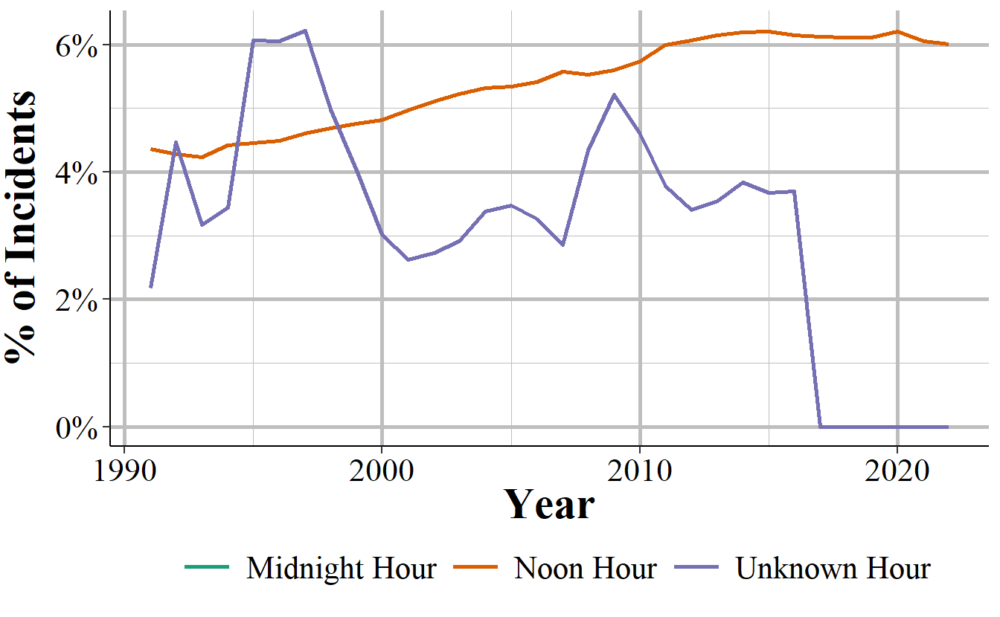
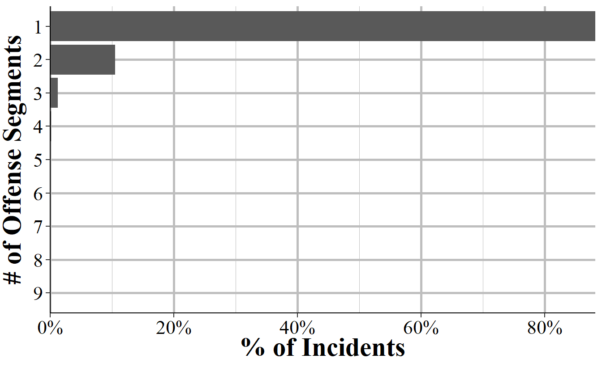
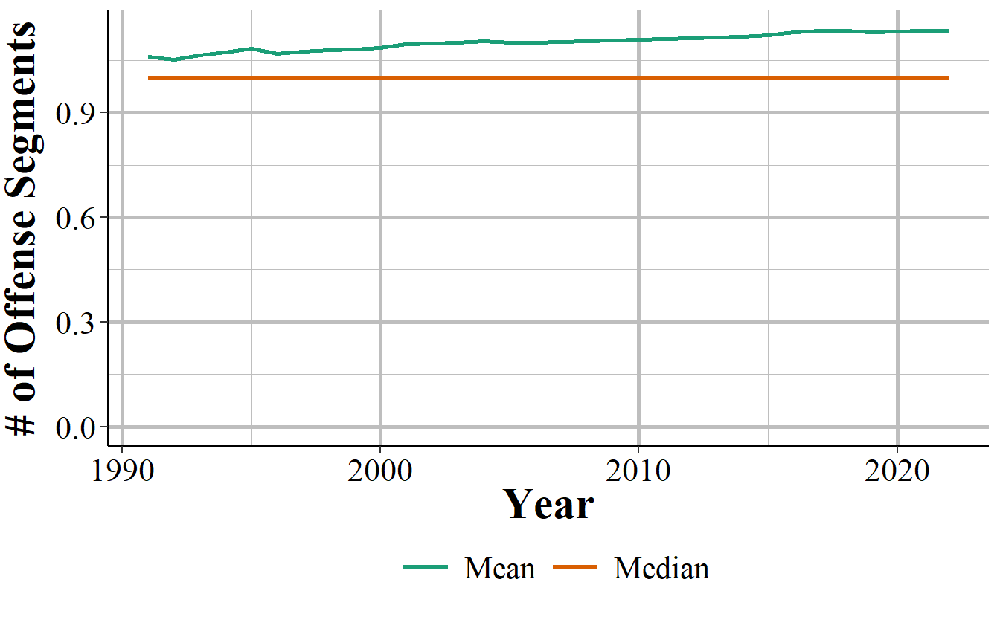
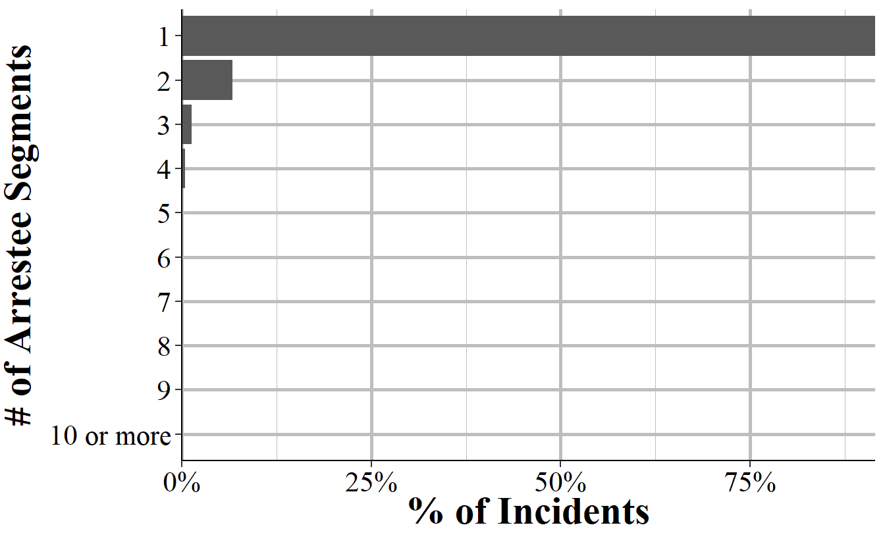
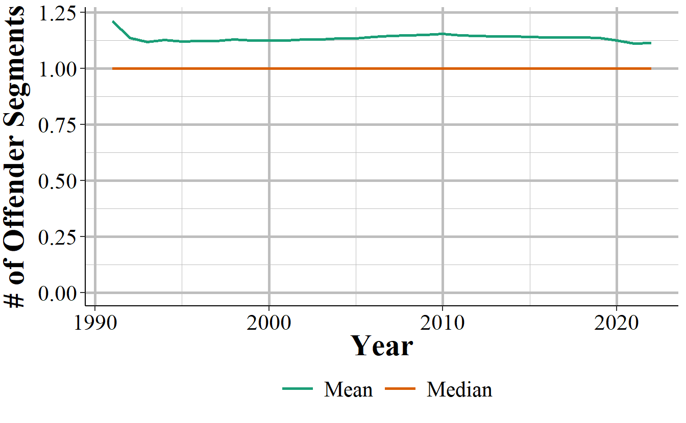
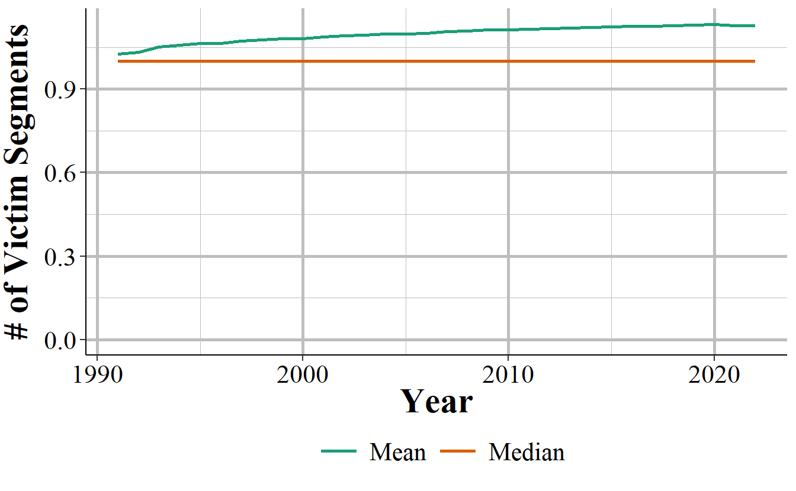
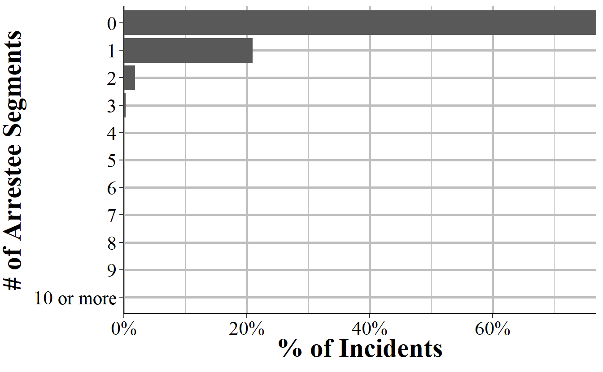
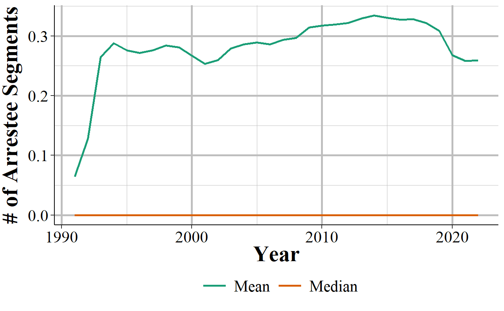

# Administrative Segment 

The Administrative Segment provides information about the incident itself, such as how many victims or offenders there were. In practice this means that it tells us how many other segments - Offense, Offender, Victim, and Arrestee Segments - there are for this particular incident. It also has several important variables at the incident-level such as what hour of the day the incident occurred and whether the "incident date" variable refers to the date the incident occurred or the date it was reported to the police. Finally, it tells us whether the case was cleared exceptionally and, if so, what type of exceptional clearance it was. An exceptional clearance is one where the police can declare the case closed but without making an arrest. This can tell us, for example, how many crimes were cleared because the offender died or the victim refused to cooperate. In comparison, the Offenses Known and Clearances by Arrest data that is part of the SRS and is detailed in Chapter \@ref(offensesKnown), tells us how many offenses were cleared by either arrest or exceptional clearance, but does not differentiate between the two. NIBRS, therefore, provides a deeper understanding of case outcomes. 

## The incident and report date

An important variable, especially for policy analyses, is when the crime happened. NIBRS tells you both the date and the hour of the day for when the crime occurred. We will start with the date. We can convert the date a few different ways, such as daily, weekly, monthly, quarterly. We could use this precise date to do regression discontinuity studies where we look at days just before and just after some policy change or natural experiment. In this chapter we will look simply at the percent of crimes each month and each day of the month (overall, not within each month). And we will look at all incidents; if you want to see the distribution for certain offenses or victim/offender groups you will need to merge this segment with one of the other segments. 

Figure \@ref(fig:administrativeIncidentMonth) shows the percent of incidents in the 2022 for each month. Past research has found that crimes are lowest when it is cold and highest when it is hot^[Summer also comes with many teens and young adults out of school so have more free time to offend or be victimized, so the weather is only part of the cause.]. Consistent with previous research, we find that crime rates are lowest in February, steadily increasing through the warmer months before peaking in July and August, then decreasing as temperatures cool. These seasonal patterns are important in understanding how environmental factors, such as weather, influence criminal activity, and they can help law enforcement agencies plan how many officers they want on patrol since they can determine which times of the year have the highest expected crime.

(\#fig:administrativeIncidentMonth)The percent of crime incidents in 2022 NIBRS by the month of incident.

We can also look at the days of the month to see if there is any variation there. Figure \@ref(fig:administrativeMonthDayIncident) shows the percent of incidents on each day of the month. There's not much variation other than a few days. The 29th and 30th day of the month have fewer incidents than average, and the 31st day has by far the fewest incidents These findings are reasonable since not all months have more than 28 days so by definition there are fewer 31st (and 29th, and 30th) days of the month for crimes to occur on. 

The most common day of the month is the 1st which accounts for 3.95% of all incidents. In this data the agencies must report a date, even if they do not know the exact date; there is no option to put "unknown date". When agencies are unsure of the exact date of a crime, they appear to default to entering the 1st of the month as a placeholder. This practice introduces a potential source of error, and researchers should be cautious when analyzing trends that rely on specific dates, as the 1st of the month may disproportionately represent incidents with unknown dates.

(\#fig:administrativeMonthDayIncident)The percent of incidents that occur using the day of the incident, even if the incidents was not reported that day, each day of the month for all agencies reporting to NIBRS in 2022.

The above graph showed the days of the month where the incident was said to occur. There is also a variable that says if the date included was the incident date or the date the crime was reported to the police. Figure \@ref(fig:administrativeMonthDayReport) replicates Figure \@ref(fig:administrativeMonthDayIncident) but now shows only report dates rather than incident date. Here too we see the same pattern of the 1st of the month having a disproportionate share of data, again suggesting that it is a placeholder for "unknown" dates.

(\#fig:administrativeMonthDayReport)The percent of incidents that are reported (the day of the report, even if not the day of the incident) each day of the month for all agencies reporting to NIBRS in 2022.

## Hour of incident

Understanding the exact time of day when crimes occur is crucial for developing effective anti-crime strategies. For example, if crime spikes consistently at the end of the local high school day, this may indicate that students are involved in these incidents, either as victims or offenders. Law enforcement agencies can use this information to adjust patrol schedules and allocate resources more effectively to areas and times with higher crime rates. Luckily, NIBRS data does have the time of each incident, though it is only at the hour level.

Figure \@ref(fig:administrativeHours) shows the distribution of incidents that occurred in the 2022 for each hour of the day. There are two key trends in this figure. First, past research has found that crime tends to increase during the night (this is especially true during weekends), drop to a daily low in the couple of hours before sunrise, and then slowly increase as the day progresses.^[In all of the nighttime police ride-alongs I have been on the police tend to stop patrolling in early morning (e.g. 3-4am) and go back to the station to do paperwork. I think this likely partially explains the findings that crime is lowest around 4-5am.] What we find here is a little different. Crime peaks at night at 5-5:59pm which is far earlier than other estimates. Since this is all crimes it could be biased by large increases of certain crimes at this time, such as people coming home from work and finding their house burgled. As crimes differ in their timing (e.g. burglary happens often during the day, fights are more common at night), you will need to merge this segment with the Offense Segment to be able to look at certain types of crimes alone.

The substantial spike at midnight is unlikely to reflect actual crime patterns, as the number of incidents during this hour is more than triple that of neighboring hours. The noon hour is about 50% larger than in the neighboring hours, so is a sizable increase though continues the trend of increasing crime during the day and is a far smaller increase than at midnight. This suggests that, similar to the "1st of the month" issue, officers may be using midnight and (less so) noon as a placeholder when the exact time of the crime is unknown. Researchers should exclude the midnight and noon hours from time-sensitive analyses to avoid skewed results.

(\#fig:administrativeHours)The percent of crimes that are reported each hour for all agencies reporting to NIBRS in 2022.

To look at these trends over time, Figure \@ref(fig:nibrsAdministrativeHours) shows the percent of incidents each year that are reported at noon, at midnight, and where the hour is unknown. The noon hour has slowly and steadily become more common, moving from about 4% in 1991 to 6% in 2022. The midnight hour has seen more fluctuations, increasing to 9% by 1993 before steadily decreasing until a large and sustained spike to 9% in 2017. The spike was caused by the end of data being reported as having an unknown hour. While the share of incidents with an unknown hour has also fluctuated - from around 2.5% to 5% of incidents depending on the year - that dropped to 0% in 2017, as unknown hours stopped being reported after 2016.

(\#fig:nibrsAdministrativeHours)Annual percent of incidents that occurred at midnight, noon, and at an unknown time, 1991-2023.

Another way to visualize this is to see what hour is most and least common for every year we have data, as shown in Table \@ref(tab:nibrsAdministrativeCommonHours). Results are strikingly similar for the entire time period we have NIBRS. In every year except for 1991 the most common hour is midnight, and in every year the least common is 5am. When excluding midnight the most common hours are are the end of the work day at 5PM-5:59PM and 6PM-6:59PM, or at noon. 

NIBRS data is available since 1991, and the number of agencies reporting has grown each year. This is also a time period which has seen considerable changes in crimes, an increase in the 1990s followed by a sustained decrease since then until a (now seemingly temporary) spike starting in 2020. Yet throughout all these changes the most and least common hours remain very consistent, suggesting that there appear to strong rules of when crime occurs regardless of other changes. Or at least strong rules in what appears in our data, as I do not believe the midnight or noon hour results are real. 

<table class="table table-striped" style="width: auto !important; margin-left: auto; margin-right: auto;">
<caption>(\#tab:nibrsAdministrativeCommonHours)The most and least common incident hours, and the most common hours excluding midnight and noon.</caption>
 <thead>
  <tr>
   <th style="text-align:left;"> Year </th>
   <th style="text-align:left;"> Most Common </th>
   <th style="text-align:right;"> Least Common </th>
   <th style="text-align:right;"> Most Common, Exclude Midnight </th>
   <th style="text-align:left;"> Most Common, Exclude Midnight/Noon </th>
  </tr>
 </thead>
<tbody>
  <tr>
   <td style="text-align:left;"> 1991 </td>
   <td style="text-align:left;"> 6PM </td>
   <td style="text-align:right;"> 5AM </td>
   <td style="text-align:right;"> 6PM </td>
   <td style="text-align:left;"> 6PM </td>
  </tr>
  <tr>
   <td style="text-align:left;"> 1992 </td>
   <td style="text-align:left;"> Midnight </td>
   <td style="text-align:right;"> 5AM </td>
   <td style="text-align:right;"> 6PM </td>
   <td style="text-align:left;"> 6PM </td>
  </tr>
  <tr>
   <td style="text-align:left;"> 1993 </td>
   <td style="text-align:left;"> Midnight </td>
   <td style="text-align:right;"> 5AM </td>
   <td style="text-align:right;"> 6PM </td>
   <td style="text-align:left;"> 6PM </td>
  </tr>
  <tr>
   <td style="text-align:left;"> 1994 </td>
   <td style="text-align:left;"> Midnight </td>
   <td style="text-align:right;"> 5AM </td>
   <td style="text-align:right;"> 6PM </td>
   <td style="text-align:left;"> 6PM </td>
  </tr>
  <tr>
   <td style="text-align:left;"> 1995 </td>
   <td style="text-align:left;"> Midnight </td>
   <td style="text-align:right;"> 5AM </td>
   <td style="text-align:right;"> 6PM </td>
   <td style="text-align:left;"> 6PM </td>
  </tr>
  <tr>
   <td style="text-align:left;"> 1996 </td>
   <td style="text-align:left;"> Midnight </td>
   <td style="text-align:right;"> 5AM </td>
   <td style="text-align:right;"> 6PM </td>
   <td style="text-align:left;"> 6PM </td>
  </tr>
  <tr>
   <td style="text-align:left;"> 1997 </td>
   <td style="text-align:left;"> Midnight </td>
   <td style="text-align:right;"> 5AM </td>
   <td style="text-align:right;"> 6PM </td>
   <td style="text-align:left;"> 6PM </td>
  </tr>
  <tr>
   <td style="text-align:left;"> 1998 </td>
   <td style="text-align:left;"> Midnight </td>
   <td style="text-align:right;"> 5AM </td>
   <td style="text-align:right;"> 6PM </td>
   <td style="text-align:left;"> 6PM </td>
  </tr>
  <tr>
   <td style="text-align:left;"> 1999 </td>
   <td style="text-align:left;"> Midnight </td>
   <td style="text-align:right;"> 5AM </td>
   <td style="text-align:right;"> 5PM </td>
   <td style="text-align:left;"> 5PM </td>
  </tr>
  <tr>
   <td style="text-align:left;"> 2000 </td>
   <td style="text-align:left;"> Midnight </td>
   <td style="text-align:right;"> 5AM </td>
   <td style="text-align:right;"> 5PM </td>
   <td style="text-align:left;"> 5PM </td>
  </tr>
  <tr>
   <td style="text-align:left;"> 2001 </td>
   <td style="text-align:left;"> Midnight </td>
   <td style="text-align:right;"> 5AM </td>
   <td style="text-align:right;"> 5PM </td>
   <td style="text-align:left;"> 5PM </td>
  </tr>
  <tr>
   <td style="text-align:left;"> 2002 </td>
   <td style="text-align:left;"> Midnight </td>
   <td style="text-align:right;"> 5AM </td>
   <td style="text-align:right;"> 5PM </td>
   <td style="text-align:left;"> 5PM </td>
  </tr>
  <tr>
   <td style="text-align:left;"> 2003 </td>
   <td style="text-align:left;"> Midnight </td>
   <td style="text-align:right;"> 5AM </td>
   <td style="text-align:right;"> 5PM </td>
   <td style="text-align:left;"> 5PM </td>
  </tr>
  <tr>
   <td style="text-align:left;"> 2004 </td>
   <td style="text-align:left;"> Midnight </td>
   <td style="text-align:right;"> 5AM </td>
   <td style="text-align:right;"> 5PM </td>
   <td style="text-align:left;"> 5PM </td>
  </tr>
  <tr>
   <td style="text-align:left;"> 2005 </td>
   <td style="text-align:left;"> Midnight </td>
   <td style="text-align:right;"> 5AM </td>
   <td style="text-align:right;"> 5PM </td>
   <td style="text-align:left;"> 5PM </td>
  </tr>
  <tr>
   <td style="text-align:left;"> 2006 </td>
   <td style="text-align:left;"> Midnight </td>
   <td style="text-align:right;"> 5AM </td>
   <td style="text-align:right;"> 5PM </td>
   <td style="text-align:left;"> 5PM </td>
  </tr>
  <tr>
   <td style="text-align:left;"> 2007 </td>
   <td style="text-align:left;"> Midnight </td>
   <td style="text-align:right;"> 5AM </td>
   <td style="text-align:right;"> 5PM </td>
   <td style="text-align:left;"> 5PM </td>
  </tr>
  <tr>
   <td style="text-align:left;"> 2008 </td>
   <td style="text-align:left;"> Midnight </td>
   <td style="text-align:right;"> 5AM </td>
   <td style="text-align:right;"> 5PM </td>
   <td style="text-align:left;"> 5PM </td>
  </tr>
  <tr>
   <td style="text-align:left;"> 2009 </td>
   <td style="text-align:left;"> Midnight </td>
   <td style="text-align:right;"> 5AM </td>
   <td style="text-align:right;"> Noon </td>
   <td style="text-align:left;"> 5PM </td>
  </tr>
  <tr>
   <td style="text-align:left;"> 2010 </td>
   <td style="text-align:left;"> Midnight </td>
   <td style="text-align:right;"> 5AM </td>
   <td style="text-align:right;"> Noon </td>
   <td style="text-align:left;"> 5PM </td>
  </tr>
  <tr>
   <td style="text-align:left;"> 2011 </td>
   <td style="text-align:left;"> Midnight </td>
   <td style="text-align:right;"> 5AM </td>
   <td style="text-align:right;"> Noon </td>
   <td style="text-align:left;"> 5PM </td>
  </tr>
  <tr>
   <td style="text-align:left;"> 2012 </td>
   <td style="text-align:left;"> Midnight </td>
   <td style="text-align:right;"> 5AM </td>
   <td style="text-align:right;"> Noon </td>
   <td style="text-align:left;"> 5PM </td>
  </tr>
  <tr>
   <td style="text-align:left;"> 2013 </td>
   <td style="text-align:left;"> Midnight </td>
   <td style="text-align:right;"> 5AM </td>
   <td style="text-align:right;"> Noon </td>
   <td style="text-align:left;"> 5PM </td>
  </tr>
  <tr>
   <td style="text-align:left;"> 2014 </td>
   <td style="text-align:left;"> Midnight </td>
   <td style="text-align:right;"> 5AM </td>
   <td style="text-align:right;"> Noon </td>
   <td style="text-align:left;"> 5PM </td>
  </tr>
  <tr>
   <td style="text-align:left;"> 2015 </td>
   <td style="text-align:left;"> Midnight </td>
   <td style="text-align:right;"> 5AM </td>
   <td style="text-align:right;"> Noon </td>
   <td style="text-align:left;"> 5PM </td>
  </tr>
  <tr>
   <td style="text-align:left;"> 2016 </td>
   <td style="text-align:left;"> Midnight </td>
   <td style="text-align:right;"> 5AM </td>
   <td style="text-align:right;"> Noon </td>
   <td style="text-align:left;"> 5PM </td>
  </tr>
  <tr>
   <td style="text-align:left;"> 2017 </td>
   <td style="text-align:left;"> Midnight </td>
   <td style="text-align:right;"> 5AM </td>
   <td style="text-align:right;"> Noon </td>
   <td style="text-align:left;"> 5PM </td>
  </tr>
  <tr>
   <td style="text-align:left;"> 2018 </td>
   <td style="text-align:left;"> Midnight </td>
   <td style="text-align:right;"> 5AM </td>
   <td style="text-align:right;"> Noon </td>
   <td style="text-align:left;"> 5PM </td>
  </tr>
  <tr>
   <td style="text-align:left;"> 2019 </td>
   <td style="text-align:left;"> Midnight </td>
   <td style="text-align:right;"> 5AM </td>
   <td style="text-align:right;"> Noon </td>
   <td style="text-align:left;"> 5PM </td>
  </tr>
  <tr>
   <td style="text-align:left;"> 2020 </td>
   <td style="text-align:left;"> Midnight </td>
   <td style="text-align:right;"> 5AM </td>
   <td style="text-align:right;"> Noon </td>
   <td style="text-align:left;"> 5PM </td>
  </tr>
  <tr>
   <td style="text-align:left;"> 2021 </td>
   <td style="text-align:left;"> Midnight </td>
   <td style="text-align:right;"> 5AM </td>
   <td style="text-align:right;"> Noon </td>
   <td style="text-align:left;"> 5PM </td>
  </tr>
  <tr>
   <td style="text-align:left;"> 2022 </td>
   <td style="text-align:left;"> Midnight </td>
   <td style="text-align:right;"> 5AM </td>
   <td style="text-align:right;"> Noon </td>
   <td style="text-align:left;"> 5PM </td>
  </tr>
  <tr>
   <td style="text-align:left;"> 2023 </td>
   <td style="text-align:left;"> Midnight </td>
   <td style="text-align:right;"> 5AM </td>
   <td style="text-align:right;"> Noon </td>
   <td style="text-align:left;"> 5PM </td>
  </tr>
</tbody>
</table>

## Exceptional clearance

When we speak of clearances we generally mean that a person was arrested for the crime.^[While a more expansive definition may include a conviction in a court for that crime (including pleading guilty), NIBRS data only extends to the arrest stage so we never know the judicial outcome of the case.] Cases may also be cleared "through exceptional means" which is also called an "exceptional clearance." Exceptional clearances, which occur in about 3% of cases, are important because they indicate that the police have identified the offender and have enough evidence to arrest them, but are unable to do so for specific reasons. Unlike standard clearances, which involve arrests, exceptional clearances may result from factors such as the offender's death, the victim's refusal to cooperate, or the prosecution's decision not to pursue the case. Basically, if they could arrest them they would but for some reason they cannot. NIBRS data tells us if the case is exceptionally cleared as well as the reason for the exceptional clearance. 

Figure \@ref(fig:administrativeExceptionalClearances) shows the breakdown of reasons why the case was cleared for these ~3 of cases that are exceptionally cleared. The most common reason, at 45% of exceptional clearances, is that the victim refused to cooperate with the police or prosecution. This can include cases where the victim reported their crime to the police and then later decide to stop assisting. The next most common reason, also at at 45% of exceptionally cleared cases, is that the prosecution decides to not prosecute the case. This excludes cases where the prosecution believes that there is not probable cause to make the arrest. Therefore it largely includes cases that the prosecution either does not believe they could win or where the agency has a policy of non-prosecution - this is likely increasingly common in jurisdiction which has "progressive prosecutors" who de facto legalize certain crimes.  

Next we have when the offender is a juvenile and the police chose to avoid arresting them due to their age, which makes up about 7% of these incidents. This generally occurs in minor offenses such as property crimes and the police do give notice to the juvenile offender's parents or guardians about the situation. If the offender is in another agency's jurisdiction (including out of the country) and the agency reporting data is unable to make an arrest, including when the agency who has the offender in their jurisdiction refuses to extradite the offender, the case can be exceptionally cleared. This occurs in 2% of exceptional clearances. In these cases we do not know any information about which jurisdiction the offender is in at the time of the exceptional clearance. Finally, if the offender dies (by any means) before the arrest they cannot be arrested so the case is exceptionally cleared. This makes up about 1% of exceptional clearances. 

The values shown in Figure \@ref(fig:administrativeExceptionalClearances) are for all incidents so can be quite different when examining subsets of the data such as by offender demographics or incident type. Doing this would require merging the Administrative Segment with another segment such as Offense or Victim. 

(\#fig:administrativeExceptionalClearances)The distribution of exceptional clearances for all exceptional clearances reported to NIBRS, 1991-2023.

In Figure \@ref(fig:nibrsAdministrativeClearance) we can see trends in the percent of incidents that involve an arrest or an exceptional clearance. Ignoring the spike in the arrest rate in the first few years of data, likely part of growing pains of any new data set, the share of incidents with an arrest is relatively steady over time, increasing until it peaks at a little under 30% of incidents in the mid-2010s and then declining since then. The share of incidents that are exceptionally cleared likewise are relatively steady but do show a slow decline over time, moving from a bit over 5% at the start of our data to about 3% by the end. These changes may simply be due to different agencies reporting over time but they are steady enough that I think the trend likely accurately reflects arrest and exceptional clearance rates in the US. 

(\#fig:nibrsAdministrativeClearance)Percent of incidents with an arrest or exceptional clearance, 1991-2023.

## Number of other segments

The "Administrative" part of this segment is that it tells us about other segments related to this incident. Here we know how many Offense, Offender, Victim, and Arrestee segments there are for the incident. In effect it says how many crimes were committed, how many offenders involved (at least the number known to police), how many victims there were, and how many people were arrested for this particular incident. This can be useful both as a check to make sure you are not missing anything when looking at the other segments and to quickly subset data, such as to only single-victim or only multiple-offender incidents. 

### Offense Segments

This variable indicates how many offense segments there are associated with this incident. Each incident can have multiple offenses, so this just says how many of these crimes there were. For example, if a person is raped and robbed then there would be two offense segments related to that incident. 

Figure \@ref(fig:administrativeOffenseSegments) shows the number of offense segments - and thus the number of crimes - associated with each incident. The vast majority of incidents only have one offense reported, making up 88% of incidents.^[In reality a person who commits a crime may be arrested or charged with many (often highly related) offenses related to a single criminal incident. So this data does report fewer incidents than you would likely find in other data sources, such as if you request data from a local police agency or district attorney's office.] This drops considerably to 10% of incidents having two offenses, 1% having three, and then under 0.15% of incidents having four through nine offenses.

(\#fig:administrativeOffenseSegments)The distribution for the number of Offender Segments per incident, for all incidents in NIBRS 2022.

This trend is consistent over time. As shown in Figure \@ref(fig:nibrsAdministrativeNumberOffense), the median number of offense segments each year is one, while the mean number is slightly over one.

(\#fig:nibrsAdministrativeNumberOffense)Annual mean and median number of Offense Segments, 1991-2023.

### Offender Segments

The Administrative Segment tells you how many offenders are involved with an incident. This is, of course, an estimate because in some incidents the police do not know how many people are involved. If, for example, someone was robbed then they can tell the police how many robbers there were. But if someone comes home to find their home burglarized then they do not know how many burglars there were. If there is no video evidence (e.g. a home security camera) and neighbors did not see anything then the police would not know how many offenders were involved in the incident. In these cases they put in a single offender and in the Offender Segment all of the information about the offender is "unknown." The remaining number of offenders are still estimates as the police may not know for sure how many offenders were involved, but this is more reliable than when there is only a single offender reported. 

With that major caveat in mind, Figure \@ref(fig:administrativeOffenderSegments) shows the distribution in how many offenders there were per incident. The vast majority of incidents have only one (or potentially an unknown number) offenders, at 91% percent of incidents. Incidents with two offenders make up only 7% of incidents while those with three make up 1% of incidents. No other number of offenders make up more than 0.5% of incidents. The data does have the exact number of offenders but I have top coded it to 10 in the graph for simplicity. There can potentially be a large number of offenders involved in an incident and in the 2022 NIBRS data the incident with the higher number of offenders had 86. However, it is exceedingly rare for there to be even more than a handful of offenders. 

(\#fig:administrativeOffenderSegments)The distribution for the number of Offender Segments per incident, for all incidents in NIBRS 2022.

As seen in Figure \@ref(fig:nibrsAdministrativeNumberOffender), in every year the median number of offenders is one and the mean number is just above one.

(\#fig:nibrsAdministrativeNumberOffender)Annual mean and median number of Offender Segments, 1991-2023.

### Victim Segments

In cases where the offense is a "victimless crime" (or at least one where there is no specific victim) such as a drug offense, the victim and the offender can be the same individual. For other cases, being a victim in an incident just means that you were the victim of at least one offense committed in the incident. 

Figure \@ref(fig:administrativeVictimSegments) shows the distribution in the number of victims per incident. Like the number of offenses and offenders, this is massively skewed to the left with 91% of incidents having a single victim. Incidents with two victims make up 8% of the data while incidents with three victims are 1%. All remaining numbers of victims are less than one third of 0.5% of the data each. The data does have the exact number of victims but I have top coded it to 10 in the graph for simplicity. The incident with the most victims in 2022 had 163 victims.  

(\#fig:administrativeVictimSegments)The distribution for the number of Victim Segments per incident, for all incidents in NIBRS 2022.

Similar to what we have seen with offenses and offenders, we can see in Figure \@ref(fig:nibrsAdministrativeNumberVictim) that the median number of victims is one and the mean number is just a bit more than one. 

(\#fig:nibrsAdministrativeNumberVictim)Annual mean and median number of Victim Segments, 1991-2023.

### Arrestee Segments

Unlike the previous segments, there may not always be an arrestee segment since not all crimes lead to an arrest. Figure \@ref(fig:administrativeArresteeSegments) shows the distribution in the number of arrestee segments per incident in the 2022 NIBRS data. Indeed, the vast majority - 77% of incidents - did not lead to a single arrest. In 21% of incidents a single person was arrested while in 2% of incidents two people were arrested. The remaining numbers of people arrested are increasingly small with fewer than 0.3% of incidents having more than three people arrested. The incident with the most arrests in 2022 led to 65 people arrested. 

(\#fig:administrativeArresteeSegments)The distribution for the number of Arrestee Segments per incident, for all incidents in NIBRS 2022.

Of course, to really understand these arrests we would need to know how many people committed the crime. Having one arrest for an incident with one offender is good, having one arrest when there are multiple offenders means some criminals are walking free. While we do not know the true number of offenders (as police may not know how many there actually were), we can use the Offender Segment count as an estimate. Figure \@ref(fig:administrativeArrestsAny) shows the percent of incidents where at least one offender was arrested and where all offenders were arrested, broken down by the number of reported offenders. 

There is wide variability in the percent of offenders arrested by the number of offenders in an incident. In cases with one offender, there was an arrest made only 22% of the time. Given that this includes incidents without a known offender, I expect the true arrest rate for incidents that actually have one offender to be higher. 

When there are two offenders, about 39% of incidents have at least one arrest and 26% of incidents have both offenders arrested. For having at least one person arrested we see a fairly steady rate of mid- to high-30% for each number of offenders. In contrast, the share of incidents where all offenders are arrested declines with each additional offender, reaching to only 9% with 10 or more offenders. 

(\#fig:administrativeArrestsAny)The percent of incidents by number of offenders where at least one offender is arrested and where all offenders are arrested.

The median number of arrestee segments over time, as shown in Figure \@ref(fig:nibrsAdministrativeNumberArrestee) is zero, with the mean number slightly higher at around 0.3.

(\#fig:nibrsAdministrativeNumberArrestee)Annual mean and median number of Arrestee Segments, 1991-2023.

In summary, the Administrative Segment provides a useful metadata for understanding what other segments are available for each incident. Although it is often necessary to combine this data with other segments to gain a full understanding of the incident, the information in the Administrative Segment - such as the timing of the crime and exceptional clearance details - offers useful insights into the broader patterns of criminal activity and law enforcement responses.
