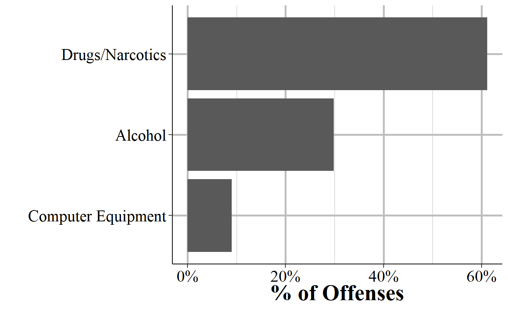

# Offense Segment {#offenseSegment}

This data set provides information about the offense that occurred, with each incident potentially having multiple offenses. Each row is an incident-offense so incidents with multiple offenses would have multiple rows. For a subset of offenses it also provides a more detailed subcategory of offense, allowing a deeper dive into what exactly happened. For example, for animal abuse there are four subcategories of offenses: simple/gross neglect of an animal, intentional abuse or torture, animal sexual abuse (bestiality), and organized fighting of animals such as dog or cock fights. 

There is also information for what date the crime occurred on, where the crime occurred - in categories such as residence or sidewalk rather than an address - whether the offender is suspected of using drugs, alcohol, or "computer equipment" (which includes cell phones) during the crime, and which weapon was involved. In cases where the weapon was a firearm it says whether that weapon was fully automatic or not. It also provides information on if the crime was a hate crime by including a variable on the bias motivation (if any) of the offender. This is based on evidence that the crime was motivated, at least in part, by the victim's group (e.g. race, sexuality, religion, etc.). There are 34 possible bias motivations and while hate crimes could potentially be motivated by bias against multiple groups, this data only allows for a single bias motivation.

As you look through this data yourself you may be surprised that some common crimes, such as DUIs and disorderly conduct, are missing. That is because some crimes, which the FBI calls "Group B" crimes, are reported only when an arrest is made and only as part of the "Group B Arrest Report" segment. Therefore, none of these offenses will be reported in the Offense Segment. We'll discuss these Group B offenses when we discuss arrestees in Chapter \@ref(arrestee). 

## Crime category

The most important variable in the Offense Segment is figuring out exactly what offense was committed. This tells you what crimes occurred in the incident. There can be multiple crimes in a single incident so this provides information about each offense that happened. To figure out which offenses belong together, just look at the incident number, year, and the ORI. Within ORI and year, each incident number is a unique identifier for an incident. Be careful that you're using all three of these variables as the incident number may be the same in different agencies, or in the same agency in different years, but these refer to different incidents.

Each crime is mutually exclusive and crimes which are elements of another crime are not double-counted. For example, robberies are basically theft plus assault/intimidation - it is the use of force (assault) or the threat of force (intimidation) to take property (theft). A case of robbery in this data would only count as robbery, not as robbery and theft and assault/intimidation. If there are these crimes together in an incident that is because that crime *also* occurred separately. For example, if someone is robbed and after the robbery is over (i.e. they hand over their belongings) they are then punched repeatedly, that could potentially be classified as a robbery and an assault. 

Table \@ref(tab:offenseCrimeCategories) shows each possible crime in the data and how common it was in 2022. It is sorted by frequency instead of alphabetically so it is easier to see which crimes are most common. There were about 13 million crimes reported to NIBRS in 2022. The most common crime is simple assault - which is an assault that did not use a weapon and did not result in serious injury - at 14% of crimes, or about 1.7 million crimes. If you think this is odd because property crimes are more common than violent crimes, you would be right. NIBRS data is pretty specific in its crime categories so it splits up certain crimes into a number of different categories. Theft is the most common crime committed in the United States. In NIBRS it is broken into several different types of theft so you need to combine them together to actually measure theft in its entirety. Of the top 6 most common crimes, theft crimes make up ranks 3, 5, and 6 (all other larceny, theft from motor vehicle, and shoplifting), and there are other theft offenses that are less common such as "theft from building" and "theft of motor vehicle parts/accessories." 

This table also shows the first year that offense is included in the data. Most offenses have been included since NIBRS started in 1991, but these have been new offenses added, with these additions becoming more common recently. For example, the crime "Failure to register as a sex offender" was added in 2021 as was "Illegal entry into the United States." There are even offenses that were not reported at all in 2022, such as "treason," which is an offense that only federal and tribal agencies are allowed to report. 

<table class="table table-striped" style="width: auto !important; margin-left: auto; margin-right: auto;">
<caption>(\#tab:offenseCrimeCategories)The number and percent of crimes reported from all agencies in 2022, by crime category.</caption>
 <thead>
  <tr>
   <th style="text-align:left;"> Crime Category </th>
   <th style="text-align:left;"> First Year </th>
   <th style="text-align:right;"> \# of Offenses </th>
   <th style="text-align:right;"> \% of Offenses </th>
  </tr>
 </thead>
<tbody>
  <tr>
   <td style="text-align:left;"> Assault Offenses - Simple Assault </td>
   <td style="text-align:left;"> 1991 </td>
   <td style="text-align:right;"> 1,935,317 </td>
   <td style="text-align:right;"> 13.83\% </td>
  </tr>
  <tr>
   <td style="text-align:left;"> Destruction/Damage/Vandalism of Property </td>
   <td style="text-align:left;"> 1991 </td>
   <td style="text-align:right;"> 1,655,619 </td>
   <td style="text-align:right;"> 11.83\% </td>
  </tr>
  <tr>
   <td style="text-align:left;"> Larceny/Theft Offenses - All Other Larceny </td>
   <td style="text-align:left;"> 1991 </td>
   <td style="text-align:right;"> 1,421,624 </td>
   <td style="text-align:right;"> 10.16\% </td>
  </tr>
  <tr>
   <td style="text-align:left;"> Drug/Narcotic Offenses - Drug/Narcotic Violations </td>
   <td style="text-align:left;"> 1991 </td>
   <td style="text-align:right;"> 1,059,452 </td>
   <td style="text-align:right;"> 7.57\% </td>
  </tr>
  <tr>
   <td style="text-align:left;"> Larceny/Theft Offenses - Shoplifting </td>
   <td style="text-align:left;"> 1991 </td>
   <td style="text-align:right;"> 966,955 </td>
   <td style="text-align:right;"> 6.91\% </td>
  </tr>
  <tr>
   <td style="text-align:left;"> Motor Vehicle Theft </td>
   <td style="text-align:left;"> 1991 </td>
   <td style="text-align:right;"> 892,984 </td>
   <td style="text-align:right;"> 6.38\% </td>
  </tr>
  <tr>
   <td style="text-align:left;"> Larceny/Theft Offenses - Theft From Motor Vehicle </td>
   <td style="text-align:left;"> 1991 </td>
   <td style="text-align:right;"> 858,529 </td>
   <td style="text-align:right;"> 6.13\% </td>
  </tr>
  <tr>
   <td style="text-align:left;"> Burglary/Breaking And Entering </td>
   <td style="text-align:left;"> 1991 </td>
   <td style="text-align:right;"> 683,034 </td>
   <td style="text-align:right;"> 4.88\% </td>
  </tr>
  <tr>
   <td style="text-align:left;"> Assault Offenses - Intimidation </td>
   <td style="text-align:left;"> 1991 </td>
   <td style="text-align:right;"> 623,972 </td>
   <td style="text-align:right;"> 4.46\% </td>
  </tr>
  <tr>
   <td style="text-align:left;"> Assault Offenses - Aggravated Assault </td>
   <td style="text-align:left;"> 1991 </td>
   <td style="text-align:right;"> 605,159 </td>
   <td style="text-align:right;"> 4.32\% </td>
  </tr>
  <tr>
   <td style="text-align:left;"> Drug/Narcotic Offenses - Drug Equipment Violations </td>
   <td style="text-align:left;"> 1991 </td>
   <td style="text-align:right;"> 486,578 </td>
   <td style="text-align:right;"> 3.48\% </td>
  </tr>
  <tr>
   <td style="text-align:left;"> Fraud Offenses - False Pretenses/Swindle/Confidence Game </td>
   <td style="text-align:left;"> 1991 </td>
   <td style="text-align:right;"> 368,675 </td>
   <td style="text-align:right;"> 2.63\% </td>
  </tr>
  <tr>
   <td style="text-align:left;"> Weapon Law Violations - Weapon Law Violations </td>
   <td style="text-align:left;"> 1991 </td>
   <td style="text-align:right;"> 355,241 </td>
   <td style="text-align:right;"> 2.54\% </td>
  </tr>
  <tr>
   <td style="text-align:left;"> Larceny/Theft Offenses - Theft From Building </td>
   <td style="text-align:left;"> 1991 </td>
   <td style="text-align:right;"> 309,847 </td>
   <td style="text-align:right;"> 2.21\% </td>
  </tr>
  <tr>
   <td style="text-align:left;"> Larceny/Theft Offenses - Theft of Motor Vehicle Parts/Accessories </td>
   <td style="text-align:left;"> 1991 </td>
   <td style="text-align:right;"> 265,516 </td>
   <td style="text-align:right;"> 1.90\% </td>
  </tr>
  <tr>
   <td style="text-align:left;"> Fraud Offenses - Identity Theft </td>
   <td style="text-align:left;"> 2015 </td>
   <td style="text-align:right;"> 206,577 </td>
   <td style="text-align:right;"> 1.48\% </td>
  </tr>
  <tr>
   <td style="text-align:left;"> Fraud Offenses - Credit Card/Atm Fraud </td>
   <td style="text-align:left;"> 1991 </td>
   <td style="text-align:right;"> 192,734 </td>
   <td style="text-align:right;"> 1.38\% </td>
  </tr>
  <tr>
   <td style="text-align:left;"> Robbery </td>
   <td style="text-align:left;"> 1991 </td>
   <td style="text-align:right;"> 179,206 </td>
   <td style="text-align:right;"> 1.28\% </td>
  </tr>
  <tr>
   <td style="text-align:left;"> Counterfeiting/Forgery </td>
   <td style="text-align:left;"> 1991 </td>
   <td style="text-align:right;"> 154,026 </td>
   <td style="text-align:right;"> 1.10\% </td>
  </tr>
  <tr>
   <td style="text-align:left;"> Stolen Property Offenses (Receiving, Selling, Etc.) </td>
   <td style="text-align:left;"> 1991 </td>
   <td style="text-align:right;"> 136,314 </td>
   <td style="text-align:right;"> 0.97\% </td>
  </tr>
  <tr>
   <td style="text-align:left;"> Sex Offenses - Fondling (Indecent Liberties/Child Molest) </td>
   <td style="text-align:left;"> 1991 </td>
   <td style="text-align:right;"> 86,034 </td>
   <td style="text-align:right;"> 0.61\% </td>
  </tr>
  <tr>
   <td style="text-align:left;"> Fraud Offenses - Impersonation </td>
   <td style="text-align:left;"> 1991 </td>
   <td style="text-align:right;"> 85,093 </td>
   <td style="text-align:right;"> 0.61\% </td>
  </tr>
  <tr>
   <td style="text-align:left;"> Sex Offenses - Rape </td>
   <td style="text-align:left;"> 1991 </td>
   <td style="text-align:right;"> 78,612 </td>
   <td style="text-align:right;"> 0.56\% </td>
  </tr>
  <tr>
   <td style="text-align:left;"> Pornography/Obscene Material </td>
   <td style="text-align:left;"> 1991 </td>
   <td style="text-align:right;"> 45,412 </td>
   <td style="text-align:right;"> 0.32\% </td>
  </tr>
  <tr>
   <td style="text-align:left;"> Kidnapping/Abduction </td>
   <td style="text-align:left;"> 1991 </td>
   <td style="text-align:right;"> 44,695 </td>
   <td style="text-align:right;"> 0.32\% </td>
  </tr>
  <tr>
   <td style="text-align:left;"> Fraud Offenses - Wire Fraud </td>
   <td style="text-align:left;"> 1991 </td>
   <td style="text-align:right;"> 43,899 </td>
   <td style="text-align:right;"> 0.31\% </td>
  </tr>
  <tr>
   <td style="text-align:left;"> Embezzlement </td>
   <td style="text-align:left;"> 1991 </td>
   <td style="text-align:right;"> 35,162 </td>
   <td style="text-align:right;"> 0.25\% </td>
  </tr>
  <tr>
   <td style="text-align:left;"> Arson </td>
   <td style="text-align:left;"> 1991 </td>
   <td style="text-align:right;"> 32,325 </td>
   <td style="text-align:right;"> 0.23\% </td>
  </tr>
  <tr>
   <td style="text-align:left;"> Extortion/Blackmail </td>
   <td style="text-align:left;"> 1991 </td>
   <td style="text-align:right;"> 27,034 </td>
   <td style="text-align:right;"> 0.19\% </td>
  </tr>
  <tr>
   <td style="text-align:left;"> Larceny/Theft Offenses - Pocket-Picking </td>
   <td style="text-align:left;"> 1991 </td>
   <td style="text-align:right;"> 26,529 </td>
   <td style="text-align:right;"> 0.19\% </td>
  </tr>
  <tr>
   <td style="text-align:left;"> Animal Cruelty </td>
   <td style="text-align:left;"> 2015 </td>
   <td style="text-align:right;"> 22,418 </td>
   <td style="text-align:right;"> 0.16\% </td>
  </tr>
  <tr>
   <td style="text-align:left;"> Sex Offenses - Sodomy </td>
   <td style="text-align:left;"> 1991 </td>
   <td style="text-align:right;"> 20,410 </td>
   <td style="text-align:right;"> 0.15\% </td>
  </tr>
  <tr>
   <td style="text-align:left;"> Murder/Nonnegligent Manslaughter </td>
   <td style="text-align:left;"> 1991 </td>
   <td style="text-align:right;"> 14,861 </td>
   <td style="text-align:right;"> 0.11\% </td>
  </tr>
  <tr>
   <td style="text-align:left;"> Larceny/Theft Offenses - Purse-Snatching </td>
   <td style="text-align:left;"> 1991 </td>
   <td style="text-align:right;"> 12,570 </td>
   <td style="text-align:right;"> 0.09\% </td>
  </tr>
  <tr>
   <td style="text-align:left;"> Prostitution Offenses - Prostitution </td>
   <td style="text-align:left;"> 1991 </td>
   <td style="text-align:right;"> 9,184 </td>
   <td style="text-align:right;"> 0.07\% </td>
  </tr>
  <tr>
   <td style="text-align:left;"> Fraud Offenses - Hacking/Computer Invasion </td>
   <td style="text-align:left;"> 2015 </td>
   <td style="text-align:right;"> 9,148 </td>
   <td style="text-align:right;"> 0.07\% </td>
  </tr>
  <tr>
   <td style="text-align:left;"> Sex Offenses - Sexual Assault With An Object </td>
   <td style="text-align:left;"> 1991 </td>
   <td style="text-align:right;"> 7,984 </td>
   <td style="text-align:right;"> 0.06\% </td>
  </tr>
  <tr>
   <td style="text-align:left;"> Sex Offenses - Statutory Rape </td>
   <td style="text-align:left;"> 1991 </td>
   <td style="text-align:right;"> 7,918 </td>
   <td style="text-align:right;"> 0.06\% </td>
  </tr>
  <tr>
   <td style="text-align:left;"> Fraud Offenses - Welfare Fraud </td>
   <td style="text-align:left;"> 1991 </td>
   <td style="text-align:right;"> 6,116 </td>
   <td style="text-align:right;"> 0.04\% </td>
  </tr>
  <tr>
   <td style="text-align:left;"> Larceny/Theft Offenses - Theft From Coin-Operated Machine Or Device </td>
   <td style="text-align:left;"> 1991 </td>
   <td style="text-align:right;"> 4,993 </td>
   <td style="text-align:right;"> 0.04\% </td>
  </tr>
  <tr>
   <td style="text-align:left;"> Prostitution Offenses - Assisting Or Promoting Prostitution </td>
   <td style="text-align:left;"> 1991 </td>
   <td style="text-align:right;"> 3,419 </td>
   <td style="text-align:right;"> 0.02\% </td>
  </tr>
  <tr>
   <td style="text-align:left;"> Prostitution Offenses - Purchasing Prostitution </td>
   <td style="text-align:left;"> 2013 </td>
   <td style="text-align:right;"> 3,076 </td>
   <td style="text-align:right;"> 0.02\% </td>
  </tr>
  <tr>
   <td style="text-align:left;"> Human Trafficking - Commercial Sex Acts </td>
   <td style="text-align:left;"> 2013 </td>
   <td style="text-align:right;"> 2,089 </td>
   <td style="text-align:right;"> 0.01\% </td>
  </tr>
  <tr>
   <td style="text-align:left;"> Negligent Manslaughter </td>
   <td style="text-align:left;"> 1991 </td>
   <td style="text-align:right;"> 1,802 </td>
   <td style="text-align:right;"> 0.01\% </td>
  </tr>
  <tr>
   <td style="text-align:left;"> Sex Offenses - Incest </td>
   <td style="text-align:left;"> 1991 </td>
   <td style="text-align:right;"> 1,147 </td>
   <td style="text-align:right;"> 0.01\% </td>
  </tr>
  <tr>
   <td style="text-align:left;"> Gambling Offenses - Operating/Promoting/Assisting Gambling </td>
   <td style="text-align:left;"> 1991 </td>
   <td style="text-align:right;"> 1,141 </td>
   <td style="text-align:right;"> 0.01\% </td>
  </tr>
  <tr>
   <td style="text-align:left;"> Gambling Offenses - Gambling Equipment Violations </td>
   <td style="text-align:left;"> 1991 </td>
   <td style="text-align:right;"> 922 </td>
   <td style="text-align:right;"> 0.01\% </td>
  </tr>
  <tr>
   <td style="text-align:left;"> Bribery </td>
   <td style="text-align:left;"> 1991 </td>
   <td style="text-align:right;"> 807 </td>
   <td style="text-align:right;"> 0.01\% </td>
  </tr>
  <tr>
   <td style="text-align:left;"> Gambling Offenses - Betting/Wagering </td>
   <td style="text-align:left;"> 1991 </td>
   <td style="text-align:right;"> 735 </td>
   <td style="text-align:right;"> 0.01\% </td>
  </tr>
  <tr>
   <td style="text-align:left;"> Justifiable Homicide - Not A Crime </td>
   <td style="text-align:left;"> 1991 </td>
   <td style="text-align:right;"> 671 </td>
   <td style="text-align:right;"> 0.00\% </td>
  </tr>
  <tr>
   <td style="text-align:left;"> Human Trafficking - Involuntary Servitude </td>
   <td style="text-align:left;"> 2014 </td>
   <td style="text-align:right;"> 495 </td>
   <td style="text-align:right;"> 0.00\% </td>
  </tr>
  <tr>
   <td style="text-align:left;"> Commerce Violations - Federal Liquor Offenses </td>
   <td style="text-align:left;"> 2020 </td>
   <td style="text-align:right;"> 110 </td>
   <td style="text-align:right;"> 0.00\% </td>
  </tr>
  <tr>
   <td style="text-align:left;"> Fugitive Offenses - Flight To Avoid Prosecution </td>
   <td style="text-align:left;"> 2021 </td>
   <td style="text-align:right;"> 109 </td>
   <td style="text-align:right;"> 0.00\% </td>
  </tr>
  <tr>
   <td style="text-align:left;"> Sex Offenses - Failure To Register As A Sex Offender </td>
   <td style="text-align:left;"> 2019 </td>
   <td style="text-align:right;"> 42 </td>
   <td style="text-align:right;"> 0.00\% </td>
  </tr>
  <tr>
   <td style="text-align:left;"> Gambling Offenses - Sports Tampering </td>
   <td style="text-align:left;"> 1994 </td>
   <td style="text-align:right;"> 7 </td>
   <td style="text-align:right;"> 0.00\% </td>
  </tr>
  <tr>
   <td style="text-align:left;"> Immigration Violations - Illegal Entry Into The United States </td>
   <td style="text-align:left;"> 2020 </td>
   <td style="text-align:right;"> 3 </td>
   <td style="text-align:right;"> 0.00\% </td>
  </tr>
  <tr>
   <td style="text-align:left;"> Commerce Violations - Wildlife Trafficking </td>
   <td style="text-align:left;"> 2023 </td>
   <td style="text-align:right;"> 2 </td>
   <td style="text-align:right;"> 0.00\% </td>
  </tr>
  <tr>
   <td style="text-align:left;"> Weapon Law Violations - Explosives </td>
   <td style="text-align:left;"> 2021 </td>
   <td style="text-align:right;"> 1 </td>
   <td style="text-align:right;"> 0.00\% </td>
  </tr>
  <tr>
   <td style="text-align:left;"> Commerce Violations - Federal Tobacco Offenses </td>
   <td style="text-align:left;"> 2021 </td>
   <td style="text-align:right;"> 1 </td>
   <td style="text-align:right;"> 0.00\% </td>
  </tr>
  <tr>
   <td style="text-align:left;"> Fraud Offenses - Money Laundering </td>
   <td style="text-align:left;"> 2022 </td>
   <td style="text-align:right;"> 1 </td>
   <td style="text-align:right;"> 0.00\% </td>
  </tr>
  <tr>
   <td style="text-align:left;"> Total </td>
   <td style="text-align:left;"> - </td>
   <td style="text-align:right;"> 13,994,336 </td>
   <td style="text-align:right;"> 100\% </td>
  </tr>
</tbody>
</table>

Though each agency is supposed to report the same crimes - using the exact same definition of the crimes so the data is consistent - that is not always true in practice. For example, animal cruelty was first reported in 2015 (before that it was not an option so agencies could not report it) and likely most agencies in the US have had at least one animal abuse crime since then. In 2015, however, reporting was concentrated in a small number of states, meaning that not all agencies reported that offense. The concentration in certain states suggests that this low reporting is due to agencies in certain states deciding (or not being able to, such as if having older reporting systems which do not have animal cruelty as an option) not to report that offense at all. Reporting has increased as time has gone on, suggesting that over time more agencies begin reporting crimes as they are added. Therefore, I strongly suggest examining your data over time and across geographic areas to see if there are any biases before using it. 

## Offense subtype

In addition to the broader crime committed, NIBRS does allow for a "subtype" of crime variable which gives us a bit more information about what crime occurred (the variable is technically called the "type of criminal activity"). This is especially useful for certain crimes where it is not clear exactly what they are referring to from the crime category alone. For example, for drug crimes we generally differentiate possession from sale or manufacturing. NIBRS combines everything into "drug/narcotic violations (crimes for drug materials such as syringes are classified as "drug equipment violations"). So we need to use the subtype variable to figure out what type of drug crime it is. Looking at the subtype we can see if the arrest is for "distributing/selling" "operating/promoting/assisting." "possessing/concealing," "transporting/transmitting/importing," or "using/consuming." There can be up to three subtypes per offense, so an arrest for a drug crime may be related to both possessing and selling drugs. 

There are also some unexpected subtypes related to certain offenses. For example, there are a few dozen drug offenses that also have the subtype of "exploiting children." This subtype is generally for cases where a child is abused, but happens here for drug offenses that do not have any associated child abuse (or for some of them, does not have any other crime at all) offense. The reason, I believe, for this category is that these offenses occurred in public so could have been viewed by children, and were labeled as exploiting children for that reason. Or, it may simply be a data entry error. If you are studying crimes against children, pulling from this variable would likely overcount crimes so - as always - you should make sure that the data you carefully check your data for odd things like this.^[Whether children viewing a crime, even a drug crime, would count as a crime against children would, of course, depend on your definition.]

This data is only available for the below subset of crimes, and is not always present even for these crimes. In Table \@ref(tab:offenseCrimeSubcategories) we show the breakdown of subtypes for each of these offenses, based on the first subtype reported. 

* Animal Cruelty
* Assault Offenses - Aggravated Assault
* Assault Offenses - Intimidation
* Assault Offenses - Simple Assault
* Commerce Violations - Federal Liquor Offenses
* Counterfeiting/Forgery
* Drug/Narcotic Offenses - Drug Equipment Violations
* Drug/Narcotic Offenses - Drug/Narcotic Violations
* Fugitive Offenses - Harboring Escapee/Concealing From Arrest
* Gambling Offenses - Gambling Equipment Violations
* Kidnapping/Abduction
* Murder/Nonnegligent Manslaughter
* Negligent Manslaughter
* Pornography/Obscene Material
* Robbery
* Sex Offenses - Fondling (Incident Liberties/Child Molest)
* Sex Offenses - Rape
* Sex Offenses - Sexual Assault With An Object
* Sex Offenses - Sodomy
* Stolen Property Offenses (Receiving, Selling, Etc.)
* Weapon Law Violations - Explosives
* Weapon Law Violations - Violation of National Firearm Act of 1934
* Weapon Law Violations - Weapon Law Violations

<table class="table table-striped" style="width: auto !important; margin-left: auto; margin-right: auto;">
<caption>(\#tab:offenseCrimeSubcategories)The number and percent of crime subtypes by offense, 2023. This breakdown is only available for a subset of offenses. There can be up to three subtypes per offense; in this table we only use the first subtype.</caption>
 <thead>
  <tr>
   <th style="text-align:left;"> Crime </th>
   <th style="text-align:left;"> Crime Subcategory </th>
   <th style="text-align:right;"> \# of Offenses </th>
   <th style="text-align:right;"> \% of Offenses </th>
  </tr>
 </thead>
<tbody>
  <tr>
   <td style="text-align:left;"> Animal Cruelty </td>
   <td style="text-align:left;"> Simple/Gross Neglect (Unintentionally, Intentionally, Or Knowingly Failing To Provide Food, Water, Shelter, Veterinary Care, Hoarding, Etc.) </td>
   <td style="text-align:right;"> 14,316 </td>
   <td style="text-align:right;"> 63.86\% </td>
  </tr>
  <tr>
   <td style="text-align:left;"> Animal Cruelty </td>
   <td style="text-align:left;"> Intentional Abuse And Torture (Tormenting, Mutilating, Poisoning, Or Abandonment) </td>
   <td style="text-align:right;"> 7,470 </td>
   <td style="text-align:right;"> 33.32\% </td>
  </tr>
  <tr>
   <td style="text-align:left;"> Animal Cruelty </td>
   <td style="text-align:left;"> Animal Sexual Abuse (Bestiality) </td>
   <td style="text-align:right;"> 368 </td>
   <td style="text-align:right;"> 1.64\% </td>
  </tr>
  <tr>
   <td style="text-align:left;"> Animal Cruelty </td>
   <td style="text-align:left;"> Organized Abuse (Dog Fighting And Cock Fighting) </td>
   <td style="text-align:right;"> 264 </td>
   <td style="text-align:right;"> 1.18\% </td>
  </tr>
  <tr>
   <td style="text-align:left;"> Animal Cruelty </td>
   <td style="text-align:left;"> Total </td>
   <td style="text-align:right;"> 22,418 </td>
   <td style="text-align:right;"> 100\% </td>
  </tr>
  <tr>
   <td style="text-align:left;"> Assault Offenses - Aggravated Assault </td>
   <td style="text-align:left;"> None/Unknown Gang Involvement (Mutually Exclusive) </td>
   <td style="text-align:right;"> 335,384 </td>
   <td style="text-align:right;"> 55.42\% </td>
  </tr>
  <tr>
   <td style="text-align:left;"> Assault Offenses - Aggravated Assault </td>
   <td style="text-align:left;"> None </td>
   <td style="text-align:right;"> 264,605 </td>
   <td style="text-align:right;"> 43.72\% </td>
  </tr>
  <tr>
   <td style="text-align:left;"> Assault Offenses - Aggravated Assault </td>
   <td style="text-align:left;"> Other Gang </td>
   <td style="text-align:right;"> 3,843 </td>
   <td style="text-align:right;"> 0.64\% </td>
  </tr>
  <tr>
   <td style="text-align:left;"> Assault Offenses - Aggravated Assault </td>
   <td style="text-align:left;"> Juvenile Gang Involvement </td>
   <td style="text-align:right;"> 1,327 </td>
   <td style="text-align:right;"> 0.22\% </td>
  </tr>
  <tr>
   <td style="text-align:left;"> Assault Offenses - Aggravated Assault </td>
   <td style="text-align:left;"> Total </td>
   <td style="text-align:right;"> 605,159 </td>
   <td style="text-align:right;"> 100\% </td>
  </tr>
  <tr>
   <td style="text-align:left;"> Assault Offenses - Intimidation </td>
   <td style="text-align:left;"> None/Unknown Gang Involvement (Mutually Exclusive) </td>
   <td style="text-align:right;"> 397,389 </td>
   <td style="text-align:right;"> 63.69\% </td>
  </tr>
  <tr>
   <td style="text-align:left;"> Assault Offenses - Intimidation </td>
   <td style="text-align:left;"> None </td>
   <td style="text-align:right;"> 223,830 </td>
   <td style="text-align:right;"> 35.87\% </td>
  </tr>
  <tr>
   <td style="text-align:left;"> Assault Offenses - Intimidation </td>
   <td style="text-align:left;"> Other Gang </td>
   <td style="text-align:right;"> 2,002 </td>
   <td style="text-align:right;"> 0.32\% </td>
  </tr>
  <tr>
   <td style="text-align:left;"> Assault Offenses - Intimidation </td>
   <td style="text-align:left;"> Juvenile Gang Involvement </td>
   <td style="text-align:right;"> 751 </td>
   <td style="text-align:right;"> 0.12\% </td>
  </tr>
  <tr>
   <td style="text-align:left;"> Assault Offenses - Intimidation </td>
   <td style="text-align:left;"> Total </td>
   <td style="text-align:right;"> 623,972 </td>
   <td style="text-align:right;"> 100\% </td>
  </tr>
  <tr>
   <td style="text-align:left;"> Assault Offenses - Simple Assault </td>
   <td style="text-align:left;"> None/Unknown Gang Involvement (Mutually Exclusive) </td>
   <td style="text-align:right;"> 1,076,203 </td>
   <td style="text-align:right;"> 55.61\% </td>
  </tr>
  <tr>
   <td style="text-align:left;"> Assault Offenses - Simple Assault </td>
   <td style="text-align:left;"> None </td>
   <td style="text-align:right;"> 853,121 </td>
   <td style="text-align:right;"> 44.08\% </td>
  </tr>
  <tr>
   <td style="text-align:left;"> Assault Offenses - Simple Assault </td>
   <td style="text-align:left;"> Other Gang </td>
   <td style="text-align:right;"> 3,950 </td>
   <td style="text-align:right;"> 0.20\% </td>
  </tr>
  <tr>
   <td style="text-align:left;"> Assault Offenses - Simple Assault </td>
   <td style="text-align:left;"> Juvenile Gang Involvement </td>
   <td style="text-align:right;"> 2,043 </td>
   <td style="text-align:right;"> 0.11\% </td>
  </tr>
  <tr>
   <td style="text-align:left;"> Assault Offenses - Simple Assault </td>
   <td style="text-align:left;"> Total </td>
   <td style="text-align:right;"> 1,935,317 </td>
   <td style="text-align:right;"> 100\% </td>
  </tr>
  <tr>
   <td style="text-align:left;"> Commerce Violations - Federal Liquor Offenses </td>
   <td style="text-align:left;"> Using/Consuming </td>
   <td style="text-align:right;"> 97 </td>
   <td style="text-align:right;"> 88.18\% </td>
  </tr>
  <tr>
   <td style="text-align:left;"> Commerce Violations - Federal Liquor Offenses </td>
   <td style="text-align:left;"> Possessing/Concealing </td>
   <td style="text-align:right;"> 11 </td>
   <td style="text-align:right;"> 10.00\% </td>
  </tr>
  <tr>
   <td style="text-align:left;"> Commerce Violations - Federal Liquor Offenses </td>
   <td style="text-align:left;"> Distributing/Selling </td>
   <td style="text-align:right;"> 2 </td>
   <td style="text-align:right;"> 1.82\% </td>
  </tr>
  <tr>
   <td style="text-align:left;"> Commerce Violations - Federal Liquor Offenses </td>
   <td style="text-align:left;"> Total </td>
   <td style="text-align:right;"> 110 </td>
   <td style="text-align:right;"> 100\% </td>
  </tr>
  <tr>
   <td style="text-align:left;"> Counterfeiting/Forgery </td>
   <td style="text-align:left;"> Possessing/Concealing </td>
   <td style="text-align:right;"> 57,858 </td>
   <td style="text-align:right;"> 37.56\% </td>
  </tr>
  <tr>
   <td style="text-align:left;"> Counterfeiting/Forgery </td>
   <td style="text-align:left;"> Using/Consuming </td>
   <td style="text-align:right;"> 31,008 </td>
   <td style="text-align:right;"> 20.13\% </td>
  </tr>
  <tr>
   <td style="text-align:left;"> Counterfeiting/Forgery </td>
   <td style="text-align:left;"> Cultivating/Manufacturing/Publishing (I.e., Production of Any Type) </td>
   <td style="text-align:right;"> 27,638 </td>
   <td style="text-align:right;"> 17.94\% </td>
  </tr>
  <tr>
   <td style="text-align:left;"> Counterfeiting/Forgery </td>
   <td style="text-align:left;"> Buying/Receiving </td>
   <td style="text-align:right;"> 24,471 </td>
   <td style="text-align:right;"> 15.89\% </td>
  </tr>
  <tr>
   <td style="text-align:left;"> Counterfeiting/Forgery </td>
   <td style="text-align:left;"> Distributing/Selling </td>
   <td style="text-align:right;"> 6,914 </td>
   <td style="text-align:right;"> 4.49\% </td>
  </tr>
  <tr>
   <td style="text-align:left;"> Counterfeiting/Forgery </td>
   <td style="text-align:left;"> Operating/Promoting/Assisting </td>
   <td style="text-align:right;"> 3,860 </td>
   <td style="text-align:right;"> 2.51\% </td>
  </tr>
  <tr>
   <td style="text-align:left;"> Counterfeiting/Forgery </td>
   <td style="text-align:left;"> Transporting/Transmitting/Importing </td>
   <td style="text-align:right;"> 2,212 </td>
   <td style="text-align:right;"> 1.44\% </td>
  </tr>
  <tr>
   <td style="text-align:left;"> Counterfeiting/Forgery </td>
   <td style="text-align:left;"> Exploiting Children </td>
   <td style="text-align:right;"> 65 </td>
   <td style="text-align:right;"> 0.04\% </td>
  </tr>
  <tr>
   <td style="text-align:left;"> Counterfeiting/Forgery </td>
   <td style="text-align:left;"> Total </td>
   <td style="text-align:right;"> 154,026 </td>
   <td style="text-align:right;"> 100\% </td>
  </tr>
  <tr>
   <td style="text-align:left;"> Drug/Narcotic Offenses - Drug Equipment Violations </td>
   <td style="text-align:left;"> Possessing/Concealing </td>
   <td style="text-align:right;"> 429,627 </td>
   <td style="text-align:right;"> 88.30\% </td>
  </tr>
  <tr>
   <td style="text-align:left;"> Drug/Narcotic Offenses - Drug Equipment Violations </td>
   <td style="text-align:left;"> Using/Consuming </td>
   <td style="text-align:right;"> 40,911 </td>
   <td style="text-align:right;"> 8.41\% </td>
  </tr>
  <tr>
   <td style="text-align:left;"> Drug/Narcotic Offenses - Drug Equipment Violations </td>
   <td style="text-align:left;"> Distributing/Selling </td>
   <td style="text-align:right;"> 7,951 </td>
   <td style="text-align:right;"> 1.63\% </td>
  </tr>
  <tr>
   <td style="text-align:left;"> Drug/Narcotic Offenses - Drug Equipment Violations </td>
   <td style="text-align:left;"> Buying/Receiving </td>
   <td style="text-align:right;"> 4,616 </td>
   <td style="text-align:right;"> 0.95\% </td>
  </tr>
  <tr>
   <td style="text-align:left;"> Drug/Narcotic Offenses - Drug Equipment Violations </td>
   <td style="text-align:left;"> Transporting/Transmitting/Importing </td>
   <td style="text-align:right;"> 1,356 </td>
   <td style="text-align:right;"> 0.28\% </td>
  </tr>
  <tr>
   <td style="text-align:left;"> Drug/Narcotic Offenses - Drug Equipment Violations </td>
   <td style="text-align:left;"> Operating/Promoting/Assisting </td>
   <td style="text-align:right;"> 1,111 </td>
   <td style="text-align:right;"> 0.23\% </td>
  </tr>
  <tr>
   <td style="text-align:left;"> Drug/Narcotic Offenses - Drug Equipment Violations </td>
   <td style="text-align:left;"> Cultivating/Manufacturing/Publishing (I.e., Production of Any Type) </td>
   <td style="text-align:right;"> 983 </td>
   <td style="text-align:right;"> 0.20\% </td>
  </tr>
  <tr>
   <td style="text-align:left;"> Drug/Narcotic Offenses - Drug Equipment Violations </td>
   <td style="text-align:left;"> Exploiting Children </td>
   <td style="text-align:right;"> 23 </td>
   <td style="text-align:right;"> 0.00\% </td>
  </tr>
  <tr>
   <td style="text-align:left;"> Drug/Narcotic Offenses - Drug Equipment Violations </td>
   <td style="text-align:left;"> Total </td>
   <td style="text-align:right;"> 486,578 </td>
   <td style="text-align:right;"> 100\% </td>
  </tr>
  <tr>
   <td style="text-align:left;"> Drug/Narcotic Offenses - Drug/Narcotic Violations </td>
   <td style="text-align:left;"> Possessing/Concealing </td>
   <td style="text-align:right;"> 838,769 </td>
   <td style="text-align:right;"> 79.17\% </td>
  </tr>
  <tr>
   <td style="text-align:left;"> Drug/Narcotic Offenses - Drug/Narcotic Violations </td>
   <td style="text-align:left;"> Distributing/Selling </td>
   <td style="text-align:right;"> 96,581 </td>
   <td style="text-align:right;"> 9.12\% </td>
  </tr>
  <tr>
   <td style="text-align:left;"> Drug/Narcotic Offenses - Drug/Narcotic Violations </td>
   <td style="text-align:left;"> Using/Consuming </td>
   <td style="text-align:right;"> 90,430 </td>
   <td style="text-align:right;"> 8.54\% </td>
  </tr>
  <tr>
   <td style="text-align:left;"> Drug/Narcotic Offenses - Drug/Narcotic Violations </td>
   <td style="text-align:left;"> Buying/Receiving </td>
   <td style="text-align:right;"> 19,444 </td>
   <td style="text-align:right;"> 1.84\% </td>
  </tr>
  <tr>
   <td style="text-align:left;"> Drug/Narcotic Offenses - Drug/Narcotic Violations </td>
   <td style="text-align:left;"> Transporting/Transmitting/Importing </td>
   <td style="text-align:right;"> 6,409 </td>
   <td style="text-align:right;"> 0.60\% </td>
  </tr>
  <tr>
   <td style="text-align:left;"> Drug/Narcotic Offenses - Drug/Narcotic Violations </td>
   <td style="text-align:left;"> Cultivating/Manufacturing/Publishing (I.e., Production of Any Type) </td>
   <td style="text-align:right;"> 5,260 </td>
   <td style="text-align:right;"> 0.50\% </td>
  </tr>
  <tr>
   <td style="text-align:left;"> Drug/Narcotic Offenses - Drug/Narcotic Violations </td>
   <td style="text-align:left;"> Operating/Promoting/Assisting </td>
   <td style="text-align:right;"> 2,449 </td>
   <td style="text-align:right;"> 0.23\% </td>
  </tr>
  <tr>
   <td style="text-align:left;"> Drug/Narcotic Offenses - Drug/Narcotic Violations </td>
   <td style="text-align:left;"> Exploiting Children </td>
   <td style="text-align:right;"> 110 </td>
   <td style="text-align:right;"> 0.01\% </td>
  </tr>
  <tr>
   <td style="text-align:left;"> Drug/Narcotic Offenses - Drug/Narcotic Violations </td>
   <td style="text-align:left;"> Total </td>
   <td style="text-align:right;"> 1,059,452 </td>
   <td style="text-align:right;"> 100\% </td>
  </tr>
  <tr>
   <td style="text-align:left;"> Gambling Offenses - Gambling Equipment Violations </td>
   <td style="text-align:left;"> Operating/Promoting/Assisting </td>
   <td style="text-align:right;"> 425 </td>
   <td style="text-align:right;"> 46.10\% </td>
  </tr>
  <tr>
   <td style="text-align:left;"> Gambling Offenses - Gambling Equipment Violations </td>
   <td style="text-align:left;"> Possessing/Concealing </td>
   <td style="text-align:right;"> 419 </td>
   <td style="text-align:right;"> 45.44\% </td>
  </tr>
  <tr>
   <td style="text-align:left;"> Gambling Offenses - Gambling Equipment Violations </td>
   <td style="text-align:left;"> Using/Consuming </td>
   <td style="text-align:right;"> 32 </td>
   <td style="text-align:right;"> 3.47\% </td>
  </tr>
  <tr>
   <td style="text-align:left;"> Gambling Offenses - Gambling Equipment Violations </td>
   <td style="text-align:left;"> Buying/Receiving </td>
   <td style="text-align:right;"> 28 </td>
   <td style="text-align:right;"> 3.04\% </td>
  </tr>
  <tr>
   <td style="text-align:left;"> Gambling Offenses - Gambling Equipment Violations </td>
   <td style="text-align:left;"> Distributing/Selling </td>
   <td style="text-align:right;"> 9 </td>
   <td style="text-align:right;"> 0.98\% </td>
  </tr>
  <tr>
   <td style="text-align:left;"> Gambling Offenses - Gambling Equipment Violations </td>
   <td style="text-align:left;"> Cultivating/Manufacturing/Publishing (I.e., Production of Any Type) </td>
   <td style="text-align:right;"> 8 </td>
   <td style="text-align:right;"> 0.87\% </td>
  </tr>
  <tr>
   <td style="text-align:left;"> Gambling Offenses - Gambling Equipment Violations </td>
   <td style="text-align:left;"> Transporting/Transmitting/Importing </td>
   <td style="text-align:right;"> 1 </td>
   <td style="text-align:right;"> 0.11\% </td>
  </tr>
  <tr>
   <td style="text-align:left;"> Gambling Offenses - Gambling Equipment Violations </td>
   <td style="text-align:left;"> Total </td>
   <td style="text-align:right;"> 922 </td>
   <td style="text-align:right;"> 100\% </td>
  </tr>
  <tr>
   <td style="text-align:left;"> Kidnapping/Abduction </td>
   <td style="text-align:left;"> None/Unknown Gang Involvement (Mutually Exclusive) </td>
   <td style="text-align:right;"> 24,074 </td>
   <td style="text-align:right;"> 53.86\% </td>
  </tr>
  <tr>
   <td style="text-align:left;"> Kidnapping/Abduction </td>
   <td style="text-align:left;"> None </td>
   <td style="text-align:right;"> 20,397 </td>
   <td style="text-align:right;"> 45.64\% </td>
  </tr>
  <tr>
   <td style="text-align:left;"> Kidnapping/Abduction </td>
   <td style="text-align:left;"> Other Gang </td>
   <td style="text-align:right;"> 187 </td>
   <td style="text-align:right;"> 0.42\% </td>
  </tr>
  <tr>
   <td style="text-align:left;"> Kidnapping/Abduction </td>
   <td style="text-align:left;"> Juvenile Gang Involvement </td>
   <td style="text-align:right;"> 37 </td>
   <td style="text-align:right;"> 0.08\% </td>
  </tr>
  <tr>
   <td style="text-align:left;"> Kidnapping/Abduction </td>
   <td style="text-align:left;"> Total </td>
   <td style="text-align:right;"> 44,695 </td>
   <td style="text-align:right;"> 100\% </td>
  </tr>
  <tr>
   <td style="text-align:left;"> Murder/Nonnegligent Manslaughter </td>
   <td style="text-align:left;"> None/Unknown Gang Involvement (Mutually Exclusive) </td>
   <td style="text-align:right;"> 8,129 </td>
   <td style="text-align:right;"> 54.70\% </td>
  </tr>
  <tr>
   <td style="text-align:left;"> Murder/Nonnegligent Manslaughter </td>
   <td style="text-align:left;"> None </td>
   <td style="text-align:right;"> 6,420 </td>
   <td style="text-align:right;"> 43.20\% </td>
  </tr>
  <tr>
   <td style="text-align:left;"> Murder/Nonnegligent Manslaughter </td>
   <td style="text-align:left;"> Other Gang </td>
   <td style="text-align:right;"> 246 </td>
   <td style="text-align:right;"> 1.66\% </td>
  </tr>
  <tr>
   <td style="text-align:left;"> Murder/Nonnegligent Manslaughter </td>
   <td style="text-align:left;"> Juvenile Gang Involvement </td>
   <td style="text-align:right;"> 66 </td>
   <td style="text-align:right;"> 0.44\% </td>
  </tr>
  <tr>
   <td style="text-align:left;"> Murder/Nonnegligent Manslaughter </td>
   <td style="text-align:left;"> Total </td>
   <td style="text-align:right;"> 14,861 </td>
   <td style="text-align:right;"> 100\% </td>
  </tr>
  <tr>
   <td style="text-align:left;"> Negligent Manslaughter </td>
   <td style="text-align:left;"> None/Unknown Gang Involvement (Mutually Exclusive) </td>
   <td style="text-align:right;"> 967 </td>
   <td style="text-align:right;"> 53.66\% </td>
  </tr>
  <tr>
   <td style="text-align:left;"> Negligent Manslaughter </td>
   <td style="text-align:left;"> None </td>
   <td style="text-align:right;"> 827 </td>
   <td style="text-align:right;"> 45.89\% </td>
  </tr>
  <tr>
   <td style="text-align:left;"> Negligent Manslaughter </td>
   <td style="text-align:left;"> Other Gang </td>
   <td style="text-align:right;"> 6 </td>
   <td style="text-align:right;"> 0.33\% </td>
  </tr>
  <tr>
   <td style="text-align:left;"> Negligent Manslaughter </td>
   <td style="text-align:left;"> Juvenile Gang Involvement </td>
   <td style="text-align:right;"> 2 </td>
   <td style="text-align:right;"> 0.11\% </td>
  </tr>
  <tr>
   <td style="text-align:left;"> Negligent Manslaughter </td>
   <td style="text-align:left;"> Total </td>
   <td style="text-align:right;"> 1,802 </td>
   <td style="text-align:right;"> 100\% </td>
  </tr>
  <tr>
   <td style="text-align:left;"> Pornography/Obscene Material </td>
   <td style="text-align:left;"> Exploiting Children </td>
   <td style="text-align:right;"> 14,059 </td>
   <td style="text-align:right;"> 30.96\% </td>
  </tr>
  <tr>
   <td style="text-align:left;"> Pornography/Obscene Material </td>
   <td style="text-align:left;"> Possessing/Concealing </td>
   <td style="text-align:right;"> 12,448 </td>
   <td style="text-align:right;"> 27.41\% </td>
  </tr>
  <tr>
   <td style="text-align:left;"> Pornography/Obscene Material </td>
   <td style="text-align:left;"> Distributing/Selling </td>
   <td style="text-align:right;"> 10,479 </td>
   <td style="text-align:right;"> 23.08\% </td>
  </tr>
  <tr>
   <td style="text-align:left;"> Pornography/Obscene Material </td>
   <td style="text-align:left;"> Cultivating/Manufacturing/Publishing (I.e., Production of Any Type) </td>
   <td style="text-align:right;"> 3,564 </td>
   <td style="text-align:right;"> 7.85\% </td>
  </tr>
  <tr>
   <td style="text-align:left;"> Pornography/Obscene Material </td>
   <td style="text-align:left;"> Transporting/Transmitting/Importing </td>
   <td style="text-align:right;"> 1,864 </td>
   <td style="text-align:right;"> 4.10\% </td>
  </tr>
  <tr>
   <td style="text-align:left;"> Pornography/Obscene Material </td>
   <td style="text-align:left;"> Operating/Promoting/Assisting </td>
   <td style="text-align:right;"> 1,145 </td>
   <td style="text-align:right;"> 2.52\% </td>
  </tr>
  <tr>
   <td style="text-align:left;"> Pornography/Obscene Material </td>
   <td style="text-align:left;"> Buying/Receiving </td>
   <td style="text-align:right;"> 1,029 </td>
   <td style="text-align:right;"> 2.27\% </td>
  </tr>
  <tr>
   <td style="text-align:left;"> Pornography/Obscene Material </td>
   <td style="text-align:left;"> Using/Consuming </td>
   <td style="text-align:right;"> 824 </td>
   <td style="text-align:right;"> 1.81\% </td>
  </tr>
  <tr>
   <td style="text-align:left;"> Pornography/Obscene Material </td>
   <td style="text-align:left;"> Total </td>
   <td style="text-align:right;"> 45,412 </td>
   <td style="text-align:right;"> 100\% </td>
  </tr>
  <tr>
   <td style="text-align:left;"> Robbery </td>
   <td style="text-align:left;"> None/Unknown Gang Involvement (Mutually Exclusive) </td>
   <td style="text-align:right;"> 109,362 </td>
   <td style="text-align:right;"> 61.03\% </td>
  </tr>
  <tr>
   <td style="text-align:left;"> Robbery </td>
   <td style="text-align:left;"> None </td>
   <td style="text-align:right;"> 68,107 </td>
   <td style="text-align:right;"> 38.00\% </td>
  </tr>
  <tr>
   <td style="text-align:left;"> Robbery </td>
   <td style="text-align:left;"> Other Gang </td>
   <td style="text-align:right;"> 1,093 </td>
   <td style="text-align:right;"> 0.61\% </td>
  </tr>
  <tr>
   <td style="text-align:left;"> Robbery </td>
   <td style="text-align:left;"> Juvenile Gang Involvement </td>
   <td style="text-align:right;"> 644 </td>
   <td style="text-align:right;"> 0.36\% </td>
  </tr>
  <tr>
   <td style="text-align:left;"> Robbery </td>
   <td style="text-align:left;"> Total </td>
   <td style="text-align:right;"> 179,206 </td>
   <td style="text-align:right;"> 100\% </td>
  </tr>
  <tr>
   <td style="text-align:left;"> Sex Offenses - Fondling (Indecent Liberties/Child Molest) </td>
   <td style="text-align:left;"> None/Unknown Gang Involvement (Mutually Exclusive) </td>
   <td style="text-align:right;"> 44,827 </td>
   <td style="text-align:right;"> 52.10\% </td>
  </tr>
  <tr>
   <td style="text-align:left;"> Sex Offenses - Fondling (Indecent Liberties/Child Molest) </td>
   <td style="text-align:left;"> None </td>
   <td style="text-align:right;"> 41,010 </td>
   <td style="text-align:right;"> 47.67\% </td>
  </tr>
  <tr>
   <td style="text-align:left;"> Sex Offenses - Fondling (Indecent Liberties/Child Molest) </td>
   <td style="text-align:left;"> Other Gang </td>
   <td style="text-align:right;"> 102 </td>
   <td style="text-align:right;"> 0.12\% </td>
  </tr>
  <tr>
   <td style="text-align:left;"> Sex Offenses - Fondling (Indecent Liberties/Child Molest) </td>
   <td style="text-align:left;"> Juvenile Gang Involvement </td>
   <td style="text-align:right;"> 95 </td>
   <td style="text-align:right;"> 0.11\% </td>
  </tr>
  <tr>
   <td style="text-align:left;"> Sex Offenses - Fondling (Indecent Liberties/Child Molest) </td>
   <td style="text-align:left;"> Total </td>
   <td style="text-align:right;"> 86,034 </td>
   <td style="text-align:right;"> 100\% </td>
  </tr>
  <tr>
   <td style="text-align:left;"> Sex Offenses - Rape </td>
   <td style="text-align:left;"> None/Unknown Gang Involvement (Mutually Exclusive) </td>
   <td style="text-align:right;"> 41,327 </td>
   <td style="text-align:right;"> 52.57\% </td>
  </tr>
  <tr>
   <td style="text-align:left;"> Sex Offenses - Rape </td>
   <td style="text-align:left;"> None </td>
   <td style="text-align:right;"> 37,050 </td>
   <td style="text-align:right;"> 47.13\% </td>
  </tr>
  <tr>
   <td style="text-align:left;"> Sex Offenses - Rape </td>
   <td style="text-align:left;"> Other Gang </td>
   <td style="text-align:right;"> 176 </td>
   <td style="text-align:right;"> 0.22\% </td>
  </tr>
  <tr>
   <td style="text-align:left;"> Sex Offenses - Rape </td>
   <td style="text-align:left;"> Juvenile Gang Involvement </td>
   <td style="text-align:right;"> 59 </td>
   <td style="text-align:right;"> 0.08\% </td>
  </tr>
  <tr>
   <td style="text-align:left;"> Sex Offenses - Rape </td>
   <td style="text-align:left;"> Total </td>
   <td style="text-align:right;"> 78,612 </td>
   <td style="text-align:right;"> 100\% </td>
  </tr>
  <tr>
   <td style="text-align:left;"> Sex Offenses - Sexual Assault With An Object </td>
   <td style="text-align:left;"> None </td>
   <td style="text-align:right;"> 4,261 </td>
   <td style="text-align:right;"> 53.37\% </td>
  </tr>
  <tr>
   <td style="text-align:left;"> Sex Offenses - Sexual Assault With An Object </td>
   <td style="text-align:left;"> None/Unknown Gang Involvement (Mutually Exclusive) </td>
   <td style="text-align:right;"> 3,708 </td>
   <td style="text-align:right;"> 46.44\% </td>
  </tr>
  <tr>
   <td style="text-align:left;"> Sex Offenses - Sexual Assault With An Object </td>
   <td style="text-align:left;"> Juvenile Gang Involvement </td>
   <td style="text-align:right;"> 9 </td>
   <td style="text-align:right;"> 0.11\% </td>
  </tr>
  <tr>
   <td style="text-align:left;"> Sex Offenses - Sexual Assault With An Object </td>
   <td style="text-align:left;"> Other Gang </td>
   <td style="text-align:right;"> 6 </td>
   <td style="text-align:right;"> 0.08\% </td>
  </tr>
  <tr>
   <td style="text-align:left;"> Sex Offenses - Sexual Assault With An Object </td>
   <td style="text-align:left;"> Total </td>
   <td style="text-align:right;"> 7,984 </td>
   <td style="text-align:right;"> 100\% </td>
  </tr>
  <tr>
   <td style="text-align:left;"> Sex Offenses - Sodomy </td>
   <td style="text-align:left;"> None/Unknown Gang Involvement (Mutually Exclusive) </td>
   <td style="text-align:right;"> 11,074 </td>
   <td style="text-align:right;"> 54.26\% </td>
  </tr>
  <tr>
   <td style="text-align:left;"> Sex Offenses - Sodomy </td>
   <td style="text-align:left;"> None </td>
   <td style="text-align:right;"> 9,285 </td>
   <td style="text-align:right;"> 45.49\% </td>
  </tr>
  <tr>
   <td style="text-align:left;"> Sex Offenses - Sodomy </td>
   <td style="text-align:left;"> Other Gang </td>
   <td style="text-align:right;"> 30 </td>
   <td style="text-align:right;"> 0.15\% </td>
  </tr>
  <tr>
   <td style="text-align:left;"> Sex Offenses - Sodomy </td>
   <td style="text-align:left;"> Juvenile Gang Involvement </td>
   <td style="text-align:right;"> 21 </td>
   <td style="text-align:right;"> 0.10\% </td>
  </tr>
  <tr>
   <td style="text-align:left;"> Sex Offenses - Sodomy </td>
   <td style="text-align:left;"> Total </td>
   <td style="text-align:right;"> 20,410 </td>
   <td style="text-align:right;"> 100\% </td>
  </tr>
  <tr>
   <td style="text-align:left;"> Stolen Property Offenses (Receiving, Selling, Etc.) </td>
   <td style="text-align:left;"> Possessing/Concealing </td>
   <td style="text-align:right;"> 107,218 </td>
   <td style="text-align:right;"> 78.66\% </td>
  </tr>
  <tr>
   <td style="text-align:left;"> Stolen Property Offenses (Receiving, Selling, Etc.) </td>
   <td style="text-align:left;"> Buying/Receiving </td>
   <td style="text-align:right;"> 14,483 </td>
   <td style="text-align:right;"> 10.62\% </td>
  </tr>
  <tr>
   <td style="text-align:left;"> Stolen Property Offenses (Receiving, Selling, Etc.) </td>
   <td style="text-align:left;"> Operating/Promoting/Assisting </td>
   <td style="text-align:right;"> 5,759 </td>
   <td style="text-align:right;"> 4.22\% </td>
  </tr>
  <tr>
   <td style="text-align:left;"> Stolen Property Offenses (Receiving, Selling, Etc.) </td>
   <td style="text-align:left;"> Using/Consuming </td>
   <td style="text-align:right;"> 4,478 </td>
   <td style="text-align:right;"> 3.29\% </td>
  </tr>
  <tr>
   <td style="text-align:left;"> Stolen Property Offenses (Receiving, Selling, Etc.) </td>
   <td style="text-align:left;"> Transporting/Transmitting/Importing </td>
   <td style="text-align:right;"> 2,313 </td>
   <td style="text-align:right;"> 1.70\% </td>
  </tr>
  <tr>
   <td style="text-align:left;"> Stolen Property Offenses (Receiving, Selling, Etc.) </td>
   <td style="text-align:left;"> Distributing/Selling </td>
   <td style="text-align:right;"> 1,930 </td>
   <td style="text-align:right;"> 1.42\% </td>
  </tr>
  <tr>
   <td style="text-align:left;"> Stolen Property Offenses (Receiving, Selling, Etc.) </td>
   <td style="text-align:left;"> Cultivating/Manufacturing/Publishing (I.e., Production of Any Type) </td>
   <td style="text-align:right;"> 124 </td>
   <td style="text-align:right;"> 0.09\% </td>
  </tr>
  <tr>
   <td style="text-align:left;"> Stolen Property Offenses (Receiving, Selling, Etc.) </td>
   <td style="text-align:left;"> Exploiting Children </td>
   <td style="text-align:right;"> 9 </td>
   <td style="text-align:right;"> 0.01\% </td>
  </tr>
  <tr>
   <td style="text-align:left;"> Stolen Property Offenses (Receiving, Selling, Etc.) </td>
   <td style="text-align:left;"> Total </td>
   <td style="text-align:right;"> 136,314 </td>
   <td style="text-align:right;"> 100\% </td>
  </tr>
  <tr>
   <td style="text-align:left;"> Weapon Law Violations - Explosives </td>
   <td style="text-align:left;"> Possessing/Concealing </td>
   <td style="text-align:right;"> 1 </td>
   <td style="text-align:right;"> 100.00\% </td>
  </tr>
  <tr>
   <td style="text-align:left;"> Weapon Law Violations - Explosives </td>
   <td style="text-align:left;"> Total </td>
   <td style="text-align:right;"> 1 </td>
   <td style="text-align:right;"> 100\% </td>
  </tr>
  <tr>
   <td style="text-align:left;"> Weapon Law Violations - Weapon Law Violations </td>
   <td style="text-align:left;"> Possessing/Concealing </td>
   <td style="text-align:right;"> 291,967 </td>
   <td style="text-align:right;"> 82.19\% </td>
  </tr>
  <tr>
   <td style="text-align:left;"> Weapon Law Violations - Weapon Law Violations </td>
   <td style="text-align:left;"> Using/Consuming </td>
   <td style="text-align:right;"> 40,616 </td>
   <td style="text-align:right;"> 11.43\% </td>
  </tr>
  <tr>
   <td style="text-align:left;"> Weapon Law Violations - Weapon Law Violations </td>
   <td style="text-align:left;"> Operating/Promoting/Assisting </td>
   <td style="text-align:right;"> 11,727 </td>
   <td style="text-align:right;"> 3.30\% </td>
  </tr>
  <tr>
   <td style="text-align:left;"> Weapon Law Violations - Weapon Law Violations </td>
   <td style="text-align:left;"> Buying/Receiving </td>
   <td style="text-align:right;"> 4,204 </td>
   <td style="text-align:right;"> 1.18\% </td>
  </tr>
  <tr>
   <td style="text-align:left;"> Weapon Law Violations - Weapon Law Violations </td>
   <td style="text-align:left;"> Distributing/Selling </td>
   <td style="text-align:right;"> 3,092 </td>
   <td style="text-align:right;"> 0.87\% </td>
  </tr>
  <tr>
   <td style="text-align:left;"> Weapon Law Violations - Weapon Law Violations </td>
   <td style="text-align:left;"> Transporting/Transmitting/Importing </td>
   <td style="text-align:right;"> 2,672 </td>
   <td style="text-align:right;"> 0.75\% </td>
  </tr>
  <tr>
   <td style="text-align:left;"> Weapon Law Violations - Weapon Law Violations </td>
   <td style="text-align:left;"> Cultivating/Manufacturing/Publishing (I.e., Production of Any Type) </td>
   <td style="text-align:right;"> 893 </td>
   <td style="text-align:right;"> 0.25\% </td>
  </tr>
  <tr>
   <td style="text-align:left;"> Weapon Law Violations - Weapon Law Violations </td>
   <td style="text-align:left;"> Exploiting Children </td>
   <td style="text-align:right;"> 70 </td>
   <td style="text-align:right;"> 0.02\% </td>
  </tr>
  <tr>
   <td style="text-align:left;"> Weapon Law Violations - Weapon Law Violations </td>
   <td style="text-align:left;"> Total </td>
   <td style="text-align:right;"> 355,241 </td>
   <td style="text-align:right;"> 100\% </td>
  </tr>
</tbody>
</table>

## Offense completed

For each offense, this segment also tells you if the offense was completed or only attempted. Nearly all offenses reported in NIBRS are completed offenses. This is likely in part due to completed crimes being easier to detect than attempted crimes. For example, if someone breaks into your house you will likely discover that and alert the police. If someone tries to break in but fails (even something such as trying your front door to see if it is locked and then leaving because it could be considered attempted burglary) there is much less evidence so it probably does not come to the police's attention as much.

Some offenses, such as simple and aggravated assault or homicide, are only labeled as completed. This is because an attempted murder, for example, would be classified as aggravated assault. Since crimes in NIBRS are mutually exclusive, there cannot be both attempted murder and aggravated assault, so only aggravated assault is included. This does limit the data as it is important to know when an aggravated assault is done with the intent to kill the victim and when it is just to seriously harm the victim (though measuring this would likely be extremely imprecise since it requires knowing the motives of the offender).

Table \@ref(tab:offensesCompleted) shows the percent of each crime category in 2022 NIBRS data that was completed or was only attempted.

<table class="table table-striped" style="width: auto !important; margin-left: auto; margin-right: auto;">
<caption>(\#tab:offensesCompleted)The percent of crimes completed or attempted, by crime category.</caption>
 <thead>
  <tr>
   <th style="text-align:left;"> Crime Category </th>
   <th style="text-align:left;"> \% Completed </th>
   <th style="text-align:right;"> % Attempted </th>
  </tr>
 </thead>
<tbody>
  <tr>
   <td style="text-align:left;"> Drug/Narcotic Offenses - Drug Equipment Violations </td>
   <td style="text-align:left;"> 99.81 \% </td>
   <td style="text-align:right;"> 0.19 \% </td>
  </tr>
  <tr>
   <td style="text-align:left;"> Drug/Narcotic Offenses - Drug/Narcotic Violations </td>
   <td style="text-align:left;"> 99.62 \% </td>
   <td style="text-align:right;"> 0.38 \% </td>
  </tr>
  <tr>
   <td style="text-align:left;"> Destruction/Damage/Vandalism of Property </td>
   <td style="text-align:left;"> 99.37 \% </td>
   <td style="text-align:right;"> 0.63 \% </td>
  </tr>
  <tr>
   <td style="text-align:left;"> Larceny/Theft Offenses - Theft From Building </td>
   <td style="text-align:left;"> 99.31 \% </td>
   <td style="text-align:right;"> 0.69 \% </td>
  </tr>
  <tr>
   <td style="text-align:left;"> Larceny/Theft Offenses - Pocket-Picking </td>
   <td style="text-align:left;"> 98.94 \% </td>
   <td style="text-align:right;"> 1.06 \% </td>
  </tr>
  <tr>
   <td style="text-align:left;"> Weapon Law Violations - Weapon Law Violations </td>
   <td style="text-align:left;"> 98.93 \% </td>
   <td style="text-align:right;"> 1.07 \% </td>
  </tr>
  <tr>
   <td style="text-align:left;"> Embezzlement </td>
   <td style="text-align:left;"> 98.77 \% </td>
   <td style="text-align:right;"> 1.23 \% </td>
  </tr>
  <tr>
   <td style="text-align:left;"> Larceny/Theft Offenses - All Other Larceny </td>
   <td style="text-align:left;"> 98.77 \% </td>
   <td style="text-align:right;"> 1.23 \% </td>
  </tr>
  <tr>
   <td style="text-align:left;"> Larceny/Theft Offenses - Shoplifting </td>
   <td style="text-align:left;"> 98.77 \% </td>
   <td style="text-align:right;"> 1.23 \% </td>
  </tr>
  <tr>
   <td style="text-align:left;"> Stolen Property Offenses (Receiving, Selling, Etc.) </td>
   <td style="text-align:left;"> 98.69 \% </td>
   <td style="text-align:right;"> 1.31 \% </td>
  </tr>
  <tr>
   <td style="text-align:left;"> Larceny/Theft Offenses - Theft of Motor Vehicle Parts/Accessories </td>
   <td style="text-align:left;"> 98.14 \% </td>
   <td style="text-align:right;"> 1.86 \% </td>
  </tr>
  <tr>
   <td style="text-align:left;"> Larceny/Theft Offenses - Purse-Snatching </td>
   <td style="text-align:left;"> 97.82 \% </td>
   <td style="text-align:right;"> 2.18 \% </td>
  </tr>
  <tr>
   <td style="text-align:left;"> Sex Offenses - Sexual Assault With An Object </td>
   <td style="text-align:left;"> 97.63 \% </td>
   <td style="text-align:right;"> 2.37 \% </td>
  </tr>
  <tr>
   <td style="text-align:left;"> Animal Cruelty </td>
   <td style="text-align:left;"> 97.4 \% </td>
   <td style="text-align:right;"> 2.6 \% </td>
  </tr>
  <tr>
   <td style="text-align:left;"> Pornography/Obscene Material </td>
   <td style="text-align:left;"> 97.32 \% </td>
   <td style="text-align:right;"> 2.68 \% </td>
  </tr>
  <tr>
   <td style="text-align:left;"> Sex Offenses - Fondling (Indecent Liberties/Child Molest) </td>
   <td style="text-align:left;"> 97.23 \% </td>
   <td style="text-align:right;"> 2.77 \% </td>
  </tr>
  <tr>
   <td style="text-align:left;"> Sex Offenses - Incest </td>
   <td style="text-align:left;"> 97.04 \% </td>
   <td style="text-align:right;"> 2.96 \% </td>
  </tr>
  <tr>
   <td style="text-align:left;"> Sex Offenses - Statutory Rape </td>
   <td style="text-align:left;"> 96.98 \% </td>
   <td style="text-align:right;"> 3.02 \% </td>
  </tr>
  <tr>
   <td style="text-align:left;"> Sex Offenses - Sodomy </td>
   <td style="text-align:left;"> 96.56 \% </td>
   <td style="text-align:right;"> 3.44 \% </td>
  </tr>
  <tr>
   <td style="text-align:left;"> Sex Offenses - Rape </td>
   <td style="text-align:left;"> 96.48 \% </td>
   <td style="text-align:right;"> 3.52 \% </td>
  </tr>
  <tr>
   <td style="text-align:left;"> Prostitution Offenses - Assisting Or Promoting Prostitution </td>
   <td style="text-align:left;"> 95.76 \% </td>
   <td style="text-align:right;"> 4.24 \% </td>
  </tr>
  <tr>
   <td style="text-align:left;"> Counterfeiting/Forgery </td>
   <td style="text-align:left;"> 95.73 \% </td>
   <td style="text-align:right;"> 4.27 \% </td>
  </tr>
  <tr>
   <td style="text-align:left;"> Fraud Offenses - Identity Theft </td>
   <td style="text-align:left;"> 95.25 \% </td>
   <td style="text-align:right;"> 4.75 \% </td>
  </tr>
  <tr>
   <td style="text-align:left;"> Kidnapping/Abduction </td>
   <td style="text-align:left;"> 95.01 \% </td>
   <td style="text-align:right;"> 4.99 \% </td>
  </tr>
  <tr>
   <td style="text-align:left;"> Arson </td>
   <td style="text-align:left;"> 94.85 \% </td>
   <td style="text-align:right;"> 5.15 \% </td>
  </tr>
  <tr>
   <td style="text-align:left;"> Prostitution Offenses - Prostitution </td>
   <td style="text-align:left;"> 94.29 \% </td>
   <td style="text-align:right;"> 5.71 \% </td>
  </tr>
  <tr>
   <td style="text-align:left;"> Fraud Offenses - Credit Card/Atm Fraud </td>
   <td style="text-align:left;"> 93.64 \% </td>
   <td style="text-align:right;"> 6.36 \% </td>
  </tr>
  <tr>
   <td style="text-align:left;"> Burglary/Breaking And Entering </td>
   <td style="text-align:left;"> 93.39 \% </td>
   <td style="text-align:right;"> 6.61 \% </td>
  </tr>
  <tr>
   <td style="text-align:left;"> Gambling Offenses - Gambling Equipment Violations </td>
   <td style="text-align:left;"> 93.38 \% </td>
   <td style="text-align:right;"> 6.62 \% </td>
  </tr>
  <tr>
   <td style="text-align:left;"> Fraud Offenses - False Pretenses/Swindle/Confidence Game </td>
   <td style="text-align:left;"> 92.33 \% </td>
   <td style="text-align:right;"> 7.67 \% </td>
  </tr>
  <tr>
   <td style="text-align:left;"> Fraud Offenses - Wire Fraud </td>
   <td style="text-align:left;"> 92.26 \% </td>
   <td style="text-align:right;"> 7.74 \% </td>
  </tr>
  <tr>
   <td style="text-align:left;"> Fraud Offenses - Impersonation </td>
   <td style="text-align:left;"> 92.04 \% </td>
   <td style="text-align:right;"> 7.96 \% </td>
  </tr>
  <tr>
   <td style="text-align:left;"> Fraud Offenses - Welfare Fraud </td>
   <td style="text-align:left;"> 91.63 \% </td>
   <td style="text-align:right;"> 8.37 \% </td>
  </tr>
  <tr>
   <td style="text-align:left;"> Human Trafficking - Involuntary Servitude </td>
   <td style="text-align:left;"> 91.52 \% </td>
   <td style="text-align:right;"> 8.48 \% </td>
  </tr>
  <tr>
   <td style="text-align:left;"> Human Trafficking - Commercial Sex Acts </td>
   <td style="text-align:left;"> 91.38 \% </td>
   <td style="text-align:right;"> 8.62 \% </td>
  </tr>
  <tr>
   <td style="text-align:left;"> Larceny/Theft Offenses - Theft From Motor Vehicle </td>
   <td style="text-align:left;"> 91.27 \% </td>
   <td style="text-align:right;"> 8.73 \% </td>
  </tr>
  <tr>
   <td style="text-align:left;"> Larceny/Theft Offenses - Theft From Coin-Operated Machine Or Device </td>
   <td style="text-align:left;"> 91.15 \% </td>
   <td style="text-align:right;"> 8.85 \% </td>
  </tr>
  <tr>
   <td style="text-align:left;"> Prostitution Offenses - Purchasing Prostitution </td>
   <td style="text-align:left;"> 90.6 \% </td>
   <td style="text-align:right;"> 9.4 \% </td>
  </tr>
  <tr>
   <td style="text-align:left;"> Robbery </td>
   <td style="text-align:left;"> 90.2 \% </td>
   <td style="text-align:right;"> 9.8 \% </td>
  </tr>
  <tr>
   <td style="text-align:left;"> Fraud Offenses - Hacking/Computer Invasion </td>
   <td style="text-align:left;"> 89.43 \% </td>
   <td style="text-align:right;"> 10.57 \% </td>
  </tr>
  <tr>
   <td style="text-align:left;"> Gambling Offenses - Operating/Promoting/Assisting Gambling </td>
   <td style="text-align:left;"> 88.17 \% </td>
   <td style="text-align:right;"> 11.83 \% </td>
  </tr>
  <tr>
   <td style="text-align:left;"> Motor Vehicle Theft </td>
   <td style="text-align:left;"> 88.07 \% </td>
   <td style="text-align:right;"> 11.93 \% </td>
  </tr>
  <tr>
   <td style="text-align:left;"> Gambling Offenses - Betting/Wagering </td>
   <td style="text-align:left;"> 86.67 \% </td>
   <td style="text-align:right;"> 13.33 \% </td>
  </tr>
  <tr>
   <td style="text-align:left;"> Commerce Violations - Federal Liquor Offenses </td>
   <td style="text-align:left;"> 86.36 \% </td>
   <td style="text-align:right;"> 13.64 \% </td>
  </tr>
  <tr>
   <td style="text-align:left;"> Bribery </td>
   <td style="text-align:left;"> 80.67 \% </td>
   <td style="text-align:right;"> 19.33 \% </td>
  </tr>
  <tr>
   <td style="text-align:left;"> Fugitive Offenses - Flight To Avoid Prosecution </td>
   <td style="text-align:left;"> 71.56 \% </td>
   <td style="text-align:right;"> 28.44 \% </td>
  </tr>
  <tr>
   <td style="text-align:left;"> Extortion/Blackmail </td>
   <td style="text-align:left;"> 61.84 \% </td>
   <td style="text-align:right;"> 38.16 \% </td>
  </tr>
  <tr>
   <td style="text-align:left;"> Gambling Offenses - Sports Tampering </td>
   <td style="text-align:left;"> 57.14 \% </td>
   <td style="text-align:right;"> 42.86 \% </td>
  </tr>
  <tr>
   <td style="text-align:left;"> Commerce Violations - Wildlife Trafficking </td>
   <td style="text-align:left;"> 50 \% </td>
   <td style="text-align:right;"> 50 \% </td>
  </tr>
  <tr>
   <td style="text-align:left;"> Assault Offenses - Aggravated Assault </td>
   <td style="text-align:left;"> 100 \% </td>
   <td style="text-align:right;"> 0 \% </td>
  </tr>
  <tr>
   <td style="text-align:left;"> Assault Offenses - Intimidation </td>
   <td style="text-align:left;"> 100 \% </td>
   <td style="text-align:right;"> 0 \% </td>
  </tr>
  <tr>
   <td style="text-align:left;"> Assault Offenses - Simple Assault </td>
   <td style="text-align:left;"> 100 \% </td>
   <td style="text-align:right;"> 0 \% </td>
  </tr>
  <tr>
   <td style="text-align:left;"> Commerce Violations - Federal Tobacco Offenses </td>
   <td style="text-align:left;"> 100 \% </td>
   <td style="text-align:right;"> 0 \% </td>
  </tr>
  <tr>
   <td style="text-align:left;"> Immigration Violations - Illegal Entry Into The United States </td>
   <td style="text-align:left;"> 100 \% </td>
   <td style="text-align:right;"> 0 \% </td>
  </tr>
  <tr>
   <td style="text-align:left;"> Justifiable Homicide - Not A Crime </td>
   <td style="text-align:left;"> 100 \% </td>
   <td style="text-align:right;"> 0 \% </td>
  </tr>
  <tr>
   <td style="text-align:left;"> Murder/Nonnegligent Manslaughter </td>
   <td style="text-align:left;"> 100 \% </td>
   <td style="text-align:right;"> 0 \% </td>
  </tr>
  <tr>
   <td style="text-align:left;"> Negligent Manslaughter </td>
   <td style="text-align:left;"> 100 \% </td>
   <td style="text-align:right;"> 0 \% </td>
  </tr>
  <tr>
   <td style="text-align:left;"> Sex Offenses - Failure To Register As A Sex Offender </td>
   <td style="text-align:left;"> 100 \% </td>
   <td style="text-align:right;"> 0 \% </td>
  </tr>
  <tr>
   <td style="text-align:left;"> Weapon Law Violations - Explosives </td>
   <td style="text-align:left;"> 100 \% </td>
   <td style="text-align:right;"> 0 \% </td>
  </tr>
</tbody>
</table>

In Figure \@ref(fig:nibrsOffenseCompleted) we see the share of all offenses per year that are reported as completed. In every year we have data nearly all offenses were reported as being completed. 

(\#fig:nibrsOffenseCompleted)The annual percent of offenses reported as completed, 1991-2023.

## Drug, alcohol, or computer use

Intoxication, mainly by alcohol, is known to be a major correlate (and cause) of crime. Drunk people commit a lot of crime (even though most drunk people never commit crime). Drunk people are also better targets for crime so are chosen by certain offenders who want an easy victim. NIBRS tries to capture this by telling us if the offender is *suspected of using* drugs (just "drugs" as we do not know which drug was involved, though we could look in the Property Segment to see what drug [if any] was seized by the police), alcohol, or "computer equipment" which also includes cell phones. Computer equipment is more relevant for certain crimes such as fraud or pornography/obscene materials. 

For each offense there are three variables about usage of any of these so potentially the offender could have used all three. The data does not get any more specific than if the offender is *suspected of using* these items. So we do not know how intoxicated they are or what they used the computer equipment for. Just that they are suspected of using it. And suspected is key. We do not know for sure if they used it. If, for example, a victim says that their mugger was drunk, NIBRS will say they are suspected of using alcohol, even though there is no definitive proof such as a blood test or breathalyzer. Unlike some past variables like offense subtype where it applies to only a subset of crimes, this variable is available for every crime. 

Figure \@ref(fig:offenseDrugAlcoholComputer) shows the distribution is suspected usage for all offenses in 2019 NIBRS. This is just from the first suspected use variable for simplicity of the graph. The most common outcome is "Not Applicable" at 89% of offenses. Not Applicable actually just means that the offender was not suspected of using drugs, alcohol, or computer equipment. 

(\#fig:offenseDrugAlcoholComputer)The distribution of drug, alcohol, or computer use for all offenses in 2022

Figure \@ref(fig:offenseDrugAlcoholComputerAny) shows the distribution of suspected use when excluding "Not Applicable." Drug usage is the most common thing offenders are suspected of using. In about 61% of offenses where the offender is suspected of using something (of the drugs, alcohol, or "computer equipment" choices), that something is drugs. Again, we do not know what type of drug was used, only that it was not alcohol. Alcohol follows at 30% while computer equipment is only 6%. 

(\#fig:offenseDrugAlcoholComputerAny)The distribution of drug, alcohol, or computer use for offenses where there was usage of one of these items. For easier viewing of how this variable is distributed, this figure excludes all offenses where there was no drug, alcohol, or computer use or the variable was NA.

## Crime location

This data set tells us where each crime happened, giving more of a type of location rather than the precise location (e.g. coordinates) where it happened. Table \@ref(tab:offenseLocation) shows the different location types where each offense could occur, sorted by most common to least common location, and includes the first year that location was reported. Most locations were part of the data since 1991 but there have been some changes, such as adding "Cyberspace" in 2009, and splitting "school/college" to "school - college/university" and "school - elementary/secondary" in 2009. 

The most common place for a crime to occur is in someone's own home, at 38% of offenses. This makes a bit of sense as people spend a lot of time at home and certain crimes, such as burglary and domestic violence, commonly occur in the victim's home. Crimes happening on a road or alley make up the second most common location at 17% and parking lot or garage follows at 10%. The remaining locations only make up 5% or fewer of offense locations. A careful reader may realize a mistake in this table. 

Incidents can involve multiple offenses but would likely - though not always - occur in the same location. So if certain locations are more likely to have multiple offenses in that incident then we could be counting those locations more often. That may be okay, if what you're really interested in is data at the offense-level rather than the more commonly used incident-level. But it is important to be careful in making sure you are measuring the data right and presenting results clearly. 

<table class="table table-striped" style="width: auto !important; margin-left: auto; margin-right: auto;">
<caption>(\#tab:offenseLocation)The location of crimes for all offenses reported in 2022.</caption>
 <thead>
  <tr>
   <th style="text-align:left;"> Crime Location </th>
   <th style="text-align:left;"> First Year </th>
   <th style="text-align:right;"> \# of Offenses </th>
   <th style="text-align:right;"> \% of Offenses </th>
  </tr>
 </thead>
<tbody>
  <tr>
   <td style="text-align:left;"> Residence/Home </td>
   <td style="text-align:left;"> 1991 </td>
   <td style="text-align:right;"> 5,183,989 </td>
   <td style="text-align:right;"> 37.04\% </td>
  </tr>
  <tr>
   <td style="text-align:left;"> Highway/Road/Alley/Street/Sidewalk </td>
   <td style="text-align:left;"> 1991 </td>
   <td style="text-align:right;"> 2,485,451 </td>
   <td style="text-align:right;"> 17.76\% </td>
  </tr>
  <tr>
   <td style="text-align:left;"> Parking Lot/Drop Lot/Parking Garage </td>
   <td style="text-align:left;"> 1991 </td>
   <td style="text-align:right;"> 1,278,600 </td>
   <td style="text-align:right;"> 9.14\% </td>
  </tr>
  <tr>
   <td style="text-align:left;"> Other/Unknown </td>
   <td style="text-align:left;"> 1991 </td>
   <td style="text-align:right;"> 699,834 </td>
   <td style="text-align:right;"> 5.00\% </td>
  </tr>
  <tr>
   <td style="text-align:left;"> Department/Discount Store </td>
   <td style="text-align:left;"> 1991 </td>
   <td style="text-align:right;"> 591,328 </td>
   <td style="text-align:right;"> 4.23\% </td>
  </tr>
  <tr>
   <td style="text-align:left;"> Grocery/Supermarket </td>
   <td style="text-align:left;"> 1991 </td>
   <td style="text-align:right;"> 322,997 </td>
   <td style="text-align:right;"> 2.31\% </td>
  </tr>
  <tr>
   <td style="text-align:left;"> Specialty Store (Tv, Fur, Etc.) </td>
   <td style="text-align:left;"> 1991 </td>
   <td style="text-align:right;"> 320,153 </td>
   <td style="text-align:right;"> 2.29\% </td>
  </tr>
  <tr>
   <td style="text-align:left;"> Convenience Store </td>
   <td style="text-align:left;"> 1991 </td>
   <td style="text-align:right;"> 305,186 </td>
   <td style="text-align:right;"> 2.18\% </td>
  </tr>
  <tr>
   <td style="text-align:left;"> Commercial/Office Building </td>
   <td style="text-align:left;"> 1991 </td>
   <td style="text-align:right;"> 297,968 </td>
   <td style="text-align:right;"> 2.13\% </td>
  </tr>
  <tr>
   <td style="text-align:left;"> School - Elementary/Secondary </td>
   <td style="text-align:left;"> 2009 </td>
   <td style="text-align:right;"> 255,924 </td>
   <td style="text-align:right;"> 1.83\% </td>
  </tr>
  <tr>
   <td style="text-align:left;"> Restaurant </td>
   <td style="text-align:left;"> 1991 </td>
   <td style="text-align:right;"> 223,297 </td>
   <td style="text-align:right;"> 1.60\% </td>
  </tr>
  <tr>
   <td style="text-align:left;"> Hotel/Motel/Etc. </td>
   <td style="text-align:left;"> 1991 </td>
   <td style="text-align:right;"> 218,343 </td>
   <td style="text-align:right;"> 1.56\% </td>
  </tr>
  <tr>
   <td style="text-align:left;"> Service/Gas Station </td>
   <td style="text-align:left;"> 1991 </td>
   <td style="text-align:right;"> 191,290 </td>
   <td style="text-align:right;"> 1.37\% </td>
  </tr>
  <tr>
   <td style="text-align:left;"> Drug Store/Doctors Office/Hospital </td>
   <td style="text-align:left;"> 1991 </td>
   <td style="text-align:right;"> 172,748 </td>
   <td style="text-align:right;"> 1.23\% </td>
  </tr>
  <tr>
   <td style="text-align:left;"> Cyberspace </td>
   <td style="text-align:left;"> 2015 </td>
   <td style="text-align:right;"> 151,576 </td>
   <td style="text-align:right;"> 1.08\% </td>
  </tr>
  <tr>
   <td style="text-align:left;"> Bank/Savings And Loan </td>
   <td style="text-align:left;"> 1991 </td>
   <td style="text-align:right;"> 128,019 </td>
   <td style="text-align:right;"> 0.91\% </td>
  </tr>
  <tr>
   <td style="text-align:left;"> Park/Playground </td>
   <td style="text-align:left;"> 2010 </td>
   <td style="text-align:right;"> 126,604 </td>
   <td style="text-align:right;"> 0.90\% </td>
  </tr>
  <tr>
   <td style="text-align:left;"> Government/Public Building </td>
   <td style="text-align:left;"> 1991 </td>
   <td style="text-align:right;"> 95,696 </td>
   <td style="text-align:right;"> 0.68\% </td>
  </tr>
  <tr>
   <td style="text-align:left;"> Bar/Nightclub </td>
   <td style="text-align:left;"> 1991 </td>
   <td style="text-align:right;"> 93,809 </td>
   <td style="text-align:right;"> 0.67\% </td>
  </tr>
  <tr>
   <td style="text-align:left;"> Rental Storage Facility </td>
   <td style="text-align:left;"> 1991 </td>
   <td style="text-align:right;"> 82,604 </td>
   <td style="text-align:right;"> 0.59\% </td>
  </tr>
  <tr>
   <td style="text-align:left;"> Shopping Mall </td>
   <td style="text-align:left;"> 2009 </td>
   <td style="text-align:right;"> 82,576 </td>
   <td style="text-align:right;"> 0.59\% </td>
  </tr>
  <tr>
   <td style="text-align:left;"> School - College/University </td>
   <td style="text-align:left;"> 2009 </td>
   <td style="text-align:right;"> 76,897 </td>
   <td style="text-align:right;"> 0.55\% </td>
  </tr>
  <tr>
   <td style="text-align:left;"> Jail/Prison/Penitentiary/Corrections Facility </td>
   <td style="text-align:left;"> 1991 </td>
   <td style="text-align:right;"> 73,706 </td>
   <td style="text-align:right;"> 0.53\% </td>
  </tr>
  <tr>
   <td style="text-align:left;"> Construction Site </td>
   <td style="text-align:left;"> 1991 </td>
   <td style="text-align:right;"> 70,901 </td>
   <td style="text-align:right;"> 0.51\% </td>
  </tr>
  <tr>
   <td style="text-align:left;"> Air/Bus/Train Terminal </td>
   <td style="text-align:left;"> 1991 </td>
   <td style="text-align:right;"> 70,663 </td>
   <td style="text-align:right;"> 0.50\% </td>
  </tr>
  <tr>
   <td style="text-align:left;"> Field/Woods </td>
   <td style="text-align:left;"> 1991 </td>
   <td style="text-align:right;"> 55,871 </td>
   <td style="text-align:right;"> 0.40\% </td>
  </tr>
  <tr>
   <td style="text-align:left;"> Church/Synagogue/Temple/Mosque </td>
   <td style="text-align:left;"> 1991 </td>
   <td style="text-align:right;"> 41,987 </td>
   <td style="text-align:right;"> 0.30\% </td>
  </tr>
  <tr>
   <td style="text-align:left;"> Auto Dealership New/Used </td>
   <td style="text-align:left;"> 2009 </td>
   <td style="text-align:right;"> 40,016 </td>
   <td style="text-align:right;"> 0.29\% </td>
  </tr>
  <tr>
   <td style="text-align:left;"> Liquor Store </td>
   <td style="text-align:left;"> 1991 </td>
   <td style="text-align:right;"> 36,738 </td>
   <td style="text-align:right;"> 0.26\% </td>
  </tr>
  <tr>
   <td style="text-align:left;"> Gambling Facility/Casino/Race Track </td>
   <td style="text-align:left;"> 2009 </td>
   <td style="text-align:right;"> 32,447 </td>
   <td style="text-align:right;"> 0.23\% </td>
  </tr>
  <tr>
   <td style="text-align:left;"> School/College </td>
   <td style="text-align:left;"> 1991 </td>
   <td style="text-align:right;"> 28,906 </td>
   <td style="text-align:right;"> 0.21\% </td>
  </tr>
  <tr>
   <td style="text-align:left;"> Shelter - Mission/Homeless </td>
   <td style="text-align:left;"> 2010 </td>
   <td style="text-align:right;"> 23,112 </td>
   <td style="text-align:right;"> 0.17\% </td>
  </tr>
  <tr>
   <td style="text-align:left;"> Industrial Site </td>
   <td style="text-align:left;"> 2009 </td>
   <td style="text-align:right;"> 22,293 </td>
   <td style="text-align:right;"> 0.16\% </td>
  </tr>
  <tr>
   <td style="text-align:left;"> Community Center </td>
   <td style="text-align:left;"> 2012 </td>
   <td style="text-align:right;"> 16,542 </td>
   <td style="text-align:right;"> 0.12\% </td>
  </tr>
  <tr>
   <td style="text-align:left;"> Camp/Campground </td>
   <td style="text-align:left;"> 2009 </td>
   <td style="text-align:right;"> 12,038 </td>
   <td style="text-align:right;"> 0.09\% </td>
  </tr>
  <tr>
   <td style="text-align:left;"> Arena/Stadium/Fairgrounds/Coliseum </td>
   <td style="text-align:left;"> 2009 </td>
   <td style="text-align:right;"> 10,773 </td>
   <td style="text-align:right;"> 0.08\% </td>
  </tr>
  <tr>
   <td style="text-align:left;"> Lake/Waterway/Beach </td>
   <td style="text-align:left;"> 1991 </td>
   <td style="text-align:right;"> 10,345 </td>
   <td style="text-align:right;"> 0.07\% </td>
  </tr>
  <tr>
   <td style="text-align:left;"> Atm Separate From Bank </td>
   <td style="text-align:left;"> 2009 </td>
   <td style="text-align:right;"> 10,337 </td>
   <td style="text-align:right;"> 0.07\% </td>
  </tr>
  <tr>
   <td style="text-align:left;"> Abandoned/Condemned Structure </td>
   <td style="text-align:left;"> 2010 </td>
   <td style="text-align:right;"> 10,048 </td>
   <td style="text-align:right;"> 0.07\% </td>
  </tr>
  <tr>
   <td style="text-align:left;"> Farm Facility </td>
   <td style="text-align:left;"> 2009 </td>
   <td style="text-align:right;"> 9,731 </td>
   <td style="text-align:right;"> 0.07\% </td>
  </tr>
  <tr>
   <td style="text-align:left;"> Amusement Park </td>
   <td style="text-align:left;"> 2010 </td>
   <td style="text-align:right;"> 8,171 </td>
   <td style="text-align:right;"> 0.06\% </td>
  </tr>
  <tr>
   <td style="text-align:left;"> Daycare Facility </td>
   <td style="text-align:left;"> 2009 </td>
   <td style="text-align:right;"> 7,806 </td>
   <td style="text-align:right;"> 0.06\% </td>
  </tr>
  <tr>
   <td style="text-align:left;"> Dock/Wharf/Freight/Modal Terminal </td>
   <td style="text-align:left;"> 2009 </td>
   <td style="text-align:right;"> 7,189 </td>
   <td style="text-align:right;"> 0.05\% </td>
  </tr>
  <tr>
   <td style="text-align:left;"> Tribal Lands </td>
   <td style="text-align:left;"> 2011 </td>
   <td style="text-align:right;"> 5,193 </td>
   <td style="text-align:right;"> 0.04\% </td>
  </tr>
  <tr>
   <td style="text-align:left;"> Rest Area </td>
   <td style="text-align:left;"> 2009 </td>
   <td style="text-align:right;"> 3,773 </td>
   <td style="text-align:right;"> 0.03\% </td>
  </tr>
  <tr>
   <td style="text-align:left;"> Military Installation </td>
   <td style="text-align:left;"> 2010 </td>
   <td style="text-align:right;"> 861 </td>
   <td style="text-align:right;"> 0.01\% </td>
  </tr>
  <tr>
   <td style="text-align:left;"> Total </td>
   <td style="text-align:left;"> - </td>
   <td style="text-align:right;"> 13,994,336 </td>
   <td style="text-align:right;"> 100\% </td>
  </tr>
</tbody>
</table>

Keep in mind that some locations may be an overly specific location that fits well into a broader category that you are interested in. For example, if you care about crimes that happen in stores you would look at "Bank/Savings and Loan", "Restaurant", "Bar/Nightclub," among other locations, which combined have a lot more offenses than any one individually. This is a recurring theme of NIBRS data - you have a lot of data and some of it is so specific that you need to do extra work to aggregate data into units you want.

