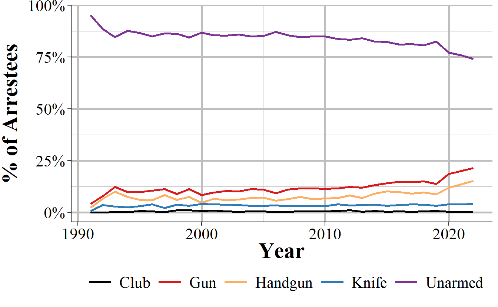

# Arrestee and Group B Arrestee {#arrestee}

The Arrestee Segment has information on the person arrested in an incident and has a number of variables that look at same as in previous segments but with subtle differences. This segment covers the arrestee's age, sex, and race, ethnicity, and residency status (of the city, not as a United States citizen). Age, sex, and race are also in the Offender Segment but can differ as not all offenders are arrested. It also says the crime the arrestee was arrested for (which in some cases is different than the crime committed in the offense since an arrest can clear multiple incidents), the weapon carried during the arrest (which may be different than the weapon used during the offense) and if this weapon (if it is a firearm) was an automatic weapon. There are a few completely new variables including the date of the arrest and the type of arrest. The type of arrest is simply whether the person was arrested by police who viewed the crime, if the arrest followed an arrest warrant or a previous arrest (i.e. arrested for a different crime and then police find out you also committed this one so they consider you arrested for this one too), and whether the person was cited by police and ordered to appear in court but not formally taken into custody. Finally, for juvenile arrestees it says whether arrestees were "handled within the department" which means they were released without formal sanctions or were "referred to other authorities" such as juvenile or criminal court, a welfare agency, or probation or parole department (for those on probation or parole). 

This chapter also covers the Group B Arrestee Segment. The Arrestee Segment covers arrests for Group A offenses and there are corresponding Offense, Offender, and Victim segments for these incidents. Group B offenses, however, only have information about the arrest so incidents in this segment do not have any corresponding segments with it. Since Group B only has arrests without any associated incident, instead of the incident number variable like other segments have, this segment has an "arrest transaction incident number" which works the same as a normal incident number. Likewise, the Window Arrestee Segment is not associated with any other segments as the "window" part means that they are only partial reports. The Window Arrestee Segment has the same variables as the normal Arrestee Segment but also has 10 variables on each of the offenses committed (up to 10 offenses) during the incident. This is really to try to provide a bit of information that you would otherwise get from the other segments but do not since this is a window segment.

It also has an "arrestee sequence number" which is an identifier for an arrestee in an incident since incidents can have multiple people arrested. This is just the number of each arrestee and to my knowledge is not associated with how involved the arrestee is. Being the 1st arrestee, for example, does not mean that individual played a greater role in the crime than the 2nd arrestee.

## Crimes arrested for

This segment tells us which offense the arrestee was arrested for. There are a couple of caveats with this data. First, there can be up to 10 crimes per incident but this segment only tells you the most serious offense (based on the agency's decision of which is most serious). This can be solved partially by merging this segment with the Offense Segment and getting all of the offenses related to the incident. It is only partially solved because the crime the person is arrested for may not necessarily be the crime involved in the incident. This is because a person can be arrested for a certain crime (e.g. shoplifting) and then the police find out that there are also responsible for a more serious crime (e.g. aggravated assault). Their arrest crime is shoplifting and they will be associated with the incident for the aggravated assault.

One interesting part of this segment is that while it is associated with Group A offenses, as someone may be arrested for a crime other than the crime in the incident, arrests can include Group B offenses. So the Group B Arrestee Segment can really be thought of as an arrest for a Group B offense where the arrestee is not associated with a previous Group A incident (other than ones that already led to an arrest since that incident would then be considered clear and the present arrest would not be associated with it). We will look first at the crimes people were arrested for in the main Arrestee Segment, which includes both Group A and Group B offenses as possible arrest crimes, and then at the Group B Arrestee Segment which only includes Group B offenses.

### Arrestee Segment arrest crimes

Table \@ref(tab:arresteeCrime) shows the number and percent of arrests for all arrests associated with a Group A crime incident. Perhaps unsurprising, drug crimes are the most common arrest making up a quarter of all arrests (30% when including drug equipment crimes). Simple assault (assault without a weapon or without seriously injuring the victim) is the next most common at 19% of arrests, and aggravated assault is the 4th most common arrest crime at 6.3% of arrests. Theft, which NIBRS breaks into a number of subcategories of theft such as shoplifting and "all other larceny" is among the most common arrest crimes, making up ranks 3 and 6 of the top 6, as well as several other subcategories later on. The remaining crimes are all relatively rare, consisting of under 5% of arrests each. This is due to how the top crimes are broad categories (e.g. drug offenses ranges from simple possession to large scale sales but is all grouped into "drug/narcotic violations" here) while other crimes are specific (e.g. purse-snatching is a very specific form of theft).  

<table class="table table-striped" style="width: auto !important; margin-left: auto; margin-right: auto;">
<caption>(\#tab:arresteeCrime)The number and percent of arrests for Group A crimes for all arrests reported to NIBRS in 2022.</caption>
 <thead>
  <tr>
   <th style="text-align:left;"> Crime Category </th>
   <th style="text-align:left;"> First Year </th>
   <th style="text-align:right;"> \# of Offenses </th>
   <th style="text-align:right;"> \% of Offenses </th>
  </tr>
 </thead>
<tbody>
  <tr>
   <td style="text-align:left;"> Assault Offenses - Simple Assault </td>
   <td style="text-align:left;"> 1991 </td>
   <td style="text-align:right;"> 728,805 </td>
   <td style="text-align:right;"> 21.64\% </td>
  </tr>
  <tr>
   <td style="text-align:left;"> Drug/Narcotic Offenses - Drug/Narcotic Violations </td>
   <td style="text-align:left;"> 1991 </td>
   <td style="text-align:right;"> 698,760 </td>
   <td style="text-align:right;"> 20.75\% </td>
  </tr>
  <tr>
   <td style="text-align:left;"> Larceny/Theft Offenses - Shoplifting </td>
   <td style="text-align:left;"> 1991 </td>
   <td style="text-align:right;"> 349,672 </td>
   <td style="text-align:right;"> 10.38\% </td>
  </tr>
  <tr>
   <td style="text-align:left;"> Assault Offenses - Aggravated Assault </td>
   <td style="text-align:left;"> 1991 </td>
   <td style="text-align:right;"> 264,141 </td>
   <td style="text-align:right;"> 7.84\% </td>
  </tr>
  <tr>
   <td style="text-align:left;"> Drug/Narcotic Offenses - Drug Equipment Violations </td>
   <td style="text-align:left;"> 1991 </td>
   <td style="text-align:right;"> 154,922 </td>
   <td style="text-align:right;"> 4.60\% </td>
  </tr>
  <tr>
   <td style="text-align:left;"> Larceny/Theft Offenses - All Other Larceny </td>
   <td style="text-align:left;"> 1991 </td>
   <td style="text-align:right;"> 142,759 </td>
   <td style="text-align:right;"> 4.24\% </td>
  </tr>
  <tr>
   <td style="text-align:left;"> Weapon Law Violations - Weapon Law Violations </td>
   <td style="text-align:left;"> 1991 </td>
   <td style="text-align:right;"> 138,286 </td>
   <td style="text-align:right;"> 4.11\% </td>
  </tr>
  <tr>
   <td style="text-align:left;"> Destruction/Damage/Vandalism of Property </td>
   <td style="text-align:left;"> 1991 </td>
   <td style="text-align:right;"> 133,395 </td>
   <td style="text-align:right;"> 3.96\% </td>
  </tr>
  <tr>
   <td style="text-align:left;"> Assault Offenses - Intimidation </td>
   <td style="text-align:left;"> 1991 </td>
   <td style="text-align:right;"> 107,256 </td>
   <td style="text-align:right;"> 3.18\% </td>
  </tr>
  <tr>
   <td style="text-align:left;"> Burglary/Breaking And Entering </td>
   <td style="text-align:left;"> 1991 </td>
   <td style="text-align:right;"> 93,699 </td>
   <td style="text-align:right;"> 2.78\% </td>
  </tr>
  <tr>
   <td style="text-align:left;"> All Other Offenses </td>
   <td style="text-align:left;"> 1991 </td>
   <td style="text-align:right;"> 83,387 </td>
   <td style="text-align:right;"> 2.48\% </td>
  </tr>
  <tr>
   <td style="text-align:left;"> Stolen Property Offenses (Receiving, Selling, Etc.) </td>
   <td style="text-align:left;"> 1991 </td>
   <td style="text-align:right;"> 64,989 </td>
   <td style="text-align:right;"> 1.93\% </td>
  </tr>
  <tr>
   <td style="text-align:left;"> Motor Vehicle Theft </td>
   <td style="text-align:left;"> 1991 </td>
   <td style="text-align:right;"> 61,858 </td>
   <td style="text-align:right;"> 1.84\% </td>
  </tr>
  <tr>
   <td style="text-align:left;"> Robbery </td>
   <td style="text-align:left;"> 1991 </td>
   <td style="text-align:right;"> 53,027 </td>
   <td style="text-align:right;"> 1.57\% </td>
  </tr>
  <tr>
   <td style="text-align:left;"> Fraud Offenses - False Pretenses/Swindle/Confidence Game </td>
   <td style="text-align:left;"> 1991 </td>
   <td style="text-align:right;"> 34,190 </td>
   <td style="text-align:right;"> 1.02\% </td>
  </tr>
  <tr>
   <td style="text-align:left;"> Counterfeiting/Forgery </td>
   <td style="text-align:left;"> 1991 </td>
   <td style="text-align:right;"> 27,967 </td>
   <td style="text-align:right;"> 0.83\% </td>
  </tr>
  <tr>
   <td style="text-align:left;"> Larceny/Theft Offenses - Theft From Motor Vehicle </td>
   <td style="text-align:left;"> 1991 </td>
   <td style="text-align:right;"> 25,802 </td>
   <td style="text-align:right;"> 0.77\% </td>
  </tr>
  <tr>
   <td style="text-align:left;"> Larceny/Theft Offenses - Theft From Building </td>
   <td style="text-align:left;"> 1991 </td>
   <td style="text-align:right;"> 20,803 </td>
   <td style="text-align:right;"> 0.62\% </td>
  </tr>
  <tr>
   <td style="text-align:left;"> Driving Under The Influence </td>
   <td style="text-align:left;"> 1991 </td>
   <td style="text-align:right;"> 16,785 </td>
   <td style="text-align:right;"> 0.50\% </td>
  </tr>
  <tr>
   <td style="text-align:left;"> Disorderly Conduct </td>
   <td style="text-align:left;"> 1991 </td>
   <td style="text-align:right;"> 15,554 </td>
   <td style="text-align:right;"> 0.46\% </td>
  </tr>
  <tr>
   <td style="text-align:left;"> Kidnapping/Abduction </td>
   <td style="text-align:left;"> 1991 </td>
   <td style="text-align:right;"> 14,768 </td>
   <td style="text-align:right;"> 0.44\% </td>
  </tr>
  <tr>
   <td style="text-align:left;"> Trespass of Real Property </td>
   <td style="text-align:left;"> 1991 </td>
   <td style="text-align:right;"> 13,618 </td>
   <td style="text-align:right;"> 0.40\% </td>
  </tr>
  <tr>
   <td style="text-align:left;"> Sex Offenses - Fondling (Indecent Liberties/Child Molest) </td>
   <td style="text-align:left;"> 1991 </td>
   <td style="text-align:right;"> 11,780 </td>
   <td style="text-align:right;"> 0.35\% </td>
  </tr>
  <tr>
   <td style="text-align:left;"> Fraud Offenses - Impersonation </td>
   <td style="text-align:left;"> 1991 </td>
   <td style="text-align:right;"> 11,388 </td>
   <td style="text-align:right;"> 0.34\% </td>
  </tr>
  <tr>
   <td style="text-align:left;"> Sex Offenses - Rape </td>
   <td style="text-align:left;"> 1991 </td>
   <td style="text-align:right;"> 9,346 </td>
   <td style="text-align:right;"> 0.28\% </td>
  </tr>
  <tr>
   <td style="text-align:left;"> Murder/Nonnegligent Manslaughter </td>
   <td style="text-align:left;"> 1991 </td>
   <td style="text-align:right;"> 8,486 </td>
   <td style="text-align:right;"> 0.25\% </td>
  </tr>
  <tr>
   <td style="text-align:left;"> Prostitution Offenses - Prostitution </td>
   <td style="text-align:left;"> 1991 </td>
   <td style="text-align:right;"> 7,994 </td>
   <td style="text-align:right;"> 0.24\% </td>
  </tr>
  <tr>
   <td style="text-align:left;"> Fraud Offenses - Credit Card/Atm Fraud </td>
   <td style="text-align:left;"> 1991 </td>
   <td style="text-align:right;"> 7,633 </td>
   <td style="text-align:right;"> 0.23\% </td>
  </tr>
  <tr>
   <td style="text-align:left;"> Fraud Offenses - Identity Theft </td>
   <td style="text-align:left;"> 2015 </td>
   <td style="text-align:right;"> 7,523 </td>
   <td style="text-align:right;"> 0.22\% </td>
  </tr>
  <tr>
   <td style="text-align:left;"> Arson </td>
   <td style="text-align:left;"> 1991 </td>
   <td style="text-align:right;"> 7,097 </td>
   <td style="text-align:right;"> 0.21\% </td>
  </tr>
  <tr>
   <td style="text-align:left;"> Embezzlement </td>
   <td style="text-align:left;"> 1991 </td>
   <td style="text-align:right;"> 7,045 </td>
   <td style="text-align:right;"> 0.21\% </td>
  </tr>
  <tr>
   <td style="text-align:left;"> Pornography/Obscene Material </td>
   <td style="text-align:left;"> 1991 </td>
   <td style="text-align:right;"> 6,266 </td>
   <td style="text-align:right;"> 0.19\% </td>
  </tr>
  <tr>
   <td style="text-align:left;"> Larceny/Theft Offenses - Pocket-Picking </td>
   <td style="text-align:left;"> 1991 </td>
   <td style="text-align:right;"> 4,749 </td>
   <td style="text-align:right;"> 0.14\% </td>
  </tr>
  <tr>
   <td style="text-align:left;"> Liquor Law Violations </td>
   <td style="text-align:left;"> 1991 </td>
   <td style="text-align:right;"> 4,631 </td>
   <td style="text-align:right;"> 0.14\% </td>
  </tr>
  <tr>
   <td style="text-align:left;"> Animal Cruelty </td>
   <td style="text-align:left;"> 2015 </td>
   <td style="text-align:right;"> 4,554 </td>
   <td style="text-align:right;"> 0.14\% </td>
  </tr>
  <tr>
   <td style="text-align:left;"> Family Offenses, Nonviolent </td>
   <td style="text-align:left;"> 1991 </td>
   <td style="text-align:right;"> 4,185 </td>
   <td style="text-align:right;"> 0.12\% </td>
  </tr>
  <tr>
   <td style="text-align:left;"> Larceny/Theft Offenses - Theft of Motor Vehicle Parts/Accessories </td>
   <td style="text-align:left;"> 1991 </td>
   <td style="text-align:right;"> 3,909 </td>
   <td style="text-align:right;"> 0.12\% </td>
  </tr>
  <tr>
   <td style="text-align:left;"> Sex Offenses - Sodomy </td>
   <td style="text-align:left;"> 1991 </td>
   <td style="text-align:right;"> 2,353 </td>
   <td style="text-align:right;"> 0.07\% </td>
  </tr>
  <tr>
   <td style="text-align:left;"> Prostitution Offenses - Assisting Or Promoting Prostitution </td>
   <td style="text-align:left;"> 1991 </td>
   <td style="text-align:right;"> 2,089 </td>
   <td style="text-align:right;"> 0.06\% </td>
  </tr>
  <tr>
   <td style="text-align:left;"> Prostitution Offenses - Purchasing Prostitution </td>
   <td style="text-align:left;"> 2013 </td>
   <td style="text-align:right;"> 1,705 </td>
   <td style="text-align:right;"> 0.05\% </td>
  </tr>
  <tr>
   <td style="text-align:left;"> Curfew/Loitering/Vagrancy Violations </td>
   <td style="text-align:left;"> 1991 </td>
   <td style="text-align:right;"> 1,586 </td>
   <td style="text-align:right;"> 0.05\% </td>
  </tr>
  <tr>
   <td style="text-align:left;"> Sex Offenses - Statutory Rape </td>
   <td style="text-align:left;"> 1991 </td>
   <td style="text-align:right;"> 1,577 </td>
   <td style="text-align:right;"> 0.05\% </td>
  </tr>
  <tr>
   <td style="text-align:left;"> Larceny/Theft Offenses - Purse-Snatching </td>
   <td style="text-align:left;"> 1991 </td>
   <td style="text-align:right;"> 1,323 </td>
   <td style="text-align:right;"> 0.04\% </td>
  </tr>
  <tr>
   <td style="text-align:left;"> Negligent Manslaughter </td>
   <td style="text-align:left;"> 1991 </td>
   <td style="text-align:right;"> 1,006 </td>
   <td style="text-align:right;"> 0.03\% </td>
  </tr>
  <tr>
   <td style="text-align:left;"> Sex Offenses - Sexual Assault With An Object </td>
   <td style="text-align:left;"> 1991 </td>
   <td style="text-align:right;"> 870 </td>
   <td style="text-align:right;"> 0.03\% </td>
  </tr>
  <tr>
   <td style="text-align:left;"> Larceny/Theft Offenses - Theft From Coin-Operated Machine Or Device </td>
   <td style="text-align:left;"> 1991 </td>
   <td style="text-align:right;"> 654 </td>
   <td style="text-align:right;"> 0.02\% </td>
  </tr>
  <tr>
   <td style="text-align:left;"> Gambling Offenses - Operating/Promoting/Assisting Gambling </td>
   <td style="text-align:left;"> 1991 </td>
   <td style="text-align:right;"> 652 </td>
   <td style="text-align:right;"> 0.02\% </td>
  </tr>
  <tr>
   <td style="text-align:left;"> Gambling Offenses - Betting/Wagering </td>
   <td style="text-align:left;"> 1991 </td>
   <td style="text-align:right;"> 570 </td>
   <td style="text-align:right;"> 0.02\% </td>
  </tr>
  <tr>
   <td style="text-align:left;"> Extortion/Blackmail </td>
   <td style="text-align:left;"> 1991 </td>
   <td style="text-align:right;"> 460 </td>
   <td style="text-align:right;"> 0.01\% </td>
  </tr>
  <tr>
   <td style="text-align:left;"> Human Trafficking - Commercial Sex Acts </td>
   <td style="text-align:left;"> 2013 </td>
   <td style="text-align:right;"> 453 </td>
   <td style="text-align:right;"> 0.01\% </td>
  </tr>
  <tr>
   <td style="text-align:left;"> Fraud Offenses - Wire Fraud </td>
   <td style="text-align:left;"> 1991 </td>
   <td style="text-align:right;"> 364 </td>
   <td style="text-align:right;"> 0.01\% </td>
  </tr>
  <tr>
   <td style="text-align:left;"> Bribery </td>
   <td style="text-align:left;"> 1991 </td>
   <td style="text-align:right;"> 269 </td>
   <td style="text-align:right;"> 0.01\% </td>
  </tr>
  <tr>
   <td style="text-align:left;"> Sex Offenses - Incest </td>
   <td style="text-align:left;"> 1991 </td>
   <td style="text-align:right;"> 228 </td>
   <td style="text-align:right;"> 0.01\% </td>
  </tr>
  <tr>
   <td style="text-align:left;"> Gambling Offenses - Gambling Equipment Violations </td>
   <td style="text-align:left;"> 1991 </td>
   <td style="text-align:right;"> 226 </td>
   <td style="text-align:right;"> 0.01\% </td>
  </tr>
  <tr>
   <td style="text-align:left;"> Fraud Offenses - Hacking/Computer Invasion </td>
   <td style="text-align:left;"> 2015 </td>
   <td style="text-align:right;"> 175 </td>
   <td style="text-align:right;"> 0.01\% </td>
  </tr>
  <tr>
   <td style="text-align:left;"> Fraud Offenses - Welfare Fraud </td>
   <td style="text-align:left;"> 1991 </td>
   <td style="text-align:right;"> 133 </td>
   <td style="text-align:right;"> 0.00\% </td>
  </tr>
  <tr>
   <td style="text-align:left;"> Human Trafficking - Involuntary Servitude </td>
   <td style="text-align:left;"> 2014 </td>
   <td style="text-align:right;"> 78 </td>
   <td style="text-align:right;"> 0.00\% </td>
  </tr>
  <tr>
   <td style="text-align:left;"> Bond Default - Failure To Appear </td>
   <td style="text-align:left;"> 2021 </td>
   <td style="text-align:right;"> 67 </td>
   <td style="text-align:right;"> 0.00\% </td>
  </tr>
  <tr>
   <td style="text-align:left;"> Fugitive Offenses - Flight To Avoid Prosecution </td>
   <td style="text-align:left;"> 2021 </td>
   <td style="text-align:right;"> 58 </td>
   <td style="text-align:right;"> 0.00\% </td>
  </tr>
  <tr>
   <td style="text-align:left;"> Runaway </td>
   <td style="text-align:left;"> 1991 </td>
   <td style="text-align:right;"> 38 </td>
   <td style="text-align:right;"> 0.00\% </td>
  </tr>
  <tr>
   <td style="text-align:left;"> Commerce Violations - Federal Liquor Offenses </td>
   <td style="text-align:left;"> 2020 </td>
   <td style="text-align:right;"> 33 </td>
   <td style="text-align:right;"> 0.00\% </td>
  </tr>
  <tr>
   <td style="text-align:left;"> Sex Offenses - Failure To Register As A Sex Offender </td>
   <td style="text-align:left;"> 2019 </td>
   <td style="text-align:right;"> 21 </td>
   <td style="text-align:right;"> 0.00\% </td>
  </tr>
  <tr>
   <td style="text-align:left;"> Weapon Law Violations - Explosives </td>
   <td style="text-align:left;"> 2022 </td>
   <td style="text-align:right;"> 1 </td>
   <td style="text-align:right;"> 0.00\% </td>
  </tr>
  <tr>
   <td style="text-align:left;"> Commerce Violations - Wildlife Trafficking </td>
   <td style="text-align:left;"> 2023 </td>
   <td style="text-align:right;"> 1 </td>
   <td style="text-align:right;"> 0.00\% </td>
  </tr>
  <tr>
   <td style="text-align:left;"> Total </td>
   <td style="text-align:left;"> - </td>
   <td style="text-align:right;"> 3,368,019 </td>
   <td style="text-align:right;"> 100\% </td>
  </tr>
</tbody>
</table>

### Group B Segment arrest crimes

Table \@ref(tab:GroupBarresteeCrime) shows the number and percent of arrests for all arrests associated with a Group B crime incident. The offense categories overlap with Table \@ref(tab:arresteeCrime) but these are for separate arrests, a single arrest cannot be in both segments. Unhelpfully, the most common Group B offense is "All other offenses" which means that it is a crime that is not covered in either the Group A or the Group B crime categories. However, this can also include Group A or Group B crimes if they are not completed. So an attempted or a conspiracy to commit a Group A or B crime can go in this category. At 57% of Group B arrests, this very vague category covers a huge amount of arrests. The next most common Group B arrest is driving under the influence of drugs or alcohol, and this occurred in 18.4% - or 352k times - of arrests.

Trespassing makes up 5.7% of arrests and this is unlawfully entering someone's property, including a building. The difference between this and burglary is that this is entering without any intent to commit theft or a felony. Disorderly conduct is a broad category ranging from indecent exposure (which should be its own sex offense but is not for some reason) to "profanity" and noise violations, and it makes up 6.2% of arrests. So be cautious with this offense as it ranges from very minor to quite serious and there is no distinguishing what actually happened. Drunkenness and liquor law violations make up 6% and 3.6% of arrests, respectively. The difference is that drunkenness is when someone is seriously drunk in public (to the point where they cannot control their own body) and liquor law violations are about illegal making or selling of liquor. So basically bootlegging, selling alcohol without a license (or to people not allowed to drink, like minors), or avoiding paying tax on alcohol sales. "Family Offenses, Nonviolent" is also a rather vague category and includes "nonviolent abuse" (which I guess means emotional abusive) as well as neglecting the child in a few different ways like not paying alimony and deserting the child. Since these are arrests, the actions have to reach the level of criminal behavior, simply being an awful parent (or even leaving the child, as long as they have another adult to watch them) is not this offense. Runaways is an offense that only applies to people under age 18. The remaining categories are all rare and none are more than 1% of arrests.

<table class="table table-striped" style="width: auto !important; margin-left: auto; margin-right: auto;">
<caption>(\#tab:GroupBarresteeCrime)The number and percent of arrests for Group B crimes for all arrests reported to NIBRS in 2022.</caption>
 <thead>
  <tr>
   <th style="text-align:left;"> Crime Category </th>
   <th style="text-align:left;"> First Year </th>
   <th style="text-align:right;"> \# of Offenses </th>
   <th style="text-align:right;"> \% of Offenses </th>
  </tr>
 </thead>
<tbody>
  <tr>
   <td style="text-align:left;"> All Other Offenses </td>
   <td style="text-align:left;"> 1991 </td>
   <td style="text-align:right;"> 1,581,018 </td>
   <td style="text-align:right;"> 57.33\% </td>
  </tr>
  <tr>
   <td style="text-align:left;"> Driving Under The Influence </td>
   <td style="text-align:left;"> 1991 </td>
   <td style="text-align:right;"> 630,034 </td>
   <td style="text-align:right;"> 22.85\% </td>
  </tr>
  <tr>
   <td style="text-align:left;"> Trespass of Real Property </td>
   <td style="text-align:left;"> 1991 </td>
   <td style="text-align:right;"> 210,758 </td>
   <td style="text-align:right;"> 7.64\% </td>
  </tr>
  <tr>
   <td style="text-align:left;"> Disorderly Conduct </td>
   <td style="text-align:left;"> 1991 </td>
   <td style="text-align:right;"> 199,858 </td>
   <td style="text-align:right;"> 7.25\% </td>
  </tr>
  <tr>
   <td style="text-align:left;"> Liquor Law Violations </td>
   <td style="text-align:left;"> 1991 </td>
   <td style="text-align:right;"> 77,463 </td>
   <td style="text-align:right;"> 2.81\% </td>
  </tr>
  <tr>
   <td style="text-align:left;"> Family Offenses, Nonviolent </td>
   <td style="text-align:left;"> 1991 </td>
   <td style="text-align:right;"> 34,581 </td>
   <td style="text-align:right;"> 1.25\% </td>
  </tr>
  <tr>
   <td style="text-align:left;"> Curfew/Loitering/Vagrancy Violations </td>
   <td style="text-align:left;"> 1991 </td>
   <td style="text-align:right;"> 19,959 </td>
   <td style="text-align:right;"> 0.72\% </td>
  </tr>
  <tr>
   <td style="text-align:left;"> Bond Default - Failure To Appear </td>
   <td style="text-align:left;"> 2021 </td>
   <td style="text-align:right;"> 2,132 </td>
   <td style="text-align:right;"> 0.08\% </td>
  </tr>
  <tr>
   <td style="text-align:left;"> Runaway </td>
   <td style="text-align:left;"> 1991 </td>
   <td style="text-align:right;"> 1,769 </td>
   <td style="text-align:right;"> 0.06\% </td>
  </tr>
  <tr>
   <td style="text-align:left;"> Perjury </td>
   <td style="text-align:left;"> 2022 </td>
   <td style="text-align:right;"> 6 </td>
   <td style="text-align:right;"> 0.00\% </td>
  </tr>
  <tr>
   <td style="text-align:left;"> Federal Resource Violations </td>
   <td style="text-align:left;"> 2021 </td>
   <td style="text-align:right;"> 3 </td>
   <td style="text-align:right;"> 0.00\% </td>
  </tr>
  <tr>
   <td style="text-align:left;"> Total </td>
   <td style="text-align:left;"> - </td>
   <td style="text-align:right;"> 2,757,581 </td>
   <td style="text-align:right;"> 100\% </td>
  </tr>
</tbody>
</table>

## Arrest date

For each arrest we know the exact date of the arrest. As with the incident date, there is evidence that when agencies do not know the exact arrest date, they put down the first of the month. However, this is far less of a problem than with the incident date, likely because since the agency is doing the arresting they know exactly when they do it. Instead of looking at arrests by day of the month, we will use both the arrest date and the incident date to look at how long it takes for crimes to get solved. 

Figure \@ref(fig:arrestsDaysUntilArrest) shows how long it takes for arrests to be made. The shortest time is zero days which means the arrest and the incident happened on the same day and the longest is 461 days after the incident. About 76.5% of arrests happen on the same day as the incident while 6.6% happen on the next day. 1.4% happen the following day and 1% on the day after this. This trend of a lower probability of the case being solved as the time from the incident increases continues throughout the figure. Including dates up to 461 days is a bit ridiculous since it is impossible to see trends among the early dates other than zero days, but it is a good demonstration of how massively concentrated arrests are that occur on the same day of the incident. The lesson here is that if an arrest is not made on the day of the incident (such as at the scene of the crime), it is very unlikely that'll it'll be made at all (and most crimes never lead to an arrest). 

Figure \@ref(fig:arrestsDaysUntilArrestBarplot) groups the larger number of days together to make it easier to see trends early after the incident. Here we can see much better how the percent of arrests move quickly downwards after zero days. 

(\#fig:arrestsDaysUntilArrestBarplot)The number of days from the incident to the arrest date. Values over 10 days are grouped to better see the distribution for arrests that took fewer than 10 days. Zero days means that the arrest occurred on the same day as the incident.

## Weapons

In the Offense Segment we get information on what weapon (if any) was used during the crime. Here, we see what weapon the person arrested was carrying *when they were arrested.* There is probably a very large overlap here, especially given that the vast majority of arrests happen on the same day as the offense, so probably happen at the scene of the crime (and we will see exactly which ones do happen there later on in this chapter). Compared to the weapons covered in the Offense Segment - see Section \@ref(offenseWeapons) for more - the weapons here are only a narrow subset, and cover mostly firearms. This is partly because the most common "weapon" in the Offense Segment is that the offender used their body as a weapon (e.g. punching, kicking) and everyone arrested has a body so it does not make sense to count that as a weapon. Each arrestee can carry up to two weapons, but we will only look at the first weapon for the below graphs. Please note that this is weapons found on the arrestee, and does not mean that they used the weapon during the arrest. 

Figure \@ref(fig:arresteeWeapon) shows the breakdown in the weapon carried by the arrestee during the arrest. In 94% of arrests, the arrestee was not carrying any weapon. Since this graph shows arrests for all crimes, it makes a good deal of sense. Most crimes are non-violent so we would expect those people to not carry a weapon. Since so few arrestees have weapons, we will look at the breakdown among those who were carrying a weapon in Figure \@ref(fig:arresteeWeaponArmed). 

To see the weapons carried when the arrestee had a weapon, Figure \@ref(fig:arresteeWeaponArmed) shows the breakdown in which weapon they carried. About 43.8% of people arrested who had a weapon were carrying a handgun followed by 30% with some kind of "lethal cutting instrument" like a knife. While rifles, and especially "assault rifles", are what people (and especially politicians and the media) focus on when talking about violent crime, handguns are actually the most common gun to be used in a crime so it makes sense that handguns are the most frequently found weapon. "Firearm (type not stated)"  basically means that the type of firearm used is unknown so can belong in one of the firearm categories and makes up 9% of weapons. Blunt instruments (including bats, clubs, and brass knuckles) follow at 6.9% of weapons. And the remaining weapons included are "other firearm" (so any other than ones specified) at 5.8%, rifle at 2.3%, and shotgun at 2%. 

(\#fig:nibrsArresteeMurderWeapon)The share of murder and nonnegligent manslaughter arrestees by weapon carried at arrest, 1991-2023.

