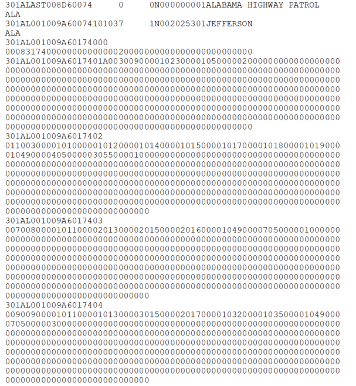
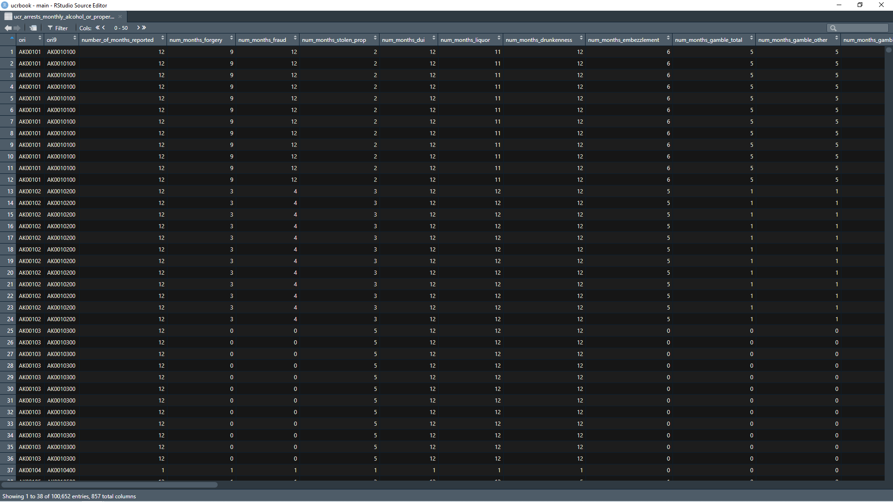

# Arrests by Age, Sex, and Race {#arrests}


## A brief history of the data

### Changes in definitions

## What does the data look like?

### Raw data

```{r, fig.cap="Fixed-width ASCII file for the 1974 Arrests by Age, Sex, and Race dataset"}

```

### Cleaned data

```{r, fig.cap="Agency information for the 1974 Arrests by Age, Sex, and Race dataset"}

```

```{r, fig.cap="Crime information for the 1974 Arrests by Age, Sex, and Race dataset"}
knitr::include_graphics('images/arrests_crime_info.PNG')
```

## What variables are in the data?

### Key variables

### Known issues with the data

## Final thoughts