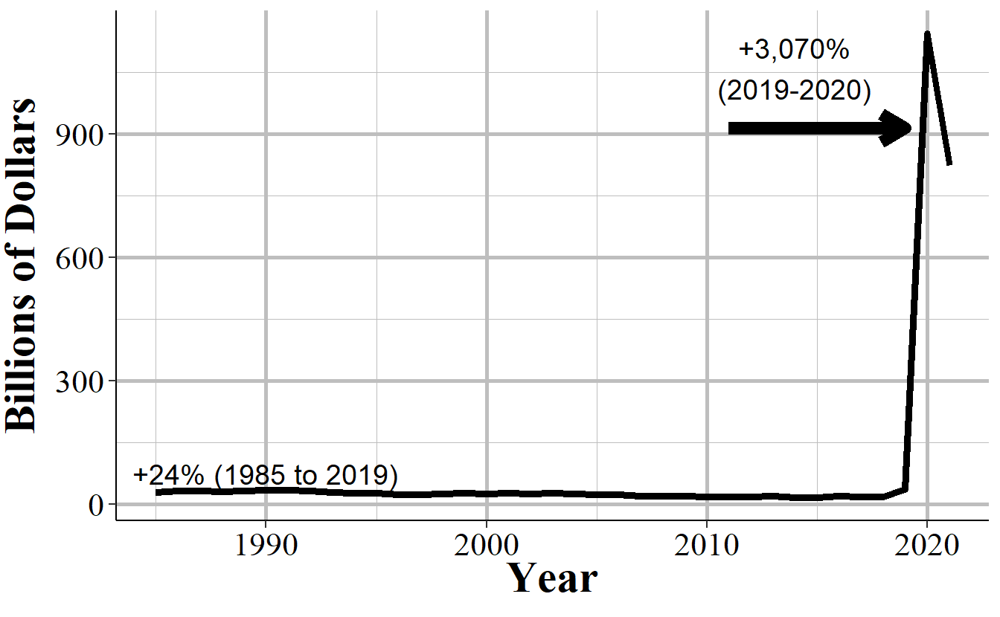

# Rome {#romeChapter}


```
#>     value_number   n           value
#> 1              0  61               0
#> 2              2   2               4
#> 3              4   1               4
#> 4              5   1               5
#> 5              6   2              12
#> 6              8   3              24
#> 7              9   1               9
#> 8             10   3              30
#> 9             15   1              15
#> 10            19   1              19
#> 11            20   5             100
#> 12            23   1              23
#> 13            25   2              50
#> 14            28   1              28
#> 15            30   1              30
#> 16            35   1              35
#> 17            40   1              40
#> 18            43   1              43
#> 19            46   1              46
#> 20            50   7             350
#> 21            60   3             180
#> 22            67   1              67
#> 23            70   2             140
#> 24            75   1              75
#> 25            76   1              76
#> 26            80   1              80
#> 27            84   1              84
#> 28            85   1              85
#> 29            97   1              97
#> 30            98   2             196
#> 31           100  11           1,100
#> 32           101   3             303
#> 33           108   1             108
#> 34           111   1             111
#> 35           120   1             120
#> 36           126   1             126
#> 37           150   4             600
#> 38           153   1             153
#> 39           157   1             157
#> 40           162   1             162
#> 41           163   1             163
#> 42           194   1             194
#> 43           199   1             199
#> 44           200  13           2,600
#> 45           232   1             232
#> 46           247   1             247
#> 47           250   2             500
#> 48           261   1             261
#> 49           300   7           2,100
#> 50           325   1             325
#> 51           329   1             329
#> 52           350   2             700
#> 53           359   1             359
#> 54           370   2             740
#> 55           380   1             380
#> 56           400   2             800
#> 57           453   1             453
#> 58           460   1             460
#> 59           500   7           3,500
#> 60           548   1             548
#> 61           550   1             550
#> 62           590   1             590
#> 63           600   1             600
#> 64           655   1             655
#> 65           760   1             760
#> 66           800   2           1,600
#> 67           850   1             850
#> 68           900   3           2,700
#> 69           999   2           1,998
#> 70          1000  10          10,000
#> 71          1001   2           2,002
#> 72          1008   1           1,008
#> 73          1021   1           1,021
#> 74          1134   1           1,134
#> 75          1200   7           8,400
#> 76          1250   1           1,250
#> 77          1355   1           1,355
#> 78          1445   1           1,445
#> 79          1800   1           1,800
#> 80          1900   1           1,900
#> 81          2000   1           2,000
#> 82          2008   1           2,008
#> 83          2200   1           2,200
#> 84          2240   1           2,240
#> 85          2442   1           2,442
#> 86          2500   5          12,500
#> 87          2677   1           2,677
#> 88          2799   1           2,799
#> 89          2997   1           2,997
#> 90          3000   1           3,000
#> 91          3001   1           3,001
#> 92          3119   1           3,119
#> 93          3346   2           6,692
#> 94          3500   1           3,500
#> 95          4000   2           8,000
#> 96          4040   1           4,040
#> 97          4200   1           4,200
#> 98          4700   1           4,700
#> 99          4952   1           4,952
#> 100         5124   1           5,124
#> 101         6388   1           6,388
#> 102         7000   2          14,000
#> 103         7500   1           7,500
#> 104         7705   1           7,705
#> 105         8167   1           8,167
#> 106         8400   1           8,400
#> 107        10000   1          10,000
#> 108        19800   1          19,800
#> 109        20000   1          20,000
#> 110        28000   1          28,000
#> 111        35000   1          35,000
#> 112        43000   1          43,000
#> 113        77777   1          77,777
#> 114       999999   1         999,999
#> 115      7777777  10      77,777,770
#> 116      9999999   3      29,999,997
#> 117     15540565   1      15,540,565
#> 118     99999999   1      99,999,999
#> 119    100000000   1     100,000,000
#> 120    999999999 433 432,999,999,567
#> 121           NA  11            <NA>
```


<div class="figure" style="text-align: center">

<p class="caption">(\#fig:nationalTotalAmountStolen)The annual total value of property stolen per offense (adjusted to 2023 dollars), 1985-2021.</p>
</div>


<div class="figure" style="text-align: center">

<p class="caption">(\#fig:nationalDollarsPerPropertyStolen)The annual average value of property stolen per offense (adjusted to 2023 dollars), 1985-2021.</p>
</div>

