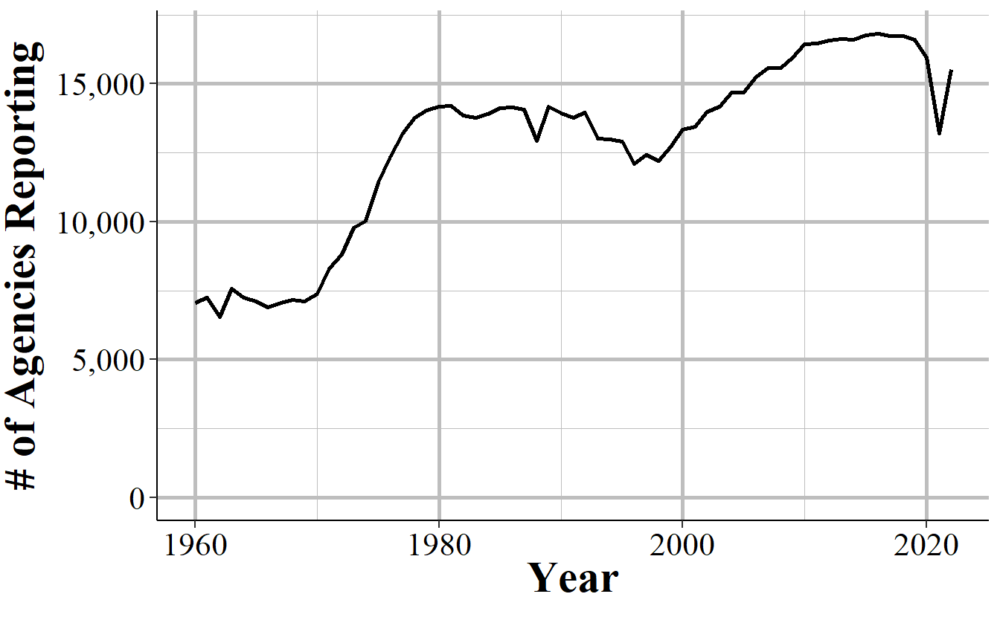
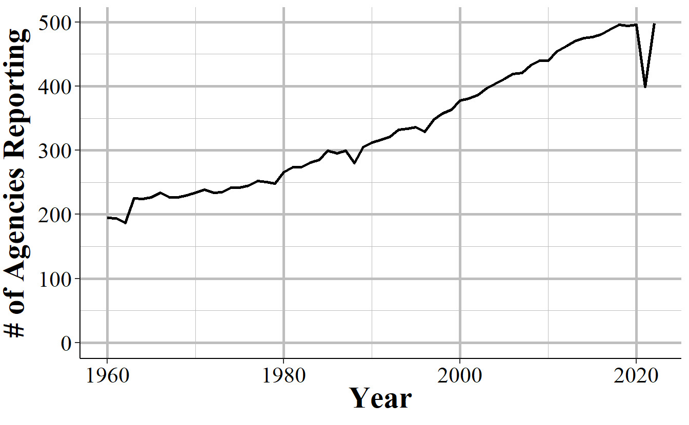

# (PART) Summary Reporting System (SRS) {-}

# SRS Overview {#SRSGeneral}

One of the first, and most important, questions I think people have about crime is a simple one: is crime going up? Answering it seems simple - you just count up all the crimes that happen in an area and see if that number of bigger than it was in previous times. 

However, putting this into practice invites a number of questions, all of which affect how we measure crime. First, we need to define what a crime is. Not philosophically what actions are crimes - or what should be crimes - but literally which of the many thousands of different criminal acts (crimes as defined by state or federal law) should be considered in this measure. Should murder count? Most people would say yes. How about jaywalking or speeding? Many would say probably not. Should marital rape be considered a crime? Now, certainly most people (all, I would hope) would say yes. But in much of the United States it wasn't a crime until the 1970s [@bennice2003marital; @mcmahon2009criminalizing]. What about marijuana possession, an act that is illegal nationally and in some states, but legal elsewhere?

Next, we have to know what geographic and time unit to measure crimes at since these decisions determine how precise we can measure crime and when it changed. That is, if you are mugged on Jan 1st at exactly 12:15pm right outside your house, how do we record it? Should we be as precise as including the exact time and location (such as your home address)? Out of privacy concerns to the victim, should we only include a larger time unit (such as hour of the day or just the day without any time of day) or a larger geographic unit (such as a Census Tract or the city)? And what about when there are questions about geographic jurisdiction such as a local police and sheriff overlapping in their patrol area? Or when a crime happens over the course of several hours (e.g. a length burglary or kidnapping)? Should we count the start time, the end time, or somewhere in the middle?

The final question is that when a crime occurs, how do we know? That is, when we want to count how many crimes occurred do we ask people how often they've been victimized, do we ask people how often they commit a crime, do we look at crimes reported to police, crimes charged in a criminal court? Each of these measures will likely give different answers as to how many crimes occurred.\footnote{The Bureau of Justice Statistics does measure crime by asking a random sample of people whether they were the victim of a crime. For more on this, please see their National Crime Victimization Survey reports} And what about crimes where a victim reports it and the police investigate and decide that it didn't occur (e.g. victim reports an act which was not actually illegal)? Or where the police say a crime occurred by the local District Attorney declines to prosecute? 

The FBI answered all of these questions in 1929 when they began the Uniform Crime Reporting (SRS) Program Data, or SRS data for short. **Crime consists of eight crime categories - murder, rape, robbery, aggravated assault, burglary, motor vehicle theft, theft, and simple assault - that are reported to the police and is collected each month from each agency in the country.** So essentially we know how many of a small number of crime categories happen each month in each city (though some cities have multiple police agencies so even this is more complicated than it seems). These decisions, born primarily out of the resource limitations of 1929 (i.e. no computers), have had a major impact on criminology research. The first seven crime categories - known as "Index Crimes" or "Part 1 crimes" (or "Part I" sometimes) - are the ones used to measure crime in many criminology papers, even when the researchers have access to data that covers a broader selection of crimes than these.^[Arson is also an index crime but was added after these initial seven were chosen and is not included in the crimes dataset (though is available separately) so is generally not included in studies that use index crimes.] These are also the crimes that the news uses each year to report on how crime in the United States compares to the previous year. The crime data actually also includes the final crime, simple assault, though it is not included as an index crime and is, therefore, generally ignored by researchers - a large flaw in most studies that we'll discuss in more detail in Section \@ref(indexCrimes). In fact excluding simple assault is such a large issue that doing so has led us to exclude the most common violent crime from most government, news, and academic reports, leading to an undercount of violence in this country by approximately 50%.  

In this chapter we'll provide a brief overview of the datasets that make up the FBI's Summary Reporting System (SRS) which you can think of as the "aggregate" data collection that is part of their Uniform Crime Reporting (UCR) Program Data. These datasets are primarily focused on aggregate data, mostly having monthly counts of crimes without many details about any particular crime. In comparison, the other half of the UCR collection, the National Incident-Based Reporting System (NIBRS) data is focused entirely on providing detail on every individual crime reported to the police. You can actually convert NIBRS data to SRS in most cases - and FBI does for agencies that report only NIBRS data - but there's no way to go from SRS to NIBRS. 

## Crimes included in the SRS datasets

SRS data covers only a subset - and for the crime data, a very small subset - of all crimes that can occur. It also only includes crimes reported to the police. So there are two levels of abstraction from a crime occurring to it being included in the data: a crime must occur that is one of the crimes included in one of the SRS datasets (we detail all of these crimes below) *and* the victim must report the incident to the police. While the crimes included are only a small selection of crimes - which were originally chosen since at the time the SRS was designed these were considered important offenses and among the best reported - this is an important first step to understanding the data.

SRS data should be understood as a loose collection of data that seeks to understand crimes and arrests in the United States. There are seven datasets in the SRS collection that each cover a different topic or a subset of a previously covered topic: crimes, arrests, property crimes specifically, homicides specifically, police officers killed or assaulted, arson specifically, and hate crimes.^[There is also a human trafficking dataset though this is a newer dataset and rarely used so I will not cover it in this book.] In this section we'll go over the crimes included in the two main SRS datasets: Offenses Known and Clearances by Arrest and (which I like to call the "crime" dataset) and the Arrests by Age, Sex, and Race (the "arrests" dataset). These are the most commonly used SRS datasets and the stolen property and homicide datasets are simply more detailed subsets of these datasets. The hate crime dataset can cover a broader selection of offenses than in the crimes or arrests data, so we'll discuss those in Chapter \@ref(hate_crimes). 

As mentioned above - and as most criminology papers will tell you - the crimes included in the SRS' Offenses Known and Clearances by Arrest data are the seven index crimes (eight when including arson, though arson is only reported in its own dataset so is usually excluded) - homicide, rape, robbery, aggravated assault, burglary, theft, and motor vehicle theft - as well as simple assault. This is true but incomplete. The data also includes subcategories for all crimes other than simple assault and theft - though theft has its own SRS dataset which goes into detail about the thefts. Both robbery and aggravated assault, for example, have subcategories showing which weapon the offender used (if any) during the crime. This allows for a more detailed understanding of the crime than looking only at the broad category. I'm not sure why most research includes only the broader categories and doesn't tend to look at subcategories, but that seems to be the case in most studies that I have read. Some police agencies only report the broader categories and don't report subcategories, but most report subcategories so this is an under-exploited source of data.   

## Common issues

In this section we'll discuss issues common to most or all of the SRS datasets. For some of these, we'll come back to the issues in more detail in the chapter for the datasets most affected by the problem. 

### Population

Each of the SRS datasets include a population variable that has the estimated population under the jurisdiction of that agency.^[Jurisdiction here refers to the boundaries of the local government, not any legal authority for where the officer can make arrests. For example, the Los Angeles Police Department's jurisdiction in this case refers to crimes that happen inside the city or are otherwise investigated by the LAPD - and are not primarily investigated by another agency.] This variable is often used to create crime rates that control for population. In cases where jurisdiction overlaps, such as when a city has university police agencies or county sheriffs in counties where the cities in that county have their own police, SRS data assigns the population covered to the most local agency and zero population to the overlapping agency. So an agency's population is the number of people in that jurisdiction that isn't already covered by a different agency. 

For example, the city of Los Angeles in California has nearly four million residents according to the US Census. There are multiple police agencies in the city, including the Los Angeles Police Department, the Los Angeles County Sheriff's Office, the California Highway Patrol that operates in the area, airport and port police, and university police departments. If each agency reported the number of people in their jurisdiction - which all overlap with each other - we would end up with a population far higher than LA's four million people. To prevent double-counting population when agency's jurisdictions overlap, the non-primary agency will report a population of 0, even though they still report crime data like normal. As an example, in 2018 the police department for California State University - Los Angeles reported 92 thefts and a population of 0. Those 92 thefts are not counted in the Los Angeles Police Department data, even though the department counts the population. To get complete crime counts in Los Angeles, you'd need to add up all police agencies within in the city; since the population value is 0 for non-LAPD agencies, both the population and the crime sum will be correct. 

The SRS uses this method even when only parts of a jurisdiction overlaps. Los Angeles County Sheriff has a population of about one million people, far less than the actual county population (the number of residents, according to the Census) of about 10 million people. This is because the other nine million people are accounted for by other agencies, mainly the local police agencies in the cities that make up Los Angeles County. 

The population value is the population who reside in that jurisdiction and does not count people who are in the area but don't live there, such as tourists or people who commute there for work. This means that using the population value to determine a rate can be misleading as some places have much higher numbers of non-residents in the area (e.g. Las Vegas, Washington D.C.) than others. 

### Voluntary reporting {#voluntary}

When an agency reports their data to the FBI, they do so voluntarily - there is no national requirement to report.^[Some states do mandate that their agencies report, but this is not always followed.] This means that there is inconsistency in which agencies report, how many months of the year they report for, and which variables they include in their data submissions. 

In general, more agencies report their data every year and once an agency begins reporting data they tend to keep reporting. The SRS datasets are a collection of separate, though related, datasets and an agency can report to as many of these datasets as they want - an agency that reports to one dataset does not mean that they report to other datasets. Figure \@ref(fig:SRSagenciesReporting) shows the number of agencies that submitted at least one month of data to the Offenses Known and Clearances by Arrest data in the given year. For the first decade of available data under 8,000 agencies reported data and this grew to over 13,500 by the late 1970s before plateauing for about a decade. The number of agencies that reported their data actually declined in the 1990s, driven primarily by many Florida agencies temporarily dropping out, before growing steadily to nearly 17,000 agencies in 2010; from here it kept increasing but slower than before. 

(\#fig:SRSagenciesReporting)The annual number of agencies reporting to the Offenses Known and Clearances by Arrest dataset. Reporting is based on the agency reporting at least one month of data in that year.

There are approximately 18,000 police agencies in the United States so recent data has reports from nearly all agencies, while older data has far fewer agencies reporting. When trying to estimate to larger geographies, such as state or national-level, later years will be more accurate as you're missing less data. For earlier data, however, you're dealing with a smaller share of agencies meaning that you have a large amount of missing data and a less representative sample. 

Figure \@ref(fig:bigAgenciesReporting) repeats the above figure but now including only agencies with 100,000 people or more in their jurisdiction. While these agencies have a far more linear trend than all agencies, the basic lesson is the same: recent data has most agencies reporting; old data excludes many agencies. 

(\#fig:bigAgenciesReporting)The annual number of agencies with a population of 100,000 or higher reporting to the Offenses Known and Clearances by Arrest dataset. Reporting is based on the agency reporting at least one month of data in that year.

This voluntariness extends beyond whether they report or not, but into which variables they report. While in practice most agencies report every crime when they report any, they do have the choice to report only a subset of offenses. This is especially true for subsets of larger categories - such as gun assaults, a subset of aggravated assaults, or marijuana possession arrests which is a subset of drug possession arrests. As an example, Figure \@ref(fig:nycGunAssaults) shows the annual number of aggravated assaults with a gun in New York City. In 2003 the New York Police Department stopped reporting this category of offense, resuming only in 2013. They continued to report the broader aggravated assault category, but not any of the subsections of aggravated assaults which say which weapon was used during the assault.

(\#fig:nycGunAssaults)Monthly reports of gun assaults in New York City, 1960-2022.

Given that agencies can join or drop out of the SRS program at will, and report only partial data, it is highly important to carefully examine your data to make sure that there are no issues caused by this. 

Even when an agency reports SRS data, and even when they report every crime category, they can report fewer than 12 months of data. In some cases they simply report all of their data in December, or report quarterly or semi-annually so some months have zero crimes reported while others count multiple months in that month's data. One example of this is New York City, shown in Figure \@ref(fig:nycMurderMonthly), in the early-2000s to the mid-2010s where they began reporting data quarterly instead of monthly. 

(\#fig:nycMurderMonthly)Monthly murders in New York City, 1990-2022. During the 2000s, the police department began reporting quarterly instead of monthly and then resumed monthly reporting.

When you sum up each month into an annual count, as shown in Figure \@ref(fig:nycMurderYearly), the problem disappears since the zero months are accounted for in the months that have the quarterly data. If you're using monthly data and only examine the data at the annual level, you'll fall into the trap of having incorrect data that is hidden due to the level of aggregation examined. While cases like NYC are obvious when viewed monthly, for people that are including thousands of agencies in their data, it is unfeasible to look at each agency for each crime included. This can introduce errors as the best way to examine the data is manually viewing graphs and the automated method, looking for outliers through some kind of comparison to expected values, can be incorrect.   

(\#fig:nycMurderYearly)Annual murders in New York City, 1990-2022.

In other cases when agencies report fewer than 12 months of the year, they simply report partial data and as a result undercount crimes. Figure \@ref(fig:miamiDadeMurderAnnual) shows annual murders in Miami-Dade, Florida and has three years of this issue occurring. The first two years with this issue are the two where zero murders are reported - this is because the agency didn't report any months of data. The final year is in 2018, the last year of data in this graph, where it looks like murder suddenly dropped significantly. That's just because Miami-Dade only reported through June, so they're missing half of 2018. 

(\#fig:miamiDadeMurderAnnual)Annual murders in Miami-Dade, Florida, 1960-2022.

### Zero crimes vs no reports

When an agency does not report, we see it in the data as reporting zero crimes, not reporting NA or any indicator that they did not report. In cases where the agency says they didn't report that month we can be fairly sure (not entirely since that variable isn't always accurate) that the zero crimes reported are simply that the agency didn't report. In cases where the agency says they report that month but report zero crimes, we can't be sure if that's a true no crimes reported to the agency or the agency not reporting to the SRS. As agencies can report some crimes but not others in a given month and still be considered reporting that month, just saying they reported doesn't mean that the zero is a true zero.

In some cases it is easy to see when a zero crimes reported is actually the agency not reporting. As Figure \@ref(fig:nycGunAssaults) shows with New York City gun assaults, there is a massive and sustained drop-off to zero crimes and then a sudden return years later. Obviously, going from hundreds of crimes to zero crimes is not a matter of crimes not occurring anymore, it is a matter of the agency not reporting - and New York City did report other crimes these years so in the data it says that they reported every month. So in agencies which tend to report many crimes - and many here can be a few as 10 a year since going from 10 to 0 is a big drop - a sudden report of zero crimes is probably just non-reporting. 

Differentiating zero crimes and no reports becomes tricky in agencies that tend to report few crimes, which most small towns do. As an example, Figure \@ref(fig:danvilleRape) shows the annual reports of rape in Danville, California, a city of approximately 45,000 people. The city reports on average 2.8 rapes per year and in five years reported zero rapes. In cases like this it's not clear whether we should consider those zero years as true zeros (that no one was raped or reported their rape to the police) or whether the agency simply didn't report rape data that year.  

(\#fig:danvilleRape)Annual rapes reported in Danville, CA, 1960-2022.

## A summary of each SRS dataset

The SRS collection of data can be roughly summarized into two groups: crime data and arrest data. While there are several datasets included in the SRS data collection, they are all extensions of one of the above groups. For arrest data, you have information about who (by race and by age-gender, but not by race-gender or race-age other than within race you know if the arrestee is an adult or a juvenile) was arrested for each crime. For crime data, you have monthly counts of a small number of crimes (many fewer than crimes covered in the arrest data) and then more specialized data on a subset of these crimes - information on homicides, hate crimes, assaults or killings of police officers, and stolen property. 

Each of these datasets will have its own chapter in this book where we discuss the data thoroughly. Here is a very brief summary of each dataset which will help you know which one to use for your research. I still recommend reading that data's chapter since it covers important caveats and uses (or misuses) of the data that won't be covered below. 

### Offenses Known and Clearances by Arrest (1960 - present)

The Offenses Known and Clearances by Arrest dataset - often called Return A, "Offenses Known" or, less commonly, OKCA - is the oldest and most commonly used dataset and measures crimes reported to the police. For this reason it is used as *the* main measure of crime in the United States, and I tend to call it the "crimes dataset." This data answers the most basic questions about crimes: how many occurred? If you see crime data referenced in a news or academic article it is usually this data. This data also includes the number of crimes solved (though with a weaker definition of "solved" than you may think) and the number of crimes in which the agency concluded did not actually occur which they call an "unfounded" crime. This data has the monthly number of crimes - for a select group of crimes types - that occurred in an agency, as well as how many the police investigated and decided did not occur, and the number "cleared" by an arrest.  The data uses something called a Hierarchy Rule which means that in incidents with multiple crimes, only the most serious is recorded - though in practice this affects only a small percent of cases, and primarily affects property crimes.

### Arrests by Age, Sex, and Race (1974 - present)

The Arrests by Age, Sex, and Race dataset - often called ASR, or the "arrests data", or sometimes the "Arrests by Age, Sex, Race, and Ethnicity though this is really misleading since most years don't even report ethnicity data - includes the monthly number of arrests for a variety of crimes and, unlike the crime data, breaks down this data by age and gender. This data includes a broader number of crime categories than the crime dataset (the Offenses Known and Clearances by Arrest data) though is less detailed on violent crimes since it does not breakdown aggravated assault or robberies by weapon type as the Offenses Known data does.

For each crime it says the number of arrests for each gender-age group with younger ages (15-24) showing the arrestee's age to the year (e.g. age 16, age 17) and other ages grouping years together (e.g. age 25-29, 30-34, "under 10"). It also breaks down arrests by race-age by including the number of arrestees of each race (American Indian, Asian, Black, and White are the only included races) and if the arrestee is a juvenile (<18 years old) or an adult. The data does technically include a breakdown by ethnicity-age (e.g. juvenile-Hispanic, juvenile-non-Hispanic) but almost no agencies report this data (for most years zero agencies report ethnicity at all) so in practice the data does not include ethnicity. As the data includes counts of arrestees, people who are arrested multiple times are included in the data multiple times - it is not a measure of unique arrestees. 

### Law Enforcement Officers Killed and Assaulted (LEOKA) (1960 - present)

The Law Enforcement Officers Killed and Assaulted data, often called just by its acronym LEOKA ("LEE-OH-KUH"), has two main purposes.^[This data is also sometimes called the "Police Employees" dataset.] First, it provides counts of employees employed by each agency - broken down by if they are civilian employees or sworn officers, and also broken down by sex (male and female are the only options). And second, it measures how many officers were assaulted or killed (including officers who die accidentally such as in a car crash) in a given month. The assault data is also broken down into shift type (e.g. alone, with a partner, on foot, in a car, etc.), the offender's weapon, and type of call they are responding to (e.g. robbery, disturbance, traffic stop). The killed data simply says how many officers are killed feloniously (i.e. murdered) or died accidentally (e.g. car crash) in a given month. The employee information is at the year-level so you know, for example, how many male police officers were employed in a given year at an agency, but don't know any more than that such as if the number employed changed over the year. This dataset is commonly used as a measure of police employees and is a generally reliable measure of how many police are employed by a police agency. The second part of this data, measuring assaults and deaths, is more flawed with missing data issues and data error issues (e.g. more officers killed than employed in an agency).

### Supplementary Homicide Reports (SHR)

The Supplementary Homicide Reports dataset - often abbreviated to SHR - is the most detailed of the SRS datasets and provides information about the circumstances and participants (victim and offender demographics and relationship status) for homicides. For each homicide incident it tells you the age, gender, race, and ethnicity of each victim and offender as well as the relationship between the first victim and each of the offenders (but not the other victims in cases where there are multiple victims). It also tells you the weapon used by each offender and the circumstance of the killing, such as a "lovers triangle" or a gang-related murder. As with other SRS data, it also tells you the agency it occurred in and the month and year when the crime happened. 

One important point of clarification: this is not the number of murders, though it does track that. This data also includes the number of homicides that are manslaughter by negligence (e.g. children playing with a gun, hunting accident) and justifiable homicides (i.e. not criminal). So be carefully when speaking about this data. It is murders but not only murders so you want to speak precisely. 

### Hate Crime Data (1991 - present)

This dataset covers crimes that are reported to the police and judged by the police to be motivated by hate. More specifically, they are (1) crimes which were (2) motivated - at least in part - by bias towards a certain person or group of people because of characteristics about them such as race, sexual orientation, or religion. The first part is key, they must be crimes - and really must be the selection of crimes that the FBI collects for this dataset. Biased actions that don't meet the standard of a crime, or are of a crime category not included in this data, are not considered hate crimes. For example, if someone yells at a Black person and uses racial slurs against them, it is clearly a racist action. For it to be included in this data, however, it would have to extend to a threat since "intimidation" is a crime included in this data but lesser actions such as simply insulting someone is not included. For the second part, the bias motivation, it must be against a group that the FBI includes in this data. For example, when this data collection began in 1991 crimes against transgender people were not counted so if a transgender person was assaulted or killed because they were transgender, this is not a hate crime recorded in the data (though it would have counted in the "Anti-Lesbian, Gay, Bisexual, Or Transgender, Mixed Group (LGBT)" bias motivation which was always reported).

### Property Stolen and Recovered (Supplement to Return A) (1960 - present)

The Property Stolen and Recovered data - sometimes called the Supplement to Return A (Return A being another name for the Offenses Known and Clearances by Arrest dataset, the "crime" dataset) - provides monthly information about property-related offenses (theft, motor vehicle theft, robbery, and burglary), including the location of the offense (in broad categories like "gas station" or "residence"), what was stolen (e.g. clothing, livestock, firearms), and how much the stolen items were worth.^[It also includes the value of items stolen during rapes and murders, if anything was stolen.] It also includes robberies so is really the "stuff taken during a crime" dataset than the dataset about property crimes. The "recovered" part of this dataset covers the type and value of property recovered so you can use this, along with the type and value of property stolen, to determine what percent and type of items the police managed to recover. 

Like most other SRS datasets this is at the agency-month level so you can, for example, learn how often burglaries occur at the victim's home during the day, and if that rate changes over the year or differs across agencies. The data, however, provides no information about the offender or the victim (other than if the victim was an individual or a commercial business ^[based on the location of the incident - "bank", "gas station", etc.]). The value of the property stolen is primarily based on the victim's estimate of how much the item is worth (items that are decreased in value once used - such as cars - are supposed to be valued at the current market rate, but the data provides no indication of when it uses the current market rate or the victim's estimate) so it should be used as a very rough estimate of value.  

### Arson (1979 - present)

The arson dataset provides monthly counts at the police agency-level for arsons that occur, and includes a breakdown of arsons by the type of arson (e.g. arson of a person's home, arson of a vehicle, arson of a community/public building) and the estimated value of the damage caused by the arson. This data includes all arsons reported to the police or otherwise known to the police (e.g. discovered while on patrol) and also has a count of arsons that lead to an arrest (of at least one person who committed the arson) and reports that turned out to not be arsons (such as if an investigation found that the fire was started accidentally). This is essentially the Offenses Known and Clearances by Arrest data but only for arsons. The data even follows the same definitions for categories such as what counts as a cleared or unfounded crime. The primary additional variable is the estimated damage in dollars caused by the arson. 

## How to identify a particular agency (ORI codes)

In the SRS and other FBI data sets, agencies are identified using **OR**iginating Agency **I**dentifiers or an ORI. An ORI is a unique ID code used to identify an agency.^[I will refer to this an "ORI", "ORI code", and "ORI number", all of which mean the same thing.] If we used the agency's name we'd end up with some duplicates since there can be multiple agencies in the country (and in a state, those this is very rare) with the same name. For example, if you looked for the Philadelphia Police Department using the agency name, you'd find both the "Philadelphia Police Department" in Pennsylvania and the one in Mississippi. Each ORI is a 7-digit value starting with the state abbreviation (for some reason the FBI incorrectly puts the abbreviation for Nebraska as NB instead of NE) followed by 5 numbers.^[In the NIBRS data (another FBI data set) the ORI uses a 9-digit code - expanding the 5 numbers to 7 numbers.] When dealing with specific agencies, make sure to use the ORI rather than the agency name to avoid any mistakes. 

For an easy way to find the ORI number of an agency, use [this page](https://jacobdkaplan.com/crosswalk.html) on my site. Type an agency name or an ORI code into the search section and it will return everything that is a match.

## The data as you get it from the FBI

We'll finish this overview of the SRS data by briefly talking about format of the data that is released by the FBI, before the processing done by myself or [NACJD](https://www.icpsr.umich.edu/web/pages/NACJD/index.html) that converts the data to a type that software like R or Stata or Excel can understand. The FBI releases their data as fixed-width ASCII files which are basically just an Excel file but with all of the columns squished together. As an example, Figure \@ref(fig:SRSascii) shows what the data looks like as you receive it from the FBI for the Offenses Known and Clearances by Arrest dataset for 1960, the first year with data available. In the figure, it seems like there are multiple rows but that's just because the software that I opened the file in isn't wide enough - in reality what is shown is a single row that is extremely wide because there are over 1,500 columns in this data. If you scroll down enough you'll see the next row, but that isn't shown in the current image. What is shown is a single row with a ton of columns all pushed up next to each other. Since all of the columns are squished together (the gaps are just blank spaces because the value there is a space, but that doesn't mean there is a in the data. Spaces are possible values in the data and are meaningful), you need some way to figure out which parts of the data belong in which column. 

(\#fig:SRSascii)Fixed-width ASCII file for the 1960 Offenses Known and Clearances by Arrest dataset.

The "fixed-width" part of the file type is how this works (the ASCII part basically means it's a text file). Each row is the same width - literally the same number of characters, including blank spaces. So you must tell the software you are using to process this file - by literally writing code in something called a "setup file" but is basically just instructions for whatever software you use (R, SPSS, Stata, SAS can all do this) - which characters are certain columns. For example, in this data the first character says which type of SRS data it is (1 means the Offenses Known and Clearances by Arrest data) and the next two characters (in the setup file written as 2-3 since it is characters 2 through 3 [inclusive]) are the state number (01 is the state code for Alabama). So we can read this row as the first column indicating it is an Offenses Known data, the second column indicating that it is for the state of Alabama, and so on for each of the remaining columns. To read in this data you'll need a setup file that covers every column in the data (some software, like R, can handle just reading in the specific columns you want and don't need to include every column in the setup file). 

The second important thing to know about reading in a fixed-width ASCII file is something called a "value label."^[For most fixed-width ASCII files there are also missing values where it'll have placeholder value such as -8 and the setup file will instruct the software to convert that to NA. SRS data, however, does not have this and does not indicate when values are missing in this manner.] For example, in the above image we saw the characters 2-3 is the state and in the row we have the value "01" which means that the state is "Alabama." Since this type of data is trying to be as small as efficient as possible, it often replaces longer values with shorter one and provides a translation for the software to use to convert it to the proper value when reading it. "Alabama" is more characters than "01" so it saves space to say "01" and just replace that with "Alabama" later on. So "01" would be the "value" and "Alabama" would be the "label" that it changes to once read. 

Fixed-width ASCII files may seem awful to you reading it today, and it is awful to use. But it appears to be an efficient way to store data back many decades ago when data releases began but now is extremely inefficient - in terms of speed, file size, ease of use - compared to modern software so I'm not sure why they *still* release data in this format. But they do, and even the more *modern* (if starting in 1991, before I was born, is modern!) NIBRS data comes in this format. For you, however, the important part to understand is not how exactly to read this type of data, but to understand that people who made this data publicly available (such as myself and the team at NACJD) must make this conversion process.^[For those interested in reading in this type of data, please see my R package asciiSetupReader.] **This conversion process, from fixed-width ASCII to a useful format is the most dangerous step taken in using this data - and one that is nearly entirely unseen by researchers.** 

Every line of code you write (or, for SPSS users, click you make) invites the possibility of making a mistake.^[Even highly experienced programmers who are doing something like can make mistakes. For example, if you type out "2+2" 100 times - something extremely simple that anyone can do - how often will you mistype a character and get a wrong result? I'd guess that at least once you'd make a mistake.] The FBI does not provide a setup file with the fixed-width ASCII data so to read in this data you need to make it yourself. Since some SRS data are massive, this involves assigning the column width for thousands of columns and the value labels for hundreds of different value labels.^[With the exception of the arrest data and some value label changes in hate crimes and homicide data, the setup files remain consistent so a single file will work for all years for a given dataset. You do not need to make a setup file for each year.] A typo anywhere could have potentially far-reaching consequences, so this is a crucial weak point in the data cleaning process - and one in which I have not seen anything written about before. While I have been diligent in checking the setup files and my code to seek out any issues - and I know that NACJD has a robust checking process for their own work - that doesn't mean our work is perfect.^[For evidence of this, please see any of the openICPSR pages for my detail as they detail changes I've made in the data such as decisions on what level to aggregate to and mistakes that I made and later found and fixed.] Even with perfection in processing the raw data to useful files, decisions we make (e.g. what level to aggregate to, what is an outlier) can affect both what type of questions you can ask when using this data, and how well you can answer them.    
