---
output:
  pdf_document: default
  html_document: default
---
# Offenses Known and Clearances by Arrest {#offensesKnown}

The Offenses Known and Clearances by Arrest dataset - often called Return A, "Offenses Known" or, less commonly, OKCA - is the oldest and most commonly used dataset and measures crimes reported to the police. For this reason it is used as *the* main measure of crime in the United States, and I tend to call it the "crimes dataset." This data answers the most basic questions about crimes: how many occurred? If you see crime data referenced in a news or academic article it is usually this data. This data also includes the number of crimes solved (though with a weaker definition of "solved" than you may think) and the number of crimes in which the agency concluded did not actually occur which they call an "unfounded" crime. This data has the monthly number of crimes - for a select group of crimes types - that occurred in an agency, as well as how many the police investigated and decided did not occur, and the number "cleared" by an arrest. 

The Offenses Known data has been **the** crime data of record for nearly a century, and will likely still be for the next couple of decades at least. And that's due to its simplicity. This data is (with some exceptions we'll get into) just the monthly number of crimes reported or otherwise known (e.g. discovered while on patrol) to a police agency for a small number of crimes. If you want to know, for example, how many murders or burglaries happened in your city last year, this is the dataset to turn to. This simplicity allows a much wider group of people to use the data; since it is monthly counts of crimes (with no breakdown by location, race, age, injury, etc.) you don't need much programming or analytic skills to use it. 

I argued earlier in this book that NIBRS is a far superior dataset than anything in SRS, and I stand by that. NIBRS is superior in nearly every way. But for most people - the general public, reporters, many academics, etc. - what is important is ease of use and very basic descriptive statistics such as how many crimes happened in my city last year^[Even many academic papers are little more than a difference between two or more cities over time and can be very good research even if the data isn't that complex.], and is it getting more dangerous than it used to be? The Offenses Known data answers that, at least to a point. You can answer more complex questions using NIBRS but most people don't need those questions answered. They're content with what can be answered using the Offenses Known data. And for good reason. "Is crime increasing in my city" is really the first and most important question about crime that people have. 

Part of the superiority of NIBRS is that while it can answer much more complex questions than SRS datasets, it can also answer the same questions that the SRS can. That's because, by design, NIBRS collects the same information as SRS and can be converted to SRS data. Many agencies that submit NIBRS data don't submit SRS data at all, and the FBI converts the NIBRS data to its SRS counterpart for release to the public. This is an almost perfect comparison but not all of the same variables are collected, which will cause some issues that we'll discuss in this chapter. 

One thing you may have heard about this data is that it uses something called the Hierarchy Rule. Basically the rule says that when an incident involves more than one crime, such as a robbery and a murder, you only count the most serious crime. And most serious is based on the hierarchy the FBI has created. This is true and therefore the number of crimes - other than murder which is the most serious - recorded in this data is always an undercount. But you really shouldn't be too concerned about this. As we'll get into below, the Hierarchy Rule affects only a relatively small share of incidents so doesn't undercount crime by too much - and when it does it is primarily undercounting property crime.

## Which crimes are included? {#indexCrimesOffensesKnown}

This dataset contains information on the number of "Index Crimes" (sometimes called Part I crimes) reported to each agency.^[While some people capitalize "Index Crime," I prefer the term in lowercase which is how I'll write it.] These index crimes are a collection of eight crimes that, for historical reasons based largely by perceived importance and reliability of their reporting in the 1920s when the UCR program was first developed, are used as the primary measure of crime today. Other data sets in the UCR, such as the Arrests by Age, Sex, and Race data and the Hate Crime data have more crimes reported. 

The crimes are, in order by the Hierarchy Rule (which we'll discuss next):
    
1. Homicide     
    + Murder and non-negligent manslaughter  
    + Manslaughter by negligence 
2. Rape     
    + Rape     
    + Attempted rape     
3. Robbery     
    + With a firearm     
    + With a knife of cutting instrument     
    + With a dangerous weapon not otherwise specified     
    + Unarmed - using hands, fists, feet, etc.     
4. Aggravated Assault (assault with a weapon or with the intent to cause serious bodily injury)     
    + With a firearm     
    + With a knife of cutting instrument     
    + With a dangerous weapon not otherwise specified     
    + Unarmed - using hands, fists, feet, etc.     
5. Burglary     
    + With forcible entry     
    + Without forcible entry      
    + Attempted burglary with forcible entry     
6. Theft (other than of a motor vehicle)     
7. Motor Vehicle Theft     
    + Cars     
    + Trucks and buses     
    + Other vehicles          
8. Arson     
9. Simple Assault     

Arson is considered an index crime but is not reported in this data - you need to use the separate Arson dataset of the UCR to get access to arson counts. See Chapter \@ref(arsonChapter) for an overview of the Arson data. The ninth crime on that list, simple assault, is not considered an index crime but is nevertheless included in this data. 

Each of the crimes in the list above, and their subcategories, are included in the UCR data. In most news and academic articles, however, you'll see them reported as the total number of index crimes, summing up categories 1-7 and reporting that as "crime."^[I have encountered a shocking number of academic papers and researchers who seem to believe that the subcategories are not included in the data at all.] These index crimes are often divided into violent index crimes - murder, rape, robbery, and aggravated assault - and property index crimes - burglary, theft, motor vehicle theft. For more on index crimes, and the drawbacks of using them, please see Section \@ref(indexCrimes).

### Hierarchy Rule {#hierarchy}

This dataset uses what is called the Hierarchy Rule where only the most serious crime in an incident is reported (except for motor vehicle theft and arson, which are always included).^[FBI documentation actually differs on whether motor vehicle theft is always reported with some documentation saying it is while others placing it in the hierarchy. According to their "Summary Reporting System (SRS) User Manual" Version 1.0 released 6/20/2013, "The offenses of justifiable homicide, motor vehicle theft, and arson are exceptions to the Hierarchy Rule."] For example if there is an incident where the victim is robbed and then murdered, only the murder is counted as it is considered more serious than the robbery. That the data uses the Hierarchy Rule is a frequently cited (by academics, reporters, random people on Twitter) criticism of the data that is, in my opinion, overblown. 

In practice, the Hierarchy Rule has only modest effects on the data, undercounting few crimes. Though the Hierarchy Rule does mean this data is an undercount, data from other sources indicate that it isn't much of an under count. NIBRS data contains every crime that occurs in an incident (i.e. it doesn't use the Hierarchy Rule). Using this we can measure how many crimes the Hierarchy Rule excludes. In approximately 90% of incidents, only one crime is committed.^[According to 2022 NIBRS, 88.15% of incidents have only a single offense.] Additionally, when people talk about "crime" they usually mean murder which, while incomplete to discuss crime, means the UCR data here is accurate on that measure. 

The FBI released a report [available here](https://ucr.fbi.gov/nibrs/2014/resource-pages/effects_of_nibrs_on_crime_statistics_final.pdf) in 2015 that directly examined this issue by taking NIBRS data from 2014 and examined how NIBRS data (which doesn't use the Hierarchy Rule) compares to using the Hierarchy Rule and keeping only the most serious crime. Figure \@ref(fig:fbiHierarchy) is a screenshot from their report showing the percent increases in crimes when including all crimes in an incident relative to following the Hierarchy Rule. They find that 10.6% of incidents have multiple crimes occurring. For violent crime, murder and rape have no change; for the remaining violent crimes - robbery and aggravated assault - crimes increased by 0.6%.^[Murder is not shown in this figure since murder is always reported so cannot change.] Burglary increased by 1% and the largest increases came from theft and motor vehicle theft, increasing by 2.6% and 2.7%, respectively. Curiously, motor vehicle theft increased even though the FBI's documentation for this data says that it is exempt from the Hierarchy Rule and should always be reported. This discrepancy suggests either non-compliance or errors in the FBI's manual.

(\#fig:fbiHierarchy)The FBI's findings of how crime reporting changes when using the Hierarchy Rule using NIBRS 2014 data.

In Table \@ref(tab:nibrsHierarchy) I replicate the FBI's table using NIBRS 2022 data. Results are fairly close. Homicide and rape and unchanged; robbery and aggravated assault both increase by <1%; my count for theft and burglary are a bit smaller, and motor vehicle theft is almost triple the FBI's 2014 number. But these numbers are mostly consistent - particularly so for violent crime - and I expect the differences are just that 2014 and 2022 data are different. So using the Hierarchy Rule does undercount crime, but this is a small undercounting and is primarily led by property crime. Violent crime is only slightly undercounted. And compared to the number of crimes not counted because the victim doesn't reports it to the police, this is a very small share of crimes. 

Table: (\#tab:nibrsHierarchy)The percent increase in reported crimes for each index crime if the Hierarchy Rule was not used, NIBRS 2022.

|Crime               | % increase without Hierarchy Rule|
|:-------------------|---------------------------------:|
|Homicide            |                              0.00|
|Rape                |                              0.03|
|Robbery             |                              0.54|
|Aggravated Assault  |                              0.82|
|Burglary            |                              1.57|
|Theft               |                              1.47|
|Motor Vehicle Theft |                              7.92|
|Arson               |                              7.54|

### Index ("Part 1") crimes {#indexCrimes}

One of the first things that people tend to learn about SRS crime data is that it covers something called an "index crime."^[Index crimes are sometimes capitalized as "Index Crimes" though I've seen it written both ways. In this book I keep it lowercase as "index crimes."] Index crimes, sometimes written as Part 1 or Part I crimes, are the seven crimes originally chosen by the FBI to be included in their measure of crimes as these offenses were both considered serious and generally well-reported so would be a useful measure of crime. Index crimes are often broken down into property index crimes - burglary, theft, and motor vehicle theft (and arson now, though that's often not included and is reported less often by agencies) - and violent index crimes (murder, rape, robbery, and aggravated assault). The "index" is simply that all of the crimes are summed up into a total count of crimes (violent, property, or total) for that police agency. 

The biggest problem with index crimes is that it is simply the sum of 8 (or 7 since arson data usually isn’t included) crimes. Index crimes have a huge range in their seriousness - it includes, for example, both murder and theft - so summing up the crimes gives each crime equal weight. This approach is flawed as 100 murders is more serious than 100 thefts. This is especially a problem as less serious crimes (theft mostly) are far more common than more serious crimes. In 2017, for example, there were 1.25 million violent index crimes in the United States. That same year had 5.5 million thefts. So using index crimes as your measure of crimes fails to account for the seriousness of crimes. Looking at total index crimes is, in effect, mostly just looking at theft. Looking at violent index crimes alone mostly measures aggravated assault. This is especially a problem because it hides trends in violent crimes. As an example, San Francisco, shown in Figure \@ref(fig:sfThefts), has had a huge increase - about 50% - in index crimes in the last several years. When looking closer, that increase is driven almost entirely by the near doubling of theft since 2011. During the same years, index violent crimes have stayed fairly steady. So the city isn’t getting more dangerous - at least not in terms of violent index crimes increasing - but it appears like it is due to just looking at total index crimes.

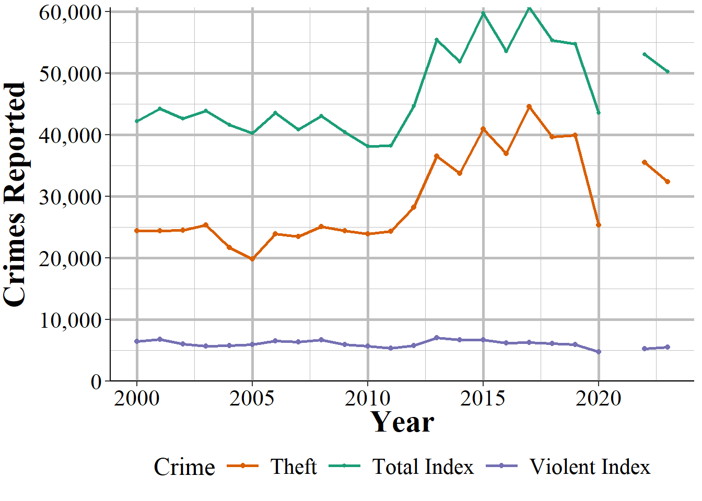

(\#fig:sfThefts)Thefts and total index crimes in San Francisco, 2000-2022.

Many researchers divide index crimes into violent and nonviolent categories, which helps but even this isn't entirely sufficient. Take Chicago as an example. It is a city infamous for its large number of murders. But as a fraction of index crimes, Chicago has a rounding error worth of murders. Their 653 murders in 2017 is only 0.5% of total index crimes. For violent index crimes, murder made up 2.2% of crimes that year. As seen in Figure \@ref(fig:chicagoMurder), in no year where data is available did murders account for more than 3.5% of violent index crimes; and, while murders are increasing as a percent of violent index crimes they still account for no more than 2.5% in most recent years. What this means is that changes in murder are very difficult to detect. If Chicago had no murders this year, but a less serious crime (such as theft) increased slightly, we couldn't tell from looking at the number of index crimes, even from violent index crimes. As discussed in the below section, using this sample of crimes as the primary measure of crimes - and particularly of violent crimes - is also misleading as it excludes important - and highly common relative to index crimes - offenses, such as simple assault.

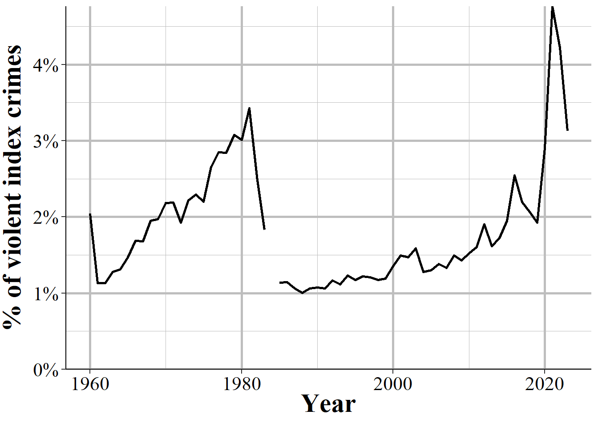

(\#fig:chicagoMurder)Murders in Chicago as a percent of violent index crimes, 1960-2022.

#### What is a violent crime?

An important consideration in using this data is defining what a "violent crime" is. One definition, and the one that I think makes the most sense, is that a violent crime is one that uses force or the threat of force. For example, if I punch you in the face, that is a violent crime. If I stab you, that is a violent crime. While clearly different in terms of severity, both incidents used force so I believe would be classified as a violent crime. The FBI, and most researchers, reporters, and advocates would disagree. Organizations ranging from the [FBI itself](https://SRS.fbi.gov/crime-in-the-u.s/2019/crime-in-the-u.s.-2019/topic-pages/violent-crime) to [Pew Research Center](https://www.pewresearch.org/fact-tank/2020/11/20/facts-about-crime-in-the-u-s/) and advocacy groups like the [Vera Institute of Justice](https://arresttrends.vera.org/data-sources-methodology) and the [ACLU](https://www.aclu.org/report/tale-two-countries-racially-targeted-arrests-era-marijuana-reform) all define the first example as a non-violent crime and the second as a violent crime. They do this for three main reasons. 

The first reason is that simple assault is not an index crime, so they don't include it when measuring violent crime. It is almost a tautology in criminology that you use index crimes as the measure of crime since that's just what people do. As far as I'm aware, this is really the main reason why researchers justify using index crimes: because people in the past used it so that's just what is done now.^[I've also seen the justification that aggravated assault is more serious since it uses a weapon, though as the SRS subcategory of aggravated assault without a weapon clearly shows, aggravated assault does not require use of a weapon.] This strikes me as a particularly awful way of doing anything, more so since simple assault data has been available almost as long as index crime data.^[Simple assault is first available in 1964. Index crime data is available since 1960.]

The second reason - and one that I think makes sense for reporters and advocates who are less familiar with the data, but should be unacceptable to researchers - is that people don't know that simple assault is included, or at least don't have easy access to it. Neither the FBI's annual report [page](https://SRS.fbi.gov/crime-in-the-u.s/2019/crime-in-the-u.s.-2019/home) not their official [crime data tool website](https://crime-data-explorer.fr.cloud.gov/) include simple assault since they only include index crimes. For people who rely only on these sources - and given that using the data itself requires at least some programming skills, I think this accounts for most users and certainly nearly all non-researchers - it is not possible to access simple assault crime data (arrest data does include simple assault on these sites) from these official sources.     

The final reason is that it benefits some people's goals to classify violent crime as only including index crimes. This is because simple assault is extremely common compared to violent index crimes - in many cities simple assault is more common than all violent index crimes put together - so excluding simple assault makes it seem like fewer arrests are violent than they are when including simple assault. For example, a number of articles have noted that marijuana arrests are more common than violent crime arrests [@ingraham2016; @kertscher2019; @devito2020; @earlenbaugh2020; @aclu2020] or that violent crime arrests are only 5\% of all arrests [@neusteter2019every; @speri2019].^[The FBI's report for arrests does include simple assault so the second reason people may not include it does not apply here.] While true when considering only violent index crimes, including simple assault as a violent crime makes these statements false. Some organizations call the violent index crimes "serious violent crimes" which is an improvement but even this is a misnomer since simple assault can lead to more serious harm than aggravated assault. An assault becomes aggravated if using a weapon or there is the *potential* for serious harm, even if no harm actually occurs.^[SRS data provides no information about the harm caused to victims. The new FBI dataset NIBRS actually does have a variable that includes harm to the victim so if you're interested in measuring harm (an understudied topic in criminology), that is the dataset to use.] 

As an example of this last point, Figure \@ref(fig:simpleIndex) shows the number of violent index crimes and simple assaults each year from 1960 to 2018 in Houston, Texas (simple assault is not reported in SRS until 1964, which is why 1960-1963 show zero simple assaults). In every year where simple assault is reported, there are more simple assaults than aggravated assaults. Beginning in the late 1980s, there are also more simple assaults than total violent index crimes. Excluding simple assault from being a violent crime greatly underestimates violence in the country. 

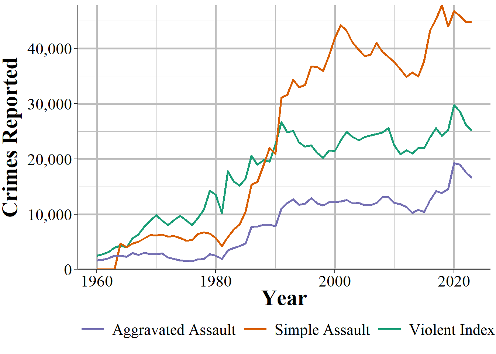

(\#fig:simpleIndex)Reported crimes in Houston, Texas, from 1960 to 2018. Violent index crimes are aggravated assault, rape, robbery, and murder.

## Agencies reporting  {#offensesKnownReporting}

Figure \@ref(fig:offensesAgenciesReporting) shows the annual number of police agencies that reported at least one month that year. With data starting in 1960, there were a little under 7,500 agencies reporting a year until 1970 when the number of agencies began increasing. This continued until the late 1970s when about 14,000 agencies reported, and this remained steady for over a decade before declining in the 1990s until about 12,500 in the latter half of the decade. Then the number of agencies reporting increased steadily until about 16,500 agencies reported in 2010. The number of agencies has slowly increased since then, adding a few hundred agencies from 2010 to 2020. The drop and then partial recovery you see in 2021 and 2022 is from the FBI stopping collection of this data and then restarting that collection in 2021. Most agencies report to NIBRS but the only that still report SRS, and therefore couldn't report in 2021, caused the drop.

There are actually two lines throughout this entire figure, though they are nearly identical until 2018. That is because there are two ways of measuring how many months an agency reports data. The primary one - and the one the FBI itself uses - is through a variable in the data called the "last_month_reported." This is, as it sounds, the last month the agency sent data in. So if an agency reports data in December the variable will have "December" as the last month. If that agency only reported it December the variable will still say "December." Most people use this as the number of months that the agency reported. So a December value is 12 months reported, even though in our example it was the only month with data. 

In the data there are 12 columns - one for each month - that says whether the agency reported data in that month. That's what I use in the green line to measure how many months of data that agency reported. I refer to this in the figure and in the data I have released as the "number of months missing." When looking at agencies reporting only a single month the lines are nearly identical, though the last month reported measure is nearly always larger. This changes in 2018 as a result of the data changing, meaning I needed to use different columns to check starting in that year. That means that post-2018 data may not be comparable to 2018 and earlier using this variable. 

## Negative numbers

One of the most common questions people have about this data is why there are negative numbers, and if they are a mistake. Negative numbers are not a mistake. The SRS data is monthly so police agencies report the number of monthly crimes that are known to them - either reported to them or discovered by the police. In some cases the police will determine that a crime reported to them didn't actually occur - which they called an "unfounded crime." An example that the FBI gives for this is a person reports their wallet stolen (a theft) and then later finds it, so a crime was initially reported but no crime actually occurred. 

How this works when the police input the data is that an unfounded crime is reported both as an unfounded crime and as a negative actual crime - the negative is used to zero out the erroneous report of the actual crime. So the report would look like  1 actual theft (the crime being reported), -1 theft (the crime being discovered as not have happened), and 1 unfounded theft. If both incidents occurred in the same month then this would simply be a single unfounded theft occurring, with no actual theft - literally a value of 1 + -1 = 0 thefts. 

Negative values occur when the unfounding happens in a later month than the crime report. In the theft case, let's say the theft occurred in January and the discovery of the wallet happens in August. Assuming no other crimes occurred, January would have 1 theft, and August would have -1 thefts and 1 unfounded theft. There is no way of determining in which month (or even which year) an unfounded crime was initially reported in. When averaging over the long term, there shouldn't be any negative numbers as the actual and unfounded reports will cancel themselves out. However, when looking at monthly crimes - particularly for rare crimes - you'll still see negative numbers for this reason. Since crimes can be unfounded for reports in previous years, you can actually see entire year's crime counts be negative, though this is much rarer than monthly values.^[From 1960-2022, there were 39 agency-years with a negative count of murders.] 

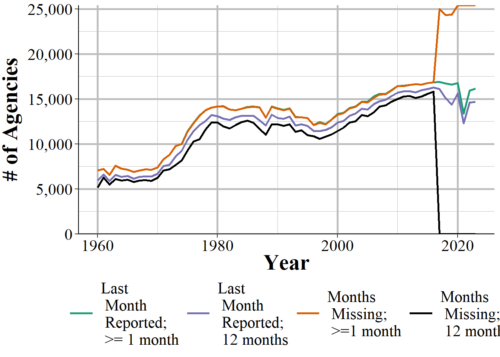

(\#fig:offensesAgenciesReporting)The annual number of agencies reporting at least one month of data, 1960-2022.

Usually when you are looking at crime data you want annual data, so having agencies report a full year's of data is more important than them submitting just partial data. This is especially important when comparing an agency over time or two different agencies to each other. Obviously, an agency with 6 month of data will have fewer crimes reported than one with 12 months reported, all else being equal. But this is something easy to overlook as it's an easy assumption that agencies will report a full years-worth of data. Unfortunately, this is always true. Some agencies don't report any data and others report only part of the year - though if an agency reports one month they usually do report all 12. Figure \@ref(fig:offensesAgenciesReportingFull) repeats Figure \@ref(fig:offensesAgenciesReporting) but now showing only agencies reporting 12 months of data, using both of our measures. Since 1960 every year has had fewer agencies reporting full data using the "number of months missing" method than the "last month reported" method. 

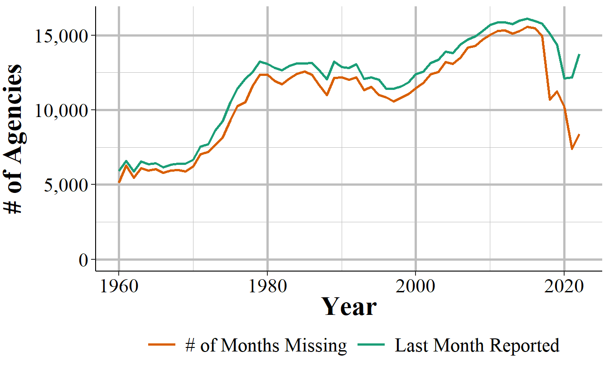

(\#fig:offensesAgenciesReportingFull)The annual number of agencies reporting a full year of data, 1960-2022.

So using the far more common last month reported method will overestimate how many agencies report a full year of data. In practice, though, this affects very little data. At least when aggregating nationally - which I generally advise against since local crime matters a lot more than national averages. Still, let's look the increase in the total number of crimes reported by 12-month reporting agencies increases from the "number of months missing" measure to the "last month reported" measure, shown in Figure \@ref(fig:murdersBothMeasures). The answer is an extremely small increase, averaging (mean = 0.93, mean = 1.55) about a one percent point increase each year. The differences in measuring how many months are reported can matter a great deal at the agency-level, but does very little when aggregating nationally.

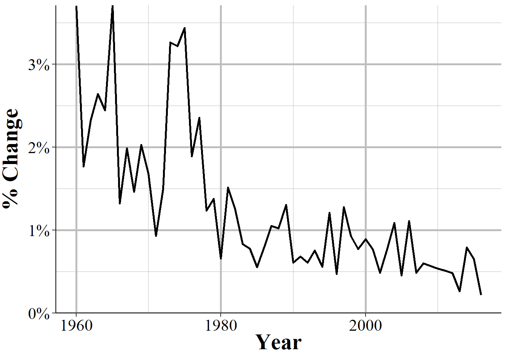

(\#fig:murdersBothMeasures)The percent change in the number of murders reported in the United States each year when moving from the number of months missing measure to the last month reported measure, 1960-2022.

## Important variables

Now let's talk about some important variables in this data such as what it actually measures. For each crime we have four different categories indicating the number of crimes actually committed, the number cleared, and the number determined to not have occurred. Like other UCR data, there are also variables that provide information about the agency - ORI codes, population under jurisdiction - the month and year that the data covers, and how many months reported data. 

### Actual crimes {#actual}

This is the number of offenses that *actually* occurred - where *actually* means that a police investigation found that the crime report was accurate. Occurred is actually a bit of a strong word. These are crimes that come to the police's attention in that month, even if the crime actually occurred before. For example, if someone walks into a police department on February, 2025 and says "last year I killed five people" that would count as five murders in February, 2025 (that is assuming that the police believe that the person is telling the truth). It would not be counted in 2024 when the person says the murders took place. 

Crimes that are reported that the police find did not occur (e.g. report of an arson but turns that the fire began accidentally) are called "unfounded" crimes. So this variable is the one people use to measure *crime*. For example if 10 people are murdered in a city the number of "actual murders" would be 10. A crime is a crime incident, regardless of how many offenders there were. If there are multiple victims in a case, such as a double murder, then it would count as multiple crimes.

Figure \@ref(fig:newarkMurders), for example, shows the number of murders per 100,000 population in Newark, NJ, for 1960-2022. One things stands out. Or doesn't stand out, in a bad way. Newark Police didn't report a full year of data in 2015; they reported only 11 months. It is imperceptible in the figure but if you look at the number of months reported in that year - using either the last month reported or the number of months missing measure - you can see that December is missing. While visualizing the data is often a good way to look for outliers or missingness, it's not enough alone. You need to look at the raw data as well to be safe. 

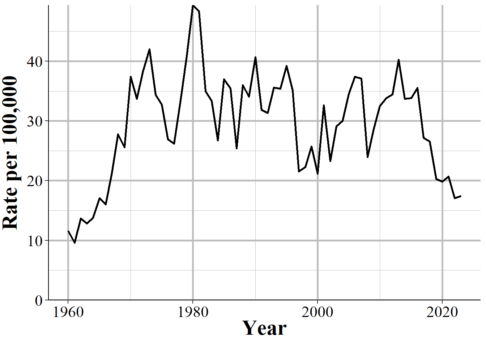

(\#fig:newarkMurders)The annual murder rate per 100,000 people in Newark, NJ, 1960-2022.

Since this is the number of crimes reported and found to occurred, it undercounts the total number of reported crimes. To get that number you'll need to add actual crimes to unfounded crimes, which we discuss in Section \@ref({unfounded}). However, unfounded crimes are increasingly not being reported as agencies move to NIBRS reporting which does not capture unfounded crimes. 

### Total cleared crimes {#clearedCrimes}

A crime is cleared when an offender is arrested or when the case is considered cleared by exceptional means. To be more specific, this data counts crime as a crime incident, regardless of the number of offenders. For example, if three people robbed a person, that is one crime of robbery, not three separate crimes. This crime is cleared when one of the three robbers is arrested - no matter the outcome for the other two robbers. Arresting all three still counts as a single robbery cleared. If those three people had robbed two people that would be reported as two robberies. The first year with clearance data is in 1963, though that is extremely rare; the vast majority of agencies started reporting this data in 1964.

Even though this dataset is formally named "Offenses Known and Clearances by Arrest" it does include clearances where no one is arrested, which are called "exceptional clearances" or "clearances by exceptional means." For exceptional clearances, police must have identified the offender, have sufficient evidence to arrest that offender, know where they are (so they can actually be apprehended) and only then be unable to make the arrest. Exceptional clearances include cases where the offender dies before an arrest (by any means, including suicide, accidental, illness, killed by someone including a police officer) or when the police are unable to arrest the person since they are already in custody by another jurisdiction (including out of the country or in custody of another agency) and extradition is denied. Two other potential causes of exceptional clearance are when prosecution of the case cannot go forward because the district attorney refuses to prosecute the case, for reasons other than lack of evidence, or when a victim refuses to assist the prosecution in the case. 

Unfortunately, this data does not differentiate between clearances by arrest or by exceptional means so there's no way to determine how many clearances mean the offender is actually arrested - and even more problematic, how many clearances have all of the offenders arrested. NIBRS data does differentiate these types of clearances, another advantage of using it. There is also some evidence that at least some police agencies report classify large numbers of clearances as clearances through exception means (again, we have no way to tell which is which using this data) even though exceptional clearances should be rare given that times where the offender is known but cannot be arrested are likely far less common than when they are arrested. For an investigation into this issue, see the @yeung2018comes article available on ProPublica's website [here](https://www.propublica.org/article/when-it-comes-to-rape-just-because-a-case-is-cleared-does-not-mean-solved)

Clearances are reported in the month that they occur, regardless of when the crime they are clearing occurred. In practice, however, most crimes are cleared in the month that they occur. According to the 2019 NIBRS, it takes on average 7 days between the incident and the arrest (median = 0 days) date when averaging across all crimes - for individual crimes these values will be different. This means that most of the clearances will be for the same month as the initial crime - though this will be less common for crimes that happen at the end of a month. Of course, police agencies can solve older cases - and even target cold cases to be solved - so this is still a degree of uncertainty for which month these clearances are for. 

This means that there are occasionally months - and even years - where there are more reported crimes cleared than crimes that occur.^[In about 1% of agency-years since 1964, the year most agencies started reporting this data, there were more cleared murders than actual murders.] Figure \@ref(fig:lapdClearance), for example, shows the number of actual and cleared murders from the Los Angeles Police Department. In 2013 there were more murders cleared (271) than actual murders (251) In 2020, both values are zero as the LAPD did not report data that year. 

This is actually a good check to see when people who use this data don't actually understand how it works. I've seen published academic papers that say that having more clearances than actual crimes is a data error; clearly they declined to read the official manual (or this book) before they, their editor, and their anonymous reviewers published the paper. 

(\#fig:lapdClearance)The annual number of actual and cleared murders from the Los Angeles Police Department, 1960-2022.

### Crimes cleared where all offenders are under 18 years old

This variable is a subset of the Total Cleared variable and only includes clearances for offenses in which **every** offender is younger than age 18. Since this requires that the police know, or at least believe, the age of every offender, it is probably fairly inaccurate. This category includes cases where the juvenile is given a citation to show up in court for their trial and is not formally arrested and taken into custody. 

### Unfounded crimes {#unfounded}

An unfounded crime is one in which a police investigation has determined that the reported crime did not actually happen. The first year of data that included unfounded crimes was 1979, though most agencies began reporting in 1983. 

For example, I observed during a ride-along a report of a burglary where the homeowners said that they came home, and the front door was open and they thought it might have been their son who forgot to close it but were worried that it could be a burglar, so they called the police just in case. This would be recorded as a burglary and if it turned out to be the son, the police would then record this as an unfounded burglary. 

Other unfounded crimes would include when someone reports a crime but later says that the report wasn't true. For example, a person could report a burglary to the police to collect insurance money on the items they claim was stolen. If the police discover this they would unfound the case - and the lying to the police and fraud would not be counted as neither of those are crimes included in this dataset. The way that the police do this in the data is to record an unfounded crime as a negative actual crime. If there are 10 burglaries already reported and then the above example occurred they would take those 10, add 1 for the report, and then subtract one for when they decide the crime is unfounded. This evens out the data to "erase" the initial report. If the unfounding occurs in a different month than the reported crime then this could lead to negative crimes being reported. This is just another quirk of SRS data and is another good check to see if a person using the data actually understands it as I've also seen people say negative crimes is a data error. 

Figure \@ref(fig:frankenmuthRape) provides one example of this by showing the number of burglaries that the Frankenmuth Police, MI, say actually occurred from 1960-2022. In 1977 they reported -1 burglaries, the result of having more cleared than actual burglaries in that year.

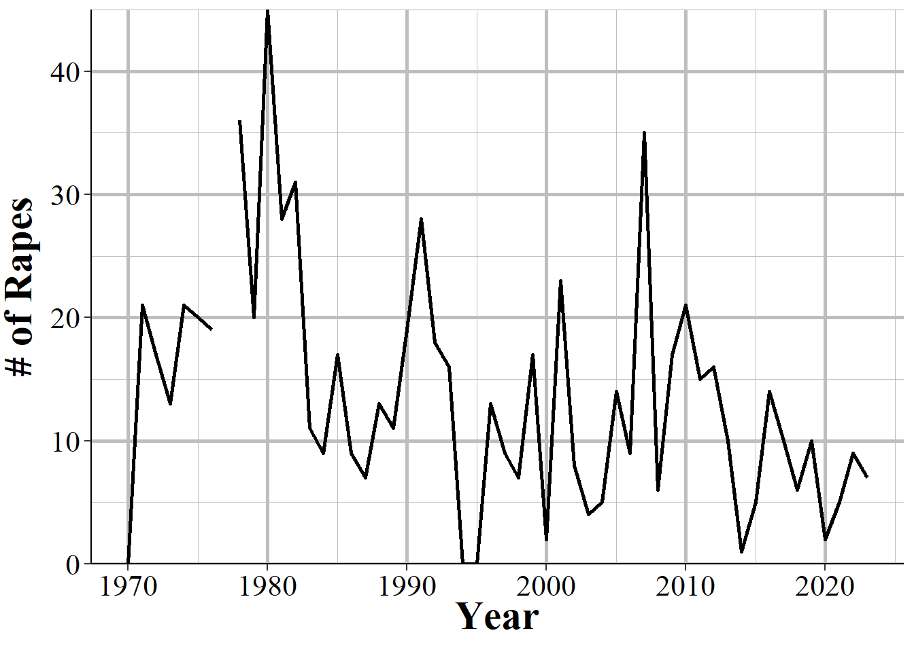

(\#fig:frankenmuthRape)The number of actual burglaries reported by the Frankenmuth Police Department, MI, 1960-2022.

While this is a useful variable, it is not captured in NIBRS data. Instead the number of unfounded crimes is always reported as zero. For example, Figures \@ref(fig:memphisUnfounded) and \@ref(fig:denverUnfounded) show the annual number of unfounded crimes (of any crime type) in Memphis, TN, and Denver, CO, which are two of the earliest large agencies to adopt NIBRS. Memphis started in reporting to NIBRS in 2000 and Denver did so in 2005. These agencies stopped reporting any unfounded crimes either in that or the following year.^[For Memphis, as agencies can report both SRS and NIBRS, that agency may have reported both in 2000 which is why we still see unfounded data that year.]

(\#fig:memphisUnfounded)The annual number of unfounded crimes in Memphis, TN, 1983-2022.

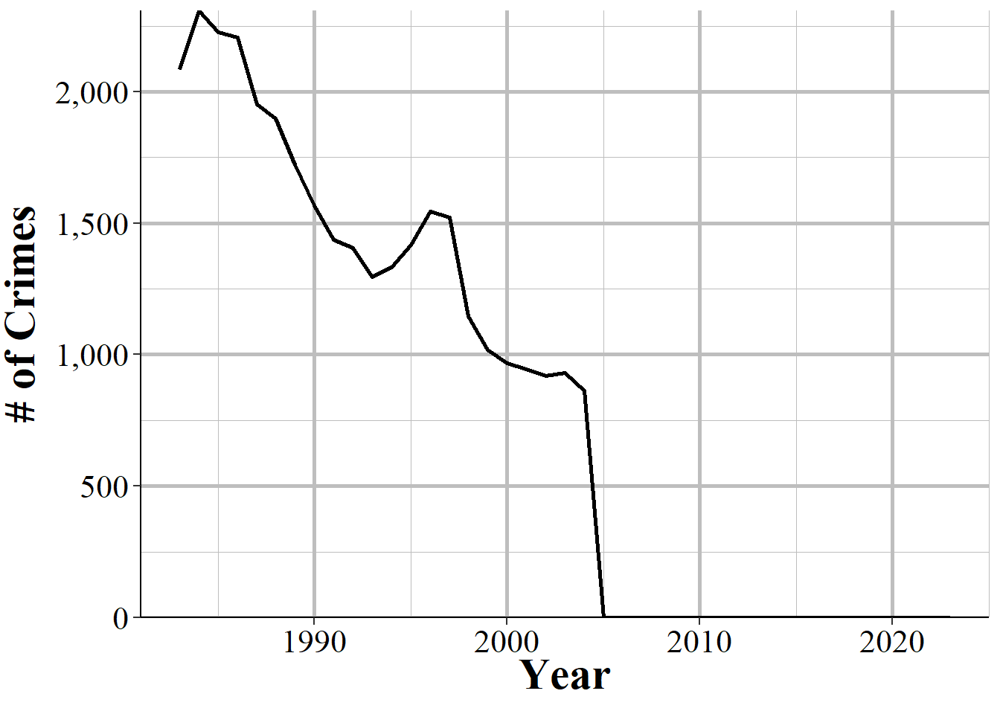

(\#fig:denverUnfounded)The annual number of unfounded crimes in Denver, CO, 1983-2022.

## Important changes

There are two major changes in recording practices over the life of this dataset: an expansion of what counts as rape, and a reduction in what counts as manslaughter. 

### Rape definition change

The FBI changed the definition of rape for UCR data starting in 2013 to a broader definition than the older definition, which is commonly called the "legacy definition" or "legacy" or "historical" rape. The legacy definition is "the carnal knowledge of a female **forcibly** and against her will" (emphasis added). This means that only rape is only included in UCR data when it is a female (of any age, there is no differentiation for child victims) forcibly vaginally penetrated by a penis. This is a narrow definition and excludes a number of sexual acts that people may consider rape such as forced oral or anal sex, and cases with a male victim. 

Starting in 2013, rape has a new, broader definition in the UCR to include oral and anal penetration (by a body part or object) and to allow men to be victims. The new definition is: "Penetration, no matter how slight, of the vagina or anus with any body part or object, or oral penetration by a sex organ of another person, without the consent of the victim." The previous definition included only forcible intercourse against a woman. This definition is far broader and is effectively any non-consensual sexual act. It also includes male victims though the data does not differentiate between male or female (or any other gender) victims. 
 
Both the current and legacy definitions exclude statutory rape and incest other than forcible incest.^[Both of these are recorded in NIBRS.] They both also include lack of consent as cases where the victim cannot give consent, such as if they are too young or are mentally or physically incapacitated - the FBI specifically give the example of being temporarily incapacitated through drugs or alcohol.

As this revised definition is broader than the original one post-2013, rape data is not comparable to pre-2013 data. 2013, however, is simply the year that the FBI required that agencies report using the new definition. As might not be too surprising, not all agencies followed this requirement. We'll look at four examples to show when there is clear evidence that the agency did change their definition in 2013, when it's clear they did so a year later, when it's unclear exactly when they made the change, and when the agency seems to not follow the change at all. 

We'll start with the Philadelphia Police Department shown in Figure \@ref(fig:rapePhilly). It's declining slowly but steadily over the 2000-2012 time period until spiking sharply in 2013. Since the rape definition change in 2013 is far broader than previous year's definition, this makes sense. A broader definition should lead to a sudden increase in reported rapes if the agency is reporting correctly. 

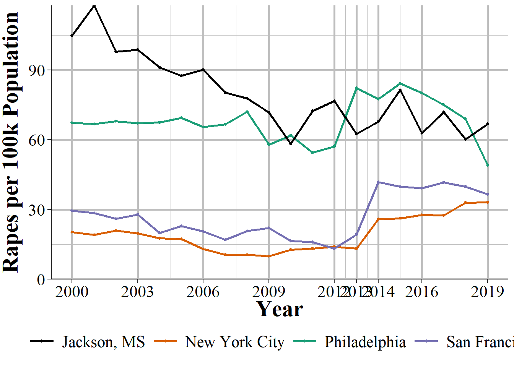

(\#fig:rapePhilly)The annual number of rapes reported in Philadelphia, Pennsylvania, 2000-2022.

In comparison, New York City has the sudden spike a year later, which indicates that they didn't start using the new definition until 2014. Figure \@ref(fig:rapeNYC) shows that rape is fairly steady, though increasing, in the years leading up to 2013 and has almost no change from 2012 to 2013, but a huge increase in 2014 and then steadily increases from there, spiking again in 2018. This seems like a fairly clear indicator that NYC simply didn't follow the new definition until 2014. 

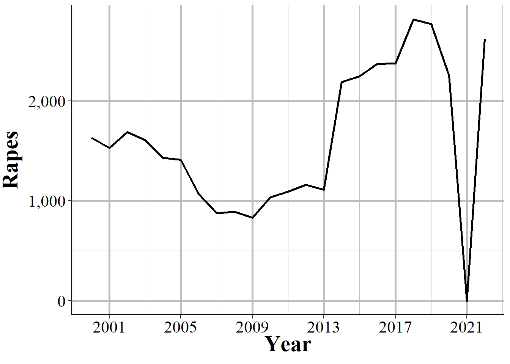

(\#fig:rapeNYC)The annual number of rapes reported in New York City, 2000-2022.

Less clear is what's happening in San Francisco, shown in Figure \@ref(fig:rapeLA). Here we do see an increase in 2013 which while it appears small on the graph is actually a 49% increase from 2012. Then there is a much larger spike in 2014 - a 120% increase - which may suggest that part of the agency started following the new definition in 2013 and the remainder followed in 2014. Or maybe some months used the old definition and others the new definition in 2013, while all of 2014 used the new definition However, increases or decreases are relatively common in San Francisco so it could also be that the agency only switched to the new definition in 2014 and the spike in 2013 is just a coincidence.

(\#fig:rapeLA)The annual number of rapes reported in San Francisco, California, 2000-2022.

Finally, we'll look at Jackson Police Department in Mississippi where the definition change seems to have had no effect. As seen in Figure \@ref(fig:rapeJackson), reported rapes start to undulate in 2010 with 2013 data perfectly in line with the before and after trends - no sign that there is a change in reporting. This suggests that Jackson simply did not follow the definition change and continues to report using the old definition. 

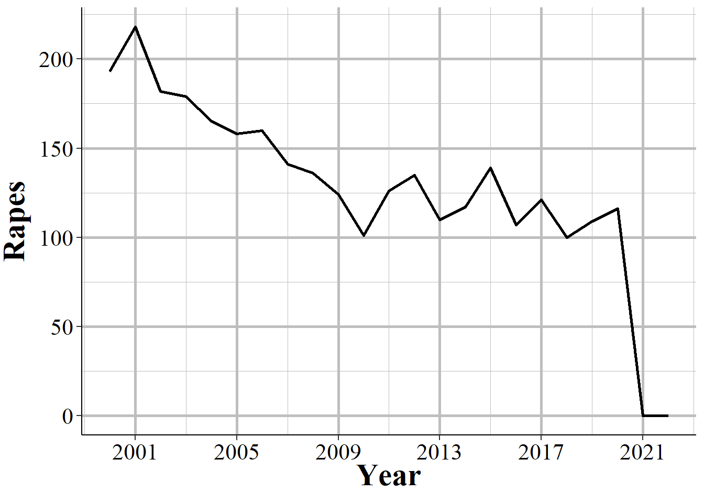

(\#fig:rapeJackson)The annual number of rapes reported in Jackson, Mississippi, 2000-2022.

My takeaway from this is that rape should not be used at all for years after 2012. While the definition change makes pre-2013 and 2013+ years non-comparable, the differences in agency responses to this change - i.e. if they follow the rules or not - is such a mess that the data is too flawed to use. 

### The decline of manslaughter

This data contains two different crime subcategories for homicide: "murder and non-negligent manslaughter," and "manslaughter by negligence." The first is our measure of murder, and it includes everything we traditionally think of when it comes to murder - shootings, stabbings, strangulation, basically any intentional killing of another person.^[Attempted murder is usually classified as an aggravated assault.] Suicides, killing a fetus, and accidental killings (e.g. car crashes) are not considered murders.^[Even the intentional killing of a fetus is classified as an aggravated assault against the mother, not a murder of the fetus.] The second, manslaughter by negligence - usually called just "manslaughter" - is when someone kills another person through "gross negligence" but does not kill them intentionally. This can include accidental killings when the death was caused by gross negligence. The FBI provide examples of this as kids playing with guns and shooting each other (and not knowing the gun was loaded) or a hunter accidentally shooting someone while hunting. After the late 1970s this excludes deaths from traffic accidents caused by negligence, such as hit and runs or DUIs. However, prior to this, these deaths were included, which is the cause of the very high number of manslaughters in the 1960s and 1970s.

Figure \@ref(fig:manslaughterVsMurder) shows the annual number of murders, manslaughters, and the sum of the two nationwide from 1960-2022. This just sums up the total reported counts from every agency each year so part of the increase is simply due to more agencies reporting as the year gets closer to the present day - so please pay attention to the diverging paths of each crime, not the trend for the individual crime over time. Murder is always more common than manslaughter, but these values are not that far apart in the early decade of data and manslaughter doesn't become rare until the end of the 1970s. 

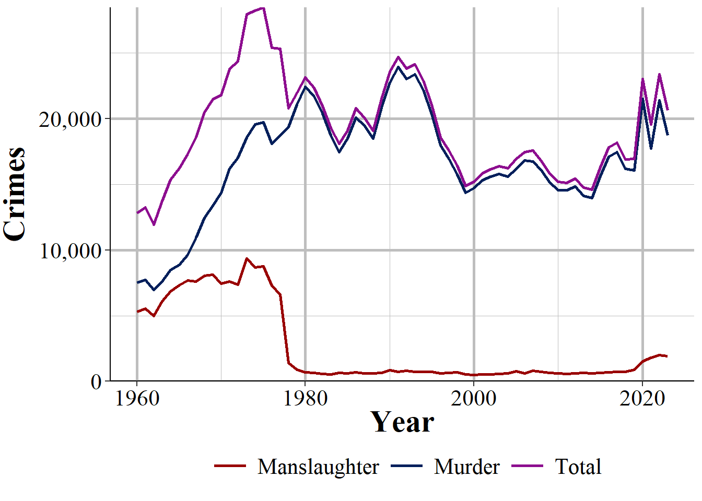

(\#fig:manslaughterVsMurder)The annual number of murder and non-negligent manslaughter, manslaughter by negligence, and the sum of the two, nationwide from 1960-2022.

Figure \@ref(fig:manslaughterPercent) shows another way to look at this data: manslaughter as a percent of reported murder. In the early years of our data manslaughter was fairly common, with about 70-80% as many manslaughters reported as murders. This declined sharply in the mid-1960s until there were around 45% as many manslaughters as murders in the mid-1970s. Again, this declined until it was about 4% in 1980, and it has remained around there ever since. As police behavior could reduce traffic fatalities - and arrests for DUIs and traffic tickets are designed to improve public safety - it is unfortunate the we no longer have data on traffic deaths. 

Manslaughter increased to over 1,000 for the first time since 1978 in 2020, increased against to over 1,700 in 2021 and continued at around that number in 2022. This is possibly related to the increase in murders over the last few years of available data. Unfortunately, this dataset doesn't allow us to do almost anything at figuring out more information than monthly or annual counts. NIBRS, in comparison, allows us to do this kind of deep dive, and for curious readers NIBRS also has manslaughter so you can investigate this question yourself. 

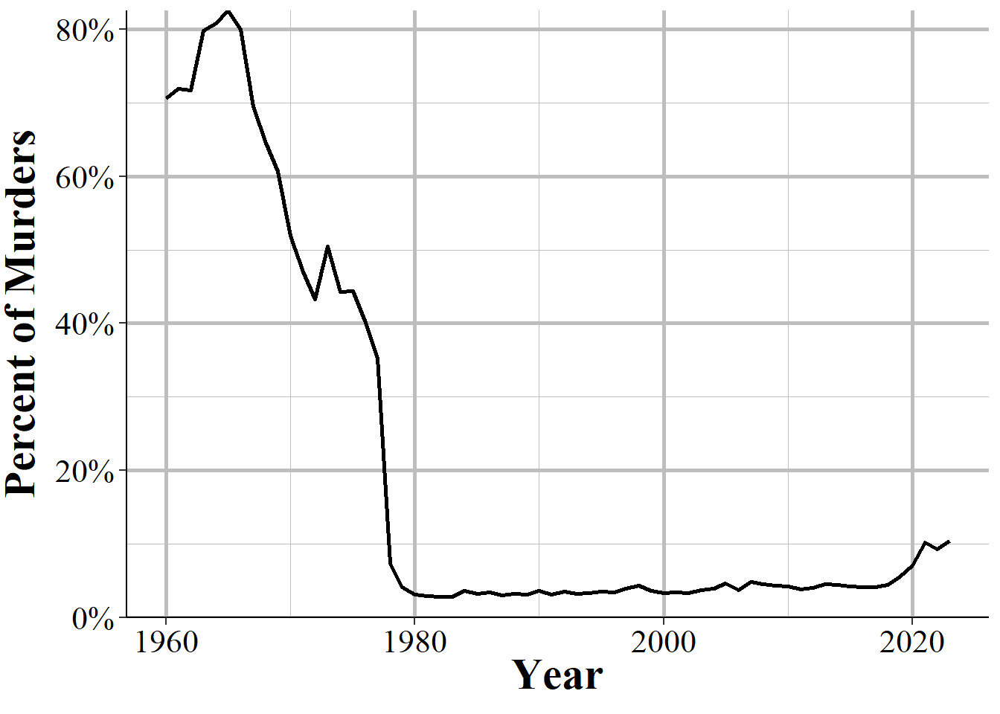

(\#fig:manslaughterPercent)Reported manslaughter by negligence as a percent of reported murder and non-negligent manslaughter, nationwide 1960-2022.

