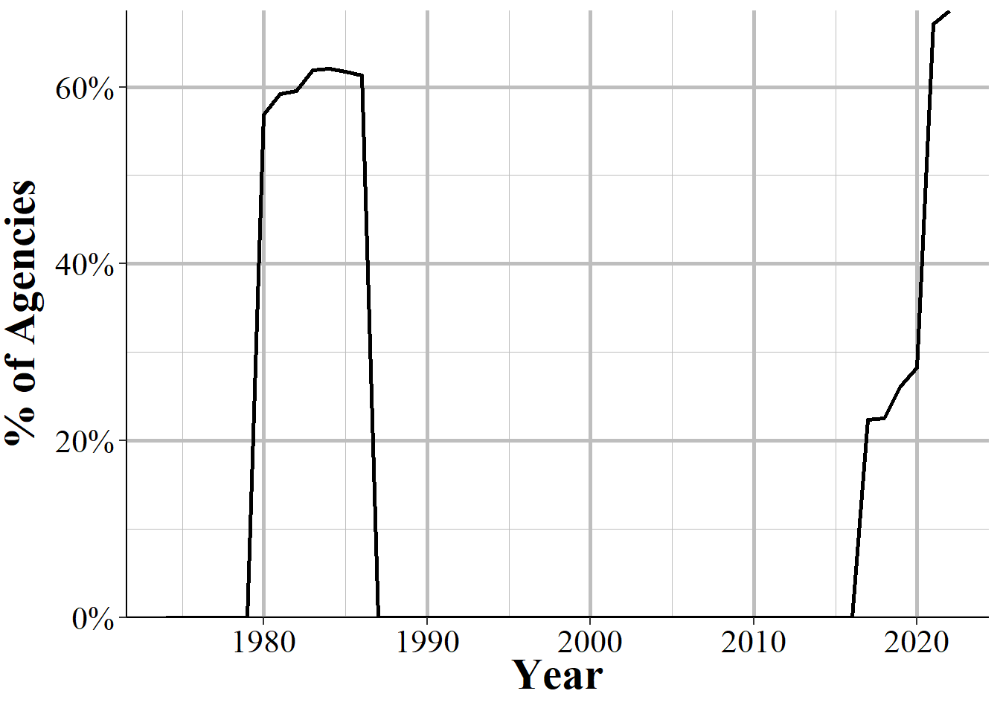

# Arrests by Age, Sex, and Race {#arrests}

The Arrests by Age, Sex, and Race dataset - often called ASR, or the "arrests data", or sometimes the "Arrests by Age, Sex, Race, and Ethnicity (ASRE) though this is really misleading since most years don't even report ethnicity data - includes the monthly number of arrests for a variety of crimes and, unlike the crime data, breaks down this data by age and gender. This data includes a broader number of crime categories than the crime dataset (the Offenses Known and Clearances by Arrest data) though is less detailed on violent crimes since it does not breakdown aggravated assault or robberies by weapon type as the Offenses Known data does. For each crime it says the number of arrests for each gender-age group with younger ages (15-24) showing the arrestee's age to the year (e.g. age 16) and other ages grouping years together (e.g. age 25-29, 30-34, "under 10"). It also breaks down arrests by race-age by including the number of arrestees of each race (American Indian, Asian, Black, and White are the only included races) and if the arrestee is a juvenile (<18 years old) or an adult. The data does technically include a breakdown by ethnicity-age (e.g. juvenile-Hispanic, juvenile-non-Hispanic) but almost no agencies report this data (for most years zero agencies report ethnicity) so in practice the data does not include ethnicity. As the data includes counts of arrestees, people who are arrested multiple times are included in the data multiple times - it is not a measure of unique arrestees. 

## Agencies reporting

This data is available from 1974 through 2019 and Figure \@ref(fig:arrestsAgenciesReporting) shows how many agencies reported at least one month of the year for each of these years. I'm not sure why there's a dip in 1980. Since it immediately reverses itself in the next year I think it's just a data issue, not a real decrease in the number of agencies that report. The first year of data has about 9,000 agencies reporting and that increases strongly to a little over 13,000 in 1979. Following the odd blip in 1980, the number of agencies remain steady for nearly a decade before declining to a local low of about 11,000 in 1998 before again increasing steadily until the end of our data where nearly 15,000 agencies report. This 15,000, however, still remains under the estimated 18,000 police agencies in the United States and below the reporting rates of UCR data such as the Offenses Known and Clearances by Arrest data. This data is also missing some important cities such as New York City which hasn't reported even a single month since 2002 and Chicago which tends to only report a single month if at all.   

(\#fig:arrestsAgenciesReporting)The annual number of agencies reporting at least one month of data in that year.

If we look at agencies that report all 12 months of the year, as seen in Figure \@ref(fig:arrestsAgenciesReporting12Months), now far fewer agencies report. In almost every year about 45-55% of agencies that report at all report all 12 months. This means that we're missing data for about half of agencies. When an agency reports at all, they tend to report more months than fewer. For example, there are about twice as many agency-years with 11 months reported than with only 1 month reported. So having only about half of agencies report all 12 months of the year doesn't mean that we're missing a ton of data from the remaining half of agencies - but does merit close attention to which agencies you use in your research and how much missingness there is for those agencies. 

(\#fig:arrestsAgenciesReporting12Months)The annual number of agencies reporting 12 months of data in that year.

Another issue is that agencies can report only some crimes. So, for example, they may report how many people were arrested for theft but not for murder, and it's unclear when that means that truly zero people were arrested for murder and when the agency just didn't report. This isn't in the original data but in my version of this data (available [here](https://www.openicpsr.org/openicpsr/project/102263/version/V12/view)), I added variables for the number of months reported (based on the agency reporting at least arrest for that crime in that year) for each crime category. Again, please note that when there are fewer than 12 months reported in that year for that variable, that could simply mean that there were no arrests for that crime that year (The FBI does tell agencies not to even submit a report in these cases) - but we don't know that for sure. 

## What is an arrest? (what unit is this data in?)

A key part of understanding this data is knowing what unit of analysis it's in. This data is the monthly number of *total arrests for a given crime, with only the most serious crime per incident included*. Consider for example, a person who robs a bank, shooting and killing a guard and pointing their gun at other people in the bank. They are arrested and then released from jail (just imagine that this is true) and are rearrested the next day for shoplifting. And let's further assume that both arrests were in the same month in the same agency. How many arrests are here? They committed multiple crimes in the first incident (murder, robbery, aggravated assault) but in this dataset they would only be classified as an arrest for the most serious crime, murder. And then separately they'd also be an arrested for shoplifting. So assuming that no other arrests occurred in that police agency that month, there would be two arrests reported: one for murder and one for shoplifting. 

There's no way to tell how many unique people were arrested, or of those arrested multiple times which crimes they were arrested for. So if you have 100 arrests there may be 1 person arrested 100 times or 100 people arrested once - though, of course, the true number is likely somewhere in between. This means that studies that try to use this data as a measure of unique people or even the percent of arrestees by group (age, gender, or race) relative to some base rate of the population such as the number of people living in that city are going to be wrong - though how wrong is unclear.^[While all studies are going to be estimates of the real effect, that's no reason to be flippant in using data (UCR and other data). Without having a high level of confidence that your estimates are close to the actual value, you shouldn't do that study.] 

Common uses of this data - more common in more news articles or advocacy group reports than in peer-reviewed research articles - compare the percent of arrestees of a certain group to the percent of a city's population of that group. Any differences between the arrestee percent and the resident percent is, according to these reports, evidence of a disparity (this is most common for looking at differences by race). Since these analyses are generally looking at annual data, it assumes that people of each group (usually they look at race but gender and age data is also available) are rearrested at the same rate. That is, White people, for example, are rearrested in the same year for the same crime at the exact same rate as Black people. If not, then you're be comparing different things since one group would have more overall people arrested while the other would have fewer people but who are arrested more frequently. Whether this distinction between arrests and unique people arrested affects your interpretation of the data depends on the study you are doing, but it's important to consider in your research. One way to address this is to use other data on the rate of rearrest by group, though you'd have to be very careful to not extrapolate the results of the other study too far beyond what they could tell you of the specific time and place they studied. 

### The Hierarchy Rule

In incidents where the arrestee commits multiple crimes, this data uses something called the Hierarchy Rule which says that only the most serious crime is counted as the crime that the person was arrested for. For a comprehensive overview of the Hierarchy Rule, please see Section \@ref(hierarchy). Basically, the FBI chose seven crimes in 1929 that they call Index Crimes - or sometimes called Part I crimes - and these were considered the most important crimes to be recorded. For more on Index Crimes, please see Section \@ref(indexCrimesOffensesKnown). If a person is arrested for multiple crimes and an Index Crime is one of those crimes, then the Index Crime at the top of the Hierarchy is the one recorded in this data. Section \@ref(arrestsCrimesIncluded) shows all crimes included and the crimes 1-7 as well as 9 (arson) are the Index Crimes. The top of the Hierarchy is the crime with the lowest number. So murder is always reported in incidents where there's a murder; rape is always reported when there's an incident with rape but no murder; etc. 

In incidents where the arrestee committed both an Index Crime and a Part II crime, then only the top Index Crime is recorded. This can lead to rather silly results since some Part II crimes are certainly more serious than some Index Crimes. Consider, for example, a person arrested for simple assault, carrying a firearm, pimping, and of theft. The first three crimes are, in my opinion, clearly more serious than theft. But since theft is an Index Crime, this person would be considered to have been arrested for theft. 

The remaining crimes are called Part II crimes and are not arranged in any particular way. So a lower value numbered crime is not higher on the Hierarchy than a higher value number - Part II crimes don't follow the Hierarchy. If all of the crimes in an incident are Part II crimes then the agency must decide for themselves which crime is the most serious. This can lead to agencies deciding their own hierarchy differently than others which makes this data much less comparable across agencies than if there was a standard rule. 

## Crimes included {#arrestsCrimesIncluded}

1. Homicide
  + Murder and non-negligent manslaughter
  + Manslaughter by negligence
2. Rape
3. Robbery
4. Aggravated assault
5. Burglary 
6. Theft (other than of a motor vehicle)
7. Motor vehicle theft
8. Simple assault
9. Arson
10. Forgery and counterfeiting
11. Fraud
12. Embezzlement
13. Stolen property - buying, receiving, and possessing
14. Vandalism
15. Weapons offenses - carrying, possessing, etc.
16. Prostitution and commercialized vice
17. Sex offenses - other than rape or prostitution
18. Drug abuse violations - total
  + Drug sale or manufacturing
    - Opium and cocaine, and their derivatives (including morphine and heroin)
    - Marijuana
    - Synthetic narcotics
    - Other dangerous non-narcotic drugs
  + Drug possession
    - Opium and cocaine, and their derivatives (including morphine and heroin)
    - Marijuana
    - Synthetic narcotics
    - Other dangerous non-narcotic drugs
19. Gambling - total
  + Bookmaking - horse and sports
  + Number and lottery
  + All other gambling
20. Offenses against family and children - nonviolent acts against family members. Includes neglect or abuse, nonpayment of child support or alimony.
21. Driving under the influence (DUI)
22. Liquor law violations - Includes illegal production, possession (e.g. underage) or sale of alcohol, open container, or public use laws. Does not include DUIs and drunkenness.
23. Drunkenness - i.e. public intoxication
24. Disorderly conduct
25. Vagrancy - includes begging, loitering (for adults only), homelessness, and being a "suspicious person."
26. All other offenses (other than traffic) - a catch-all category for any arrest that is not otherwise specified in this list. Does not include traffic offenses. Very wide variety of crimes are included - use caution when using!
27. Suspicion - "Arrested for no specific offense and released without formal charges being placed."
28. Curfew and loitering law violations - for minors only.
29. Runaways - for minors only.

## Important variables

This data has the standard set of variables describing the agency that is reporting. This includes the agency ORI - which is the unique ID for that agency - the agency name, their state, the population under their jurisdiction, and the month and year of the data.

For each crime this data provides the number of arrests in that month (or year for the annual data) broken down by age (within this, by gender), by race (within this, by if they are a juvenile or an adult), and by ethnicity though this is an enormously flawed variable. Finally, we also know the number of juvenile arrests that ended in a few possible outcomes, though we don't know the crime that led to these arrests. We'll get into each of these variables below. 

### Age

For each crime the data provides the number of people of each gender by age, with several years in the peak offending age given as the specific age and younger and older ages broken into groups. Only female and male genders are available, and there is no variable for "unknown" gender. So to get a total arrests for that crime for that age, just add the female and male variables together. Below are the ages or age categories included in the data, and these are the same for female and male arrestees.

* Female
    + Under 10
    + 10-12
    + 13-14
    + 15
    + 16
    + 17
    + 18
    + 19
    + 20
    + 21
    + 22
    + 23
    + 24
    + 25-29
    + 30-34
    + 35-39
    + 40-44
    + 45-49
    + 50-54
    + 55-59
    + 60-64
    + 65 and older
* Male
    + Under 10
    + 10-12
    + 13-14
    + 15
    + 16
    + 17
    + 18
    + 19
    + 20
    + 21
    + 22
    + 23
    + 24
    + 25-29
    + 30-34
    + 35-39
    + 40-44
    + 45-49
    + 50-54
    + 55-59
    + 60-64
    + 65 and older
    
One way to use this data is to look at the age-crime curve of offending. The age-crime curve is a criminological finding that crime trends to grow in the early teenage years to peaking around age 18 before declining sharply. So essentially people commit crime as teenagers and then tend to fizzle out as they get older. Figure \@ref(fig:phillyRapeAge) shows this trend for male arrestees of rape in Philadelphia from 1974-2022, which is every year of data we have available. A major problem with this figure is that some of the ages are for single years and some are for age categories. In the graph there were 748 arrests for rape for people aged 24. The next age is the category of aged 25-29 and there were 3,442 arrests for this age group. One way to address this is to assume that each age in the category has the same number of arrests, so dividing 3,442 by 5 gives us about 688 arrests per age. Assuming equal arrests by age, however, is not consistent with either the literature on the age-crime curve or the findings in this figure for previous ages, as the number of arrests by age is, overall, going down since age 18. So instead of assuming equality, would we assume that older ages have fewer arrests than younger ages (maybe taking the percent change from the previous years where we do have individual ages available)? This is a tricky question to answer and it makes these kinds of analyses really hard to do - and very imprecise since all of your assumptions will be wrong, though hopefully not *too* wrong. 

(\#fig:phillyRapeAge)The total number of rapes by male arrestees reported by arrestee age in Philadelphia, 1974-2022.

### Race

The data also breaks down the number of arrests for each crime by race, with the only included races being American Indian, Asian, Black, and White. This is further broken down into if the arrestee was an adult (18 years or older) or a juvenile (under 18).  Whether the arrestee is Hispanic is in a separate (and nearly universally non-reported variable). Since the ethnicity variable is separate, and since the data is not at the arrestee-level unit, there's no way to interact the race and ethnicity variables. So, for example, there is no way to determine how many White-Hispanic or White-Non-Hispanic arrestees. Just total White arrestees and total Hispanic arrestees. 

As with race variables in other UCR datasets - and, really, any dataset - you should be cautious about using this variables since it is the officer's perception of the arrestee's race - though of course some arrests do have other data about the arrestee's race such as what they tell the officer. 

Even though there is information about the specific age of arrestee (or the age range, depending on the arrestee's age) and their gender, there is no gender information combined with race and no age beyond the adult/juvenile binary. If you add up all arrests that are broken down by gender-age and compare it to the sum of all of the arrests broken down by adult/juvenile-race here, in some cases these numbers don't add up. That's because while most agencies do report the age variables, not all agencies report the race variables. So summing up the race variables will actually undercount the total number of arrests. 

* Adult
    + American Indian
    + Asian
    + Black
    + White
* Juvenile
    + American Indian
    + Asian
    + Black
    + White
    
Figure \@ref(fig:phillyMarijuanaRacePercent) shows one example of an analysis of this data by showing the percent of arrests of adults for marijuana possession by the arrestee's race in Philadelphia, PA for all years of data we have available, 1976-2022. At the bottom are American Indian and Asian arrestees who make up nearly none of the arrests for this crime. Black arrestees, shown in purple, make up the bulk of arrests with only a few years making up under 60% of arrests and growing to around 80% of arrests since the mid-2000s. As White arrestees, shown in black, are the only other race category included, they make up a near perfect mirror image of Black arrestees, composing of around 40% of arrests until decreasing starting in the 1990s to end up with about 20% of arrests in recent years. 

(\#fig:phillyMarijuanaRacePercent)The annual percent of adult marijuana possession arrests in Philadelphia by arrestee race, 1976-2022.

Interestingly, while the disparity between Black-White arrests has grown dramatically in recent decades, the total number of arrests have a very different trend as shown in Figure \@ref(fig:phillyMarijuanaRaceCount). Total marijuana possession arrests declined in the mid-1980s then increased in the mid-1990s from only a few hundred arrests in the early 1990s to nearly 6,000 arrests in the late-2000s before dropping precipitously to about 700 each year in the late-2010s. Yet throughout this latter period as a percent of arrests, Black people consistently grew for years before plateauing around 2007 with a small decline in the last few years. Philadelphia decriminalized marijuana possession in 2014 under Mayor Nutter which is right when the steepest decline in arrests happened, though in the last couple of years also saw a decline in arrests. This suggests that who is arrested, in terms of race, is relatively unrelated to the total number of arrests, at least for marijuana.
    

(\#fig:phillyMarijuanaRaceCount)The annual number of adult marijuana possession arrests in Philadelphia by arrestee race, 1976-2022.

  
### Ethnicity

While technically included, the ethnicity variable is largely useless since for most years no agencies reported it and for the years where agencies do report ethnicity, not all agencies do so. The ethnicities included are Hispanic and non-Hispanic are broken down by if the arrestee is an adult (18+ years old) or a juvenile (<18 years old).

* Adult
    + Hispanic
    + Non-Hispanic
* Juvenile
    + Hispanic
    + Non-Hispanic

Figure \@ref(fig:theftHispanic) shows the annual number of Hispanic arrestees for theft for all agencies that reported any data that year.^[Theft is used as it's one of the most common crimes.] For several years no agencies reported until the number of Hispanic arrestees start climbing in 1980 and peaks in 1986 at about 136,000 arrestees. Then there are zero Hispanic arrestees for a few years, four Hispanic arrestees in 1990, and then again zero Hispanic arrestees, this time for decades. Only in 2017 do the number of Hispanic theft arrestees begin to creep up. From 2017 to 2019 (the last year available at the time of this writing) there are Hispanic arrestees reported every year, though now only about 30,000 per year. 
    

(\#fig:theftHispanic)The national annual number of Hispanic arrestees for theft. This includes all agencies that year that reporting any number of months. Hispanic arrestees include both juvenile and adult arrestees

Perhaps a better way to look at this data is to see what percent of agencies report ethnicity data. Figure \@ref(fig:theftHispanicPercentAgencies) show the percent of agencies each year that report at least one Hispanic or non-Hispanic (which are the only choices, but showing only Hispanic arrests would exclude agencies where no Hispanic people truly were arrested) arrest for theft, of all agencies that reported theft data. About 90-95% of agencies reported ethnicity data in the early 80s and then only a couple agencies report in 1990 and 1991. Other than those agencies, none report between 1987 and 2017. Starting in 2017, 36% of agencies report and this number has grown by about five percentage points a year to 46% in 2019. Since fewer than half of agencies currently report, I strongly recommend against using these variables, even for the recent years of data. 

(\#fig:theftHispanicPercentAgencies)The annual percent of agencies that report theft arrests that reported at least one Hispanic person or one non-Hispanic person arrested for theft. Arrestees include both juvenile and adult arrestees.

### Juvenile referrals

The final variable of interest are five mutually exclusive outcomes for juveniles who are arrested by the police for a crime that if they were adults would have been counted as a formal arrest. Unlike the rest of this dataset where juvenile is defined as being under the age of 18, these variables allow states to use their own definition of juvenile. So potentially the limit for who is a juvenile could be below the age of 18, and nothing in the data indicates when this is so - you'd have to check each state to see their definition and if it changed over time. There is no breakdown by crime so this gives you the outcomes for juveniles arrested for all crimes in that agency. Please note that the number of juveniles in other variables and the number here do not always line up, which is a mix of underreporting of this variable, arrests for other jurisdictions are not counted as an arrest in the above variables, and different age definitions for who is a juvenile. A juvenile may potentially get multiple referrals, such as being released and then later referred to court. But in this data only the *initial* referral is included. Below are the five potential outcomes and definitions of each: 

* Handled within department and released
    + Juvenile is arrested but then released without any formal charges. Generally released to adult relatives with a warning but no formal charge.
* Referred to juvenile court or probation department
* Referred to welfare agency
* Referred to other police agency
    + This includes when the agency makes an arrest on behalf of a different agency, such as when the juvenile committed a crime in that different agency's jurisdiction. People arrested in this category are also not included in the other variables for juvenile arrests (e.g. arrests by age) as that only includes people who committed a crime in the agency's own jurisdiction. 
* Referred to criminal or adult court
    + These are juveniles who are referred to be tried in criminal court as adults. This is for states that allow juveniles to be tried as adults. This is the police's recommendation that they be tried as adults, regardless of the decision of the district attorney or court for whether that juvenile is ultimately tried as an adult. 

We can look at an example of this in Figure \@ref(fig:phillyJuvenileReferrals) which shows the annual number of referral types in Philadelphia from 1974-2022. For all the first couple of years almost all of the referrals have either been that the agency handles the arrest internally and releases the juvenile without any formal charges, or that the juvenile is formally arrested and referred to juvenile court. This is a pretty consistent trend with those two categories being the predominant outcome for juveniles arrested in other agencies and over time. In most years handled internally is the most common outcome though juvenile court is occasionally more common, including in recent years.  

(\#fig:phillyJuvenileReferrals)The annual number of juvenile referrals in Philadelphia by referral type, 1974-2022.

