# Supplementary Homicide Reports (SHR) {#shr}

The Supplementary Homicide Reports dataset - often abbreviated to SHR - is the most detailed of the SRS datasets and provides information about the circumstances and participants (victim and offender demographics and relationship status) for homicides. For each homicide incident it tells you the age, gender, race, and ethnicity of each victim and offender as well as the relationship between the first victim and each of the offenders (but not the other victims in cases where there are multiple victims). It also tells you the weapon used by each offender and the circumstance of the killing, such as a "lovers triangle" or a gang-related murder. As with other SRS data, it also tells you the agency it occurred in and the month and year when the crime happened. 

One important point of clarification: this is not the number of murders, though it does track that. This data also includes the number of homicides that are manslaughter by negligence (e.g. children playing with a gun, hunting accident) and justifiable homicides (i.e. not criminal). So be carefully when speaking about this data. It is murders but not only murders so you want to speak precisely. 

## Agencies reporting

This data only has a report when the agency has a homicide that year and since homicides are relatively rare it is difficult to measure underreporting. One way we can look at reporting is to compare homicide in the SHR data with that of other datasets. We'll look at two of them: the Offenses Known and Clearances by Arrest which is covered in detail in Chapter \@ref(offensesKnown), and the Center for Disease Control and Prevention (CDC) data on national deaths from homicide.^[CDC WONDER data is available here: https://wonder.cdc.gov/] Both this dataset and the Offenses Known and Clearances by Arrest data are SHR datasets so you may think that the numbers of homicides from each dataset should be the same. That is a perfectly reasonable assumption, but since this is SHR data we're talking about, you'd be wrong. Police agencies are free to report to either, both, or neither dataset so while the number of homicides are close for each dataset, they are never equal. CDC WONDER data aggregates mortality data (among other data) from state death certificates which reduces the issue of voluntary reporting that we have in SHR data.

Figure \@ref(fig:shrVsOffenses) shows the annual number of homicide victims (including murders and manslaughters) from each of these datasets starting in 1976 for the SHR data and in 1999 for the CDC data.^[1975 is actually the first year that the Supplementary Homicide Reports data is available but that dataset only has info for a single victim and offender - all later years has info for up to 11 victims and offenders - so 1976 is often used as the first year of data] 

For the SHR data, in every year the numbers are fairly similar and the trends are the same over time, but the number of homicides is never equal. The numbers have actually gotten worse over time with the difference between the datasets increasing and the Offenses Known data having consistently more murders reported than the SHR data since the late 1990s. Compared to the CDC data, however, both SHR datasets - and in particular the SHR data - undercount the number of homicides. While trends are the same, SHR data reports thousands fewer murders per year than the CDC data, indicating how much of an issue underreporting is in this data.

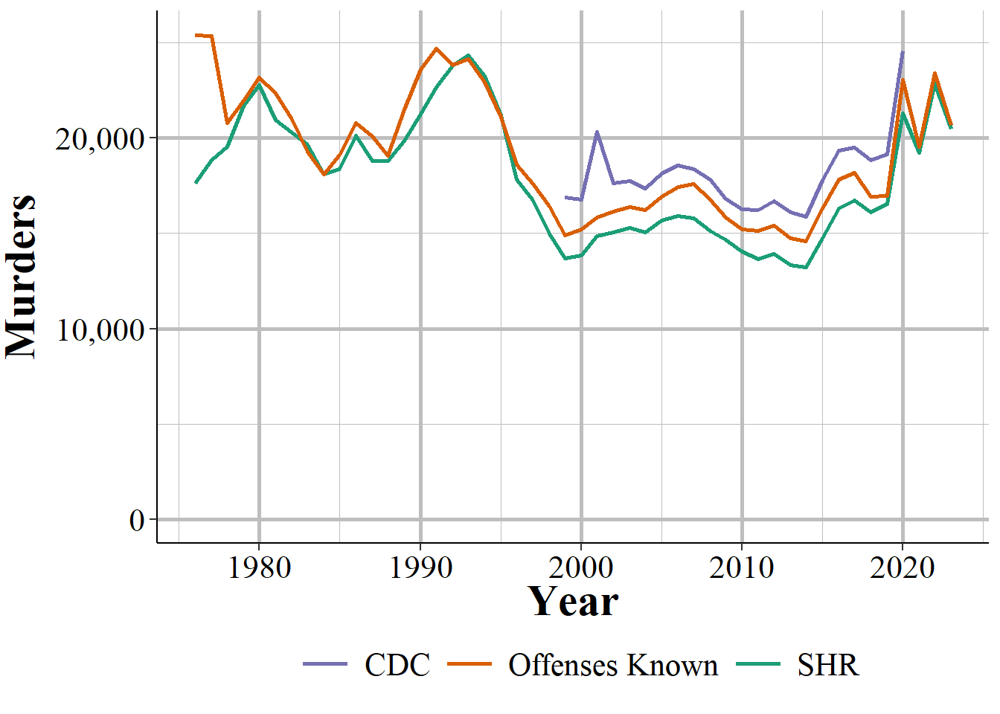

(\#fig:shrVsOffenses)The annual number of murders from the Supplementary Homicide Report and the Offenses Known and Clearances by Arrest dataset. Numbers differ because agencies voluntarily report and may not report to both datasets.

Let's look at Chicago for another example of the differences in reporting from the SHR and the Offenses Known data. Figure \@ref(fig:chicagoSHRvsOffensesKnown) shows the annual number of homicide victims from both datasets. In most years they are pretty similar, excluding a few really odd years in the 1980s and in 1990. But what's also strange is that most years have more SHR victims than Offenses Known victims. So nationally SHR has fewer homicides than Offenses Known but that pattern is reversed in Chicago? This is one of the many quirks of SHR data. And is a warning against treating national trends as local trends; what is true nationally isn't always true in your community. So when you use this data, check everything closely. And once you've done that, check it again. 

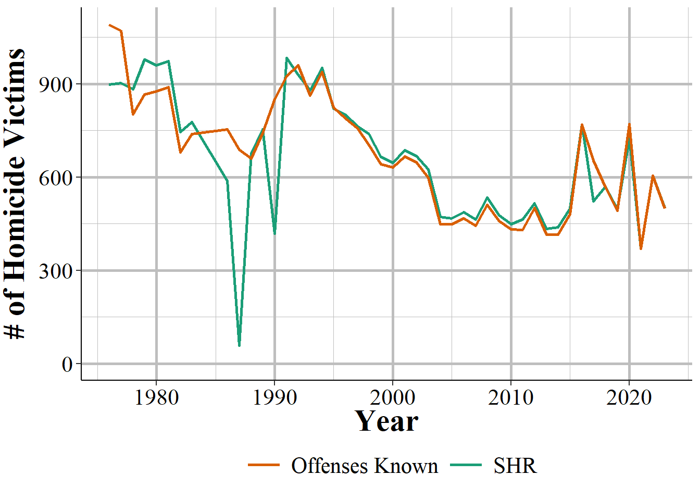

(\#fig:chicagoSHRvsOffensesKnown)The annual number of homicide victims in Chicago, SHR and Offeksnes Known, 1976-2022.

Another way to visualize reporting is to see the total number of agencies that report at least one homicide, as depicted in Figure \@ref(fig:shrAnnualAgencies). Here we can see that have about 3,000 agencies reporting. Given that most agencies are small and truly do have zero homicides in a year, that may be reasonable. Agencies that don't have homicides don't submit a report saying so, they just don't submit any data. So that makes it hard to tell when an agency not reporting data is doing so because they choose to not report, or because they have nothing to report. This is most common in small agencies where many years truly have no homicides. But let's look at our biggest agencies, and see how much of an impact it would make to have them not report data.

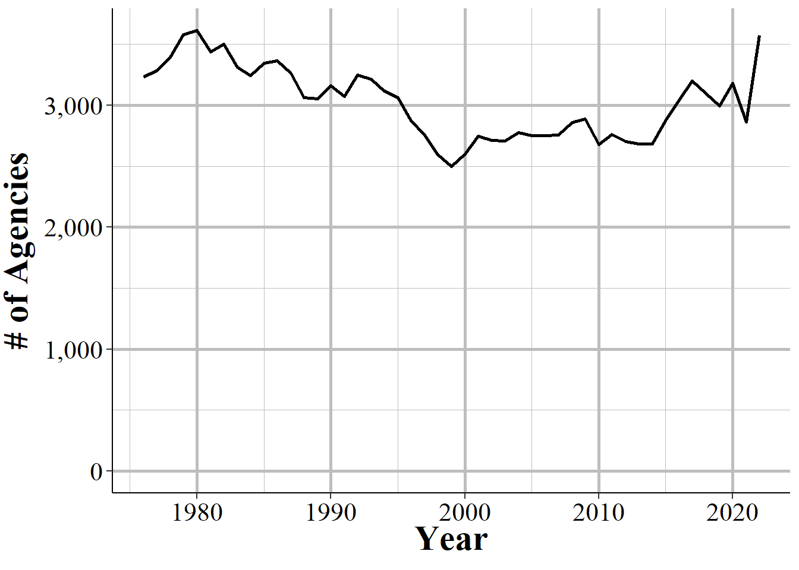

(\#fig:shrAnnualAgencies)The annual number of agencies that report at least one homicide.

Figures \@ref(fig:shrTopAgenciesCount) and \@ref(fig:shrTopAgenciesCountPercent) attempt to get at this question by looking the number and percent of all incidents that the top 100, 50 and 10 agencies based on number of homicide incidents make up out of all homicide incidents in each year. These agencies are massively disproportionate in how many homicides they represent - though they are also generally the largest cities in the country so are a small number of agencies but a large share of this nation's population. On average, the 10 agencies with the most homicide incidents each year - which may change every year - have over 4,000 homicide incidents and make up about 1/4 of all homicide incidents reported nationally. The top 50 have about 7,500 incidents a year, accounting for 46% of incidents. The top 100 agencies have a bit under 10,000 incidents a year and make up over 55% of all homicide incidents in the United States. So excluding the largest agencies in the country would certainly undercount homicides.

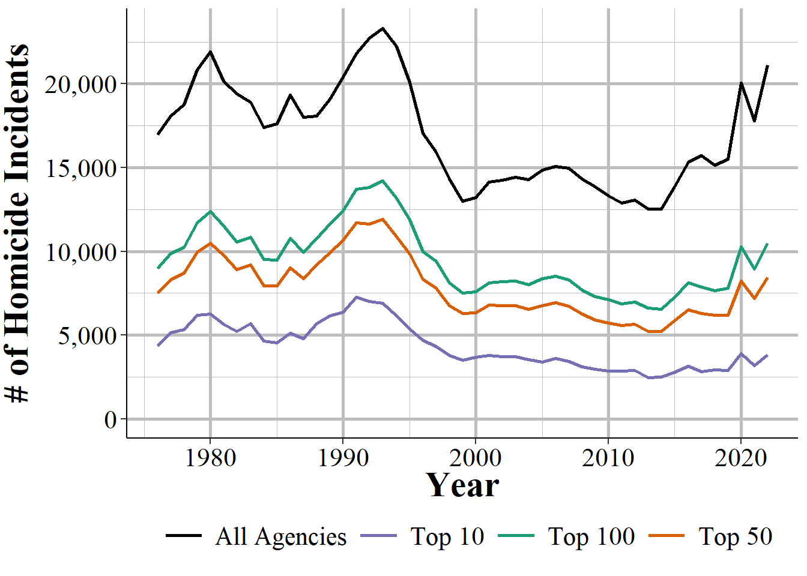

(\#fig:shrTopAgenciesCount)The annual number of homicide incidents, showing all agencies, the top 100 agencies (by number of homicide incidents), top 50, and top 10 agencies, 1976-2022.

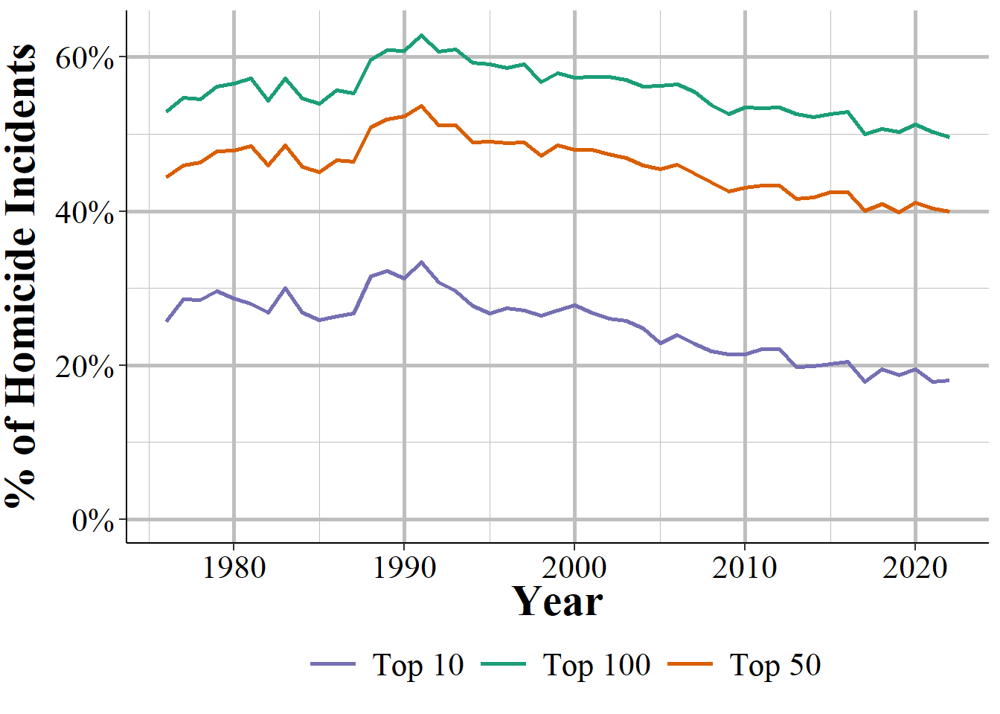

(\#fig:shrTopAgenciesCountPercent)The annual percent of homicide incidents by the top 100 agencies (by number of homicide incidents), top 50, and top 10 agencies, 1976-2022.

## Important variables

The data has demographic information for up to 11 victims and 11 offenders, as well as the information on the weapon used by each offender, the relationship between the first victim and each offender, and the circumstance of the homicide. The data also has the traditional SHR set of variables about the agency: their ORI code, population, state, region and the month and year of this data. One key variable that is missing is the outcome of the homicide: there is no information on whether any of the offenders were arrested. 

While there is information on up to 11 victims and offenders, in most cases, there is only a single victim and a single offender in each incident. We can use the additional_victim_count and additional_offender_count columns to see how many additional victims/offenders there are. An additional victim/offender means in addition to the first one. Even though we have columns for up to 11 victims and offenders, in very rare instances the additional_[victim/offender]_count columns may say there are more than 11 victims/offenders.

To see how the breakdown for the number of victims in each incident looks, Figure \@ref(fig:numberSHRVictims) shows the percent of incidents with each possible number of victims.^[There are five incident where there are more than 11 victims. For simplicity of the graph, these incident are excluded.] In nearly all incidents - 96.0% - there was only a single victim. This drops to 3.3% of incidents for two victims, 0.5% for three victims, and only about 0.2% of incidents have four or more victims. 

(\#fig:numberSHRVictims)The percent of incidents from  that have 1-11 victims.

Figure \@ref(fig:numberSHROffenders) shows the breakdown of the number of offenders per homicide incident.^[There are seven incidents with more than 11 offenders. For simplicity of the graph, these incidents are excluded.] It's a little less concentrated than with victims but the vast majority of homicides are committed by one offender - or at least the police only report one offender. About 87.6% of homicides have only one offender, 8.4% have two, 2.5% have three, and 1.5% have four. Fewer than 0.5% of homicides have more than four offenders. However, this is all a bit misleading. In cases where there is no information about the offender, including how many offenders there is, the data simply says that there is a single offender. So the number of homicides with a single offender is an over-count while the number with more offenders is an undercount. 

(\#fig:numberSHROffenders)The percent of incidents from  that have 1-11 offenders.

The variable "situation" says what type of victim-offender number combination the incident is - e.g. "multiple victims/single offender", "single victim/multiple offenders", etc. - and does indicate if the number of offenders is unknown (though curiously there are over 4,000 instances where the number of offenders is unknown but they still say there are two offenders) so you can use this variable to determine if the police don't know how many offenders there is. You're still limited, of course, in that the number of offenders is always what the police think there are, and they may be wrong. So use this variable - and anything that comes from it like the percent of offenders of a certain race - with caution. 

We'll now look at a number of important variables individually. Since the data can potentially have 11 victims and 11 offenders - but in practice has only one each in the vast majority of cases - we'll only look at the first victim/offender for each of these variables. Therefore, the results will not be entirely accurate, but will still give you a good overview of the data. The figures below will use data for all homicides from 1976 to 2022 so will cover all currently available years of data. Keep in mind that national trends aren't the same as local trends so what is shown in these figures will probably not be the same as what is happening in your community. And that looking at all homicides means we are including murders, manslaughters, and justifiable homicides. 

### Demographics

There are two broad categories of variables that we'll cover: demographics of the victim and offenders, and characteristics of the case. We start with demographics.

#### Age

This data includes the age (in years) for each victim and each offender. For those under one years old, it also breaks this down into those from birth to six days old "including abandoned infant" and those seven days old to 364 days old. So there's a bit more info on homicides of babies. It also maxes out the age at 99 so for victims or offenders older than that we don't get their exact age, just text that says "99 years or older" (which I turn to the number 99 in the figures below).  

Figure \@ref(fig:shrOffenderAge) shows the percent of homicides from  where the first offender in the case is of each age from 0-99. Offenders with unknown ages are excluded from this graph and make up about 27% of cases. The average (mean) age is 31.1 years old (shown in orange) which is due to a long right tail; the median age is 28 years old. If you look closely at the left side of the graph you can see that there are some very young offenders, with at least one offender for each year of age from 0 to 10 included in the data. It's not clear from this alone that these ages are a data entry error. While a two-year-old certainly couldn't kill someone, the data does include deaths caused by "children playing with gun" (homicide circumstances will be discussed in Section \@ref(circumstance)) so these ages could potentially be correct. 

If you're familiar with the age-crime curve in criminology - which basically says crime peaks in late teen years then falls dramatically - this shows that exact curve, though is older and doesn't decline as the offender ages as quickly as we see with less serious crimes. 

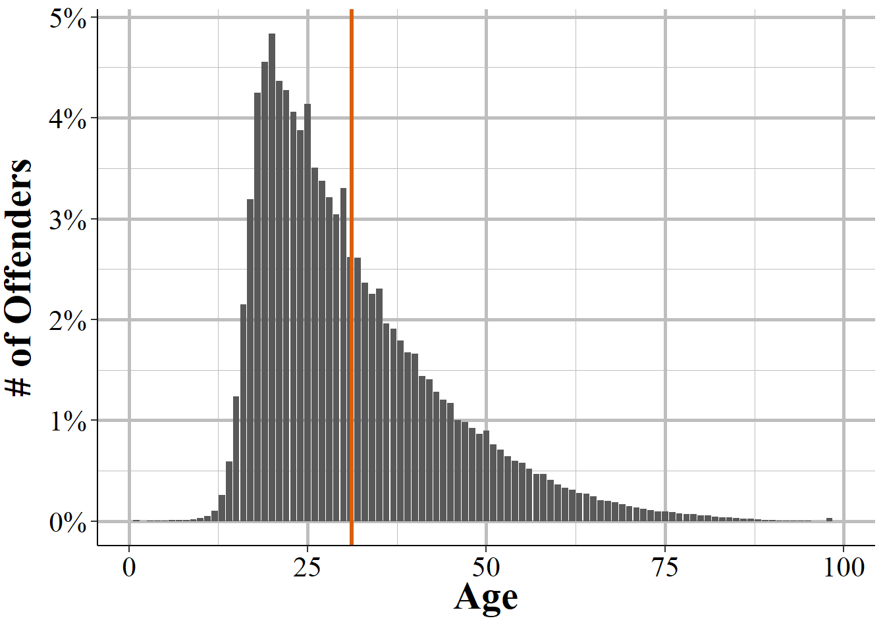

(\#fig:shrOffenderAge)The age of homicide offenders, based on the first offender in any homicide incident. Offenders under age 1 (classified as 'birth to 7 days old, including abandoned infant' and '7 days to 364 days old') and considered 0 years old. Offenders reported as '99 years or older' are considered 99 years old.

Figure \@ref(fig:shrVictimAge) repeats Figure \@ref(fig:shrOffenderAge) but with victim age rather than offender age. The mean victim age (shown in orange) is 33 and the median age is 30. Though the average victim age is a bit younger than the average offender age, trends are relatively similar for teenagers and older where deaths spikes in the late teen years and then declines steadily. The major difference is the U-shape for younger victims - for victims under age 15, homicides peak at age 0 (i.e. younger than their first birthday) with ~1.4% of all homicides being this this age. They then decline until plateauing at around age 6 before increasing again in the early teen years. 

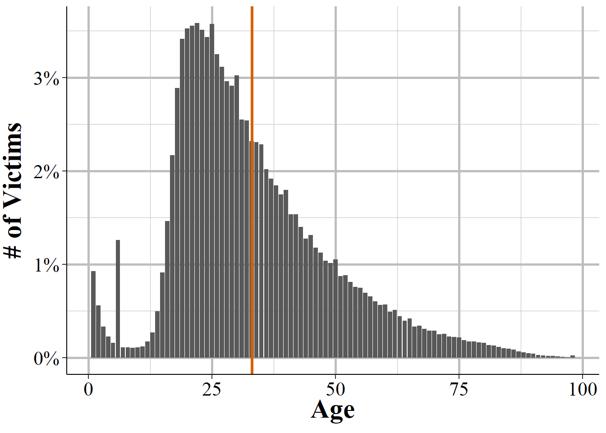

(\#fig:shrVictimAge)The age of homicide victims, based on the first victims in any homicide incident. Victims under age 1 (classified as 'birth to 7 days old, including abandoned infant' and '7 days to 364 days old') and considered 0 years old. Victims reported as '99 years or older' are considered 99 years old.

#### Sex 

We'll next look at victim and offender sex, a simple variable since only male and female are included. About 62.2% of offenders, as seen in Figure \@ref(fig:shrOffenderSex), are male and about 8.2% are female, indicating a large disparity in the sex of homicide offenders. The remaining 29.6% of offenders do not have sex data available because the police do not know the sex of this individual. For offenders who aren't arrested, this variable may be inaccurate since it is perceived sex of the offender.^[If we ignore unknown sex, essentially saying that the unknown people will have their sex distributed exactly as the known sex people, 88% are male and 12% are female. However, this assumption is probably wrong since the unknown people may be materially different than the known people, as evidence by them likely not being arrested and committing the crime in a way where even their sex can't be identified. ] 

(\#fig:shrOffenderSex)The sex of offender #1, 1976-2022.

There is far less uncertainty for victim sex, with under 0.17% of victims having an unknown sex. Here again there is a large disparity between male and female with about 78.2% of victims being male and 21.6% being female. 

(\#fig:shrVictimSex)The sex of victim #1, 1976-2022.

#### Race

This data also includes the race of the victims and offenders. This includes the following races: American Indian or Alaskan Native, Asian, Black, Native Hawaiian or Other Pacific Islander, and White. These are the only races included in the data; Hispanic is considered an ethnicity and is available as a separate, though flawed, variable. There is no category for bi- or multi-racial. As with other demographics info for offenders, in cases where no arrest is made (and we don't know in this data if one is made), there's no way to confirm the person's race so these results may not be entirely accurate. 

Figure \@ref(fig:shrOffenderRace) shows the percent of homicides in the data by the race of offender #1. Black and White offenders are included are similar percentages, at 34.3% and 33.6% of victims, respectively. The next most common group is Unknown at about 30.6% of offenders. Given that so many offenders have an unknown race, the reliability of race measures is limited. The remaining races are Asian at 0.9% of offenders, American Indian or Alaskan Native at 0.6%, and Native Hawaiian or Other Pacific Islander at 0.02%. 

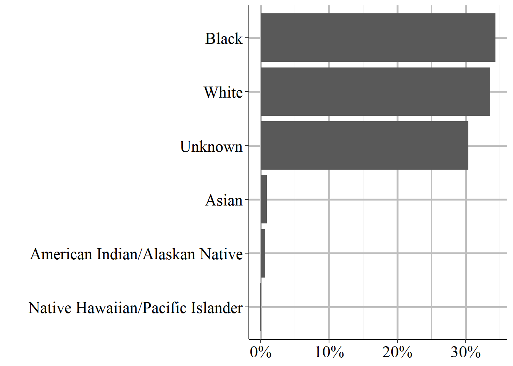

(\#fig:shrOffenderRace)The race of offender #1, 1976-2022.

For victim race, seen in Figure \@ref(fig:shrVictimRace), only about 1% of victim #1 races are unknown. This means we can be a lot more confident in the race of the victims than in the race of the offender. Similar to offenders, White and Black victims are the two most common races, with 48.4% and 48.1% of victims, respectively. There is a greater share of Asian victims than Asian offenders at 1.5% of victims. American Indian or Alaskan Natives make up 0.8% of victims while Native Hawaiian or Pacific Islanders make up 0.02% of victims.

(\#fig:shrVictimRace)The race of victim #1, 1976-2022

#### Ethnicity

The final demographic variable is ethnicity which is whether the victim or offender is Hispanic or not Hispanic. The SHR data has a weird relationship with this variable (which is also in the Arrests by Age, Sex, and Race dataset, discussed in Chapter \@ref(arrests)) where ethnicity is technically a variable in the data but very rarely collected. As such, this is an unreliable variable that if you really want to use needs careful attention to make sure it is being reported consistently by the agencies that you are looking at. 

The vast majority - 69.7% - of offenders have an unknown ethnicity while 23.4% are not Hispanic and 7.1% are Hispanic. 

(\#fig:shrOffenderEthnicity)The ethnicity of offender #1, 1976-2022.

Unlike the other demographic variables, there is still a huge amount of underreporting when it comes to victim ethnicity, though still less than for offender ethnicity. 55.6% of victims have an unknown ethnicity. Approximately 33.2% of victim #1 are reported as not Hispanic while 11.1% are reported as Hispanic.

(\#fig:shrVictimEthnicity)The ethnicity of victim #1, 1976-2022.

As an example of agencies under-reporting this variable, let's look at the number of offender #1s in Albuquerque, New Mexico, a city which the [US Census](https://www.census.gov/quickfacts/fact/table/albuquerquecitynewmexico,US/PST045222) says is about 50% Hispanic. Yet the Albuquerque police reported no ethnicity information for almost three decades of data. 

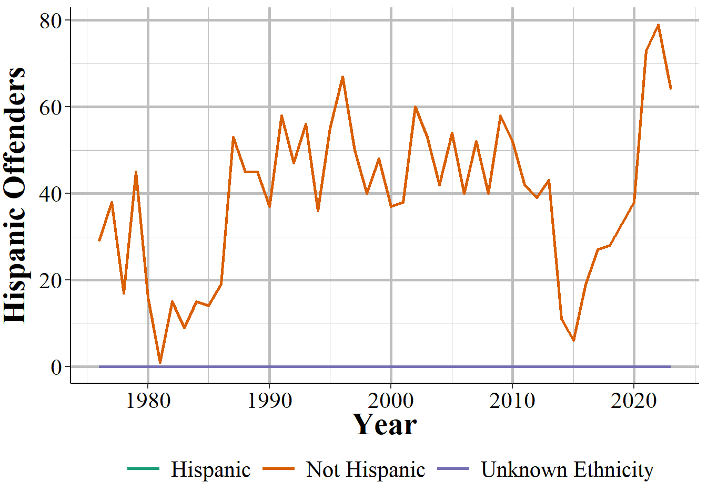

(\#fig:ABQ)Annual number of offender #1 who is Hispanic in Albuquerque, New Mexico, 1976-2022.

### Case characteristics

Now we'll move to facts about each case such as what weapon was used, how people involved knew each other, and what was the (rough) cause of the homicide.

#### Weapon used

The first variable we'll look at is the weapon used by each offender. Table \@ref(tab:shrWeapon) shows the weapon used by the first offender in every incident from 1976 to 2022. Each offender can only be reported as having a single weapon, so this table essentially shows the number (and percent) of homicides caused by this weapon. This isn't entirely true since in reality an offender could use multiple weapons and there can be multiple offenders. In these cases the police include what they believe is the "primary" weapon used by this offender.

The most commonly used weapon is a handgun, which is used in nearly half of homicides. This is followed by a knife or other sharp weapon used to cut at almost 15% of homicides, and then by "firearm, type not stated" which is just a firearm where we don't know the exact type (it can include handguns) at 8.9% of homicides The fourth most common weapon is "personal weapons" at nearly 6% of homicides. "Personal weapons" is a weird term to mean that there was no weapon - the "weapon" was the offender who beat the victim to death. Shotguns are involved in almost 5% of homicides and all other weapons are involved in fewer than 5% of cases. In total there are 19 different weapons included though most are very uncommon. 

Table: (\#tab:shrWeapon)The weapon used in a homicide incident, 1976-2022. In cases where there are multiple offenders, shows only the primary weapon for the first offender.

|Weapon                                    | \# of Incidents| \% of Incidents|
|:-----------------------------------------|---------------:|---------------:|
|Handgun                                   |         388,178|         49.06\%|
|Knife Or Cutting Instrument               |         115,540|         14.60\%|
|Firearm, Type Not Stated                  |          70,632|          8.93\%|
|Personal Weapons - Includes Beating       |          45,473|          5.75\%|
|Other Or Unknown Weapon                   |          42,002|          5.31\%|
|Shotgun                                   |          36,827|          4.65\%|
|Blunt Object                              |          34,716|          4.39\%|
|Rifle                                     |          28,108|          3.55\%|
|Strangulation - Includes Hanging          |           9,763|          1.23\%|
|Fire                                      |           5,380|          0.68\%|
|Asphyxiation - Includes Death By Gas      |           4,804|          0.61\%|
|Other Gun                                 |           3,473|          0.44\%|
|Narcotics/Drugs - Includes Sleeping Pills |           3,144|          0.40\%|
|Drowning                                  |           1,387|          0.18\%|
|Other Or Type Unknown                     |             586|          0.07\%|
|Poison - Does Not Include Gas             |             531|          0.07\%|
|Explosives                                |             386|          0.05\%|
|Pushed Or Thrown Out of Window            |             257|          0.03\%|
|Narcotics Or Drugs                        |              48|          0.01\%|
|Total                                     |         791,235|           100\%|

You may have noticed from the table that AR-15 isn't included. While AR-15 is the commonly discussed in the media and policy circles as a way to control gun violence, it isn't in a category by itself. Instead it is combined with other rifles in the "rifle" weapon group, and makes up about 3.6% of the weapons used by offender #1 in the data. 

Let's check if AR-15s, through our rough proxy of the "rifle" weapon group, is getting more common over time. Figure \@ref(fig:shrRifle) shows the number of homicide incidents (including manslaughters, so not necessarily all murders) where offender #1 used a rifle. Figure \@ref(fig:shrRiflePercent) shows the percent of all homicide incidents where the the weapon was a rifle. Using both of these measures we can see the rifles are getting less common, declining substantially since 1980 though increasing again starting in the mid-2010s.  

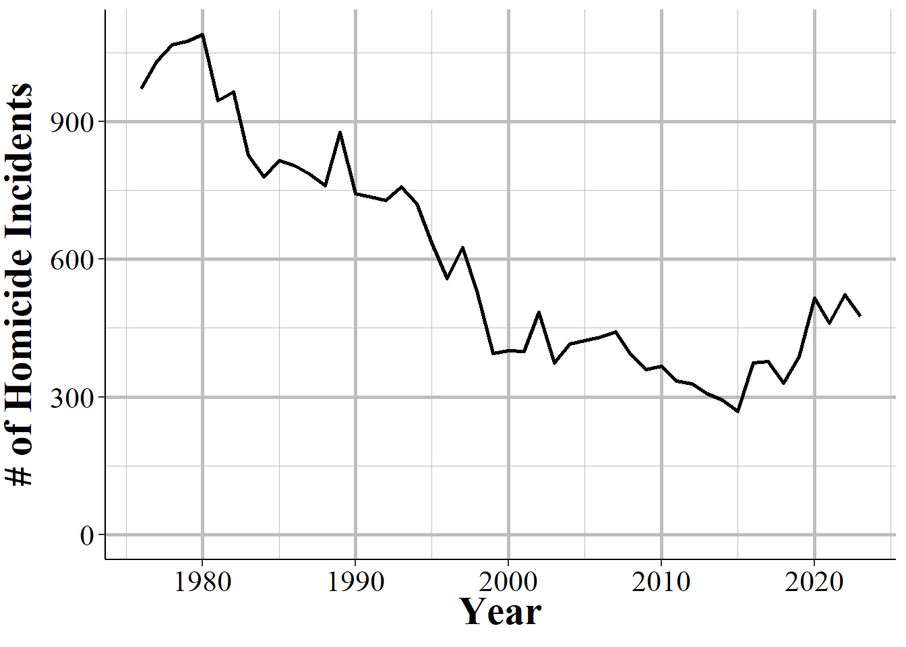

(\#fig:shrRifle)The annual number of homicide incidents where offender #1's weapon was a rifle, 1976-2022.

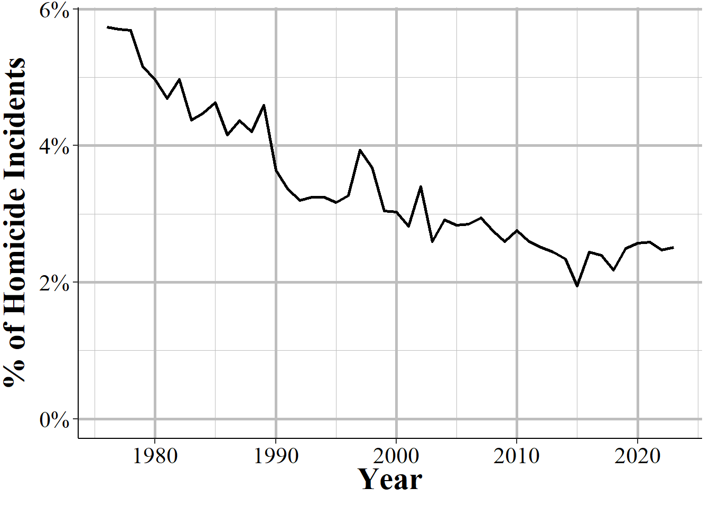

(\#fig:shrRiflePercent)The annual share of homicide incidents where offender #1's weapon was a rifle, 1976-2022.

Now, maybe this weapon is more commonly used in some types of crimes such as school shootings. You could get at that question using this data by seeing if times when a rifle is used that victims or offenders are younger or if the circumstance is something that suggests a school shooting. Unfortunately there is no offense location variable here, though there is in NIBRS and we can largely recreate this data through NIBRS. And of course you can't tell if the weapon is actually an AR-15, only if it is a rifle.

#### Relationship between first victim and offenders

An interesting and highly useful variable is the relationship between the first victim and each offender. To be clear, this is only for the first victim; we don't have the relationship between other victims and offenders. However, as seen earlier, this isn't *too much* of an issue since nearly all incidents only have a single victim. There are 29 possible relationship types (including "unknown" relationship) which are broken into three categories: legal family members, people known to the victim but who aren't family, and people not known to the victim. Table \@ref(tab:shrRelationship) shows these relationships and the number and percent of homicides with these relationships. 

The most common relationship, with about 28% of homicides, is that the police don't know the relationship. So there is a good deal of uncertainty in the relationship between victims and offenders. Next is that the victim is the offender's acquaintance at 19.7% or is a stranger at 15.3%. The next is "other - known to victim" which is similar to being an acquaintance at almost 5% of homicides. This is followed by the victim being the friend of the murderer at 3.6%. The 6th most common relationship, at 3.6% is that the victim is the wife of the offender, so she is murdered by her husband, and is the first familial relationship of this list. The remaining relationships all make up fewer than 3% of all homicides. 

Table: (\#tab:shrRelationship)The relationship between the first victim and the first offender in a homicide incident, 1976-2022.

|Relationship            |               Category| \# of Incidents|\% of Incidents |
|:-----------------------|----------------------:|---------------:|:---------------|
|Unknown                 |                       |         296,757|37.51\%         |
|Acquaintance            | Not family (but known)|         156,115|19.73\%         |
|Stranger                |              Not known|         120,719|15.26\%         |
|Other - Known To Victim | Not family (but known)|          37,899|4.79\%          |
|Friend                  | Not family (but known)|          28,411|3.59\%          |
|Wife                    |                 Family|          27,977|3.54\%          |
|Girlfriend              | Not family (but known)|          21,447|2.71\%          |
|Husband                 |                 Family|          12,085|1.53\%          |
|Other Family            |                 Family|          11,760|1.49\%          |
|Son                     |                 Family|          11,408|1.44\%          |
|Boyfriend               | Not family (but known)|          10,009|1.26\%          |
|Neighbor                | Not family (but known)|           8,081|1.02\%          |
|Daughter                |                 Family|           8,056|1.02\%          |
|Brother                 |                 Family|           6,961|0.88\%          |
|Father                  |                 Family|           5,667|0.72\%          |
|Mother                  |                 Family|           5,274|0.67\%          |
|In-Law                  |                 Family|           4,608|0.58\%          |
|Common-Law Wife         |                 Family|           3,317|0.42\%          |
|Common-Law Husband      |                 Family|           2,722|0.34\%          |
|Ex-Wife                 | Not family (but known)|           2,365|0.30\%          |
|Stepfather              |                 Family|           1,864|0.24\%          |
|Homosexual Relationship | Not family (but known)|           1,704|0.22\%          |
|Sister                  |                 Family|           1,536|0.19\%          |
|Stepson                 |                 Family|           1,500|0.19\%          |
|Ex-Husband              | Not family (but known)|             937|0.12\%          |
|Stepdaughter            |                 Family|             792|0.10\%          |
|Employer                | Not family (but known)|             564|0.07\%          |
|Employee                | Not family (but known)|             451|0.06\%          |
|Stepmother              |                 Family|             250|0.03\%          |
|Total                   |                       |         791,236|100\%           |

#### Homicide circumstance {#circumstance}

We also have information on the type of the homicide, which this data calls the "circumstance." This comes as relatively broad categories that leave a lot to be desired in our understanding of what led to the homicide. Table \@ref(tab:shrCircumstance) shows the number and percent of each circumstance for the first victim of each homicide from 1976 to 2022. This data has 33 possible circumstances which it groups into four main categories: murders that coincide with committing another crime ("felony type" murders), murders that don't coincide with another crime ("non-felony type" murders), justifiable homicides, and negligent manslaughter. 

The felony type murders are simply ones where another crime occurred during the homicide. While this is called "felony type" it does include other crimes such as theft and gambling (which aren't always a felony) so is a bit of a misnomer. The "non-felony type" are murders that happen without another crime. This includes gang killings (where, supposedly, only the murder occurred), children killed by babysitters, fights among intoxicated (both of alcohol and drugs) people, and "lover's triangle" killings.  Justifiable homicides are when a person (civilian or police officer) kill a person who is committing a crime. Negligent manslaughter includes accidental shootings such as when children find and shoot a gun, but excludes deaths from traffic accidents. 

The most common circumstances, accounting for 27.4%, 26.9%, and 12.5%, respectively, are "Unknown", "Other Arguments", and "Other Non-Felony Type - Not Specified." Since the data includes "Argument Over Money Or Property" as one category, the "Other Arguments" mean that it's an argument for a reason other than over money or property. The "Other Non-Felony Type" one does not mean that the murder did not occur alongside another crime, but also doesn't fall into the non-felony categories included. Robbery is the only remaining circumstance with more than 5% of murders, at 7.4%. 

Table: (\#tab:shrCircumstance)The circumstance of the homicide for the first offender in a homicide incident.

|Circumstance                                                       |               Category| \# of Incidents|\% of Incidents |
|:------------------------------------------------------------------|----------------------:|---------------:|:---------------|
|Unknown                                                            |                       |         219,450|27.74\%         |
|Other Arguments                                                    |        Non-Felony Type|         212,941|26.91\%         |
|Other Non-Felony Type - Not Specified                              |        Non-Felony Type|          98,730|12.48\%         |
|Robbery                                                            |            Felony Type|          58,885|7.44\%          |
|Narcotic Drug Laws                                                 |            Felony Type|          28,360|3.58\%          |
|Juvenile Gang Killings                                             |        Non-Felony Type|          24,309|3.07\%          |
|Felon Killed By Police                                             |   Justifiable Homicide|          17,553|2.22\%          |
|Other Felony Type - Not Specified                                  |            Felony Type|          15,460|1.95\%          |
|Brawl Due To Influence of Alcohol                                  |        Non-Felony Type|          15,227|1.92\%          |
|Argument Over Money Or Property                                    |        Non-Felony Type|          14,972|1.89\%          |
|Felon Killed By Private Citizen                                    |   Justifiable Homicide|          13,928|1.76\%          |
|All Suspected Felony Type                                          |            Felony Type|          12,975|1.64\%          |
|All Other Manslaughter By Negligence Except Traffic Deaths         | Negligent Manslaughter|           8,536|1.08\%          |
|Domestic Violence (Historically Called Lovers Triangle/Quarrel)    |                       |           6,431|0.81\%          |
|Burglary                                                           |            Felony Type|           6,356|0.80\%          |
|Gangland Killings                                                  |        Non-Felony Type|           5,809|0.73\%          |
|Brawl Due To Influence of Narcotics                                |        Non-Felony Type|           4,750|0.60\%          |
|Lovers Triangle                                                    |        Non-Felony Type|           4,158|0.53\%          |
|Rape                                                               |            Felony Type|           4,142|0.52\%          |
|Other Negligent Handling of Gun Which Resulted In Death of Another | Negligent Manslaughter|           3,877|0.49\%          |
|Arson                                                              |            Felony Type|           3,304|0.42\%          |
|Motor Vehicle Theft                                                |            Felony Type|           1,468|0.19\%          |
|Children Playing With Gun                                          | Negligent Manslaughter|           1,453|0.18\%          |
|Other Sex Offenses                                                 |            Felony Type|           1,433|0.18\%          |
|Child Killed By Babysitter                                         |        Non-Felony Type|           1,342|0.17\%          |
|Institutional Killings                                             |        Non-Felony Type|           1,262|0.16\%          |
|Gambling                                                           |            Felony Type|           1,040|0.13\%          |
|Larceny                                                            |            Felony Type|             916|0.12\%          |
|Prostitution And Commercialized Vice                               |            Felony Type|             626|0.08\%          |
|Other - Not Specified                                              |            Felony Type|             554|0.07\%          |
|Sniper Attack                                                      |        Non-Felony Type|             480|0.06\%          |
|Victim Shot In Hunting Accident                                    | Negligent Manslaughter|             350|0.04\%          |
|Gun Cleaning Death - Other Than Self-Inflicted                     | Negligent Manslaughter|             144|0.02\%          |
|Abortion                                                           |            Felony Type|              14|0.00\%          |
|Human Trafficking/Commercial Sex Acts                              |                       |               1|0.00\%          |
|Total                                                              |                       |         791,236|100\%           |

#### Homicide subcircumstance

The "subcircumstance" just tells you more information about justifiable homicides. This includes the circumstance leading up to the "felon" - which is how the person killed is described, though technically they don't need to have committed a felony - was killed. It includes if this person attacked an officer (the one who killed them), a different officer, a civilian, or was committing or fleeing a crime. 

This dataset is one source of information on how many people police kill each year. But it is a large undercount compared to other sources such as the Washington Post collection, so is not a very useful source of information on this topic. 

Table: (\#tab:shrSubCircumstance)The circumstance for the first offender in a homicide incident in cases where the offender is killed. This includes incidents where the only person who dies in the offender.

|Subcircumstance                       | \# of Incidents| \% of Incidents|
|:-------------------------------------|---------------:|---------------:|
|Felon Killed In Commission of A Crime |          11,026|         35.02\%|
|Felon Attacked Police Officer         |           9,224|         29.30\%|
|Felon Attacked A Civilian             |           5,499|         17.47\%|
|Not Enough Information To Determine   |           2,529|          8.03\%|
|Felon Resisted Arrest                 |           1,268|          4.03\%|
|Felon Attacked Fellow Police Officer  |           1,096|          3.48\%|
|Felon Attempted Flight From A Crime   |             840|          2.67\%|
|Total                                 |          31,482|           100\%|

