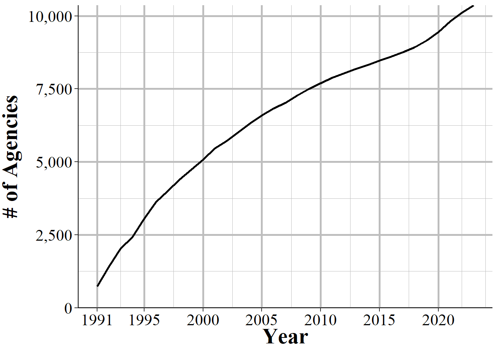
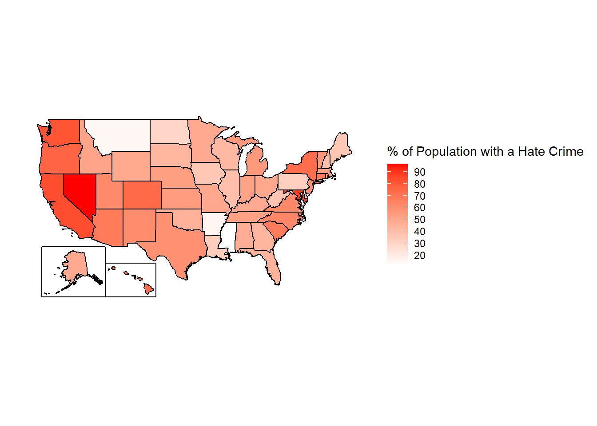
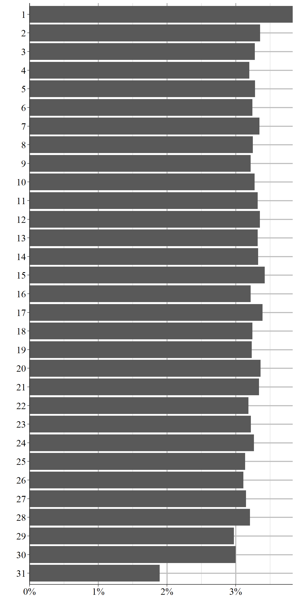
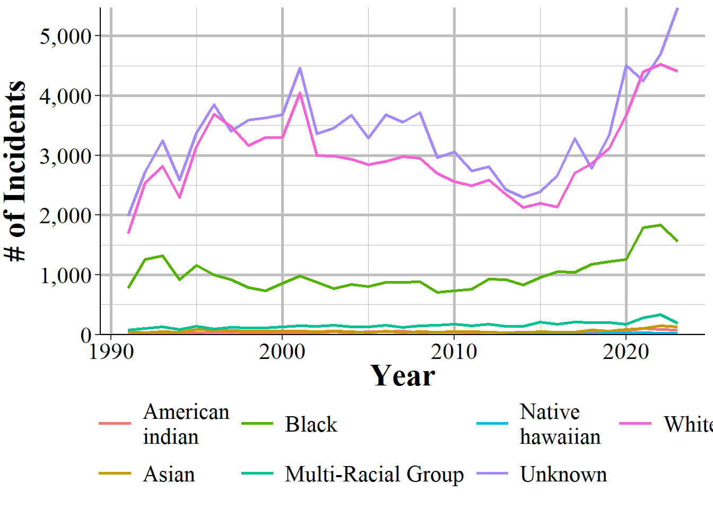

# Hate Crime Data {#hate_crimes}


This dataset covers crimes that are reported to the police and judged by the police to be motivated by hate. More specifically, they are (1) crimes which were (2) motivated - at least in part - by bias towards a certain person or group of people because of characteristics about them such as race, sexual orientation, or religion. The first part is key, they must be crimes - and really must be the selection of crimes that the FBI collects for this dataset. Biased actions that don't meet the standard of a crime, or are of a crime category not included in this data, are not considered hate crimes. For example, if someone yells at a Black person and uses racial slurs against them, it is clearly a racist action. For it to be included in this data, however, it would have to extend to a threat since "intimidation" is a crime included in this data but lesser actions such as simply insulting someone is not included. For the second part, the bias motivation, it must be against a group that the FBI includes in this data. For example, when this data collection began in 1991 crimes against transgender people were not counted so if a transgender person was assaulted or killed because they were transgender, this is not a hate crime recorded in the data (though it would have counted in the "Anti-Lesbian, Gay, Bisexual, Or Transgender, Mixed Group (LGBT)" bias motivation which was always reported).^[The first year where transgender as a group was a considered a bias motivation was in 2013.] 

In this example the offender shouted a racial slur, making it clear that their actions were motivated by bias. What about a hate crime where there is no explicit evidence of hate? Say, a White man robs a Black man and targets him because he is Black. The offender doesn't wear any insignia suggesting bias and never says a word to the victim. If the offender is never caught this robbery would not be considered a hate crime as there is no evidence that it is motivated by hate. Even if the offender is caught this would only be considered a hate crime if the police uncover evidence of bias, such as a confession or text messages between the offender and another person explaining why the victim was targeted. I think many - perhaps even most - hate crimes fall into this category. Where it was in fact a hate crime but there isn't sufficient evidence - both in terms of evidence the police can gather and even the victim's own perception - that it was a hate crime. 

So this data is really a narrower measure of hate crimes than it might seem. In practice it is (some) crimes motivated by (some) kinds of hate that are reported to the police. It is also the dataset with the fewest agencies reporting, with most agencies not reporting any hate crimes to the FBI in a given year. This may be true for most agencies as hate crimes are rare and many agencies are small with relatively few crimes of any type reported. However, there is evidence that some agencies that likely have hate crimes still do not report. This leads to gaps in the data with some states having zero agencies report crime, agencies reporting some bias motivations but not others, agencies reporting some years but not others. While these problems exist for all of the SRS datasets, it is more severe in this data. This problem is exacerbated by hate crimes being rare even in agencies that report them - with such rare events, even minor changes in which agencies report or whether victims report the crime to the police can drastically change the number of hate crimes in this data. 

## Agencies reporting

We'll start by looking at how many agencies report hate crime each year. This is a bit tricky since there can be multiple ways to examine how agencies report, and since agencies can truly have no hate crimes in a year so it's hard to differentiate the true zeroes from the non-reporters. 

Figure \@ref(fig:hateAgencies) shows the number of agencies that report at least one hate crime incident in that year. During the first year of data in 1991 there were about 750 agencies reporting and that grew steadily to about 2,000 agencies in year 2000. From there it increased a bit over the next decade before declining to below 1,750 in the early 2010s and rising again to around 3,000 agencies at the end of our data.

<div class="figure" style="text-align: center">

<p class="caption">(\#fig:hateAgencies)The annual number of police agencies that report at least one hate crime incident in that year.</p>
</div>

The 3,000 or so agencies that report each year are not the same every year. Figure \@ref(fig:hateCrimesEver) shows the cumulative number of agencies that have reported at least one hate crime between 1991 and 2022. There is a steady growth in the cumulative number of agencies, with about 350 new agencies each year. In each year some new agencies report hate crimes for the first time while some agencies that reported a hate crime in previous years don't report any hate crimes in the current year.

<div class="figure" style="text-align: center">

<p class="caption">(\#fig:hateCrimesEver)The cumulative number of agencies that have reported one or more hate crimes between 1991 and 2022</p>
</div>

Figure \@ref(fig:hateCrimesPreviousYear) puts this into hard numbers by showing the percent of agencies who reported a hate crime in a certain year who *also* reported a hate crime in the previous year. For most years between 50% and 60% of agencies which reported a hate crime in the year shown on the x-axis also reported a hate crime in the previous year, indicating somewhat high consistency in which agencies have hate crimes. 

<div class="figure" style="text-align: center">

<p class="caption">(\#fig:hateCrimesPreviousYear)The percent of agencies that report a hate crime in a given year that also reported a hate crime in the previous year, 1992-2020</p>
</div>

Another way to understand reporting is to look at the number of reported hate crimes by state and see which states report and which don't. Figure \@ref(fig:hateCrimesMap) does this for 2022 data by showing the number of reported hate crime incidents by state. While every state reported at least one hate crime in 2022, there are large differences between states because even in states that have reporting agencies, not all agencies in that state report. In Florida, for example, only 3% of agencies reported having at least one hate crime. 

<div class="figure" style="text-align: center">

<p class="caption">(\#fig:hateCrimesMap)Total reported hate crimes by state, 2022</p>
</div>

Since the number of state-wide hate crimes is partially influenced by population, we'll also look at it as the percent of agencies in the state that report at least one hate crime. Again this is limited by population as agencies in each state cover different populations - and most agencies are small so a few large agencies can account for a large share of crimes, including hate crimes. Still, this is a useful exercise as we can easily see where very few agencies report. Figure \@ref(fig:statePercentReporting) shows the percent of agencies for each state that reported at least one hate crime in 2022. In New Jersey, the state with the highest percent of agencies reporting, 35% of agencies reported at least one hate crime. In 22 states, fewer than 10% of agencies reported a hate crime, and in four states fewer than 5% of agencies did so. One interesting finding from this graph is the more liberal states - New Jersey, Washington, California, Connecticut, etc. - have the highest share of agencies reporting a hate crime, indicating that the culture of the state may influence either the propensity of hate crimes, whether victims report, or whether agencies report hate crimes.   

<div class="figure" style="text-align: center">

<p class="caption">(\#fig:statePercentReporting)The percent of agencies in each state that reported at least one hate crime in 2022.</p>
</div>

To examine how population affects our results, Figure \@ref(fig:statePercentReportingPop) shows the percent of each state's population that is covered by an agency that reported at least one hate crime. Results are similar to Figure \@ref(fig:statePercentReporting) but now show that there is more reporting than it appeared in that figure. That is because while not all agencies report a hate crime, the ones that don't report are generally smaller than the ones that do. So measuring by population we see that about half of the people in the country lives in the jurisdiction of an agency which reported at least one hate crime. The average state also covers about half of the population in a hate-crime-reporting agency. 

Is this good? We don't necessarily want 100% of agencies to report a hate crime since not all agencies will experience a hate crime in their jurisdiction. The idea dataset would have all hate crimes reported  but without knowing how many hates crimes there actually are we can't tell how well this data captures hate crimes. As we'll see in Sections \@ref(treeOfLife) and \@ref(hateAsian) there is some evidence that not all hate crimes are captured, or when they are they are in way we don't expect.

<div class="figure" style="text-align: center">

<p class="caption">(\#fig:statePercentReportingPop)The percent of population in each state in agencies that reported at least one hate crime in 2022.</p>
</div>

## Tree of Life synagogue shooting {#treeOfLife}

One way I like to check the quality of data is to see how it reports something that I know occurred. Here we'll look at how the anti-Semitic attack on a synagogue in Pittsburgh was reported. In October of 2018 the deadliest attack on Jewish people in US history occurred at the Tree of Life synagogue in Pittsburgh, PA. There, 11 congregants were murdered, and several other people, including police officers, were injured by the shooter. According to this data, however, those murders never occurred. Not in Pittsburgh at least. No murders with an anti-Jewish bias were reported in Pittsburgh were reported in 2018. Instead, the shooting was reported by the FBI's Pittsburgh field office, which, like many federal agencies that have offices across the country, is included in the data as its own agency.

This is good and bad. Of course it is good that when a crime happens it is reported in the data. The bad part is that it is counted as hate crimes that occurred in the FBI's Pittsburgh agency, and not the Pittsburgh Police Department. Most research occurs at the local level - usually studying an agency or county. So if a study is examining agency-level characteristics that are related to hate crimes it'd almost certainly exclude these murders as they are reported by a federal agency and not the local Pittsburgh agency. 

This also gets complicated as FBI rules say that a crime should be reported by the most local jurisdiction. This is true even when there is overlapping jurisdiction. 11 people were murdered in Pittsburgh, and several Pittsburgh Police officers were injured. That should mean that the crime is reported by Pittsburgh Police, not by the FBI. Pittsburgh does report these murders in their Offenses Known data, making it even more odd that they're Pittsburgh crimes in one dataset and not another.^[The murders of nine Black parishioners in the Emanuel African Methodist Episcopal Church in Charleston, South Carolina, in 2015 was reported by the Charleston Police Department, making it even more inconsistent for when the FBI reports hate crime murders.] 

## Hate crimes against Asian people {#hateAsian}

Before we get into specific variables let's try to answer the question of whether hate crimes increased against Asian people^[I've seen some news organizations reported about hate crimes against Asian-Americans using this data. That isn't correct. The data does not consider citizenship. So a hate crime against a non-citizen such as a tourist would be treated as anti-Asian if the tourist is Asian.] after Covid started. This has been a common topic of discussion since shortly after Covid started, with (media reports)[https://www.nbcnews.com/news/asian-america/anti-asian-hate-crimes-increased-339-percent-nationwide-last-year-repo-rcna14282], (public polling)[https://www.pewresearch.org/2023/11/30/asian-americans-and-discrimination-during-the-covid-19-pandemic/], and (academic)[https://www.ncbi.nlm.nih.gov/pmc/articles/PMC7364747/]^[This paper, now cited by nearly 1,000 other papers, bizarrely doesn't actually assess if hate crimes increased, as they say that the data does not exist yet at the time they choose to write the paper: "At that point, researchers will be able to assess both the extent to which law enforcement data show a spike in anti-Asian hate crimes known to police and whether there were changes in the numbers of Asian victims of hate crimes reported or not reported to police."] (papers)[https://www.nber.org/papers/w32121]^[Full disclosure, I was initially part of this paper but left because I didn't have enough time to dedicate to it, among other reasons. I haven't read the latest version so I am no support or opposition to its findings.] Most reports say that anti-Asian hate crimes skyrocketed since Covid started, caused by racist people who blamed Asian people for Covid. 

Let's see how that holds up in FBI data. Or, perhaps a better question is, can FBI data answer this question at all? There are only two numbers needed to properly measure an increase in crime: the number of crimes in the past and the number of crimes now. Without either number you can't calculate a change at all. But having incorrect values for either or both numbers is even worse as you can calculate a change, but it will be wrong. And it's almost always worse to give a wrong answer than no answer at all. 

Let's look first at New York City, home to nearly 1.4 million Asian people (according to the Census)[https://data.census.gov/profile/New_York_city,_New_York?g=160XX00US3651000]. Figure \@ref(fig:nycHate) shows the annual number of incidents in NYC which were classified as anti-Asian by police. Though NYC has reported hate crimes since 1991, the first year they reported an anti-Asian hate crime was in 2002. Consistent with reports of an increase in anti-Asian hate crimes during Covid there is a spike in 2020, which increases in 2021 and then declines in 2022, though the 2022 number is still far ahead of pre-Covid years. In percent terms, 2020 had a 1,300% increase from 2019 and 2021 had a 375% increase from 2020^[2021 ad a 6,550% increase from 2019.]. The issue here is that this is all from a base rate of 2 anti-Asian hate crimes in 2019. In fact no previous year of data had more than 10 anti-Asian hate crimes. I find that unbelievable. Even if New York City was a perfect utopia of racial harmony, I simply do not believe that only two incidents of anti-Asian hate crimes occurred in New York City in 2019. It is just too few to be believable. 

<div class="figure" style="text-align: center">

<p class="caption">(\#fig:nycHate)The number of anti-Asian hate crime incidents in New York City, 1991-2022.</p>
</div>

So NYC isn't a good example since it has an unusually low number of pre-Covid hate crimes against Asian people. Figure \@ref(fig:nationalAsianHate) aggregates all anti-Asian hate crimes nationally. Here we see a similar trend to NYC, with an increase starting in 2020 that continues in 2021 and modestly declines in 2022. The increase is far more modest, moving from 188 in 2019 to 322 in 2020 (a 71.3% increase). Should we trust this more than the NYC data? A more modest 71.3% increase is maybe more believable than a 1,300% increase. Again, though, we should think about how believable these results are. 2019 had 188 anti-Asian hate crimes. When considering that the Asian population in this country is about 21 million people, that's still exceedingly rare, a rate of about 0.88 anti-Asian hate crimes per 100,000 Asian people^[In comparison, NYC has a rate of 0.14 per 100,000.] 

<div class="figure" style="text-align: center">

<p class="caption">(\#fig:nationalAsianHate)The number of anti-Asian hate crime incidents in the United States, 1991-2022.</p>
</div>

So here's the problem. We need a pre- and a post-value to determine if an increase is actually happening. We don't have a reliable pre-value and therefore cannot say if something is increasing.

## Important variables

This data has the standard set of variables describing the agency that is reporting. This includes the agency ORI - which is the unique ID for that agency - the agency name, their state, and the population under their jurisdiction.

They also have a variable with the exact date that the hate crime occurred on - though not the date it was reported on. Figure \@ref(fig:hateCrimesByDay) shows the percent of hates crimes between 1991 and 2022 that occurred on each day of the week. Interestingly, the most common days for a hate crime to occur is on Friday, which is also when non-hate crimes most frequently occur. This suggests that hate crimes do follow the same trends - at least partially - as other crimes.

<div class="figure" style="text-align: center">

<p class="caption">(\#fig:hateCrimesByDay)The day of the week that hate crimes occurred on, 1991-2022</p>
</div>

We can also look at which day of the most is most common, as shown in Figure \@ref(hateCrimesByMonthDay). There's no attern that I can see other than the the 1st of the most has the most hate crimes and the end of the month has the fewest. Not all months have more than 28 days so it makes sense that the 29th, 30th, and 31st are the least common day. Is the 1st of the month really the most dangerous? I think this is likely just a quirk of the data, and is something we also see in NIBRS data. When an agency doesn't report an actual date they may use the 1st of the month as a placeholder which then looks to us like the 1st is an especially prolific day for hate crimes. 

<div class="figure" style="text-align: center">

<p class="caption">(\#fig:hateCrimesByMonthDay)The day of the month that hate crimes occurred on, 1991-2022</p>
</div>


Each hate crime incident can cover up to 10 different crimes occurring - e.g. a person who burglarizes a synagogue and spray paints a swastika on the wall would have both burglary and vandalism reported in this data. With each crime, this data has the bias motivation for that crime, the location of the crime (in broad categories, not the actual location in the city like a street address would have), and the number of victims for that offense. In practice, in most hate crimes with multiple offenses recorded, the bias motivation, location, and victim count is the same for each offense.

Figure \@ref(fig:crimesPerHateCrime) shows the number of crimes per incident for each hate crime reported between 1991 and 2022. In 96.6% of cases, there is only one offense in that incident.^[In 0.0004% of hate crimes there is no recorded offense. This is not shown in the graph.] This drops sharply to 3.2% of incidents having two offenses, 0.21% having three offenses, 0.019% having four offenses, and 0.002% having five offenses. Even though this data does allow up to 10 offenses per hate crime incident, there has never been a recorded case with more than five offenses. Results are nearly identical when examining the number of bias motivations and locations reported in an incident. 

<div class="figure" style="text-align: center">

<p class="caption">(\#fig:crimesPerHateCrime)The number of offenses per hate crime incident.</p>
</div>

### The bias motivation (who the hate is against)

The most important variable in this data is the "bias motivation" which is the FBI's term for the cause of the hate. A hate crime targeted against Black people would be an "anti-Black" bias motivation. For the police to classify an incident as a hate crime, and to assign a particular bias motivation, the police must have *some* evidence that the crime was motivated by hate. The victim saying that the crime is a hate crime alone is not sufficient - though if large portions of the victim's community believe that the crime is a hate crime, this is a factor in the police's assessment. The evidence required is not major. It includes things as explicit as racial slurs said during an incident and less obvious factors like the crime occurring on an important holiday for that community (e.g. Martin Luther King Day, religious holidays). The FBI also encourages police to consider the totality of the evidence even if none alone strongly suggests that the crime was a hate crime in making their determination about whether the incident was a hate crime or not. This also means that many (perhaps most) hate crimes will not be recorded as hate crimes since there is no evidence that the crime is motivated by hate. 

Consider, for example, a person who is biased against Asian people and decides to rob them because they are Asian. This is clearly a hate crime. And say this persons robs 10 Asian people in 10 different incidents, causing 10 hate crimes. All of the victims report it to the police but only two of them tell the police that they think it was a hate crime; the other eight do not think it is a hate crime. Without additional information the police would likely not report any of these robberies as hate crimes. And if all ten of the victims happened to be surveyed about crime victimization, such as through the Bureau of Justice Statistics' National Crime Victimization Survey, only two of the 10 victims would report being the victim of a hate crime. Using FBI data the anti-Asian hate crimes would be zero; using victimization surveys would undercount anti-Asian hate crimes enormously. This is the main problem with using hate crime data, even with perfect reporting or surveys of everyone possibly victimized we may still be getting data that is completely incorrect.

In the FBI data Bias motivation is based on the offender's perceptions of the victim so even if they are incorrect in who their victim is, if they intended to target someone for their perceived group membership, that is still a hate crime. For example, if a person assaults a man because they think he is gay, that is a hate crime because the assault was motivated by hate towards gay people. Whether the victim is actually gay or not is not relevant - the offender perceived him to be gay so it is an anti-gay hate crime. To make this even more complicated, the offender must have committed the crime because they are motivated, at least to some degree, by their bias against the victim. Being biased against the victim but targeting them for some other reason means that the crime is not a hate crime. 

The biases that the FBI includes in this data has grown over time, with new bias motivations being added in 1997, 2012, 2013, and 2015. Table \@ref(tab:hateBiasMotivation) shows each bias motivation in this data, the year it was first reported, how many hate crimes there were for this bias motivation from 1991-2022 and what percent of hate crimes that bias motivation makes up. For ease of seeing the most common biases, the table is sorted by frequency of incidents. The year is the first year with that bias motivation - as hate crimes for certain groups are very rare, the bias motivation could have technically been available in previous years. The last column in this table shows the percent of hate crime incidents from 1991-2022, though this is a very rough measure since some groups are so small that even accounting for a small percent of total hate crimes can mean that are massively disproportionately targeted. 

<table class="table table-striped" style="width: auto !important; margin-left: auto; margin-right: auto;">
<caption>(\#tab:hateBiasMotivation)The bias motivation for hate crime incidents. In incidents with multiple bias motivation, this shows only the first bias motivation recorded.</caption>
 <thead>
  <tr>
   <th style="text-align:left;"> Bias Motivation </th>
   <th style="text-align:right;"> First Year Reported </th>
   <th style="text-align:right;"> # of Incidents </th>
   <th style="text-align:left;"> % of Incidents </th>
  </tr>
 </thead>
<tbody>
  <tr>
   <td style="text-align:left;"> Total </td>
   <td style="text-align:right;">  </td>
   <td style="text-align:right;"> 240,108 </td>
   <td style="text-align:left;"> 100\% </td>
  </tr>
  <tr>
   <td style="text-align:left;"> Anti-Black </td>
   <td style="text-align:right;"> 1991 </td>
   <td style="text-align:right;"> 81,208 </td>
   <td style="text-align:left;"> 33.82\% </td>
  </tr>
  <tr>
   <td style="text-align:left;"> Anti-Jewish </td>
   <td style="text-align:right;"> 1991 </td>
   <td style="text-align:right;"> 29,967 </td>
   <td style="text-align:left;"> 12.48\% </td>
  </tr>
  <tr>
   <td style="text-align:left;"> Anti-White </td>
   <td style="text-align:right;"> 1991 </td>
   <td style="text-align:right;"> 27,360 </td>
   <td style="text-align:left;"> 11.39\% </td>
  </tr>
  <tr>
   <td style="text-align:left;"> Anti-Male Homosexual (Gay) </td>
   <td style="text-align:right;"> 1991 </td>
   <td style="text-align:right;"> 23,862 </td>
   <td style="text-align:left;"> 9.94\% </td>
  </tr>
  <tr>
   <td style="text-align:left;"> Anti-Hispanic </td>
   <td style="text-align:right;"> 1991 </td>
   <td style="text-align:right;"> 15,397 </td>
   <td style="text-align:left;"> 6.41\% </td>
  </tr>
  <tr>
   <td style="text-align:left;"> Anti-Ethnicity Other Than Hispanic </td>
   <td style="text-align:right;"> 1991 </td>
   <td style="text-align:right;"> 11,498 </td>
   <td style="text-align:left;"> 4.79\% </td>
  </tr>
  <tr>
   <td style="text-align:left;"> Anti-Lesbian, Gay, Bisexual, Or Transgender, Mixed Group (LGBT) </td>
   <td style="text-align:right;"> 1991 </td>
   <td style="text-align:right;"> 7,815 </td>
   <td style="text-align:left;"> 3.25\% </td>
  </tr>
  <tr>
   <td style="text-align:left;"> Anti-Asian </td>
   <td style="text-align:right;"> 1991 </td>
   <td style="text-align:right;"> 7,671 </td>
   <td style="text-align:left;"> 3.19\% </td>
  </tr>
  <tr>
   <td style="text-align:left;"> Anti-Multi-Racial Group </td>
   <td style="text-align:right;"> 1991 </td>
   <td style="text-align:right;"> 5,652 </td>
   <td style="text-align:left;"> 2.35\% </td>
  </tr>
  <tr>
   <td style="text-align:left;"> Anti-Female Homosexual (Lesbian) </td>
   <td style="text-align:right;"> 1991 </td>
   <td style="text-align:right;"> 4,876 </td>
   <td style="text-align:left;"> 2.03\% </td>
  </tr>
  <tr>
   <td style="text-align:left;"> Anti-Muslim </td>
   <td style="text-align:right;"> 1991 </td>
   <td style="text-align:right;"> 4,206 </td>
   <td style="text-align:left;"> 1.75\% </td>
  </tr>
  <tr>
   <td style="text-align:left;"> Anti-Other Religion </td>
   <td style="text-align:right;"> 1991 </td>
   <td style="text-align:right;"> 3,621 </td>
   <td style="text-align:left;"> 1.51\% </td>
  </tr>
  <tr>
   <td style="text-align:left;"> Anti-American Indian Or Native Alaskan </td>
   <td style="text-align:right;"> 1991 </td>
   <td style="text-align:right;"> 2,781 </td>
   <td style="text-align:left;"> 1.16\% </td>
  </tr>
  <tr>
   <td style="text-align:left;"> Anti-Catholic </td>
   <td style="text-align:right;"> 1991 </td>
   <td style="text-align:right;"> 1,819 </td>
   <td style="text-align:left;"> 0.76\% </td>
  </tr>
  <tr>
   <td style="text-align:left;"> Anti-Arab </td>
   <td style="text-align:right;"> 1991 </td>
   <td style="text-align:right;"> 1,510 </td>
   <td style="text-align:left;"> 0.63\% </td>
  </tr>
  <tr>
   <td style="text-align:left;"> Anti-Transgender </td>
   <td style="text-align:right;"> 2013 </td>
   <td style="text-align:right;"> 1,500 </td>
   <td style="text-align:left;"> 0.62\% </td>
  </tr>
  <tr>
   <td style="text-align:left;"> Anti-Protestant </td>
   <td style="text-align:right;"> 1991 </td>
   <td style="text-align:right;"> 1,361 </td>
   <td style="text-align:left;"> 0.57\% </td>
  </tr>
  <tr>
   <td style="text-align:left;"> Anti-Mental Disability </td>
   <td style="text-align:right;"> 1997 </td>
   <td style="text-align:right;"> 1,333 </td>
   <td style="text-align:left;"> 0.56\% </td>
  </tr>
  <tr>
   <td style="text-align:left;"> Anti-Multi-Religious Group </td>
   <td style="text-align:right;"> 1991 </td>
   <td style="text-align:right;"> 1,314 </td>
   <td style="text-align:left;"> 0.55\% </td>
  </tr>
  <tr>
   <td style="text-align:left;"> Anti-Physical Disability </td>
   <td style="text-align:right;"> 1997 </td>
   <td style="text-align:right;"> 752 </td>
   <td style="text-align:left;"> 0.31\% </td>
  </tr>
  <tr>
   <td style="text-align:left;"> Anti-Sikh </td>
   <td style="text-align:right;"> 2015 </td>
   <td style="text-align:right;"> 673 </td>
   <td style="text-align:left;"> 0.28\% </td>
  </tr>
  <tr>
   <td style="text-align:left;"> Anti-Bisexual </td>
   <td style="text-align:right;"> 1991 </td>
   <td style="text-align:right;"> 652 </td>
   <td style="text-align:left;"> 0.27\% </td>
  </tr>
  <tr>
   <td style="text-align:left;"> Anti-Heterosexual </td>
   <td style="text-align:right;"> 1991 </td>
   <td style="text-align:right;"> 615 </td>
   <td style="text-align:left;"> 0.26\% </td>
  </tr>
  <tr>
   <td style="text-align:left;"> Anti-Gender Non-Conforming </td>
   <td style="text-align:right;"> 2012 </td>
   <td style="text-align:right;"> 514 </td>
   <td style="text-align:left;"> 0.21\% </td>
  </tr>
  <tr>
   <td style="text-align:left;"> Anti-Female </td>
   <td style="text-align:right;"> 2012 </td>
   <td style="text-align:right;"> 443 </td>
   <td style="text-align:left;"> 0.18\% </td>
  </tr>
  <tr>
   <td style="text-align:left;"> Anti-Other Christian </td>
   <td style="text-align:right;"> 2015 </td>
   <td style="text-align:right;"> 403 </td>
   <td style="text-align:left;"> 0.17\% </td>
  </tr>
  <tr>
   <td style="text-align:left;"> Anti-Eastern Orthodox (Greek, Russian, Etc.) </td>
   <td style="text-align:right;"> 2015 </td>
   <td style="text-align:right;"> 388 </td>
   <td style="text-align:left;"> 0.16\% </td>
  </tr>
  <tr>
   <td style="text-align:left;"> Anti-Atheism/Agnosticism </td>
   <td style="text-align:right;"> 1991 </td>
   <td style="text-align:right;"> 201 </td>
   <td style="text-align:left;"> 0.08\% </td>
  </tr>
  <tr>
   <td style="text-align:left;"> Anti-Native Hawaiian Or Other Pacific Islander </td>
   <td style="text-align:right;"> 2013 </td>
   <td style="text-align:right;"> 184 </td>
   <td style="text-align:left;"> 0.08\% </td>
  </tr>
  <tr>
   <td style="text-align:left;"> Anti-Male </td>
   <td style="text-align:right;"> 2013 </td>
   <td style="text-align:right;"> 171 </td>
   <td style="text-align:left;"> 0.07\% </td>
  </tr>
  <tr>
   <td style="text-align:left;"> Anti-Mormon </td>
   <td style="text-align:right;"> 2015 </td>
   <td style="text-align:right;"> 106 </td>
   <td style="text-align:left;"> 0.04\% </td>
  </tr>
  <tr>
   <td style="text-align:left;"> Anti-Hindu </td>
   <td style="text-align:right;"> 2015 </td>
   <td style="text-align:right;"> 103 </td>
   <td style="text-align:left;"> 0.04\% </td>
  </tr>
  <tr>
   <td style="text-align:left;"> Anti-Buddhist </td>
   <td style="text-align:right;"> 2015 </td>
   <td style="text-align:right;"> 101 </td>
   <td style="text-align:left;"> 0.04\% </td>
  </tr>
  <tr>
   <td style="text-align:left;"> Anti-Jehovahs Witness </td>
   <td style="text-align:right;"> 2015 </td>
   <td style="text-align:right;"> 51 </td>
   <td style="text-align:left;"> 0.02\% </td>
  </tr>
</tbody>
</table>


2015 is the year with the most bias additions, as of data through 2022. This year added a number of religions such as Anti-Buddhist, Anti-Sikh, and Anti-Jehovah's Witness. In 2013, anti-Transgender was added and this is the most common of the bias motivations added since data began in 1991 with 1500 hate crimes between 2013-2022 - 0.63% of all hate crime incidents from 1991-2022. That year also added anti-male and Anti-Native Hawaiian or Other Pacific Islander, which is the most recent racial group added. In 2012, anti-gender non-conforming and anti-female were included, while in 1997 both anti-mental and anti-physical disability were added. In part due to having fewer years of data available, these newer bias motivations make up a small percent of total hate crimes. 

The original hate crimes - that is, those in the data in 1991 when this dataset was released - are far more common. The most common bias motivation is anti-Black at 34% of hate crimes, anti-Jewish at 12%, anti-White at 11%, anti-male homosexual (gay) at 10%, anti-Hispanic at 6%, and anti-ethnicity other than Hispanic (this group means a crime against an ethnic group that isn't Hispanic, though it is occasionally reported as anti-non-Hispanic which is incorrect.) at 5%. All other bias motivations are less than 5% of hate crimes and consist of a variety of ethnic, racial, religious, or sexual orientation. Some hate crimes can potentially fall in multiple categories. For example, there is a bias motivation of "anti-male homosexual (gay)" and of "anti-lesbian, gay, bisexual, or transgender, mixed group (LGBT)" so there is some overlap between them.

### The crime that occurred

The "crime" part of hate crimes is which criminal offense occurred during the incident. A hateful act where the action is not one of the crimes that the FBI records would not be considered a hate crime. This is likely most common when considering something like a person calling someone by a hateful slur (e.g. "You're a [slur]," "go back to your own country", etc.) but where the action is not technically a crime. Another layer of difficulty in using this data is that not all crimes that the FBI includes were initially included when data become available in 1991. Every several years the FBI adds new crimes to be included in this data. Table \@ref(tab:hateOffense) shows each crime in the data, the first year that this crime was reported, the total number of these crimes reported between 1991 and 2022, and the percent of all incidents this crime makes up.^[This tables uses only the first offense in an incident so counts are slightly lower than if all crimes in every incident is used.] 

Nearly all hate crimes are vandalism/destruction of property (30%), intimidation (30%), and simple assault (20%) or aggravated assault (11%) with no remaining crime making up more than 2% of total hate crimes. 

<table class="table table-striped" style="width: auto !important; margin-left: auto; margin-right: auto;">
<caption>(\#tab:hateOffense)The offense type for hate crime incidents. In incidents with multiple offense types, this shows only the first offense type recorded.</caption>
 <thead>
  <tr>
   <th style="text-align:left;"> Offense </th>
   <th style="text-align:right;"> First Year Reported </th>
   <th style="text-align:right;"> # of Incidents </th>
   <th style="text-align:left;"> % of Incidents </th>
  </tr>
 </thead>
<tbody>
  <tr>
   <td style="text-align:left;"> Total </td>
   <td style="text-align:right;">  </td>
   <td style="text-align:right;"> 240,108 </td>
   <td style="text-align:left;"> 100\% </td>
  </tr>
  <tr>
   <td style="text-align:left;"> Destruction of Property/Vandalism </td>
   <td style="text-align:right;"> 1991 </td>
   <td style="text-align:right;"> 72,489 </td>
   <td style="text-align:left;"> 30.19\% </td>
  </tr>
  <tr>
   <td style="text-align:left;"> Intimidation </td>
   <td style="text-align:right;"> 1991 </td>
   <td style="text-align:right;"> 71,583 </td>
   <td style="text-align:left;"> 29.81\% </td>
  </tr>
  <tr>
   <td style="text-align:left;"> Simple Assault </td>
   <td style="text-align:right;"> 1991 </td>
   <td style="text-align:right;"> 47,917 </td>
   <td style="text-align:left;"> 19.96\% </td>
  </tr>
  <tr>
   <td style="text-align:left;"> Aggravated Assault </td>
   <td style="text-align:right;"> 1991 </td>
   <td style="text-align:right;"> 26,879 </td>
   <td style="text-align:left;"> 11.19\% </td>
  </tr>
  <tr>
   <td style="text-align:left;"> Robbery </td>
   <td style="text-align:right;"> 1991 </td>
   <td style="text-align:right;"> 4,339 </td>
   <td style="text-align:left;"> 1.81\% </td>
  </tr>
  <tr>
   <td style="text-align:left;"> Burglary/Breaking And Entering </td>
   <td style="text-align:right;"> 1991 </td>
   <td style="text-align:right;"> 3,890 </td>
   <td style="text-align:left;"> 1.62\% </td>
  </tr>
  <tr>
   <td style="text-align:left;"> All Other Larceny </td>
   <td style="text-align:right;"> 1993 </td>
   <td style="text-align:right;"> 2,584 </td>
   <td style="text-align:left;"> 1.08\% </td>
  </tr>
  <tr>
   <td style="text-align:left;"> Arson </td>
   <td style="text-align:right;"> 1991 </td>
   <td style="text-align:right;"> 1,456 </td>
   <td style="text-align:left;"> 0.61\% </td>
  </tr>
  <tr>
   <td style="text-align:left;"> Drug/Narcotic Violations </td>
   <td style="text-align:right;"> 1993 </td>
   <td style="text-align:right;"> 1,380 </td>
   <td style="text-align:left;"> 0.57\% </td>
  </tr>
  <tr>
   <td style="text-align:left;"> Theft-Other </td>
   <td style="text-align:right;"> 1991 </td>
   <td style="text-align:right;"> 917 </td>
   <td style="text-align:left;"> 0.38\% </td>
  </tr>
  <tr>
   <td style="text-align:left;"> Theft From Motor Vehicle </td>
   <td style="text-align:right;"> 1993 </td>
   <td style="text-align:right;"> 884 </td>
   <td style="text-align:left;"> 0.37\% </td>
  </tr>
  <tr>
   <td style="text-align:left;"> Shoplifting </td>
   <td style="text-align:right;"> 1993 </td>
   <td style="text-align:right;"> 771 </td>
   <td style="text-align:left;"> 0.32\% </td>
  </tr>
  <tr>
   <td style="text-align:left;"> Theft From Building </td>
   <td style="text-align:right;"> 1994 </td>
   <td style="text-align:right;"> 617 </td>
   <td style="text-align:left;"> 0.26\% </td>
  </tr>
  <tr>
   <td style="text-align:left;"> Motor Vehicle Theft </td>
   <td style="text-align:right;"> 1992 </td>
   <td style="text-align:right;"> 577 </td>
   <td style="text-align:left;"> 0.24\% </td>
  </tr>
  <tr>
   <td style="text-align:left;"> Weapon Law Violations </td>
   <td style="text-align:right;"> 1993 </td>
   <td style="text-align:right;"> 469 </td>
   <td style="text-align:left;"> 0.20\% </td>
  </tr>
  <tr>
   <td style="text-align:left;"> Drug Equipment Violations </td>
   <td style="text-align:right;"> 1995 </td>
   <td style="text-align:right;"> 391 </td>
   <td style="text-align:left;"> 0.16\% </td>
  </tr>
  <tr>
   <td style="text-align:left;"> False Pretenses/Swindle/Confidence Game </td>
   <td style="text-align:right;"> 1997 </td>
   <td style="text-align:right;"> 353 </td>
   <td style="text-align:left;"> 0.15\% </td>
  </tr>
  <tr>
   <td style="text-align:left;"> Murder/Non-Negligent Manslaughter </td>
   <td style="text-align:right;"> 1991 </td>
   <td style="text-align:right;"> 330 </td>
   <td style="text-align:left;"> 0.14\% </td>
  </tr>
  <tr>
   <td style="text-align:left;"> Forcible Rape </td>
   <td style="text-align:right;"> 1991 </td>
   <td style="text-align:right;"> 314 </td>
   <td style="text-align:left;"> 0.13\% </td>
  </tr>
  <tr>
   <td style="text-align:left;"> Theft of Motor Vehicle Parts/Accessories </td>
   <td style="text-align:right;"> 1993 </td>
   <td style="text-align:right;"> 249 </td>
   <td style="text-align:left;"> 0.10\% </td>
  </tr>
  <tr>
   <td style="text-align:left;"> Counterfeiting/Forgery </td>
   <td style="text-align:right;"> 1993 </td>
   <td style="text-align:right;"> 245 </td>
   <td style="text-align:left;"> 0.10\% </td>
  </tr>
  <tr>
   <td style="text-align:left;"> Forcible Fondling - Indecent Liberties/Child Molest </td>
   <td style="text-align:right;"> 1993 </td>
   <td style="text-align:right;"> 225 </td>
   <td style="text-align:left;"> 0.09\% </td>
  </tr>
  <tr>
   <td style="text-align:left;"> Credit Card/Atm Fraud </td>
   <td style="text-align:right;"> 1995 </td>
   <td style="text-align:right;"> 182 </td>
   <td style="text-align:left;"> 0.08\% </td>
  </tr>
  <tr>
   <td style="text-align:left;"> Impersonation </td>
   <td style="text-align:right;"> 2001 </td>
   <td style="text-align:right;"> 152 </td>
   <td style="text-align:left;"> 0.06\% </td>
  </tr>
  <tr>
   <td style="text-align:left;"> Kidnapping/Abduction </td>
   <td style="text-align:right;"> 1994 </td>
   <td style="text-align:right;"> 152 </td>
   <td style="text-align:left;"> 0.06\% </td>
  </tr>
  <tr>
   <td style="text-align:left;"> Stolen Property Offenses - Receiving, Selling, Etc. </td>
   <td style="text-align:right;"> 1996 </td>
   <td style="text-align:right;"> 140 </td>
   <td style="text-align:left;"> 0.06\% </td>
  </tr>
  <tr>
   <td style="text-align:left;"> Fraud-Other </td>
   <td style="text-align:right;"> 2016 </td>
   <td style="text-align:right;"> 103 </td>
   <td style="text-align:left;"> 0.04\% </td>
  </tr>
  <tr>
   <td style="text-align:left;"> Forcible Sodomy </td>
   <td style="text-align:right;"> 1995 </td>
   <td style="text-align:right;"> 82 </td>
   <td style="text-align:left;"> 0.03\% </td>
  </tr>
  <tr>
   <td style="text-align:left;"> Pornography/Obscene Material </td>
   <td style="text-align:right;"> 1995 </td>
   <td style="text-align:right;"> 81 </td>
   <td style="text-align:left;"> 0.03\% </td>
  </tr>
  <tr>
   <td style="text-align:left;"> Embezzlement </td>
   <td style="text-align:right;"> 1995 </td>
   <td style="text-align:right;"> 66 </td>
   <td style="text-align:left;"> 0.03\% </td>
  </tr>
  <tr>
   <td style="text-align:left;"> Extortion/Blackmail </td>
   <td style="text-align:right;"> 1997 </td>
   <td style="text-align:right;"> 62 </td>
   <td style="text-align:left;"> 0.03\% </td>
  </tr>
  <tr>
   <td style="text-align:left;"> Sexual Assault With An Object </td>
   <td style="text-align:right;"> 1996 </td>
   <td style="text-align:right;"> 41 </td>
   <td style="text-align:left;"> 0.02\% </td>
  </tr>
  <tr>
   <td style="text-align:left;"> Purse-Snatching </td>
   <td style="text-align:right;"> 1995 </td>
   <td style="text-align:right;"> 29 </td>
   <td style="text-align:left;"> 0.01\% </td>
  </tr>
  <tr>
   <td style="text-align:left;"> Pocket-Picking </td>
   <td style="text-align:right;"> 1996 </td>
   <td style="text-align:right;"> 28 </td>
   <td style="text-align:left;"> 0.01\% </td>
  </tr>
  <tr>
   <td style="text-align:left;"> Wire Fraud </td>
   <td style="text-align:right;"> 2006 </td>
   <td style="text-align:right;"> 26 </td>
   <td style="text-align:left;"> 0.01\% </td>
  </tr>
  <tr>
   <td style="text-align:left;"> Statutory Rape </td>
   <td style="text-align:right;"> 1999 </td>
   <td style="text-align:right;"> 21 </td>
   <td style="text-align:left;"> 0.01\% </td>
  </tr>
  <tr>
   <td style="text-align:left;"> Theft From Coin-Operated Machine Or Device </td>
   <td style="text-align:right;"> 1999 </td>
   <td style="text-align:right;"> 16 </td>
   <td style="text-align:left;"> 0.01\% </td>
  </tr>
  <tr>
   <td style="text-align:left;"> Unknown </td>
   <td style="text-align:right;"> 2018 </td>
   <td style="text-align:right;"> 15 </td>
   <td style="text-align:left;"> 0.01\% </td>
  </tr>
  <tr>
   <td style="text-align:left;"> Prostitution </td>
   <td style="text-align:right;"> 2001 </td>
   <td style="text-align:right;"> 14 </td>
   <td style="text-align:left;"> 0.01\% </td>
  </tr>
  <tr>
   <td style="text-align:left;"> Negligent Manslaughter </td>
   <td style="text-align:right;"> 1999 </td>
   <td style="text-align:right;"> 8 </td>
   <td style="text-align:left;"> 0.00\% </td>
  </tr>
  <tr>
   <td style="text-align:left;"> Welfare Fraud </td>
   <td style="text-align:right;"> 1996 </td>
   <td style="text-align:right;"> 8 </td>
   <td style="text-align:left;"> 0.00\% </td>
  </tr>
  <tr>
   <td style="text-align:left;"> Incest </td>
   <td style="text-align:right;"> 1997 </td>
   <td style="text-align:right;"> 7 </td>
   <td style="text-align:left;"> 0.00\% </td>
  </tr>
  <tr>
   <td style="text-align:left;"> Assisting Or Promoting Prostitution </td>
   <td style="text-align:right;"> 2013 </td>
   <td style="text-align:right;"> 5 </td>
   <td style="text-align:left;"> 0.00\% </td>
  </tr>
  <tr>
   <td style="text-align:left;"> Human Trafficking - Commercial Sex Acts </td>
   <td style="text-align:right;"> 2017 </td>
   <td style="text-align:right;"> 4 </td>
   <td style="text-align:left;"> 0.00\% </td>
  </tr>
  <tr>
   <td style="text-align:left;"> Bribery </td>
   <td style="text-align:right;"> 2014 </td>
   <td style="text-align:right;"> 4 </td>
   <td style="text-align:left;"> 0.00\% </td>
  </tr>
  <tr>
   <td style="text-align:left;"> Purchasing Prostitution </td>
   <td style="text-align:right;"> 2013 </td>
   <td style="text-align:right;"> 2 </td>
   <td style="text-align:left;"> 0.00\% </td>
  </tr>
  <tr>
   <td style="text-align:left;"> Human Trafficking - Involuntary Servitude </td>
   <td style="text-align:right;"> 2021 </td>
   <td style="text-align:right;"> 1 </td>
   <td style="text-align:left;"> 0.00\% </td>
  </tr>
</tbody>
</table>


Agencies that report to the FBI's National Incident-Based Reporting System (NIBRS) can also report bias motivations for their crimes, and these reports are included in this dataset. One tricky thing is that the crimes included are different depending on if the agency reported through NIBRS or to the dataset directly, and are not NIBRS reporting agencies. NIBRS agencies report all of the crimes as the agencies directly submitting SRS data, but have a wider variety of crimes they can report. In practice, however, both NIBRS and SRS reporting agencies can report the most common offenses so there is relatively little difference.

### The location of the crime

This data is interesting because it includes the location - in categories for types of places, not actual location in the city - of the incident. This is important since the type of location can be a factor in whether the incident is classified as a hate crime. For example, spray paint on a synagogue or a mosque is much more likely to be a hate crime than spray paint on a wall of an abandoned building. Table \@ref(tab:hateLocations) shows the locations of hate crimes = including the first year that location was report. Each hate crime incident can have multiple locations since each offense can have its own incident, but in most cases (96.6%) a hate crime only has a single location. 

As with the crime and the bias motivation, the available locations have increased as time went on, though these newer locations are relatively uncommon. One important change in location is that starting in 2010 the location of school/college was split to have one location be for elementary and high schools and another location be for colleges and universities. The majority of hate crimes occur in the victim's home (30%), on a road or alley (19%), in an other or unknown location (13%), and in a parking lot or parking garage (6%). All other locations occur in fewer than 5% of hate crimes. 

<table class="table table-striped" style="width: auto !important; margin-left: auto; margin-right: auto;">
<caption>(\#tab:hateLocations)The location of hate crime incidents. In incidents with multiple locations, this shows only the first location recorded.</caption>
 <thead>
  <tr>
   <th style="text-align:left;"> Location </th>
   <th style="text-align:right;"> First Year Reported </th>
   <th style="text-align:right;"> # of Incidents </th>
   <th style="text-align:left;"> % of Incidents </th>
  </tr>
 </thead>
<tbody>
  <tr>
   <td style="text-align:left;"> Total </td>
   <td style="text-align:right;">  </td>
   <td style="text-align:right;"> 239,665 </td>
   <td style="text-align:left;"> 100\% </td>
  </tr>
  <tr>
   <td style="text-align:left;"> Residence/Home </td>
   <td style="text-align:right;"> 1991 </td>
   <td style="text-align:right;"> 70,736 </td>
   <td style="text-align:left;"> 29.51\% </td>
  </tr>
  <tr>
   <td style="text-align:left;"> Highway/Road/Alley </td>
   <td style="text-align:right;"> 1991 </td>
   <td style="text-align:right;"> 45,004 </td>
   <td style="text-align:left;"> 18.78\% </td>
  </tr>
  <tr>
   <td style="text-align:left;"> Other/Unknown </td>
   <td style="text-align:right;"> 1991 </td>
   <td style="text-align:right;"> 31,218 </td>
   <td style="text-align:left;"> 13.03\% </td>
  </tr>
  <tr>
   <td style="text-align:left;"> School/College </td>
   <td style="text-align:right;"> 1991 </td>
   <td style="text-align:right;"> 17,550 </td>
   <td style="text-align:left;"> 7.32\% </td>
  </tr>
  <tr>
   <td style="text-align:left;"> Parking Lot/Garage </td>
   <td style="text-align:right;"> 1991 </td>
   <td style="text-align:right;"> 13,786 </td>
   <td style="text-align:left;"> 5.75\% </td>
  </tr>
  <tr>
   <td style="text-align:left;"> Church/Synagogue/Temple </td>
   <td style="text-align:right;"> 1991 </td>
   <td style="text-align:right;"> 8,926 </td>
   <td style="text-align:left;"> 3.72\% </td>
  </tr>
  <tr>
   <td style="text-align:left;"> Commercial/Office Building </td>
   <td style="text-align:right;"> 1991 </td>
   <td style="text-align:right;"> 5,403 </td>
   <td style="text-align:left;"> 2.25\% </td>
  </tr>
  <tr>
   <td style="text-align:left;"> Restaurant </td>
   <td style="text-align:right;"> 1991 </td>
   <td style="text-align:right;"> 5,099 </td>
   <td style="text-align:left;"> 2.13\% </td>
  </tr>
  <tr>
   <td style="text-align:left;"> Bar/Nightclub </td>
   <td style="text-align:right;"> 1991 </td>
   <td style="text-align:right;"> 4,088 </td>
   <td style="text-align:left;"> 1.71\% </td>
  </tr>
  <tr>
   <td style="text-align:left;"> School - Elementary/Secondary </td>
   <td style="text-align:right;"> 2010 </td>
   <td style="text-align:right;"> 3,919 </td>
   <td style="text-align:left;"> 1.64\% </td>
  </tr>
  <tr>
   <td style="text-align:left;"> Government/Public Building </td>
   <td style="text-align:right;"> 1991 </td>
   <td style="text-align:right;"> 3,545 </td>
   <td style="text-align:left;"> 1.48\% </td>
  </tr>
  <tr>
   <td style="text-align:left;"> Convenience Store </td>
   <td style="text-align:right;"> 1991 </td>
   <td style="text-align:right;"> 3,357 </td>
   <td style="text-align:left;"> 1.40\% </td>
  </tr>
  <tr>
   <td style="text-align:left;"> Specialty Store - Tv, Fur, Etc. </td>
   <td style="text-align:right;"> 1991 </td>
   <td style="text-align:right;"> 2,795 </td>
   <td style="text-align:left;"> 1.17\% </td>
  </tr>
  <tr>
   <td style="text-align:left;"> Air/Bus/Train Terminal </td>
   <td style="text-align:right;"> 1991 </td>
   <td style="text-align:right;"> 2,531 </td>
   <td style="text-align:left;"> 1.06\% </td>
  </tr>
  <tr>
   <td style="text-align:left;"> Service/Gas Station </td>
   <td style="text-align:right;"> 1991 </td>
   <td style="text-align:right;"> 2,287 </td>
   <td style="text-align:left;"> 0.95\% </td>
  </tr>
  <tr>
   <td style="text-align:left;"> Grocery/Supermarket </td>
   <td style="text-align:right;"> 1991 </td>
   <td style="text-align:right;"> 2,178 </td>
   <td style="text-align:left;"> 0.91\% </td>
  </tr>
  <tr>
   <td style="text-align:left;"> Field/Woods </td>
   <td style="text-align:right;"> 1991 </td>
   <td style="text-align:right;"> 2,169 </td>
   <td style="text-align:left;"> 0.91\% </td>
  </tr>
  <tr>
   <td style="text-align:left;"> School - College/University </td>
   <td style="text-align:right;"> 2010 </td>
   <td style="text-align:right;"> 2,068 </td>
   <td style="text-align:left;"> 0.86\% </td>
  </tr>
  <tr>
   <td style="text-align:left;"> Department/Discount Store </td>
   <td style="text-align:right;"> 1991 </td>
   <td style="text-align:right;"> 2,024 </td>
   <td style="text-align:left;"> 0.84\% </td>
  </tr>
  <tr>
   <td style="text-align:left;"> Drug Store/Doctors Office/Hospital </td>
   <td style="text-align:right;"> 1991 </td>
   <td style="text-align:right;"> 1,967 </td>
   <td style="text-align:left;"> 0.82\% </td>
  </tr>
  <tr>
   <td style="text-align:left;"> Park/Playground </td>
   <td style="text-align:right;"> 2010 </td>
   <td style="text-align:right;"> 1,883 </td>
   <td style="text-align:left;"> 0.79\% </td>
  </tr>
  <tr>
   <td style="text-align:left;"> Jail/Prison </td>
   <td style="text-align:right;"> 1991 </td>
   <td style="text-align:right;"> 1,726 </td>
   <td style="text-align:left;"> 0.72\% </td>
  </tr>
  <tr>
   <td style="text-align:left;"> Hotel/Motel </td>
   <td style="text-align:right;"> 1991 </td>
   <td style="text-align:right;"> 1,618 </td>
   <td style="text-align:left;"> 0.68\% </td>
  </tr>
  <tr>
   <td style="text-align:left;"> Construction Site </td>
   <td style="text-align:right;"> 1991 </td>
   <td style="text-align:right;"> 643 </td>
   <td style="text-align:left;"> 0.27\% </td>
  </tr>
  <tr>
   <td style="text-align:left;"> Bank/Savings And Loan </td>
   <td style="text-align:right;"> 1991 </td>
   <td style="text-align:right;"> 556 </td>
   <td style="text-align:left;"> 0.23\% </td>
  </tr>
  <tr>
   <td style="text-align:left;"> Liquor Store </td>
   <td style="text-align:right;"> 1991 </td>
   <td style="text-align:right;"> 459 </td>
   <td style="text-align:left;"> 0.19\% </td>
  </tr>
  <tr>
   <td style="text-align:left;"> Lake/Waterway </td>
   <td style="text-align:right;"> 1991 </td>
   <td style="text-align:right;"> 416 </td>
   <td style="text-align:left;"> 0.17\% </td>
  </tr>
  <tr>
   <td style="text-align:left;"> Shopping Mall </td>
   <td style="text-align:right;"> 2010 </td>
   <td style="text-align:right;"> 268 </td>
   <td style="text-align:left;"> 0.11\% </td>
  </tr>
  <tr>
   <td style="text-align:left;"> Rental Storage Facility </td>
   <td style="text-align:right;"> 1991 </td>
   <td style="text-align:right;"> 257 </td>
   <td style="text-align:left;"> 0.11\% </td>
  </tr>
  <tr>
   <td style="text-align:left;"> Community Center </td>
   <td style="text-align:right;"> 2013 </td>
   <td style="text-align:right;"> 215 </td>
   <td style="text-align:left;"> 0.09\% </td>
  </tr>
  <tr>
   <td style="text-align:left;"> Shelter - Mission/Homeless </td>
   <td style="text-align:right;"> 2011 </td>
   <td style="text-align:right;"> 169 </td>
   <td style="text-align:left;"> 0.07\% </td>
  </tr>
  <tr>
   <td style="text-align:left;"> Industrial Site </td>
   <td style="text-align:right;"> 2010 </td>
   <td style="text-align:right;"> 135 </td>
   <td style="text-align:left;"> 0.06\% </td>
  </tr>
  <tr>
   <td style="text-align:left;"> Arena/Stadium/Fairgrounds/Coliseum </td>
   <td style="text-align:right;"> 2011 </td>
   <td style="text-align:right;"> 88 </td>
   <td style="text-align:left;"> 0.04\% </td>
  </tr>
  <tr>
   <td style="text-align:left;"> Auto Dealership New/Used </td>
   <td style="text-align:right;"> 2011 </td>
   <td style="text-align:right;"> 82 </td>
   <td style="text-align:left;"> 0.03\% </td>
  </tr>
  <tr>
   <td style="text-align:left;"> Camp/Campground </td>
   <td style="text-align:right;"> 2010 </td>
   <td style="text-align:right;"> 77 </td>
   <td style="text-align:left;"> 0.03\% </td>
  </tr>
  <tr>
   <td style="text-align:left;"> Abandoned/Condemned Structure </td>
   <td style="text-align:right;"> 2011 </td>
   <td style="text-align:right;"> 75 </td>
   <td style="text-align:left;"> 0.03\% </td>
  </tr>
  <tr>
   <td style="text-align:left;"> Gambling Facility/Casino/Race Track </td>
   <td style="text-align:right;"> 2010 </td>
   <td style="text-align:right;"> 69 </td>
   <td style="text-align:left;"> 0.03\% </td>
  </tr>
  <tr>
   <td style="text-align:left;"> Rest Area </td>
   <td style="text-align:right;"> 2011 </td>
   <td style="text-align:right;"> 65 </td>
   <td style="text-align:left;"> 0.03\% </td>
  </tr>
  <tr>
   <td style="text-align:left;"> Dock/Wharf/Freight/Modal Terminal </td>
   <td style="text-align:right;"> 2012 </td>
   <td style="text-align:right;"> 47 </td>
   <td style="text-align:left;"> 0.02\% </td>
  </tr>
  <tr>
   <td style="text-align:left;"> Daycare Facility </td>
   <td style="text-align:right;"> 2011 </td>
   <td style="text-align:right;"> 47 </td>
   <td style="text-align:left;"> 0.02\% </td>
  </tr>
  <tr>
   <td style="text-align:left;"> Amusement Park </td>
   <td style="text-align:right;"> 2011 </td>
   <td style="text-align:right;"> 41 </td>
   <td style="text-align:left;"> 0.02\% </td>
  </tr>
  <tr>
   <td style="text-align:left;"> Farm Facility </td>
   <td style="text-align:right;"> 2011 </td>
   <td style="text-align:right;"> 34 </td>
   <td style="text-align:left;"> 0.01\% </td>
  </tr>
  <tr>
   <td style="text-align:left;"> Tribal Lands </td>
   <td style="text-align:right;"> 2011 </td>
   <td style="text-align:right;"> 23 </td>
   <td style="text-align:left;"> 0.01\% </td>
  </tr>
  <tr>
   <td style="text-align:left;"> Atm Separate From Bank </td>
   <td style="text-align:right;"> 2011 </td>
   <td style="text-align:right;"> 17 </td>
   <td style="text-align:left;"> 0.01\% </td>
  </tr>
  <tr>
   <td style="text-align:left;"> Military Installation </td>
   <td style="text-align:right;"> 2015 </td>
   <td style="text-align:right;"> 5 </td>
   <td style="text-align:left;"> 0.00\% </td>
  </tr>
</tbody>
</table>


### Number and race of offenders

There are two variables that have information about the people who commit the hate crime: the number of offenders and the race of the offenders. The offender race is recorded as a single value with the race of the group if all are of the same race or it will say a "multi-racial" group. Unfortunately, important information like the age of the offenders, their criminal history, their relationship to the victim, their gender, or whether they are arrested are completely unavailable in this dataset. These variables, however, are available in NIBRS data. 

When the police do not have any information about the number of offenders (which is common in cases of property crimes such as vandalism but rare in violent crimes), this data considers that to have zero offenders. The zero is just a placeholder that means that the police don't know how many offenders there are, not that they think there were actually no offenders. Figure \@ref(fig:hateCrimeOffenderNumber) shows the percent of hate crimes from 1991-2022 that have each number of offenders recorded. In the actual data it says the actual number of offenders, with the largest group in the current data going to 99 offenders - in this graph I group 10 or more offenders together for simplicity. I also relabel zero offenders as "Unknown" offenders since that's more accurate. The most common number of offenders per hate crime is one offender, at about 49% of hate crimes from 1991-2022 having only one offender. This drops sharply to 9% of hate crimes having two offenders and continues to drop as the number of offenders increase. However, about a third (36%) of hate crimes have an unknown number of offenders. 

<div class="figure" style="text-align: center">

<p class="caption">(\#fig:hateCrimeOffenderNumber)The race of offenders, as a group, for hate crime incidents, 1991-2022.</p>
</div>

The data also includes the race of the offenders as a group, though not the ethnicity (Hispanic or non-Hispanic) of the offenders. In cases where there are multiple races among offenders, that will be classified as a "multi-racial group". As shown in Figure \@ref(fig:hateCrimeOffenderNumber) The most common racial group is "unknown" since the police do not know the race of the offenders. Then are White offenders at nearly 40% of hate crimes followed by Black offenders at nearly 13% of hate crimes. The remaining racial groups are rare with about 2% of hate crimes being committed by a multi-racial group of offenders and 0.8 % of hate crimes committed by Asian or Pacific Islander offenders and 0.6 % committed by American Indian or Native Alaskan offenders. Only 0.05% of offenders are Native Hawaiian or Other Pacific Islander.

<div class="figure" style="text-align: center">

<p class="caption">(\#fig:hateCrimeOffenderRace)The race of offenders, as a group, for hate crime incidents, 1991-2022.</p>
</div>

### Number of victims 

When considering the data itself, hate crime data is very similar to most other datasets, though with the additional step of having evidence of bias. But the difference in use is that while in other crimes the victim is usually, well, the victim, in hate crimes the victim may be a much wider group. Let's say a person's home is burglarized. The homeowner^[Or renter.] is clearly the victim as it was their house targeted. Their neighbors may also feel some effect if they are now concerned about their own home. And the victim's family will likely be concern. But the victim group is very limited and is directly related to the crime. Hate crimes tend to affect everyone in the targeted group, or at least a much wider span of people than something like burglary. If a swastika, for example, is spray painted on the front door of a synagogue who is the victim? Directly it'd be whomever owns the synagogue building. But it also affects all members of that congregation. And what about members of other synagogues in the city? What about Jewish people in the city who don't go to synagogue? Even though only a single crime occurred - a vandalism - it is very difficult to count how many victims there were. Is a swastika on a synagogue worse if the synagogue has a small congregation versus a large one? What if it is in a city with only one synagogue compared to a city with many? Is it worse to have a large swastika than a small one? If we're trying to use this data to measure hate against a particular group these are questions we need to answer, but are of course impossible to answer with this data. Remember, all of the FBI data is essentially just abstract contextless numbers in a spreadsheet. This is true for all UCR data but especially so for hate crimes where no two hate crimes are equal. 

In fact, I'd argue that this issue - alongside the massive under- and misreporting by agencies - is bad enough that we should be extraordinarily cautious when using this data. My main takeaway for this data is that it is inappropriate to use for most hate crime research. At most it can be used to look at within-city within-bias-motivation trends, while keeping in mind that even this narrow subset of data is limited by under-reporting by victims and potential changes in police practices of reporting such as how many months of data they report per year. Nonetheless, this is data that people - researchers, reporters, politicians, etc. - do use to measure hate crime data, so I'll do my best in this chapter to explain how to use it. 


```
#>       ori      ori9              hate_crime_incident_present          state
#> 1 MS00301 MS0030100          no hate crime incidents present           <NA>
#> 2 SC02300 SC0230000 one or more hate crime incidents present south carolina
#> 3 CA04912 CA0491200          no hate crime incidents present           <NA>
#> 4 NY535RC NY535RC00          no hate crime incidents present           <NA>
#> 5 PA03306 PA0330600          no hate crime incidents present           <NA>
#> 6 CA01948 CA0194800 one or more hate crime incidents present     california
#>   state_abb incident_date     month month_num day_of_week year population
#> 1      <NA>          <NA>      <NA>        NA        <NA> 2000       1332
#> 2        SC    2008-12-20  december        12    Saturday 2008     313863
#> 3      <NA>          <NA>      <NA>        NA        <NA> 1993          0
#> 4      <NA>          <NA>      <NA>        NA        <NA> 2018          0
#> 5      <NA>          <NA>      <NA>        NA        <NA> 1994       1075
#> 6        CA    2019-09-29 september         9      Sunday 2019      60424
#>                agency_name         city_name            population_group
#> 1                  gloster           gloster            city under 2,500
#> 2               greenville        greenville         msa-county 100,000+
#> 3 dpt pk rec russian river duncans mills, ca     msa-county under 10,000
#> 4           orange co: csx           buffalo non-msa county under 10,000
#> 5              falls creek   falls creek, pa            city under 2,500
#> 6            monterey park     monterey park     city 50,000 thru 99,999
#>     country_division country_region core_city covered_by_ori fbi_field_office
#> 1 east south central          south        no           <NA>             3320
#> 2     south atlantic          south        no           <NA>             3180
#> 3            pacific           west        no           <NA>             3790
#> 4    middle atlantic     north east        no      ny535rb00             3540
#> 5    middle atlantic     north east        no           <NA>             3650
#> 6            pacific           west        no           <NA>             3410
#>   judicial_district agency_nibrs_flag agency_inactive_date date_ori_was_added
#> 1              220s              <NA>                 <NA>         1991-04-30
#> 2              355a            active                 <NA>         1991-04-30
#> 3              050n              <NA>                 <NA>         1991-04-30
#> 4              275s              <NA>                 <NA>         2018-07-06
#> 5              345w              <NA>                 <NA>         1991-04-30
#> 6              040c              <NA>                 <NA>         2020-04-30
#>   date_ori_went_nibrs state_first_quarter_activity
#> 1                <NA>                         <NA>
#> 2          1991-01-01    zero-report was submitted
#> 3                <NA>                         <NA>
#> 4                <NA>                         <NA>
#> 5                <NA>                         <NA>
#> 6                <NA>    zero-report was submitted
#>   state_second_quarter_activity  state_third_quarter_activity
#> 1                          <NA>                          <NA>
#> 2 incident report was submitted incident report was submitted
#> 3                          <NA>                          <NA>
#> 4                          <NA>                          <NA>
#> 5                          <NA>                          <NA>
#> 6     zero-report was submitted incident report was submitted
#>   state_fourth_quarter_activity federal_first_quarter_activity
#> 1                          <NA>                             NA
#> 2 incident report was submitted                             NA
#> 3                          <NA>                             NA
#> 4                          <NA>                             NA
#> 5                          <NA>                             NA
#> 6     zero-report was submitted                             NA
#>   federal_second_quarter_activity federal_third_quarter_activity
#> 1                              NA                             NA
#> 2                              NA                             NA
#> 3                              NA                             NA
#> 4                              NA                             NA
#> 5                              NA                             NA
#> 6                              NA                             NA
#>   federal_fourth_quarter_activity     data_source      quarter_of_the_year
#> 1                              NA            <NA>                     <NA>
#> 2                              NA  nibrs incident october through december
#> 3                              NA            <NA>                     <NA>
#> 4                              NA            <NA>                     <NA>
#> 5                              NA            <NA>                     <NA>
#> 6                              NA floppy diskette   july through september
#>   agency_indicator fips_state_code fips_county_code fips_state_county_code
#> 1             city              28              005                  28005
#> 2           county              45              045                  45045
#> 3           county              06              097                  06097
#> 4             <NA>              36              071                  36071
#> 5             city              42              065                  42065
#> 6             <NA>              06              037                  06037
#>   fips_place_code             agency_type
#> 1           27820 local police department
#> 2           99045         sheriffs office
#> 3           99097    special jurisdiction
#> 4           99071    special jurisdiction
#> 5           25136 local police department
#> 6           48914 local police department
#>                       crosswalk_agency_name         census_name   longitude
#> 1                 gloster police department        gloster town  -90.795542
#> 2        greenville county sheriff's office   greenville county  -82.372077
#> 3 ca dept of parks recreation russian river state of california -122.937605
#> 4                            orange co: csx   state of new york  -74.306252
#> 5                            falls creek pd falls creek borough  -78.999044
#> 6           monterey park police department  monterey park city -118.261862
#>    latitude                       address_name address_street_line_1
#> 1 31.203933          gloster police department  post office box 1019
#> 2 34.892645 greenville county sheriff's office            4 mcgee st
#> 3 38.525026     dept parks & rec:russian river                  <NA>
#> 4  41.40241                orange  county: csx                  <NA>
#> 5 41.130287      falls creek police department                  <NA>
#> 6 34.196398    monterey park police department 320 w. newmark avenue
#>   address_street_line_2  address_city address_state address_zip_code msa_code_1
#> 1                  <NA>       gloster            ms            39638       <NA>
#> 2                  <NA>    greenville            sc            29601        335
#> 3                  <NA> duncans mills            ca            95430        797
#> 4                  <NA>       buffalo            ny            14212       <NA>
#> 5                  <NA>   falls creek            pa            15840       <NA>
#> 6                  <NA> monterey park            ca            91754        480
#>   msa_code_2 msa_code_3 incident_number                   unique_id
#> 1       <NA>       <NA>            <NA>           2000_MS0030100_NA
#> 2       <NA>       <NA>    9d2w59pu8v8y 2008_SC0230000_9d2w59pu8v8y
#> 3       <NA>       <NA>            <NA>           1993_CA0491200_NA
#> 4       <NA>       <NA>            <NA>           2018_NY535RC00_NA
#> 5       <NA>       <NA>            <NA>           1994_PA0330600_NA
#> 6       <NA>       <NA>    5f1fq4w upvs 2019_CA0194800_5f1fq4w upvs
#>   total_num_of_individual_victims total_offenders offenders_race_as_a_group
#> 1                              NA              NA                      <NA>
#> 2                               1               1                     white
#> 3                              NA              NA                      <NA>
#> 4                              NA              NA                      <NA>
#> 5                              NA              NA                      <NA>
#> 6                               1               1        multi-racial group
#>   number_of_victims_offense_1 number_of_victims_offense_2
#> 1                        <NA>                        <NA>
#> 2                         001                        <NA>
#> 3                        <NA>                        <NA>
#> 4                        <NA>                        <NA>
#> 5                        <NA>                        <NA>
#> 6                         001                        <NA>
#>   number_of_victims_offense_3 number_of_victims_offense_4
#> 1                        <NA>                        <NA>
#> 2                        <NA>                        <NA>
#> 3                        <NA>                        <NA>
#> 4                        <NA>                        <NA>
#> 5                        <NA>                        <NA>
#> 6                        <NA>                        <NA>
#>   number_of_victims_offense_5 number_of_victims_offense_6
#> 1                        <NA>                        <NA>
#> 2                        <NA>                        <NA>
#> 3                        <NA>                        <NA>
#> 4                        <NA>                        <NA>
#> 5                        <NA>                        <NA>
#> 6                        <NA>                        <NA>
#>   number_of_victims_offense_7 number_of_victims_offense_8
#> 1                        <NA>                        <NA>
#> 2                        <NA>                        <NA>
#> 3                        <NA>                        <NA>
#> 4                        <NA>                        <NA>
#> 5                        <NA>                        <NA>
#> 6                        <NA>                        <NA>
#>   number_of_victims_offense_9 number_of_victims_offense_10 ucr_offense_code_1
#> 1                        <NA>                         <NA>               <NA>
#> 2                        <NA>                         <NA>       intimidation
#> 3                        <NA>                         <NA>               <NA>
#> 4                        <NA>                         <NA>               <NA>
#> 5                        <NA>                         <NA>               <NA>
#> 6                        <NA>                         <NA>       intimidation
#>   ucr_offense_code_2 ucr_offense_code_3 ucr_offense_code_4 ucr_offense_code_5
#> 1               <NA>               <NA>               <NA>               <NA>
#> 2               <NA>               <NA>               <NA>               <NA>
#> 3               <NA>               <NA>               <NA>               <NA>
#> 4               <NA>               <NA>               <NA>               <NA>
#> 5               <NA>               <NA>               <NA>               <NA>
#> 6               <NA>               <NA>               <NA>               <NA>
#>   ucr_offense_code_6 ucr_offense_code_7 ucr_offense_code_8 ucr_offense_code_9
#> 1               <NA>               <NA>               <NA>               <NA>
#> 2               <NA>               <NA>               <NA>               <NA>
#> 3               <NA>               <NA>               <NA>               <NA>
#> 4               <NA>               <NA>               <NA>               <NA>
#> 5               <NA>               <NA>               <NA>               <NA>
#> 6               <NA>               <NA>               <NA>               <NA>
#>   ucr_offense_code_10 bias_motivation_offense_1 bias_motivation_offense_2
#> 1                <NA>                      <NA>                      <NA>
#> 2                <NA>                anti-black                      <NA>
#> 3                <NA>                      <NA>                      <NA>
#> 4                <NA>                      <NA>                      <NA>
#> 5                <NA>                      <NA>                      <NA>
#> 6                <NA>                anti-black                      <NA>
#>   bias_motivation_offense_3 bias_motivation_offense_4 bias_motivation_offense_5
#> 1                      <NA>                      <NA>                      <NA>
#> 2                      <NA>                      <NA>                      <NA>
#> 3                      <NA>                      <NA>                      <NA>
#> 4                      <NA>                      <NA>                      <NA>
#> 5                      <NA>                      <NA>                      <NA>
#> 6                      <NA>                      <NA>                      <NA>
#>   bias_motivation_offense_6 bias_motivation_offense_7 bias_motivation_offense_8
#> 1                      <NA>                      <NA>                      <NA>
#> 2                      <NA>                      <NA>                      <NA>
#> 3                      <NA>                      <NA>                      <NA>
#> 4                      <NA>                      <NA>                      <NA>
#> 5                      <NA>                      <NA>                      <NA>
#> 6                      <NA>                      <NA>                      <NA>
#>   bias_motivation_offense_9 bias_motivation_offense_10 location_code_offense_1
#> 1                      <NA>                       <NA>                    <NA>
#> 2                      <NA>                       <NA>          residence/home
#> 3                      <NA>                       <NA>                    <NA>
#> 4                      <NA>                       <NA>                    <NA>
#> 5                      <NA>                       <NA>                    <NA>
#> 6                      <NA>                       <NA>      parking lot/garage
#>   location_code_offense_2 location_code_offense_3 location_code_offense_4
#> 1                    <NA>                    <NA>                    <NA>
#> 2                    <NA>                    <NA>                    <NA>
#> 3                    <NA>                    <NA>                    <NA>
#> 4                    <NA>                    <NA>                    <NA>
#> 5                    <NA>                    <NA>                    <NA>
#> 6                    <NA>                    <NA>                    <NA>
#>   location_code_offense_5 location_code_offense_6 location_code_offense_7
#> 1                    <NA>                    <NA>                    <NA>
#> 2                    <NA>                    <NA>                    <NA>
#> 3                    <NA>                    <NA>                    <NA>
#> 4                    <NA>                    <NA>                    <NA>
#> 5                    <NA>                    <NA>                    <NA>
#> 6                    <NA>                    <NA>                    <NA>
#>   location_code_offense_8 location_code_offense_9 location_code_offense_10
#> 1                    <NA>                    <NA>                     <NA>
#> 2                    <NA>                    <NA>                     <NA>
#> 3                    <NA>                    <NA>                     <NA>
#> 4                    <NA>                    <NA>                     <NA>
#> 5                    <NA>                    <NA>                     <NA>
#> 6                    <NA>                    <NA>                     <NA>
#>   vic_type_individual_offense_1 vic_type_individual_offense_2
#> 1                          <NA>                          <NA>
#> 2                             1                             0
#> 3                          <NA>                          <NA>
#> 4                          <NA>                          <NA>
#> 5                          <NA>                          <NA>
#> 6                             1                             0
#>   vic_type_individual_offense_3 vic_type_individual_offense_4
#> 1                          <NA>                          <NA>
#> 2                             0                             0
#> 3                          <NA>                          <NA>
#> 4                          <NA>                          <NA>
#> 5                          <NA>                          <NA>
#> 6                             0                             0
#>   vic_type_individual_offense_5 vic_type_individual_offense_6
#> 1                          <NA>                          <NA>
#> 2                             0                             0
#> 3                          <NA>                          <NA>
#> 4                          <NA>                          <NA>
#> 5                          <NA>                          <NA>
#> 6                             0                             0
#>   vic_type_individual_offense_7 vic_type_individual_offense_8
#> 1                          <NA>                          <NA>
#> 2                             0                             0
#> 3                          <NA>                          <NA>
#> 4                          <NA>                          <NA>
#> 5                          <NA>                          <NA>
#> 6                             0                             0
#>   vic_type_individual_offense_9 vic_type_individual_offense_10
#> 1                          <NA>                           <NA>
#> 2                             0                              0
#> 3                          <NA>                           <NA>
#> 4                          <NA>                           <NA>
#> 5                          <NA>                           <NA>
#> 6                             0                              0
#>   vic_type_business_offense_1 vic_type_business_offense_2
#> 1                        <NA>                        <NA>
#> 2                           0                           0
#> 3                        <NA>                        <NA>
#> 4                        <NA>                        <NA>
#> 5                        <NA>                        <NA>
#> 6                           0                           0
#>   vic_type_business_offense_3 vic_type_business_offense_4
#> 1                        <NA>                        <NA>
#> 2                           0                           0
#> 3                        <NA>                        <NA>
#> 4                        <NA>                        <NA>
#> 5                        <NA>                        <NA>
#> 6                           0                           0
#>   vic_type_business_offense_5 vic_type_business_offense_6
#> 1                        <NA>                        <NA>
#> 2                           0                           0
#> 3                        <NA>                        <NA>
#> 4                        <NA>                        <NA>
#> 5                        <NA>                        <NA>
#> 6                           0                           0
#>   vic_type_business_offense_7 vic_type_business_offense_8
#> 1                        <NA>                        <NA>
#> 2                           0                           0
#> 3                        <NA>                        <NA>
#> 4                        <NA>                        <NA>
#> 5                        <NA>                        <NA>
#> 6                           0                           0
#>   vic_type_business_offense_9 vic_type_business_offense_10
#> 1                        <NA>                         <NA>
#> 2                           0                            0
#> 3                        <NA>                         <NA>
#> 4                        <NA>                         <NA>
#> 5                        <NA>                         <NA>
#> 6                           0                            0
#>   vic_type_government_offense_1 vic_type_government_offense_2
#> 1                          <NA>                          <NA>
#> 2                             0                             0
#> 3                          <NA>                          <NA>
#> 4                          <NA>                          <NA>
#> 5                          <NA>                          <NA>
#> 6                             0                             0
#>   vic_type_government_offense_3 vic_type_government_offense_4
#> 1                          <NA>                          <NA>
#> 2                             0                             0
#> 3                          <NA>                          <NA>
#> 4                          <NA>                          <NA>
#> 5                          <NA>                          <NA>
#> 6                             0                             0
#>   vic_type_government_offense_5 vic_type_government_offense_6
#> 1                          <NA>                          <NA>
#> 2                             0                             0
#> 3                          <NA>                          <NA>
#> 4                          <NA>                          <NA>
#> 5                          <NA>                          <NA>
#> 6                             0                             0
#>   vic_type_government_offense_7 vic_type_government_offense_8
#> 1                          <NA>                          <NA>
#> 2                             0                             0
#> 3                          <NA>                          <NA>
#> 4                          <NA>                          <NA>
#> 5                          <NA>                          <NA>
#> 6                             0                             0
#>   vic_type_government_offense_9 vic_type_government_offense_10
#> 1                          <NA>                           <NA>
#> 2                             0                              0
#> 3                          <NA>                           <NA>
#> 4                          <NA>                           <NA>
#> 5                          <NA>                           <NA>
#> 6                             0                              0
#>   vic_type_society_offense_1 vic_type_society_offense_2
#> 1                       <NA>                       <NA>
#> 2                          0                          0
#> 3                       <NA>                       <NA>
#> 4                       <NA>                       <NA>
#> 5                       <NA>                       <NA>
#> 6                          0                          0
#>   vic_type_society_offense_3 vic_type_society_offense_4
#> 1                       <NA>                       <NA>
#> 2                          0                          0
#> 3                       <NA>                       <NA>
#> 4                       <NA>                       <NA>
#> 5                       <NA>                       <NA>
#> 6                          0                          0
#>   vic_type_society_offense_5 vic_type_society_offense_6
#> 1                       <NA>                       <NA>
#> 2                          0                          0
#> 3                       <NA>                       <NA>
#> 4                       <NA>                       <NA>
#> 5                       <NA>                       <NA>
#> 6                          0                          0
#>   vic_type_society_offense_7 vic_type_society_offense_8
#> 1                       <NA>                       <NA>
#> 2                          0                          0
#> 3                       <NA>                       <NA>
#> 4                       <NA>                       <NA>
#> 5                       <NA>                       <NA>
#> 6                          0                          0
#>   vic_type_society_offense_9 vic_type_society_offense_10
#> 1                       <NA>                        <NA>
#> 2                          0                           0
#> 3                       <NA>                        <NA>
#> 4                       <NA>                        <NA>
#> 5                       <NA>                        <NA>
#> 6                          0                           0
#>   vic_type_unknown_offense_1 vic_type_unknown_offense_2
#> 1                       <NA>                       <NA>
#> 2                          0                          0
#> 3                       <NA>                       <NA>
#> 4                       <NA>                       <NA>
#> 5                       <NA>                       <NA>
#> 6                          0                          0
#>   vic_type_unknown_offense_3 vic_type_unknown_offense_4
#> 1                       <NA>                       <NA>
#> 2                          0                          0
#> 3                       <NA>                       <NA>
#> 4                       <NA>                       <NA>
#> 5                       <NA>                       <NA>
#> 6                          0                          0
#>   vic_type_unknown_offense_5 vic_type_unknown_offense_6
#> 1                       <NA>                       <NA>
#> 2                          0                          0
#> 3                       <NA>                       <NA>
#> 4                       <NA>                       <NA>
#> 5                       <NA>                       <NA>
#> 6                          0                          0
#>   vic_type_unknown_offense_7 vic_type_unknown_offense_8
#> 1                       <NA>                       <NA>
#> 2                          0                          0
#> 3                       <NA>                       <NA>
#> 4                       <NA>                       <NA>
#> 5                       <NA>                       <NA>
#> 6                          0                          0
#>   vic_type_unknown_offense_9 vic_type_unknown_offense_10
#> 1                       <NA>                        <NA>
#> 2                          0                           0
#> 3                       <NA>                        <NA>
#> 4                       <NA>                        <NA>
#> 5                       <NA>                        <NA>
#> 6                          0                           0
#>   vic_type_financial_offense_1 vic_type_financial_offense_2
#> 1                         <NA>                         <NA>
#> 2                            0                            0
#> 3                         <NA>                         <NA>
#> 4                         <NA>                         <NA>
#> 5                         <NA>                         <NA>
#> 6                            0                            0
#>   vic_type_financial_offense_3 vic_type_financial_offense_4
#> 1                         <NA>                         <NA>
#> 2                            0                            0
#> 3                         <NA>                         <NA>
#> 4                         <NA>                         <NA>
#> 5                         <NA>                         <NA>
#> 6                            0                            0
#>   vic_type_financial_offense_5 vic_type_financial_offense_6
#> 1                         <NA>                         <NA>
#> 2                            0                            0
#> 3                         <NA>                         <NA>
#> 4                         <NA>                         <NA>
#> 5                         <NA>                         <NA>
#> 6                            0                            0
#>   vic_type_financial_offense_7 vic_type_financial_offense_8
#> 1                         <NA>                         <NA>
#> 2                            0                            0
#> 3                         <NA>                         <NA>
#> 4                         <NA>                         <NA>
#> 5                         <NA>                         <NA>
#> 6                            0                            0
#>   vic_type_financial_offense_9 vic_type_financial_offense_10
#> 1                         <NA>                          <NA>
#> 2                            0                             0
#> 3                         <NA>                          <NA>
#> 4                         <NA>                          <NA>
#> 5                         <NA>                          <NA>
#> 6                            0                             0
#>   vic_type_religious_offense_1 vic_type_religious_offense_2
#> 1                         <NA>                         <NA>
#> 2                            0                            0
#> 3                         <NA>                         <NA>
#> 4                         <NA>                         <NA>
#> 5                         <NA>                         <NA>
#> 6                            0                            0
#>   vic_type_religious_offense_3 vic_type_religious_offense_4
#> 1                         <NA>                         <NA>
#> 2                            0                            0
#> 3                         <NA>                         <NA>
#> 4                         <NA>                         <NA>
#> 5                         <NA>                         <NA>
#> 6                            0                            0
#>   vic_type_religious_offense_5 vic_type_religious_offense_6
#> 1                         <NA>                         <NA>
#> 2                            0                            0
#> 3                         <NA>                         <NA>
#> 4                         <NA>                         <NA>
#> 5                         <NA>                         <NA>
#> 6                            0                            0
#>   vic_type_religious_offense_7 vic_type_religious_offense_8
#> 1                         <NA>                         <NA>
#> 2                            0                            0
#> 3                         <NA>                         <NA>
#> 4                         <NA>                         <NA>
#> 5                         <NA>                         <NA>
#> 6                            0                            0
#>   vic_type_religious_offense_9 vic_type_religious_offense_10
#> 1                         <NA>                          <NA>
#> 2                            0                             0
#> 3                         <NA>                          <NA>
#> 4                         <NA>                          <NA>
#> 5                         <NA>                          <NA>
#> 6                            0                             0
#>   vic_type_other_offense_1 vic_type_other_offense_2 vic_type_other_offense_3
#> 1                     <NA>                     <NA>                     <NA>
#> 2                        0                        0                        0
#> 3                     <NA>                     <NA>                     <NA>
#> 4                     <NA>                     <NA>                     <NA>
#> 5                     <NA>                     <NA>                     <NA>
#> 6                        0                        0                        0
#>   vic_type_other_offense_4 vic_type_other_offense_5 vic_type_other_offense_6
#> 1                     <NA>                     <NA>                     <NA>
#> 2                        0                        0                        0
#> 3                     <NA>                     <NA>                     <NA>
#> 4                     <NA>                     <NA>                     <NA>
#> 5                     <NA>                     <NA>                     <NA>
#> 6                        0                        0                        0
#>   vic_type_other_offense_7 vic_type_other_offense_8 vic_type_other_offense_9
#> 1                     <NA>                     <NA>                     <NA>
#> 2                        0                        0                        0
#> 3                     <NA>                     <NA>                     <NA>
#> 4                     <NA>                     <NA>                     <NA>
#> 5                     <NA>                     <NA>                     <NA>
#> 6                        0                        0                        0
#>   vic_type_other_offense_10 hate_crime_binary state_abb_ori mday total_offenses
#> 1                      <NA>                 0            MS <NA>              0
#> 2                         0                 1            SC   20              1
#> 3                      <NA>                 0            CA <NA>              0
#> 4                      <NA>                 0            NY <NA>              0
#> 5                      <NA>                 0            PA <NA>              0
#> 6                         0                 1            CA   29              1
```

<div class="figure" style="text-align: center">

<p class="caption">(\#fig:jewishIncidentVictim)The annual number of anti-Jewish hate crime incidents and victims in the United States, 1991-2022.</p>
</div>

<div class="figure" style="text-align: center">

<p class="caption">(\#fig:blackIncidentVictim)The annual number of anti-Black hate crime incidents and victims in the United States, 1991-2022.</p>
</div>

