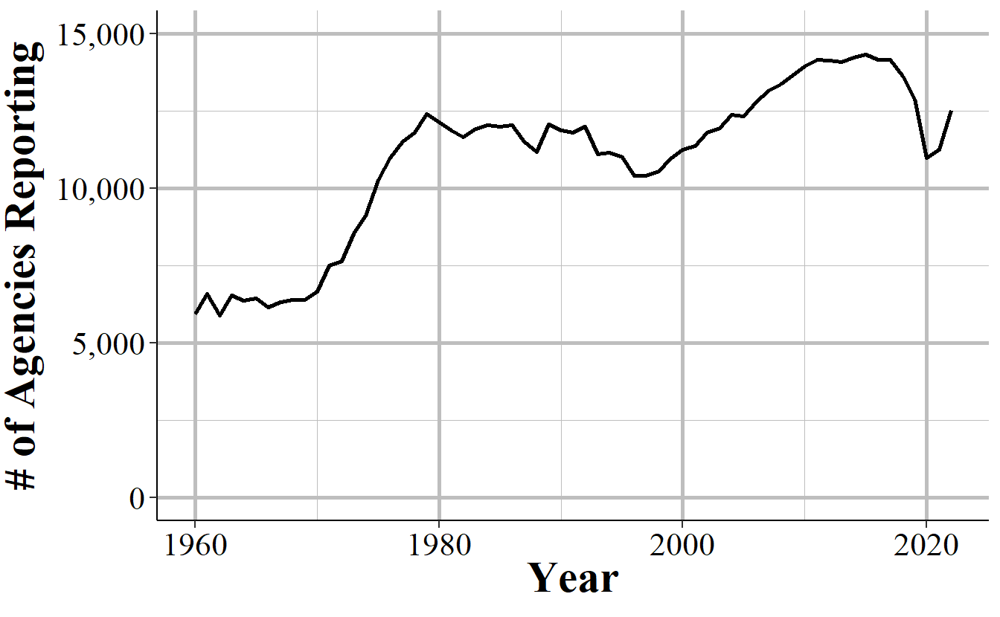
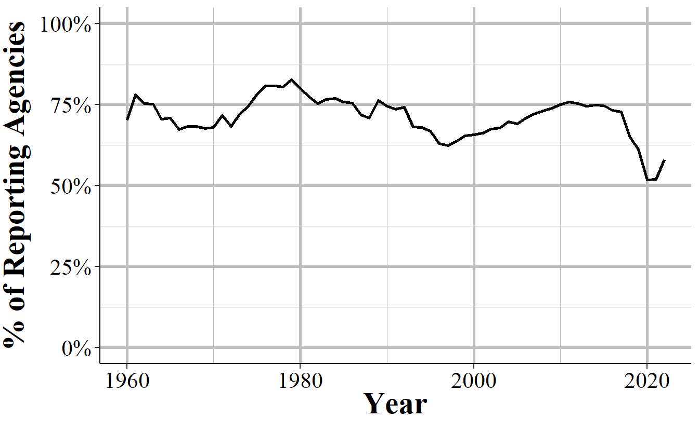
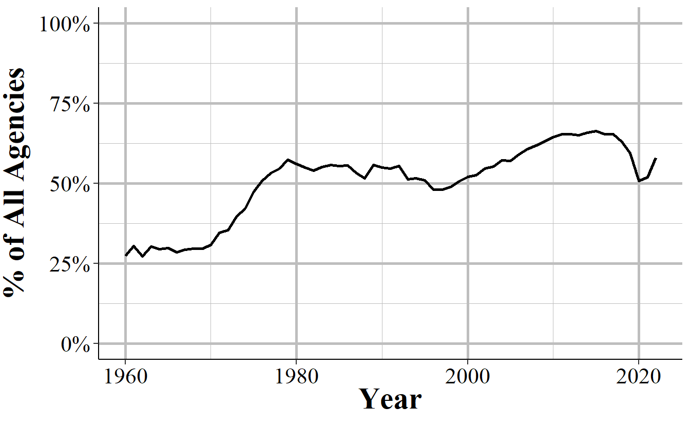
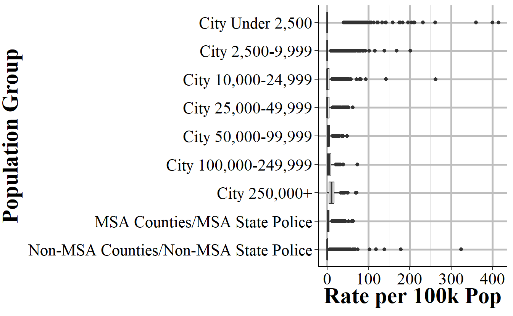

# County-Level SRS Data

UCR data is only available at the agency-level.[^ucr_county-1] This has caused a lot of problems for researchers because many variables from other datasets (e.g. CDC data, economic data) is primarily available at the county-level. Their solution to this problem is to aggregate the data to the county-level by summing all the agencies in a particular county.^[Because the county-level data imputes missing months, this dataset is *only* available at the annual-level, not at the monthly level.]

[^ucr_county-1]: Even for county-level agencies such as Sheriff's Offices, the data is only for crimes in that agency's jurisdiction. So the county sheriff reports crimes that they responded to but not crimes within the county that other agencies, such as a city police force, responded to.

More specifically, nearly all researchers who use this county-level UCR data use the National Archive for Criminal Justice Data (NACJD)'s [datasets](https://www.icpsr.umich.edu/web/pages/NACJD/guides/ucr.html#desc_cl) which have done the aggregation themselves (full disclosure, I used to have my own version of this data available on openICPSR and followed NACJD's method. My reasoning was that people were using it anyways and I wanted to make sure that they knew the problem of the data, so I included the issues with this data in the documentation when downloading it. However, I decided that the data was more flawed than I originally thought so I took down the data.).[^ucr_county-2] These are not official FBI datasets but "UCR staff were consulted in developing the new adjustment procedures".^[To be very clear, this chapter isn't a critique of NACJD, which is a great organization with a very talented team, but merely of a single dataset that they released using imputation methods from decades ago.] The "new" procedures is because NACJD changed their missing data imputation procedure starting with 1994 UCR data, and for this chapter I'll only focus on this "new" procedure.

[^ucr_county-2]: These files are known on NACJD's website as "Uniform Crime Reporting Program Data: County-Level Detailed Arrest and Offense Data."

There are two new problems with county-level UCR data: 1) agencies in multiple counties, 2) and agencies with missing data. I say main new problems as other problems with the data such as definition changes for crimes and underreporting of crimes are inherent in the agency-level data and thus transferred to the county-level data. 

The first issue is in distributing crimes across counties when an agency is in multiple counties. If, for example, New York City had 100 murders in a given year, how do you create county-level data from this? UCR data only tells you how many crimes happened in a particular agency, not where in the jurisdiction it happened. So we have no idea how many of these 100 murders happened in Kings County, how many happened in Bronx County, and so on. UCR data does, however, tell you how many counties the agency is in and the population of each. They only do this for up to three counties so in cases like New York City you don't actually have every county the agency is part of.^[For New York City specifically NACJD does distribute to all five counties, and does so by county population.] NACJD's method is to distribute crimes *according to the population of the agency in each county*. In the New York City example, Kings County is home to about 31% of the people in NYC while Bronx County is home to about 17%. So Kings County would get 31 murders while Bronx County gets 17 murders. The problem with this is the crime is not evenly distributed by population. Indeed, crime is generally extremely concentrated in a small number of areas in a city. Even if 100% of the murders in NYC actually happened in Bronx County, only 17% would get assigned there. So for agencies in multiple counties - which is very common among the largest agencies in the country, and seems more common in some regions than others - the crimes assigned may be massively incorrect.

The second problem is that not all agencies report data, and even those that do may report only partially (e.g. report fewer than 12 months of the year). So by necessity the missing data has to be filled in somehow. While all methods FOR imputing missing data are wrong - as they will be different than the real data, though sometimes not by much - the ways done to impute the missing data in this dataset are particularly incorrect. We'll go into more detail about why they're incorrect in this chapter. 

In this chapter, I'll then talk about the data as it is with a focus on why the data is flawed and shouldn't be used. To be clear, all data has measurement errors and much of this book is dedicated to talking about the errors in the other UCR datasets. 

The problems in the county-level data, however, are egregious enough to merit special warning. This is by no means the first warning about this data. Most famously is [Maltz and Targonski's (2002)](https://link.springer.com/article/10.1023/A:1016060020848) paper in the Journal of Quantitative Criminology about the issues with this data. They concluded that "Until improved methods of imputing county-level crime data are developed, tested, and implemented, they should not be used, especially in policy studies" which is a conclusion I also hold. These warnings, as well as those from others have been largely (it appears) ignored.[^ucr_county-3]

[^ucr_county-3]: Hopefully the warnings deterred at least some people.

## Current usage

Even with the well-known flaws of this data, it remains a popular dataset. A search on Google Scholar for ["county-level UCR"](https://scholar.google.com/scholar?q=county-level+ucr&hl=en&as_sdt=0,20) returns 3,780 results as of this writing in summer 2021. About half of these results are from 2015 or later. In addition to use by researchers, the county-level UCR data is used by organizations such as the FBI in their annual [Crimes in the United States](https://ucr.fbi.gov/crime-in-the-u.s) report (which is essentially the report that informs the media and the public about crime, even though it's actually only a subset of actual UCR data) and [Social Explorer](https://www.socialexplorer.com/explore-maps), a website that makes it extremely convenient to examine US Census data. Based on my reading of UCR papers there are also some differences in data usage by field.[^ucr_county-4]

[^ucr_county-4]: I used to have a Google Scholar alert for UCR papers but turned it off since so many papers either used my data but didn't cite me, used the data improperly, or both.

This data is most widely used (as a share of papers in the field) by economics researchers and fields other than criminology such as the relatively rare psychologist or political scientist studying crime.[^ucr_county-5] Criminologists, however, tend to focus more on agency-level data rather than county-level data, though many criminologists still do use county-level UCR data.[^ucr_county-6]

[^ucr_county-5]: Given economist's policy of not citing other fields it's likely that they haven't read Maltz and Targonski's paper. Normally I'd be concerned with criticizing entire fields, but no economist will read this as I'm not an economist myself so it's fine.

[^ucr_county-6]: I note these differences not to join the ego-driven feud between the fields. As a criminologist who currently works in a political science department, these feuds are quite stupid. I note it, however, to show that this data usage is partially driven by subcultures within fields. For example, criminology has long known about which may explain why it is more commonly used in non-criminology fields. It is therefore important for researchers to talk to (or collaborate with {though to be clear I'm not volunteering or requesting to collaborate with you}) people who have content-expertise about the data that you're using. And that open communication between the fields (including collaborations and submitting to journals from fields other than your own) will strengthen both fields.

## How much data is missing

A major problem with county-level UCR data is that some data is missing, and is then imputed (poorly). So to understand how much of an issue missing data is in the county-level UCR data, we'll now look at missingness in the Offenses Known and Clearances by Arrests dataset which is the "crime data" of the UCR. County-level data also aggregates arrests from the Arrests by Age, Sex, and Race dataset, which has lower reporting (and thus more missingness) than the Offenses Known and Clearances by Arrest data. But for simplicity we'll only look at the crime dataset. We'll do so in a number of different ways to try to really understand how much data is missing and how it changed over time.

For each of the below graphs and tables we use the Offenses Known and Clearances by Arrest data for 1960-2022 and exclude any agency that are "special jurisdictions". Special jurisdiction agencies are, as it seems, special agencies that tend to have an extremely specific jurisdiction and goals. These include agencies such as port authorities, alcohol beverage control, university police, and airport police. These agencies tend to cover a tiny geographic area and have both very low crime and very low reporting rates.[^ucr_county-7] So to prevent missingness being overcounted due to these weird agencies I'm excluding them from the below examples. I'm also excluding federal agencies (though UCR only has 7 reporting federal agencies) as these operate much the same as special jurisdiction agencies.

[^ucr_county-7]: Even though these are unusual agencies, in real analyses using UCR data at the county-level you'd like want to include them. Or justify why you're not including them.

We'll first look at how many months are reported in the example year of 2018, though we'll see below that 2018 is pretty similar to other years. Table \@ref(tab:countyMonthsReportedDefinitions) shows the number of months reported using two definitions. The first is how the FBI, and NACJD when imputing data, classifies number of months reported and this is actually just the last month reported. So if an agency reports only in July they are classified as reporting 7 months; if they report only in December they are classified as reporting 12 months. Whether they actually report previous months doesn't matter based on this definition. 

The second definition is my own - and available in the data I've released on openICPSR - and is based on how many months the data says the agency reported. That is, for each month the UCR data actually says if they received a report or not. So this is a superior way of measuring though not full-proof as some months say they have a report but don't and some say they don't have a report but do have crime recorded. Also, in 2018 the FBI changed how they classify this variable so now every month is reported for every agency, making the measurement useless for 2018 and more recent data.

The table shows what percent of agencies that reported data had data for each possible number of months: 0 through 12 months. Column 2 shows the percent for the 1st method while column 3 shows the percent for my method. And the final column shows the percent change from moving from the 1st to 2nd measure. 

Ultimately the measures are quite similar though systematically overcount reporting using the 1st method. Both show that about 23% of agencies reported zero months. The 1st method has nearly 73% of agencies reporting 12 months while the 2nd method has 69%, a difference of about 5% which is potentially a sizable difference depending on exactly which agencies are missing. The remaining nearly 4% of agencies all have far more people in the 2nd method than in the first, which is because in the 1st method those agencies are recorded as having 12 months since they reported in December but not actually all 12 months of the year. There are huge percent increases in moving from the 1st to 2nd method for 1-11 months reported though this is due to having very few agencies report this many months. Most months have only about 50 agencies in the 1st method and about 70 in the 2nd, so the actual difference is not that large. 

<table class="table table-striped" style="width: auto !important; margin-left: auto; margin-right: auto;">
<caption>(\#tab:countyMonthsReportedDefinitions)The number of months reported to the 2017 Offenses Known and Clearances by Arrest data using two definitions of months reported. The 'Last Month' definition is the preferred measure of months reported by both the FBI and researchers, though this overcounts months.</caption>
 <thead>
  <tr>
   <th style="text-align:left;"> Months Reported </th>
   <th style="text-align:right;"> Last Month Definition </th>
   <th style="text-align:right;"> Months Not Missing Definition </th>
   <th style="text-align:right;"> Percent Difference </th>
  </tr>
 </thead>
<tbody>
  <tr>
   <td style="text-align:left;"> 0 </td>
   <td style="text-align:right;"> 4,481 (23.01%) </td>
   <td style="text-align:right;"> 4,514 (23.18%) </td>
   <td style="text-align:right;"> +0.74 </td>
  </tr>
  <tr>
   <td style="text-align:left;"> 1 </td>
   <td style="text-align:right;"> 93 (0.48%) </td>
   <td style="text-align:right;"> 112 (0.58%) </td>
   <td style="text-align:right;"> +20.43 </td>
  </tr>
  <tr>
   <td style="text-align:left;"> 2 </td>
   <td style="text-align:right;"> 36 (0.18%) </td>
   <td style="text-align:right;"> 70 (0.36%) </td>
   <td style="text-align:right;"> +94.44 </td>
  </tr>
  <tr>
   <td style="text-align:left;"> 3 </td>
   <td style="text-align:right;"> 40 (0.21%) </td>
   <td style="text-align:right;"> 156 (0.8%) </td>
   <td style="text-align:right;"> +290.00 </td>
  </tr>
  <tr>
   <td style="text-align:left;"> 4 </td>
   <td style="text-align:right;"> 44 (0.23%) </td>
   <td style="text-align:right;"> 66 (0.34%) </td>
   <td style="text-align:right;"> +50.00 </td>
  </tr>
  <tr>
   <td style="text-align:left;"> 5 </td>
   <td style="text-align:right;"> 42 (0.22%) </td>
   <td style="text-align:right;"> 78 (0.4%) </td>
   <td style="text-align:right;"> +85.71 </td>
  </tr>
  <tr>
   <td style="text-align:left;"> 6 </td>
   <td style="text-align:right;"> 48 (0.25%) </td>
   <td style="text-align:right;"> 78 (0.4%) </td>
   <td style="text-align:right;"> +62.50 </td>
  </tr>
  <tr>
   <td style="text-align:left;"> 7 </td>
   <td style="text-align:right;"> 55 (0.28%) </td>
   <td style="text-align:right;"> 81 (0.42%) </td>
   <td style="text-align:right;"> +47.27 </td>
  </tr>
  <tr>
   <td style="text-align:left;"> 8 </td>
   <td style="text-align:right;"> 56 (0.29%) </td>
   <td style="text-align:right;"> 87 (0.45%) </td>
   <td style="text-align:right;"> +55.36 </td>
  </tr>
  <tr>
   <td style="text-align:left;"> 9 </td>
   <td style="text-align:right;"> 56 (0.29%) </td>
   <td style="text-align:right;"> 102 (0.52%) </td>
   <td style="text-align:right;"> +82.14 </td>
  </tr>
  <tr>
   <td style="text-align:left;"> 10 </td>
   <td style="text-align:right;"> 158 (0.81%) </td>
   <td style="text-align:right;"> 242 (1.24%) </td>
   <td style="text-align:right;"> +53.16 </td>
  </tr>
  <tr>
   <td style="text-align:left;"> 11 </td>
   <td style="text-align:right;"> 199 (1.02%) </td>
   <td style="text-align:right;"> 419 (2.15%) </td>
   <td style="text-align:right;"> +110.55 </td>
  </tr>
  <tr>
   <td style="text-align:left;"> 12 </td>
   <td style="text-align:right;"> 14,162 (72.74%) </td>
   <td style="text-align:right;"> 13,465 (69.16%) </td>
   <td style="text-align:right;"> -4.92 </td>
  </tr>
</tbody>
</table>

We can look at how these trends change over time in Figure \@ref(fig:countyAnyMonthReported) that shows the annual number of agencies that reported at least one month of data in that year. About 5,500 agencies reported at least on month throughout the 1960s and then grew rapidly over the next decade until about 12,500 agencies reported in the end of the 1970s. This declined over the next two decades before again increasing in the mid-late 1990s where it steadily increased to about 14,000 agencies in 2010 and has stagnated since then, with a small dip in 2018. Out of the approximately 18,000 police agencies in the United States, this is relatively low reporting even as far as recent decades. 

(\#fig:countyAnyMonthReported)The annual number of agencies that reported at least one month of data in that year.

We saw in Table \@ref(tab:countyMonthsReportedDefinitions) that when agencies do report they tend to report all 12 months of the year. Figure \@ref(fig:countyDecemberReported) examines whether this is true by showing the number of agencies in each year that reported in December, which the way that county-level UCR data assumes that all 12 months are reported. The trends are nearly identical to Figure \@ref(fig:countyAnyMonthReported) but with several hundred fewer agencies reporting in December each year than reporting at least one month. This shows that the trend of when agencies do report they tend to report all 12 months (or at least report in December) is consistent over time.

(\#fig:countyDecemberReported)The annual number of agencies that reported data in December of that year (which by the FBI's definition would mean they reported 12 months of the year.

Another way to look at this is to examine, as Figure \@ref(fig:countyDecemberPercent) does, the percent of agencies that report in December of agencies that report at least one month. On average about 92% of agencies that do report any month also report in December, and this number has steadily grown over time, though declined in 2018 to only 90%. 

(\#fig:countyDecemberPercent)The annual percent of agencies that reported in December of that year of those that reported at least one month of data.

Since the number of agencies reporting changes every year - generally increasing over time - we can look at the percent of agencies that reported in December out of all agencies that reported data (and this includes reporting zero months of data) to UCR. Figure \@ref(fig:countyDecemberPercentAnyAgency) shows this trend over time and about 75% of agencies that submit to UCR each year report in December. Reporting rates undulate over this time period - the low is 62% in 1997 and the high is 83% in 1979 - but tend to return to ~75% reporting before trending in the opposite direction again. 

(\#fig:countyDecemberPercentAnyAgency)The annual percent of agencies that reported in December of that year including those that did not report any data that year.

Not all agencies report data to UCR, even to say that they're not reporting any months of data. In 1960, for example, only 8,452 agencies reported data to UCR and 1,406 of these reported zero months of data. To get accurate data on county crime you'll want data from all agencies, not just ones that reported (or told the FBI they weren't reporting) data. Figure \@ref(fig:countyDecemberPercentAllAgencies) shows the annual percent of agencies that reported in December of each year out of the 19,036 agencies that ever reported to UCR. This 19,036 is higher than the ~18,000 agencies often discussed (including in this book) by academics as the approximate number of agencies. I believe that the number here is higher because it includes agencies that may have closed or been swallowed by a larger or nearby agency. 

The trends in Figure \@ref(fig:countyDecemberPercentAllAgencies) are very similar to those in Figure \@ref(fig:countyAnyMonthReported). In the first decade of data only about 25% of agencies reported December data and this rose rapidly to over 60% of agencies in the late 1970s. From here it rather steadily declined until it bottomed out at nearly 50% in 1993 and began rising again. Reporting rates peaked at the mid-60% starting in 2010 and remained stagnant until declining to 62% in 2018. 

The zero reporting agencies are largely in smaller agencies - with the average sized agency in 2018 having a population of 1,682 and the largest having a population of 463,545 - and, in 2018, amounts to agencies covering about 13 million people, or about 4% of the United States population. 

(\#fig:countyDecemberPercentAllAgencies)The annual percent of agencies that reported in December of that year out of all agencies that ever reported to the Offenses Known and Clearances by Arrest dataset (N=19,036).

## Current imputation practices

There are three paths that the county-level UCR data takes when dealing with the agency-level data before aggregating it to the county-level. The path each agency is on is dependent on how many months of data they report. Figure \@ref(fig:countyImputation) shows each of these three paths. We'll look in detail at these paths in the below sections, but for now we'll briefly summarize each path. 

First, if an agency reports only two or fewer months, the entire agency's data (that is, any month that they do report) is deleted and their annual data is replaced with the average of agencies that are: 1) in the same state, 2) in the same population group (i.e. very roughly the same size), 3) and that reported all 12 months of the year (i.e. reported in December but potentially not any other month). 

When an agency reports 3-11 months, those months of data are multiplied by 12/numbers-of-months-reported so it just upweights the available data to account for the missing months, assuming that missing months are like the present months. 

Finally, for agencies that reported all 12 months there's nothing missing so it just uses the data as it is.

(\#fig:countyImputation)The imputation procedure for missing data based on the number of months missing.

### 1-9 months missing

When there are 1-9 months reported the missing months are imputed by multiplying the reported months of data by 12/numbers-of-months-reported, essentially just scaling up the reported months. For example, if 6 months are reported then it multiplies each crime values by 12/6=2, doubling each reported crime value. This method makes the assumption that missing values are similar to present ones, at on average. Given that there are seasonal differences in crime - which tends to increase in the summer and decrease in the winter - how accurate this replacement is depends on how consistent crime is over the year and which months are missing. Miss the summer months and you'll undercount crime. Miss the winter months and you'll overcount crime. Miss random months and you'll be wrong randomly (and maybe it'll balance out but maybe it won't).

We'll look at a number of examples and simulations about how accurate this method is. For each example we'll use agencies that reported in 2018 so we have a real comparison when using their method of replacing "missing" months.

Starting with Table \@ref(tab:CountyPhillyMurders), we will see the change in the actual annual count of murders in Philadelphia when replacing data from each month. Each row shows what happens when you assume that month - and only that month - is missing and interpolate using the current 12/numbers-of-months-reported method. Column 1 shows the month that we are "replacing" while column 2 shows the actual number of murders in that month and the percent of annual murders in parentheses. Column 3 shows the actual annual murders which is 351 in 2018; column 4 shows the annual murder count when imputing the "missing" month" and column 5 shows the percent change between columns 3 and 4.

If each month had the same number of crimes we'd expect each month to account for 8.33% of the year's total. That's not what we're seeing in Philadelphia for murders as the percentages range from 5.13% in both January and April to 12.25% in December. This means that replacing these months will not give us an accurate count of crimes as crime is not distributed evenly across months. Indeed, as seen in column 5, on average, the annual sum of murders when imputing a single month is 1.85% off from the real value. When imputing the worst (as far as its effect on results) months you can report murder as either 4.27% lower than it is or 3.5% higher than it is.

<table class="table table-striped" style="width: auto !important; margin-left: auto; margin-right: auto;">
<caption>(\#tab:CountyPhillyMurders)The imputed number of murders in Philadelphia in 2018 when missing a single month. This shows how different the imputed value is to the real value for each month missing.</caption>
 <thead>
  <tr>
   <th style="text-align:left;"> Month </th>
   <th style="text-align:right;"> Murders That Month </th>
   <th style="text-align:right;"> Actual Annual Murders </th>
   <th style="text-align:right;"> Imputed Annual Murders </th>
   <th style="text-align:right;"> Percent Change </th>
  </tr>
 </thead>
<tbody>
  <tr>
   <td style="text-align:left;"> January </td>
   <td style="text-align:right;"> 18 (5.13%) </td>
   <td style="text-align:right;"> 351 </td>
   <td style="text-align:right;"> 363 </td>
   <td style="text-align:right;"> +3.42 </td>
  </tr>
  <tr>
   <td style="text-align:left;"> February </td>
   <td style="text-align:right;"> 26 (7.41%) </td>
   <td style="text-align:right;"> 351 </td>
   <td style="text-align:right;"> 355 </td>
   <td style="text-align:right;"> +1.14 </td>
  </tr>
  <tr>
   <td style="text-align:left;"> March </td>
   <td style="text-align:right;"> 27 (7.69%) </td>
   <td style="text-align:right;"> 351 </td>
   <td style="text-align:right;"> 353 </td>
   <td style="text-align:right;"> +0.57 </td>
  </tr>
  <tr>
   <td style="text-align:left;"> April </td>
   <td style="text-align:right;"> 18 (5.13%) </td>
   <td style="text-align:right;"> 351 </td>
   <td style="text-align:right;"> 363 </td>
   <td style="text-align:right;"> +3.42 </td>
  </tr>
  <tr>
   <td style="text-align:left;"> May </td>
   <td style="text-align:right;"> 33 (9.40%) </td>
   <td style="text-align:right;"> 351 </td>
   <td style="text-align:right;"> 347 </td>
   <td style="text-align:right;"> -1.14 </td>
  </tr>
  <tr>
   <td style="text-align:left;"> June </td>
   <td style="text-align:right;"> 26 (7.41%) </td>
   <td style="text-align:right;"> 351 </td>
   <td style="text-align:right;"> 355 </td>
   <td style="text-align:right;"> +1.14 </td>
  </tr>
  <tr>
   <td style="text-align:left;"> July </td>
   <td style="text-align:right;"> 27 (7.69%) </td>
   <td style="text-align:right;"> 351 </td>
   <td style="text-align:right;"> 353 </td>
   <td style="text-align:right;"> +0.57 </td>
  </tr>
  <tr>
   <td style="text-align:left;"> August </td>
   <td style="text-align:right;"> 41 (11.68%) </td>
   <td style="text-align:right;"> 351 </td>
   <td style="text-align:right;"> 338 </td>
   <td style="text-align:right;"> -3.70 </td>
  </tr>
  <tr>
   <td style="text-align:left;"> September </td>
   <td style="text-align:right;"> 32 (9.12%) </td>
   <td style="text-align:right;"> 351 </td>
   <td style="text-align:right;"> 348 </td>
   <td style="text-align:right;"> -0.85 </td>
  </tr>
  <tr>
   <td style="text-align:left;"> October </td>
   <td style="text-align:right;"> 27 (7.69%) </td>
   <td style="text-align:right;"> 351 </td>
   <td style="text-align:right;"> 353 </td>
   <td style="text-align:right;"> +0.57 </td>
  </tr>
  <tr>
   <td style="text-align:left;"> November </td>
   <td style="text-align:right;"> 33 (9.40%) </td>
   <td style="text-align:right;"> 351 </td>
   <td style="text-align:right;"> 347 </td>
   <td style="text-align:right;"> -1.14 </td>
  </tr>
  <tr>
   <td style="text-align:left;"> December </td>
   <td style="text-align:right;"> 43 (12.25%) </td>
   <td style="text-align:right;"> 351 </td>
   <td style="text-align:right;"> 336 </td>
   <td style="text-align:right;"> -4.27 </td>
  </tr>
</tbody>
</table>

Part of the reason for the percent difference for murders when replacing a month found above is that there was high variation in the number of murders per month with some months having more than double the number as other months. We'll look at what happens when crimes are far more evenly distributed across months in Table \@ref(tab:countyPhillyThefts). This table replicates Table \@ref(tab:CountyPhillyMurders) but uses thefts in Philadelphia in 2018 instead of murders. Here the monthly share of thefts ranged only from 6.85% to 9.16% so month-to-month variation is not very large. Now the percent change never increases above an absolute value of 1.62 and changes by an average of 0.77%. In cases like this, the imputation method is less of a problem.

<table class="table table-striped" style="width: auto !important; margin-left: auto; margin-right: auto;">
<caption>(\#tab:countyPhillyThefts)The imputed number of thefts in Philadelphia in 2018 when missing a single month. This shows how different the imputed value is to the real value for each month missing.</caption>
 <thead>
  <tr>
   <th style="text-align:left;"> Month </th>
   <th style="text-align:right;"> Thefts That Month </th>
   <th style="text-align:right;"> Actual Annual Thefts </th>
   <th style="text-align:right;"> Imputed Annual Thefts </th>
   <th style="text-align:right;"> Percent Change </th>
  </tr>
 </thead>
<tbody>
  <tr>
   <td style="text-align:left;"> January </td>
   <td style="text-align:right;"> 2,720 (7.36%) </td>
   <td style="text-align:right;"> 36,968 </td>
   <td style="text-align:right;"> 37,361 </td>
   <td style="text-align:right;"> +1.06 </td>
  </tr>
  <tr>
   <td style="text-align:left;"> February </td>
   <td style="text-align:right;"> 2,532 (6.85%) </td>
   <td style="text-align:right;"> 36,968 </td>
   <td style="text-align:right;"> 37,567 </td>
   <td style="text-align:right;"> +1.62 </td>
  </tr>
  <tr>
   <td style="text-align:left;"> March </td>
   <td style="text-align:right;"> 2,598 (7.03%) </td>
   <td style="text-align:right;"> 36,968 </td>
   <td style="text-align:right;"> 37,495 </td>
   <td style="text-align:right;"> +1.43 </td>
  </tr>
  <tr>
   <td style="text-align:left;"> April </td>
   <td style="text-align:right;"> 3,200 (8.66%) </td>
   <td style="text-align:right;"> 36,968 </td>
   <td style="text-align:right;"> 36,838 </td>
   <td style="text-align:right;"> -0.35 </td>
  </tr>
  <tr>
   <td style="text-align:left;"> May </td>
   <td style="text-align:right;"> 3,215 (8.70%) </td>
   <td style="text-align:right;"> 36,968 </td>
   <td style="text-align:right;"> 36,821 </td>
   <td style="text-align:right;"> -0.40 </td>
  </tr>
  <tr>
   <td style="text-align:left;"> June </td>
   <td style="text-align:right;"> 3,226 (8.73%) </td>
   <td style="text-align:right;"> 36,968 </td>
   <td style="text-align:right;"> 36,809 </td>
   <td style="text-align:right;"> -0.43 </td>
  </tr>
  <tr>
   <td style="text-align:left;"> July </td>
   <td style="text-align:right;"> 3,312 (8.96%) </td>
   <td style="text-align:right;"> 36,968 </td>
   <td style="text-align:right;"> 36,716 </td>
   <td style="text-align:right;"> -0.68 </td>
  </tr>
  <tr>
   <td style="text-align:left;"> August </td>
   <td style="text-align:right;"> 3,454 (9.34%) </td>
   <td style="text-align:right;"> 36,968 </td>
   <td style="text-align:right;"> 36,561 </td>
   <td style="text-align:right;"> -1.10 </td>
  </tr>
  <tr>
   <td style="text-align:left;"> September </td>
   <td style="text-align:right;"> 3,287 (8.89%) </td>
   <td style="text-align:right;"> 36,968 </td>
   <td style="text-align:right;"> 36,743 </td>
   <td style="text-align:right;"> -0.61 </td>
  </tr>
  <tr>
   <td style="text-align:left;"> October </td>
   <td style="text-align:right;"> 3,386 (9.16%) </td>
   <td style="text-align:right;"> 36,968 </td>
   <td style="text-align:right;"> 36,635 </td>
   <td style="text-align:right;"> -0.90 </td>
  </tr>
  <tr>
   <td style="text-align:left;"> November </td>
   <td style="text-align:right;"> 2,906 (7.86%) </td>
   <td style="text-align:right;"> 36,968 </td>
   <td style="text-align:right;"> 37,159 </td>
   <td style="text-align:right;"> +0.52 </td>
  </tr>
  <tr>
   <td style="text-align:left;"> December </td>
   <td style="text-align:right;"> 3,132 (8.47%) </td>
   <td style="text-align:right;"> 36,968 </td>
   <td style="text-align:right;"> 36,912 </td>
   <td style="text-align:right;"> -0.15 </td>
  </tr>
</tbody>
</table>

Given that the imputation method is largely dependent on consistency across months, what happens when crime is very rare? Table \@ref(tab:countyDanvilleVehicle) shows what happens when replacing a single month for motor vehicle thefts in Danville, California, a small town which had 22 of these thefts in 2018. While possible to still have an even distribution of crimes over months, this is less likely when it comes to rare events. Here, having so few motor vehicle thefts means that small changes in monthly crimes can have an outsize effect. The average absolute value percent change now is 7.3% and this ranges from a -15.68% difference to a +9.1% difference from the real annual count. This means that having even a single month missing can vastly overcount or undercount the real values.

<table class="table table-striped" style="width: auto !important; margin-left: auto; margin-right: auto;">
<caption>(\#tab:countyDanvilleVehicle)The imputed number of motor vehicle thefts in Danville, California, in 2018 when missing a single month. This shows how different the imputed value is to the real value for each month missing.</caption>
 <thead>
  <tr>
   <th style="text-align:left;"> Month </th>
   <th style="text-align:right;"> Vehicle Thefts That Month </th>
   <th style="text-align:right;"> Actual Annual Vehicle Thefts </th>
   <th style="text-align:right;"> Imputed Annual Vehicle Thefts </th>
   <th style="text-align:right;"> Percent Change </th>
  </tr>
 </thead>
<tbody>
  <tr>
   <td style="text-align:left;"> January </td>
   <td style="text-align:right;"> 3 (13.64%) </td>
   <td style="text-align:right;"> 22 </td>
   <td style="text-align:right;"> 21 </td>
   <td style="text-align:right;"> -4.55 </td>
  </tr>
  <tr>
   <td style="text-align:left;"> February </td>
   <td style="text-align:right;"> 0 (0.00%) </td>
   <td style="text-align:right;"> 22 </td>
   <td style="text-align:right;"> 24 </td>
   <td style="text-align:right;"> +9.09 </td>
  </tr>
  <tr>
   <td style="text-align:left;"> March </td>
   <td style="text-align:right;"> 1 (4.55%) </td>
   <td style="text-align:right;"> 22 </td>
   <td style="text-align:right;"> 23 </td>
   <td style="text-align:right;"> +4.55 </td>
  </tr>
  <tr>
   <td style="text-align:left;"> April </td>
   <td style="text-align:right;"> 2 (9.09%) </td>
   <td style="text-align:right;"> 22 </td>
   <td style="text-align:right;"> 22 </td>
   <td style="text-align:right;"> +0.00 </td>
  </tr>
  <tr>
   <td style="text-align:left;"> May </td>
   <td style="text-align:right;"> 3 (13.64%) </td>
   <td style="text-align:right;"> 22 </td>
   <td style="text-align:right;"> 21 </td>
   <td style="text-align:right;"> -4.55 </td>
  </tr>
  <tr>
   <td style="text-align:left;"> June </td>
   <td style="text-align:right;"> 1 (4.55%) </td>
   <td style="text-align:right;"> 22 </td>
   <td style="text-align:right;"> 23 </td>
   <td style="text-align:right;"> +4.55 </td>
  </tr>
  <tr>
   <td style="text-align:left;"> July </td>
   <td style="text-align:right;"> 1 (4.55%) </td>
   <td style="text-align:right;"> 22 </td>
   <td style="text-align:right;"> 23 </td>
   <td style="text-align:right;"> +4.55 </td>
  </tr>
  <tr>
   <td style="text-align:left;"> August </td>
   <td style="text-align:right;"> 0 (0.00%) </td>
   <td style="text-align:right;"> 22 </td>
   <td style="text-align:right;"> 24 </td>
   <td style="text-align:right;"> +9.09 </td>
  </tr>
  <tr>
   <td style="text-align:left;"> September </td>
   <td style="text-align:right;"> 5 (22.73%) </td>
   <td style="text-align:right;"> 22 </td>
   <td style="text-align:right;"> 19 </td>
   <td style="text-align:right;"> -13.64 </td>
  </tr>
  <tr>
   <td style="text-align:left;"> October </td>
   <td style="text-align:right;"> 5 (22.73%) </td>
   <td style="text-align:right;"> 22 </td>
   <td style="text-align:right;"> 19 </td>
   <td style="text-align:right;"> -13.64 </td>
  </tr>
  <tr>
   <td style="text-align:left;"> November </td>
   <td style="text-align:right;"> 1 (4.55%) </td>
   <td style="text-align:right;"> 22 </td>
   <td style="text-align:right;"> 23 </td>
   <td style="text-align:right;"> +4.55 </td>
  </tr>
  <tr>
   <td style="text-align:left;"> December </td>
   <td style="text-align:right;"> 0 (0.00%) </td>
   <td style="text-align:right;"> 22 </td>
   <td style="text-align:right;"> 24 </td>
   <td style="text-align:right;"> +9.09 </td>
  </tr>
</tbody>
</table>

In the above three tables we looked at what happens if a single month is missing. Below we'll look at the results of simulating when between 1 and 9 months are missing for an agency. Table \@ref(tab:countyPhillyMurderMonthsMissing) looks at murder in Philadelphia again but now randomizes removing between 1 and 9 months of the year and interpolating the annual murder count using the current method. For each number of months removed I run 10,000 simulations.[^ucr_county-8] Given that I am literally randomly choosing which months to say are missing, I am assuming that missing data is missing completely at random. This is a very bold assumption and one that is the best-case scenario since it means that missing data is not related to crimes, police funding/staffing, or anything else relevant. So you should read the below tables as the most optimistic (and thus likely wrong) outcomes.

[^ucr_county-8]: This is actually more than I need to run to get the same results but it's easier to run many simulations than to math out how many I actually need to find all possible combinations of missing months.

For each number of months reported the table shows the actual annual murder (which never changes) and the imputed mean, median, modal, minimum, and maximum annual murder count. As a function of the randomization, the imputed mean is always nearly identical to the real value. The most important columns, I believe, are the minimum and maximum imputed value since these show the worst-case scenario - that is, what happens when the month(s) least like the average month is replaced. Since as researchers we should try to minimize the harm caused from our work if it is wrong, I think it is safest to assume that if data is missing it is missing in the worst possible way. While this is a conservative approach, doing so otherwise leads to the greatest risk of using incorrect data, and incorrect results - and criminology is a field important enough to necessitate this caution.

As might be expected, as the number of months missing increases the quality of the imputation decreases. The minimum is further and further below the actual value while the maximum is further and further above the actual value.

<table class="table table-striped" style="width: auto !important; margin-left: auto; margin-right: auto;">
<caption>(\#tab:countyPhillyMurderMonthsMissing)A simulation showing how the imputed values of murders in Philadelphia in 2018 changes as the number of months to impute changes. For each number of months missing (and thus, imputed) 10,000 simulations are run for removing and imputing those months of data.</caption>
 <thead>
  <tr>
   <th style="text-align:left;"> # of Months Missing </th>
   <th style="text-align:right;"> Actual Murder </th>
   <th style="text-align:right;"> Mean Imputed Murder </th>
   <th style="text-align:right;"> Median Imputed Murder </th>
   <th style="text-align:right;"> Modal Imputed Murder </th>
   <th style="text-align:right;"> Min Imputed Murder </th>
   <th style="text-align:right;"> Max Imputed Murder </th>
  </tr>
 </thead>
<tbody>
  <tr>
   <td style="text-align:left;"> 1 </td>
   <td style="text-align:right;"> 351 </td>
   <td style="text-align:right;"> 351.03 </td>
   <td style="text-align:right;"> 353.45 </td>
   <td style="text-align:right;"> 353.45 </td>
   <td style="text-align:right;"> 336.00 </td>
   <td style="text-align:right;"> 363.27 </td>
  </tr>
  <tr>
   <td style="text-align:left;"> 2 </td>
   <td style="text-align:right;"> 351 </td>
   <td style="text-align:right;"> 350.92 </td>
   <td style="text-align:right;"> 350.40 </td>
   <td style="text-align:right;"> 350.40 </td>
   <td style="text-align:right;"> 320.40 </td>
   <td style="text-align:right;"> 378.00 </td>
  </tr>
  <tr>
   <td style="text-align:left;"> 3 </td>
   <td style="text-align:right;"> 351 </td>
   <td style="text-align:right;"> 351.01 </td>
   <td style="text-align:right;"> 352.00 </td>
   <td style="text-align:right;"> 353.33 </td>
   <td style="text-align:right;"> 312.00 </td>
   <td style="text-align:right;"> 385.33 </td>
  </tr>
  <tr>
   <td style="text-align:left;"> 4 </td>
   <td style="text-align:right;"> 351 </td>
   <td style="text-align:right;"> 351.08 </td>
   <td style="text-align:right;"> 349.50 </td>
   <td style="text-align:right;"> 370.50 </td>
   <td style="text-align:right;"> 301.50 </td>
   <td style="text-align:right;"> 394.50 </td>
  </tr>
  <tr>
   <td style="text-align:left;"> 5 </td>
   <td style="text-align:right;"> 351 </td>
   <td style="text-align:right;"> 351.07 </td>
   <td style="text-align:right;"> 351.43 </td>
   <td style="text-align:right;"> 353.14 </td>
   <td style="text-align:right;"> 289.71 </td>
   <td style="text-align:right;"> 404.57 </td>
  </tr>
  <tr>
   <td style="text-align:left;"> 6 </td>
   <td style="text-align:right;"> 351 </td>
   <td style="text-align:right;"> 351.25 </td>
   <td style="text-align:right;"> 354.00 </td>
   <td style="text-align:right;"> 326.00 </td>
   <td style="text-align:right;"> 284.00 </td>
   <td style="text-align:right;"> 418.00 </td>
  </tr>
  <tr>
   <td style="text-align:left;"> 7 </td>
   <td style="text-align:right;"> 351 </td>
   <td style="text-align:right;"> 350.84 </td>
   <td style="text-align:right;"> 350.40 </td>
   <td style="text-align:right;"> 348.00 </td>
   <td style="text-align:right;"> 276.00 </td>
   <td style="text-align:right;"> 436.80 </td>
  </tr>
  <tr>
   <td style="text-align:left;"> 8 </td>
   <td style="text-align:right;"> 351 </td>
   <td style="text-align:right;"> 351.08 </td>
   <td style="text-align:right;"> 354.00 </td>
   <td style="text-align:right;"> 312.00 </td>
   <td style="text-align:right;"> 264.00 </td>
   <td style="text-align:right;"> 450.00 </td>
  </tr>
  <tr>
   <td style="text-align:left;"> 9 </td>
   <td style="text-align:right;"> 351 </td>
   <td style="text-align:right;"> 350.62 </td>
   <td style="text-align:right;"> 346.00 </td>
   <td style="text-align:right;"> 344.00 </td>
   <td style="text-align:right;"> 248.00 </td>
   <td style="text-align:right;"> 468.00 </td>
  </tr>
</tbody>
</table>

This problem is even more pronounced when looking at agencies with fewer crimes and less evenly distributed crimes. Table \@ref(tab:countyDanvilleBurglaryMonthsMissing) repeats the above table but now looks at motor vehicle thefts in Danville, California. By the time 5 months are missing, the minimum value is nearly half of the actual value while the maximum value is a little under 50% larger than the actual value. By 9 months missing, possible imputed values range from 0% of the actual value to over twice as large as the actual value.

<table class="table table-striped" style="width: auto !important; margin-left: auto; margin-right: auto;">
<caption>(\#tab:countyDanvilleBurglaryMonthsMissing)A simulation showing how the imputed values of motor vehicle thefts in Danville, California, in 2018 changes as the number of months to impute changes. For each number of months missing (and thus, imputed) 10,000 simulations are run for removing and imputing those months of data.</caption>
 <thead>
  <tr>
   <th style="text-align:left;"> # of Months Missing </th>
   <th style="text-align:right;"> Actual Vehicle Theft </th>
   <th style="text-align:right;"> Mean Imputed Vehicle Theft </th>
   <th style="text-align:right;"> Median Imputed Vehicle Theft </th>
   <th style="text-align:right;"> Modal Imputed Vehicle Theft </th>
   <th style="text-align:right;"> Min Imputed Vehicle Theft </th>
   <th style="text-align:right;"> Max Imputed Vehicle Theft </th>
  </tr>
 </thead>
<tbody>
  <tr>
   <td style="text-align:left;"> 1 </td>
   <td style="text-align:right;"> 22 </td>
   <td style="text-align:right;"> 22.00 </td>
   <td style="text-align:right;"> 22.91 </td>
   <td style="text-align:right;"> 22.91 </td>
   <td style="text-align:right;"> 18.55 </td>
   <td style="text-align:right;"> 24.00 </td>
  </tr>
  <tr>
   <td style="text-align:left;"> 2 </td>
   <td style="text-align:right;"> 22 </td>
   <td style="text-align:right;"> 22.00 </td>
   <td style="text-align:right;"> 22.80 </td>
   <td style="text-align:right;"> 25.20 </td>
   <td style="text-align:right;"> 14.40 </td>
   <td style="text-align:right;"> 26.40 </td>
  </tr>
  <tr>
   <td style="text-align:left;"> 3 </td>
   <td style="text-align:right;"> 22 </td>
   <td style="text-align:right;"> 22.01 </td>
   <td style="text-align:right;"> 22.67 </td>
   <td style="text-align:right;"> 21.33 </td>
   <td style="text-align:right;"> 12.00 </td>
   <td style="text-align:right;"> 29.33 </td>
  </tr>
  <tr>
   <td style="text-align:left;"> 4 </td>
   <td style="text-align:right;"> 22 </td>
   <td style="text-align:right;"> 21.97 </td>
   <td style="text-align:right;"> 22.50 </td>
   <td style="text-align:right;"> 22.50 </td>
   <td style="text-align:right;"> 9.00 </td>
   <td style="text-align:right;"> 31.50 </td>
  </tr>
  <tr>
   <td style="text-align:left;"> 5 </td>
   <td style="text-align:right;"> 22 </td>
   <td style="text-align:right;"> 21.94 </td>
   <td style="text-align:right;"> 22.29 </td>
   <td style="text-align:right;"> 20.57 </td>
   <td style="text-align:right;"> 6.86 </td>
   <td style="text-align:right;"> 34.29 </td>
  </tr>
  <tr>
   <td style="text-align:left;"> 6 </td>
   <td style="text-align:right;"> 22 </td>
   <td style="text-align:right;"> 22.04 </td>
   <td style="text-align:right;"> 22.00 </td>
   <td style="text-align:right;"> 24.00 </td>
   <td style="text-align:right;"> 6.00 </td>
   <td style="text-align:right;"> 38.00 </td>
  </tr>
  <tr>
   <td style="text-align:left;"> 7 </td>
   <td style="text-align:right;"> 22 </td>
   <td style="text-align:right;"> 22.02 </td>
   <td style="text-align:right;"> 21.60 </td>
   <td style="text-align:right;"> 21.60 </td>
   <td style="text-align:right;"> 4.80 </td>
   <td style="text-align:right;"> 43.20 </td>
  </tr>
  <tr>
   <td style="text-align:left;"> 8 </td>
   <td style="text-align:right;"> 22 </td>
   <td style="text-align:right;"> 21.92 </td>
   <td style="text-align:right;"> 21.00 </td>
   <td style="text-align:right;"> 27.00 </td>
   <td style="text-align:right;"> 3.00 </td>
   <td style="text-align:right;"> 48.00 </td>
  </tr>
  <tr>
   <td style="text-align:left;"> 9 </td>
   <td style="text-align:right;"> 22 </td>
   <td style="text-align:right;"> 21.97 </td>
   <td style="text-align:right;"> 20.00 </td>
   <td style="text-align:right;"> 24.00 </td>
   <td style="text-align:right;"> 0.00 </td>
   <td style="text-align:right;"> 52.00 </td>
  </tr>
</tbody>
</table>

### 10-12 months missing

In cases where there are more than 9 months of data missing, the current imputation method replaces the entire year of data for that agency with the average of the crime for agencies who reported 12 months of data, are in the same state and in the same population group as the given agency. Considering that when an agency reports data it tends to report every month of the year - and about a quarter of agencies still do not report any months of data - this is a far bigger issue than when agencies are missing 1-9 months of data. The imputation process is also far worse here.

Whereas with 1-9 months missing the results were at least based on the own agency's data, and were actually not terribly wrong (depending on the specific agency and crime patterns) when only a small number of months were missing, the imputation for 10+ months missing is nonsensical. It assumes that these agencies are much like similarly sized agencies in the same state.

There are two major problems here. First, similarly sized agencies are based on the population group which is quite literally just a category indicating how big the agency is when grouped into rather arbitrary categories. These categories can range quite far - with agencies having millions more people than other agencies in the same category in some cases - so in most cases "similarly sized" agencies are not that similarly sized. The second issue is simply the assumption that population is all that important to crime rates. Population is certainly important to crime counts; New York City is going to have many more crimes than small towns purely due to its huge population, even though NYC has a low crime rate. But there is still huge variation in crimes among cities of the same or similar size as crime tends to concentrate in certain areas. So replacing an agency's annual crime counts with that or other agencies (even the average of other agencies) will give you a very wrong count.

For this method of replacing missing data to be accurate agencies in the same population group in each state would need to have very similar crime counts. Otherwise it is assuming that missing agencies are just average (literally) in terms of crime. This again assumes that missing data is missing at random, which is unlikely to be true.

In each of the below examples we use data from 2018 Offenses Known and Clearances by Arrest and use only agencies whose final month reported was December. This makes it the actual agencies in each population group that would replace agencies that are missing 10 or more months of data in 2018. As agencies can - and do - report different numbers of months each year, these numbers would be a little different if using any year other than 2018.

For each population group we'll look at the mean, median, and maximum number of murders plus aggravated assaults with a gun.[^ucr_county-9] This is essentially a measure of the most serious violent crimes as the difference between gun assaults and murders is, to some degree, a matter of luck (e.g. where the person is shot can make the difference between an assault and a murder).[^ucr_county-10] This is actually not available in NACJD's county-level UCR data as they don't separate gun assaults from other aggravated assaults, though that data is available in the agency-level UCR data. If we see a wide range in the number of murders+gun-assaults in the below table, that'll indicate that this method of imputing missing data is highly flawed.

[^ucr_county-9]: Aggravated assaults with a gun include but are not limited to shootings. The gun does not need to be fired to be considered an aggregated assault.

[^ucr_county-10]: Attempted murders are considered aggravated assaults in the UCR.

Table \@ref(tab:countyPopulationGroupStatsNational) shows these values for all agencies in the United States who reported 12 months of data (based on the "December last month reported" definition) in 2018. The actual imputation process only looks at agencies in the same state, but this is still information at seeing broad trends - and we'll look at two specific states below. Column 1 shows each of the population groups in the data while the remaining columns show the mean, median, minimum, and maximum number of murders+gun-assaults in 2018, respectively.[^ucr_county-11] For each population group there is a large range of values, as seen from the minimum and maximum values. There are also large differences in the mean and median values for larger (25,000+ population) agencies, particularly when compared to the top and bottom of the range of values.[^ucr_county-12] Using this imputation method will, in most cases (but soon we'll see an instance where there's an exception) provide substantially different values than the real (but unknown) values.

[^ucr_county-11]: The agency-level UCR data actually has more population groups than this list, but NACJD has grouped some together. Given that some states may have few (or no) agencies in a population group, combining more groups together does alleviate the problem of having no comparison cities but at the tradeoff of making the comparison less similar to the given agency.

[^ucr_county-12]: The negative number for minimum crimes in the Non-MSA Counties and Non-MSA State Police is due to a reporting quirk of UCR, covered in Chapter 2, and is not a mistake in the data.

<table class="table table-striped" style="width: auto !important; margin-left: auto; margin-right: auto;">
<caption>(\#tab:countyPopulationGroupStatsNational)The mean, median, minimum, and maximum agency size nationwide for all population groups in the 2018 Offenses Known and Clearances by Arrests data.</caption>
 <thead>
  <tr>
   <th style="text-align:left;"> Population Group </th>
   <th style="text-align:right;"> Mean Murder + Gun Assault </th>
   <th style="text-align:right;"> Median Murder + Gun Assault </th>
   <th style="text-align:right;"> Minimum Murder + Gun Assault </th>
   <th style="text-align:left;"> Max Murder + Gun Assault </th>
  </tr>
 </thead>
<tbody>
  <tr>
   <td style="text-align:left;"> City Under 2,500 </td>
   <td style="text-align:right;"> 0 </td>
   <td style="text-align:right;"> 0 </td>
   <td style="text-align:right;"> 0 </td>
   <td style="text-align:left;"> 108 </td>
  </tr>
  <tr>
   <td style="text-align:left;"> City 2,500-9,999 </td>
   <td style="text-align:right;"> 1 </td>
   <td style="text-align:right;"> 0 </td>
   <td style="text-align:right;"> 0 </td>
   <td style="text-align:left;"> 55 </td>
  </tr>
  <tr>
   <td style="text-align:left;"> City 10,000-24,999 </td>
   <td style="text-align:right;"> 6 </td>
   <td style="text-align:right;"> 2 </td>
   <td style="text-align:right;"> 0 </td>
   <td style="text-align:left;"> 220 </td>
  </tr>
  <tr>
   <td style="text-align:left;"> City 25,000-49,999 </td>
   <td style="text-align:right;"> 13 </td>
   <td style="text-align:right;"> 4 </td>
   <td style="text-align:right;"> 0 </td>
   <td style="text-align:left;"> 381 </td>
  </tr>
  <tr>
   <td style="text-align:left;"> City 50,000-99,999 </td>
   <td style="text-align:right;"> 34 </td>
   <td style="text-align:right;"> 15 </td>
   <td style="text-align:right;"> 0 </td>
   <td style="text-align:left;"> 608 </td>
  </tr>
  <tr>
   <td style="text-align:left;"> City 100,000-249,999 </td>
   <td style="text-align:right;"> 131 </td>
   <td style="text-align:right;"> 64 </td>
   <td style="text-align:right;"> 1 </td>
   <td style="text-align:left;"> 1,235 </td>
  </tr>
  <tr>
   <td style="text-align:left;"> City 250,000+ </td>
   <td style="text-align:right;"> 1,093 </td>
   <td style="text-align:right;"> 638 </td>
   <td style="text-align:right;"> 4 </td>
   <td style="text-align:left;"> 6,209 </td>
  </tr>
  <tr>
   <td style="text-align:left;"> MSA Counties And MSA State Police </td>
   <td style="text-align:right;"> 19 </td>
   <td style="text-align:right;"> 3 </td>
   <td style="text-align:right;"> -1 </td>
   <td style="text-align:left;"> 1,701 </td>
  </tr>
  <tr>
   <td style="text-align:left;"> Non-MSA Counties And Non-MSA State Police </td>
   <td style="text-align:right;"> 3 </td>
   <td style="text-align:right;"> 1 </td>
   <td style="text-align:right;"> 0 </td>
   <td style="text-align:left;"> 295 </td>
  </tr>
</tbody>
</table>

To better see the distribution, Figure \@ref(fig:countyPopulationGroupsBoxplot) shows boxplots for the rate per 100,000 population of murders+gun-assaults in each population group in 2018. Since there can't be a rate without any population, this excludes all agencies with a population of zero. To make the graph simpler to see, it also excludes all agencies with a rate about 500, which is 57 agencies. Each population group has a relatively large range of values with the size of the boxplot growing as the size of the population group increases. This means that there are a wider variety of rates in larger population groups than in smaller population groups. Each population group also has a good number of agencies that are outliers with a much higher rate than is normal.

(\#fig:countyPopulationGroupsBoxplot)Boxplots showing the distribution of annual murders+gun-assaults for each population group for all agencies that reported December data in 2018.

Since the actual imputation process looks only at agencies in the same state, we'll look at two example states - Texas and Maine - and see how trends differ from nationally. These states are chosen as Texas is a very large (both in population and in number of jurisdictions) state with some areas of high crime while Maine is a small, more rural state with very low crime. Table \@ref(tab:countyPopulationGroupStatsTexas) shows results in Texas. Here, the findings are very similar to that of Table \@ref(tab:countyPopulationGroupStatsNational). While the numbers are different, and the maximum value is substantially smaller than using all agencies in the country, the basic findings of a wide range of values - especially at larger population groups - is the same.

<table class="table table-striped" style="width: auto !important; margin-left: auto; margin-right: auto;">
<caption>(\#tab:countyPopulationGroupStatsTexas)The mean, median, minimum, and maximum agency size for agencies in Texas for all population groups in the 2018 Offenses Known and Clearances by Arrests data.</caption>
 <thead>
  <tr>
   <th style="text-align:left;"> Population Group </th>
   <th style="text-align:right;"> Mean Murder + Gun Assault </th>
   <th style="text-align:right;"> Median Murder + Gun Assault </th>
   <th style="text-align:right;"> Minimum Murder + Gun Assault </th>
   <th style="text-align:left;"> Max Murder + Gun Assault </th>
  </tr>
 </thead>
<tbody>
  <tr>
   <td style="text-align:left;"> City Under 2,500 </td>
   <td style="text-align:right;"> 0 </td>
   <td style="text-align:right;"> 0 </td>
   <td style="text-align:right;"> 0 </td>
   <td style="text-align:left;"> 6 </td>
  </tr>
  <tr>
   <td style="text-align:left;"> City 2,500-9,999 </td>
   <td style="text-align:right;"> 2 </td>
   <td style="text-align:right;"> 1 </td>
   <td style="text-align:right;"> 0 </td>
   <td style="text-align:left;"> 17 </td>
  </tr>
  <tr>
   <td style="text-align:left;"> City 10,000-24,999 </td>
   <td style="text-align:right;"> 7 </td>
   <td style="text-align:right;"> 5 </td>
   <td style="text-align:right;"> 0 </td>
   <td style="text-align:left;"> 38 </td>
  </tr>
  <tr>
   <td style="text-align:left;"> City 25,000-49,999 </td>
   <td style="text-align:right;"> 17 </td>
   <td style="text-align:right;"> 13 </td>
   <td style="text-align:right;"> 0 </td>
   <td style="text-align:left;"> 61 </td>
  </tr>
  <tr>
   <td style="text-align:left;"> City 50,000-99,999 </td>
   <td style="text-align:right;"> 37 </td>
   <td style="text-align:right;"> 27 </td>
   <td style="text-align:right;"> 1 </td>
   <td style="text-align:left;"> 141 </td>
  </tr>
  <tr>
   <td style="text-align:left;"> City 100,000-249,999 </td>
   <td style="text-align:right;"> 105 </td>
   <td style="text-align:right;"> 77 </td>
   <td style="text-align:right;"> 12 </td>
   <td style="text-align:left;"> 467 </td>
  </tr>
  <tr>
   <td style="text-align:left;"> City 250,000+ </td>
   <td style="text-align:right;"> 1,343 </td>
   <td style="text-align:right;"> 669 </td>
   <td style="text-align:right;"> 76 </td>
   <td style="text-align:left;"> 4,919 </td>
  </tr>
  <tr>
   <td style="text-align:left;"> MSA Counties And MSA State Police </td>
   <td style="text-align:right;"> 43 </td>
   <td style="text-align:right;"> 6 </td>
   <td style="text-align:right;"> 0 </td>
   <td style="text-align:left;"> 1,701 </td>
  </tr>
  <tr>
   <td style="text-align:left;"> Non-MSA Counties And Non-MSA State Police </td>
   <td style="text-align:right;"> 2 </td>
   <td style="text-align:right;"> 1 </td>
   <td style="text-align:right;"> 0 </td>
   <td style="text-align:left;"> 28 </td>
  </tr>
</tbody>
</table>

Now we'll look at data from Maine, as shown in Table \@ref(tab:countyPopulationGroupStatsMaine). Here, results are much better: there is a narrow range in values meaning that the imputation would be very similar to the real values. This is driven mainly by Maine being a tiny state, with only one city larger than 50,000 people (Portland) and Maine being an extremely safe state so most places have zero murders+gun-assaults. In cases like this, where both crime and population size are consistent across the state (which is generally caused by everywhere having low crime), this imputation process can work well.

<table class="table table-striped" style="width: auto !important; margin-left: auto; margin-right: auto;">
<caption>(\#tab:countyPopulationGroupStatsMaine)The mean, median, minimum, and maximum agency size for agencies in Maine for all population groups in the 2018 Offenses Known and Clearances by Arrests data.</caption>
 <thead>
  <tr>
   <th style="text-align:left;"> Population Group </th>
   <th style="text-align:right;"> Mean Murder + Gun Assault </th>
   <th style="text-align:right;"> Median Murder + Gun Assault </th>
   <th style="text-align:right;"> Minimum Murder + Gun Assault </th>
   <th style="text-align:left;"> Max Murder + Gun Assault </th>
  </tr>
 </thead>
<tbody>
  <tr>
   <td style="text-align:left;"> City Under 2,500 </td>
   <td style="text-align:right;"> 0 </td>
   <td style="text-align:right;"> 0 </td>
   <td style="text-align:right;"> 0 </td>
   <td style="text-align:left;"> 0 </td>
  </tr>
  <tr>
   <td style="text-align:left;"> City 2,500-9,999 </td>
   <td style="text-align:right;"> 0 </td>
   <td style="text-align:right;"> 0 </td>
   <td style="text-align:right;"> 0 </td>
   <td style="text-align:left;"> 2 </td>
  </tr>
  <tr>
   <td style="text-align:left;"> City 10,000-24,999 </td>
   <td style="text-align:right;"> 1 </td>
   <td style="text-align:right;"> 1 </td>
   <td style="text-align:right;"> 0 </td>
   <td style="text-align:left;"> 7 </td>
  </tr>
  <tr>
   <td style="text-align:left;"> City 25,000-49,999 </td>
   <td style="text-align:right;"> 6 </td>
   <td style="text-align:right;"> 4 </td>
   <td style="text-align:right;"> 0 </td>
   <td style="text-align:left;"> 14 </td>
  </tr>
  <tr>
   <td style="text-align:left;"> City 50,000-99,999 </td>
   <td style="text-align:right;"> 12 </td>
   <td style="text-align:right;"> 12 </td>
   <td style="text-align:right;"> 12 </td>
   <td style="text-align:left;"> 12 </td>
  </tr>
  <tr>
   <td style="text-align:left;"> City 100,000-249,999 </td>
   <td style="text-align:right;"> - </td>
   <td style="text-align:right;"> - </td>
   <td style="text-align:right;"> - </td>
   <td style="text-align:left;"> - </td>
  </tr>
  <tr>
   <td style="text-align:left;"> City 250,000+ </td>
   <td style="text-align:right;"> - </td>
   <td style="text-align:right;"> - </td>
   <td style="text-align:right;"> - </td>
   <td style="text-align:left;"> - </td>
  </tr>
  <tr>
   <td style="text-align:left;"> MSA Counties And MSA State Police </td>
   <td style="text-align:right;"> 0 </td>
   <td style="text-align:right;"> 0 </td>
   <td style="text-align:right;"> -1 </td>
   <td style="text-align:left;"> 2 </td>
  </tr>
  <tr>
   <td style="text-align:left;"> Non-MSA Counties And Non-MSA State Police </td>
   <td style="text-align:right;"> 2 </td>
   <td style="text-align:right;"> 0 </td>
   <td style="text-align:right;"> 0 </td>
   <td style="text-align:left;"> 19 </td>
  </tr>
</tbody>
</table>

## Final thoughts

County-level UCR data should not be used for research because it handles missing data poorly and distributes crimes for agencies in multiple counties very poorly, so will give inaccurate results. This is the conclusion that Maltz and Targonski had in 2002 in their paper examining the data and is, in my opinion, the conclusion that still holds today as the problems have not improved (or even changed since 2002). There are two main problems: distributing crimes for agencies in multiple counties and missing data. The first, given UCR data constraints, seems unfixable though is not a problem for agencies in only one county. For the second, if an imputation method was used that properly (i.e. got as close to the right answer as possible) handled missing data that would solve this issue. 

Given the decades of data and agencies that release their own crime data on their websites that can be used as a check on how close imputed data is to the real data (as some agencies, such as Philadelphia in 2019, don't report all months of data to the UCR but still release incident-level data publicly on their city's 'open data' websites) this is a solvable problem.[^ucr_county-13] Missing data is not a problem only in criminology, and is actually addressed in some criminology papers, so the fact that so much research relies on this data that does such a poor job of handling missing data and literally assumes that crime is not at all concentrated is a sorry testament to this field.[^ucr_county-14] We can do better.

[^ucr_county-13]: But not by me, so please don't ask.

[^ucr_county-14]: There are also a good number of criminology papers that try to interpolate missing data from survey papers, which in general I think is a mistake since they often assume that the data is missing at random.
