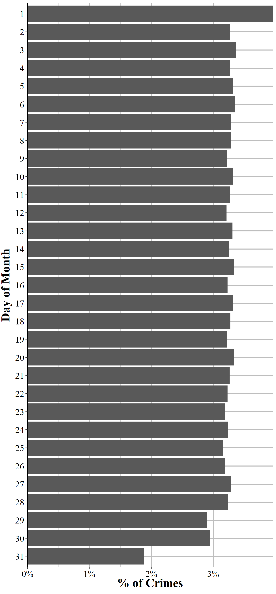
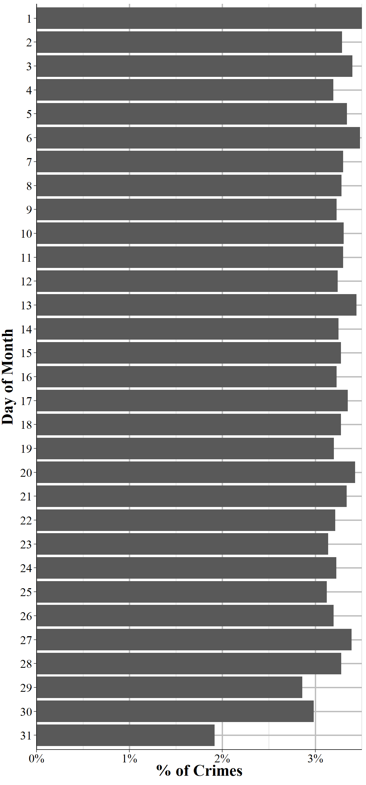
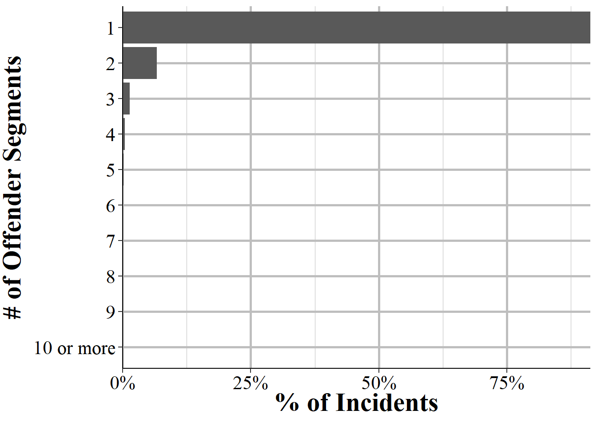
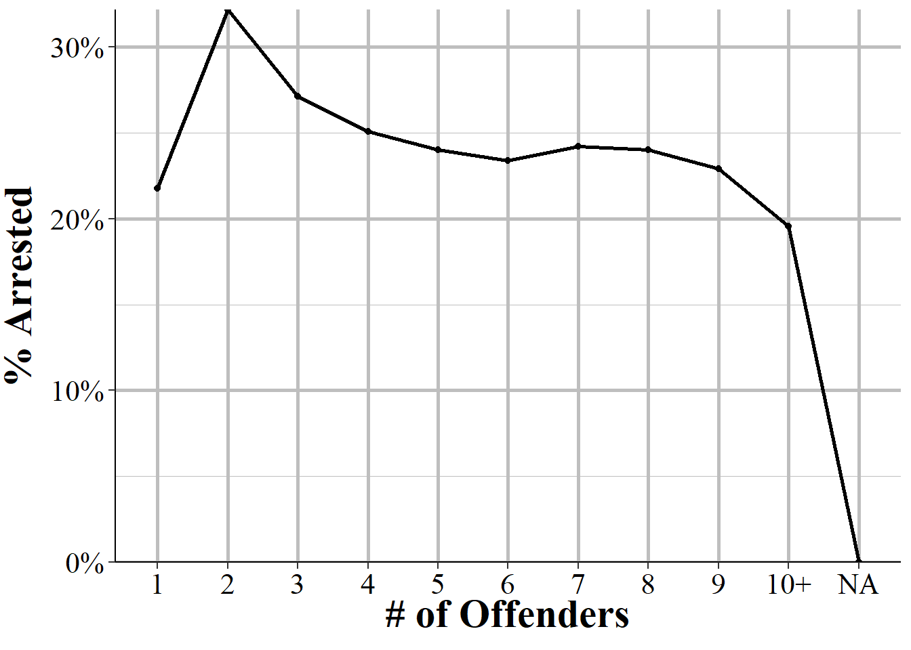
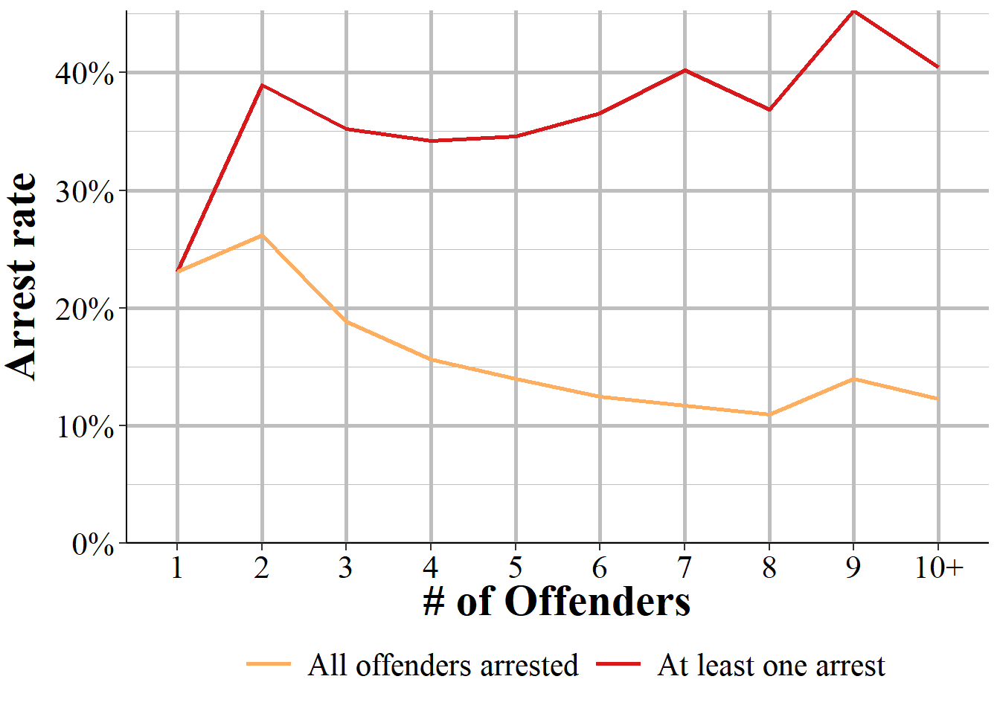

# Administrative and Window Exceptional Clearance Segment 

The Administrative Segment provides information about the incident itself, such as how many victims or offenders there were. In practice this means that it tells us how many other segments - offense, offender, victim, and arrestee segments - there are for this particular incident. It also has several important variables at the incident-level such as what hour of the day the incident occurred and whether the incident date variable is actually just the date the incident was reported. Finally, it tells us whether the case was cleared exceptionally and, if so, what type of exceptional clearance it was. This can tell us, for example, how many crimes were cleared because the offender died or the victim refused to cooperate. As the UCR data doesn't differentiate between normal clearances (i.e. arrest the offender) and exceptional clearances, this provides a far deeper understanding of case outcomes. 

In addition to the variables detailed below, this segment has the traditional agency and incident identifiers: the ORI code, the agency state, the year of this data, and the incident number. 

## The incident and report date

An important variable, especially for policy analyses, is when the crime happened. NIBRS tells you both the date and the hour of the day for when the crime occurred. We'll start with the date. We can convert the date a few different ways, such as daily, weekly, monthly, quarterly. We could use this precise date to do regression discontinuity studies where we look at days just before and just after some policy change or natural experiment. In this chapter we'll look simply at the percent of crimes each month and each day of the month (overall, not within each month).

Figure \@ref(fig:administrativeIncidentMonth) shows the percent of crimes in the 2022 NIBRS data each month. Past research has found that crimes are lowest when it is cold and highest when it is hot (and summer also comes with many teens and young adults out of school so have more free time to offend or be victimized). We find these same results with crime lowest in February and steadily increasing until it peaks in July and August, and then decreasing as weather gets cooler in the fall and winter.

(\#fig:administrativeIncidentMonth)The percent of crime incidents in 2022 NIBRS by the month of incident.

We can also look at the days of the month to see if there is any variation here. Figure \@ref(fig:administrativeMonthDayIncident) shows the percent of crimes on each day of the month. There's not much variation other than a few days. The 29th and 30th day of the month have fewer crimes, and the 31st day has by far the fewest crimes. These findings are reasonable since not all months have that many days so by definition there are fewer 31st (and 29th, and 30th) days of the month for crimes to occur on. The most common day of the month is the 1st which accounts for 3.95% of all incidents. There's also a small spike on the 15th on the month with 3.39% of incidents occurring on the 15th. No other date is more than 3.35% of incidents. In this data the agencies must report a date, even if they don't know the exact date; there is no option to put "unknown date". So when these agencies don't know when a crime occurred, they put it as the 1st (or less commonly the 15th) of the month. I call this issue the "first-of-the-month error" and it is one I haven't seen discussed in papers that use daily data from NIBRS. For this reason I'd warn against including the 1st of the month in any analysis where the day of the month is relevant.  

(\#fig:administrativeMonthDayIncident)The percent of crimes that occur (the day of the incident, even if the crime wasn't reported that day) each day of the month for all agencies reporting to NIBRS in 2022.

The above graph showed the days of the month where the incident was said to occur. There is also a variable that says if the date included was the incident date or the date the crime was reported to the police. Figure \@ref(fig:administrativeMonthDayReport) replicates Figure \@ref(fig:administrativeMonthDayIncident) but now shows only report dates rather than incident date. There's still a spike for the 1st and 15th but they are very small now and comparable to other days of the month. This provides even more evidence that the incident date spike on the 1st and 15th of the month is just an artifact of agencies putting unknown dates there, rather than a true increase in crime on those days.

(\#fig:administrativeMonthDayReport)The percent of crimes that are reported (the day of the report, even if not the day of the incident) each day of the month for all agencies reporting to NIBRS in 2022.

## Hour of incident

An extremely important aspect of crime data is when exactly the crime occurs. If, for example, crime always spikes when the local high school ends their day that would likely indicate that high school students are involved with crime (both as victims or as offenders). When crime happens also would affect police behavior as they'd likely increase patrol during times of elevated crime. Luckily, NIBRS data does have the time of each incident, though it's only at the hour level.

Figure \@ref(fig:administrativeHours) shows the total number of crimes that occurred in the 2022 NIBRS data for each hour of the day. There are two key trends in this figure. First, past research has found that crime tends to increase during the night (this is especially true during weekends), drop to a daily low in the couple of hours before sunrise, and then slowly increase as the day progresses.^[In all of the nighttime police ride-alongs I've been on the police tend to stop patrolling in early morning (e.g. 3-4am) and go back to the station to do paperwork. I think this likely partially explains the findings that crime is lowest around 4-5am.] What we find here is a little different. Crime peaks at night at 5-5:59pm which is far earlier than other estimates. Since this is all crimes it could be biased by large increases of certain crimes at this time, such as people coming home from work and finding their house burgled. As crimes differ in their timing (e.g. burglary happens often during the day, fights are more common at night), you'll need to merge this segment with the Offense Segment to be able to look at certain types of crimes alone.

The second key trend is the large spike at midnight-12:59am and at noon-12:59pm. The midnight spike certainly seems far too large to be real. The midnight hour is more than double that of neighboring hours, and reverses the trend in the hours before it. Crime increases more at night (though not as much here as in other studies of this topic) but not by such a massive amount. The noon hour is about 50% larger than in the neighboring hours, so is a sizable increase though continues the trend of increasing crime during the day and is a far smaller increase than at midnight. It seems unlikely that this spike is real, though potentially some of it could be. For example, if a lot of people take their lunch at noon then there could be an increase of crime (such as pickpocketing and purse snatching) when these people gather at restaurants and malls to eat. So what are these spikes? There is no option to say that the hour is unknown so the police must put something in, and it seems that they put midnight and noon as the default "unknown hour" hour. Given this, I recommend that you remove the midnight and noon hour from any analysis you do where the time of day is relevant.

(\#fig:administrativeHours)The percent of crimes that are reported each hour for all agencies reporting to NIBRS in 2022.

## Exceptional clearance

When we speak of clearances we generally mean that a person was arrested for the crime.^[While a more expansive definition may include a conviction in a court for that crime (including pleading guilty), NIBRS data only extends to the arrest stage so we never know the judicial outcome of the case.] Cases may also be cleared "through exceptional means" which is also called an "exceptional clearance." An exceptional clearance means that the police have identified who the offender is (in cases with multiple offenders, they need to identify only one offender), have sufficient evidence and ability (e.g. know where they are) to arrest this offender but are unable to do so for some reason. Basically, if they could arrest them they would but for some reason they can't. NIBRS data tells us if the case is exceptionally cleared as well as the reason for the exceptional clearance. 

Exceptional clearances are relatively rare, making up about 5% of cases. Figure \@ref(fig:administrativeExceptionalClearances) shows the breakdown of reasons why the case was cleared for these ~5% of cases that are exceptionally cleared. The most common reason, at 47.3% of exceptional clearances, is that the victim refused to cooperate with the police or prosecution. This can include cases where the victim reported their crime to the police and then later decide to stop assisting. The next most common reason, at 45.3% of exceptionally cleared cases, is that the prosecution decides to not prosecute the case. This excludes cases where the prosecution believes that there is not probable cause to make the arrest. Therefore it largely includes cases that the prosecution either doesn't believe they could win or where the agency has a policy of non-prosecution - this is likely increasingly common in jurisdiction which has "progressive prosecutors" who de facto legalize certain crimes.  

The next most common group is when the offender is a juvenile and the police chose to avoid arresting them due to their age. This occurs in minor offenses such as property crimes and the police do give notice to the juvenile offender's parents or guardians about the situation. If the offender is in another agency's jurisdiction (including out of the country) and the agency reporting data is unable to make an arrest, including when the agency who has the offender in their jurisdiction refuses to extradite the offender, the case can be exceptionally cleared. This occurs in 1.6% of exceptional clearances. In these cases we don't know any information about which jurisdiction the offender is in at the time of the exceptional clearance. Finally, if the offender dies (by any means) before the arrest they can't be arrested so the case is exceptionally cleared. This makes up about 0.9% of exceptional clearances. 

(\#fig:administrativeExceptionalClearances)The distribution of exceptional clearances for all exceptional clearances reported to NIBRS in 2022.

## Number of other segments

The "Administrative" part of this segment is that it tells us about other segments related to this incident. Here we know how many Offense, Offender, Victim, and Arrestee segments there are for the incident. In effect it says how many crimes were committed, offenders involved (at least the number known to police), victims involved, and people arrested for this particular incident. This can be useful both as a check to make sure you're not missing anything when looking at the other segments and to quickly subset data, such as to only single-victim or only multiple-offender incidents. 

### Offense Segments

This variable indicates how many offense segments there are associated with this incident, with the possible values ranging from one to nine. Each incident can have multiple offenses, so this just says how many of these crimes there were. For example, if a person is raped and robbed then there'd be two offense segments related to that incident. Figure \@ref(fig:administrativeOffenseSegments) shows the number of offense segments - and thus the number of crimes - associated with each incident. The vast majority of incidents only have one offense reported, making up 88.4% of incidents.^[In reality a person who commits a crime may be arrested or charged with many (often highly related) offenses related to a single criminal incident. So this data does report fewer incidents than you'd likely find in other data sources, such as if you request data from a local police agency or district attorney's office.] This drops considerably to 10.3% of incidents having two offenses, 1.1% having three, and then under 0.15% of incidents having four through nine offenses.

(\#fig:administrativeOffenseSegments)The distribution for the number of Offender Segments per incident, for all incidents in NIBRS 2022.

### Offender Segments

The Administrative Segment tells you how many offenders are involved with an incident. This is, of course, an estimate because in some incidents the police don't know how many people are involved. If, for example, someone was robbed then they can tell the police how many robbers there were. But if someone comes home to find their home burglarized then they don't know how many burglars there were. If there's no video evidence (e.g. a home security camera) and neighbors didn't see anything then the police would not know how many offenders were involved in the incident. In these cases they put in a single offender and in the Offender Segment all of the information about the offender is "unknown." The remaining number of offenders are still estimates as the police may not know for sure how many offenders were involved, but this is more reliable than when there is only a single offender reported. With that major caveat in mind, Figure \@ref(fig:administrativeOffenderSegments) shows the distribution in how many offenders there were per incident. 

The vast majority of incidents have only one (or potentially an unknown number) offenders, at 89.8% percent of incidents. Incidents with two offenders make up only 7.9% of incidents while those with three make up 1.6% of incidents. No other number of offenders make up more than 0.5% of incidents. The data does have the exact number of offenders but I've top coded it to 10 in the graph for simplicity. There can potentially be a large number of offenders involved in an incident and in the 2022 NIBRS data the incident with the higher number of offenders had 81. However, it is exceedingly rare for there to be even more than a handful of offenders. 

(\#fig:administrativeOffenderSegments)The distribution for the number of Offender Segments per incident, for all incidents in NIBRS 2022.

### Victim Segments

In cases where the offense is a "victimless crime" (or at least one where there's no specific victim) such as a drug offense, the victim and the offender can be the same individual. For other cases, being a victim in an incident just means that you were the victim of at least one offense committed in the incident. Figure \@ref(fig:administrativeVictimSegments) shows the distribution in the number of victims per incident. Like the number of offenses and offenders, this is massively skewed to the left with 90.3% of incidents having a single victim. Incidents with two victims make up 7.9% of the data while incidents with three victims are 1.2%. All remaining numbers of victims are less than one third of one percent of the data each. The data does have the exact number of victims but I've top coded it to 10 in the graph for simplicity. The incident with the most victims in 2022 had 207 victims.  

(\#fig:administrativeVictimSegments)The distribution for the number of Victim Segments per incident, for all incidents in NIBRS 2022.

### Arrestee Segments

Unlike the previous segments, there may not always be an arrestee segment since not all crimes lead to an arrest. Figure \@ref(fig:administrativeArresteeSegments) shows the distribution in the number of arrestee segments per incident in the 2022 NIBRS data. Indeed, the vast majority - 72.9% of incidents - didn't lead to a single arrest. In 24% of incidents a single person was arrested while in 2.5% of incidents two people were arrested. The remaining numbers of people arrested are increasingly small with a little over a third of one percent of incidents having three people arrested and no greater than 0.1% for larger numbers of people arrested. The incident with the most arrests in 2022 led to 81 people arrested. 

(\#fig:administrativeArresteeSegments)The distribution for the number of Arrestee Segments per incident, for all incidents in NIBRS 2022.

Of course, to really understand these arrests we'd need to know how many people committed the crime. Having one arrest for an incident with one offender is good, having one arrest when there are multiple offenders means relatively low clearance rates. While we don't know the true number of offenders (as police may not know how many there actually were), we can use the Offender Segment count as a good estimate. Figure \@ref(fig:administrativePercentArrested) shows the percent of people arrested for each number of offenders in the incident. Keep in mind that when there's one offender reported this can potentially mean the police don't know how many offenders there are, so it's a bit unreliable. There is wide variability in the percent of offenders arrested by the number of offenders in an incident. In cases with one offender, there was an arrest made only 25% of the time. When there are two offenders, about 36% of offenders are arrested, on average, and this steadily declines as the number of offenders increase back down to 25.7% with six offenders. This moves a percentage point or two as the number of offenders increases but not by very much. 

(\#fig:administrativePercentArrested)The percent of people arrested by the number of offenders in an incident.

Another way to look at this is to examine the percent of incidents, by number of offenders, where at least one offender was arrested. Here we're asking a very different question than in the above figure. Instead of asking, of all offenders who committed a crime what number are arrested, we want to know of all incidents how many led to at least one arrest. This is actually how the UCR defines clearance rates, at least one person arrested (no matter how many offenders there are) clears the entire incident. 

Figure \@ref(fig:administrativeArrestsAny) shows this analysis by giving the percent of incidents by the number of offenders where at least one offender was arrested. As before, 25% of incidents with one offender had a person arrested. Now we see a steady decline in the percent of incidents arrested as the number of offenders increase. This figure shows that relatively few incidents ever lead to an arrest of at least one offender, and the chance that an arrest is made decreases as the number of offenders increases. These findings suggest that the larger numbers found in Figure \@ref(fig:administrativePercentArrested) are because when at least one offender is arrested in an incident it's also likely that multiple offenders are arrested. 

(\#fig:administrativeArrestsAny)The percent of incidents by number of offenders where at least one offender is arrested.

