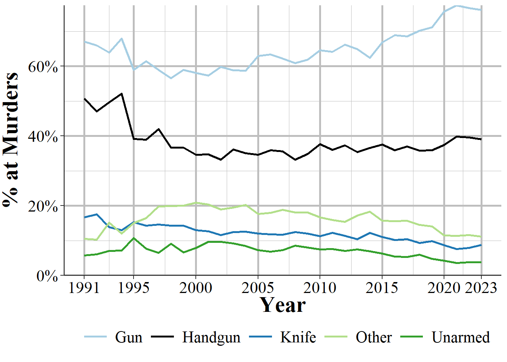
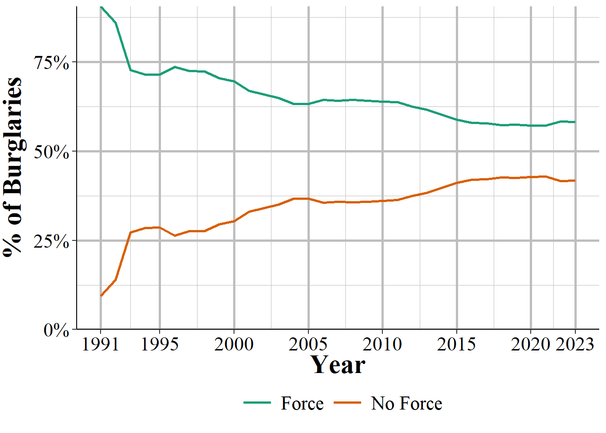

# Offense Segment {#offenseSegment}

This data set provides information about the offense that occurred, with each incident potentially having multiple offenses. Each row is an incident-offense so incidents with multiple offenses would have multiple rows. For a subset of offenses it also provides a more detailed subcategory of offense, allowing a deeper dive into what exactly happened. For example, for animal abuse there are four subcategories of offenses: simple/gross neglect of an animal, intentional abuse or torture, animal sexual abuse (bestiality), and organized fighting of animals such as dog or cock fights. 

There is also information for what date the crime occurred on, where the crime occurred - in categories such as residence or sidewalk rather than an address - whether the offender is suspected of using drugs, alcohol, or "computer equipment" (which includes cell phones) during the crime, and which weapon was involved. In cases where the weapon was a firearm it says whether that weapon was fully automatic or not. It also provides information on if the crime was a hate crime by including a variable on the bias motivation (if any) of the offender. This is based on evidence that the crime was motivated, at least in part, by the victim's group (e.g. race, sexuality, religion, etc.). There are 34 possible bias motivations and while hate crimes could potentially be motivated by bias against multiple groups, this data only allows for a single bias motivation.

As you look through this data yourself you may be surprised that some common crimes, such as DUIs and disorderly conduct, are missing. That is because some crimes, which the FBI calls "Group B" crimes, are reported only when an arrest is made and only as part of the "Group B Arrest Report" segment. Therefore, none of these offenses will be reported in the Offense Segment. We'll discuss these Group B offenses when we discuss arrestees in Chapter \@ref(arrestee). 

## Crime category

The most important variable in the Offense Segment is figuring out exactly what offense was committed. This tells you what crimes occurred in the incident. There can be multiple crimes in a single incident so this provides information about each offense that happened. To figure out which offenses belong together, just look at the incident number, year, and the ORI. Within ORI and year, each incident number is a unique identifier for an incident. Be careful that you're using all three of these variables as the incident number may be the same in different agencies, or in the same agency in different years, but these refer to different incidents.

Each crime is mutually exclusive and crimes which are elements of another crime are not double-counted. For example, robberies are basically theft plus assault/intimidation - it is the use of force (assault) or the threat of force (intimidation) to take property (theft). A case of robbery in this data would only count as robbery, not as robbery and theft and assault/intimidation. If there are these crimes together in an incident that is because that crime *also* occurred separately. For example, if someone is robbed and after the robbery is over (i.e. they hand over their belongings) they are then punched repeatedly, that could potentially be classified as a robbery and an assault. 

Table \@ref(tab:offenseCrimeCategories) shows each possible crime in the data and how common it was in 2022. It is sorted by frequency instead of alphabetically so it is easier to see which crimes are most common. There were about 13 million crimes reported to NIBRS in 2022. The most common crime is simple assault - which is an assault that did not use a weapon and did not result in serious injury - at 14% of crimes, or about 1.7 million crimes. If you think this is odd because property crimes are more common than violent crimes, you would be right. NIBRS data is pretty specific in its crime categories so it splits up certain crimes into a number of different categories. Theft is the most common crime committed in the United States. In NIBRS it is broken into several different types of theft so you need to combine them together to actually measure theft in its entirety. Of the top 6 most common crimes, theft crimes make up ranks 3, 5, and 6 (all other larceny, theft from motor vehicle, and shoplifting), and there are other theft offenses that are less common such as "theft from building" and "theft of motor vehicle parts/accessories." 

This table also shows the first year that offense is included in the data. Most offenses have been included since NIBRS started in 1991, but these have been new offenses added, with these additions becoming more common recently. For example, the crime "Failure to register as a sex offender" was added in 2021 as was "Illegal entry into the United States." There are even offenses that were not reported at all in 2022, such as "treason," which is an offense that only federal and tribal agencies are allowed to report. 

<table class="table table-striped" style="width: auto !important; margin-left: auto; margin-right: auto;">
<caption>(\#tab:offenseCrimeCategories)The number and percent of crimes reported from all agencies in 2022, by crime category.</caption>
 <thead>
  <tr>
   <th style="text-align:left;"> Crime Category </th>
   <th style="text-align:left;"> First Year </th>
   <th style="text-align:right;"> \# of Offenses </th>
   <th style="text-align:right;"> \% of Offenses </th>
  </tr>
 </thead>
<tbody>
  <tr>
   <td style="text-align:left;"> Assault Offenses - Simple Assault </td>
   <td style="text-align:left;"> 1991 </td>
   <td style="text-align:right;"> 1,935,317 </td>
   <td style="text-align:right;"> 13.83\% </td>
  </tr>
  <tr>
   <td style="text-align:left;"> Destruction/Damage/Vandalism of Property </td>
   <td style="text-align:left;"> 1991 </td>
   <td style="text-align:right;"> 1,655,619 </td>
   <td style="text-align:right;"> 11.83\% </td>
  </tr>
  <tr>
   <td style="text-align:left;"> Larceny/Theft Offenses - All Other Larceny </td>
   <td style="text-align:left;"> 1991 </td>
   <td style="text-align:right;"> 1,421,624 </td>
   <td style="text-align:right;"> 10.16\% </td>
  </tr>
  <tr>
   <td style="text-align:left;"> Drug/Narcotic Offenses - Drug/Narcotic Violations </td>
   <td style="text-align:left;"> 1991 </td>
   <td style="text-align:right;"> 1,059,452 </td>
   <td style="text-align:right;"> 7.57\% </td>
  </tr>
  <tr>
   <td style="text-align:left;"> Larceny/Theft Offenses - Shoplifting </td>
   <td style="text-align:left;"> 1991 </td>
   <td style="text-align:right;"> 966,955 </td>
   <td style="text-align:right;"> 6.91\% </td>
  </tr>
  <tr>
   <td style="text-align:left;"> Motor Vehicle Theft </td>
   <td style="text-align:left;"> 1991 </td>
   <td style="text-align:right;"> 892,984 </td>
   <td style="text-align:right;"> 6.38\% </td>
  </tr>
  <tr>
   <td style="text-align:left;"> Larceny/Theft Offenses - Theft From Motor Vehicle </td>
   <td style="text-align:left;"> 1991 </td>
   <td style="text-align:right;"> 858,529 </td>
   <td style="text-align:right;"> 6.13\% </td>
  </tr>
  <tr>
   <td style="text-align:left;"> Burglary/Breaking And Entering </td>
   <td style="text-align:left;"> 1991 </td>
   <td style="text-align:right;"> 683,034 </td>
   <td style="text-align:right;"> 4.88\% </td>
  </tr>
  <tr>
   <td style="text-align:left;"> Assault Offenses - Intimidation </td>
   <td style="text-align:left;"> 1991 </td>
   <td style="text-align:right;"> 623,972 </td>
   <td style="text-align:right;"> 4.46\% </td>
  </tr>
  <tr>
   <td style="text-align:left;"> Assault Offenses - Aggravated Assault </td>
   <td style="text-align:left;"> 1991 </td>
   <td style="text-align:right;"> 605,159 </td>
   <td style="text-align:right;"> 4.32\% </td>
  </tr>
  <tr>
   <td style="text-align:left;"> Drug/Narcotic Offenses - Drug Equipment Violations </td>
   <td style="text-align:left;"> 1991 </td>
   <td style="text-align:right;"> 486,578 </td>
   <td style="text-align:right;"> 3.48\% </td>
  </tr>
  <tr>
   <td style="text-align:left;"> Fraud Offenses - False Pretenses/Swindle/Confidence Game </td>
   <td style="text-align:left;"> 1991 </td>
   <td style="text-align:right;"> 368,675 </td>
   <td style="text-align:right;"> 2.63\% </td>
  </tr>
  <tr>
   <td style="text-align:left;"> Weapon Law Violations - Weapon Law Violations </td>
   <td style="text-align:left;"> 1991 </td>
   <td style="text-align:right;"> 355,241 </td>
   <td style="text-align:right;"> 2.54\% </td>
  </tr>
  <tr>
   <td style="text-align:left;"> Larceny/Theft Offenses - Theft From Building </td>
   <td style="text-align:left;"> 1991 </td>
   <td style="text-align:right;"> 309,847 </td>
   <td style="text-align:right;"> 2.21\% </td>
  </tr>
  <tr>
   <td style="text-align:left;"> Larceny/Theft Offenses - Theft of Motor Vehicle Parts/Accessories </td>
   <td style="text-align:left;"> 1991 </td>
   <td style="text-align:right;"> 265,516 </td>
   <td style="text-align:right;"> 1.90\% </td>
  </tr>
  <tr>
   <td style="text-align:left;"> Fraud Offenses - Identity Theft </td>
   <td style="text-align:left;"> 2015 </td>
   <td style="text-align:right;"> 206,577 </td>
   <td style="text-align:right;"> 1.48\% </td>
  </tr>
  <tr>
   <td style="text-align:left;"> Fraud Offenses - Credit Card/Atm Fraud </td>
   <td style="text-align:left;"> 1991 </td>
   <td style="text-align:right;"> 192,734 </td>
   <td style="text-align:right;"> 1.38\% </td>
  </tr>
  <tr>
   <td style="text-align:left;"> Robbery </td>
   <td style="text-align:left;"> 1991 </td>
   <td style="text-align:right;"> 179,206 </td>
   <td style="text-align:right;"> 1.28\% </td>
  </tr>
  <tr>
   <td style="text-align:left;"> Counterfeiting/Forgery </td>
   <td style="text-align:left;"> 1991 </td>
   <td style="text-align:right;"> 154,026 </td>
   <td style="text-align:right;"> 1.10\% </td>
  </tr>
  <tr>
   <td style="text-align:left;"> Stolen Property Offenses (Receiving, Selling, Etc.) </td>
   <td style="text-align:left;"> 1991 </td>
   <td style="text-align:right;"> 136,314 </td>
   <td style="text-align:right;"> 0.97\% </td>
  </tr>
  <tr>
   <td style="text-align:left;"> Sex Offenses - Fondling (Indecent Liberties/Child Molest) </td>
   <td style="text-align:left;"> 1991 </td>
   <td style="text-align:right;"> 86,034 </td>
   <td style="text-align:right;"> 0.61\% </td>
  </tr>
  <tr>
   <td style="text-align:left;"> Fraud Offenses - Impersonation </td>
   <td style="text-align:left;"> 1991 </td>
   <td style="text-align:right;"> 85,093 </td>
   <td style="text-align:right;"> 0.61\% </td>
  </tr>
  <tr>
   <td style="text-align:left;"> Sex Offenses - Rape </td>
   <td style="text-align:left;"> 1991 </td>
   <td style="text-align:right;"> 78,612 </td>
   <td style="text-align:right;"> 0.56\% </td>
  </tr>
  <tr>
   <td style="text-align:left;"> Pornography/Obscene Material </td>
   <td style="text-align:left;"> 1991 </td>
   <td style="text-align:right;"> 45,412 </td>
   <td style="text-align:right;"> 0.32\% </td>
  </tr>
  <tr>
   <td style="text-align:left;"> Kidnapping/Abduction </td>
   <td style="text-align:left;"> 1991 </td>
   <td style="text-align:right;"> 44,695 </td>
   <td style="text-align:right;"> 0.32\% </td>
  </tr>
  <tr>
   <td style="text-align:left;"> Fraud Offenses - Wire Fraud </td>
   <td style="text-align:left;"> 1991 </td>
   <td style="text-align:right;"> 43,899 </td>
   <td style="text-align:right;"> 0.31\% </td>
  </tr>
  <tr>
   <td style="text-align:left;"> Embezzlement </td>
   <td style="text-align:left;"> 1991 </td>
   <td style="text-align:right;"> 35,162 </td>
   <td style="text-align:right;"> 0.25\% </td>
  </tr>
  <tr>
   <td style="text-align:left;"> Arson </td>
   <td style="text-align:left;"> 1991 </td>
   <td style="text-align:right;"> 32,325 </td>
   <td style="text-align:right;"> 0.23\% </td>
  </tr>
  <tr>
   <td style="text-align:left;"> Extortion/Blackmail </td>
   <td style="text-align:left;"> 1991 </td>
   <td style="text-align:right;"> 27,034 </td>
   <td style="text-align:right;"> 0.19\% </td>
  </tr>
  <tr>
   <td style="text-align:left;"> Larceny/Theft Offenses - Pocket-Picking </td>
   <td style="text-align:left;"> 1991 </td>
   <td style="text-align:right;"> 26,529 </td>
   <td style="text-align:right;"> 0.19\% </td>
  </tr>
  <tr>
   <td style="text-align:left;"> Animal Cruelty </td>
   <td style="text-align:left;"> 2015 </td>
   <td style="text-align:right;"> 22,418 </td>
   <td style="text-align:right;"> 0.16\% </td>
  </tr>
  <tr>
   <td style="text-align:left;"> Sex Offenses - Sodomy </td>
   <td style="text-align:left;"> 1991 </td>
   <td style="text-align:right;"> 20,410 </td>
   <td style="text-align:right;"> 0.15\% </td>
  </tr>
  <tr>
   <td style="text-align:left;"> Murder/Nonnegligent Manslaughter </td>
   <td style="text-align:left;"> 1991 </td>
   <td style="text-align:right;"> 14,861 </td>
   <td style="text-align:right;"> 0.11\% </td>
  </tr>
  <tr>
   <td style="text-align:left;"> Larceny/Theft Offenses - Purse-Snatching </td>
   <td style="text-align:left;"> 1991 </td>
   <td style="text-align:right;"> 12,570 </td>
   <td style="text-align:right;"> 0.09\% </td>
  </tr>
  <tr>
   <td style="text-align:left;"> Prostitution Offenses - Prostitution </td>
   <td style="text-align:left;"> 1991 </td>
   <td style="text-align:right;"> 9,184 </td>
   <td style="text-align:right;"> 0.07\% </td>
  </tr>
  <tr>
   <td style="text-align:left;"> Fraud Offenses - Hacking/Computer Invasion </td>
   <td style="text-align:left;"> 2015 </td>
   <td style="text-align:right;"> 9,148 </td>
   <td style="text-align:right;"> 0.07\% </td>
  </tr>
  <tr>
   <td style="text-align:left;"> Sex Offenses - Sexual Assault With An Object </td>
   <td style="text-align:left;"> 1991 </td>
   <td style="text-align:right;"> 7,984 </td>
   <td style="text-align:right;"> 0.06\% </td>
  </tr>
  <tr>
   <td style="text-align:left;"> Sex Offenses - Statutory Rape </td>
   <td style="text-align:left;"> 1991 </td>
   <td style="text-align:right;"> 7,918 </td>
   <td style="text-align:right;"> 0.06\% </td>
  </tr>
  <tr>
   <td style="text-align:left;"> Fraud Offenses - Welfare Fraud </td>
   <td style="text-align:left;"> 1991 </td>
   <td style="text-align:right;"> 6,116 </td>
   <td style="text-align:right;"> 0.04\% </td>
  </tr>
  <tr>
   <td style="text-align:left;"> Larceny/Theft Offenses - Theft From Coin-Operated Machine Or Device </td>
   <td style="text-align:left;"> 1991 </td>
   <td style="text-align:right;"> 4,993 </td>
   <td style="text-align:right;"> 0.04\% </td>
  </tr>
  <tr>
   <td style="text-align:left;"> Prostitution Offenses - Assisting Or Promoting Prostitution </td>
   <td style="text-align:left;"> 1991 </td>
   <td style="text-align:right;"> 3,419 </td>
   <td style="text-align:right;"> 0.02\% </td>
  </tr>
  <tr>
   <td style="text-align:left;"> Prostitution Offenses - Purchasing Prostitution </td>
   <td style="text-align:left;"> 2013 </td>
   <td style="text-align:right;"> 3,076 </td>
   <td style="text-align:right;"> 0.02\% </td>
  </tr>
  <tr>
   <td style="text-align:left;"> Human Trafficking - Commercial Sex Acts </td>
   <td style="text-align:left;"> 2013 </td>
   <td style="text-align:right;"> 2,089 </td>
   <td style="text-align:right;"> 0.01\% </td>
  </tr>
  <tr>
   <td style="text-align:left;"> Negligent Manslaughter </td>
   <td style="text-align:left;"> 1991 </td>
   <td style="text-align:right;"> 1,802 </td>
   <td style="text-align:right;"> 0.01\% </td>
  </tr>
  <tr>
   <td style="text-align:left;"> Sex Offenses - Incest </td>
   <td style="text-align:left;"> 1991 </td>
   <td style="text-align:right;"> 1,147 </td>
   <td style="text-align:right;"> 0.01\% </td>
  </tr>
  <tr>
   <td style="text-align:left;"> Gambling Offenses - Operating/Promoting/Assisting Gambling </td>
   <td style="text-align:left;"> 1991 </td>
   <td style="text-align:right;"> 1,141 </td>
   <td style="text-align:right;"> 0.01\% </td>
  </tr>
  <tr>
   <td style="text-align:left;"> Gambling Offenses - Gambling Equipment Violations </td>
   <td style="text-align:left;"> 1991 </td>
   <td style="text-align:right;"> 922 </td>
   <td style="text-align:right;"> 0.01\% </td>
  </tr>
  <tr>
   <td style="text-align:left;"> Bribery </td>
   <td style="text-align:left;"> 1991 </td>
   <td style="text-align:right;"> 807 </td>
   <td style="text-align:right;"> 0.01\% </td>
  </tr>
  <tr>
   <td style="text-align:left;"> Gambling Offenses - Betting/Wagering </td>
   <td style="text-align:left;"> 1991 </td>
   <td style="text-align:right;"> 735 </td>
   <td style="text-align:right;"> 0.01\% </td>
  </tr>
  <tr>
   <td style="text-align:left;"> Justifiable Homicide - Not A Crime </td>
   <td style="text-align:left;"> 1991 </td>
   <td style="text-align:right;"> 671 </td>
   <td style="text-align:right;"> 0.00\% </td>
  </tr>
  <tr>
   <td style="text-align:left;"> Human Trafficking - Involuntary Servitude </td>
   <td style="text-align:left;"> 2014 </td>
   <td style="text-align:right;"> 495 </td>
   <td style="text-align:right;"> 0.00\% </td>
  </tr>
  <tr>
   <td style="text-align:left;"> Commerce Violations - Federal Liquor Offenses </td>
   <td style="text-align:left;"> 2020 </td>
   <td style="text-align:right;"> 110 </td>
   <td style="text-align:right;"> 0.00\% </td>
  </tr>
  <tr>
   <td style="text-align:left;"> Fugitive Offenses - Flight To Avoid Prosecution </td>
   <td style="text-align:left;"> 2021 </td>
   <td style="text-align:right;"> 109 </td>
   <td style="text-align:right;"> 0.00\% </td>
  </tr>
  <tr>
   <td style="text-align:left;"> Sex Offenses - Failure To Register As A Sex Offender </td>
   <td style="text-align:left;"> 2019 </td>
   <td style="text-align:right;"> 42 </td>
   <td style="text-align:right;"> 0.00\% </td>
  </tr>
  <tr>
   <td style="text-align:left;"> Gambling Offenses - Sports Tampering </td>
   <td style="text-align:left;"> 1994 </td>
   <td style="text-align:right;"> 7 </td>
   <td style="text-align:right;"> 0.00\% </td>
  </tr>
  <tr>
   <td style="text-align:left;"> Immigration Violations - Illegal Entry Into The United States </td>
   <td style="text-align:left;"> 2020 </td>
   <td style="text-align:right;"> 3 </td>
   <td style="text-align:right;"> 0.00\% </td>
  </tr>
  <tr>
   <td style="text-align:left;"> Commerce Violations - Wildlife Trafficking </td>
   <td style="text-align:left;"> 2023 </td>
   <td style="text-align:right;"> 2 </td>
   <td style="text-align:right;"> 0.00\% </td>
  </tr>
  <tr>
   <td style="text-align:left;"> Weapon Law Violations - Explosives </td>
   <td style="text-align:left;"> 2021 </td>
   <td style="text-align:right;"> 1 </td>
   <td style="text-align:right;"> 0.00\% </td>
  </tr>
  <tr>
   <td style="text-align:left;"> Commerce Violations - Federal Tobacco Offenses </td>
   <td style="text-align:left;"> 2021 </td>
   <td style="text-align:right;"> 1 </td>
   <td style="text-align:right;"> 0.00\% </td>
  </tr>
  <tr>
   <td style="text-align:left;"> Fraud Offenses - Money Laundering </td>
   <td style="text-align:left;"> 2022 </td>
   <td style="text-align:right;"> 1 </td>
   <td style="text-align:right;"> 0.00\% </td>
  </tr>
  <tr>
   <td style="text-align:left;"> Total </td>
   <td style="text-align:left;"> - </td>
   <td style="text-align:right;"> 13,994,336 </td>
   <td style="text-align:right;"> 100\% </td>
  </tr>
</tbody>
</table>

Though each agency is supposed to report the same crimes - using the exact same definition of the crimes so the data is consistent - that is not always true in practice. For example, animal cruelty was first reported in 2015 (before that it was not an option so agencies could not report it) and likely most agencies in the US have had at least one animal abuse crime since then. In 2015, however, reporting was concentrated in a small number of states, meaning that not all agencies reported that offense. The concentration in certain states suggests that this low reporting is due to agencies in certain states deciding (or not being able to, such as if having older reporting systems which do not have animal cruelty as an option) not to report that offense at all. Reporting has increased as time has gone on, suggesting that over time more agencies begin reporting crimes as they are added. Therefore, I strongly suggest examining your data over time and across geographic areas to see if there are any biases before using it. 

## Offense subtype

In addition to the broader crime committed, NIBRS does allow for a "subtype" of crime variable which gives us a bit more information about what crime occurred (the variable is technically called the "type of criminal activity"). This is especially useful for certain crimes where it is not clear exactly what they are referring to from the crime category alone. For example, for drug crimes we generally differentiate possession from sale or manufacturing. NIBRS combines everything into "drug/narcotic violations (crimes for drug materials such as syringes are classified as "drug equipment violations"). So we need to use the subtype variable to figure out what type of drug crime it is. Looking at the subtype we can see if the arrest is for "distributing/selling" "operating/promoting/assisting." "possessing/concealing," "transporting/transmitting/importing," or "using/consuming." There can be up to three subtypes per offense, so an arrest for a drug crime may be related to both possessing and selling drugs. 

There are also some unexpected subtypes related to certain offenses. For example, there are a few dozen drug offenses that also have the subtype of "exploiting children." This subtype is generally for cases where a child is abused, but happens here for drug offenses that do not have any associated child abuse (or for some of them, does not have any other crime at all) offense. The reason, I believe, for this category is that these offenses occurred in public so could have been viewed by children, and were labeled as exploiting children for that reason. Or, it may simply be a data entry error. If you are studying crimes against children, pulling from this variable would likely overcount crimes so - as always - you should make sure that the data you carefully check your data for odd things like this.^[Whether children viewing a crime, even a drug crime, would count as a crime against children would, of course, depend on your definition.]

This data is only available for the below subset of crimes, and is not always present even for these crimes. In Table \@ref(tab:offenseCrimeSubcategories) we show the breakdown of subtypes for each of these offenses, based on the first subtype reported. 

* Animal Cruelty
* Assault Offenses - Aggravated Assault
* Assault Offenses - Intimidation
* Assault Offenses - Simple Assault
* Commerce Violations - Federal Liquor Offenses
* Counterfeiting/Forgery
* Drug/Narcotic Offenses - Drug Equipment Violations
* Drug/Narcotic Offenses - Drug/Narcotic Violations
* Fugitive Offenses - Harboring Escapee/Concealing From Arrest
* Gambling Offenses - Gambling Equipment Violations
* Kidnapping/Abduction
* Murder/Nonnegligent Manslaughter
* Negligent Manslaughter
* Pornography/Obscene Material
* Robbery
* Sex Offenses - Fondling (Incident Liberties/Child Molest)
* Sex Offenses - Rape
* Sex Offenses - Sexual Assault With An Object
* Sex Offenses - Sodomy
* Stolen Property Offenses (Receiving, Selling, Etc.)
* Weapon Law Violations - Explosives
* Weapon Law Violations - Violation of National Firearm Act of 1934
* Weapon Law Violations - Weapon Law Violations

<table class="table table-striped" style="width: auto !important; margin-left: auto; margin-right: auto;">
<caption>(\#tab:offenseCrimeSubcategories)The number and percent of crime subtypes by offense, 2023. This breakdown is only available for a subset of offenses. There can be up to three subtypes per offense; in this table we only use the first subtype.</caption>
 <thead>
  <tr>
   <th style="text-align:left;"> Crime </th>
   <th style="text-align:left;"> Crime Subcategory </th>
   <th style="text-align:right;"> \# of Offenses </th>
   <th style="text-align:right;"> \% of Offenses </th>
  </tr>
 </thead>
<tbody>
  <tr>
   <td style="text-align:left;"> Animal Cruelty </td>
   <td style="text-align:left;"> Simple/Gross Neglect (Unintentionally, Intentionally, Or Knowingly Failing To Provide Food, Water, Shelter, Veterinary Care, Hoarding, Etc.) </td>
   <td style="text-align:right;"> 14,316 </td>
   <td style="text-align:right;"> 63.86\% </td>
  </tr>
  <tr>
   <td style="text-align:left;"> Animal Cruelty </td>
   <td style="text-align:left;"> Intentional Abuse And Torture (Tormenting, Mutilating, Poisoning, Or Abandonment) </td>
   <td style="text-align:right;"> 7,470 </td>
   <td style="text-align:right;"> 33.32\% </td>
  </tr>
  <tr>
   <td style="text-align:left;"> Animal Cruelty </td>
   <td style="text-align:left;"> Animal Sexual Abuse (Bestiality) </td>
   <td style="text-align:right;"> 368 </td>
   <td style="text-align:right;"> 1.64\% </td>
  </tr>
  <tr>
   <td style="text-align:left;"> Animal Cruelty </td>
   <td style="text-align:left;"> Organized Abuse (Dog Fighting And Cock Fighting) </td>
   <td style="text-align:right;"> 264 </td>
   <td style="text-align:right;"> 1.18\% </td>
  </tr>
  <tr>
   <td style="text-align:left;"> Animal Cruelty </td>
   <td style="text-align:left;"> Total </td>
   <td style="text-align:right;"> 22,418 </td>
   <td style="text-align:right;"> 100\% </td>
  </tr>
  <tr>
   <td style="text-align:left;"> Assault Offenses - Aggravated Assault </td>
   <td style="text-align:left;"> None/Unknown Gang Involvement (Mutually Exclusive) </td>
   <td style="text-align:right;"> 335,384 </td>
   <td style="text-align:right;"> 55.42\% </td>
  </tr>
  <tr>
   <td style="text-align:left;"> Assault Offenses - Aggravated Assault </td>
   <td style="text-align:left;"> None </td>
   <td style="text-align:right;"> 264,605 </td>
   <td style="text-align:right;"> 43.72\% </td>
  </tr>
  <tr>
   <td style="text-align:left;"> Assault Offenses - Aggravated Assault </td>
   <td style="text-align:left;"> Other Gang </td>
   <td style="text-align:right;"> 3,843 </td>
   <td style="text-align:right;"> 0.64\% </td>
  </tr>
  <tr>
   <td style="text-align:left;"> Assault Offenses - Aggravated Assault </td>
   <td style="text-align:left;"> Juvenile Gang Involvement </td>
   <td style="text-align:right;"> 1,327 </td>
   <td style="text-align:right;"> 0.22\% </td>
  </tr>
  <tr>
   <td style="text-align:left;"> Assault Offenses - Aggravated Assault </td>
   <td style="text-align:left;"> Total </td>
   <td style="text-align:right;"> 605,159 </td>
   <td style="text-align:right;"> 100\% </td>
  </tr>
  <tr>
   <td style="text-align:left;"> Assault Offenses - Intimidation </td>
   <td style="text-align:left;"> None/Unknown Gang Involvement (Mutually Exclusive) </td>
   <td style="text-align:right;"> 397,389 </td>
   <td style="text-align:right;"> 63.69\% </td>
  </tr>
  <tr>
   <td style="text-align:left;"> Assault Offenses - Intimidation </td>
   <td style="text-align:left;"> None </td>
   <td style="text-align:right;"> 223,830 </td>
   <td style="text-align:right;"> 35.87\% </td>
  </tr>
  <tr>
   <td style="text-align:left;"> Assault Offenses - Intimidation </td>
   <td style="text-align:left;"> Other Gang </td>
   <td style="text-align:right;"> 2,002 </td>
   <td style="text-align:right;"> 0.32\% </td>
  </tr>
  <tr>
   <td style="text-align:left;"> Assault Offenses - Intimidation </td>
   <td style="text-align:left;"> Juvenile Gang Involvement </td>
   <td style="text-align:right;"> 751 </td>
   <td style="text-align:right;"> 0.12\% </td>
  </tr>
  <tr>
   <td style="text-align:left;"> Assault Offenses - Intimidation </td>
   <td style="text-align:left;"> Total </td>
   <td style="text-align:right;"> 623,972 </td>
   <td style="text-align:right;"> 100\% </td>
  </tr>
  <tr>
   <td style="text-align:left;"> Assault Offenses - Simple Assault </td>
   <td style="text-align:left;"> None/Unknown Gang Involvement (Mutually Exclusive) </td>
   <td style="text-align:right;"> 1,076,203 </td>
   <td style="text-align:right;"> 55.61\% </td>
  </tr>
  <tr>
   <td style="text-align:left;"> Assault Offenses - Simple Assault </td>
   <td style="text-align:left;"> None </td>
   <td style="text-align:right;"> 853,121 </td>
   <td style="text-align:right;"> 44.08\% </td>
  </tr>
  <tr>
   <td style="text-align:left;"> Assault Offenses - Simple Assault </td>
   <td style="text-align:left;"> Other Gang </td>
   <td style="text-align:right;"> 3,950 </td>
   <td style="text-align:right;"> 0.20\% </td>
  </tr>
  <tr>
   <td style="text-align:left;"> Assault Offenses - Simple Assault </td>
   <td style="text-align:left;"> Juvenile Gang Involvement </td>
   <td style="text-align:right;"> 2,043 </td>
   <td style="text-align:right;"> 0.11\% </td>
  </tr>
  <tr>
   <td style="text-align:left;"> Assault Offenses - Simple Assault </td>
   <td style="text-align:left;"> Total </td>
   <td style="text-align:right;"> 1,935,317 </td>
   <td style="text-align:right;"> 100\% </td>
  </tr>
  <tr>
   <td style="text-align:left;"> Commerce Violations - Federal Liquor Offenses </td>
   <td style="text-align:left;"> Using/Consuming </td>
   <td style="text-align:right;"> 97 </td>
   <td style="text-align:right;"> 88.18\% </td>
  </tr>
  <tr>
   <td style="text-align:left;"> Commerce Violations - Federal Liquor Offenses </td>
   <td style="text-align:left;"> Possessing/Concealing </td>
   <td style="text-align:right;"> 11 </td>
   <td style="text-align:right;"> 10.00\% </td>
  </tr>
  <tr>
   <td style="text-align:left;"> Commerce Violations - Federal Liquor Offenses </td>
   <td style="text-align:left;"> Distributing/Selling </td>
   <td style="text-align:right;"> 2 </td>
   <td style="text-align:right;"> 1.82\% </td>
  </tr>
  <tr>
   <td style="text-align:left;"> Commerce Violations - Federal Liquor Offenses </td>
   <td style="text-align:left;"> Total </td>
   <td style="text-align:right;"> 110 </td>
   <td style="text-align:right;"> 100\% </td>
  </tr>
  <tr>
   <td style="text-align:left;"> Counterfeiting/Forgery </td>
   <td style="text-align:left;"> Possessing/Concealing </td>
   <td style="text-align:right;"> 57,858 </td>
   <td style="text-align:right;"> 37.56\% </td>
  </tr>
  <tr>
   <td style="text-align:left;"> Counterfeiting/Forgery </td>
   <td style="text-align:left;"> Using/Consuming </td>
   <td style="text-align:right;"> 31,008 </td>
   <td style="text-align:right;"> 20.13\% </td>
  </tr>
  <tr>
   <td style="text-align:left;"> Counterfeiting/Forgery </td>
   <td style="text-align:left;"> Cultivating/Manufacturing/Publishing (I.e., Production of Any Type) </td>
   <td style="text-align:right;"> 27,638 </td>
   <td style="text-align:right;"> 17.94\% </td>
  </tr>
  <tr>
   <td style="text-align:left;"> Counterfeiting/Forgery </td>
   <td style="text-align:left;"> Buying/Receiving </td>
   <td style="text-align:right;"> 24,471 </td>
   <td style="text-align:right;"> 15.89\% </td>
  </tr>
  <tr>
   <td style="text-align:left;"> Counterfeiting/Forgery </td>
   <td style="text-align:left;"> Distributing/Selling </td>
   <td style="text-align:right;"> 6,914 </td>
   <td style="text-align:right;"> 4.49\% </td>
  </tr>
  <tr>
   <td style="text-align:left;"> Counterfeiting/Forgery </td>
   <td style="text-align:left;"> Operating/Promoting/Assisting </td>
   <td style="text-align:right;"> 3,860 </td>
   <td style="text-align:right;"> 2.51\% </td>
  </tr>
  <tr>
   <td style="text-align:left;"> Counterfeiting/Forgery </td>
   <td style="text-align:left;"> Transporting/Transmitting/Importing </td>
   <td style="text-align:right;"> 2,212 </td>
   <td style="text-align:right;"> 1.44\% </td>
  </tr>
  <tr>
   <td style="text-align:left;"> Counterfeiting/Forgery </td>
   <td style="text-align:left;"> Exploiting Children </td>
   <td style="text-align:right;"> 65 </td>
   <td style="text-align:right;"> 0.04\% </td>
  </tr>
  <tr>
   <td style="text-align:left;"> Counterfeiting/Forgery </td>
   <td style="text-align:left;"> Total </td>
   <td style="text-align:right;"> 154,026 </td>
   <td style="text-align:right;"> 100\% </td>
  </tr>
  <tr>
   <td style="text-align:left;"> Drug/Narcotic Offenses - Drug Equipment Violations </td>
   <td style="text-align:left;"> Possessing/Concealing </td>
   <td style="text-align:right;"> 429,627 </td>
   <td style="text-align:right;"> 88.30\% </td>
  </tr>
  <tr>
   <td style="text-align:left;"> Drug/Narcotic Offenses - Drug Equipment Violations </td>
   <td style="text-align:left;"> Using/Consuming </td>
   <td style="text-align:right;"> 40,911 </td>
   <td style="text-align:right;"> 8.41\% </td>
  </tr>
  <tr>
   <td style="text-align:left;"> Drug/Narcotic Offenses - Drug Equipment Violations </td>
   <td style="text-align:left;"> Distributing/Selling </td>
   <td style="text-align:right;"> 7,951 </td>
   <td style="text-align:right;"> 1.63\% </td>
  </tr>
  <tr>
   <td style="text-align:left;"> Drug/Narcotic Offenses - Drug Equipment Violations </td>
   <td style="text-align:left;"> Buying/Receiving </td>
   <td style="text-align:right;"> 4,616 </td>
   <td style="text-align:right;"> 0.95\% </td>
  </tr>
  <tr>
   <td style="text-align:left;"> Drug/Narcotic Offenses - Drug Equipment Violations </td>
   <td style="text-align:left;"> Transporting/Transmitting/Importing </td>
   <td style="text-align:right;"> 1,356 </td>
   <td style="text-align:right;"> 0.28\% </td>
  </tr>
  <tr>
   <td style="text-align:left;"> Drug/Narcotic Offenses - Drug Equipment Violations </td>
   <td style="text-align:left;"> Operating/Promoting/Assisting </td>
   <td style="text-align:right;"> 1,111 </td>
   <td style="text-align:right;"> 0.23\% </td>
  </tr>
  <tr>
   <td style="text-align:left;"> Drug/Narcotic Offenses - Drug Equipment Violations </td>
   <td style="text-align:left;"> Cultivating/Manufacturing/Publishing (I.e., Production of Any Type) </td>
   <td style="text-align:right;"> 983 </td>
   <td style="text-align:right;"> 0.20\% </td>
  </tr>
  <tr>
   <td style="text-align:left;"> Drug/Narcotic Offenses - Drug Equipment Violations </td>
   <td style="text-align:left;"> Exploiting Children </td>
   <td style="text-align:right;"> 23 </td>
   <td style="text-align:right;"> 0.00\% </td>
  </tr>
  <tr>
   <td style="text-align:left;"> Drug/Narcotic Offenses - Drug Equipment Violations </td>
   <td style="text-align:left;"> Total </td>
   <td style="text-align:right;"> 486,578 </td>
   <td style="text-align:right;"> 100\% </td>
  </tr>
  <tr>
   <td style="text-align:left;"> Drug/Narcotic Offenses - Drug/Narcotic Violations </td>
   <td style="text-align:left;"> Possessing/Concealing </td>
   <td style="text-align:right;"> 838,769 </td>
   <td style="text-align:right;"> 79.17\% </td>
  </tr>
  <tr>
   <td style="text-align:left;"> Drug/Narcotic Offenses - Drug/Narcotic Violations </td>
   <td style="text-align:left;"> Distributing/Selling </td>
   <td style="text-align:right;"> 96,581 </td>
   <td style="text-align:right;"> 9.12\% </td>
  </tr>
  <tr>
   <td style="text-align:left;"> Drug/Narcotic Offenses - Drug/Narcotic Violations </td>
   <td style="text-align:left;"> Using/Consuming </td>
   <td style="text-align:right;"> 90,430 </td>
   <td style="text-align:right;"> 8.54\% </td>
  </tr>
  <tr>
   <td style="text-align:left;"> Drug/Narcotic Offenses - Drug/Narcotic Violations </td>
   <td style="text-align:left;"> Buying/Receiving </td>
   <td style="text-align:right;"> 19,444 </td>
   <td style="text-align:right;"> 1.84\% </td>
  </tr>
  <tr>
   <td style="text-align:left;"> Drug/Narcotic Offenses - Drug/Narcotic Violations </td>
   <td style="text-align:left;"> Transporting/Transmitting/Importing </td>
   <td style="text-align:right;"> 6,409 </td>
   <td style="text-align:right;"> 0.60\% </td>
  </tr>
  <tr>
   <td style="text-align:left;"> Drug/Narcotic Offenses - Drug/Narcotic Violations </td>
   <td style="text-align:left;"> Cultivating/Manufacturing/Publishing (I.e., Production of Any Type) </td>
   <td style="text-align:right;"> 5,260 </td>
   <td style="text-align:right;"> 0.50\% </td>
  </tr>
  <tr>
   <td style="text-align:left;"> Drug/Narcotic Offenses - Drug/Narcotic Violations </td>
   <td style="text-align:left;"> Operating/Promoting/Assisting </td>
   <td style="text-align:right;"> 2,449 </td>
   <td style="text-align:right;"> 0.23\% </td>
  </tr>
  <tr>
   <td style="text-align:left;"> Drug/Narcotic Offenses - Drug/Narcotic Violations </td>
   <td style="text-align:left;"> Exploiting Children </td>
   <td style="text-align:right;"> 110 </td>
   <td style="text-align:right;"> 0.01\% </td>
  </tr>
  <tr>
   <td style="text-align:left;"> Drug/Narcotic Offenses - Drug/Narcotic Violations </td>
   <td style="text-align:left;"> Total </td>
   <td style="text-align:right;"> 1,059,452 </td>
   <td style="text-align:right;"> 100\% </td>
  </tr>
  <tr>
   <td style="text-align:left;"> Gambling Offenses - Gambling Equipment Violations </td>
   <td style="text-align:left;"> Operating/Promoting/Assisting </td>
   <td style="text-align:right;"> 425 </td>
   <td style="text-align:right;"> 46.10\% </td>
  </tr>
  <tr>
   <td style="text-align:left;"> Gambling Offenses - Gambling Equipment Violations </td>
   <td style="text-align:left;"> Possessing/Concealing </td>
   <td style="text-align:right;"> 419 </td>
   <td style="text-align:right;"> 45.44\% </td>
  </tr>
  <tr>
   <td style="text-align:left;"> Gambling Offenses - Gambling Equipment Violations </td>
   <td style="text-align:left;"> Using/Consuming </td>
   <td style="text-align:right;"> 32 </td>
   <td style="text-align:right;"> 3.47\% </td>
  </tr>
  <tr>
   <td style="text-align:left;"> Gambling Offenses - Gambling Equipment Violations </td>
   <td style="text-align:left;"> Buying/Receiving </td>
   <td style="text-align:right;"> 28 </td>
   <td style="text-align:right;"> 3.04\% </td>
  </tr>
  <tr>
   <td style="text-align:left;"> Gambling Offenses - Gambling Equipment Violations </td>
   <td style="text-align:left;"> Distributing/Selling </td>
   <td style="text-align:right;"> 9 </td>
   <td style="text-align:right;"> 0.98\% </td>
  </tr>
  <tr>
   <td style="text-align:left;"> Gambling Offenses - Gambling Equipment Violations </td>
   <td style="text-align:left;"> Cultivating/Manufacturing/Publishing (I.e., Production of Any Type) </td>
   <td style="text-align:right;"> 8 </td>
   <td style="text-align:right;"> 0.87\% </td>
  </tr>
  <tr>
   <td style="text-align:left;"> Gambling Offenses - Gambling Equipment Violations </td>
   <td style="text-align:left;"> Transporting/Transmitting/Importing </td>
   <td style="text-align:right;"> 1 </td>
   <td style="text-align:right;"> 0.11\% </td>
  </tr>
  <tr>
   <td style="text-align:left;"> Gambling Offenses - Gambling Equipment Violations </td>
   <td style="text-align:left;"> Total </td>
   <td style="text-align:right;"> 922 </td>
   <td style="text-align:right;"> 100\% </td>
  </tr>
  <tr>
   <td style="text-align:left;"> Kidnapping/Abduction </td>
   <td style="text-align:left;"> None/Unknown Gang Involvement (Mutually Exclusive) </td>
   <td style="text-align:right;"> 24,074 </td>
   <td style="text-align:right;"> 53.86\% </td>
  </tr>
  <tr>
   <td style="text-align:left;"> Kidnapping/Abduction </td>
   <td style="text-align:left;"> None </td>
   <td style="text-align:right;"> 20,397 </td>
   <td style="text-align:right;"> 45.64\% </td>
  </tr>
  <tr>
   <td style="text-align:left;"> Kidnapping/Abduction </td>
   <td style="text-align:left;"> Other Gang </td>
   <td style="text-align:right;"> 187 </td>
   <td style="text-align:right;"> 0.42\% </td>
  </tr>
  <tr>
   <td style="text-align:left;"> Kidnapping/Abduction </td>
   <td style="text-align:left;"> Juvenile Gang Involvement </td>
   <td style="text-align:right;"> 37 </td>
   <td style="text-align:right;"> 0.08\% </td>
  </tr>
  <tr>
   <td style="text-align:left;"> Kidnapping/Abduction </td>
   <td style="text-align:left;"> Total </td>
   <td style="text-align:right;"> 44,695 </td>
   <td style="text-align:right;"> 100\% </td>
  </tr>
  <tr>
   <td style="text-align:left;"> Murder/Nonnegligent Manslaughter </td>
   <td style="text-align:left;"> None/Unknown Gang Involvement (Mutually Exclusive) </td>
   <td style="text-align:right;"> 8,129 </td>
   <td style="text-align:right;"> 54.70\% </td>
  </tr>
  <tr>
   <td style="text-align:left;"> Murder/Nonnegligent Manslaughter </td>
   <td style="text-align:left;"> None </td>
   <td style="text-align:right;"> 6,420 </td>
   <td style="text-align:right;"> 43.20\% </td>
  </tr>
  <tr>
   <td style="text-align:left;"> Murder/Nonnegligent Manslaughter </td>
   <td style="text-align:left;"> Other Gang </td>
   <td style="text-align:right;"> 246 </td>
   <td style="text-align:right;"> 1.66\% </td>
  </tr>
  <tr>
   <td style="text-align:left;"> Murder/Nonnegligent Manslaughter </td>
   <td style="text-align:left;"> Juvenile Gang Involvement </td>
   <td style="text-align:right;"> 66 </td>
   <td style="text-align:right;"> 0.44\% </td>
  </tr>
  <tr>
   <td style="text-align:left;"> Murder/Nonnegligent Manslaughter </td>
   <td style="text-align:left;"> Total </td>
   <td style="text-align:right;"> 14,861 </td>
   <td style="text-align:right;"> 100\% </td>
  </tr>
  <tr>
   <td style="text-align:left;"> Negligent Manslaughter </td>
   <td style="text-align:left;"> None/Unknown Gang Involvement (Mutually Exclusive) </td>
   <td style="text-align:right;"> 967 </td>
   <td style="text-align:right;"> 53.66\% </td>
  </tr>
  <tr>
   <td style="text-align:left;"> Negligent Manslaughter </td>
   <td style="text-align:left;"> None </td>
   <td style="text-align:right;"> 827 </td>
   <td style="text-align:right;"> 45.89\% </td>
  </tr>
  <tr>
   <td style="text-align:left;"> Negligent Manslaughter </td>
   <td style="text-align:left;"> Other Gang </td>
   <td style="text-align:right;"> 6 </td>
   <td style="text-align:right;"> 0.33\% </td>
  </tr>
  <tr>
   <td style="text-align:left;"> Negligent Manslaughter </td>
   <td style="text-align:left;"> Juvenile Gang Involvement </td>
   <td style="text-align:right;"> 2 </td>
   <td style="text-align:right;"> 0.11\% </td>
  </tr>
  <tr>
   <td style="text-align:left;"> Negligent Manslaughter </td>
   <td style="text-align:left;"> Total </td>
   <td style="text-align:right;"> 1,802 </td>
   <td style="text-align:right;"> 100\% </td>
  </tr>
  <tr>
   <td style="text-align:left;"> Pornography/Obscene Material </td>
   <td style="text-align:left;"> Exploiting Children </td>
   <td style="text-align:right;"> 14,059 </td>
   <td style="text-align:right;"> 30.96\% </td>
  </tr>
  <tr>
   <td style="text-align:left;"> Pornography/Obscene Material </td>
   <td style="text-align:left;"> Possessing/Concealing </td>
   <td style="text-align:right;"> 12,448 </td>
   <td style="text-align:right;"> 27.41\% </td>
  </tr>
  <tr>
   <td style="text-align:left;"> Pornography/Obscene Material </td>
   <td style="text-align:left;"> Distributing/Selling </td>
   <td style="text-align:right;"> 10,479 </td>
   <td style="text-align:right;"> 23.08\% </td>
  </tr>
  <tr>
   <td style="text-align:left;"> Pornography/Obscene Material </td>
   <td style="text-align:left;"> Cultivating/Manufacturing/Publishing (I.e., Production of Any Type) </td>
   <td style="text-align:right;"> 3,564 </td>
   <td style="text-align:right;"> 7.85\% </td>
  </tr>
  <tr>
   <td style="text-align:left;"> Pornography/Obscene Material </td>
   <td style="text-align:left;"> Transporting/Transmitting/Importing </td>
   <td style="text-align:right;"> 1,864 </td>
   <td style="text-align:right;"> 4.10\% </td>
  </tr>
  <tr>
   <td style="text-align:left;"> Pornography/Obscene Material </td>
   <td style="text-align:left;"> Operating/Promoting/Assisting </td>
   <td style="text-align:right;"> 1,145 </td>
   <td style="text-align:right;"> 2.52\% </td>
  </tr>
  <tr>
   <td style="text-align:left;"> Pornography/Obscene Material </td>
   <td style="text-align:left;"> Buying/Receiving </td>
   <td style="text-align:right;"> 1,029 </td>
   <td style="text-align:right;"> 2.27\% </td>
  </tr>
  <tr>
   <td style="text-align:left;"> Pornography/Obscene Material </td>
   <td style="text-align:left;"> Using/Consuming </td>
   <td style="text-align:right;"> 824 </td>
   <td style="text-align:right;"> 1.81\% </td>
  </tr>
  <tr>
   <td style="text-align:left;"> Pornography/Obscene Material </td>
   <td style="text-align:left;"> Total </td>
   <td style="text-align:right;"> 45,412 </td>
   <td style="text-align:right;"> 100\% </td>
  </tr>
  <tr>
   <td style="text-align:left;"> Robbery </td>
   <td style="text-align:left;"> None/Unknown Gang Involvement (Mutually Exclusive) </td>
   <td style="text-align:right;"> 109,362 </td>
   <td style="text-align:right;"> 61.03\% </td>
  </tr>
  <tr>
   <td style="text-align:left;"> Robbery </td>
   <td style="text-align:left;"> None </td>
   <td style="text-align:right;"> 68,107 </td>
   <td style="text-align:right;"> 38.00\% </td>
  </tr>
  <tr>
   <td style="text-align:left;"> Robbery </td>
   <td style="text-align:left;"> Other Gang </td>
   <td style="text-align:right;"> 1,093 </td>
   <td style="text-align:right;"> 0.61\% </td>
  </tr>
  <tr>
   <td style="text-align:left;"> Robbery </td>
   <td style="text-align:left;"> Juvenile Gang Involvement </td>
   <td style="text-align:right;"> 644 </td>
   <td style="text-align:right;"> 0.36\% </td>
  </tr>
  <tr>
   <td style="text-align:left;"> Robbery </td>
   <td style="text-align:left;"> Total </td>
   <td style="text-align:right;"> 179,206 </td>
   <td style="text-align:right;"> 100\% </td>
  </tr>
  <tr>
   <td style="text-align:left;"> Sex Offenses - Fondling (Indecent Liberties/Child Molest) </td>
   <td style="text-align:left;"> None/Unknown Gang Involvement (Mutually Exclusive) </td>
   <td style="text-align:right;"> 44,827 </td>
   <td style="text-align:right;"> 52.10\% </td>
  </tr>
  <tr>
   <td style="text-align:left;"> Sex Offenses - Fondling (Indecent Liberties/Child Molest) </td>
   <td style="text-align:left;"> None </td>
   <td style="text-align:right;"> 41,010 </td>
   <td style="text-align:right;"> 47.67\% </td>
  </tr>
  <tr>
   <td style="text-align:left;"> Sex Offenses - Fondling (Indecent Liberties/Child Molest) </td>
   <td style="text-align:left;"> Other Gang </td>
   <td style="text-align:right;"> 102 </td>
   <td style="text-align:right;"> 0.12\% </td>
  </tr>
  <tr>
   <td style="text-align:left;"> Sex Offenses - Fondling (Indecent Liberties/Child Molest) </td>
   <td style="text-align:left;"> Juvenile Gang Involvement </td>
   <td style="text-align:right;"> 95 </td>
   <td style="text-align:right;"> 0.11\% </td>
  </tr>
  <tr>
   <td style="text-align:left;"> Sex Offenses - Fondling (Indecent Liberties/Child Molest) </td>
   <td style="text-align:left;"> Total </td>
   <td style="text-align:right;"> 86,034 </td>
   <td style="text-align:right;"> 100\% </td>
  </tr>
  <tr>
   <td style="text-align:left;"> Sex Offenses - Rape </td>
   <td style="text-align:left;"> None/Unknown Gang Involvement (Mutually Exclusive) </td>
   <td style="text-align:right;"> 41,327 </td>
   <td style="text-align:right;"> 52.57\% </td>
  </tr>
  <tr>
   <td style="text-align:left;"> Sex Offenses - Rape </td>
   <td style="text-align:left;"> None </td>
   <td style="text-align:right;"> 37,050 </td>
   <td style="text-align:right;"> 47.13\% </td>
  </tr>
  <tr>
   <td style="text-align:left;"> Sex Offenses - Rape </td>
   <td style="text-align:left;"> Other Gang </td>
   <td style="text-align:right;"> 176 </td>
   <td style="text-align:right;"> 0.22\% </td>
  </tr>
  <tr>
   <td style="text-align:left;"> Sex Offenses - Rape </td>
   <td style="text-align:left;"> Juvenile Gang Involvement </td>
   <td style="text-align:right;"> 59 </td>
   <td style="text-align:right;"> 0.08\% </td>
  </tr>
  <tr>
   <td style="text-align:left;"> Sex Offenses - Rape </td>
   <td style="text-align:left;"> Total </td>
   <td style="text-align:right;"> 78,612 </td>
   <td style="text-align:right;"> 100\% </td>
  </tr>
  <tr>
   <td style="text-align:left;"> Sex Offenses - Sexual Assault With An Object </td>
   <td style="text-align:left;"> None </td>
   <td style="text-align:right;"> 4,261 </td>
   <td style="text-align:right;"> 53.37\% </td>
  </tr>
  <tr>
   <td style="text-align:left;"> Sex Offenses - Sexual Assault With An Object </td>
   <td style="text-align:left;"> None/Unknown Gang Involvement (Mutually Exclusive) </td>
   <td style="text-align:right;"> 3,708 </td>
   <td style="text-align:right;"> 46.44\% </td>
  </tr>
  <tr>
   <td style="text-align:left;"> Sex Offenses - Sexual Assault With An Object </td>
   <td style="text-align:left;"> Juvenile Gang Involvement </td>
   <td style="text-align:right;"> 9 </td>
   <td style="text-align:right;"> 0.11\% </td>
  </tr>
  <tr>
   <td style="text-align:left;"> Sex Offenses - Sexual Assault With An Object </td>
   <td style="text-align:left;"> Other Gang </td>
   <td style="text-align:right;"> 6 </td>
   <td style="text-align:right;"> 0.08\% </td>
  </tr>
  <tr>
   <td style="text-align:left;"> Sex Offenses - Sexual Assault With An Object </td>
   <td style="text-align:left;"> Total </td>
   <td style="text-align:right;"> 7,984 </td>
   <td style="text-align:right;"> 100\% </td>
  </tr>
  <tr>
   <td style="text-align:left;"> Sex Offenses - Sodomy </td>
   <td style="text-align:left;"> None/Unknown Gang Involvement (Mutually Exclusive) </td>
   <td style="text-align:right;"> 11,074 </td>
   <td style="text-align:right;"> 54.26\% </td>
  </tr>
  <tr>
   <td style="text-align:left;"> Sex Offenses - Sodomy </td>
   <td style="text-align:left;"> None </td>
   <td style="text-align:right;"> 9,285 </td>
   <td style="text-align:right;"> 45.49\% </td>
  </tr>
  <tr>
   <td style="text-align:left;"> Sex Offenses - Sodomy </td>
   <td style="text-align:left;"> Other Gang </td>
   <td style="text-align:right;"> 30 </td>
   <td style="text-align:right;"> 0.15\% </td>
  </tr>
  <tr>
   <td style="text-align:left;"> Sex Offenses - Sodomy </td>
   <td style="text-align:left;"> Juvenile Gang Involvement </td>
   <td style="text-align:right;"> 21 </td>
   <td style="text-align:right;"> 0.10\% </td>
  </tr>
  <tr>
   <td style="text-align:left;"> Sex Offenses - Sodomy </td>
   <td style="text-align:left;"> Total </td>
   <td style="text-align:right;"> 20,410 </td>
   <td style="text-align:right;"> 100\% </td>
  </tr>
  <tr>
   <td style="text-align:left;"> Stolen Property Offenses (Receiving, Selling, Etc.) </td>
   <td style="text-align:left;"> Possessing/Concealing </td>
   <td style="text-align:right;"> 107,218 </td>
   <td style="text-align:right;"> 78.66\% </td>
  </tr>
  <tr>
   <td style="text-align:left;"> Stolen Property Offenses (Receiving, Selling, Etc.) </td>
   <td style="text-align:left;"> Buying/Receiving </td>
   <td style="text-align:right;"> 14,483 </td>
   <td style="text-align:right;"> 10.62\% </td>
  </tr>
  <tr>
   <td style="text-align:left;"> Stolen Property Offenses (Receiving, Selling, Etc.) </td>
   <td style="text-align:left;"> Operating/Promoting/Assisting </td>
   <td style="text-align:right;"> 5,759 </td>
   <td style="text-align:right;"> 4.22\% </td>
  </tr>
  <tr>
   <td style="text-align:left;"> Stolen Property Offenses (Receiving, Selling, Etc.) </td>
   <td style="text-align:left;"> Using/Consuming </td>
   <td style="text-align:right;"> 4,478 </td>
   <td style="text-align:right;"> 3.29\% </td>
  </tr>
  <tr>
   <td style="text-align:left;"> Stolen Property Offenses (Receiving, Selling, Etc.) </td>
   <td style="text-align:left;"> Transporting/Transmitting/Importing </td>
   <td style="text-align:right;"> 2,313 </td>
   <td style="text-align:right;"> 1.70\% </td>
  </tr>
  <tr>
   <td style="text-align:left;"> Stolen Property Offenses (Receiving, Selling, Etc.) </td>
   <td style="text-align:left;"> Distributing/Selling </td>
   <td style="text-align:right;"> 1,930 </td>
   <td style="text-align:right;"> 1.42\% </td>
  </tr>
  <tr>
   <td style="text-align:left;"> Stolen Property Offenses (Receiving, Selling, Etc.) </td>
   <td style="text-align:left;"> Cultivating/Manufacturing/Publishing (I.e., Production of Any Type) </td>
   <td style="text-align:right;"> 124 </td>
   <td style="text-align:right;"> 0.09\% </td>
  </tr>
  <tr>
   <td style="text-align:left;"> Stolen Property Offenses (Receiving, Selling, Etc.) </td>
   <td style="text-align:left;"> Exploiting Children </td>
   <td style="text-align:right;"> 9 </td>
   <td style="text-align:right;"> 0.01\% </td>
  </tr>
  <tr>
   <td style="text-align:left;"> Stolen Property Offenses (Receiving, Selling, Etc.) </td>
   <td style="text-align:left;"> Total </td>
   <td style="text-align:right;"> 136,314 </td>
   <td style="text-align:right;"> 100\% </td>
  </tr>
  <tr>
   <td style="text-align:left;"> Weapon Law Violations - Explosives </td>
   <td style="text-align:left;"> Possessing/Concealing </td>
   <td style="text-align:right;"> 1 </td>
   <td style="text-align:right;"> 100.00\% </td>
  </tr>
  <tr>
   <td style="text-align:left;"> Weapon Law Violations - Explosives </td>
   <td style="text-align:left;"> Total </td>
   <td style="text-align:right;"> 1 </td>
   <td style="text-align:right;"> 100\% </td>
  </tr>
  <tr>
   <td style="text-align:left;"> Weapon Law Violations - Weapon Law Violations </td>
   <td style="text-align:left;"> Possessing/Concealing </td>
   <td style="text-align:right;"> 291,967 </td>
   <td style="text-align:right;"> 82.19\% </td>
  </tr>
  <tr>
   <td style="text-align:left;"> Weapon Law Violations - Weapon Law Violations </td>
   <td style="text-align:left;"> Using/Consuming </td>
   <td style="text-align:right;"> 40,616 </td>
   <td style="text-align:right;"> 11.43\% </td>
  </tr>
  <tr>
   <td style="text-align:left;"> Weapon Law Violations - Weapon Law Violations </td>
   <td style="text-align:left;"> Operating/Promoting/Assisting </td>
   <td style="text-align:right;"> 11,727 </td>
   <td style="text-align:right;"> 3.30\% </td>
  </tr>
  <tr>
   <td style="text-align:left;"> Weapon Law Violations - Weapon Law Violations </td>
   <td style="text-align:left;"> Buying/Receiving </td>
   <td style="text-align:right;"> 4,204 </td>
   <td style="text-align:right;"> 1.18\% </td>
  </tr>
  <tr>
   <td style="text-align:left;"> Weapon Law Violations - Weapon Law Violations </td>
   <td style="text-align:left;"> Distributing/Selling </td>
   <td style="text-align:right;"> 3,092 </td>
   <td style="text-align:right;"> 0.87\% </td>
  </tr>
  <tr>
   <td style="text-align:left;"> Weapon Law Violations - Weapon Law Violations </td>
   <td style="text-align:left;"> Transporting/Transmitting/Importing </td>
   <td style="text-align:right;"> 2,672 </td>
   <td style="text-align:right;"> 0.75\% </td>
  </tr>
  <tr>
   <td style="text-align:left;"> Weapon Law Violations - Weapon Law Violations </td>
   <td style="text-align:left;"> Cultivating/Manufacturing/Publishing (I.e., Production of Any Type) </td>
   <td style="text-align:right;"> 893 </td>
   <td style="text-align:right;"> 0.25\% </td>
  </tr>
  <tr>
   <td style="text-align:left;"> Weapon Law Violations - Weapon Law Violations </td>
   <td style="text-align:left;"> Exploiting Children </td>
   <td style="text-align:right;"> 70 </td>
   <td style="text-align:right;"> 0.02\% </td>
  </tr>
  <tr>
   <td style="text-align:left;"> Weapon Law Violations - Weapon Law Violations </td>
   <td style="text-align:left;"> Total </td>
   <td style="text-align:right;"> 355,241 </td>
   <td style="text-align:right;"> 100\% </td>
  </tr>
</tbody>
</table>

## Offense completed

For each offense, this segment also tells you if the offense was completed or only attempted. Nearly all offenses reported in NIBRS are completed offenses. This is likely in part due to completed crimes being easier to detect than attempted crimes. For example, if someone breaks into your house you will likely discover that and alert the police. If someone tries to break in but fails (even something such as trying your front door to see if it is locked and then leaving because it could be considered attempted burglary) there is much less evidence so it probably does not come to the police's attention as much.

Some offenses, such as simple and aggravated assault or homicide, are only labeled as completed. This is because an attempted murder, for example, would be classified as aggravated assault. Since crimes in NIBRS are mutually exclusive, there cannot be both attempted murder and aggravated assault, so only aggravated assault is included. This does limit the data as it is important to know when an aggravated assault is done with the intent to kill the victim and when it is just to seriously harm the victim (though measuring this would likely be extremely imprecise since it requires knowing the motives of the offender).

Table \@ref(tab:offensesCompleted) shows the percent of each crime category in 2022 NIBRS data that was completed or was only attempted.

<table class="table table-striped" style="width: auto !important; margin-left: auto; margin-right: auto;">
<caption>(\#tab:offensesCompleted)The percent of crimes completed or attempted, by crime category.</caption>
 <thead>
  <tr>
   <th style="text-align:left;"> Crime Category </th>
   <th style="text-align:left;"> \% Completed </th>
   <th style="text-align:right;"> % Attempted </th>
  </tr>
 </thead>
<tbody>
  <tr>
   <td style="text-align:left;"> Drug/Narcotic Offenses - Drug Equipment Violations </td>
   <td style="text-align:left;"> 99.81 \% </td>
   <td style="text-align:right;"> 0.19 \% </td>
  </tr>
  <tr>
   <td style="text-align:left;"> Drug/Narcotic Offenses - Drug/Narcotic Violations </td>
   <td style="text-align:left;"> 99.62 \% </td>
   <td style="text-align:right;"> 0.38 \% </td>
  </tr>
  <tr>
   <td style="text-align:left;"> Destruction/Damage/Vandalism of Property </td>
   <td style="text-align:left;"> 99.37 \% </td>
   <td style="text-align:right;"> 0.63 \% </td>
  </tr>
  <tr>
   <td style="text-align:left;"> Larceny/Theft Offenses - Theft From Building </td>
   <td style="text-align:left;"> 99.31 \% </td>
   <td style="text-align:right;"> 0.69 \% </td>
  </tr>
  <tr>
   <td style="text-align:left;"> Larceny/Theft Offenses - Pocket-Picking </td>
   <td style="text-align:left;"> 98.94 \% </td>
   <td style="text-align:right;"> 1.06 \% </td>
  </tr>
  <tr>
   <td style="text-align:left;"> Weapon Law Violations - Weapon Law Violations </td>
   <td style="text-align:left;"> 98.93 \% </td>
   <td style="text-align:right;"> 1.07 \% </td>
  </tr>
  <tr>
   <td style="text-align:left;"> Embezzlement </td>
   <td style="text-align:left;"> 98.77 \% </td>
   <td style="text-align:right;"> 1.23 \% </td>
  </tr>
  <tr>
   <td style="text-align:left;"> Larceny/Theft Offenses - All Other Larceny </td>
   <td style="text-align:left;"> 98.77 \% </td>
   <td style="text-align:right;"> 1.23 \% </td>
  </tr>
  <tr>
   <td style="text-align:left;"> Larceny/Theft Offenses - Shoplifting </td>
   <td style="text-align:left;"> 98.77 \% </td>
   <td style="text-align:right;"> 1.23 \% </td>
  </tr>
  <tr>
   <td style="text-align:left;"> Stolen Property Offenses (Receiving, Selling, Etc.) </td>
   <td style="text-align:left;"> 98.69 \% </td>
   <td style="text-align:right;"> 1.31 \% </td>
  </tr>
  <tr>
   <td style="text-align:left;"> Larceny/Theft Offenses - Theft of Motor Vehicle Parts/Accessories </td>
   <td style="text-align:left;"> 98.14 \% </td>
   <td style="text-align:right;"> 1.86 \% </td>
  </tr>
  <tr>
   <td style="text-align:left;"> Larceny/Theft Offenses - Purse-Snatching </td>
   <td style="text-align:left;"> 97.82 \% </td>
   <td style="text-align:right;"> 2.18 \% </td>
  </tr>
  <tr>
   <td style="text-align:left;"> Sex Offenses - Sexual Assault With An Object </td>
   <td style="text-align:left;"> 97.63 \% </td>
   <td style="text-align:right;"> 2.37 \% </td>
  </tr>
  <tr>
   <td style="text-align:left;"> Animal Cruelty </td>
   <td style="text-align:left;"> 97.4 \% </td>
   <td style="text-align:right;"> 2.6 \% </td>
  </tr>
  <tr>
   <td style="text-align:left;"> Pornography/Obscene Material </td>
   <td style="text-align:left;"> 97.32 \% </td>
   <td style="text-align:right;"> 2.68 \% </td>
  </tr>
  <tr>
   <td style="text-align:left;"> Sex Offenses - Fondling (Indecent Liberties/Child Molest) </td>
   <td style="text-align:left;"> 97.23 \% </td>
   <td style="text-align:right;"> 2.77 \% </td>
  </tr>
  <tr>
   <td style="text-align:left;"> Sex Offenses - Incest </td>
   <td style="text-align:left;"> 97.04 \% </td>
   <td style="text-align:right;"> 2.96 \% </td>
  </tr>
  <tr>
   <td style="text-align:left;"> Sex Offenses - Statutory Rape </td>
   <td style="text-align:left;"> 96.98 \% </td>
   <td style="text-align:right;"> 3.02 \% </td>
  </tr>
  <tr>
   <td style="text-align:left;"> Sex Offenses - Sodomy </td>
   <td style="text-align:left;"> 96.56 \% </td>
   <td style="text-align:right;"> 3.44 \% </td>
  </tr>
  <tr>
   <td style="text-align:left;"> Sex Offenses - Rape </td>
   <td style="text-align:left;"> 96.48 \% </td>
   <td style="text-align:right;"> 3.52 \% </td>
  </tr>
  <tr>
   <td style="text-align:left;"> Prostitution Offenses - Assisting Or Promoting Prostitution </td>
   <td style="text-align:left;"> 95.76 \% </td>
   <td style="text-align:right;"> 4.24 \% </td>
  </tr>
  <tr>
   <td style="text-align:left;"> Counterfeiting/Forgery </td>
   <td style="text-align:left;"> 95.73 \% </td>
   <td style="text-align:right;"> 4.27 \% </td>
  </tr>
  <tr>
   <td style="text-align:left;"> Fraud Offenses - Identity Theft </td>
   <td style="text-align:left;"> 95.25 \% </td>
   <td style="text-align:right;"> 4.75 \% </td>
  </tr>
  <tr>
   <td style="text-align:left;"> Kidnapping/Abduction </td>
   <td style="text-align:left;"> 95.01 \% </td>
   <td style="text-align:right;"> 4.99 \% </td>
  </tr>
  <tr>
   <td style="text-align:left;"> Arson </td>
   <td style="text-align:left;"> 94.85 \% </td>
   <td style="text-align:right;"> 5.15 \% </td>
  </tr>
  <tr>
   <td style="text-align:left;"> Prostitution Offenses - Prostitution </td>
   <td style="text-align:left;"> 94.29 \% </td>
   <td style="text-align:right;"> 5.71 \% </td>
  </tr>
  <tr>
   <td style="text-align:left;"> Fraud Offenses - Credit Card/Atm Fraud </td>
   <td style="text-align:left;"> 93.64 \% </td>
   <td style="text-align:right;"> 6.36 \% </td>
  </tr>
  <tr>
   <td style="text-align:left;"> Burglary/Breaking And Entering </td>
   <td style="text-align:left;"> 93.39 \% </td>
   <td style="text-align:right;"> 6.61 \% </td>
  </tr>
  <tr>
   <td style="text-align:left;"> Gambling Offenses - Gambling Equipment Violations </td>
   <td style="text-align:left;"> 93.38 \% </td>
   <td style="text-align:right;"> 6.62 \% </td>
  </tr>
  <tr>
   <td style="text-align:left;"> Fraud Offenses - False Pretenses/Swindle/Confidence Game </td>
   <td style="text-align:left;"> 92.33 \% </td>
   <td style="text-align:right;"> 7.67 \% </td>
  </tr>
  <tr>
   <td style="text-align:left;"> Fraud Offenses - Wire Fraud </td>
   <td style="text-align:left;"> 92.26 \% </td>
   <td style="text-align:right;"> 7.74 \% </td>
  </tr>
  <tr>
   <td style="text-align:left;"> Fraud Offenses - Impersonation </td>
   <td style="text-align:left;"> 92.04 \% </td>
   <td style="text-align:right;"> 7.96 \% </td>
  </tr>
  <tr>
   <td style="text-align:left;"> Fraud Offenses - Welfare Fraud </td>
   <td style="text-align:left;"> 91.63 \% </td>
   <td style="text-align:right;"> 8.37 \% </td>
  </tr>
  <tr>
   <td style="text-align:left;"> Human Trafficking - Involuntary Servitude </td>
   <td style="text-align:left;"> 91.52 \% </td>
   <td style="text-align:right;"> 8.48 \% </td>
  </tr>
  <tr>
   <td style="text-align:left;"> Human Trafficking - Commercial Sex Acts </td>
   <td style="text-align:left;"> 91.38 \% </td>
   <td style="text-align:right;"> 8.62 \% </td>
  </tr>
  <tr>
   <td style="text-align:left;"> Larceny/Theft Offenses - Theft From Motor Vehicle </td>
   <td style="text-align:left;"> 91.27 \% </td>
   <td style="text-align:right;"> 8.73 \% </td>
  </tr>
  <tr>
   <td style="text-align:left;"> Larceny/Theft Offenses - Theft From Coin-Operated Machine Or Device </td>
   <td style="text-align:left;"> 91.15 \% </td>
   <td style="text-align:right;"> 8.85 \% </td>
  </tr>
  <tr>
   <td style="text-align:left;"> Prostitution Offenses - Purchasing Prostitution </td>
   <td style="text-align:left;"> 90.6 \% </td>
   <td style="text-align:right;"> 9.4 \% </td>
  </tr>
  <tr>
   <td style="text-align:left;"> Robbery </td>
   <td style="text-align:left;"> 90.2 \% </td>
   <td style="text-align:right;"> 9.8 \% </td>
  </tr>
  <tr>
   <td style="text-align:left;"> Fraud Offenses - Hacking/Computer Invasion </td>
   <td style="text-align:left;"> 89.43 \% </td>
   <td style="text-align:right;"> 10.57 \% </td>
  </tr>
  <tr>
   <td style="text-align:left;"> Gambling Offenses - Operating/Promoting/Assisting Gambling </td>
   <td style="text-align:left;"> 88.17 \% </td>
   <td style="text-align:right;"> 11.83 \% </td>
  </tr>
  <tr>
   <td style="text-align:left;"> Motor Vehicle Theft </td>
   <td style="text-align:left;"> 88.07 \% </td>
   <td style="text-align:right;"> 11.93 \% </td>
  </tr>
  <tr>
   <td style="text-align:left;"> Gambling Offenses - Betting/Wagering </td>
   <td style="text-align:left;"> 86.67 \% </td>
   <td style="text-align:right;"> 13.33 \% </td>
  </tr>
  <tr>
   <td style="text-align:left;"> Commerce Violations - Federal Liquor Offenses </td>
   <td style="text-align:left;"> 86.36 \% </td>
   <td style="text-align:right;"> 13.64 \% </td>
  </tr>
  <tr>
   <td style="text-align:left;"> Bribery </td>
   <td style="text-align:left;"> 80.67 \% </td>
   <td style="text-align:right;"> 19.33 \% </td>
  </tr>
  <tr>
   <td style="text-align:left;"> Fugitive Offenses - Flight To Avoid Prosecution </td>
   <td style="text-align:left;"> 71.56 \% </td>
   <td style="text-align:right;"> 28.44 \% </td>
  </tr>
  <tr>
   <td style="text-align:left;"> Extortion/Blackmail </td>
   <td style="text-align:left;"> 61.84 \% </td>
   <td style="text-align:right;"> 38.16 \% </td>
  </tr>
  <tr>
   <td style="text-align:left;"> Gambling Offenses - Sports Tampering </td>
   <td style="text-align:left;"> 57.14 \% </td>
   <td style="text-align:right;"> 42.86 \% </td>
  </tr>
  <tr>
   <td style="text-align:left;"> Commerce Violations - Wildlife Trafficking </td>
   <td style="text-align:left;"> 50 \% </td>
   <td style="text-align:right;"> 50 \% </td>
  </tr>
  <tr>
   <td style="text-align:left;"> Assault Offenses - Aggravated Assault </td>
   <td style="text-align:left;"> 100 \% </td>
   <td style="text-align:right;"> 0 \% </td>
  </tr>
  <tr>
   <td style="text-align:left;"> Assault Offenses - Intimidation </td>
   <td style="text-align:left;"> 100 \% </td>
   <td style="text-align:right;"> 0 \% </td>
  </tr>
  <tr>
   <td style="text-align:left;"> Assault Offenses - Simple Assault </td>
   <td style="text-align:left;"> 100 \% </td>
   <td style="text-align:right;"> 0 \% </td>
  </tr>
  <tr>
   <td style="text-align:left;"> Commerce Violations - Federal Tobacco Offenses </td>
   <td style="text-align:left;"> 100 \% </td>
   <td style="text-align:right;"> 0 \% </td>
  </tr>
  <tr>
   <td style="text-align:left;"> Immigration Violations - Illegal Entry Into The United States </td>
   <td style="text-align:left;"> 100 \% </td>
   <td style="text-align:right;"> 0 \% </td>
  </tr>
  <tr>
   <td style="text-align:left;"> Justifiable Homicide - Not A Crime </td>
   <td style="text-align:left;"> 100 \% </td>
   <td style="text-align:right;"> 0 \% </td>
  </tr>
  <tr>
   <td style="text-align:left;"> Murder/Nonnegligent Manslaughter </td>
   <td style="text-align:left;"> 100 \% </td>
   <td style="text-align:right;"> 0 \% </td>
  </tr>
  <tr>
   <td style="text-align:left;"> Negligent Manslaughter </td>
   <td style="text-align:left;"> 100 \% </td>
   <td style="text-align:right;"> 0 \% </td>
  </tr>
  <tr>
   <td style="text-align:left;"> Sex Offenses - Failure To Register As A Sex Offender </td>
   <td style="text-align:left;"> 100 \% </td>
   <td style="text-align:right;"> 0 \% </td>
  </tr>
  <tr>
   <td style="text-align:left;"> Weapon Law Violations - Explosives </td>
   <td style="text-align:left;"> 100 \% </td>
   <td style="text-align:right;"> 0 \% </td>
  </tr>
</tbody>
</table>

In Figure \@ref(fig:nibrsOffenseCompleted) we see the share of all offenses per year that are reported as completed. In every year we have data nearly all offenses were reported as being completed. 

(\#fig:nibrsOffenseCompleted)The annual percent of offenses reported as completed, 1991-2023.

## Drug, alcohol, or computer use

Intoxication, mainly by alcohol, is known to be a major correlate (and cause) of crime. Drunk people commit a lot of crime (even though most drunk people never commit crime). Drunk people are also better targets for crime so are chosen by certain offenders who want an easy victim. NIBRS tries to capture this by telling us if the offender is *suspected of using* drugs (just "drugs" as we do not know which drug was involved, though we could look in the Property Segment to see what drug [if any] was seized by the police), alcohol, or "computer equipment" which also includes cell phones. Computer equipment is more relevant for certain crimes such as fraud or pornography/obscene materials. 

For each offense there are three variables about usage of any of these so potentially the offender could have used all three. The data does not get any more specific than if the offender is *suspected of using* these items. So we do not know how intoxicated they are or what they used the computer equipment for. Just that they are suspected of using it. And suspected is key. We do not know for sure if they used it. If, for example, a victim says that their mugger was drunk, NIBRS will say they are suspected of using alcohol, even though there is no definitive proof such as a blood test or breathalyzer. Unlike some past variables like offense subtype where it applies to only a subset of crimes, this variable is available for every crime. 

Figure \@ref(fig:offenseDrugAlcoholComputer) shows the distribution is suspected usage for all offenses in 2019 NIBRS. This is just from the first suspected use variable for simplicity of the graph. The most common outcome is "Not Applicable" at 89% of offenses. Not Applicable actually just means that the offender was not suspected of using drugs, alcohol, or computer equipment. 

(\#fig:offenseDrugAlcoholComputer)The distribution of drug, alcohol, or computer use for all offenses in 2022

Figure \@ref(fig:offenseDrugAlcoholComputerAny) shows the distribution of suspected use when excluding "Not Applicable." Drug usage is the most common thing offenders are suspected of using. In about 61% of offenses where the offender is suspected of using something (of the drugs, alcohol, or "computer equipment" choices), that something is drugs. Again, we do not know what type of drug was used, only that it was not alcohol. Alcohol follows at 30% while computer equipment is only 6%. 

(\#fig:offenseDrugAlcoholComputerAny)The distribution of drug, alcohol, or computer use for offenses where there was usage of one of these items. For easier viewing of how this variable is distributed, this figure excludes all offenses where there was no drug, alcohol, or computer use or the variable was NA.

## Crime location

This data set tells us where each crime happened, giving more of a type of location rather than the precise location (e.g. coordinates) where it happened. Table \@ref(tab:offenseLocation) shows the different location types where each offense could occur, sorted by most common to least common location, and includes the first year that location was reported. Most locations were part of the data since 1991 but there have been some changes, such as adding "Cyberspace" in 2009, and splitting "school/college" to "school - college/university" and "school - elementary/secondary" in 2009. 

The most common place for a crime to occur is in someone's own home, at 38% of offenses. This makes a bit of sense as people spend a lot of time at home and certain crimes, such as burglary and domestic violence, commonly occur in the victim's home. Crimes happening on a road or alley make up the second most common location at 17% and parking lot or garage follows at 10%. The remaining locations only make up 5% or fewer of offense locations. A careful reader may realize a mistake in this table. 

Incidents can involve multiple offenses but would likely - though not always - occur in the same location. So if certain locations are more likely to have multiple offenses in that incident then we could be counting those locations more often. That may be okay, if what you're really interested in is data at the offense-level rather than the more commonly used incident-level. But it is important to be careful in making sure you are measuring the data right and presenting results clearly. 

<table class="table table-striped" style="width: auto !important; margin-left: auto; margin-right: auto;">
<caption>(\#tab:offenseLocation)The location of crimes for all offenses reported in 2022.</caption>
 <thead>
  <tr>
   <th style="text-align:left;"> Crime Location </th>
   <th style="text-align:left;"> First Year </th>
   <th style="text-align:right;"> \# of Offenses </th>
   <th style="text-align:right;"> \% of Offenses </th>
  </tr>
 </thead>
<tbody>
  <tr>
   <td style="text-align:left;"> Residence/Home </td>
   <td style="text-align:left;"> 1991 </td>
   <td style="text-align:right;"> 5,183,989 </td>
   <td style="text-align:right;"> 37.04\% </td>
  </tr>
  <tr>
   <td style="text-align:left;"> Highway/Road/Alley/Street/Sidewalk </td>
   <td style="text-align:left;"> 1991 </td>
   <td style="text-align:right;"> 2,485,451 </td>
   <td style="text-align:right;"> 17.76\% </td>
  </tr>
  <tr>
   <td style="text-align:left;"> Parking Lot/Drop Lot/Parking Garage </td>
   <td style="text-align:left;"> 1991 </td>
   <td style="text-align:right;"> 1,278,600 </td>
   <td style="text-align:right;"> 9.14\% </td>
  </tr>
  <tr>
   <td style="text-align:left;"> Other/Unknown </td>
   <td style="text-align:left;"> 1991 </td>
   <td style="text-align:right;"> 699,834 </td>
   <td style="text-align:right;"> 5.00\% </td>
  </tr>
  <tr>
   <td style="text-align:left;"> Department/Discount Store </td>
   <td style="text-align:left;"> 1991 </td>
   <td style="text-align:right;"> 591,328 </td>
   <td style="text-align:right;"> 4.23\% </td>
  </tr>
  <tr>
   <td style="text-align:left;"> Grocery/Supermarket </td>
   <td style="text-align:left;"> 1991 </td>
   <td style="text-align:right;"> 322,997 </td>
   <td style="text-align:right;"> 2.31\% </td>
  </tr>
  <tr>
   <td style="text-align:left;"> Specialty Store (Tv, Fur, Etc.) </td>
   <td style="text-align:left;"> 1991 </td>
   <td style="text-align:right;"> 320,153 </td>
   <td style="text-align:right;"> 2.29\% </td>
  </tr>
  <tr>
   <td style="text-align:left;"> Convenience Store </td>
   <td style="text-align:left;"> 1991 </td>
   <td style="text-align:right;"> 305,186 </td>
   <td style="text-align:right;"> 2.18\% </td>
  </tr>
  <tr>
   <td style="text-align:left;"> Commercial/Office Building </td>
   <td style="text-align:left;"> 1991 </td>
   <td style="text-align:right;"> 297,968 </td>
   <td style="text-align:right;"> 2.13\% </td>
  </tr>
  <tr>
   <td style="text-align:left;"> School - Elementary/Secondary </td>
   <td style="text-align:left;"> 2009 </td>
   <td style="text-align:right;"> 255,924 </td>
   <td style="text-align:right;"> 1.83\% </td>
  </tr>
  <tr>
   <td style="text-align:left;"> Restaurant </td>
   <td style="text-align:left;"> 1991 </td>
   <td style="text-align:right;"> 223,297 </td>
   <td style="text-align:right;"> 1.60\% </td>
  </tr>
  <tr>
   <td style="text-align:left;"> Hotel/Motel/Etc. </td>
   <td style="text-align:left;"> 1991 </td>
   <td style="text-align:right;"> 218,343 </td>
   <td style="text-align:right;"> 1.56\% </td>
  </tr>
  <tr>
   <td style="text-align:left;"> Service/Gas Station </td>
   <td style="text-align:left;"> 1991 </td>
   <td style="text-align:right;"> 191,290 </td>
   <td style="text-align:right;"> 1.37\% </td>
  </tr>
  <tr>
   <td style="text-align:left;"> Drug Store/Doctors Office/Hospital </td>
   <td style="text-align:left;"> 1991 </td>
   <td style="text-align:right;"> 172,748 </td>
   <td style="text-align:right;"> 1.23\% </td>
  </tr>
  <tr>
   <td style="text-align:left;"> Cyberspace </td>
   <td style="text-align:left;"> 2015 </td>
   <td style="text-align:right;"> 151,576 </td>
   <td style="text-align:right;"> 1.08\% </td>
  </tr>
  <tr>
   <td style="text-align:left;"> Bank/Savings And Loan </td>
   <td style="text-align:left;"> 1991 </td>
   <td style="text-align:right;"> 128,019 </td>
   <td style="text-align:right;"> 0.91\% </td>
  </tr>
  <tr>
   <td style="text-align:left;"> Park/Playground </td>
   <td style="text-align:left;"> 2010 </td>
   <td style="text-align:right;"> 126,604 </td>
   <td style="text-align:right;"> 0.90\% </td>
  </tr>
  <tr>
   <td style="text-align:left;"> Government/Public Building </td>
   <td style="text-align:left;"> 1991 </td>
   <td style="text-align:right;"> 95,696 </td>
   <td style="text-align:right;"> 0.68\% </td>
  </tr>
  <tr>
   <td style="text-align:left;"> Bar/Nightclub </td>
   <td style="text-align:left;"> 1991 </td>
   <td style="text-align:right;"> 93,809 </td>
   <td style="text-align:right;"> 0.67\% </td>
  </tr>
  <tr>
   <td style="text-align:left;"> Rental Storage Facility </td>
   <td style="text-align:left;"> 1991 </td>
   <td style="text-align:right;"> 82,604 </td>
   <td style="text-align:right;"> 0.59\% </td>
  </tr>
  <tr>
   <td style="text-align:left;"> Shopping Mall </td>
   <td style="text-align:left;"> 2009 </td>
   <td style="text-align:right;"> 82,576 </td>
   <td style="text-align:right;"> 0.59\% </td>
  </tr>
  <tr>
   <td style="text-align:left;"> School - College/University </td>
   <td style="text-align:left;"> 2009 </td>
   <td style="text-align:right;"> 76,897 </td>
   <td style="text-align:right;"> 0.55\% </td>
  </tr>
  <tr>
   <td style="text-align:left;"> Jail/Prison/Penitentiary/Corrections Facility </td>
   <td style="text-align:left;"> 1991 </td>
   <td style="text-align:right;"> 73,706 </td>
   <td style="text-align:right;"> 0.53\% </td>
  </tr>
  <tr>
   <td style="text-align:left;"> Construction Site </td>
   <td style="text-align:left;"> 1991 </td>
   <td style="text-align:right;"> 70,901 </td>
   <td style="text-align:right;"> 0.51\% </td>
  </tr>
  <tr>
   <td style="text-align:left;"> Air/Bus/Train Terminal </td>
   <td style="text-align:left;"> 1991 </td>
   <td style="text-align:right;"> 70,663 </td>
   <td style="text-align:right;"> 0.50\% </td>
  </tr>
  <tr>
   <td style="text-align:left;"> Field/Woods </td>
   <td style="text-align:left;"> 1991 </td>
   <td style="text-align:right;"> 55,871 </td>
   <td style="text-align:right;"> 0.40\% </td>
  </tr>
  <tr>
   <td style="text-align:left;"> Church/Synagogue/Temple/Mosque </td>
   <td style="text-align:left;"> 1991 </td>
   <td style="text-align:right;"> 41,987 </td>
   <td style="text-align:right;"> 0.30\% </td>
  </tr>
  <tr>
   <td style="text-align:left;"> Auto Dealership New/Used </td>
   <td style="text-align:left;"> 2009 </td>
   <td style="text-align:right;"> 40,016 </td>
   <td style="text-align:right;"> 0.29\% </td>
  </tr>
  <tr>
   <td style="text-align:left;"> Liquor Store </td>
   <td style="text-align:left;"> 1991 </td>
   <td style="text-align:right;"> 36,738 </td>
   <td style="text-align:right;"> 0.26\% </td>
  </tr>
  <tr>
   <td style="text-align:left;"> Gambling Facility/Casino/Race Track </td>
   <td style="text-align:left;"> 2009 </td>
   <td style="text-align:right;"> 32,447 </td>
   <td style="text-align:right;"> 0.23\% </td>
  </tr>
  <tr>
   <td style="text-align:left;"> School/College </td>
   <td style="text-align:left;"> 1991 </td>
   <td style="text-align:right;"> 28,906 </td>
   <td style="text-align:right;"> 0.21\% </td>
  </tr>
  <tr>
   <td style="text-align:left;"> Shelter - Mission/Homeless </td>
   <td style="text-align:left;"> 2010 </td>
   <td style="text-align:right;"> 23,112 </td>
   <td style="text-align:right;"> 0.17\% </td>
  </tr>
  <tr>
   <td style="text-align:left;"> Industrial Site </td>
   <td style="text-align:left;"> 2009 </td>
   <td style="text-align:right;"> 22,293 </td>
   <td style="text-align:right;"> 0.16\% </td>
  </tr>
  <tr>
   <td style="text-align:left;"> Community Center </td>
   <td style="text-align:left;"> 2012 </td>
   <td style="text-align:right;"> 16,542 </td>
   <td style="text-align:right;"> 0.12\% </td>
  </tr>
  <tr>
   <td style="text-align:left;"> Camp/Campground </td>
   <td style="text-align:left;"> 2009 </td>
   <td style="text-align:right;"> 12,038 </td>
   <td style="text-align:right;"> 0.09\% </td>
  </tr>
  <tr>
   <td style="text-align:left;"> Arena/Stadium/Fairgrounds/Coliseum </td>
   <td style="text-align:left;"> 2009 </td>
   <td style="text-align:right;"> 10,773 </td>
   <td style="text-align:right;"> 0.08\% </td>
  </tr>
  <tr>
   <td style="text-align:left;"> Lake/Waterway/Beach </td>
   <td style="text-align:left;"> 1991 </td>
   <td style="text-align:right;"> 10,345 </td>
   <td style="text-align:right;"> 0.07\% </td>
  </tr>
  <tr>
   <td style="text-align:left;"> Atm Separate From Bank </td>
   <td style="text-align:left;"> 2009 </td>
   <td style="text-align:right;"> 10,337 </td>
   <td style="text-align:right;"> 0.07\% </td>
  </tr>
  <tr>
   <td style="text-align:left;"> Abandoned/Condemned Structure </td>
   <td style="text-align:left;"> 2010 </td>
   <td style="text-align:right;"> 10,048 </td>
   <td style="text-align:right;"> 0.07\% </td>
  </tr>
  <tr>
   <td style="text-align:left;"> Farm Facility </td>
   <td style="text-align:left;"> 2009 </td>
   <td style="text-align:right;"> 9,731 </td>
   <td style="text-align:right;"> 0.07\% </td>
  </tr>
  <tr>
   <td style="text-align:left;"> Amusement Park </td>
   <td style="text-align:left;"> 2010 </td>
   <td style="text-align:right;"> 8,171 </td>
   <td style="text-align:right;"> 0.06\% </td>
  </tr>
  <tr>
   <td style="text-align:left;"> Daycare Facility </td>
   <td style="text-align:left;"> 2009 </td>
   <td style="text-align:right;"> 7,806 </td>
   <td style="text-align:right;"> 0.06\% </td>
  </tr>
  <tr>
   <td style="text-align:left;"> Dock/Wharf/Freight/Modal Terminal </td>
   <td style="text-align:left;"> 2009 </td>
   <td style="text-align:right;"> 7,189 </td>
   <td style="text-align:right;"> 0.05\% </td>
  </tr>
  <tr>
   <td style="text-align:left;"> Tribal Lands </td>
   <td style="text-align:left;"> 2011 </td>
   <td style="text-align:right;"> 5,193 </td>
   <td style="text-align:right;"> 0.04\% </td>
  </tr>
  <tr>
   <td style="text-align:left;"> Rest Area </td>
   <td style="text-align:left;"> 2009 </td>
   <td style="text-align:right;"> 3,773 </td>
   <td style="text-align:right;"> 0.03\% </td>
  </tr>
  <tr>
   <td style="text-align:left;"> Military Installation </td>
   <td style="text-align:left;"> 2010 </td>
   <td style="text-align:right;"> 861 </td>
   <td style="text-align:right;"> 0.01\% </td>
  </tr>
  <tr>
   <td style="text-align:left;"> Total </td>
   <td style="text-align:left;"> - </td>
   <td style="text-align:right;"> 13,994,336 </td>
   <td style="text-align:right;"> 100\% </td>
  </tr>
</tbody>
</table>

Keep in mind that some locations may be an overly specific location that fits well into a broader category that you are interested in. For example, if you care about crimes that happen in stores you would look at "Bank/Savings and Loan", "Restaurant", "Bar/Nightclub," among other locations, which combined have a lot more offenses than any one individually. This is a recurring theme of NIBRS data - you have a lot of data and some of it is so specific that you need to do extra work to aggregate data into units you want.

<table class="table table-striped" style="width: auto !important; margin-left: auto; margin-right: auto;">
<caption>(\#tab:offenseLocation)The most common offenses for each crime location, 2023.</caption>
 <thead>
  <tr>
   <th style="text-align:left;"> Crime Location </th>
   <th style="text-align:left;"> Offense </th>
   <th style="text-align:right;"> \# of Offenses </th>
   <th style="text-align:right;"> \# of Offenses </th>
  </tr>
 </thead>
<tbody>
  <tr>
   <td style="text-align:left;"> Abandoned/Condemned Structure </td>
   <td style="text-align:left;"> Destruction/Damage/Vandalism of Property </td>
   <td style="text-align:right;"> 2,515 </td>
   <td style="text-align:right;"> 25.03\% </td>
  </tr>
  <tr>
   <td style="text-align:left;"> Abandoned/Condemned Structure </td>
   <td style="text-align:left;"> Burglary/Breaking And Entering </td>
   <td style="text-align:right;"> 2,088 </td>
   <td style="text-align:right;"> 20.78\% </td>
  </tr>
  <tr>
   <td style="text-align:left;"> Abandoned/Condemned Structure </td>
   <td style="text-align:left;"> Drug/Narcotic Offenses - Drug/Narcotic Violations </td>
   <td style="text-align:right;"> 888 </td>
   <td style="text-align:right;"> 8.84\% </td>
  </tr>
  <tr>
   <td style="text-align:left;"> Abandoned/Condemned Structure </td>
   <td style="text-align:left;"> Larceny/Theft Offenses - All Other Larceny </td>
   <td style="text-align:right;"> 775 </td>
   <td style="text-align:right;"> 7.71\% </td>
  </tr>
  <tr>
   <td style="text-align:left;"> Abandoned/Condemned Structure </td>
   <td style="text-align:left;"> Drug/Narcotic Offenses - Drug Equipment Violations </td>
   <td style="text-align:right;"> 673 </td>
   <td style="text-align:right;"> 6.70\% </td>
  </tr>
  <tr>
   <td style="text-align:left;"> Abandoned/Condemned Structure </td>
   <td style="text-align:left;"> All Other </td>
   <td style="text-align:right;"> 3,109 </td>
   <td style="text-align:right;"> 30.97\% </td>
  </tr>
  <tr>
   <td style="text-align:left;"> Abandoned/Condemned Structure </td>
   <td style="text-align:left;"> Total </td>
   <td style="text-align:right;"> 10,048 </td>
   <td style="text-align:right;"> 100\% </td>
  </tr>
  <tr>
   <td style="text-align:left;"> Air/Bus/Train Terminal </td>
   <td style="text-align:left;"> Larceny/Theft Offenses - All Other Larceny </td>
   <td style="text-align:right;"> 13,978 </td>
   <td style="text-align:right;"> 19.78\% </td>
  </tr>
  <tr>
   <td style="text-align:left;"> Air/Bus/Train Terminal </td>
   <td style="text-align:left;"> Assault Offenses - Simple Assault </td>
   <td style="text-align:right;"> 10,822 </td>
   <td style="text-align:right;"> 15.31\% </td>
  </tr>
  <tr>
   <td style="text-align:left;"> Air/Bus/Train Terminal </td>
   <td style="text-align:left;"> Drug/Narcotic Offenses - Drug/Narcotic Violations </td>
   <td style="text-align:right;"> 7,294 </td>
   <td style="text-align:right;"> 10.32\% </td>
  </tr>
  <tr>
   <td style="text-align:left;"> Air/Bus/Train Terminal </td>
   <td style="text-align:left;"> Destruction/Damage/Vandalism of Property </td>
   <td style="text-align:right;"> 6,794 </td>
   <td style="text-align:right;"> 9.61\% </td>
  </tr>
  <tr>
   <td style="text-align:left;"> Air/Bus/Train Terminal </td>
   <td style="text-align:left;"> Weapon Law Violations - Weapon Law Violations </td>
   <td style="text-align:right;"> 5,343 </td>
   <td style="text-align:right;"> 7.56\% </td>
  </tr>
  <tr>
   <td style="text-align:left;"> Air/Bus/Train Terminal </td>
   <td style="text-align:left;"> All Other </td>
   <td style="text-align:right;"> 26,432 </td>
   <td style="text-align:right;"> 37.39\% </td>
  </tr>
  <tr>
   <td style="text-align:left;"> Air/Bus/Train Terminal </td>
   <td style="text-align:left;"> Total </td>
   <td style="text-align:right;"> 70,663 </td>
   <td style="text-align:right;"> 100\% </td>
  </tr>
  <tr>
   <td style="text-align:left;"> Amusement Park </td>
   <td style="text-align:left;"> Larceny/Theft Offenses - All Other Larceny </td>
   <td style="text-align:right;"> 1,717 </td>
   <td style="text-align:right;"> 21.01\% </td>
  </tr>
  <tr>
   <td style="text-align:left;"> Amusement Park </td>
   <td style="text-align:left;"> Assault Offenses - Simple Assault </td>
   <td style="text-align:right;"> 1,596 </td>
   <td style="text-align:right;"> 19.53\% </td>
  </tr>
  <tr>
   <td style="text-align:left;"> Amusement Park </td>
   <td style="text-align:left;"> Destruction/Damage/Vandalism of Property </td>
   <td style="text-align:right;"> 644 </td>
   <td style="text-align:right;"> 7.88\% </td>
  </tr>
  <tr>
   <td style="text-align:left;"> Amusement Park </td>
   <td style="text-align:left;"> Larceny/Theft Offenses - Theft From Building </td>
   <td style="text-align:right;"> 535 </td>
   <td style="text-align:right;"> 6.55\% </td>
  </tr>
  <tr>
   <td style="text-align:left;"> Amusement Park </td>
   <td style="text-align:left;"> Drug/Narcotic Offenses - Drug/Narcotic Violations </td>
   <td style="text-align:right;"> 518 </td>
   <td style="text-align:right;"> 6.34\% </td>
  </tr>
  <tr>
   <td style="text-align:left;"> Amusement Park </td>
   <td style="text-align:left;"> All Other </td>
   <td style="text-align:right;"> 3,161 </td>
   <td style="text-align:right;"> 38.7\% </td>
  </tr>
  <tr>
   <td style="text-align:left;"> Amusement Park </td>
   <td style="text-align:left;"> Total </td>
   <td style="text-align:right;"> 8,171 </td>
   <td style="text-align:right;"> 100\% </td>
  </tr>
  <tr>
   <td style="text-align:left;"> Arena/Stadium/Fairgrounds/Coliseum </td>
   <td style="text-align:left;"> Assault Offenses - Simple Assault </td>
   <td style="text-align:right;"> 2,780 </td>
   <td style="text-align:right;"> 25.81\% </td>
  </tr>
  <tr>
   <td style="text-align:left;"> Arena/Stadium/Fairgrounds/Coliseum </td>
   <td style="text-align:left;"> Larceny/Theft Offenses - All Other Larceny </td>
   <td style="text-align:right;"> 1,964 </td>
   <td style="text-align:right;"> 18.23\% </td>
  </tr>
  <tr>
   <td style="text-align:left;"> Arena/Stadium/Fairgrounds/Coliseum </td>
   <td style="text-align:left;"> Destruction/Damage/Vandalism of Property </td>
   <td style="text-align:right;"> 1,049 </td>
   <td style="text-align:right;"> 9.74\% </td>
  </tr>
  <tr>
   <td style="text-align:left;"> Arena/Stadium/Fairgrounds/Coliseum </td>
   <td style="text-align:left;"> Larceny/Theft Offenses - Theft From Building </td>
   <td style="text-align:right;"> 624 </td>
   <td style="text-align:right;"> 5.79\% </td>
  </tr>
  <tr>
   <td style="text-align:left;"> Arena/Stadium/Fairgrounds/Coliseum </td>
   <td style="text-align:left;"> Larceny/Theft Offenses - Theft From Motor Vehicle </td>
   <td style="text-align:right;"> 539 </td>
   <td style="text-align:right;"> 5.00\% </td>
  </tr>
  <tr>
   <td style="text-align:left;"> Arena/Stadium/Fairgrounds/Coliseum </td>
   <td style="text-align:left;"> All Other </td>
   <td style="text-align:right;"> 3,817 </td>
   <td style="text-align:right;"> 35.42\% </td>
  </tr>
  <tr>
   <td style="text-align:left;"> Arena/Stadium/Fairgrounds/Coliseum </td>
   <td style="text-align:left;"> Total </td>
   <td style="text-align:right;"> 10,773 </td>
   <td style="text-align:right;"> 100\% </td>
  </tr>
  <tr>
   <td style="text-align:left;"> Atm Separate From Bank </td>
   <td style="text-align:left;"> Fraud Offenses - Credit Card/Atm Fraud </td>
   <td style="text-align:right;"> 3,239 </td>
   <td style="text-align:right;"> 31.33\% </td>
  </tr>
  <tr>
   <td style="text-align:left;"> Atm Separate From Bank </td>
   <td style="text-align:left;"> Larceny/Theft Offenses - All Other Larceny </td>
   <td style="text-align:right;"> 1,717 </td>
   <td style="text-align:right;"> 16.61\% </td>
  </tr>
  <tr>
   <td style="text-align:left;"> Atm Separate From Bank </td>
   <td style="text-align:left;"> Fraud Offenses - False Pretenses/Swindle/Confidence Game </td>
   <td style="text-align:right;"> 1,452 </td>
   <td style="text-align:right;"> 14.05\% </td>
  </tr>
  <tr>
   <td style="text-align:left;"> Atm Separate From Bank </td>
   <td style="text-align:left;"> Destruction/Damage/Vandalism of Property </td>
   <td style="text-align:right;"> 707 </td>
   <td style="text-align:right;"> 6.84\% </td>
  </tr>
  <tr>
   <td style="text-align:left;"> Atm Separate From Bank </td>
   <td style="text-align:left;"> Fraud Offenses - Identity Theft </td>
   <td style="text-align:right;"> 653 </td>
   <td style="text-align:right;"> 6.32\% </td>
  </tr>
  <tr>
   <td style="text-align:left;"> Atm Separate From Bank </td>
   <td style="text-align:left;"> All Other </td>
   <td style="text-align:right;"> 2,569 </td>
   <td style="text-align:right;"> 24.88\% </td>
  </tr>
  <tr>
   <td style="text-align:left;"> Atm Separate From Bank </td>
   <td style="text-align:left;"> Total </td>
   <td style="text-align:right;"> 10,337 </td>
   <td style="text-align:right;"> 100\% </td>
  </tr>
  <tr>
   <td style="text-align:left;"> Auto Dealership New/Used </td>
   <td style="text-align:left;"> Motor Vehicle Theft </td>
   <td style="text-align:right;"> 11,146 </td>
   <td style="text-align:right;"> 27.85\% </td>
  </tr>
  <tr>
   <td style="text-align:left;"> Auto Dealership New/Used </td>
   <td style="text-align:left;"> Destruction/Damage/Vandalism of Property </td>
   <td style="text-align:right;"> 4,947 </td>
   <td style="text-align:right;"> 12.36\% </td>
  </tr>
  <tr>
   <td style="text-align:left;"> Auto Dealership New/Used </td>
   <td style="text-align:left;"> Larceny/Theft Offenses - Theft of Motor Vehicle Parts/Accessories </td>
   <td style="text-align:right;"> 3,745 </td>
   <td style="text-align:right;"> 9.36\% </td>
  </tr>
  <tr>
   <td style="text-align:left;"> Auto Dealership New/Used </td>
   <td style="text-align:left;"> Fraud Offenses - False Pretenses/Swindle/Confidence Game </td>
   <td style="text-align:right;"> 3,474 </td>
   <td style="text-align:right;"> 8.68\% </td>
  </tr>
  <tr>
   <td style="text-align:left;"> Auto Dealership New/Used </td>
   <td style="text-align:left;"> Larceny/Theft Offenses - All Other Larceny </td>
   <td style="text-align:right;"> 3,323 </td>
   <td style="text-align:right;"> 8.30\% </td>
  </tr>
  <tr>
   <td style="text-align:left;"> Auto Dealership New/Used </td>
   <td style="text-align:left;"> All Other </td>
   <td style="text-align:right;"> 13,381 </td>
   <td style="text-align:right;"> 33.36\% </td>
  </tr>
  <tr>
   <td style="text-align:left;"> Auto Dealership New/Used </td>
   <td style="text-align:left;"> Total </td>
   <td style="text-align:right;"> 40,016 </td>
   <td style="text-align:right;"> 100\% </td>
  </tr>
  <tr>
   <td style="text-align:left;"> Bank/Savings And Loan </td>
   <td style="text-align:left;"> Counterfeiting/Forgery </td>
   <td style="text-align:right;"> 32,504 </td>
   <td style="text-align:right;"> 25.39\% </td>
  </tr>
  <tr>
   <td style="text-align:left;"> Bank/Savings And Loan </td>
   <td style="text-align:left;"> Fraud Offenses - False Pretenses/Swindle/Confidence Game </td>
   <td style="text-align:right;"> 26,367 </td>
   <td style="text-align:right;"> 20.60\% </td>
  </tr>
  <tr>
   <td style="text-align:left;"> Bank/Savings And Loan </td>
   <td style="text-align:left;"> Larceny/Theft Offenses - All Other Larceny </td>
   <td style="text-align:right;"> 16,303 </td>
   <td style="text-align:right;"> 12.74\% </td>
  </tr>
  <tr>
   <td style="text-align:left;"> Bank/Savings And Loan </td>
   <td style="text-align:left;"> Fraud Offenses - Identity Theft </td>
   <td style="text-align:right;"> 14,902 </td>
   <td style="text-align:right;"> 11.64\% </td>
  </tr>
  <tr>
   <td style="text-align:left;"> Bank/Savings And Loan </td>
   <td style="text-align:left;"> Fraud Offenses - Credit Card/Atm Fraud </td>
   <td style="text-align:right;"> 10,228 </td>
   <td style="text-align:right;"> 7.99\% </td>
  </tr>
  <tr>
   <td style="text-align:left;"> Bank/Savings And Loan </td>
   <td style="text-align:left;"> All Other </td>
   <td style="text-align:right;"> 27,713 </td>
   <td style="text-align:right;"> 21.63\% </td>
  </tr>
  <tr>
   <td style="text-align:left;"> Bank/Savings And Loan </td>
   <td style="text-align:left;"> Total </td>
   <td style="text-align:right;"> 128,017 </td>
   <td style="text-align:right;"> 100\% </td>
  </tr>
  <tr>
   <td style="text-align:left;"> Bar/Nightclub </td>
   <td style="text-align:left;"> Assault Offenses - Simple Assault </td>
   <td style="text-align:right;"> 29,599 </td>
   <td style="text-align:right;"> 31.55\% </td>
  </tr>
  <tr>
   <td style="text-align:left;"> Bar/Nightclub </td>
   <td style="text-align:left;"> Larceny/Theft Offenses - All Other Larceny </td>
   <td style="text-align:right;"> 11,411 </td>
   <td style="text-align:right;"> 12.16\% </td>
  </tr>
  <tr>
   <td style="text-align:left;"> Bar/Nightclub </td>
   <td style="text-align:left;"> Assault Offenses - Aggravated Assault </td>
   <td style="text-align:right;"> 8,895 </td>
   <td style="text-align:right;"> 9.48\% </td>
  </tr>
  <tr>
   <td style="text-align:left;"> Bar/Nightclub </td>
   <td style="text-align:left;"> Destruction/Damage/Vandalism of Property </td>
   <td style="text-align:right;"> 8,116 </td>
   <td style="text-align:right;"> 8.65\% </td>
  </tr>
  <tr>
   <td style="text-align:left;"> Bar/Nightclub </td>
   <td style="text-align:left;"> Larceny/Theft Offenses - Theft From Building </td>
   <td style="text-align:right;"> 4,592 </td>
   <td style="text-align:right;"> 4.90\% </td>
  </tr>
  <tr>
   <td style="text-align:left;"> Bar/Nightclub </td>
   <td style="text-align:left;"> All Other </td>
   <td style="text-align:right;"> 31,194 </td>
   <td style="text-align:right;"> 33.24\% </td>
  </tr>
  <tr>
   <td style="text-align:left;"> Bar/Nightclub </td>
   <td style="text-align:left;"> Total </td>
   <td style="text-align:right;"> 93,807 </td>
   <td style="text-align:right;"> 100\% </td>
  </tr>
  <tr>
   <td style="text-align:left;"> Camp/Campground </td>
   <td style="text-align:left;"> Larceny/Theft Offenses - All Other Larceny </td>
   <td style="text-align:right;"> 2,354 </td>
   <td style="text-align:right;"> 19.55\% </td>
  </tr>
  <tr>
   <td style="text-align:left;"> Camp/Campground </td>
   <td style="text-align:left;"> Assault Offenses - Simple Assault </td>
   <td style="text-align:right;"> 2,183 </td>
   <td style="text-align:right;"> 18.13\% </td>
  </tr>
  <tr>
   <td style="text-align:left;"> Camp/Campground </td>
   <td style="text-align:left;"> Destruction/Damage/Vandalism of Property </td>
   <td style="text-align:right;"> 1,633 </td>
   <td style="text-align:right;"> 13.57\% </td>
  </tr>
  <tr>
   <td style="text-align:left;"> Camp/Campground </td>
   <td style="text-align:left;"> Assault Offenses - Aggravated Assault </td>
   <td style="text-align:right;"> 823 </td>
   <td style="text-align:right;"> 6.84\% </td>
  </tr>
  <tr>
   <td style="text-align:left;"> Camp/Campground </td>
   <td style="text-align:left;"> Larceny/Theft Offenses - Theft From Motor Vehicle </td>
   <td style="text-align:right;"> 733 </td>
   <td style="text-align:right;"> 6.09\% </td>
  </tr>
  <tr>
   <td style="text-align:left;"> Camp/Campground </td>
   <td style="text-align:left;"> All Other </td>
   <td style="text-align:right;"> 4,312 </td>
   <td style="text-align:right;"> 35.84\% </td>
  </tr>
  <tr>
   <td style="text-align:left;"> Camp/Campground </td>
   <td style="text-align:left;"> Total </td>
   <td style="text-align:right;"> 12,038 </td>
   <td style="text-align:right;"> 100\% </td>
  </tr>
  <tr>
   <td style="text-align:left;"> Church/Synagogue/Temple/Mosque </td>
   <td style="text-align:left;"> Destruction/Damage/Vandalism of Property </td>
   <td style="text-align:right;"> 12,249 </td>
   <td style="text-align:right;"> 29.17\% </td>
  </tr>
  <tr>
   <td style="text-align:left;"> Church/Synagogue/Temple/Mosque </td>
   <td style="text-align:left;"> Burglary/Breaking And Entering </td>
   <td style="text-align:right;"> 6,579 </td>
   <td style="text-align:right;"> 15.67\% </td>
  </tr>
  <tr>
   <td style="text-align:left;"> Church/Synagogue/Temple/Mosque </td>
   <td style="text-align:left;"> Larceny/Theft Offenses - All Other Larceny </td>
   <td style="text-align:right;"> 5,513 </td>
   <td style="text-align:right;"> 13.13\% </td>
  </tr>
  <tr>
   <td style="text-align:left;"> Church/Synagogue/Temple/Mosque </td>
   <td style="text-align:left;"> Assault Offenses - Simple Assault </td>
   <td style="text-align:right;"> 2,692 </td>
   <td style="text-align:right;"> 6.41\% </td>
  </tr>
  <tr>
   <td style="text-align:left;"> Church/Synagogue/Temple/Mosque </td>
   <td style="text-align:left;"> Larceny/Theft Offenses - Theft From Motor Vehicle </td>
   <td style="text-align:right;"> 2,220 </td>
   <td style="text-align:right;"> 5.29\% </td>
  </tr>
  <tr>
   <td style="text-align:left;"> Church/Synagogue/Temple/Mosque </td>
   <td style="text-align:left;"> All Other </td>
   <td style="text-align:right;"> 12,732 </td>
   <td style="text-align:right;"> 30.27\% </td>
  </tr>
  <tr>
   <td style="text-align:left;"> Church/Synagogue/Temple/Mosque </td>
   <td style="text-align:left;"> Total </td>
   <td style="text-align:right;"> 41,985 </td>
   <td style="text-align:right;"> 100\% </td>
  </tr>
  <tr>
   <td style="text-align:left;"> Commercial/Office Building </td>
   <td style="text-align:left;"> Destruction/Damage/Vandalism of Property </td>
   <td style="text-align:right;"> 52,381 </td>
   <td style="text-align:right;"> 17.58\% </td>
  </tr>
  <tr>
   <td style="text-align:left;"> Commercial/Office Building </td>
   <td style="text-align:left;"> Larceny/Theft Offenses - All Other Larceny </td>
   <td style="text-align:right;"> 47,767 </td>
   <td style="text-align:right;"> 16.03\% </td>
  </tr>
  <tr>
   <td style="text-align:left;"> Commercial/Office Building </td>
   <td style="text-align:left;"> Burglary/Breaking And Entering </td>
   <td style="text-align:right;"> 42,551 </td>
   <td style="text-align:right;"> 14.28\% </td>
  </tr>
  <tr>
   <td style="text-align:left;"> Commercial/Office Building </td>
   <td style="text-align:left;"> Motor Vehicle Theft </td>
   <td style="text-align:right;"> 16,307 </td>
   <td style="text-align:right;"> 5.47\% </td>
  </tr>
  <tr>
   <td style="text-align:left;"> Commercial/Office Building </td>
   <td style="text-align:left;"> Larceny/Theft Offenses - Shoplifting </td>
   <td style="text-align:right;"> 16,277 </td>
   <td style="text-align:right;"> 5.46\% </td>
  </tr>
  <tr>
   <td style="text-align:left;"> Commercial/Office Building </td>
   <td style="text-align:left;"> All Other </td>
   <td style="text-align:right;"> 122,678 </td>
   <td style="text-align:right;"> 41.17\% </td>
  </tr>
  <tr>
   <td style="text-align:left;"> Commercial/Office Building </td>
   <td style="text-align:left;"> Total </td>
   <td style="text-align:right;"> 297,961 </td>
   <td style="text-align:right;"> 100\% </td>
  </tr>
  <tr>
   <td style="text-align:left;"> Community Center </td>
   <td style="text-align:left;"> Larceny/Theft Offenses - All Other Larceny </td>
   <td style="text-align:right;"> 3,245 </td>
   <td style="text-align:right;"> 19.62\% </td>
  </tr>
  <tr>
   <td style="text-align:left;"> Community Center </td>
   <td style="text-align:left;"> Destruction/Damage/Vandalism of Property </td>
   <td style="text-align:right;"> 2,882 </td>
   <td style="text-align:right;"> 17.42\% </td>
  </tr>
  <tr>
   <td style="text-align:left;"> Community Center </td>
   <td style="text-align:left;"> Assault Offenses - Simple Assault </td>
   <td style="text-align:right;"> 2,468 </td>
   <td style="text-align:right;"> 14.92\% </td>
  </tr>
  <tr>
   <td style="text-align:left;"> Community Center </td>
   <td style="text-align:left;"> Larceny/Theft Offenses - Theft From Building </td>
   <td style="text-align:right;"> 1,855 </td>
   <td style="text-align:right;"> 11.21\% </td>
  </tr>
  <tr>
   <td style="text-align:left;"> Community Center </td>
   <td style="text-align:left;"> Burglary/Breaking And Entering </td>
   <td style="text-align:right;"> 1,135 </td>
   <td style="text-align:right;"> 6.86\% </td>
  </tr>
  <tr>
   <td style="text-align:left;"> Community Center </td>
   <td style="text-align:left;"> All Other </td>
   <td style="text-align:right;"> 4,957 </td>
   <td style="text-align:right;"> 29.97\% </td>
  </tr>
  <tr>
   <td style="text-align:left;"> Community Center </td>
   <td style="text-align:left;"> Total </td>
   <td style="text-align:right;"> 16,542 </td>
   <td style="text-align:right;"> 100\% </td>
  </tr>
  <tr>
   <td style="text-align:left;"> Construction Site </td>
   <td style="text-align:left;"> Larceny/Theft Offenses - All Other Larceny </td>
   <td style="text-align:right;"> 29,510 </td>
   <td style="text-align:right;"> 41.62\% </td>
  </tr>
  <tr>
   <td style="text-align:left;"> Construction Site </td>
   <td style="text-align:left;"> Burglary/Breaking And Entering </td>
   <td style="text-align:right;"> 12,990 </td>
   <td style="text-align:right;"> 18.32\% </td>
  </tr>
  <tr>
   <td style="text-align:left;"> Construction Site </td>
   <td style="text-align:left;"> Destruction/Damage/Vandalism of Property </td>
   <td style="text-align:right;"> 10,942 </td>
   <td style="text-align:right;"> 15.43\% </td>
  </tr>
  <tr>
   <td style="text-align:left;"> Construction Site </td>
   <td style="text-align:left;"> Larceny/Theft Offenses - Theft From Building </td>
   <td style="text-align:right;"> 3,756 </td>
   <td style="text-align:right;"> 5.30\% </td>
  </tr>
  <tr>
   <td style="text-align:left;"> Construction Site </td>
   <td style="text-align:left;"> Motor Vehicle Theft </td>
   <td style="text-align:right;"> 2,606 </td>
   <td style="text-align:right;"> 3.68\% </td>
  </tr>
  <tr>
   <td style="text-align:left;"> Construction Site </td>
   <td style="text-align:left;"> All Other </td>
   <td style="text-align:right;"> 11,097 </td>
   <td style="text-align:right;"> 15.65\% </td>
  </tr>
  <tr>
   <td style="text-align:left;"> Construction Site </td>
   <td style="text-align:left;"> Total </td>
   <td style="text-align:right;"> 70,901 </td>
   <td style="text-align:right;"> 100\% </td>
  </tr>
  <tr>
   <td style="text-align:left;"> Convenience Store </td>
   <td style="text-align:left;"> Larceny/Theft Offenses - Shoplifting </td>
   <td style="text-align:right;"> 104,229 </td>
   <td style="text-align:right;"> 34.15\% </td>
  </tr>
  <tr>
   <td style="text-align:left;"> Convenience Store </td>
   <td style="text-align:left;"> Larceny/Theft Offenses - All Other Larceny </td>
   <td style="text-align:right;"> 35,883 </td>
   <td style="text-align:right;"> 11.76\% </td>
  </tr>
  <tr>
   <td style="text-align:left;"> Convenience Store </td>
   <td style="text-align:left;"> Assault Offenses - Simple Assault </td>
   <td style="text-align:right;"> 20,831 </td>
   <td style="text-align:right;"> 6.83\% </td>
  </tr>
  <tr>
   <td style="text-align:left;"> Convenience Store </td>
   <td style="text-align:left;"> Drug/Narcotic Offenses - Drug/Narcotic Violations </td>
   <td style="text-align:right;"> 17,963 </td>
   <td style="text-align:right;"> 5.89\% </td>
  </tr>
  <tr>
   <td style="text-align:left;"> Convenience Store </td>
   <td style="text-align:left;"> Destruction/Damage/Vandalism of Property </td>
   <td style="text-align:right;"> 16,685 </td>
   <td style="text-align:right;"> 5.47\% </td>
  </tr>
  <tr>
   <td style="text-align:left;"> Convenience Store </td>
   <td style="text-align:left;"> All Other </td>
   <td style="text-align:right;"> 109,593 </td>
   <td style="text-align:right;"> 35.89\% </td>
  </tr>
  <tr>
   <td style="text-align:left;"> Convenience Store </td>
   <td style="text-align:left;"> Total </td>
   <td style="text-align:right;"> 305,184 </td>
   <td style="text-align:right;"> 100\% </td>
  </tr>
  <tr>
   <td style="text-align:left;"> Cyberspace </td>
   <td style="text-align:left;"> Fraud Offenses - False Pretenses/Swindle/Confidence Game </td>
   <td style="text-align:right;"> 36,262 </td>
   <td style="text-align:right;"> 23.92\% </td>
  </tr>
  <tr>
   <td style="text-align:left;"> Cyberspace </td>
   <td style="text-align:left;"> Fraud Offenses - Identity Theft </td>
   <td style="text-align:right;"> 31,022 </td>
   <td style="text-align:right;"> 20.47\% </td>
  </tr>
  <tr>
   <td style="text-align:left;"> Cyberspace </td>
   <td style="text-align:left;"> Assault Offenses - Intimidation </td>
   <td style="text-align:right;"> 20,660 </td>
   <td style="text-align:right;"> 13.63\% </td>
  </tr>
  <tr>
   <td style="text-align:left;"> Cyberspace </td>
   <td style="text-align:left;"> Fraud Offenses - Credit Card/Atm Fraud </td>
   <td style="text-align:right;"> 16,030 </td>
   <td style="text-align:right;"> 10.58\% </td>
  </tr>
  <tr>
   <td style="text-align:left;"> Cyberspace </td>
   <td style="text-align:left;"> Fraud Offenses - Wire Fraud </td>
   <td style="text-align:right;"> 14,962 </td>
   <td style="text-align:right;"> 9.87\% </td>
  </tr>
  <tr>
   <td style="text-align:left;"> Cyberspace </td>
   <td style="text-align:left;"> All Other </td>
   <td style="text-align:right;"> 32,640 </td>
   <td style="text-align:right;"> 21.56\% </td>
  </tr>
  <tr>
   <td style="text-align:left;"> Cyberspace </td>
   <td style="text-align:left;"> Total </td>
   <td style="text-align:right;"> 151,576 </td>
   <td style="text-align:right;"> 100\% </td>
  </tr>
  <tr>
   <td style="text-align:left;"> Daycare Facility </td>
   <td style="text-align:left;"> Assault Offenses - Simple Assault </td>
   <td style="text-align:right;"> 2,274 </td>
   <td style="text-align:right;"> 29.13\% </td>
  </tr>
  <tr>
   <td style="text-align:left;"> Daycare Facility </td>
   <td style="text-align:left;"> Destruction/Damage/Vandalism of Property </td>
   <td style="text-align:right;"> 1,036 </td>
   <td style="text-align:right;"> 13.27\% </td>
  </tr>
  <tr>
   <td style="text-align:left;"> Daycare Facility </td>
   <td style="text-align:left;"> Larceny/Theft Offenses - Theft From Motor Vehicle </td>
   <td style="text-align:right;"> 643 </td>
   <td style="text-align:right;"> 8.24\% </td>
  </tr>
  <tr>
   <td style="text-align:left;"> Daycare Facility </td>
   <td style="text-align:left;"> Larceny/Theft Offenses - All Other Larceny </td>
   <td style="text-align:right;"> 639 </td>
   <td style="text-align:right;"> 8.19\% </td>
  </tr>
  <tr>
   <td style="text-align:left;"> Daycare Facility </td>
   <td style="text-align:left;"> Burglary/Breaking And Entering </td>
   <td style="text-align:right;"> 625 </td>
   <td style="text-align:right;"> 8.01\% </td>
  </tr>
  <tr>
   <td style="text-align:left;"> Daycare Facility </td>
   <td style="text-align:left;"> All Other </td>
   <td style="text-align:right;"> 2,589 </td>
   <td style="text-align:right;"> 33.16\% </td>
  </tr>
  <tr>
   <td style="text-align:left;"> Daycare Facility </td>
   <td style="text-align:left;"> Total </td>
   <td style="text-align:right;"> 7,806 </td>
   <td style="text-align:right;"> 100\% </td>
  </tr>
  <tr>
   <td style="text-align:left;"> Department/Discount Store </td>
   <td style="text-align:left;"> Larceny/Theft Offenses - Shoplifting </td>
   <td style="text-align:right;"> 363,609 </td>
   <td style="text-align:right;"> 61.49\% </td>
  </tr>
  <tr>
   <td style="text-align:left;"> Department/Discount Store </td>
   <td style="text-align:left;"> Larceny/Theft Offenses - All Other Larceny </td>
   <td style="text-align:right;"> 57,555 </td>
   <td style="text-align:right;"> 9.73\% </td>
  </tr>
  <tr>
   <td style="text-align:left;"> Department/Discount Store </td>
   <td style="text-align:left;"> Fraud Offenses - False Pretenses/Swindle/Confidence Game </td>
   <td style="text-align:right;"> 20,310 </td>
   <td style="text-align:right;"> 3.43\% </td>
  </tr>
  <tr>
   <td style="text-align:left;"> Department/Discount Store </td>
   <td style="text-align:left;"> Fraud Offenses - Credit Card/Atm Fraud </td>
   <td style="text-align:right;"> 17,512 </td>
   <td style="text-align:right;"> 2.96\% </td>
  </tr>
  <tr>
   <td style="text-align:left;"> Department/Discount Store </td>
   <td style="text-align:left;"> Larceny/Theft Offenses - Theft From Building </td>
   <td style="text-align:right;"> 14,336 </td>
   <td style="text-align:right;"> 2.42\% </td>
  </tr>
  <tr>
   <td style="text-align:left;"> Department/Discount Store </td>
   <td style="text-align:left;"> All Other </td>
   <td style="text-align:right;"> 118,006 </td>
   <td style="text-align:right;"> 19.93\% </td>
  </tr>
  <tr>
   <td style="text-align:left;"> Department/Discount Store </td>
   <td style="text-align:left;"> Total </td>
   <td style="text-align:right;"> 591,328 </td>
   <td style="text-align:right;"> 100\% </td>
  </tr>
  <tr>
   <td style="text-align:left;"> Dock/Wharf/Freight/Modal Terminal </td>
   <td style="text-align:left;"> Larceny/Theft Offenses - All Other Larceny </td>
   <td style="text-align:right;"> 1,733 </td>
   <td style="text-align:right;"> 24.11\% </td>
  </tr>
  <tr>
   <td style="text-align:left;"> Dock/Wharf/Freight/Modal Terminal </td>
   <td style="text-align:left;"> Drug/Narcotic Offenses - Drug/Narcotic Violations </td>
   <td style="text-align:right;"> 1,436 </td>
   <td style="text-align:right;"> 19.97\% </td>
  </tr>
  <tr>
   <td style="text-align:left;"> Dock/Wharf/Freight/Modal Terminal </td>
   <td style="text-align:left;"> Destruction/Damage/Vandalism of Property </td>
   <td style="text-align:right;"> 688 </td>
   <td style="text-align:right;"> 9.57\% </td>
  </tr>
  <tr>
   <td style="text-align:left;"> Dock/Wharf/Freight/Modal Terminal </td>
   <td style="text-align:left;"> Assault Offenses - Simple Assault </td>
   <td style="text-align:right;"> 682 </td>
   <td style="text-align:right;"> 9.49\% </td>
  </tr>
  <tr>
   <td style="text-align:left;"> Dock/Wharf/Freight/Modal Terminal </td>
   <td style="text-align:left;"> Burglary/Breaking And Entering </td>
   <td style="text-align:right;"> 407 </td>
   <td style="text-align:right;"> 5.66\% </td>
  </tr>
  <tr>
   <td style="text-align:left;"> Dock/Wharf/Freight/Modal Terminal </td>
   <td style="text-align:left;"> All Other </td>
   <td style="text-align:right;"> 2,243 </td>
   <td style="text-align:right;"> 31.2\% </td>
  </tr>
  <tr>
   <td style="text-align:left;"> Dock/Wharf/Freight/Modal Terminal </td>
   <td style="text-align:left;"> Total </td>
   <td style="text-align:right;"> 7,189 </td>
   <td style="text-align:right;"> 100\% </td>
  </tr>
  <tr>
   <td style="text-align:left;"> Drug Store/Doctors Office/Hospital </td>
   <td style="text-align:left;"> Larceny/Theft Offenses - Shoplifting </td>
   <td style="text-align:right;"> 41,385 </td>
   <td style="text-align:right;"> 23.96\% </td>
  </tr>
  <tr>
   <td style="text-align:left;"> Drug Store/Doctors Office/Hospital </td>
   <td style="text-align:left;"> Assault Offenses - Simple Assault </td>
   <td style="text-align:right;"> 38,541 </td>
   <td style="text-align:right;"> 22.31\% </td>
  </tr>
  <tr>
   <td style="text-align:left;"> Drug Store/Doctors Office/Hospital </td>
   <td style="text-align:left;"> Larceny/Theft Offenses - All Other Larceny </td>
   <td style="text-align:right;"> 14,910 </td>
   <td style="text-align:right;"> 8.63\% </td>
  </tr>
  <tr>
   <td style="text-align:left;"> Drug Store/Doctors Office/Hospital </td>
   <td style="text-align:left;"> Destruction/Damage/Vandalism of Property </td>
   <td style="text-align:right;"> 11,582 </td>
   <td style="text-align:right;"> 6.70\% </td>
  </tr>
  <tr>
   <td style="text-align:left;"> Drug Store/Doctors Office/Hospital </td>
   <td style="text-align:left;"> Assault Offenses - Intimidation </td>
   <td style="text-align:right;"> 9,249 </td>
   <td style="text-align:right;"> 5.35\% </td>
  </tr>
  <tr>
   <td style="text-align:left;"> Drug Store/Doctors Office/Hospital </td>
   <td style="text-align:left;"> All Other </td>
   <td style="text-align:right;"> 57,079 </td>
   <td style="text-align:right;"> 33.04\% </td>
  </tr>
  <tr>
   <td style="text-align:left;"> Drug Store/Doctors Office/Hospital </td>
   <td style="text-align:left;"> Total </td>
   <td style="text-align:right;"> 172,746 </td>
   <td style="text-align:right;"> 100\% </td>
  </tr>
  <tr>
   <td style="text-align:left;"> Farm Facility </td>
   <td style="text-align:left;"> Larceny/Theft Offenses - All Other Larceny </td>
   <td style="text-align:right;"> 2,695 </td>
   <td style="text-align:right;"> 27.69\% </td>
  </tr>
  <tr>
   <td style="text-align:left;"> Farm Facility </td>
   <td style="text-align:left;"> Burglary/Breaking And Entering </td>
   <td style="text-align:right;"> 1,749 </td>
   <td style="text-align:right;"> 17.97\% </td>
  </tr>
  <tr>
   <td style="text-align:left;"> Farm Facility </td>
   <td style="text-align:left;"> Destruction/Damage/Vandalism of Property </td>
   <td style="text-align:right;"> 1,645 </td>
   <td style="text-align:right;"> 16.90\% </td>
  </tr>
  <tr>
   <td style="text-align:left;"> Farm Facility </td>
   <td style="text-align:left;"> Motor Vehicle Theft </td>
   <td style="text-align:right;"> 983 </td>
   <td style="text-align:right;"> 10.10\% </td>
  </tr>
  <tr>
   <td style="text-align:left;"> Farm Facility </td>
   <td style="text-align:left;"> Larceny/Theft Offenses - Theft From Building </td>
   <td style="text-align:right;"> 466 </td>
   <td style="text-align:right;"> 4.79\% </td>
  </tr>
  <tr>
   <td style="text-align:left;"> Farm Facility </td>
   <td style="text-align:left;"> All Other </td>
   <td style="text-align:right;"> 2,193 </td>
   <td style="text-align:right;"> 22.52\% </td>
  </tr>
  <tr>
   <td style="text-align:left;"> Farm Facility </td>
   <td style="text-align:left;"> Total </td>
   <td style="text-align:right;"> 9,731 </td>
   <td style="text-align:right;"> 100\% </td>
  </tr>
  <tr>
   <td style="text-align:left;"> Field/Woods </td>
   <td style="text-align:left;"> Larceny/Theft Offenses - All Other Larceny </td>
   <td style="text-align:right;"> 12,087 </td>
   <td style="text-align:right;"> 21.63\% </td>
  </tr>
  <tr>
   <td style="text-align:left;"> Field/Woods </td>
   <td style="text-align:left;"> Destruction/Damage/Vandalism of Property </td>
   <td style="text-align:right;"> 9,031 </td>
   <td style="text-align:right;"> 16.16\% </td>
  </tr>
  <tr>
   <td style="text-align:left;"> Field/Woods </td>
   <td style="text-align:left;"> Drug/Narcotic Offenses - Drug/Narcotic Violations </td>
   <td style="text-align:right;"> 5,293 </td>
   <td style="text-align:right;"> 9.47\% </td>
  </tr>
  <tr>
   <td style="text-align:left;"> Field/Woods </td>
   <td style="text-align:left;"> Assault Offenses - Simple Assault </td>
   <td style="text-align:right;"> 5,032 </td>
   <td style="text-align:right;"> 9.01\% </td>
  </tr>
  <tr>
   <td style="text-align:left;"> Field/Woods </td>
   <td style="text-align:left;"> Motor Vehicle Theft </td>
   <td style="text-align:right;"> 3,257 </td>
   <td style="text-align:right;"> 5.83\% </td>
  </tr>
  <tr>
   <td style="text-align:left;"> Field/Woods </td>
   <td style="text-align:left;"> All Other </td>
   <td style="text-align:right;"> 21,170 </td>
   <td style="text-align:right;"> 37.91\% </td>
  </tr>
  <tr>
   <td style="text-align:left;"> Field/Woods </td>
   <td style="text-align:left;"> Total </td>
   <td style="text-align:right;"> 55,870 </td>
   <td style="text-align:right;"> 100\% </td>
  </tr>
  <tr>
   <td style="text-align:left;"> Gambling Facility/Casino/Race Track </td>
   <td style="text-align:left;"> Larceny/Theft Offenses - All Other Larceny </td>
   <td style="text-align:right;"> 6,001 </td>
   <td style="text-align:right;"> 18.49\% </td>
  </tr>
  <tr>
   <td style="text-align:left;"> Gambling Facility/Casino/Race Track </td>
   <td style="text-align:left;"> Drug/Narcotic Offenses - Drug/Narcotic Violations </td>
   <td style="text-align:right;"> 4,170 </td>
   <td style="text-align:right;"> 12.85\% </td>
  </tr>
  <tr>
   <td style="text-align:left;"> Gambling Facility/Casino/Race Track </td>
   <td style="text-align:left;"> Assault Offenses - Simple Assault </td>
   <td style="text-align:right;"> 3,713 </td>
   <td style="text-align:right;"> 11.44\% </td>
  </tr>
  <tr>
   <td style="text-align:left;"> Gambling Facility/Casino/Race Track </td>
   <td style="text-align:left;"> Larceny/Theft Offenses - Theft From Building </td>
   <td style="text-align:right;"> 2,858 </td>
   <td style="text-align:right;"> 8.81\% </td>
  </tr>
  <tr>
   <td style="text-align:left;"> Gambling Facility/Casino/Race Track </td>
   <td style="text-align:left;"> Counterfeiting/Forgery </td>
   <td style="text-align:right;"> 1,961 </td>
   <td style="text-align:right;"> 6.04\% </td>
  </tr>
  <tr>
   <td style="text-align:left;"> Gambling Facility/Casino/Race Track </td>
   <td style="text-align:left;"> All Other </td>
   <td style="text-align:right;"> 13,744 </td>
   <td style="text-align:right;"> 42.36\% </td>
  </tr>
  <tr>
   <td style="text-align:left;"> Gambling Facility/Casino/Race Track </td>
   <td style="text-align:left;"> Total </td>
   <td style="text-align:right;"> 32,447 </td>
   <td style="text-align:right;"> 100\% </td>
  </tr>
  <tr>
   <td style="text-align:left;"> Government/Public Building </td>
   <td style="text-align:left;"> Destruction/Damage/Vandalism of Property </td>
   <td style="text-align:right;"> 14,995 </td>
   <td style="text-align:right;"> 15.67\% </td>
  </tr>
  <tr>
   <td style="text-align:left;"> Government/Public Building </td>
   <td style="text-align:left;"> Larceny/Theft Offenses - All Other Larceny </td>
   <td style="text-align:right;"> 12,550 </td>
   <td style="text-align:right;"> 13.11\% </td>
  </tr>
  <tr>
   <td style="text-align:left;"> Government/Public Building </td>
   <td style="text-align:left;"> Assault Offenses - Simple Assault </td>
   <td style="text-align:right;"> 11,560 </td>
   <td style="text-align:right;"> 12.08\% </td>
  </tr>
  <tr>
   <td style="text-align:left;"> Government/Public Building </td>
   <td style="text-align:left;"> Drug/Narcotic Offenses - Drug/Narcotic Violations </td>
   <td style="text-align:right;"> 9,040 </td>
   <td style="text-align:right;"> 9.45\% </td>
  </tr>
  <tr>
   <td style="text-align:left;"> Government/Public Building </td>
   <td style="text-align:left;"> Assault Offenses - Intimidation </td>
   <td style="text-align:right;"> 7,485 </td>
   <td style="text-align:right;"> 7.82\% </td>
  </tr>
  <tr>
   <td style="text-align:left;"> Government/Public Building </td>
   <td style="text-align:left;"> All Other </td>
   <td style="text-align:right;"> 40,064 </td>
   <td style="text-align:right;"> 41.86\% </td>
  </tr>
  <tr>
   <td style="text-align:left;"> Government/Public Building </td>
   <td style="text-align:left;"> Total </td>
   <td style="text-align:right;"> 95,694 </td>
   <td style="text-align:right;"> 100\% </td>
  </tr>
  <tr>
   <td style="text-align:left;"> Grocery/Supermarket </td>
   <td style="text-align:left;"> Larceny/Theft Offenses - Shoplifting </td>
   <td style="text-align:right;"> 168,193 </td>
   <td style="text-align:right;"> 52.07\% </td>
  </tr>
  <tr>
   <td style="text-align:left;"> Grocery/Supermarket </td>
   <td style="text-align:left;"> Larceny/Theft Offenses - All Other Larceny </td>
   <td style="text-align:right;"> 42,608 </td>
   <td style="text-align:right;"> 13.19\% </td>
  </tr>
  <tr>
   <td style="text-align:left;"> Grocery/Supermarket </td>
   <td style="text-align:left;"> Assault Offenses - Simple Assault </td>
   <td style="text-align:right;"> 12,831 </td>
   <td style="text-align:right;"> 3.97\% </td>
  </tr>
  <tr>
   <td style="text-align:left;"> Grocery/Supermarket </td>
   <td style="text-align:left;"> Fraud Offenses - Credit Card/Atm Fraud </td>
   <td style="text-align:right;"> 10,724 </td>
   <td style="text-align:right;"> 3.32\% </td>
  </tr>
  <tr>
   <td style="text-align:left;"> Grocery/Supermarket </td>
   <td style="text-align:left;"> Fraud Offenses - False Pretenses/Swindle/Confidence Game </td>
   <td style="text-align:right;"> 9,126 </td>
   <td style="text-align:right;"> 2.83\% </td>
  </tr>
  <tr>
   <td style="text-align:left;"> Grocery/Supermarket </td>
   <td style="text-align:left;"> All Other </td>
   <td style="text-align:right;"> 79,509 </td>
   <td style="text-align:right;"> 24.62\% </td>
  </tr>
  <tr>
   <td style="text-align:left;"> Grocery/Supermarket </td>
   <td style="text-align:left;"> Total </td>
   <td style="text-align:right;"> 322,991 </td>
   <td style="text-align:right;"> 100\% </td>
  </tr>
  <tr>
   <td style="text-align:left;"> Highway/Road/Alley/Street/Sidewalk </td>
   <td style="text-align:left;"> Drug/Narcotic Offenses - Drug/Narcotic Violations </td>
   <td style="text-align:right;"> 562,590 </td>
   <td style="text-align:right;"> 22.64\% </td>
  </tr>
  <tr>
   <td style="text-align:left;"> Highway/Road/Alley/Street/Sidewalk </td>
   <td style="text-align:left;"> Destruction/Damage/Vandalism of Property </td>
   <td style="text-align:right;"> 283,207 </td>
   <td style="text-align:right;"> 11.39\% </td>
  </tr>
  <tr>
   <td style="text-align:left;"> Highway/Road/Alley/Street/Sidewalk </td>
   <td style="text-align:left;"> Drug/Narcotic Offenses - Drug Equipment Violations </td>
   <td style="text-align:right;"> 264,734 </td>
   <td style="text-align:right;"> 10.65\% </td>
  </tr>
  <tr>
   <td style="text-align:left;"> Highway/Road/Alley/Street/Sidewalk </td>
   <td style="text-align:left;"> Motor Vehicle Theft </td>
   <td style="text-align:right;"> 255,631 </td>
   <td style="text-align:right;"> 10.29\% </td>
  </tr>
  <tr>
   <td style="text-align:left;"> Highway/Road/Alley/Street/Sidewalk </td>
   <td style="text-align:left;"> Assault Offenses - Simple Assault </td>
   <td style="text-align:right;"> 206,086 </td>
   <td style="text-align:right;"> 8.29\% </td>
  </tr>
  <tr>
   <td style="text-align:left;"> Highway/Road/Alley/Street/Sidewalk </td>
   <td style="text-align:left;"> All Other </td>
   <td style="text-align:right;"> 913,163 </td>
   <td style="text-align:right;"> 36.78\% </td>
  </tr>
  <tr>
   <td style="text-align:left;"> Highway/Road/Alley/Street/Sidewalk </td>
   <td style="text-align:left;"> Total </td>
   <td style="text-align:right;"> 2,485,411 </td>
   <td style="text-align:right;"> 100\% </td>
  </tr>
  <tr>
   <td style="text-align:left;"> Hotel/Motel/Etc. </td>
   <td style="text-align:left;"> Assault Offenses - Simple Assault </td>
   <td style="text-align:right;"> 38,480 </td>
   <td style="text-align:right;"> 17.62\% </td>
  </tr>
  <tr>
   <td style="text-align:left;"> Hotel/Motel/Etc. </td>
   <td style="text-align:left;"> Larceny/Theft Offenses - All Other Larceny </td>
   <td style="text-align:right;"> 22,401 </td>
   <td style="text-align:right;"> 10.26\% </td>
  </tr>
  <tr>
   <td style="text-align:left;"> Hotel/Motel/Etc. </td>
   <td style="text-align:left;"> Destruction/Damage/Vandalism of Property </td>
   <td style="text-align:right;"> 21,998 </td>
   <td style="text-align:right;"> 10.08\% </td>
  </tr>
  <tr>
   <td style="text-align:left;"> Hotel/Motel/Etc. </td>
   <td style="text-align:left;"> Drug/Narcotic Offenses - Drug/Narcotic Violations </td>
   <td style="text-align:right;"> 20,281 </td>
   <td style="text-align:right;"> 9.29\% </td>
  </tr>
  <tr>
   <td style="text-align:left;"> Hotel/Motel/Etc. </td>
   <td style="text-align:left;"> Larceny/Theft Offenses - Theft From Motor Vehicle </td>
   <td style="text-align:right;"> 19,255 </td>
   <td style="text-align:right;"> 8.82\% </td>
  </tr>
  <tr>
   <td style="text-align:left;"> Hotel/Motel/Etc. </td>
   <td style="text-align:left;"> All Other </td>
   <td style="text-align:right;"> 95,927 </td>
   <td style="text-align:right;"> 43.97\% </td>
  </tr>
  <tr>
   <td style="text-align:left;"> Hotel/Motel/Etc. </td>
   <td style="text-align:left;"> Total </td>
   <td style="text-align:right;"> 218,342 </td>
   <td style="text-align:right;"> 100\% </td>
  </tr>
  <tr>
   <td style="text-align:left;"> Industrial Site </td>
   <td style="text-align:left;"> Larceny/Theft Offenses - All Other Larceny </td>
   <td style="text-align:right;"> 5,921 </td>
   <td style="text-align:right;"> 26.56\% </td>
  </tr>
  <tr>
   <td style="text-align:left;"> Industrial Site </td>
   <td style="text-align:left;"> Destruction/Damage/Vandalism of Property </td>
   <td style="text-align:right;"> 3,870 </td>
   <td style="text-align:right;"> 17.36\% </td>
  </tr>
  <tr>
   <td style="text-align:left;"> Industrial Site </td>
   <td style="text-align:left;"> Burglary/Breaking And Entering </td>
   <td style="text-align:right;"> 3,173 </td>
   <td style="text-align:right;"> 14.23\% </td>
  </tr>
  <tr>
   <td style="text-align:left;"> Industrial Site </td>
   <td style="text-align:left;"> Assault Offenses - Simple Assault </td>
   <td style="text-align:right;"> 1,399 </td>
   <td style="text-align:right;"> 6.28\% </td>
  </tr>
  <tr>
   <td style="text-align:left;"> Industrial Site </td>
   <td style="text-align:left;"> Motor Vehicle Theft </td>
   <td style="text-align:right;"> 1,277 </td>
   <td style="text-align:right;"> 5.73\% </td>
  </tr>
  <tr>
   <td style="text-align:left;"> Industrial Site </td>
   <td style="text-align:left;"> All Other </td>
   <td style="text-align:right;"> 6,652 </td>
   <td style="text-align:right;"> 29.79\% </td>
  </tr>
  <tr>
   <td style="text-align:left;"> Industrial Site </td>
   <td style="text-align:left;"> Total </td>
   <td style="text-align:right;"> 22,292 </td>
   <td style="text-align:right;"> 100\% </td>
  </tr>
  <tr>
   <td style="text-align:left;"> Jail/Prison/Penitentiary/Corrections Facility </td>
   <td style="text-align:left;"> Assault Offenses - Simple Assault </td>
   <td style="text-align:right;"> 29,336 </td>
   <td style="text-align:right;"> 39.80\% </td>
  </tr>
  <tr>
   <td style="text-align:left;"> Jail/Prison/Penitentiary/Corrections Facility </td>
   <td style="text-align:left;"> Drug/Narcotic Offenses - Drug/Narcotic Violations </td>
   <td style="text-align:right;"> 18,588 </td>
   <td style="text-align:right;"> 25.22\% </td>
  </tr>
  <tr>
   <td style="text-align:left;"> Jail/Prison/Penitentiary/Corrections Facility </td>
   <td style="text-align:left;"> Assault Offenses - Aggravated Assault </td>
   <td style="text-align:right;"> 6,797 </td>
   <td style="text-align:right;"> 9.22\% </td>
  </tr>
  <tr>
   <td style="text-align:left;"> Jail/Prison/Penitentiary/Corrections Facility </td>
   <td style="text-align:left;"> Destruction/Damage/Vandalism of Property </td>
   <td style="text-align:right;"> 6,036 </td>
   <td style="text-align:right;"> 8.19\% </td>
  </tr>
  <tr>
   <td style="text-align:left;"> Jail/Prison/Penitentiary/Corrections Facility </td>
   <td style="text-align:left;"> Assault Offenses - Intimidation </td>
   <td style="text-align:right;"> 2,886 </td>
   <td style="text-align:right;"> 3.92\% </td>
  </tr>
  <tr>
   <td style="text-align:left;"> Jail/Prison/Penitentiary/Corrections Facility </td>
   <td style="text-align:left;"> All Other </td>
   <td style="text-align:right;"> 10,063 </td>
   <td style="text-align:right;"> 13.68\% </td>
  </tr>
  <tr>
   <td style="text-align:left;"> Jail/Prison/Penitentiary/Corrections Facility </td>
   <td style="text-align:left;"> Total </td>
   <td style="text-align:right;"> 73,706 </td>
   <td style="text-align:right;"> 100\% </td>
  </tr>
  <tr>
   <td style="text-align:left;"> Lake/Waterway/Beach </td>
   <td style="text-align:left;"> Larceny/Theft Offenses - All Other Larceny </td>
   <td style="text-align:right;"> 2,870 </td>
   <td style="text-align:right;"> 27.74\% </td>
  </tr>
  <tr>
   <td style="text-align:left;"> Lake/Waterway/Beach </td>
   <td style="text-align:left;"> Assault Offenses - Simple Assault </td>
   <td style="text-align:right;"> 1,335 </td>
   <td style="text-align:right;"> 12.90\% </td>
  </tr>
  <tr>
   <td style="text-align:left;"> Lake/Waterway/Beach </td>
   <td style="text-align:left;"> Destruction/Damage/Vandalism of Property </td>
   <td style="text-align:right;"> 1,235 </td>
   <td style="text-align:right;"> 11.94\% </td>
  </tr>
  <tr>
   <td style="text-align:left;"> Lake/Waterway/Beach </td>
   <td style="text-align:left;"> Drug/Narcotic Offenses - Drug/Narcotic Violations </td>
   <td style="text-align:right;"> 956 </td>
   <td style="text-align:right;"> 9.24\% </td>
  </tr>
  <tr>
   <td style="text-align:left;"> Lake/Waterway/Beach </td>
   <td style="text-align:left;"> Larceny/Theft Offenses - Theft From Motor Vehicle </td>
   <td style="text-align:right;"> 699 </td>
   <td style="text-align:right;"> 6.76\% </td>
  </tr>
  <tr>
   <td style="text-align:left;"> Lake/Waterway/Beach </td>
   <td style="text-align:left;"> All Other </td>
   <td style="text-align:right;"> 3,250 </td>
   <td style="text-align:right;"> 31.39\% </td>
  </tr>
  <tr>
   <td style="text-align:left;"> Lake/Waterway/Beach </td>
   <td style="text-align:left;"> Total </td>
   <td style="text-align:right;"> 10,345 </td>
   <td style="text-align:right;"> 100\% </td>
  </tr>
  <tr>
   <td style="text-align:left;"> Liquor Store </td>
   <td style="text-align:left;"> Larceny/Theft Offenses - Shoplifting </td>
   <td style="text-align:right;"> 19,689 </td>
   <td style="text-align:right;"> 53.60\% </td>
  </tr>
  <tr>
   <td style="text-align:left;"> Liquor Store </td>
   <td style="text-align:left;"> Burglary/Breaking And Entering </td>
   <td style="text-align:right;"> 2,453 </td>
   <td style="text-align:right;"> 6.68\% </td>
  </tr>
  <tr>
   <td style="text-align:left;"> Liquor Store </td>
   <td style="text-align:left;"> Larceny/Theft Offenses - All Other Larceny </td>
   <td style="text-align:right;"> 2,420 </td>
   <td style="text-align:right;"> 6.59\% </td>
  </tr>
  <tr>
   <td style="text-align:left;"> Liquor Store </td>
   <td style="text-align:left;"> Destruction/Damage/Vandalism of Property </td>
   <td style="text-align:right;"> 2,221 </td>
   <td style="text-align:right;"> 6.05\% </td>
  </tr>
  <tr>
   <td style="text-align:left;"> Liquor Store </td>
   <td style="text-align:left;"> Assault Offenses - Simple Assault </td>
   <td style="text-align:right;"> 1,554 </td>
   <td style="text-align:right;"> 4.23\% </td>
  </tr>
  <tr>
   <td style="text-align:left;"> Liquor Store </td>
   <td style="text-align:left;"> All Other </td>
   <td style="text-align:right;"> 8,399 </td>
   <td style="text-align:right;"> 22.82\% </td>
  </tr>
  <tr>
   <td style="text-align:left;"> Liquor Store </td>
   <td style="text-align:left;"> Total </td>
   <td style="text-align:right;"> 36,736 </td>
   <td style="text-align:right;"> 100\% </td>
  </tr>
  <tr>
   <td style="text-align:left;"> Military Installation </td>
   <td style="text-align:left;"> Larceny/Theft Offenses - All Other Larceny </td>
   <td style="text-align:right;"> 186 </td>
   <td style="text-align:right;"> 21.60\% </td>
  </tr>
  <tr>
   <td style="text-align:left;"> Military Installation </td>
   <td style="text-align:left;"> Destruction/Damage/Vandalism of Property </td>
   <td style="text-align:right;"> 95 </td>
   <td style="text-align:right;"> 11.03\% </td>
  </tr>
  <tr>
   <td style="text-align:left;"> Military Installation </td>
   <td style="text-align:left;"> Assault Offenses - Simple Assault </td>
   <td style="text-align:right;"> 80 </td>
   <td style="text-align:right;"> 9.29\% </td>
  </tr>
  <tr>
   <td style="text-align:left;"> Military Installation </td>
   <td style="text-align:left;"> Assault Offenses - Intimidation </td>
   <td style="text-align:right;"> 76 </td>
   <td style="text-align:right;"> 8.83\% </td>
  </tr>
  <tr>
   <td style="text-align:left;"> Military Installation </td>
   <td style="text-align:left;"> Burglary/Breaking And Entering </td>
   <td style="text-align:right;"> 45 </td>
   <td style="text-align:right;"> 5.23\% </td>
  </tr>
  <tr>
   <td style="text-align:left;"> Military Installation </td>
   <td style="text-align:left;"> All Other </td>
   <td style="text-align:right;"> 379 </td>
   <td style="text-align:right;"> 44.04\% </td>
  </tr>
  <tr>
   <td style="text-align:left;"> Military Installation </td>
   <td style="text-align:left;"> Total </td>
   <td style="text-align:right;"> 861 </td>
   <td style="text-align:right;"> 100\% </td>
  </tr>
  <tr>
   <td style="text-align:left;"> Other/Unknown </td>
   <td style="text-align:left;"> Larceny/Theft Offenses - All Other Larceny </td>
   <td style="text-align:right;"> 115,019 </td>
   <td style="text-align:right;"> 16.44\% </td>
  </tr>
  <tr>
   <td style="text-align:left;"> Other/Unknown </td>
   <td style="text-align:left;"> Destruction/Damage/Vandalism of Property </td>
   <td style="text-align:right;"> 73,195 </td>
   <td style="text-align:right;"> 10.46\% </td>
  </tr>
  <tr>
   <td style="text-align:left;"> Other/Unknown </td>
   <td style="text-align:left;"> Assault Offenses - Simple Assault </td>
   <td style="text-align:right;"> 56,187 </td>
   <td style="text-align:right;"> 8.03\% </td>
  </tr>
  <tr>
   <td style="text-align:left;"> Other/Unknown </td>
   <td style="text-align:left;"> Larceny/Theft Offenses - Shoplifting </td>
   <td style="text-align:right;"> 45,609 </td>
   <td style="text-align:right;"> 6.52\% </td>
  </tr>
  <tr>
   <td style="text-align:left;"> Other/Unknown </td>
   <td style="text-align:left;"> Assault Offenses - Intimidation </td>
   <td style="text-align:right;"> 36,283 </td>
   <td style="text-align:right;"> 5.18\% </td>
  </tr>
  <tr>
   <td style="text-align:left;"> Other/Unknown </td>
   <td style="text-align:left;"> All Other </td>
   <td style="text-align:right;"> 373,527 </td>
   <td style="text-align:right;"> 53.37\% </td>
  </tr>
  <tr>
   <td style="text-align:left;"> Other/Unknown </td>
   <td style="text-align:left;"> Total </td>
   <td style="text-align:right;"> 699,820 </td>
   <td style="text-align:right;"> 100\% </td>
  </tr>
  <tr>
   <td style="text-align:left;"> Park/Playground </td>
   <td style="text-align:left;"> Destruction/Damage/Vandalism of Property </td>
   <td style="text-align:right;"> 27,650 </td>
   <td style="text-align:right;"> 21.84\% </td>
  </tr>
  <tr>
   <td style="text-align:left;"> Park/Playground </td>
   <td style="text-align:left;"> Assault Offenses - Simple Assault </td>
   <td style="text-align:right;"> 19,055 </td>
   <td style="text-align:right;"> 15.05\% </td>
  </tr>
  <tr>
   <td style="text-align:left;"> Park/Playground </td>
   <td style="text-align:left;"> Larceny/Theft Offenses - All Other Larceny </td>
   <td style="text-align:right;"> 13,991 </td>
   <td style="text-align:right;"> 11.05\% </td>
  </tr>
  <tr>
   <td style="text-align:left;"> Park/Playground </td>
   <td style="text-align:left;"> Drug/Narcotic Offenses - Drug/Narcotic Violations </td>
   <td style="text-align:right;"> 13,094 </td>
   <td style="text-align:right;"> 10.34\% </td>
  </tr>
  <tr>
   <td style="text-align:left;"> Park/Playground </td>
   <td style="text-align:left;"> Larceny/Theft Offenses - Theft From Motor Vehicle </td>
   <td style="text-align:right;"> 10,678 </td>
   <td style="text-align:right;"> 8.43\% </td>
  </tr>
  <tr>
   <td style="text-align:left;"> Park/Playground </td>
   <td style="text-align:left;"> All Other </td>
   <td style="text-align:right;"> 42,136 </td>
   <td style="text-align:right;"> 33.28\% </td>
  </tr>
  <tr>
   <td style="text-align:left;"> Park/Playground </td>
   <td style="text-align:left;"> Total </td>
   <td style="text-align:right;"> 126,604 </td>
   <td style="text-align:right;"> 100\% </td>
  </tr>
  <tr>
   <td style="text-align:left;"> Parking Lot/Drop Lot/Parking Garage </td>
   <td style="text-align:left;"> Larceny/Theft Offenses - Theft From Motor Vehicle </td>
   <td style="text-align:right;"> 273,500 </td>
   <td style="text-align:right;"> 21.39\% </td>
  </tr>
  <tr>
   <td style="text-align:left;"> Parking Lot/Drop Lot/Parking Garage </td>
   <td style="text-align:left;"> Destruction/Damage/Vandalism of Property </td>
   <td style="text-align:right;"> 247,701 </td>
   <td style="text-align:right;"> 19.37\% </td>
  </tr>
  <tr>
   <td style="text-align:left;"> Parking Lot/Drop Lot/Parking Garage </td>
   <td style="text-align:left;"> Motor Vehicle Theft </td>
   <td style="text-align:right;"> 213,331 </td>
   <td style="text-align:right;"> 16.69\% </td>
  </tr>
  <tr>
   <td style="text-align:left;"> Parking Lot/Drop Lot/Parking Garage </td>
   <td style="text-align:left;"> Drug/Narcotic Offenses - Drug/Narcotic Violations </td>
   <td style="text-align:right;"> 86,283 </td>
   <td style="text-align:right;"> 6.75\% </td>
  </tr>
  <tr>
   <td style="text-align:left;"> Parking Lot/Drop Lot/Parking Garage </td>
   <td style="text-align:left;"> Larceny/Theft Offenses - All Other Larceny </td>
   <td style="text-align:right;"> 83,482 </td>
   <td style="text-align:right;"> 6.53\% </td>
  </tr>
  <tr>
   <td style="text-align:left;"> Parking Lot/Drop Lot/Parking Garage </td>
   <td style="text-align:left;"> All Other </td>
   <td style="text-align:right;"> 374,266 </td>
   <td style="text-align:right;"> 29.23\% </td>
  </tr>
  <tr>
   <td style="text-align:left;"> Parking Lot/Drop Lot/Parking Garage </td>
   <td style="text-align:left;"> Total </td>
   <td style="text-align:right;"> 1,278,563 </td>
   <td style="text-align:right;"> 100\% </td>
  </tr>
  <tr>
   <td style="text-align:left;"> Rental Storage Facility </td>
   <td style="text-align:left;"> Burglary/Breaking And Entering </td>
   <td style="text-align:right;"> 38,005 </td>
   <td style="text-align:right;"> 46.01\% </td>
  </tr>
  <tr>
   <td style="text-align:left;"> Rental Storage Facility </td>
   <td style="text-align:left;"> Destruction/Damage/Vandalism of Property </td>
   <td style="text-align:right;"> 11,438 </td>
   <td style="text-align:right;"> 13.85\% </td>
  </tr>
  <tr>
   <td style="text-align:left;"> Rental Storage Facility </td>
   <td style="text-align:left;"> Larceny/Theft Offenses - All Other Larceny </td>
   <td style="text-align:right;"> 9,848 </td>
   <td style="text-align:right;"> 11.92\% </td>
  </tr>
  <tr>
   <td style="text-align:left;"> Rental Storage Facility </td>
   <td style="text-align:left;"> Motor Vehicle Theft </td>
   <td style="text-align:right;"> 4,787 </td>
   <td style="text-align:right;"> 5.80\% </td>
  </tr>
  <tr>
   <td style="text-align:left;"> Rental Storage Facility </td>
   <td style="text-align:left;"> Larceny/Theft Offenses - Theft From Building </td>
   <td style="text-align:right;"> 4,275 </td>
   <td style="text-align:right;"> 5.18\% </td>
  </tr>
  <tr>
   <td style="text-align:left;"> Rental Storage Facility </td>
   <td style="text-align:left;"> All Other </td>
   <td style="text-align:right;"> 14,250 </td>
   <td style="text-align:right;"> 17.26\% </td>
  </tr>
  <tr>
   <td style="text-align:left;"> Rental Storage Facility </td>
   <td style="text-align:left;"> Total </td>
   <td style="text-align:right;"> 82,603 </td>
   <td style="text-align:right;"> 100\% </td>
  </tr>
  <tr>
   <td style="text-align:left;"> Residence/Home </td>
   <td style="text-align:left;"> Assault Offenses - Simple Assault </td>
   <td style="text-align:right;"> 1,149,864 </td>
   <td style="text-align:right;"> 22.18\% </td>
  </tr>
  <tr>
   <td style="text-align:left;"> Residence/Home </td>
   <td style="text-align:left;"> Destruction/Damage/Vandalism of Property </td>
   <td style="text-align:right;"> 680,051 </td>
   <td style="text-align:right;"> 13.12\% </td>
  </tr>
  <tr>
   <td style="text-align:left;"> Residence/Home </td>
   <td style="text-align:left;"> Larceny/Theft Offenses - All Other Larceny </td>
   <td style="text-align:right;"> 579,384 </td>
   <td style="text-align:right;"> 11.18\% </td>
  </tr>
  <tr>
   <td style="text-align:left;"> Residence/Home </td>
   <td style="text-align:left;"> Burglary/Breaking And Entering </td>
   <td style="text-align:right;"> 383,775 </td>
   <td style="text-align:right;"> 7.40\% </td>
  </tr>
  <tr>
   <td style="text-align:left;"> Residence/Home </td>
   <td style="text-align:left;"> Assault Offenses - Intimidation </td>
   <td style="text-align:right;"> 346,951 </td>
   <td style="text-align:right;"> 6.69\% </td>
  </tr>
  <tr>
   <td style="text-align:left;"> Residence/Home </td>
   <td style="text-align:left;"> All Other </td>
   <td style="text-align:right;"> 2,043,859 </td>
   <td style="text-align:right;"> 39.43\% </td>
  </tr>
  <tr>
   <td style="text-align:left;"> Residence/Home </td>
   <td style="text-align:left;"> Total </td>
   <td style="text-align:right;"> 5,183,884 </td>
   <td style="text-align:right;"> 100\% </td>
  </tr>
  <tr>
   <td style="text-align:left;"> Rest Area </td>
   <td style="text-align:left;"> Destruction/Damage/Vandalism of Property </td>
   <td style="text-align:right;"> 643 </td>
   <td style="text-align:right;"> 17.04\% </td>
  </tr>
  <tr>
   <td style="text-align:left;"> Rest Area </td>
   <td style="text-align:left;"> Larceny/Theft Offenses - All Other Larceny </td>
   <td style="text-align:right;"> 541 </td>
   <td style="text-align:right;"> 14.34\% </td>
  </tr>
  <tr>
   <td style="text-align:left;"> Rest Area </td>
   <td style="text-align:left;"> Assault Offenses - Simple Assault </td>
   <td style="text-align:right;"> 530 </td>
   <td style="text-align:right;"> 14.05\% </td>
  </tr>
  <tr>
   <td style="text-align:left;"> Rest Area </td>
   <td style="text-align:left;"> Drug/Narcotic Offenses - Drug/Narcotic Violations </td>
   <td style="text-align:right;"> 357 </td>
   <td style="text-align:right;"> 9.46\% </td>
  </tr>
  <tr>
   <td style="text-align:left;"> Rest Area </td>
   <td style="text-align:left;"> Larceny/Theft Offenses - Theft From Motor Vehicle </td>
   <td style="text-align:right;"> 277 </td>
   <td style="text-align:right;"> 7.34\% </td>
  </tr>
  <tr>
   <td style="text-align:left;"> Rest Area </td>
   <td style="text-align:left;"> All Other </td>
   <td style="text-align:right;"> 1,425 </td>
   <td style="text-align:right;"> 37.78\% </td>
  </tr>
  <tr>
   <td style="text-align:left;"> Rest Area </td>
   <td style="text-align:left;"> Total </td>
   <td style="text-align:right;"> 3,773 </td>
   <td style="text-align:right;"> 100\% </td>
  </tr>
  <tr>
   <td style="text-align:left;"> Restaurant </td>
   <td style="text-align:left;"> Larceny/Theft Offenses - All Other Larceny </td>
   <td style="text-align:right;"> 33,432 </td>
   <td style="text-align:right;"> 14.97\% </td>
  </tr>
  <tr>
   <td style="text-align:left;"> Restaurant </td>
   <td style="text-align:left;"> Assault Offenses - Simple Assault </td>
   <td style="text-align:right;"> 31,827 </td>
   <td style="text-align:right;"> 14.25\% </td>
  </tr>
  <tr>
   <td style="text-align:left;"> Restaurant </td>
   <td style="text-align:left;"> Destruction/Damage/Vandalism of Property </td>
   <td style="text-align:right;"> 27,812 </td>
   <td style="text-align:right;"> 12.46\% </td>
  </tr>
  <tr>
   <td style="text-align:left;"> Restaurant </td>
   <td style="text-align:left;"> Burglary/Breaking And Entering </td>
   <td style="text-align:right;"> 23,384 </td>
   <td style="text-align:right;"> 10.47\% </td>
  </tr>
  <tr>
   <td style="text-align:left;"> Restaurant </td>
   <td style="text-align:left;"> Larceny/Theft Offenses - Theft From Building </td>
   <td style="text-align:right;"> 13,008 </td>
   <td style="text-align:right;"> 5.83\% </td>
  </tr>
  <tr>
   <td style="text-align:left;"> Restaurant </td>
   <td style="text-align:left;"> All Other </td>
   <td style="text-align:right;"> 93,831 </td>
   <td style="text-align:right;"> 42.01\% </td>
  </tr>
  <tr>
   <td style="text-align:left;"> Restaurant </td>
   <td style="text-align:left;"> Total </td>
   <td style="text-align:right;"> 223,294 </td>
   <td style="text-align:right;"> 100\% </td>
  </tr>
  <tr>
   <td style="text-align:left;"> School - College/University </td>
   <td style="text-align:left;"> Larceny/Theft Offenses - All Other Larceny </td>
   <td style="text-align:right;"> 16,802 </td>
   <td style="text-align:right;"> 21.85\% </td>
  </tr>
  <tr>
   <td style="text-align:left;"> School - College/University </td>
   <td style="text-align:left;"> Destruction/Damage/Vandalism of Property </td>
   <td style="text-align:right;"> 13,211 </td>
   <td style="text-align:right;"> 17.18\% </td>
  </tr>
  <tr>
   <td style="text-align:left;"> School - College/University </td>
   <td style="text-align:left;"> Assault Offenses - Simple Assault </td>
   <td style="text-align:right;"> 8,648 </td>
   <td style="text-align:right;"> 11.25\% </td>
  </tr>
  <tr>
   <td style="text-align:left;"> School - College/University </td>
   <td style="text-align:left;"> Larceny/Theft Offenses - Theft From Building </td>
   <td style="text-align:right;"> 6,806 </td>
   <td style="text-align:right;"> 8.85\% </td>
  </tr>
  <tr>
   <td style="text-align:left;"> School - College/University </td>
   <td style="text-align:left;"> Drug/Narcotic Offenses - Drug/Narcotic Violations </td>
   <td style="text-align:right;"> 5,410 </td>
   <td style="text-align:right;"> 7.04\% </td>
  </tr>
  <tr>
   <td style="text-align:left;"> School - College/University </td>
   <td style="text-align:left;"> All Other </td>
   <td style="text-align:right;"> 26,020 </td>
   <td style="text-align:right;"> 33.8\% </td>
  </tr>
  <tr>
   <td style="text-align:left;"> School - College/University </td>
   <td style="text-align:left;"> Total </td>
   <td style="text-align:right;"> 76,897 </td>
   <td style="text-align:right;"> 100\% </td>
  </tr>
  <tr>
   <td style="text-align:left;"> School - Elementary/Secondary </td>
   <td style="text-align:left;"> Assault Offenses - Simple Assault </td>
   <td style="text-align:right;"> 84,826 </td>
   <td style="text-align:right;"> 33.15\% </td>
  </tr>
  <tr>
   <td style="text-align:left;"> School - Elementary/Secondary </td>
   <td style="text-align:left;"> Drug/Narcotic Offenses - Drug/Narcotic Violations </td>
   <td style="text-align:right;"> 44,891 </td>
   <td style="text-align:right;"> 17.54\% </td>
  </tr>
  <tr>
   <td style="text-align:left;"> School - Elementary/Secondary </td>
   <td style="text-align:left;"> Assault Offenses - Intimidation </td>
   <td style="text-align:right;"> 28,122 </td>
   <td style="text-align:right;"> 10.99\% </td>
  </tr>
  <tr>
   <td style="text-align:left;"> School - Elementary/Secondary </td>
   <td style="text-align:left;"> Destruction/Damage/Vandalism of Property </td>
   <td style="text-align:right;"> 18,045 </td>
   <td style="text-align:right;"> 7.05\% </td>
  </tr>
  <tr>
   <td style="text-align:left;"> School - Elementary/Secondary </td>
   <td style="text-align:left;"> Larceny/Theft Offenses - All Other Larceny </td>
   <td style="text-align:right;"> 16,527 </td>
   <td style="text-align:right;"> 6.46\% </td>
  </tr>
  <tr>
   <td style="text-align:left;"> School - Elementary/Secondary </td>
   <td style="text-align:left;"> All Other </td>
   <td style="text-align:right;"> 63,509 </td>
   <td style="text-align:right;"> 24.83\% </td>
  </tr>
  <tr>
   <td style="text-align:left;"> School - Elementary/Secondary </td>
   <td style="text-align:left;"> Total </td>
   <td style="text-align:right;"> 255,920 </td>
   <td style="text-align:right;"> 100\% </td>
  </tr>
  <tr>
   <td style="text-align:left;"> School/College </td>
   <td style="text-align:left;"> Assault Offenses - Simple Assault </td>
   <td style="text-align:right;"> 7,881 </td>
   <td style="text-align:right;"> 27.26\% </td>
  </tr>
  <tr>
   <td style="text-align:left;"> School/College </td>
   <td style="text-align:left;"> Drug/Narcotic Offenses - Drug/Narcotic Violations </td>
   <td style="text-align:right;"> 4,103 </td>
   <td style="text-align:right;"> 14.19\% </td>
  </tr>
  <tr>
   <td style="text-align:left;"> School/College </td>
   <td style="text-align:left;"> Larceny/Theft Offenses - All Other Larceny </td>
   <td style="text-align:right;"> 3,256 </td>
   <td style="text-align:right;"> 11.26\% </td>
  </tr>
  <tr>
   <td style="text-align:left;"> School/College </td>
   <td style="text-align:left;"> Destruction/Damage/Vandalism of Property </td>
   <td style="text-align:right;"> 2,799 </td>
   <td style="text-align:right;"> 9.68\% </td>
  </tr>
  <tr>
   <td style="text-align:left;"> School/College </td>
   <td style="text-align:left;"> Assault Offenses - Intimidation </td>
   <td style="text-align:right;"> 2,689 </td>
   <td style="text-align:right;"> 9.30\% </td>
  </tr>
  <tr>
   <td style="text-align:left;"> School/College </td>
   <td style="text-align:left;"> All Other </td>
   <td style="text-align:right;"> 8,178 </td>
   <td style="text-align:right;"> 28.27\% </td>
  </tr>
  <tr>
   <td style="text-align:left;"> School/College </td>
   <td style="text-align:left;"> Total </td>
   <td style="text-align:right;"> 28,906 </td>
   <td style="text-align:right;"> 100\% </td>
  </tr>
  <tr>
   <td style="text-align:left;"> Service/Gas Station </td>
   <td style="text-align:left;"> Larceny/Theft Offenses - Shoplifting </td>
   <td style="text-align:right;"> 31,892 </td>
   <td style="text-align:right;"> 16.67\% </td>
  </tr>
  <tr>
   <td style="text-align:left;"> Service/Gas Station </td>
   <td style="text-align:left;"> Larceny/Theft Offenses - All Other Larceny </td>
   <td style="text-align:right;"> 27,148 </td>
   <td style="text-align:right;"> 14.19\% </td>
  </tr>
  <tr>
   <td style="text-align:left;"> Service/Gas Station </td>
   <td style="text-align:left;"> Drug/Narcotic Offenses - Drug/Narcotic Violations </td>
   <td style="text-align:right;"> 15,847 </td>
   <td style="text-align:right;"> 8.28\% </td>
  </tr>
  <tr>
   <td style="text-align:left;"> Service/Gas Station </td>
   <td style="text-align:left;"> Assault Offenses - Simple Assault </td>
   <td style="text-align:right;"> 15,585 </td>
   <td style="text-align:right;"> 8.15\% </td>
  </tr>
  <tr>
   <td style="text-align:left;"> Service/Gas Station </td>
   <td style="text-align:left;"> Destruction/Damage/Vandalism of Property </td>
   <td style="text-align:right;"> 13,950 </td>
   <td style="text-align:right;"> 7.29\% </td>
  </tr>
  <tr>
   <td style="text-align:left;"> Service/Gas Station </td>
   <td style="text-align:left;"> All Other </td>
   <td style="text-align:right;"> 86,861 </td>
   <td style="text-align:right;"> 45.38\% </td>
  </tr>
  <tr>
   <td style="text-align:left;"> Service/Gas Station </td>
   <td style="text-align:left;"> Total </td>
   <td style="text-align:right;"> 191,283 </td>
   <td style="text-align:right;"> 100\% </td>
  </tr>
  <tr>
   <td style="text-align:left;"> Shelter - Mission/Homeless </td>
   <td style="text-align:left;"> Assault Offenses - Simple Assault </td>
   <td style="text-align:right;"> 6,861 </td>
   <td style="text-align:right;"> 29.69\% </td>
  </tr>
  <tr>
   <td style="text-align:left;"> Shelter - Mission/Homeless </td>
   <td style="text-align:left;"> Assault Offenses - Intimidation </td>
   <td style="text-align:right;"> 3,874 </td>
   <td style="text-align:right;"> 16.76\% </td>
  </tr>
  <tr>
   <td style="text-align:left;"> Shelter - Mission/Homeless </td>
   <td style="text-align:left;"> Larceny/Theft Offenses - All Other Larceny </td>
   <td style="text-align:right;"> 2,884 </td>
   <td style="text-align:right;"> 12.48\% </td>
  </tr>
  <tr>
   <td style="text-align:left;"> Shelter - Mission/Homeless </td>
   <td style="text-align:left;"> Assault Offenses - Aggravated Assault </td>
   <td style="text-align:right;"> 1,865 </td>
   <td style="text-align:right;"> 8.07\% </td>
  </tr>
  <tr>
   <td style="text-align:left;"> Shelter - Mission/Homeless </td>
   <td style="text-align:left;"> Larceny/Theft Offenses - Theft From Building </td>
   <td style="text-align:right;"> 1,707 </td>
   <td style="text-align:right;"> 7.39\% </td>
  </tr>
  <tr>
   <td style="text-align:left;"> Shelter - Mission/Homeless </td>
   <td style="text-align:left;"> All Other </td>
   <td style="text-align:right;"> 5,921 </td>
   <td style="text-align:right;"> 25.61\% </td>
  </tr>
  <tr>
   <td style="text-align:left;"> Shelter - Mission/Homeless </td>
   <td style="text-align:left;"> Total </td>
   <td style="text-align:right;"> 23,112 </td>
   <td style="text-align:right;"> 100\% </td>
  </tr>
  <tr>
   <td style="text-align:left;"> Shopping Mall </td>
   <td style="text-align:left;"> Larceny/Theft Offenses - Shoplifting </td>
   <td style="text-align:right;"> 34,875 </td>
   <td style="text-align:right;"> 42.24\% </td>
  </tr>
  <tr>
   <td style="text-align:left;"> Shopping Mall </td>
   <td style="text-align:left;"> Larceny/Theft Offenses - All Other Larceny </td>
   <td style="text-align:right;"> 9,019 </td>
   <td style="text-align:right;"> 10.92\% </td>
  </tr>
  <tr>
   <td style="text-align:left;"> Shopping Mall </td>
   <td style="text-align:left;"> Assault Offenses - Simple Assault </td>
   <td style="text-align:right;"> 4,750 </td>
   <td style="text-align:right;"> 5.75\% </td>
  </tr>
  <tr>
   <td style="text-align:left;"> Shopping Mall </td>
   <td style="text-align:left;"> Destruction/Damage/Vandalism of Property </td>
   <td style="text-align:right;"> 4,523 </td>
   <td style="text-align:right;"> 5.48\% </td>
  </tr>
  <tr>
   <td style="text-align:left;"> Shopping Mall </td>
   <td style="text-align:left;"> Assault Offenses - Intimidation </td>
   <td style="text-align:right;"> 2,964 </td>
   <td style="text-align:right;"> 3.59\% </td>
  </tr>
  <tr>
   <td style="text-align:left;"> Shopping Mall </td>
   <td style="text-align:left;"> All Other </td>
   <td style="text-align:right;"> 26,442 </td>
   <td style="text-align:right;"> 32.03\% </td>
  </tr>
  <tr>
   <td style="text-align:left;"> Shopping Mall </td>
   <td style="text-align:left;"> Total </td>
   <td style="text-align:right;"> 82,573 </td>
   <td style="text-align:right;"> 100\% </td>
  </tr>
  <tr>
   <td style="text-align:left;"> Specialty Store (Tv, Fur, Etc.) </td>
   <td style="text-align:left;"> Larceny/Theft Offenses - Shoplifting </td>
   <td style="text-align:right;"> 122,489 </td>
   <td style="text-align:right;"> 38.26\% </td>
  </tr>
  <tr>
   <td style="text-align:left;"> Specialty Store (Tv, Fur, Etc.) </td>
   <td style="text-align:left;"> Larceny/Theft Offenses - All Other Larceny </td>
   <td style="text-align:right;"> 35,389 </td>
   <td style="text-align:right;"> 11.05\% </td>
  </tr>
  <tr>
   <td style="text-align:left;"> Specialty Store (Tv, Fur, Etc.) </td>
   <td style="text-align:left;"> Destruction/Damage/Vandalism of Property </td>
   <td style="text-align:right;"> 24,886 </td>
   <td style="text-align:right;"> 7.77\% </td>
  </tr>
  <tr>
   <td style="text-align:left;"> Specialty Store (Tv, Fur, Etc.) </td>
   <td style="text-align:left;"> Burglary/Breaking And Entering </td>
   <td style="text-align:right;"> 24,731 </td>
   <td style="text-align:right;"> 7.72\% </td>
  </tr>
  <tr>
   <td style="text-align:left;"> Specialty Store (Tv, Fur, Etc.) </td>
   <td style="text-align:left;"> Fraud Offenses - False Pretenses/Swindle/Confidence Game </td>
   <td style="text-align:right;"> 16,482 </td>
   <td style="text-align:right;"> 5.15\% </td>
  </tr>
  <tr>
   <td style="text-align:left;"> Specialty Store (Tv, Fur, Etc.) </td>
   <td style="text-align:left;"> All Other </td>
   <td style="text-align:right;"> 96,174 </td>
   <td style="text-align:right;"> 30.03\% </td>
  </tr>
  <tr>
   <td style="text-align:left;"> Specialty Store (Tv, Fur, Etc.) </td>
   <td style="text-align:left;"> Total </td>
   <td style="text-align:right;"> 320,151 </td>
   <td style="text-align:right;"> 100\% </td>
  </tr>
  <tr>
   <td style="text-align:left;"> Tribal Lands </td>
   <td style="text-align:left;"> Drug/Narcotic Offenses - Drug/Narcotic Violations </td>
   <td style="text-align:right;"> 658 </td>
   <td style="text-align:right;"> 12.67\% </td>
  </tr>
  <tr>
   <td style="text-align:left;"> Tribal Lands </td>
   <td style="text-align:left;"> Assault Offenses - Simple Assault </td>
   <td style="text-align:right;"> 604 </td>
   <td style="text-align:right;"> 11.63\% </td>
  </tr>
  <tr>
   <td style="text-align:left;"> Tribal Lands </td>
   <td style="text-align:left;"> Destruction/Damage/Vandalism of Property </td>
   <td style="text-align:right;"> 589 </td>
   <td style="text-align:right;"> 11.34\% </td>
  </tr>
  <tr>
   <td style="text-align:left;"> Tribal Lands </td>
   <td style="text-align:left;"> Motor Vehicle Theft </td>
   <td style="text-align:right;"> 509 </td>
   <td style="text-align:right;"> 9.80\% </td>
  </tr>
  <tr>
   <td style="text-align:left;"> Tribal Lands </td>
   <td style="text-align:left;"> Assault Offenses - Aggravated Assault </td>
   <td style="text-align:right;"> 390 </td>
   <td style="text-align:right;"> 7.51\% </td>
  </tr>
  <tr>
   <td style="text-align:left;"> Tribal Lands </td>
   <td style="text-align:left;"> All Other </td>
   <td style="text-align:right;"> 2,443 </td>
   <td style="text-align:right;"> 47.04\% </td>
  </tr>
  <tr>
   <td style="text-align:left;"> Tribal Lands </td>
   <td style="text-align:left;"> Total </td>
   <td style="text-align:right;"> 5,193 </td>
   <td style="text-align:right;"> 100\% </td>
  </tr>
</tbody>
</table>

## Weapons {#offenseWeapons}

Using a weapon during a crime can greatly increase the severity of the offense, as evidenced by increased sanctions for using a weapon (and particularly a gun) and the enormous amount of attention - by the media, the public, and researchers - on gun crimes. Luckily, this data tells us the weapon used in certain offenses. There can be up to three different weapon types included in an offense. This data does not provide a weapon used for all offenses, just for the ones that they deem to be violent crimes, and thus could involve a weapon. Please note that this is the weapons used in some capacity during the crime, not necessarily to harm the victim.^[The Victim Segment does have data on victim injuries though it does not say which weapon caused the injuries] For example, if a gun is involved in a crime, that gun may have been fired and missed the victim, fired and hit the victim, used to beat the victim, or merely brandished. From this data alone we do not know how it was used. 

The list of offenses where there is data on weapon usage is below:

* Assault Offenses - Aggravated Assault
* Assault Offenses - Simple Assault
* Extortion/Blackmail
* Human Trafficking - Commercial Sex Acts
* Human Trafficking - Involuntary Servitude
* Justifiable Homicide - Not A Crime
* Kidnapping/Abduction
* Murder/Nonnegligent Manslaughter
* Negligent Manslaughter
* Robbery
* Sex Offenses - Fondling (Incident Liberties/Child Molest)
* Sex Offenses - Rape
* Sex Offenses - Sexual Assault With An Object
* Sex Offenses - Sodomy
* Weapon Law Violations - Explosives
* Weapon Law Violations - Violation of National Firearm Act of 1934
* Weapon Law Violations - Weapon Law Violations

Table \@ref(tab:offenseWeapon) shows the breakdown in the weapons used in 2022 data, by the offense type. This table aggregates data at the offense-level, meaning that an incident with two offenses that both involved a weapon would count that weapon twice. Depending on your use case you may want to aggregate data to the incident-level, such as by top-coding to the most serious weapon per incident. 

<table class="table table-striped" style="width: auto !important; margin-left: auto; margin-right: auto;">
<caption>(\#tab:offenseWeapon)The weapon used by an offender, by offense, 2023. The use means that it was part of the crime though may not have been physically discharged. For example, pointing a gun at someone even without firing the gun is still using it.</caption>
 <thead>
  <tr>
   <th style="text-align:left;"> Crime </th>
   <th style="text-align:left;"> Weapon </th>
   <th style="text-align:right;"> \# of Offenses </th>
   <th style="text-align:right;"> \% of Offenses </th>
  </tr>
 </thead>
<tbody>
  <tr>
   <td style="text-align:left;"> Assault Offenses - Simple Assault </td>
   <td style="text-align:left;"> Personal Weapons (Hands, Feet, Teeth, Etc.) </td>
   <td style="text-align:right;"> 1,517,722 </td>
   <td style="text-align:right;"> 78.42\% </td>
  </tr>
  <tr>
   <td style="text-align:left;"> Assault Offenses - Simple Assault </td>
   <td style="text-align:left;"> None </td>
   <td style="text-align:right;"> 220,695 </td>
   <td style="text-align:right;"> 11.40\% </td>
  </tr>
  <tr>
   <td style="text-align:left;"> Assault Offenses - Simple Assault </td>
   <td style="text-align:left;"> Other </td>
   <td style="text-align:right;"> 145,694 </td>
   <td style="text-align:right;"> 7.53\% </td>
  </tr>
  <tr>
   <td style="text-align:left;"> Assault Offenses - Simple Assault </td>
   <td style="text-align:left;"> Unknown </td>
   <td style="text-align:right;"> 51,206 </td>
   <td style="text-align:right;"> 2.65\% </td>
  </tr>
  <tr>
   <td style="text-align:left;"> Assault Offenses - Simple Assault </td>
   <td style="text-align:left;"> Total </td>
   <td style="text-align:right;"> 1,935,317 </td>
   <td style="text-align:right;"> 100\% </td>
  </tr>
  <tr>
   <td style="text-align:left;"> Assault Offenses - Aggravated Assault </td>
   <td style="text-align:left;"> Personal Weapons (Hands, Feet, Teeth, Etc.) </td>
   <td style="text-align:right;"> 124,452 </td>
   <td style="text-align:right;"> 20.57\% </td>
  </tr>
  <tr>
   <td style="text-align:left;"> Assault Offenses - Aggravated Assault </td>
   <td style="text-align:left;"> Handgun </td>
   <td style="text-align:right;"> 107,390 </td>
   <td style="text-align:right;"> 17.75\% </td>
  </tr>
  <tr>
   <td style="text-align:left;"> Assault Offenses - Aggravated Assault </td>
   <td style="text-align:left;"> Lethal Cutting Instrument (Knife, Ice Pick, Screwdriver, Ax, Etc.) </td>
   <td style="text-align:right;"> 104,074 </td>
   <td style="text-align:right;"> 17.20\% </td>
  </tr>
  <tr>
   <td style="text-align:left;"> Assault Offenses - Aggravated Assault </td>
   <td style="text-align:left;"> Blunt Object (E.g., Club/Blackjack/Brass Knuckles) </td>
   <td style="text-align:right;"> 61,632 </td>
   <td style="text-align:right;"> 10.18\% </td>
  </tr>
  <tr>
   <td style="text-align:left;"> Assault Offenses - Aggravated Assault </td>
   <td style="text-align:left;"> Firearm (Type Not Stated) </td>
   <td style="text-align:right;"> 60,172 </td>
   <td style="text-align:right;"> 9.94\% </td>
  </tr>
  <tr>
   <td style="text-align:left;"> Assault Offenses - Aggravated Assault </td>
   <td style="text-align:left;"> Other </td>
   <td style="text-align:right;"> 59,352 </td>
   <td style="text-align:right;"> 9.81\% </td>
  </tr>
  <tr>
   <td style="text-align:left;"> Assault Offenses - Aggravated Assault </td>
   <td style="text-align:left;"> Motor Vehicle/Vessel </td>
   <td style="text-align:right;"> 28,034 </td>
   <td style="text-align:right;"> 4.63\% </td>
  </tr>
  <tr>
   <td style="text-align:left;"> Assault Offenses - Aggravated Assault </td>
   <td style="text-align:left;"> None </td>
   <td style="text-align:right;"> 17,828 </td>
   <td style="text-align:right;"> 2.95\% </td>
  </tr>
  <tr>
   <td style="text-align:left;"> Assault Offenses - Aggravated Assault </td>
   <td style="text-align:left;"> Asphyxiation (By Drowning, Strangulation, Suffocation, Gas, Etc.) </td>
   <td style="text-align:right;"> 13,348 </td>
   <td style="text-align:right;"> 2.21\% </td>
  </tr>
  <tr>
   <td style="text-align:left;"> Assault Offenses - Aggravated Assault </td>
   <td style="text-align:left;"> Unknown </td>
   <td style="text-align:right;"> 12,175 </td>
   <td style="text-align:right;"> 2.01\% </td>
  </tr>
  <tr>
   <td style="text-align:left;"> Assault Offenses - Aggravated Assault </td>
   <td style="text-align:left;"> Rifle </td>
   <td style="text-align:right;"> 5,933 </td>
   <td style="text-align:right;"> 0.98\% </td>
  </tr>
  <tr>
   <td style="text-align:left;"> Assault Offenses - Aggravated Assault </td>
   <td style="text-align:left;"> Other Firearm </td>
   <td style="text-align:right;"> 4,794 </td>
   <td style="text-align:right;"> 0.79\% </td>
  </tr>
  <tr>
   <td style="text-align:left;"> Assault Offenses - Aggravated Assault </td>
   <td style="text-align:left;"> Shotgun </td>
   <td style="text-align:right;"> 3,082 </td>
   <td style="text-align:right;"> 0.51\% </td>
  </tr>
  <tr>
   <td style="text-align:left;"> Assault Offenses - Aggravated Assault </td>
   <td style="text-align:left;"> Fire/Incendiary Device </td>
   <td style="text-align:right;"> 1,004 </td>
   <td style="text-align:right;"> 0.17\% </td>
  </tr>
  <tr>
   <td style="text-align:left;"> Assault Offenses - Aggravated Assault </td>
   <td style="text-align:left;"> Drugs/Narcotics/Sleeping Pills </td>
   <td style="text-align:right;"> 1,002 </td>
   <td style="text-align:right;"> 0.17\% </td>
  </tr>
  <tr>
   <td style="text-align:left;"> Assault Offenses - Aggravated Assault </td>
   <td style="text-align:left;"> Poison (Include Gas) </td>
   <td style="text-align:right;"> 635 </td>
   <td style="text-align:right;"> 0.10\% </td>
  </tr>
  <tr>
   <td style="text-align:left;"> Assault Offenses - Aggravated Assault </td>
   <td style="text-align:left;"> Explosives </td>
   <td style="text-align:right;"> 252 </td>
   <td style="text-align:right;"> 0.04\% </td>
  </tr>
  <tr>
   <td style="text-align:left;"> Assault Offenses - Aggravated Assault </td>
   <td style="text-align:left;"> Total </td>
   <td style="text-align:right;"> 605,159 </td>
   <td style="text-align:right;"> 100\% </td>
  </tr>
  <tr>
   <td style="text-align:left;"> Weapon Law Violations - Weapon Law Violations </td>
   <td style="text-align:left;"> Handgun </td>
   <td style="text-align:right;"> 183,188 </td>
   <td style="text-align:right;"> 51.57\% </td>
  </tr>
  <tr>
   <td style="text-align:left;"> Weapon Law Violations - Weapon Law Violations </td>
   <td style="text-align:left;"> Firearm (Type Not Stated) </td>
   <td style="text-align:right;"> 69,353 </td>
   <td style="text-align:right;"> 19.52\% </td>
  </tr>
  <tr>
   <td style="text-align:left;"> Weapon Law Violations - Weapon Law Violations </td>
   <td style="text-align:left;"> Lethal Cutting Instrument (Knife, Ice Pick, Screwdriver, Ax, Etc.) </td>
   <td style="text-align:right;"> 34,725 </td>
   <td style="text-align:right;"> 9.78\% </td>
  </tr>
  <tr>
   <td style="text-align:left;"> Weapon Law Violations - Weapon Law Violations </td>
   <td style="text-align:left;"> Other </td>
   <td style="text-align:right;"> 17,587 </td>
   <td style="text-align:right;"> 4.95\% </td>
  </tr>
  <tr>
   <td style="text-align:left;"> Weapon Law Violations - Weapon Law Violations </td>
   <td style="text-align:left;"> None </td>
   <td style="text-align:right;"> 13,074 </td>
   <td style="text-align:right;"> 3.68\% </td>
  </tr>
  <tr>
   <td style="text-align:left;"> Weapon Law Violations - Weapon Law Violations </td>
   <td style="text-align:left;"> Rifle </td>
   <td style="text-align:right;"> 9,476 </td>
   <td style="text-align:right;"> 2.67\% </td>
  </tr>
  <tr>
   <td style="text-align:left;"> Weapon Law Violations - Weapon Law Violations </td>
   <td style="text-align:left;"> Blunt Object (E.g., Club/Blackjack/Brass Knuckles) </td>
   <td style="text-align:right;"> 7,426 </td>
   <td style="text-align:right;"> 2.09\% </td>
  </tr>
  <tr>
   <td style="text-align:left;"> Weapon Law Violations - Weapon Law Violations </td>
   <td style="text-align:left;"> Unknown </td>
   <td style="text-align:right;"> 5,582 </td>
   <td style="text-align:right;"> 1.57\% </td>
  </tr>
  <tr>
   <td style="text-align:left;"> Weapon Law Violations - Weapon Law Violations </td>
   <td style="text-align:left;"> Other Firearm </td>
   <td style="text-align:right;"> 5,578 </td>
   <td style="text-align:right;"> 1.57\% </td>
  </tr>
  <tr>
   <td style="text-align:left;"> Weapon Law Violations - Weapon Law Violations </td>
   <td style="text-align:left;"> Shotgun </td>
   <td style="text-align:right;"> 4,940 </td>
   <td style="text-align:right;"> 1.39\% </td>
  </tr>
  <tr>
   <td style="text-align:left;"> Weapon Law Violations - Weapon Law Violations </td>
   <td style="text-align:left;"> Explosives </td>
   <td style="text-align:right;"> 1,858 </td>
   <td style="text-align:right;"> 0.52\% </td>
  </tr>
  <tr>
   <td style="text-align:left;"> Weapon Law Violations - Weapon Law Violations </td>
   <td style="text-align:left;"> Personal Weapons (Hands, Feet, Teeth, Etc.) </td>
   <td style="text-align:right;"> 1,352 </td>
   <td style="text-align:right;"> 0.38\% </td>
  </tr>
  <tr>
   <td style="text-align:left;"> Weapon Law Violations - Weapon Law Violations </td>
   <td style="text-align:left;"> Fire/Incendiary Device </td>
   <td style="text-align:right;"> 409 </td>
   <td style="text-align:right;"> 0.12\% </td>
  </tr>
  <tr>
   <td style="text-align:left;"> Weapon Law Violations - Weapon Law Violations </td>
   <td style="text-align:left;"> Motor Vehicle/Vessel </td>
   <td style="text-align:right;"> 374 </td>
   <td style="text-align:right;"> 0.11\% </td>
  </tr>
  <tr>
   <td style="text-align:left;"> Weapon Law Violations - Weapon Law Violations </td>
   <td style="text-align:left;"> Drugs/Narcotics/Sleeping Pills </td>
   <td style="text-align:right;"> 220 </td>
   <td style="text-align:right;"> 0.06\% </td>
  </tr>
  <tr>
   <td style="text-align:left;"> Weapon Law Violations - Weapon Law Violations </td>
   <td style="text-align:left;"> Poison (Include Gas) </td>
   <td style="text-align:right;"> 75 </td>
   <td style="text-align:right;"> 0.02\% </td>
  </tr>
  <tr>
   <td style="text-align:left;"> Weapon Law Violations - Weapon Law Violations </td>
   <td style="text-align:left;"> Asphyxiation (By Drowning, Strangulation, Suffocation, Gas, Etc.) </td>
   <td style="text-align:right;"> 24 </td>
   <td style="text-align:right;"> 0.01\% </td>
  </tr>
  <tr>
   <td style="text-align:left;"> Weapon Law Violations - Weapon Law Violations </td>
   <td style="text-align:left;"> Total </td>
   <td style="text-align:right;"> 355,241 </td>
   <td style="text-align:right;"> 100\% </td>
  </tr>
  <tr>
   <td style="text-align:left;"> Sex Offenses - Sexual Assault With An Object </td>
   <td style="text-align:left;"> Personal Weapons (Hands, Feet, Teeth, Etc.) </td>
   <td style="text-align:right;"> 4,813 </td>
   <td style="text-align:right;"> 60.28\% </td>
  </tr>
  <tr>
   <td style="text-align:left;"> Sex Offenses - Sexual Assault With An Object </td>
   <td style="text-align:left;"> None </td>
   <td style="text-align:right;"> 1,658 </td>
   <td style="text-align:right;"> 20.77\% </td>
  </tr>
  <tr>
   <td style="text-align:left;"> Sex Offenses - Sexual Assault With An Object </td>
   <td style="text-align:left;"> Unknown </td>
   <td style="text-align:right;"> 600 </td>
   <td style="text-align:right;"> 7.52\% </td>
  </tr>
  <tr>
   <td style="text-align:left;"> Sex Offenses - Sexual Assault With An Object </td>
   <td style="text-align:left;"> Other </td>
   <td style="text-align:right;"> 559 </td>
   <td style="text-align:right;"> 7.00\% </td>
  </tr>
  <tr>
   <td style="text-align:left;"> Sex Offenses - Sexual Assault With An Object </td>
   <td style="text-align:left;"> Blunt Object (E.g., Club/Blackjack/Brass Knuckles) </td>
   <td style="text-align:right;"> 167 </td>
   <td style="text-align:right;"> 2.09\% </td>
  </tr>
  <tr>
   <td style="text-align:left;"> Sex Offenses - Sexual Assault With An Object </td>
   <td style="text-align:left;"> Lethal Cutting Instrument (Knife, Ice Pick, Screwdriver, Ax, Etc.) </td>
   <td style="text-align:right;"> 80 </td>
   <td style="text-align:right;"> 1.00\% </td>
  </tr>
  <tr>
   <td style="text-align:left;"> Sex Offenses - Sexual Assault With An Object </td>
   <td style="text-align:left;"> Drugs/Narcotics/Sleeping Pills </td>
   <td style="text-align:right;"> 45 </td>
   <td style="text-align:right;"> 0.56\% </td>
  </tr>
  <tr>
   <td style="text-align:left;"> Sex Offenses - Sexual Assault With An Object </td>
   <td style="text-align:left;"> Handgun </td>
   <td style="text-align:right;"> 30 </td>
   <td style="text-align:right;"> 0.38\% </td>
  </tr>
  <tr>
   <td style="text-align:left;"> Sex Offenses - Sexual Assault With An Object </td>
   <td style="text-align:left;"> Firearm (Type Not Stated) </td>
   <td style="text-align:right;"> 14 </td>
   <td style="text-align:right;"> 0.18\% </td>
  </tr>
  <tr>
   <td style="text-align:left;"> Sex Offenses - Sexual Assault With An Object </td>
   <td style="text-align:left;"> Asphyxiation (By Drowning, Strangulation, Suffocation, Gas, Etc.) </td>
   <td style="text-align:right;"> 11 </td>
   <td style="text-align:right;"> 0.14\% </td>
  </tr>
  <tr>
   <td style="text-align:left;"> Sex Offenses - Sexual Assault With An Object </td>
   <td style="text-align:left;"> Other Firearm </td>
   <td style="text-align:right;"> 2 </td>
   <td style="text-align:right;"> 0.03\% </td>
  </tr>
  <tr>
   <td style="text-align:left;"> Sex Offenses - Sexual Assault With An Object </td>
   <td style="text-align:left;"> Poison (Include Gas) </td>
   <td style="text-align:right;"> 2 </td>
   <td style="text-align:right;"> 0.03\% </td>
  </tr>
  <tr>
   <td style="text-align:left;"> Sex Offenses - Sexual Assault With An Object </td>
   <td style="text-align:left;"> Motor Vehicle/Vessel </td>
   <td style="text-align:right;"> 1 </td>
   <td style="text-align:right;"> 0.01\% </td>
  </tr>
  <tr>
   <td style="text-align:left;"> Sex Offenses - Sexual Assault With An Object </td>
   <td style="text-align:left;"> Explosives </td>
   <td style="text-align:right;"> 1 </td>
   <td style="text-align:right;"> 0.01\% </td>
  </tr>
  <tr>
   <td style="text-align:left;"> Sex Offenses - Sexual Assault With An Object </td>
   <td style="text-align:left;"> Shotgun </td>
   <td style="text-align:right;"> 1 </td>
   <td style="text-align:right;"> 0.01\% </td>
  </tr>
  <tr>
   <td style="text-align:left;"> Sex Offenses - Sexual Assault With An Object </td>
   <td style="text-align:left;"> Total </td>
   <td style="text-align:right;"> 7,984 </td>
   <td style="text-align:right;"> 100\% </td>
  </tr>
  <tr>
   <td style="text-align:left;"> Sex Offenses - Rape </td>
   <td style="text-align:left;"> Personal Weapons (Hands, Feet, Teeth, Etc.) </td>
   <td style="text-align:right;"> 41,014 </td>
   <td style="text-align:right;"> 52.17\% </td>
  </tr>
  <tr>
   <td style="text-align:left;"> Sex Offenses - Rape </td>
   <td style="text-align:left;"> None </td>
   <td style="text-align:right;"> 23,802 </td>
   <td style="text-align:right;"> 30.28\% </td>
  </tr>
  <tr>
   <td style="text-align:left;"> Sex Offenses - Rape </td>
   <td style="text-align:left;"> Unknown </td>
   <td style="text-align:right;"> 7,928 </td>
   <td style="text-align:right;"> 10.08\% </td>
  </tr>
  <tr>
   <td style="text-align:left;"> Sex Offenses - Rape </td>
   <td style="text-align:left;"> Other </td>
   <td style="text-align:right;"> 2,638 </td>
   <td style="text-align:right;"> 3.36\% </td>
  </tr>
  <tr>
   <td style="text-align:left;"> Sex Offenses - Rape </td>
   <td style="text-align:left;"> Handgun </td>
   <td style="text-align:right;"> 887 </td>
   <td style="text-align:right;"> 1.13\% </td>
  </tr>
  <tr>
   <td style="text-align:left;"> Sex Offenses - Rape </td>
   <td style="text-align:left;"> Lethal Cutting Instrument (Knife, Ice Pick, Screwdriver, Ax, Etc.) </td>
   <td style="text-align:right;"> 796 </td>
   <td style="text-align:right;"> 1.01\% </td>
  </tr>
  <tr>
   <td style="text-align:left;"> Sex Offenses - Rape </td>
   <td style="text-align:left;"> Drugs/Narcotics/Sleeping Pills </td>
   <td style="text-align:right;"> 684 </td>
   <td style="text-align:right;"> 0.87\% </td>
  </tr>
  <tr>
   <td style="text-align:left;"> Sex Offenses - Rape </td>
   <td style="text-align:left;"> Firearm (Type Not Stated) </td>
   <td style="text-align:right;"> 392 </td>
   <td style="text-align:right;"> 0.50\% </td>
  </tr>
  <tr>
   <td style="text-align:left;"> Sex Offenses - Rape </td>
   <td style="text-align:left;"> Asphyxiation (By Drowning, Strangulation, Suffocation, Gas, Etc.) </td>
   <td style="text-align:right;"> 191 </td>
   <td style="text-align:right;"> 0.24\% </td>
  </tr>
  <tr>
   <td style="text-align:left;"> Sex Offenses - Rape </td>
   <td style="text-align:left;"> Blunt Object (E.g., Club/Blackjack/Brass Knuckles) </td>
   <td style="text-align:right;"> 175 </td>
   <td style="text-align:right;"> 0.22\% </td>
  </tr>
  <tr>
   <td style="text-align:left;"> Sex Offenses - Rape </td>
   <td style="text-align:left;"> Poison (Include Gas) </td>
   <td style="text-align:right;"> 29 </td>
   <td style="text-align:right;"> 0.04\% </td>
  </tr>
  <tr>
   <td style="text-align:left;"> Sex Offenses - Rape </td>
   <td style="text-align:left;"> Other Firearm </td>
   <td style="text-align:right;"> 28 </td>
   <td style="text-align:right;"> 0.04\% </td>
  </tr>
  <tr>
   <td style="text-align:left;"> Sex Offenses - Rape </td>
   <td style="text-align:left;"> Rifle </td>
   <td style="text-align:right;"> 18 </td>
   <td style="text-align:right;"> 0.02\% </td>
  </tr>
  <tr>
   <td style="text-align:left;"> Sex Offenses - Rape </td>
   <td style="text-align:left;"> Motor Vehicle/Vessel </td>
   <td style="text-align:right;"> 13 </td>
   <td style="text-align:right;"> 0.02\% </td>
  </tr>
  <tr>
   <td style="text-align:left;"> Sex Offenses - Rape </td>
   <td style="text-align:left;"> Fire/Incendiary Device </td>
   <td style="text-align:right;"> 9 </td>
   <td style="text-align:right;"> 0.01\% </td>
  </tr>
  <tr>
   <td style="text-align:left;"> Sex Offenses - Rape </td>
   <td style="text-align:left;"> Shotgun </td>
   <td style="text-align:right;"> 8 </td>
   <td style="text-align:right;"> 0.01\% </td>
  </tr>
  <tr>
   <td style="text-align:left;"> Sex Offenses - Rape </td>
   <td style="text-align:left;"> Total </td>
   <td style="text-align:right;"> 78,612 </td>
   <td style="text-align:right;"> 100\% </td>
  </tr>
  <tr>
   <td style="text-align:left;"> Robbery </td>
   <td style="text-align:left;"> Personal Weapons (Hands, Feet, Teeth, Etc.) </td>
   <td style="text-align:right;"> 55,139 </td>
   <td style="text-align:right;"> 30.77\% </td>
  </tr>
  <tr>
   <td style="text-align:left;"> Robbery </td>
   <td style="text-align:left;"> Handgun </td>
   <td style="text-align:right;"> 47,636 </td>
   <td style="text-align:right;"> 26.58\% </td>
  </tr>
  <tr>
   <td style="text-align:left;"> Robbery </td>
   <td style="text-align:left;"> None </td>
   <td style="text-align:right;"> 23,733 </td>
   <td style="text-align:right;"> 13.24\% </td>
  </tr>
  <tr>
   <td style="text-align:left;"> Robbery </td>
   <td style="text-align:left;"> Firearm (Type Not Stated) </td>
   <td style="text-align:right;"> 15,231 </td>
   <td style="text-align:right;"> 8.50\% </td>
  </tr>
  <tr>
   <td style="text-align:left;"> Robbery </td>
   <td style="text-align:left;"> Lethal Cutting Instrument (Knife, Ice Pick, Screwdriver, Ax, Etc.) </td>
   <td style="text-align:right;"> 14,983 </td>
   <td style="text-align:right;"> 8.36\% </td>
  </tr>
  <tr>
   <td style="text-align:left;"> Robbery </td>
   <td style="text-align:left;"> Other </td>
   <td style="text-align:right;"> 9,081 </td>
   <td style="text-align:right;"> 5.07\% </td>
  </tr>
  <tr>
   <td style="text-align:left;"> Robbery </td>
   <td style="text-align:left;"> Blunt Object (E.g., Club/Blackjack/Brass Knuckles) </td>
   <td style="text-align:right;"> 4,780 </td>
   <td style="text-align:right;"> 2.67\% </td>
  </tr>
  <tr>
   <td style="text-align:left;"> Robbery </td>
   <td style="text-align:left;"> Unknown </td>
   <td style="text-align:right;"> 4,563 </td>
   <td style="text-align:right;"> 2.55\% </td>
  </tr>
  <tr>
   <td style="text-align:left;"> Robbery </td>
   <td style="text-align:left;"> Other Firearm </td>
   <td style="text-align:right;"> 1,296 </td>
   <td style="text-align:right;"> 0.72\% </td>
  </tr>
  <tr>
   <td style="text-align:left;"> Robbery </td>
   <td style="text-align:left;"> Rifle </td>
   <td style="text-align:right;"> 1,251 </td>
   <td style="text-align:right;"> 0.70\% </td>
  </tr>
  <tr>
   <td style="text-align:left;"> Robbery </td>
   <td style="text-align:left;"> Motor Vehicle/Vessel </td>
   <td style="text-align:right;"> 801 </td>
   <td style="text-align:right;"> 0.45\% </td>
  </tr>
  <tr>
   <td style="text-align:left;"> Robbery </td>
   <td style="text-align:left;"> Shotgun </td>
   <td style="text-align:right;"> 363 </td>
   <td style="text-align:right;"> 0.20\% </td>
  </tr>
  <tr>
   <td style="text-align:left;"> Robbery </td>
   <td style="text-align:left;"> Poison (Include Gas) </td>
   <td style="text-align:right;"> 107 </td>
   <td style="text-align:right;"> 0.06\% </td>
  </tr>
  <tr>
   <td style="text-align:left;"> Robbery </td>
   <td style="text-align:left;"> Asphyxiation (By Drowning, Strangulation, Suffocation, Gas, Etc.) </td>
   <td style="text-align:right;"> 101 </td>
   <td style="text-align:right;"> 0.06\% </td>
  </tr>
  <tr>
   <td style="text-align:left;"> Robbery </td>
   <td style="text-align:left;"> Explosives </td>
   <td style="text-align:right;"> 57 </td>
   <td style="text-align:right;"> 0.03\% </td>
  </tr>
  <tr>
   <td style="text-align:left;"> Robbery </td>
   <td style="text-align:left;"> Fire/Incendiary Device </td>
   <td style="text-align:right;"> 42 </td>
   <td style="text-align:right;"> 0.02\% </td>
  </tr>
  <tr>
   <td style="text-align:left;"> Robbery </td>
   <td style="text-align:left;"> Drugs/Narcotics/Sleeping Pills </td>
   <td style="text-align:right;"> 42 </td>
   <td style="text-align:right;"> 0.02\% </td>
  </tr>
  <tr>
   <td style="text-align:left;"> Robbery </td>
   <td style="text-align:left;"> Total </td>
   <td style="text-align:right;"> 179,206 </td>
   <td style="text-align:right;"> 100\% </td>
  </tr>
  <tr>
   <td style="text-align:left;"> Sex Offenses - Sodomy </td>
   <td style="text-align:left;"> Personal Weapons (Hands, Feet, Teeth, Etc.) </td>
   <td style="text-align:right;"> 10,233 </td>
   <td style="text-align:right;"> 50.14\% </td>
  </tr>
  <tr>
   <td style="text-align:left;"> Sex Offenses - Sodomy </td>
   <td style="text-align:left;"> None </td>
   <td style="text-align:right;"> 7,151 </td>
   <td style="text-align:right;"> 35.04\% </td>
  </tr>
  <tr>
   <td style="text-align:left;"> Sex Offenses - Sodomy </td>
   <td style="text-align:left;"> Unknown </td>
   <td style="text-align:right;"> 1,415 </td>
   <td style="text-align:right;"> 6.93\% </td>
  </tr>
  <tr>
   <td style="text-align:left;"> Sex Offenses - Sodomy </td>
   <td style="text-align:left;"> Other </td>
   <td style="text-align:right;"> 780 </td>
   <td style="text-align:right;"> 3.82\% </td>
  </tr>
  <tr>
   <td style="text-align:left;"> Sex Offenses - Sodomy </td>
   <td style="text-align:left;"> Handgun </td>
   <td style="text-align:right;"> 242 </td>
   <td style="text-align:right;"> 1.19\% </td>
  </tr>
  <tr>
   <td style="text-align:left;"> Sex Offenses - Sodomy </td>
   <td style="text-align:left;"> Lethal Cutting Instrument (Knife, Ice Pick, Screwdriver, Ax, Etc.) </td>
   <td style="text-align:right;"> 207 </td>
   <td style="text-align:right;"> 1.01\% </td>
  </tr>
  <tr>
   <td style="text-align:left;"> Sex Offenses - Sodomy </td>
   <td style="text-align:left;"> Drugs/Narcotics/Sleeping Pills </td>
   <td style="text-align:right;"> 140 </td>
   <td style="text-align:right;"> 0.69\% </td>
  </tr>
  <tr>
   <td style="text-align:left;"> Sex Offenses - Sodomy </td>
   <td style="text-align:left;"> Firearm (Type Not Stated) </td>
   <td style="text-align:right;"> 94 </td>
   <td style="text-align:right;"> 0.46\% </td>
  </tr>
  <tr>
   <td style="text-align:left;"> Sex Offenses - Sodomy </td>
   <td style="text-align:left;"> Blunt Object (E.g., Club/Blackjack/Brass Knuckles) </td>
   <td style="text-align:right;"> 94 </td>
   <td style="text-align:right;"> 0.46\% </td>
  </tr>
  <tr>
   <td style="text-align:left;"> Sex Offenses - Sodomy </td>
   <td style="text-align:left;"> Asphyxiation (By Drowning, Strangulation, Suffocation, Gas, Etc.) </td>
   <td style="text-align:right;"> 30 </td>
   <td style="text-align:right;"> 0.15\% </td>
  </tr>
  <tr>
   <td style="text-align:left;"> Sex Offenses - Sodomy </td>
   <td style="text-align:left;"> Other Firearm </td>
   <td style="text-align:right;"> 8 </td>
   <td style="text-align:right;"> 0.04\% </td>
  </tr>
  <tr>
   <td style="text-align:left;"> Sex Offenses - Sodomy </td>
   <td style="text-align:left;"> Motor Vehicle/Vessel </td>
   <td style="text-align:right;"> 6 </td>
   <td style="text-align:right;"> 0.03\% </td>
  </tr>
  <tr>
   <td style="text-align:left;"> Sex Offenses - Sodomy </td>
   <td style="text-align:left;"> Shotgun </td>
   <td style="text-align:right;"> 5 </td>
   <td style="text-align:right;"> 0.02\% </td>
  </tr>
  <tr>
   <td style="text-align:left;"> Sex Offenses - Sodomy </td>
   <td style="text-align:left;"> Rifle </td>
   <td style="text-align:right;"> 3 </td>
   <td style="text-align:right;"> 0.01\% </td>
  </tr>
  <tr>
   <td style="text-align:left;"> Sex Offenses - Sodomy </td>
   <td style="text-align:left;"> Poison (Include Gas) </td>
   <td style="text-align:right;"> 2 </td>
   <td style="text-align:right;"> 0.01\% </td>
  </tr>
  <tr>
   <td style="text-align:left;"> Sex Offenses - Sodomy </td>
   <td style="text-align:left;"> Total </td>
   <td style="text-align:right;"> 20,410 </td>
   <td style="text-align:right;"> 100\% </td>
  </tr>
  <tr>
   <td style="text-align:left;"> Murder/Nonnegligent Manslaughter </td>
   <td style="text-align:left;"> Handgun </td>
   <td style="text-align:right;"> 5,808 </td>
   <td style="text-align:right;"> 39.08\% </td>
  </tr>
  <tr>
   <td style="text-align:left;"> Murder/Nonnegligent Manslaughter </td>
   <td style="text-align:left;"> Firearm (Type Not Stated) </td>
   <td style="text-align:right;"> 4,624 </td>
   <td style="text-align:right;"> 31.11\% </td>
  </tr>
  <tr>
   <td style="text-align:left;"> Murder/Nonnegligent Manslaughter </td>
   <td style="text-align:left;"> Lethal Cutting Instrument (Knife, Ice Pick, Screwdriver, Ax, Etc.) </td>
   <td style="text-align:right;"> 1,306 </td>
   <td style="text-align:right;"> 8.79\% </td>
  </tr>
  <tr>
   <td style="text-align:left;"> Murder/Nonnegligent Manslaughter </td>
   <td style="text-align:left;"> Unknown </td>
   <td style="text-align:right;"> 607 </td>
   <td style="text-align:right;"> 4.08\% </td>
  </tr>
  <tr>
   <td style="text-align:left;"> Murder/Nonnegligent Manslaughter </td>
   <td style="text-align:left;"> Personal Weapons (Hands, Feet, Teeth, Etc.) </td>
   <td style="text-align:right;"> 575 </td>
   <td style="text-align:right;"> 3.87\% </td>
  </tr>
  <tr>
   <td style="text-align:left;"> Murder/Nonnegligent Manslaughter </td>
   <td style="text-align:left;"> Rifle </td>
   <td style="text-align:right;"> 370 </td>
   <td style="text-align:right;"> 2.49\% </td>
  </tr>
  <tr>
   <td style="text-align:left;"> Murder/Nonnegligent Manslaughter </td>
   <td style="text-align:left;"> Other Firearm </td>
   <td style="text-align:right;"> 367 </td>
   <td style="text-align:right;"> 2.47\% </td>
  </tr>
  <tr>
   <td style="text-align:left;"> Murder/Nonnegligent Manslaughter </td>
   <td style="text-align:left;"> Other </td>
   <td style="text-align:right;"> 264 </td>
   <td style="text-align:right;"> 1.78\% </td>
  </tr>
  <tr>
   <td style="text-align:left;"> Murder/Nonnegligent Manslaughter </td>
   <td style="text-align:left;"> Blunt Object (E.g., Club/Blackjack/Brass Knuckles) </td>
   <td style="text-align:right;"> 245 </td>
   <td style="text-align:right;"> 1.65\% </td>
  </tr>
  <tr>
   <td style="text-align:left;"> Murder/Nonnegligent Manslaughter </td>
   <td style="text-align:left;"> Drugs/Narcotics/Sleeping Pills </td>
   <td style="text-align:right;"> 201 </td>
   <td style="text-align:right;"> 1.35\% </td>
  </tr>
  <tr>
   <td style="text-align:left;"> Murder/Nonnegligent Manslaughter </td>
   <td style="text-align:left;"> Motor Vehicle/Vessel </td>
   <td style="text-align:right;"> 199 </td>
   <td style="text-align:right;"> 1.34\% </td>
  </tr>
  <tr>
   <td style="text-align:left;"> Murder/Nonnegligent Manslaughter </td>
   <td style="text-align:left;"> Shotgun </td>
   <td style="text-align:right;"> 146 </td>
   <td style="text-align:right;"> 0.98\% </td>
  </tr>
  <tr>
   <td style="text-align:left;"> Murder/Nonnegligent Manslaughter </td>
   <td style="text-align:left;"> Asphyxiation (By Drowning, Strangulation, Suffocation, Gas, Etc.) </td>
   <td style="text-align:right;"> 82 </td>
   <td style="text-align:right;"> 0.55\% </td>
  </tr>
  <tr>
   <td style="text-align:left;"> Murder/Nonnegligent Manslaughter </td>
   <td style="text-align:left;"> Fire/Incendiary Device </td>
   <td style="text-align:right;"> 51 </td>
   <td style="text-align:right;"> 0.34\% </td>
  </tr>
  <tr>
   <td style="text-align:left;"> Murder/Nonnegligent Manslaughter </td>
   <td style="text-align:left;"> Poison (Include Gas) </td>
   <td style="text-align:right;"> 16 </td>
   <td style="text-align:right;"> 0.11\% </td>
  </tr>
  <tr>
   <td style="text-align:left;"> Murder/Nonnegligent Manslaughter </td>
   <td style="text-align:left;"> Total </td>
   <td style="text-align:right;"> 14,861 </td>
   <td style="text-align:right;"> 100\% </td>
  </tr>
  <tr>
   <td style="text-align:left;"> Kidnapping/Abduction </td>
   <td style="text-align:left;"> Personal Weapons (Hands, Feet, Teeth, Etc.) </td>
   <td style="text-align:right;"> 21,314 </td>
   <td style="text-align:right;"> 47.69\% </td>
  </tr>
  <tr>
   <td style="text-align:left;"> Kidnapping/Abduction </td>
   <td style="text-align:left;"> None </td>
   <td style="text-align:right;"> 12,283 </td>
   <td style="text-align:right;"> 27.48\% </td>
  </tr>
  <tr>
   <td style="text-align:left;"> Kidnapping/Abduction </td>
   <td style="text-align:left;"> Handgun </td>
   <td style="text-align:right;"> 2,825 </td>
   <td style="text-align:right;"> 6.32\% </td>
  </tr>
  <tr>
   <td style="text-align:left;"> Kidnapping/Abduction </td>
   <td style="text-align:left;"> Lethal Cutting Instrument (Knife, Ice Pick, Screwdriver, Ax, Etc.) </td>
   <td style="text-align:right;"> 1,984 </td>
   <td style="text-align:right;"> 4.44\% </td>
  </tr>
  <tr>
   <td style="text-align:left;"> Kidnapping/Abduction </td>
   <td style="text-align:left;"> Other </td>
   <td style="text-align:right;"> 1,850 </td>
   <td style="text-align:right;"> 4.14\% </td>
  </tr>
  <tr>
   <td style="text-align:left;"> Kidnapping/Abduction </td>
   <td style="text-align:left;"> Unknown </td>
   <td style="text-align:right;"> 1,767 </td>
   <td style="text-align:right;"> 3.95\% </td>
  </tr>
  <tr>
   <td style="text-align:left;"> Kidnapping/Abduction </td>
   <td style="text-align:left;"> Firearm (Type Not Stated) </td>
   <td style="text-align:right;"> 1,081 </td>
   <td style="text-align:right;"> 2.42\% </td>
  </tr>
  <tr>
   <td style="text-align:left;"> Kidnapping/Abduction </td>
   <td style="text-align:left;"> Motor Vehicle/Vessel </td>
   <td style="text-align:right;"> 527 </td>
   <td style="text-align:right;"> 1.18\% </td>
  </tr>
  <tr>
   <td style="text-align:left;"> Kidnapping/Abduction </td>
   <td style="text-align:left;"> Blunt Object (E.g., Club/Blackjack/Brass Knuckles) </td>
   <td style="text-align:right;"> 476 </td>
   <td style="text-align:right;"> 1.06\% </td>
  </tr>
  <tr>
   <td style="text-align:left;"> Kidnapping/Abduction </td>
   <td style="text-align:left;"> Asphyxiation (By Drowning, Strangulation, Suffocation, Gas, Etc.) </td>
   <td style="text-align:right;"> 215 </td>
   <td style="text-align:right;"> 0.48\% </td>
  </tr>
  <tr>
   <td style="text-align:left;"> Kidnapping/Abduction </td>
   <td style="text-align:left;"> Rifle </td>
   <td style="text-align:right;"> 157 </td>
   <td style="text-align:right;"> 0.35\% </td>
  </tr>
  <tr>
   <td style="text-align:left;"> Kidnapping/Abduction </td>
   <td style="text-align:left;"> Shotgun </td>
   <td style="text-align:right;"> 77 </td>
   <td style="text-align:right;"> 0.17\% </td>
  </tr>
  <tr>
   <td style="text-align:left;"> Kidnapping/Abduction </td>
   <td style="text-align:left;"> Other Firearm </td>
   <td style="text-align:right;"> 77 </td>
   <td style="text-align:right;"> 0.17\% </td>
  </tr>
  <tr>
   <td style="text-align:left;"> Kidnapping/Abduction </td>
   <td style="text-align:left;"> Drugs/Narcotics/Sleeping Pills </td>
   <td style="text-align:right;"> 40 </td>
   <td style="text-align:right;"> 0.09\% </td>
  </tr>
  <tr>
   <td style="text-align:left;"> Kidnapping/Abduction </td>
   <td style="text-align:left;"> Fire/Incendiary Device </td>
   <td style="text-align:right;"> 15 </td>
   <td style="text-align:right;"> 0.03\% </td>
  </tr>
  <tr>
   <td style="text-align:left;"> Kidnapping/Abduction </td>
   <td style="text-align:left;"> Poison (Include Gas) </td>
   <td style="text-align:right;"> 5 </td>
   <td style="text-align:right;"> 0.01\% </td>
  </tr>
  <tr>
   <td style="text-align:left;"> Kidnapping/Abduction </td>
   <td style="text-align:left;"> Explosives </td>
   <td style="text-align:right;"> 2 </td>
   <td style="text-align:right;"> 0.00\% </td>
  </tr>
  <tr>
   <td style="text-align:left;"> Kidnapping/Abduction </td>
   <td style="text-align:left;"> Total </td>
   <td style="text-align:right;"> 44,695 </td>
   <td style="text-align:right;"> 100\% </td>
  </tr>
  <tr>
   <td style="text-align:left;"> Sex Offenses - Fondling (Indecent Liberties/Child Molest) </td>
   <td style="text-align:left;"> Personal Weapons (Hands, Feet, Teeth, Etc.) </td>
   <td style="text-align:right;"> 46,721 </td>
   <td style="text-align:right;"> 54.31\% </td>
  </tr>
  <tr>
   <td style="text-align:left;"> Sex Offenses - Fondling (Indecent Liberties/Child Molest) </td>
   <td style="text-align:left;"> None </td>
   <td style="text-align:right;"> 31,270 </td>
   <td style="text-align:right;"> 36.35\% </td>
  </tr>
  <tr>
   <td style="text-align:left;"> Sex Offenses - Fondling (Indecent Liberties/Child Molest) </td>
   <td style="text-align:left;"> Unknown </td>
   <td style="text-align:right;"> 5,636 </td>
   <td style="text-align:right;"> 6.55\% </td>
  </tr>
  <tr>
   <td style="text-align:left;"> Sex Offenses - Fondling (Indecent Liberties/Child Molest) </td>
   <td style="text-align:left;"> Other </td>
   <td style="text-align:right;"> 1,871 </td>
   <td style="text-align:right;"> 2.17\% </td>
  </tr>
  <tr>
   <td style="text-align:left;"> Sex Offenses - Fondling (Indecent Liberties/Child Molest) </td>
   <td style="text-align:left;"> Lethal Cutting Instrument (Knife, Ice Pick, Screwdriver, Ax, Etc.) </td>
   <td style="text-align:right;"> 144 </td>
   <td style="text-align:right;"> 0.17\% </td>
  </tr>
  <tr>
   <td style="text-align:left;"> Sex Offenses - Fondling (Indecent Liberties/Child Molest) </td>
   <td style="text-align:left;"> Handgun </td>
   <td style="text-align:right;"> 103 </td>
   <td style="text-align:right;"> 0.12\% </td>
  </tr>
  <tr>
   <td style="text-align:left;"> Sex Offenses - Fondling (Indecent Liberties/Child Molest) </td>
   <td style="text-align:left;"> Drugs/Narcotics/Sleeping Pills </td>
   <td style="text-align:right;"> 75 </td>
   <td style="text-align:right;"> 0.09\% </td>
  </tr>
  <tr>
   <td style="text-align:left;"> Sex Offenses - Fondling (Indecent Liberties/Child Molest) </td>
   <td style="text-align:left;"> Firearm (Type Not Stated) </td>
   <td style="text-align:right;"> 73 </td>
   <td style="text-align:right;"> 0.08\% </td>
  </tr>
  <tr>
   <td style="text-align:left;"> Sex Offenses - Fondling (Indecent Liberties/Child Molest) </td>
   <td style="text-align:left;"> Blunt Object (E.g., Club/Blackjack/Brass Knuckles) </td>
   <td style="text-align:right;"> 62 </td>
   <td style="text-align:right;"> 0.07\% </td>
  </tr>
  <tr>
   <td style="text-align:left;"> Sex Offenses - Fondling (Indecent Liberties/Child Molest) </td>
   <td style="text-align:left;"> Asphyxiation (By Drowning, Strangulation, Suffocation, Gas, Etc.) </td>
   <td style="text-align:right;"> 27 </td>
   <td style="text-align:right;"> 0.03\% </td>
  </tr>
  <tr>
   <td style="text-align:left;"> Sex Offenses - Fondling (Indecent Liberties/Child Molest) </td>
   <td style="text-align:left;"> Motor Vehicle/Vessel </td>
   <td style="text-align:right;"> 17 </td>
   <td style="text-align:right;"> 0.02\% </td>
  </tr>
  <tr>
   <td style="text-align:left;"> Sex Offenses - Fondling (Indecent Liberties/Child Molest) </td>
   <td style="text-align:left;"> Other Firearm </td>
   <td style="text-align:right;"> 16 </td>
   <td style="text-align:right;"> 0.02\% </td>
  </tr>
  <tr>
   <td style="text-align:left;"> Sex Offenses - Fondling (Indecent Liberties/Child Molest) </td>
   <td style="text-align:left;"> Poison (Include Gas) </td>
   <td style="text-align:right;"> 8 </td>
   <td style="text-align:right;"> 0.01\% </td>
  </tr>
  <tr>
   <td style="text-align:left;"> Sex Offenses - Fondling (Indecent Liberties/Child Molest) </td>
   <td style="text-align:left;"> Rifle </td>
   <td style="text-align:right;"> 7 </td>
   <td style="text-align:right;"> 0.01\% </td>
  </tr>
  <tr>
   <td style="text-align:left;"> Sex Offenses - Fondling (Indecent Liberties/Child Molest) </td>
   <td style="text-align:left;"> Fire/Incendiary Device </td>
   <td style="text-align:right;"> 2 </td>
   <td style="text-align:right;"> 0.00\% </td>
  </tr>
  <tr>
   <td style="text-align:left;"> Sex Offenses - Fondling (Indecent Liberties/Child Molest) </td>
   <td style="text-align:left;"> Explosives </td>
   <td style="text-align:right;"> 1 </td>
   <td style="text-align:right;"> 0.00\% </td>
  </tr>
  <tr>
   <td style="text-align:left;"> Sex Offenses - Fondling (Indecent Liberties/Child Molest) </td>
   <td style="text-align:left;"> Shotgun </td>
   <td style="text-align:right;"> 1 </td>
   <td style="text-align:right;"> 0.00\% </td>
  </tr>
  <tr>
   <td style="text-align:left;"> Sex Offenses - Fondling (Indecent Liberties/Child Molest) </td>
   <td style="text-align:left;"> Total </td>
   <td style="text-align:right;"> 86,034 </td>
   <td style="text-align:right;"> 100\% </td>
  </tr>
  <tr>
   <td style="text-align:left;"> Human Trafficking - Commercial Sex Acts </td>
   <td style="text-align:left;"> None </td>
   <td style="text-align:right;"> 1,149 </td>
   <td style="text-align:right;"> 55.00\% </td>
  </tr>
  <tr>
   <td style="text-align:left;"> Human Trafficking - Commercial Sex Acts </td>
   <td style="text-align:left;"> Personal Weapons (Hands, Feet, Teeth, Etc.) </td>
   <td style="text-align:right;"> 400 </td>
   <td style="text-align:right;"> 19.15\% </td>
  </tr>
  <tr>
   <td style="text-align:left;"> Human Trafficking - Commercial Sex Acts </td>
   <td style="text-align:left;"> Unknown </td>
   <td style="text-align:right;"> 315 </td>
   <td style="text-align:right;"> 15.08\% </td>
  </tr>
  <tr>
   <td style="text-align:left;"> Human Trafficking - Commercial Sex Acts </td>
   <td style="text-align:left;"> Other </td>
   <td style="text-align:right;"> 138 </td>
   <td style="text-align:right;"> 6.61\% </td>
  </tr>
  <tr>
   <td style="text-align:left;"> Human Trafficking - Commercial Sex Acts </td>
   <td style="text-align:left;"> Handgun </td>
   <td style="text-align:right;"> 34 </td>
   <td style="text-align:right;"> 1.63\% </td>
  </tr>
  <tr>
   <td style="text-align:left;"> Human Trafficking - Commercial Sex Acts </td>
   <td style="text-align:left;"> Firearm (Type Not Stated) </td>
   <td style="text-align:right;"> 16 </td>
   <td style="text-align:right;"> 0.77\% </td>
  </tr>
  <tr>
   <td style="text-align:left;"> Human Trafficking - Commercial Sex Acts </td>
   <td style="text-align:left;"> Drugs/Narcotics/Sleeping Pills </td>
   <td style="text-align:right;"> 15 </td>
   <td style="text-align:right;"> 0.72\% </td>
  </tr>
  <tr>
   <td style="text-align:left;"> Human Trafficking - Commercial Sex Acts </td>
   <td style="text-align:left;"> Lethal Cutting Instrument (Knife, Ice Pick, Screwdriver, Ax, Etc.) </td>
   <td style="text-align:right;"> 8 </td>
   <td style="text-align:right;"> 0.38\% </td>
  </tr>
  <tr>
   <td style="text-align:left;"> Human Trafficking - Commercial Sex Acts </td>
   <td style="text-align:left;"> Motor Vehicle/Vessel </td>
   <td style="text-align:right;"> 7 </td>
   <td style="text-align:right;"> 0.34\% </td>
  </tr>
  <tr>
   <td style="text-align:left;"> Human Trafficking - Commercial Sex Acts </td>
   <td style="text-align:left;"> Blunt Object (E.g., Club/Blackjack/Brass Knuckles) </td>
   <td style="text-align:right;"> 4 </td>
   <td style="text-align:right;"> 0.19\% </td>
  </tr>
  <tr>
   <td style="text-align:left;"> Human Trafficking - Commercial Sex Acts </td>
   <td style="text-align:left;"> Asphyxiation (By Drowning, Strangulation, Suffocation, Gas, Etc.) </td>
   <td style="text-align:right;"> 2 </td>
   <td style="text-align:right;"> 0.10\% </td>
  </tr>
  <tr>
   <td style="text-align:left;"> Human Trafficking - Commercial Sex Acts </td>
   <td style="text-align:left;"> Poison (Include Gas) </td>
   <td style="text-align:right;"> 1 </td>
   <td style="text-align:right;"> 0.05\% </td>
  </tr>
  <tr>
   <td style="text-align:left;"> Human Trafficking - Commercial Sex Acts </td>
   <td style="text-align:left;"> Total </td>
   <td style="text-align:right;"> 2,089 </td>
   <td style="text-align:right;"> 100\% </td>
  </tr>
  <tr>
   <td style="text-align:left;"> Negligent Manslaughter </td>
   <td style="text-align:left;"> Motor Vehicle/Vessel </td>
   <td style="text-align:right;"> 933 </td>
   <td style="text-align:right;"> 51.78\% </td>
  </tr>
  <tr>
   <td style="text-align:left;"> Negligent Manslaughter </td>
   <td style="text-align:left;"> Other </td>
   <td style="text-align:right;"> 235 </td>
   <td style="text-align:right;"> 13.04\% </td>
  </tr>
  <tr>
   <td style="text-align:left;"> Negligent Manslaughter </td>
   <td style="text-align:left;"> Handgun </td>
   <td style="text-align:right;"> 174 </td>
   <td style="text-align:right;"> 9.66\% </td>
  </tr>
  <tr>
   <td style="text-align:left;"> Negligent Manslaughter </td>
   <td style="text-align:left;"> Drugs/Narcotics/Sleeping Pills </td>
   <td style="text-align:right;"> 162 </td>
   <td style="text-align:right;"> 8.99\% </td>
  </tr>
  <tr>
   <td style="text-align:left;"> Negligent Manslaughter </td>
   <td style="text-align:left;"> Unknown </td>
   <td style="text-align:right;"> 81 </td>
   <td style="text-align:right;"> 4.50\% </td>
  </tr>
  <tr>
   <td style="text-align:left;"> Negligent Manslaughter </td>
   <td style="text-align:left;"> Personal Weapons (Hands, Feet, Teeth, Etc.) </td>
   <td style="text-align:right;"> 77 </td>
   <td style="text-align:right;"> 4.27\% </td>
  </tr>
  <tr>
   <td style="text-align:left;"> Negligent Manslaughter </td>
   <td style="text-align:left;"> Firearm (Type Not Stated) </td>
   <td style="text-align:right;"> 55 </td>
   <td style="text-align:right;"> 3.05\% </td>
  </tr>
  <tr>
   <td style="text-align:left;"> Negligent Manslaughter </td>
   <td style="text-align:left;"> Rifle </td>
   <td style="text-align:right;"> 18 </td>
   <td style="text-align:right;"> 1.00\% </td>
  </tr>
  <tr>
   <td style="text-align:left;"> Negligent Manslaughter </td>
   <td style="text-align:left;"> Asphyxiation (By Drowning, Strangulation, Suffocation, Gas, Etc.) </td>
   <td style="text-align:right;"> 17 </td>
   <td style="text-align:right;"> 0.94\% </td>
  </tr>
  <tr>
   <td style="text-align:left;"> Negligent Manslaughter </td>
   <td style="text-align:left;"> Lethal Cutting Instrument (Knife, Ice Pick, Screwdriver, Ax, Etc.) </td>
   <td style="text-align:right;"> 16 </td>
   <td style="text-align:right;"> 0.89\% </td>
  </tr>
  <tr>
   <td style="text-align:left;"> Negligent Manslaughter </td>
   <td style="text-align:left;"> Fire/Incendiary Device </td>
   <td style="text-align:right;"> 10 </td>
   <td style="text-align:right;"> 0.55\% </td>
  </tr>
  <tr>
   <td style="text-align:left;"> Negligent Manslaughter </td>
   <td style="text-align:left;"> Blunt Object (E.g., Club/Blackjack/Brass Knuckles) </td>
   <td style="text-align:right;"> 8 </td>
   <td style="text-align:right;"> 0.44\% </td>
  </tr>
  <tr>
   <td style="text-align:left;"> Negligent Manslaughter </td>
   <td style="text-align:left;"> Other Firearm </td>
   <td style="text-align:right;"> 6 </td>
   <td style="text-align:right;"> 0.33\% </td>
  </tr>
  <tr>
   <td style="text-align:left;"> Negligent Manslaughter </td>
   <td style="text-align:left;"> Shotgun </td>
   <td style="text-align:right;"> 6 </td>
   <td style="text-align:right;"> 0.33\% </td>
  </tr>
  <tr>
   <td style="text-align:left;"> Negligent Manslaughter </td>
   <td style="text-align:left;"> Poison (Include Gas) </td>
   <td style="text-align:right;"> 4 </td>
   <td style="text-align:right;"> 0.22\% </td>
  </tr>
  <tr>
   <td style="text-align:left;"> Negligent Manslaughter </td>
   <td style="text-align:left;"> Total </td>
   <td style="text-align:right;"> 1,802 </td>
   <td style="text-align:right;"> 100\% </td>
  </tr>
  <tr>
   <td style="text-align:left;"> Extortion/Blackmail </td>
   <td style="text-align:left;"> None </td>
   <td style="text-align:right;"> 21,675 </td>
   <td style="text-align:right;"> 80.18\% </td>
  </tr>
  <tr>
   <td style="text-align:left;"> Extortion/Blackmail </td>
   <td style="text-align:left;"> Other </td>
   <td style="text-align:right;"> 2,298 </td>
   <td style="text-align:right;"> 8.50\% </td>
  </tr>
  <tr>
   <td style="text-align:left;"> Extortion/Blackmail </td>
   <td style="text-align:left;"> Personal Weapons (Hands, Feet, Teeth, Etc.) </td>
   <td style="text-align:right;"> 1,384 </td>
   <td style="text-align:right;"> 5.12\% </td>
  </tr>
  <tr>
   <td style="text-align:left;"> Extortion/Blackmail </td>
   <td style="text-align:left;"> Unknown </td>
   <td style="text-align:right;"> 1,343 </td>
   <td style="text-align:right;"> 4.97\% </td>
  </tr>
  <tr>
   <td style="text-align:left;"> Extortion/Blackmail </td>
   <td style="text-align:left;"> Firearm (Type Not Stated) </td>
   <td style="text-align:right;"> 122 </td>
   <td style="text-align:right;"> 0.45\% </td>
  </tr>
  <tr>
   <td style="text-align:left;"> Extortion/Blackmail </td>
   <td style="text-align:left;"> Handgun </td>
   <td style="text-align:right;"> 91 </td>
   <td style="text-align:right;"> 0.34\% </td>
  </tr>
  <tr>
   <td style="text-align:left;"> Extortion/Blackmail </td>
   <td style="text-align:left;"> Lethal Cutting Instrument (Knife, Ice Pick, Screwdriver, Ax, Etc.) </td>
   <td style="text-align:right;"> 38 </td>
   <td style="text-align:right;"> 0.14\% </td>
  </tr>
  <tr>
   <td style="text-align:left;"> Extortion/Blackmail </td>
   <td style="text-align:left;"> Rifle </td>
   <td style="text-align:right;"> 32 </td>
   <td style="text-align:right;"> 0.12\% </td>
  </tr>
  <tr>
   <td style="text-align:left;"> Extortion/Blackmail </td>
   <td style="text-align:left;"> Explosives </td>
   <td style="text-align:right;"> 16 </td>
   <td style="text-align:right;"> 0.06\% </td>
  </tr>
  <tr>
   <td style="text-align:left;"> Extortion/Blackmail </td>
   <td style="text-align:left;"> Other Firearm </td>
   <td style="text-align:right;"> 16 </td>
   <td style="text-align:right;"> 0.06\% </td>
  </tr>
  <tr>
   <td style="text-align:left;"> Extortion/Blackmail </td>
   <td style="text-align:left;"> Blunt Object (E.g., Club/Blackjack/Brass Knuckles) </td>
   <td style="text-align:right;"> 9 </td>
   <td style="text-align:right;"> 0.03\% </td>
  </tr>
  <tr>
   <td style="text-align:left;"> Extortion/Blackmail </td>
   <td style="text-align:left;"> Drugs/Narcotics/Sleeping Pills </td>
   <td style="text-align:right;"> 4 </td>
   <td style="text-align:right;"> 0.01\% </td>
  </tr>
  <tr>
   <td style="text-align:left;"> Extortion/Blackmail </td>
   <td style="text-align:left;"> Fire/Incendiary Device </td>
   <td style="text-align:right;"> 2 </td>
   <td style="text-align:right;"> 0.01\% </td>
  </tr>
  <tr>
   <td style="text-align:left;"> Extortion/Blackmail </td>
   <td style="text-align:left;"> Motor Vehicle/Vessel </td>
   <td style="text-align:right;"> 2 </td>
   <td style="text-align:right;"> 0.01\% </td>
  </tr>
  <tr>
   <td style="text-align:left;"> Extortion/Blackmail </td>
   <td style="text-align:left;"> Asphyxiation (By Drowning, Strangulation, Suffocation, Gas, Etc.) </td>
   <td style="text-align:right;"> 1 </td>
   <td style="text-align:right;"> 0.00\% </td>
  </tr>
  <tr>
   <td style="text-align:left;"> Extortion/Blackmail </td>
   <td style="text-align:left;"> Poison (Include Gas) </td>
   <td style="text-align:right;"> 1 </td>
   <td style="text-align:right;"> 0.00\% </td>
  </tr>
  <tr>
   <td style="text-align:left;"> Extortion/Blackmail </td>
   <td style="text-align:left;"> Total </td>
   <td style="text-align:right;"> 27,034 </td>
   <td style="text-align:right;"> 100\% </td>
  </tr>
  <tr>
   <td style="text-align:left;"> Justifiable Homicide - Not A Crime </td>
   <td style="text-align:left;"> Handgun </td>
   <td style="text-align:right;"> 410 </td>
   <td style="text-align:right;"> 61.10\% </td>
  </tr>
  <tr>
   <td style="text-align:left;"> Justifiable Homicide - Not A Crime </td>
   <td style="text-align:left;"> Firearm (Type Not Stated) </td>
   <td style="text-align:right;"> 167 </td>
   <td style="text-align:right;"> 24.89\% </td>
  </tr>
  <tr>
   <td style="text-align:left;"> Justifiable Homicide - Not A Crime </td>
   <td style="text-align:left;"> Rifle </td>
   <td style="text-align:right;"> 38 </td>
   <td style="text-align:right;"> 5.66\% </td>
  </tr>
  <tr>
   <td style="text-align:left;"> Justifiable Homicide - Not A Crime </td>
   <td style="text-align:left;"> Lethal Cutting Instrument (Knife, Ice Pick, Screwdriver, Ax, Etc.) </td>
   <td style="text-align:right;"> 27 </td>
   <td style="text-align:right;"> 4.02\% </td>
  </tr>
  <tr>
   <td style="text-align:left;"> Justifiable Homicide - Not A Crime </td>
   <td style="text-align:left;"> Personal Weapons (Hands, Feet, Teeth, Etc.) </td>
   <td style="text-align:right;"> 8 </td>
   <td style="text-align:right;"> 1.19\% </td>
  </tr>
  <tr>
   <td style="text-align:left;"> Justifiable Homicide - Not A Crime </td>
   <td style="text-align:left;"> Other Firearm </td>
   <td style="text-align:right;"> 6 </td>
   <td style="text-align:right;"> 0.89\% </td>
  </tr>
  <tr>
   <td style="text-align:left;"> Justifiable Homicide - Not A Crime </td>
   <td style="text-align:left;"> Shotgun </td>
   <td style="text-align:right;"> 5 </td>
   <td style="text-align:right;"> 0.75\% </td>
  </tr>
  <tr>
   <td style="text-align:left;"> Justifiable Homicide - Not A Crime </td>
   <td style="text-align:left;"> Unknown </td>
   <td style="text-align:right;"> 4 </td>
   <td style="text-align:right;"> 0.60\% </td>
  </tr>
  <tr>
   <td style="text-align:left;"> Justifiable Homicide - Not A Crime </td>
   <td style="text-align:left;"> Motor Vehicle/Vessel </td>
   <td style="text-align:right;"> 2 </td>
   <td style="text-align:right;"> 0.30\% </td>
  </tr>
  <tr>
   <td style="text-align:left;"> Justifiable Homicide - Not A Crime </td>
   <td style="text-align:left;"> Blunt Object (E.g., Club/Blackjack/Brass Knuckles) </td>
   <td style="text-align:right;"> 2 </td>
   <td style="text-align:right;"> 0.30\% </td>
  </tr>
  <tr>
   <td style="text-align:left;"> Justifiable Homicide - Not A Crime </td>
   <td style="text-align:left;"> Asphyxiation (By Drowning, Strangulation, Suffocation, Gas, Etc.) </td>
   <td style="text-align:right;"> 1 </td>
   <td style="text-align:right;"> 0.15\% </td>
  </tr>
  <tr>
   <td style="text-align:left;"> Justifiable Homicide - Not A Crime </td>
   <td style="text-align:left;"> Other </td>
   <td style="text-align:right;"> 1 </td>
   <td style="text-align:right;"> 0.15\% </td>
  </tr>
  <tr>
   <td style="text-align:left;"> Justifiable Homicide - Not A Crime </td>
   <td style="text-align:left;"> Total </td>
   <td style="text-align:right;"> 671 </td>
   <td style="text-align:right;"> 100\% </td>
  </tr>
  <tr>
   <td style="text-align:left;"> Human Trafficking - Involuntary Servitude </td>
   <td style="text-align:left;"> None </td>
   <td style="text-align:right;"> 242 </td>
   <td style="text-align:right;"> 48.89\% </td>
  </tr>
  <tr>
   <td style="text-align:left;"> Human Trafficking - Involuntary Servitude </td>
   <td style="text-align:left;"> Personal Weapons (Hands, Feet, Teeth, Etc.) </td>
   <td style="text-align:right;"> 100 </td>
   <td style="text-align:right;"> 20.20\% </td>
  </tr>
  <tr>
   <td style="text-align:left;"> Human Trafficking - Involuntary Servitude </td>
   <td style="text-align:left;"> Unknown </td>
   <td style="text-align:right;"> 82 </td>
   <td style="text-align:right;"> 16.57\% </td>
  </tr>
  <tr>
   <td style="text-align:left;"> Human Trafficking - Involuntary Servitude </td>
   <td style="text-align:left;"> Other </td>
   <td style="text-align:right;"> 34 </td>
   <td style="text-align:right;"> 6.87\% </td>
  </tr>
  <tr>
   <td style="text-align:left;"> Human Trafficking - Involuntary Servitude </td>
   <td style="text-align:left;"> Handgun </td>
   <td style="text-align:right;"> 12 </td>
   <td style="text-align:right;"> 2.42\% </td>
  </tr>
  <tr>
   <td style="text-align:left;"> Human Trafficking - Involuntary Servitude </td>
   <td style="text-align:left;"> Firearm (Type Not Stated) </td>
   <td style="text-align:right;"> 7 </td>
   <td style="text-align:right;"> 1.41\% </td>
  </tr>
  <tr>
   <td style="text-align:left;"> Human Trafficking - Involuntary Servitude </td>
   <td style="text-align:left;"> Drugs/Narcotics/Sleeping Pills </td>
   <td style="text-align:right;"> 5 </td>
   <td style="text-align:right;"> 1.01\% </td>
  </tr>
  <tr>
   <td style="text-align:left;"> Human Trafficking - Involuntary Servitude </td>
   <td style="text-align:left;"> Lethal Cutting Instrument (Knife, Ice Pick, Screwdriver, Ax, Etc.) </td>
   <td style="text-align:right;"> 5 </td>
   <td style="text-align:right;"> 1.01\% </td>
  </tr>
  <tr>
   <td style="text-align:left;"> Human Trafficking - Involuntary Servitude </td>
   <td style="text-align:left;"> Other Firearm </td>
   <td style="text-align:right;"> 2 </td>
   <td style="text-align:right;"> 0.40\% </td>
  </tr>
  <tr>
   <td style="text-align:left;"> Human Trafficking - Involuntary Servitude </td>
   <td style="text-align:left;"> Poison (Include Gas) </td>
   <td style="text-align:right;"> 2 </td>
   <td style="text-align:right;"> 0.40\% </td>
  </tr>
  <tr>
   <td style="text-align:left;"> Human Trafficking - Involuntary Servitude </td>
   <td style="text-align:left;"> Motor Vehicle/Vessel </td>
   <td style="text-align:right;"> 2 </td>
   <td style="text-align:right;"> 0.40\% </td>
  </tr>
  <tr>
   <td style="text-align:left;"> Human Trafficking - Involuntary Servitude </td>
   <td style="text-align:left;"> Asphyxiation (By Drowning, Strangulation, Suffocation, Gas, Etc.) </td>
   <td style="text-align:right;"> 1 </td>
   <td style="text-align:right;"> 0.20\% </td>
  </tr>
  <tr>
   <td style="text-align:left;"> Human Trafficking - Involuntary Servitude </td>
   <td style="text-align:left;"> Blunt Object (E.g., Club/Blackjack/Brass Knuckles) </td>
   <td style="text-align:right;"> 1 </td>
   <td style="text-align:right;"> 0.20\% </td>
  </tr>
  <tr>
   <td style="text-align:left;"> Human Trafficking - Involuntary Servitude </td>
   <td style="text-align:left;"> Total </td>
   <td style="text-align:right;"> 495 </td>
   <td style="text-align:right;"> 100\% </td>
  </tr>
  <tr>
   <td style="text-align:left;"> Weapon Law Violations - Explosives </td>
   <td style="text-align:left;"> Explosives </td>
   <td style="text-align:right;"> 1 </td>
   <td style="text-align:right;"> 100.00\% </td>
  </tr>
  <tr>
   <td style="text-align:left;"> Weapon Law Violations - Explosives </td>
   <td style="text-align:left;"> Total </td>
   <td style="text-align:right;"> 1 </td>
   <td style="text-align:right;"> 100\% </td>
  </tr>
</tbody>
</table>

We can use this data set to look at, for example, trends in the type of weapon used in murders and nonnegligent manslaughters over time, as seen in Figure \@ref(nibrsMurdersWeapon). We can see that guns are the most common weapon are over 60% of murders in most years. Most of these guns are handguns, with about 35% of all murders using a handgun. Other weapons are far less common making up fewer than 20% of offenses most years. There are different agencies reporting each year so differents in trends may simply be due to different agencies in the data. For your own analysis you will need to be far more careful than the figure shown here.

(\#fig:nibrsMurdersWeapon)The annual percent of murders and nonnegligent homicides, by offender weapon, 1991-2023.

### Automatic weapons

When the weapon involved was a firearm there is a variable which indicates that the firearm was fully automatic. To be clear, this means that when you pull the trigger once the gun will fire multiple bullets. Semi-automatic firearms are **not** automatic firearms. Of course, saying a gun is fully automatic requires either the policing seizing the gun or the gun being fired (and for witnesses to accurately determine that it is fully automatic). Since many crimes are never solved (and even those that lead to an arrest may not lead to the gun being seized^[Though some guns are seized even without an arrest, such as if the gun is left at the crime scene], this variable is likely imprecise. Still, Figure \@ref(fig:offenseAutomaticWeapon) shows the percent of firearms used in offenses in 2022 that are reported to be fully automatic. Even though there can be up to three weapons used in an offense, this figure only looks at the first weapon. The most common guns to be automatic are rifles and handguns, both with about 5% of all uses being of an automatic weapon. The remaining categories are all under 3% of uses. 

(\#fig:offenseAutomaticWeapon)The percent of firearms used that were fully automatic, for all offenses, 1991-2023.

## Burglary info

For burglary offenses there are two variables that provide a little more information on the offense. The first variable is the number of "premises" that the burglar entered. This is only available when the location for the offense is either hotel/motel or a rental storage facility. So the "premise" can really be thought of as a room in the building, not that they break into multiple hotels. Figure \@ref(fig:offensePremisesEntered) shows the breakdown in the number of premises entered during a burglary incident. The graph is capped at ten or more for simplicity but in the data itself the number can go higher. The vast majority of hotel/motel and storage facility burglaries only have one room entered, with 87% of these burglaries only being on a single room. This declines enormously to 5% burglarizing two rooms and then more than halves to 2% burglarizing three rooms. This trend continues as the number of rooms increase. 

(\#fig:offensePremisesEntered)The distribution in the number of premises entered during burglaries, 2023. This information is only available for burglaries in a hotel/motel or rental storage facilities.

The second variable, and one where there is data from every burglary reported regardless of location, says whether the burglar entered the building forcibly or not. A burglary without force is one when the burglary *only* enters through unlocked doors or windows. The *only* means that if they entered through an unlocked door or window and then forced open another door or window, the entire burglary is classified as forcible entry. Forcible entry is any when the burglar has to access a locked door or window *through any means of entering*. This is very broad and includes actions ranging from breaking the window - which people generally think of when it comes to forcible entry - to less obvious uses of force like picking the lock or even using a passcard (e.g. a hotel room card) to unlock the door. The FBI also includes when a burglar enters a building legally and then stays past their allowed time such as walking into a store and hiding somewhere until past closing time. 

Figure \@ref(fig:nibrsBurglaryForce) shows the annual trend in the share of burglaries with or without force. Nearly all burglaries at the start of our data used force and has steadily declined until fewer than 60% of burglaries have force in 2022. However, this data is likely affected by differences in reporting by whether force was used. For example, consider two cases of burglary in which the victim does not notice any property stolen. If you come home and find your front door kicked in you'll almost certainly call the police, regardless of if you find any property taken. But if you come home and the door is just unlocked, and do not notice anything stolen, then you may just chalk it up to forgetting to lock the door and never alert the police. 

(\#fig:nibrsBurglaryForce)The annual percent of burglaries, by whether entry used force, 1991-2023.

## Hate crime indicator (bias motivation)

For each offense, NIBRS indicates whether it had a bias motivation, which is NIBRS way of saying if it was a hate crime or not. Offenses are considered hate crimes when the police has some evidence that the offense was motivated - at least in part - against the victim. Since not all hate crimes have evidence of bias (e.g. a person targeted due to bias but without the offender providing evidence that it is a hate crime) many hate crimes will likely not be reported as such. The process for what the FBI classifies as a hate crime is the same in NIBRS as in the Hate Crime data set discussed in detail in Chapter \@ref(hate_crimes). For more information on how hate crimes are defined and important caveats with these data, please read that chapter. 

Table \@ref(tab:offenseBiasMotivation) shows the percent of all offenses in 2022 that were classified with or without a bias motivation. Nearly all offenses - 99.9% - are without a bias motivation or with an unknown bias motivation meaning that they are not considered hate crimes. 

<table class="table table-striped" style="width: auto !important; margin-left: auto; margin-right: auto;">
<caption>(\#tab:offenseBiasMotivation)The number and percent of incidents that had a known bias motivation for all incidents reported in 2022.</caption>
 <thead>
  <tr>
   <th style="text-align:left;"> Bias Motivation </th>
   <th style="text-align:left;"> \# of Offenses </th>
   <th style="text-align:right;"> \% of Offenses </th>
  </tr>
 </thead>
<tbody>
  <tr>
   <td style="text-align:left;"> No Bias Motivation </td>
   <td style="text-align:left;"> 12,278,184 </td>
   <td style="text-align:right;"> 99.41\% </td>
  </tr>
  <tr>
   <td style="text-align:left;"> Bias Motivation </td>
   <td style="text-align:left;"> 73,366 </td>
   <td style="text-align:right;"> 0.59\% </td>
  </tr>
  <tr>
   <td style="text-align:left;"> Total </td>
   <td style="text-align:left;"> 12,351,550 </td>
   <td style="text-align:right;"> 100\% </td>
  </tr>
</tbody>
</table>

In Table \@ref(tab:offenseBiasMotivationBiases) we can see the breakdown in the bias motivation of hate crimes, for all incidents where the crime is considered a hate crime. The most common bias motivation is anti-Black, which accounts for 31% of all hate crimes in the data. This is followed by anti-White at 10% and "anti-male homosexual (gay)" at almost 9% of crimes. The only other biases that make up more than 5% of hate crimes are anti-Jewish, anti-Hispanic, and "anti-Lesbian, Gay, Bisexual, Or Transgender (Mixed Group)."^[Looking at the raw percents is a rather naive measure as it assumes that all groups have equal risk of hate crimes. Certain groups, such as Jews and transgender people, make up a relatively small share of the percent of hate crimes but when considering their percent of the overall population (itself only a slightly better measure as even total population does not account for true opportunity to be victimized) are victimized at much higher rates than many other groups.]

Some of these groups are also subsets of larger groups. For example, anti-Muslim, anti-Arab, and anti-Sikh (while Sikhs are not Muslim or Arabic, some Sikhs have been targeted by people who incorrectly believe that they are) are probably all the same bias motivation. Likewise, attacks on LGBT people are in multiple categories, which allows for a more detailed understanding of these hate crimes but requires aggregation to look at them as a group. While this aggregation is easy enough to do, accidentally missing any of the subcategories could vastly undercount offenses against the larger category.  

<table class="table table-striped" style="width: auto !important; margin-left: auto; margin-right: auto;">
<caption>(\#tab:offenseBiasMotivationBiases)The bias motivation (i.e. if it was a hate crime and what type of hate crime) for all incidents reported in 2022 that were classified as hate crimes.</caption>
 <thead>
  <tr>
   <th style="text-align:left;"> Bias Motivation </th>
   <th style="text-align:left;"> First Year </th>
   <th style="text-align:right;"> \# of Offenses </th>
   <th style="text-align:right;"> \% of Offenses </th>
  </tr>
 </thead>
<tbody>
  <tr>
   <td style="text-align:left;"> Unknown (Offenders Motivation Not Known) </td>
   <td style="text-align:left;"> 1992 </td>
   <td style="text-align:right;"> 63,648 </td>
   <td style="text-align:right;"> 86.75\% </td>
  </tr>
  <tr>
   <td style="text-align:left;"> Anti-Black Or African American </td>
   <td style="text-align:left;"> - </td>
   <td style="text-align:right;"> 2,522 </td>
   <td style="text-align:right;"> 3.44\% </td>
  </tr>
  <tr>
   <td style="text-align:left;"> Anti-Jewish </td>
   <td style="text-align:left;"> 1992 </td>
   <td style="text-align:right;"> 1,415 </td>
   <td style="text-align:right;"> 1.93\% </td>
  </tr>
  <tr>
   <td style="text-align:left;"> Anti-Gay (Male) </td>
   <td style="text-align:left;"> 1992 </td>
   <td style="text-align:right;"> 866 </td>
   <td style="text-align:right;"> 1.18\% </td>
  </tr>
  <tr>
   <td style="text-align:left;"> Anti-White </td>
   <td style="text-align:left;"> 1992 </td>
   <td style="text-align:right;"> 776 </td>
   <td style="text-align:right;"> 1.06\% </td>
  </tr>
  <tr>
   <td style="text-align:left;"> Anti-Lesbian, Gay, Bisexual, Or Transgender (Mixed Group) </td>
   <td style="text-align:left;"> 1992 </td>
   <td style="text-align:right;"> 740 </td>
   <td style="text-align:right;"> 1.01\% </td>
  </tr>
  <tr>
   <td style="text-align:left;"> Anti-Hispanic Or Latino </td>
   <td style="text-align:left;"> 1992 </td>
   <td style="text-align:right;"> 680 </td>
   <td style="text-align:right;"> 0.93\% </td>
  </tr>
  <tr>
   <td style="text-align:left;"> Anti-Other Race, Ethnicity, Ancestry, Or National Origin </td>
   <td style="text-align:left;"> 1993 </td>
   <td style="text-align:right;"> 361 </td>
   <td style="text-align:right;"> 0.49\% </td>
  </tr>
  <tr>
   <td style="text-align:left;"> Anti-Asian </td>
   <td style="text-align:left;"> 1992 </td>
   <td style="text-align:right;"> 319 </td>
   <td style="text-align:right;"> 0.43\% </td>
  </tr>
  <tr>
   <td style="text-align:left;"> Anti-Transgender </td>
   <td style="text-align:left;"> 2013 </td>
   <td style="text-align:right;"> 307 </td>
   <td style="text-align:right;"> 0.42\% </td>
  </tr>
  <tr>
   <td style="text-align:left;"> Anti-Islamic (Muslim) </td>
   <td style="text-align:left;"> 1994 </td>
   <td style="text-align:right;"> 199 </td>
   <td style="text-align:right;"> 0.27\% </td>
  </tr>
  <tr>
   <td style="text-align:left;"> Anti-Multiple Races, Group </td>
   <td style="text-align:left;"> 1993 </td>
   <td style="text-align:right;"> 186 </td>
   <td style="text-align:right;"> 0.25\% </td>
  </tr>
  <tr>
   <td style="text-align:left;"> Anti-Sikh </td>
   <td style="text-align:left;"> 2015 </td>
   <td style="text-align:right;"> 137 </td>
   <td style="text-align:right;"> 0.19\% </td>
  </tr>
  <tr>
   <td style="text-align:left;"> Anti-Lesbian (Female) </td>
   <td style="text-align:left;"> 1993 </td>
   <td style="text-align:right;"> 136 </td>
   <td style="text-align:right;"> 0.19\% </td>
  </tr>
  <tr>
   <td style="text-align:left;"> Anti-Gender Non-Conforming </td>
   <td style="text-align:left;"> 2013 </td>
   <td style="text-align:right;"> 126 </td>
   <td style="text-align:right;"> 0.17\% </td>
  </tr>
  <tr>
   <td style="text-align:left;"> Anti-Arab </td>
   <td style="text-align:left;"> 1993 </td>
   <td style="text-align:right;"> 122 </td>
   <td style="text-align:right;"> 0.17\% </td>
  </tr>
  <tr>
   <td style="text-align:left;"> Anti-American Indian Or Alaskan Native </td>
   <td style="text-align:left;"> 1993 </td>
   <td style="text-align:right;"> 102 </td>
   <td style="text-align:right;"> 0.14\% </td>
  </tr>
  <tr>
   <td style="text-align:left;"> Anti-Other Religion </td>
   <td style="text-align:left;"> 1992 </td>
   <td style="text-align:right;"> 98 </td>
   <td style="text-align:right;"> 0.13\% </td>
  </tr>
  <tr>
   <td style="text-align:left;"> Anti-Mental Disability </td>
   <td style="text-align:left;"> 1998 </td>
   <td style="text-align:right;"> 94 </td>
   <td style="text-align:right;"> 0.13\% </td>
  </tr>
  <tr>
   <td style="text-align:left;"> Anti-Physical Disability </td>
   <td style="text-align:left;"> 1997 </td>
   <td style="text-align:right;"> 75 </td>
   <td style="text-align:right;"> 0.10\% </td>
  </tr>
  <tr>
   <td style="text-align:left;"> Anti-Catholic </td>
   <td style="text-align:left;"> 1993 </td>
   <td style="text-align:right;"> 66 </td>
   <td style="text-align:right;"> 0.09\% </td>
  </tr>
  <tr>
   <td style="text-align:left;"> Anti-Other Christian </td>
   <td style="text-align:left;"> 2015 </td>
   <td style="text-align:right;"> 63 </td>
   <td style="text-align:right;"> 0.09\% </td>
  </tr>
  <tr>
   <td style="text-align:left;"> Anti-Female </td>
   <td style="text-align:left;"> 2012 </td>
   <td style="text-align:right;"> 59 </td>
   <td style="text-align:right;"> 0.08\% </td>
  </tr>
  <tr>
   <td style="text-align:left;"> Anti-Eastern Orthodox (Greek, Russian, Other) </td>
   <td style="text-align:left;"> 2015 </td>
   <td style="text-align:right;"> 44 </td>
   <td style="text-align:right;"> 0.06\% </td>
  </tr>
  <tr>
   <td style="text-align:left;"> Anti-Multiple Religions, Group </td>
   <td style="text-align:left;"> 1993 </td>
   <td style="text-align:right;"> 38 </td>
   <td style="text-align:right;"> 0.05\% </td>
  </tr>
  <tr>
   <td style="text-align:left;"> Anti-Bisexual </td>
   <td style="text-align:left;"> 1994 </td>
   <td style="text-align:right;"> 29 </td>
   <td style="text-align:right;"> 0.04\% </td>
  </tr>
  <tr>
   <td style="text-align:left;"> Anti-Protestant </td>
   <td style="text-align:left;"> 1993 </td>
   <td style="text-align:right;"> 25 </td>
   <td style="text-align:right;"> 0.03\% </td>
  </tr>
  <tr>
   <td style="text-align:left;"> Anti-Male </td>
   <td style="text-align:left;"> 2012 </td>
   <td style="text-align:right;"> 22 </td>
   <td style="text-align:right;"> 0.03\% </td>
  </tr>
  <tr>
   <td style="text-align:left;"> Anti-Hindu </td>
   <td style="text-align:left;"> 2015 </td>
   <td style="text-align:right;"> 21 </td>
   <td style="text-align:right;"> 0.03\% </td>
  </tr>
  <tr>
   <td style="text-align:left;"> Anti-Buddhist </td>
   <td style="text-align:left;"> 2016 </td>
   <td style="text-align:right;"> 20 </td>
   <td style="text-align:right;"> 0.03\% </td>
  </tr>
  <tr>
   <td style="text-align:left;"> Anti-Church of Jesus Christ (Mormon) </td>
   <td style="text-align:left;"> 2015 </td>
   <td style="text-align:right;"> 16 </td>
   <td style="text-align:right;"> 0.02\% </td>
  </tr>
  <tr>
   <td style="text-align:left;"> Anti-Atheism/Agnosticism </td>
   <td style="text-align:left;"> 1993 </td>
   <td style="text-align:right;"> 16 </td>
   <td style="text-align:right;"> 0.02\% </td>
  </tr>
  <tr>
   <td style="text-align:left;"> Anti-Native Hawaiian Or Other Pacific Islander </td>
   <td style="text-align:left;"> 2013 </td>
   <td style="text-align:right;"> 15 </td>
   <td style="text-align:right;"> 0.02\% </td>
  </tr>
  <tr>
   <td style="text-align:left;"> Anti-Heterosexual </td>
   <td style="text-align:left;"> 1993 </td>
   <td style="text-align:right;"> 12 </td>
   <td style="text-align:right;"> 0.02\% </td>
  </tr>
  <tr>
   <td style="text-align:left;"> Anti-Jehovahs Witness </td>
   <td style="text-align:left;"> 2016 </td>
   <td style="text-align:right;"> 11 </td>
   <td style="text-align:right;"> 0.01\% </td>
  </tr>
  <tr>
   <td style="text-align:left;"> Total </td>
   <td style="text-align:left;"> - </td>
   <td style="text-align:right;"> 73,366 </td>
   <td style="text-align:right;"> 100\% </td>
  </tr>
</tbody>
</table>

Even as the number of agencies reporting to NIBRS increased over time, the share of offenses that are considered hate crimes has remained fairly steady, as shown in Figure \@ref(fig:nibrsOffenseBias) with no year having more than 0.1% of offenses considered hate crimes. 

<table class="table table-striped" style="width: auto !important; margin-left: auto; margin-right: auto;">
<caption>(\#tab:offenseBiasOffense)The number and percent of offenses by bias motivation, 2023. </caption>
 <thead>
  <tr>
   <th style="text-align:left;">   </th>
   <th style="text-align:left;"> bias </th>
   <th style="text-align:left;"> Offense </th>
   <th style="text-align:right;"> \# of Offenses </th>
   <th style="text-align:right;"> \% of Offenses </th>
  </tr>
 </thead>
<tbody>
  <tr>
   <td style="text-align:left;"> ...1 </td>
   <td style="text-align:left;"> Anti-American Indian Or Alaskan Native </td>
   <td style="text-align:left;"> Assault Offenses - Simple Assault </td>
   <td style="text-align:right;"> 24 </td>
   <td style="text-align:right;"> 21.82\% </td>
  </tr>
  <tr>
   <td style="text-align:left;"> ...2 </td>
   <td style="text-align:left;"> Anti-American Indian Or Alaskan Native </td>
   <td style="text-align:left;"> Assault Offenses - Aggravated Assault </td>
   <td style="text-align:right;"> 15 </td>
   <td style="text-align:right;"> 13.64\% </td>
  </tr>
  <tr>
   <td style="text-align:left;"> ...3 </td>
   <td style="text-align:left;"> Anti-American Indian Or Alaskan Native </td>
   <td style="text-align:left;"> Larceny/Theft Offenses - All Other Larceny </td>
   <td style="text-align:right;"> 10 </td>
   <td style="text-align:right;"> 9.09\% </td>
  </tr>
  <tr>
   <td style="text-align:left;"> ...4 </td>
   <td style="text-align:left;"> Anti-American Indian Or Alaskan Native </td>
   <td style="text-align:left;"> Destruction/Damage/Vandalism of Property </td>
   <td style="text-align:right;"> 10 </td>
   <td style="text-align:right;"> 9.09\% </td>
  </tr>
  <tr>
   <td style="text-align:left;"> ...5 </td>
   <td style="text-align:left;"> Anti-American Indian Or Alaskan Native </td>
   <td style="text-align:left;"> Larceny/Theft Offenses - Shoplifting </td>
   <td style="text-align:right;"> 8 </td>
   <td style="text-align:right;"> 7.27\% </td>
  </tr>
  <tr>
   <td style="text-align:left;"> ...6 </td>
   <td style="text-align:left;"> Anti-American Indian Or Alaskan Native </td>
   <td style="text-align:left;"> All Other </td>
   <td style="text-align:right;"> 43 </td>
   <td style="text-align:right;"> 39.11\% </td>
  </tr>
  <tr>
   <td style="text-align:left;"> ...7 </td>
   <td style="text-align:left;"> Anti-American Indian Or Alaskan Native </td>
   <td style="text-align:left;"> Total </td>
   <td style="text-align:right;"> 110 </td>
   <td style="text-align:right;"> 100\% </td>
  </tr>
  <tr>
   <td style="text-align:left;"> ...8 </td>
   <td style="text-align:left;"> Anti-Arab </td>
   <td style="text-align:left;"> Assault Offenses - Intimidation </td>
   <td style="text-align:right;"> 51 </td>
   <td style="text-align:right;"> 38.35\% </td>
  </tr>
  <tr>
   <td style="text-align:left;"> ...9 </td>
   <td style="text-align:left;"> Anti-Arab </td>
   <td style="text-align:left;"> Assault Offenses - Simple Assault </td>
   <td style="text-align:right;"> 36 </td>
   <td style="text-align:right;"> 27.07\% </td>
  </tr>
  <tr>
   <td style="text-align:left;"> ...10 </td>
   <td style="text-align:left;"> Anti-Arab </td>
   <td style="text-align:left;"> Destruction/Damage/Vandalism of Property </td>
   <td style="text-align:right;"> 23 </td>
   <td style="text-align:right;"> 17.29\% </td>
  </tr>
  <tr>
   <td style="text-align:left;"> ...11 </td>
   <td style="text-align:left;"> Anti-Arab </td>
   <td style="text-align:left;"> Assault Offenses - Aggravated Assault </td>
   <td style="text-align:right;"> 15 </td>
   <td style="text-align:right;"> 11.28\% </td>
  </tr>
  <tr>
   <td style="text-align:left;"> ...12 </td>
   <td style="text-align:left;"> Anti-Arab </td>
   <td style="text-align:left;"> Fraud Offenses - Identity Theft </td>
   <td style="text-align:right;"> 2 </td>
   <td style="text-align:right;"> 1.50\% </td>
  </tr>
  <tr>
   <td style="text-align:left;"> ...13 </td>
   <td style="text-align:left;"> Anti-Arab </td>
   <td style="text-align:left;"> All Other </td>
   <td style="text-align:right;"> 6 </td>
   <td style="text-align:right;"> 4.5\% </td>
  </tr>
  <tr>
   <td style="text-align:left;"> ...14 </td>
   <td style="text-align:left;"> Anti-Arab </td>
   <td style="text-align:left;"> Total </td>
   <td style="text-align:right;"> 133 </td>
   <td style="text-align:right;"> 100\% </td>
  </tr>
  <tr>
   <td style="text-align:left;"> ...15 </td>
   <td style="text-align:left;"> Anti-Asian </td>
   <td style="text-align:left;"> Assault Offenses - Simple Assault </td>
   <td style="text-align:right;"> 103 </td>
   <td style="text-align:right;"> 29.86\% </td>
  </tr>
  <tr>
   <td style="text-align:left;"> ...16 </td>
   <td style="text-align:left;"> Anti-Asian </td>
   <td style="text-align:left;"> Assault Offenses - Intimidation </td>
   <td style="text-align:right;"> 99 </td>
   <td style="text-align:right;"> 28.70\% </td>
  </tr>
  <tr>
   <td style="text-align:left;"> ...17 </td>
   <td style="text-align:left;"> Anti-Asian </td>
   <td style="text-align:left;"> Destruction/Damage/Vandalism of Property </td>
   <td style="text-align:right;"> 69 </td>
   <td style="text-align:right;"> 20.00\% </td>
  </tr>
  <tr>
   <td style="text-align:left;"> ...18 </td>
   <td style="text-align:left;"> Anti-Asian </td>
   <td style="text-align:left;"> Assault Offenses - Aggravated Assault </td>
   <td style="text-align:right;"> 34 </td>
   <td style="text-align:right;"> 9.86\% </td>
  </tr>
  <tr>
   <td style="text-align:left;"> ...19 </td>
   <td style="text-align:left;"> Anti-Asian </td>
   <td style="text-align:left;"> Robbery </td>
   <td style="text-align:right;"> 11 </td>
   <td style="text-align:right;"> 3.19\% </td>
  </tr>
  <tr>
   <td style="text-align:left;"> ...20 </td>
   <td style="text-align:left;"> Anti-Asian </td>
   <td style="text-align:left;"> All Other </td>
   <td style="text-align:right;"> 29 </td>
   <td style="text-align:right;"> 8.41\% </td>
  </tr>
  <tr>
   <td style="text-align:left;"> ...21 </td>
   <td style="text-align:left;"> Anti-Asian </td>
   <td style="text-align:left;"> Total </td>
   <td style="text-align:right;"> 345 </td>
   <td style="text-align:right;"> 100\% </td>
  </tr>
  <tr>
   <td style="text-align:left;"> ...22 </td>
   <td style="text-align:left;"> Anti-Atheism/Agnosticism </td>
   <td style="text-align:left;"> Assault Offenses - Intimidation </td>
   <td style="text-align:right;"> 5 </td>
   <td style="text-align:right;"> 31.25\% </td>
  </tr>
  <tr>
   <td style="text-align:left;"> ...23 </td>
   <td style="text-align:left;"> Anti-Atheism/Agnosticism </td>
   <td style="text-align:left;"> Assault Offenses - Simple Assault </td>
   <td style="text-align:right;"> 4 </td>
   <td style="text-align:right;"> 25.00\% </td>
  </tr>
  <tr>
   <td style="text-align:left;"> ...24 </td>
   <td style="text-align:left;"> Anti-Atheism/Agnosticism </td>
   <td style="text-align:left;"> Destruction/Damage/Vandalism of Property </td>
   <td style="text-align:right;"> 2 </td>
   <td style="text-align:right;"> 12.50\% </td>
  </tr>
  <tr>
   <td style="text-align:left;"> ...25 </td>
   <td style="text-align:left;"> Anti-Atheism/Agnosticism </td>
   <td style="text-align:left;"> Assault Offenses - Aggravated Assault </td>
   <td style="text-align:right;"> 2 </td>
   <td style="text-align:right;"> 12.50\% </td>
  </tr>
  <tr>
   <td style="text-align:left;"> ...26 </td>
   <td style="text-align:left;"> Anti-Atheism/Agnosticism </td>
   <td style="text-align:left;"> Larceny/Theft Offenses - All Other Larceny </td>
   <td style="text-align:right;"> 1 </td>
   <td style="text-align:right;"> 6.25\% </td>
  </tr>
  <tr>
   <td style="text-align:left;"> ...27 </td>
   <td style="text-align:left;"> Anti-Atheism/Agnosticism </td>
   <td style="text-align:left;"> All Other </td>
   <td style="text-align:right;"> 2 </td>
   <td style="text-align:right;"> 12.5\% </td>
  </tr>
  <tr>
   <td style="text-align:left;"> ...28 </td>
   <td style="text-align:left;"> Anti-Atheism/Agnosticism </td>
   <td style="text-align:left;"> Total </td>
   <td style="text-align:right;"> 16 </td>
   <td style="text-align:right;"> 100\% </td>
  </tr>
  <tr>
   <td style="text-align:left;"> ...29 </td>
   <td style="text-align:left;"> Anti-Bisexual </td>
   <td style="text-align:left;"> Assault Offenses - Intimidation </td>
   <td style="text-align:right;"> 8 </td>
   <td style="text-align:right;"> 23.53\% </td>
  </tr>
  <tr>
   <td style="text-align:left;"> ...30 </td>
   <td style="text-align:left;"> Anti-Bisexual </td>
   <td style="text-align:left;"> Assault Offenses - Simple Assault </td>
   <td style="text-align:right;"> 7 </td>
   <td style="text-align:right;"> 20.59\% </td>
  </tr>
  <tr>
   <td style="text-align:left;"> ...31 </td>
   <td style="text-align:left;"> Anti-Bisexual </td>
   <td style="text-align:left;"> Destruction/Damage/Vandalism of Property </td>
   <td style="text-align:right;"> 6 </td>
   <td style="text-align:right;"> 17.65\% </td>
  </tr>
  <tr>
   <td style="text-align:left;"> ...32 </td>
   <td style="text-align:left;"> Anti-Bisexual </td>
   <td style="text-align:left;"> Assault Offenses - Aggravated Assault </td>
   <td style="text-align:right;"> 3 </td>
   <td style="text-align:right;"> 8.82\% </td>
  </tr>
  <tr>
   <td style="text-align:left;"> ...33 </td>
   <td style="text-align:left;"> Anti-Bisexual </td>
   <td style="text-align:left;"> Extortion/Blackmail </td>
   <td style="text-align:right;"> 3 </td>
   <td style="text-align:right;"> 8.82\% </td>
  </tr>
  <tr>
   <td style="text-align:left;"> ...34 </td>
   <td style="text-align:left;"> Anti-Bisexual </td>
   <td style="text-align:left;"> All Other </td>
   <td style="text-align:right;"> 7 </td>
   <td style="text-align:right;"> 20.58\% </td>
  </tr>
  <tr>
   <td style="text-align:left;"> ...35 </td>
   <td style="text-align:left;"> Anti-Bisexual </td>
   <td style="text-align:left;"> Total </td>
   <td style="text-align:right;"> 34 </td>
   <td style="text-align:right;"> 100\% </td>
  </tr>
  <tr>
   <td style="text-align:left;"> ...36 </td>
   <td style="text-align:left;"> Anti-Black Or African American </td>
   <td style="text-align:left;"> Assault Offenses - Intimidation </td>
   <td style="text-align:right;"> 937 </td>
   <td style="text-align:right;"> 34.45\% </td>
  </tr>
  <tr>
   <td style="text-align:left;"> ...37 </td>
   <td style="text-align:left;"> Anti-Black Or African American </td>
   <td style="text-align:left;"> Destruction/Damage/Vandalism of Property </td>
   <td style="text-align:right;"> 764 </td>
   <td style="text-align:right;"> 28.09\% </td>
  </tr>
  <tr>
   <td style="text-align:left;"> ...38 </td>
   <td style="text-align:left;"> Anti-Black Or African American </td>
   <td style="text-align:left;"> Assault Offenses - Simple Assault </td>
   <td style="text-align:right;"> 576 </td>
   <td style="text-align:right;"> 21.18\% </td>
  </tr>
  <tr>
   <td style="text-align:left;"> ...39 </td>
   <td style="text-align:left;"> Anti-Black Or African American </td>
   <td style="text-align:left;"> Assault Offenses - Aggravated Assault </td>
   <td style="text-align:right;"> 284 </td>
   <td style="text-align:right;"> 10.44\% </td>
  </tr>
  <tr>
   <td style="text-align:left;"> ...40 </td>
   <td style="text-align:left;"> Anti-Black Or African American </td>
   <td style="text-align:left;"> Burglary/Breaking And Entering </td>
   <td style="text-align:right;"> 27 </td>
   <td style="text-align:right;"> 0.99\% </td>
  </tr>
  <tr>
   <td style="text-align:left;"> ...41 </td>
   <td style="text-align:left;"> Anti-Black Or African American </td>
   <td style="text-align:left;"> All Other </td>
   <td style="text-align:right;"> 132 </td>
   <td style="text-align:right;"> 4.86\% </td>
  </tr>
  <tr>
   <td style="text-align:left;"> ...42 </td>
   <td style="text-align:left;"> Anti-Black Or African American </td>
   <td style="text-align:left;"> Total </td>
   <td style="text-align:right;"> 2,720 </td>
   <td style="text-align:right;"> 100\% </td>
  </tr>
  <tr>
   <td style="text-align:left;"> ...43 </td>
   <td style="text-align:left;"> Anti-Buddhist </td>
   <td style="text-align:left;"> Assault Offenses - Simple Assault </td>
   <td style="text-align:right;"> 4 </td>
   <td style="text-align:right;"> 19.05\% </td>
  </tr>
  <tr>
   <td style="text-align:left;"> ...44 </td>
   <td style="text-align:left;"> Anti-Buddhist </td>
   <td style="text-align:left;"> Destruction/Damage/Vandalism of Property </td>
   <td style="text-align:right;"> 3 </td>
   <td style="text-align:right;"> 14.29\% </td>
  </tr>
  <tr>
   <td style="text-align:left;"> ...45 </td>
   <td style="text-align:left;"> Anti-Buddhist </td>
   <td style="text-align:left;"> Larceny/Theft Offenses - All Other Larceny </td>
   <td style="text-align:right;"> 3 </td>
   <td style="text-align:right;"> 14.29\% </td>
  </tr>
  <tr>
   <td style="text-align:left;"> ...46 </td>
   <td style="text-align:left;"> Anti-Buddhist </td>
   <td style="text-align:left;"> Assault Offenses - Intimidation </td>
   <td style="text-align:right;"> 1 </td>
   <td style="text-align:right;"> 4.76\% </td>
  </tr>
  <tr>
   <td style="text-align:left;"> ...47 </td>
   <td style="text-align:left;"> Anti-Buddhist </td>
   <td style="text-align:left;"> Drug/Narcotic Offenses - Drug/Narcotic Violations </td>
   <td style="text-align:right;"> 1 </td>
   <td style="text-align:right;"> 4.76\% </td>
  </tr>
  <tr>
   <td style="text-align:left;"> ...48 </td>
   <td style="text-align:left;"> Anti-Buddhist </td>
   <td style="text-align:left;"> All Other </td>
   <td style="text-align:right;"> 9 </td>
   <td style="text-align:right;"> 42.84\% </td>
  </tr>
  <tr>
   <td style="text-align:left;"> ...49 </td>
   <td style="text-align:left;"> Anti-Buddhist </td>
   <td style="text-align:left;"> Total </td>
   <td style="text-align:right;"> 21 </td>
   <td style="text-align:right;"> 100\% </td>
  </tr>
  <tr>
   <td style="text-align:left;"> ...50 </td>
   <td style="text-align:left;"> Anti-Catholic </td>
   <td style="text-align:left;"> Destruction/Damage/Vandalism of Property </td>
   <td style="text-align:right;"> 54 </td>
   <td style="text-align:right;"> 71.05\% </td>
  </tr>
  <tr>
   <td style="text-align:left;"> ...51 </td>
   <td style="text-align:left;"> Anti-Catholic </td>
   <td style="text-align:left;"> Assault Offenses - Intimidation </td>
   <td style="text-align:right;"> 10 </td>
   <td style="text-align:right;"> 13.16\% </td>
  </tr>
  <tr>
   <td style="text-align:left;"> ...52 </td>
   <td style="text-align:left;"> Anti-Catholic </td>
   <td style="text-align:left;"> Larceny/Theft Offenses - All Other Larceny </td>
   <td style="text-align:right;"> 4 </td>
   <td style="text-align:right;"> 5.26\% </td>
  </tr>
  <tr>
   <td style="text-align:left;"> ...53 </td>
   <td style="text-align:left;"> Anti-Catholic </td>
   <td style="text-align:left;"> Burglary/Breaking And Entering </td>
   <td style="text-align:right;"> 3 </td>
   <td style="text-align:right;"> 3.95\% </td>
  </tr>
  <tr>
   <td style="text-align:left;"> ...54 </td>
   <td style="text-align:left;"> Anti-Catholic </td>
   <td style="text-align:left;"> Arson </td>
   <td style="text-align:right;"> 2 </td>
   <td style="text-align:right;"> 2.63\% </td>
  </tr>
  <tr>
   <td style="text-align:left;"> ...55 </td>
   <td style="text-align:left;"> Anti-Catholic </td>
   <td style="text-align:left;"> All Other </td>
   <td style="text-align:right;"> 3 </td>
   <td style="text-align:right;"> 3.96\% </td>
  </tr>
  <tr>
   <td style="text-align:left;"> ...56 </td>
   <td style="text-align:left;"> Anti-Catholic </td>
   <td style="text-align:left;"> Total </td>
   <td style="text-align:right;"> 76 </td>
   <td style="text-align:right;"> 100\% </td>
  </tr>
  <tr>
   <td style="text-align:left;"> 1 </td>
   <td style="text-align:left;"> Anti-Church of Jesus Christ (Mormon) </td>
   <td style="text-align:left;"> Destruction/Damage/Vandalism of Property </td>
   <td style="text-align:right;"> 9 </td>
   <td style="text-align:right;"> 56.25\% </td>
  </tr>
  <tr>
   <td style="text-align:left;"> 2 </td>
   <td style="text-align:left;"> Anti-Church of Jesus Christ (Mormon) </td>
   <td style="text-align:left;"> Assault Offenses - Simple Assault </td>
   <td style="text-align:right;"> 3 </td>
   <td style="text-align:right;"> 18.75\% </td>
  </tr>
  <tr>
   <td style="text-align:left;"> 3 </td>
   <td style="text-align:left;"> Anti-Church of Jesus Christ (Mormon) </td>
   <td style="text-align:left;"> Assault Offenses - Intimidation </td>
   <td style="text-align:right;"> 3 </td>
   <td style="text-align:right;"> 18.75\% </td>
  </tr>
  <tr>
   <td style="text-align:left;"> 4 </td>
   <td style="text-align:left;"> Anti-Church of Jesus Christ (Mormon) </td>
   <td style="text-align:left;"> Arson </td>
   <td style="text-align:right;"> 1 </td>
   <td style="text-align:right;"> 6.25\% </td>
  </tr>
  <tr>
   <td style="text-align:left;"> NA </td>
   <td style="text-align:left;"> NA </td>
   <td style="text-align:left;"> NA </td>
   <td style="text-align:right;"> NA </td>
   <td style="text-align:right;"> NA </td>
  </tr>
  <tr>
   <td style="text-align:left;"> ...62 </td>
   <td style="text-align:left;"> Anti-Church of Jesus Christ (Mormon) </td>
   <td style="text-align:left;"> All Other </td>
   <td style="text-align:right;"> NA </td>
   <td style="text-align:right;"> NA\% </td>
  </tr>
  <tr>
   <td style="text-align:left;"> ...63 </td>
   <td style="text-align:left;"> Anti-Church of Jesus Christ (Mormon) </td>
   <td style="text-align:left;"> Total </td>
   <td style="text-align:right;"> 16 </td>
   <td style="text-align:right;"> 100\% </td>
  </tr>
  <tr>
   <td style="text-align:left;"> ...64 </td>
   <td style="text-align:left;"> Anti-Eastern Orthodox (Greek, Russian, Other) </td>
   <td style="text-align:left;"> Destruction/Damage/Vandalism of Property </td>
   <td style="text-align:right;"> 11 </td>
   <td style="text-align:right;"> 18.97\% </td>
  </tr>
  <tr>
   <td style="text-align:left;"> ...65 </td>
   <td style="text-align:left;"> Anti-Eastern Orthodox (Greek, Russian, Other) </td>
   <td style="text-align:left;"> Drug/Narcotic Offenses - Drug/Narcotic Violations </td>
   <td style="text-align:right;"> 6 </td>
   <td style="text-align:right;"> 10.34\% </td>
  </tr>
  <tr>
   <td style="text-align:left;"> ...66 </td>
   <td style="text-align:left;"> Anti-Eastern Orthodox (Greek, Russian, Other) </td>
   <td style="text-align:left;"> Larceny/Theft Offenses - Shoplifting </td>
   <td style="text-align:right;"> 6 </td>
   <td style="text-align:right;"> 10.34\% </td>
  </tr>
  <tr>
   <td style="text-align:left;"> ...67 </td>
   <td style="text-align:left;"> Anti-Eastern Orthodox (Greek, Russian, Other) </td>
   <td style="text-align:left;"> Assault Offenses - Aggravated Assault </td>
   <td style="text-align:right;"> 5 </td>
   <td style="text-align:right;"> 8.62\% </td>
  </tr>
  <tr>
   <td style="text-align:left;"> ...68 </td>
   <td style="text-align:left;"> Anti-Eastern Orthodox (Greek, Russian, Other) </td>
   <td style="text-align:left;"> Assault Offenses - Simple Assault </td>
   <td style="text-align:right;"> 4 </td>
   <td style="text-align:right;"> 6.90\% </td>
  </tr>
  <tr>
   <td style="text-align:left;"> ...69 </td>
   <td style="text-align:left;"> Anti-Eastern Orthodox (Greek, Russian, Other) </td>
   <td style="text-align:left;"> All Other </td>
   <td style="text-align:right;"> 26 </td>
   <td style="text-align:right;"> 44.83\% </td>
  </tr>
  <tr>
   <td style="text-align:left;"> ...70 </td>
   <td style="text-align:left;"> Anti-Eastern Orthodox (Greek, Russian, Other) </td>
   <td style="text-align:left;"> Total </td>
   <td style="text-align:right;"> 58 </td>
   <td style="text-align:right;"> 100\% </td>
  </tr>
  <tr>
   <td style="text-align:left;"> ...71 </td>
   <td style="text-align:left;"> Anti-Female </td>
   <td style="text-align:left;"> Assault Offenses - Intimidation </td>
   <td style="text-align:right;"> 17 </td>
   <td style="text-align:right;"> 25.00\% </td>
  </tr>
  <tr>
   <td style="text-align:left;"> ...72 </td>
   <td style="text-align:left;"> Anti-Female </td>
   <td style="text-align:left;"> Assault Offenses - Simple Assault </td>
   <td style="text-align:right;"> 15 </td>
   <td style="text-align:right;"> 22.06\% </td>
  </tr>
  <tr>
   <td style="text-align:left;"> ...73 </td>
   <td style="text-align:left;"> Anti-Female </td>
   <td style="text-align:left;"> Assault Offenses - Aggravated Assault </td>
   <td style="text-align:right;"> 8 </td>
   <td style="text-align:right;"> 11.76\% </td>
  </tr>
  <tr>
   <td style="text-align:left;"> ...74 </td>
   <td style="text-align:left;"> Anti-Female </td>
   <td style="text-align:left;"> Destruction/Damage/Vandalism of Property </td>
   <td style="text-align:right;"> 5 </td>
   <td style="text-align:right;"> 7.35\% </td>
  </tr>
  <tr>
   <td style="text-align:left;"> ...75 </td>
   <td style="text-align:left;"> Anti-Female </td>
   <td style="text-align:left;"> Sex Offenses - Fondling (Indecent Liberties/Child Molest) </td>
   <td style="text-align:right;"> 3 </td>
   <td style="text-align:right;"> 4.41\% </td>
  </tr>
  <tr>
   <td style="text-align:left;"> ...76 </td>
   <td style="text-align:left;"> Anti-Female </td>
   <td style="text-align:left;"> All Other </td>
   <td style="text-align:right;"> 20 </td>
   <td style="text-align:right;"> 29.4\% </td>
  </tr>
  <tr>
   <td style="text-align:left;"> ...77 </td>
   <td style="text-align:left;"> Anti-Female </td>
   <td style="text-align:left;"> Total </td>
   <td style="text-align:right;"> 68 </td>
   <td style="text-align:right;"> 100\% </td>
  </tr>
  <tr>
   <td style="text-align:left;"> ...78 </td>
   <td style="text-align:left;"> Anti-Gay (Male) </td>
   <td style="text-align:left;"> Assault Offenses - Simple Assault </td>
   <td style="text-align:right;"> 276 </td>
   <td style="text-align:right;"> 29.84\% </td>
  </tr>
  <tr>
   <td style="text-align:left;"> ...79 </td>
   <td style="text-align:left;"> Anti-Gay (Male) </td>
   <td style="text-align:left;"> Assault Offenses - Intimidation </td>
   <td style="text-align:right;"> 257 </td>
   <td style="text-align:right;"> 27.78\% </td>
  </tr>
  <tr>
   <td style="text-align:left;"> ...80 </td>
   <td style="text-align:left;"> Anti-Gay (Male) </td>
   <td style="text-align:left;"> Destruction/Damage/Vandalism of Property </td>
   <td style="text-align:right;"> 151 </td>
   <td style="text-align:right;"> 16.32\% </td>
  </tr>
  <tr>
   <td style="text-align:left;"> ...81 </td>
   <td style="text-align:left;"> Anti-Gay (Male) </td>
   <td style="text-align:left;"> Assault Offenses - Aggravated Assault </td>
   <td style="text-align:right;"> 129 </td>
   <td style="text-align:right;"> 13.95\% </td>
  </tr>
  <tr>
   <td style="text-align:left;"> ...82 </td>
   <td style="text-align:left;"> Anti-Gay (Male) </td>
   <td style="text-align:left;"> Larceny/Theft Offenses - All Other Larceny </td>
   <td style="text-align:right;"> 36 </td>
   <td style="text-align:right;"> 3.89\% </td>
  </tr>
  <tr>
   <td style="text-align:left;"> ...83 </td>
   <td style="text-align:left;"> Anti-Gay (Male) </td>
   <td style="text-align:left;"> All Other </td>
   <td style="text-align:right;"> 76 </td>
   <td style="text-align:right;"> 8.24\% </td>
  </tr>
  <tr>
   <td style="text-align:left;"> ...84 </td>
   <td style="text-align:left;"> Anti-Gay (Male) </td>
   <td style="text-align:left;"> Total </td>
   <td style="text-align:right;"> 925 </td>
   <td style="text-align:right;"> 100\% </td>
  </tr>
  <tr>
   <td style="text-align:left;"> ...85 </td>
   <td style="text-align:left;"> Anti-Gender Non-Conforming </td>
   <td style="text-align:left;"> Destruction/Damage/Vandalism of Property </td>
   <td style="text-align:right;"> 28 </td>
   <td style="text-align:right;"> 20.29\% </td>
  </tr>
  <tr>
   <td style="text-align:left;"> ...86 </td>
   <td style="text-align:left;"> Anti-Gender Non-Conforming </td>
   <td style="text-align:left;"> Assault Offenses - Simple Assault </td>
   <td style="text-align:right;"> 25 </td>
   <td style="text-align:right;"> 18.12\% </td>
  </tr>
  <tr>
   <td style="text-align:left;"> ...87 </td>
   <td style="text-align:left;"> Anti-Gender Non-Conforming </td>
   <td style="text-align:left;"> Larceny/Theft Offenses - All Other Larceny </td>
   <td style="text-align:right;"> 14 </td>
   <td style="text-align:right;"> 10.14\% </td>
  </tr>
  <tr>
   <td style="text-align:left;"> ...88 </td>
   <td style="text-align:left;"> Anti-Gender Non-Conforming </td>
   <td style="text-align:left;"> Drug/Narcotic Offenses - Drug/Narcotic Violations </td>
   <td style="text-align:right;"> 13 </td>
   <td style="text-align:right;"> 9.42\% </td>
  </tr>
  <tr>
   <td style="text-align:left;"> ...89 </td>
   <td style="text-align:left;"> Anti-Gender Non-Conforming </td>
   <td style="text-align:left;"> Assault Offenses - Intimidation </td>
   <td style="text-align:right;"> 13 </td>
   <td style="text-align:right;"> 9.42\% </td>
  </tr>
  <tr>
   <td style="text-align:left;"> ...90 </td>
   <td style="text-align:left;"> Anti-Gender Non-Conforming </td>
   <td style="text-align:left;"> All Other </td>
   <td style="text-align:right;"> 45 </td>
   <td style="text-align:right;"> 32.57\% </td>
  </tr>
  <tr>
   <td style="text-align:left;"> ...91 </td>
   <td style="text-align:left;"> Anti-Gender Non-Conforming </td>
   <td style="text-align:left;"> Total </td>
   <td style="text-align:right;"> 138 </td>
   <td style="text-align:right;"> 100\% </td>
  </tr>
  <tr>
   <td style="text-align:left;"> ...92 </td>
   <td style="text-align:left;"> Anti-Heterosexual </td>
   <td style="text-align:left;"> Destruction/Damage/Vandalism of Property </td>
   <td style="text-align:right;"> 4 </td>
   <td style="text-align:right;"> 30.77\% </td>
  </tr>
  <tr>
   <td style="text-align:left;"> ...93 </td>
   <td style="text-align:left;"> Anti-Heterosexual </td>
   <td style="text-align:left;"> Assault Offenses - Intimidation </td>
   <td style="text-align:right;"> 2 </td>
   <td style="text-align:right;"> 15.38\% </td>
  </tr>
  <tr>
   <td style="text-align:left;"> ...94 </td>
   <td style="text-align:left;"> Anti-Heterosexual </td>
   <td style="text-align:left;"> Assault Offenses - Simple Assault </td>
   <td style="text-align:right;"> 2 </td>
   <td style="text-align:right;"> 15.38\% </td>
  </tr>
  <tr>
   <td style="text-align:left;"> ...95 </td>
   <td style="text-align:left;"> Anti-Heterosexual </td>
   <td style="text-align:left;"> Larceny/Theft Offenses - All Other Larceny </td>
   <td style="text-align:right;"> 2 </td>
   <td style="text-align:right;"> 15.38\% </td>
  </tr>
  <tr>
   <td style="text-align:left;"> ...96 </td>
   <td style="text-align:left;"> Anti-Heterosexual </td>
   <td style="text-align:left;"> Assault Offenses - Aggravated Assault </td>
   <td style="text-align:right;"> 1 </td>
   <td style="text-align:right;"> 7.69\% </td>
  </tr>
  <tr>
   <td style="text-align:left;"> ...97 </td>
   <td style="text-align:left;"> Anti-Heterosexual </td>
   <td style="text-align:left;"> All Other </td>
   <td style="text-align:right;"> 2 </td>
   <td style="text-align:right;"> 15.38\% </td>
  </tr>
  <tr>
   <td style="text-align:left;"> ...98 </td>
   <td style="text-align:left;"> Anti-Heterosexual </td>
   <td style="text-align:left;"> Total </td>
   <td style="text-align:right;"> 13 </td>
   <td style="text-align:right;"> 100\% </td>
  </tr>
  <tr>
   <td style="text-align:left;"> ...99 </td>
   <td style="text-align:left;"> Anti-Hindu </td>
   <td style="text-align:left;"> Destruction/Damage/Vandalism of Property </td>
   <td style="text-align:right;"> 6 </td>
   <td style="text-align:right;"> 27.27\% </td>
  </tr>
  <tr>
   <td style="text-align:left;"> ...100 </td>
   <td style="text-align:left;"> Anti-Hindu </td>
   <td style="text-align:left;"> Assault Offenses - Simple Assault </td>
   <td style="text-align:right;"> 5 </td>
   <td style="text-align:right;"> 22.73\% </td>
  </tr>
  <tr>
   <td style="text-align:left;"> ...101 </td>
   <td style="text-align:left;"> Anti-Hindu </td>
   <td style="text-align:left;"> Assault Offenses - Intimidation </td>
   <td style="text-align:right;"> 5 </td>
   <td style="text-align:right;"> 22.73\% </td>
  </tr>
  <tr>
   <td style="text-align:left;"> ...102 </td>
   <td style="text-align:left;"> Anti-Hindu </td>
   <td style="text-align:left;"> Motor Vehicle Theft </td>
   <td style="text-align:right;"> 1 </td>
   <td style="text-align:right;"> 4.55\% </td>
  </tr>
  <tr>
   <td style="text-align:left;"> ...103 </td>
   <td style="text-align:left;"> Anti-Hindu </td>
   <td style="text-align:left;"> Assault Offenses - Aggravated Assault </td>
   <td style="text-align:right;"> 1 </td>
   <td style="text-align:right;"> 4.55\% </td>
  </tr>
  <tr>
   <td style="text-align:left;"> ...104 </td>
   <td style="text-align:left;"> Anti-Hindu </td>
   <td style="text-align:left;"> All Other </td>
   <td style="text-align:right;"> 4 </td>
   <td style="text-align:right;"> 18.2\% </td>
  </tr>
  <tr>
   <td style="text-align:left;"> ...105 </td>
   <td style="text-align:left;"> Anti-Hindu </td>
   <td style="text-align:left;"> Total </td>
   <td style="text-align:right;"> 22 </td>
   <td style="text-align:right;"> 100\% </td>
  </tr>
  <tr>
   <td style="text-align:left;"> ...106 </td>
   <td style="text-align:left;"> Anti-Hispanic Or Latino </td>
   <td style="text-align:left;"> Assault Offenses - Intimidation </td>
   <td style="text-align:right;"> 242 </td>
   <td style="text-align:right;"> 33.02\% </td>
  </tr>
  <tr>
   <td style="text-align:left;"> ...107 </td>
   <td style="text-align:left;"> Anti-Hispanic Or Latino </td>
   <td style="text-align:left;"> Assault Offenses - Simple Assault </td>
   <td style="text-align:right;"> 228 </td>
   <td style="text-align:right;"> 31.11\% </td>
  </tr>
  <tr>
   <td style="text-align:left;"> ...108 </td>
   <td style="text-align:left;"> Anti-Hispanic Or Latino </td>
   <td style="text-align:left;"> Assault Offenses - Aggravated Assault </td>
   <td style="text-align:right;"> 129 </td>
   <td style="text-align:right;"> 17.60\% </td>
  </tr>
  <tr>
   <td style="text-align:left;"> ...109 </td>
   <td style="text-align:left;"> Anti-Hispanic Or Latino </td>
   <td style="text-align:left;"> Destruction/Damage/Vandalism of Property </td>
   <td style="text-align:right;"> 75 </td>
   <td style="text-align:right;"> 10.23\% </td>
  </tr>
  <tr>
   <td style="text-align:left;"> ...110 </td>
   <td style="text-align:left;"> Anti-Hispanic Or Latino </td>
   <td style="text-align:left;"> Robbery </td>
   <td style="text-align:right;"> 19 </td>
   <td style="text-align:right;"> 2.59\% </td>
  </tr>
  <tr>
   <td style="text-align:left;"> ...111 </td>
   <td style="text-align:left;"> Anti-Hispanic Or Latino </td>
   <td style="text-align:left;"> All Other </td>
   <td style="text-align:right;"> 40 </td>
   <td style="text-align:right;"> 5.47\% </td>
  </tr>
  <tr>
   <td style="text-align:left;"> ...112 </td>
   <td style="text-align:left;"> Anti-Hispanic Or Latino </td>
   <td style="text-align:left;"> Total </td>
   <td style="text-align:right;"> 733 </td>
   <td style="text-align:right;"> 100\% </td>
  </tr>
  <tr>
   <td style="text-align:left;"> ...113 </td>
   <td style="text-align:left;"> Anti-Islamic (Muslim) </td>
   <td style="text-align:left;"> Assault Offenses - Intimidation </td>
   <td style="text-align:right;"> 99 </td>
   <td style="text-align:right;"> 46.05\% </td>
  </tr>
  <tr>
   <td style="text-align:left;"> ...114 </td>
   <td style="text-align:left;"> Anti-Islamic (Muslim) </td>
   <td style="text-align:left;"> Destruction/Damage/Vandalism of Property </td>
   <td style="text-align:right;"> 45 </td>
   <td style="text-align:right;"> 20.93\% </td>
  </tr>
  <tr>
   <td style="text-align:left;"> ...115 </td>
   <td style="text-align:left;"> Anti-Islamic (Muslim) </td>
   <td style="text-align:left;"> Assault Offenses - Simple Assault </td>
   <td style="text-align:right;"> 42 </td>
   <td style="text-align:right;"> 19.53\% </td>
  </tr>
  <tr>
   <td style="text-align:left;"> ...116 </td>
   <td style="text-align:left;"> Anti-Islamic (Muslim) </td>
   <td style="text-align:left;"> Assault Offenses - Aggravated Assault </td>
   <td style="text-align:right;"> 13 </td>
   <td style="text-align:right;"> 6.05\% </td>
  </tr>
  <tr>
   <td style="text-align:left;"> ...117 </td>
   <td style="text-align:left;"> Anti-Islamic (Muslim) </td>
   <td style="text-align:left;"> Larceny/Theft Offenses - All Other Larceny </td>
   <td style="text-align:right;"> 3 </td>
   <td style="text-align:right;"> 1.40\% </td>
  </tr>
  <tr>
   <td style="text-align:left;"> ...118 </td>
   <td style="text-align:left;"> Anti-Islamic (Muslim) </td>
   <td style="text-align:left;"> All Other </td>
   <td style="text-align:right;"> 13 </td>
   <td style="text-align:right;"> 6.07\% </td>
  </tr>
  <tr>
   <td style="text-align:left;"> ...119 </td>
   <td style="text-align:left;"> Anti-Islamic (Muslim) </td>
   <td style="text-align:left;"> Total </td>
   <td style="text-align:right;"> 215 </td>
   <td style="text-align:right;"> 100\% </td>
  </tr>
  <tr>
   <td style="text-align:left;"> ...120 </td>
   <td style="text-align:left;"> Anti-Jehovahs Witness </td>
   <td style="text-align:left;"> Destruction/Damage/Vandalism of Property </td>
   <td style="text-align:right;"> 4 </td>
   <td style="text-align:right;"> 28.57\% </td>
  </tr>
  <tr>
   <td style="text-align:left;"> ...121 </td>
   <td style="text-align:left;"> Anti-Jehovahs Witness </td>
   <td style="text-align:left;"> Assault Offenses - Intimidation </td>
   <td style="text-align:right;"> 1 </td>
   <td style="text-align:right;"> 7.14\% </td>
  </tr>
  <tr>
   <td style="text-align:left;"> ...122 </td>
   <td style="text-align:left;"> Anti-Jehovahs Witness </td>
   <td style="text-align:left;"> Arson </td>
   <td style="text-align:right;"> 1 </td>
   <td style="text-align:right;"> 7.14\% </td>
  </tr>
  <tr>
   <td style="text-align:left;"> ...123 </td>
   <td style="text-align:left;"> Anti-Jehovahs Witness </td>
   <td style="text-align:left;"> Pornography/Obscene Material </td>
   <td style="text-align:right;"> 1 </td>
   <td style="text-align:right;"> 7.14\% </td>
  </tr>
  <tr>
   <td style="text-align:left;"> ...124 </td>
   <td style="text-align:left;"> Anti-Jehovahs Witness </td>
   <td style="text-align:left;"> Larceny/Theft Offenses - Theft From Motor Vehicle </td>
   <td style="text-align:right;"> 1 </td>
   <td style="text-align:right;"> 7.14\% </td>
  </tr>
  <tr>
   <td style="text-align:left;"> ...125 </td>
   <td style="text-align:left;"> Anti-Jehovahs Witness </td>
   <td style="text-align:left;"> All Other </td>
   <td style="text-align:right;"> 6 </td>
   <td style="text-align:right;"> 42.84\% </td>
  </tr>
  <tr>
   <td style="text-align:left;"> ...126 </td>
   <td style="text-align:left;"> Anti-Jehovahs Witness </td>
   <td style="text-align:left;"> Total </td>
   <td style="text-align:right;"> 14 </td>
   <td style="text-align:right;"> 100\% </td>
  </tr>
  <tr>
   <td style="text-align:left;"> ...127 </td>
   <td style="text-align:left;"> Anti-Jewish </td>
   <td style="text-align:left;"> Destruction/Damage/Vandalism of Property </td>
   <td style="text-align:right;"> 784 </td>
   <td style="text-align:right;"> 52.34\% </td>
  </tr>
  <tr>
   <td style="text-align:left;"> ...128 </td>
   <td style="text-align:left;"> Anti-Jewish </td>
   <td style="text-align:left;"> Assault Offenses - Intimidation </td>
   <td style="text-align:right;"> 492 </td>
   <td style="text-align:right;"> 32.84\% </td>
  </tr>
  <tr>
   <td style="text-align:left;"> ...129 </td>
   <td style="text-align:left;"> Anti-Jewish </td>
   <td style="text-align:left;"> Assault Offenses - Simple Assault </td>
   <td style="text-align:right;"> 71 </td>
   <td style="text-align:right;"> 4.74\% </td>
  </tr>
  <tr>
   <td style="text-align:left;"> ...130 </td>
   <td style="text-align:left;"> Anti-Jewish </td>
   <td style="text-align:left;"> Larceny/Theft Offenses - All Other Larceny </td>
   <td style="text-align:right;"> 63 </td>
   <td style="text-align:right;"> 4.21\% </td>
  </tr>
  <tr>
   <td style="text-align:left;"> ...131 </td>
   <td style="text-align:left;"> Anti-Jewish </td>
   <td style="text-align:left;"> Assault Offenses - Aggravated Assault </td>
   <td style="text-align:right;"> 33 </td>
   <td style="text-align:right;"> 2.20\% </td>
  </tr>
  <tr>
   <td style="text-align:left;"> ...132 </td>
   <td style="text-align:left;"> Anti-Jewish </td>
   <td style="text-align:left;"> All Other </td>
   <td style="text-align:right;"> 55 </td>
   <td style="text-align:right;"> 3.68\% </td>
  </tr>
  <tr>
   <td style="text-align:left;"> ...133 </td>
   <td style="text-align:left;"> Anti-Jewish </td>
   <td style="text-align:left;"> Total </td>
   <td style="text-align:right;"> 1,498 </td>
   <td style="text-align:right;"> 100\% </td>
  </tr>
  <tr>
   <td style="text-align:left;"> ...134 </td>
   <td style="text-align:left;"> Anti-Lesbian (Female) </td>
   <td style="text-align:left;"> Assault Offenses - Intimidation </td>
   <td style="text-align:right;"> 52 </td>
   <td style="text-align:right;"> 35.37\% </td>
  </tr>
  <tr>
   <td style="text-align:left;"> ...135 </td>
   <td style="text-align:left;"> Anti-Lesbian (Female) </td>
   <td style="text-align:left;"> Assault Offenses - Simple Assault </td>
   <td style="text-align:right;"> 37 </td>
   <td style="text-align:right;"> 25.17\% </td>
  </tr>
  <tr>
   <td style="text-align:left;"> ...136 </td>
   <td style="text-align:left;"> Anti-Lesbian (Female) </td>
   <td style="text-align:left;"> Destruction/Damage/Vandalism of Property </td>
   <td style="text-align:right;"> 23 </td>
   <td style="text-align:right;"> 15.65\% </td>
  </tr>
  <tr>
   <td style="text-align:left;"> ...137 </td>
   <td style="text-align:left;"> Anti-Lesbian (Female) </td>
   <td style="text-align:left;"> Assault Offenses - Aggravated Assault </td>
   <td style="text-align:right;"> 18 </td>
   <td style="text-align:right;"> 12.24\% </td>
  </tr>
  <tr>
   <td style="text-align:left;"> ...138 </td>
   <td style="text-align:left;"> Anti-Lesbian (Female) </td>
   <td style="text-align:left;"> Larceny/Theft Offenses - All Other Larceny </td>
   <td style="text-align:right;"> 9 </td>
   <td style="text-align:right;"> 6.12\% </td>
  </tr>
  <tr>
   <td style="text-align:left;"> ...139 </td>
   <td style="text-align:left;"> Anti-Lesbian (Female) </td>
   <td style="text-align:left;"> All Other </td>
   <td style="text-align:right;"> 8 </td>
   <td style="text-align:right;"> 5.44\% </td>
  </tr>
  <tr>
   <td style="text-align:left;"> ...140 </td>
   <td style="text-align:left;"> Anti-Lesbian (Female) </td>
   <td style="text-align:left;"> Total </td>
   <td style="text-align:right;"> 147 </td>
   <td style="text-align:right;"> 100\% </td>
  </tr>
  <tr>
   <td style="text-align:left;"> ...141 </td>
   <td style="text-align:left;"> Anti-Lesbian, Gay, Bisexual, Or Transgender (Mixed Group) </td>
   <td style="text-align:left;"> Destruction/Damage/Vandalism of Property </td>
   <td style="text-align:right;"> 277 </td>
   <td style="text-align:right;"> 33.58\% </td>
  </tr>
  <tr>
   <td style="text-align:left;"> ...142 </td>
   <td style="text-align:left;"> Anti-Lesbian, Gay, Bisexual, Or Transgender (Mixed Group) </td>
   <td style="text-align:left;"> Assault Offenses - Intimidation </td>
   <td style="text-align:right;"> 169 </td>
   <td style="text-align:right;"> 20.48\% </td>
  </tr>
  <tr>
   <td style="text-align:left;"> ...143 </td>
   <td style="text-align:left;"> Anti-Lesbian, Gay, Bisexual, Or Transgender (Mixed Group) </td>
   <td style="text-align:left;"> Larceny/Theft Offenses - All Other Larceny </td>
   <td style="text-align:right;"> 150 </td>
   <td style="text-align:right;"> 18.18\% </td>
  </tr>
  <tr>
   <td style="text-align:left;"> ...144 </td>
   <td style="text-align:left;"> Anti-Lesbian, Gay, Bisexual, Or Transgender (Mixed Group) </td>
   <td style="text-align:left;"> Assault Offenses - Simple Assault </td>
   <td style="text-align:right;"> 124 </td>
   <td style="text-align:right;"> 15.03\% </td>
  </tr>
  <tr>
   <td style="text-align:left;"> ...145 </td>
   <td style="text-align:left;"> Anti-Lesbian, Gay, Bisexual, Or Transgender (Mixed Group) </td>
   <td style="text-align:left;"> Assault Offenses - Aggravated Assault </td>
   <td style="text-align:right;"> 50 </td>
   <td style="text-align:right;"> 6.06\% </td>
  </tr>
  <tr>
   <td style="text-align:left;"> ...146 </td>
   <td style="text-align:left;"> Anti-Lesbian, Gay, Bisexual, Or Transgender (Mixed Group) </td>
   <td style="text-align:left;"> All Other </td>
   <td style="text-align:right;"> 55 </td>
   <td style="text-align:right;"> 6.65\% </td>
  </tr>
  <tr>
   <td style="text-align:left;"> ...147 </td>
   <td style="text-align:left;"> Anti-Lesbian, Gay, Bisexual, Or Transgender (Mixed Group) </td>
   <td style="text-align:left;"> Total </td>
   <td style="text-align:right;"> 825 </td>
   <td style="text-align:right;"> 100\% </td>
  </tr>
  <tr>
   <td style="text-align:left;"> ...148 </td>
   <td style="text-align:left;"> Anti-Male </td>
   <td style="text-align:left;"> Destruction/Damage/Vandalism of Property </td>
   <td style="text-align:right;"> 6 </td>
   <td style="text-align:right;"> 23.08\% </td>
  </tr>
  <tr>
   <td style="text-align:left;"> ...149 </td>
   <td style="text-align:left;"> Anti-Male </td>
   <td style="text-align:left;"> Assault Offenses - Simple Assault </td>
   <td style="text-align:right;"> 6 </td>
   <td style="text-align:right;"> 23.08\% </td>
  </tr>
  <tr>
   <td style="text-align:left;"> ...150 </td>
   <td style="text-align:left;"> Anti-Male </td>
   <td style="text-align:left;"> Assault Offenses - Intimidation </td>
   <td style="text-align:right;"> 4 </td>
   <td style="text-align:right;"> 15.38\% </td>
  </tr>
  <tr>
   <td style="text-align:left;"> ...151 </td>
   <td style="text-align:left;"> Anti-Male </td>
   <td style="text-align:left;"> Drug/Narcotic Offenses - Drug/Narcotic Violations </td>
   <td style="text-align:right;"> 2 </td>
   <td style="text-align:right;"> 7.69\% </td>
  </tr>
  <tr>
   <td style="text-align:left;"> ...152 </td>
   <td style="text-align:left;"> Anti-Male </td>
   <td style="text-align:left;"> Larceny/Theft Offenses - All Other Larceny </td>
   <td style="text-align:right;"> 1 </td>
   <td style="text-align:right;"> 3.85\% </td>
  </tr>
  <tr>
   <td style="text-align:left;"> ...153 </td>
   <td style="text-align:left;"> Anti-Male </td>
   <td style="text-align:left;"> All Other </td>
   <td style="text-align:right;"> 7 </td>
   <td style="text-align:right;"> 26.95\% </td>
  </tr>
  <tr>
   <td style="text-align:left;"> ...154 </td>
   <td style="text-align:left;"> Anti-Male </td>
   <td style="text-align:left;"> Total </td>
   <td style="text-align:right;"> 26 </td>
   <td style="text-align:right;"> 100\% </td>
  </tr>
  <tr>
   <td style="text-align:left;"> ...155 </td>
   <td style="text-align:left;"> Anti-Mental Disability </td>
   <td style="text-align:left;"> Assault Offenses - Simple Assault </td>
   <td style="text-align:right;"> 30 </td>
   <td style="text-align:right;"> 27.78\% </td>
  </tr>
  <tr>
   <td style="text-align:left;"> ...156 </td>
   <td style="text-align:left;"> Anti-Mental Disability </td>
   <td style="text-align:left;"> Assault Offenses - Aggravated Assault </td>
   <td style="text-align:right;"> 22 </td>
   <td style="text-align:right;"> 20.37\% </td>
  </tr>
  <tr>
   <td style="text-align:left;"> ...157 </td>
   <td style="text-align:left;"> Anti-Mental Disability </td>
   <td style="text-align:left;"> Assault Offenses - Intimidation </td>
   <td style="text-align:right;"> 17 </td>
   <td style="text-align:right;"> 15.74\% </td>
  </tr>
  <tr>
   <td style="text-align:left;"> ...158 </td>
   <td style="text-align:left;"> Anti-Mental Disability </td>
   <td style="text-align:left;"> Larceny/Theft Offenses - All Other Larceny </td>
   <td style="text-align:right;"> 9 </td>
   <td style="text-align:right;"> 8.33\% </td>
  </tr>
  <tr>
   <td style="text-align:left;"> ...159 </td>
   <td style="text-align:left;"> Anti-Mental Disability </td>
   <td style="text-align:left;"> Destruction/Damage/Vandalism of Property </td>
   <td style="text-align:right;"> 8 </td>
   <td style="text-align:right;"> 7.41\% </td>
  </tr>
  <tr>
   <td style="text-align:left;"> ...160 </td>
   <td style="text-align:left;"> Anti-Mental Disability </td>
   <td style="text-align:left;"> All Other </td>
   <td style="text-align:right;"> 22 </td>
   <td style="text-align:right;"> 20.41\% </td>
  </tr>
  <tr>
   <td style="text-align:left;"> ...161 </td>
   <td style="text-align:left;"> Anti-Mental Disability </td>
   <td style="text-align:left;"> Total </td>
   <td style="text-align:right;"> 108 </td>
   <td style="text-align:right;"> 100\% </td>
  </tr>
  <tr>
   <td style="text-align:left;"> ...162 </td>
   <td style="text-align:left;"> Anti-Multiple Races, Group </td>
   <td style="text-align:left;"> Destruction/Damage/Vandalism of Property </td>
   <td style="text-align:right;"> 97 </td>
   <td style="text-align:right;"> 49.24\% </td>
  </tr>
  <tr>
   <td style="text-align:left;"> ...163 </td>
   <td style="text-align:left;"> Anti-Multiple Races, Group </td>
   <td style="text-align:left;"> Assault Offenses - Intimidation </td>
   <td style="text-align:right;"> 57 </td>
   <td style="text-align:right;"> 28.93\% </td>
  </tr>
  <tr>
   <td style="text-align:left;"> ...164 </td>
   <td style="text-align:left;"> Anti-Multiple Races, Group </td>
   <td style="text-align:left;"> Assault Offenses - Simple Assault </td>
   <td style="text-align:right;"> 23 </td>
   <td style="text-align:right;"> 11.68\% </td>
  </tr>
  <tr>
   <td style="text-align:left;"> ...165 </td>
   <td style="text-align:left;"> Anti-Multiple Races, Group </td>
   <td style="text-align:left;"> Assault Offenses - Aggravated Assault </td>
   <td style="text-align:right;"> 11 </td>
   <td style="text-align:right;"> 5.58\% </td>
  </tr>
  <tr>
   <td style="text-align:left;"> ...166 </td>
   <td style="text-align:left;"> Anti-Multiple Races, Group </td>
   <td style="text-align:left;"> Weapon Law Violations - Weapon Law Violations </td>
   <td style="text-align:right;"> 2 </td>
   <td style="text-align:right;"> 1.02\% </td>
  </tr>
  <tr>
   <td style="text-align:left;"> ...167 </td>
   <td style="text-align:left;"> Anti-Multiple Races, Group </td>
   <td style="text-align:left;"> All Other </td>
   <td style="text-align:right;"> 7 </td>
   <td style="text-align:right;"> 3.57\% </td>
  </tr>
  <tr>
   <td style="text-align:left;"> ...168 </td>
   <td style="text-align:left;"> Anti-Multiple Races, Group </td>
   <td style="text-align:left;"> Total </td>
   <td style="text-align:right;"> 197 </td>
   <td style="text-align:right;"> 100\% </td>
  </tr>
  <tr>
   <td style="text-align:left;"> ...169 </td>
   <td style="text-align:left;"> Anti-Multiple Religions, Group </td>
   <td style="text-align:left;"> Destruction/Damage/Vandalism of Property </td>
   <td style="text-align:right;"> 18 </td>
   <td style="text-align:right;"> 40.91\% </td>
  </tr>
  <tr>
   <td style="text-align:left;"> ...170 </td>
   <td style="text-align:left;"> Anti-Multiple Religions, Group </td>
   <td style="text-align:left;"> Assault Offenses - Intimidation </td>
   <td style="text-align:right;"> 7 </td>
   <td style="text-align:right;"> 15.91\% </td>
  </tr>
  <tr>
   <td style="text-align:left;"> ...171 </td>
   <td style="text-align:left;"> Anti-Multiple Religions, Group </td>
   <td style="text-align:left;"> Assault Offenses - Simple Assault </td>
   <td style="text-align:right;"> 7 </td>
   <td style="text-align:right;"> 15.91\% </td>
  </tr>
  <tr>
   <td style="text-align:left;"> ...172 </td>
   <td style="text-align:left;"> Anti-Multiple Religions, Group </td>
   <td style="text-align:left;"> Larceny/Theft Offenses - All Other Larceny </td>
   <td style="text-align:right;"> 3 </td>
   <td style="text-align:right;"> 6.82\% </td>
  </tr>
  <tr>
   <td style="text-align:left;"> ...173 </td>
   <td style="text-align:left;"> Anti-Multiple Religions, Group </td>
   <td style="text-align:left;"> Drug/Narcotic Offenses - Drug/Narcotic Violations </td>
   <td style="text-align:right;"> 2 </td>
   <td style="text-align:right;"> 4.55\% </td>
  </tr>
  <tr>
   <td style="text-align:left;"> ...174 </td>
   <td style="text-align:left;"> Anti-Multiple Religions, Group </td>
   <td style="text-align:left;"> All Other </td>
   <td style="text-align:right;"> 7 </td>
   <td style="text-align:right;"> 15.9\% </td>
  </tr>
  <tr>
   <td style="text-align:left;"> ...175 </td>
   <td style="text-align:left;"> Anti-Multiple Religions, Group </td>
   <td style="text-align:left;"> Total </td>
   <td style="text-align:right;"> 44 </td>
   <td style="text-align:right;"> 100\% </td>
  </tr>
  <tr>
   <td style="text-align:left;"> ...176 </td>
   <td style="text-align:left;"> Anti-Native Hawaiian Or Other Pacific Islander </td>
   <td style="text-align:left;"> Assault Offenses - Simple Assault </td>
   <td style="text-align:right;"> 5 </td>
   <td style="text-align:right;"> 31.25\% </td>
  </tr>
  <tr>
   <td style="text-align:left;"> ...177 </td>
   <td style="text-align:left;"> Anti-Native Hawaiian Or Other Pacific Islander </td>
   <td style="text-align:left;"> Assault Offenses - Intimidation </td>
   <td style="text-align:right;"> 4 </td>
   <td style="text-align:right;"> 25.00\% </td>
  </tr>
  <tr>
   <td style="text-align:left;"> ...178 </td>
   <td style="text-align:left;"> Anti-Native Hawaiian Or Other Pacific Islander </td>
   <td style="text-align:left;"> Weapon Law Violations - Weapon Law Violations </td>
   <td style="text-align:right;"> 2 </td>
   <td style="text-align:right;"> 12.50\% </td>
  </tr>
  <tr>
   <td style="text-align:left;"> ...179 </td>
   <td style="text-align:left;"> Anti-Native Hawaiian Or Other Pacific Islander </td>
   <td style="text-align:left;"> Larceny/Theft Offenses - All Other Larceny </td>
   <td style="text-align:right;"> 2 </td>
   <td style="text-align:right;"> 12.50\% </td>
  </tr>
  <tr>
   <td style="text-align:left;"> ...180 </td>
   <td style="text-align:left;"> Anti-Native Hawaiian Or Other Pacific Islander </td>
   <td style="text-align:left;"> Kidnapping/Abduction </td>
   <td style="text-align:right;"> 1 </td>
   <td style="text-align:right;"> 6.25\% </td>
  </tr>
  <tr>
   <td style="text-align:left;"> ...181 </td>
   <td style="text-align:left;"> Anti-Native Hawaiian Or Other Pacific Islander </td>
   <td style="text-align:left;"> All Other </td>
   <td style="text-align:right;"> 2 </td>
   <td style="text-align:right;"> 12.5\% </td>
  </tr>
  <tr>
   <td style="text-align:left;"> ...182 </td>
   <td style="text-align:left;"> Anti-Native Hawaiian Or Other Pacific Islander </td>
   <td style="text-align:left;"> Total </td>
   <td style="text-align:right;"> 16 </td>
   <td style="text-align:right;"> 100\% </td>
  </tr>
  <tr>
   <td style="text-align:left;"> ...183 </td>
   <td style="text-align:left;"> Anti-Other Christian </td>
   <td style="text-align:left;"> Destruction/Damage/Vandalism of Property </td>
   <td style="text-align:right;"> 34 </td>
   <td style="text-align:right;"> 47.89\% </td>
  </tr>
  <tr>
   <td style="text-align:left;"> ...184 </td>
   <td style="text-align:left;"> Anti-Other Christian </td>
   <td style="text-align:left;"> Assault Offenses - Intimidation </td>
   <td style="text-align:right;"> 16 </td>
   <td style="text-align:right;"> 22.54\% </td>
  </tr>
  <tr>
   <td style="text-align:left;"> ...185 </td>
   <td style="text-align:left;"> Anti-Other Christian </td>
   <td style="text-align:left;"> Burglary/Breaking And Entering </td>
   <td style="text-align:right;"> 4 </td>
   <td style="text-align:right;"> 5.63\% </td>
  </tr>
  <tr>
   <td style="text-align:left;"> ...186 </td>
   <td style="text-align:left;"> Anti-Other Christian </td>
   <td style="text-align:left;"> Larceny/Theft Offenses - All Other Larceny </td>
   <td style="text-align:right;"> 4 </td>
   <td style="text-align:right;"> 5.63\% </td>
  </tr>
  <tr>
   <td style="text-align:left;"> ...187 </td>
   <td style="text-align:left;"> Anti-Other Christian </td>
   <td style="text-align:left;"> Assault Offenses - Simple Assault </td>
   <td style="text-align:right;"> 4 </td>
   <td style="text-align:right;"> 5.63\% </td>
  </tr>
  <tr>
   <td style="text-align:left;"> ...188 </td>
   <td style="text-align:left;"> Anti-Other Christian </td>
   <td style="text-align:left;"> All Other </td>
   <td style="text-align:right;"> 9 </td>
   <td style="text-align:right;"> 12.69\% </td>
  </tr>
  <tr>
   <td style="text-align:left;"> ...189 </td>
   <td style="text-align:left;"> Anti-Other Christian </td>
   <td style="text-align:left;"> Total </td>
   <td style="text-align:right;"> 71 </td>
   <td style="text-align:right;"> 100\% </td>
  </tr>
  <tr>
   <td style="text-align:left;"> ...190 </td>
   <td style="text-align:left;"> Anti-Other Race, Ethnicity, Ancestry, Or National Origin </td>
   <td style="text-align:left;"> Destruction/Damage/Vandalism of Property </td>
   <td style="text-align:right;"> 112 </td>
   <td style="text-align:right;"> 29.55\% </td>
  </tr>
  <tr>
   <td style="text-align:left;"> ...191 </td>
   <td style="text-align:left;"> Anti-Other Race, Ethnicity, Ancestry, Or National Origin </td>
   <td style="text-align:left;"> Assault Offenses - Intimidation </td>
   <td style="text-align:right;"> 100 </td>
   <td style="text-align:right;"> 26.39\% </td>
  </tr>
  <tr>
   <td style="text-align:left;"> ...192 </td>
   <td style="text-align:left;"> Anti-Other Race, Ethnicity, Ancestry, Or National Origin </td>
   <td style="text-align:left;"> Assault Offenses - Simple Assault </td>
   <td style="text-align:right;"> 84 </td>
   <td style="text-align:right;"> 22.16\% </td>
  </tr>
  <tr>
   <td style="text-align:left;"> ...193 </td>
   <td style="text-align:left;"> Anti-Other Race, Ethnicity, Ancestry, Or National Origin </td>
   <td style="text-align:left;"> Assault Offenses - Aggravated Assault </td>
   <td style="text-align:right;"> 32 </td>
   <td style="text-align:right;"> 8.44\% </td>
  </tr>
  <tr>
   <td style="text-align:left;"> ...194 </td>
   <td style="text-align:left;"> Anti-Other Race, Ethnicity, Ancestry, Or National Origin </td>
   <td style="text-align:left;"> Larceny/Theft Offenses - All Other Larceny </td>
   <td style="text-align:right;"> 15 </td>
   <td style="text-align:right;"> 3.96\% </td>
  </tr>
  <tr>
   <td style="text-align:left;"> ...195 </td>
   <td style="text-align:left;"> Anti-Other Race, Ethnicity, Ancestry, Or National Origin </td>
   <td style="text-align:left;"> All Other </td>
   <td style="text-align:right;"> 36 </td>
   <td style="text-align:right;"> 9.46\% </td>
  </tr>
  <tr>
   <td style="text-align:left;"> ...196 </td>
   <td style="text-align:left;"> Anti-Other Race, Ethnicity, Ancestry, Or National Origin </td>
   <td style="text-align:left;"> Total </td>
   <td style="text-align:right;"> 379 </td>
   <td style="text-align:right;"> 100\% </td>
  </tr>
  <tr>
   <td style="text-align:left;"> ...197 </td>
   <td style="text-align:left;"> Anti-Other Religion </td>
   <td style="text-align:left;"> Destruction/Damage/Vandalism of Property </td>
   <td style="text-align:right;"> 52 </td>
   <td style="text-align:right;"> 49.06\% </td>
  </tr>
  <tr>
   <td style="text-align:left;"> ...198 </td>
   <td style="text-align:left;"> Anti-Other Religion </td>
   <td style="text-align:left;"> Assault Offenses - Intimidation </td>
   <td style="text-align:right;"> 23 </td>
   <td style="text-align:right;"> 21.70\% </td>
  </tr>
  <tr>
   <td style="text-align:left;"> ...199 </td>
   <td style="text-align:left;"> Anti-Other Religion </td>
   <td style="text-align:left;"> Assault Offenses - Simple Assault </td>
   <td style="text-align:right;"> 9 </td>
   <td style="text-align:right;"> 8.49\% </td>
  </tr>
  <tr>
   <td style="text-align:left;"> ...200 </td>
   <td style="text-align:left;"> Anti-Other Religion </td>
   <td style="text-align:left;"> Assault Offenses - Aggravated Assault </td>
   <td style="text-align:right;"> 5 </td>
   <td style="text-align:right;"> 4.72\% </td>
  </tr>
  <tr>
   <td style="text-align:left;"> ...201 </td>
   <td style="text-align:left;"> Anti-Other Religion </td>
   <td style="text-align:left;"> Burglary/Breaking And Entering </td>
   <td style="text-align:right;"> 4 </td>
   <td style="text-align:right;"> 3.77\% </td>
  </tr>
  <tr>
   <td style="text-align:left;"> ...202 </td>
   <td style="text-align:left;"> Anti-Other Religion </td>
   <td style="text-align:left;"> All Other </td>
   <td style="text-align:right;"> 13 </td>
   <td style="text-align:right;"> 12.26\% </td>
  </tr>
  <tr>
   <td style="text-align:left;"> ...203 </td>
   <td style="text-align:left;"> Anti-Other Religion </td>
   <td style="text-align:left;"> Total </td>
   <td style="text-align:right;"> 106 </td>
   <td style="text-align:right;"> 100\% </td>
  </tr>
  <tr>
   <td style="text-align:left;"> ...204 </td>
   <td style="text-align:left;"> Anti-Physical Disability </td>
   <td style="text-align:left;"> Assault Offenses - Intimidation </td>
   <td style="text-align:right;"> 27 </td>
   <td style="text-align:right;"> 32.53\% </td>
  </tr>
  <tr>
   <td style="text-align:left;"> ...205 </td>
   <td style="text-align:left;"> Anti-Physical Disability </td>
   <td style="text-align:left;"> Assault Offenses - Simple Assault </td>
   <td style="text-align:right;"> 24 </td>
   <td style="text-align:right;"> 28.92\% </td>
  </tr>
  <tr>
   <td style="text-align:left;"> ...206 </td>
   <td style="text-align:left;"> Anti-Physical Disability </td>
   <td style="text-align:left;"> Destruction/Damage/Vandalism of Property </td>
   <td style="text-align:right;"> 9 </td>
   <td style="text-align:right;"> 10.84\% </td>
  </tr>
  <tr>
   <td style="text-align:left;"> ...207 </td>
   <td style="text-align:left;"> Anti-Physical Disability </td>
   <td style="text-align:left;"> Assault Offenses - Aggravated Assault </td>
   <td style="text-align:right;"> 8 </td>
   <td style="text-align:right;"> 9.64\% </td>
  </tr>
  <tr>
   <td style="text-align:left;"> ...208 </td>
   <td style="text-align:left;"> Anti-Physical Disability </td>
   <td style="text-align:left;"> Larceny/Theft Offenses - All Other Larceny </td>
   <td style="text-align:right;"> 4 </td>
   <td style="text-align:right;"> 4.82\% </td>
  </tr>
  <tr>
   <td style="text-align:left;"> ...209 </td>
   <td style="text-align:left;"> Anti-Physical Disability </td>
   <td style="text-align:left;"> All Other </td>
   <td style="text-align:right;"> 11 </td>
   <td style="text-align:right;"> 13.22\% </td>
  </tr>
  <tr>
   <td style="text-align:left;"> ...210 </td>
   <td style="text-align:left;"> Anti-Physical Disability </td>
   <td style="text-align:left;"> Total </td>
   <td style="text-align:right;"> 83 </td>
   <td style="text-align:right;"> 100\% </td>
  </tr>
  <tr>
   <td style="text-align:left;"> ...211 </td>
   <td style="text-align:left;"> Anti-Protestant </td>
   <td style="text-align:left;"> Destruction/Damage/Vandalism of Property </td>
   <td style="text-align:right;"> 8 </td>
   <td style="text-align:right;"> 26.67\% </td>
  </tr>
  <tr>
   <td style="text-align:left;"> ...212 </td>
   <td style="text-align:left;"> Anti-Protestant </td>
   <td style="text-align:left;"> Assault Offenses - Intimidation </td>
   <td style="text-align:right;"> 3 </td>
   <td style="text-align:right;"> 10.00\% </td>
  </tr>
  <tr>
   <td style="text-align:left;"> ...213 </td>
   <td style="text-align:left;"> Anti-Protestant </td>
   <td style="text-align:left;"> Burglary/Breaking And Entering </td>
   <td style="text-align:right;"> 3 </td>
   <td style="text-align:right;"> 10.00\% </td>
  </tr>
  <tr>
   <td style="text-align:left;"> ...214 </td>
   <td style="text-align:left;"> Anti-Protestant </td>
   <td style="text-align:left;"> Assault Offenses - Simple Assault </td>
   <td style="text-align:right;"> 3 </td>
   <td style="text-align:right;"> 10.00\% </td>
  </tr>
  <tr>
   <td style="text-align:left;"> ...215 </td>
   <td style="text-align:left;"> Anti-Protestant </td>
   <td style="text-align:left;"> Assault Offenses - Aggravated Assault </td>
   <td style="text-align:right;"> 3 </td>
   <td style="text-align:right;"> 10.00\% </td>
  </tr>
  <tr>
   <td style="text-align:left;"> ...216 </td>
   <td style="text-align:left;"> Anti-Protestant </td>
   <td style="text-align:left;"> All Other </td>
   <td style="text-align:right;"> 10 </td>
   <td style="text-align:right;"> 33.33\% </td>
  </tr>
  <tr>
   <td style="text-align:left;"> ...217 </td>
   <td style="text-align:left;"> Anti-Protestant </td>
   <td style="text-align:left;"> Total </td>
   <td style="text-align:right;"> 30 </td>
   <td style="text-align:right;"> 100\% </td>
  </tr>
  <tr>
   <td style="text-align:left;"> ...218 </td>
   <td style="text-align:left;"> Anti-Sikh </td>
   <td style="text-align:left;"> Destruction/Damage/Vandalism of Property </td>
   <td style="text-align:right;"> 27 </td>
   <td style="text-align:right;"> 17.42\% </td>
  </tr>
  <tr>
   <td style="text-align:left;"> ...219 </td>
   <td style="text-align:left;"> Anti-Sikh </td>
   <td style="text-align:left;"> Larceny/Theft Offenses - All Other Larceny </td>
   <td style="text-align:right;"> 20 </td>
   <td style="text-align:right;"> 12.90\% </td>
  </tr>
  <tr>
   <td style="text-align:left;"> ...220 </td>
   <td style="text-align:left;"> Anti-Sikh </td>
   <td style="text-align:left;"> Assault Offenses - Simple Assault </td>
   <td style="text-align:right;"> 17 </td>
   <td style="text-align:right;"> 10.97\% </td>
  </tr>
  <tr>
   <td style="text-align:left;"> ...221 </td>
   <td style="text-align:left;"> Anti-Sikh </td>
   <td style="text-align:left;"> Drug/Narcotic Offenses - Drug/Narcotic Violations </td>
   <td style="text-align:right;"> 14 </td>
   <td style="text-align:right;"> 9.03\% </td>
  </tr>
  <tr>
   <td style="text-align:left;"> ...222 </td>
   <td style="text-align:left;"> Anti-Sikh </td>
   <td style="text-align:left;"> Larceny/Theft Offenses - Theft From Motor Vehicle </td>
   <td style="text-align:right;"> 13 </td>
   <td style="text-align:right;"> 8.39\% </td>
  </tr>
  <tr>
   <td style="text-align:left;"> ...223 </td>
   <td style="text-align:left;"> Anti-Sikh </td>
   <td style="text-align:left;"> All Other </td>
   <td style="text-align:right;"> 64 </td>
   <td style="text-align:right;"> 41.34\% </td>
  </tr>
  <tr>
   <td style="text-align:left;"> ...224 </td>
   <td style="text-align:left;"> Anti-Sikh </td>
   <td style="text-align:left;"> Total </td>
   <td style="text-align:right;"> 155 </td>
   <td style="text-align:right;"> 100\% </td>
  </tr>
  <tr>
   <td style="text-align:left;"> ...225 </td>
   <td style="text-align:left;"> Anti-Transgender </td>
   <td style="text-align:left;"> Assault Offenses - Intimidation </td>
   <td style="text-align:right;"> 112 </td>
   <td style="text-align:right;"> 34.67\% </td>
  </tr>
  <tr>
   <td style="text-align:left;"> ...226 </td>
   <td style="text-align:left;"> Anti-Transgender </td>
   <td style="text-align:left;"> Assault Offenses - Simple Assault </td>
   <td style="text-align:right;"> 79 </td>
   <td style="text-align:right;"> 24.46\% </td>
  </tr>
  <tr>
   <td style="text-align:left;"> ...227 </td>
   <td style="text-align:left;"> Anti-Transgender </td>
   <td style="text-align:left;"> Assault Offenses - Aggravated Assault </td>
   <td style="text-align:right;"> 41 </td>
   <td style="text-align:right;"> 12.69\% </td>
  </tr>
  <tr>
   <td style="text-align:left;"> ...228 </td>
   <td style="text-align:left;"> Anti-Transgender </td>
   <td style="text-align:left;"> Destruction/Damage/Vandalism of Property </td>
   <td style="text-align:right;"> 38 </td>
   <td style="text-align:right;"> 11.76\% </td>
  </tr>
  <tr>
   <td style="text-align:left;"> ...229 </td>
   <td style="text-align:left;"> Anti-Transgender </td>
   <td style="text-align:left;"> Larceny/Theft Offenses - All Other Larceny </td>
   <td style="text-align:right;"> 14 </td>
   <td style="text-align:right;"> 4.33\% </td>
  </tr>
  <tr>
   <td style="text-align:left;"> ...230 </td>
   <td style="text-align:left;"> Anti-Transgender </td>
   <td style="text-align:left;"> All Other </td>
   <td style="text-align:right;"> 39 </td>
   <td style="text-align:right;"> 12.09\% </td>
  </tr>
  <tr>
   <td style="text-align:left;"> ...231 </td>
   <td style="text-align:left;"> Anti-Transgender </td>
   <td style="text-align:left;"> Total </td>
   <td style="text-align:right;"> 323 </td>
   <td style="text-align:right;"> 100\% </td>
  </tr>
  <tr>
   <td style="text-align:left;"> ...232 </td>
   <td style="text-align:left;"> Anti-White </td>
   <td style="text-align:left;"> Assault Offenses - Simple Assault </td>
   <td style="text-align:right;"> 230 </td>
   <td style="text-align:right;"> 27.68\% </td>
  </tr>
  <tr>
   <td style="text-align:left;"> ...233 </td>
   <td style="text-align:left;"> Anti-White </td>
   <td style="text-align:left;"> Assault Offenses - Intimidation </td>
   <td style="text-align:right;"> 189 </td>
   <td style="text-align:right;"> 22.74\% </td>
  </tr>
  <tr>
   <td style="text-align:left;"> ...234 </td>
   <td style="text-align:left;"> Anti-White </td>
   <td style="text-align:left;"> Assault Offenses - Aggravated Assault </td>
   <td style="text-align:right;"> 94 </td>
   <td style="text-align:right;"> 11.31\% </td>
  </tr>
  <tr>
   <td style="text-align:left;"> ...235 </td>
   <td style="text-align:left;"> Anti-White </td>
   <td style="text-align:left;"> Destruction/Damage/Vandalism of Property </td>
   <td style="text-align:right;"> 90 </td>
   <td style="text-align:right;"> 10.83\% </td>
  </tr>
  <tr>
   <td style="text-align:left;"> ...236 </td>
   <td style="text-align:left;"> Anti-White </td>
   <td style="text-align:left;"> Larceny/Theft Offenses - All Other Larceny </td>
   <td style="text-align:right;"> 49 </td>
   <td style="text-align:right;"> 5.90\% </td>
  </tr>
  <tr>
   <td style="text-align:left;"> ...237 </td>
   <td style="text-align:left;"> Anti-White </td>
   <td style="text-align:left;"> All Other </td>
   <td style="text-align:right;"> 179 </td>
   <td style="text-align:right;"> 21.52\% </td>
  </tr>
  <tr>
   <td style="text-align:left;"> ...238 </td>
   <td style="text-align:left;"> Anti-White </td>
   <td style="text-align:left;"> Total </td>
   <td style="text-align:right;"> 831 </td>
   <td style="text-align:right;"> 100\% </td>
  </tr>
  <tr>
   <td style="text-align:left;"> ...239 </td>
   <td style="text-align:left;"> Unknown (Offenders Motivation Not Known) </td>
   <td style="text-align:left;"> Larceny/Theft Offenses - All Other Larceny </td>
   <td style="text-align:right;"> 9,603 </td>
   <td style="text-align:right;"> 13.32\% </td>
  </tr>
  <tr>
   <td style="text-align:left;"> ...240 </td>
   <td style="text-align:left;"> Unknown (Offenders Motivation Not Known) </td>
   <td style="text-align:left;"> Assault Offenses - Simple Assault </td>
   <td style="text-align:right;"> 9,529 </td>
   <td style="text-align:right;"> 13.22\% </td>
  </tr>
  <tr>
   <td style="text-align:left;"> ...241 </td>
   <td style="text-align:left;"> Unknown (Offenders Motivation Not Known) </td>
   <td style="text-align:left;"> Destruction/Damage/Vandalism of Property </td>
   <td style="text-align:right;"> 9,499 </td>
   <td style="text-align:right;"> 13.17\% </td>
  </tr>
  <tr>
   <td style="text-align:left;"> ...242 </td>
   <td style="text-align:left;"> Unknown (Offenders Motivation Not Known) </td>
   <td style="text-align:left;"> Drug/Narcotic Offenses - Drug/Narcotic Violations </td>
   <td style="text-align:right;"> 5,418 </td>
   <td style="text-align:right;"> 7.51\% </td>
  </tr>
  <tr>
   <td style="text-align:left;"> ...243 </td>
   <td style="text-align:left;"> Unknown (Offenders Motivation Not Known) </td>
   <td style="text-align:left;"> Burglary/Breaking And Entering </td>
   <td style="text-align:right;"> 4,916 </td>
   <td style="text-align:right;"> 6.82\% </td>
  </tr>
  <tr>
   <td style="text-align:left;"> ...244 </td>
   <td style="text-align:left;"> Unknown (Offenders Motivation Not Known) </td>
   <td style="text-align:left;"> All Other </td>
   <td style="text-align:right;"> 33,139 </td>
   <td style="text-align:right;"> 45.97\% </td>
  </tr>
  <tr>
   <td style="text-align:left;"> ...245 </td>
   <td style="text-align:left;"> Unknown (Offenders Motivation Not Known) </td>
   <td style="text-align:left;"> Total </td>
   <td style="text-align:right;"> 72,104 </td>
   <td style="text-align:right;"> 100\% </td>
  </tr>
</tbody>
</table>

(\#fig:nibrsOffenseBias)The annual percent of offenses reported as having a bias motivation (i.e. hate crime), 1993-2023.

