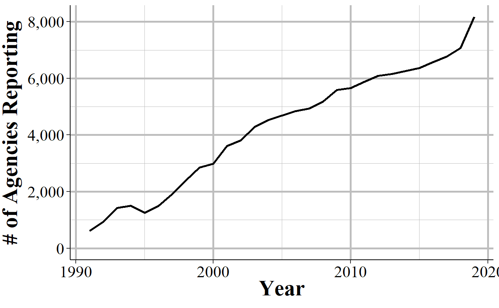
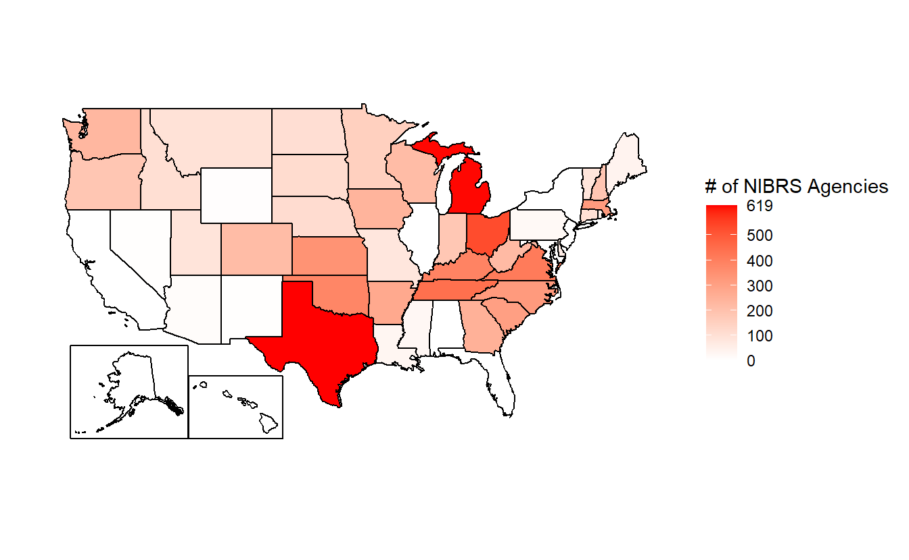
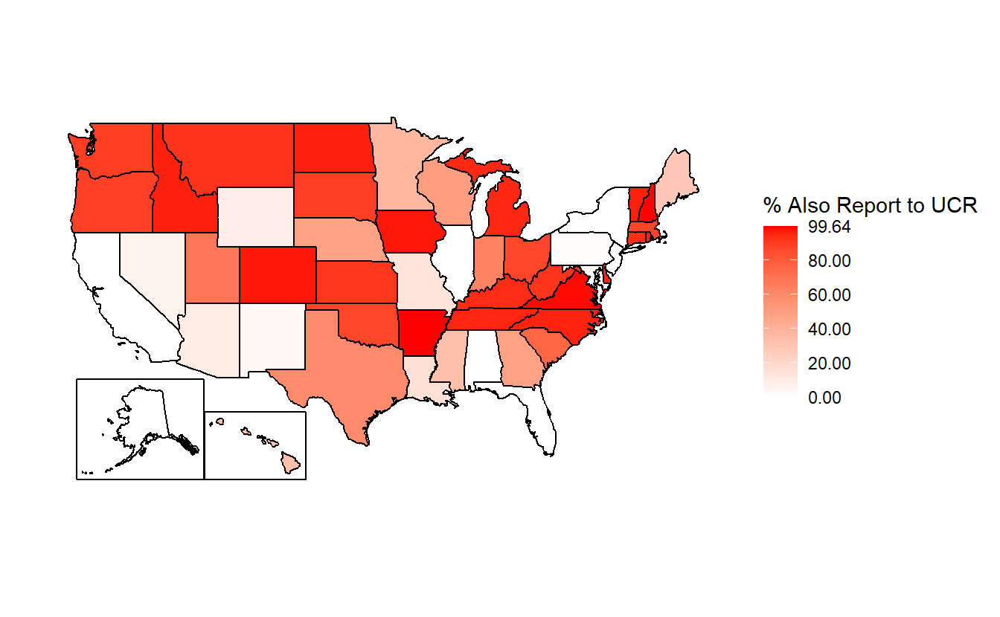

# (PART) National Incident-Based Reporting System (NIBRS) {-}

# Overview of the Data

Nearly a century ago the FBI started collecting data on crime that occurred in the United States as a way to better understand and respond to crime. This data, the [Uniform Crime Reporting (UCR) Program Data](https://ucrbook.com/), is a monthly count of the number of crime incidents (in cases where more than one crime happens per incident, only the most serious crime is included) in each police agency that reports data.^[This data has been expanded since it began in 1929 to include information on arrests, hate crimes, and stolen property.] Other than for homicides (which provides info about each victim and offender), only the number of crimes that occurred is included. So we know, for example, the number of robberies in a city but nothing about who the victims or offenders were, when in that month (day or time of day) the robberies occurred, or the type of location where they happened. To address these limitations the FBI started a new dataset in 1991, the National Incident-Based Reporting System data - which is known by its abbreviation NIBRS - and is the topic of this book. Relative to the FBI's UCR data there are far fewer "weird things" in NIBRS data. Still, we'll cover instances of the "weirdness" in the data, such as the why crime always goes up on the 1st of the month, or why there are more crimes at noon than at nearly all other hours of the day. We'll also be discussing how much of the detailed information that should be available in the data is missing, and when that affects which questions we can answer.

NIBRS data provides detailed information on every crime reported to the police, including victim and offender demographics, whether the offender was arrested (and the type of arrest it was), what date and time of day (by hour only) it happened on, the victim-offender relationship, and the crime location (as a location type, not the exact address). It also covers a far wider range of crimes than UCR data did. With the exception of UCR data on assaults against police officers, all NIBRS data can be converted back to UCR data, making it fully backwards compatible and, therefore, comparable to UCR data. In many ways NIBRS data is a massive improvement over UCR data. This data allows for a deeper understanding of crime and it has led to an explosion of research that allows a far more detailed analysis of crime and crime-policies than the blunt UCR data. 

However, there is a major limitation to this data: most agencies don't use it. [According to the FBI](https://www.fbi.gov/news/pressrel/press-releases/fbi-releases-2019-nibrs-crime-data) only about 8,500 police agencies, covering about 45% of the US population, reported NIBRS data in 2019 (the latest year currently available). This is fewer than half of the about 18,000 police agencies in the United States. This is an even larger problem than it seems as the agencies that do report - especially in earlier years of the data - are disproportionately small and rural. So we're missing out of data from most major cities. A number of states don't have any agencies reporting, making this data relatively biased at least in terms of geography and city size. **Even so, the FBI has said that they are moving entirely to NIBRS data starting in 2021, and will no longer even collect UCR data.** While NIBRS can be converted to UCR data, meaning we can have consistent statistics over time, for agencies that don't report to NIBRS, we have no information on their crimes. In effect, unless the majority of agencies suddenly switch to NIBRS - which, given that the high level of detail relative to UCR data makes moving to NIBRS a costly and timely switch - we will be flying blind for most crime in the country. 

## Problems with NIBRS

There are three major problems with NIBRS data, with the first two related to the lack of reporting. First, we are potentially looking at a massive loss of data when UCR data ends in 2020 - it takes over a year for data to be released so even though I'm writing this in Spring 2021, 2019 UCR and NIBRS data are the latest years available. 2020 data won't be released by the FBI until September or October of this year. Considering the huge crime changes during 2020 - and the latest evidence suggests that the violent crime increase is continuing (and in places even accelerating) in 2021 - losing standardized crime data for most cities (and especially the largest cities) is a very bad thing. Moving the majority of agencies over to NIBRS so quickly may also risk the integrity of the data.^["Quickly" is a bit of a misnomer as agencies were free to report to NIBRS since it began in 1991 and the FBI had announced many years ago that they'd only collect NIBRS in 2021. Still, given that the majority of agencies don't report to NIBRS and 2020 had a plague, the switch is likely to introduce issues and should be delayed.] As they rush to comply with the FBI's order that they only will accept NIBRS data, there will likely be more mistakes made and erroneous data included in NIBRS data. This will likely include both knowledge problems with agencies not understanding how to properly report data and the simply issue of typos leading to wrong info being entered. Though the FBI does do quality assurance checks, no check is foolproof - and their checks in UCR data have still allowed clearly impossible data to be entered (e.g. millions of arsons reported in a month in a small town). So while I always urge caution when using any data - caution that should be accompanied by a thorough examination of your data before using it - NIBRS data from 2020 and beyond merits extra attention.

The second problem is that even if suddenly all agencies do start reporting in 2021, we'd only have a single year of data available. Even for agencies that already report, we generally don't have too many years of data for them. This really limits the kind of research since we can do since it's hard to know if a finding is based on a trend or is just a weird outlier without having many years of data available. For the agencies where 2020 is the first year, we'll likely to have to wait a few years to even figure out what "normal" crime is supposed to look like. This means that for the next several years at least we'll be mostly using NIBRS data as UCR-like datasets, aggregated to the month- or year-level so we can compare it with UCR data from the past. Luckily, this problem will be alleviated the longer we wait as more years of data will become available. 

The final issue is that this data is massive. A single year of 2019 data - with <50% of agencies reporting, and few large agencies reporting - has about 6.5 million crime incidents recorded. Since each crime incident can have multiple victims, offenders, and crimes, there are more rows for these datasets.^[While people generally refer to NIBRS just as "NIBRS data" it is actually a collection multiple different datasets all - with a few exceptions - corresponding to a single crime incident. For example, if you care about victim info you'll look in the victim file called the "Victim Segment" (each of the datasets are called "Segments" since they are part of the whole picture of the crime incident) and likely will merge it with other data, such as when are where the crime occurred which is in the "Offense Segment". In most cases you'll merge together multiple datasets from the NIBRS collection to be able to answer the question that you have.] Once all agencies report - though it's doubtful that'll ever occur, though we may come close - we're looking at tens of millions of rows per year. And even now if we wanted to look at a decade of data we're going to be dealing with over 50 million rows of data. So this data requires both good hardware - a strong laptop or server is necessary - and good programming skills, which most academics sorely lack. If you can, buy more RAM for your computer as that's much easier than having to write complicated code to deal with large data. I want to stress this point. If you intend to work with NIBRS data for any significant amount of time you should buy the most RAM your computer can use (RAM is very cheap now) and install it. I'd recommend at least 16GB but more is better. While computers can handle NIBRS with less RAM, it'll just lead to you spending more time writing code to deal with big data and it'll inevitably still run slower than buying extra RAM. 

### NIBRS allows for different units of analysis

A major benefit of UCR data is that you have very limited choices. If you wanted to measure crime your only choice was to use their monthly aggregated police agency-level data. This makes working with the data relatively easy, even though what work you could do was limited. NIBRS data takes an opposite approach. It provides detailed data and largely leaves it up to the users for what to do with it. This flexibility is also a curse. For every use of this data you will need to decide which unit of analysis to use - and NIBRS provides a few options.

If you're interested in measuring rape you could do so in several different ways, each of which addresses a different part of crime measurement and will lead to different answers to your questions: the number of crime incidents, the number of victims, the number of offenders, and the number of crimes. Let's use an incident where four men rape a single woman as an example. Even if we somehow solve the issue of victims not reporting their rapes, we still have a few different ways of even measuring rape.  First, we can follow the old UCR measure of incident-level and say that this is one rape since only one crime incident occurred (even though there were multiple offenders). Second, we could look at the victim-level, which again is one rape as there was only one victim. Or at the offender-level, which now has four rapes since each offender would be responsible the rape. Finally we could look at the offense-level. Even though the four men were involved in the rape incident, potentially not all of them would have actually committed the rape (and would have the offense in NIBRS data as something else such as assault or attempted rape if they didn't complete the act). Some could have acted as, for example, lookouts so would be involved with the incident but not the rape. So through this measure we'd have between one and four rapes, depending on the exact circumstances. Each way of measuring could lead to substantially different understandings of rape, and this is the kind of complexity that we'll have to wrangle with when using NIBRS data.

Since this data includes multiple crimes in each criminal incident, unlike the UCR which includes only the most serious crime per incident, we can also measure crime in its relationship to other crimes. In the above example we're interested in rapes. The UCR method would measure it as the number of rapes in incidents where rape is the most serious charge ("most serious" is based on the FBI's hierarchy of offenses, following what they call the Hierarchy Rule) but this undercounts crimes where rape happened alongside another, more serious, offense.^[Based on the Hierarchy Rule, only murder is more serious.] So we can also look at incidents where any offense that occurred was a rape. Using this method we can examine how often rape - or any crime we're interested in - co-occurs with other offenses, which provides more information on how crime happens that looking at one crime alone. For example, we could see how often burglary-rapes occur, a crime which is far different than spousal-rape, and in UCR data we'd have no way of differentiating the two. In most cases, however, only one offense occurs per criminal incident (at least as reported in the data), so the opportunity to explore co-occurrence is relatively limited.

## Crimes included in NIBRS

NIBRS data contains far more crime categories than in the UCR data, particularly far more than [UCR crime data](https://ucrbook.com/ucrGeneral.html#crimes-in-the-offenses-known-and-clearances-by-arrest-dataset) which contained only eight crimes (and their subcategories of crimes). It also includes several more crime categories than in the [UCR arrest data](https://ucrbook.com/ucrGeneral.html#crimes-in-the-arrests-by-age-sex-and-race-dataset) which is far more expansive than the UCR crime dataset. Compared to UCR data, however, there are occasionally more steps you must take to get the same crime category. For example, UCR crime data has the number of gun assaults each month. NIBRS data has the number of aggravated assaults only, but has a variable indicating what weapon the offender used. So you can find out how many aggravated assaults used a gun, giving you the same data as in the UCR, but you need to take extra steps to get there. 

Likewise the UCR arrest data has the number of people arrested for selling drugs (broken down into a few different categories of drugs). NIBRS data has if the crime type was a "drug/narcotic violation" which means any crime having to deal with drugs possession, sale, or manufacturing, and excluding drug equipment crimes. We then have to look first at the subcategory of offenses to see if the arrest was for possession, for sale, for manufacturing, or some other kind of drug crime. The final step to be comparable to UCR data is to look at the type of drug involved in the crime. You'll often have to do steps like this during NIBRS research. NIBRS data is available in multiple files that all (for the most part) correspond with each other so you'll tend to have to combine them together to get the complete data you want. 

The crimes included in NIBRS are broken into two categories: Group A and Group B crimes.

### Group A crimes

The first set of crimes included are Group A crimes and these are really the main crimes included in NIBRS. For each of these crimes we have full data on the victim, the offender, the offense, any property stolen or damaged (or for drug crimes, seized by the police), and info about the arrestee (if any). Of course, not all of this data may be available (e.g. information on the offender is unknown) so there can be significant amounts of missing data, but each crime incident does have corresponding files with this information.

The complete list of Group A crimes is below. I've bolded the Index Crimes which are a flawed, but ubiquitous measure of crime used in the UCR crime data as the main measure of crime in the United States. The Index Crimes are murder, rape (sexual assault with an object and sodomy are only considered rape using the FBI new definition that began in 2013), aggravated assault, robbery (these four are the "Violent Index Crimes"), burglary, motor vehicle theft, and theft (these are the "Property Index Crimes". Theft here is broken down into several types of theft like purse-snatching and shoplifting. In the UCR crime dataset it is only "theft".). Arson is also technically an Index Crime (arson is considered a property crime) but is generally excluded. Using Index Crimes as your measure of crime is a bad idea (see [here for more on this](https://www.propublica.org/article/the-secret-irs-files-trove-of-never-before-seen-records-reveal-how-the-wealthiest-avoid-income-tax)) but it's good that all of the Index Crimes are available in NIBRS so we have continuity of data from when agencies move from UCR to NIBRS.

* __Aggravated Assault__                                 
* __All Other Larceny__                                  
* Animal Cruelty                                     
* Arson                                              
* Assisting Or Promoting Prostitution                
* Betting/Wagering                                   
* Bribery                                            
* __Burglary/Breaking And Entering__                     
* Counterfeiting/Forgery                             
* Credit Card/ATM Fraud                              
* Destruction/Damage/Vandalism of Property           
* Drug Equipment Violations                          
* Drug/Narcotic Violations                           
* Embezzlement                                       
* Extortion/Blackmail                                
* False Pretenses/Swindle/Confidence Game            
* Fondling (Incident Liberties/Child Molest)         
* Gambling Equipment Violations                      
* Hacking/Computer Invasion                          
* Human Trafficking - Commercial Sex Acts            
* Human Trafficking - Involuntary Servitude          
* Identity Theft                                     
* Impersonation                                      
* Incest                                             
* Intimidation                                       
* Justifiable Homicide                               
* Kidnapping/Abduction                               
* __Motor Vehicle Theft__                                
* __Murder/Non-negligent Manslaughter__                   
* __Negligent Manslaughter__                             
* Operating/Promoting/Assisting Gambling             
* Pocket-Picking                                     
* Pornography/Obscene Material                       
* Prostitution                                       
* Purchasing Prostitution                            
* __Purse-Snatching__                                    
* __Rape__                                               
* __Robbery__                                            
* __Sexual Assault With An Object__                      
* __Shoplifting__                                        
* __Simple Assault__                                     
* __Sodomy__                                             
* Sports Tampering                                   
* Statutory Rape                                     
* Stolen Property Offenses (Receiving, Selling, Etc.)
* __Theft From Building__                                
* __Theft From Coin-Operated Machine Or Device__         
* __Theft From Motor Vehicle__                           
* __Theft of Motor Vehicle Parts/Accessories__           
* Weapon Law Violations                              
* Welfare Fraud                                      
* Wire Fraud 

### Group B crimes

The other set of crimes included in NIBRS are called Group B crimes. For these crimes, only the arrestee segment is available, meaning that we have far more limited data on these incidents than for Group A crimes. Unlike Group A, we only have data here when a person was arrested for the crime, so we don't know how often they occur without an arrest made. These crimes are considered Group B rather than Group A, according to the FBI, because they are less serious or less common than Group A crimes. This isn't really true though. They are certainly less serious than the most serious Group A crimes but include offenses more serious than some Group A crimes. For example, DUIs can potentially lead to serious injury if they crash into someone (if they did then that would likely be considered a charge like manslaughter or assault, but DUIs still have the *potential* to cause great harm) and peeping toms are an invasion of privacy and can cause serious distress to their victims. Relative to crimes like shoplifting, Group B offenses can indeed be more serious. Group B crimes are also quite common, particularly the catch-all category All Other Offenses. 

One way I like to think of Group B crimes is that they're mostly - excluding peeping tom - victim-less crimes, or more specifically crimes without a specific victim. For example, in DUIs there's no individual victim; public drunkenness may disturb certain people around the event but they aren't the victims of the drunkenness. There are Group A crimes where the same is true, such as drug offenses, but I think this is a helpful way of thinking about Group B crimes. 

* All Other Offenses - excludes traffic violations
* Bad Checks                          
* Curfew/Loitering/Vagrancy Violations
* Disorderly Conduct                  
* Driving Under The Influence (DUI)
* Drunkenness                         
* Family Offenses, Nonviolent
* Liquor Law Violations               
* Peeping Tom
* Runaway - only for minors (data ends in 2011)
* Trespass of Real Property

## Differences from UCR data

While NIBRS data is a far more expansive and detailed dataset than the UCR data, in most cases you can convert NIBRS to UCR which allows for continuation of data over time. So the switch from UCR to NIBRS adds a lot of information but loses relatively little. That relatively little amount of difference, however, can impact the types of questions we can ask so they are detailed below.

### NIBRS does not have unfounded crimes

In UCR data, which provides monthly counts of crimes (as well as more detailed info on hate crimes and homicides, and monthly counts of arrests), there is a count of "unfounded" crimes in each month. An unfounded crime is just one which was previously reported and then new evidence finds out that it never actually occurred (or that it isn't for the crime that was reported). For example, if you misplace your wallet but think it is stolen you may call the police and report it stolen. This would be recorded in UCR data as a theft. If you then find your wallet and tell the police, then it would be changed to an unfounded crime since the reported theft never actually happened. NIBRS data does not include unfounded data at all so you don't know how many reported crimes turn out to not be true. In practice, this doesn't matter too much as unfounded crimes are rare, constituting generally under 2% of each crime type. The major exception is in rape, where some agencies report that over 10% of rapes in certain years are unfounded. For more on this issue with rape, please see this section of my UCR book [here](https://ucrbook.com/offensesKnown.html#unfounded-crimes). 
Given that UCR data already has major issue with rape data, including both changes in the definition of rape in 2013 and evidence that the number of cleared rapes is greatly exaggerated (see [this report from ProPublica](https://www.propublica.org/article/when-it-comes-to-rape-just-because-a-case-is-cleared-does-not-mean-solved) for more info on this), losing unfounded rapes means losing a not insignificant number of likely real rapes. 

Unfounded crimes are also a way that the UCR used to identify justifiable homicides and when police killed someone. But that way was not always used properly and NIBRS data already includes justifiable homicide as a crime category so this isn't a problem.

#### NIBRS does not have negative numbers

Negative numbers in UCR data are because when a crime is reported and then later unfounded, in the month that it is unfounded it is classified as -1 crimes. This is so over the long term (i.e. more than a single month) the positive (but incorrect, and therefore later unfounded) reports and the negative reports to deal with unfounding would equal out so you have the actual number of crimes. In practice though this tended to end up confusing users - though only users who didn't read the manual. Since NIBRS does not have unfounded data, and since it isn't aggregated beyond the incident-level anyways, there are no negative numbers in NIBRS data.

### Less information on assaults against officers

One of the UCR datasets, the [Law Enforcement Officers Killed and Assaulted (LEOKA)](https://ucrbook.com/leoka.html) has monthly information on the number of police officers killed and assaulted for each reporting agency. For officers killed it only tells us how many officers were killed "feloniously" which basically means they were murdered or killed accidentally, such as in a car crash. While still only monthly counts, the info on assaults is far more detailed. It includes, for example, the type of call the officer was on during the assault (e.g. responding to a robbery, transporting a prisoner), the hour it occurred, what weapon the offender used, and whether the officer was injured. The data also included information on how many people were employed by the agency as of Halloween of that year, with breakdowns by if that employee is a sworn officer or not, and by the gender of the employee. NIBRS data keeps some of this info. We know if the victim of a crime is a police officer, what injuries they sustained, and any weapon the offender was using. We don't have any info on the call type the officer was on or information about the number of employees in that department with the same breakdown as in LEOKA. So, assuming that agencies that reported data to LEOKA report at the same rate in NIBRS, we'd still be losing information about assaults on police officers. The FBI has said that they're retiring UCR data after 2020, and LEOKA is one of the UCR datasets so assumably this dataset would also be retired, leaving just NIBRS for information on crimes against police officers.^[If you have any evidence that they're doing otherwise, please let me know.]

## A summary of each segment file

NIBRS data is often discussed - and is used - as if it were a single file with all of this information available. But it actually comes as multiple different files that each provide different information about a crime incident, including at different levels of analysis so users must clean each segment before merging them together. In this section we'll discuss each of the segments and how they are related to each other. First, keep in mind that NIBRS is at its core an incident-level dataset (hence the "Incident-Based" part of its name). Everything that we have stems from the incident, even though we can get more detailed and look at, for example, individual victims in an incident or even offenses within an incident. Figure \@ref(fig:segmentFlowchart) shows the seven main segments and how they relate to each other.^[There are also segments called "batch headers" which provide information about the agency such as the population under its jurisdiction, but we won't cover those since they are agency-level and the same across each incident] There are also three segments called "window segments" - there is one for arrestees, one of exceptional clearances (i.e. police could have made an arrest but didn't for some reason but still consider the case closed), and one for property - that do not have an associated segment with them, they only have the information available in the given "window" segment. We'll talk about window segments more in Section \@ref(window) below.

(\#fig:segmentFlowchart)The association of each segment file in the NIBRS dataset.

The first two boxes in Figure \@ref(fig:segmentFlowchart), colored in orange, are not part of NIBRS but are part of the data generating process. First, obviously, a crime has to occur. The police then have to learn about the crime. This can happen in two ways. First, they can discover it themselves while on patrol. This is common in crimes such as drug possession or sale as well as any crime that occurs outdoors, which is largely where police are able to observe behavior. The second way is that the victim or witness to a crime reports it. So if they call the police to report a crime, the police learn about it from that call. We don't actually know from the data how the police learned of a crime but it's important to think about this data generating process when using the data. 
Alongside the crime being reported (or discovered) to the police, agencies must then report the crime to NIBRS. All crimes that occur in that agency's jurisdiction *should* be reported, but that's not always the case. Since reporting is voluntary (at least nationally, though some states do require agencies to report data), agencies are free to report as many or as few crimes as they wish. This often occurs when agencies report only parts of the year, excluding certain months, so you should ensure that the agency reported data for each month you're interested in.

Once a crime occurs and is reported to the police, it can be recorded to NIBRS in two ways, depending on the type of crime that occurred. If it is one of the Group B crimes, then we only get a Group B Arrestee Segment which is the same as the normal arrestee segment which we discuss in more detail below as well as in Chapter \@ref(arrestee). In this segment we have useful variables including the type of arrest (e.g. arrested by a warrant), what crime was committed, demographics of the arrestee, and weapon use. However, we're missing a wealth of information that is available in the other segments. When the crime is one of the Group A crimes, we get all of this additional information.

For Group A crimes, we get every other segment, starting with the Administrative Segment. The Administrative Segment is largely a meta-segment - it provides information about other segments. The Administrative Segment is the only incident-level segment of the collection and provides information that is consistent across every offense in the incident such as the incident date and time (in hours of the day). It also includes the type of exceptional clearance for the incident, if the incident was exceptionally cleared. The key part of this segment, however, is that it tells you how many of the Offense, Offender, Victim, and Property segments that are associated with this incident. There are always at least one of these segments per incident, but can potentially be multiple of each segment. These other segments do exactly what their name suggests, providing information about the offenses, offender, victims, and stolen or damaged property for each crime incident. Each of these segments, including the Administrative Segment, have the agency identifier code (the ORI code which is discussed on Section \@ref(ori)) and an incident number (which is just a randomly generated unique identifier for that incident) so you can merge the files together. Please note that the incident number of only unique *within* an agency. So there can - and are - incident numbers that are identical across different agencies but are for different incidents. To avoid this issue, make sure you match based on *both* the ORI code and the incident number (or make a new variable with just combines the ORI code and incident number together).

At the bottom is the Arrestee Segment which is only available when a person was arrested for that incident. This provides a bit more detailed data than the Offender Segment for everyone who was arrested for the incident. Now, in reality arrestees aren't necessarily a subset of offenders as some people arrested may not be the ones included in the offender data. Consider, for example, a crime where police initially think two people committed it but end up arresting three people for the crime. The third person would be in the arrestee file but not the offender file. However, in this data there is never a case where there are more arrestees than offenders so it appears that if an offender is arrested who wasn't previously known to the police, they add a corresponding offender segment row for that arrestee.

### Administrative Segment

The Administrative Segment provides information about the incident itself, such as how many victims or offenders there were. In practice this means that it tells us how many other segments - offense, offender, victim, and arrestee segments - there are for this particular incident. It also has several important variables at the incident-level such as what hour of the day the incident occurred and whether the incident date variable is actually just the date the incident was reported. Finally, it tells us whether the case was cleared exceptionally and, if so, what type of exceptional clearance it was. This can tell us, for example, how many crimes were cleared because the offender died or the victim refused to cooperate. As the UCR data doesn't differentiate between normal clearances (i.e. arrest the offender) and exceptional clearances, this provides a far deeper understanding of case outcomes. 

### Offense Segment

This segment provides information about the offense that occurred, and each incident can have multiple offenses. This data tells you which offense occurred and for a subset of offenses it also provides a more detailed subcategory of offense, allowing a deeper dive into what exactly happened. For example, for animal abuse there are four subcategories of offenses: simple/gross neglect of an animal, intentional abuse or torture, animal sexual abuse (bestiality), and organized fighting of animals such as dog or cock fights. This segment also says what date the crime occurred on, where the crime occurred - in categories such as residence or sidewalk rather than exact coordinates in a city - whether the offender is suspected of using drugs, alcohol, or "computer equipment" (which includes cell phones) during the crime, and which weapon was used. In cases where the weapon was a firearm it says whether that weapon was fully automatic or not. It also provides information on if the crime was a hate crime by including a variable on the bias motivation (if any) of the offender. This is based on evidence that the crime was motivated, at least in part, by the victim's group (e.g. race, sexuality, religion, etc.). There are 34 possible bias motivations and while hate crimes could potentially be motivated by bias against multiple groups, this data only allows for a single bias motivation.

### Offender Segment

As might be expected, the Offender Segment provides information about who the offender is for each incident, though this is limited to only demographic variables. So we know the age, sex, and race of each offender but nothing else. This means that important variables such as criminal history, ethnicity, socioeconomic status, and motive are missing. In the Victim Segment we learn about the relationship between the victim and offender, and in the Offense Segment we learn which weapon (if any) the offender used. So there is some other data on the offender in other segments but it's quite limited. This data has one row per offender so incidents with multiple offenders have multiple rows. In cases where there is no information about the offender there will be a single row where all of the offender variables will be "unknown." In these cases having a single row for the offender is merely a placeholder and doesn't necessarily mean that there was only one offender for that incident. However, there's no indicator for when this is a placeholder and when there was actually one offender but whose demographic info is unknown.

### Victim Segment

The Victim Segment provides data at the victim-level and includes information about who the victim is and their relationship to offenders. This data tells us what "type" of victim it is with the type meaning if they are a police officer, a civilian (called an "Individual" victim and basically any person who isn't a police officer), a business, the government, etc. It also includes the standard demographics variables in other segments - age, race, sex, ethnicity - as well as whether the victim is a resident (i.e. do they live there?) of the jurisdiction where they were victimized. We also learn from this data what types of injuries (if any) the victim suffered as a result of the crime. This is limited to physical injuries - excluding important outcomes such as mental duress or PTSD - but allows for a much better measure of harm from crime than simply assuming (or using past studies that tend to be old and only look at the cost of crime) what harm comes from certain offenses. There are seven possible injury types (including no injury at all) and victims can report up to five of these injuries so we have a fairly detailed measure of victim injury.

One highly interesting variable in this segment is the relationship between the victim and the offender (for up to 10 offenders). This includes, for example, if the victim was the offender's wife, their child, employee, or if the stranger was unknown to them, with 27 total possible relationship categories. You can use this to determine which incidents were crimes by strangers, identify domestic violence, or simply learn about the victim-offender relationship for certain types of crimes. This variable is only available when the victim is a police officer or an "individual." This makes some sense though there could actually be cases where non-human victims (e.g. businesses, religious organizations) do have a relationship with the offender such as an employee stealing from a store. Related to the victim-offender relationship, this segment provides a bit of information about the motive for the crime. For aggravated assaults and homicides, there is a variable with the "circumstance" of the offense which is essentially the reason why the crime occurred. For example, possible circumstances include arguments between people, hunting accidents, child playing with weapon, and mercy killings. 

### Arrestee and Group B Arrestee Segment

The Arrestee Segment has information on the person arrested in an incident and has a number of variables that look at same as in previous segments but with subtle differences. This segment covers the arrestee's age, sex, and race, ethnicity, and residency status (of the city, not as a United States citizen). Age, sex, and race are also in the Offender Segment but can differ as not all offenders are arrested. It also says the crime the arrestee was arrested for (which in some cases is different than the crime committed in the offense since an arrest can clear multiple incidents), the weapon carried during the arrest (which may be different than the weapon used during the offense) and if this weapon (if it is a firearm) was an automatic weapon. There are a few completely new variables including the date of the arrest and the type of arrest. The type of arrest is simply whether the person was arrested by police who viewed the crime, if the arrest followed an arrest warrant or a previous arrest (i.e. arrested for a different crime and then police find out you also committed this one so they consider you arrested for this one too), and whether the person was cited by police and ordered to appear in court but not formally taken into custody. Finally, for juvenile arrestees it says whether arrestees were "handled within the department" which means they were released without formal sanctions or were "referred to other authorities" such as juvenile or criminal court, a welfare agency, or probation or parole department (for those on probation or parole). 

### Property Segment

The Property Segment provides a bit more info than would be expected from the name. For each item involved in the crime it tells you what category that items falls into, with 68 total categories of types of property (including "other") ranging from explosives and pets to money and alcohol. It also tells you the estimated value of that item. This data covers more than just items stolen during a crime. For each item it tells you what happened to that item such as if it was stolen, damaged, seized by police (such as illegal items like drugs), recovered by police, or burned during an arson.

For drug offenses it includes the drugs seized by police. For these offenses, the data tells us the type of drug, with 16 different drug categories ranging from specific ones like marijuana or heroin to broader categories such as "other narcotics". There can be up to three different drugs included in this data - if the person has more than three types of drugs seized then the third drug category will simply indicate that there are more than three drugs, so we learn what the first two drugs are but not the third or greater drugs are in these cases. For each drug we also know exactly how much was seized with one variable saying the amount the police found and another saying the units we should we reading that amount as (e.g. pills, grams, plants). 

### Window segments {#window}

The final set of segments are the "Window" segments which are partial reports meaning that the incident doesn't have all of the other segment files associated with it.^[I think the "window" part is a metaphor for while we have lots of info on other incidents, for window segments we have less info so it's like looking through a narrow window. Personally, I find it a bit confusing.] There are three window segments Window Arrestee, Window Property, and Window Exceptional Clearance. All three are very rare relative to non-window data and are generally no more than several thousand incidents per year (the non-window data is several million per year). Window files are here when the crime occurred before the agency started reporting to NIBRS and then the arrest happened after they switched to NIBRS. 

## Which agencies report data

So if this data has the same info (other than unfounded and negative crimes) as UCR data, but is also far more detailed, why do people ever use UCR data? Besides NIBRS being more complicated to use, far fewer agencies report NIBRS data than do UCR data. Nearly all agencies report crime data for UCR, though fewer do so for some of the UCR datasets such as arrests or arsons - for more, please see my [UCR book](https://ucrbook.com/). In comparison, fewer than half of agencies report to NIBRS, and these agencies are disproportionately smaller and more rural. Starting with 2021 data, the FBI has stopped collecting UCR data, instead only collecting NIBRS data. So if - and this is a very large if - many more agencies move to NIBRS in 2021, we'll start having much more detail from a very representative sample of agencies.^[I say representative sample as certainly not all agencies will report, even once UCR is no longer collected. It'll take time for all agencies to report, and I doubt we'll ever get to 100% of agencies.] Even so, most research - especially policy analyses - requires many years of data so it'll take many years before the full potential of NIBRS data can be realized.

We'll look here at how many agencies report at least one crime each year between 1991 - the first year of data - and 2019 - the latest year of data - as well as compare NIBRS reporting to UCR reporting. Figure \@ref(fig:agenciesReporting) shows the number of agencies each year that reported at least one incident. Keep in mind that there are about 18,000 police agencies in the United States. Only a little over 600 agencies reported in 1991. This has grown pretty linearly, adding a few hundred agencies each year though that trend accelerated in recent years. In 2019, nearly 8,200 agencies reported at least some data to NIBRS. Compared to the estimated 18,000 police agencies in the United States, however, this is still fewer than half of agencies. The data shown here is potentially an overcount, however, as it includes agencies reporting any crime that year, even if they don't report every month. 

(\#fig:agenciesReporting)The annual number of agencies reporting at least one incident in that year.

Another way to look at reporting is comparing it to reporting to UCR. Figure \@ref(fig:agenciesReportingMap) shows the number of agencies in each state that report NIBRS data in 2019. Since 2019 is the year with the most participation, this does overstate reporting for previous years. This map pretty closely follows a population map of the US. Texas had the most agencies, followed by Michigan and Ohio. The southern states have more agencies reporting than the lightly populated northern states. The issue here is that a number of states are in white, indicating that very few agencies reported. Indeed, four of the most populated states - California, New York, Florida, and New Jersey - don't have any agencies at all that report NIBRS data.

(\#fig:agenciesReportingMap)The number of agencies in each state that reported at least one crime in 2022 to NIBRS.

Since the number of agencies in a state is partially just a factor of population, Figure \@ref(fig:agenciesReportingMapPercent) shows each state as a percent of agencies in that state that report to NIBRS that also reported to the UCR Offenses Known and Clearances by Arrest (the "crime" dataset) in 2019.^[This is the UCR dataset which has the highest reporting rate.] Not all agencies in the US reported to UCR in 2019 -  and a small number reported to NIBRS but not UCR in 2019 - but this is a fairly good measure of reporting rates. Here the story looks a bit different than in the previous figure. Now we can tell that among north-western states and states along the Appalachian Mountains, nearly all agencies report. In total, 18 states have 90% or more of agencies that reported to UCR in 2019 also reporting to NIBRS. Thirteen agencies have fewer than 10% of agencies reporting to NIBRS that also reported to UCR, with 5 of these having 0% of agencies reporting. The remaining states average about 56% of agencies reporting. So when using NIBRS data, keep in mind that you have very good coverage of certain states, and very poor coverage of other states. And the low - or zero - reporting states are systematically high population states.    

(\#fig:agenciesReportingMapPercent)Agencies in each state reporting at least one crime to NIBRS in 2019 as a percent of agencies that reported UCR Offenses Known and Clearances by Arrests data in 2019.

For ease of reference, Table \@ref(tab:agenciesReportingTable) shows the number of agencies in each state reporting to NIBRS and to UCR in 2019, and the percent shown in Figure \@ref(fig:agenciesReportingMapPercent). 

<table class="table table-striped" style="width: auto !important; margin-left: auto; margin-right: auto;">
<caption>(\#tab:agenciesReportingTable)The number of agencies in each state reporting to NIBRS and to UCR in 2019. Also shows NIBRS reporting in each state as a percent of UCR reporting.</caption>
 <thead>
  <tr>
   <th style="text-align:left;"> State </th>
   <th style="text-align:right;"> NIBRS Agencies </th>
   <th style="text-align:right;"> UCR Agencies </th>
   <th style="text-align:right;"> \% of UCR Agencies </th>
  </tr>
 </thead>
<tbody>
  <tr>
   <td style="text-align:left;"> Alabama </td>
   <td style="text-align:right;"> 1 </td>
   <td style="text-align:right;"> 352 </td>
   <td style="text-align:right;"> 0.28\% </td>
  </tr>
  <tr>
   <td style="text-align:left;"> Alaska </td>
   <td style="text-align:right;"> 0 </td>
   <td style="text-align:right;"> 33 </td>
   <td style="text-align:right;"> 0\% </td>
  </tr>
  <tr>
   <td style="text-align:left;"> Arizona </td>
   <td style="text-align:right;"> 11 </td>
   <td style="text-align:right;"> 114 </td>
   <td style="text-align:right;"> 9.65\% </td>
  </tr>
  <tr>
   <td style="text-align:left;"> Arkansas </td>
   <td style="text-align:right;"> 277 </td>
   <td style="text-align:right;"> 278 </td>
   <td style="text-align:right;"> 99.64\% </td>
  </tr>
  <tr>
   <td style="text-align:left;"> California </td>
   <td style="text-align:right;"> 0 </td>
   <td style="text-align:right;"> 738 </td>
   <td style="text-align:right;"> 0\% </td>
  </tr>
  <tr>
   <td style="text-align:left;"> Colorado </td>
   <td style="text-align:right;"> 217 </td>
   <td style="text-align:right;"> 222 </td>
   <td style="text-align:right;"> 97.75\% </td>
  </tr>
  <tr>
   <td style="text-align:left;"> Connecticut </td>
   <td style="text-align:right;"> 100 </td>
   <td style="text-align:right;"> 107 </td>
   <td style="text-align:right;"> 93.46\% </td>
  </tr>
  <tr>
   <td style="text-align:left;"> Delaware </td>
   <td style="text-align:right;"> 60 </td>
   <td style="text-align:right;"> 63 </td>
   <td style="text-align:right;"> 95.24\% </td>
  </tr>
  <tr>
   <td style="text-align:left;"> District of Columbia </td>
   <td style="text-align:right;"> 1 </td>
   <td style="text-align:right;"> 3 </td>
   <td style="text-align:right;"> 33.33\% </td>
  </tr>
  <tr>
   <td style="text-align:left;"> Florida </td>
   <td style="text-align:right;"> 0 </td>
   <td style="text-align:right;"> 678 </td>
   <td style="text-align:right;"> 0\% </td>
  </tr>
  <tr>
   <td style="text-align:left;"> Georgia </td>
   <td style="text-align:right;"> 251 </td>
   <td style="text-align:right;"> 522 </td>
   <td style="text-align:right;"> 48.08\% </td>
  </tr>
  <tr>
   <td style="text-align:left;"> Hawaii </td>
   <td style="text-align:right;"> 1 </td>
   <td style="text-align:right;"> 3 </td>
   <td style="text-align:right;"> 33.33\% </td>
  </tr>
  <tr>
   <td style="text-align:left;"> Idaho </td>
   <td style="text-align:right;"> 104 </td>
   <td style="text-align:right;"> 108 </td>
   <td style="text-align:right;"> 96.3\% </td>
  </tr>
  <tr>
   <td style="text-align:left;"> Illinois </td>
   <td style="text-align:right;"> 1 </td>
   <td style="text-align:right;"> 739 </td>
   <td style="text-align:right;"> 0.14\% </td>
  </tr>
  <tr>
   <td style="text-align:left;"> Indiana </td>
   <td style="text-align:right;"> 180 </td>
   <td style="text-align:right;"> 289 </td>
   <td style="text-align:right;"> 62.28\% </td>
  </tr>
  <tr>
   <td style="text-align:left;"> Iowa </td>
   <td style="text-align:right;"> 240 </td>
   <td style="text-align:right;"> 246 </td>
   <td style="text-align:right;"> 97.56\% </td>
  </tr>
  <tr>
   <td style="text-align:left;"> Kansas </td>
   <td style="text-align:right;"> 343 </td>
   <td style="text-align:right;"> 376 </td>
   <td style="text-align:right;"> 91.22\% </td>
  </tr>
  <tr>
   <td style="text-align:left;"> Kentucky </td>
   <td style="text-align:right;"> 389 </td>
   <td style="text-align:right;"> 413 </td>
   <td style="text-align:right;"> 94.19\% </td>
  </tr>
  <tr>
   <td style="text-align:left;"> Louisiana </td>
   <td style="text-align:right;"> 30 </td>
   <td style="text-align:right;"> 188 </td>
   <td style="text-align:right;"> 15.96\% </td>
  </tr>
  <tr>
   <td style="text-align:left;"> Maine </td>
   <td style="text-align:right;"> 39 </td>
   <td style="text-align:right;"> 135 </td>
   <td style="text-align:right;"> 28.89\% </td>
  </tr>
  <tr>
   <td style="text-align:left;"> Maryland </td>
   <td style="text-align:right;"> 2 </td>
   <td style="text-align:right;"> 156 </td>
   <td style="text-align:right;"> 1.28\% </td>
  </tr>
  <tr>
   <td style="text-align:left;"> Massachusetts </td>
   <td style="text-align:right;"> 317 </td>
   <td style="text-align:right;"> 363 </td>
   <td style="text-align:right;"> 87.33\% </td>
  </tr>
  <tr>
   <td style="text-align:left;"> Michigan </td>
   <td style="text-align:right;"> 616 </td>
   <td style="text-align:right;"> 650 </td>
   <td style="text-align:right;"> 94.77\% </td>
  </tr>
  <tr>
   <td style="text-align:left;"> Minnesota </td>
   <td style="text-align:right;"> 153 </td>
   <td style="text-align:right;"> 409 </td>
   <td style="text-align:right;"> 37.41\% </td>
  </tr>
  <tr>
   <td style="text-align:left;"> Mississippi </td>
   <td style="text-align:right;"> 26 </td>
   <td style="text-align:right;"> 79 </td>
   <td style="text-align:right;"> 32.91\% </td>
  </tr>
  <tr>
   <td style="text-align:left;"> Missouri </td>
   <td style="text-align:right;"> 80 </td>
   <td style="text-align:right;"> 576 </td>
   <td style="text-align:right;"> 13.89\% </td>
  </tr>
  <tr>
   <td style="text-align:left;"> Montana </td>
   <td style="text-align:right;"> 95 </td>
   <td style="text-align:right;"> 103 </td>
   <td style="text-align:right;"> 92.23\% </td>
  </tr>
  <tr>
   <td style="text-align:left;"> Nebraska </td>
   <td style="text-align:right;"> 113 </td>
   <td style="text-align:right;"> 236 </td>
   <td style="text-align:right;"> 47.88\% </td>
  </tr>
  <tr>
   <td style="text-align:left;"> Nevada </td>
   <td style="text-align:right;"> 4 </td>
   <td style="text-align:right;"> 62 </td>
   <td style="text-align:right;"> 6.45\% </td>
  </tr>
  <tr>
   <td style="text-align:left;"> New Hampshire </td>
   <td style="text-align:right;"> 187 </td>
   <td style="text-align:right;"> 188 </td>
   <td style="text-align:right;"> 99.47\% </td>
  </tr>
  <tr>
   <td style="text-align:left;"> New Jersey </td>
   <td style="text-align:right;"> 0 </td>
   <td style="text-align:right;"> 578 </td>
   <td style="text-align:right;"> 0\% </td>
  </tr>
  <tr>
   <td style="text-align:left;"> New Mexico </td>
   <td style="text-align:right;"> 4 </td>
   <td style="text-align:right;"> 121 </td>
   <td style="text-align:right;"> 3.31\% </td>
  </tr>
  <tr>
   <td style="text-align:left;"> New York </td>
   <td style="text-align:right;"> 0 </td>
   <td style="text-align:right;"> 572 </td>
   <td style="text-align:right;"> 0\% </td>
  </tr>
  <tr>
   <td style="text-align:left;"> North Carolina </td>
   <td style="text-align:right;"> 320 </td>
   <td style="text-align:right;"> 333 </td>
   <td style="text-align:right;"> 96.1\% </td>
  </tr>
  <tr>
   <td style="text-align:left;"> North Dakota </td>
   <td style="text-align:right;"> 106 </td>
   <td style="text-align:right;"> 110 </td>
   <td style="text-align:right;"> 96.36\% </td>
  </tr>
  <tr>
   <td style="text-align:left;"> Ohio </td>
   <td style="text-align:right;"> 529 </td>
   <td style="text-align:right;"> 604 </td>
   <td style="text-align:right;"> 87.58\% </td>
  </tr>
  <tr>
   <td style="text-align:left;"> Oklahoma </td>
   <td style="text-align:right;"> 381 </td>
   <td style="text-align:right;"> 437 </td>
   <td style="text-align:right;"> 87.19\% </td>
  </tr>
  <tr>
   <td style="text-align:left;"> Oregon </td>
   <td style="text-align:right;"> 184 </td>
   <td style="text-align:right;"> 208 </td>
   <td style="text-align:right;"> 88.46\% </td>
  </tr>
  <tr>
   <td style="text-align:left;"> Pennsylvania </td>
   <td style="text-align:right;"> 21 </td>
   <td style="text-align:right;"> 1477 </td>
   <td style="text-align:right;"> 1.42\% </td>
  </tr>
  <tr>
   <td style="text-align:left;"> Rhode Island </td>
   <td style="text-align:right;"> 47 </td>
   <td style="text-align:right;"> 49 </td>
   <td style="text-align:right;"> 95.92\% </td>
  </tr>
  <tr>
   <td style="text-align:left;"> South Carolina </td>
   <td style="text-align:right;"> 306 </td>
   <td style="text-align:right;"> 405 </td>
   <td style="text-align:right;"> 75.56\% </td>
  </tr>
  <tr>
   <td style="text-align:left;"> South Dakota </td>
   <td style="text-align:right;"> 115 </td>
   <td style="text-align:right;"> 129 </td>
   <td style="text-align:right;"> 89.15\% </td>
  </tr>
  <tr>
   <td style="text-align:left;"> Tennessee </td>
   <td style="text-align:right;"> 443 </td>
   <td style="text-align:right;"> 465 </td>
   <td style="text-align:right;"> 95.27\% </td>
  </tr>
  <tr>
   <td style="text-align:left;"> Texas </td>
   <td style="text-align:right;"> 619 </td>
   <td style="text-align:right;"> 1053 </td>
   <td style="text-align:right;"> 58.78\% </td>
  </tr>
  <tr>
   <td style="text-align:left;"> Utah </td>
   <td style="text-align:right;"> 88 </td>
   <td style="text-align:right;"> 129 </td>
   <td style="text-align:right;"> 68.22\% </td>
  </tr>
  <tr>
   <td style="text-align:left;"> Vermont </td>
   <td style="text-align:right;"> 86 </td>
   <td style="text-align:right;"> 89 </td>
   <td style="text-align:right;"> 96.63\% </td>
  </tr>
  <tr>
   <td style="text-align:left;"> Virginia </td>
   <td style="text-align:right;"> 411 </td>
   <td style="text-align:right;"> 415 </td>
   <td style="text-align:right;"> 99.04\% </td>
  </tr>
  <tr>
   <td style="text-align:left;"> Washington </td>
   <td style="text-align:right;"> 231 </td>
   <td style="text-align:right;"> 257 </td>
   <td style="text-align:right;"> 89.88\% </td>
  </tr>
  <tr>
   <td style="text-align:left;"> West Virginia </td>
   <td style="text-align:right;"> 221 </td>
   <td style="text-align:right;"> 240 </td>
   <td style="text-align:right;"> 92.08\% </td>
  </tr>
  <tr>
   <td style="text-align:left;"> Wisconsin </td>
   <td style="text-align:right;"> 215 </td>
   <td style="text-align:right;"> 428 </td>
   <td style="text-align:right;"> 50.23\% </td>
  </tr>
  <tr>
   <td style="text-align:left;"> Wyoming </td>
   <td style="text-align:right;"> 5 </td>
   <td style="text-align:right;"> 55 </td>
   <td style="text-align:right;"> 9.09\% </td>
  </tr>
</tbody>
</table>

## How to identify a particular agency (ORI codes) {#ori}

In NIBRS and other FBI data sets, agencies are identified using **OR**iginating Agency **I**dentifiers or an ORI. An ORI is a unique ID code used to identify an agency.^[This is referred to as an "ORI", "ORI code", and "ORI number", all of which mean the same thing.] If we used the agency's name we'd end up with some duplicates since there can be multiple agencies in the country (and in a state, those this is very rare) with the same name. For example, if you looked for the Philadelphia Police Department using the agency name, you'd find both the "Philadelphia Police Department" in Pennsylvania and the one in Mississippi. Each ORI is a 9-digit value starting with the state abbreviation (for some reason the FBI incorrectly puts the abbreviation for Nebraska as NB instead of NE) followed by 7 numbers. In the UCR data (another FBI data set) the ORI uses only a 7-digit code - with only the 5 numbers following the state abbreviation instead of 7. So the NIBRS ORI codes are sometimes called ORI9. For nearly all agencies, the only difference between the UCR ORI and the NIBRS ORI is that the NIBRS ORI has "00" at the end so it is technically 9 characters long but isn't any more specific than the 7-character UCR ORI code. 

When dealing with specific agencies, make sure to use the ORI rather than the agency name to avoid any mistakes. For an easy way to find the ORI number of an agency, use [this page](https://jacobdkaplan.com/crosswalk.html) on my site. Type an agency name or an ORI code into the search section and it will return everything that is a match.

## The data as you get it from the FBI

We'll finish this overview of the NIBRS data by briefly talking about format of the data that is released by the FBI, before the processing done by myself or [NACJD](https://www.icpsr.umich.edu/web/pages/NACJD/index.html) that converts the data to a type that software like R or Stata or Excel can understand. The FBI releases their data as fixed-width ASCII files which are basically just an Excel file but with all of the columns squished together. As an example, Figure \@ref(fig:ascii) shows what the data looks like as you receive it from the FBI for the 1991 NIBRS data, the first year with data available. The way the FBI releases NIBRS data adds even more complications to using ASCII files. Since there are multiple segments in each NIBRS file you'd think that each segment would be its own file. But, no, the FBI gives you a single file with every segment stacked on top of each other. And, it's "stacked" essentially in a random way where row 1 may be from a certain segment while the next row is from a different segment. 

(\#fig:ascii)Fixed-width ASCII file for the 1991 National Incident-Based Reporting System (NIBRS) dataset.

You can think of this a little like chapters from a book. Normally chapter 1 is first, followed by chapter 2 and so on. And within each chapter are sentences that use proper punctuation so we can easily read it and know where one sentence ends and the next begins. The FBI's NIBRS data basically removes all punctuation, cuts up every sentence and rearranges them in a random order and then hands it to you and says "read this." This is a terrible way to present any data, but is what we've had ever since data began in 1991 and seems highly unlikely to change.

The "fixed-width" part of the file type is how this works (the ASCII part basically means it's a text file). Each row is the same width - literally the same number of characters, including blank spaces. Though each segment has a different width so you'll first need to grab only the rows that correspond to a particular segment before you can read in that segment. So you must tell the software you are using to process this file - by literally writing code in something called a "setup file" which is basically just instructions for whatever software you use (R, SPSS, Stata, SAS can all do this) - which characters are certain columns. For example, in this data the first two character says which segment it is (07 means the Group B Arrestee segment) and the next two characters (in the setup file written as 3-4 since it is characters 3 through 4 [inclusive]) are the state number (01 is the state code for Alabama).^[We can see several rows down that we have a row starting with "01" which means it is an Administrative Segment, and then starting with "02" which is from the Offense Segment.] So we can read this row as the first column indicating it is an Group B Arrestee segment, the second column indicating that it is for the state of Alabama, and so on for each of the remaining columns. To read in this data you'll need a setup file that covers every column in the data (some software, like R, can handle just reading in the specific columns you want and don't need to include every column in the setup file).

The second important thing to know about reading in a fixed-width ASCII file is something called a "value label."^[For most fixed-width ASCII files there are also missing values where it'll have placeholder value such as -8 and the setup file will instruct the software to convert that to NA. NIBRS data, however, does not have this and does not indicate when values are missing in this manner.] For example, in the above image we saw the characters 3-4 is the state and in the row we have the value "01" which means that the state is "Alabama." Since this type of data is trying to be as small and efficient as possible, it often replaces longer values with shorter one and provides a translation for the software to use to convert it to the proper value when reading it. "Alabama" is more characters than "01" so it saves space to say "01" and just replace that with "Alabama" later on. So "01" would be the "value" and "Alabama" would be the "label" that it changes to once read. 

Fixed-width ASCII files may seem awful to you reading it today, and it is awful to use. It appears to be an efficient way to store data back many decades ago when data releases began but now is extremely inefficient - in terms of speed, file size, ease of use - compared to modern software so I'm not sure why they *still* release data in this format. For you, however, the important part to understand is not how exactly to read this type of data, but to understand that people who made this data publicly available (such as myself and the team at NACJD) must make this conversion process.^[For those interested in how to actually read in this type of data, please see my R package asciiSetupReader.] **This conversion process, from fixed-width ASCII to a useful format is the most dangerous step taken in using this data - and one that is nearly entirely unseen by researchers.** 

Every line of code you write (or, for SPSS users, click you make) invites the possibility of making a mistake.^[Even highly experienced programmers who are doing something like can make mistakes. For example, if you type out "2+2" 100 times - something extremely simple that anyone can do - how often will you mistype a character and get a wrong result? I'd guess that at least once you'd make a mistake.] The FBI does not provide a setup file with the fixed-width ASCII data so to read in this data you need to make it yourself.^[They do provide the instructions in a PDF, but you still need to actually make the file yourself. You cannot use their instructions because setup files must be formatted in a very specific way and the PDF is not in this format/] Each NIBRS segment has over a dozen columns and potentially dozens of value labels.^[In comparison to UCR data, this is far less complicated to make a setup file for, so the risk of mistakes is far lower.] A typo anywhere could have potentially far-reaching consequences, so this is a crucial weak point in the data cleaning process - and one in which I have not seen anything written about before.^[Other than in my own UCR book.] While I have been diligent in checking the setup files and my code to seek out any issues - and I know that NACJD has a robust checking process for their own work - that doesn't mean our work is perfect.
