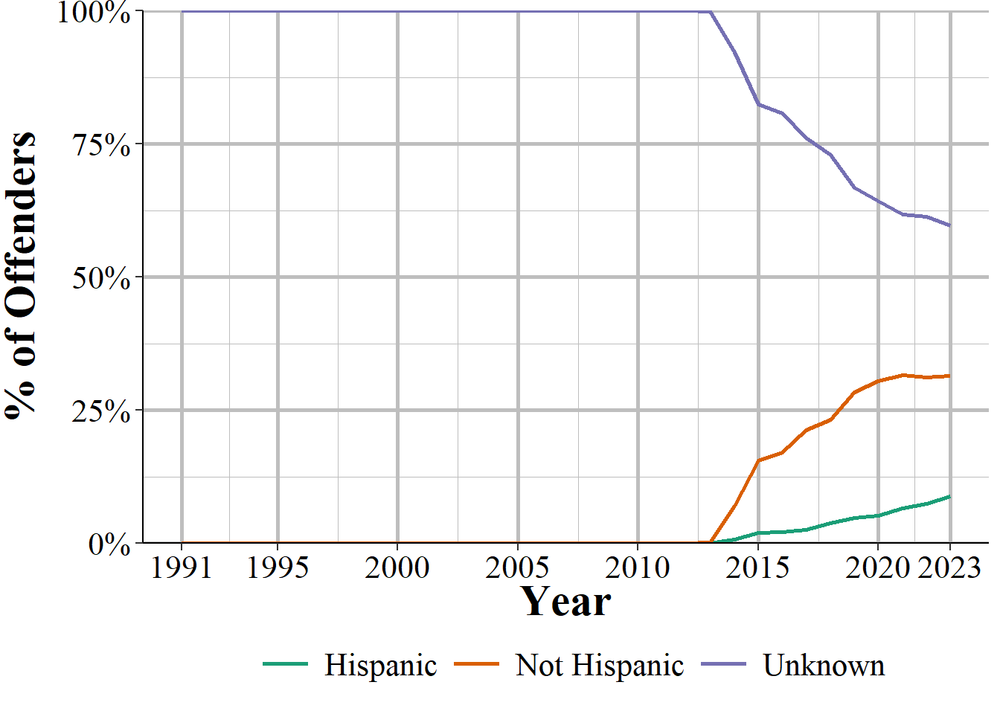

# Offender Segment

As might be expected, the Offender Segment provides information about who the offender is for each incident, though this is limited to only demographic variables. In incidents with multiple offenders it provides information about each offender. From this data we know the age, sex, and race of each offender but nothing else. This means that important variables such as criminal history, socioeconomic status, and motive are missing. In the Victim Segment we learn about the relationship between the victim and offender, and in the Offense Segment we learn which weapon (if any) the offender used. So there is some other data on the offender in other segments, but it's limited. 

In cases where there is no information about the offender there will be a single row where all of the offender variables will be "unknown." In these cases having a single row for the offender is merely a placeholder and doesn't necessarily mean that there was only one offender for that incident. However, there's no indicator for when this is a placeholder and when there was actually one offender but whose demographic info is unknown.

The Offender Segment is the sparsest of the available segments, and provides only four new variables that are about the offender's demographics. It also includes the standard set of variables: the agency ORI, the incident number, the state the agency is in, and the incident date (though we'd need to check the Administrative Segment to see if this is actually the incident date or the report date).

As seen with other segment files, the number of agencies reporting has increased steadily since 1991 and then increased much faster starting in 2016 when the FBI started their push for the transition to NIBRS.

(\#fig:nibrsOffenderAgenciesReporting)The annual number of agencies reporting data in the NIBRS Offender Segment, 1991-2022.

## Demographics

There are four demographics variables included in this data: the offenders' age, sex, race, ethnicity. Please note that what we have here are not unique offenders as the same person can be involved in multiple incidents and therefore be counted multiple times. There's no offender ID variable that is consistent across incidents so we can't tell when an offender is involved with different incidents. So be cautious when trying to compare this with some base rate such as percent of people of each age, sex, race, or ethnicity in a population.  

### Age 

The age variable is the suspected age of the offender. This is presented to us as how many years old the offender is, however, agencies can input an age range if they don't know the exact age (e.g. age 20-29) and the FBI will convert that to an exact number by averaging it for us. So if the police say the offender is aged 20-29 (since they don't know for sure), we only see that the offender is 24 years old since the FBI averages the range and then rounds down to make an integer. This value is top-coded to 99 years old with everyone 99 years or older being set as "over 98 years old." Figure \@ref(fig:offenderAge) shows the distribution of offender ages for all known offenders in the 2022 NIBRS data. About 14% of offenders have an unknown age and are excluded from the figure. 

If you're familiar with research on the age-crime curve, which says that crimes peak in the late teens and then rapidly decrease, this essentially replicates those findings. There are some differences between this figure and past age-crime research as crime peaks later here, in the mid-20s (the most common age is 25), but the general trend of crime being largely a "young person" phenomenon holds consistent. The age distribution can differ depending on what offenses the offender's committed. To examine that you'll need to merge this segment with the Offense Segment and then subset the offender data by the offense you're interested in.

(\#fig:offenderAge)The age of all offenders reported in the 2022 NIBRS data. Approximately 44 percent of offenders have an unknown age are not shown in the figure.

The spike you see at the very end of the data is due to the data maxing out possible individual ages at 98, so anyone older is grouped together. There's also a spike at age 1 - and other offenders at very young ages - which is the youngest possible age. Surely very young children aren't going around committing crime, so is this a data error? Mostly yes. But it could actually be partially real as there are very rare cases where children harm or kill someone while playing with a gun and are included in the data. These aren't crimes as we conventionally think of them - and the "offenders" won't be criminally charged - but are still included in the data. However, the bulk of this, especially for age one, is likely just a data error or the police entering age as one instead of saying that the age is unknown (which they have the option of doing) or simply entering the data incorrectly by mistake.

Another indicator of guesses about age is that three of the five most common ages are 25, 30, and 20 years old. People tend to like multiples of five when making estimates, so these indicate that someone (the victim or the officer) probably didn't know the exact age and so guessed the age or used an age range rather than the exact age. 

Since we have data since 1991 we can look at how age changed over time. In Figure \@ref(fig:nibrsOffenderAge) shows the annual mean and median age of offenders from 1991-2022. The first two years of data we see very old offenders^[At least in terms of expected age of offenders.] with mean age over 50 and median age over 34 each year. That then drops considerably in 1993 to about age 25 and then starts a very slow and consistent increase over time until the average offender is in the early thirties by the latest years of data. Figure \@ref(fig:nibrsOffenderAgeMissing) shows the percent of offenders that have an unknown age which also has some odd and large movements in 1991-1992 then settles to a steady and slow declining trend in 1993 before reversing itself and increasing in the late 2010s. 

So what do we make of these trends? The first thing to keep in mind is that we're doing something fairly dumb. Each year of data we have different agencies reporting meaning that differences over time may simply be due to different agencies providing data. Still, if we had to interpret it I would say that the values in 1991 and 1992 are due to data issues likely caused by growing pains from agencies just starting out using NIBRS. Luckily, since NIBRS data has information on every single offender - rather than being already aggregated like in SRS data - we can check this. Indeed, this appears to simply be a data issue where many agencies put the age of offenders as "over 98 years old" rather than identifying them as unknown. In 1991, for example, 36% of offenders who had a known age were reported to be older than 98 years. When we look at the average age in 1991 when excluding people 99+ years old we get 28 years old, perfectly within expectation when looking at averages after 1992. 

(\#fig:nibrsOffenderAge)The mean and median age of offenders, 1991-2022.

(\#fig:nibrsOffenderAgeMissing)The percent of offender's age that is unknown, 1991-2022.

### Sex

The second offender demographic variable available is the offender's sex with male and female being the only available sexes. There is no option for transgender or anything else. Other than arrestees, where police could (though we don't know if they do) use their identification (e.g. driver's license) to determine their sex, this is likely the perceived sex of the offender based on what evidence the officer can collect (e.g. witness statement, video recordings, driver's licenses of the offender if they are caught, etc.). Figure \@ref(fig:nibrsOffenderSex) shows the distribution of offenders by sex for each year of data. The most common sex is male, which is consistent with the literature on who commits crime. About 45% of all offenders were male. Female offenders make up fewer than 20% of offenders though the general trend is that the share of offenders is increasing. Over a third of offenders have an unknown sex with the share being unknown decreasing over time until increasing again in the last several years. Considering that when nothing is known about offenders (including even how many offenders there are) this data includes a single row with "unknown" for all demographic variables, this is actually an undercount of offenders who have unknown sex. Again we see odd results in 1991 and 1992, likely an issue with data entry at the birth of NIBRS.

(\#fig:nibrsOffenderSex)The share of offenders by sex, 1991-2022.

### Race

The next variable available is the race of the offender. The only possible races are White, Black, American Indian/Alaskan Native, Asian, and Native Hawaiian/Other Pacific Islander, which was first reported in 2012. These categories are mutually exclusive so people cannot be labeled as mixed race, they must be put into one of the categories. Like with other demographic variables this is the race as perceived by the officer and the quality of this perception depends on incident characteristics such as if an arrest was made and how well witnesses could see the offender.

Figure \@ref(fig:offenderRace) shows the breakdown in offender races for every offender in our data. The most common offender race in nearly every year is Unknown, with about 40% of offenders not having a known race. This is actually an undercount as in cases where the agency doesn't know anything about the offenders they'll put down a single offender with "unknown" for every demographics variable. So there could potentially be multiple offenders represented when there is a row with an unknown offender race. This is also dependent on the type of crimes committed and when they are committed. For example, a daytime robbery would likely have a known offender race as the victim can clearly see (complexities about identifying people's race aside) the race of the robber. A daytime burglary where no one is home would likely have an unknown offender race and there would be no witnesses. Likewise, a robbery at night could have an unknown offender race because the darkness makes it harder to identify people.

The next most common offender race is White at a bit under 40% in most years, followed by Black at around 20%. The remaining races make up very few offender and are hard to see on the figure. We still see the weird values in 1991 and 1992, this time showing a massive spike in the number of Asian offenders which disappear to less than 1% in 1993. This corresponds to spike in White offenders in 1993, suggesting that some White offenders in 1991-1992 were incorrectly identified as Asian. 

(\#fig:nibrsOffenderRace)The share of offenders by race, 1991-2022.

### Ethnicity

The final variable, and one not really worth using is ethnicity. As we can see in Figure \@ref(fig:nibrsOffenderEthnicity) this variable is very rarely used and for most of the life of NIBRS it wasn't collected. Even when it was collected - which started in 2013, ended after 2016, and then returned in 2021 - the most common value is that the offender's ethnicity was unknown. 

(\#fig:nibrsOffenderEthnicity)The share of offenders by ethnicity, 1991-2022.

