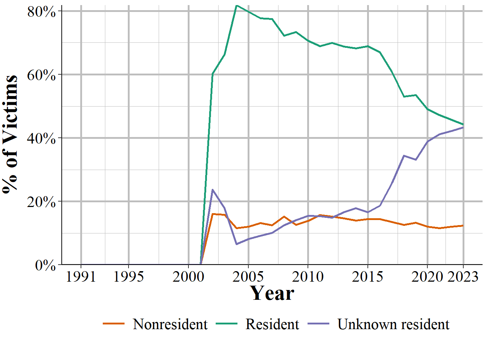
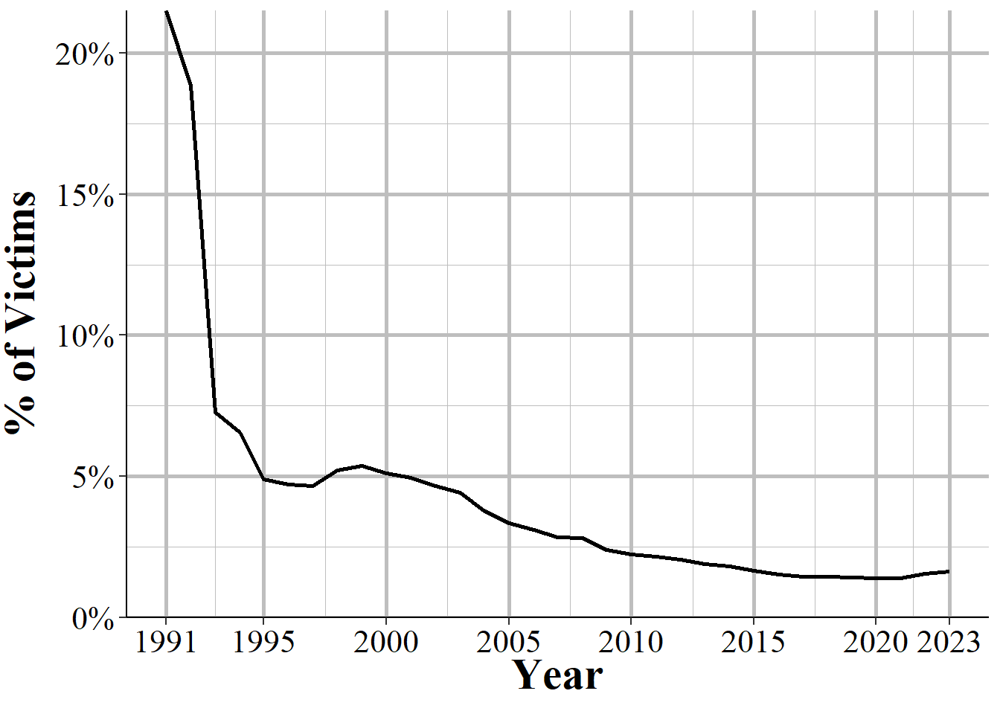

# Victim Segment


The Victim Segment provides data at the victim-level and includes information about who the victim is and their relationship to offenders. This data tells us what "type" of victim it is with the type meaning if they are a police officer, a civilian ("Individual" and basically any person who is not a police officer), a business, the government, etc. It also includes the standard demographics variables in other segments - age, race, sex, ethnicity - as well as whether the victim is a resident (i.e. do they live there?) of the jurisdiction where they were victimized. We also learn from this data what types of injuries (if any) the victim suffered as a result of the crime. This is limited to physical injuries - excluding important outcomes such as mental duress or PTSD - but allows for a much better measure of harm from crime than simply assuming (or using past studies that tend to be old and only look at the cost of crime) what harm comes from certain offenses. There are seven possible injury types (including no injury at all) and victims can report up to five of these injuries so we have a fairly detailed measure of victim injury.

One highly interesting variable in this segment is the relationship between the victim and the offender (for up to 10 offenders). This includes, for example, if the victim was the offender's wife, their child, employee, or if the stranger was unknown to them, with 27 total possible relationship categories. You can use this to determine which incidents were crimes by strangers, identify domestic violence, or simply learn who tends to commit crimes against certain types of victims. This variable is only available when the victim is a police officer or an "individual." This makes some sense though there could actually be cases where non-human victims (e.g. businesses, religious organizations) do have a relationship with the offender such as an employee stealing from a store. Related to the victim-offender relationship, this segment provides a bit of information about the motive for the crime. For aggravated assaults and homicides, there is a variable with the "circumstance" of the offense which is essentially the reason why the crime occurred. For example, possible circumstances are arguments between people, hunting accidents, child playing with weapon, and domestic violence. 

It also has a "victim sequence number" which is a number identifying the victim in an incident since some incidents have multiple victims. 

## Crime category

The first variable we will look at is the crime the victim experienced. This is a bit different than the offenses in the Offense Segment as not all victims in an incident are victimized by all of the crimes involved. For example, if a couple is assaulted and the woman is raped, the woman would experience rape and assault while the man only experiences assault. NIBRS allows for up to 10 offenses per victim and these are supposed to be ranked in order of seriousness. So the first variable has the most serious offense, the second has the second most serious offense, and so on. This is true is most cases but some have more minor crimes presented before more serious crimes. This seems to just be a data entry issue and nothing systematic but you should still check all offense variables if you are interested in finding the most serious crime per victim. 

There are 52 possible offenses included in this segment and Table \@ref(tab:victimCrimeCategory) shows how frequent each offense is. Though there are 10 possible offenses per victim, this table only looks at the first offense. The most common offense is simple assault, affecting 12.7% of victims or 944k people. This is followed by damage, vandalism, or destruction of property for 11% of victims. About 9.6% of victims experience drugs/narcotic violations, and these victims are likely also the offenders in the case (all incidents must have a victim recorded so in drug crimes the victims are also the offenders in most cases). Theft crimes, broken into some subcategories like "all other larceny" and "theft from motor vehicle" make up the three of the top six crimes (ranks 3, 5, and 6) people are victimized by. And the only remaining crime that accounts for 5% or more of offenses is burglary at 6.4%.

<table class="table table-striped" style="width: auto !important; margin-left: auto; margin-right: auto;">
<caption>(\#tab:victimCrimeCategory)The number and percent of crimes committed against each victim, counting all victims and then separately law enforcement officer victims, 2022. For victims with multiple crimes committed against them, this shows the first crime reported.</caption>
 <thead>
  <tr>
   <th style="text-align:left;"> Crime Category </th>
   <th style="text-align:right;"> First Year </th>
   <th style="text-align:right;"> \# of Victims </th>
   <th style="text-align:left;"> \% of Victims </th>
   <th style="text-align:right;"> # of Officer Victims </th>
  </tr>
 </thead>
<tbody>
  <tr>
   <td style="text-align:left;"> Assault Offenses - Simple Assault </td>
   <td style="text-align:right;"> 1991 </td>
   <td style="text-align:right;"> 1,963,108 </td>
   <td style="text-align:left;"> 15.51\% </td>
   <td style="text-align:right;"> 47,190 </td>
  </tr>
  <tr>
   <td style="text-align:left;"> Larceny/Theft Offenses - All Other Larceny </td>
   <td style="text-align:right;"> 1991 </td>
   <td style="text-align:right;"> 1,349,448 </td>
   <td style="text-align:left;"> 10.67\% </td>
   <td style="text-align:right;"> 0 </td>
  </tr>
  <tr>
   <td style="text-align:left;"> Destruction/Damage/Vandalism of Property </td>
   <td style="text-align:right;"> 1991 </td>
   <td style="text-align:right;"> 1,204,569 </td>
   <td style="text-align:left;"> 9.52\% </td>
   <td style="text-align:right;"> 0 </td>
  </tr>
  <tr>
   <td style="text-align:left;"> Drug/Narcotic Offenses - Drug/Narcotic Violations </td>
   <td style="text-align:right;"> 1991 </td>
   <td style="text-align:right;"> 993,317 </td>
   <td style="text-align:left;"> 7.85\% </td>
   <td style="text-align:right;"> - </td>
  </tr>
  <tr>
   <td style="text-align:left;"> Larceny/Theft Offenses - Theft From Motor Vehicle </td>
   <td style="text-align:right;"> 1991 </td>
   <td style="text-align:right;"> 959,554 </td>
   <td style="text-align:left;"> 7.58\% </td>
   <td style="text-align:right;"> 0 </td>
  </tr>
  <tr>
   <td style="text-align:left;"> Burglary/Breaking And Entering </td>
   <td style="text-align:right;"> 1991 </td>
   <td style="text-align:right;"> 757,933 </td>
   <td style="text-align:left;"> 5.99\% </td>
   <td style="text-align:right;"> 0 </td>
  </tr>
  <tr>
   <td style="text-align:left;"> Larceny/Theft Offenses - Shoplifting </td>
   <td style="text-align:right;"> 1991 </td>
   <td style="text-align:right;"> 747,655 </td>
   <td style="text-align:left;"> 5.91\% </td>
   <td style="text-align:right;"> 0 </td>
  </tr>
  <tr>
   <td style="text-align:left;"> Motor Vehicle Theft </td>
   <td style="text-align:right;"> 1991 </td>
   <td style="text-align:right;"> 703,215 </td>
   <td style="text-align:left;"> 5.56\% </td>
   <td style="text-align:right;"> 0 </td>
  </tr>
  <tr>
   <td style="text-align:left;"> Assault Offenses - Aggravated Assault </td>
   <td style="text-align:right;"> 1991 </td>
   <td style="text-align:right;"> 669,067 </td>
   <td style="text-align:left;"> 5.29\% </td>
   <td style="text-align:right;"> 17,616 </td>
  </tr>
  <tr>
   <td style="text-align:left;"> Assault Offenses - Intimidation </td>
   <td style="text-align:right;"> 1991 </td>
   <td style="text-align:right;"> 537,389 </td>
   <td style="text-align:left;"> 4.25\% </td>
   <td style="text-align:right;"> 8,584 </td>
  </tr>
  <tr>
   <td style="text-align:left;"> Larceny/Theft Offenses - Theft of Motor Vehicle Parts/Accessories </td>
   <td style="text-align:right;"> 1991 </td>
   <td style="text-align:right;"> 387,566 </td>
   <td style="text-align:left;"> 3.06\% </td>
   <td style="text-align:right;"> 0 </td>
  </tr>
  <tr>
   <td style="text-align:left;"> Fraud Offenses - False Pretenses/Swindle/Confidence Game </td>
   <td style="text-align:right;"> 1991 </td>
   <td style="text-align:right;"> 333,517 </td>
   <td style="text-align:left;"> 2.64\% </td>
   <td style="text-align:right;"> 0 </td>
  </tr>
  <tr>
   <td style="text-align:left;"> Larceny/Theft Offenses - Theft From Building </td>
   <td style="text-align:right;"> 1991 </td>
   <td style="text-align:right;"> 276,139 </td>
   <td style="text-align:left;"> 2.18\% </td>
   <td style="text-align:right;"> 0 </td>
  </tr>
  <tr>
   <td style="text-align:left;"> Weapon Law Violations - Weapon Law Violations </td>
   <td style="text-align:right;"> 1991 </td>
   <td style="text-align:right;"> 240,037 </td>
   <td style="text-align:left;"> 1.90\% </td>
   <td style="text-align:right;"> - </td>
  </tr>
  <tr>
   <td style="text-align:left;"> Robbery </td>
   <td style="text-align:right;"> 1991 </td>
   <td style="text-align:right;"> 194,500 </td>
   <td style="text-align:left;"> 1.54\% </td>
   <td style="text-align:right;"> - </td>
  </tr>
  <tr>
   <td style="text-align:left;"> Fraud Offenses - Identity Theft </td>
   <td style="text-align:right;"> 2015 </td>
   <td style="text-align:right;"> 177,323 </td>
   <td style="text-align:left;"> 1.40\% </td>
   <td style="text-align:right;"> - </td>
  </tr>
  <tr>
   <td style="text-align:left;"> Fraud Offenses - Credit Card/Atm Fraud </td>
   <td style="text-align:right;"> 1991 </td>
   <td style="text-align:right;"> 159,970 </td>
   <td style="text-align:left;"> 1.26\% </td>
   <td style="text-align:right;"> - </td>
  </tr>
  <tr>
   <td style="text-align:left;"> Drug/Narcotic Offenses - Drug Equipment Violations </td>
   <td style="text-align:right;"> 1991 </td>
   <td style="text-align:right;"> 159,409 </td>
   <td style="text-align:left;"> 1.26\% </td>
   <td style="text-align:right;"> - </td>
  </tr>
  <tr>
   <td style="text-align:left;"> Counterfeiting/Forgery </td>
   <td style="text-align:right;"> 1991 </td>
   <td style="text-align:right;"> 143,052 </td>
   <td style="text-align:left;"> 1.13\% </td>
   <td style="text-align:right;"> 0 </td>
  </tr>
  <tr>
   <td style="text-align:left;"> Stolen Property Offenses (Receiving, Selling, Etc.) </td>
   <td style="text-align:right;"> 1991 </td>
   <td style="text-align:right;"> 111,630 </td>
   <td style="text-align:left;"> 0.88\% </td>
   <td style="text-align:right;"> 0 </td>
  </tr>
  <tr>
   <td style="text-align:left;"> Sex Offenses - Fondling (Incident Liberties/Child Molest) </td>
   <td style="text-align:right;"> 1991 </td>
   <td style="text-align:right;"> 87,715 </td>
   <td style="text-align:left;"> 0.69\% </td>
   <td style="text-align:right;"> 0 </td>
  </tr>
  <tr>
   <td style="text-align:left;"> Sex Offenses - Rape </td>
   <td style="text-align:right;"> 1991 </td>
   <td style="text-align:right;"> 76,759 </td>
   <td style="text-align:left;"> 0.61\% </td>
   <td style="text-align:right;"> - </td>
  </tr>
  <tr>
   <td style="text-align:left;"> Fraud Offenses - Impersonation </td>
   <td style="text-align:right;"> 1991 </td>
   <td style="text-align:right;"> 75,089 </td>
   <td style="text-align:left;"> 0.59\% </td>
   <td style="text-align:right;"> 0 </td>
  </tr>
  <tr>
   <td style="text-align:left;"> Kidnapping/Abduction </td>
   <td style="text-align:right;"> 1991 </td>
   <td style="text-align:right;"> 43,094 </td>
   <td style="text-align:left;"> 0.34\% </td>
   <td style="text-align:right;"> 8 </td>
  </tr>
  <tr>
   <td style="text-align:left;"> Pornography/Obscene Material </td>
   <td style="text-align:right;"> 1991 </td>
   <td style="text-align:right;"> 39,629 </td>
   <td style="text-align:left;"> 0.31\% </td>
   <td style="text-align:right;"> - </td>
  </tr>
  <tr>
   <td style="text-align:left;"> Fraud Offenses - Wire Fraud </td>
   <td style="text-align:right;"> 1991 </td>
   <td style="text-align:right;"> 36,975 </td>
   <td style="text-align:left;"> 0.29\% </td>
   <td style="text-align:right;"> - </td>
  </tr>
  <tr>
   <td style="text-align:left;"> Arson </td>
   <td style="text-align:right;"> 1991 </td>
   <td style="text-align:right;"> 35,241 </td>
   <td style="text-align:left;"> 0.28\% </td>
   <td style="text-align:right;"> 0 </td>
  </tr>
  <tr>
   <td style="text-align:left;"> Embezzlement </td>
   <td style="text-align:right;"> 1991 </td>
   <td style="text-align:right;"> 32,065 </td>
   <td style="text-align:left;"> 0.25\% </td>
   <td style="text-align:right;"> - </td>
  </tr>
  <tr>
   <td style="text-align:left;"> Larceny/Theft Offenses - Pocket-Picking </td>
   <td style="text-align:right;"> 1991 </td>
   <td style="text-align:right;"> 21,080 </td>
   <td style="text-align:left;"> 0.17\% </td>
   <td style="text-align:right;"> 0 </td>
  </tr>
  <tr>
   <td style="text-align:left;"> Animal Cruelty </td>
   <td style="text-align:right;"> 2015 </td>
   <td style="text-align:right;"> 20,100 </td>
   <td style="text-align:left;"> 0.16\% </td>
   <td style="text-align:right;"> - </td>
  </tr>
  <tr>
   <td style="text-align:left;"> Extortion/Blackmail </td>
   <td style="text-align:right;"> 1991 </td>
   <td style="text-align:right;"> 19,953 </td>
   <td style="text-align:left;"> 0.16\% </td>
   <td style="text-align:right;"> - </td>
  </tr>
  <tr>
   <td style="text-align:left;"> Sex Offenses - Sodomy </td>
   <td style="text-align:right;"> 1991 </td>
   <td style="text-align:right;"> 17,447 </td>
   <td style="text-align:left;"> 0.14\% </td>
   <td style="text-align:right;"> - </td>
  </tr>
  <tr>
   <td style="text-align:left;"> Murder/Nonnegligent Manslaughter </td>
   <td style="text-align:right;"> 1991 </td>
   <td style="text-align:right;"> 16,414 </td>
   <td style="text-align:left;"> 0.13\% </td>
   <td style="text-align:right;"> 55 </td>
  </tr>
  <tr>
   <td style="text-align:left;"> Larceny/Theft Offenses - Purse-Snatching </td>
   <td style="text-align:right;"> 1991 </td>
   <td style="text-align:right;"> 11,048 </td>
   <td style="text-align:left;"> 0.09\% </td>
   <td style="text-align:right;"> - </td>
  </tr>
  <tr>
   <td style="text-align:left;"> Sex Offenses - Statutory Rape </td>
   <td style="text-align:right;"> 1991 </td>
   <td style="text-align:right;"> 7,984 </td>
   <td style="text-align:left;"> 0.06\% </td>
   <td style="text-align:right;"> - </td>
  </tr>
  <tr>
   <td style="text-align:left;"> Sex Offenses - Sexual Assault With An Object </td>
   <td style="text-align:right;"> 1991 </td>
   <td style="text-align:right;"> 7,425 </td>
   <td style="text-align:left;"> 0.06\% </td>
   <td style="text-align:right;"> - </td>
  </tr>
  <tr>
   <td style="text-align:left;"> Prostitution Offenses - Prostitution </td>
   <td style="text-align:right;"> 1991 </td>
   <td style="text-align:right;"> 7,113 </td>
   <td style="text-align:left;"> 0.06\% </td>
   <td style="text-align:right;"> - </td>
  </tr>
  <tr>
   <td style="text-align:left;"> Fraud Offenses - Hacking/Computer Invasion </td>
   <td style="text-align:right;"> 2015 </td>
   <td style="text-align:right;"> 6,380 </td>
   <td style="text-align:left;"> 0.05\% </td>
   <td style="text-align:right;"> - </td>
  </tr>
  <tr>
   <td style="text-align:left;"> Larceny/Theft Offenses - Theft From Coin-Operated Machine Or Device </td>
   <td style="text-align:right;"> 1991 </td>
   <td style="text-align:right;"> 5,630 </td>
   <td style="text-align:left;"> 0.04\% </td>
   <td style="text-align:right;"> - </td>
  </tr>
  <tr>
   <td style="text-align:left;"> Fraud Offenses - Welfare Fraud </td>
   <td style="text-align:right;"> 1991 </td>
   <td style="text-align:right;"> 4,415 </td>
   <td style="text-align:left;"> 0.03\% </td>
   <td style="text-align:right;"> - </td>
  </tr>
  <tr>
   <td style="text-align:left;"> Prostitution Offenses - Assisting Or Promoting Prostitution </td>
   <td style="text-align:right;"> 1991 </td>
   <td style="text-align:right;"> 2,378 </td>
   <td style="text-align:left;"> 0.02\% </td>
   <td style="text-align:right;"> - </td>
  </tr>
  <tr>
   <td style="text-align:left;"> Prostitution Offenses - Purchasing Prostitution </td>
   <td style="text-align:right;"> 2013 </td>
   <td style="text-align:right;"> 2,184 </td>
   <td style="text-align:left;"> 0.02\% </td>
   <td style="text-align:right;"> - </td>
  </tr>
  <tr>
   <td style="text-align:left;"> Negligent Manslaughter </td>
   <td style="text-align:right;"> 1991 </td>
   <td style="text-align:right;"> 1,750 </td>
   <td style="text-align:left;"> 0.01\% </td>
   <td style="text-align:right;"> - </td>
  </tr>
  <tr>
   <td style="text-align:left;"> Human Trafficking - Commercial Sex Acts </td>
   <td style="text-align:right;"> 2013 </td>
   <td style="text-align:right;"> 1,749 </td>
   <td style="text-align:left;"> 0.01\% </td>
   <td style="text-align:right;"> - </td>
  </tr>
  <tr>
   <td style="text-align:left;"> Sex Offenses - Incest </td>
   <td style="text-align:right;"> 1991 </td>
   <td style="text-align:right;"> 1,277 </td>
   <td style="text-align:left;"> 0.01\% </td>
   <td style="text-align:right;"> - </td>
  </tr>
  <tr>
   <td style="text-align:left;"> Gambling Offenses - Operating/Promoting/Assisting Gambling </td>
   <td style="text-align:right;"> 1991 </td>
   <td style="text-align:right;"> 822 </td>
   <td style="text-align:left;"> 0.01\% </td>
   <td style="text-align:right;"> - </td>
  </tr>
  <tr>
   <td style="text-align:left;"> Justifiable Homicide - Not A Crime </td>
   <td style="text-align:right;"> 1991 </td>
   <td style="text-align:right;"> 634 </td>
   <td style="text-align:left;"> 0.01\% </td>
   <td style="text-align:right;"> - </td>
  </tr>
  <tr>
   <td style="text-align:left;"> Gambling Offenses - Betting/Wagering </td>
   <td style="text-align:right;"> 1991 </td>
   <td style="text-align:right;"> 600 </td>
   <td style="text-align:left;"> 0.00\% </td>
   <td style="text-align:right;"> - </td>
  </tr>
  <tr>
   <td style="text-align:left;"> Bribery </td>
   <td style="text-align:right;"> 1991 </td>
   <td style="text-align:right;"> 567 </td>
   <td style="text-align:left;"> 0.00\% </td>
   <td style="text-align:right;"> 0 </td>
  </tr>
  <tr>
   <td style="text-align:left;"> Human Trafficking - Involuntary Servitude </td>
   <td style="text-align:right;"> 2014 </td>
   <td style="text-align:right;"> 506 </td>
   <td style="text-align:left;"> 0.00\% </td>
   <td style="text-align:right;"> - </td>
  </tr>
  <tr>
   <td style="text-align:left;"> Gambling Offenses - Gambling Equipment Violations </td>
   <td style="text-align:right;"> 1991 </td>
   <td style="text-align:right;"> 313 </td>
   <td style="text-align:left;"> 0.00\% </td>
   <td style="text-align:right;"> - </td>
  </tr>
  <tr>
   <td style="text-align:left;"> Commerce Violations - Federal Liquor Offenses </td>
   <td style="text-align:right;"> 2020 </td>
   <td style="text-align:right;"> 145 </td>
   <td style="text-align:left;"> 0.00\% </td>
   <td style="text-align:right;"> - </td>
  </tr>
  <tr>
   <td style="text-align:left;"> Fugitive Offenses - Flight To Avoid Prosecution </td>
   <td style="text-align:right;"> 2021 </td>
   <td style="text-align:right;"> 66 </td>
   <td style="text-align:left;"> 0.00\% </td>
   <td style="text-align:right;"> - </td>
  </tr>
  <tr>
   <td style="text-align:left;"> Sex Offenses - Failure To Register As A Sex Offender </td>
   <td style="text-align:right;"> 2021 </td>
   <td style="text-align:right;"> 27 </td>
   <td style="text-align:left;"> 0.00\% </td>
   <td style="text-align:right;"> - </td>
  </tr>
  <tr>
   <td style="text-align:left;"> Fraud Offenses - Money Laundering </td>
   <td style="text-align:right;"> 2022 </td>
   <td style="text-align:right;"> 7 </td>
   <td style="text-align:left;"> 0.00\% </td>
   <td style="text-align:right;"> - </td>
  </tr>
  <tr>
   <td style="text-align:left;"> Weapon Law Violations - Explosives </td>
   <td style="text-align:right;"> 2021 </td>
   <td style="text-align:right;"> 4 </td>
   <td style="text-align:left;"> 0.00\% </td>
   <td style="text-align:right;"> - </td>
  </tr>
  <tr>
   <td style="text-align:left;"> Fugitive Offenses - Harboring Escappee/Concealing From Arrest </td>
   <td style="text-align:right;"> 2021 </td>
   <td style="text-align:right;"> 3 </td>
   <td style="text-align:left;"> 0.00\% </td>
   <td style="text-align:right;"> - </td>
  </tr>
  <tr>
   <td style="text-align:left;"> Immigration Violations - Illegal Entry Into The United States </td>
   <td style="text-align:right;"> 2020 </td>
   <td style="text-align:right;"> 3 </td>
   <td style="text-align:left;"> 0.00\% </td>
   <td style="text-align:right;"> - </td>
  </tr>
  <tr>
   <td style="text-align:left;"> Gambling Offenses - Sports Tampering </td>
   <td style="text-align:right;"> 1994 </td>
   <td style="text-align:right;"> 2 </td>
   <td style="text-align:left;"> 0.00\% </td>
   <td style="text-align:right;"> - </td>
  </tr>
  <tr>
   <td style="text-align:left;"> Fugitive Offenses - Flight To Avoid Deportation </td>
   <td style="text-align:right;"> 2021 </td>
   <td style="text-align:right;"> 1 </td>
   <td style="text-align:left;"> 0.00\% </td>
   <td style="text-align:right;"> - </td>
  </tr>
  <tr>
   <td style="text-align:left;"> Weapon Law Violations - Violation of National Firearm Act of 1934 </td>
   <td style="text-align:right;"> 2021 </td>
   <td style="text-align:right;"> 1 </td>
   <td style="text-align:left;"> 0.00\% </td>
   <td style="text-align:right;"> - </td>
  </tr>
  <tr>
   <td style="text-align:left;"> Total </td>
   <td style="text-align:right;"> - </td>
   <td style="text-align:right;"> 12,652,993 </td>
   <td style="text-align:left;"> 100\% </td>
   <td style="text-align:right;"> - </td>
  </tr>
</tbody>
</table>


<div class="figure">

<p class="caption">(\#fig:nibrsFirstVsAllOffensesMurders)The share of victims when considering only the 1st offense reported compared to using all offenses, for murder and nonnegligent manslaughter, sex offenses, motor vehicle theft, and destruction of property/vandalism, 1991-2022.</p>
</div>


## Victim type

I spoke above as if all victims are people who are victimized. This is not entirely true. Some victims may be organizations, businesses, or other inanimate objects. NIBRS has nine different types of victims (including "unknown" type and "other" type) in the data and it tells us which type each victim is. 

Table \@ref(tab:victimType) shows each of the victim types and how commonly they appear in the data. Two key ones are "individual" at 69.4% of victims and law enforcement officer at 0.5% of victims. Law enforcement officers who are victimized are only classified as law enforcement officers when they are the victims of murder, aggravated or simple assault, or intimidation. Otherwise they are labeled as "individual" victims. So an individual is a person who is either not a law enforcement officer or who is an officer but is not victimized by one of the approved crimes. These two are special types of victims as all other variables in this segment apply only to them. This is because non-humans cannot have demographic information, injuries (injury to property would be detailed in the Property Segment in Chapter \@ref(property)), or relationships.^[Businesses may have some form of demographic information if you think about demographics of the owners or managers. However, that information is not available. If the business was targeted due to the owner's demographics then that may be considered a hate crime and be reported in the Offense Segment.]

The next most common type is business at 15.6% of victims, "society/public" at 12.9% of victims, and the government in 1% of victims. When the victim is society/public that means that the offense is a "victimless crime" or one where there is no specific victim. This includes drug offenses, animal cruelty (animals cannon be victims in this data), prostitution-related offenses (purchasing, promoting, and being a prostitute), pornography/obscene materials, and weapon offenses. The remaining categories - financial institution, other victim type, unknown victim type, and religion organization - are each under 0.25% of victims. 

<table class="table table-striped" style="width: auto !important; margin-left: auto; margin-right: auto;">
<caption>(\#tab:victimType)The distribution of the type of victim, 2022. Victim types are mutually exclusive.</caption>
 <thead>
  <tr>
   <th style="text-align:left;"> Type of Victim </th>
   <th style="text-align:right;"> First Year </th>
   <th style="text-align:right;"> \# of Victims </th>
   <th style="text-align:left;"> \% of Victims </th>
  </tr>
 </thead>
<tbody>
  <tr>
   <td style="text-align:left;"> Individual </td>
   <td style="text-align:right;"> 1991 </td>
   <td style="text-align:right;"> 8,983,510 </td>
   <td style="text-align:left;"> 71.00\% </td>
  </tr>
  <tr>
   <td style="text-align:left;"> Business </td>
   <td style="text-align:right;"> 1991 </td>
   <td style="text-align:right;"> 1,897,966 </td>
   <td style="text-align:left;"> 15.00\% </td>
  </tr>
  <tr>
   <td style="text-align:left;"> Society/Public </td>
   <td style="text-align:right;"> 1991 </td>
   <td style="text-align:right;"> 1,466,005 </td>
   <td style="text-align:left;"> 11.59\% </td>
  </tr>
  <tr>
   <td style="text-align:left;"> Government </td>
   <td style="text-align:right;"> 1991 </td>
   <td style="text-align:right;"> 139,194 </td>
   <td style="text-align:left;"> 1.10\% </td>
  </tr>
  <tr>
   <td style="text-align:left;"> Law Enforcement Officer </td>
   <td style="text-align:right;"> 2002 </td>
   <td style="text-align:right;"> 73,453 </td>
   <td style="text-align:left;"> 0.58\% </td>
  </tr>
  <tr>
   <td style="text-align:left;"> Other </td>
   <td style="text-align:right;"> 1991 </td>
   <td style="text-align:right;"> 36,800 </td>
   <td style="text-align:left;"> 0.29\% </td>
  </tr>
  <tr>
   <td style="text-align:left;"> Financial Institution </td>
   <td style="text-align:right;"> 1991 </td>
   <td style="text-align:right;"> 21,144 </td>
   <td style="text-align:left;"> 0.17\% </td>
  </tr>
  <tr>
   <td style="text-align:left;"> Unknown </td>
   <td style="text-align:right;"> 1991 </td>
   <td style="text-align:right;"> 17,953 </td>
   <td style="text-align:left;"> 0.14\% </td>
  </tr>
  <tr>
   <td style="text-align:left;"> Religious Organization </td>
   <td style="text-align:right;"> 1991 </td>
   <td style="text-align:right;"> 16,968 </td>
   <td style="text-align:left;"> 0.13\% </td>
  </tr>
  <tr>
   <td style="text-align:left;"> Total </td>
   <td style="text-align:right;"> - </td>
   <td style="text-align:right;"> 12,652,993 </td>
   <td style="text-align:left;"> 100\% </td>
  </tr>
</tbody>
</table>


<div class="figure">

<p class="caption">(\#fig:nibrsVictimPercentIndividualOfficer)Percent of victimizations whose victim type of 'law enforcement officer,' 'business,' or 'invidual,' 1991-2022.</p>
</div>

## Injury

An important variable that is completely missing in UCR data is how injured the victim was. NIBRS has eight different categories of victim injuries ranging from no injury to serious injuries such as "possible internal injury" or "apparent broken bones". NIBRS includes five variables for victim injuries so up to five of the seven injury types (if there is no injury, that will take up the first variable and no others will be recorded) per victim. These injuries should be thought of as suspected injuries based on observations by the officer or what the victim says. These do not need to be confirmed by a doctor. Therefore there is some imprecision on the exact victim injury. For example, "possible internal injury" means only the possibility, even if the victim does not turn out to have internal injuries.

However, it is still a useful measure of victim injury and is highly necessary given that UCR data does not provide any indication about injury. As academics continue to argue about which crimes are serious, this variable can provide information as to exactly how injured victims are from the crime. Not all crimes have this information. The FBI only includes this info for what they consider violent crimes which are listed below (since victims may have up to 10 offenses recorded, only one offense has to be among the below list for injury to be recorded). 

* Aggravated assault
* Extortion/blackmail
* Fondling
* Human trafficking - commercial sex acts
* Human trafficking - involuntary servitude
* Kidnapping/abduction
* Rape
* Robbery
* Sexual assault with an object
* Simple assault
* Sodomy

Even though there are up to five victim injuries recorded, for the below graphs I am just looking at the first variable. Injuries are sorted by seriousness with the first recorded injury more serious than the second, and so on, so this will look at the most serious injuries victims received. As with most variables in this data, only "individual" and law enforcement officer victims have this info. 

Figure \@ref(fig:victimInjury) shows the eight injury categories and how common they are for all victims with this information reported. The most common type is "none" at 52.6% of injuries which means the victim did not suffer any injuries at all. This is followed by 42.0% of victims suffering "apparent minor injuries." The six serious injuries are far lesson common and given that nearly a third of victims suffer none or minor injuries are hard to see on the graph. To make it easier to see, Figure \@ref(fig:victimInjuryExcludeNone) shows the breakdown in victim injury excluding those who did not suffer an injury or those who suffered a minor injury. 

<div class="figure">

<p class="caption">(\#fig:victimInjury)The distribution of the injury sustained by the victim, 2022. Only individual and law enforcement officer victims have this variable available.</p>
</div>

For the group who suffered one of the six more serious injury types, 32.1% suffered an "other major injury" which is a serious injury other than one of the other categories. This is followed by 25.8% having a serious laceration (a laceration is a cut), 21.6% having a possible internal injury, and 12.5% having an apparent broken bone. About 6.5% of these victims became unconscious at some point in the incident, and 1.5% lost at least one tooth. 

Trends for law enforcement officer victims (not shown) are nearly identical for those with an injury but have more victims reporting no injury at all relative to non-law enforcement officer victims.

<table class="table table-striped" style="width: auto !important; margin-left: auto; margin-right: auto;">
<caption>(\#tab:offenseCrimeInjury)The number and percent of victim injury by offense, 2022. This breakdown is only available for a subset of offenses. There can be up to five injuries per victim; in this table we only use the first injury reported. There can be up to 10 offenses per victim; in this table we only use the first offense reported.</caption>
 <thead>
  <tr>
   <th style="text-align:left;"> Crime </th>
   <th style="text-align:left;"> Injury </th>
   <th style="text-align:right;"> \# of Offenses </th>
   <th style="text-align:right;"> \% of Offenses </th>
  </tr>
 </thead>
<tbody>
  <tr>
   <td style="text-align:left;"> Assault Offenses - Aggravated Assault </td>
   <td style="text-align:left;"> None </td>
   <td style="text-align:right;"> 343,460 </td>
   <td style="text-align:right;"> 51.33\% </td>
  </tr>
  <tr>
   <td style="text-align:left;"> Assault Offenses - Aggravated Assault </td>
   <td style="text-align:left;"> Apparent Minor Injuries </td>
   <td style="text-align:right;"> 166,056 </td>
   <td style="text-align:right;"> 24.82\% </td>
  </tr>
  <tr>
   <td style="text-align:left;"> Assault Offenses - Aggravated Assault </td>
   <td style="text-align:left;"> Other Major Injury </td>
   <td style="text-align:right;"> 62,432 </td>
   <td style="text-align:right;"> 9.33\% </td>
  </tr>
  <tr>
   <td style="text-align:left;"> Assault Offenses - Aggravated Assault </td>
   <td style="text-align:left;"> Severe Laceration </td>
   <td style="text-align:right;"> 38,791 </td>
   <td style="text-align:right;"> 5.80\% </td>
  </tr>
  <tr>
   <td style="text-align:left;"> Assault Offenses - Aggravated Assault </td>
   <td style="text-align:left;"> Possible Internal Injury </td>
   <td style="text-align:right;"> 30,879 </td>
   <td style="text-align:right;"> 4.62\% </td>
  </tr>
  <tr>
   <td style="text-align:left;"> Assault Offenses - Aggravated Assault </td>
   <td style="text-align:left;"> Apparent Broken Bones </td>
   <td style="text-align:right;"> 16,887 </td>
   <td style="text-align:right;"> 2.52\% </td>
  </tr>
  <tr>
   <td style="text-align:left;"> Assault Offenses - Aggravated Assault </td>
   <td style="text-align:left;"> Unconsciousness </td>
   <td style="text-align:right;"> 8,366 </td>
   <td style="text-align:right;"> 1.25\% </td>
  </tr>
  <tr>
   <td style="text-align:left;"> Assault Offenses - Aggravated Assault </td>
   <td style="text-align:left;"> Loss of Teeth </td>
   <td style="text-align:right;"> 2,196 </td>
   <td style="text-align:right;"> 0.33\% </td>
  </tr>
  <tr>
   <td style="text-align:left;"> Assault Offenses - Aggravated Assault </td>
   <td style="text-align:left;"> Total </td>
   <td style="text-align:right;"> 669,067 </td>
   <td style="text-align:right;"> 100\% </td>
  </tr>
  <tr>
   <td style="text-align:left;"> Assault Offenses - Simple Assault </td>
   <td style="text-align:left;"> None </td>
   <td style="text-align:right;"> 983,042 </td>
   <td style="text-align:right;"> 50.08\% </td>
  </tr>
  <tr>
   <td style="text-align:left;"> Assault Offenses - Simple Assault </td>
   <td style="text-align:left;"> Apparent Minor Injuries </td>
   <td style="text-align:right;"> 980,065 </td>
   <td style="text-align:right;"> 49.92\% </td>
  </tr>
  <tr>
   <td style="text-align:left;"> Assault Offenses - Simple Assault </td>
   <td style="text-align:left;"> Severe Laceration </td>
   <td style="text-align:right;"> 1 </td>
   <td style="text-align:right;"> 0.00\% </td>
  </tr>
  <tr>
   <td style="text-align:left;"> Assault Offenses - Simple Assault </td>
   <td style="text-align:left;"> Total </td>
   <td style="text-align:right;"> 1,963,108 </td>
   <td style="text-align:right;"> 100\% </td>
  </tr>
  <tr>
   <td style="text-align:left;"> Extortion/Blackmail </td>
   <td style="text-align:left;"> None </td>
   <td style="text-align:right;"> 19,570 </td>
   <td style="text-align:right;"> 98.08\% </td>
  </tr>
  <tr>
   <td style="text-align:left;"> Extortion/Blackmail </td>
   <td style="text-align:left;"> Unknown </td>
   <td style="text-align:right;"> 289 </td>
   <td style="text-align:right;"> 1.45\% </td>
  </tr>
  <tr>
   <td style="text-align:left;"> Extortion/Blackmail </td>
   <td style="text-align:left;"> Apparent Minor Injuries </td>
   <td style="text-align:right;"> 67 </td>
   <td style="text-align:right;"> 0.34\% </td>
  </tr>
  <tr>
   <td style="text-align:left;"> Extortion/Blackmail </td>
   <td style="text-align:left;"> Other Major Injury </td>
   <td style="text-align:right;"> 11 </td>
   <td style="text-align:right;"> 0.06\% </td>
  </tr>
  <tr>
   <td style="text-align:left;"> Extortion/Blackmail </td>
   <td style="text-align:left;"> Apparent Broken Bones </td>
   <td style="text-align:right;"> 7 </td>
   <td style="text-align:right;"> 0.04\% </td>
  </tr>
  <tr>
   <td style="text-align:left;"> Extortion/Blackmail </td>
   <td style="text-align:left;"> Possible Internal Injury </td>
   <td style="text-align:right;"> 6 </td>
   <td style="text-align:right;"> 0.03\% </td>
  </tr>
  <tr>
   <td style="text-align:left;"> Extortion/Blackmail </td>
   <td style="text-align:left;"> Loss of Teeth </td>
   <td style="text-align:right;"> 2 </td>
   <td style="text-align:right;"> 0.01\% </td>
  </tr>
  <tr>
   <td style="text-align:left;"> Extortion/Blackmail </td>
   <td style="text-align:left;"> Unconsciousness </td>
   <td style="text-align:right;"> 1 </td>
   <td style="text-align:right;"> 0.01\% </td>
  </tr>
  <tr>
   <td style="text-align:left;"> Extortion/Blackmail </td>
   <td style="text-align:left;"> Total </td>
   <td style="text-align:right;"> 19,953 </td>
   <td style="text-align:right;"> 100\% </td>
  </tr>
  <tr>
   <td style="text-align:left;"> Human Trafficking - Commercial Sex Acts </td>
   <td style="text-align:left;"> None </td>
   <td style="text-align:right;"> 1,647 </td>
   <td style="text-align:right;"> 94.17\% </td>
  </tr>
  <tr>
   <td style="text-align:left;"> Human Trafficking - Commercial Sex Acts </td>
   <td style="text-align:left;"> Apparent Minor Injuries </td>
   <td style="text-align:right;"> 68 </td>
   <td style="text-align:right;"> 3.89\% </td>
  </tr>
  <tr>
   <td style="text-align:left;"> Human Trafficking - Commercial Sex Acts </td>
   <td style="text-align:left;"> Other Major Injury </td>
   <td style="text-align:right;"> 16 </td>
   <td style="text-align:right;"> 0.91\% </td>
  </tr>
  <tr>
   <td style="text-align:left;"> Human Trafficking - Commercial Sex Acts </td>
   <td style="text-align:left;"> Possible Internal Injury </td>
   <td style="text-align:right;"> 11 </td>
   <td style="text-align:right;"> 0.63\% </td>
  </tr>
  <tr>
   <td style="text-align:left;"> Human Trafficking - Commercial Sex Acts </td>
   <td style="text-align:left;"> Unconsciousness </td>
   <td style="text-align:right;"> 3 </td>
   <td style="text-align:right;"> 0.17\% </td>
  </tr>
  <tr>
   <td style="text-align:left;"> Human Trafficking - Commercial Sex Acts </td>
   <td style="text-align:left;"> Severe Laceration </td>
   <td style="text-align:right;"> 2 </td>
   <td style="text-align:right;"> 0.11\% </td>
  </tr>
  <tr>
   <td style="text-align:left;"> Human Trafficking - Commercial Sex Acts </td>
   <td style="text-align:left;"> Loss of Teeth </td>
   <td style="text-align:right;"> 1 </td>
   <td style="text-align:right;"> 0.06\% </td>
  </tr>
  <tr>
   <td style="text-align:left;"> Human Trafficking - Commercial Sex Acts </td>
   <td style="text-align:left;"> Apparent Broken Bones </td>
   <td style="text-align:right;"> 1 </td>
   <td style="text-align:right;"> 0.06\% </td>
  </tr>
  <tr>
   <td style="text-align:left;"> Human Trafficking - Commercial Sex Acts </td>
   <td style="text-align:left;"> Total </td>
   <td style="text-align:right;"> 1,749 </td>
   <td style="text-align:right;"> 100\% </td>
  </tr>
  <tr>
   <td style="text-align:left;"> Human Trafficking - Involuntary Servitude </td>
   <td style="text-align:left;"> None </td>
   <td style="text-align:right;"> 457 </td>
   <td style="text-align:right;"> 90.32\% </td>
  </tr>
  <tr>
   <td style="text-align:left;"> Human Trafficking - Involuntary Servitude </td>
   <td style="text-align:left;"> Apparent Minor Injuries </td>
   <td style="text-align:right;"> 38 </td>
   <td style="text-align:right;"> 7.51\% </td>
  </tr>
  <tr>
   <td style="text-align:left;"> Human Trafficking - Involuntary Servitude </td>
   <td style="text-align:left;"> Possible Internal Injury </td>
   <td style="text-align:right;"> 8 </td>
   <td style="text-align:right;"> 1.58\% </td>
  </tr>
  <tr>
   <td style="text-align:left;"> Human Trafficking - Involuntary Servitude </td>
   <td style="text-align:left;"> Apparent Broken Bones </td>
   <td style="text-align:right;"> 1 </td>
   <td style="text-align:right;"> 0.20\% </td>
  </tr>
  <tr>
   <td style="text-align:left;"> Human Trafficking - Involuntary Servitude </td>
   <td style="text-align:left;"> Other Major Injury </td>
   <td style="text-align:right;"> 1 </td>
   <td style="text-align:right;"> 0.20\% </td>
  </tr>
  <tr>
   <td style="text-align:left;"> Human Trafficking - Involuntary Servitude </td>
   <td style="text-align:left;"> Severe Laceration </td>
   <td style="text-align:right;"> 1 </td>
   <td style="text-align:right;"> 0.20\% </td>
  </tr>
  <tr>
   <td style="text-align:left;"> Human Trafficking - Involuntary Servitude </td>
   <td style="text-align:left;"> Total </td>
   <td style="text-align:right;"> 506 </td>
   <td style="text-align:right;"> 100\% </td>
  </tr>
  <tr>
   <td style="text-align:left;"> Kidnapping/Abduction </td>
   <td style="text-align:left;"> None </td>
   <td style="text-align:right;"> 24,986 </td>
   <td style="text-align:right;"> 57.98\% </td>
  </tr>
  <tr>
   <td style="text-align:left;"> Kidnapping/Abduction </td>
   <td style="text-align:left;"> Apparent Minor Injuries </td>
   <td style="text-align:right;"> 14,421 </td>
   <td style="text-align:right;"> 33.46\% </td>
  </tr>
  <tr>
   <td style="text-align:left;"> Kidnapping/Abduction </td>
   <td style="text-align:left;"> Possible Internal Injury </td>
   <td style="text-align:right;"> 1,296 </td>
   <td style="text-align:right;"> 3.01\% </td>
  </tr>
  <tr>
   <td style="text-align:left;"> Kidnapping/Abduction </td>
   <td style="text-align:left;"> Other Major Injury </td>
   <td style="text-align:right;"> 1,126 </td>
   <td style="text-align:right;"> 2.61\% </td>
  </tr>
  <tr>
   <td style="text-align:left;"> Kidnapping/Abduction </td>
   <td style="text-align:left;"> Severe Laceration </td>
   <td style="text-align:right;"> 520 </td>
   <td style="text-align:right;"> 1.21\% </td>
  </tr>
  <tr>
   <td style="text-align:left;"> Kidnapping/Abduction </td>
   <td style="text-align:left;"> Apparent Broken Bones </td>
   <td style="text-align:right;"> 371 </td>
   <td style="text-align:right;"> 0.86\% </td>
  </tr>
  <tr>
   <td style="text-align:left;"> Kidnapping/Abduction </td>
   <td style="text-align:left;"> Unconsciousness </td>
   <td style="text-align:right;"> 324 </td>
   <td style="text-align:right;"> 0.75\% </td>
  </tr>
  <tr>
   <td style="text-align:left;"> Kidnapping/Abduction </td>
   <td style="text-align:left;"> Loss of Teeth </td>
   <td style="text-align:right;"> 50 </td>
   <td style="text-align:right;"> 0.12\% </td>
  </tr>
  <tr>
   <td style="text-align:left;"> Kidnapping/Abduction </td>
   <td style="text-align:left;"> Total </td>
   <td style="text-align:right;"> 43,094 </td>
   <td style="text-align:right;"> 100\% </td>
  </tr>
  <tr>
   <td style="text-align:left;"> Murder/Nonnegligent Manslaughter </td>
   <td style="text-align:left;"> Unknown </td>
   <td style="text-align:right;"> 16,113 </td>
   <td style="text-align:right;"> 98.17\% </td>
  </tr>
  <tr>
   <td style="text-align:left;"> Murder/Nonnegligent Manslaughter </td>
   <td style="text-align:left;"> Other Major Injury </td>
   <td style="text-align:right;"> 244 </td>
   <td style="text-align:right;"> 1.49\% </td>
  </tr>
  <tr>
   <td style="text-align:left;"> Murder/Nonnegligent Manslaughter </td>
   <td style="text-align:left;"> None </td>
   <td style="text-align:right;"> 20 </td>
   <td style="text-align:right;"> 0.12\% </td>
  </tr>
  <tr>
   <td style="text-align:left;"> Murder/Nonnegligent Manslaughter </td>
   <td style="text-align:left;"> Possible Internal Injury </td>
   <td style="text-align:right;"> 14 </td>
   <td style="text-align:right;"> 0.09\% </td>
  </tr>
  <tr>
   <td style="text-align:left;"> Murder/Nonnegligent Manslaughter </td>
   <td style="text-align:left;"> Severe Laceration </td>
   <td style="text-align:right;"> 12 </td>
   <td style="text-align:right;"> 0.07\% </td>
  </tr>
  <tr>
   <td style="text-align:left;"> Murder/Nonnegligent Manslaughter </td>
   <td style="text-align:left;"> Apparent Broken Bones </td>
   <td style="text-align:right;"> 5 </td>
   <td style="text-align:right;"> 0.03\% </td>
  </tr>
  <tr>
   <td style="text-align:left;"> Murder/Nonnegligent Manslaughter </td>
   <td style="text-align:left;"> Unconsciousness </td>
   <td style="text-align:right;"> 3 </td>
   <td style="text-align:right;"> 0.02\% </td>
  </tr>
  <tr>
   <td style="text-align:left;"> Murder/Nonnegligent Manslaughter </td>
   <td style="text-align:left;"> Apparent Minor Injuries </td>
   <td style="text-align:right;"> 3 </td>
   <td style="text-align:right;"> 0.02\% </td>
  </tr>
  <tr>
   <td style="text-align:left;"> Murder/Nonnegligent Manslaughter </td>
   <td style="text-align:left;"> Total </td>
   <td style="text-align:right;"> 16,414 </td>
   <td style="text-align:right;"> 100\% </td>
  </tr>
  <tr>
   <td style="text-align:left;"> Robbery </td>
   <td style="text-align:left;"> None </td>
   <td style="text-align:right;"> 116,438 </td>
   <td style="text-align:right;"> 59.87\% </td>
  </tr>
  <tr>
   <td style="text-align:left;"> Robbery </td>
   <td style="text-align:left;"> Apparent Minor Injuries </td>
   <td style="text-align:right;"> 39,239 </td>
   <td style="text-align:right;"> 20.17\% </td>
  </tr>
  <tr>
   <td style="text-align:left;"> Robbery </td>
   <td style="text-align:left;"> Unknown </td>
   <td style="text-align:right;"> 29,607 </td>
   <td style="text-align:right;"> 15.22\% </td>
  </tr>
  <tr>
   <td style="text-align:left;"> Robbery </td>
   <td style="text-align:left;"> Other Major Injury </td>
   <td style="text-align:right;"> 2,949 </td>
   <td style="text-align:right;"> 1.52\% </td>
  </tr>
  <tr>
   <td style="text-align:left;"> Robbery </td>
   <td style="text-align:left;"> Severe Laceration </td>
   <td style="text-align:right;"> 2,809 </td>
   <td style="text-align:right;"> 1.44\% </td>
  </tr>
  <tr>
   <td style="text-align:left;"> Robbery </td>
   <td style="text-align:left;"> Possible Internal Injury </td>
   <td style="text-align:right;"> 1,746 </td>
   <td style="text-align:right;"> 0.90\% </td>
  </tr>
  <tr>
   <td style="text-align:left;"> Robbery </td>
   <td style="text-align:left;"> Apparent Broken Bones </td>
   <td style="text-align:right;"> 983 </td>
   <td style="text-align:right;"> 0.51\% </td>
  </tr>
  <tr>
   <td style="text-align:left;"> Robbery </td>
   <td style="text-align:left;"> Unconsciousness </td>
   <td style="text-align:right;"> 573 </td>
   <td style="text-align:right;"> 0.29\% </td>
  </tr>
  <tr>
   <td style="text-align:left;"> Robbery </td>
   <td style="text-align:left;"> Loss of Teeth </td>
   <td style="text-align:right;"> 156 </td>
   <td style="text-align:right;"> 0.08\% </td>
  </tr>
  <tr>
   <td style="text-align:left;"> Robbery </td>
   <td style="text-align:left;"> Total </td>
   <td style="text-align:right;"> 194,500 </td>
   <td style="text-align:right;"> 100\% </td>
  </tr>
  <tr>
   <td style="text-align:left;"> Sex Offenses - Fondling (Incident Liberties/Child Molest) </td>
   <td style="text-align:left;"> None </td>
   <td style="text-align:right;"> 81,627 </td>
   <td style="text-align:right;"> 93.06\% </td>
  </tr>
  <tr>
   <td style="text-align:left;"> Sex Offenses - Fondling (Incident Liberties/Child Molest) </td>
   <td style="text-align:left;"> Apparent Minor Injuries </td>
   <td style="text-align:right;"> 4,482 </td>
   <td style="text-align:right;"> 5.11\% </td>
  </tr>
  <tr>
   <td style="text-align:left;"> Sex Offenses - Fondling (Incident Liberties/Child Molest) </td>
   <td style="text-align:left;"> Possible Internal Injury </td>
   <td style="text-align:right;"> 933 </td>
   <td style="text-align:right;"> 1.06\% </td>
  </tr>
  <tr>
   <td style="text-align:left;"> Sex Offenses - Fondling (Incident Liberties/Child Molest) </td>
   <td style="text-align:left;"> Other Major Injury </td>
   <td style="text-align:right;"> 489 </td>
   <td style="text-align:right;"> 0.56\% </td>
  </tr>
  <tr>
   <td style="text-align:left;"> Sex Offenses - Fondling (Incident Liberties/Child Molest) </td>
   <td style="text-align:left;"> Unconsciousness </td>
   <td style="text-align:right;"> 99 </td>
   <td style="text-align:right;"> 0.11\% </td>
  </tr>
  <tr>
   <td style="text-align:left;"> Sex Offenses - Fondling (Incident Liberties/Child Molest) </td>
   <td style="text-align:left;"> Apparent Broken Bones </td>
   <td style="text-align:right;"> 36 </td>
   <td style="text-align:right;"> 0.04\% </td>
  </tr>
  <tr>
   <td style="text-align:left;"> Sex Offenses - Fondling (Incident Liberties/Child Molest) </td>
   <td style="text-align:left;"> Severe Laceration </td>
   <td style="text-align:right;"> 34 </td>
   <td style="text-align:right;"> 0.04\% </td>
  </tr>
  <tr>
   <td style="text-align:left;"> Sex Offenses - Fondling (Incident Liberties/Child Molest) </td>
   <td style="text-align:left;"> Loss of Teeth </td>
   <td style="text-align:right;"> 15 </td>
   <td style="text-align:right;"> 0.02\% </td>
  </tr>
  <tr>
   <td style="text-align:left;"> Sex Offenses - Fondling (Incident Liberties/Child Molest) </td>
   <td style="text-align:left;"> Total </td>
   <td style="text-align:right;"> 87,715 </td>
   <td style="text-align:right;"> 100\% </td>
  </tr>
  <tr>
   <td style="text-align:left;"> Sex Offenses - Rape </td>
   <td style="text-align:left;"> None </td>
   <td style="text-align:right;"> 56,697 </td>
   <td style="text-align:right;"> 73.86\% </td>
  </tr>
  <tr>
   <td style="text-align:left;"> Sex Offenses - Rape </td>
   <td style="text-align:left;"> Apparent Minor Injuries </td>
   <td style="text-align:right;"> 13,106 </td>
   <td style="text-align:right;"> 17.07\% </td>
  </tr>
  <tr>
   <td style="text-align:left;"> Sex Offenses - Rape </td>
   <td style="text-align:left;"> Possible Internal Injury </td>
   <td style="text-align:right;"> 4,976 </td>
   <td style="text-align:right;"> 6.48\% </td>
  </tr>
  <tr>
   <td style="text-align:left;"> Sex Offenses - Rape </td>
   <td style="text-align:left;"> Other Major Injury </td>
   <td style="text-align:right;"> 1,148 </td>
   <td style="text-align:right;"> 1.50\% </td>
  </tr>
  <tr>
   <td style="text-align:left;"> Sex Offenses - Rape </td>
   <td style="text-align:left;"> Unconsciousness </td>
   <td style="text-align:right;"> 580 </td>
   <td style="text-align:right;"> 0.76\% </td>
  </tr>
  <tr>
   <td style="text-align:left;"> Sex Offenses - Rape </td>
   <td style="text-align:left;"> Severe Laceration </td>
   <td style="text-align:right;"> 129 </td>
   <td style="text-align:right;"> 0.17\% </td>
  </tr>
  <tr>
   <td style="text-align:left;"> Sex Offenses - Rape </td>
   <td style="text-align:left;"> Apparent Broken Bones </td>
   <td style="text-align:right;"> 102 </td>
   <td style="text-align:right;"> 0.13\% </td>
  </tr>
  <tr>
   <td style="text-align:left;"> Sex Offenses - Rape </td>
   <td style="text-align:left;"> Loss of Teeth </td>
   <td style="text-align:right;"> 21 </td>
   <td style="text-align:right;"> 0.03\% </td>
  </tr>
  <tr>
   <td style="text-align:left;"> Sex Offenses - Rape </td>
   <td style="text-align:left;"> Total </td>
   <td style="text-align:right;"> 76,759 </td>
   <td style="text-align:right;"> 100\% </td>
  </tr>
  <tr>
   <td style="text-align:left;"> Sex Offenses - Sexual Assault With An Object </td>
   <td style="text-align:left;"> None </td>
   <td style="text-align:right;"> 5,713 </td>
   <td style="text-align:right;"> 76.94\% </td>
  </tr>
  <tr>
   <td style="text-align:left;"> Sex Offenses - Sexual Assault With An Object </td>
   <td style="text-align:left;"> Apparent Minor Injuries </td>
   <td style="text-align:right;"> 1,030 </td>
   <td style="text-align:right;"> 13.87\% </td>
  </tr>
  <tr>
   <td style="text-align:left;"> Sex Offenses - Sexual Assault With An Object </td>
   <td style="text-align:left;"> Possible Internal Injury </td>
   <td style="text-align:right;"> 516 </td>
   <td style="text-align:right;"> 6.95\% </td>
  </tr>
  <tr>
   <td style="text-align:left;"> Sex Offenses - Sexual Assault With An Object </td>
   <td style="text-align:left;"> Other Major Injury </td>
   <td style="text-align:right;"> 110 </td>
   <td style="text-align:right;"> 1.48\% </td>
  </tr>
  <tr>
   <td style="text-align:left;"> Sex Offenses - Sexual Assault With An Object </td>
   <td style="text-align:left;"> Unconsciousness </td>
   <td style="text-align:right;"> 34 </td>
   <td style="text-align:right;"> 0.46\% </td>
  </tr>
  <tr>
   <td style="text-align:left;"> Sex Offenses - Sexual Assault With An Object </td>
   <td style="text-align:left;"> Severe Laceration </td>
   <td style="text-align:right;"> 11 </td>
   <td style="text-align:right;"> 0.15\% </td>
  </tr>
  <tr>
   <td style="text-align:left;"> Sex Offenses - Sexual Assault With An Object </td>
   <td style="text-align:left;"> Apparent Broken Bones </td>
   <td style="text-align:right;"> 8 </td>
   <td style="text-align:right;"> 0.11\% </td>
  </tr>
  <tr>
   <td style="text-align:left;"> Sex Offenses - Sexual Assault With An Object </td>
   <td style="text-align:left;"> Loss of Teeth </td>
   <td style="text-align:right;"> 3 </td>
   <td style="text-align:right;"> 0.04\% </td>
  </tr>
  <tr>
   <td style="text-align:left;"> Sex Offenses - Sexual Assault With An Object </td>
   <td style="text-align:left;"> Total </td>
   <td style="text-align:right;"> 7,425 </td>
   <td style="text-align:right;"> 100\% </td>
  </tr>
  <tr>
   <td style="text-align:left;"> Sex Offenses - Sodomy </td>
   <td style="text-align:left;"> None </td>
   <td style="text-align:right;"> 14,234 </td>
   <td style="text-align:right;"> 81.58\% </td>
  </tr>
  <tr>
   <td style="text-align:left;"> Sex Offenses - Sodomy </td>
   <td style="text-align:left;"> Apparent Minor Injuries </td>
   <td style="text-align:right;"> 2,025 </td>
   <td style="text-align:right;"> 11.61\% </td>
  </tr>
  <tr>
   <td style="text-align:left;"> Sex Offenses - Sodomy </td>
   <td style="text-align:left;"> Possible Internal Injury </td>
   <td style="text-align:right;"> 913 </td>
   <td style="text-align:right;"> 5.23\% </td>
  </tr>
  <tr>
   <td style="text-align:left;"> Sex Offenses - Sodomy </td>
   <td style="text-align:left;"> Other Major Injury </td>
   <td style="text-align:right;"> 172 </td>
   <td style="text-align:right;"> 0.99\% </td>
  </tr>
  <tr>
   <td style="text-align:left;"> Sex Offenses - Sodomy </td>
   <td style="text-align:left;"> Unconsciousness </td>
   <td style="text-align:right;"> 63 </td>
   <td style="text-align:right;"> 0.36\% </td>
  </tr>
  <tr>
   <td style="text-align:left;"> Sex Offenses - Sodomy </td>
   <td style="text-align:left;"> Severe Laceration </td>
   <td style="text-align:right;"> 21 </td>
   <td style="text-align:right;"> 0.12\% </td>
  </tr>
  <tr>
   <td style="text-align:left;"> Sex Offenses - Sodomy </td>
   <td style="text-align:left;"> Apparent Broken Bones </td>
   <td style="text-align:right;"> 18 </td>
   <td style="text-align:right;"> 0.10\% </td>
  </tr>
  <tr>
   <td style="text-align:left;"> Sex Offenses - Sodomy </td>
   <td style="text-align:left;"> Loss of Teeth </td>
   <td style="text-align:right;"> 1 </td>
   <td style="text-align:right;"> 0.01\% </td>
  </tr>
  <tr>
   <td style="text-align:left;"> Sex Offenses - Sodomy </td>
   <td style="text-align:left;"> Total </td>
   <td style="text-align:right;"> 17,447 </td>
   <td style="text-align:right;"> 100\% </td>
  </tr>
  <tr>
   <td style="text-align:left;"> Sex Offenses - Statutory Rape </td>
   <td style="text-align:left;"> Unknown </td>
   <td style="text-align:right;"> 7,963 </td>
   <td style="text-align:right;"> 99.74\% </td>
  </tr>
  <tr>
   <td style="text-align:left;"> Sex Offenses - Statutory Rape </td>
   <td style="text-align:left;"> None </td>
   <td style="text-align:right;"> 15 </td>
   <td style="text-align:right;"> 0.19\% </td>
  </tr>
  <tr>
   <td style="text-align:left;"> Sex Offenses - Statutory Rape </td>
   <td style="text-align:left;"> Apparent Minor Injuries </td>
   <td style="text-align:right;"> 4 </td>
   <td style="text-align:right;"> 0.05\% </td>
  </tr>
  <tr>
   <td style="text-align:left;"> Sex Offenses - Statutory Rape </td>
   <td style="text-align:left;"> Possible Internal Injury </td>
   <td style="text-align:right;"> 2 </td>
   <td style="text-align:right;"> 0.03\% </td>
  </tr>
  <tr>
   <td style="text-align:left;"> Sex Offenses - Statutory Rape </td>
   <td style="text-align:left;"> Total </td>
   <td style="text-align:right;"> 7,984 </td>
   <td style="text-align:right;"> 100\% </td>
  </tr>
</tbody>
</table>


<div class="figure">

<p class="caption">(\#fig:victimInjuryExcludeNone)The distribution of the injury sustained by the victim for those who had an injury other than 'none' or 'apparent minor injuries,' 2022.</p>
</div>

<div class="figure">

<p class="caption">(\#fig:nibrsVictimAssaultInjury)Victim injury for assault offenses, by injury severity, 1991-2022. Major injury is all injury types other than 'none' and 'apparent minor injuries' which are 'other major injury,' 'severe laceration,' possible internal injury,' apparent broken bones,' 'unconsciousness,' and 'loss of teeth.'</p>
</div>

## Relationship to offender

One interesting variable in this segment is that we know the relationship between the victim and the offender. There are 27 possible relationship types (including unknown relationship) which can be broken into three broad categories: legal family members, people known to the victim but who arent family, and people not known to the victim. These relationship categories are mutually exclusive. If, for example, there were two possible relationship categories that apply, such as the victim was both the friend and the neighbor of the offender, only a single category would be reported. 

Table \@ref(tab:victimRelationship) shows each of the relationship categories and how frequently they occur. The most common relationship category, accounting for 19.8% of relationships was that the relationship was unknown. This is followed by 14.4% of victims being the boyfriend or girlfriend (we can find out which by looking at their sex) of the offender. Then victims were the acquaintance of or a stranger to the offender at 13% and 12.8%, respectively. The only other categories that account for over 5% of victims are the victim being "otherwise known" to the offender at 9.5% and being the spouse of the offender at 5.4%. One relationship to note is that when the victim "was child" that means they were the offender's biological or adopted child. This does not mean that they are actually a child (<18 years old). 

If you are familiar with the FBI's [Supplementary Homicide Report](https://ucrbook.com/shr.html) data, this variable  - and the two following variables - is also in that dataset. 


```
#>                                             Crime Category First Year
#> 1                                     Relationship Unknown       1991
#> 2                                      Victim Was Stranger       1991
#> 3                          Victim Was Boyfriend/Girlfriend       1991
#> 4                                  Victim Was Acquaintance       1991
#> 5                               Victim Was Otherwise Known       1991
#> 6                                        Victim Was Spouse       1991
#> 7  Victim Was Ex-Relationship (Ex-Boyfriend/Ex-Girlfriend)       2017
#> 8                                        Victim Was Parent       1991
#> 9                                         Victim Was Child       1991
#> 10                          Victim Was Other Family Member       1991
#> 11                                      Victim Was Sibling       1991
#> 12                                       Victim Was Friend       1991
#> 13                                     Victim Was Offender       1991
#> 14                                     Victim Was Neighbor       1991
#> 15                                    Victim Was Ex-Spouse       1991
#> 16                            Victim Was Common-Law Spouse       1991
#> 17                                       Victim Was In-Law       1991
#> 18                                   Victim Was Step-Child       1991
#> 19                                  Victim Was Grandparent       1991
#> 20                                  Victim Was Step-Parent       1991
#> 21                                     Victim Was Employee       1991
#> 22                Victim Was Child of Boyfriend/Girlfriend       1991
#> 23                                     Victim Was Employer       1991
#> 24                                   Victim Was Grandchild       1991
#> 25                                 Victim Was Step-Sibling       1991
#> 26                        Victim Was Babysittee (The Baby)       1991
#> 27                                                   Total          0
#>    \\# of Victims \\% of Victims \\# of Officer Victims
#> 1       1,117,979       24.31\\%                 16,873
#> 2         669,425       14.56\\%                 40,978
#> 3         538,762       11.72\\%                    110
#> 4         505,720       11.00\\%                  2,151
#> 5         384,883        8.37\\%                 12,381
#> 6         209,028        4.55\\%                     55
#> 7         172,218        3.75\\%                     11
#> 8         163,978        3.57\\%                     26
#> 9         128,085        2.79\\%                      6
#> 10        113,811        2.48\\%                     31
#> 11        102,790        2.24\\%                     18
#> 12        100,191        2.18\\%                     17
#> 13         93,715        2.04\\%                      8
#> 14         86,725        1.89\\%                     19
#> 15         52,407        1.14\\%                      8
#> 16         25,507        0.55\\%                      6
#> 17         19,763        0.43\\%                     27
#> 18         19,401        0.42\\%                      5
#> 19         19,054        0.41\\%                      1
#> 20         15,982        0.35\\%                      3
#> 21         14,920        0.32\\%                    158
#> 22         14,423        0.31\\%                      1
#> 23         13,567        0.30\\%                      8
#> 24          8,776        0.19\\%                      0
#> 25          4,616        0.10\\%                     13
#> 26          2,399        0.05\\%                      3
#> 27      4,598,125         100\\%                 72,917
```

<table class="table table-striped" style="width: auto !important; margin-left: auto; margin-right: auto;">
<caption>(\#tab:victimRelationship)The distribution of the relationship between the victim and the offender. Only individual and law enforcement officer victims have this variable available, 2022.</caption>
 <thead>
  <tr>
   <th style="text-align:left;"> Crime Category </th>
   <th style="text-align:right;"> First Year </th>
   <th style="text-align:right;"> \# of Victims </th>
   <th style="text-align:left;"> \% of Victims </th>
   <th style="text-align:right;"> \# of Officer Victims </th>
  </tr>
 </thead>
<tbody>
  <tr>
   <td style="text-align:left;"> Relationship Unknown </td>
   <td style="text-align:right;"> 1991 </td>
   <td style="text-align:right;"> 1,117,979 </td>
   <td style="text-align:left;"> 24.31\% </td>
   <td style="text-align:right;"> 16,873 </td>
  </tr>
  <tr>
   <td style="text-align:left;"> Victim Was Stranger </td>
   <td style="text-align:right;"> 1991 </td>
   <td style="text-align:right;"> 669,425 </td>
   <td style="text-align:left;"> 14.56\% </td>
   <td style="text-align:right;"> 40,978 </td>
  </tr>
  <tr>
   <td style="text-align:left;"> Victim Was Boyfriend/Girlfriend </td>
   <td style="text-align:right;"> 1991 </td>
   <td style="text-align:right;"> 538,762 </td>
   <td style="text-align:left;"> 11.72\% </td>
   <td style="text-align:right;"> 110 </td>
  </tr>
  <tr>
   <td style="text-align:left;"> Victim Was Acquaintance </td>
   <td style="text-align:right;"> 1991 </td>
   <td style="text-align:right;"> 505,720 </td>
   <td style="text-align:left;"> 11.00\% </td>
   <td style="text-align:right;"> 2,151 </td>
  </tr>
  <tr>
   <td style="text-align:left;"> Victim Was Otherwise Known </td>
   <td style="text-align:right;"> 1991 </td>
   <td style="text-align:right;"> 384,883 </td>
   <td style="text-align:left;"> 8.37\% </td>
   <td style="text-align:right;"> 12,381 </td>
  </tr>
  <tr>
   <td style="text-align:left;"> Victim Was Spouse </td>
   <td style="text-align:right;"> 1991 </td>
   <td style="text-align:right;"> 209,028 </td>
   <td style="text-align:left;"> 4.55\% </td>
   <td style="text-align:right;"> 55 </td>
  </tr>
  <tr>
   <td style="text-align:left;"> Victim Was Ex-Relationship (Ex-Boyfriend/Ex-Girlfriend) </td>
   <td style="text-align:right;"> 2017 </td>
   <td style="text-align:right;"> 172,218 </td>
   <td style="text-align:left;"> 3.75\% </td>
   <td style="text-align:right;"> 11 </td>
  </tr>
  <tr>
   <td style="text-align:left;"> Victim Was Parent </td>
   <td style="text-align:right;"> 1991 </td>
   <td style="text-align:right;"> 163,978 </td>
   <td style="text-align:left;"> 3.57\% </td>
   <td style="text-align:right;"> 26 </td>
  </tr>
  <tr>
   <td style="text-align:left;"> Victim Was Child </td>
   <td style="text-align:right;"> 1991 </td>
   <td style="text-align:right;"> 128,085 </td>
   <td style="text-align:left;"> 2.79\% </td>
   <td style="text-align:right;"> 6 </td>
  </tr>
  <tr>
   <td style="text-align:left;"> Victim Was Other Family Member </td>
   <td style="text-align:right;"> 1991 </td>
   <td style="text-align:right;"> 113,811 </td>
   <td style="text-align:left;"> 2.48\% </td>
   <td style="text-align:right;"> 31 </td>
  </tr>
  <tr>
   <td style="text-align:left;"> Victim Was Sibling </td>
   <td style="text-align:right;"> 1991 </td>
   <td style="text-align:right;"> 102,790 </td>
   <td style="text-align:left;"> 2.24\% </td>
   <td style="text-align:right;"> 18 </td>
  </tr>
  <tr>
   <td style="text-align:left;"> Victim Was Friend </td>
   <td style="text-align:right;"> 1991 </td>
   <td style="text-align:right;"> 100,191 </td>
   <td style="text-align:left;"> 2.18\% </td>
   <td style="text-align:right;"> 17 </td>
  </tr>
  <tr>
   <td style="text-align:left;"> Victim Was Offender </td>
   <td style="text-align:right;"> 1991 </td>
   <td style="text-align:right;"> 93,715 </td>
   <td style="text-align:left;"> 2.04\% </td>
   <td style="text-align:right;"> 8 </td>
  </tr>
  <tr>
   <td style="text-align:left;"> Victim Was Neighbor </td>
   <td style="text-align:right;"> 1991 </td>
   <td style="text-align:right;"> 86,725 </td>
   <td style="text-align:left;"> 1.89\% </td>
   <td style="text-align:right;"> 19 </td>
  </tr>
  <tr>
   <td style="text-align:left;"> Victim Was Ex-Spouse </td>
   <td style="text-align:right;"> 1991 </td>
   <td style="text-align:right;"> 52,407 </td>
   <td style="text-align:left;"> 1.14\% </td>
   <td style="text-align:right;"> 8 </td>
  </tr>
  <tr>
   <td style="text-align:left;"> Victim Was Common-Law Spouse </td>
   <td style="text-align:right;"> 1991 </td>
   <td style="text-align:right;"> 25,507 </td>
   <td style="text-align:left;"> 0.55\% </td>
   <td style="text-align:right;"> 6 </td>
  </tr>
  <tr>
   <td style="text-align:left;"> Victim Was In-Law </td>
   <td style="text-align:right;"> 1991 </td>
   <td style="text-align:right;"> 19,763 </td>
   <td style="text-align:left;"> 0.43\% </td>
   <td style="text-align:right;"> 27 </td>
  </tr>
  <tr>
   <td style="text-align:left;"> Victim Was Step-Child </td>
   <td style="text-align:right;"> 1991 </td>
   <td style="text-align:right;"> 19,401 </td>
   <td style="text-align:left;"> 0.42\% </td>
   <td style="text-align:right;"> 5 </td>
  </tr>
  <tr>
   <td style="text-align:left;"> Victim Was Grandparent </td>
   <td style="text-align:right;"> 1991 </td>
   <td style="text-align:right;"> 19,054 </td>
   <td style="text-align:left;"> 0.41\% </td>
   <td style="text-align:right;"> 1 </td>
  </tr>
  <tr>
   <td style="text-align:left;"> Victim Was Step-Parent </td>
   <td style="text-align:right;"> 1991 </td>
   <td style="text-align:right;"> 15,982 </td>
   <td style="text-align:left;"> 0.35\% </td>
   <td style="text-align:right;"> 3 </td>
  </tr>
  <tr>
   <td style="text-align:left;"> Victim Was Employee </td>
   <td style="text-align:right;"> 1991 </td>
   <td style="text-align:right;"> 14,920 </td>
   <td style="text-align:left;"> 0.32\% </td>
   <td style="text-align:right;"> 158 </td>
  </tr>
  <tr>
   <td style="text-align:left;"> Victim Was Child of Boyfriend/Girlfriend </td>
   <td style="text-align:right;"> 1991 </td>
   <td style="text-align:right;"> 14,423 </td>
   <td style="text-align:left;"> 0.31\% </td>
   <td style="text-align:right;"> 1 </td>
  </tr>
  <tr>
   <td style="text-align:left;"> Victim Was Employer </td>
   <td style="text-align:right;"> 1991 </td>
   <td style="text-align:right;"> 13,567 </td>
   <td style="text-align:left;"> 0.30\% </td>
   <td style="text-align:right;"> 8 </td>
  </tr>
  <tr>
   <td style="text-align:left;"> Victim Was Grandchild </td>
   <td style="text-align:right;"> 1991 </td>
   <td style="text-align:right;"> 8,776 </td>
   <td style="text-align:left;"> 0.19\% </td>
   <td style="text-align:right;"> 0 </td>
  </tr>
  <tr>
   <td style="text-align:left;"> Victim Was Step-Sibling </td>
   <td style="text-align:right;"> 1991 </td>
   <td style="text-align:right;"> 4,616 </td>
   <td style="text-align:left;"> 0.10\% </td>
   <td style="text-align:right;"> 13 </td>
  </tr>
  <tr>
   <td style="text-align:left;"> Victim Was Babysittee (The Baby) </td>
   <td style="text-align:right;"> 1991 </td>
   <td style="text-align:right;"> 2,399 </td>
   <td style="text-align:left;"> 0.05\% </td>
   <td style="text-align:right;"> 3 </td>
  </tr>
  <tr>
   <td style="text-align:left;"> Total </td>
   <td style="text-align:right;"> 0 </td>
   <td style="text-align:right;"> 4,598,125 </td>
   <td style="text-align:left;"> 100\% </td>
   <td style="text-align:right;"> 72,917 </td>
  </tr>
</tbody>
</table>


We also know the relationship between victim and offender when the victim is a law enforcement officer. As shown in Table \@ref(tab:victimRelationshipPolice), most of the time the officer did not know the offender, with 58.9% of victimizations being this relationship type. This is followed by 18.7% where the officer knew the offender, including if they were familiar with the person by arresting or stopping them previously. In about 18.5% we do not know the relationship as it is unknown and in 3.2% the officer and the offender were acquaintances. There are also a number of unlikely (and some impossible) relationships like the three in which the officer was the offender's child and the one in which the officer was a baby who was abused by their babysitter. These seem to be clear indications that there are some data errors with this variable. 


<table class="table table-striped" style="width: auto !important; margin-left: auto; margin-right: auto;">
<caption>(\#tab:offenseVictimRelationship)The number and percent of victim relationships to offender by offense, 2022. This breakdown is only available for a subset of offenses. There can be up to 10 victim-offender relationships per victim; in this table we only use the first relationship reported. The top five most common relationships are shown, all other relationships are combined into an 'All Other' category. </caption>
 <thead>
  <tr>
   <th style="text-align:left;"> Crime </th>
   <th style="text-align:left;"> Relationship to Offender </th>
   <th style="text-align:right;"> \# of Offenses </th>
   <th style="text-align:right;"> \% of Offenses </th>
  </tr>
 </thead>
<tbody>
  <tr>
   <td style="text-align:left;"> Arson </td>
   <td style="text-align:left;"> Relationship Unknown </td>
   <td style="text-align:right;"> 2,798 </td>
   <td style="text-align:right;"> 36.94\% </td>
  </tr>
  <tr>
   <td style="text-align:left;"> Arson </td>
   <td style="text-align:left;"> Victim Was Stranger </td>
   <td style="text-align:right;"> 1,058 </td>
   <td style="text-align:right;"> 13.97\% </td>
  </tr>
  <tr>
   <td style="text-align:left;"> Arson </td>
   <td style="text-align:left;"> Victim Was Acquaintance </td>
   <td style="text-align:right;"> 791 </td>
   <td style="text-align:right;"> 10.44\% </td>
  </tr>
  <tr>
   <td style="text-align:left;"> Arson </td>
   <td style="text-align:left;"> Victim Was Otherwise Known </td>
   <td style="text-align:right;"> 720 </td>
   <td style="text-align:right;"> 9.51\% </td>
  </tr>
  <tr>
   <td style="text-align:left;"> Arson </td>
   <td style="text-align:left;"> Victim Was Parent </td>
   <td style="text-align:right;"> 428 </td>
   <td style="text-align:right;"> 5.65\% </td>
  </tr>
  <tr>
   <td style="text-align:left;"> Arson </td>
   <td style="text-align:left;"> All Other </td>
   <td style="text-align:right;"> 1,779 </td>
   <td style="text-align:right;"> 23.49\% </td>
  </tr>
  <tr>
   <td style="text-align:left;"> Arson </td>
   <td style="text-align:left;"> Total </td>
   <td style="text-align:right;"> 7,574 </td>
   <td style="text-align:right;"> 100\% </td>
  </tr>
  <tr>
   <td style="text-align:left;"> Assault Offenses - Aggravated Assault </td>
   <td style="text-align:left;"> Relationship Unknown </td>
   <td style="text-align:right;"> 125,660 </td>
   <td style="text-align:right;"> 21.86\% </td>
  </tr>
  <tr>
   <td style="text-align:left;"> Assault Offenses - Aggravated Assault </td>
   <td style="text-align:left;"> Victim Was Stranger </td>
   <td style="text-align:right;"> 89,408 </td>
   <td style="text-align:right;"> 15.55\% </td>
  </tr>
  <tr>
   <td style="text-align:left;"> Assault Offenses - Aggravated Assault </td>
   <td style="text-align:left;"> Victim Was Boyfriend/Girlfriend </td>
   <td style="text-align:right;"> 80,103 </td>
   <td style="text-align:right;"> 13.94\% </td>
  </tr>
  <tr>
   <td style="text-align:left;"> Assault Offenses - Aggravated Assault </td>
   <td style="text-align:left;"> Victim Was Acquaintance </td>
   <td style="text-align:right;"> 66,709 </td>
   <td style="text-align:right;"> 11.61\% </td>
  </tr>
  <tr>
   <td style="text-align:left;"> Assault Offenses - Aggravated Assault </td>
   <td style="text-align:left;"> Victim Was Otherwise Known </td>
   <td style="text-align:right;"> 50,231 </td>
   <td style="text-align:right;"> 8.74\% </td>
  </tr>
  <tr>
   <td style="text-align:left;"> Assault Offenses - Aggravated Assault </td>
   <td style="text-align:left;"> All Other </td>
   <td style="text-align:right;"> 162,692 </td>
   <td style="text-align:right;"> 28.32\% </td>
  </tr>
  <tr>
   <td style="text-align:left;"> Assault Offenses - Aggravated Assault </td>
   <td style="text-align:left;"> Total </td>
   <td style="text-align:right;"> 574,803 </td>
   <td style="text-align:right;"> 100\% </td>
  </tr>
  <tr>
   <td style="text-align:left;"> Assault Offenses - Intimidation </td>
   <td style="text-align:left;"> Victim Was Acquaintance </td>
   <td style="text-align:right;"> 79,595 </td>
   <td style="text-align:right;"> 16.47\% </td>
  </tr>
  <tr>
   <td style="text-align:left;"> Assault Offenses - Intimidation </td>
   <td style="text-align:left;"> Relationship Unknown </td>
   <td style="text-align:right;"> 74,276 </td>
   <td style="text-align:right;"> 15.37\% </td>
  </tr>
  <tr>
   <td style="text-align:left;"> Assault Offenses - Intimidation </td>
   <td style="text-align:left;"> Victim Was Otherwise Known </td>
   <td style="text-align:right;"> 63,911 </td>
   <td style="text-align:right;"> 13.22\% </td>
  </tr>
  <tr>
   <td style="text-align:left;"> Assault Offenses - Intimidation </td>
   <td style="text-align:left;"> Victim Was Stranger </td>
   <td style="text-align:right;"> 62,722 </td>
   <td style="text-align:right;"> 12.98\% </td>
  </tr>
  <tr>
   <td style="text-align:left;"> Assault Offenses - Intimidation </td>
   <td style="text-align:left;"> Victim Was Boyfriend/Girlfriend </td>
   <td style="text-align:right;"> 37,121 </td>
   <td style="text-align:right;"> 7.68\% </td>
  </tr>
  <tr>
   <td style="text-align:left;"> Assault Offenses - Intimidation </td>
   <td style="text-align:left;"> All Other </td>
   <td style="text-align:right;"> 165,675 </td>
   <td style="text-align:right;"> 34.29\% </td>
  </tr>
  <tr>
   <td style="text-align:left;"> Assault Offenses - Intimidation </td>
   <td style="text-align:left;"> Total </td>
   <td style="text-align:right;"> 483,300 </td>
   <td style="text-align:right;"> 100\% </td>
  </tr>
  <tr>
   <td style="text-align:left;"> Assault Offenses - Simple Assault </td>
   <td style="text-align:left;"> Victim Was Boyfriend/Girlfriend </td>
   <td style="text-align:right;"> 359,209 </td>
   <td style="text-align:right;"> 19.17\% </td>
  </tr>
  <tr>
   <td style="text-align:left;"> Assault Offenses - Simple Assault </td>
   <td style="text-align:left;"> Victim Was Acquaintance </td>
   <td style="text-align:right;"> 207,915 </td>
   <td style="text-align:right;"> 11.09\% </td>
  </tr>
  <tr>
   <td style="text-align:left;"> Assault Offenses - Simple Assault </td>
   <td style="text-align:left;"> Relationship Unknown </td>
   <td style="text-align:right;"> 189,435 </td>
   <td style="text-align:right;"> 10.11\% </td>
  </tr>
  <tr>
   <td style="text-align:left;"> Assault Offenses - Simple Assault </td>
   <td style="text-align:left;"> Victim Was Stranger </td>
   <td style="text-align:right;"> 177,632 </td>
   <td style="text-align:right;"> 9.48\% </td>
  </tr>
  <tr>
   <td style="text-align:left;"> Assault Offenses - Simple Assault </td>
   <td style="text-align:left;"> Victim Was Otherwise Known </td>
   <td style="text-align:right;"> 174,926 </td>
   <td style="text-align:right;"> 9.33\% </td>
  </tr>
  <tr>
   <td style="text-align:left;"> Assault Offenses - Simple Assault </td>
   <td style="text-align:left;"> All Other </td>
   <td style="text-align:right;"> 765,140 </td>
   <td style="text-align:right;"> 40.82\% </td>
  </tr>
  <tr>
   <td style="text-align:left;"> Assault Offenses - Simple Assault </td>
   <td style="text-align:left;"> Total </td>
   <td style="text-align:right;"> 1,874,257 </td>
   <td style="text-align:right;"> 100\% </td>
  </tr>
  <tr>
   <td style="text-align:left;"> Bribery </td>
   <td style="text-align:left;"> Victim Was Stranger </td>
   <td style="text-align:right;"> 70 </td>
   <td style="text-align:right;"> 32.41\% </td>
  </tr>
  <tr>
   <td style="text-align:left;"> Bribery </td>
   <td style="text-align:left;"> Relationship Unknown </td>
   <td style="text-align:right;"> 36 </td>
   <td style="text-align:right;"> 16.67\% </td>
  </tr>
  <tr>
   <td style="text-align:left;"> Bribery </td>
   <td style="text-align:left;"> Victim Was Otherwise Known </td>
   <td style="text-align:right;"> 29 </td>
   <td style="text-align:right;"> 13.43\% </td>
  </tr>
  <tr>
   <td style="text-align:left;"> Bribery </td>
   <td style="text-align:left;"> Victim Was Acquaintance </td>
   <td style="text-align:right;"> 28 </td>
   <td style="text-align:right;"> 12.96\% </td>
  </tr>
  <tr>
   <td style="text-align:left;"> Bribery </td>
   <td style="text-align:left;"> Victim Was Boyfriend/Girlfriend </td>
   <td style="text-align:right;"> 12 </td>
   <td style="text-align:right;"> 5.56\% </td>
  </tr>
  <tr>
   <td style="text-align:left;"> Bribery </td>
   <td style="text-align:left;"> All Other </td>
   <td style="text-align:right;"> 41 </td>
   <td style="text-align:right;"> 18.99\% </td>
  </tr>
  <tr>
   <td style="text-align:left;"> Bribery </td>
   <td style="text-align:left;"> Total </td>
   <td style="text-align:right;"> 216 </td>
   <td style="text-align:right;"> 100\% </td>
  </tr>
  <tr>
   <td style="text-align:left;"> Burglary/Breaking And Entering </td>
   <td style="text-align:left;"> Relationship Unknown </td>
   <td style="text-align:right;"> 70,068 </td>
   <td style="text-align:right;"> 48.54\% </td>
  </tr>
  <tr>
   <td style="text-align:left;"> Burglary/Breaking And Entering </td>
   <td style="text-align:left;"> Victim Was Stranger </td>
   <td style="text-align:right;"> 32,762 </td>
   <td style="text-align:right;"> 22.70\% </td>
  </tr>
  <tr>
   <td style="text-align:left;"> Burglary/Breaking And Entering </td>
   <td style="text-align:left;"> Victim Was Acquaintance </td>
   <td style="text-align:right;"> 10,869 </td>
   <td style="text-align:right;"> 7.53\% </td>
  </tr>
  <tr>
   <td style="text-align:left;"> Burglary/Breaking And Entering </td>
   <td style="text-align:left;"> Victim Was Otherwise Known </td>
   <td style="text-align:right;"> 8,098 </td>
   <td style="text-align:right;"> 5.61\% </td>
  </tr>
  <tr>
   <td style="text-align:left;"> Burglary/Breaking And Entering </td>
   <td style="text-align:left;"> Victim Was Ex-Relationship (Ex-Boyfriend/Ex-Girlfriend) </td>
   <td style="text-align:right;"> 5,621 </td>
   <td style="text-align:right;"> 3.89\% </td>
  </tr>
  <tr>
   <td style="text-align:left;"> Burglary/Breaking And Entering </td>
   <td style="text-align:left;"> All Other </td>
   <td style="text-align:right;"> 16,937 </td>
   <td style="text-align:right;"> 11.76\% </td>
  </tr>
  <tr>
   <td style="text-align:left;"> Burglary/Breaking And Entering </td>
   <td style="text-align:left;"> Total </td>
   <td style="text-align:right;"> 144,355 </td>
   <td style="text-align:right;"> 100\% </td>
  </tr>
  <tr>
   <td style="text-align:left;"> Counterfeiting/Forgery </td>
   <td style="text-align:left;"> Relationship Unknown </td>
   <td style="text-align:right;"> 9,991 </td>
   <td style="text-align:right;"> 47.44\% </td>
  </tr>
  <tr>
   <td style="text-align:left;"> Counterfeiting/Forgery </td>
   <td style="text-align:left;"> Victim Was Stranger </td>
   <td style="text-align:right;"> 5,982 </td>
   <td style="text-align:right;"> 28.41\% </td>
  </tr>
  <tr>
   <td style="text-align:left;"> Counterfeiting/Forgery </td>
   <td style="text-align:left;"> Victim Was Acquaintance </td>
   <td style="text-align:right;"> 1,300 </td>
   <td style="text-align:right;"> 6.17\% </td>
  </tr>
  <tr>
   <td style="text-align:left;"> Counterfeiting/Forgery </td>
   <td style="text-align:left;"> Victim Was Otherwise Known </td>
   <td style="text-align:right;"> 1,047 </td>
   <td style="text-align:right;"> 4.97\% </td>
  </tr>
  <tr>
   <td style="text-align:left;"> Counterfeiting/Forgery </td>
   <td style="text-align:left;"> Victim Was Parent </td>
   <td style="text-align:right;"> 443 </td>
   <td style="text-align:right;"> 2.10\% </td>
  </tr>
  <tr>
   <td style="text-align:left;"> Counterfeiting/Forgery </td>
   <td style="text-align:left;"> All Other </td>
   <td style="text-align:right;"> 2,296 </td>
   <td style="text-align:right;"> 10.9\% </td>
  </tr>
  <tr>
   <td style="text-align:left;"> Counterfeiting/Forgery </td>
   <td style="text-align:left;"> Total </td>
   <td style="text-align:right;"> 21,059 </td>
   <td style="text-align:right;"> 100\% </td>
  </tr>
  <tr>
   <td style="text-align:left;"> Destruction/Damage/Vandalism of Property </td>
   <td style="text-align:left;"> Relationship Unknown </td>
   <td style="text-align:right;"> 92,048 </td>
   <td style="text-align:right;"> 34.62\% </td>
  </tr>
  <tr>
   <td style="text-align:left;"> Destruction/Damage/Vandalism of Property </td>
   <td style="text-align:left;"> Victim Was Stranger </td>
   <td style="text-align:right;"> 40,575 </td>
   <td style="text-align:right;"> 15.26\% </td>
  </tr>
  <tr>
   <td style="text-align:left;"> Destruction/Damage/Vandalism of Property </td>
   <td style="text-align:left;"> Victim Was Acquaintance </td>
   <td style="text-align:right;"> 24,158 </td>
   <td style="text-align:right;"> 9.09\% </td>
  </tr>
  <tr>
   <td style="text-align:left;"> Destruction/Damage/Vandalism of Property </td>
   <td style="text-align:left;"> Victim Was Otherwise Known </td>
   <td style="text-align:right;"> 20,892 </td>
   <td style="text-align:right;"> 7.86\% </td>
  </tr>
  <tr>
   <td style="text-align:left;"> Destruction/Damage/Vandalism of Property </td>
   <td style="text-align:left;"> Victim Was Boyfriend/Girlfriend </td>
   <td style="text-align:right;"> 18,126 </td>
   <td style="text-align:right;"> 6.82\% </td>
  </tr>
  <tr>
   <td style="text-align:left;"> Destruction/Damage/Vandalism of Property </td>
   <td style="text-align:left;"> All Other </td>
   <td style="text-align:right;"> 70,107 </td>
   <td style="text-align:right;"> 26.38\% </td>
  </tr>
  <tr>
   <td style="text-align:left;"> Destruction/Damage/Vandalism of Property </td>
   <td style="text-align:left;"> Total </td>
   <td style="text-align:right;"> 265,906 </td>
   <td style="text-align:right;"> 100\% </td>
  </tr>
  <tr>
   <td style="text-align:left;"> Embezzlement </td>
   <td style="text-align:left;"> Victim Was Employer </td>
   <td style="text-align:right;"> 767 </td>
   <td style="text-align:right;"> 23.29\% </td>
  </tr>
  <tr>
   <td style="text-align:left;"> Embezzlement </td>
   <td style="text-align:left;"> Victim Was Acquaintance </td>
   <td style="text-align:right;"> 472 </td>
   <td style="text-align:right;"> 14.33\% </td>
  </tr>
  <tr>
   <td style="text-align:left;"> Embezzlement </td>
   <td style="text-align:left;"> Relationship Unknown </td>
   <td style="text-align:right;"> 469 </td>
   <td style="text-align:right;"> 14.24\% </td>
  </tr>
  <tr>
   <td style="text-align:left;"> Embezzlement </td>
   <td style="text-align:left;"> Victim Was Otherwise Known </td>
   <td style="text-align:right;"> 352 </td>
   <td style="text-align:right;"> 10.69\% </td>
  </tr>
  <tr>
   <td style="text-align:left;"> Embezzlement </td>
   <td style="text-align:left;"> Victim Was Stranger </td>
   <td style="text-align:right;"> 245 </td>
   <td style="text-align:right;"> 7.44\% </td>
  </tr>
  <tr>
   <td style="text-align:left;"> Embezzlement </td>
   <td style="text-align:left;"> All Other </td>
   <td style="text-align:right;"> 988 </td>
   <td style="text-align:right;"> 30.01\% </td>
  </tr>
  <tr>
   <td style="text-align:left;"> Embezzlement </td>
   <td style="text-align:left;"> Total </td>
   <td style="text-align:right;"> 3,293 </td>
   <td style="text-align:right;"> 100\% </td>
  </tr>
  <tr>
   <td style="text-align:left;"> Extortion/Blackmail </td>
   <td style="text-align:left;"> Relationship Unknown </td>
   <td style="text-align:right;"> 2,442 </td>
   <td style="text-align:right;"> 50.08\% </td>
  </tr>
  <tr>
   <td style="text-align:left;"> Extortion/Blackmail </td>
   <td style="text-align:left;"> Victim Was Stranger </td>
   <td style="text-align:right;"> 1,013 </td>
   <td style="text-align:right;"> 20.78\% </td>
  </tr>
  <tr>
   <td style="text-align:left;"> Extortion/Blackmail </td>
   <td style="text-align:left;"> Victim Was Acquaintance </td>
   <td style="text-align:right;"> 494 </td>
   <td style="text-align:right;"> 10.13\% </td>
  </tr>
  <tr>
   <td style="text-align:left;"> Extortion/Blackmail </td>
   <td style="text-align:left;"> Victim Was Otherwise Known </td>
   <td style="text-align:right;"> 339 </td>
   <td style="text-align:right;"> 6.95\% </td>
  </tr>
  <tr>
   <td style="text-align:left;"> Extortion/Blackmail </td>
   <td style="text-align:left;"> Victim Was Ex-Relationship (Ex-Boyfriend/Ex-Girlfriend) </td>
   <td style="text-align:right;"> 185 </td>
   <td style="text-align:right;"> 3.79\% </td>
  </tr>
  <tr>
   <td style="text-align:left;"> Extortion/Blackmail </td>
   <td style="text-align:left;"> All Other </td>
   <td style="text-align:right;"> 403 </td>
   <td style="text-align:right;"> 8.25\% </td>
  </tr>
  <tr>
   <td style="text-align:left;"> Extortion/Blackmail </td>
   <td style="text-align:left;"> Total </td>
   <td style="text-align:right;"> 4,876 </td>
   <td style="text-align:right;"> 100\% </td>
  </tr>
  <tr>
   <td style="text-align:left;"> Fraud Offenses - Credit Card/Atm Fraud </td>
   <td style="text-align:left;"> Relationship Unknown </td>
   <td style="text-align:right;"> 12,346 </td>
   <td style="text-align:right;"> 46.38\% </td>
  </tr>
  <tr>
   <td style="text-align:left;"> Fraud Offenses - Credit Card/Atm Fraud </td>
   <td style="text-align:left;"> Victim Was Stranger </td>
   <td style="text-align:right;"> 5,124 </td>
   <td style="text-align:right;"> 19.25\% </td>
  </tr>
  <tr>
   <td style="text-align:left;"> Fraud Offenses - Credit Card/Atm Fraud </td>
   <td style="text-align:left;"> Victim Was Acquaintance </td>
   <td style="text-align:right;"> 2,174 </td>
   <td style="text-align:right;"> 8.17\% </td>
  </tr>
  <tr>
   <td style="text-align:left;"> Fraud Offenses - Credit Card/Atm Fraud </td>
   <td style="text-align:left;"> Victim Was Otherwise Known </td>
   <td style="text-align:right;"> 1,433 </td>
   <td style="text-align:right;"> 5.38\% </td>
  </tr>
  <tr>
   <td style="text-align:left;"> Fraud Offenses - Credit Card/Atm Fraud </td>
   <td style="text-align:left;"> Victim Was Parent </td>
   <td style="text-align:right;"> 1,260 </td>
   <td style="text-align:right;"> 4.73\% </td>
  </tr>
  <tr>
   <td style="text-align:left;"> Fraud Offenses - Credit Card/Atm Fraud </td>
   <td style="text-align:left;"> All Other </td>
   <td style="text-align:right;"> 4,284 </td>
   <td style="text-align:right;"> 16.11\% </td>
  </tr>
  <tr>
   <td style="text-align:left;"> Fraud Offenses - Credit Card/Atm Fraud </td>
   <td style="text-align:left;"> Total </td>
   <td style="text-align:right;"> 26,621 </td>
   <td style="text-align:right;"> 100\% </td>
  </tr>
  <tr>
   <td style="text-align:left;"> Fraud Offenses - False Pretenses/Swindle/Confidence Game </td>
   <td style="text-align:left;"> Relationship Unknown </td>
   <td style="text-align:right;"> 26,989 </td>
   <td style="text-align:right;"> 46.33\% </td>
  </tr>
  <tr>
   <td style="text-align:left;"> Fraud Offenses - False Pretenses/Swindle/Confidence Game </td>
   <td style="text-align:left;"> Victim Was Stranger </td>
   <td style="text-align:right;"> 14,505 </td>
   <td style="text-align:right;"> 24.90\% </td>
  </tr>
  <tr>
   <td style="text-align:left;"> Fraud Offenses - False Pretenses/Swindle/Confidence Game </td>
   <td style="text-align:left;"> Victim Was Acquaintance </td>
   <td style="text-align:right;"> 5,070 </td>
   <td style="text-align:right;"> 8.70\% </td>
  </tr>
  <tr>
   <td style="text-align:left;"> Fraud Offenses - False Pretenses/Swindle/Confidence Game </td>
   <td style="text-align:left;"> Victim Was Otherwise Known </td>
   <td style="text-align:right;"> 4,700 </td>
   <td style="text-align:right;"> 8.07\% </td>
  </tr>
  <tr>
   <td style="text-align:left;"> Fraud Offenses - False Pretenses/Swindle/Confidence Game </td>
   <td style="text-align:left;"> Victim Was Friend </td>
   <td style="text-align:right;"> 1,156 </td>
   <td style="text-align:right;"> 1.98\% </td>
  </tr>
  <tr>
   <td style="text-align:left;"> Fraud Offenses - False Pretenses/Swindle/Confidence Game </td>
   <td style="text-align:left;"> All Other </td>
   <td style="text-align:right;"> 5,831 </td>
   <td style="text-align:right;"> 10.01\% </td>
  </tr>
  <tr>
   <td style="text-align:left;"> Fraud Offenses - False Pretenses/Swindle/Confidence Game </td>
   <td style="text-align:left;"> Total </td>
   <td style="text-align:right;"> 58,251 </td>
   <td style="text-align:right;"> 100\% </td>
  </tr>
  <tr>
   <td style="text-align:left;"> Fraud Offenses - Hacking/Computer Invasion </td>
   <td style="text-align:left;"> Relationship Unknown </td>
   <td style="text-align:right;"> 556 </td>
   <td style="text-align:right;"> 47.28\% </td>
  </tr>
  <tr>
   <td style="text-align:left;"> Fraud Offenses - Hacking/Computer Invasion </td>
   <td style="text-align:left;"> Victim Was Stranger </td>
   <td style="text-align:right;"> 183 </td>
   <td style="text-align:right;"> 15.56\% </td>
  </tr>
  <tr>
   <td style="text-align:left;"> Fraud Offenses - Hacking/Computer Invasion </td>
   <td style="text-align:left;"> Victim Was Acquaintance </td>
   <td style="text-align:right;"> 94 </td>
   <td style="text-align:right;"> 7.99\% </td>
  </tr>
  <tr>
   <td style="text-align:left;"> Fraud Offenses - Hacking/Computer Invasion </td>
   <td style="text-align:left;"> Victim Was Ex-Relationship (Ex-Boyfriend/Ex-Girlfriend) </td>
   <td style="text-align:right;"> 84 </td>
   <td style="text-align:right;"> 7.14\% </td>
  </tr>
  <tr>
   <td style="text-align:left;"> Fraud Offenses - Hacking/Computer Invasion </td>
   <td style="text-align:left;"> Victim Was Otherwise Known </td>
   <td style="text-align:right;"> 63 </td>
   <td style="text-align:right;"> 5.36\% </td>
  </tr>
  <tr>
   <td style="text-align:left;"> Fraud Offenses - Hacking/Computer Invasion </td>
   <td style="text-align:left;"> All Other </td>
   <td style="text-align:right;"> 196 </td>
   <td style="text-align:right;"> 16.7\% </td>
  </tr>
  <tr>
   <td style="text-align:left;"> Fraud Offenses - Hacking/Computer Invasion </td>
   <td style="text-align:left;"> Total </td>
   <td style="text-align:right;"> 1,176 </td>
   <td style="text-align:right;"> 100\% </td>
  </tr>
  <tr>
   <td style="text-align:left;"> Fraud Offenses - Identity Theft </td>
   <td style="text-align:left;"> Relationship Unknown </td>
   <td style="text-align:right;"> 23,475 </td>
   <td style="text-align:right;"> 62.93\% </td>
  </tr>
  <tr>
   <td style="text-align:left;"> Fraud Offenses - Identity Theft </td>
   <td style="text-align:left;"> Victim Was Stranger </td>
   <td style="text-align:right;"> 7,323 </td>
   <td style="text-align:right;"> 19.63\% </td>
  </tr>
  <tr>
   <td style="text-align:left;"> Fraud Offenses - Identity Theft </td>
   <td style="text-align:left;"> Victim Was Acquaintance </td>
   <td style="text-align:right;"> 1,235 </td>
   <td style="text-align:right;"> 3.31\% </td>
  </tr>
  <tr>
   <td style="text-align:left;"> Fraud Offenses - Identity Theft </td>
   <td style="text-align:left;"> Victim Was Otherwise Known </td>
   <td style="text-align:right;"> 1,029 </td>
   <td style="text-align:right;"> 2.76\% </td>
  </tr>
  <tr>
   <td style="text-align:left;"> Fraud Offenses - Identity Theft </td>
   <td style="text-align:left;"> Victim Was Sibling </td>
   <td style="text-align:right;"> 955 </td>
   <td style="text-align:right;"> 2.56\% </td>
  </tr>
  <tr>
   <td style="text-align:left;"> Fraud Offenses - Identity Theft </td>
   <td style="text-align:left;"> All Other </td>
   <td style="text-align:right;"> 3,286 </td>
   <td style="text-align:right;"> 8.79\% </td>
  </tr>
  <tr>
   <td style="text-align:left;"> Fraud Offenses - Identity Theft </td>
   <td style="text-align:left;"> Total </td>
   <td style="text-align:right;"> 37,303 </td>
   <td style="text-align:right;"> 100\% </td>
  </tr>
  <tr>
   <td style="text-align:left;"> Fraud Offenses - Impersonation </td>
   <td style="text-align:left;"> Relationship Unknown </td>
   <td style="text-align:right;"> 7,764 </td>
   <td style="text-align:right;"> 54.13\% </td>
  </tr>
  <tr>
   <td style="text-align:left;"> Fraud Offenses - Impersonation </td>
   <td style="text-align:left;"> Victim Was Stranger </td>
   <td style="text-align:right;"> 2,954 </td>
   <td style="text-align:right;"> 20.59\% </td>
  </tr>
  <tr>
   <td style="text-align:left;"> Fraud Offenses - Impersonation </td>
   <td style="text-align:left;"> Victim Was Sibling </td>
   <td style="text-align:right;"> 1,030 </td>
   <td style="text-align:right;"> 7.18\% </td>
  </tr>
  <tr>
   <td style="text-align:left;"> Fraud Offenses - Impersonation </td>
   <td style="text-align:left;"> Victim Was Otherwise Known </td>
   <td style="text-align:right;"> 611 </td>
   <td style="text-align:right;"> 4.26\% </td>
  </tr>
  <tr>
   <td style="text-align:left;"> Fraud Offenses - Impersonation </td>
   <td style="text-align:left;"> Victim Was Acquaintance </td>
   <td style="text-align:right;"> 590 </td>
   <td style="text-align:right;"> 4.11\% </td>
  </tr>
  <tr>
   <td style="text-align:left;"> Fraud Offenses - Impersonation </td>
   <td style="text-align:left;"> All Other </td>
   <td style="text-align:right;"> 1,395 </td>
   <td style="text-align:right;"> 9.73\% </td>
  </tr>
  <tr>
   <td style="text-align:left;"> Fraud Offenses - Impersonation </td>
   <td style="text-align:left;"> Total </td>
   <td style="text-align:right;"> 14,344 </td>
   <td style="text-align:right;"> 100\% </td>
  </tr>
  <tr>
   <td style="text-align:left;"> Fraud Offenses - Welfare Fraud </td>
   <td style="text-align:left;"> Relationship Unknown </td>
   <td style="text-align:right;"> 271 </td>
   <td style="text-align:right;"> 61.31\% </td>
  </tr>
  <tr>
   <td style="text-align:left;"> Fraud Offenses - Welfare Fraud </td>
   <td style="text-align:left;"> Victim Was Otherwise Known </td>
   <td style="text-align:right;"> 33 </td>
   <td style="text-align:right;"> 7.47\% </td>
  </tr>
  <tr>
   <td style="text-align:left;"> Fraud Offenses - Welfare Fraud </td>
   <td style="text-align:left;"> Victim Was Acquaintance </td>
   <td style="text-align:right;"> 27 </td>
   <td style="text-align:right;"> 6.11\% </td>
  </tr>
  <tr>
   <td style="text-align:left;"> Fraud Offenses - Welfare Fraud </td>
   <td style="text-align:left;"> Victim Was Stranger </td>
   <td style="text-align:right;"> 26 </td>
   <td style="text-align:right;"> 5.88\% </td>
  </tr>
  <tr>
   <td style="text-align:left;"> Fraud Offenses - Welfare Fraud </td>
   <td style="text-align:left;"> Victim Was Friend </td>
   <td style="text-align:right;"> 16 </td>
   <td style="text-align:right;"> 3.62\% </td>
  </tr>
  <tr>
   <td style="text-align:left;"> Fraud Offenses - Welfare Fraud </td>
   <td style="text-align:left;"> All Other </td>
   <td style="text-align:right;"> 69 </td>
   <td style="text-align:right;"> 15.6\% </td>
  </tr>
  <tr>
   <td style="text-align:left;"> Fraud Offenses - Welfare Fraud </td>
   <td style="text-align:left;"> Total </td>
   <td style="text-align:right;"> 442 </td>
   <td style="text-align:right;"> 100\% </td>
  </tr>
  <tr>
   <td style="text-align:left;"> Fraud Offenses - Wire Fraud </td>
   <td style="text-align:left;"> Relationship Unknown </td>
   <td style="text-align:right;"> 3,167 </td>
   <td style="text-align:right;"> 54.64\% </td>
  </tr>
  <tr>
   <td style="text-align:left;"> Fraud Offenses - Wire Fraud </td>
   <td style="text-align:left;"> Victim Was Stranger </td>
   <td style="text-align:right;"> 1,409 </td>
   <td style="text-align:right;"> 24.31\% </td>
  </tr>
  <tr>
   <td style="text-align:left;"> Fraud Offenses - Wire Fraud </td>
   <td style="text-align:left;"> Victim Was Acquaintance </td>
   <td style="text-align:right;"> 330 </td>
   <td style="text-align:right;"> 5.69\% </td>
  </tr>
  <tr>
   <td style="text-align:left;"> Fraud Offenses - Wire Fraud </td>
   <td style="text-align:left;"> Victim Was Otherwise Known </td>
   <td style="text-align:right;"> 263 </td>
   <td style="text-align:right;"> 4.54\% </td>
  </tr>
  <tr>
   <td style="text-align:left;"> Fraud Offenses - Wire Fraud </td>
   <td style="text-align:left;"> Victim Was Parent </td>
   <td style="text-align:right;"> 123 </td>
   <td style="text-align:right;"> 2.12\% </td>
  </tr>
  <tr>
   <td style="text-align:left;"> Fraud Offenses - Wire Fraud </td>
   <td style="text-align:left;"> All Other </td>
   <td style="text-align:right;"> 504 </td>
   <td style="text-align:right;"> 8.69\% </td>
  </tr>
  <tr>
   <td style="text-align:left;"> Fraud Offenses - Wire Fraud </td>
   <td style="text-align:left;"> Total </td>
   <td style="text-align:right;"> 5,796 </td>
   <td style="text-align:right;"> 100\% </td>
  </tr>
  <tr>
   <td style="text-align:left;"> Human Trafficking - Commercial Sex Acts </td>
   <td style="text-align:left;"> Relationship Unknown </td>
   <td style="text-align:right;"> 427 </td>
   <td style="text-align:right;"> 30.54\% </td>
  </tr>
  <tr>
   <td style="text-align:left;"> Human Trafficking - Commercial Sex Acts </td>
   <td style="text-align:left;"> Victim Was Acquaintance </td>
   <td style="text-align:right;"> 289 </td>
   <td style="text-align:right;"> 20.67\% </td>
  </tr>
  <tr>
   <td style="text-align:left;"> Human Trafficking - Commercial Sex Acts </td>
   <td style="text-align:left;"> Victim Was Stranger </td>
   <td style="text-align:right;"> 269 </td>
   <td style="text-align:right;"> 19.24\% </td>
  </tr>
  <tr>
   <td style="text-align:left;"> Human Trafficking - Commercial Sex Acts </td>
   <td style="text-align:left;"> Victim Was Otherwise Known </td>
   <td style="text-align:right;"> 146 </td>
   <td style="text-align:right;"> 10.44\% </td>
  </tr>
  <tr>
   <td style="text-align:left;"> Human Trafficking - Commercial Sex Acts </td>
   <td style="text-align:left;"> Victim Was Boyfriend/Girlfriend </td>
   <td style="text-align:right;"> 88 </td>
   <td style="text-align:right;"> 6.29\% </td>
  </tr>
  <tr>
   <td style="text-align:left;"> Human Trafficking - Commercial Sex Acts </td>
   <td style="text-align:left;"> All Other </td>
   <td style="text-align:right;"> 179 </td>
   <td style="text-align:right;"> 12.79\% </td>
  </tr>
  <tr>
   <td style="text-align:left;"> Human Trafficking - Commercial Sex Acts </td>
   <td style="text-align:left;"> Total </td>
   <td style="text-align:right;"> 1,398 </td>
   <td style="text-align:right;"> 100\% </td>
  </tr>
  <tr>
   <td style="text-align:left;"> Human Trafficking - Involuntary Servitude </td>
   <td style="text-align:left;"> Relationship Unknown </td>
   <td style="text-align:right;"> 188 </td>
   <td style="text-align:right;"> 43.12\% </td>
  </tr>
  <tr>
   <td style="text-align:left;"> Human Trafficking - Involuntary Servitude </td>
   <td style="text-align:left;"> Victim Was Stranger </td>
   <td style="text-align:right;"> 86 </td>
   <td style="text-align:right;"> 19.72\% </td>
  </tr>
  <tr>
   <td style="text-align:left;"> Human Trafficking - Involuntary Servitude </td>
   <td style="text-align:left;"> Victim Was Acquaintance </td>
   <td style="text-align:right;"> 47 </td>
   <td style="text-align:right;"> 10.78\% </td>
  </tr>
  <tr>
   <td style="text-align:left;"> Human Trafficking - Involuntary Servitude </td>
   <td style="text-align:left;"> Victim Was Employee </td>
   <td style="text-align:right;"> 32 </td>
   <td style="text-align:right;"> 7.34\% </td>
  </tr>
  <tr>
   <td style="text-align:left;"> Human Trafficking - Involuntary Servitude </td>
   <td style="text-align:left;"> Victim Was Otherwise Known </td>
   <td style="text-align:right;"> 20 </td>
   <td style="text-align:right;"> 4.59\% </td>
  </tr>
  <tr>
   <td style="text-align:left;"> Human Trafficking - Involuntary Servitude </td>
   <td style="text-align:left;"> All Other </td>
   <td style="text-align:right;"> 63 </td>
   <td style="text-align:right;"> 14.46\% </td>
  </tr>
  <tr>
   <td style="text-align:left;"> Human Trafficking - Involuntary Servitude </td>
   <td style="text-align:left;"> Total </td>
   <td style="text-align:right;"> 436 </td>
   <td style="text-align:right;"> 100\% </td>
  </tr>
  <tr>
   <td style="text-align:left;"> Justifiable Homicide - Not A Crime </td>
   <td style="text-align:left;"> Victim Was Stranger </td>
   <td style="text-align:right;"> 290 </td>
   <td style="text-align:right;"> 47.62\% </td>
  </tr>
  <tr>
   <td style="text-align:left;"> Justifiable Homicide - Not A Crime </td>
   <td style="text-align:left;"> Relationship Unknown </td>
   <td style="text-align:right;"> 127 </td>
   <td style="text-align:right;"> 20.85\% </td>
  </tr>
  <tr>
   <td style="text-align:left;"> Justifiable Homicide - Not A Crime </td>
   <td style="text-align:left;"> Victim Was Acquaintance </td>
   <td style="text-align:right;"> 67 </td>
   <td style="text-align:right;"> 11.00\% </td>
  </tr>
  <tr>
   <td style="text-align:left;"> Justifiable Homicide - Not A Crime </td>
   <td style="text-align:left;"> Victim Was Otherwise Known </td>
   <td style="text-align:right;"> 43 </td>
   <td style="text-align:right;"> 7.06\% </td>
  </tr>
  <tr>
   <td style="text-align:left;"> Justifiable Homicide - Not A Crime </td>
   <td style="text-align:left;"> Victim Was Boyfriend/Girlfriend </td>
   <td style="text-align:right;"> 20 </td>
   <td style="text-align:right;"> 3.28\% </td>
  </tr>
  <tr>
   <td style="text-align:left;"> Justifiable Homicide - Not A Crime </td>
   <td style="text-align:left;"> All Other </td>
   <td style="text-align:right;"> 62 </td>
   <td style="text-align:right;"> 10.18\% </td>
  </tr>
  <tr>
   <td style="text-align:left;"> Justifiable Homicide - Not A Crime </td>
   <td style="text-align:left;"> Total </td>
   <td style="text-align:right;"> 609 </td>
   <td style="text-align:right;"> 100\% </td>
  </tr>
  <tr>
   <td style="text-align:left;"> Kidnapping/Abduction </td>
   <td style="text-align:left;"> Victim Was Boyfriend/Girlfriend </td>
   <td style="text-align:right;"> 12,082 </td>
   <td style="text-align:right;"> 29.52\% </td>
  </tr>
  <tr>
   <td style="text-align:left;"> Kidnapping/Abduction </td>
   <td style="text-align:left;"> Relationship Unknown </td>
   <td style="text-align:right;"> 4,221 </td>
   <td style="text-align:right;"> 10.31\% </td>
  </tr>
  <tr>
   <td style="text-align:left;"> Kidnapping/Abduction </td>
   <td style="text-align:left;"> Victim Was Ex-Relationship (Ex-Boyfriend/Ex-Girlfriend) </td>
   <td style="text-align:right;"> 3,652 </td>
   <td style="text-align:right;"> 8.92\% </td>
  </tr>
  <tr>
   <td style="text-align:left;"> Kidnapping/Abduction </td>
   <td style="text-align:left;"> Victim Was Stranger </td>
   <td style="text-align:right;"> 3,464 </td>
   <td style="text-align:right;"> 8.46\% </td>
  </tr>
  <tr>
   <td style="text-align:left;"> Kidnapping/Abduction </td>
   <td style="text-align:left;"> Victim Was Acquaintance </td>
   <td style="text-align:right;"> 3,321 </td>
   <td style="text-align:right;"> 8.11\% </td>
  </tr>
  <tr>
   <td style="text-align:left;"> Kidnapping/Abduction </td>
   <td style="text-align:left;"> All Other </td>
   <td style="text-align:right;"> 14,190 </td>
   <td style="text-align:right;"> 34.67\% </td>
  </tr>
  <tr>
   <td style="text-align:left;"> Kidnapping/Abduction </td>
   <td style="text-align:left;"> Total </td>
   <td style="text-align:right;"> 40,930 </td>
   <td style="text-align:right;"> 100\% </td>
  </tr>
  <tr>
   <td style="text-align:left;"> Larceny/Theft Offenses - All Other Larceny </td>
   <td style="text-align:left;"> Relationship Unknown </td>
   <td style="text-align:right;"> 107,302 </td>
   <td style="text-align:right;"> 44.48\% </td>
  </tr>
  <tr>
   <td style="text-align:left;"> Larceny/Theft Offenses - All Other Larceny </td>
   <td style="text-align:left;"> Victim Was Stranger </td>
   <td style="text-align:right;"> 50,393 </td>
   <td style="text-align:right;"> 20.89\% </td>
  </tr>
  <tr>
   <td style="text-align:left;"> Larceny/Theft Offenses - All Other Larceny </td>
   <td style="text-align:left;"> Victim Was Acquaintance </td>
   <td style="text-align:right;"> 24,885 </td>
   <td style="text-align:right;"> 10.32\% </td>
  </tr>
  <tr>
   <td style="text-align:left;"> Larceny/Theft Offenses - All Other Larceny </td>
   <td style="text-align:left;"> Victim Was Otherwise Known </td>
   <td style="text-align:right;"> 14,940 </td>
   <td style="text-align:right;"> 6.19\% </td>
  </tr>
  <tr>
   <td style="text-align:left;"> Larceny/Theft Offenses - All Other Larceny </td>
   <td style="text-align:left;"> Victim Was Friend </td>
   <td style="text-align:right;"> 6,680 </td>
   <td style="text-align:right;"> 2.77\% </td>
  </tr>
  <tr>
   <td style="text-align:left;"> Larceny/Theft Offenses - All Other Larceny </td>
   <td style="text-align:left;"> All Other </td>
   <td style="text-align:right;"> 37,027 </td>
   <td style="text-align:right;"> 15.38\% </td>
  </tr>
  <tr>
   <td style="text-align:left;"> Larceny/Theft Offenses - All Other Larceny </td>
   <td style="text-align:left;"> Total </td>
   <td style="text-align:right;"> 241,227 </td>
   <td style="text-align:right;"> 100\% </td>
  </tr>
  <tr>
   <td style="text-align:left;"> Larceny/Theft Offenses - Pocket-Picking </td>
   <td style="text-align:left;"> Relationship Unknown </td>
   <td style="text-align:right;"> 2,458 </td>
   <td style="text-align:right;"> 50.13\% </td>
  </tr>
  <tr>
   <td style="text-align:left;"> Larceny/Theft Offenses - Pocket-Picking </td>
   <td style="text-align:left;"> Victim Was Stranger </td>
   <td style="text-align:right;"> 1,235 </td>
   <td style="text-align:right;"> 25.19\% </td>
  </tr>
  <tr>
   <td style="text-align:left;"> Larceny/Theft Offenses - Pocket-Picking </td>
   <td style="text-align:left;"> Victim Was Acquaintance </td>
   <td style="text-align:right;"> 382 </td>
   <td style="text-align:right;"> 7.79\% </td>
  </tr>
  <tr>
   <td style="text-align:left;"> Larceny/Theft Offenses - Pocket-Picking </td>
   <td style="text-align:left;"> Victim Was Otherwise Known </td>
   <td style="text-align:right;"> 221 </td>
   <td style="text-align:right;"> 4.51\% </td>
  </tr>
  <tr>
   <td style="text-align:left;"> Larceny/Theft Offenses - Pocket-Picking </td>
   <td style="text-align:left;"> Victim Was Friend </td>
   <td style="text-align:right;"> 116 </td>
   <td style="text-align:right;"> 2.37\% </td>
  </tr>
  <tr>
   <td style="text-align:left;"> Larceny/Theft Offenses - Pocket-Picking </td>
   <td style="text-align:left;"> All Other </td>
   <td style="text-align:right;"> 491 </td>
   <td style="text-align:right;"> 10.02\% </td>
  </tr>
  <tr>
   <td style="text-align:left;"> Larceny/Theft Offenses - Pocket-Picking </td>
   <td style="text-align:left;"> Total </td>
   <td style="text-align:right;"> 4,903 </td>
   <td style="text-align:right;"> 100\% </td>
  </tr>
  <tr>
   <td style="text-align:left;"> Larceny/Theft Offenses - Purse-Snatching </td>
   <td style="text-align:left;"> Relationship Unknown </td>
   <td style="text-align:right;"> 1,728 </td>
   <td style="text-align:right;"> 41.65\% </td>
  </tr>
  <tr>
   <td style="text-align:left;"> Larceny/Theft Offenses - Purse-Snatching </td>
   <td style="text-align:left;"> Victim Was Stranger </td>
   <td style="text-align:right;"> 1,584 </td>
   <td style="text-align:right;"> 38.18\% </td>
  </tr>
  <tr>
   <td style="text-align:left;"> Larceny/Theft Offenses - Purse-Snatching </td>
   <td style="text-align:left;"> Victim Was Acquaintance </td>
   <td style="text-align:right;"> 261 </td>
   <td style="text-align:right;"> 6.29\% </td>
  </tr>
  <tr>
   <td style="text-align:left;"> Larceny/Theft Offenses - Purse-Snatching </td>
   <td style="text-align:left;"> Victim Was Otherwise Known </td>
   <td style="text-align:right;"> 125 </td>
   <td style="text-align:right;"> 3.01\% </td>
  </tr>
  <tr>
   <td style="text-align:left;"> Larceny/Theft Offenses - Purse-Snatching </td>
   <td style="text-align:left;"> Victim Was Boyfriend/Girlfriend </td>
   <td style="text-align:right;"> 107 </td>
   <td style="text-align:right;"> 2.58\% </td>
  </tr>
  <tr>
   <td style="text-align:left;"> Larceny/Theft Offenses - Purse-Snatching </td>
   <td style="text-align:left;"> All Other </td>
   <td style="text-align:right;"> 344 </td>
   <td style="text-align:right;"> 8.29\% </td>
  </tr>
  <tr>
   <td style="text-align:left;"> Larceny/Theft Offenses - Purse-Snatching </td>
   <td style="text-align:left;"> Total </td>
   <td style="text-align:right;"> 4,149 </td>
   <td style="text-align:right;"> 100\% </td>
  </tr>
  <tr>
   <td style="text-align:left;"> Larceny/Theft Offenses - Shoplifting </td>
   <td style="text-align:left;"> Victim Was Stranger </td>
   <td style="text-align:right;"> 7,665 </td>
   <td style="text-align:right;"> 55.12\% </td>
  </tr>
  <tr>
   <td style="text-align:left;"> Larceny/Theft Offenses - Shoplifting </td>
   <td style="text-align:left;"> Relationship Unknown </td>
   <td style="text-align:right;"> 5,058 </td>
   <td style="text-align:right;"> 36.37\% </td>
  </tr>
  <tr>
   <td style="text-align:left;"> Larceny/Theft Offenses - Shoplifting </td>
   <td style="text-align:left;"> Victim Was Acquaintance </td>
   <td style="text-align:right;"> 437 </td>
   <td style="text-align:right;"> 3.14\% </td>
  </tr>
  <tr>
   <td style="text-align:left;"> Larceny/Theft Offenses - Shoplifting </td>
   <td style="text-align:left;"> Victim Was Otherwise Known </td>
   <td style="text-align:right;"> 367 </td>
   <td style="text-align:right;"> 2.64\% </td>
  </tr>
  <tr>
   <td style="text-align:left;"> Larceny/Theft Offenses - Shoplifting </td>
   <td style="text-align:left;"> Victim Was Employee </td>
   <td style="text-align:right;"> 123 </td>
   <td style="text-align:right;"> 0.88\% </td>
  </tr>
  <tr>
   <td style="text-align:left;"> Larceny/Theft Offenses - Shoplifting </td>
   <td style="text-align:left;"> All Other </td>
   <td style="text-align:right;"> 257 </td>
   <td style="text-align:right;"> 1.85\% </td>
  </tr>
  <tr>
   <td style="text-align:left;"> Larceny/Theft Offenses - Shoplifting </td>
   <td style="text-align:left;"> Total </td>
   <td style="text-align:right;"> 13,907 </td>
   <td style="text-align:right;"> 100\% </td>
  </tr>
  <tr>
   <td style="text-align:left;"> Larceny/Theft Offenses - Theft From Building </td>
   <td style="text-align:left;"> Relationship Unknown </td>
   <td style="text-align:right;"> 19,538 </td>
   <td style="text-align:right;"> 34.11\% </td>
  </tr>
  <tr>
   <td style="text-align:left;"> Larceny/Theft Offenses - Theft From Building </td>
   <td style="text-align:left;"> Victim Was Stranger </td>
   <td style="text-align:right;"> 10,633 </td>
   <td style="text-align:right;"> 18.56\% </td>
  </tr>
  <tr>
   <td style="text-align:left;"> Larceny/Theft Offenses - Theft From Building </td>
   <td style="text-align:left;"> Victim Was Acquaintance </td>
   <td style="text-align:right;"> 7,986 </td>
   <td style="text-align:right;"> 13.94\% </td>
  </tr>
  <tr>
   <td style="text-align:left;"> Larceny/Theft Offenses - Theft From Building </td>
   <td style="text-align:left;"> Victim Was Otherwise Known </td>
   <td style="text-align:right;"> 5,127 </td>
   <td style="text-align:right;"> 8.95\% </td>
  </tr>
  <tr>
   <td style="text-align:left;"> Larceny/Theft Offenses - Theft From Building </td>
   <td style="text-align:left;"> Victim Was Friend </td>
   <td style="text-align:right;"> 2,433 </td>
   <td style="text-align:right;"> 4.25\% </td>
  </tr>
  <tr>
   <td style="text-align:left;"> Larceny/Theft Offenses - Theft From Building </td>
   <td style="text-align:left;"> All Other </td>
   <td style="text-align:right;"> 11,565 </td>
   <td style="text-align:right;"> 20.18\% </td>
  </tr>
  <tr>
   <td style="text-align:left;"> Larceny/Theft Offenses - Theft From Building </td>
   <td style="text-align:left;"> Total </td>
   <td style="text-align:right;"> 57,282 </td>
   <td style="text-align:right;"> 100\% </td>
  </tr>
  <tr>
   <td style="text-align:left;"> Larceny/Theft Offenses - Theft From Coin-Operated Machine Or Device </td>
   <td style="text-align:left;"> Relationship Unknown </td>
   <td style="text-align:right;"> 233 </td>
   <td style="text-align:right;"> 49.47\% </td>
  </tr>
  <tr>
   <td style="text-align:left;"> Larceny/Theft Offenses - Theft From Coin-Operated Machine Or Device </td>
   <td style="text-align:left;"> Victim Was Stranger </td>
   <td style="text-align:right;"> 180 </td>
   <td style="text-align:right;"> 38.22\% </td>
  </tr>
  <tr>
   <td style="text-align:left;"> Larceny/Theft Offenses - Theft From Coin-Operated Machine Or Device </td>
   <td style="text-align:left;"> Victim Was Acquaintance </td>
   <td style="text-align:right;"> 20 </td>
   <td style="text-align:right;"> 4.25\% </td>
  </tr>
  <tr>
   <td style="text-align:left;"> Larceny/Theft Offenses - Theft From Coin-Operated Machine Or Device </td>
   <td style="text-align:left;"> Victim Was Otherwise Known </td>
   <td style="text-align:right;"> 18 </td>
   <td style="text-align:right;"> 3.82\% </td>
  </tr>
  <tr>
   <td style="text-align:left;"> Larceny/Theft Offenses - Theft From Coin-Operated Machine Or Device </td>
   <td style="text-align:left;"> Victim Was Employee </td>
   <td style="text-align:right;"> 4 </td>
   <td style="text-align:right;"> 0.85\% </td>
  </tr>
  <tr>
   <td style="text-align:left;"> Larceny/Theft Offenses - Theft From Coin-Operated Machine Or Device </td>
   <td style="text-align:left;"> All Other </td>
   <td style="text-align:right;"> 16 </td>
   <td style="text-align:right;"> 3.39\% </td>
  </tr>
  <tr>
   <td style="text-align:left;"> Larceny/Theft Offenses - Theft From Coin-Operated Machine Or Device </td>
   <td style="text-align:left;"> Total </td>
   <td style="text-align:right;"> 471 </td>
   <td style="text-align:right;"> 100\% </td>
  </tr>
  <tr>
   <td style="text-align:left;"> Larceny/Theft Offenses - Theft From Motor Vehicle </td>
   <td style="text-align:left;"> Relationship Unknown </td>
   <td style="text-align:right;"> 104,788 </td>
   <td style="text-align:right;"> 72.36\% </td>
  </tr>
  <tr>
   <td style="text-align:left;"> Larceny/Theft Offenses - Theft From Motor Vehicle </td>
   <td style="text-align:left;"> Victim Was Stranger </td>
   <td style="text-align:right;"> 31,736 </td>
   <td style="text-align:right;"> 21.91\% </td>
  </tr>
  <tr>
   <td style="text-align:left;"> Larceny/Theft Offenses - Theft From Motor Vehicle </td>
   <td style="text-align:left;"> Victim Was Acquaintance </td>
   <td style="text-align:right;"> 2,555 </td>
   <td style="text-align:right;"> 1.76\% </td>
  </tr>
  <tr>
   <td style="text-align:left;"> Larceny/Theft Offenses - Theft From Motor Vehicle </td>
   <td style="text-align:left;"> Victim Was Otherwise Known </td>
   <td style="text-align:right;"> 1,905 </td>
   <td style="text-align:right;"> 1.32\% </td>
  </tr>
  <tr>
   <td style="text-align:left;"> Larceny/Theft Offenses - Theft From Motor Vehicle </td>
   <td style="text-align:left;"> Victim Was Ex-Relationship (Ex-Boyfriend/Ex-Girlfriend) </td>
   <td style="text-align:right;"> 806 </td>
   <td style="text-align:right;"> 0.56\% </td>
  </tr>
  <tr>
   <td style="text-align:left;"> Larceny/Theft Offenses - Theft From Motor Vehicle </td>
   <td style="text-align:left;"> All Other </td>
   <td style="text-align:right;"> 3,029 </td>
   <td style="text-align:right;"> 2.07\% </td>
  </tr>
  <tr>
   <td style="text-align:left;"> Larceny/Theft Offenses - Theft From Motor Vehicle </td>
   <td style="text-align:left;"> Total </td>
   <td style="text-align:right;"> 144,819 </td>
   <td style="text-align:right;"> 100\% </td>
  </tr>
  <tr>
   <td style="text-align:left;"> Larceny/Theft Offenses - Theft of Motor Vehicle Parts/Accessories </td>
   <td style="text-align:left;"> Relationship Unknown </td>
   <td style="text-align:right;"> 41,437 </td>
   <td style="text-align:right;"> 81.49\% </td>
  </tr>
  <tr>
   <td style="text-align:left;"> Larceny/Theft Offenses - Theft of Motor Vehicle Parts/Accessories </td>
   <td style="text-align:left;"> Victim Was Stranger </td>
   <td style="text-align:right;"> 7,121 </td>
   <td style="text-align:right;"> 14.00\% </td>
  </tr>
  <tr>
   <td style="text-align:left;"> Larceny/Theft Offenses - Theft of Motor Vehicle Parts/Accessories </td>
   <td style="text-align:left;"> Victim Was Acquaintance </td>
   <td style="text-align:right;"> 734 </td>
   <td style="text-align:right;"> 1.44\% </td>
  </tr>
  <tr>
   <td style="text-align:left;"> Larceny/Theft Offenses - Theft of Motor Vehicle Parts/Accessories </td>
   <td style="text-align:left;"> Victim Was Otherwise Known </td>
   <td style="text-align:right;"> 492 </td>
   <td style="text-align:right;"> 0.97\% </td>
  </tr>
  <tr>
   <td style="text-align:left;"> Larceny/Theft Offenses - Theft of Motor Vehicle Parts/Accessories </td>
   <td style="text-align:left;"> Victim Was Ex-Relationship (Ex-Boyfriend/Ex-Girlfriend) </td>
   <td style="text-align:right;"> 196 </td>
   <td style="text-align:right;"> 0.39\% </td>
  </tr>
  <tr>
   <td style="text-align:left;"> Larceny/Theft Offenses - Theft of Motor Vehicle Parts/Accessories </td>
   <td style="text-align:left;"> All Other </td>
   <td style="text-align:right;"> 871 </td>
   <td style="text-align:right;"> 1.72\% </td>
  </tr>
  <tr>
   <td style="text-align:left;"> Larceny/Theft Offenses - Theft of Motor Vehicle Parts/Accessories </td>
   <td style="text-align:left;"> Total </td>
   <td style="text-align:right;"> 50,851 </td>
   <td style="text-align:right;"> 100\% </td>
  </tr>
  <tr>
   <td style="text-align:left;"> Motor Vehicle Theft </td>
   <td style="text-align:left;"> Relationship Unknown </td>
   <td style="text-align:right;"> 81,557 </td>
   <td style="text-align:right;"> 57.70\% </td>
  </tr>
  <tr>
   <td style="text-align:left;"> Motor Vehicle Theft </td>
   <td style="text-align:left;"> Victim Was Stranger </td>
   <td style="text-align:right;"> 28,319 </td>
   <td style="text-align:right;"> 20.04\% </td>
  </tr>
  <tr>
   <td style="text-align:left;"> Motor Vehicle Theft </td>
   <td style="text-align:left;"> Victim Was Acquaintance </td>
   <td style="text-align:right;"> 9,716 </td>
   <td style="text-align:right;"> 6.87\% </td>
  </tr>
  <tr>
   <td style="text-align:left;"> Motor Vehicle Theft </td>
   <td style="text-align:left;"> Victim Was Otherwise Known </td>
   <td style="text-align:right;"> 4,680 </td>
   <td style="text-align:right;"> 3.31\% </td>
  </tr>
  <tr>
   <td style="text-align:left;"> Motor Vehicle Theft </td>
   <td style="text-align:left;"> Victim Was Parent </td>
   <td style="text-align:right;"> 3,824 </td>
   <td style="text-align:right;"> 2.71\% </td>
  </tr>
  <tr>
   <td style="text-align:left;"> Motor Vehicle Theft </td>
   <td style="text-align:left;"> All Other </td>
   <td style="text-align:right;"> 13,251 </td>
   <td style="text-align:right;"> 9.39\% </td>
  </tr>
  <tr>
   <td style="text-align:left;"> Motor Vehicle Theft </td>
   <td style="text-align:left;"> Total </td>
   <td style="text-align:right;"> 141,347 </td>
   <td style="text-align:right;"> 100\% </td>
  </tr>
  <tr>
   <td style="text-align:left;"> Murder/Nonnegligent Manslaughter </td>
   <td style="text-align:left;"> Relationship Unknown </td>
   <td style="text-align:right;"> 5,146 </td>
   <td style="text-align:right;"> 39.72\% </td>
  </tr>
  <tr>
   <td style="text-align:left;"> Murder/Nonnegligent Manslaughter </td>
   <td style="text-align:left;"> Victim Was Acquaintance </td>
   <td style="text-align:right;"> 1,903 </td>
   <td style="text-align:right;"> 14.69\% </td>
  </tr>
  <tr>
   <td style="text-align:left;"> Murder/Nonnegligent Manslaughter </td>
   <td style="text-align:left;"> Victim Was Stranger </td>
   <td style="text-align:right;"> 1,531 </td>
   <td style="text-align:right;"> 11.82\% </td>
  </tr>
  <tr>
   <td style="text-align:left;"> Murder/Nonnegligent Manslaughter </td>
   <td style="text-align:left;"> Victim Was Otherwise Known </td>
   <td style="text-align:right;"> 904 </td>
   <td style="text-align:right;"> 6.98\% </td>
  </tr>
  <tr>
   <td style="text-align:left;"> Murder/Nonnegligent Manslaughter </td>
   <td style="text-align:left;"> Victim Was Boyfriend/Girlfriend </td>
   <td style="text-align:right;"> 711 </td>
   <td style="text-align:right;"> 5.49\% </td>
  </tr>
  <tr>
   <td style="text-align:left;"> Murder/Nonnegligent Manslaughter </td>
   <td style="text-align:left;"> All Other </td>
   <td style="text-align:right;"> 2,761 </td>
   <td style="text-align:right;"> 21.31\% </td>
  </tr>
  <tr>
   <td style="text-align:left;"> Murder/Nonnegligent Manslaughter </td>
   <td style="text-align:left;"> Total </td>
   <td style="text-align:right;"> 12,956 </td>
   <td style="text-align:right;"> 100\% </td>
  </tr>
  <tr>
   <td style="text-align:left;"> Negligent Manslaughter </td>
   <td style="text-align:left;"> Victim Was Stranger </td>
   <td style="text-align:right;"> 568 </td>
   <td style="text-align:right;"> 34.13\% </td>
  </tr>
  <tr>
   <td style="text-align:left;"> Negligent Manslaughter </td>
   <td style="text-align:left;"> Relationship Unknown </td>
   <td style="text-align:right;"> 326 </td>
   <td style="text-align:right;"> 19.59\% </td>
  </tr>
  <tr>
   <td style="text-align:left;"> Negligent Manslaughter </td>
   <td style="text-align:left;"> Victim Was Acquaintance </td>
   <td style="text-align:right;"> 182 </td>
   <td style="text-align:right;"> 10.94\% </td>
  </tr>
  <tr>
   <td style="text-align:left;"> Negligent Manslaughter </td>
   <td style="text-align:left;"> Victim Was Friend </td>
   <td style="text-align:right;"> 160 </td>
   <td style="text-align:right;"> 9.62\% </td>
  </tr>
  <tr>
   <td style="text-align:left;"> Negligent Manslaughter </td>
   <td style="text-align:left;"> Victim Was Child </td>
   <td style="text-align:right;"> 129 </td>
   <td style="text-align:right;"> 7.75\% </td>
  </tr>
  <tr>
   <td style="text-align:left;"> Negligent Manslaughter </td>
   <td style="text-align:left;"> All Other </td>
   <td style="text-align:right;"> 299 </td>
   <td style="text-align:right;"> 17.96\% </td>
  </tr>
  <tr>
   <td style="text-align:left;"> Negligent Manslaughter </td>
   <td style="text-align:left;"> Total </td>
   <td style="text-align:right;"> 1,664 </td>
   <td style="text-align:right;"> 100\% </td>
  </tr>
  <tr>
   <td style="text-align:left;"> Robbery </td>
   <td style="text-align:left;"> Relationship Unknown </td>
   <td style="text-align:right;"> 54,458 </td>
   <td style="text-align:right;"> 41.85\% </td>
  </tr>
  <tr>
   <td style="text-align:left;"> Robbery </td>
   <td style="text-align:left;"> Victim Was Stranger </td>
   <td style="text-align:right;"> 50,037 </td>
   <td style="text-align:right;"> 38.46\% </td>
  </tr>
  <tr>
   <td style="text-align:left;"> Robbery </td>
   <td style="text-align:left;"> Victim Was Acquaintance </td>
   <td style="text-align:right;"> 10,347 </td>
   <td style="text-align:right;"> 7.95\% </td>
  </tr>
  <tr>
   <td style="text-align:left;"> Robbery </td>
   <td style="text-align:left;"> Victim Was Otherwise Known </td>
   <td style="text-align:right;"> 4,792 </td>
   <td style="text-align:right;"> 3.68\% </td>
  </tr>
  <tr>
   <td style="text-align:left;"> Robbery </td>
   <td style="text-align:left;"> Victim Was Boyfriend/Girlfriend </td>
   <td style="text-align:right;"> 3,181 </td>
   <td style="text-align:right;"> 2.44\% </td>
  </tr>
  <tr>
   <td style="text-align:left;"> Robbery </td>
   <td style="text-align:left;"> All Other </td>
   <td style="text-align:right;"> 7,301 </td>
   <td style="text-align:right;"> 5.63\% </td>
  </tr>
  <tr>
   <td style="text-align:left;"> Robbery </td>
   <td style="text-align:left;"> Total </td>
   <td style="text-align:right;"> 130,116 </td>
   <td style="text-align:right;"> 100\% </td>
  </tr>
  <tr>
   <td style="text-align:left;"> Sex Offenses - Fondling (Incident Liberties/Child Molest) </td>
   <td style="text-align:left;"> Victim Was Acquaintance </td>
   <td style="text-align:right;"> 16,257 </td>
   <td style="text-align:right;"> 20.60\% </td>
  </tr>
  <tr>
   <td style="text-align:left;"> Sex Offenses - Fondling (Incident Liberties/Child Molest) </td>
   <td style="text-align:left;"> Victim Was Otherwise Known </td>
   <td style="text-align:right;"> 9,645 </td>
   <td style="text-align:right;"> 12.22\% </td>
  </tr>
  <tr>
   <td style="text-align:left;"> Sex Offenses - Fondling (Incident Liberties/Child Molest) </td>
   <td style="text-align:left;"> Relationship Unknown </td>
   <td style="text-align:right;"> 8,513 </td>
   <td style="text-align:right;"> 10.78\% </td>
  </tr>
  <tr>
   <td style="text-align:left;"> Sex Offenses - Fondling (Incident Liberties/Child Molest) </td>
   <td style="text-align:left;"> Victim Was Other Family Member </td>
   <td style="text-align:right;"> 7,823 </td>
   <td style="text-align:right;"> 9.91\% </td>
  </tr>
  <tr>
   <td style="text-align:left;"> Sex Offenses - Fondling (Incident Liberties/Child Molest) </td>
   <td style="text-align:left;"> Victim Was Child </td>
   <td style="text-align:right;"> 7,366 </td>
   <td style="text-align:right;"> 9.33\% </td>
  </tr>
  <tr>
   <td style="text-align:left;"> Sex Offenses - Fondling (Incident Liberties/Child Molest) </td>
   <td style="text-align:left;"> All Other </td>
   <td style="text-align:right;"> 29,331 </td>
   <td style="text-align:right;"> 37.16\% </td>
  </tr>
  <tr>
   <td style="text-align:left;"> Sex Offenses - Fondling (Incident Liberties/Child Molest) </td>
   <td style="text-align:left;"> Total </td>
   <td style="text-align:right;"> 78,935 </td>
   <td style="text-align:right;"> 100\% </td>
  </tr>
  <tr>
   <td style="text-align:left;"> Sex Offenses - Incest </td>
   <td style="text-align:left;"> Victim Was Child </td>
   <td style="text-align:right;"> 429 </td>
   <td style="text-align:right;"> 35.02\% </td>
  </tr>
  <tr>
   <td style="text-align:left;"> Sex Offenses - Incest </td>
   <td style="text-align:left;"> Victim Was Sibling </td>
   <td style="text-align:right;"> 308 </td>
   <td style="text-align:right;"> 25.14\% </td>
  </tr>
  <tr>
   <td style="text-align:left;"> Sex Offenses - Incest </td>
   <td style="text-align:left;"> Victim Was Other Family Member </td>
   <td style="text-align:right;"> 225 </td>
   <td style="text-align:right;"> 18.37\% </td>
  </tr>
  <tr>
   <td style="text-align:left;"> Sex Offenses - Incest </td>
   <td style="text-align:left;"> Victim Was Grandchild </td>
   <td style="text-align:right;"> 50 </td>
   <td style="text-align:right;"> 4.08\% </td>
  </tr>
  <tr>
   <td style="text-align:left;"> Sex Offenses - Incest </td>
   <td style="text-align:left;"> Victim Was Step-Child </td>
   <td style="text-align:right;"> 47 </td>
   <td style="text-align:right;"> 3.84\% </td>
  </tr>
  <tr>
   <td style="text-align:left;"> Sex Offenses - Incest </td>
   <td style="text-align:left;"> All Other </td>
   <td style="text-align:right;"> 166 </td>
   <td style="text-align:right;"> 13.54\% </td>
  </tr>
  <tr>
   <td style="text-align:left;"> Sex Offenses - Incest </td>
   <td style="text-align:left;"> Total </td>
   <td style="text-align:right;"> 1,225 </td>
   <td style="text-align:right;"> 100\% </td>
  </tr>
  <tr>
   <td style="text-align:left;"> Sex Offenses - Rape </td>
   <td style="text-align:left;"> Victim Was Acquaintance </td>
   <td style="text-align:right;"> 16,657 </td>
   <td style="text-align:right;"> 24.07\% </td>
  </tr>
  <tr>
   <td style="text-align:left;"> Sex Offenses - Rape </td>
   <td style="text-align:left;"> Relationship Unknown </td>
   <td style="text-align:right;"> 9,825 </td>
   <td style="text-align:right;"> 14.20\% </td>
  </tr>
  <tr>
   <td style="text-align:left;"> Sex Offenses - Rape </td>
   <td style="text-align:left;"> Victim Was Boyfriend/Girlfriend </td>
   <td style="text-align:right;"> 7,261 </td>
   <td style="text-align:right;"> 10.49\% </td>
  </tr>
  <tr>
   <td style="text-align:left;"> Sex Offenses - Rape </td>
   <td style="text-align:left;"> Victim Was Otherwise Known </td>
   <td style="text-align:right;"> 6,211 </td>
   <td style="text-align:right;"> 8.98\% </td>
  </tr>
  <tr>
   <td style="text-align:left;"> Sex Offenses - Rape </td>
   <td style="text-align:left;"> Victim Was Friend </td>
   <td style="text-align:right;"> 5,540 </td>
   <td style="text-align:right;"> 8.01\% </td>
  </tr>
  <tr>
   <td style="text-align:left;"> Sex Offenses - Rape </td>
   <td style="text-align:left;"> All Other </td>
   <td style="text-align:right;"> 23,706 </td>
   <td style="text-align:right;"> 34.23\% </td>
  </tr>
  <tr>
   <td style="text-align:left;"> Sex Offenses - Rape </td>
   <td style="text-align:left;"> Total </td>
   <td style="text-align:right;"> 69,200 </td>
   <td style="text-align:right;"> 100\% </td>
  </tr>
  <tr>
   <td style="text-align:left;"> Sex Offenses - Sexual Assault With An Object </td>
   <td style="text-align:left;"> Victim Was Acquaintance </td>
   <td style="text-align:right;"> 1,440 </td>
   <td style="text-align:right;"> 21.25\% </td>
  </tr>
  <tr>
   <td style="text-align:left;"> Sex Offenses - Sexual Assault With An Object </td>
   <td style="text-align:left;"> Relationship Unknown </td>
   <td style="text-align:right;"> 834 </td>
   <td style="text-align:right;"> 12.31\% </td>
  </tr>
  <tr>
   <td style="text-align:left;"> Sex Offenses - Sexual Assault With An Object </td>
   <td style="text-align:left;"> Victim Was Otherwise Known </td>
   <td style="text-align:right;"> 726 </td>
   <td style="text-align:right;"> 10.72\% </td>
  </tr>
  <tr>
   <td style="text-align:left;"> Sex Offenses - Sexual Assault With An Object </td>
   <td style="text-align:left;"> Victim Was Child </td>
   <td style="text-align:right;"> 592 </td>
   <td style="text-align:right;"> 8.74\% </td>
  </tr>
  <tr>
   <td style="text-align:left;"> Sex Offenses - Sexual Assault With An Object </td>
   <td style="text-align:left;"> Victim Was Other Family Member </td>
   <td style="text-align:right;"> 547 </td>
   <td style="text-align:right;"> 8.07\% </td>
  </tr>
  <tr>
   <td style="text-align:left;"> Sex Offenses - Sexual Assault With An Object </td>
   <td style="text-align:left;"> All Other </td>
   <td style="text-align:right;"> 2,636 </td>
   <td style="text-align:right;"> 38.9\% </td>
  </tr>
  <tr>
   <td style="text-align:left;"> Sex Offenses - Sexual Assault With An Object </td>
   <td style="text-align:left;"> Total </td>
   <td style="text-align:right;"> 6,775 </td>
   <td style="text-align:right;"> 100\% </td>
  </tr>
  <tr>
   <td style="text-align:left;"> Sex Offenses - Sodomy </td>
   <td style="text-align:left;"> Victim Was Acquaintance </td>
   <td style="text-align:right;"> 3,127 </td>
   <td style="text-align:right;"> 19.49\% </td>
  </tr>
  <tr>
   <td style="text-align:left;"> Sex Offenses - Sodomy </td>
   <td style="text-align:left;"> Relationship Unknown </td>
   <td style="text-align:right;"> 2,097 </td>
   <td style="text-align:right;"> 13.07\% </td>
  </tr>
  <tr>
   <td style="text-align:left;"> Sex Offenses - Sodomy </td>
   <td style="text-align:left;"> Victim Was Other Family Member </td>
   <td style="text-align:right;"> 1,723 </td>
   <td style="text-align:right;"> 10.74\% </td>
  </tr>
  <tr>
   <td style="text-align:left;"> Sex Offenses - Sodomy </td>
   <td style="text-align:left;"> Victim Was Otherwise Known </td>
   <td style="text-align:right;"> 1,627 </td>
   <td style="text-align:right;"> 10.14\% </td>
  </tr>
  <tr>
   <td style="text-align:left;"> Sex Offenses - Sodomy </td>
   <td style="text-align:left;"> Victim Was Child </td>
   <td style="text-align:right;"> 1,157 </td>
   <td style="text-align:right;"> 7.21\% </td>
  </tr>
  <tr>
   <td style="text-align:left;"> Sex Offenses - Sodomy </td>
   <td style="text-align:left;"> All Other </td>
   <td style="text-align:right;"> 6,314 </td>
   <td style="text-align:right;"> 39.35\% </td>
  </tr>
  <tr>
   <td style="text-align:left;"> Sex Offenses - Sodomy </td>
   <td style="text-align:left;"> Total </td>
   <td style="text-align:right;"> 16,045 </td>
   <td style="text-align:right;"> 100\% </td>
  </tr>
  <tr>
   <td style="text-align:left;"> Sex Offenses - Statutory Rape </td>
   <td style="text-align:left;"> Victim Was Acquaintance </td>
   <td style="text-align:right;"> 1,819 </td>
   <td style="text-align:right;"> 25.37\% </td>
  </tr>
  <tr>
   <td style="text-align:left;"> Sex Offenses - Statutory Rape </td>
   <td style="text-align:left;"> Victim Was Boyfriend/Girlfriend </td>
   <td style="text-align:right;"> 1,472 </td>
   <td style="text-align:right;"> 20.53\% </td>
  </tr>
  <tr>
   <td style="text-align:left;"> Sex Offenses - Statutory Rape </td>
   <td style="text-align:left;"> Victim Was Otherwise Known </td>
   <td style="text-align:right;"> 825 </td>
   <td style="text-align:right;"> 11.50\% </td>
  </tr>
  <tr>
   <td style="text-align:left;"> Sex Offenses - Statutory Rape </td>
   <td style="text-align:left;"> Relationship Unknown </td>
   <td style="text-align:right;"> 778 </td>
   <td style="text-align:right;"> 10.85\% </td>
  </tr>
  <tr>
   <td style="text-align:left;"> Sex Offenses - Statutory Rape </td>
   <td style="text-align:left;"> Victim Was Friend </td>
   <td style="text-align:right;"> 565 </td>
   <td style="text-align:right;"> 7.88\% </td>
  </tr>
  <tr>
   <td style="text-align:left;"> Sex Offenses - Statutory Rape </td>
   <td style="text-align:left;"> All Other </td>
   <td style="text-align:right;"> 1,712 </td>
   <td style="text-align:right;"> 23.86\% </td>
  </tr>
  <tr>
   <td style="text-align:left;"> Sex Offenses - Statutory Rape </td>
   <td style="text-align:left;"> Total </td>
   <td style="text-align:right;"> 7,171 </td>
   <td style="text-align:right;"> 100\% </td>
  </tr>
  <tr>
   <td style="text-align:left;"> Stolen Property Offenses (Receiving, Selling, Etc.) </td>
   <td style="text-align:left;"> Relationship Unknown </td>
   <td style="text-align:right;"> 25,124 </td>
   <td style="text-align:right;"> 52.19\% </td>
  </tr>
  <tr>
   <td style="text-align:left;"> Stolen Property Offenses (Receiving, Selling, Etc.) </td>
   <td style="text-align:left;"> Victim Was Stranger </td>
   <td style="text-align:right;"> 18,462 </td>
   <td style="text-align:right;"> 38.35\% </td>
  </tr>
  <tr>
   <td style="text-align:left;"> Stolen Property Offenses (Receiving, Selling, Etc.) </td>
   <td style="text-align:left;"> Victim Was Acquaintance </td>
   <td style="text-align:right;"> 1,420 </td>
   <td style="text-align:right;"> 2.95\% </td>
  </tr>
  <tr>
   <td style="text-align:left;"> Stolen Property Offenses (Receiving, Selling, Etc.) </td>
   <td style="text-align:left;"> Victim Was Otherwise Known </td>
   <td style="text-align:right;"> 1,155 </td>
   <td style="text-align:right;"> 2.40\% </td>
  </tr>
  <tr>
   <td style="text-align:left;"> Stolen Property Offenses (Receiving, Selling, Etc.) </td>
   <td style="text-align:left;"> Victim Was Parent </td>
   <td style="text-align:right;"> 380 </td>
   <td style="text-align:right;"> 0.79\% </td>
  </tr>
  <tr>
   <td style="text-align:left;"> Stolen Property Offenses (Receiving, Selling, Etc.) </td>
   <td style="text-align:left;"> All Other </td>
   <td style="text-align:right;"> 1,596 </td>
   <td style="text-align:right;"> 3.32\% </td>
  </tr>
  <tr>
   <td style="text-align:left;"> Stolen Property Offenses (Receiving, Selling, Etc.) </td>
   <td style="text-align:left;"> Total </td>
   <td style="text-align:right;"> 48,137 </td>
   <td style="text-align:right;"> 100\% </td>
  </tr>
</tbody>
</table>


## Aggravated assault and homicide circumstances

In cases of aggravated assault or homicide we have some information about the motive of the offender. There can be up to two motives, what NIBRS calls circumstances, for each of these offenses. Table \@ref(tab:victimAggAssault) shows all of the possible circumstances in the data, and shows the frequency only of the first circumstance. The most common circumstance is that there was an argument, and this accounts for 42.7% of these victims. The next most common is 24% which had unknown circumstances followed by 18.7% with "other" circumstances. The next most common group is "lovers' quarrel" which the FBI relabeled as "domestic violence" beginning in 2019. This group accounts for 9.4% of victims. Assault on law enforcement officers is the next most common group at 2.8% of victims. All other groups are less common than 2% of victims. 

<table class="table table-striped" style="width: auto !important; margin-left: auto; margin-right: auto;">
<caption>(\#tab:victimAggAssault)The distribution of circumstances for aggravated assault and homicides, 2022.</caption>
 <thead>
  <tr>
   <th style="text-align:left;"> Circumstance </th>
   <th style="text-align:left;"> Crime Category </th>
   <th style="text-align:right;"> First Year </th>
   <th style="text-align:right;"> \# of Victims </th>
   <th style="text-align:left;"> \% of Victims </th>
  </tr>
 </thead>
<tbody>
  <tr>
   <td style="text-align:left;"> Argument </td>
   <td style="text-align:left;"> Aggravated Assault/Murder </td>
   <td style="text-align:right;"> 1991 </td>
   <td style="text-align:right;"> 263,394 </td>
   <td style="text-align:left;"> 37.82\% </td>
  </tr>
  <tr>
   <td style="text-align:left;"> Unknown Circumstances </td>
   <td style="text-align:left;"> Aggravated Assault/Murder </td>
   <td style="text-align:right;"> 1991 </td>
   <td style="text-align:right;"> 176,578 </td>
   <td style="text-align:left;"> 25.35\% </td>
  </tr>
  <tr>
   <td style="text-align:left;"> Other Circumstances </td>
   <td style="text-align:left;"> Aggravated Assault/Murder </td>
   <td style="text-align:right;"> 1991 </td>
   <td style="text-align:right;"> 135,511 </td>
   <td style="text-align:left;"> 19.46\% </td>
  </tr>
  <tr>
   <td style="text-align:left;"> Domestic Violence (Historically Called Lovers Triangle/Quarrel) </td>
   <td style="text-align:left;"> Aggravated Assault/Murder </td>
   <td style="text-align:right;"> 1991 </td>
   <td style="text-align:right;"> 83,118 </td>
   <td style="text-align:left;"> 11.93\% </td>
  </tr>
  <tr>
   <td style="text-align:left;"> Assault On Law Enforcement Officer(s) </td>
   <td style="text-align:left;"> Aggravated Assault/Murder </td>
   <td style="text-align:right;"> 1991 </td>
   <td style="text-align:right;"> 19,495 </td>
   <td style="text-align:left;"> 2.80\% </td>
  </tr>
  <tr>
   <td style="text-align:left;"> Other Felony Involved </td>
   <td style="text-align:left;"> Aggravated Assault/Murder </td>
   <td style="text-align:right;"> 1991 </td>
   <td style="text-align:right;"> 9,213 </td>
   <td style="text-align:left;"> 1.32\% </td>
  </tr>
  <tr>
   <td style="text-align:left;"> Gangland </td>
   <td style="text-align:left;"> Aggravated Assault/Murder </td>
   <td style="text-align:right;"> 1991 </td>
   <td style="text-align:right;"> 2,938 </td>
   <td style="text-align:left;"> 0.42\% </td>
  </tr>
  <tr>
   <td style="text-align:left;"> Drug Dealing </td>
   <td style="text-align:left;"> Aggravated Assault/Murder </td>
   <td style="text-align:right;"> 1991 </td>
   <td style="text-align:right;"> 2,326 </td>
   <td style="text-align:left;"> 0.33\% </td>
  </tr>
  <tr>
   <td style="text-align:left;"> Juvenile Gang </td>
   <td style="text-align:left;"> Aggravated Assault/Murder </td>
   <td style="text-align:right;"> 1991 </td>
   <td style="text-align:right;"> 1,509 </td>
   <td style="text-align:left;"> 0.22\% </td>
  </tr>
  <tr>
   <td style="text-align:left;"> Other Negligent Killings </td>
   <td style="text-align:left;"> Negligent Manslaughter </td>
   <td style="text-align:right;"> 1991 </td>
   <td style="text-align:right;"> 1,433 </td>
   <td style="text-align:left;"> 0.21\% </td>
  </tr>
  <tr>
   <td style="text-align:left;"> Criminal Killed By Private Citizen </td>
   <td style="text-align:left;"> Justifiable Homicide </td>
   <td style="text-align:right;"> 1991 </td>
   <td style="text-align:right;"> 409 </td>
   <td style="text-align:left;"> 0.06\% </td>
  </tr>
  <tr>
   <td style="text-align:left;"> Other Negligent Weapon Handling </td>
   <td style="text-align:left;"> Negligent Manslaughter </td>
   <td style="text-align:right;"> 1991 </td>
   <td style="text-align:right;"> 270 </td>
   <td style="text-align:left;"> 0.04\% </td>
  </tr>
  <tr>
   <td style="text-align:left;"> Criminal Killed By Police Officer </td>
   <td style="text-align:left;"> Justifiable Homicide </td>
   <td style="text-align:right;"> 1992 </td>
   <td style="text-align:right;"> 225 </td>
   <td style="text-align:left;"> 0.03\% </td>
  </tr>
  <tr>
   <td style="text-align:left;"> Mercy Killing </td>
   <td style="text-align:left;"> Aggravated Assault/Murder </td>
   <td style="text-align:right;"> 1993 </td>
   <td style="text-align:right;"> 47 </td>
   <td style="text-align:left;"> 0.01\% </td>
  </tr>
  <tr>
   <td style="text-align:left;"> Child Playing With Weapon </td>
   <td style="text-align:left;"> Negligent Manslaughter </td>
   <td style="text-align:right;"> 1991 </td>
   <td style="text-align:right;"> 40 </td>
   <td style="text-align:left;"> 0.01\% </td>
  </tr>
  <tr>
   <td style="text-align:left;"> Gun-Cleaning Accident </td>
   <td style="text-align:left;"> Negligent Manslaughter </td>
   <td style="text-align:right;"> 1992 </td>
   <td style="text-align:right;"> 4 </td>
   <td style="text-align:left;"> 0.00\% </td>
  </tr>
  <tr>
   <td style="text-align:left;"> Hunting Accident </td>
   <td style="text-align:left;"> Negligent Manslaughter </td>
   <td style="text-align:right;"> 1991 </td>
   <td style="text-align:right;"> 3 </td>
   <td style="text-align:left;"> 0.00\% </td>
  </tr>
  <tr>
   <td style="text-align:left;"> Total </td>
   <td style="text-align:left;"> Aggravated Assault/Murder </td>
   <td style="text-align:right;"> - </td>
   <td style="text-align:right;"> 696,513 </td>
   <td style="text-align:left;"> 100\% </td>
  </tr>
</tbody>
</table>


## Justifiable homicide circumstance

We know a little bit more in cases of justifiable homicides. Here, we know the circumstances behind the homicide. Figure \@ref(fig:victimJustifiableHomicide) shows the circumstance breakdown for all 308 justifiable homicides reported in 2019. The most common reason, at 34.4% of justifiable homicides is because the offender attacked a civilian. In 21% of justifiable homicides the offender attacked a police officer and was killed by the same officer. In 6.5% the offender attacked a police officer and was killed by a different officer. This is followed by 28% being killed during the commission of a crime. In 4.9% of justifiable homicides, the circumstance is unknown. 3.6% had the offender killed while fleeing from a crime and 1% were killed while resisting arrest.

<div class="figure">

<p class="caption">(\#fig:victimJustifiableHomicide)The distribution of circumstances for justifiable homicides (N = 308 in 2022 for all agencies reporting).</p>
</div>

## Demographics

As only people have demographics, these variables only apply when the victim is an individual or a law enforcement officer. The demographics here cover victim age, race, sex, ethnicity, and whether they live in the jurisdiction of the agency where they were victimized. For the following graphs I will be using all victims, not separating by if they are an "individual" or a law enforcement officer. 

### Residence status

This segment tells us if the victim is a resident of the jurisdiction they were victimized in. This basically means whether or not they live in the city where the crime happened. It has nothing to do with residence status or citizenship status in the United States. The FBI defines residence as their legal permanent address though it is unclear how that is handled for people without this info (though this is far less likely to be a problem here than for arrestees which also report this variable) and when people live permanently in a different spot than their legal address. This variable is useful when trying to figure out if victims are those who live in the area or live outside of it, such as tourists or workers who live nearby. Since crime rates are usually crimes per residents in the jurisdiction, this can be used to determine how reliable that denominator is. If many victims are residents then it makes much more sense than if few are.   

Table \@ref(fig:victimResidenceStatus) shows the residence status for all individual or law enforcement officer victims. The vast majority, 67%, of victims are residents of the jurisdiction where they were victimized while 12.5% were not residents. 20.4% of victims have an unknown resident status.    

One proposed measure to improve policing is to require police officers (or at least newly hired officers) live in the city where they work. The idea here is that people will do a better job if it affects the place they consider home.^[Since crime is generally concentrated in a small number of impoverished parts of town, and police likely would not live in these parts, this probably would not be very effective.] Luckily for us, NIBRS includes law enforcement officers in their measure of whether the victim lives in the jurisdiction where they were victimized. Since law enforcement officers are only recorded to be victims when on the job, this is one measure of where officers live.

Figure \@ref(fig:victimResidenceStatusPolice) shows the residence status for law enforcement officer victims. Most law enforcement officer victims reside in their jurisdiction with being 53.2% residents and 13.3% being non-residents. However, there is a lot of uncertainty as 33.5% have an unknown residence status. 

<div class="figure">

<p class="caption">(\#fig:victimResidenceStatusPolice)The distribution of residence status for all Law Enforcement Officer victims, 2022.</p>
</div>

<div class="figure">

<p class="caption">(\#fig:nibrsVictimResidentStatus)The share of victims by resident status in the reporting agency's jurisdiction, 1991-2022.</p>
</div>

<div class="figure">

<p class="caption">(\#fig:nibrsVictimResidentStatusOfficer)The share of victims by resident status in the reporting agency's jurisdiction for law enforcement officer victims, 1991-2022.</p>
</div>

### Age

This variable is the age of the victim when the crime occurred, regardless of when they reported the crime. Age is given as how many years old the victim is, with a few exceptions. Victims older than 98 are grouped together as "over 98 years old" while victims younger than 1 years old are broken down into "under 24 hours (neonate)", "1-6 days old", and "7-364 days old". About 1.4% of victim ages are unknown. 

Figure \@ref(fig:victimAge) shows the percent of victims at each age available. This is pretty similar to the age of offenders shown in Figure \@ref(fig:offenderAge) with a peak in the mid to late 20s with a long decline after. The most common victim age is 27 followed by 28, 29, and 30. Relative to offender ages, there are far more young victims. About 2.8% of victims, or 145k victims, in 2019 were aged 14 or younger. However, remember that this is for all victims of any crime so age trends may differ by which crime you are looking at.

<div class="figure">

<p class="caption">(\#fig:victimAge)The age of all victims, 2022.</p>
</div>

<div class="figure">

<p class="caption">(\#fig:nibrsVictimAge)The mean and median age of victims, 1991-2022.</p>
</div>

<div class="figure">

<p class="caption">(\#fig:nibrsVictimAgeMissing)The percent of victim's age that is unknown, 1991-2022.</p>
</div>

### Sex

As with the Offender and the Arrestee Segments, we know the sex of the victim. The only choices are female, male, and unknown sex. There is no option for transgender or any other identify. Since the victim can tell the police their sex, and the police can see them clearly in most cases (though this may not be true if the victim reports a crime over the phone by calling 911 but then does not stay to be interviewed) so is more reliable than in the Offender Segment which may include guesses about the offender. The most common victim sex is female at 50.8% of victims, followed closely by male at 48.4%. Only about 0.8% of victims have an unknown sex. It is interesting that female victims are so common since most criminology research finds that male victims are so common. I think this is likely due to criminologists primarily focusing on murder and index violent crimes as their measure of crime, which ignores many other crimes.^[Murder and other violent crimes are mainly men hurting/killing other men, except in domestic violence which is primarily men hurting/killing women.]  


<div class="figure">

<p class="caption">(\#fig:nibrsVictimSex)The share of victims by sex, 1991-2022.</p>
</div>

### Race

For each victim we also know their race. The only possible races are White, Black, American Indian/Alaskan Native, Asian, and Native Hawaiian/Other Pacific Islander. These categories are mutually exclusive so people cannot be labeled as mixed race, they must be put into one of the categories. Since the police generally can talk to the victim it is possible that they ask the victim what race they are rather than just guess based on appearance. However, this may differ based on agency and the officer taking the report so may be inconsistent. 

Figure \@ref(fig:victimRace) shows the breakdown in victims by race. Most victims are White at about 67.8% of victims, followed by Black victims at 23.4%. 5.6% have an unknown race. The remaining victims are made up of 1.9% Asian victims, 0,7% American Indian/Alaskan Native victims, and 0.5% Native Hawaiian/Pacific Islander.


<div class="figure">

<p class="caption">(\#fig:nibrsVictimRace)The share of victims by race, 1991-2022.</p>
</div>

### Ethnicity

The final demographics variable for victims is their ethnicity, which is whether they are Hispanic or not. Ethnicity is an optional variable so agencies do not have to ever report it. This means that some agencies never report it, some always report it, and some report it only sometimes. The "sometimes report" agencies are probably the most dangerous to use since it is unclear when they report it, which could lead to biased data (such as only reporting it when the suspect is confirmed Hispanic or not, which may not be how other agencies define it). 

Theres also the question of reliability of the ethnicity data. Someone being Hispanic or not is likely just what the arrestees calls themselves or what the arresting officer perceives them to be. Both are important ways of measuring ethnicity but get at different things. Perception is more important for studies of bias, self-identification for differences among groups of people such as arrest rates by ethnicity. And the subjectivity of who is classified as Hispanic means that this measurement may differ by agency and by officer, making it imprecise.

Figure \@ref(fig:victimEthnicity) shows the breakdown in arrests by victim ethnicity for all victims in 2019. Most arrestees - 62.2% - are not Hispanic. Only 10.5% are reported to be Hispanic but a much higher percent of arrestees - 27.2% - have an unknown ethnicity. Given that over a quarter of victims do not have ethnicity data, if you would like to use this variable I recommend that you carefully examine the data to ensure that the agencies you are looking at (if you do not use all agencies in the data) have a much higher reporting rate. 


<div class="figure">

<p class="caption">(\#fig:nibrsVictimEthnicity)The share of victims by ethnicity, 1991-2022.</p>
</div>
