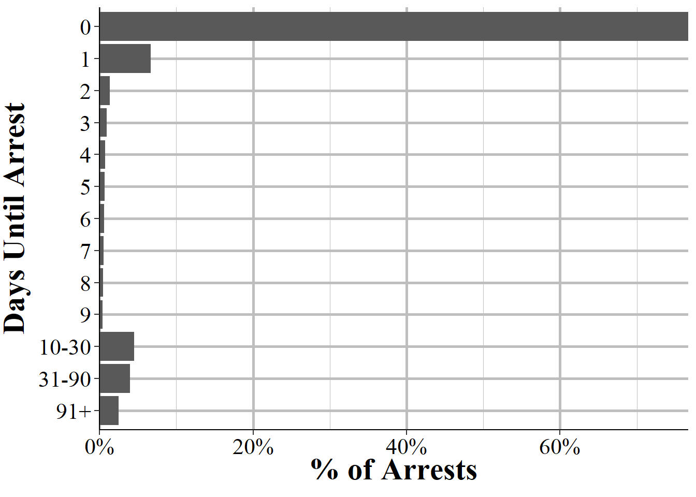
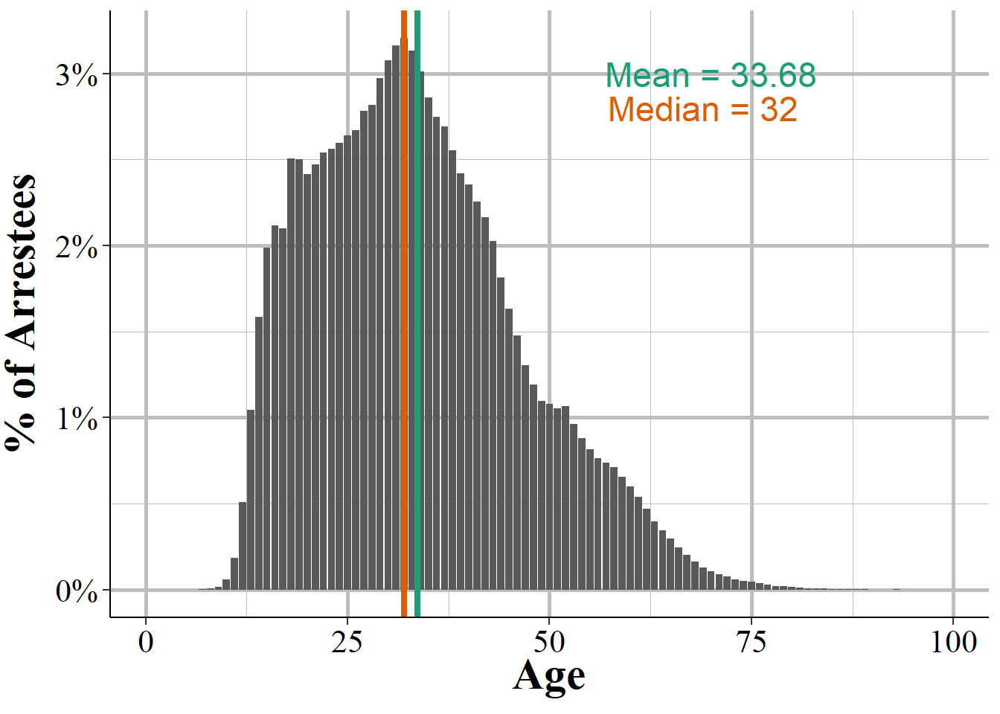

# Arrestee, Group B Arrestee, and Window Arrestee Segment  {#arrestee}

The Arrestee Segment has information on the person arrested in an incident and has a number of variables that look at same as in previous segments but with subtle differences. This segment covers the arrestee's age, sex, and race, ethnicity, and residency status (of the city, not as a United States citizen). Age, sex, and race are also in the Offender Segment but can differ as not all offenders are arrested. It also says the crime the arrestee was arrested for (which in some cases is different than the crime committed in the offense since an arrest can clear multiple incidents), the weapon carried during the arrest (which may be different than the weapon used during the offense) and if this weapon (if it is a firearm) was an automatic weapon. There are a few completely new variables including the date of the arrest and the type of arrest. The type of arrest is simply whether the person was arrested by police who viewed the crime, if the arrest followed an arrest warrant or a previous arrest (i.e. arrested for a different crime and then police find out you also committed this one so they consider you arrested for this one too), and whether the person was cited by police and ordered to appear in court but not formally taken into custody. Finally, for juvenile arrestees it says whether arrestees were "handled within the department" which means they were released without formal sanctions or were "referred to other authorities" such as juvenile or criminal court, a welfare agency, or probation or parole department (for those on probation or parole). 

This chapter also covers the Group B Arrestee Segment and the Window Arrestee Segment. The Arrestee Segment covers arrests for Group A offenses and there are corresponding Offense, Offender, and Victim segments for these incidents. Group B offenses, however, only have information about the arrest so incidents in this segment do not have any corresponding segments with it. Since Group B only has arrests without any associated incident, instead of the incident number variable like other segments have, this segment has an "arrest transaction incident number" which works the same as a normal incident number. Likewise, the Window Arrestee Segment isn't associated with any other segments as the "window" part means that they are only partial reports. The Window Arrestee Segment has the same variables as the normal Arrestee Segment but also has 10 variables on each of the offenses committed (up to 10 offenses) during the incident. This is really to try to provide a bit of information that you'd otherwise get from the other segments but don't since this is a window segment.

For the rest of this chapter I'll be using examples from the Arrestee Segment and not the Group B Arrestee (except for a table showing each Group B offense) or the Window Arrestee Segment. 

In addition to the variables detailed below this, segment has the traditional agency and incident identifiers: the ORI code, the agency state, the year of this data, and the incident number. It also has an "arrestee sequence number" which is an identifier for an arrestee in an incident since incidents can have multiple people arrested. This is just the number of each arrestee and to my knowledge is not associated with how involved the arrestee is. Being the 1st arrestee, for example, doesn't mean that individual played a greater role in the crime than the 2nd arrestee.

## Crimes arrested for

This segment tells us which offense the arrestee was arrested for. There are a couple of caveats with this data. First, there can be up to 10 crimes per incident but this segment only tells you the most serious offense (based on the agency's decision of which is most serious). This can be solved partially by merging this segment with the Offense Segment and getting all of the offenses related to the incident. It's only partially solved because the crime the person is arrested for may not necessarily be the crime involved in the incident. This is because a person can be arrested for a certain crime (e.g. shoplifting) and then the police find out that there are also responsible for a more serious crime (e.g. aggravated assault). Their arrest crime is shoplifting and they'll be associated with the incident for the aggravated assault.

One interesting part of this segment is that while it's associated with Group A offenses, as someone may be arrested for a crime other than the crime in the incident, arrests can include Group B offenses. So the Group B Arrestee Segment can really be thought of as an arrest for a Group B offense where the arrestee isn't associated with a previous Group A incident (other than ones that already led to an arrest since that incident would then be considered clear and the present arrest won't be associated with it). We'll look first at the crimes people were arrested for in the main Arrestee Segment, which includes both Group A and Group B offenses as possible arrest crimes, and then at the Group B Arrestee Segment which only includes Group B offenses.

### Arrestee Segment arrest crimes

Table \@ref(tab:arresteeCrime) shows the number and percent of arrests for all arrests associated with a Group A crime incident. Perhaps unsurprising, drug crimes are the most common arrest making up a quarter of all arrests (30% when including drug equipment crimes). Simple assault (assault without a weapon or without seriously injuring the victim) is the next most common at 19% of arrests, and aggravated assault is the 4th most common arrest crime at 6.3% of arrests. Theft, which NIBRS breaks into a number of subcategories of theft such as shoplifting and "all other larceny" is among the most common arrest crimes, making up ranks 3 and 6 of the top 6, as well as several other subcategories later on. The remaining crimes are all relatively rare, consisting of under 5% of arrests each. This is due to how the top crimes are broad categories (e.g. drug offenses ranges from simple possession to large scale sales but is all grouped into "drug/narcotic violations" here) while other crimes are specific (e.g. purse-snatching is a very specific form of theft).  

<table class="table table-striped" style="width: auto !important; margin-left: auto; margin-right: auto;">
<caption>(\#tab:arresteeCrime)The number and percent of arrests for Group A crimes for all arrests reported to NIBRS in 2022.</caption>
 <thead>
  <tr>
   <th style="text-align:left;"> Crime Category </th>
   <th style="text-align:right;"> \# of Offenses </th>
   <th style="text-align:right;"> \% of Offenses </th>
  </tr>
 </thead>
<tbody>
  <tr>
   <td style="text-align:left;"> Drug/Narcotic Offenses - Drug/Narcotic Violations </td>
   <td style="text-align:right;"> 651,593 </td>
   <td style="text-align:right;"> 22.44\% </td>
  </tr>
  <tr>
   <td style="text-align:left;"> Assault Offenses - Simple Assault </td>
   <td style="text-align:right;"> 625,914 </td>
   <td style="text-align:right;"> 21.55\% </td>
  </tr>
  <tr>
   <td style="text-align:left;"> Larceny/Theft Offenses - Shoplifting </td>
   <td style="text-align:right;"> 262,281 </td>
   <td style="text-align:right;"> 9.03\% </td>
  </tr>
  <tr>
   <td style="text-align:left;"> Assault Offenses - Aggravated Assault </td>
   <td style="text-align:right;"> 217,608 </td>
   <td style="text-align:right;"> 7.49\% </td>
  </tr>
  <tr>
   <td style="text-align:left;"> Drug/Narcotic Offenses - Drug Equipment Violations </td>
   <td style="text-align:right;"> 142,720 </td>
   <td style="text-align:right;"> 4.91\% </td>
  </tr>
  <tr>
   <td style="text-align:left;"> Weapon Law Violations - Weapon Law Violations </td>
   <td style="text-align:right;"> 123,203 </td>
   <td style="text-align:right;"> 4.24\% </td>
  </tr>
  <tr>
   <td style="text-align:left;"> Larceny/Theft Offenses - All Other Larceny </td>
   <td style="text-align:right;"> 121,677 </td>
   <td style="text-align:right;"> 4.19\% </td>
  </tr>
  <tr>
   <td style="text-align:left;"> Destruction/Damage/Vandalism of Property </td>
   <td style="text-align:right;"> 113,049 </td>
   <td style="text-align:right;"> 3.89\% </td>
  </tr>
  <tr>
   <td style="text-align:left;"> Assault Offenses - Intimidation </td>
   <td style="text-align:right;"> 85,136 </td>
   <td style="text-align:right;"> 2.93\% </td>
  </tr>
  <tr>
   <td style="text-align:left;"> Burglary/Breaking And Entering </td>
   <td style="text-align:right;"> 82,832 </td>
   <td style="text-align:right;"> 2.85\% </td>
  </tr>
  <tr>
   <td style="text-align:left;"> All Other Offenses </td>
   <td style="text-align:right;"> 71,084 </td>
   <td style="text-align:right;"> 2.45\% </td>
  </tr>
  <tr>
   <td style="text-align:left;"> Stolen Property Offenses (Receiving, Selling, Etc.) </td>
   <td style="text-align:right;"> 57,907 </td>
   <td style="text-align:right;"> 1.99\% </td>
  </tr>
  <tr>
   <td style="text-align:left;"> Motor Vehicle Theft </td>
   <td style="text-align:right;"> 52,882 </td>
   <td style="text-align:right;"> 1.82\% </td>
  </tr>
  <tr>
   <td style="text-align:left;"> Robbery </td>
   <td style="text-align:right;"> 38,048 </td>
   <td style="text-align:right;"> 1.31\% </td>
  </tr>
  <tr>
   <td style="text-align:left;"> Fraud Offenses - False Pretenses/Swindle/Confidence Game </td>
   <td style="text-align:right;"> 31,922 </td>
   <td style="text-align:right;"> 1.10\% </td>
  </tr>
  <tr>
   <td style="text-align:left;"> Larceny/Theft Offenses - Theft From Motor Vehicle </td>
   <td style="text-align:right;"> 23,673 </td>
   <td style="text-align:right;"> 0.82\% </td>
  </tr>
  <tr>
   <td style="text-align:left;"> Counterfeiting/Forgery </td>
   <td style="text-align:right;"> 20,107 </td>
   <td style="text-align:right;"> 0.69\% </td>
  </tr>
  <tr>
   <td style="text-align:left;"> Larceny/Theft Offenses - Theft From Building </td>
   <td style="text-align:right;"> 18,030 </td>
   <td style="text-align:right;"> 0.62\% </td>
  </tr>
  <tr>
   <td style="text-align:left;"> Driving Under The Influence </td>
   <td style="text-align:right;"> 16,410 </td>
   <td style="text-align:right;"> 0.57\% </td>
  </tr>
  <tr>
   <td style="text-align:left;"> Disorderly Conduct </td>
   <td style="text-align:right;"> 13,700 </td>
   <td style="text-align:right;"> 0.47\% </td>
  </tr>
  <tr>
   <td style="text-align:left;"> Kidnapping/Abduction </td>
   <td style="text-align:right;"> 12,869 </td>
   <td style="text-align:right;"> 0.44\% </td>
  </tr>
  <tr>
   <td style="text-align:left;"> Fraud Offenses - Impersonation </td>
   <td style="text-align:right;"> 11,225 </td>
   <td style="text-align:right;"> 0.39\% </td>
  </tr>
  <tr>
   <td style="text-align:left;"> Trespass of Real Property </td>
   <td style="text-align:right;"> 10,687 </td>
   <td style="text-align:right;"> 0.37\% </td>
  </tr>
  <tr>
   <td style="text-align:left;"> Sex Offenses - Fondling (Incident Liberties/Child Molest) </td>
   <td style="text-align:right;"> 10,298 </td>
   <td style="text-align:right;"> 0.35\% </td>
  </tr>
  <tr>
   <td style="text-align:left;"> Sex Offenses - Rape </td>
   <td style="text-align:right;"> 8,956 </td>
   <td style="text-align:right;"> 0.31\% </td>
  </tr>
  <tr>
   <td style="text-align:left;"> Murder/Nonnegligent Manslaughter </td>
   <td style="text-align:right;"> 8,284 </td>
   <td style="text-align:right;"> 0.29\% </td>
  </tr>
  <tr>
   <td style="text-align:left;"> Fraud Offenses - Credit Card/Atm Fraud </td>
   <td style="text-align:right;"> 7,281 </td>
   <td style="text-align:right;"> 0.25\% </td>
  </tr>
  <tr>
   <td style="text-align:left;"> Embezzlement </td>
   <td style="text-align:right;"> 6,689 </td>
   <td style="text-align:right;"> 0.23\% </td>
  </tr>
  <tr>
   <td style="text-align:left;"> Fraud Offenses - Identity Theft </td>
   <td style="text-align:right;"> 6,414 </td>
   <td style="text-align:right;"> 0.22\% </td>
  </tr>
  <tr>
   <td style="text-align:left;"> Arson </td>
   <td style="text-align:right;"> 6,338 </td>
   <td style="text-align:right;"> 0.22\% </td>
  </tr>
  <tr>
   <td style="text-align:left;"> Prostitution Offenses - Prostitution </td>
   <td style="text-align:right;"> 5,843 </td>
   <td style="text-align:right;"> 0.20\% </td>
  </tr>
  <tr>
   <td style="text-align:left;"> Larceny/Theft Offenses - Theft of Motor Vehicle Parts/Accessories </td>
   <td style="text-align:right;"> 5,621 </td>
   <td style="text-align:right;"> 0.19\% </td>
  </tr>
  <tr>
   <td style="text-align:left;"> Pornography/Obscene Material </td>
   <td style="text-align:right;"> 5,187 </td>
   <td style="text-align:right;"> 0.18\% </td>
  </tr>
  <tr>
   <td style="text-align:left;"> Liquor Law Violations </td>
   <td style="text-align:right;"> 4,142 </td>
   <td style="text-align:right;"> 0.14\% </td>
  </tr>
  <tr>
   <td style="text-align:left;"> Animal Cruelty </td>
   <td style="text-align:right;"> 3,904 </td>
   <td style="text-align:right;"> 0.13\% </td>
  </tr>
  <tr>
   <td style="text-align:left;"> Family Offenses, Nonviolent </td>
   <td style="text-align:right;"> 3,629 </td>
   <td style="text-align:right;"> 0.12\% </td>
  </tr>
  <tr>
   <td style="text-align:left;"> Larceny/Theft Offenses - Pocket-Picking </td>
   <td style="text-align:right;"> 3,323 </td>
   <td style="text-align:right;"> 0.11\% </td>
  </tr>
  <tr>
   <td style="text-align:left;"> Sex Offenses - Sodomy </td>
   <td style="text-align:right;"> 2,081 </td>
   <td style="text-align:right;"> 0.07\% </td>
  </tr>
  <tr>
   <td style="text-align:left;"> Prostitution Offenses - Assisting Or Promoting Prostitution </td>
   <td style="text-align:right;"> 1,559 </td>
   <td style="text-align:right;"> 0.05\% </td>
  </tr>
  <tr>
   <td style="text-align:left;"> Sex Offenses - Statutory Rape </td>
   <td style="text-align:right;"> 1,472 </td>
   <td style="text-align:right;"> 0.05\% </td>
  </tr>
  <tr>
   <td style="text-align:left;"> Prostitution Offenses - Purchasing Prostitution </td>
   <td style="text-align:right;"> 1,274 </td>
   <td style="text-align:right;"> 0.04\% </td>
  </tr>
  <tr>
   <td style="text-align:left;"> Curfew/Loitering/Vagrancy Violations </td>
   <td style="text-align:right;"> 1,191 </td>
   <td style="text-align:right;"> 0.04\% </td>
  </tr>
  <tr>
   <td style="text-align:left;"> Larceny/Theft Offenses - Purse-Snatching </td>
   <td style="text-align:right;"> 959 </td>
   <td style="text-align:right;"> 0.03\% </td>
  </tr>
  <tr>
   <td style="text-align:left;"> Sex Offenses - Sexual Assault With An Object </td>
   <td style="text-align:right;"> 912 </td>
   <td style="text-align:right;"> 0.03\% </td>
  </tr>
  <tr>
   <td style="text-align:left;"> Negligent Manslaughter </td>
   <td style="text-align:right;"> 858 </td>
   <td style="text-align:right;"> 0.03\% </td>
  </tr>
  <tr>
   <td style="text-align:left;"> Larceny/Theft Offenses - Theft From Coin-Operated Machine Or Device </td>
   <td style="text-align:right;"> 500 </td>
   <td style="text-align:right;"> 0.02\% </td>
  </tr>
  <tr>
   <td style="text-align:left;"> Extortion/Blackmail </td>
   <td style="text-align:right;"> 458 </td>
   <td style="text-align:right;"> 0.02\% </td>
  </tr>
  <tr>
   <td style="text-align:left;"> Human Trafficking - Commercial Sex Acts </td>
   <td style="text-align:right;"> 374 </td>
   <td style="text-align:right;"> 0.01\% </td>
  </tr>
  <tr>
   <td style="text-align:left;"> Gambling Offenses - Betting/Wagering </td>
   <td style="text-align:right;"> 365 </td>
   <td style="text-align:right;"> 0.01\% </td>
  </tr>
  <tr>
   <td style="text-align:left;"> Fraud Offenses - Wire Fraud </td>
   <td style="text-align:right;"> 360 </td>
   <td style="text-align:right;"> 0.01\% </td>
  </tr>
  <tr>
   <td style="text-align:left;"> Gambling Offenses - Operating/Promoting/Assisting Gambling </td>
   <td style="text-align:right;"> 279 </td>
   <td style="text-align:right;"> 0.01\% </td>
  </tr>
  <tr>
   <td style="text-align:left;"> Sex Offenses - Incest </td>
   <td style="text-align:right;"> 207 </td>
   <td style="text-align:right;"> 0.01\% </td>
  </tr>
  <tr>
   <td style="text-align:left;"> Bribery </td>
   <td style="text-align:right;"> 200 </td>
   <td style="text-align:right;"> 0.01\% </td>
  </tr>
  <tr>
   <td style="text-align:left;"> Fraud Offenses - Hacking/Computer Invasion </td>
   <td style="text-align:right;"> 125 </td>
   <td style="text-align:right;"> 0.00\% </td>
  </tr>
  <tr>
   <td style="text-align:left;"> Failure To Appear </td>
   <td style="text-align:right;"> 119 </td>
   <td style="text-align:right;"> 0.00\% </td>
  </tr>
  <tr>
   <td style="text-align:left;"> Fraud Offenses - Welfare Fraud </td>
   <td style="text-align:right;"> 112 </td>
   <td style="text-align:right;"> 0.00\% </td>
  </tr>
  <tr>
   <td style="text-align:left;"> Gambling Offenses - Gambling Equipment Violations </td>
   <td style="text-align:right;"> 102 </td>
   <td style="text-align:right;"> 0.00\% </td>
  </tr>
  <tr>
   <td style="text-align:left;"> Human Trafficking - Involuntary Servitude </td>
   <td style="text-align:right;"> 80 </td>
   <td style="text-align:right;"> 0.00\% </td>
  </tr>
  <tr>
   <td style="text-align:left;"> Runaway </td>
   <td style="text-align:right;"> 42 </td>
   <td style="text-align:right;"> 0.00\% </td>
  </tr>
  <tr>
   <td style="text-align:left;"> Fugitive Offenses - Flight To Avoid Prosecution </td>
   <td style="text-align:right;"> 24 </td>
   <td style="text-align:right;"> 0.00\% </td>
  </tr>
  <tr>
   <td style="text-align:left;"> Sex Offenses - Failure To Register As A Sex Offender </td>
   <td style="text-align:right;"> 11 </td>
   <td style="text-align:right;"> 0.00\% </td>
  </tr>
  <tr>
   <td style="text-align:left;"> Commerce Violations - Federal Liquor Offenses </td>
   <td style="text-align:right;"> 9 </td>
   <td style="text-align:right;"> 0.00\% </td>
  </tr>
  <tr>
   <td style="text-align:left;"> Gambling Offenses - Sports Tampering </td>
   <td style="text-align:right;"> 3 </td>
   <td style="text-align:right;"> 0.00\% </td>
  </tr>
  <tr>
   <td style="text-align:left;"> Immigration Violations - Illegal Entry Into The United States </td>
   <td style="text-align:right;"> 1 </td>
   <td style="text-align:right;"> 0.00\% </td>
  </tr>
  <tr>
   <td style="text-align:left;"> Weapon Law Violations - Explosives </td>
   <td style="text-align:right;"> 1 </td>
   <td style="text-align:right;"> 0.00\% </td>
  </tr>
  <tr>
   <td style="text-align:left;"> Fugitive Offenses - Harboring Escappee/Concealing From Arrest </td>
   <td style="text-align:right;"> 1 </td>
   <td style="text-align:right;"> 0.00\% </td>
  </tr>
  <tr>
   <td style="text-align:left;"> Perjury </td>
   <td style="text-align:right;"> 1 </td>
   <td style="text-align:right;"> 0.00\% </td>
  </tr>
  <tr>
   <td style="text-align:left;"> Federal Resource Violations </td>
   <td style="text-align:right;"> 1 </td>
   <td style="text-align:right;"> 0.00\% </td>
  </tr>
  <tr>
   <td style="text-align:left;"> Total </td>
   <td style="text-align:right;"> 2,904,147 </td>
   <td style="text-align:right;"> 100\% </td>
  </tr>
</tbody>
</table>

### Group B Segment arrest crimes

Table \@ref(tab:GroupBarresteeCrime) shows the number and percent of arrests for all arrests associated with a Group B crime incident. The offense categories overlap with Table \@ref(tab:arresteeCrime) but these are for separate arrests, a single arrest cannot be in both segments. Unhelpfully, the most common Group B offense is "All other offenses" which means that it's a crime that isn't covered in either the Group A or the Group B crime categories. However, this can also include Group A or Group B crimes if they are not completed. So an attempted or a conspiracy to commit a Group A or B crime can go in this category. At 57% of Group B arrests, this very vague category covers a huge amount of arrests. The next most common Group B arrest is driving under the influence of drugs or alcohol, and this occurred in 18.4% - or 352k times - of arrests.

Trespassing makes up 5.7% of arrests and this is unlawfully entering someone's property, including a building. The difference between this and burglary is that this is entering without any intent to commit theft or a felony. Disorderly conduct is a broad category ranging from indecent exposure (which should be its own sex offense but isn't for some reason) to "profanity" and noise violations, and it makes up 6.2% of arrests. So be cautious with this offense as it ranges from very minor to quite serious and there's no distinguishing what actually happened. Drunkenness and liquor law violations make up 6% and 3.6% of arrests, respectively. The difference is that drunkenness is when someone is seriously drunk in public (to the point where they can't control their own body) and liquor law violations are about illegal making or selling of liquor. So basically bootlegging, selling alcohol without a license (or to people not allowed to drink, like minors), or avoiding paying tax on alcohol sales. "Family Offenses, Nonviolent" is also a rather vague category and includes "nonviolent abuse" (which I guess means emotional abusive) as well as neglecting the child in a few different ways like not paying alimony and deserting the child. Since these are arrests, the actions have to reach the level of criminal behavior, simply being an awful parent (or even leaving the child, as long as they have another adult to watch them) is not this offense. Runaways is an offense that only applies to people under age 18. The remaining categories are all rare and none are more than 1% of arrests.

<table class="table table-striped" style="width: auto !important; margin-left: auto; margin-right: auto;">
<caption>(\#tab:GroupBarresteeCrime)The number and percent of arrests for Group B crimes for all arrests reported to NIBRS in 2022.</caption>
 <thead>
  <tr>
   <th style="text-align:left;"> Crime Category </th>
   <th style="text-align:right;"> \# of Offenses </th>
   <th style="text-align:right;"> \% of Offenses </th>
  </tr>
 </thead>
<tbody>
  <tr>
   <td style="text-align:left;"> All Other Offenses </td>
   <td style="text-align:right;"> 1,470,699 </td>
   <td style="text-align:right;"> 58.45\% </td>
  </tr>
  <tr>
   <td style="text-align:left;"> Driving Under The Influence </td>
   <td style="text-align:right;"> 565,429 </td>
   <td style="text-align:right;"> 22.47\% </td>
  </tr>
  <tr>
   <td style="text-align:left;"> Trespass of Real Property </td>
   <td style="text-align:right;"> 177,586 </td>
   <td style="text-align:right;"> 7.06\% </td>
  </tr>
  <tr>
   <td style="text-align:left;"> Disorderly Conduct </td>
   <td style="text-align:right;"> 176,937 </td>
   <td style="text-align:right;"> 7.03\% </td>
  </tr>
  <tr>
   <td style="text-align:left;"> Liquor Law Violations </td>
   <td style="text-align:right;"> 72,044 </td>
   <td style="text-align:right;"> 2.86\% </td>
  </tr>
  <tr>
   <td style="text-align:left;"> Family Offenses, Nonviolent </td>
   <td style="text-align:right;"> 33,545 </td>
   <td style="text-align:right;"> 1.33\% </td>
  </tr>
  <tr>
   <td style="text-align:left;"> Curfew/Loitering/Vagrancy Violations </td>
   <td style="text-align:right;"> 16,266 </td>
   <td style="text-align:right;"> 0.65\% </td>
  </tr>
  <tr>
   <td style="text-align:left;"> Failure To Appear </td>
   <td style="text-align:right;"> 1,816 </td>
   <td style="text-align:right;"> 0.07\% </td>
  </tr>
  <tr>
   <td style="text-align:left;"> Runaway </td>
   <td style="text-align:right;"> 1,629 </td>
   <td style="text-align:right;"> 0.06\% </td>
  </tr>
  <tr>
   <td style="text-align:left;"> Federal Resource Violations </td>
   <td style="text-align:right;"> 15 </td>
   <td style="text-align:right;"> 0.00\% </td>
  </tr>
  <tr>
   <td style="text-align:left;"> Perjury </td>
   <td style="text-align:right;"> 1 </td>
   <td style="text-align:right;"> 0.00\% </td>
  </tr>
  <tr>
   <td style="text-align:left;"> Total </td>
   <td style="text-align:right;"> 2,515,967 </td>
   <td style="text-align:right;"> 100\% </td>
  </tr>
</tbody>
</table>

## Arrest date

For each arrest we know the exact date of the arrest. As with the incident date, there is evidence that when agencies don't know the exact arrest date, they put down the first of the month. However, this is far less of a problem than with the incident date, likely because since the agency is doing the arresting they know exactly when they do it. Instead of looking at arrests by day of the month, we'll use both the arrest date and the incident date to look at how long it takes for crimes to get solved. 

Figure \@ref(fig:arrestsDaysUntilArrest) shows how long it takes for arrests to be made. The shortest time is zero days which means the arrest and the incident happened on the same day and the longest is 461 days after the incident. About 76.5% of arrests happen on the same day as the incident while 6.6% happen on the next day. 1.4% happen the following day and 1% on the day after this. This trend of a lower probability of the case being solved as the time from the incident increases continues throughout the figure. Including dates up to 461 days is a bit ridiculous since it's impossible to see trends among the early dates other than zero days, but it's a good demonstration of how massively concentrated arrests are that occur on the same day of the incident. The lesson here is that if an arrest isn't made on the day of the incident (such as at the scene of the crime), it's very unlikely that'll it'll be made at all (and most crimes never lead to an arrest). 

(\#fig:arrestsDaysUntilArrest)The distribution of the number of days from the incident to the arrest date. In 2022 the maximum days from incident to arrest was 461 days. Zero days means that the arrest occurred on the same day as the incident.

Figure \@ref(fig:arrestsDaysUntilArrestBarplot) groups the larger number of days together to make it easier to see trends early after the incident. Here we can see much better how the percent of arrests move quickly downwards after zero days. 

(\#fig:arrestsDaysUntilArrestBarplot)The number of days from the incident to the arrest date. Values over 10 days are grouped to better see the distribution for arrests that took fewer than 10 days. Zero days means that the arrest occurred on the same day as the incident.

## Weapons

In the Offense Segment we get info on what weapon (if any) was used during the crime. Here, we see what weapon the person arrested was carrying *when they were arrested.* There is probably a very large overlap here, especially given that the vast majority of arrests happen on the same day as the offense, so probably happen at the scene of the crime (and we'll see exactly which ones do happen there later on in this chapter). Compared to the weapons covered in the Offense Segment - see Section \@ref(offenseWeapons) for more - the weapons here are only a narrow subset, and cover mostly firearms. This is partly because the most common "weapon" in the Offense Segment is that the offender used their body as a weapon (e.g. punching, kicking) and everyone arrested has a body so it doesn't make sense to count that as a weapon. Each arrestee can carry up to two weapons, but we'll only look at the first weapon for the below graphs. Please note that this is weapons found on the arrestee, and doesn't mean that they used the weapon during the arrest. 

Figure \@ref(fig:arresteeWeapon) shows the breakdown in the weapon carried by the arrestee during the arrest. In 94% of arrests, the arrestee was not carrying any weapon. Since this graph shows arrests for all crimes, it makes a good deal of sense. Most crimes are non-violent so we'd expect those people to not carry a weapon. Since so few arrestees have weapons, we'll look at the breakdown among those who were carrying a weapon in Figure \@ref(fig:arresteeWeaponArmed). 

(\#fig:arresteeWeapon)The weapon found on the arrestee for all arrestees reported in 2022.

To see the weapons carried when the arrestee had a weapon, Figure \@ref(fig:arresteeWeaponArmed) shows the breakdown in which weapon they carried. About 43.8% of people arrested who had a weapon were carrying a handgun followed by 30% with some kind of "lethal cutting instrument" like a knife. While rifles, and especially "assault rifles", are what people (and especially politicians and the media) focus on when talking about violent crime, handguns are actually the most common gun to be used in a crime so it makes sense that handguns are the most frequently found weapon. "Firearm (type not stated)"  basically means that the type of firearm used is unknown so can belong in one of the firearm categories and makes up 9% of weapons. Blunt instruments (including bats, clubs, and brass knuckles) follow at 6.9% of weapons. And the remaining weapons included are "other firearm" (so any other than ones specified) at 5.8%, rifle at 2.3%, and shotgun at 2%. 

(\#fig:arresteeWeaponArmed)The distribution of weapon usage for all arrestees in 2022 who were arrested with a weapon (i.e. excludes unarmed arrestees).

## Automatic weapons

This variable tells you if the weapon the arrestee was carrying was a gun whether that gun was fully automatic. To be clear, this means that when you pull the trigger once the gun will fire multiple bullets. Semi-automatic firearms are not automatic firearms. The Offense Segment also has a variable indicating if the offender used an automatic weapon but there they didn't necessarily recover the gun so it's much less reliable than in this segment where the police have the gun and are able to test it.^[It's not clear whether they actually test it or simply go by the design of the gun, such as if the model allows for fully automatic firing.] The percent of guns that are fully automatic are fairly similar between the weapons seized at arrest, as shown in Figure \@ref(fig:arresteeAutomaticWeapon) and those used in the offense as shown in Figure \@ref(fig:offenseAutomaticWeapon) in Chapter \@ref(offenseSegment). Figure \@ref(fig:arresteeAutomaticWeapon) shows that about 5.6% of rifles seized by police during an arrest were fully automatic. About 4.9% of handguns are automatic while "firearm (type not stated) are automatic in 4.3% of cases. Shotguns and  "other firearm" category are the least likely to be automatic at about 2.5% and 1.1% of weapons, respectively. 

(\#fig:arresteeAutomaticWeapon)The percent of firearms the arrestee was carrying that were fully automatic, for arrestees in 2022.

## Type of arrest

While arrests are sometimes talked about as if they are a homogeneous group (likely in big part because UCR data doesn't differentiate types of arrests), NIBRS data breaks them down into three different types of arrests. Figure \@ref(fig:arresteeTypeOfArrest) shows the distribution in the type of arrest for all arrestees in the 2022 NIBRS data. The most common type is "On-View" which means that the person is arrested at the scene by an officer. For example, if police respond to a bank robbery and nab the robbers as they run out of the bank, this is an on-view arrest. On-view arrests make up the majority - 50.9% - of arrests.

The next type of arrest is a "warrant/previous incident report" and this makes up 26.8% of arrests. In these cases the police had an arrest warrant and found the person and arrested them based on that warrant. This also includes when a person is arrested and found to have been involved in previous incidents. Then these previous incidents would be considered cleared from this single arrest. In these cases NIBRS has an indicator variable, called the "multiple arrestee indicator" to tell us that this individual is responsible for multiple incidents cleared so we avoid counting them twice (as their demographics will be the same each time). In this variable it says "count arrestee" if this is their only arrest or if this is the first arrest that is counted in cases where multiple incidents are cleared by the arrest, and "multiple" otherwise. 

Finally, people can get a "summoned/cited" arrest which isn't really an arrest at all. This is when they are given a subpoena that says that must go to court to be tried for a crime, but they are not formally arrested and taken into police custody (i.e. they are never handcuffed, taken to a police precinct or to jail). About 22.2% of arrests are this form of arrest.

(\#fig:arresteeTypeOfArrest)The distribution of arrests by type of arrest. Previous Incident Report includes cases where an individual was arrested for a separate crime and are then reported as also arrested for this incident.

## Disposition for juvenile arrestees

For juvenile arrestees - those under age 18 *at the time of the arrest* (and, by definition they'd also be under age 18 during the incident) - there is some information about the outcome of the arrest.^[There are a few people older than 18 with this variable but it's so rare that I think that they're just incorrectly inputted ages.] There are two possible outcomes (which NIBRS calls "dispositions"): being referred to other (that is, other than the arresting agency) authorities or handled within the arresting agency. Figure \@ref(fig:arresteeJuvenileDisposition) shows this breakdown and being referred to other authorities is the most common outcome at 72.6% of juvenile arrests. This is a very broad category and the "other authorities" can range from juvenile or adult court (so the police recommend that they be prosecuted) to welfare agencies and being sent to other police agencies (such as if they committed a crime elsewhere and are being extradited). The other category, being handled within the department, means that the police release the juvenile without any formal action taken (but they may give the juvenile a warning). In these cases the juvenile is released to an adult (including but not limited to family members or guardians) and the case is essentially dropped. In about 0.001% of juvenile arrests the disposition is unknown.^[A juvenile can potentially get multiple dispositions, such as if they're initially released but later the police recommend them for prosecution. It's not clear which outcome is recorded in these cases. In UCR data, however, only the initial disposition is recorded so that is likely how it also is in NIBRS.] 

(\#fig:arresteeJuvenileDisposition)For juvenile arrestees (under age 18), the distribution of case outcomes.

## Demographics

This segment provides several variables related to who the arrestee is. Age, race, and sex overlap with the Offender Segment but this segment also adds ethnicity and whether they live in the jurisdiction of the agency (i.e. the city the police patrols) they were arrested by.

### Residence status

The first variable we'll look at is the residence status for the arrestee. This is residence in the jurisdiction that arrested them and it has nothing to do with residence status or citizenship status in the United States. People tend to commit crimes (and are the victims of crimes) very close to where they live, so this provides some evidence for that. We don't know where the arrestee lives, but know if they live in the jurisdiction or not. This is useful because some areas (e.g. Las Vegas, Washington DC, urban city centers where people commute to work) likely have a lot more people moving into those areas during the day but who live else compared to places like rural towns or suburbs. So it's helpful to be able to distinguish locals arrested with people who may be tourists or come into town just to commit the crime.^[In a ride-along I was on, a woman who lived over an hour from the city I was in was caught shoplifting clothes.] 

One thing to be cautious about is that residence status may be an imprecise measure of where someone actually lives. How it's defined may differ by agency which could affect comparability across agencies. For example, if it's defined as official residence (such as address on a driver's license) that may be incorrect for a sizable share of the population (e.g. many college students live far from where their driver's license address is).^[One another ride-along, a man from Florida was arrested for stealing from a local store (in California).] If residence status is based on asking the arrestee, they may of course lie to the police. There's also the question of how to label people who are truly transient such as homeless people who may move from city to city. The FBI defines residence as their legal permanent address though it's unclear how that is handled for people without this info and when people live permanently in a different spot than their legal address.  

Figure \@ref(fig:arresteeResidenceStatus) shows the percent of arrestees in 2022 who were residents or not (or whose status was unknown) of the jurisdiction that arrested them. Most people were arrested near where they live, with 56.9% of arrestees being residents, compared with 23.3% not being residents. However, about one-fifth of arrestees had an unknown residence status so the percents of resident and non-resident may change dramatically if we didn't have any unknowns. 

(\#fig:arresteeResidenceStatus)The distribution of residence status for all arrestees reported to NIBRS in 2022. Residence status is residence in the arresting agency's jurisdiction (e.g. do you live in the city you were arrested in?). It is unrelated to citizenship or immigration status.

### Age

This variable is the age at the arrest, which may be different than age during the crime. As in the Offender Segment we are given the exact age (in years) but agencies can input a range of possible ages with the FBI giving us the average of this range (rounding down, not to the nearest integer) in the data. In Figure \@ref(fig:offenderAge) in the Offense Segment, this can be seen in the sudden spikes in the percent of offenders of a certain age and that some of the most common ages are divisible by five (e.g. 20, 25, 30). There are also far fewer unknown ages in this data with only 0.1% of arrestees having a missing age. This is reasonable as a person arrested is present for the police to learn their age from something like a driver's license or past criminal records, or estimate the age by looking at the arrestee. Like in the Offender Segment, age as a specific year is cutoff at 98 with all older ages grouped simply as "over 98 years old".

Figure \@ref(fig:arresteeAge) shows the percent of arrestees at every age available. Relative to Figure \@ref(fig:offenderAge), this graph is far smoother, indicating that there was less estimating ages and more knowing the actual age. While the trend is the same for both of these graphs, the arrestee data doesn't have any odd spikes with certain ages. Age we see that the percent of people arrested increases as they age, peaking in the early twenties before declining and then peaking age even higher in the late 20s. After this, there is a long steady decline as the arrestee ages.     

(\#fig:arresteeAge)The age of all arrestees reported in the 2022 NIBRS data.

### Sex

We also know the sex of the arrestee. The only options for this variable are male and female and there is never missing data so the police always choose one of these two choices. There is no option for transgender or any other identity. Figure \@ref(fig:arresteeSex) shows the distribution of arrestees by sex. The vast majority, 70.5% of arrestees are male and the remaining 29.5% are female. This is a higher rate of female arrestees than you might expect - past research has found that crime is largely a male-phenomenon, even greater than found here (though "crime" in most criminology research is only murder or violent index crimes) - and that's because there are differences in sex involvement by type of crime. For rape, as an example, 97.8% of arrestees in 2022 were male. Shoplifting was an even 50% split between female and male arrestees.

(\#fig:arresteeSex)The sex of all arrestees reported in the 2022 NIBRS data.

### Race

For each arrestee we know their race, with possible races being White, Black, American Indian/Alaskan Native, Asian, and Native Hawaiian/Pacific Islander. Unlike sex, the police can say that the race is unknown.^[I've been told that measuring race at all is itself racist so should never been done, even in research. This from a group of people who also said they have no need to actually evaluate police racial bias properly (i.e. using a regression with control variables) since they already knew the answer. Luckily I am no longer a postdoc.] As each arrestee is visible to the police, and can self-report race or provide official records (e.g. criminal history or jail admission data) which may say their race, there is far less uncertainty for arrestee race than offender race where 38.5% of the data is missing. As with any measure of race there is still some degree of uncertainty since people's race are not always obvious and may not fit tidily into each of the mutually exclusive groups available in NIBRS data (e.g. there is no option for mixed race). 

Figure \@ref(fig:arresteeRace) shows the breakdown for the races of each arrestee. White arrestees are most common at 64.2% of arrestees, following by Black arrestees at 29.8%. Only 3.1% of arrestees have an unknown race. The remaining small share of arrestees is made up of American Indian/Alaskan Native at 1.6%, Asian at 1%, and Native Hawaiian/Pacific Islander at 0.3% of arrestees.

(\#fig:arresteeRace)The race of all arrestees reported in the 2022 NIBRS data.

### Ethnicity

Finally, there is data on the race of the arrestee so we know if they are Hispanic or not. Ethnicity is so poorly used in the UCR data (e.g. UCR stopped collecting it for arrests for most years available and most agencies still don't report it) that I recommended in the [UCR book](https://ucrbook.com/) against ever using it. For NIBRS, there is far less data missing so it's not as much of a problem to use ethnicity as it is with UCR data. The issue remains as to what agencies are actually reporting this data or in which scenarios this variable is reported or not even in agencies that generally do report it. 

Ethnicity is an optional variable so agencies are never required to report it. This means that there's a greater chance that it'll be used only in non-random situations (which would make the data biased in some unknown way). There's also the question of reliability of the ethnicity data. Someone being Hispanic or not is likely just what the arrestees calls themselves or what the arresting officer perceives them to be. Both are important ways of measuring ethnicity but get at different things. Perception is more important for studies of bias, self-identification for differences among groups of people such as arrest rates by ethnicity. And the subjectivity of who is classified as Hispanic means that this measurement may differ by agency and by officer, making it imprecise.

Figure \@ref(fig:arresteeEthnicity) shows the breakdown in arrests by arrestee ethnicity. Most arrestees - 72.5% - are not Hispanic. Only 10% are reported to be Hispanic but an even higher percent of arrestees - 16.8% - have an unknown ethnicity so the true percent or Hispanic or non-Hispanic arrestee may be different than shown here. 

(\#fig:arresteeEthnicity)The ethnicity of all arrestees reported in the 2022 NIBRS data.

