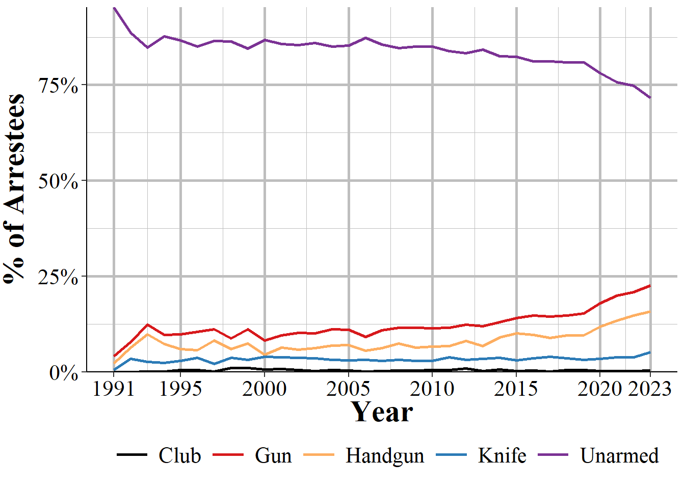
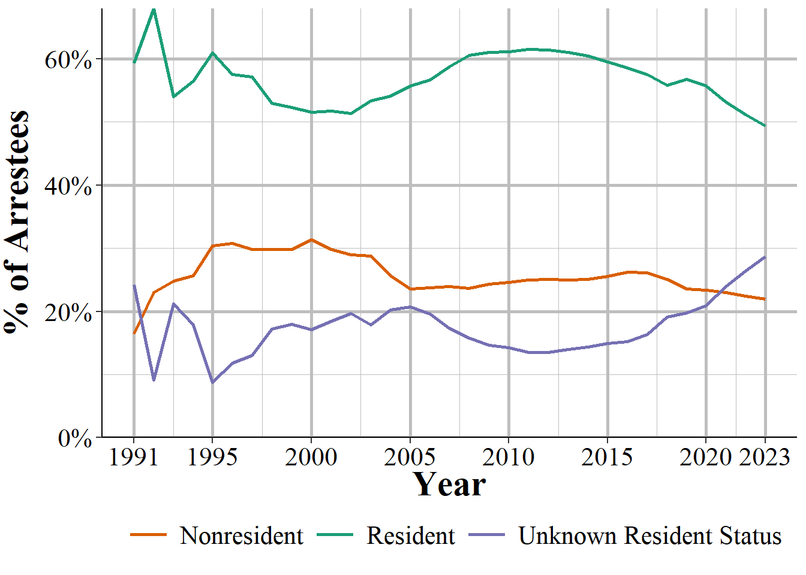
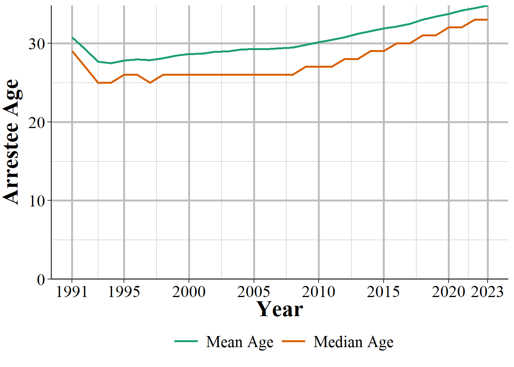
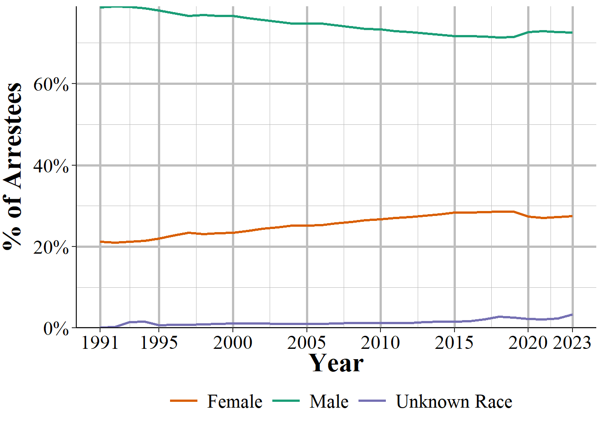
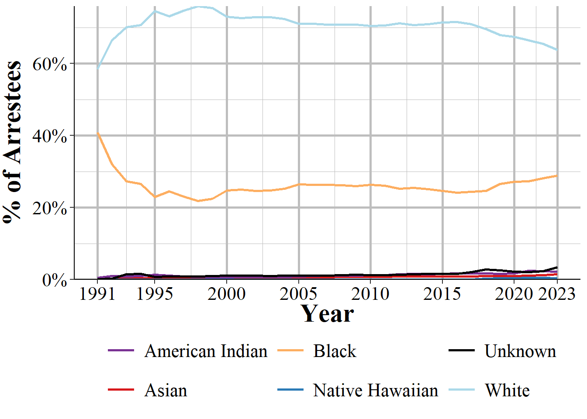

# Arrestee and Group B Arrestee {#arrestee}


The Arrestee Segment has information on the person arrested in an incident and has a number of variables that look at same as in previous segments but with subtle differences. This segment covers the arrestee's age, sex, and race, ethnicity, and residency status (of the city, not as a United States citizen). Age, sex, and race are also in the Offender Segment but can differ as not all offenders are arrested. It also says the crime the arrestee was arrested for (which in some cases is different than the crime committed in the offense since an arrest can clear multiple incidents), the weapon carried during the arrest (which may be different than the weapon used during the offense) and if this weapon (if it is a firearm) was an automatic weapon. There are a few completely new variables including the date of the arrest and the type of arrest. The type of arrest is simply whether the person was arrested by police who viewed the crime, if the arrest followed an arrest warrant or a previous arrest (i.e. arrested for a different crime and then police find out you also committed this one so they consider you arrested for this one too), and whether the person was cited by police and ordered to appear in court but not formally taken into custody. Finally, for juvenile arrestees it says whether arrestees were "handled within the department" which means they were released without formal sanctions or were "referred to other authorities" such as juvenile or criminal court, a welfare agency, or probation or parole department (for those on probation or parole). 

This chapter also covers the Group B Arrestee Segment. The Arrestee Segment covers arrests for Group A offenses and there are corresponding Offense, Offender, and Victim segments for these incidents. Group B offenses, however, only have information about the arrest so incidents in this segment do not have any corresponding segments with it. Since Group B only has arrests without any associated incident, instead of the incident number variable like other segments have, this segment has an "arrest transaction incident number" which works the same as a normal incident number. Likewise, the Window Arrestee Segment is not associated with any other segments as the "window" part means that they are only partial reports. The Window Arrestee Segment has the same variables as the normal Arrestee Segment but also has 10 variables on each of the offenses committed (up to 10 offenses) during the incident. This is really to try to provide a bit of information that you would otherwise get from the other segments but do not since this is a window segment.

It also has an "arrestee sequence number" which is an identifier for an arrestee in an incident since incidents can have multiple people arrested. This is just the number of each arrestee and to my knowledge is not associated with how involved the arrestee is. Being the 1st arrestee, for example, does not mean that individual played a greater role in the crime than the 2nd arrestee.


## Crimes arrested for

This segment tells us which offense the arrestee was arrested for. There are a couple of caveats with this data. First, there can be up to 10 crimes per incident but this segment only tells you the most serious offense (based on the agency's decision of which is most serious). This can be solved partially by merging this segment with the Offense Segment and getting all of the offenses related to the incident. It is only partially solved because the crime the person is arrested for may not necessarily be the crime involved in the incident. This is because a person can be arrested for a certain crime (e.g. shoplifting) and then the police find out that there are also responsible for a more serious crime (e.g. aggravated assault). Their arrest crime is shoplifting and they will be associated with the incident for the aggravated assault.

One interesting part of this segment is that while it is associated with Group A offenses, as someone may be arrested for a crime other than the crime in the incident, arrests can include Group B offenses. So the Group B Arrestee Segment can really be thought of as an arrest for a Group B offense where the arrestee is not associated with a previous Group A incident (other than ones that already led to an arrest since that incident would then be considered clear and the present arrest would not be associated with it). We will look first at the crimes people were arrested for in the main Arrestee Segment, which includes both Group A and Group B offenses as possible arrest crimes, and then at the Group B Arrestee Segment which only includes Group B offenses.

### Arrestee Segment arrest crimes

Table \@ref(tab:arresteeCrime) shows the number and percent of arrests for all arrests associated with a Group A crime incident. Perhaps unsurprising, drug crimes are the most common arrest making up a quarter of all arrests (30% when including drug equipment crimes). Simple assault (assault without a weapon or without seriously injuring the victim) is the next most common at 19% of arrests, and aggravated assault is the 4th most common arrest crime at 6.3% of arrests. Theft, which NIBRS breaks into a number of subcategories of theft such as shoplifting and "all other larceny" is among the most common arrest crimes, making up ranks 3 and 6 of the top 6, as well as several other subcategories later on. The remaining crimes are all relatively rare, consisting of under 5% of arrests each. This is due to how the top crimes are broad categories (e.g. drug offenses ranges from simple possession to large scale sales but is all grouped into "drug/narcotic violations" here) while other crimes are specific (e.g. purse-snatching is a very specific form of theft).  

<table class="table table-striped" style="width: auto !important; margin-left: auto; margin-right: auto;">
<caption>(\#tab:arresteeCrime)The number and percent of arrests for Group A crimes for all arrests reported to NIBRS in 2022.</caption>
 <thead>
  <tr>
   <th style="text-align:left;"> Crime Category </th>
   <th style="text-align:left;"> First Year </th>
   <th style="text-align:right;"> \# of Offenses </th>
   <th style="text-align:right;"> \% of Offenses </th>
  </tr>
 </thead>
<tbody>
  <tr>
   <td style="text-align:left;"> Assault Offenses - Simple Assault </td>
   <td style="text-align:left;"> 1991 </td>
   <td style="text-align:right;"> 728,805 </td>
   <td style="text-align:right;"> 21.64\% </td>
  </tr>
  <tr>
   <td style="text-align:left;"> Drug/Narcotic Offenses - Drug/Narcotic Violations </td>
   <td style="text-align:left;"> 1991 </td>
   <td style="text-align:right;"> 698,760 </td>
   <td style="text-align:right;"> 20.75\% </td>
  </tr>
  <tr>
   <td style="text-align:left;"> Larceny/Theft Offenses - Shoplifting </td>
   <td style="text-align:left;"> 1991 </td>
   <td style="text-align:right;"> 349,672 </td>
   <td style="text-align:right;"> 10.38\% </td>
  </tr>
  <tr>
   <td style="text-align:left;"> Assault Offenses - Aggravated Assault </td>
   <td style="text-align:left;"> 1991 </td>
   <td style="text-align:right;"> 264,141 </td>
   <td style="text-align:right;"> 7.84\% </td>
  </tr>
  <tr>
   <td style="text-align:left;"> Drug/Narcotic Offenses - Drug Equipment Violations </td>
   <td style="text-align:left;"> 1991 </td>
   <td style="text-align:right;"> 154,922 </td>
   <td style="text-align:right;"> 4.60\% </td>
  </tr>
  <tr>
   <td style="text-align:left;"> Larceny/Theft Offenses - All Other Larceny </td>
   <td style="text-align:left;"> 1991 </td>
   <td style="text-align:right;"> 142,759 </td>
   <td style="text-align:right;"> 4.24\% </td>
  </tr>
  <tr>
   <td style="text-align:left;"> Weapon Law Violations - Weapon Law Violations </td>
   <td style="text-align:left;"> 1991 </td>
   <td style="text-align:right;"> 138,286 </td>
   <td style="text-align:right;"> 4.11\% </td>
  </tr>
  <tr>
   <td style="text-align:left;"> Destruction/Damage/Vandalism of Property </td>
   <td style="text-align:left;"> 1991 </td>
   <td style="text-align:right;"> 133,395 </td>
   <td style="text-align:right;"> 3.96\% </td>
  </tr>
  <tr>
   <td style="text-align:left;"> Assault Offenses - Intimidation </td>
   <td style="text-align:left;"> 1991 </td>
   <td style="text-align:right;"> 107,256 </td>
   <td style="text-align:right;"> 3.18\% </td>
  </tr>
  <tr>
   <td style="text-align:left;"> Burglary/Breaking And Entering </td>
   <td style="text-align:left;"> 1991 </td>
   <td style="text-align:right;"> 93,699 </td>
   <td style="text-align:right;"> 2.78\% </td>
  </tr>
  <tr>
   <td style="text-align:left;"> All Other Offenses </td>
   <td style="text-align:left;"> 1991 </td>
   <td style="text-align:right;"> 83,387 </td>
   <td style="text-align:right;"> 2.48\% </td>
  </tr>
  <tr>
   <td style="text-align:left;"> Stolen Property Offenses (Receiving, Selling, Etc.) </td>
   <td style="text-align:left;"> 1991 </td>
   <td style="text-align:right;"> 64,989 </td>
   <td style="text-align:right;"> 1.93\% </td>
  </tr>
  <tr>
   <td style="text-align:left;"> Motor Vehicle Theft </td>
   <td style="text-align:left;"> 1991 </td>
   <td style="text-align:right;"> 61,858 </td>
   <td style="text-align:right;"> 1.84\% </td>
  </tr>
  <tr>
   <td style="text-align:left;"> Robbery </td>
   <td style="text-align:left;"> 1991 </td>
   <td style="text-align:right;"> 53,027 </td>
   <td style="text-align:right;"> 1.57\% </td>
  </tr>
  <tr>
   <td style="text-align:left;"> Fraud Offenses - False Pretenses/Swindle/Confidence Game </td>
   <td style="text-align:left;"> 1991 </td>
   <td style="text-align:right;"> 34,190 </td>
   <td style="text-align:right;"> 1.02\% </td>
  </tr>
  <tr>
   <td style="text-align:left;"> Counterfeiting/Forgery </td>
   <td style="text-align:left;"> 1991 </td>
   <td style="text-align:right;"> 27,967 </td>
   <td style="text-align:right;"> 0.83\% </td>
  </tr>
  <tr>
   <td style="text-align:left;"> Larceny/Theft Offenses - Theft From Motor Vehicle </td>
   <td style="text-align:left;"> 1991 </td>
   <td style="text-align:right;"> 25,802 </td>
   <td style="text-align:right;"> 0.77\% </td>
  </tr>
  <tr>
   <td style="text-align:left;"> Larceny/Theft Offenses - Theft From Building </td>
   <td style="text-align:left;"> 1991 </td>
   <td style="text-align:right;"> 20,803 </td>
   <td style="text-align:right;"> 0.62\% </td>
  </tr>
  <tr>
   <td style="text-align:left;"> Driving Under The Influence </td>
   <td style="text-align:left;"> 1991 </td>
   <td style="text-align:right;"> 16,785 </td>
   <td style="text-align:right;"> 0.50\% </td>
  </tr>
  <tr>
   <td style="text-align:left;"> Disorderly Conduct </td>
   <td style="text-align:left;"> 1991 </td>
   <td style="text-align:right;"> 15,554 </td>
   <td style="text-align:right;"> 0.46\% </td>
  </tr>
  <tr>
   <td style="text-align:left;"> Kidnapping/Abduction </td>
   <td style="text-align:left;"> 1991 </td>
   <td style="text-align:right;"> 14,768 </td>
   <td style="text-align:right;"> 0.44\% </td>
  </tr>
  <tr>
   <td style="text-align:left;"> Trespass of Real Property </td>
   <td style="text-align:left;"> 1991 </td>
   <td style="text-align:right;"> 13,618 </td>
   <td style="text-align:right;"> 0.40\% </td>
  </tr>
  <tr>
   <td style="text-align:left;"> Sex Offenses - Fondling (Indecent Liberties/Child Molest) </td>
   <td style="text-align:left;"> 1991 </td>
   <td style="text-align:right;"> 11,780 </td>
   <td style="text-align:right;"> 0.35\% </td>
  </tr>
  <tr>
   <td style="text-align:left;"> Fraud Offenses - Impersonation </td>
   <td style="text-align:left;"> 1991 </td>
   <td style="text-align:right;"> 11,388 </td>
   <td style="text-align:right;"> 0.34\% </td>
  </tr>
  <tr>
   <td style="text-align:left;"> Sex Offenses - Rape </td>
   <td style="text-align:left;"> 1991 </td>
   <td style="text-align:right;"> 9,346 </td>
   <td style="text-align:right;"> 0.28\% </td>
  </tr>
  <tr>
   <td style="text-align:left;"> Murder/Nonnegligent Manslaughter </td>
   <td style="text-align:left;"> 1991 </td>
   <td style="text-align:right;"> 8,486 </td>
   <td style="text-align:right;"> 0.25\% </td>
  </tr>
  <tr>
   <td style="text-align:left;"> Prostitution Offenses - Prostitution </td>
   <td style="text-align:left;"> 1991 </td>
   <td style="text-align:right;"> 7,994 </td>
   <td style="text-align:right;"> 0.24\% </td>
  </tr>
  <tr>
   <td style="text-align:left;"> Fraud Offenses - Credit Card/Atm Fraud </td>
   <td style="text-align:left;"> 1991 </td>
   <td style="text-align:right;"> 7,633 </td>
   <td style="text-align:right;"> 0.23\% </td>
  </tr>
  <tr>
   <td style="text-align:left;"> Fraud Offenses - Identity Theft </td>
   <td style="text-align:left;"> 2015 </td>
   <td style="text-align:right;"> 7,523 </td>
   <td style="text-align:right;"> 0.22\% </td>
  </tr>
  <tr>
   <td style="text-align:left;"> Arson </td>
   <td style="text-align:left;"> 1991 </td>
   <td style="text-align:right;"> 7,097 </td>
   <td style="text-align:right;"> 0.21\% </td>
  </tr>
  <tr>
   <td style="text-align:left;"> Embezzlement </td>
   <td style="text-align:left;"> 1991 </td>
   <td style="text-align:right;"> 7,045 </td>
   <td style="text-align:right;"> 0.21\% </td>
  </tr>
  <tr>
   <td style="text-align:left;"> Pornography/Obscene Material </td>
   <td style="text-align:left;"> 1991 </td>
   <td style="text-align:right;"> 6,266 </td>
   <td style="text-align:right;"> 0.19\% </td>
  </tr>
  <tr>
   <td style="text-align:left;"> Larceny/Theft Offenses - Pocket-Picking </td>
   <td style="text-align:left;"> 1991 </td>
   <td style="text-align:right;"> 4,749 </td>
   <td style="text-align:right;"> 0.14\% </td>
  </tr>
  <tr>
   <td style="text-align:left;"> Liquor Law Violations </td>
   <td style="text-align:left;"> 1991 </td>
   <td style="text-align:right;"> 4,631 </td>
   <td style="text-align:right;"> 0.14\% </td>
  </tr>
  <tr>
   <td style="text-align:left;"> Animal Cruelty </td>
   <td style="text-align:left;"> 2015 </td>
   <td style="text-align:right;"> 4,554 </td>
   <td style="text-align:right;"> 0.14\% </td>
  </tr>
  <tr>
   <td style="text-align:left;"> Family Offenses, Nonviolent </td>
   <td style="text-align:left;"> 1991 </td>
   <td style="text-align:right;"> 4,185 </td>
   <td style="text-align:right;"> 0.12\% </td>
  </tr>
  <tr>
   <td style="text-align:left;"> Larceny/Theft Offenses - Theft of Motor Vehicle Parts/Accessories </td>
   <td style="text-align:left;"> 1991 </td>
   <td style="text-align:right;"> 3,909 </td>
   <td style="text-align:right;"> 0.12\% </td>
  </tr>
  <tr>
   <td style="text-align:left;"> Sex Offenses - Sodomy </td>
   <td style="text-align:left;"> 1991 </td>
   <td style="text-align:right;"> 2,353 </td>
   <td style="text-align:right;"> 0.07\% </td>
  </tr>
  <tr>
   <td style="text-align:left;"> Prostitution Offenses - Assisting Or Promoting Prostitution </td>
   <td style="text-align:left;"> 1991 </td>
   <td style="text-align:right;"> 2,089 </td>
   <td style="text-align:right;"> 0.06\% </td>
  </tr>
  <tr>
   <td style="text-align:left;"> Prostitution Offenses - Purchasing Prostitution </td>
   <td style="text-align:left;"> 2013 </td>
   <td style="text-align:right;"> 1,705 </td>
   <td style="text-align:right;"> 0.05\% </td>
  </tr>
  <tr>
   <td style="text-align:left;"> Curfew/Loitering/Vagrancy Violations </td>
   <td style="text-align:left;"> 1991 </td>
   <td style="text-align:right;"> 1,586 </td>
   <td style="text-align:right;"> 0.05\% </td>
  </tr>
  <tr>
   <td style="text-align:left;"> Sex Offenses - Statutory Rape </td>
   <td style="text-align:left;"> 1991 </td>
   <td style="text-align:right;"> 1,577 </td>
   <td style="text-align:right;"> 0.05\% </td>
  </tr>
  <tr>
   <td style="text-align:left;"> Larceny/Theft Offenses - Purse-Snatching </td>
   <td style="text-align:left;"> 1991 </td>
   <td style="text-align:right;"> 1,323 </td>
   <td style="text-align:right;"> 0.04\% </td>
  </tr>
  <tr>
   <td style="text-align:left;"> Negligent Manslaughter </td>
   <td style="text-align:left;"> 1991 </td>
   <td style="text-align:right;"> 1,006 </td>
   <td style="text-align:right;"> 0.03\% </td>
  </tr>
  <tr>
   <td style="text-align:left;"> Sex Offenses - Sexual Assault With An Object </td>
   <td style="text-align:left;"> 1991 </td>
   <td style="text-align:right;"> 870 </td>
   <td style="text-align:right;"> 0.03\% </td>
  </tr>
  <tr>
   <td style="text-align:left;"> Larceny/Theft Offenses - Theft From Coin-Operated Machine Or Device </td>
   <td style="text-align:left;"> 1991 </td>
   <td style="text-align:right;"> 654 </td>
   <td style="text-align:right;"> 0.02\% </td>
  </tr>
  <tr>
   <td style="text-align:left;"> Gambling Offenses - Operating/Promoting/Assisting Gambling </td>
   <td style="text-align:left;"> 1991 </td>
   <td style="text-align:right;"> 652 </td>
   <td style="text-align:right;"> 0.02\% </td>
  </tr>
  <tr>
   <td style="text-align:left;"> Gambling Offenses - Betting/Wagering </td>
   <td style="text-align:left;"> 1991 </td>
   <td style="text-align:right;"> 570 </td>
   <td style="text-align:right;"> 0.02\% </td>
  </tr>
  <tr>
   <td style="text-align:left;"> Extortion/Blackmail </td>
   <td style="text-align:left;"> 1991 </td>
   <td style="text-align:right;"> 460 </td>
   <td style="text-align:right;"> 0.01\% </td>
  </tr>
  <tr>
   <td style="text-align:left;"> Human Trafficking - Commercial Sex Acts </td>
   <td style="text-align:left;"> 2013 </td>
   <td style="text-align:right;"> 453 </td>
   <td style="text-align:right;"> 0.01\% </td>
  </tr>
  <tr>
   <td style="text-align:left;"> Fraud Offenses - Wire Fraud </td>
   <td style="text-align:left;"> 1991 </td>
   <td style="text-align:right;"> 364 </td>
   <td style="text-align:right;"> 0.01\% </td>
  </tr>
  <tr>
   <td style="text-align:left;"> Bribery </td>
   <td style="text-align:left;"> 1991 </td>
   <td style="text-align:right;"> 269 </td>
   <td style="text-align:right;"> 0.01\% </td>
  </tr>
  <tr>
   <td style="text-align:left;"> Sex Offenses - Incest </td>
   <td style="text-align:left;"> 1991 </td>
   <td style="text-align:right;"> 228 </td>
   <td style="text-align:right;"> 0.01\% </td>
  </tr>
  <tr>
   <td style="text-align:left;"> Gambling Offenses - Gambling Equipment Violations </td>
   <td style="text-align:left;"> 1991 </td>
   <td style="text-align:right;"> 226 </td>
   <td style="text-align:right;"> 0.01\% </td>
  </tr>
  <tr>
   <td style="text-align:left;"> Fraud Offenses - Hacking/Computer Invasion </td>
   <td style="text-align:left;"> 2015 </td>
   <td style="text-align:right;"> 175 </td>
   <td style="text-align:right;"> 0.01\% </td>
  </tr>
  <tr>
   <td style="text-align:left;"> Fraud Offenses - Welfare Fraud </td>
   <td style="text-align:left;"> 1991 </td>
   <td style="text-align:right;"> 133 </td>
   <td style="text-align:right;"> 0.00\% </td>
  </tr>
  <tr>
   <td style="text-align:left;"> Human Trafficking - Involuntary Servitude </td>
   <td style="text-align:left;"> 2014 </td>
   <td style="text-align:right;"> 78 </td>
   <td style="text-align:right;"> 0.00\% </td>
  </tr>
  <tr>
   <td style="text-align:left;"> Bond Default - Failure To Appear </td>
   <td style="text-align:left;"> 2021 </td>
   <td style="text-align:right;"> 67 </td>
   <td style="text-align:right;"> 0.00\% </td>
  </tr>
  <tr>
   <td style="text-align:left;"> Fugitive Offenses - Flight To Avoid Prosecution </td>
   <td style="text-align:left;"> 2021 </td>
   <td style="text-align:right;"> 58 </td>
   <td style="text-align:right;"> 0.00\% </td>
  </tr>
  <tr>
   <td style="text-align:left;"> Runaway </td>
   <td style="text-align:left;"> 1991 </td>
   <td style="text-align:right;"> 38 </td>
   <td style="text-align:right;"> 0.00\% </td>
  </tr>
  <tr>
   <td style="text-align:left;"> Commerce Violations - Federal Liquor Offenses </td>
   <td style="text-align:left;"> 2020 </td>
   <td style="text-align:right;"> 33 </td>
   <td style="text-align:right;"> 0.00\% </td>
  </tr>
  <tr>
   <td style="text-align:left;"> Sex Offenses - Failure To Register As A Sex Offender </td>
   <td style="text-align:left;"> 2019 </td>
   <td style="text-align:right;"> 21 </td>
   <td style="text-align:right;"> 0.00\% </td>
  </tr>
  <tr>
   <td style="text-align:left;"> Weapon Law Violations - Explosives </td>
   <td style="text-align:left;"> 2022 </td>
   <td style="text-align:right;"> 1 </td>
   <td style="text-align:right;"> 0.00\% </td>
  </tr>
  <tr>
   <td style="text-align:left;"> Commerce Violations - Wildlife Trafficking </td>
   <td style="text-align:left;"> 2023 </td>
   <td style="text-align:right;"> 1 </td>
   <td style="text-align:right;"> 0.00\% </td>
  </tr>
  <tr>
   <td style="text-align:left;"> Total </td>
   <td style="text-align:left;"> - </td>
   <td style="text-align:right;"> 3,368,019 </td>
   <td style="text-align:right;"> 100\% </td>
  </tr>
</tbody>
</table>


### Group B Segment arrest crimes

Table \@ref(tab:GroupBarresteeCrime) shows the number and percent of arrests for all arrests associated with a Group B crime incident. The offense categories overlap with Table \@ref(tab:arresteeCrime) but these are for separate arrests, a single arrest cannot be in both segments. Unhelpfully, the most common Group B offense is "All other offenses" which means that it is a crime that is not covered in either the Group A or the Group B crime categories. However, this can also include Group A or Group B crimes if they are not completed. So an attempted or a conspiracy to commit a Group A or B crime can go in this category. At 57% of Group B arrests, this very vague category covers a huge amount of arrests. The next most common Group B arrest is driving under the influence of drugs or alcohol, and this occurred in 18.4% - or 352k times - of arrests.

Trespassing makes up 5.7% of arrests and this is unlawfully entering someone's property, including a building. The difference between this and burglary is that this is entering without any intent to commit theft or a felony. Disorderly conduct is a broad category ranging from indecent exposure (which should be its own sex offense but is not for some reason) to "profanity" and noise violations, and it makes up 6.2% of arrests. So be cautious with this offense as it ranges from very minor to quite serious and there is no distinguishing what actually happened. Drunkenness and liquor law violations make up 6% and 3.6% of arrests, respectively. The difference is that drunkenness is when someone is seriously drunk in public (to the point where they cannot control their own body) and liquor law violations are about illegal making or selling of liquor. So basically bootlegging, selling alcohol without a license (or to people not allowed to drink, like minors), or avoiding paying tax on alcohol sales. "Family Offenses, Nonviolent" is also a rather vague category and includes "nonviolent abuse" (which I guess means emotional abusive) as well as neglecting the child in a few different ways like not paying alimony and deserting the child. Since these are arrests, the actions have to reach the level of criminal behavior, simply being an awful parent (or even leaving the child, as long as they have another adult to watch them) is not this offense. Runaways is an offense that only applies to people under age 18. The remaining categories are all rare and none are more than 1% of arrests.

<table class="table table-striped" style="width: auto !important; margin-left: auto; margin-right: auto;">
<caption>(\#tab:GroupBarresteeCrime)The number and percent of arrests for Group B crimes for all arrests reported to NIBRS in 2022.</caption>
 <thead>
  <tr>
   <th style="text-align:left;"> Crime Category </th>
   <th style="text-align:left;"> First Year </th>
   <th style="text-align:right;"> \# of Offenses </th>
   <th style="text-align:right;"> \% of Offenses </th>
  </tr>
 </thead>
<tbody>
  <tr>
   <td style="text-align:left;"> All Other Offenses </td>
   <td style="text-align:left;"> 1991 </td>
   <td style="text-align:right;"> 1,581,018 </td>
   <td style="text-align:right;"> 57.33\% </td>
  </tr>
  <tr>
   <td style="text-align:left;"> Driving Under The Influence </td>
   <td style="text-align:left;"> 1991 </td>
   <td style="text-align:right;"> 630,034 </td>
   <td style="text-align:right;"> 22.85\% </td>
  </tr>
  <tr>
   <td style="text-align:left;"> Trespass of Real Property </td>
   <td style="text-align:left;"> 1991 </td>
   <td style="text-align:right;"> 210,758 </td>
   <td style="text-align:right;"> 7.64\% </td>
  </tr>
  <tr>
   <td style="text-align:left;"> Disorderly Conduct </td>
   <td style="text-align:left;"> 1991 </td>
   <td style="text-align:right;"> 199,858 </td>
   <td style="text-align:right;"> 7.25\% </td>
  </tr>
  <tr>
   <td style="text-align:left;"> Liquor Law Violations </td>
   <td style="text-align:left;"> 1991 </td>
   <td style="text-align:right;"> 77,463 </td>
   <td style="text-align:right;"> 2.81\% </td>
  </tr>
  <tr>
   <td style="text-align:left;"> Family Offenses, Nonviolent </td>
   <td style="text-align:left;"> 1991 </td>
   <td style="text-align:right;"> 34,581 </td>
   <td style="text-align:right;"> 1.25\% </td>
  </tr>
  <tr>
   <td style="text-align:left;"> Curfew/Loitering/Vagrancy Violations </td>
   <td style="text-align:left;"> 1991 </td>
   <td style="text-align:right;"> 19,959 </td>
   <td style="text-align:right;"> 0.72\% </td>
  </tr>
  <tr>
   <td style="text-align:left;"> Bond Default - Failure To Appear </td>
   <td style="text-align:left;"> 2021 </td>
   <td style="text-align:right;"> 2,132 </td>
   <td style="text-align:right;"> 0.08\% </td>
  </tr>
  <tr>
   <td style="text-align:left;"> Runaway </td>
   <td style="text-align:left;"> 1991 </td>
   <td style="text-align:right;"> 1,769 </td>
   <td style="text-align:right;"> 0.06\% </td>
  </tr>
  <tr>
   <td style="text-align:left;"> Perjury </td>
   <td style="text-align:left;"> 2022 </td>
   <td style="text-align:right;"> 6 </td>
   <td style="text-align:right;"> 0.00\% </td>
  </tr>
  <tr>
   <td style="text-align:left;"> Federal Resource Violations </td>
   <td style="text-align:left;"> 2021 </td>
   <td style="text-align:right;"> 3 </td>
   <td style="text-align:right;"> 0.00\% </td>
  </tr>
  <tr>
   <td style="text-align:left;"> Total </td>
   <td style="text-align:left;"> - </td>
   <td style="text-align:right;"> 2,757,581 </td>
   <td style="text-align:right;"> 100\% </td>
  </tr>
</tbody>
</table>


## Arrest date

For each arrest we know the exact date of the arrest. As with the incident date, there is evidence that when agencies do not know the exact arrest date, they put down the first of the month. However, this is far less of a problem than with the incident date, likely because since the agency is doing the arresting they know exactly when they do it. Instead of looking at arrests by day of the month, we will use both the arrest date and the incident date to look at how long it takes for crimes to get solved. 

Figure \@ref(fig:arrestsDaysUntilArrest) shows how long it takes for arrests to be made. The shortest time is zero days which means the arrest and the incident happened on the same day and the longest is 461 days after the incident. About 76.5% of arrests happen on the same day as the incident while 6.6% happen on the next day. 1.4% happen the following day and 1% on the day after this. This trend of a lower probability of the case being solved as the time from the incident increases continues throughout the figure. Including dates up to 461 days is a bit ridiculous since it is impossible to see trends among the early dates other than zero days, but it is a good demonstration of how massively concentrated arrests are that occur on the same day of the incident. The lesson here is that if an arrest is not made on the day of the incident (such as at the scene of the crime), it is very unlikely that'll it'll be made at all (and most crimes never lead to an arrest). 


Figure \@ref(fig:arrestsDaysUntilArrestBarplot) groups the larger number of days together to make it easier to see trends early after the incident. Here we can see much better how the percent of arrests move quickly downwards after zero days. 

<div class="figure" style="text-align: center">

<p class="caption">(\#fig:arrestsDaysUntilArrestBarplot)The number of days from the incident to the arrest date. Values over 10 days are grouped to better see the distribution for arrests that took fewer than 10 days. Zero days means that the arrest occurred on the same day as the incident.</p>
</div>

## Weapons

In the Offense Segment we get information on what weapon (if any) was used during the crime. Here, we see what weapon the person arrested was carrying *when they were arrested.* There is probably a very large overlap here, especially given that the vast majority of arrests happen on the same day as the offense, so probably happen at the scene of the crime (and we will see exactly which ones do happen there later on in this chapter). Compared to the weapons covered in the Offense Segment - see Section \@ref(offenseWeapons) for more - the weapons here are only a narrow subset, and cover mostly firearms. This is partly because the most common "weapon" in the Offense Segment is that the offender used their body as a weapon (e.g. punching, kicking) and everyone arrested has a body so it does not make sense to count that as a weapon. Each arrestee can carry up to two weapons, but we will only look at the first weapon for the below graphs. Please note that this is weapons found on the arrestee, and does not mean that they used the weapon during the arrest. 

Figure \@ref(fig:arresteeWeapon) shows the breakdown in the weapon carried by the arrestee during the arrest. In 94% of arrests, the arrestee was not carrying any weapon. Since this graph shows arrests for all crimes, it makes a good deal of sense. Most crimes are non-violent so we would expect those people to not carry a weapon. Since so few arrestees have weapons, we will look at the breakdown among those who were carrying a weapon in Figure \@ref(fig:arresteeWeaponArmed). 

To see the weapons carried when the arrestee had a weapon, Figure \@ref(fig:arresteeWeaponArmed) shows the breakdown in which weapon they carried. About 43.8% of people arrested who had a weapon were carrying a handgun followed by 30% with some kind of "lethal cutting instrument" like a knife. While rifles, and especially "assault rifles", are what people (and especially politicians and the media) focus on when talking about violent crime, handguns are actually the most common gun to be used in a crime so it makes sense that handguns are the most frequently found weapon. "Firearm (type not stated)"  basically means that the type of firearm used is unknown so can belong in one of the firearm categories and makes up 9% of weapons. Blunt instruments (including bats, clubs, and brass knuckles) follow at 6.9% of weapons. And the remaining weapons included are "other firearm" (so any other than ones specified) at 5.8%, rifle at 2.3%, and shotgun at 2%. 


<div class="figure" style="text-align: center">

<p class="caption">(\#fig:nibrsArresteeMurderWeapon)The share of murder and nonnegligent manslaughter arrestees by weapon carried at arrest, 1991-2023.</p>
</div>


<table class="table table-striped" style="width: auto !important; margin-left: auto; margin-right: auto;">
<caption>(\#tab:arresteeoffenseWeapon)The number and percent of arrestees by offense and weapon, using the first weapon reported, 2023.</caption>
 <thead>
  <tr>
   <th style="text-align:left;"> Offense </th>
   <th style="text-align:left;"> Type of Arrest </th>
   <th style="text-align:right;"> \# of arrestees </th>
   <th style="text-align:right;"> \% of arrestees </th>
  </tr>
 </thead>
<tbody>
  <tr>
   <td style="text-align:left;"> All Other Offenses </td>
   <td style="text-align:left;"> Shotgun </td>
   <td style="text-align:right;"> 76 </td>
   <td style="text-align:right;"> 0.10\% </td>
  </tr>
  <tr>
   <td style="text-align:left;"> All Other Offenses </td>
   <td style="text-align:left;"> Unarmed </td>
   <td style="text-align:right;"> 72,425 </td>
   <td style="text-align:right;"> 94.04\% </td>
  </tr>
  <tr>
   <td style="text-align:left;"> All Other Offenses </td>
   <td style="text-align:left;"> Firearm </td>
   <td style="text-align:right;"> 565 </td>
   <td style="text-align:right;"> 0.73\% </td>
  </tr>
  <tr>
   <td style="text-align:left;"> All Other Offenses </td>
   <td style="text-align:left;"> Blunt Object </td>
   <td style="text-align:right;"> 250 </td>
   <td style="text-align:right;"> 0.32\% </td>
  </tr>
  <tr>
   <td style="text-align:left;"> All Other Offenses </td>
   <td style="text-align:left;"> Handgun </td>
   <td style="text-align:right;"> 2,066 </td>
   <td style="text-align:right;"> 2.68\% </td>
  </tr>
  <tr>
   <td style="text-align:left;"> All Other Offenses </td>
   <td style="text-align:left;"> Other Firearm </td>
   <td style="text-align:right;"> 140 </td>
   <td style="text-align:right;"> 0.18\% </td>
  </tr>
  <tr>
   <td style="text-align:left;"> All Other Offenses </td>
   <td style="text-align:left;"> Rifle </td>
   <td style="text-align:right;"> 136 </td>
   <td style="text-align:right;"> 0.18\% </td>
  </tr>
  <tr>
   <td style="text-align:left;"> All Other Offenses </td>
   <td style="text-align:left;"> Lethal Cutting Instrument </td>
   <td style="text-align:right;"> 1,357 </td>
   <td style="text-align:right;"> 1.76\% </td>
  </tr>
  <tr>
   <td style="text-align:left;"> All Other Offenses </td>
   <td style="text-align:left;"> Total </td>
   <td style="text-align:right;"> 77,015 </td>
   <td style="text-align:right;"> 100\% </td>
  </tr>
  <tr>
   <td style="text-align:left;"> Animal Cruelty </td>
   <td style="text-align:left;"> Blunt Object </td>
   <td style="text-align:right;"> 8 </td>
   <td style="text-align:right;"> 0.20\% </td>
  </tr>
  <tr>
   <td style="text-align:left;"> Animal Cruelty </td>
   <td style="text-align:left;"> Other Firearm </td>
   <td style="text-align:right;"> 6 </td>
   <td style="text-align:right;"> 0.15\% </td>
  </tr>
  <tr>
   <td style="text-align:left;"> Animal Cruelty </td>
   <td style="text-align:left;"> Rifle </td>
   <td style="text-align:right;"> 6 </td>
   <td style="text-align:right;"> 0.15\% </td>
  </tr>
  <tr>
   <td style="text-align:left;"> Animal Cruelty </td>
   <td style="text-align:left;"> Shotgun </td>
   <td style="text-align:right;"> 4 </td>
   <td style="text-align:right;"> 0.10\% </td>
  </tr>
  <tr>
   <td style="text-align:left;"> Animal Cruelty </td>
   <td style="text-align:left;"> Lethal Cutting Instrument </td>
   <td style="text-align:right;"> 34 </td>
   <td style="text-align:right;"> 0.85\% </td>
  </tr>
  <tr>
   <td style="text-align:left;"> Animal Cruelty </td>
   <td style="text-align:left;"> Unarmed </td>
   <td style="text-align:right;"> 3,932 </td>
   <td style="text-align:right;"> 97.76\% </td>
  </tr>
  <tr>
   <td style="text-align:left;"> Animal Cruelty </td>
   <td style="text-align:left;"> Handgun </td>
   <td style="text-align:right;"> 22 </td>
   <td style="text-align:right;"> 0.55\% </td>
  </tr>
  <tr>
   <td style="text-align:left;"> Animal Cruelty </td>
   <td style="text-align:left;"> Firearm </td>
   <td style="text-align:right;"> 10 </td>
   <td style="text-align:right;"> 0.25\% </td>
  </tr>
  <tr>
   <td style="text-align:left;"> Animal Cruelty </td>
   <td style="text-align:left;"> Total </td>
   <td style="text-align:right;"> 4,022 </td>
   <td style="text-align:right;"> 100\% </td>
  </tr>
  <tr>
   <td style="text-align:left;"> Arson </td>
   <td style="text-align:left;"> Unarmed </td>
   <td style="text-align:right;"> 6,455 </td>
   <td style="text-align:right;"> 97.13\% </td>
  </tr>
  <tr>
   <td style="text-align:left;"> Arson </td>
   <td style="text-align:left;"> Rifle </td>
   <td style="text-align:right;"> 4 </td>
   <td style="text-align:right;"> 0.06\% </td>
  </tr>
  <tr>
   <td style="text-align:left;"> Arson </td>
   <td style="text-align:left;"> Handgun </td>
   <td style="text-align:right;"> 32 </td>
   <td style="text-align:right;"> 0.48\% </td>
  </tr>
  <tr>
   <td style="text-align:left;"> Arson </td>
   <td style="text-align:left;"> Shotgun </td>
   <td style="text-align:right;"> 3 </td>
   <td style="text-align:right;"> 0.05\% </td>
  </tr>
  <tr>
   <td style="text-align:left;"> Arson </td>
   <td style="text-align:left;"> Blunt Object </td>
   <td style="text-align:right;"> 19 </td>
   <td style="text-align:right;"> 0.29\% </td>
  </tr>
  <tr>
   <td style="text-align:left;"> Arson </td>
   <td style="text-align:left;"> Lethal Cutting Instrument </td>
   <td style="text-align:right;"> 113 </td>
   <td style="text-align:right;"> 1.70\% </td>
  </tr>
  <tr>
   <td style="text-align:left;"> Arson </td>
   <td style="text-align:left;"> Firearm </td>
   <td style="text-align:right;"> 10 </td>
   <td style="text-align:right;"> 0.15\% </td>
  </tr>
  <tr>
   <td style="text-align:left;"> Arson </td>
   <td style="text-align:left;"> Other Firearm </td>
   <td style="text-align:right;"> 10 </td>
   <td style="text-align:right;"> 0.15\% </td>
  </tr>
  <tr>
   <td style="text-align:left;"> Arson </td>
   <td style="text-align:left;"> Total </td>
   <td style="text-align:right;"> 6,646 </td>
   <td style="text-align:right;"> 100\% </td>
  </tr>
  <tr>
   <td style="text-align:left;"> Assault Offenses - Aggravated Assault </td>
   <td style="text-align:left;"> Rifle </td>
   <td style="text-align:right;"> 935 </td>
   <td style="text-align:right;"> 0.37\% </td>
  </tr>
  <tr>
   <td style="text-align:left;"> Assault Offenses - Aggravated Assault </td>
   <td style="text-align:left;"> Blunt Object </td>
   <td style="text-align:right;"> 9,759 </td>
   <td style="text-align:right;"> 3.84\% </td>
  </tr>
  <tr>
   <td style="text-align:left;"> Assault Offenses - Aggravated Assault </td>
   <td style="text-align:left;"> Shotgun </td>
   <td style="text-align:right;"> 749 </td>
   <td style="text-align:right;"> 0.29\% </td>
  </tr>
  <tr>
   <td style="text-align:left;"> Assault Offenses - Aggravated Assault </td>
   <td style="text-align:left;"> Firearm </td>
   <td style="text-align:right;"> 3,618 </td>
   <td style="text-align:right;"> 1.42\% </td>
  </tr>
  <tr>
   <td style="text-align:left;"> Assault Offenses - Aggravated Assault </td>
   <td style="text-align:left;"> Lethal Cutting Instrument </td>
   <td style="text-align:right;"> 27,473 </td>
   <td style="text-align:right;"> 10.81\% </td>
  </tr>
  <tr>
   <td style="text-align:left;"> Assault Offenses - Aggravated Assault </td>
   <td style="text-align:left;"> Unarmed </td>
   <td style="text-align:right;"> 194,701 </td>
   <td style="text-align:right;"> 76.60\% </td>
  </tr>
  <tr>
   <td style="text-align:left;"> Assault Offenses - Aggravated Assault </td>
   <td style="text-align:left;"> Handgun </td>
   <td style="text-align:right;"> 15,307 </td>
   <td style="text-align:right;"> 6.02\% </td>
  </tr>
  <tr>
   <td style="text-align:left;"> Assault Offenses - Aggravated Assault </td>
   <td style="text-align:left;"> Other Firearm </td>
   <td style="text-align:right;"> 1,641 </td>
   <td style="text-align:right;"> 0.65\% </td>
  </tr>
  <tr>
   <td style="text-align:left;"> Assault Offenses - Aggravated Assault </td>
   <td style="text-align:left;"> Total </td>
   <td style="text-align:right;"> 254,183 </td>
   <td style="text-align:right;"> 100\% </td>
  </tr>
  <tr>
   <td style="text-align:left;"> Assault Offenses - Intimidation </td>
   <td style="text-align:left;"> Unarmed </td>
   <td style="text-align:right;"> 96,990 </td>
   <td style="text-align:right;"> 92.23\% </td>
  </tr>
  <tr>
   <td style="text-align:left;"> Assault Offenses - Intimidation </td>
   <td style="text-align:left;"> Blunt Object </td>
   <td style="text-align:right;"> 684 </td>
   <td style="text-align:right;"> 0.65\% </td>
  </tr>
  <tr>
   <td style="text-align:left;"> Assault Offenses - Intimidation </td>
   <td style="text-align:left;"> Firearm </td>
   <td style="text-align:right;"> 615 </td>
   <td style="text-align:right;"> 0.58\% </td>
  </tr>
  <tr>
   <td style="text-align:left;"> Assault Offenses - Intimidation </td>
   <td style="text-align:left;"> Other Firearm </td>
   <td style="text-align:right;"> 573 </td>
   <td style="text-align:right;"> 0.54\% </td>
  </tr>
  <tr>
   <td style="text-align:left;"> Assault Offenses - Intimidation </td>
   <td style="text-align:left;"> Lethal Cutting Instrument </td>
   <td style="text-align:right;"> 3,747 </td>
   <td style="text-align:right;"> 3.56\% </td>
  </tr>
  <tr>
   <td style="text-align:left;"> Assault Offenses - Intimidation </td>
   <td style="text-align:left;"> Handgun </td>
   <td style="text-align:right;"> 2,237 </td>
   <td style="text-align:right;"> 2.13\% </td>
  </tr>
  <tr>
   <td style="text-align:left;"> Assault Offenses - Intimidation </td>
   <td style="text-align:left;"> Rifle </td>
   <td style="text-align:right;"> 174 </td>
   <td style="text-align:right;"> 0.17\% </td>
  </tr>
  <tr>
   <td style="text-align:left;"> Assault Offenses - Intimidation </td>
   <td style="text-align:left;"> Shotgun </td>
   <td style="text-align:right;"> 144 </td>
   <td style="text-align:right;"> 0.14\% </td>
  </tr>
  <tr>
   <td style="text-align:left;"> Assault Offenses - Intimidation </td>
   <td style="text-align:left;"> Total </td>
   <td style="text-align:right;"> 105,164 </td>
   <td style="text-align:right;"> 100\% </td>
  </tr>
  <tr>
   <td style="text-align:left;"> Assault Offenses - Simple Assault </td>
   <td style="text-align:left;"> Unarmed </td>
   <td style="text-align:right;"> 671,810 </td>
   <td style="text-align:right;"> 97.70\% </td>
  </tr>
  <tr>
   <td style="text-align:left;"> Assault Offenses - Simple Assault </td>
   <td style="text-align:left;"> Lethal Cutting Instrument </td>
   <td style="text-align:right;"> 5,501 </td>
   <td style="text-align:right;"> 0.80\% </td>
  </tr>
  <tr>
   <td style="text-align:left;"> Assault Offenses - Simple Assault </td>
   <td style="text-align:left;"> Handgun </td>
   <td style="text-align:right;"> 3,190 </td>
   <td style="text-align:right;"> 0.46\% </td>
  </tr>
  <tr>
   <td style="text-align:left;"> Assault Offenses - Simple Assault </td>
   <td style="text-align:left;"> Other Firearm </td>
   <td style="text-align:right;"> 3,033 </td>
   <td style="text-align:right;"> 0.44\% </td>
  </tr>
  <tr>
   <td style="text-align:left;"> Assault Offenses - Simple Assault </td>
   <td style="text-align:left;"> Shotgun </td>
   <td style="text-align:right;"> 278 </td>
   <td style="text-align:right;"> 0.04\% </td>
  </tr>
  <tr>
   <td style="text-align:left;"> Assault Offenses - Simple Assault </td>
   <td style="text-align:left;"> Blunt Object </td>
   <td style="text-align:right;"> 2,492 </td>
   <td style="text-align:right;"> 0.36\% </td>
  </tr>
  <tr>
   <td style="text-align:left;"> Assault Offenses - Simple Assault </td>
   <td style="text-align:left;"> Rifle </td>
   <td style="text-align:right;"> 193 </td>
   <td style="text-align:right;"> 0.03\% </td>
  </tr>
  <tr>
   <td style="text-align:left;"> Assault Offenses - Simple Assault </td>
   <td style="text-align:left;"> Firearm </td>
   <td style="text-align:right;"> 1,152 </td>
   <td style="text-align:right;"> 0.17\% </td>
  </tr>
  <tr>
   <td style="text-align:left;"> Assault Offenses - Simple Assault </td>
   <td style="text-align:left;"> Total </td>
   <td style="text-align:right;"> 687,649 </td>
   <td style="text-align:right;"> 100\% </td>
  </tr>
  <tr>
   <td style="text-align:left;"> Bond Default - Failure To Appear </td>
   <td style="text-align:left;"> Unarmed </td>
   <td style="text-align:right;"> 58 </td>
   <td style="text-align:right;"> 92.06\% </td>
  </tr>
  <tr>
   <td style="text-align:left;"> Bond Default - Failure To Appear </td>
   <td style="text-align:left;"> Handgun </td>
   <td style="text-align:right;"> 3 </td>
   <td style="text-align:right;"> 4.76\% </td>
  </tr>
  <tr>
   <td style="text-align:left;"> Bond Default - Failure To Appear </td>
   <td style="text-align:left;"> Lethal Cutting Instrument </td>
   <td style="text-align:right;"> 2 </td>
   <td style="text-align:right;"> 3.17\% </td>
  </tr>
  <tr>
   <td style="text-align:left;"> Bond Default - Failure To Appear </td>
   <td style="text-align:left;"> Blunt Object </td>
   <td style="text-align:right;"> 0 </td>
   <td style="text-align:right;"> 0\% </td>
  </tr>
  <tr>
   <td style="text-align:left;"> Bond Default - Failure To Appear </td>
   <td style="text-align:left;"> Firearm </td>
   <td style="text-align:right;"> 0 </td>
   <td style="text-align:right;"> 0\% </td>
  </tr>
  <tr>
   <td style="text-align:left;"> Bond Default - Failure To Appear </td>
   <td style="text-align:left;"> Other Firearm </td>
   <td style="text-align:right;"> 0 </td>
   <td style="text-align:right;"> 0\% </td>
  </tr>
  <tr>
   <td style="text-align:left;"> Bond Default - Failure To Appear </td>
   <td style="text-align:left;"> Rifle </td>
   <td style="text-align:right;"> 0 </td>
   <td style="text-align:right;"> 0\% </td>
  </tr>
  <tr>
   <td style="text-align:left;"> Bond Default - Failure To Appear </td>
   <td style="text-align:left;"> Shotgun </td>
   <td style="text-align:right;"> 0 </td>
   <td style="text-align:right;"> 0\% </td>
  </tr>
  <tr>
   <td style="text-align:left;"> Bond Default - Failure To Appear </td>
   <td style="text-align:left;"> Total </td>
   <td style="text-align:right;"> 63 </td>
   <td style="text-align:right;"> 100\% </td>
  </tr>
  <tr>
   <td style="text-align:left;"> Bribery </td>
   <td style="text-align:left;"> Handgun </td>
   <td style="text-align:right;"> 4 </td>
   <td style="text-align:right;"> 1.55\% </td>
  </tr>
  <tr>
   <td style="text-align:left;"> Bribery </td>
   <td style="text-align:left;"> Lethal Cutting Instrument </td>
   <td style="text-align:right;"> 3 </td>
   <td style="text-align:right;"> 1.16\% </td>
  </tr>
  <tr>
   <td style="text-align:left;"> Bribery </td>
   <td style="text-align:left;"> Unarmed </td>
   <td style="text-align:right;"> 247 </td>
   <td style="text-align:right;"> 95.74\% </td>
  </tr>
  <tr>
   <td style="text-align:left;"> Bribery </td>
   <td style="text-align:left;"> Firearm </td>
   <td style="text-align:right;"> 2 </td>
   <td style="text-align:right;"> 0.78\% </td>
  </tr>
  <tr>
   <td style="text-align:left;"> Bribery </td>
   <td style="text-align:left;"> Other Firearm </td>
   <td style="text-align:right;"> 2 </td>
   <td style="text-align:right;"> 0.78\% </td>
  </tr>
  <tr>
   <td style="text-align:left;"> Bribery </td>
   <td style="text-align:left;"> Blunt Object </td>
   <td style="text-align:right;"> 0 </td>
   <td style="text-align:right;"> 0\% </td>
  </tr>
  <tr>
   <td style="text-align:left;"> Bribery </td>
   <td style="text-align:left;"> Rifle </td>
   <td style="text-align:right;"> 0 </td>
   <td style="text-align:right;"> 0\% </td>
  </tr>
  <tr>
   <td style="text-align:left;"> Bribery </td>
   <td style="text-align:left;"> Shotgun </td>
   <td style="text-align:right;"> 0 </td>
   <td style="text-align:right;"> 0\% </td>
  </tr>
  <tr>
   <td style="text-align:left;"> Bribery </td>
   <td style="text-align:left;"> Total </td>
   <td style="text-align:right;"> 258 </td>
   <td style="text-align:right;"> 100\% </td>
  </tr>
  <tr>
   <td style="text-align:left;"> Burglary/Breaking And Entering </td>
   <td style="text-align:left;"> Handgun </td>
   <td style="text-align:right;"> 950 </td>
   <td style="text-align:right;"> 1.19\% </td>
  </tr>
  <tr>
   <td style="text-align:left;"> Burglary/Breaking And Entering </td>
   <td style="text-align:left;"> Rifle </td>
   <td style="text-align:right;"> 80 </td>
   <td style="text-align:right;"> 0.10\% </td>
  </tr>
  <tr>
   <td style="text-align:left;"> Burglary/Breaking And Entering </td>
   <td style="text-align:left;"> Unarmed </td>
   <td style="text-align:right;"> 76,398 </td>
   <td style="text-align:right;"> 95.50\% </td>
  </tr>
  <tr>
   <td style="text-align:left;"> Burglary/Breaking And Entering </td>
   <td style="text-align:left;"> Shotgun </td>
   <td style="text-align:right;"> 63 </td>
   <td style="text-align:right;"> 0.08\% </td>
  </tr>
  <tr>
   <td style="text-align:left;"> Burglary/Breaking And Entering </td>
   <td style="text-align:left;"> Blunt Object </td>
   <td style="text-align:right;"> 346 </td>
   <td style="text-align:right;"> 0.43\% </td>
  </tr>
  <tr>
   <td style="text-align:left;"> Burglary/Breaking And Entering </td>
   <td style="text-align:left;"> Firearm </td>
   <td style="text-align:right;"> 290 </td>
   <td style="text-align:right;"> 0.36\% </td>
  </tr>
  <tr>
   <td style="text-align:left;"> Burglary/Breaking And Entering </td>
   <td style="text-align:left;"> Other Firearm </td>
   <td style="text-align:right;"> 203 </td>
   <td style="text-align:right;"> 0.25\% </td>
  </tr>
  <tr>
   <td style="text-align:left;"> Burglary/Breaking And Entering </td>
   <td style="text-align:left;"> Lethal Cutting Instrument </td>
   <td style="text-align:right;"> 1,664 </td>
   <td style="text-align:right;"> 2.08\% </td>
  </tr>
  <tr>
   <td style="text-align:left;"> Burglary/Breaking And Entering </td>
   <td style="text-align:left;"> Total </td>
   <td style="text-align:right;"> 79,994 </td>
   <td style="text-align:right;"> 100\% </td>
  </tr>
  <tr>
   <td style="text-align:left;"> Commerce Violations - Federal Liquor Offenses </td>
   <td style="text-align:left;"> Unarmed </td>
   <td style="text-align:right;"> 21 </td>
   <td style="text-align:right;"> 100.00\% </td>
  </tr>
  <tr>
   <td style="text-align:left;"> Commerce Violations - Federal Liquor Offenses </td>
   <td style="text-align:left;"> Blunt Object </td>
   <td style="text-align:right;"> 0 </td>
   <td style="text-align:right;"> 0\% </td>
  </tr>
  <tr>
   <td style="text-align:left;"> Commerce Violations - Federal Liquor Offenses </td>
   <td style="text-align:left;"> Firearm </td>
   <td style="text-align:right;"> 0 </td>
   <td style="text-align:right;"> 0\% </td>
  </tr>
  <tr>
   <td style="text-align:left;"> Commerce Violations - Federal Liquor Offenses </td>
   <td style="text-align:left;"> Handgun </td>
   <td style="text-align:right;"> 0 </td>
   <td style="text-align:right;"> 0\% </td>
  </tr>
  <tr>
   <td style="text-align:left;"> Commerce Violations - Federal Liquor Offenses </td>
   <td style="text-align:left;"> Lethal Cutting Instrument </td>
   <td style="text-align:right;"> 0 </td>
   <td style="text-align:right;"> 0\% </td>
  </tr>
  <tr>
   <td style="text-align:left;"> Commerce Violations - Federal Liquor Offenses </td>
   <td style="text-align:left;"> Other Firearm </td>
   <td style="text-align:right;"> 0 </td>
   <td style="text-align:right;"> 0\% </td>
  </tr>
  <tr>
   <td style="text-align:left;"> Commerce Violations - Federal Liquor Offenses </td>
   <td style="text-align:left;"> Rifle </td>
   <td style="text-align:right;"> 0 </td>
   <td style="text-align:right;"> 0\% </td>
  </tr>
  <tr>
   <td style="text-align:left;"> Commerce Violations - Federal Liquor Offenses </td>
   <td style="text-align:left;"> Shotgun </td>
   <td style="text-align:right;"> 0 </td>
   <td style="text-align:right;"> 0\% </td>
  </tr>
  <tr>
   <td style="text-align:left;"> Commerce Violations - Federal Liquor Offenses </td>
   <td style="text-align:left;"> Total </td>
   <td style="text-align:right;"> 21 </td>
   <td style="text-align:right;"> 100\% </td>
  </tr>
  <tr>
   <td style="text-align:left;"> Commerce Violations - Wildlife Trafficking </td>
   <td style="text-align:left;"> Rifle </td>
   <td style="text-align:right;"> 1 </td>
   <td style="text-align:right;"> 100.00\% </td>
  </tr>
  <tr>
   <td style="text-align:left;"> Commerce Violations - Wildlife Trafficking </td>
   <td style="text-align:left;"> Blunt Object </td>
   <td style="text-align:right;"> 0 </td>
   <td style="text-align:right;"> 0\% </td>
  </tr>
  <tr>
   <td style="text-align:left;"> Commerce Violations - Wildlife Trafficking </td>
   <td style="text-align:left;"> Firearm </td>
   <td style="text-align:right;"> 0 </td>
   <td style="text-align:right;"> 0\% </td>
  </tr>
  <tr>
   <td style="text-align:left;"> Commerce Violations - Wildlife Trafficking </td>
   <td style="text-align:left;"> Handgun </td>
   <td style="text-align:right;"> 0 </td>
   <td style="text-align:right;"> 0\% </td>
  </tr>
  <tr>
   <td style="text-align:left;"> Commerce Violations - Wildlife Trafficking </td>
   <td style="text-align:left;"> Lethal Cutting Instrument </td>
   <td style="text-align:right;"> 0 </td>
   <td style="text-align:right;"> 0\% </td>
  </tr>
  <tr>
   <td style="text-align:left;"> Commerce Violations - Wildlife Trafficking </td>
   <td style="text-align:left;"> Other Firearm </td>
   <td style="text-align:right;"> 0 </td>
   <td style="text-align:right;"> 0\% </td>
  </tr>
  <tr>
   <td style="text-align:left;"> Commerce Violations - Wildlife Trafficking </td>
   <td style="text-align:left;"> Shotgun </td>
   <td style="text-align:right;"> 0 </td>
   <td style="text-align:right;"> 0\% </td>
  </tr>
  <tr>
   <td style="text-align:left;"> Commerce Violations - Wildlife Trafficking </td>
   <td style="text-align:left;"> Unarmed </td>
   <td style="text-align:right;"> 0 </td>
   <td style="text-align:right;"> 0\% </td>
  </tr>
  <tr>
   <td style="text-align:left;"> Commerce Violations - Wildlife Trafficking </td>
   <td style="text-align:left;"> Total </td>
   <td style="text-align:right;"> 1 </td>
   <td style="text-align:right;"> 100\% </td>
  </tr>
  <tr>
   <td style="text-align:left;"> Counterfeiting/Forgery </td>
   <td style="text-align:left;"> Firearm </td>
   <td style="text-align:right;"> 83 </td>
   <td style="text-align:right;"> 0.31\% </td>
  </tr>
  <tr>
   <td style="text-align:left;"> Counterfeiting/Forgery </td>
   <td style="text-align:left;"> Shotgun </td>
   <td style="text-align:right;"> 5 </td>
   <td style="text-align:right;"> 0.02\% </td>
  </tr>
  <tr>
   <td style="text-align:left;"> Counterfeiting/Forgery </td>
   <td style="text-align:left;"> Handgun </td>
   <td style="text-align:right;"> 333 </td>
   <td style="text-align:right;"> 1.26\% </td>
  </tr>
  <tr>
   <td style="text-align:left;"> Counterfeiting/Forgery </td>
   <td style="text-align:left;"> Unarmed </td>
   <td style="text-align:right;"> 25,869 </td>
   <td style="text-align:right;"> 97.73\% </td>
  </tr>
  <tr>
   <td style="text-align:left;"> Counterfeiting/Forgery </td>
   <td style="text-align:left;"> Other Firearm </td>
   <td style="text-align:right;"> 18 </td>
   <td style="text-align:right;"> 0.07\% </td>
  </tr>
  <tr>
   <td style="text-align:left;"> Counterfeiting/Forgery </td>
   <td style="text-align:left;"> Blunt Object </td>
   <td style="text-align:right;"> 17 </td>
   <td style="text-align:right;"> 0.06\% </td>
  </tr>
  <tr>
   <td style="text-align:left;"> Counterfeiting/Forgery </td>
   <td style="text-align:left;"> Lethal Cutting Instrument </td>
   <td style="text-align:right;"> 133 </td>
   <td style="text-align:right;"> 0.50\% </td>
  </tr>
  <tr>
   <td style="text-align:left;"> Counterfeiting/Forgery </td>
   <td style="text-align:left;"> Rifle </td>
   <td style="text-align:right;"> 12 </td>
   <td style="text-align:right;"> 0.05\% </td>
  </tr>
  <tr>
   <td style="text-align:left;"> Counterfeiting/Forgery </td>
   <td style="text-align:left;"> Total </td>
   <td style="text-align:right;"> 26,470 </td>
   <td style="text-align:right;"> 100\% </td>
  </tr>
  <tr>
   <td style="text-align:left;"> Curfew/Loitering/Vagrancy Violations </td>
   <td style="text-align:left;"> Firearm </td>
   <td style="text-align:right;"> 4 </td>
   <td style="text-align:right;"> 0.34\% </td>
  </tr>
  <tr>
   <td style="text-align:left;"> Curfew/Loitering/Vagrancy Violations </td>
   <td style="text-align:left;"> Other Firearm </td>
   <td style="text-align:right;"> 3 </td>
   <td style="text-align:right;"> 0.26\% </td>
  </tr>
  <tr>
   <td style="text-align:left;"> Curfew/Loitering/Vagrancy Violations </td>
   <td style="text-align:left;"> Handgun </td>
   <td style="text-align:right;"> 23 </td>
   <td style="text-align:right;"> 1.96\% </td>
  </tr>
  <tr>
   <td style="text-align:left;"> Curfew/Loitering/Vagrancy Violations </td>
   <td style="text-align:left;"> Blunt Object </td>
   <td style="text-align:right;"> 2 </td>
   <td style="text-align:right;"> 0.17\% </td>
  </tr>
  <tr>
   <td style="text-align:left;"> Curfew/Loitering/Vagrancy Violations </td>
   <td style="text-align:left;"> Lethal Cutting Instrument </td>
   <td style="text-align:right;"> 11 </td>
   <td style="text-align:right;"> 0.94\% </td>
  </tr>
  <tr>
   <td style="text-align:left;"> Curfew/Loitering/Vagrancy Violations </td>
   <td style="text-align:left;"> Unarmed </td>
   <td style="text-align:right;"> 1,131 </td>
   <td style="text-align:right;"> 96.34\% </td>
  </tr>
  <tr>
   <td style="text-align:left;"> Curfew/Loitering/Vagrancy Violations </td>
   <td style="text-align:left;"> Rifle </td>
   <td style="text-align:right;"> 0 </td>
   <td style="text-align:right;"> 0\% </td>
  </tr>
  <tr>
   <td style="text-align:left;"> Curfew/Loitering/Vagrancy Violations </td>
   <td style="text-align:left;"> Shotgun </td>
   <td style="text-align:right;"> 0 </td>
   <td style="text-align:right;"> 0\% </td>
  </tr>
  <tr>
   <td style="text-align:left;"> Curfew/Loitering/Vagrancy Violations </td>
   <td style="text-align:left;"> Total </td>
   <td style="text-align:right;"> 1,174 </td>
   <td style="text-align:right;"> 100\% </td>
  </tr>
  <tr>
   <td style="text-align:left;"> Destruction/Damage/Vandalism of Property </td>
   <td style="text-align:left;"> Handgun </td>
   <td style="text-align:right;"> 677 </td>
   <td style="text-align:right;"> 0.54\% </td>
  </tr>
  <tr>
   <td style="text-align:left;"> Destruction/Damage/Vandalism of Property </td>
   <td style="text-align:left;"> Shotgun </td>
   <td style="text-align:right;"> 67 </td>
   <td style="text-align:right;"> 0.05\% </td>
  </tr>
  <tr>
   <td style="text-align:left;"> Destruction/Damage/Vandalism of Property </td>
   <td style="text-align:left;"> Rifle </td>
   <td style="text-align:right;"> 66 </td>
   <td style="text-align:right;"> 0.05\% </td>
  </tr>
  <tr>
   <td style="text-align:left;"> Destruction/Damage/Vandalism of Property </td>
   <td style="text-align:left;"> Other Firearm </td>
   <td style="text-align:right;"> 275 </td>
   <td style="text-align:right;"> 0.22\% </td>
  </tr>
  <tr>
   <td style="text-align:left;"> Destruction/Damage/Vandalism of Property </td>
   <td style="text-align:left;"> Firearm </td>
   <td style="text-align:right;"> 226 </td>
   <td style="text-align:right;"> 0.18\% </td>
  </tr>
  <tr>
   <td style="text-align:left;"> Destruction/Damage/Vandalism of Property </td>
   <td style="text-align:left;"> Unarmed </td>
   <td style="text-align:right;"> 120,680 </td>
   <td style="text-align:right;"> 96.44\% </td>
  </tr>
  <tr>
   <td style="text-align:left;"> Destruction/Damage/Vandalism of Property </td>
   <td style="text-align:left;"> Lethal Cutting Instrument </td>
   <td style="text-align:right;"> 1,964 </td>
   <td style="text-align:right;"> 1.57\% </td>
  </tr>
  <tr>
   <td style="text-align:left;"> Destruction/Damage/Vandalism of Property </td>
   <td style="text-align:left;"> Blunt Object </td>
   <td style="text-align:right;"> 1,180 </td>
   <td style="text-align:right;"> 0.94\% </td>
  </tr>
  <tr>
   <td style="text-align:left;"> Destruction/Damage/Vandalism of Property </td>
   <td style="text-align:left;"> Total </td>
   <td style="text-align:right;"> 125,135 </td>
   <td style="text-align:right;"> 100\% </td>
  </tr>
  <tr>
   <td style="text-align:left;"> Disorderly Conduct </td>
   <td style="text-align:left;"> Blunt Object </td>
   <td style="text-align:right;"> 54 </td>
   <td style="text-align:right;"> 0.41\% </td>
  </tr>
  <tr>
   <td style="text-align:left;"> Disorderly Conduct </td>
   <td style="text-align:left;"> Other Firearm </td>
   <td style="text-align:right;"> 45 </td>
   <td style="text-align:right;"> 0.34\% </td>
  </tr>
  <tr>
   <td style="text-align:left;"> Disorderly Conduct </td>
   <td style="text-align:left;"> Firearm </td>
   <td style="text-align:right;"> 41 </td>
   <td style="text-align:right;"> 0.31\% </td>
  </tr>
  <tr>
   <td style="text-align:left;"> Disorderly Conduct </td>
   <td style="text-align:left;"> Lethal Cutting Instrument </td>
   <td style="text-align:right;"> 240 </td>
   <td style="text-align:right;"> 1.82\% </td>
  </tr>
  <tr>
   <td style="text-align:left;"> Disorderly Conduct </td>
   <td style="text-align:left;"> Handgun </td>
   <td style="text-align:right;"> 175 </td>
   <td style="text-align:right;"> 1.33\% </td>
  </tr>
  <tr>
   <td style="text-align:left;"> Disorderly Conduct </td>
   <td style="text-align:left;"> Rifle </td>
   <td style="text-align:right;"> 17 </td>
   <td style="text-align:right;"> 0.13\% </td>
  </tr>
  <tr>
   <td style="text-align:left;"> Disorderly Conduct </td>
   <td style="text-align:left;"> Unarmed </td>
   <td style="text-align:right;"> 12,582 </td>
   <td style="text-align:right;"> 95.56\% </td>
  </tr>
  <tr>
   <td style="text-align:left;"> Disorderly Conduct </td>
   <td style="text-align:left;"> Shotgun </td>
   <td style="text-align:right;"> 12 </td>
   <td style="text-align:right;"> 0.09\% </td>
  </tr>
  <tr>
   <td style="text-align:left;"> Disorderly Conduct </td>
   <td style="text-align:left;"> Total </td>
   <td style="text-align:right;"> 13,166 </td>
   <td style="text-align:right;"> 100\% </td>
  </tr>
  <tr>
   <td style="text-align:left;"> Driving Under The Influence </td>
   <td style="text-align:left;"> Handgun </td>
   <td style="text-align:right;"> 948 </td>
   <td style="text-align:right;"> 5.67\% </td>
  </tr>
  <tr>
   <td style="text-align:left;"> Driving Under The Influence </td>
   <td style="text-align:left;"> Blunt Object </td>
   <td style="text-align:right;"> 38 </td>
   <td style="text-align:right;"> 0.23\% </td>
  </tr>
  <tr>
   <td style="text-align:left;"> Driving Under The Influence </td>
   <td style="text-align:left;"> Rifle </td>
   <td style="text-align:right;"> 32 </td>
   <td style="text-align:right;"> 0.19\% </td>
  </tr>
  <tr>
   <td style="text-align:left;"> Driving Under The Influence </td>
   <td style="text-align:left;"> Shotgun </td>
   <td style="text-align:right;"> 19 </td>
   <td style="text-align:right;"> 0.11\% </td>
  </tr>
  <tr>
   <td style="text-align:left;"> Driving Under The Influence </td>
   <td style="text-align:left;"> Other Firearm </td>
   <td style="text-align:right;"> 18 </td>
   <td style="text-align:right;"> 0.11\% </td>
  </tr>
  <tr>
   <td style="text-align:left;"> Driving Under The Influence </td>
   <td style="text-align:left;"> Firearm </td>
   <td style="text-align:right;"> 163 </td>
   <td style="text-align:right;"> 0.98\% </td>
  </tr>
  <tr>
   <td style="text-align:left;"> Driving Under The Influence </td>
   <td style="text-align:left;"> Lethal Cutting Instrument </td>
   <td style="text-align:right;"> 161 </td>
   <td style="text-align:right;"> 0.96\% </td>
  </tr>
  <tr>
   <td style="text-align:left;"> Driving Under The Influence </td>
   <td style="text-align:left;"> Unarmed </td>
   <td style="text-align:right;"> 15,335 </td>
   <td style="text-align:right;"> 91.75\% </td>
  </tr>
  <tr>
   <td style="text-align:left;"> Driving Under The Influence </td>
   <td style="text-align:left;"> Total </td>
   <td style="text-align:right;"> 16,714 </td>
   <td style="text-align:right;"> 100\% </td>
  </tr>
  <tr>
   <td style="text-align:left;"> Drug/Narcotic Offenses - Drug Equipment Violations </td>
   <td style="text-align:left;"> Firearm </td>
   <td style="text-align:right;"> 465 </td>
   <td style="text-align:right;"> 0.32\% </td>
  </tr>
  <tr>
   <td style="text-align:left;"> Drug/Narcotic Offenses - Drug Equipment Violations </td>
   <td style="text-align:left;"> Blunt Object </td>
   <td style="text-align:right;"> 275 </td>
   <td style="text-align:right;"> 0.19\% </td>
  </tr>
  <tr>
   <td style="text-align:left;"> Drug/Narcotic Offenses - Drug Equipment Violations </td>
   <td style="text-align:left;"> Lethal Cutting Instrument </td>
   <td style="text-align:right;"> 2,667 </td>
   <td style="text-align:right;"> 1.84\% </td>
  </tr>
  <tr>
   <td style="text-align:left;"> Drug/Narcotic Offenses - Drug Equipment Violations </td>
   <td style="text-align:left;"> Other Firearm </td>
   <td style="text-align:right;"> 189 </td>
   <td style="text-align:right;"> 0.13\% </td>
  </tr>
  <tr>
   <td style="text-align:left;"> Drug/Narcotic Offenses - Drug Equipment Violations </td>
   <td style="text-align:left;"> Unarmed </td>
   <td style="text-align:right;"> 139,232 </td>
   <td style="text-align:right;"> 96.05\% </td>
  </tr>
  <tr>
   <td style="text-align:left;"> Drug/Narcotic Offenses - Drug Equipment Violations </td>
   <td style="text-align:left;"> Shotgun </td>
   <td style="text-align:right;"> 139 </td>
   <td style="text-align:right;"> 0.10\% </td>
  </tr>
  <tr>
   <td style="text-align:left;"> Drug/Narcotic Offenses - Drug Equipment Violations </td>
   <td style="text-align:left;"> Rifle </td>
   <td style="text-align:right;"> 114 </td>
   <td style="text-align:right;"> 0.08\% </td>
  </tr>
  <tr>
   <td style="text-align:left;"> Drug/Narcotic Offenses - Drug Equipment Violations </td>
   <td style="text-align:left;"> Handgun </td>
   <td style="text-align:right;"> 1,883 </td>
   <td style="text-align:right;"> 1.30\% </td>
  </tr>
  <tr>
   <td style="text-align:left;"> Drug/Narcotic Offenses - Drug Equipment Violations </td>
   <td style="text-align:left;"> Total </td>
   <td style="text-align:right;"> 144,964 </td>
   <td style="text-align:right;"> 100\% </td>
  </tr>
  <tr>
   <td style="text-align:left;"> Drug/Narcotic Offenses - Drug/Narcotic Violations </td>
   <td style="text-align:left;"> Other Firearm </td>
   <td style="text-align:right;"> 872 </td>
   <td style="text-align:right;"> 0.14\% </td>
  </tr>
  <tr>
   <td style="text-align:left;"> Drug/Narcotic Offenses - Drug/Narcotic Violations </td>
   <td style="text-align:left;"> Lethal Cutting Instrument </td>
   <td style="text-align:right;"> 8,854 </td>
   <td style="text-align:right;"> 1.40\% </td>
  </tr>
  <tr>
   <td style="text-align:left;"> Drug/Narcotic Offenses - Drug/Narcotic Violations </td>
   <td style="text-align:left;"> Shotgun </td>
   <td style="text-align:right;"> 596 </td>
   <td style="text-align:right;"> 0.09\% </td>
  </tr>
  <tr>
   <td style="text-align:left;"> Drug/Narcotic Offenses - Drug/Narcotic Violations </td>
   <td style="text-align:left;"> Unarmed </td>
   <td style="text-align:right;"> 590,136 </td>
   <td style="text-align:right;"> 93.62\% </td>
  </tr>
  <tr>
   <td style="text-align:left;"> Drug/Narcotic Offenses - Drug/Narcotic Violations </td>
   <td style="text-align:left;"> Firearm </td>
   <td style="text-align:right;"> 4,181 </td>
   <td style="text-align:right;"> 0.66\% </td>
  </tr>
  <tr>
   <td style="text-align:left;"> Drug/Narcotic Offenses - Drug/Narcotic Violations </td>
   <td style="text-align:left;"> Handgun </td>
   <td style="text-align:right;"> 23,570 </td>
   <td style="text-align:right;"> 3.74\% </td>
  </tr>
  <tr>
   <td style="text-align:left;"> Drug/Narcotic Offenses - Drug/Narcotic Violations </td>
   <td style="text-align:left;"> Blunt Object </td>
   <td style="text-align:right;"> 1,074 </td>
   <td style="text-align:right;"> 0.17\% </td>
  </tr>
  <tr>
   <td style="text-align:left;"> Drug/Narcotic Offenses - Drug/Narcotic Violations </td>
   <td style="text-align:left;"> Rifle </td>
   <td style="text-align:right;"> 1,056 </td>
   <td style="text-align:right;"> 0.17\% </td>
  </tr>
  <tr>
   <td style="text-align:left;"> Drug/Narcotic Offenses - Drug/Narcotic Violations </td>
   <td style="text-align:left;"> Total </td>
   <td style="text-align:right;"> 630,339 </td>
   <td style="text-align:right;"> 100\% </td>
  </tr>
  <tr>
   <td style="text-align:left;"> Embezzlement </td>
   <td style="text-align:left;"> Firearm </td>
   <td style="text-align:right;"> 7 </td>
   <td style="text-align:right;"> 0.10\% </td>
  </tr>
  <tr>
   <td style="text-align:left;"> Embezzlement </td>
   <td style="text-align:left;"> Unarmed </td>
   <td style="text-align:right;"> 6,719 </td>
   <td style="text-align:right;"> 99.20\% </td>
  </tr>
  <tr>
   <td style="text-align:left;"> Embezzlement </td>
   <td style="text-align:left;"> Other Firearm </td>
   <td style="text-align:right;"> 3 </td>
   <td style="text-align:right;"> 0.04\% </td>
  </tr>
  <tr>
   <td style="text-align:left;"> Embezzlement </td>
   <td style="text-align:left;"> Handgun </td>
   <td style="text-align:right;"> 28 </td>
   <td style="text-align:right;"> 0.41\% </td>
  </tr>
  <tr>
   <td style="text-align:left;"> Embezzlement </td>
   <td style="text-align:left;"> Shotgun </td>
   <td style="text-align:right;"> 2 </td>
   <td style="text-align:right;"> 0.03\% </td>
  </tr>
  <tr>
   <td style="text-align:left;"> Embezzlement </td>
   <td style="text-align:left;"> Lethal Cutting Instrument </td>
   <td style="text-align:right;"> 13 </td>
   <td style="text-align:right;"> 0.19\% </td>
  </tr>
  <tr>
   <td style="text-align:left;"> Embezzlement </td>
   <td style="text-align:left;"> Blunt Object </td>
   <td style="text-align:right;"> 1 </td>
   <td style="text-align:right;"> 0.01\% </td>
  </tr>
  <tr>
   <td style="text-align:left;"> Embezzlement </td>
   <td style="text-align:left;"> Rifle </td>
   <td style="text-align:right;"> 0 </td>
   <td style="text-align:right;"> 0\% </td>
  </tr>
  <tr>
   <td style="text-align:left;"> Embezzlement </td>
   <td style="text-align:left;"> Total </td>
   <td style="text-align:right;"> 6,773 </td>
   <td style="text-align:right;"> 100\% </td>
  </tr>
  <tr>
   <td style="text-align:left;"> Extortion/Blackmail </td>
   <td style="text-align:left;"> Handgun </td>
   <td style="text-align:right;"> 7 </td>
   <td style="text-align:right;"> 1.62\% </td>
  </tr>
  <tr>
   <td style="text-align:left;"> Extortion/Blackmail </td>
   <td style="text-align:left;"> Lethal Cutting Instrument </td>
   <td style="text-align:right;"> 5 </td>
   <td style="text-align:right;"> 1.16\% </td>
  </tr>
  <tr>
   <td style="text-align:left;"> Extortion/Blackmail </td>
   <td style="text-align:left;"> Unarmed </td>
   <td style="text-align:right;"> 416 </td>
   <td style="text-align:right;"> 96.52\% </td>
  </tr>
  <tr>
   <td style="text-align:left;"> Extortion/Blackmail </td>
   <td style="text-align:left;"> Firearm </td>
   <td style="text-align:right;"> 2 </td>
   <td style="text-align:right;"> 0.46\% </td>
  </tr>
  <tr>
   <td style="text-align:left;"> Extortion/Blackmail </td>
   <td style="text-align:left;"> Other Firearm </td>
   <td style="text-align:right;"> 1 </td>
   <td style="text-align:right;"> 0.23\% </td>
  </tr>
  <tr>
   <td style="text-align:left;"> Extortion/Blackmail </td>
   <td style="text-align:left;"> Blunt Object </td>
   <td style="text-align:right;"> 0 </td>
   <td style="text-align:right;"> 0\% </td>
  </tr>
  <tr>
   <td style="text-align:left;"> Extortion/Blackmail </td>
   <td style="text-align:left;"> Rifle </td>
   <td style="text-align:right;"> 0 </td>
   <td style="text-align:right;"> 0\% </td>
  </tr>
  <tr>
   <td style="text-align:left;"> Extortion/Blackmail </td>
   <td style="text-align:left;"> Shotgun </td>
   <td style="text-align:right;"> 0 </td>
   <td style="text-align:right;"> 0\% </td>
  </tr>
  <tr>
   <td style="text-align:left;"> Extortion/Blackmail </td>
   <td style="text-align:left;"> Total </td>
   <td style="text-align:right;"> 431 </td>
   <td style="text-align:right;"> 100\% </td>
  </tr>
  <tr>
   <td style="text-align:left;"> Family Offenses, Nonviolent </td>
   <td style="text-align:left;"> Lethal Cutting Instrument </td>
   <td style="text-align:right;"> 73 </td>
   <td style="text-align:right;"> 1.82\% </td>
  </tr>
  <tr>
   <td style="text-align:left;"> Family Offenses, Nonviolent </td>
   <td style="text-align:left;"> Handgun </td>
   <td style="text-align:right;"> 63 </td>
   <td style="text-align:right;"> 1.57\% </td>
  </tr>
  <tr>
   <td style="text-align:left;"> Family Offenses, Nonviolent </td>
   <td style="text-align:left;"> Other Firearm </td>
   <td style="text-align:right;"> 5 </td>
   <td style="text-align:right;"> 0.12\% </td>
  </tr>
  <tr>
   <td style="text-align:left;"> Family Offenses, Nonviolent </td>
   <td style="text-align:left;"> Shotgun </td>
   <td style="text-align:right;"> 4 </td>
   <td style="text-align:right;"> 0.10\% </td>
  </tr>
  <tr>
   <td style="text-align:left;"> Family Offenses, Nonviolent </td>
   <td style="text-align:left;"> Unarmed </td>
   <td style="text-align:right;"> 3,821 </td>
   <td style="text-align:right;"> 95.17\% </td>
  </tr>
  <tr>
   <td style="text-align:left;"> Family Offenses, Nonviolent </td>
   <td style="text-align:left;"> Rifle </td>
   <td style="text-align:right;"> 3 </td>
   <td style="text-align:right;"> 0.07\% </td>
  </tr>
  <tr>
   <td style="text-align:left;"> Family Offenses, Nonviolent </td>
   <td style="text-align:left;"> Firearm </td>
   <td style="text-align:right;"> 25 </td>
   <td style="text-align:right;"> 0.62\% </td>
  </tr>
  <tr>
   <td style="text-align:left;"> Family Offenses, Nonviolent </td>
   <td style="text-align:left;"> Blunt Object </td>
   <td style="text-align:right;"> 21 </td>
   <td style="text-align:right;"> 0.52\% </td>
  </tr>
  <tr>
   <td style="text-align:left;"> Family Offenses, Nonviolent </td>
   <td style="text-align:left;"> Total </td>
   <td style="text-align:right;"> 4,015 </td>
   <td style="text-align:right;"> 100\% </td>
  </tr>
  <tr>
   <td style="text-align:left;"> Fraud Offenses - Credit Card/Atm Fraud </td>
   <td style="text-align:left;"> Unarmed </td>
   <td style="text-align:right;"> 6,942 </td>
   <td style="text-align:right;"> 98.65\% </td>
  </tr>
  <tr>
   <td style="text-align:left;"> Fraud Offenses - Credit Card/Atm Fraud </td>
   <td style="text-align:left;"> Other Firearm </td>
   <td style="text-align:right;"> 6 </td>
   <td style="text-align:right;"> 0.09\% </td>
  </tr>
  <tr>
   <td style="text-align:left;"> Fraud Offenses - Credit Card/Atm Fraud </td>
   <td style="text-align:left;"> Blunt Object </td>
   <td style="text-align:right;"> 5 </td>
   <td style="text-align:right;"> 0.07\% </td>
  </tr>
  <tr>
   <td style="text-align:left;"> Fraud Offenses - Credit Card/Atm Fraud </td>
   <td style="text-align:left;"> Lethal Cutting Instrument </td>
   <td style="text-align:right;"> 35 </td>
   <td style="text-align:right;"> 0.50\% </td>
  </tr>
  <tr>
   <td style="text-align:left;"> Fraud Offenses - Credit Card/Atm Fraud </td>
   <td style="text-align:left;"> Handgun </td>
   <td style="text-align:right;"> 30 </td>
   <td style="text-align:right;"> 0.43\% </td>
  </tr>
  <tr>
   <td style="text-align:left;"> Fraud Offenses - Credit Card/Atm Fraud </td>
   <td style="text-align:left;"> Shotgun </td>
   <td style="text-align:right;"> 3 </td>
   <td style="text-align:right;"> 0.04\% </td>
  </tr>
  <tr>
   <td style="text-align:left;"> Fraud Offenses - Credit Card/Atm Fraud </td>
   <td style="text-align:left;"> Rifle </td>
   <td style="text-align:right;"> 2 </td>
   <td style="text-align:right;"> 0.03\% </td>
  </tr>
  <tr>
   <td style="text-align:left;"> Fraud Offenses - Credit Card/Atm Fraud </td>
   <td style="text-align:left;"> Firearm </td>
   <td style="text-align:right;"> 14 </td>
   <td style="text-align:right;"> 0.20\% </td>
  </tr>
  <tr>
   <td style="text-align:left;"> Fraud Offenses - Credit Card/Atm Fraud </td>
   <td style="text-align:left;"> Total </td>
   <td style="text-align:right;"> 7,037 </td>
   <td style="text-align:right;"> 100\% </td>
  </tr>
  <tr>
   <td style="text-align:left;"> Fraud Offenses - False Pretenses/Swindle/Confidence Game </td>
   <td style="text-align:left;"> Firearm </td>
   <td style="text-align:right;"> 69 </td>
   <td style="text-align:right;"> 0.22\% </td>
  </tr>
  <tr>
   <td style="text-align:left;"> Fraud Offenses - False Pretenses/Swindle/Confidence Game </td>
   <td style="text-align:left;"> Other Firearm </td>
   <td style="text-align:right;"> 34 </td>
   <td style="text-align:right;"> 0.11\% </td>
  </tr>
  <tr>
   <td style="text-align:left;"> Fraud Offenses - False Pretenses/Swindle/Confidence Game </td>
   <td style="text-align:left;"> Unarmed </td>
   <td style="text-align:right;"> 31,469 </td>
   <td style="text-align:right;"> 98.11\% </td>
  </tr>
  <tr>
   <td style="text-align:left;"> Fraud Offenses - False Pretenses/Swindle/Confidence Game </td>
   <td style="text-align:left;"> Handgun </td>
   <td style="text-align:right;"> 290 </td>
   <td style="text-align:right;"> 0.90\% </td>
  </tr>
  <tr>
   <td style="text-align:left;"> Fraud Offenses - False Pretenses/Swindle/Confidence Game </td>
   <td style="text-align:left;"> Blunt Object </td>
   <td style="text-align:right;"> 29 </td>
   <td style="text-align:right;"> 0.09\% </td>
  </tr>
  <tr>
   <td style="text-align:left;"> Fraud Offenses - False Pretenses/Swindle/Confidence Game </td>
   <td style="text-align:left;"> Shotgun </td>
   <td style="text-align:right;"> 18 </td>
   <td style="text-align:right;"> 0.06\% </td>
  </tr>
  <tr>
   <td style="text-align:left;"> Fraud Offenses - False Pretenses/Swindle/Confidence Game </td>
   <td style="text-align:left;"> Lethal Cutting Instrument </td>
   <td style="text-align:right;"> 152 </td>
   <td style="text-align:right;"> 0.47\% </td>
  </tr>
  <tr>
   <td style="text-align:left;"> Fraud Offenses - False Pretenses/Swindle/Confidence Game </td>
   <td style="text-align:left;"> Rifle </td>
   <td style="text-align:right;"> 13 </td>
   <td style="text-align:right;"> 0.04\% </td>
  </tr>
  <tr>
   <td style="text-align:left;"> Fraud Offenses - False Pretenses/Swindle/Confidence Game </td>
   <td style="text-align:left;"> Total </td>
   <td style="text-align:right;"> 32,074 </td>
   <td style="text-align:right;"> 100\% </td>
  </tr>
  <tr>
   <td style="text-align:left;"> Fraud Offenses - Hacking/Computer Invasion </td>
   <td style="text-align:left;"> Unarmed </td>
   <td style="text-align:right;"> 155 </td>
   <td style="text-align:right;"> 97.48\% </td>
  </tr>
  <tr>
   <td style="text-align:left;"> Fraud Offenses - Hacking/Computer Invasion </td>
   <td style="text-align:left;"> Handgun </td>
   <td style="text-align:right;"> 1 </td>
   <td style="text-align:right;"> 0.63\% </td>
  </tr>
  <tr>
   <td style="text-align:left;"> Fraud Offenses - Hacking/Computer Invasion </td>
   <td style="text-align:left;"> Lethal Cutting Instrument </td>
   <td style="text-align:right;"> 1 </td>
   <td style="text-align:right;"> 0.63\% </td>
  </tr>
  <tr>
   <td style="text-align:left;"> Fraud Offenses - Hacking/Computer Invasion </td>
   <td style="text-align:left;"> Other Firearm </td>
   <td style="text-align:right;"> 1 </td>
   <td style="text-align:right;"> 0.63\% </td>
  </tr>
  <tr>
   <td style="text-align:left;"> Fraud Offenses - Hacking/Computer Invasion </td>
   <td style="text-align:left;"> Shotgun </td>
   <td style="text-align:right;"> 1 </td>
   <td style="text-align:right;"> 0.63\% </td>
  </tr>
  <tr>
   <td style="text-align:left;"> Fraud Offenses - Hacking/Computer Invasion </td>
   <td style="text-align:left;"> Blunt Object </td>
   <td style="text-align:right;"> 0 </td>
   <td style="text-align:right;"> 0\% </td>
  </tr>
  <tr>
   <td style="text-align:left;"> Fraud Offenses - Hacking/Computer Invasion </td>
   <td style="text-align:left;"> Firearm </td>
   <td style="text-align:right;"> 0 </td>
   <td style="text-align:right;"> 0\% </td>
  </tr>
  <tr>
   <td style="text-align:left;"> Fraud Offenses - Hacking/Computer Invasion </td>
   <td style="text-align:left;"> Rifle </td>
   <td style="text-align:right;"> 0 </td>
   <td style="text-align:right;"> 0\% </td>
  </tr>
  <tr>
   <td style="text-align:left;"> Fraud Offenses - Hacking/Computer Invasion </td>
   <td style="text-align:left;"> Total </td>
   <td style="text-align:right;"> 159 </td>
   <td style="text-align:right;"> 100\% </td>
  </tr>
  <tr>
   <td style="text-align:left;"> Fraud Offenses - Identity Theft </td>
   <td style="text-align:left;"> Unarmed </td>
   <td style="text-align:right;"> 6,781 </td>
   <td style="text-align:right;"> 96.28\% </td>
  </tr>
  <tr>
   <td style="text-align:left;"> Fraud Offenses - Identity Theft </td>
   <td style="text-align:left;"> Rifle </td>
   <td style="text-align:right;"> 3 </td>
   <td style="text-align:right;"> 0.04\% </td>
  </tr>
  <tr>
   <td style="text-align:left;"> Fraud Offenses - Identity Theft </td>
   <td style="text-align:left;"> Shotgun </td>
   <td style="text-align:right;"> 3 </td>
   <td style="text-align:right;"> 0.04\% </td>
  </tr>
  <tr>
   <td style="text-align:left;"> Fraud Offenses - Identity Theft </td>
   <td style="text-align:left;"> Firearm </td>
   <td style="text-align:right;"> 17 </td>
   <td style="text-align:right;"> 0.24\% </td>
  </tr>
  <tr>
   <td style="text-align:left;"> Fraud Offenses - Identity Theft </td>
   <td style="text-align:left;"> Blunt Object </td>
   <td style="text-align:right;"> 11 </td>
   <td style="text-align:right;"> 0.16\% </td>
  </tr>
  <tr>
   <td style="text-align:left;"> Fraud Offenses - Identity Theft </td>
   <td style="text-align:left;"> Handgun </td>
   <td style="text-align:right;"> 109 </td>
   <td style="text-align:right;"> 1.55\% </td>
  </tr>
  <tr>
   <td style="text-align:left;"> Fraud Offenses - Identity Theft </td>
   <td style="text-align:left;"> Lethal Cutting Instrument </td>
   <td style="text-align:right;"> 109 </td>
   <td style="text-align:right;"> 1.55\% </td>
  </tr>
  <tr>
   <td style="text-align:left;"> Fraud Offenses - Identity Theft </td>
   <td style="text-align:left;"> Other Firearm </td>
   <td style="text-align:right;"> 10 </td>
   <td style="text-align:right;"> 0.14\% </td>
  </tr>
  <tr>
   <td style="text-align:left;"> Fraud Offenses - Identity Theft </td>
   <td style="text-align:left;"> Total </td>
   <td style="text-align:right;"> 7,043 </td>
   <td style="text-align:right;"> 100\% </td>
  </tr>
  <tr>
   <td style="text-align:left;"> Fraud Offenses - Impersonation </td>
   <td style="text-align:left;"> Rifle </td>
   <td style="text-align:right;"> 6 </td>
   <td style="text-align:right;"> 0.05\% </td>
  </tr>
  <tr>
   <td style="text-align:left;"> Fraud Offenses - Impersonation </td>
   <td style="text-align:left;"> Shotgun </td>
   <td style="text-align:right;"> 5 </td>
   <td style="text-align:right;"> 0.05\% </td>
  </tr>
  <tr>
   <td style="text-align:left;"> Fraud Offenses - Impersonation </td>
   <td style="text-align:left;"> Firearm </td>
   <td style="text-align:right;"> 21 </td>
   <td style="text-align:right;"> 0.19\% </td>
  </tr>
  <tr>
   <td style="text-align:left;"> Fraud Offenses - Impersonation </td>
   <td style="text-align:left;"> Blunt Object </td>
   <td style="text-align:right;"> 20 </td>
   <td style="text-align:right;"> 0.18\% </td>
  </tr>
  <tr>
   <td style="text-align:left;"> Fraud Offenses - Impersonation </td>
   <td style="text-align:left;"> Handgun </td>
   <td style="text-align:right;"> 162 </td>
   <td style="text-align:right;"> 1.48\% </td>
  </tr>
  <tr>
   <td style="text-align:left;"> Fraud Offenses - Impersonation </td>
   <td style="text-align:left;"> Other Firearm </td>
   <td style="text-align:right;"> 15 </td>
   <td style="text-align:right;"> 0.14\% </td>
  </tr>
  <tr>
   <td style="text-align:left;"> Fraud Offenses - Impersonation </td>
   <td style="text-align:left;"> Lethal Cutting Instrument </td>
   <td style="text-align:right;"> 137 </td>
   <td style="text-align:right;"> 1.25\% </td>
  </tr>
  <tr>
   <td style="text-align:left;"> Fraud Offenses - Impersonation </td>
   <td style="text-align:left;"> Unarmed </td>
   <td style="text-align:right;"> 10,612 </td>
   <td style="text-align:right;"> 96.67\% </td>
  </tr>
  <tr>
   <td style="text-align:left;"> Fraud Offenses - Impersonation </td>
   <td style="text-align:left;"> Total </td>
   <td style="text-align:right;"> 10,978 </td>
   <td style="text-align:right;"> 100\% </td>
  </tr>
  <tr>
   <td style="text-align:left;"> Fraud Offenses - Welfare Fraud </td>
   <td style="text-align:left;"> Unarmed </td>
   <td style="text-align:right;"> 117 </td>
   <td style="text-align:right;"> 99.15\% </td>
  </tr>
  <tr>
   <td style="text-align:left;"> Fraud Offenses - Welfare Fraud </td>
   <td style="text-align:left;"> Rifle </td>
   <td style="text-align:right;"> 1 </td>
   <td style="text-align:right;"> 0.85\% </td>
  </tr>
  <tr>
   <td style="text-align:left;"> Fraud Offenses - Welfare Fraud </td>
   <td style="text-align:left;"> Blunt Object </td>
   <td style="text-align:right;"> 0 </td>
   <td style="text-align:right;"> 0\% </td>
  </tr>
  <tr>
   <td style="text-align:left;"> Fraud Offenses - Welfare Fraud </td>
   <td style="text-align:left;"> Firearm </td>
   <td style="text-align:right;"> 0 </td>
   <td style="text-align:right;"> 0\% </td>
  </tr>
  <tr>
   <td style="text-align:left;"> Fraud Offenses - Welfare Fraud </td>
   <td style="text-align:left;"> Handgun </td>
   <td style="text-align:right;"> 0 </td>
   <td style="text-align:right;"> 0\% </td>
  </tr>
  <tr>
   <td style="text-align:left;"> Fraud Offenses - Welfare Fraud </td>
   <td style="text-align:left;"> Lethal Cutting Instrument </td>
   <td style="text-align:right;"> 0 </td>
   <td style="text-align:right;"> 0\% </td>
  </tr>
  <tr>
   <td style="text-align:left;"> Fraud Offenses - Welfare Fraud </td>
   <td style="text-align:left;"> Other Firearm </td>
   <td style="text-align:right;"> 0 </td>
   <td style="text-align:right;"> 0\% </td>
  </tr>
  <tr>
   <td style="text-align:left;"> Fraud Offenses - Welfare Fraud </td>
   <td style="text-align:left;"> Shotgun </td>
   <td style="text-align:right;"> 0 </td>
   <td style="text-align:right;"> 0\% </td>
  </tr>
  <tr>
   <td style="text-align:left;"> Fraud Offenses - Welfare Fraud </td>
   <td style="text-align:left;"> Total </td>
   <td style="text-align:right;"> 118 </td>
   <td style="text-align:right;"> 100\% </td>
  </tr>
  <tr>
   <td style="text-align:left;"> Fraud Offenses - Wire Fraud </td>
   <td style="text-align:left;"> Unarmed </td>
   <td style="text-align:right;"> 341 </td>
   <td style="text-align:right;"> 99.71\% </td>
  </tr>
  <tr>
   <td style="text-align:left;"> Fraud Offenses - Wire Fraud </td>
   <td style="text-align:left;"> Handgun </td>
   <td style="text-align:right;"> 1 </td>
   <td style="text-align:right;"> 0.29\% </td>
  </tr>
  <tr>
   <td style="text-align:left;"> Fraud Offenses - Wire Fraud </td>
   <td style="text-align:left;"> Blunt Object </td>
   <td style="text-align:right;"> 0 </td>
   <td style="text-align:right;"> 0\% </td>
  </tr>
  <tr>
   <td style="text-align:left;"> Fraud Offenses - Wire Fraud </td>
   <td style="text-align:left;"> Firearm </td>
   <td style="text-align:right;"> 0 </td>
   <td style="text-align:right;"> 0\% </td>
  </tr>
  <tr>
   <td style="text-align:left;"> Fraud Offenses - Wire Fraud </td>
   <td style="text-align:left;"> Lethal Cutting Instrument </td>
   <td style="text-align:right;"> 0 </td>
   <td style="text-align:right;"> 0\% </td>
  </tr>
  <tr>
   <td style="text-align:left;"> Fraud Offenses - Wire Fraud </td>
   <td style="text-align:left;"> Other Firearm </td>
   <td style="text-align:right;"> 0 </td>
   <td style="text-align:right;"> 0\% </td>
  </tr>
  <tr>
   <td style="text-align:left;"> Fraud Offenses - Wire Fraud </td>
   <td style="text-align:left;"> Rifle </td>
   <td style="text-align:right;"> 0 </td>
   <td style="text-align:right;"> 0\% </td>
  </tr>
  <tr>
   <td style="text-align:left;"> Fraud Offenses - Wire Fraud </td>
   <td style="text-align:left;"> Shotgun </td>
   <td style="text-align:right;"> 0 </td>
   <td style="text-align:right;"> 0\% </td>
  </tr>
  <tr>
   <td style="text-align:left;"> Fraud Offenses - Wire Fraud </td>
   <td style="text-align:left;"> Total </td>
   <td style="text-align:right;"> 342 </td>
   <td style="text-align:right;"> 100\% </td>
  </tr>
  <tr>
   <td style="text-align:left;"> Fugitive Offenses - Flight To Avoid Prosecution </td>
   <td style="text-align:left;"> Unarmed </td>
   <td style="text-align:right;"> 50 </td>
   <td style="text-align:right;"> 98.04\% </td>
  </tr>
  <tr>
   <td style="text-align:left;"> Fugitive Offenses - Flight To Avoid Prosecution </td>
   <td style="text-align:left;"> Rifle </td>
   <td style="text-align:right;"> 1 </td>
   <td style="text-align:right;"> 1.96\% </td>
  </tr>
  <tr>
   <td style="text-align:left;"> Fugitive Offenses - Flight To Avoid Prosecution </td>
   <td style="text-align:left;"> Blunt Object </td>
   <td style="text-align:right;"> 0 </td>
   <td style="text-align:right;"> 0\% </td>
  </tr>
  <tr>
   <td style="text-align:left;"> Fugitive Offenses - Flight To Avoid Prosecution </td>
   <td style="text-align:left;"> Firearm </td>
   <td style="text-align:right;"> 0 </td>
   <td style="text-align:right;"> 0\% </td>
  </tr>
  <tr>
   <td style="text-align:left;"> Fugitive Offenses - Flight To Avoid Prosecution </td>
   <td style="text-align:left;"> Handgun </td>
   <td style="text-align:right;"> 0 </td>
   <td style="text-align:right;"> 0\% </td>
  </tr>
  <tr>
   <td style="text-align:left;"> Fugitive Offenses - Flight To Avoid Prosecution </td>
   <td style="text-align:left;"> Lethal Cutting Instrument </td>
   <td style="text-align:right;"> 0 </td>
   <td style="text-align:right;"> 0\% </td>
  </tr>
  <tr>
   <td style="text-align:left;"> Fugitive Offenses - Flight To Avoid Prosecution </td>
   <td style="text-align:left;"> Other Firearm </td>
   <td style="text-align:right;"> 0 </td>
   <td style="text-align:right;"> 0\% </td>
  </tr>
  <tr>
   <td style="text-align:left;"> Fugitive Offenses - Flight To Avoid Prosecution </td>
   <td style="text-align:left;"> Shotgun </td>
   <td style="text-align:right;"> 0 </td>
   <td style="text-align:right;"> 0\% </td>
  </tr>
  <tr>
   <td style="text-align:left;"> Fugitive Offenses - Flight To Avoid Prosecution </td>
   <td style="text-align:left;"> Total </td>
   <td style="text-align:right;"> 51 </td>
   <td style="text-align:right;"> 100\% </td>
  </tr>
  <tr>
   <td style="text-align:left;"> Gambling Offenses - Betting/Wagering </td>
   <td style="text-align:left;"> Handgun </td>
   <td style="text-align:right;"> 5 </td>
   <td style="text-align:right;"> 1.67\% </td>
  </tr>
  <tr>
   <td style="text-align:left;"> Gambling Offenses - Betting/Wagering </td>
   <td style="text-align:left;"> Unarmed </td>
   <td style="text-align:right;"> 293 </td>
   <td style="text-align:right;"> 97.99\% </td>
  </tr>
  <tr>
   <td style="text-align:left;"> Gambling Offenses - Betting/Wagering </td>
   <td style="text-align:left;"> Rifle </td>
   <td style="text-align:right;"> 1 </td>
   <td style="text-align:right;"> 0.33\% </td>
  </tr>
  <tr>
   <td style="text-align:left;"> Gambling Offenses - Betting/Wagering </td>
   <td style="text-align:left;"> Blunt Object </td>
   <td style="text-align:right;"> 0 </td>
   <td style="text-align:right;"> 0\% </td>
  </tr>
  <tr>
   <td style="text-align:left;"> Gambling Offenses - Betting/Wagering </td>
   <td style="text-align:left;"> Firearm </td>
   <td style="text-align:right;"> 0 </td>
   <td style="text-align:right;"> 0\% </td>
  </tr>
  <tr>
   <td style="text-align:left;"> Gambling Offenses - Betting/Wagering </td>
   <td style="text-align:left;"> Lethal Cutting Instrument </td>
   <td style="text-align:right;"> 0 </td>
   <td style="text-align:right;"> 0\% </td>
  </tr>
  <tr>
   <td style="text-align:left;"> Gambling Offenses - Betting/Wagering </td>
   <td style="text-align:left;"> Other Firearm </td>
   <td style="text-align:right;"> 0 </td>
   <td style="text-align:right;"> 0\% </td>
  </tr>
  <tr>
   <td style="text-align:left;"> Gambling Offenses - Betting/Wagering </td>
   <td style="text-align:left;"> Shotgun </td>
   <td style="text-align:right;"> 0 </td>
   <td style="text-align:right;"> 0\% </td>
  </tr>
  <tr>
   <td style="text-align:left;"> Gambling Offenses - Betting/Wagering </td>
   <td style="text-align:left;"> Total </td>
   <td style="text-align:right;"> 299 </td>
   <td style="text-align:right;"> 100\% </td>
  </tr>
  <tr>
   <td style="text-align:left;"> Gambling Offenses - Gambling Equipment Violations </td>
   <td style="text-align:left;"> Unarmed </td>
   <td style="text-align:right;"> 202 </td>
   <td style="text-align:right;"> 100.00\% </td>
  </tr>
  <tr>
   <td style="text-align:left;"> Gambling Offenses - Gambling Equipment Violations </td>
   <td style="text-align:left;"> Blunt Object </td>
   <td style="text-align:right;"> 0 </td>
   <td style="text-align:right;"> 0\% </td>
  </tr>
  <tr>
   <td style="text-align:left;"> Gambling Offenses - Gambling Equipment Violations </td>
   <td style="text-align:left;"> Firearm </td>
   <td style="text-align:right;"> 0 </td>
   <td style="text-align:right;"> 0\% </td>
  </tr>
  <tr>
   <td style="text-align:left;"> Gambling Offenses - Gambling Equipment Violations </td>
   <td style="text-align:left;"> Handgun </td>
   <td style="text-align:right;"> 0 </td>
   <td style="text-align:right;"> 0\% </td>
  </tr>
  <tr>
   <td style="text-align:left;"> Gambling Offenses - Gambling Equipment Violations </td>
   <td style="text-align:left;"> Lethal Cutting Instrument </td>
   <td style="text-align:right;"> 0 </td>
   <td style="text-align:right;"> 0\% </td>
  </tr>
  <tr>
   <td style="text-align:left;"> Gambling Offenses - Gambling Equipment Violations </td>
   <td style="text-align:left;"> Other Firearm </td>
   <td style="text-align:right;"> 0 </td>
   <td style="text-align:right;"> 0\% </td>
  </tr>
  <tr>
   <td style="text-align:left;"> Gambling Offenses - Gambling Equipment Violations </td>
   <td style="text-align:left;"> Rifle </td>
   <td style="text-align:right;"> 0 </td>
   <td style="text-align:right;"> 0\% </td>
  </tr>
  <tr>
   <td style="text-align:left;"> Gambling Offenses - Gambling Equipment Violations </td>
   <td style="text-align:left;"> Shotgun </td>
   <td style="text-align:right;"> 0 </td>
   <td style="text-align:right;"> 0\% </td>
  </tr>
  <tr>
   <td style="text-align:left;"> Gambling Offenses - Gambling Equipment Violations </td>
   <td style="text-align:left;"> Total </td>
   <td style="text-align:right;"> 202 </td>
   <td style="text-align:right;"> 100\% </td>
  </tr>
  <tr>
   <td style="text-align:left;"> Gambling Offenses - Operating/Promoting/Assisting Gambling </td>
   <td style="text-align:left;"> Unarmed </td>
   <td style="text-align:right;"> 474 </td>
   <td style="text-align:right;"> 99.37\% </td>
  </tr>
  <tr>
   <td style="text-align:left;"> Gambling Offenses - Operating/Promoting/Assisting Gambling </td>
   <td style="text-align:left;"> Firearm </td>
   <td style="text-align:right;"> 1 </td>
   <td style="text-align:right;"> 0.21\% </td>
  </tr>
  <tr>
   <td style="text-align:left;"> Gambling Offenses - Operating/Promoting/Assisting Gambling </td>
   <td style="text-align:left;"> Handgun </td>
   <td style="text-align:right;"> 1 </td>
   <td style="text-align:right;"> 0.21\% </td>
  </tr>
  <tr>
   <td style="text-align:left;"> Gambling Offenses - Operating/Promoting/Assisting Gambling </td>
   <td style="text-align:left;"> Rifle </td>
   <td style="text-align:right;"> 1 </td>
   <td style="text-align:right;"> 0.21\% </td>
  </tr>
  <tr>
   <td style="text-align:left;"> Gambling Offenses - Operating/Promoting/Assisting Gambling </td>
   <td style="text-align:left;"> Blunt Object </td>
   <td style="text-align:right;"> 0 </td>
   <td style="text-align:right;"> 0\% </td>
  </tr>
  <tr>
   <td style="text-align:left;"> Gambling Offenses - Operating/Promoting/Assisting Gambling </td>
   <td style="text-align:left;"> Lethal Cutting Instrument </td>
   <td style="text-align:right;"> 0 </td>
   <td style="text-align:right;"> 0\% </td>
  </tr>
  <tr>
   <td style="text-align:left;"> Gambling Offenses - Operating/Promoting/Assisting Gambling </td>
   <td style="text-align:left;"> Other Firearm </td>
   <td style="text-align:right;"> 0 </td>
   <td style="text-align:right;"> 0\% </td>
  </tr>
  <tr>
   <td style="text-align:left;"> Gambling Offenses - Operating/Promoting/Assisting Gambling </td>
   <td style="text-align:left;"> Shotgun </td>
   <td style="text-align:right;"> 0 </td>
   <td style="text-align:right;"> 0\% </td>
  </tr>
  <tr>
   <td style="text-align:left;"> Gambling Offenses - Operating/Promoting/Assisting Gambling </td>
   <td style="text-align:left;"> Total </td>
   <td style="text-align:right;"> 477 </td>
   <td style="text-align:right;"> 100\% </td>
  </tr>
  <tr>
   <td style="text-align:left;"> Human Trafficking - Commercial Sex Acts </td>
   <td style="text-align:left;"> Unarmed </td>
   <td style="text-align:right;"> 415 </td>
   <td style="text-align:right;"> 98.34\% </td>
  </tr>
  <tr>
   <td style="text-align:left;"> Human Trafficking - Commercial Sex Acts </td>
   <td style="text-align:left;"> Handgun </td>
   <td style="text-align:right;"> 3 </td>
   <td style="text-align:right;"> 0.71\% </td>
  </tr>
  <tr>
   <td style="text-align:left;"> Human Trafficking - Commercial Sex Acts </td>
   <td style="text-align:left;"> Shotgun </td>
   <td style="text-align:right;"> 2 </td>
   <td style="text-align:right;"> 0.47\% </td>
  </tr>
  <tr>
   <td style="text-align:left;"> Human Trafficking - Commercial Sex Acts </td>
   <td style="text-align:left;"> Firearm </td>
   <td style="text-align:right;"> 1 </td>
   <td style="text-align:right;"> 0.24\% </td>
  </tr>
  <tr>
   <td style="text-align:left;"> Human Trafficking - Commercial Sex Acts </td>
   <td style="text-align:left;"> Lethal Cutting Instrument </td>
   <td style="text-align:right;"> 1 </td>
   <td style="text-align:right;"> 0.24\% </td>
  </tr>
  <tr>
   <td style="text-align:left;"> Human Trafficking - Commercial Sex Acts </td>
   <td style="text-align:left;"> Blunt Object </td>
   <td style="text-align:right;"> 0 </td>
   <td style="text-align:right;"> 0\% </td>
  </tr>
  <tr>
   <td style="text-align:left;"> Human Trafficking - Commercial Sex Acts </td>
   <td style="text-align:left;"> Other Firearm </td>
   <td style="text-align:right;"> 0 </td>
   <td style="text-align:right;"> 0\% </td>
  </tr>
  <tr>
   <td style="text-align:left;"> Human Trafficking - Commercial Sex Acts </td>
   <td style="text-align:left;"> Rifle </td>
   <td style="text-align:right;"> 0 </td>
   <td style="text-align:right;"> 0\% </td>
  </tr>
  <tr>
   <td style="text-align:left;"> Human Trafficking - Commercial Sex Acts </td>
   <td style="text-align:left;"> Total </td>
   <td style="text-align:right;"> 422 </td>
   <td style="text-align:right;"> 100\% </td>
  </tr>
  <tr>
   <td style="text-align:left;"> Human Trafficking - Involuntary Servitude </td>
   <td style="text-align:left;"> Unarmed </td>
   <td style="text-align:right;"> 58 </td>
   <td style="text-align:right;"> 100.00\% </td>
  </tr>
  <tr>
   <td style="text-align:left;"> Human Trafficking - Involuntary Servitude </td>
   <td style="text-align:left;"> Blunt Object </td>
   <td style="text-align:right;"> 0 </td>
   <td style="text-align:right;"> 0\% </td>
  </tr>
  <tr>
   <td style="text-align:left;"> Human Trafficking - Involuntary Servitude </td>
   <td style="text-align:left;"> Firearm </td>
   <td style="text-align:right;"> 0 </td>
   <td style="text-align:right;"> 0\% </td>
  </tr>
  <tr>
   <td style="text-align:left;"> Human Trafficking - Involuntary Servitude </td>
   <td style="text-align:left;"> Handgun </td>
   <td style="text-align:right;"> 0 </td>
   <td style="text-align:right;"> 0\% </td>
  </tr>
  <tr>
   <td style="text-align:left;"> Human Trafficking - Involuntary Servitude </td>
   <td style="text-align:left;"> Lethal Cutting Instrument </td>
   <td style="text-align:right;"> 0 </td>
   <td style="text-align:right;"> 0\% </td>
  </tr>
  <tr>
   <td style="text-align:left;"> Human Trafficking - Involuntary Servitude </td>
   <td style="text-align:left;"> Other Firearm </td>
   <td style="text-align:right;"> 0 </td>
   <td style="text-align:right;"> 0\% </td>
  </tr>
  <tr>
   <td style="text-align:left;"> Human Trafficking - Involuntary Servitude </td>
   <td style="text-align:left;"> Rifle </td>
   <td style="text-align:right;"> 0 </td>
   <td style="text-align:right;"> 0\% </td>
  </tr>
  <tr>
   <td style="text-align:left;"> Human Trafficking - Involuntary Servitude </td>
   <td style="text-align:left;"> Shotgun </td>
   <td style="text-align:right;"> 0 </td>
   <td style="text-align:right;"> 0\% </td>
  </tr>
  <tr>
   <td style="text-align:left;"> Human Trafficking - Involuntary Servitude </td>
   <td style="text-align:left;"> Total </td>
   <td style="text-align:right;"> 58 </td>
   <td style="text-align:right;"> 100\% </td>
  </tr>
  <tr>
   <td style="text-align:left;"> Kidnapping/Abduction </td>
   <td style="text-align:left;"> Blunt Object </td>
   <td style="text-align:right;"> 57 </td>
   <td style="text-align:right;"> 0.40\% </td>
  </tr>
  <tr>
   <td style="text-align:left;"> Kidnapping/Abduction </td>
   <td style="text-align:left;"> Handgun </td>
   <td style="text-align:right;"> 485 </td>
   <td style="text-align:right;"> 3.43\% </td>
  </tr>
  <tr>
   <td style="text-align:left;"> Kidnapping/Abduction </td>
   <td style="text-align:left;"> Lethal Cutting Instrument </td>
   <td style="text-align:right;"> 407 </td>
   <td style="text-align:right;"> 2.88\% </td>
  </tr>
  <tr>
   <td style="text-align:left;"> Kidnapping/Abduction </td>
   <td style="text-align:left;"> Rifle </td>
   <td style="text-align:right;"> 28 </td>
   <td style="text-align:right;"> 0.20\% </td>
  </tr>
  <tr>
   <td style="text-align:left;"> Kidnapping/Abduction </td>
   <td style="text-align:left;"> Shotgun </td>
   <td style="text-align:right;"> 18 </td>
   <td style="text-align:right;"> 0.13\% </td>
  </tr>
  <tr>
   <td style="text-align:left;"> Kidnapping/Abduction </td>
   <td style="text-align:left;"> Unarmed </td>
   <td style="text-align:right;"> 12,952 </td>
   <td style="text-align:right;"> 91.52\% </td>
  </tr>
  <tr>
   <td style="text-align:left;"> Kidnapping/Abduction </td>
   <td style="text-align:left;"> Firearm </td>
   <td style="text-align:right;"> 105 </td>
   <td style="text-align:right;"> 0.74\% </td>
  </tr>
  <tr>
   <td style="text-align:left;"> Kidnapping/Abduction </td>
   <td style="text-align:left;"> Other Firearm </td>
   <td style="text-align:right;"> 100 </td>
   <td style="text-align:right;"> 0.71\% </td>
  </tr>
  <tr>
   <td style="text-align:left;"> Kidnapping/Abduction </td>
   <td style="text-align:left;"> Total </td>
   <td style="text-align:right;"> 14,152 </td>
   <td style="text-align:right;"> 100\% </td>
  </tr>
  <tr>
   <td style="text-align:left;"> Larceny/Theft Offenses - All Other Larceny </td>
   <td style="text-align:left;"> Other Firearm </td>
   <td style="text-align:right;"> 87 </td>
   <td style="text-align:right;"> 0.07\% </td>
  </tr>
  <tr>
   <td style="text-align:left;"> Larceny/Theft Offenses - All Other Larceny </td>
   <td style="text-align:left;"> Shotgun </td>
   <td style="text-align:right;"> 49 </td>
   <td style="text-align:right;"> 0.04\% </td>
  </tr>
  <tr>
   <td style="text-align:left;"> Larceny/Theft Offenses - All Other Larceny </td>
   <td style="text-align:left;"> Rifle </td>
   <td style="text-align:right;"> 48 </td>
   <td style="text-align:right;"> 0.04\% </td>
  </tr>
  <tr>
   <td style="text-align:left;"> Larceny/Theft Offenses - All Other Larceny </td>
   <td style="text-align:left;"> Firearm </td>
   <td style="text-align:right;"> 441 </td>
   <td style="text-align:right;"> 0.34\% </td>
  </tr>
  <tr>
   <td style="text-align:left;"> Larceny/Theft Offenses - All Other Larceny </td>
   <td style="text-align:left;"> Unarmed </td>
   <td style="text-align:right;"> 126,210 </td>
   <td style="text-align:right;"> 97.43\% </td>
  </tr>
  <tr>
   <td style="text-align:left;"> Larceny/Theft Offenses - All Other Larceny </td>
   <td style="text-align:left;"> Blunt Object </td>
   <td style="text-align:right;"> 104 </td>
   <td style="text-align:right;"> 0.08\% </td>
  </tr>
  <tr>
   <td style="text-align:left;"> Larceny/Theft Offenses - All Other Larceny </td>
   <td style="text-align:left;"> Handgun </td>
   <td style="text-align:right;"> 1,515 </td>
   <td style="text-align:right;"> 1.17\% </td>
  </tr>
  <tr>
   <td style="text-align:left;"> Larceny/Theft Offenses - All Other Larceny </td>
   <td style="text-align:left;"> Lethal Cutting Instrument </td>
   <td style="text-align:right;"> 1,088 </td>
   <td style="text-align:right;"> 0.84\% </td>
  </tr>
  <tr>
   <td style="text-align:left;"> Larceny/Theft Offenses - All Other Larceny </td>
   <td style="text-align:left;"> Total </td>
   <td style="text-align:right;"> 129,542 </td>
   <td style="text-align:right;"> 100\% </td>
  </tr>
  <tr>
   <td style="text-align:left;"> Larceny/Theft Offenses - Pocket-Picking </td>
   <td style="text-align:left;"> Other Firearm </td>
   <td style="text-align:right;"> 5 </td>
   <td style="text-align:right;"> 0.12\% </td>
  </tr>
  <tr>
   <td style="text-align:left;"> Larceny/Theft Offenses - Pocket-Picking </td>
   <td style="text-align:left;"> Lethal Cutting Instrument </td>
   <td style="text-align:right;"> 44 </td>
   <td style="text-align:right;"> 1.04\% </td>
  </tr>
  <tr>
   <td style="text-align:left;"> Larceny/Theft Offenses - Pocket-Picking </td>
   <td style="text-align:left;"> Unarmed </td>
   <td style="text-align:right;"> 4,162 </td>
   <td style="text-align:right;"> 98.00\% </td>
  </tr>
  <tr>
   <td style="text-align:left;"> Larceny/Theft Offenses - Pocket-Picking </td>
   <td style="text-align:left;"> Blunt Object </td>
   <td style="text-align:right;"> 4 </td>
   <td style="text-align:right;"> 0.09\% </td>
  </tr>
  <tr>
   <td style="text-align:left;"> Larceny/Theft Offenses - Pocket-Picking </td>
   <td style="text-align:left;"> Firearm </td>
   <td style="text-align:right;"> 3 </td>
   <td style="text-align:right;"> 0.07\% </td>
  </tr>
  <tr>
   <td style="text-align:left;"> Larceny/Theft Offenses - Pocket-Picking </td>
   <td style="text-align:left;"> Handgun </td>
   <td style="text-align:right;"> 27 </td>
   <td style="text-align:right;"> 0.64\% </td>
  </tr>
  <tr>
   <td style="text-align:left;"> Larceny/Theft Offenses - Pocket-Picking </td>
   <td style="text-align:left;"> Rifle </td>
   <td style="text-align:right;"> 1 </td>
   <td style="text-align:right;"> 0.02\% </td>
  </tr>
  <tr>
   <td style="text-align:left;"> Larceny/Theft Offenses - Pocket-Picking </td>
   <td style="text-align:left;"> Shotgun </td>
   <td style="text-align:right;"> 1 </td>
   <td style="text-align:right;"> 0.02\% </td>
  </tr>
  <tr>
   <td style="text-align:left;"> Larceny/Theft Offenses - Pocket-Picking </td>
   <td style="text-align:left;"> Total </td>
   <td style="text-align:right;"> 4,247 </td>
   <td style="text-align:right;"> 100\% </td>
  </tr>
  <tr>
   <td style="text-align:left;"> Larceny/Theft Offenses - Purse-Snatching </td>
   <td style="text-align:left;"> Firearm </td>
   <td style="text-align:right;"> 5 </td>
   <td style="text-align:right;"> 0.40\% </td>
  </tr>
  <tr>
   <td style="text-align:left;"> Larceny/Theft Offenses - Purse-Snatching </td>
   <td style="text-align:left;"> Handgun </td>
   <td style="text-align:right;"> 4 </td>
   <td style="text-align:right;"> 0.32\% </td>
  </tr>
  <tr>
   <td style="text-align:left;"> Larceny/Theft Offenses - Purse-Snatching </td>
   <td style="text-align:left;"> Blunt Object </td>
   <td style="text-align:right;"> 2 </td>
   <td style="text-align:right;"> 0.16\% </td>
  </tr>
  <tr>
   <td style="text-align:left;"> Larceny/Theft Offenses - Purse-Snatching </td>
   <td style="text-align:left;"> Lethal Cutting Instrument </td>
   <td style="text-align:right;"> 12 </td>
   <td style="text-align:right;"> 0.97\% </td>
  </tr>
  <tr>
   <td style="text-align:left;"> Larceny/Theft Offenses - Purse-Snatching </td>
   <td style="text-align:left;"> Unarmed </td>
   <td style="text-align:right;"> 1,219 </td>
   <td style="text-align:right;"> 98.07\% </td>
  </tr>
  <tr>
   <td style="text-align:left;"> Larceny/Theft Offenses - Purse-Snatching </td>
   <td style="text-align:left;"> Other Firearm </td>
   <td style="text-align:right;"> 1 </td>
   <td style="text-align:right;"> 0.08\% </td>
  </tr>
  <tr>
   <td style="text-align:left;"> Larceny/Theft Offenses - Purse-Snatching </td>
   <td style="text-align:left;"> Rifle </td>
   <td style="text-align:right;"> 0 </td>
   <td style="text-align:right;"> 0\% </td>
  </tr>
  <tr>
   <td style="text-align:left;"> Larceny/Theft Offenses - Purse-Snatching </td>
   <td style="text-align:left;"> Shotgun </td>
   <td style="text-align:right;"> 0 </td>
   <td style="text-align:right;"> 0\% </td>
  </tr>
  <tr>
   <td style="text-align:left;"> Larceny/Theft Offenses - Purse-Snatching </td>
   <td style="text-align:left;"> Total </td>
   <td style="text-align:right;"> 1,243 </td>
   <td style="text-align:right;"> 100\% </td>
  </tr>
  <tr>
   <td style="text-align:left;"> Larceny/Theft Offenses - Shoplifting </td>
   <td style="text-align:left;"> Rifle </td>
   <td style="text-align:right;"> 8 </td>
   <td style="text-align:right;"> 0.00\% </td>
  </tr>
  <tr>
   <td style="text-align:left;"> Larceny/Theft Offenses - Shoplifting </td>
   <td style="text-align:left;"> Shotgun </td>
   <td style="text-align:right;"> 78 </td>
   <td style="text-align:right;"> 0.03\% </td>
  </tr>
  <tr>
   <td style="text-align:left;"> Larceny/Theft Offenses - Shoplifting </td>
   <td style="text-align:left;"> Handgun </td>
   <td style="text-align:right;"> 745 </td>
   <td style="text-align:right;"> 0.24\% </td>
  </tr>
  <tr>
   <td style="text-align:left;"> Larceny/Theft Offenses - Shoplifting </td>
   <td style="text-align:left;"> Unarmed </td>
   <td style="text-align:right;"> 304,798 </td>
   <td style="text-align:right;"> 98.69\% </td>
  </tr>
  <tr>
   <td style="text-align:left;"> Larceny/Theft Offenses - Shoplifting </td>
   <td style="text-align:left;"> Firearm </td>
   <td style="text-align:right;"> 226 </td>
   <td style="text-align:right;"> 0.07\% </td>
  </tr>
  <tr>
   <td style="text-align:left;"> Larceny/Theft Offenses - Shoplifting </td>
   <td style="text-align:left;"> Lethal Cutting Instrument </td>
   <td style="text-align:right;"> 2,697 </td>
   <td style="text-align:right;"> 0.87\% </td>
  </tr>
  <tr>
   <td style="text-align:left;"> Larceny/Theft Offenses - Shoplifting </td>
   <td style="text-align:left;"> Blunt Object </td>
   <td style="text-align:right;"> 187 </td>
   <td style="text-align:right;"> 0.06\% </td>
  </tr>
  <tr>
   <td style="text-align:left;"> Larceny/Theft Offenses - Shoplifting </td>
   <td style="text-align:left;"> Other Firearm </td>
   <td style="text-align:right;"> 117 </td>
   <td style="text-align:right;"> 0.04\% </td>
  </tr>
  <tr>
   <td style="text-align:left;"> Larceny/Theft Offenses - Shoplifting </td>
   <td style="text-align:left;"> Total </td>
   <td style="text-align:right;"> 308,856 </td>
   <td style="text-align:right;"> 100\% </td>
  </tr>
  <tr>
   <td style="text-align:left;"> Larceny/Theft Offenses - Theft From Building </td>
   <td style="text-align:left;"> Blunt Object </td>
   <td style="text-align:right;"> 9 </td>
   <td style="text-align:right;"> 0.05\% </td>
  </tr>
  <tr>
   <td style="text-align:left;"> Larceny/Theft Offenses - Theft From Building </td>
   <td style="text-align:left;"> Rifle </td>
   <td style="text-align:right;"> 8 </td>
   <td style="text-align:right;"> 0.04\% </td>
  </tr>
  <tr>
   <td style="text-align:left;"> Larceny/Theft Offenses - Theft From Building </td>
   <td style="text-align:left;"> Firearm </td>
   <td style="text-align:right;"> 22 </td>
   <td style="text-align:right;"> 0.11\% </td>
  </tr>
  <tr>
   <td style="text-align:left;"> Larceny/Theft Offenses - Theft From Building </td>
   <td style="text-align:left;"> Unarmed </td>
   <td style="text-align:right;"> 19,062 </td>
   <td style="text-align:right;"> 98.50\% </td>
  </tr>
  <tr>
   <td style="text-align:left;"> Larceny/Theft Offenses - Theft From Building </td>
   <td style="text-align:left;"> Other Firearm </td>
   <td style="text-align:right;"> 15 </td>
   <td style="text-align:right;"> 0.08\% </td>
  </tr>
  <tr>
   <td style="text-align:left;"> Larceny/Theft Offenses - Theft From Building </td>
   <td style="text-align:left;"> Lethal Cutting Instrument </td>
   <td style="text-align:right;"> 120 </td>
   <td style="text-align:right;"> 0.62\% </td>
  </tr>
  <tr>
   <td style="text-align:left;"> Larceny/Theft Offenses - Theft From Building </td>
   <td style="text-align:left;"> Handgun </td>
   <td style="text-align:right;"> 107 </td>
   <td style="text-align:right;"> 0.55\% </td>
  </tr>
  <tr>
   <td style="text-align:left;"> Larceny/Theft Offenses - Theft From Building </td>
   <td style="text-align:left;"> Shotgun </td>
   <td style="text-align:right;"> 10 </td>
   <td style="text-align:right;"> 0.05\% </td>
  </tr>
  <tr>
   <td style="text-align:left;"> Larceny/Theft Offenses - Theft From Building </td>
   <td style="text-align:left;"> Total </td>
   <td style="text-align:right;"> 19,353 </td>
   <td style="text-align:right;"> 100\% </td>
  </tr>
  <tr>
   <td style="text-align:left;"> Larceny/Theft Offenses - Theft From Coin-Operated Machine Or Device </td>
   <td style="text-align:left;"> Lethal Cutting Instrument </td>
   <td style="text-align:right;"> 7 </td>
   <td style="text-align:right;"> 1.19\% </td>
  </tr>
  <tr>
   <td style="text-align:left;"> Larceny/Theft Offenses - Theft From Coin-Operated Machine Or Device </td>
   <td style="text-align:left;"> Unarmed </td>
   <td style="text-align:right;"> 576 </td>
   <td style="text-align:right;"> 97.96\% </td>
  </tr>
  <tr>
   <td style="text-align:left;"> Larceny/Theft Offenses - Theft From Coin-Operated Machine Or Device </td>
   <td style="text-align:left;"> Handgun </td>
   <td style="text-align:right;"> 3 </td>
   <td style="text-align:right;"> 0.51\% </td>
  </tr>
  <tr>
   <td style="text-align:left;"> Larceny/Theft Offenses - Theft From Coin-Operated Machine Or Device </td>
   <td style="text-align:left;"> Blunt Object </td>
   <td style="text-align:right;"> 2 </td>
   <td style="text-align:right;"> 0.34\% </td>
  </tr>
  <tr>
   <td style="text-align:left;"> Larceny/Theft Offenses - Theft From Coin-Operated Machine Or Device </td>
   <td style="text-align:left;"> Firearm </td>
   <td style="text-align:right;"> 0 </td>
   <td style="text-align:right;"> 0\% </td>
  </tr>
  <tr>
   <td style="text-align:left;"> Larceny/Theft Offenses - Theft From Coin-Operated Machine Or Device </td>
   <td style="text-align:left;"> Other Firearm </td>
   <td style="text-align:right;"> 0 </td>
   <td style="text-align:right;"> 0\% </td>
  </tr>
  <tr>
   <td style="text-align:left;"> Larceny/Theft Offenses - Theft From Coin-Operated Machine Or Device </td>
   <td style="text-align:left;"> Rifle </td>
   <td style="text-align:right;"> 0 </td>
   <td style="text-align:right;"> 0\% </td>
  </tr>
  <tr>
   <td style="text-align:left;"> Larceny/Theft Offenses - Theft From Coin-Operated Machine Or Device </td>
   <td style="text-align:left;"> Shotgun </td>
   <td style="text-align:right;"> 0 </td>
   <td style="text-align:right;"> 0\% </td>
  </tr>
  <tr>
   <td style="text-align:left;"> Larceny/Theft Offenses - Theft From Coin-Operated Machine Or Device </td>
   <td style="text-align:left;"> Total </td>
   <td style="text-align:right;"> 588 </td>
   <td style="text-align:right;"> 100\% </td>
  </tr>
  <tr>
   <td style="text-align:left;"> Larceny/Theft Offenses - Theft From Motor Vehicle </td>
   <td style="text-align:left;"> Shotgun </td>
   <td style="text-align:right;"> 7 </td>
   <td style="text-align:right;"> 0.03\% </td>
  </tr>
  <tr>
   <td style="text-align:left;"> Larceny/Theft Offenses - Theft From Motor Vehicle </td>
   <td style="text-align:left;"> Handgun </td>
   <td style="text-align:right;"> 589 </td>
   <td style="text-align:right;"> 2.74\% </td>
  </tr>
  <tr>
   <td style="text-align:left;"> Larceny/Theft Offenses - Theft From Motor Vehicle </td>
   <td style="text-align:left;"> Blunt Object </td>
   <td style="text-align:right;"> 32 </td>
   <td style="text-align:right;"> 0.15\% </td>
  </tr>
  <tr>
   <td style="text-align:left;"> Larceny/Theft Offenses - Theft From Motor Vehicle </td>
   <td style="text-align:left;"> Lethal Cutting Instrument </td>
   <td style="text-align:right;"> 302 </td>
   <td style="text-align:right;"> 1.41\% </td>
  </tr>
  <tr>
   <td style="text-align:left;"> Larceny/Theft Offenses - Theft From Motor Vehicle </td>
   <td style="text-align:left;"> Other Firearm </td>
   <td style="text-align:right;"> 29 </td>
   <td style="text-align:right;"> 0.14\% </td>
  </tr>
  <tr>
   <td style="text-align:left;"> Larceny/Theft Offenses - Theft From Motor Vehicle </td>
   <td style="text-align:left;"> Rifle </td>
   <td style="text-align:right;"> 22 </td>
   <td style="text-align:right;"> 0.10\% </td>
  </tr>
  <tr>
   <td style="text-align:left;"> Larceny/Theft Offenses - Theft From Motor Vehicle </td>
   <td style="text-align:left;"> Unarmed </td>
   <td style="text-align:right;"> 20,332 </td>
   <td style="text-align:right;"> 94.73\% </td>
  </tr>
  <tr>
   <td style="text-align:left;"> Larceny/Theft Offenses - Theft From Motor Vehicle </td>
   <td style="text-align:left;"> Firearm </td>
   <td style="text-align:right;"> 151 </td>
   <td style="text-align:right;"> 0.70\% </td>
  </tr>
  <tr>
   <td style="text-align:left;"> Larceny/Theft Offenses - Theft From Motor Vehicle </td>
   <td style="text-align:left;"> Total </td>
   <td style="text-align:right;"> 21,464 </td>
   <td style="text-align:right;"> 100\% </td>
  </tr>
  <tr>
   <td style="text-align:left;"> Larceny/Theft Offenses - Theft of Motor Vehicle Parts/Accessories </td>
   <td style="text-align:left;"> Blunt Object </td>
   <td style="text-align:right;"> 6 </td>
   <td style="text-align:right;"> 0.18\% </td>
  </tr>
  <tr>
   <td style="text-align:left;"> Larceny/Theft Offenses - Theft of Motor Vehicle Parts/Accessories </td>
   <td style="text-align:left;"> Other Firearm </td>
   <td style="text-align:right;"> 6 </td>
   <td style="text-align:right;"> 0.18\% </td>
  </tr>
  <tr>
   <td style="text-align:left;"> Larceny/Theft Offenses - Theft of Motor Vehicle Parts/Accessories </td>
   <td style="text-align:left;"> Handgun </td>
   <td style="text-align:right;"> 46 </td>
   <td style="text-align:right;"> 1.34\% </td>
  </tr>
  <tr>
   <td style="text-align:left;"> Larceny/Theft Offenses - Theft of Motor Vehicle Parts/Accessories </td>
   <td style="text-align:left;"> Lethal Cutting Instrument </td>
   <td style="text-align:right;"> 36 </td>
   <td style="text-align:right;"> 1.05\% </td>
  </tr>
  <tr>
   <td style="text-align:left;"> Larceny/Theft Offenses - Theft of Motor Vehicle Parts/Accessories </td>
   <td style="text-align:left;"> Unarmed </td>
   <td style="text-align:right;"> 3,309 </td>
   <td style="text-align:right;"> 96.64\% </td>
  </tr>
  <tr>
   <td style="text-align:left;"> Larceny/Theft Offenses - Theft of Motor Vehicle Parts/Accessories </td>
   <td style="text-align:left;"> Firearm </td>
   <td style="text-align:right;"> 20 </td>
   <td style="text-align:right;"> 0.58\% </td>
  </tr>
  <tr>
   <td style="text-align:left;"> Larceny/Theft Offenses - Theft of Motor Vehicle Parts/Accessories </td>
   <td style="text-align:left;"> Rifle </td>
   <td style="text-align:right;"> 1 </td>
   <td style="text-align:right;"> 0.03\% </td>
  </tr>
  <tr>
   <td style="text-align:left;"> Larceny/Theft Offenses - Theft of Motor Vehicle Parts/Accessories </td>
   <td style="text-align:left;"> Shotgun </td>
   <td style="text-align:right;"> 0 </td>
   <td style="text-align:right;"> 0\% </td>
  </tr>
  <tr>
   <td style="text-align:left;"> Larceny/Theft Offenses - Theft of Motor Vehicle Parts/Accessories </td>
   <td style="text-align:left;"> Total </td>
   <td style="text-align:right;"> 3,424 </td>
   <td style="text-align:right;"> 100\% </td>
  </tr>
  <tr>
   <td style="text-align:left;"> Liquor Law Violations </td>
   <td style="text-align:left;"> Other Firearm </td>
   <td style="text-align:right;"> 6 </td>
   <td style="text-align:right;"> 0.17\% </td>
  </tr>
  <tr>
   <td style="text-align:left;"> Liquor Law Violations </td>
   <td style="text-align:left;"> Rifle </td>
   <td style="text-align:right;"> 6 </td>
   <td style="text-align:right;"> 0.17\% </td>
  </tr>
  <tr>
   <td style="text-align:left;"> Liquor Law Violations </td>
   <td style="text-align:left;"> Unarmed </td>
   <td style="text-align:right;"> 3,336 </td>
   <td style="text-align:right;"> 94.61\% </td>
  </tr>
  <tr>
   <td style="text-align:left;"> Liquor Law Violations </td>
   <td style="text-align:left;"> Lethal Cutting Instrument </td>
   <td style="text-align:right;"> 23 </td>
   <td style="text-align:right;"> 0.65\% </td>
  </tr>
  <tr>
   <td style="text-align:left;"> Liquor Law Violations </td>
   <td style="text-align:left;"> Shotgun </td>
   <td style="text-align:right;"> 2 </td>
   <td style="text-align:right;"> 0.06\% </td>
  </tr>
  <tr>
   <td style="text-align:left;"> Liquor Law Violations </td>
   <td style="text-align:left;"> Firearm </td>
   <td style="text-align:right;"> 19 </td>
   <td style="text-align:right;"> 0.54\% </td>
  </tr>
  <tr>
   <td style="text-align:left;"> Liquor Law Violations </td>
   <td style="text-align:left;"> Handgun </td>
   <td style="text-align:right;"> 124 </td>
   <td style="text-align:right;"> 3.52\% </td>
  </tr>
  <tr>
   <td style="text-align:left;"> Liquor Law Violations </td>
   <td style="text-align:left;"> Blunt Object </td>
   <td style="text-align:right;"> 10 </td>
   <td style="text-align:right;"> 0.28\% </td>
  </tr>
  <tr>
   <td style="text-align:left;"> Liquor Law Violations </td>
   <td style="text-align:left;"> Total </td>
   <td style="text-align:right;"> 3,526 </td>
   <td style="text-align:right;"> 100\% </td>
  </tr>
  <tr>
   <td style="text-align:left;"> Motor Vehicle Theft </td>
   <td style="text-align:left;"> Other Firearm </td>
   <td style="text-align:right;"> 79 </td>
   <td style="text-align:right;"> 0.15\% </td>
  </tr>
  <tr>
   <td style="text-align:left;"> Motor Vehicle Theft </td>
   <td style="text-align:left;"> Blunt Object </td>
   <td style="text-align:right;"> 78 </td>
   <td style="text-align:right;"> 0.14\% </td>
  </tr>
  <tr>
   <td style="text-align:left;"> Motor Vehicle Theft </td>
   <td style="text-align:left;"> Lethal Cutting Instrument </td>
   <td style="text-align:right;"> 656 </td>
   <td style="text-align:right;"> 1.22\% </td>
  </tr>
  <tr>
   <td style="text-align:left;"> Motor Vehicle Theft </td>
   <td style="text-align:left;"> Rifle </td>
   <td style="text-align:right;"> 52 </td>
   <td style="text-align:right;"> 0.10\% </td>
  </tr>
  <tr>
   <td style="text-align:left;"> Motor Vehicle Theft </td>
   <td style="text-align:left;"> Unarmed </td>
   <td style="text-align:right;"> 51,599 </td>
   <td style="text-align:right;"> 95.61\% </td>
  </tr>
  <tr>
   <td style="text-align:left;"> Motor Vehicle Theft </td>
   <td style="text-align:left;"> Shotgun </td>
   <td style="text-align:right;"> 33 </td>
   <td style="text-align:right;"> 0.06\% </td>
  </tr>
  <tr>
   <td style="text-align:left;"> Motor Vehicle Theft </td>
   <td style="text-align:left;"> Firearm </td>
   <td style="text-align:right;"> 282 </td>
   <td style="text-align:right;"> 0.52\% </td>
  </tr>
  <tr>
   <td style="text-align:left;"> Motor Vehicle Theft </td>
   <td style="text-align:left;"> Handgun </td>
   <td style="text-align:right;"> 1,191 </td>
   <td style="text-align:right;"> 2.21\% </td>
  </tr>
  <tr>
   <td style="text-align:left;"> Motor Vehicle Theft </td>
   <td style="text-align:left;"> Total </td>
   <td style="text-align:right;"> 53,970 </td>
   <td style="text-align:right;"> 100\% </td>
  </tr>
  <tr>
   <td style="text-align:left;"> Murder/Nonnegligent Manslaughter </td>
   <td style="text-align:left;"> Rifle </td>
   <td style="text-align:right;"> 80 </td>
   <td style="text-align:right;"> 1.10\% </td>
  </tr>
  <tr>
   <td style="text-align:left;"> Murder/Nonnegligent Manslaughter </td>
   <td style="text-align:left;"> Unarmed </td>
   <td style="text-align:right;"> 5,024 </td>
   <td style="text-align:right;"> 69.18\% </td>
  </tr>
  <tr>
   <td style="text-align:left;"> Murder/Nonnegligent Manslaughter </td>
   <td style="text-align:left;"> Lethal Cutting Instrument </td>
   <td style="text-align:right;"> 430 </td>
   <td style="text-align:right;"> 5.92\% </td>
  </tr>
  <tr>
   <td style="text-align:left;"> Murder/Nonnegligent Manslaughter </td>
   <td style="text-align:left;"> Shotgun </td>
   <td style="text-align:right;"> 43 </td>
   <td style="text-align:right;"> 0.59\% </td>
  </tr>
  <tr>
   <td style="text-align:left;"> Murder/Nonnegligent Manslaughter </td>
   <td style="text-align:left;"> Firearm </td>
   <td style="text-align:right;"> 368 </td>
   <td style="text-align:right;"> 5.07\% </td>
  </tr>
  <tr>
   <td style="text-align:left;"> Murder/Nonnegligent Manslaughter </td>
   <td style="text-align:left;"> Blunt Object </td>
   <td style="text-align:right;"> 36 </td>
   <td style="text-align:right;"> 0.50\% </td>
  </tr>
  <tr>
   <td style="text-align:left;"> Murder/Nonnegligent Manslaughter </td>
   <td style="text-align:left;"> Other Firearm </td>
   <td style="text-align:right;"> 36 </td>
   <td style="text-align:right;"> 0.50\% </td>
  </tr>
  <tr>
   <td style="text-align:left;"> Murder/Nonnegligent Manslaughter </td>
   <td style="text-align:left;"> Handgun </td>
   <td style="text-align:right;"> 1,245 </td>
   <td style="text-align:right;"> 17.14\% </td>
  </tr>
  <tr>
   <td style="text-align:left;"> Murder/Nonnegligent Manslaughter </td>
   <td style="text-align:left;"> Total </td>
   <td style="text-align:right;"> 7,262 </td>
   <td style="text-align:right;"> 100\% </td>
  </tr>
  <tr>
   <td style="text-align:left;"> Negligent Manslaughter </td>
   <td style="text-align:left;"> Unarmed </td>
   <td style="text-align:right;"> 850 </td>
   <td style="text-align:right;"> 89.19\% </td>
  </tr>
  <tr>
   <td style="text-align:left;"> Negligent Manslaughter </td>
   <td style="text-align:left;"> Handgun </td>
   <td style="text-align:right;"> 64 </td>
   <td style="text-align:right;"> 6.72\% </td>
  </tr>
  <tr>
   <td style="text-align:left;"> Negligent Manslaughter </td>
   <td style="text-align:left;"> Rifle </td>
   <td style="text-align:right;"> 4 </td>
   <td style="text-align:right;"> 0.42\% </td>
  </tr>
  <tr>
   <td style="text-align:left;"> Negligent Manslaughter </td>
   <td style="text-align:left;"> Blunt Object </td>
   <td style="text-align:right;"> 2 </td>
   <td style="text-align:right;"> 0.21\% </td>
  </tr>
  <tr>
   <td style="text-align:left;"> Negligent Manslaughter </td>
   <td style="text-align:left;"> Firearm </td>
   <td style="text-align:right;"> 19 </td>
   <td style="text-align:right;"> 1.99\% </td>
  </tr>
  <tr>
   <td style="text-align:left;"> Negligent Manslaughter </td>
   <td style="text-align:left;"> Lethal Cutting Instrument </td>
   <td style="text-align:right;"> 12 </td>
   <td style="text-align:right;"> 1.26\% </td>
  </tr>
  <tr>
   <td style="text-align:left;"> Negligent Manslaughter </td>
   <td style="text-align:left;"> Other Firearm </td>
   <td style="text-align:right;"> 1 </td>
   <td style="text-align:right;"> 0.10\% </td>
  </tr>
  <tr>
   <td style="text-align:left;"> Negligent Manslaughter </td>
   <td style="text-align:left;"> Shotgun </td>
   <td style="text-align:right;"> 1 </td>
   <td style="text-align:right;"> 0.10\% </td>
  </tr>
  <tr>
   <td style="text-align:left;"> Negligent Manslaughter </td>
   <td style="text-align:left;"> Total </td>
   <td style="text-align:right;"> 953 </td>
   <td style="text-align:right;"> 100\% </td>
  </tr>
  <tr>
   <td style="text-align:left;"> Pornography/Obscene Material </td>
   <td style="text-align:left;"> Unarmed </td>
   <td style="text-align:right;"> 5,719 </td>
   <td style="text-align:right;"> 99.31\% </td>
  </tr>
  <tr>
   <td style="text-align:left;"> Pornography/Obscene Material </td>
   <td style="text-align:left;"> Firearm </td>
   <td style="text-align:right;"> 5 </td>
   <td style="text-align:right;"> 0.09\% </td>
  </tr>
  <tr>
   <td style="text-align:left;"> Pornography/Obscene Material </td>
   <td style="text-align:left;"> Handgun </td>
   <td style="text-align:right;"> 21 </td>
   <td style="text-align:right;"> 0.36\% </td>
  </tr>
  <tr>
   <td style="text-align:left;"> Pornography/Obscene Material </td>
   <td style="text-align:left;"> Lethal Cutting Instrument </td>
   <td style="text-align:right;"> 11 </td>
   <td style="text-align:right;"> 0.19\% </td>
  </tr>
  <tr>
   <td style="text-align:left;"> Pornography/Obscene Material </td>
   <td style="text-align:left;"> Blunt Object </td>
   <td style="text-align:right;"> 1 </td>
   <td style="text-align:right;"> 0.02\% </td>
  </tr>
  <tr>
   <td style="text-align:left;"> Pornography/Obscene Material </td>
   <td style="text-align:left;"> Other Firearm </td>
   <td style="text-align:right;"> 1 </td>
   <td style="text-align:right;"> 0.02\% </td>
  </tr>
  <tr>
   <td style="text-align:left;"> Pornography/Obscene Material </td>
   <td style="text-align:left;"> Rifle </td>
   <td style="text-align:right;"> 1 </td>
   <td style="text-align:right;"> 0.02\% </td>
  </tr>
  <tr>
   <td style="text-align:left;"> Pornography/Obscene Material </td>
   <td style="text-align:left;"> Shotgun </td>
   <td style="text-align:right;"> 0 </td>
   <td style="text-align:right;"> 0\% </td>
  </tr>
  <tr>
   <td style="text-align:left;"> Pornography/Obscene Material </td>
   <td style="text-align:left;"> Total </td>
   <td style="text-align:right;"> 5,759 </td>
   <td style="text-align:right;"> 100\% </td>
  </tr>
  <tr>
   <td style="text-align:left;"> Prostitution Offenses - Assisting Or Promoting Prostitution </td>
   <td style="text-align:left;"> Lethal Cutting Instrument </td>
   <td style="text-align:right;"> 5 </td>
   <td style="text-align:right;"> 0.27\% </td>
  </tr>
  <tr>
   <td style="text-align:left;"> Prostitution Offenses - Assisting Or Promoting Prostitution </td>
   <td style="text-align:left;"> Other Firearm </td>
   <td style="text-align:right;"> 20 </td>
   <td style="text-align:right;"> 1.08\% </td>
  </tr>
  <tr>
   <td style="text-align:left;"> Prostitution Offenses - Assisting Or Promoting Prostitution </td>
   <td style="text-align:left;"> Blunt Object </td>
   <td style="text-align:right;"> 2 </td>
   <td style="text-align:right;"> 0.11\% </td>
  </tr>
  <tr>
   <td style="text-align:left;"> Prostitution Offenses - Assisting Or Promoting Prostitution </td>
   <td style="text-align:left;"> Firearm </td>
   <td style="text-align:right;"> 2 </td>
   <td style="text-align:right;"> 0.11\% </td>
  </tr>
  <tr>
   <td style="text-align:left;"> Prostitution Offenses - Assisting Or Promoting Prostitution </td>
   <td style="text-align:left;"> Handgun </td>
   <td style="text-align:right;"> 16 </td>
   <td style="text-align:right;"> 0.87\% </td>
  </tr>
  <tr>
   <td style="text-align:left;"> Prostitution Offenses - Assisting Or Promoting Prostitution </td>
   <td style="text-align:left;"> Unarmed </td>
   <td style="text-align:right;"> 1,802 </td>
   <td style="text-align:right;"> 97.56\% </td>
  </tr>
  <tr>
   <td style="text-align:left;"> Prostitution Offenses - Assisting Or Promoting Prostitution </td>
   <td style="text-align:left;"> Rifle </td>
   <td style="text-align:right;"> 0 </td>
   <td style="text-align:right;"> 0\% </td>
  </tr>
  <tr>
   <td style="text-align:left;"> Prostitution Offenses - Assisting Or Promoting Prostitution </td>
   <td style="text-align:left;"> Shotgun </td>
   <td style="text-align:right;"> 0 </td>
   <td style="text-align:right;"> 0\% </td>
  </tr>
  <tr>
   <td style="text-align:left;"> Prostitution Offenses - Assisting Or Promoting Prostitution </td>
   <td style="text-align:left;"> Total </td>
   <td style="text-align:right;"> 1,847 </td>
   <td style="text-align:right;"> 100\% </td>
  </tr>
  <tr>
   <td style="text-align:left;"> Prostitution Offenses - Prostitution </td>
   <td style="text-align:left;"> Firearm </td>
   <td style="text-align:right;"> 97 </td>
   <td style="text-align:right;"> 1.33\% </td>
  </tr>
  <tr>
   <td style="text-align:left;"> Prostitution Offenses - Prostitution </td>
   <td style="text-align:left;"> Unarmed </td>
   <td style="text-align:right;"> 7,127 </td>
   <td style="text-align:right;"> 97.95\% </td>
  </tr>
  <tr>
   <td style="text-align:left;"> Prostitution Offenses - Prostitution </td>
   <td style="text-align:left;"> Other Firearm </td>
   <td style="text-align:right;"> 4 </td>
   <td style="text-align:right;"> 0.05\% </td>
  </tr>
  <tr>
   <td style="text-align:left;"> Prostitution Offenses - Prostitution </td>
   <td style="text-align:left;"> Blunt Object </td>
   <td style="text-align:right;"> 3 </td>
   <td style="text-align:right;"> 0.04\% </td>
  </tr>
  <tr>
   <td style="text-align:left;"> Prostitution Offenses - Prostitution </td>
   <td style="text-align:left;"> Handgun </td>
   <td style="text-align:right;"> 29 </td>
   <td style="text-align:right;"> 0.40\% </td>
  </tr>
  <tr>
   <td style="text-align:left;"> Prostitution Offenses - Prostitution </td>
   <td style="text-align:left;"> Lethal Cutting Instrument </td>
   <td style="text-align:right;"> 15 </td>
   <td style="text-align:right;"> 0.21\% </td>
  </tr>
  <tr>
   <td style="text-align:left;"> Prostitution Offenses - Prostitution </td>
   <td style="text-align:left;"> Rifle </td>
   <td style="text-align:right;"> 1 </td>
   <td style="text-align:right;"> 0.01\% </td>
  </tr>
  <tr>
   <td style="text-align:left;"> Prostitution Offenses - Prostitution </td>
   <td style="text-align:left;"> Shotgun </td>
   <td style="text-align:right;"> 0 </td>
   <td style="text-align:right;"> 0\% </td>
  </tr>
  <tr>
   <td style="text-align:left;"> Prostitution Offenses - Prostitution </td>
   <td style="text-align:left;"> Total </td>
   <td style="text-align:right;"> 7,276 </td>
   <td style="text-align:right;"> 100\% </td>
  </tr>
  <tr>
   <td style="text-align:left;"> Prostitution Offenses - Purchasing Prostitution </td>
   <td style="text-align:left;"> Firearm </td>
   <td style="text-align:right;"> 5 </td>
   <td style="text-align:right;"> 0.31\% </td>
  </tr>
  <tr>
   <td style="text-align:left;"> Prostitution Offenses - Purchasing Prostitution </td>
   <td style="text-align:left;"> Handgun </td>
   <td style="text-align:right;"> 16 </td>
   <td style="text-align:right;"> 1.00\% </td>
  </tr>
  <tr>
   <td style="text-align:left;"> Prostitution Offenses - Purchasing Prostitution </td>
   <td style="text-align:left;"> Unarmed </td>
   <td style="text-align:right;"> 1,578 </td>
   <td style="text-align:right;"> 98.56\% </td>
  </tr>
  <tr>
   <td style="text-align:left;"> Prostitution Offenses - Purchasing Prostitution </td>
   <td style="text-align:left;"> Blunt Object </td>
   <td style="text-align:right;"> 1 </td>
   <td style="text-align:right;"> 0.06\% </td>
  </tr>
  <tr>
   <td style="text-align:left;"> Prostitution Offenses - Purchasing Prostitution </td>
   <td style="text-align:left;"> Lethal Cutting Instrument </td>
   <td style="text-align:right;"> 1 </td>
   <td style="text-align:right;"> 0.06\% </td>
  </tr>
  <tr>
   <td style="text-align:left;"> Prostitution Offenses - Purchasing Prostitution </td>
   <td style="text-align:left;"> Other Firearm </td>
   <td style="text-align:right;"> 0 </td>
   <td style="text-align:right;"> 0\% </td>
  </tr>
  <tr>
   <td style="text-align:left;"> Prostitution Offenses - Purchasing Prostitution </td>
   <td style="text-align:left;"> Rifle </td>
   <td style="text-align:right;"> 0 </td>
   <td style="text-align:right;"> 0\% </td>
  </tr>
  <tr>
   <td style="text-align:left;"> Prostitution Offenses - Purchasing Prostitution </td>
   <td style="text-align:left;"> Shotgun </td>
   <td style="text-align:right;"> 0 </td>
   <td style="text-align:right;"> 0\% </td>
  </tr>
  <tr>
   <td style="text-align:left;"> Prostitution Offenses - Purchasing Prostitution </td>
   <td style="text-align:left;"> Total </td>
   <td style="text-align:right;"> 1,601 </td>
   <td style="text-align:right;"> 100\% </td>
  </tr>
  <tr>
   <td style="text-align:left;"> Robbery </td>
   <td style="text-align:left;"> Firearm </td>
   <td style="text-align:right;"> 973 </td>
   <td style="text-align:right;"> 2.23\% </td>
  </tr>
  <tr>
   <td style="text-align:left;"> Robbery </td>
   <td style="text-align:left;"> Blunt Object </td>
   <td style="text-align:right;"> 683 </td>
   <td style="text-align:right;"> 1.56\% </td>
  </tr>
  <tr>
   <td style="text-align:left;"> Robbery </td>
   <td style="text-align:left;"> Shotgun </td>
   <td style="text-align:right;"> 57 </td>
   <td style="text-align:right;"> 0.13\% </td>
  </tr>
  <tr>
   <td style="text-align:left;"> Robbery </td>
   <td style="text-align:left;"> Other Firearm </td>
   <td style="text-align:right;"> 567 </td>
   <td style="text-align:right;"> 1.30\% </td>
  </tr>
  <tr>
   <td style="text-align:left;"> Robbery </td>
   <td style="text-align:left;"> Unarmed </td>
   <td style="text-align:right;"> 34,050 </td>
   <td style="text-align:right;"> 77.92\% </td>
  </tr>
  <tr>
   <td style="text-align:left;"> Robbery </td>
   <td style="text-align:left;"> Handgun </td>
   <td style="text-align:right;"> 3,941 </td>
   <td style="text-align:right;"> 9.02\% </td>
  </tr>
  <tr>
   <td style="text-align:left;"> Robbery </td>
   <td style="text-align:left;"> Lethal Cutting Instrument </td>
   <td style="text-align:right;"> 3,314 </td>
   <td style="text-align:right;"> 7.58\% </td>
  </tr>
  <tr>
   <td style="text-align:left;"> Robbery </td>
   <td style="text-align:left;"> Rifle </td>
   <td style="text-align:right;"> 116 </td>
   <td style="text-align:right;"> 0.27\% </td>
  </tr>
  <tr>
   <td style="text-align:left;"> Robbery </td>
   <td style="text-align:left;"> Total </td>
   <td style="text-align:right;"> 43,701 </td>
   <td style="text-align:right;"> 100\% </td>
  </tr>
  <tr>
   <td style="text-align:left;"> Runaway </td>
   <td style="text-align:left;"> Unarmed </td>
   <td style="text-align:right;"> 38 </td>
   <td style="text-align:right;"> 100.00\% </td>
  </tr>
  <tr>
   <td style="text-align:left;"> Runaway </td>
   <td style="text-align:left;"> Blunt Object </td>
   <td style="text-align:right;"> 0 </td>
   <td style="text-align:right;"> 0\% </td>
  </tr>
  <tr>
   <td style="text-align:left;"> Runaway </td>
   <td style="text-align:left;"> Firearm </td>
   <td style="text-align:right;"> 0 </td>
   <td style="text-align:right;"> 0\% </td>
  </tr>
  <tr>
   <td style="text-align:left;"> Runaway </td>
   <td style="text-align:left;"> Handgun </td>
   <td style="text-align:right;"> 0 </td>
   <td style="text-align:right;"> 0\% </td>
  </tr>
  <tr>
   <td style="text-align:left;"> Runaway </td>
   <td style="text-align:left;"> Lethal Cutting Instrument </td>
   <td style="text-align:right;"> 0 </td>
   <td style="text-align:right;"> 0\% </td>
  </tr>
  <tr>
   <td style="text-align:left;"> Runaway </td>
   <td style="text-align:left;"> Other Firearm </td>
   <td style="text-align:right;"> 0 </td>
   <td style="text-align:right;"> 0\% </td>
  </tr>
  <tr>
   <td style="text-align:left;"> Runaway </td>
   <td style="text-align:left;"> Rifle </td>
   <td style="text-align:right;"> 0 </td>
   <td style="text-align:right;"> 0\% </td>
  </tr>
  <tr>
   <td style="text-align:left;"> Runaway </td>
   <td style="text-align:left;"> Shotgun </td>
   <td style="text-align:right;"> 0 </td>
   <td style="text-align:right;"> 0\% </td>
  </tr>
  <tr>
   <td style="text-align:left;"> Runaway </td>
   <td style="text-align:left;"> Total </td>
   <td style="text-align:right;"> 38 </td>
   <td style="text-align:right;"> 100\% </td>
  </tr>
  <tr>
   <td style="text-align:left;"> Sex Offenses - Failure To Register As A Sex Offender </td>
   <td style="text-align:left;"> Unarmed </td>
   <td style="text-align:right;"> 21 </td>
   <td style="text-align:right;"> 100.00\% </td>
  </tr>
  <tr>
   <td style="text-align:left;"> Sex Offenses - Failure To Register As A Sex Offender </td>
   <td style="text-align:left;"> Blunt Object </td>
   <td style="text-align:right;"> 0 </td>
   <td style="text-align:right;"> 0\% </td>
  </tr>
  <tr>
   <td style="text-align:left;"> Sex Offenses - Failure To Register As A Sex Offender </td>
   <td style="text-align:left;"> Firearm </td>
   <td style="text-align:right;"> 0 </td>
   <td style="text-align:right;"> 0\% </td>
  </tr>
  <tr>
   <td style="text-align:left;"> Sex Offenses - Failure To Register As A Sex Offender </td>
   <td style="text-align:left;"> Handgun </td>
   <td style="text-align:right;"> 0 </td>
   <td style="text-align:right;"> 0\% </td>
  </tr>
  <tr>
   <td style="text-align:left;"> Sex Offenses - Failure To Register As A Sex Offender </td>
   <td style="text-align:left;"> Lethal Cutting Instrument </td>
   <td style="text-align:right;"> 0 </td>
   <td style="text-align:right;"> 0\% </td>
  </tr>
  <tr>
   <td style="text-align:left;"> Sex Offenses - Failure To Register As A Sex Offender </td>
   <td style="text-align:left;"> Other Firearm </td>
   <td style="text-align:right;"> 0 </td>
   <td style="text-align:right;"> 0\% </td>
  </tr>
  <tr>
   <td style="text-align:left;"> Sex Offenses - Failure To Register As A Sex Offender </td>
   <td style="text-align:left;"> Rifle </td>
   <td style="text-align:right;"> 0 </td>
   <td style="text-align:right;"> 0\% </td>
  </tr>
  <tr>
   <td style="text-align:left;"> Sex Offenses - Failure To Register As A Sex Offender </td>
   <td style="text-align:left;"> Shotgun </td>
   <td style="text-align:right;"> 0 </td>
   <td style="text-align:right;"> 0\% </td>
  </tr>
  <tr>
   <td style="text-align:left;"> Sex Offenses - Failure To Register As A Sex Offender </td>
   <td style="text-align:left;"> Total </td>
   <td style="text-align:right;"> 21 </td>
   <td style="text-align:right;"> 100\% </td>
  </tr>
  <tr>
   <td style="text-align:left;"> Sex Offenses - Fondling (Indecent Liberties/Child Molest) </td>
   <td style="text-align:left;"> Lethal Cutting Instrument </td>
   <td style="text-align:right;"> 42 </td>
   <td style="text-align:right;"> 0.36\% </td>
  </tr>
  <tr>
   <td style="text-align:left;"> Sex Offenses - Fondling (Indecent Liberties/Child Molest) </td>
   <td style="text-align:left;"> Blunt Object </td>
   <td style="text-align:right;"> 4 </td>
   <td style="text-align:right;"> 0.03\% </td>
  </tr>
  <tr>
   <td style="text-align:left;"> Sex Offenses - Fondling (Indecent Liberties/Child Molest) </td>
   <td style="text-align:left;"> Shotgun </td>
   <td style="text-align:right;"> 4 </td>
   <td style="text-align:right;"> 0.03\% </td>
  </tr>
  <tr>
   <td style="text-align:left;"> Sex Offenses - Fondling (Indecent Liberties/Child Molest) </td>
   <td style="text-align:left;"> Handgun </td>
   <td style="text-align:right;"> 18 </td>
   <td style="text-align:right;"> 0.15\% </td>
  </tr>
  <tr>
   <td style="text-align:left;"> Sex Offenses - Fondling (Indecent Liberties/Child Molest) </td>
   <td style="text-align:left;"> Firearm </td>
   <td style="text-align:right;"> 14 </td>
   <td style="text-align:right;"> 0.12\% </td>
  </tr>
  <tr>
   <td style="text-align:left;"> Sex Offenses - Fondling (Indecent Liberties/Child Molest) </td>
   <td style="text-align:left;"> Other Firearm </td>
   <td style="text-align:right;"> 13 </td>
   <td style="text-align:right;"> 0.11\% </td>
  </tr>
  <tr>
   <td style="text-align:left;"> Sex Offenses - Fondling (Indecent Liberties/Child Molest) </td>
   <td style="text-align:left;"> Unarmed </td>
   <td style="text-align:right;"> 11,570 </td>
   <td style="text-align:right;"> 99.19\% </td>
  </tr>
  <tr>
   <td style="text-align:left;"> Sex Offenses - Fondling (Indecent Liberties/Child Molest) </td>
   <td style="text-align:left;"> Rifle </td>
   <td style="text-align:right;"> 0 </td>
   <td style="text-align:right;"> 0\% </td>
  </tr>
  <tr>
   <td style="text-align:left;"> Sex Offenses - Fondling (Indecent Liberties/Child Molest) </td>
   <td style="text-align:left;"> Total </td>
   <td style="text-align:right;"> 11,665 </td>
   <td style="text-align:right;"> 100\% </td>
  </tr>
  <tr>
   <td style="text-align:left;"> Sex Offenses - Incest </td>
   <td style="text-align:left;"> Unarmed </td>
   <td style="text-align:right;"> 215 </td>
   <td style="text-align:right;"> 97.29\% </td>
  </tr>
  <tr>
   <td style="text-align:left;"> Sex Offenses - Incest </td>
   <td style="text-align:left;"> Blunt Object </td>
   <td style="text-align:right;"> 2 </td>
   <td style="text-align:right;"> 0.90\% </td>
  </tr>
  <tr>
   <td style="text-align:left;"> Sex Offenses - Incest </td>
   <td style="text-align:left;"> Lethal Cutting Instrument </td>
   <td style="text-align:right;"> 2 </td>
   <td style="text-align:right;"> 0.90\% </td>
  </tr>
  <tr>
   <td style="text-align:left;"> Sex Offenses - Incest </td>
   <td style="text-align:left;"> Handgun </td>
   <td style="text-align:right;"> 1 </td>
   <td style="text-align:right;"> 0.45\% </td>
  </tr>
  <tr>
   <td style="text-align:left;"> Sex Offenses - Incest </td>
   <td style="text-align:left;"> Other Firearm </td>
   <td style="text-align:right;"> 1 </td>
   <td style="text-align:right;"> 0.45\% </td>
  </tr>
  <tr>
   <td style="text-align:left;"> Sex Offenses - Incest </td>
   <td style="text-align:left;"> Firearm </td>
   <td style="text-align:right;"> 0 </td>
   <td style="text-align:right;"> 0\% </td>
  </tr>
  <tr>
   <td style="text-align:left;"> Sex Offenses - Incest </td>
   <td style="text-align:left;"> Rifle </td>
   <td style="text-align:right;"> 0 </td>
   <td style="text-align:right;"> 0\% </td>
  </tr>
  <tr>
   <td style="text-align:left;"> Sex Offenses - Incest </td>
   <td style="text-align:left;"> Shotgun </td>
   <td style="text-align:right;"> 0 </td>
   <td style="text-align:right;"> 0\% </td>
  </tr>
  <tr>
   <td style="text-align:left;"> Sex Offenses - Incest </td>
   <td style="text-align:left;"> Total </td>
   <td style="text-align:right;"> 221 </td>
   <td style="text-align:right;"> 100\% </td>
  </tr>
  <tr>
   <td style="text-align:left;"> Sex Offenses - Rape </td>
   <td style="text-align:left;"> Lethal Cutting Instrument </td>
   <td style="text-align:right;"> 95 </td>
   <td style="text-align:right;"> 1.03\% </td>
  </tr>
  <tr>
   <td style="text-align:left;"> Sex Offenses - Rape </td>
   <td style="text-align:left;"> Handgun </td>
   <td style="text-align:right;"> 80 </td>
   <td style="text-align:right;"> 0.87\% </td>
  </tr>
  <tr>
   <td style="text-align:left;"> Sex Offenses - Rape </td>
   <td style="text-align:left;"> Unarmed </td>
   <td style="text-align:right;"> 8,953 </td>
   <td style="text-align:right;"> 97.43\% </td>
  </tr>
  <tr>
   <td style="text-align:left;"> Sex Offenses - Rape </td>
   <td style="text-align:left;"> Rifle </td>
   <td style="text-align:right;"> 4 </td>
   <td style="text-align:right;"> 0.04\% </td>
  </tr>
  <tr>
   <td style="text-align:left;"> Sex Offenses - Rape </td>
   <td style="text-align:left;"> Other Firearm </td>
   <td style="text-align:right;"> 23 </td>
   <td style="text-align:right;"> 0.25\% </td>
  </tr>
  <tr>
   <td style="text-align:left;"> Sex Offenses - Rape </td>
   <td style="text-align:left;"> Firearm </td>
   <td style="text-align:right;"> 22 </td>
   <td style="text-align:right;"> 0.24\% </td>
  </tr>
  <tr>
   <td style="text-align:left;"> Sex Offenses - Rape </td>
   <td style="text-align:left;"> Shotgun </td>
   <td style="text-align:right;"> 2 </td>
   <td style="text-align:right;"> 0.02\% </td>
  </tr>
  <tr>
   <td style="text-align:left;"> Sex Offenses - Rape </td>
   <td style="text-align:left;"> Blunt Object </td>
   <td style="text-align:right;"> 10 </td>
   <td style="text-align:right;"> 0.11\% </td>
  </tr>
  <tr>
   <td style="text-align:left;"> Sex Offenses - Rape </td>
   <td style="text-align:left;"> Total </td>
   <td style="text-align:right;"> 9,189 </td>
   <td style="text-align:right;"> 100\% </td>
  </tr>
  <tr>
   <td style="text-align:left;"> Sex Offenses - Sexual Assault With An Object </td>
   <td style="text-align:left;"> Unarmed </td>
   <td style="text-align:right;"> 837 </td>
   <td style="text-align:right;"> 98.01\% </td>
  </tr>
  <tr>
   <td style="text-align:left;"> Sex Offenses - Sexual Assault With An Object </td>
   <td style="text-align:left;"> Lethal Cutting Instrument </td>
   <td style="text-align:right;"> 6 </td>
   <td style="text-align:right;"> 0.70\% </td>
  </tr>
  <tr>
   <td style="text-align:left;"> Sex Offenses - Sexual Assault With An Object </td>
   <td style="text-align:left;"> Handgun </td>
   <td style="text-align:right;"> 5 </td>
   <td style="text-align:right;"> 0.59\% </td>
  </tr>
  <tr>
   <td style="text-align:left;"> Sex Offenses - Sexual Assault With An Object </td>
   <td style="text-align:left;"> Blunt Object </td>
   <td style="text-align:right;"> 4 </td>
   <td style="text-align:right;"> 0.47\% </td>
  </tr>
  <tr>
   <td style="text-align:left;"> Sex Offenses - Sexual Assault With An Object </td>
   <td style="text-align:left;"> Firearm </td>
   <td style="text-align:right;"> 1 </td>
   <td style="text-align:right;"> 0.12\% </td>
  </tr>
  <tr>
   <td style="text-align:left;"> Sex Offenses - Sexual Assault With An Object </td>
   <td style="text-align:left;"> Shotgun </td>
   <td style="text-align:right;"> 1 </td>
   <td style="text-align:right;"> 0.12\% </td>
  </tr>
  <tr>
   <td style="text-align:left;"> Sex Offenses - Sexual Assault With An Object </td>
   <td style="text-align:left;"> Other Firearm </td>
   <td style="text-align:right;"> 0 </td>
   <td style="text-align:right;"> 0\% </td>
  </tr>
  <tr>
   <td style="text-align:left;"> Sex Offenses - Sexual Assault With An Object </td>
   <td style="text-align:left;"> Rifle </td>
   <td style="text-align:right;"> 0 </td>
   <td style="text-align:right;"> 0\% </td>
  </tr>
  <tr>
   <td style="text-align:left;"> Sex Offenses - Sexual Assault With An Object </td>
   <td style="text-align:left;"> Total </td>
   <td style="text-align:right;"> 854 </td>
   <td style="text-align:right;"> 100\% </td>
  </tr>
  <tr>
   <td style="text-align:left;"> Sex Offenses - Sodomy </td>
   <td style="text-align:left;"> Firearm </td>
   <td style="text-align:right;"> 7 </td>
   <td style="text-align:right;"> 0.30\% </td>
  </tr>
  <tr>
   <td style="text-align:left;"> Sex Offenses - Sodomy </td>
   <td style="text-align:left;"> Blunt Object </td>
   <td style="text-align:right;"> 3 </td>
   <td style="text-align:right;"> 0.13\% </td>
  </tr>
  <tr>
   <td style="text-align:left;"> Sex Offenses - Sodomy </td>
   <td style="text-align:left;"> Rifle </td>
   <td style="text-align:right;"> 3 </td>
   <td style="text-align:right;"> 0.13\% </td>
  </tr>
  <tr>
   <td style="text-align:left;"> Sex Offenses - Sodomy </td>
   <td style="text-align:left;"> Unarmed </td>
   <td style="text-align:right;"> 2,275 </td>
   <td style="text-align:right;"> 98.23\% </td>
  </tr>
  <tr>
   <td style="text-align:left;"> Sex Offenses - Sodomy </td>
   <td style="text-align:left;"> Other Firearm </td>
   <td style="text-align:right;"> 2 </td>
   <td style="text-align:right;"> 0.09\% </td>
  </tr>
  <tr>
   <td style="text-align:left;"> Sex Offenses - Sodomy </td>
   <td style="text-align:left;"> Shotgun </td>
   <td style="text-align:right;"> 2 </td>
   <td style="text-align:right;"> 0.09\% </td>
  </tr>
  <tr>
   <td style="text-align:left;"> Sex Offenses - Sodomy </td>
   <td style="text-align:left;"> Lethal Cutting Instrument </td>
   <td style="text-align:right;"> 14 </td>
   <td style="text-align:right;"> 0.60\% </td>
  </tr>
  <tr>
   <td style="text-align:left;"> Sex Offenses - Sodomy </td>
   <td style="text-align:left;"> Handgun </td>
   <td style="text-align:right;"> 10 </td>
   <td style="text-align:right;"> 0.43\% </td>
  </tr>
  <tr>
   <td style="text-align:left;"> Sex Offenses - Sodomy </td>
   <td style="text-align:left;"> Total </td>
   <td style="text-align:right;"> 2,316 </td>
   <td style="text-align:right;"> 100\% </td>
  </tr>
  <tr>
   <td style="text-align:left;"> Sex Offenses - Statutory Rape </td>
   <td style="text-align:left;"> Handgun </td>
   <td style="text-align:right;"> 7 </td>
   <td style="text-align:right;"> 0.46\% </td>
  </tr>
  <tr>
   <td style="text-align:left;"> Sex Offenses - Statutory Rape </td>
   <td style="text-align:left;"> Lethal Cutting Instrument </td>
   <td style="text-align:right;"> 5 </td>
   <td style="text-align:right;"> 0.33\% </td>
  </tr>
  <tr>
   <td style="text-align:left;"> Sex Offenses - Statutory Rape </td>
   <td style="text-align:left;"> Unarmed </td>
   <td style="text-align:right;"> 1,518 </td>
   <td style="text-align:right;"> 99.15\% </td>
  </tr>
  <tr>
   <td style="text-align:left;"> Sex Offenses - Statutory Rape </td>
   <td style="text-align:left;"> Shotgun </td>
   <td style="text-align:right;"> 1 </td>
   <td style="text-align:right;"> 0.07\% </td>
  </tr>
  <tr>
   <td style="text-align:left;"> Sex Offenses - Statutory Rape </td>
   <td style="text-align:left;"> Blunt Object </td>
   <td style="text-align:right;"> 0 </td>
   <td style="text-align:right;"> 0\% </td>
  </tr>
  <tr>
   <td style="text-align:left;"> Sex Offenses - Statutory Rape </td>
   <td style="text-align:left;"> Firearm </td>
   <td style="text-align:right;"> 0 </td>
   <td style="text-align:right;"> 0\% </td>
  </tr>
  <tr>
   <td style="text-align:left;"> Sex Offenses - Statutory Rape </td>
   <td style="text-align:left;"> Other Firearm </td>
   <td style="text-align:right;"> 0 </td>
   <td style="text-align:right;"> 0\% </td>
  </tr>
  <tr>
   <td style="text-align:left;"> Sex Offenses - Statutory Rape </td>
   <td style="text-align:left;"> Rifle </td>
   <td style="text-align:right;"> 0 </td>
   <td style="text-align:right;"> 0\% </td>
  </tr>
  <tr>
   <td style="text-align:left;"> Sex Offenses - Statutory Rape </td>
   <td style="text-align:left;"> Total </td>
   <td style="text-align:right;"> 1,531 </td>
   <td style="text-align:right;"> 100\% </td>
  </tr>
  <tr>
   <td style="text-align:left;"> Stolen Property Offenses (Receiving, Selling, Etc.) </td>
   <td style="text-align:left;"> Shotgun </td>
   <td style="text-align:right;"> 82 </td>
   <td style="text-align:right;"> 0.14\% </td>
  </tr>
  <tr>
   <td style="text-align:left;"> Stolen Property Offenses (Receiving, Selling, Etc.) </td>
   <td style="text-align:left;"> Lethal Cutting Instrument </td>
   <td style="text-align:right;"> 718 </td>
   <td style="text-align:right;"> 1.25\% </td>
  </tr>
  <tr>
   <td style="text-align:left;"> Stolen Property Offenses (Receiving, Selling, Etc.) </td>
   <td style="text-align:left;"> Firearm </td>
   <td style="text-align:right;"> 646 </td>
   <td style="text-align:right;"> 1.12\% </td>
  </tr>
  <tr>
   <td style="text-align:left;"> Stolen Property Offenses (Receiving, Selling, Etc.) </td>
   <td style="text-align:left;"> Unarmed </td>
   <td style="text-align:right;"> 50,817 </td>
   <td style="text-align:right;"> 88.30\% </td>
  </tr>
  <tr>
   <td style="text-align:left;"> Stolen Property Offenses (Receiving, Selling, Etc.) </td>
   <td style="text-align:left;"> Handgun </td>
   <td style="text-align:right;"> 4,749 </td>
   <td style="text-align:right;"> 8.25\% </td>
  </tr>
  <tr>
   <td style="text-align:left;"> Stolen Property Offenses (Receiving, Selling, Etc.) </td>
   <td style="text-align:left;"> Other Firearm </td>
   <td style="text-align:right;"> 261 </td>
   <td style="text-align:right;"> 0.45\% </td>
  </tr>
  <tr>
   <td style="text-align:left;"> Stolen Property Offenses (Receiving, Selling, Etc.) </td>
   <td style="text-align:left;"> Rifle </td>
   <td style="text-align:right;"> 163 </td>
   <td style="text-align:right;"> 0.28\% </td>
  </tr>
  <tr>
   <td style="text-align:left;"> Stolen Property Offenses (Receiving, Selling, Etc.) </td>
   <td style="text-align:left;"> Blunt Object </td>
   <td style="text-align:right;"> 114 </td>
   <td style="text-align:right;"> 0.20\% </td>
  </tr>
  <tr>
   <td style="text-align:left;"> Stolen Property Offenses (Receiving, Selling, Etc.) </td>
   <td style="text-align:left;"> Total </td>
   <td style="text-align:right;"> 57,550 </td>
   <td style="text-align:right;"> 100\% </td>
  </tr>
  <tr>
   <td style="text-align:left;"> Trespass of Real Property </td>
   <td style="text-align:left;"> Handgun </td>
   <td style="text-align:right;"> 89 </td>
   <td style="text-align:right;"> 0.78\% </td>
  </tr>
  <tr>
   <td style="text-align:left;"> Trespass of Real Property </td>
   <td style="text-align:left;"> Rifle </td>
   <td style="text-align:right;"> 5 </td>
   <td style="text-align:right;"> 0.04\% </td>
  </tr>
  <tr>
   <td style="text-align:left;"> Trespass of Real Property </td>
   <td style="text-align:left;"> Firearm </td>
   <td style="text-align:right;"> 32 </td>
   <td style="text-align:right;"> 0.28\% </td>
  </tr>
  <tr>
   <td style="text-align:left;"> Trespass of Real Property </td>
   <td style="text-align:left;"> Blunt Object </td>
   <td style="text-align:right;"> 23 </td>
   <td style="text-align:right;"> 0.20\% </td>
  </tr>
  <tr>
   <td style="text-align:left;"> Trespass of Real Property </td>
   <td style="text-align:left;"> Lethal Cutting Instrument </td>
   <td style="text-align:right;"> 220 </td>
   <td style="text-align:right;"> 1.92\% </td>
  </tr>
  <tr>
   <td style="text-align:left;"> Trespass of Real Property </td>
   <td style="text-align:left;"> Other Firearm </td>
   <td style="text-align:right;"> 19 </td>
   <td style="text-align:right;"> 0.17\% </td>
  </tr>
  <tr>
   <td style="text-align:left;"> Trespass of Real Property </td>
   <td style="text-align:left;"> Unarmed </td>
   <td style="text-align:right;"> 11,075 </td>
   <td style="text-align:right;"> 96.61\% </td>
  </tr>
  <tr>
   <td style="text-align:left;"> Trespass of Real Property </td>
   <td style="text-align:left;"> Shotgun </td>
   <td style="text-align:right;"> 1 </td>
   <td style="text-align:right;"> 0.01\% </td>
  </tr>
  <tr>
   <td style="text-align:left;"> Trespass of Real Property </td>
   <td style="text-align:left;"> Total </td>
   <td style="text-align:right;"> 11,464 </td>
   <td style="text-align:right;"> 100\% </td>
  </tr>
  <tr>
   <td style="text-align:left;"> Weapon Law Violations - Explosives </td>
   <td style="text-align:left;"> Unarmed </td>
   <td style="text-align:right;"> 1 </td>
   <td style="text-align:right;"> 100.00\% </td>
  </tr>
  <tr>
   <td style="text-align:left;"> Weapon Law Violations - Explosives </td>
   <td style="text-align:left;"> Blunt Object </td>
   <td style="text-align:right;"> 0 </td>
   <td style="text-align:right;"> 0\% </td>
  </tr>
  <tr>
   <td style="text-align:left;"> Weapon Law Violations - Explosives </td>
   <td style="text-align:left;"> Firearm </td>
   <td style="text-align:right;"> 0 </td>
   <td style="text-align:right;"> 0\% </td>
  </tr>
  <tr>
   <td style="text-align:left;"> Weapon Law Violations - Explosives </td>
   <td style="text-align:left;"> Handgun </td>
   <td style="text-align:right;"> 0 </td>
   <td style="text-align:right;"> 0\% </td>
  </tr>
  <tr>
   <td style="text-align:left;"> Weapon Law Violations - Explosives </td>
   <td style="text-align:left;"> Lethal Cutting Instrument </td>
   <td style="text-align:right;"> 0 </td>
   <td style="text-align:right;"> 0\% </td>
  </tr>
  <tr>
   <td style="text-align:left;"> Weapon Law Violations - Explosives </td>
   <td style="text-align:left;"> Other Firearm </td>
   <td style="text-align:right;"> 0 </td>
   <td style="text-align:right;"> 0\% </td>
  </tr>
  <tr>
   <td style="text-align:left;"> Weapon Law Violations - Explosives </td>
   <td style="text-align:left;"> Rifle </td>
   <td style="text-align:right;"> 0 </td>
   <td style="text-align:right;"> 0\% </td>
  </tr>
  <tr>
   <td style="text-align:left;"> Weapon Law Violations - Explosives </td>
   <td style="text-align:left;"> Shotgun </td>
   <td style="text-align:right;"> 0 </td>
   <td style="text-align:right;"> 0\% </td>
  </tr>
  <tr>
   <td style="text-align:left;"> Weapon Law Violations - Explosives </td>
   <td style="text-align:left;"> Total </td>
   <td style="text-align:right;"> 1 </td>
   <td style="text-align:right;"> 100\% </td>
  </tr>
  <tr>
   <td style="text-align:left;"> Weapon Law Violations - Weapon Law Violations </td>
   <td style="text-align:left;"> Lethal Cutting Instrument </td>
   <td style="text-align:right;"> 9,950 </td>
   <td style="text-align:right;"> 7.67\% </td>
  </tr>
  <tr>
   <td style="text-align:left;"> Weapon Law Violations - Weapon Law Violations </td>
   <td style="text-align:left;"> Firearm </td>
   <td style="text-align:right;"> 8,734 </td>
   <td style="text-align:right;"> 6.73\% </td>
  </tr>
  <tr>
   <td style="text-align:left;"> Weapon Law Violations - Weapon Law Violations </td>
   <td style="text-align:left;"> Handgun </td>
   <td style="text-align:right;"> 53,736 </td>
   <td style="text-align:right;"> 41.43\% </td>
  </tr>
  <tr>
   <td style="text-align:left;"> Weapon Law Violations - Weapon Law Violations </td>
   <td style="text-align:left;"> Unarmed </td>
   <td style="text-align:right;"> 49,346 </td>
   <td style="text-align:right;"> 38.05\% </td>
  </tr>
  <tr>
   <td style="text-align:left;"> Weapon Law Violations - Weapon Law Violations </td>
   <td style="text-align:left;"> Blunt Object </td>
   <td style="text-align:right;"> 2,873 </td>
   <td style="text-align:right;"> 2.22\% </td>
  </tr>
  <tr>
   <td style="text-align:left;"> Weapon Law Violations - Weapon Law Violations </td>
   <td style="text-align:left;"> Rifle </td>
   <td style="text-align:right;"> 2,102 </td>
   <td style="text-align:right;"> 1.62\% </td>
  </tr>
  <tr>
   <td style="text-align:left;"> Weapon Law Violations - Weapon Law Violations </td>
   <td style="text-align:left;"> Other Firearm </td>
   <td style="text-align:right;"> 1,775 </td>
   <td style="text-align:right;"> 1.37\% </td>
  </tr>
  <tr>
   <td style="text-align:left;"> Weapon Law Violations - Weapon Law Violations </td>
   <td style="text-align:left;"> Shotgun </td>
   <td style="text-align:right;"> 1,188 </td>
   <td style="text-align:right;"> 0.92\% </td>
  </tr>
  <tr>
   <td style="text-align:left;"> Weapon Law Violations - Weapon Law Violations </td>
   <td style="text-align:left;"> Total </td>
   <td style="text-align:right;"> 129,704 </td>
   <td style="text-align:right;"> 100\% </td>
  </tr>
</tbody>
</table>


## Automatic weapons

This variable tells you if the weapon the arrestee was carrying was a gun whether that gun was fully automatic. To be clear, this means that when you pull the trigger once the gun will fire multiple bullets. Semi-automatic firearms are not automatic firearms. The Offense Segment also has a variable indicating if the offender used an automatic weapon but there they did not necessarily recover the gun so it is much less reliable than in this segment where the police have the gun and are able to test it.^[It is not clear whether they actually test it or simply go by the design of the gun, such as if the model allows for fully automatic firing.] The percent of guns that are fully automatic are fairly similar between the weapons seized at arrest, as shown in Figure \@ref(fig:arresteeAutomaticWeapon) and those used in the offense as shown in Figure \@ref(fig:offenseAutomaticWeapon) in Chapter \@ref(offenseSegment). Figure \@ref(fig:arresteeAutomaticWeapon) shows that about 5.6% of rifles seized by police during an arrest were fully automatic. About 4.9% of handguns are automatic while "firearm (type not stated) are automatic in 4.3% of cases. Shotguns and  "other firearm" category are the least likely to be automatic at about 2.5% and 1.1% of weapons, respectively. 

<div class="figure" style="text-align: center">

<p class="caption">(\#fig:arresteeAutomaticWeapon)The percent of firearms the arrestee was carrying that were fully automatic, for the first weapon reported, 1991-2023.</p>
</div>

## Type of arrest

While arrests are sometimes talked about as if they are a homogeneous group (likely in big part because UCR data does not differentiate types of arrests), NIBRS data breaks them down into three different types of arrests. Figure \@ref(fig:arresteeTypeOfArrest) shows the distribution in the type of arrest for all arrestees in the 2022 NIBRS data. The most common type is "On-View" which means that the person is arrested at the scene by an officer. For example, if police respond to a bank robbery and nab the robbers as they run out of the bank, this is an on-view arrest. On-view arrests make up the majority - 50.9% - of arrests.

The next type of arrest is a "warrant/previous incident report" and this makes up 26.8% of arrests. In these cases the police had an arrest warrant and found the person and arrested them based on that warrant. This also includes when a person is arrested and found to have been involved in previous incidents. Then these previous incidents would be considered cleared from this single arrest. In these cases NIBRS has an indicator variable, called the "multiple arrestee indicator" to tell us that this individual is responsible for multiple incidents cleared so we avoid counting them twice (as their demographics will be the same each time). In this variable it says "count arrestee" if this is their only arrest or if this is the first arrest that is counted in cases where multiple incidents are cleared by the arrest, and "multiple" otherwise. 

Finally, people can get a "summoned/cited" arrest which is not really an arrest at all. This is when they are given a subpoena that says that must go to court to be tried for a crime, but they are not formally arrested and taken into police custody (i.e. they are never handcuffed, taken to a police precinct or to jail). About 22.2% of arrests are this form of arrest.


<table class="table table-striped" style="width: auto !important; margin-left: auto; margin-right: auto;">
<caption>(\#tab:arresteeoffenseArrestType)The number and percent of arrestees by offense and type of arrest, 2023.</caption>
 <thead>
  <tr>
   <th style="text-align:left;"> Offense </th>
   <th style="text-align:left;"> Type of Arrest </th>
   <th style="text-align:right;"> \# of arrestees </th>
   <th style="text-align:right;"> \% of arrestees </th>
  </tr>
 </thead>
<tbody>
  <tr>
   <td style="text-align:left;"> All Other Offenses </td>
   <td style="text-align:left;"> On-View Arrest </td>
   <td style="text-align:right;"> 39,585 </td>
   <td style="text-align:right;"> 51.10\% </td>
  </tr>
  <tr>
   <td style="text-align:left;"> All Other Offenses </td>
   <td style="text-align:left;"> Taken Into Custody </td>
   <td style="text-align:right;"> 28,109 </td>
   <td style="text-align:right;"> 36.29\% </td>
  </tr>
  <tr>
   <td style="text-align:left;"> All Other Offenses </td>
   <td style="text-align:left;"> Summoned/Cited </td>
   <td style="text-align:right;"> 9,766 </td>
   <td style="text-align:right;"> 12.61\% </td>
  </tr>
  <tr>
   <td style="text-align:left;"> All Other Offenses </td>
   <td style="text-align:left;"> Total </td>
   <td style="text-align:right;"> 77,460 </td>
   <td style="text-align:right;"> 100\% </td>
  </tr>
  <tr>
   <td style="text-align:left;"> Animal Cruelty </td>
   <td style="text-align:left;"> Summoned/Cited </td>
   <td style="text-align:right;"> 1,928 </td>
   <td style="text-align:right;"> 47.69\% </td>
  </tr>
  <tr>
   <td style="text-align:left;"> Animal Cruelty </td>
   <td style="text-align:left;"> Taken Into Custody </td>
   <td style="text-align:right;"> 1,069 </td>
   <td style="text-align:right;"> 26.44\% </td>
  </tr>
  <tr>
   <td style="text-align:left;"> Animal Cruelty </td>
   <td style="text-align:left;"> On-View Arrest </td>
   <td style="text-align:right;"> 1,046 </td>
   <td style="text-align:right;"> 25.87\% </td>
  </tr>
  <tr>
   <td style="text-align:left;"> Animal Cruelty </td>
   <td style="text-align:left;"> Total </td>
   <td style="text-align:right;"> 4,043 </td>
   <td style="text-align:right;"> 100\% </td>
  </tr>
  <tr>
   <td style="text-align:left;"> Arson </td>
   <td style="text-align:left;"> On-View Arrest </td>
   <td style="text-align:right;"> 3,626 </td>
   <td style="text-align:right;"> 54.36\% </td>
  </tr>
  <tr>
   <td style="text-align:left;"> Arson </td>
   <td style="text-align:left;"> Taken Into Custody </td>
   <td style="text-align:right;"> 2,260 </td>
   <td style="text-align:right;"> 33.88\% </td>
  </tr>
  <tr>
   <td style="text-align:left;"> Arson </td>
   <td style="text-align:left;"> Summoned/Cited </td>
   <td style="text-align:right;"> 784 </td>
   <td style="text-align:right;"> 11.75\% </td>
  </tr>
  <tr>
   <td style="text-align:left;"> Arson </td>
   <td style="text-align:left;"> Total </td>
   <td style="text-align:right;"> 6,670 </td>
   <td style="text-align:right;"> 100\% </td>
  </tr>
  <tr>
   <td style="text-align:left;"> Assault Offenses - Aggravated Assault </td>
   <td style="text-align:left;"> On-View Arrest </td>
   <td style="text-align:right;"> 140,381 </td>
   <td style="text-align:right;"> 55.29\% </td>
  </tr>
  <tr>
   <td style="text-align:left;"> Assault Offenses - Aggravated Assault </td>
   <td style="text-align:left;"> Taken Into Custody </td>
   <td style="text-align:right;"> 100,162 </td>
   <td style="text-align:right;"> 39.45\% </td>
  </tr>
  <tr>
   <td style="text-align:left;"> Assault Offenses - Aggravated Assault </td>
   <td style="text-align:left;"> Summoned/Cited </td>
   <td style="text-align:right;"> 13,344 </td>
   <td style="text-align:right;"> 5.26\% </td>
  </tr>
  <tr>
   <td style="text-align:left;"> Assault Offenses - Aggravated Assault </td>
   <td style="text-align:left;"> Total </td>
   <td style="text-align:right;"> 253,887 </td>
   <td style="text-align:right;"> 100\% </td>
  </tr>
  <tr>
   <td style="text-align:left;"> Assault Offenses - Intimidation </td>
   <td style="text-align:left;"> On-View Arrest </td>
   <td style="text-align:right;"> 46,866 </td>
   <td style="text-align:right;"> 44.54\% </td>
  </tr>
  <tr>
   <td style="text-align:left;"> Assault Offenses - Intimidation </td>
   <td style="text-align:left;"> Taken Into Custody </td>
   <td style="text-align:right;"> 44,594 </td>
   <td style="text-align:right;"> 42.38\% </td>
  </tr>
  <tr>
   <td style="text-align:left;"> Assault Offenses - Intimidation </td>
   <td style="text-align:left;"> Summoned/Cited </td>
   <td style="text-align:right;"> 13,765 </td>
   <td style="text-align:right;"> 13.08\% </td>
  </tr>
  <tr>
   <td style="text-align:left;"> Assault Offenses - Intimidation </td>
   <td style="text-align:left;"> Total </td>
   <td style="text-align:right;"> 105,225 </td>
   <td style="text-align:right;"> 100\% </td>
  </tr>
  <tr>
   <td style="text-align:left;"> Assault Offenses - Simple Assault </td>
   <td style="text-align:left;"> On-View Arrest </td>
   <td style="text-align:right;"> 373,264 </td>
   <td style="text-align:right;"> 54.07\% </td>
  </tr>
  <tr>
   <td style="text-align:left;"> Assault Offenses - Simple Assault </td>
   <td style="text-align:left;"> Taken Into Custody </td>
   <td style="text-align:right;"> 218,588 </td>
   <td style="text-align:right;"> 31.67\% </td>
  </tr>
  <tr>
   <td style="text-align:left;"> Assault Offenses - Simple Assault </td>
   <td style="text-align:left;"> Summoned/Cited </td>
   <td style="text-align:right;"> 98,437 </td>
   <td style="text-align:right;"> 14.26\% </td>
  </tr>
  <tr>
   <td style="text-align:left;"> Assault Offenses - Simple Assault </td>
   <td style="text-align:left;"> Total </td>
   <td style="text-align:right;"> 690,289 </td>
   <td style="text-align:right;"> 100\% </td>
  </tr>
  <tr>
   <td style="text-align:left;"> Bond Default - Failure To Appear </td>
   <td style="text-align:left;"> Taken Into Custody </td>
   <td style="text-align:right;"> 38 </td>
   <td style="text-align:right;"> 61.29\% </td>
  </tr>
  <tr>
   <td style="text-align:left;"> Bond Default - Failure To Appear </td>
   <td style="text-align:left;"> On-View Arrest </td>
   <td style="text-align:right;"> 21 </td>
   <td style="text-align:right;"> 33.87\% </td>
  </tr>
  <tr>
   <td style="text-align:left;"> Bond Default - Failure To Appear </td>
   <td style="text-align:left;"> Summoned/Cited </td>
   <td style="text-align:right;"> 3 </td>
   <td style="text-align:right;"> 4.84\% </td>
  </tr>
  <tr>
   <td style="text-align:left;"> Bond Default - Failure To Appear </td>
   <td style="text-align:left;"> Total </td>
   <td style="text-align:right;"> 62 </td>
   <td style="text-align:right;"> 100\% </td>
  </tr>
  <tr>
   <td style="text-align:left;"> Bribery </td>
   <td style="text-align:left;"> On-View Arrest </td>
   <td style="text-align:right;"> 150 </td>
   <td style="text-align:right;"> 57.92\% </td>
  </tr>
  <tr>
   <td style="text-align:left;"> Bribery </td>
   <td style="text-align:left;"> Taken Into Custody </td>
   <td style="text-align:right;"> 88 </td>
   <td style="text-align:right;"> 33.98\% </td>
  </tr>
  <tr>
   <td style="text-align:left;"> Bribery </td>
   <td style="text-align:left;"> Summoned/Cited </td>
   <td style="text-align:right;"> 21 </td>
   <td style="text-align:right;"> 8.11\% </td>
  </tr>
  <tr>
   <td style="text-align:left;"> Bribery </td>
   <td style="text-align:left;"> Total </td>
   <td style="text-align:right;"> 259 </td>
   <td style="text-align:right;"> 100\% </td>
  </tr>
  <tr>
   <td style="text-align:left;"> Burglary/Breaking And Entering </td>
   <td style="text-align:left;"> On-View Arrest </td>
   <td style="text-align:right;"> 41,521 </td>
   <td style="text-align:right;"> 51.59\% </td>
  </tr>
  <tr>
   <td style="text-align:left;"> Burglary/Breaking And Entering </td>
   <td style="text-align:left;"> Taken Into Custody </td>
   <td style="text-align:right;"> 33,161 </td>
   <td style="text-align:right;"> 41.20\% </td>
  </tr>
  <tr>
   <td style="text-align:left;"> Burglary/Breaking And Entering </td>
   <td style="text-align:left;"> Summoned/Cited </td>
   <td style="text-align:right;"> 5,797 </td>
   <td style="text-align:right;"> 7.20\% </td>
  </tr>
  <tr>
   <td style="text-align:left;"> Burglary/Breaking And Entering </td>
   <td style="text-align:left;"> Total </td>
   <td style="text-align:right;"> 80,479 </td>
   <td style="text-align:right;"> 100\% </td>
  </tr>
  <tr>
   <td style="text-align:left;"> Commerce Violations - Federal Liquor Offenses </td>
   <td style="text-align:left;"> Taken Into Custody </td>
   <td style="text-align:right;"> 21 </td>
   <td style="text-align:right;"> 95.45\% </td>
  </tr>
  <tr>
   <td style="text-align:left;"> Commerce Violations - Federal Liquor Offenses </td>
   <td style="text-align:left;"> Summoned/Cited </td>
   <td style="text-align:right;"> 1 </td>
   <td style="text-align:right;"> 4.55\% </td>
  </tr>
  <tr>
   <td style="text-align:left;"> Commerce Violations - Federal Liquor Offenses </td>
   <td style="text-align:left;"> Total </td>
   <td style="text-align:right;"> 22 </td>
   <td style="text-align:right;"> 100\% </td>
  </tr>
  <tr>
   <td style="text-align:left;"> Commerce Violations - Wildlife Trafficking </td>
   <td style="text-align:left;"> Summoned/Cited </td>
   <td style="text-align:right;"> 1 </td>
   <td style="text-align:right;"> 100.00\% </td>
  </tr>
  <tr>
   <td style="text-align:left;"> Commerce Violations - Wildlife Trafficking </td>
   <td style="text-align:left;"> Total </td>
   <td style="text-align:right;"> 1 </td>
   <td style="text-align:right;"> 100\% </td>
  </tr>
  <tr>
   <td style="text-align:left;"> Counterfeiting/Forgery </td>
   <td style="text-align:left;"> Taken Into Custody </td>
   <td style="text-align:right;"> 13,232 </td>
   <td style="text-align:right;"> 49.85\% </td>
  </tr>
  <tr>
   <td style="text-align:left;"> Counterfeiting/Forgery </td>
   <td style="text-align:left;"> On-View Arrest </td>
   <td style="text-align:right;"> 9,711 </td>
   <td style="text-align:right;"> 36.59\% </td>
  </tr>
  <tr>
   <td style="text-align:left;"> Counterfeiting/Forgery </td>
   <td style="text-align:left;"> Summoned/Cited </td>
   <td style="text-align:right;"> 3,600 </td>
   <td style="text-align:right;"> 13.56\% </td>
  </tr>
  <tr>
   <td style="text-align:left;"> Counterfeiting/Forgery </td>
   <td style="text-align:left;"> Total </td>
   <td style="text-align:right;"> 26,543 </td>
   <td style="text-align:right;"> 100\% </td>
  </tr>
  <tr>
   <td style="text-align:left;"> Curfew/Loitering/Vagrancy Violations </td>
   <td style="text-align:left;"> On-View Arrest </td>
   <td style="text-align:right;"> 704 </td>
   <td style="text-align:right;"> 58.67\% </td>
  </tr>
  <tr>
   <td style="text-align:left;"> Curfew/Loitering/Vagrancy Violations </td>
   <td style="text-align:left;"> Summoned/Cited </td>
   <td style="text-align:right;"> 366 </td>
   <td style="text-align:right;"> 30.50\% </td>
  </tr>
  <tr>
   <td style="text-align:left;"> Curfew/Loitering/Vagrancy Violations </td>
   <td style="text-align:left;"> Taken Into Custody </td>
   <td style="text-align:right;"> 130 </td>
   <td style="text-align:right;"> 10.83\% </td>
  </tr>
  <tr>
   <td style="text-align:left;"> Curfew/Loitering/Vagrancy Violations </td>
   <td style="text-align:left;"> Total </td>
   <td style="text-align:right;"> 1,200 </td>
   <td style="text-align:right;"> 100\% </td>
  </tr>
  <tr>
   <td style="text-align:left;"> Destruction/Damage/Vandalism of Property </td>
   <td style="text-align:left;"> On-View Arrest </td>
   <td style="text-align:right;"> 52,107 </td>
   <td style="text-align:right;"> 41.52\% </td>
  </tr>
  <tr>
   <td style="text-align:left;"> Destruction/Damage/Vandalism of Property </td>
   <td style="text-align:left;"> Taken Into Custody </td>
   <td style="text-align:right;"> 43,341 </td>
   <td style="text-align:right;"> 34.54\% </td>
  </tr>
  <tr>
   <td style="text-align:left;"> Destruction/Damage/Vandalism of Property </td>
   <td style="text-align:left;"> Summoned/Cited </td>
   <td style="text-align:right;"> 30,037 </td>
   <td style="text-align:right;"> 23.94\% </td>
  </tr>
  <tr>
   <td style="text-align:left;"> Destruction/Damage/Vandalism of Property </td>
   <td style="text-align:left;"> Total </td>
   <td style="text-align:right;"> 125,485 </td>
   <td style="text-align:right;"> 100\% </td>
  </tr>
  <tr>
   <td style="text-align:left;"> Disorderly Conduct </td>
   <td style="text-align:left;"> On-View Arrest </td>
   <td style="text-align:right;"> 6,696 </td>
   <td style="text-align:right;"> 50.40\% </td>
  </tr>
  <tr>
   <td style="text-align:left;"> Disorderly Conduct </td>
   <td style="text-align:left;"> Summoned/Cited </td>
   <td style="text-align:right;"> 3,747 </td>
   <td style="text-align:right;"> 28.20\% </td>
  </tr>
  <tr>
   <td style="text-align:left;"> Disorderly Conduct </td>
   <td style="text-align:left;"> Taken Into Custody </td>
   <td style="text-align:right;"> 2,842 </td>
   <td style="text-align:right;"> 21.39\% </td>
  </tr>
  <tr>
   <td style="text-align:left;"> Disorderly Conduct </td>
   <td style="text-align:left;"> Total </td>
   <td style="text-align:right;"> 13,285 </td>
   <td style="text-align:right;"> 100\% </td>
  </tr>
  <tr>
   <td style="text-align:left;"> Driving Under The Influence </td>
   <td style="text-align:left;"> On-View Arrest </td>
   <td style="text-align:right;"> 12,171 </td>
   <td style="text-align:right;"> 72.79\% </td>
  </tr>
  <tr>
   <td style="text-align:left;"> Driving Under The Influence </td>
   <td style="text-align:left;"> Taken Into Custody </td>
   <td style="text-align:right;"> 2,863 </td>
   <td style="text-align:right;"> 17.12\% </td>
  </tr>
  <tr>
   <td style="text-align:left;"> Driving Under The Influence </td>
   <td style="text-align:left;"> Summoned/Cited </td>
   <td style="text-align:right;"> 1,687 </td>
   <td style="text-align:right;"> 10.09\% </td>
  </tr>
  <tr>
   <td style="text-align:left;"> Driving Under The Influence </td>
   <td style="text-align:left;"> Total </td>
   <td style="text-align:right;"> 16,721 </td>
   <td style="text-align:right;"> 100\% </td>
  </tr>
  <tr>
   <td style="text-align:left;"> Drug/Narcotic Offenses - Drug Equipment Violations </td>
   <td style="text-align:left;"> On-View Arrest </td>
   <td style="text-align:right;"> 65,747 </td>
   <td style="text-align:right;"> 45.06\% </td>
  </tr>
  <tr>
   <td style="text-align:left;"> Drug/Narcotic Offenses - Drug Equipment Violations </td>
   <td style="text-align:left;"> Summoned/Cited </td>
   <td style="text-align:right;"> 56,655 </td>
   <td style="text-align:right;"> 38.83\% </td>
  </tr>
  <tr>
   <td style="text-align:left;"> Drug/Narcotic Offenses - Drug Equipment Violations </td>
   <td style="text-align:left;"> Taken Into Custody </td>
   <td style="text-align:right;"> 23,494 </td>
   <td style="text-align:right;"> 16.10\% </td>
  </tr>
  <tr>
   <td style="text-align:left;"> Drug/Narcotic Offenses - Drug Equipment Violations </td>
   <td style="text-align:left;"> Total </td>
   <td style="text-align:right;"> 145,896 </td>
   <td style="text-align:right;"> 100\% </td>
  </tr>
  <tr>
   <td style="text-align:left;"> Drug/Narcotic Offenses - Drug/Narcotic Violations </td>
   <td style="text-align:left;"> On-View Arrest </td>
   <td style="text-align:right;"> 363,310 </td>
   <td style="text-align:right;"> 57.36\% </td>
  </tr>
  <tr>
   <td style="text-align:left;"> Drug/Narcotic Offenses - Drug/Narcotic Violations </td>
   <td style="text-align:left;"> Taken Into Custody </td>
   <td style="text-align:right;"> 144,704 </td>
   <td style="text-align:right;"> 22.85\% </td>
  </tr>
  <tr>
   <td style="text-align:left;"> Drug/Narcotic Offenses - Drug/Narcotic Violations </td>
   <td style="text-align:left;"> Summoned/Cited </td>
   <td style="text-align:right;"> 125,372 </td>
   <td style="text-align:right;"> 19.79\% </td>
  </tr>
  <tr>
   <td style="text-align:left;"> Drug/Narcotic Offenses - Drug/Narcotic Violations </td>
   <td style="text-align:left;"> Total </td>
   <td style="text-align:right;"> 633,386 </td>
   <td style="text-align:right;"> 100\% </td>
  </tr>
  <tr>
   <td style="text-align:left;"> Embezzlement </td>
   <td style="text-align:left;"> Taken Into Custody </td>
   <td style="text-align:right;"> 2,513 </td>
   <td style="text-align:right;"> 36.99\% </td>
  </tr>
  <tr>
   <td style="text-align:left;"> Embezzlement </td>
   <td style="text-align:left;"> On-View Arrest </td>
   <td style="text-align:right;"> 2,477 </td>
   <td style="text-align:right;"> 36.46\% </td>
  </tr>
  <tr>
   <td style="text-align:left;"> Embezzlement </td>
   <td style="text-align:left;"> Summoned/Cited </td>
   <td style="text-align:right;"> 1,803 </td>
   <td style="text-align:right;"> 26.54\% </td>
  </tr>
  <tr>
   <td style="text-align:left;"> Embezzlement </td>
   <td style="text-align:left;"> Total </td>
   <td style="text-align:right;"> 6,793 </td>
   <td style="text-align:right;"> 100\% </td>
  </tr>
  <tr>
   <td style="text-align:left;"> Extortion/Blackmail </td>
   <td style="text-align:left;"> Taken Into Custody </td>
   <td style="text-align:right;"> 254 </td>
   <td style="text-align:right;"> 58.66\% </td>
  </tr>
  <tr>
   <td style="text-align:left;"> Extortion/Blackmail </td>
   <td style="text-align:left;"> On-View Arrest </td>
   <td style="text-align:right;"> 125 </td>
   <td style="text-align:right;"> 28.87\% </td>
  </tr>
  <tr>
   <td style="text-align:left;"> Extortion/Blackmail </td>
   <td style="text-align:left;"> Summoned/Cited </td>
   <td style="text-align:right;"> 54 </td>
   <td style="text-align:right;"> 12.47\% </td>
  </tr>
  <tr>
   <td style="text-align:left;"> Extortion/Blackmail </td>
   <td style="text-align:left;"> Total </td>
   <td style="text-align:right;"> 433 </td>
   <td style="text-align:right;"> 100\% </td>
  </tr>
  <tr>
   <td style="text-align:left;"> Family Offenses, Nonviolent </td>
   <td style="text-align:left;"> Taken Into Custody </td>
   <td style="text-align:right;"> 1,576 </td>
   <td style="text-align:right;"> 39.17\% </td>
  </tr>
  <tr>
   <td style="text-align:left;"> Family Offenses, Nonviolent </td>
   <td style="text-align:left;"> On-View Arrest </td>
   <td style="text-align:right;"> 1,550 </td>
   <td style="text-align:right;"> 38.52\% </td>
  </tr>
  <tr>
   <td style="text-align:left;"> Family Offenses, Nonviolent </td>
   <td style="text-align:left;"> Summoned/Cited </td>
   <td style="text-align:right;"> 898 </td>
   <td style="text-align:right;"> 22.32\% </td>
  </tr>
  <tr>
   <td style="text-align:left;"> Family Offenses, Nonviolent </td>
   <td style="text-align:left;"> Total </td>
   <td style="text-align:right;"> 4,024 </td>
   <td style="text-align:right;"> 100\% </td>
  </tr>
  <tr>
   <td style="text-align:left;"> Fraud Offenses - Credit Card/Atm Fraud </td>
   <td style="text-align:left;"> Taken Into Custody </td>
   <td style="text-align:right;"> 3,183 </td>
   <td style="text-align:right;"> 44.95\% </td>
  </tr>
  <tr>
   <td style="text-align:left;"> Fraud Offenses - Credit Card/Atm Fraud </td>
   <td style="text-align:left;"> On-View Arrest </td>
   <td style="text-align:right;"> 2,424 </td>
   <td style="text-align:right;"> 34.23\% </td>
  </tr>
  <tr>
   <td style="text-align:left;"> Fraud Offenses - Credit Card/Atm Fraud </td>
   <td style="text-align:left;"> Summoned/Cited </td>
   <td style="text-align:right;"> 1,474 </td>
   <td style="text-align:right;"> 20.82\% </td>
  </tr>
  <tr>
   <td style="text-align:left;"> Fraud Offenses - Credit Card/Atm Fraud </td>
   <td style="text-align:left;"> Total </td>
   <td style="text-align:right;"> 7,081 </td>
   <td style="text-align:right;"> 100\% </td>
  </tr>
  <tr>
   <td style="text-align:left;"> Fraud Offenses - False Pretenses/Swindle/Confidence Game </td>
   <td style="text-align:left;"> On-View Arrest </td>
   <td style="text-align:right;"> 11,857 </td>
   <td style="text-align:right;"> 36.85\% </td>
  </tr>
  <tr>
   <td style="text-align:left;"> Fraud Offenses - False Pretenses/Swindle/Confidence Game </td>
   <td style="text-align:left;"> Summoned/Cited </td>
   <td style="text-align:right;"> 10,391 </td>
   <td style="text-align:right;"> 32.29\% </td>
  </tr>
  <tr>
   <td style="text-align:left;"> Fraud Offenses - False Pretenses/Swindle/Confidence Game </td>
   <td style="text-align:left;"> Taken Into Custody </td>
   <td style="text-align:right;"> 9,932 </td>
   <td style="text-align:right;"> 30.86\% </td>
  </tr>
  <tr>
   <td style="text-align:left;"> Fraud Offenses - False Pretenses/Swindle/Confidence Game </td>
   <td style="text-align:left;"> Total </td>
   <td style="text-align:right;"> 32,180 </td>
   <td style="text-align:right;"> 100\% </td>
  </tr>
  <tr>
   <td style="text-align:left;"> Fraud Offenses - Hacking/Computer Invasion </td>
   <td style="text-align:left;"> Taken Into Custody </td>
   <td style="text-align:right;"> 72 </td>
   <td style="text-align:right;"> 44.72\% </td>
  </tr>
  <tr>
   <td style="text-align:left;"> Fraud Offenses - Hacking/Computer Invasion </td>
   <td style="text-align:left;"> On-View Arrest </td>
   <td style="text-align:right;"> 54 </td>
   <td style="text-align:right;"> 33.54\% </td>
  </tr>
  <tr>
   <td style="text-align:left;"> Fraud Offenses - Hacking/Computer Invasion </td>
   <td style="text-align:left;"> Summoned/Cited </td>
   <td style="text-align:right;"> 35 </td>
   <td style="text-align:right;"> 21.74\% </td>
  </tr>
  <tr>
   <td style="text-align:left;"> Fraud Offenses - Hacking/Computer Invasion </td>
   <td style="text-align:left;"> Total </td>
   <td style="text-align:right;"> 161 </td>
   <td style="text-align:right;"> 100\% </td>
  </tr>
  <tr>
   <td style="text-align:left;"> Fraud Offenses - Identity Theft </td>
   <td style="text-align:left;"> On-View Arrest </td>
   <td style="text-align:right;"> 3,985 </td>
   <td style="text-align:right;"> 56.29\% </td>
  </tr>
  <tr>
   <td style="text-align:left;"> Fraud Offenses - Identity Theft </td>
   <td style="text-align:left;"> Taken Into Custody </td>
   <td style="text-align:right;"> 2,287 </td>
   <td style="text-align:right;"> 32.31\% </td>
  </tr>
  <tr>
   <td style="text-align:left;"> Fraud Offenses - Identity Theft </td>
   <td style="text-align:left;"> Summoned/Cited </td>
   <td style="text-align:right;"> 807 </td>
   <td style="text-align:right;"> 11.40\% </td>
  </tr>
  <tr>
   <td style="text-align:left;"> Fraud Offenses - Identity Theft </td>
   <td style="text-align:left;"> Total </td>
   <td style="text-align:right;"> 7,079 </td>
   <td style="text-align:right;"> 100\% </td>
  </tr>
  <tr>
   <td style="text-align:left;"> Fraud Offenses - Impersonation </td>
   <td style="text-align:left;"> On-View Arrest </td>
   <td style="text-align:right;"> 6,542 </td>
   <td style="text-align:right;"> 59.35\% </td>
  </tr>
  <tr>
   <td style="text-align:left;"> Fraud Offenses - Impersonation </td>
   <td style="text-align:left;"> Taken Into Custody </td>
   <td style="text-align:right;"> 3,074 </td>
   <td style="text-align:right;"> 27.89\% </td>
  </tr>
  <tr>
   <td style="text-align:left;"> Fraud Offenses - Impersonation </td>
   <td style="text-align:left;"> Summoned/Cited </td>
   <td style="text-align:right;"> 1,406 </td>
   <td style="text-align:right;"> 12.76\% </td>
  </tr>
  <tr>
   <td style="text-align:left;"> Fraud Offenses - Impersonation </td>
   <td style="text-align:left;"> Total </td>
   <td style="text-align:right;"> 11,022 </td>
   <td style="text-align:right;"> 100\% </td>
  </tr>
  <tr>
   <td style="text-align:left;"> Fraud Offenses - Welfare Fraud </td>
   <td style="text-align:left;"> Taken Into Custody </td>
   <td style="text-align:right;"> 54 </td>
   <td style="text-align:right;"> 45.38\% </td>
  </tr>
  <tr>
   <td style="text-align:left;"> Fraud Offenses - Welfare Fraud </td>
   <td style="text-align:left;"> Summoned/Cited </td>
   <td style="text-align:right;"> 39 </td>
   <td style="text-align:right;"> 32.77\% </td>
  </tr>
  <tr>
   <td style="text-align:left;"> Fraud Offenses - Welfare Fraud </td>
   <td style="text-align:left;"> On-View Arrest </td>
   <td style="text-align:right;"> 26 </td>
   <td style="text-align:right;"> 21.85\% </td>
  </tr>
  <tr>
   <td style="text-align:left;"> Fraud Offenses - Welfare Fraud </td>
   <td style="text-align:left;"> Total </td>
   <td style="text-align:right;"> 119 </td>
   <td style="text-align:right;"> 100\% </td>
  </tr>
  <tr>
   <td style="text-align:left;"> Fraud Offenses - Wire Fraud </td>
   <td style="text-align:left;"> Taken Into Custody </td>
   <td style="text-align:right;"> 168 </td>
   <td style="text-align:right;"> 48.70\% </td>
  </tr>
  <tr>
   <td style="text-align:left;"> Fraud Offenses - Wire Fraud </td>
   <td style="text-align:left;"> On-View Arrest </td>
   <td style="text-align:right;"> 103 </td>
   <td style="text-align:right;"> 29.86\% </td>
  </tr>
  <tr>
   <td style="text-align:left;"> Fraud Offenses - Wire Fraud </td>
   <td style="text-align:left;"> Summoned/Cited </td>
   <td style="text-align:right;"> 74 </td>
   <td style="text-align:right;"> 21.45\% </td>
  </tr>
  <tr>
   <td style="text-align:left;"> Fraud Offenses - Wire Fraud </td>
   <td style="text-align:left;"> Total </td>
   <td style="text-align:right;"> 345 </td>
   <td style="text-align:right;"> 100\% </td>
  </tr>
  <tr>
   <td style="text-align:left;"> Fugitive Offenses - Flight To Avoid Prosecution </td>
   <td style="text-align:left;"> Taken Into Custody </td>
   <td style="text-align:right;"> 46 </td>
   <td style="text-align:right;"> 90.20\% </td>
  </tr>
  <tr>
   <td style="text-align:left;"> Fugitive Offenses - Flight To Avoid Prosecution </td>
   <td style="text-align:left;"> Summoned/Cited </td>
   <td style="text-align:right;"> 4 </td>
   <td style="text-align:right;"> 7.84\% </td>
  </tr>
  <tr>
   <td style="text-align:left;"> Fugitive Offenses - Flight To Avoid Prosecution </td>
   <td style="text-align:left;"> On-View Arrest </td>
   <td style="text-align:right;"> 1 </td>
   <td style="text-align:right;"> 1.96\% </td>
  </tr>
  <tr>
   <td style="text-align:left;"> Fugitive Offenses - Flight To Avoid Prosecution </td>
   <td style="text-align:left;"> Total </td>
   <td style="text-align:right;"> 51 </td>
   <td style="text-align:right;"> 100\% </td>
  </tr>
  <tr>
   <td style="text-align:left;"> Gambling Offenses - Betting/Wagering </td>
   <td style="text-align:left;"> Summoned/Cited </td>
   <td style="text-align:right;"> 124 </td>
   <td style="text-align:right;"> 40.92\% </td>
  </tr>
  <tr>
   <td style="text-align:left;"> Gambling Offenses - Betting/Wagering </td>
   <td style="text-align:left;"> Taken Into Custody </td>
   <td style="text-align:right;"> 107 </td>
   <td style="text-align:right;"> 35.31\% </td>
  </tr>
  <tr>
   <td style="text-align:left;"> Gambling Offenses - Betting/Wagering </td>
   <td style="text-align:left;"> On-View Arrest </td>
   <td style="text-align:right;"> 72 </td>
   <td style="text-align:right;"> 23.76\% </td>
  </tr>
  <tr>
   <td style="text-align:left;"> Gambling Offenses - Betting/Wagering </td>
   <td style="text-align:left;"> Total </td>
   <td style="text-align:right;"> 303 </td>
   <td style="text-align:right;"> 100\% </td>
  </tr>
  <tr>
   <td style="text-align:left;"> Gambling Offenses - Gambling Equipment Violations </td>
   <td style="text-align:left;"> Taken Into Custody </td>
   <td style="text-align:right;"> 156 </td>
   <td style="text-align:right;"> 76.85\% </td>
  </tr>
  <tr>
   <td style="text-align:left;"> Gambling Offenses - Gambling Equipment Violations </td>
   <td style="text-align:left;"> Summoned/Cited </td>
   <td style="text-align:right;"> 26 </td>
   <td style="text-align:right;"> 12.81\% </td>
  </tr>
  <tr>
   <td style="text-align:left;"> Gambling Offenses - Gambling Equipment Violations </td>
   <td style="text-align:left;"> On-View Arrest </td>
   <td style="text-align:right;"> 21 </td>
   <td style="text-align:right;"> 10.34\% </td>
  </tr>
  <tr>
   <td style="text-align:left;"> Gambling Offenses - Gambling Equipment Violations </td>
   <td style="text-align:left;"> Total </td>
   <td style="text-align:right;"> 203 </td>
   <td style="text-align:right;"> 100\% </td>
  </tr>
  <tr>
   <td style="text-align:left;"> Gambling Offenses - Operating/Promoting/Assisting Gambling </td>
   <td style="text-align:left;"> Taken Into Custody </td>
   <td style="text-align:right;"> 252 </td>
   <td style="text-align:right;"> 52.17\% </td>
  </tr>
  <tr>
   <td style="text-align:left;"> Gambling Offenses - Operating/Promoting/Assisting Gambling </td>
   <td style="text-align:left;"> On-View Arrest </td>
   <td style="text-align:right;"> 132 </td>
   <td style="text-align:right;"> 27.33\% </td>
  </tr>
  <tr>
   <td style="text-align:left;"> Gambling Offenses - Operating/Promoting/Assisting Gambling </td>
   <td style="text-align:left;"> Summoned/Cited </td>
   <td style="text-align:right;"> 99 </td>
   <td style="text-align:right;"> 20.50\% </td>
  </tr>
  <tr>
   <td style="text-align:left;"> Gambling Offenses - Operating/Promoting/Assisting Gambling </td>
   <td style="text-align:left;"> Total </td>
   <td style="text-align:right;"> 483 </td>
   <td style="text-align:right;"> 100\% </td>
  </tr>
  <tr>
   <td style="text-align:left;"> Human Trafficking - Commercial Sex Acts </td>
   <td style="text-align:left;"> On-View Arrest </td>
   <td style="text-align:right;"> 219 </td>
   <td style="text-align:right;"> 51.65\% </td>
  </tr>
  <tr>
   <td style="text-align:left;"> Human Trafficking - Commercial Sex Acts </td>
   <td style="text-align:left;"> Taken Into Custody </td>
   <td style="text-align:right;"> 187 </td>
   <td style="text-align:right;"> 44.10\% </td>
  </tr>
  <tr>
   <td style="text-align:left;"> Human Trafficking - Commercial Sex Acts </td>
   <td style="text-align:left;"> Summoned/Cited </td>
   <td style="text-align:right;"> 18 </td>
   <td style="text-align:right;"> 4.25\% </td>
  </tr>
  <tr>
   <td style="text-align:left;"> Human Trafficking - Commercial Sex Acts </td>
   <td style="text-align:left;"> Total </td>
   <td style="text-align:right;"> 424 </td>
   <td style="text-align:right;"> 100\% </td>
  </tr>
  <tr>
   <td style="text-align:left;"> Human Trafficking - Involuntary Servitude </td>
   <td style="text-align:left;"> On-View Arrest </td>
   <td style="text-align:right;"> 34 </td>
   <td style="text-align:right;"> 55.74\% </td>
  </tr>
  <tr>
   <td style="text-align:left;"> Human Trafficking - Involuntary Servitude </td>
   <td style="text-align:left;"> Taken Into Custody </td>
   <td style="text-align:right;"> 24 </td>
   <td style="text-align:right;"> 39.34\% </td>
  </tr>
  <tr>
   <td style="text-align:left;"> Human Trafficking - Involuntary Servitude </td>
   <td style="text-align:left;"> Summoned/Cited </td>
   <td style="text-align:right;"> 3 </td>
   <td style="text-align:right;"> 4.92\% </td>
  </tr>
  <tr>
   <td style="text-align:left;"> Human Trafficking - Involuntary Servitude </td>
   <td style="text-align:left;"> Total </td>
   <td style="text-align:right;"> 61 </td>
   <td style="text-align:right;"> 100\% </td>
  </tr>
  <tr>
   <td style="text-align:left;"> Kidnapping/Abduction </td>
   <td style="text-align:left;"> On-View Arrest </td>
   <td style="text-align:right;"> 7,688 </td>
   <td style="text-align:right;"> 54.38\% </td>
  </tr>
  <tr>
   <td style="text-align:left;"> Kidnapping/Abduction </td>
   <td style="text-align:left;"> Taken Into Custody </td>
   <td style="text-align:right;"> 5,754 </td>
   <td style="text-align:right;"> 40.70\% </td>
  </tr>
  <tr>
   <td style="text-align:left;"> Kidnapping/Abduction </td>
   <td style="text-align:left;"> Summoned/Cited </td>
   <td style="text-align:right;"> 695 </td>
   <td style="text-align:right;"> 4.92\% </td>
  </tr>
  <tr>
   <td style="text-align:left;"> Kidnapping/Abduction </td>
   <td style="text-align:left;"> Total </td>
   <td style="text-align:right;"> 14,137 </td>
   <td style="text-align:right;"> 100\% </td>
  </tr>
  <tr>
   <td style="text-align:left;"> Larceny/Theft Offenses - All Other Larceny </td>
   <td style="text-align:left;"> On-View Arrest </td>
   <td style="text-align:right;"> 46,041 </td>
   <td style="text-align:right;"> 35.34\% </td>
  </tr>
  <tr>
   <td style="text-align:left;"> Larceny/Theft Offenses - All Other Larceny </td>
   <td style="text-align:left;"> Taken Into Custody </td>
   <td style="text-align:right;"> 45,941 </td>
   <td style="text-align:right;"> 35.26\% </td>
  </tr>
  <tr>
   <td style="text-align:left;"> Larceny/Theft Offenses - All Other Larceny </td>
   <td style="text-align:left;"> Summoned/Cited </td>
   <td style="text-align:right;"> 38,293 </td>
   <td style="text-align:right;"> 29.39\% </td>
  </tr>
  <tr>
   <td style="text-align:left;"> Larceny/Theft Offenses - All Other Larceny </td>
   <td style="text-align:left;"> Total </td>
   <td style="text-align:right;"> 130,275 </td>
   <td style="text-align:right;"> 100\% </td>
  </tr>
  <tr>
   <td style="text-align:left;"> Larceny/Theft Offenses - Pocket-Picking </td>
   <td style="text-align:left;"> Taken Into Custody </td>
   <td style="text-align:right;"> 1,623 </td>
   <td style="text-align:right;"> 38.09\% </td>
  </tr>
  <tr>
   <td style="text-align:left;"> Larceny/Theft Offenses - Pocket-Picking </td>
   <td style="text-align:left;"> Summoned/Cited </td>
   <td style="text-align:right;"> 1,500 </td>
   <td style="text-align:right;"> 35.20\% </td>
  </tr>
  <tr>
   <td style="text-align:left;"> Larceny/Theft Offenses - Pocket-Picking </td>
   <td style="text-align:left;"> On-View Arrest </td>
   <td style="text-align:right;"> 1,138 </td>
   <td style="text-align:right;"> 26.71\% </td>
  </tr>
  <tr>
   <td style="text-align:left;"> Larceny/Theft Offenses - Pocket-Picking </td>
   <td style="text-align:left;"> Total </td>
   <td style="text-align:right;"> 4,261 </td>
   <td style="text-align:right;"> 100\% </td>
  </tr>
  <tr>
   <td style="text-align:left;"> Larceny/Theft Offenses - Purse-Snatching </td>
   <td style="text-align:left;"> Taken Into Custody </td>
   <td style="text-align:right;"> 546 </td>
   <td style="text-align:right;"> 43.82\% </td>
  </tr>
  <tr>
   <td style="text-align:left;"> Larceny/Theft Offenses - Purse-Snatching </td>
   <td style="text-align:left;"> On-View Arrest </td>
   <td style="text-align:right;"> 458 </td>
   <td style="text-align:right;"> 36.76\% </td>
  </tr>
  <tr>
   <td style="text-align:left;"> Larceny/Theft Offenses - Purse-Snatching </td>
   <td style="text-align:left;"> Summoned/Cited </td>
   <td style="text-align:right;"> 242 </td>
   <td style="text-align:right;"> 19.42\% </td>
  </tr>
  <tr>
   <td style="text-align:left;"> Larceny/Theft Offenses - Purse-Snatching </td>
   <td style="text-align:left;"> Total </td>
   <td style="text-align:right;"> 1,246 </td>
   <td style="text-align:right;"> 100\% </td>
  </tr>
  <tr>
   <td style="text-align:left;"> Larceny/Theft Offenses - Shoplifting </td>
   <td style="text-align:left;"> Summoned/Cited </td>
   <td style="text-align:right;"> 121,007 </td>
   <td style="text-align:right;"> 38.84\% </td>
  </tr>
  <tr>
   <td style="text-align:left;"> Larceny/Theft Offenses - Shoplifting </td>
   <td style="text-align:left;"> On-View Arrest </td>
   <td style="text-align:right;"> 109,556 </td>
   <td style="text-align:right;"> 35.16\% </td>
  </tr>
  <tr>
   <td style="text-align:left;"> Larceny/Theft Offenses - Shoplifting </td>
   <td style="text-align:left;"> Taken Into Custody </td>
   <td style="text-align:right;"> 81,021 </td>
   <td style="text-align:right;"> 26.00\% </td>
  </tr>
  <tr>
   <td style="text-align:left;"> Larceny/Theft Offenses - Shoplifting </td>
   <td style="text-align:left;"> Total </td>
   <td style="text-align:right;"> 311,584 </td>
   <td style="text-align:right;"> 100\% </td>
  </tr>
  <tr>
   <td style="text-align:left;"> Larceny/Theft Offenses - Theft From Building </td>
   <td style="text-align:left;"> Taken Into Custody </td>
   <td style="text-align:right;"> 7,361 </td>
   <td style="text-align:right;"> 37.87\% </td>
  </tr>
  <tr>
   <td style="text-align:left;"> Larceny/Theft Offenses - Theft From Building </td>
   <td style="text-align:left;"> On-View Arrest </td>
   <td style="text-align:right;"> 6,045 </td>
   <td style="text-align:right;"> 31.10\% </td>
  </tr>
  <tr>
   <td style="text-align:left;"> Larceny/Theft Offenses - Theft From Building </td>
   <td style="text-align:left;"> Summoned/Cited </td>
   <td style="text-align:right;"> 6,034 </td>
   <td style="text-align:right;"> 31.04\% </td>
  </tr>
  <tr>
   <td style="text-align:left;"> Larceny/Theft Offenses - Theft From Building </td>
   <td style="text-align:left;"> Total </td>
   <td style="text-align:right;"> 19,440 </td>
   <td style="text-align:right;"> 100\% </td>
  </tr>
  <tr>
   <td style="text-align:left;"> Larceny/Theft Offenses - Theft From Coin-Operated Machine Or Device </td>
   <td style="text-align:left;"> Taken Into Custody </td>
   <td style="text-align:right;"> 321 </td>
   <td style="text-align:right;"> 53.95\% </td>
  </tr>
  <tr>
   <td style="text-align:left;"> Larceny/Theft Offenses - Theft From Coin-Operated Machine Or Device </td>
   <td style="text-align:left;"> On-View Arrest </td>
   <td style="text-align:right;"> 177 </td>
   <td style="text-align:right;"> 29.75\% </td>
  </tr>
  <tr>
   <td style="text-align:left;"> Larceny/Theft Offenses - Theft From Coin-Operated Machine Or Device </td>
   <td style="text-align:left;"> Summoned/Cited </td>
   <td style="text-align:right;"> 97 </td>
   <td style="text-align:right;"> 16.30\% </td>
  </tr>
  <tr>
   <td style="text-align:left;"> Larceny/Theft Offenses - Theft From Coin-Operated Machine Or Device </td>
   <td style="text-align:left;"> Total </td>
   <td style="text-align:right;"> 595 </td>
   <td style="text-align:right;"> 100\% </td>
  </tr>
  <tr>
   <td style="text-align:left;"> Larceny/Theft Offenses - Theft From Motor Vehicle </td>
   <td style="text-align:left;"> On-View Arrest </td>
   <td style="text-align:right;"> 10,745 </td>
   <td style="text-align:right;"> 49.86\% </td>
  </tr>
  <tr>
   <td style="text-align:left;"> Larceny/Theft Offenses - Theft From Motor Vehicle </td>
   <td style="text-align:left;"> Taken Into Custody </td>
   <td style="text-align:right;"> 8,169 </td>
   <td style="text-align:right;"> 37.91\% </td>
  </tr>
  <tr>
   <td style="text-align:left;"> Larceny/Theft Offenses - Theft From Motor Vehicle </td>
   <td style="text-align:left;"> Summoned/Cited </td>
   <td style="text-align:right;"> 2,635 </td>
   <td style="text-align:right;"> 12.23\% </td>
  </tr>
  <tr>
   <td style="text-align:left;"> Larceny/Theft Offenses - Theft From Motor Vehicle </td>
   <td style="text-align:left;"> Total </td>
   <td style="text-align:right;"> 21,549 </td>
   <td style="text-align:right;"> 100\% </td>
  </tr>
  <tr>
   <td style="text-align:left;"> Larceny/Theft Offenses - Theft of Motor Vehicle Parts/Accessories </td>
   <td style="text-align:left;"> Taken Into Custody </td>
   <td style="text-align:right;"> 1,402 </td>
   <td style="text-align:right;"> 40.76\% </td>
  </tr>
  <tr>
   <td style="text-align:left;"> Larceny/Theft Offenses - Theft of Motor Vehicle Parts/Accessories </td>
   <td style="text-align:left;"> On-View Arrest </td>
   <td style="text-align:right;"> 1,393 </td>
   <td style="text-align:right;"> 40.49\% </td>
  </tr>
  <tr>
   <td style="text-align:left;"> Larceny/Theft Offenses - Theft of Motor Vehicle Parts/Accessories </td>
   <td style="text-align:left;"> Summoned/Cited </td>
   <td style="text-align:right;"> 645 </td>
   <td style="text-align:right;"> 18.75\% </td>
  </tr>
  <tr>
   <td style="text-align:left;"> Larceny/Theft Offenses - Theft of Motor Vehicle Parts/Accessories </td>
   <td style="text-align:left;"> Total </td>
   <td style="text-align:right;"> 3,440 </td>
   <td style="text-align:right;"> 100\% </td>
  </tr>
  <tr>
   <td style="text-align:left;"> Liquor Law Violations </td>
   <td style="text-align:left;"> Summoned/Cited </td>
   <td style="text-align:right;"> 1,888 </td>
   <td style="text-align:right;"> 52.89\% </td>
  </tr>
  <tr>
   <td style="text-align:left;"> Liquor Law Violations </td>
   <td style="text-align:left;"> On-View Arrest </td>
   <td style="text-align:right;"> 1,241 </td>
   <td style="text-align:right;"> 34.76\% </td>
  </tr>
  <tr>
   <td style="text-align:left;"> Liquor Law Violations </td>
   <td style="text-align:left;"> Taken Into Custody </td>
   <td style="text-align:right;"> 441 </td>
   <td style="text-align:right;"> 12.35\% </td>
  </tr>
  <tr>
   <td style="text-align:left;"> Liquor Law Violations </td>
   <td style="text-align:left;"> Total </td>
   <td style="text-align:right;"> 3,570 </td>
   <td style="text-align:right;"> 100\% </td>
  </tr>
  <tr>
   <td style="text-align:left;"> Motor Vehicle Theft </td>
   <td style="text-align:left;"> On-View Arrest </td>
   <td style="text-align:right;"> 30,058 </td>
   <td style="text-align:right;"> 55.46\% </td>
  </tr>
  <tr>
   <td style="text-align:left;"> Motor Vehicle Theft </td>
   <td style="text-align:left;"> Taken Into Custody </td>
   <td style="text-align:right;"> 19,856 </td>
   <td style="text-align:right;"> 36.64\% </td>
  </tr>
  <tr>
   <td style="text-align:left;"> Motor Vehicle Theft </td>
   <td style="text-align:left;"> Summoned/Cited </td>
   <td style="text-align:right;"> 4,280 </td>
   <td style="text-align:right;"> 7.90\% </td>
  </tr>
  <tr>
   <td style="text-align:left;"> Motor Vehicle Theft </td>
   <td style="text-align:left;"> Total </td>
   <td style="text-align:right;"> 54,194 </td>
   <td style="text-align:right;"> 100\% </td>
  </tr>
  <tr>
   <td style="text-align:left;"> Murder/Nonnegligent Manslaughter </td>
   <td style="text-align:left;"> Taken Into Custody </td>
   <td style="text-align:right;"> 4,057 </td>
   <td style="text-align:right;"> 56.16\% </td>
  </tr>
  <tr>
   <td style="text-align:left;"> Murder/Nonnegligent Manslaughter </td>
   <td style="text-align:left;"> On-View Arrest </td>
   <td style="text-align:right;"> 3,002 </td>
   <td style="text-align:right;"> 41.56\% </td>
  </tr>
  <tr>
   <td style="text-align:left;"> Murder/Nonnegligent Manslaughter </td>
   <td style="text-align:left;"> Summoned/Cited </td>
   <td style="text-align:right;"> 165 </td>
   <td style="text-align:right;"> 2.28\% </td>
  </tr>
  <tr>
   <td style="text-align:left;"> Murder/Nonnegligent Manslaughter </td>
   <td style="text-align:left;"> Total </td>
   <td style="text-align:right;"> 7,224 </td>
   <td style="text-align:right;"> 100\% </td>
  </tr>
  <tr>
   <td style="text-align:left;"> Negligent Manslaughter </td>
   <td style="text-align:left;"> Taken Into Custody </td>
   <td style="text-align:right;"> 495 </td>
   <td style="text-align:right;"> 52.00\% </td>
  </tr>
  <tr>
   <td style="text-align:left;"> Negligent Manslaughter </td>
   <td style="text-align:left;"> On-View Arrest </td>
   <td style="text-align:right;"> 382 </td>
   <td style="text-align:right;"> 40.13\% </td>
  </tr>
  <tr>
   <td style="text-align:left;"> Negligent Manslaughter </td>
   <td style="text-align:left;"> Summoned/Cited </td>
   <td style="text-align:right;"> 75 </td>
   <td style="text-align:right;"> 7.88\% </td>
  </tr>
  <tr>
   <td style="text-align:left;"> Negligent Manslaughter </td>
   <td style="text-align:left;"> Total </td>
   <td style="text-align:right;"> 952 </td>
   <td style="text-align:right;"> 100\% </td>
  </tr>
  <tr>
   <td style="text-align:left;"> Pornography/Obscene Material </td>
   <td style="text-align:left;"> Taken Into Custody </td>
   <td style="text-align:right;"> 2,477 </td>
   <td style="text-align:right;"> 42.85\% </td>
  </tr>
  <tr>
   <td style="text-align:left;"> Pornography/Obscene Material </td>
   <td style="text-align:left;"> On-View Arrest </td>
   <td style="text-align:right;"> 2,068 </td>
   <td style="text-align:right;"> 35.77\% </td>
  </tr>
  <tr>
   <td style="text-align:left;"> Pornography/Obscene Material </td>
   <td style="text-align:left;"> Summoned/Cited </td>
   <td style="text-align:right;"> 1,236 </td>
   <td style="text-align:right;"> 21.38\% </td>
  </tr>
  <tr>
   <td style="text-align:left;"> Pornography/Obscene Material </td>
   <td style="text-align:left;"> Total </td>
   <td style="text-align:right;"> 5,781 </td>
   <td style="text-align:right;"> 100\% </td>
  </tr>
  <tr>
   <td style="text-align:left;"> Prostitution Offenses - Assisting Or Promoting Prostitution </td>
   <td style="text-align:left;"> On-View Arrest </td>
   <td style="text-align:right;"> 890 </td>
   <td style="text-align:right;"> 47.77\% </td>
  </tr>
  <tr>
   <td style="text-align:left;"> Prostitution Offenses - Assisting Or Promoting Prostitution </td>
   <td style="text-align:left;"> Taken Into Custody </td>
   <td style="text-align:right;"> 672 </td>
   <td style="text-align:right;"> 36.07\% </td>
  </tr>
  <tr>
   <td style="text-align:left;"> Prostitution Offenses - Assisting Or Promoting Prostitution </td>
   <td style="text-align:left;"> Summoned/Cited </td>
   <td style="text-align:right;"> 301 </td>
   <td style="text-align:right;"> 16.16\% </td>
  </tr>
  <tr>
   <td style="text-align:left;"> Prostitution Offenses - Assisting Or Promoting Prostitution </td>
   <td style="text-align:left;"> Total </td>
   <td style="text-align:right;"> 1,863 </td>
   <td style="text-align:right;"> 100\% </td>
  </tr>
  <tr>
   <td style="text-align:left;"> Prostitution Offenses - Prostitution </td>
   <td style="text-align:left;"> On-View Arrest </td>
   <td style="text-align:right;"> 4,077 </td>
   <td style="text-align:right;"> 55.56\% </td>
  </tr>
  <tr>
   <td style="text-align:left;"> Prostitution Offenses - Prostitution </td>
   <td style="text-align:left;"> Taken Into Custody </td>
   <td style="text-align:right;"> 2,023 </td>
   <td style="text-align:right;"> 27.57\% </td>
  </tr>
  <tr>
   <td style="text-align:left;"> Prostitution Offenses - Prostitution </td>
   <td style="text-align:left;"> Summoned/Cited </td>
   <td style="text-align:right;"> 1,238 </td>
   <td style="text-align:right;"> 16.87\% </td>
  </tr>
  <tr>
   <td style="text-align:left;"> Prostitution Offenses - Prostitution </td>
   <td style="text-align:left;"> Total </td>
   <td style="text-align:right;"> 7,338 </td>
   <td style="text-align:right;"> 100\% </td>
  </tr>
  <tr>
   <td style="text-align:left;"> Prostitution Offenses - Purchasing Prostitution </td>
   <td style="text-align:left;"> On-View Arrest </td>
   <td style="text-align:right;"> 850 </td>
   <td style="text-align:right;"> 52.73\% </td>
  </tr>
  <tr>
   <td style="text-align:left;"> Prostitution Offenses - Purchasing Prostitution </td>
   <td style="text-align:left;"> Summoned/Cited </td>
   <td style="text-align:right;"> 528 </td>
   <td style="text-align:right;"> 32.75\% </td>
  </tr>
  <tr>
   <td style="text-align:left;"> Prostitution Offenses - Purchasing Prostitution </td>
   <td style="text-align:left;"> Taken Into Custody </td>
   <td style="text-align:right;"> 234 </td>
   <td style="text-align:right;"> 14.52\% </td>
  </tr>
  <tr>
   <td style="text-align:left;"> Prostitution Offenses - Purchasing Prostitution </td>
   <td style="text-align:left;"> Total </td>
   <td style="text-align:right;"> 1,612 </td>
   <td style="text-align:right;"> 100\% </td>
  </tr>
  <tr>
   <td style="text-align:left;"> Robbery </td>
   <td style="text-align:left;"> Taken Into Custody </td>
   <td style="text-align:right;"> 21,742 </td>
   <td style="text-align:right;"> 50.41\% </td>
  </tr>
  <tr>
   <td style="text-align:left;"> Robbery </td>
   <td style="text-align:left;"> On-View Arrest </td>
   <td style="text-align:right;"> 19,732 </td>
   <td style="text-align:right;"> 45.75\% </td>
  </tr>
  <tr>
   <td style="text-align:left;"> Robbery </td>
   <td style="text-align:left;"> Summoned/Cited </td>
   <td style="text-align:right;"> 1,656 </td>
   <td style="text-align:right;"> 3.84\% </td>
  </tr>
  <tr>
   <td style="text-align:left;"> Robbery </td>
   <td style="text-align:left;"> Total </td>
   <td style="text-align:right;"> 43,130 </td>
   <td style="text-align:right;"> 100\% </td>
  </tr>
  <tr>
   <td style="text-align:left;"> Runaway </td>
   <td style="text-align:left;"> Summoned/Cited </td>
   <td style="text-align:right;"> 21 </td>
   <td style="text-align:right;"> 55.26\% </td>
  </tr>
  <tr>
   <td style="text-align:left;"> Runaway </td>
   <td style="text-align:left;"> On-View Arrest </td>
   <td style="text-align:right;"> 13 </td>
   <td style="text-align:right;"> 34.21\% </td>
  </tr>
  <tr>
   <td style="text-align:left;"> Runaway </td>
   <td style="text-align:left;"> Taken Into Custody </td>
   <td style="text-align:right;"> 4 </td>
   <td style="text-align:right;"> 10.53\% </td>
  </tr>
  <tr>
   <td style="text-align:left;"> Runaway </td>
   <td style="text-align:left;"> Total </td>
   <td style="text-align:right;"> 38 </td>
   <td style="text-align:right;"> 100\% </td>
  </tr>
  <tr>
   <td style="text-align:left;"> Sex Offenses - Failure To Register As A Sex Offender </td>
   <td style="text-align:left;"> Summoned/Cited </td>
   <td style="text-align:right;"> 10 </td>
   <td style="text-align:right;"> 47.62\% </td>
  </tr>
  <tr>
   <td style="text-align:left;"> Sex Offenses - Failure To Register As A Sex Offender </td>
   <td style="text-align:left;"> Taken Into Custody </td>
   <td style="text-align:right;"> 8 </td>
   <td style="text-align:right;"> 38.10\% </td>
  </tr>
  <tr>
   <td style="text-align:left;"> Sex Offenses - Failure To Register As A Sex Offender </td>
   <td style="text-align:left;"> On-View Arrest </td>
   <td style="text-align:right;"> 3 </td>
   <td style="text-align:right;"> 14.29\% </td>
  </tr>
  <tr>
   <td style="text-align:left;"> Sex Offenses - Failure To Register As A Sex Offender </td>
   <td style="text-align:left;"> Total </td>
   <td style="text-align:right;"> 21 </td>
   <td style="text-align:right;"> 100\% </td>
  </tr>
  <tr>
   <td style="text-align:left;"> Sex Offenses - Fondling (Indecent Liberties/Child Molest) </td>
   <td style="text-align:left;"> Taken Into Custody </td>
   <td style="text-align:right;"> 5,634 </td>
   <td style="text-align:right;"> 48.25\% </td>
  </tr>
  <tr>
   <td style="text-align:left;"> Sex Offenses - Fondling (Indecent Liberties/Child Molest) </td>
   <td style="text-align:left;"> On-View Arrest </td>
   <td style="text-align:right;"> 4,083 </td>
   <td style="text-align:right;"> 34.97\% </td>
  </tr>
  <tr>
   <td style="text-align:left;"> Sex Offenses - Fondling (Indecent Liberties/Child Molest) </td>
   <td style="text-align:left;"> Summoned/Cited </td>
   <td style="text-align:right;"> 1,959 </td>
   <td style="text-align:right;"> 16.78\% </td>
  </tr>
  <tr>
   <td style="text-align:left;"> Sex Offenses - Fondling (Indecent Liberties/Child Molest) </td>
   <td style="text-align:left;"> Total </td>
   <td style="text-align:right;"> 11,676 </td>
   <td style="text-align:right;"> 100\% </td>
  </tr>
  <tr>
   <td style="text-align:left;"> Sex Offenses - Incest </td>
   <td style="text-align:left;"> Taken Into Custody </td>
   <td style="text-align:right;"> 112 </td>
   <td style="text-align:right;"> 50.22\% </td>
  </tr>
  <tr>
   <td style="text-align:left;"> Sex Offenses - Incest </td>
   <td style="text-align:left;"> On-View Arrest </td>
   <td style="text-align:right;"> 74 </td>
   <td style="text-align:right;"> 33.18\% </td>
  </tr>
  <tr>
   <td style="text-align:left;"> Sex Offenses - Incest </td>
   <td style="text-align:left;"> Summoned/Cited </td>
   <td style="text-align:right;"> 37 </td>
   <td style="text-align:right;"> 16.59\% </td>
  </tr>
  <tr>
   <td style="text-align:left;"> Sex Offenses - Incest </td>
   <td style="text-align:left;"> Total </td>
   <td style="text-align:right;"> 223 </td>
   <td style="text-align:right;"> 100\% </td>
  </tr>
  <tr>
   <td style="text-align:left;"> Sex Offenses - Rape </td>
   <td style="text-align:left;"> Taken Into Custody </td>
   <td style="text-align:right;"> 4,737 </td>
   <td style="text-align:right;"> 51.46\% </td>
  </tr>
  <tr>
   <td style="text-align:left;"> Sex Offenses - Rape </td>
   <td style="text-align:left;"> On-View Arrest </td>
   <td style="text-align:right;"> 3,535 </td>
   <td style="text-align:right;"> 38.40\% </td>
  </tr>
  <tr>
   <td style="text-align:left;"> Sex Offenses - Rape </td>
   <td style="text-align:left;"> Summoned/Cited </td>
   <td style="text-align:right;"> 933 </td>
   <td style="text-align:right;"> 10.14\% </td>
  </tr>
  <tr>
   <td style="text-align:left;"> Sex Offenses - Rape </td>
   <td style="text-align:left;"> Total </td>
   <td style="text-align:right;"> 9,205 </td>
   <td style="text-align:right;"> 100\% </td>
  </tr>
  <tr>
   <td style="text-align:left;"> Sex Offenses - Sexual Assault With An Object </td>
   <td style="text-align:left;"> Taken Into Custody </td>
   <td style="text-align:right;"> 433 </td>
   <td style="text-align:right;"> 50.64\% </td>
  </tr>
  <tr>
   <td style="text-align:left;"> Sex Offenses - Sexual Assault With An Object </td>
   <td style="text-align:left;"> On-View Arrest </td>
   <td style="text-align:right;"> 340 </td>
   <td style="text-align:right;"> 39.77\% </td>
  </tr>
  <tr>
   <td style="text-align:left;"> Sex Offenses - Sexual Assault With An Object </td>
   <td style="text-align:left;"> Summoned/Cited </td>
   <td style="text-align:right;"> 82 </td>
   <td style="text-align:right;"> 9.59\% </td>
  </tr>
  <tr>
   <td style="text-align:left;"> Sex Offenses - Sexual Assault With An Object </td>
   <td style="text-align:left;"> Total </td>
   <td style="text-align:right;"> 855 </td>
   <td style="text-align:right;"> 100\% </td>
  </tr>
  <tr>
   <td style="text-align:left;"> Sex Offenses - Sodomy </td>
   <td style="text-align:left;"> Taken Into Custody </td>
   <td style="text-align:right;"> 1,299 </td>
   <td style="text-align:right;"> 55.99\% </td>
  </tr>
  <tr>
   <td style="text-align:left;"> Sex Offenses - Sodomy </td>
   <td style="text-align:left;"> On-View Arrest </td>
   <td style="text-align:right;"> 763 </td>
   <td style="text-align:right;"> 32.89\% </td>
  </tr>
  <tr>
   <td style="text-align:left;"> Sex Offenses - Sodomy </td>
   <td style="text-align:left;"> Summoned/Cited </td>
   <td style="text-align:right;"> 258 </td>
   <td style="text-align:right;"> 11.12\% </td>
  </tr>
  <tr>
   <td style="text-align:left;"> Sex Offenses - Sodomy </td>
   <td style="text-align:left;"> Total </td>
   <td style="text-align:right;"> 2,320 </td>
   <td style="text-align:right;"> 100\% </td>
  </tr>
  <tr>
   <td style="text-align:left;"> Sex Offenses - Statutory Rape </td>
   <td style="text-align:left;"> Taken Into Custody </td>
   <td style="text-align:right;"> 723 </td>
   <td style="text-align:right;"> 47.13\% </td>
  </tr>
  <tr>
   <td style="text-align:left;"> Sex Offenses - Statutory Rape </td>
   <td style="text-align:left;"> On-View Arrest </td>
   <td style="text-align:right;"> 571 </td>
   <td style="text-align:right;"> 37.22\% </td>
  </tr>
  <tr>
   <td style="text-align:left;"> Sex Offenses - Statutory Rape </td>
   <td style="text-align:left;"> Summoned/Cited </td>
   <td style="text-align:right;"> 240 </td>
   <td style="text-align:right;"> 15.65\% </td>
  </tr>
  <tr>
   <td style="text-align:left;"> Sex Offenses - Statutory Rape </td>
   <td style="text-align:left;"> Total </td>
   <td style="text-align:right;"> 1,534 </td>
   <td style="text-align:right;"> 100\% </td>
  </tr>
  <tr>
   <td style="text-align:left;"> Stolen Property Offenses (Receiving, Selling, Etc.) </td>
   <td style="text-align:left;"> On-View Arrest </td>
   <td style="text-align:right;"> 34,906 </td>
   <td style="text-align:right;"> 60.51\% </td>
  </tr>
  <tr>
   <td style="text-align:left;"> Stolen Property Offenses (Receiving, Selling, Etc.) </td>
   <td style="text-align:left;"> Taken Into Custody </td>
   <td style="text-align:right;"> 17,127 </td>
   <td style="text-align:right;"> 29.69\% </td>
  </tr>
  <tr>
   <td style="text-align:left;"> Stolen Property Offenses (Receiving, Selling, Etc.) </td>
   <td style="text-align:left;"> Summoned/Cited </td>
   <td style="text-align:right;"> 5,650 </td>
   <td style="text-align:right;"> 9.79\% </td>
  </tr>
  <tr>
   <td style="text-align:left;"> Stolen Property Offenses (Receiving, Selling, Etc.) </td>
   <td style="text-align:left;"> Total </td>
   <td style="text-align:right;"> 57,683 </td>
   <td style="text-align:right;"> 100\% </td>
  </tr>
  <tr>
   <td style="text-align:left;"> Trespass of Real Property </td>
   <td style="text-align:left;"> On-View Arrest </td>
   <td style="text-align:right;"> 5,968 </td>
   <td style="text-align:right;"> 51.60\% </td>
  </tr>
  <tr>
   <td style="text-align:left;"> Trespass of Real Property </td>
   <td style="text-align:left;"> Summoned/Cited </td>
   <td style="text-align:right;"> 2,944 </td>
   <td style="text-align:right;"> 25.45\% </td>
  </tr>
  <tr>
   <td style="text-align:left;"> Trespass of Real Property </td>
   <td style="text-align:left;"> Taken Into Custody </td>
   <td style="text-align:right;"> 2,655 </td>
   <td style="text-align:right;"> 22.95\% </td>
  </tr>
  <tr>
   <td style="text-align:left;"> Trespass of Real Property </td>
   <td style="text-align:left;"> Total </td>
   <td style="text-align:right;"> 11,567 </td>
   <td style="text-align:right;"> 100\% </td>
  </tr>
  <tr>
   <td style="text-align:left;"> Weapon Law Violations - Explosives </td>
   <td style="text-align:left;"> Taken Into Custody </td>
   <td style="text-align:right;"> 1 </td>
   <td style="text-align:right;"> 100.00\% </td>
  </tr>
  <tr>
   <td style="text-align:left;"> Weapon Law Violations - Explosives </td>
   <td style="text-align:left;"> Total </td>
   <td style="text-align:right;"> 1 </td>
   <td style="text-align:right;"> 100\% </td>
  </tr>
  <tr>
   <td style="text-align:left;"> Weapon Law Violations - Weapon Law Violations </td>
   <td style="text-align:left;"> On-View Arrest </td>
   <td style="text-align:right;"> 78,141 </td>
   <td style="text-align:right;"> 60.65\% </td>
  </tr>
  <tr>
   <td style="text-align:left;"> Weapon Law Violations - Weapon Law Violations </td>
   <td style="text-align:left;"> Taken Into Custody </td>
   <td style="text-align:right;"> 36,091 </td>
   <td style="text-align:right;"> 28.01\% </td>
  </tr>
  <tr>
   <td style="text-align:left;"> Weapon Law Violations - Weapon Law Violations </td>
   <td style="text-align:left;"> Summoned/Cited </td>
   <td style="text-align:right;"> 14,612 </td>
   <td style="text-align:right;"> 11.34\% </td>
  </tr>
  <tr>
   <td style="text-align:left;"> Weapon Law Violations - Weapon Law Violations </td>
   <td style="text-align:left;"> Total </td>
   <td style="text-align:right;"> 128,844 </td>
   <td style="text-align:right;"> 100\% </td>
  </tr>
  <tr>
   <td style="text-align:left;"> Commerce Violations - Federal Liquor Offenses </td>
   <td style="text-align:left;"> On-View Arrest </td>
   <td style="text-align:right;"> 0 </td>
   <td style="text-align:right;"> 0\% </td>
  </tr>
  <tr>
   <td style="text-align:left;"> Commerce Violations - Wildlife Trafficking </td>
   <td style="text-align:left;"> On-View Arrest </td>
   <td style="text-align:right;"> 0 </td>
   <td style="text-align:right;"> 0\% </td>
  </tr>
  <tr>
   <td style="text-align:left;"> Weapon Law Violations - Explosives </td>
   <td style="text-align:left;"> On-View Arrest </td>
   <td style="text-align:right;"> 0 </td>
   <td style="text-align:right;"> 0\% </td>
  </tr>
  <tr>
   <td style="text-align:left;"> Weapon Law Violations - Explosives </td>
   <td style="text-align:left;"> Summoned/Cited </td>
   <td style="text-align:right;"> 0 </td>
   <td style="text-align:right;"> 0\% </td>
  </tr>
  <tr>
   <td style="text-align:left;"> Commerce Violations - Wildlife Trafficking </td>
   <td style="text-align:left;"> Taken Into Custody </td>
   <td style="text-align:right;"> 0 </td>
   <td style="text-align:right;"> 0\% </td>
  </tr>
</tbody>
</table>


## Disposition for juvenile arrestees

For juvenile arrestees - those under age 18 *at the time of the arrest* (and, by definition they would also be under age 18 during the incident) - there is some information about the outcome of the arrest.^[There are a few people older than 18 with this variable but it is so rare that I think that they are just incorrectly inputted ages.] There are two possible outcomes (which NIBRS calls "dispositions"): being referred to other (that is, other than the arresting agency) authorities or handled within the arresting agency. Figure \@ref(fig:arresteeJuvenileDisposition) shows this breakdown and being referred to other authorities is the most common outcome at 72.6% of juvenile arrests. This is a very broad category and the "other authorities" can range from juvenile or adult court (so the police recommend that they be prosecuted) to welfare agencies and being sent to other police agencies (such as if they committed a crime elsewhere and are being extradited). The other category, being handled within the department, means that the police release the juvenile without any formal action taken (but they may give the juvenile a warning). In these cases the juvenile is released to an adult (including but not limited to family members or guardians) and the case is essentially dropped. In about 0.001% of juvenile arrests the disposition is unknown.^[A juvenile can potentially get multiple dispositions, such as if they are initially released but later the police recommend them for prosecution. It is not clear which outcome is recorded in these cases. In UCR data, however, only the initial disposition is recorded so that is likely how it also is in NIBRS.] 

<div class="figure" style="text-align: center">

<p class="caption">(\#fig:arresteeJuvenileDisposition)For juvenile arrestees (under age 18), the distribution of case outcomes, 1991-2023.</p>
</div>

## Demographics

This segment provides several variables related to who the arrestee is. Age, race, and sex overlap with the Offender Segment but this segment also adds ethnicity and whether they live in the jurisdiction of the agency (i.e. the city the police patrols) they were arrested by.

### Residence status

The first variable we will look at is the residence status for the arrestee. This is residence in the jurisdiction that arrested them and it has nothing to do with residence status or citizenship status in the United States. People tend to commit crimes (and are the victims of crimes) very close to where they live, so this provides some evidence for that. We do not know where the arrestee lives, but know if they live in the jurisdiction or not. This is useful because some areas (e.g. Las Vegas, Washington DC, urban city centers where people commute to work) likely have a lot more people moving into those areas during the day but who live else compared to places like rural towns or suburbs. So it is helpful to be able to distinguish locals arrested with people who may be tourists or come into town just to commit the crime.^[In a ride-along I was on, a woman who lived over an hour from the city I was in was caught shoplifting clothes.] 

One thing to be cautious about is that residence status may be an imprecise measure of where someone actually lives. How it is defined may differ by agency which could affect comparability across agencies. For example, if it is defined as official residence (such as address on a driver's license) that may be incorrect for a sizable share of the population (e.g. many college students live far from where their driver's license address is).^[One another ride-along, a man from Florida was arrested for stealing from a local store (in California).] If residence status is based on asking the arrestee, they may of course lie to the police. There's also the question of how to label people who are truly transient such as homeless people who may move from city to city. The FBI defines residence as their legal permanent address though it is unclear how that is handled for people without this information and when people live permanently in a different spot than their legal address.  

Figure \@ref(fig:arresteeResidenceStatus) shows the percent of arrestees in 2022 who were residents or not (or whose status was unknown) of the jurisdiction that arrested them. Most people were arrested near where they live, with 56.9% of arrestees being residents, compared with 23.3% not being residents. However, about one-fifth of arrestees had an unknown residence status so the percents of resident and non-resident may change dramatically if we did not have any unknowns. 


<div class="figure" style="text-align: center">

<p class="caption">(\#fig:nibrsArresteeResidentStatus)Annual resident status (i.e. if they live in the arresting jurisdiction) of arrestees, 1991-2023.</p>
</div>

### Age

This variable is the age at the arrest, which may be different than age during the crime. As in the Offender Segment we are given the exact age (in years) but agencies can input a range of possible ages with the FBI giving us the average of this range (rounding down, not to the nearest integer) in the data. In Figure \@ref(fig:offenderAge) in the Offense Segment, this can be seen in the sudden spikes in the percent of offenders of a certain age and that some of the most common ages are divisible by five (e.g. 20, 25, 30). There are also far fewer unknown ages in this data with only 0.1% of arrestees having a missing age. This is reasonable as a person arrested is present for the police to learn their age from something like a driver's license or past criminal records, or estimate the age by looking at the arrestee. Like in the Offender Segment, age as a specific year is cutoff at 98 with all older ages grouped simply as "over 98 years old".

Figure \@ref(fig:arresteeAge) shows the percent of arrestees at every age available. Relative to Figure \@ref(fig:offenderAge), this graph is far smoother, indicating that there was less estimating ages and more knowing the actual age. While the trend is the same for both of these graphs, the arrestee data does not have any odd spikes with certain ages. Age we see that the percent of people arrested increases as they age, peaking in the early twenties before declining and then peaking age even higher in the late 20s. After this, there is a long steady decline as the arrestee ages.     


```
#> [1] 33.68461
#> [1] 32
```

<div class="figure" style="text-align: center">

<p class="caption">(\#fig:arresteeAge)The age of all arrestees reported in the 2022 NIBRS data.</p>
</div>

<div class="figure" style="text-align: center">

<p class="caption">(\#fig:nibrsArresteeAge)The mean and median age of arrestees, 1991-2023.</p>
</div>

<div class="figure" style="text-align: center">

<p class="caption">(\#fig:nibrsArresteeAgeMissing)The percent of arrestee's age that is unknown, 1991-2023.</p>
</div>


### Sex

We also know the sex of the arrestee. The only options for this variable are male and female and there is never missing data so the police always choose one of these two choices. There is no option for transgender or any other identity. Figure \@ref(fig:arresteeSex) shows the distribution of arrestees by sex. The vast majority, 70.5% of arrestees are male and the remaining 29.5% are female. This is a higher rate of female arrestees than you might expect - past research has found that crime is largely a male-phenomenon, even greater than found here (though "crime" in most criminology research is only murder or violent index crimes) - and that is because there are differences in sex involvement by type of crime. For rape, as an example, 97.8% of arrestees in 2022 were male. Shoplifting was an even 50% split between female and male arrestees.


<div class="figure" style="text-align: center">

<p class="caption">(\#fig:nibrsArresteeSex)The share of arrestees by sex, 1991-2023.</p>
</div>

### Race

For each arrestee we know their race, with possible races being White, Black, American Indian/Alaskan Native, Asian, and Native Hawaiian/Pacific Islander. Unlike sex, the police can say that the race is unknown.^[I have been told that measuring race at all is itself racist so should never been done, even in research. This from a group of people who also said they have no need to actually evaluate police racial bias properly (i.e. using a regression with control variables) since they already knew the answer. Luckily I am no longer a postdoc.] As each arrestee is visible to the police, and can self-report race or provide official records (e.g. criminal history or jail admission data) which may say their race, there is far less uncertainty for arrestee race than offender race where 38.5% of the data is missing. As with any measure of race there is still some degree of uncertainty since people's race are not always obvious and may not fit tidily into each of the mutually exclusive groups available in NIBRS data (e.g. there is no option for mixed race). 

Figure \@ref(fig:arresteeRace) shows the breakdown for the races of each arrestee. White arrestees are most common at 64.2% of arrestees, following by Black arrestees at 29.8%. Only 3.1% of arrestees have an unknown race. The remaining small share of arrestees is made up of American Indian/Alaskan Native at 1.6%, Asian at 1%, and Native Hawaiian/Pacific Islander at 0.3% of arrestees.


<div class="figure" style="text-align: center">

<p class="caption">(\#fig:nibrsArresteeRace)The share of arrestees by race, 1991-2023.</p>
</div>

### Ethnicity

Finally, there is data on the race of the arrestee so we know if they are Hispanic or not. Ethnicity is so poorly used in the UCR data (e.g. UCR stopped collecting it for arrests for most years available and most agencies still do not report it) that I recommended in the [UCR book](https://ucrbook.com/) against ever using it. For NIBRS, there is far less data missing so it is not as much of a problem to use ethnicity as it is with UCR data. The issue remains as to what agencies are actually reporting this data or in which scenarios this variable is reported or not even in agencies that generally do report it. 

Ethnicity is an optional variable so agencies are never required to report it. This means that there is a greater chance that it'll be used only in non-random situations (which would make the data biased in some unknown way). There's also the question of reliability of the ethnicity data. Someone being Hispanic or not is likely just what the arrestees calls themselves or what the arresting officer perceives them to be. Both are important ways of measuring ethnicity but get at different things. Perception is more important for studies of bias, self-identification for differences among groups of people such as arrest rates by ethnicity. And the subjectivity of who is classified as Hispanic means that this measurement may differ by agency and by officer, making it imprecise.

Figure \@ref(fig:arresteeEthnicity) shows the breakdown in arrests by arrestee ethnicity. Most arrestees - 72.5% - are not Hispanic. Only 10% are reported to be Hispanic but an even higher percent of arrestees - 16.8% - have an unknown ethnicity so the true percent or Hispanic or non-Hispanic arrestee may be different than shown here. 


<div class="figure" style="text-align: center">

<p class="caption">(\#fig:nibrsArresteeEthnicity)The share of arrestees by ethnicity, 1991-2023.</p>
</div>
