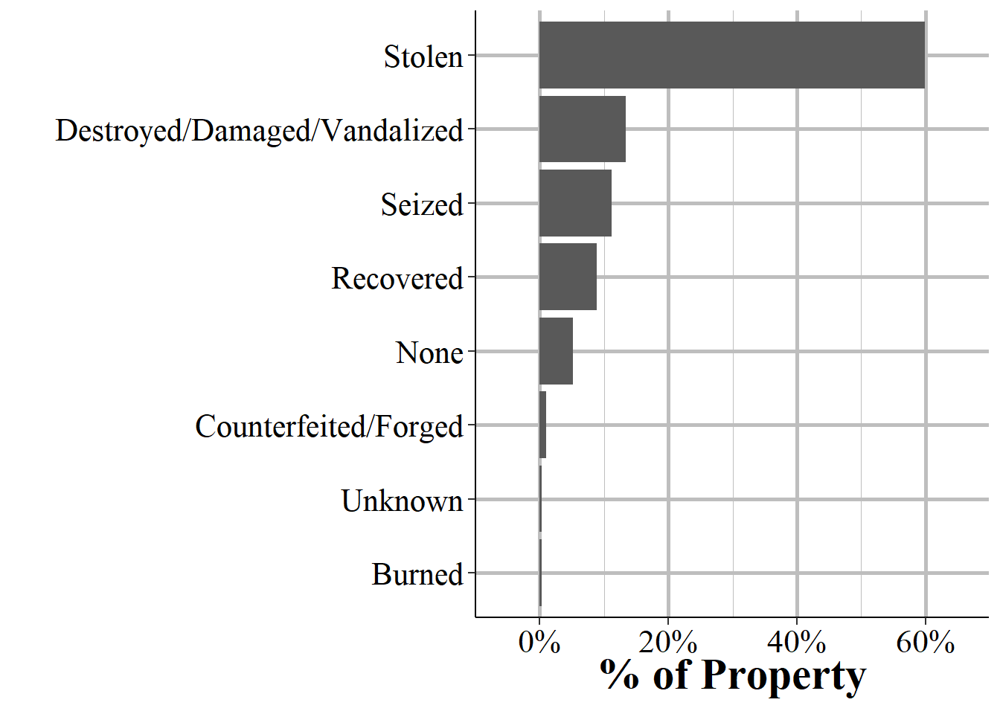
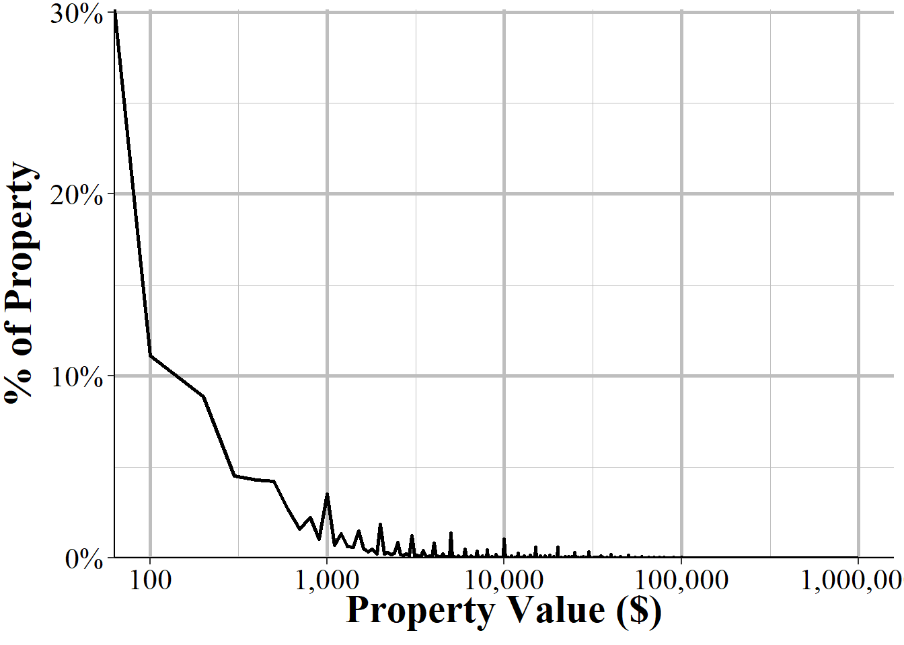
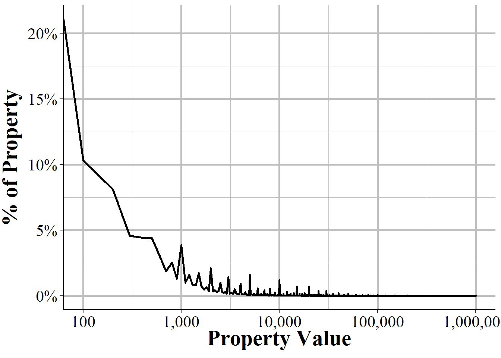
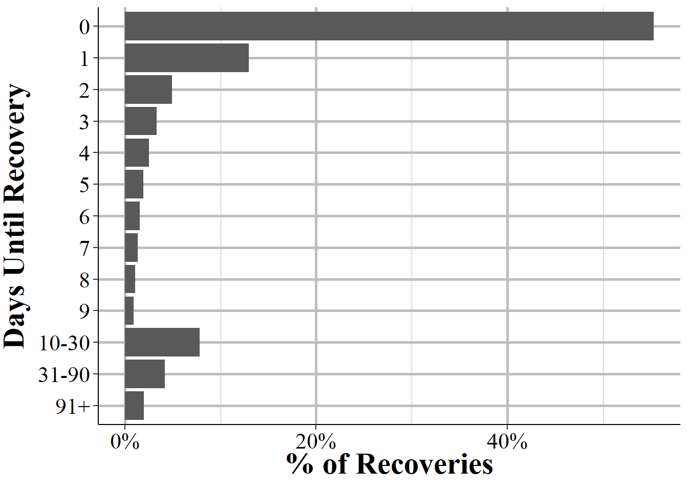
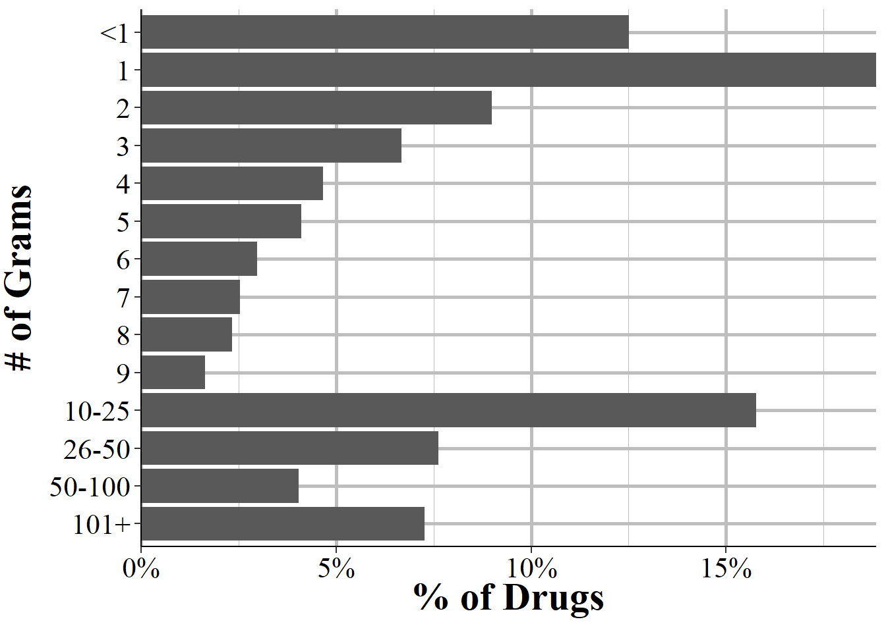

# Property and Window Property Segment {#property}

The Property Segment provides a bit more info than would be expected from the name. For each item involved in the crime it tells you what category that items falls into, with 68 total categories (including "other") ranging from explosives and pets to money and alcohol. It also tells you the estimated value of that item. This data covers more than just items stolen during a crime. For each item it tells you what happened to that item such as if it was stolen, damaged, seized by police (such as illegal items like drugs), recovered (from being stolen) by police, or burned during an arson.

For drug offenses it includes the drugs seized by police. For these offenses, the data tells us the type of drug, with 16 different drug categories ranging from specific ones like marijuana or heroin to broader categories such as "other narcotics". There can be up to three different drugs included in this data - if the person has more than three types of drugs seized then the third drug category will simply indicate that there are more than three drugs, so we learn what the first two drugs are but not the third or greater drugs are in these cases. For each drug we also know exactly how much was seized with one variable saying the amount the police found and another saying the units we should we reading that amount as (e.g. pills, grams, plants). 

## Important variables

In addition to the variables detailed below, this segment has the traditional agency and incident identifiers: the ORI code, the agency state, the year of this data, the incident number, and the incident date.

The Window Property Segment has the same variables as the normal Property Segment but also has 10 variables on each of the offenses committed (up to 10 offenses) during the incident. This is really to try to provide a bit of information that you’d otherwise get from the other segments but don’t since this is a window segment. For the rest of this chapter I’ll be using examples from the Property Segment and not the Window Property.

### Type of property loss {#propertyLoss}

This segment contains information on all property involved in the incident, other than the weapon used by the offender. Property can be involved in multiple ways - such as being stolen, destroyed, or that the stolen property is recovered by the police - so NIBRS breaks this info into seven different categories (eight when including "unknown" type). Figure \@ref(fig:propertyTypeLoss) shows each of these categories as how often they occur. The most common category, at 60.7% of the rows in this segment, is when the item is taken from the victim by the offender. This includes when the offender stole the item, took it by force in a robbery, tricked the victim (e.g. offender committed fraud), and any other way to illegal get the item (e.g. extortion, ransom, bribery). Though it includes all these types of ways to illegally take the item, it is often just called "stolen" property and I'll refer to it as such in this chapter just for simplicity of writing.  

The next most common group, at 13.3%, is when the item was seized by the police. This excludes items that were stolen and that the police recovered. It includes all types of property that the offender illegally had but is primary for drug crimes where the drug or drug equipment was seized. This segment also includes property damaged, destroyed, or vandalized by the offender and this type makes up 11.2% of the data. Following this, about 9% of rows are for recovered property which is when one of the previously stolen items is recovered by the police.

Next is "none" which only means that no property was stolen or damaged but that it could have been. For example, if someone tries to grab a person's purse but fails, that would be considered "none" since the purse wasn't actually taken. The remaining types are when the item was a counterfeit/forgery, at 1.2%, was burned (such as during an arson) at 0.2%, or when the type of loss is unknown at 0.2% 

(\#fig:propertyTypeLoss)The type of loss or if the item is recovered.

### Description of property

There are 68 different categories of properties (including the catch-all "other" category for anything not explicitly in a different category) that NIBRS covers. This also includes "identity - intangible" which means that someone stole the victim's identity. Identity isn't property since it's not a physical thing but is nonetheless included here (items related to one's identity such as social security cards are included in a different category called "identity documents"). Each of these categories can appear in any of the seven different types of property loss discussed above. For simplicity of writing, and because Table \@ref(tab:propertyStolenDescription) covers items stolen, I'll be talking below about items lost by being stolen, though everything does apply to other types of loss too. 

The property included in NIBRS can move from very broad categories like "merchandise" to more specific items such as livestock, aircraft, and pets. The property categories are mutually exclusive so a single item cannon be counted in different categories. If, for example, laptop is stolen that could potentially go in "computer hardware/software" or "office-type equipment" but it wouldn't be in both, it would only be recorded in one of the two. In cases where multiple items of the same type are stolen - such as someone stealing multiple laptops in a single crime - we don't actually know how many items were stolen. Just that at least one item of that category was stolen in the incident. We then know the total estimated value of the items stolen in that incident which we can use to estimate the number of items stolen (as long as the know the average value per item in that category) though this would be a very imprecise measure. The exception to this is for stolen vehicles where we know exactly how many were stolen and how many were recovered.

Table \@ref(tab:propertyStolenDescription) shows each of the 68 different types of property in NIBRS and shows the number of incidents where they were stolen for all incidents in the 2022 NIBRS data. Multiple different categories of property can be stolen in a single incident. The most common type of property stolen, at 14.3% of all property is "other" which isn't really that helpful to us. We know it's not one of the other 67 categories but not exactly what was stolen. Next, are money at 11.8% and then purses/handbags/wallets at 5.6%. This makes a lot of sense. People steal things for financial gain and the easiest way to get that gain is stealing money directly (or wallets and purses which often have money inside). Stealing property that you then have to sell or trade to get what you want (money or other property) is a lot harder, which is likely why it's less common. 

There are about 4.8 million rows in the Property Segment where the item was stolen (the other 3.1 million rows are about property that was seized by police, recovered, damaged, or one of the other types of property loss detailed in Section \@ref(propertyLoss)). As such, even items stolen very rarely can occur thousands or tens of thousands of times. For example, pets were the property stolen about 0.14% of the time and that tiny percent still accounts of 6,821 incidents with a pet stolen. Given the huge number of rows in this data - and as more agencies report to NIBRS this will grow quickly - it can be possible to study specific types of property, such as pets stolen, that wouldn't be possible with a more narrow dataset (both in terms of how specific the items they include are, and the size of the data). 

<table class="table table-striped" style="width: auto !important; margin-left: auto; margin-right: auto;">
<caption>(\#tab:propertyStolenDescription)The number and percent of property stolen (including forcibly taken such as during a robbery) in a crime, for all offenses in 2022. Each incident can have multiple items stolen.</caption>
 <thead>
  <tr>
   <th style="text-align:left;"> Property </th>
   <th style="text-align:right;"> # of Property Stolen </th>
   <th style="text-align:right;"> % of Property Stolen </th>
  </tr>
 </thead>
<tbody>
  <tr>
   <td style="text-align:left;"> Other </td>
   <td style="text-align:right;"> 1,149,292 </td>
   <td style="text-align:right;"> 15.09\% </td>
  </tr>
  <tr>
   <td style="text-align:left;"> Money </td>
   <td style="text-align:right;"> 824,234 </td>
   <td style="text-align:right;"> 10.82\% </td>
  </tr>
  <tr>
   <td style="text-align:left;"> Automobiles </td>
   <td style="text-align:right;"> 570,623 </td>
   <td style="text-align:right;"> 7.49\% </td>
  </tr>
  <tr>
   <td style="text-align:left;"> Vehicle Parts/Accessories </td>
   <td style="text-align:right;"> 535,780 </td>
   <td style="text-align:right;"> 7.03\% </td>
  </tr>
  <tr>
   <td style="text-align:left;"> Purses/Handbags/Wallets </td>
   <td style="text-align:right;"> 377,761 </td>
   <td style="text-align:right;"> 4.96\% </td>
  </tr>
  <tr>
   <td style="text-align:left;"> Clothes/Furs </td>
   <td style="text-align:right;"> 348,984 </td>
   <td style="text-align:right;"> 4.58\% </td>
  </tr>
  <tr>
   <td style="text-align:left;"> Credit/Debit Cards </td>
   <td style="text-align:right;"> 313,888 </td>
   <td style="text-align:right;"> 4.12\% </td>
  </tr>
  <tr>
   <td style="text-align:left;"> Tools - Power/Hand </td>
   <td style="text-align:right;"> 309,668 </td>
   <td style="text-align:right;"> 4.07\% </td>
  </tr>
  <tr>
   <td style="text-align:left;"> Merchandise </td>
   <td style="text-align:right;"> 289,078 </td>
   <td style="text-align:right;"> 3.79\% </td>
  </tr>
  <tr>
   <td style="text-align:left;"> Consumable Goods </td>
   <td style="text-align:right;"> 253,272 </td>
   <td style="text-align:right;"> 3.32\% </td>
  </tr>
  <tr>
   <td style="text-align:left;"> Identity Documents </td>
   <td style="text-align:right;"> 252,837 </td>
   <td style="text-align:right;"> 3.32\% </td>
  </tr>
  <tr>
   <td style="text-align:left;"> Portible Electronic Communications </td>
   <td style="text-align:right;"> 244,450 </td>
   <td style="text-align:right;"> 3.21\% </td>
  </tr>
  <tr>
   <td style="text-align:left;"> Computer Hardware/Software </td>
   <td style="text-align:right;"> 201,441 </td>
   <td style="text-align:right;"> 2.64\% </td>
  </tr>
  <tr>
   <td style="text-align:left;"> Household Goods </td>
   <td style="text-align:right;"> 200,120 </td>
   <td style="text-align:right;"> 2.63\% </td>
  </tr>
  <tr>
   <td style="text-align:left;"> Firearms </td>
   <td style="text-align:right;"> 170,635 </td>
   <td style="text-align:right;"> 2.24\% </td>
  </tr>
  <tr>
   <td style="text-align:left;"> Identity - Intangible </td>
   <td style="text-align:right;"> 162,824 </td>
   <td style="text-align:right;"> 2.14\% </td>
  </tr>
  <tr>
   <td style="text-align:left;"> Radios/Tvs/Vcrs </td>
   <td style="text-align:right;"> 144,002 </td>
   <td style="text-align:right;"> 1.89\% </td>
  </tr>
  <tr>
   <td style="text-align:left;"> Jewelry/Precious Metals </td>
   <td style="text-align:right;"> 141,635 </td>
   <td style="text-align:right;"> 1.86\% </td>
  </tr>
  <tr>
   <td style="text-align:left;"> Bicycles </td>
   <td style="text-align:right;"> 123,395 </td>
   <td style="text-align:right;"> 1.62\% </td>
  </tr>
  <tr>
   <td style="text-align:left;"> Documents - Personal Or Business </td>
   <td style="text-align:right;"> 94,572 </td>
   <td style="text-align:right;"> 1.24\% </td>
  </tr>
  <tr>
   <td style="text-align:left;"> Trucks </td>
   <td style="text-align:right;"> 93,364 </td>
   <td style="text-align:right;"> 1.23\% </td>
  </tr>
  <tr>
   <td style="text-align:left;"> Alcohol </td>
   <td style="text-align:right;"> 75,575 </td>
   <td style="text-align:right;"> 0.99\% </td>
  </tr>
  <tr>
   <td style="text-align:left;"> Other Motor Vehicles </td>
   <td style="text-align:right;"> 59,593 </td>
   <td style="text-align:right;"> 0.78\% </td>
  </tr>
  <tr>
   <td style="text-align:left;"> Negotiable Instruments </td>
   <td style="text-align:right;"> 54,250 </td>
   <td style="text-align:right;"> 0.71\% </td>
  </tr>
  <tr>
   <td style="text-align:left;"> Office-Type Equipment </td>
   <td style="text-align:right;"> 53,825 </td>
   <td style="text-align:right;"> 0.71\% </td>
  </tr>
  <tr>
   <td style="text-align:left;"> Lawn/Yard/Garden Equipment </td>
   <td style="text-align:right;"> 47,867 </td>
   <td style="text-align:right;"> 0.63\% </td>
  </tr>
  <tr>
   <td style="text-align:left;"> Trailers </td>
   <td style="text-align:right;"> 45,526 </td>
   <td style="text-align:right;"> 0.60\% </td>
  </tr>
  <tr>
   <td style="text-align:left;"> Building Materials </td>
   <td style="text-align:right;"> 43,258 </td>
   <td style="text-align:right;"> 0.57\% </td>
  </tr>
  <tr>
   <td style="text-align:left;"> Drugs/Narcotics </td>
   <td style="text-align:right;"> 42,540 </td>
   <td style="text-align:right;"> 0.56\% </td>
  </tr>
  <tr>
   <td style="text-align:left;"> Recreational/Sports Equipment </td>
   <td style="text-align:right;"> 40,414 </td>
   <td style="text-align:right;"> 0.53\% </td>
  </tr>
  <tr>
   <td style="text-align:left;"> Nonnegotiable Instruments </td>
   <td style="text-align:right;"> 31,060 </td>
   <td style="text-align:right;"> 0.41\% </td>
  </tr>
  <tr>
   <td style="text-align:left;"> Fuel </td>
   <td style="text-align:right;"> 30,233 </td>
   <td style="text-align:right;"> 0.40\% </td>
  </tr>
  <tr>
   <td style="text-align:left;"> Camping/Hunting/Fishing Equipment/Supplies </td>
   <td style="text-align:right;"> 28,371 </td>
   <td style="text-align:right;"> 0.37\% </td>
  </tr>
  <tr>
   <td style="text-align:left;"> Photographic/Optical Equipment </td>
   <td style="text-align:right;"> 27,502 </td>
   <td style="text-align:right;"> 0.36\% </td>
  </tr>
  <tr>
   <td style="text-align:left;"> Heavy Construction/Industrial Equipment </td>
   <td style="text-align:right;"> 24,878 </td>
   <td style="text-align:right;"> 0.33\% </td>
  </tr>
  <tr>
   <td style="text-align:left;"> Metals, Non-Precious </td>
   <td style="text-align:right;"> 18,589 </td>
   <td style="text-align:right;"> 0.24\% </td>
  </tr>
  <tr>
   <td style="text-align:left;"> Collections/Collectibles </td>
   <td style="text-align:right;"> 18,126 </td>
   <td style="text-align:right;"> 0.24\% </td>
  </tr>
  <tr>
   <td style="text-align:left;"> Firearm Accessories </td>
   <td style="text-align:right;"> 18,115 </td>
   <td style="text-align:right;"> 0.24\% </td>
  </tr>
  <tr>
   <td style="text-align:left;"> Weapons - Other </td>
   <td style="text-align:right;"> 17,843 </td>
   <td style="text-align:right;"> 0.23\% </td>
  </tr>
  <tr>
   <td style="text-align:left;"> Pending Inventory (Of Property) </td>
   <td style="text-align:right;"> 17,818 </td>
   <td style="text-align:right;"> 0.23\% </td>
  </tr>
  <tr>
   <td style="text-align:left;"> Recordings - Audio/Visual </td>
   <td style="text-align:right;"> 17,146 </td>
   <td style="text-align:right;"> 0.23\% </td>
  </tr>
  <tr>
   <td style="text-align:left;"> Medical/Medical Lab Equipment </td>
   <td style="text-align:right;"> 13,153 </td>
   <td style="text-align:right;"> 0.17\% </td>
  </tr>
  <tr>
   <td style="text-align:left;"> Musical Instruments </td>
   <td style="text-align:right;"> 12,275 </td>
   <td style="text-align:right;"> 0.16\% </td>
  </tr>
  <tr>
   <td style="text-align:left;"> Recreational Vehicles </td>
   <td style="text-align:right;"> 11,395 </td>
   <td style="text-align:right;"> 0.15\% </td>
  </tr>
  <tr>
   <td style="text-align:left;"> Pets </td>
   <td style="text-align:right;"> 11,368 </td>
   <td style="text-align:right;"> 0.15\% </td>
  </tr>
  <tr>
   <td style="text-align:left;"> Farm Equipment </td>
   <td style="text-align:right;"> 8,892 </td>
   <td style="text-align:right;"> 0.12\% </td>
  </tr>
  <tr>
   <td style="text-align:left;"> Artistic Supplies/Accessories </td>
   <td style="text-align:right;"> 6,265 </td>
   <td style="text-align:right;"> 0.08\% </td>
  </tr>
  <tr>
   <td style="text-align:left;"> Chemicals </td>
   <td style="text-align:right;"> 5,326 </td>
   <td style="text-align:right;"> 0.07\% </td>
  </tr>
  <tr>
   <td style="text-align:left;"> Explosives </td>
   <td style="text-align:right;"> 4,542 </td>
   <td style="text-align:right;"> 0.06\% </td>
  </tr>
  <tr>
   <td style="text-align:left;"> Gambling Equipment </td>
   <td style="text-align:right;"> 4,482 </td>
   <td style="text-align:right;"> 0.06\% </td>
  </tr>
  <tr>
   <td style="text-align:left;"> Watercraft </td>
   <td style="text-align:right;"> 4,064 </td>
   <td style="text-align:right;"> 0.05\% </td>
  </tr>
  <tr>
   <td style="text-align:left;"> Drug/Narcotic Equipment </td>
   <td style="text-align:right;"> 4,000 </td>
   <td style="text-align:right;"> 0.05\% </td>
  </tr>
  <tr>
   <td style="text-align:left;"> Watercraft Equipment/Parts/Accessories </td>
   <td style="text-align:right;"> 3,186 </td>
   <td style="text-align:right;"> 0.04\% </td>
  </tr>
  <tr>
   <td style="text-align:left;"> Law Enforcement Equipment </td>
   <td style="text-align:right;"> 2,773 </td>
   <td style="text-align:right;"> 0.04\% </td>
  </tr>
  <tr>
   <td style="text-align:left;"> Livestock </td>
   <td style="text-align:right;"> 2,242 </td>
   <td style="text-align:right;"> 0.03\% </td>
  </tr>
  <tr>
   <td style="text-align:left;"> Logging Equipment </td>
   <td style="text-align:right;"> 1,470 </td>
   <td style="text-align:right;"> 0.02\% </td>
  </tr>
  <tr>
   <td style="text-align:left;"> Structures - Other </td>
   <td style="text-align:right;"> 1,311 </td>
   <td style="text-align:right;"> 0.02\% </td>
  </tr>
  <tr>
   <td style="text-align:left;"> Crops </td>
   <td style="text-align:right;"> 1,199 </td>
   <td style="text-align:right;"> 0.02\% </td>
  </tr>
  <tr>
   <td style="text-align:left;"> Buses </td>
   <td style="text-align:right;"> 1,121 </td>
   <td style="text-align:right;"> 0.01\% </td>
  </tr>
  <tr>
   <td style="text-align:left;"> Aircraft Parts/Accessories </td>
   <td style="text-align:right;"> 1,053 </td>
   <td style="text-align:right;"> 0.01\% </td>
  </tr>
  <tr>
   <td style="text-align:left;"> Structures - Single Occupancy Dwellings </td>
   <td style="text-align:right;"> 624 </td>
   <td style="text-align:right;"> 0.01\% </td>
  </tr>
  <tr>
   <td style="text-align:left;"> Structures - Storage </td>
   <td style="text-align:right;"> 546 </td>
   <td style="text-align:right;"> 0.01\% </td>
  </tr>
  <tr>
   <td style="text-align:left;"> Aircraft </td>
   <td style="text-align:right;"> 491 </td>
   <td style="text-align:right;"> 0.01\% </td>
  </tr>
  <tr>
   <td style="text-align:left;"> Structures - Commercial/Business </td>
   <td style="text-align:right;"> 438 </td>
   <td style="text-align:right;"> 0.01\% </td>
  </tr>
  <tr>
   <td style="text-align:left;"> Structures - Other Dwellings </td>
   <td style="text-align:right;"> 348 </td>
   <td style="text-align:right;"> 0.00\% </td>
  </tr>
  <tr>
   <td style="text-align:left;"> Special Category </td>
   <td style="text-align:right;"> 281 </td>
   <td style="text-align:right;"> 0.00\% </td>
  </tr>
  <tr>
   <td style="text-align:left;"> Structures - Industrial Manufacturing </td>
   <td style="text-align:right;"> 224 </td>
   <td style="text-align:right;"> 0.00\% </td>
  </tr>
  <tr>
   <td style="text-align:left;"> Structures - Public/Community </td>
   <td style="text-align:right;"> 207 </td>
   <td style="text-align:right;"> 0.00\% </td>
  </tr>
  <tr>
   <td style="text-align:left;"> Total </td>
   <td style="text-align:right;"> 7,617,660 </td>
   <td style="text-align:right;"> 100\% </td>
  </tr>
</tbody>
</table>

As seen in Table \@ref(tab:propertySeizedDescription), all of the 68 different types of properties available in NIBRS can and, in 2022, were seized by police during an incident at least once. This includes atypical property like building material, musical instruments, and pets (and leads me to think that at least some of this is incorrectly labeled as property seized by the police). The vast majority of property seized by police, however, is drugs. 63.2% of the property seized were drugs themselves while 27.3% were equipment related to the drugs. The remaining items were mostly "other" (i.e. anything not explicitly categorized here) at 2.6%, money at 2%, firearms at 0.9%, and then a bunch of very rarely seized items. 

<table class="table table-striped" style="width: auto !important; margin-left: auto; margin-right: auto;">
<caption>(\#tab:propertySeizedDescription)The number and percent of property seized by police (excludes recovering property that was stolen, for all offenses in 2022. Each incident can have multiple items seized.</caption>
 <thead>
  <tr>
   <th style="text-align:left;"> Property </th>
   <th style="text-align:right;"> # of Property Seized </th>
   <th style="text-align:right;"> % of Property Seized </th>
  </tr>
 </thead>
<tbody>
  <tr>
   <td style="text-align:left;"> Drugs/Narcotics </td>
   <td style="text-align:right;"> 916,616 </td>
   <td style="text-align:right;"> 63.68\% </td>
  </tr>
  <tr>
   <td style="text-align:left;"> Drug/Narcotic Equipment </td>
   <td style="text-align:right;"> 391,785 </td>
   <td style="text-align:right;"> 27.22\% </td>
  </tr>
  <tr>
   <td style="text-align:left;"> Other </td>
   <td style="text-align:right;"> 37,857 </td>
   <td style="text-align:right;"> 2.63\% </td>
  </tr>
  <tr>
   <td style="text-align:left;"> Money </td>
   <td style="text-align:right;"> 21,762 </td>
   <td style="text-align:right;"> 1.51\% </td>
  </tr>
  <tr>
   <td style="text-align:left;"> Firearms </td>
   <td style="text-align:right;"> 17,471 </td>
   <td style="text-align:right;"> 1.21\% </td>
  </tr>
  <tr>
   <td style="text-align:left;"> Portible Electronic Communications </td>
   <td style="text-align:right;"> 7,798 </td>
   <td style="text-align:right;"> 0.54\% </td>
  </tr>
  <tr>
   <td style="text-align:left;"> Firearm Accessories </td>
   <td style="text-align:right;"> 4,740 </td>
   <td style="text-align:right;"> 0.33\% </td>
  </tr>
  <tr>
   <td style="text-align:left;"> Automobiles </td>
   <td style="text-align:right;"> 4,037 </td>
   <td style="text-align:right;"> 0.28\% </td>
  </tr>
  <tr>
   <td style="text-align:left;"> Documents - Personal Or Business </td>
   <td style="text-align:right;"> 3,580 </td>
   <td style="text-align:right;"> 0.25\% </td>
  </tr>
  <tr>
   <td style="text-align:left;"> Identity Documents </td>
   <td style="text-align:right;"> 3,477 </td>
   <td style="text-align:right;"> 0.24\% </td>
  </tr>
  <tr>
   <td style="text-align:left;"> Purses/Handbags/Wallets </td>
   <td style="text-align:right;"> 2,852 </td>
   <td style="text-align:right;"> 0.20\% </td>
  </tr>
  <tr>
   <td style="text-align:left;"> Weapons - Other </td>
   <td style="text-align:right;"> 2,699 </td>
   <td style="text-align:right;"> 0.19\% </td>
  </tr>
  <tr>
   <td style="text-align:left;"> Credit/Debit Cards </td>
   <td style="text-align:right;"> 1,981 </td>
   <td style="text-align:right;"> 0.14\% </td>
  </tr>
  <tr>
   <td style="text-align:left;"> Consumable Goods </td>
   <td style="text-align:right;"> 1,954 </td>
   <td style="text-align:right;"> 0.14\% </td>
  </tr>
  <tr>
   <td style="text-align:left;"> Office-Type Equipment </td>
   <td style="text-align:right;"> 1,899 </td>
   <td style="text-align:right;"> 0.13\% </td>
  </tr>
  <tr>
   <td style="text-align:left;"> Vehicle Parts/Accessories </td>
   <td style="text-align:right;"> 1,712 </td>
   <td style="text-align:right;"> 0.12\% </td>
  </tr>
  <tr>
   <td style="text-align:left;"> Negotiable Instruments </td>
   <td style="text-align:right;"> 1,521 </td>
   <td style="text-align:right;"> 0.11\% </td>
  </tr>
  <tr>
   <td style="text-align:left;"> Recordings - Audio/Visual </td>
   <td style="text-align:right;"> 1,505 </td>
   <td style="text-align:right;"> 0.10\% </td>
  </tr>
  <tr>
   <td style="text-align:left;"> Computer Hardware/Software </td>
   <td style="text-align:right;"> 1,494 </td>
   <td style="text-align:right;"> 0.10\% </td>
  </tr>
  <tr>
   <td style="text-align:left;"> Alcohol </td>
   <td style="text-align:right;"> 1,433 </td>
   <td style="text-align:right;"> 0.10\% </td>
  </tr>
  <tr>
   <td style="text-align:left;"> Clothes/Furs </td>
   <td style="text-align:right;"> 1,350 </td>
   <td style="text-align:right;"> 0.09\% </td>
  </tr>
  <tr>
   <td style="text-align:left;"> Household Goods </td>
   <td style="text-align:right;"> 1,300 </td>
   <td style="text-align:right;"> 0.09\% </td>
  </tr>
  <tr>
   <td style="text-align:left;"> Explosives </td>
   <td style="text-align:right;"> 1,267 </td>
   <td style="text-align:right;"> 0.09\% </td>
  </tr>
  <tr>
   <td style="text-align:left;"> Tools - Power/Hand </td>
   <td style="text-align:right;"> 1,131 </td>
   <td style="text-align:right;"> 0.08\% </td>
  </tr>
  <tr>
   <td style="text-align:left;"> Nonnegotiable Instruments </td>
   <td style="text-align:right;"> 1,106 </td>
   <td style="text-align:right;"> 0.08\% </td>
  </tr>
  <tr>
   <td style="text-align:left;"> Merchandise </td>
   <td style="text-align:right;"> 525 </td>
   <td style="text-align:right;"> 0.04\% </td>
  </tr>
  <tr>
   <td style="text-align:left;"> Gambling Equipment </td>
   <td style="text-align:right;"> 503 </td>
   <td style="text-align:right;"> 0.03\% </td>
  </tr>
  <tr>
   <td style="text-align:left;"> Radios/Tvs/Vcrs </td>
   <td style="text-align:right;"> 467 </td>
   <td style="text-align:right;"> 0.03\% </td>
  </tr>
  <tr>
   <td style="text-align:left;"> Heavy Construction/Industrial Equipment </td>
   <td style="text-align:right;"> 407 </td>
   <td style="text-align:right;"> 0.03\% </td>
  </tr>
  <tr>
   <td style="text-align:left;"> Other Motor Vehicles </td>
   <td style="text-align:right;"> 363 </td>
   <td style="text-align:right;"> 0.03\% </td>
  </tr>
  <tr>
   <td style="text-align:left;"> Jewelry/Precious Metals </td>
   <td style="text-align:right;"> 358 </td>
   <td style="text-align:right;"> 0.02\% </td>
  </tr>
  <tr>
   <td style="text-align:left;"> Medical/Medical Lab Equipment </td>
   <td style="text-align:right;"> 329 </td>
   <td style="text-align:right;"> 0.02\% </td>
  </tr>
  <tr>
   <td style="text-align:left;"> Trucks </td>
   <td style="text-align:right;"> 274 </td>
   <td style="text-align:right;"> 0.02\% </td>
  </tr>
  <tr>
   <td style="text-align:left;"> Photographic/Optical Equipment </td>
   <td style="text-align:right;"> 231 </td>
   <td style="text-align:right;"> 0.02\% </td>
  </tr>
  <tr>
   <td style="text-align:left;"> Identity - Intangible </td>
   <td style="text-align:right;"> 217 </td>
   <td style="text-align:right;"> 0.02\% </td>
  </tr>
  <tr>
   <td style="text-align:left;"> Chemicals </td>
   <td style="text-align:right;"> 181 </td>
   <td style="text-align:right;"> 0.01\% </td>
  </tr>
  <tr>
   <td style="text-align:left;"> Bicycles </td>
   <td style="text-align:right;"> 160 </td>
   <td style="text-align:right;"> 0.01\% </td>
  </tr>
  <tr>
   <td style="text-align:left;"> Pending Inventory (Of Property) </td>
   <td style="text-align:right;"> 142 </td>
   <td style="text-align:right;"> 0.01\% </td>
  </tr>
  <tr>
   <td style="text-align:left;"> Camping/Hunting/Fishing Equipment/Supplies </td>
   <td style="text-align:right;"> 96 </td>
   <td style="text-align:right;"> 0.01\% </td>
  </tr>
  <tr>
   <td style="text-align:left;"> Collections/Collectibles </td>
   <td style="text-align:right;"> 94 </td>
   <td style="text-align:right;"> 0.01\% </td>
  </tr>
  <tr>
   <td style="text-align:left;"> Recreational/Sports Equipment </td>
   <td style="text-align:right;"> 81 </td>
   <td style="text-align:right;"> 0.01\% </td>
  </tr>
  <tr>
   <td style="text-align:left;"> Law Enforcement Equipment </td>
   <td style="text-align:right;"> 68 </td>
   <td style="text-align:right;"> 0.00\% </td>
  </tr>
  <tr>
   <td style="text-align:left;"> Metals, Non-Precious </td>
   <td style="text-align:right;"> 54 </td>
   <td style="text-align:right;"> 0.00\% </td>
  </tr>
  <tr>
   <td style="text-align:left;"> Farm Equipment </td>
   <td style="text-align:right;"> 54 </td>
   <td style="text-align:right;"> 0.00\% </td>
  </tr>
  <tr>
   <td style="text-align:left;"> Artistic Supplies/Accessories </td>
   <td style="text-align:right;"> 53 </td>
   <td style="text-align:right;"> 0.00\% </td>
  </tr>
  <tr>
   <td style="text-align:left;"> Building Materials </td>
   <td style="text-align:right;"> 49 </td>
   <td style="text-align:right;"> 0.00\% </td>
  </tr>
  <tr>
   <td style="text-align:left;"> Trailers </td>
   <td style="text-align:right;"> 45 </td>
   <td style="text-align:right;"> 0.00\% </td>
  </tr>
  <tr>
   <td style="text-align:left;"> Structures - Other </td>
   <td style="text-align:right;"> 40 </td>
   <td style="text-align:right;"> 0.00\% </td>
  </tr>
  <tr>
   <td style="text-align:left;"> Recreational Vehicles </td>
   <td style="text-align:right;"> 34 </td>
   <td style="text-align:right;"> 0.00\% </td>
  </tr>
  <tr>
   <td style="text-align:left;"> Crops </td>
   <td style="text-align:right;"> 29 </td>
   <td style="text-align:right;"> 0.00\% </td>
  </tr>
  <tr>
   <td style="text-align:left;"> Lawn/Yard/Garden Equipment </td>
   <td style="text-align:right;"> 29 </td>
   <td style="text-align:right;"> 0.00\% </td>
  </tr>
  <tr>
   <td style="text-align:left;"> Fuel </td>
   <td style="text-align:right;"> 23 </td>
   <td style="text-align:right;"> 0.00\% </td>
  </tr>
  <tr>
   <td style="text-align:left;"> Structures - Storage </td>
   <td style="text-align:right;"> 20 </td>
   <td style="text-align:right;"> 0.00\% </td>
  </tr>
  <tr>
   <td style="text-align:left;"> Aircraft </td>
   <td style="text-align:right;"> 17 </td>
   <td style="text-align:right;"> 0.00\% </td>
  </tr>
  <tr>
   <td style="text-align:left;"> Musical Instruments </td>
   <td style="text-align:right;"> 16 </td>
   <td style="text-align:right;"> 0.00\% </td>
  </tr>
  <tr>
   <td style="text-align:left;"> Pets </td>
   <td style="text-align:right;"> 11 </td>
   <td style="text-align:right;"> 0.00\% </td>
  </tr>
  <tr>
   <td style="text-align:left;"> Aircraft Parts/Accessories </td>
   <td style="text-align:right;"> 10 </td>
   <td style="text-align:right;"> 0.00\% </td>
  </tr>
  <tr>
   <td style="text-align:left;"> Livestock </td>
   <td style="text-align:right;"> 9 </td>
   <td style="text-align:right;"> 0.00\% </td>
  </tr>
  <tr>
   <td style="text-align:left;"> Structures - Public/Community </td>
   <td style="text-align:right;"> 8 </td>
   <td style="text-align:right;"> 0.00\% </td>
  </tr>
  <tr>
   <td style="text-align:left;"> Structures - Commercial/Business </td>
   <td style="text-align:right;"> 7 </td>
   <td style="text-align:right;"> 0.00\% </td>
  </tr>
  <tr>
   <td style="text-align:left;"> Buses </td>
   <td style="text-align:right;"> 6 </td>
   <td style="text-align:right;"> 0.00\% </td>
  </tr>
  <tr>
   <td style="text-align:left;"> Watercraft Equipment/Parts/Accessories </td>
   <td style="text-align:right;"> 6 </td>
   <td style="text-align:right;"> 0.00\% </td>
  </tr>
  <tr>
   <td style="text-align:left;"> Structures - Industrial Manufacturing </td>
   <td style="text-align:right;"> 4 </td>
   <td style="text-align:right;"> 0.00\% </td>
  </tr>
  <tr>
   <td style="text-align:left;"> Structures - Single Occupancy Dwellings </td>
   <td style="text-align:right;"> 4 </td>
   <td style="text-align:right;"> 0.00\% </td>
  </tr>
  <tr>
   <td style="text-align:left;"> Logging Equipment </td>
   <td style="text-align:right;"> 4 </td>
   <td style="text-align:right;"> 0.00\% </td>
  </tr>
  <tr>
   <td style="text-align:left;"> Watercraft </td>
   <td style="text-align:right;"> 3 </td>
   <td style="text-align:right;"> 0.00\% </td>
  </tr>
  <tr>
   <td style="text-align:left;"> Structures - Other Dwellings </td>
   <td style="text-align:right;"> 3 </td>
   <td style="text-align:right;"> 0.00\% </td>
  </tr>
  <tr>
   <td style="text-align:left;"> Special Category </td>
   <td style="text-align:right;"> 2 </td>
   <td style="text-align:right;"> 0.00\% </td>
  </tr>
  <tr>
   <td style="text-align:left;"> Total </td>
   <td style="text-align:right;"> 1,439,363 </td>
   <td style="text-align:right;"> 100\% </td>
  </tr>
</tbody>
</table>

### Value of stolen property

For all types of property loss other than the property being seized by the police (and when the type is "unknown") there is data on the estimated value of that property. This is estimates by the police but is supposed to be the current value of the item (e.g. a stolen car is what it currently sells for, not what the buyer bought it for) and is the cost it'll take for the victim to replace the item. To be a bit more specific, this variable is the sum of items stolen in this category. For example, if someone burglarizes a house and steals three rings from the victim, this would not count as three thefts of a ring. It would be recorded as loss of jewelry and the value would be the total value of all three rings.

The police can take the victim's estimation into consideration but aren't supposed to immediately accept it as victims may exaggerate values (especially for insurance purposes). When items are recovered, the police put in the value at the time of recovery which may be substantially different than at the time of the loss if the item is damaged or destroyed.

We can use this variable to look at the value of items lost by the victim. Figure \@ref(fig:propertyValuePropertyLevel) looks at the value per item stolen in a crime (if incidents have multiple items stolen, this counts them all separately). This includes items lost by theft, robbery, and burglary so is part of the "Stolen/Robbed/Etc." category of types of property loss. It excludes items damaged or destroyed or burned (there is info about the value of property in these incidents but these are not shown in the figure). To make this graph a bit simpler I've rounded all values to the nearest \$100 so items valued at \$0 mean that they are worth between \$1 and \$50. I've also capped the largest value to \$1,000,000 and set the x-axis on the log scale since the data skews very much to the right. The average item lost was worth \$3,217 and the median was worth \$150. Most items lost were relative cheap with 34.9% worth under \$50 and 13.5% worth between \$51 and \$149. There is a sharp decline in the frequency of property stolen as the value increases. So while some extremely valuable items are lost during crimes, they are much less common than relatively low-value items. 

(\#fig:propertyValuePropertyLevel)The distribution of the value of property stolen. Values are capped at 1,000,000 and each value is rounded to the nearest 100. The x-axis is set on the log scale as this distribution is hugely right skewed.

Since multiple items can be stolen in a single incident, to better understand the cost of crime for the victim we probably want to add up all of the property to the incident-level. Figure \@ref(fig:propertyValuePropertyLevel) does this and shows the cost of property stolen per incident. The trend is nearly identical to Figure \@ref(tab:propertySeizedDescription) but the value is a bit higher than before. Now fewer than a quarter of incidents result in a loss of <\$50 and the average cost per incident is \$4,731 (median = \$300).

(\#fig:propertyValueIncidentLevel)The incident-level distribution of the value of property stolen. As values are aggregated to the incident-level, these are higher than the above graph which shows each item individually. Values are capped at 1,000,000 and each value is rounded to the nearest 100. The x-axis is set on the log scale as this distribution is hugely right skewed.

### Date property was recovered

This segment tells us both when the incident happened and, for stolen property, when the item was recovered. We can use this to look at how long it generally takes for property to be recovered (though most property stolen is never recovered). Figure \@ref(fig:propertyDaysUntilRecovered) shows the number of days it takes for property to be recovered. Though this data gives us the exact date, allowing for the precise number of days from property loss to recovery, this graph groups days greater than nine days to simplify the graph. The maximum number of days in the 2022 NIBRS data is 450 days so showing all days would be a rather unhelpful graph.   

The majority - 60.8% - of property lost is recovered on the same day, which is shown as zero days. We saw in Figure \@ref(fig:arrestsDaysUntilArrest) that the vast majority of arrests happen on the same day as the incident so it makes sense the most property would too.^[I'd expect most property to be recovered on the arrestee's body.] A smaller and smaller share of property is recovered as the number of days from the incident increase, a trend also found in the time to arrest graph. The lesson here seems to be that if you're a victim of a crime and had something taken, unless it's recovered very quickly it's unlikely to be recovered at all. 

(\#fig:propertyDaysUntilRecovered)The distribution of the number of days from the incident to the property recovered date. In 2022 the maximum days from incident to arrest was 456 days. Zero days means that the arrest occurred on the same day as the incident. 

### Drugs

This segment also provides information about drugs seized by the police. This also includes cases where the police would have seized the drugs if the offender didn't destroy it somehow, such as flushing it down the toilet. For each drug seized there is information on what type of drug it was and how much of the drug was seized. There can be up to three drugs seized in an incident and data is available for each type of drug. The exception, however, is when there are more than three drugs seized in an incident. In that case, info on the third drug just says that there were more than three drugs involved. So you'd have info on the first two drugs but none on the third through however many (and it doesn't say how many) drugs. For the below table and figure I only look at the first drug seized, so the numbers shown are undercounts. 

The ordering of drugs when there are multiple drugs is based on how much drugs were recovered and the seriousness of the drugs. For example, heroin is probably considered more serious than marijuana, but overall ranking of drugs is a subjective assessment depending on the department. Is heroin more serious than meth? That decision likely varies by the agency and their situation in regard to what drugs they often seize. 

#### Suspected drug type

The drugs in NIBRS are the "suspected drug types" which means that they are what the police believe the drugs to be, even if there is not definitive proof (such as a crime lab testing for what type of drug it is) that the drug is what they say it is. There are 15 possible drug types in NIBRS (16 when including "unknown drug type") and each is shown in Table \@ref(tab:propertyDrugs) along with how often they occur in the data. Some of these drug types are specific enough to only include a single drug while others are groups of drug types, such as hallucinogens or stimulants (and they include all of these types other than specifically stated drugs).

Not too surprising, marijuana is the most common drug seized at 47% - or 455k incidents with it seized - of the data. This is followed by amphetamines/methamphetamines (including what we'd normally just call meth) at 20.7% and then heroin at 8.5%. Interestingly, cocaine and crack cocaine (which are always separate categories) both occur in 5.09% of drugs seized. Given the large disparity in sentences for these types of drugs, and that "crack wars" were a major purported cause of violent crime in the 1980s and 1990s, I expected crack cocaine to be much more common than normal cocaine. The remaining drug types are all less than 5% of drugs seized each and has some groupings of drug types (e.g. stimulants) rather than specific drug types (though some of these categories, such as LSD, are specific drugs). 

<table class="table table-striped" style="width: auto !important; margin-left: auto; margin-right: auto;">
<caption>(\#tab:propertyDrugs)The number and percent of drugs seized by police by type of drug, for all drugs seized in 2022.</caption>
 <thead>
  <tr>
   <th style="text-align:left;"> Drug Type </th>
   <th style="text-align:right;"> \# of Drugs </th>
   <th style="text-align:right;"> \% of Drugs </th>
  </tr>
 </thead>
<tbody>
  <tr>
   <td style="text-align:left;"> Marijuana </td>
   <td style="text-align:right;"> 557,044 </td>
   <td style="text-align:right;"> 44.09\% </td>
  </tr>
  <tr>
   <td style="text-align:left;"> Amphetamines/Methamphetamines </td>
   <td style="text-align:right;"> 301,759 </td>
   <td style="text-align:right;"> 23.88\% </td>
  </tr>
  <tr>
   <td style="text-align:left;"> Other Narcotics: Codeine, Demerol, Dihydromorphinone Or Dilaudid, Hydrocodone Or Percodan, Methadone, Etc. </td>
   <td style="text-align:right;"> 78,941 </td>
   <td style="text-align:right;"> 6.25\% </td>
  </tr>
  <tr>
   <td style="text-align:left;"> Cocaine (All Forms Except Crack) </td>
   <td style="text-align:right;"> 73,157 </td>
   <td style="text-align:right;"> 5.79\% </td>
  </tr>
  <tr>
   <td style="text-align:left;"> Heroin </td>
   <td style="text-align:right;"> 68,859 </td>
   <td style="text-align:right;"> 5.45\% </td>
  </tr>
  <tr>
   <td style="text-align:left;"> Crack Cocaine </td>
   <td style="text-align:right;"> 64,853 </td>
   <td style="text-align:right;"> 5.13\% </td>
  </tr>
  <tr>
   <td style="text-align:left;"> Other Drugs: Antidepressants (Elavil, Triavil, Tofranil, Etc.), Aromatic Hydrocarbons, Propoxyphene Or Darvon, Tranquilizers (Chlordiazepoxide Or Librium, Diazepam Or Valium, Etc.), Etc. </td>
   <td style="text-align:right;"> 47,748 </td>
   <td style="text-align:right;"> 3.78\% </td>
  </tr>
  <tr>
   <td style="text-align:left;"> Unknown Type Drug </td>
   <td style="text-align:right;"> 26,787 </td>
   <td style="text-align:right;"> 2.12\% </td>
  </tr>
  <tr>
   <td style="text-align:left;"> Opium </td>
   <td style="text-align:right;"> 11,881 </td>
   <td style="text-align:right;"> 0.94\% </td>
  </tr>
  <tr>
   <td style="text-align:left;"> Other Hallucinogrens: BMDA (White Acid), DMT, MDA, MDMA, Mescaline Or Peyote, Psilocybin, STP, Etc. </td>
   <td style="text-align:right;"> 8,799 </td>
   <td style="text-align:right;"> 0.70\% </td>
  </tr>
  <tr>
   <td style="text-align:left;"> Hashish </td>
   <td style="text-align:right;"> 6,963 </td>
   <td style="text-align:right;"> 0.55\% </td>
  </tr>
  <tr>
   <td style="text-align:left;"> Other Depressants: Glutethimide Or Doriden, Methaqualone Or Quaalude, Pentazocine Or Talwin, Etc. </td>
   <td style="text-align:right;"> 6,825 </td>
   <td style="text-align:right;"> 0.54\% </td>
  </tr>
  <tr>
   <td style="text-align:left;"> Other Stimulants: Adipex, Fastine And Ionamin (Derivatives of Phentermine), Benzedrine, Didrex, Methylphenidate Or Ritalin, Phenmetrazine Or Preludin, Tenuate, Etc. </td>
   <td style="text-align:right;"> 3,996 </td>
   <td style="text-align:right;"> 0.32\% </td>
  </tr>
  <tr>
   <td style="text-align:left;"> Barbiturates </td>
   <td style="text-align:right;"> 1,582 </td>
   <td style="text-align:right;"> 0.13\% </td>
  </tr>
  <tr>
   <td style="text-align:left;"> PCP </td>
   <td style="text-align:right;"> 1,510 </td>
   <td style="text-align:right;"> 0.12\% </td>
  </tr>
  <tr>
   <td style="text-align:left;"> LSD </td>
   <td style="text-align:right;"> 1,461 </td>
   <td style="text-align:right;"> 0.12\% </td>
  </tr>
  <tr>
   <td style="text-align:left;"> Morphine </td>
   <td style="text-align:right;"> 1,271 </td>
   <td style="text-align:right;"> 0.10\% </td>
  </tr>
  <tr>
   <td style="text-align:left;"> Total </td>
   <td style="text-align:right;"> 1,263,436 </td>
   <td style="text-align:right;"> 100\% </td>
  </tr>
</tbody>
</table>

#### Amount of drugs

For each drug type we know exactly how much was seized (at least we do other than for the 6.7% where the amount is "not reported"). Since different drug types are measured in different ways, this data also tells us what units the amount seized is in. So you'll need to look at both the amount and the units to understand how much drugs were actually seized. The possible units are listed below:   

* Dosage Unit/Items (Pills, Etc.)
* Fluid Ounce
* Gallon                   
* Gram
* Kilogram       
* Liter                   
* Milliliter
* Number of Plants           
* Ounce
* Pound

Once you know the units you can look at the amount of drugs seized. The amount is specific up to the thousandths place though the integer and the numbers after the decimal point are actually in different columns in the data. For example, if police seized 1.257 grams of heroin, the 1 gram and the 0.257 grams would be in separate columns. As an example, we'll look at Figure \@ref(fig:propertyMarijuanaGramMeasures) which shows the number of grams seized for marijuana. This is only looking at the column with the amount in integers, so parts of a gram are excluded (but are available in the data). This also excludes any case where the marijuana seized was measured in a unit other than gram, such as number of plants, ounces, or pounds. Even though the data shows the number of grams as actual integers, not grouped at all, I do group the larger values together to make the graph simpler. 

So with those caveats, we can see what amounts of marijuana, measured in grams, are most frequently seized. Generally, the amount of marijuana seized is in small amounts with 22.5% being 1-2 grams (since we don't include the parts of a gram we can only say that it is 1 to 1.999 grams) and 18.6% being less than one gram. As the amount of drugs increase, the percent of seizures that involve this number of drugs decreases. It's a bit curious that they include grams for values over 28 since 28.3495 grams is one ounce so it'd make sense to just start reporting in units of ounces instead of just increasingly large number of grams.

(\#fig:propertyMarijuanaGramMeasures)For drugs seized that are measured in grams, this figure shows the distribution in the number of grams seized. Values over 10 grams are grouped together for easier interpretation of lower values of drugs seized.

