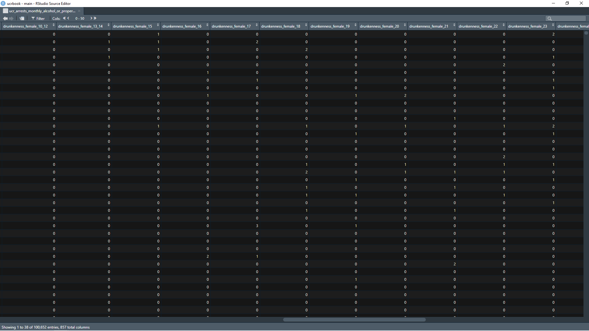

# Arrests by Age, Sex, and Race {#arrests}


```r
knitr::opts_chunk$set(
  echo    = FALSE,
  warning = FALSE,
  error   = FALSE
)
```

## A brief history of the data

### Changes in definitions

## What does the data look like?

### Raw data

<div class="figure">

<p class="caption">(\#fig:unnamed-chunk-2)Fixed-width ASCII file for the 1974 Arrests by Age, Sex, and Race dataset</p>
</div>

### Cleaned data

<div class="figure">

<p class="caption">(\#fig:unnamed-chunk-3)Agency information for the 1974 Arrests by Age, Sex, and Race dataset</p>
</div>

<div class="figure">

<p class="caption">(\#fig:unnamed-chunk-4)Crime information for the 1974 Arrests by Age, Sex, and Race dataset</p>
</div>

## What variables are in the data?

### Key variables

### Known issues with the data

## Final thoughts
