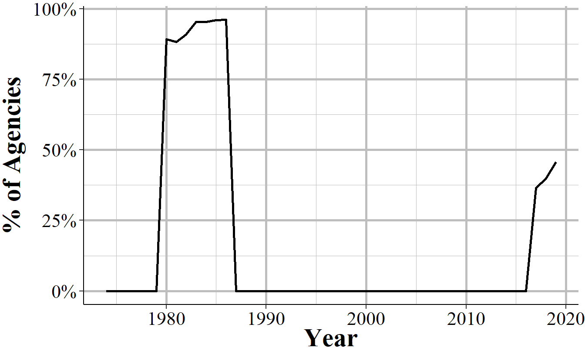

# Arrests by Age, Sex, and Race {#arrests}


```
#>             used   (Mb) gc trigger    (Mb)   max used    (Mb)
#> Ncells   1098175   58.7    2207842   118.0    1244675    66.5
#> Vcells 751973598 5737.2 1568337852 11965.5 1502148543 11460.5
#>              used   (Mb) gc trigger    (Mb)   max used    (Mb)
#> Ncells    1099884   58.8    2207842   118.0    1244675    66.5
#> Vcells 1287293181 9821.3 1884407135 14376.9 1822646748 13905.7
```


The Arrests by Age, Sex, and Race dataset - often called ASR, or the "arrests data", or the "Arrests by Age, Sex, Race, and Ethnicity (ASRE) though this is really misleading since most years don't even report ethnicity data - includes the monthly number of arrests for a variety of crimes and, unlike the crime data, breaks down this data by age and gender. This data includes a broader number of crime categories than the crime dataset (the Offenses Known and Clearances by Arrest data) though is less detailed on violent crimes since it does not breakdown aggravated assault or robberies by weapon type as the Offenses Known data does. For each crime it says the number of arrests for each gender-age group with younger ages (15-24) showing the arrestee's age to the year (e.g. age 16) and other ages grouping years together (e.g. age 25-29, 30-34, "under 10"). It also breaks down arrests by race-age by including the number of arrestees of each race (American Indian, Asian, Black, and White) are the only included races) and if the arrestee is a juvenile (<18 years old) or an adult. The data does technically include a breakdown by ethnicity-age (e.g. juvenile-Hispanic, juvenile-non-Hispanic) but almost no agencies report this data (for many years zero agencies report ethnicity) so in practice the data does not include ethnicity. As the data includes counts of arrestees, people who are arrested multiple times are included in the data multiple times - it is not a measure of unique arrestees. 

## Agencies reporting

I'm not sure why there's a dip in 1980. Since it immediately reverses itself in the next year I think it's just a data issue, not a real decrease in the number of agencies that report. 

<div class="figure" style="text-align: center">

<p class="caption">(\#fig:arrestsAgenciesReporting)The annual number of agencies reporting at least one month of data in that year.</p>
</div>

If we look at agencies that report all 12 months of the year, as seen in Figure \@ref(arrestsAgenciesReporting12Months), now far fewer agencies report. In almost every year about 45-53% of agencies that report at all report report all 12 months. This means that we're missing data for about half of agencies. 

<div class="figure" style="text-align: center">

<p class="caption">(\#fig:arrestsAgenciesReporting12Months)The annual number of agencies reporting 12 months of data in that year.</p>
</div>

## What is an arrest? (what unit is this data in?)

A key part of understanding this data is knowing what unit of analysis it's in. This data is the monthly number of *total arrests for a given crime, with only the most serious crime per incident included*. Consider for example, a person who robs a bank, shooting a killing a guard and pointing their gun at other people in the bank. They are arrested and then released from jail (just imagine that this is true) and are rearrested the next day for shoplifting. And let's further assume that both arrests were in the same month in the same agency. How many arrests are here? They committed multiple crimes in the first incident (murder, robbery, aggravated assault) but in this dataset they would only be classified as an arrest for the most serious crime, murder. And then separately they'd also be an arrested for shoplifting. So assuming that no other arrests occurred in that police agency that month, there would be two arrests reported: one for murder and one for shoplifting. 

There's no way to tell how many unique people were arrested, or of those arrested multiple times which crimes they were arrested for. So if you have 100 arrests there may be 1 person arrested 100 times or 100 people arrested once - though, of course, the true number is somewhere in between. This means that studies that try to use this data as a measure of unique people or even the percent of arrestees by group (age, gender, or race) relative to some base rate of the population such as the number of people living in that city are going to be wrong - though how wrong is unclear.^[While all studies are going to be estimates of the real effect, that's no reason to be flippant in using data (UCR and other data). Without having a high level of confidence that your estimates are close to the actual value, you shouldn't do that study.] 

Common uses of this data - more common in more news articles or advocacy group reports than in peer-reviewed research articles - compare the percent of arrestees of a certain group to the percent of a city's population of that group. Any differences between the arrestee percent and the resident percent is, according to these reports, evidence of a disparity (this is most common for looking at differences by race. Since these analyses are generally looking at annual data, it assumes that people of each group (usually they look at race but gender and age data is also available) are rearrested at the same rate. That is, White people, for example, are rearrested in the same year for the same crime at the exact same rate as Black people. If not, then you're be comparing different things since one group would have more overall people arrested while the other would have fewer people but who are arrested more. Whether this distinction between arrests and unique people arrested affects your interpretation of the data depends on the study you are doing, but it's important to consider in your research. One way to address this is to use other data on the rate of rearrest by group, though you'd have to be very careful to not extrapolate the results of the other study beyond what they could tell you of the specific time and place they studied. 


### The Hierarchy Rule

In incidents where the arrestee commits multiple crimes, only the most serious crime is counted as the crime that the person was arrested for. For a comprehensive overview of the Hierarchy Rule, please see Section \@ref(hierarchy). Basically, the FBI chose seven crimes in 1929 that they call Index Crimes - or sometimes called Part I crimes - and these were considered the most important crimes to be recorded. For more on Index Crimes, please see Section \@ref(indexCrimesOffensesKnown). If a person is arrested for multiple crimes and an Index Crime is one of those crimes, then the Index Crime at the top of the Hierarchy is the one recorded in this data. Section \@ref(arrestsCrimesIncluded) shows all crimes included and the crimes 1-7 as well as 9 (arson) are the Index Crimes. The top of the Hierarchy is the crime with the lowest number. So murder is always reported in incidents where there's a murder; rape is always reported when there's an incident with rape but no murder; etc. 

In incidents where the arrestee committed both an Index Crime and a Part II crime, then only the top Index Crime is recorded. This can lead to rather silly results since some Part II crimes are certainly more serious than some Index Crimes. Consider, for example, a person arrested for simple assault, carrying a firearm, pimping, and of theft. The first three crimes are, in my opinion, clearly more serious than theft. But since theft is an Index Crime, this person would be considered to have been arrested for theft. 

The remaining crimes are called Part II crimes and are not arranged in any particular way. So a lower value numbered crime is not higher on the Hierarchy than a higher value number - Part II crimes don't follow the Hierarchy. If all of the crimes in an incident are Part II crimes then the agency must decide for themselves which crime is the most serious. This can lead to agencies deciding their own hierarchy differently than others which makes this data much less comparable across agencies than if there was a standard rule. 

## Crimes included {#arrestsCrimesIncluded}

1. Homicide
  + Murder and non-negligent manslaughter
  + Manslaughter by negligence
2. Rape
3. Robbery
4. Aggravated assault
5. Burglary 
6. Theft (other than of a motor vehicle)
7. Motor vehicle theft
8. Simple assault
9. Arson
10. Forgery and counterfeiting
11. Fraud
12. Embezzlement
13. Stolen property - buying, receiving, and possessing
14. Vandalism
15. Weapons offenses - carrying, possessing, etc.
16. Prostitution and commercialized vice
17. Sex offenses - other than rape or prostitution
18. Drug abuse violations - total
  + Drug sale or manufacturing
    - Opium and cocaine, and their derivatives (including morphine and heroin)
    - Marijuana
    - Synthetic narcotics
    - Other dangerous non-narcotic drugs
  + Drug possession
    - Opium and cocaine, and their derivatives (including morphine and heroin)
    - Marijuana
    - Synthetic narcotics
    - Other dangerous non-narcotic drugs
19. Gambling - total
  + Bookmaking - horse and sports
  + Number and lottery
  + All other gambling
20. Offenses against family and children - nonviolent acts against family members. Includes neglect or abuse, nonpayment of child support or alimony.
21. Driving under the influence (DUI)
22. Liquor law violations - Includes illegal production, possession (e.g. underage) or sale of alcohol, open container, or public use laws. Does not include DUIs and drunkenness.
23. Drunkenness - i.e. public intoxication
24. Disorderly conduct
25. Vagrancy - includes begging, loitering (for adults only), homelessness, and being a "suspicious person."
26. All other offenses (other than traffic) - a catch-all category for any arrest that is not otherwise specified in this list. Does not include traffic offenses. Very wide variety of crimes are included - use caution when using!
27. Suspicion - "Arrested for no specific offense and released without formal charges being placed."
28. Curfew and loitering law violations - for minors only.
29. Runaways - for minors only.

### Age

For each crime the data provides the number of people of each gender by age, with several years in the peak offending age given as the specific age and younger and older ages broken into groups. Only female and male genders are available, and there is no variable for "unknown" gender. So to get a total arrests for that crime for that age, just add the female and male variables together. 

* Female
    + Under 10
    + 10-12
    + 13-14
    + 15
    + 16
    + 17
    + 18
    + 19
    + 20
    + 21
    + 22
    + 23
    + 24
    + 25-29
    + 30-34
    + 35-39
    + 40-44
    + 45-49
    + 50-54
    + 55-59
    + 60-64
    + 65 and older
* Male
    + Under 10
    + 10-12
    + 13-14
    + 15
    + 16
    + 17
    + 18
    + 19
    + 20
    + 21
    + 22
    + 23
    + 24
    + 25-29
    + 30-34
    + 35-39
    + 40-44
    + 45-49
    + 50-54
    + 55-59
    + 60-64
    + 65 and older

### Race

The data also breaks down the number of arrests for each crime by race, with the only included races being American Indian, Asian, Black, and White. This is further broken down into if the arrestee was an adult (18 years or older) or a juvenile (under 18).  Whether the arrestee is Hispanic is in a separate (and nearly universally non-reported variable). Since the ethnicity variable is separate, and since the data is not at the arrestee-level unit, there's no way to interact the race and ethnicity variables. So, for example, there is no way to determine how many White-Hispanic or White-Non-Hispanic arrestees. Just total White arrestees and total Hispanic arrestees. 

As with race variables in other UCR datasets - and, really, any dataset - you should be cautious about using this variables since it is the officer's perception of the arrestee's race - though of course some arrests do have other data about the arrestee's race such as what they tell the officer. 

Even though there is information about the specific age of arrestee (or the age range, depending on the arrestee's age) and their gender, there is no gender information combined with race and no age beyond the adult/juvenile binary. If you add up all arrests that are broken down by gender-age and compare it to the sum of all of the arrests broken down by adult/juvenile-race here, in some cases these numbers don't add up. That's because while most agencies do report the age variables, not all agencies report the race variables. So summing up the race variables will actually undercount the total number of arrests. 

* Adult
    + American Indian
    + Asian
    + Black
    + White
* Juvenile
    + American Indian
    + Asian
    + Black
    + White
  
### Ethnicity

While technically included, the ethnicity variable is largely useless since for most years no agencies reported it and for the years where agencies do report ethnicity, not all agencies do so. The ethnicities included are Hispanic and non-Hispanic are are broken down by if the arrestee is an adult (18+ years old) or a juvenile (<18 years old).

* Adult
    + Hispanic
    + Non-Hispanic
* Juvenile
    + Hispanic
    + Non-Hispanic

Figure \@ref(fig:theftHispanic) shows the annual number of Hispanic arrestees for theft for all agencies that reported any data that year.^[Theft is used as it's one of the most common crimes.] For several years no agencies reported until the number of Hispanic arrestees start climbing in 1980 and peaks in 1986 at about 136 thousand arrestees. Then there are zero Hispanic arrestees for a few years, 4 Hispanic arrestees in 1990s, and then again zero Hispanic arrestees, this time for decades. Only in 2017 do the number of Hispanic theft arrestees begin to creep up. From 2017 to 2019 (the lasy year available at the time of this writing) there are Hispanic arrestees reported every year, though now only about 30,000 per year. 
    
<div class="figure" style="text-align: center">

<p class="caption">(\#fig:theftHispanic)The national annual number of Hispanic arrestees for theft. This includes all agencies that year that reporting any number of months. Hispanic arrestees include both juvenile and adult arrestees</p>
</div>

Perhaps a better way to look at this data is to see what percent of agencies report ethnicity data. Figure \@ref(fig:theftHispanicPercentAgencies) show the percent of agencies each year that report at least one Hispanic or non-Hispanic (which are the only choices, but showing only Hispanic arrests would exclude agencies where no Hispanic people truly were arrested) arrest for theft, of all agencies that reported theft data. About 90-95% of agencies reported ethnicity data in the early 80s and then only a couple agencies report in 1990 and 1991. Other than those agencies, none report between 1987 and 2017. Starting in 2017, 36% of agencies report and this number has grown by about five percentage points a year to 46% in 2019. Since fewer than half of agencies currently report, I strongly recommend against using these variables, even for the recent years of data. 

<div class="figure" style="text-align: center">

<p class="caption">(\#fig:theftHispanicPercentAgencies)The annual percent of agencies that report theft arrests that reported at least one Hispanic person or one non-Hispanic person arrested for theft. Arrestees include both juvenile and adult arrestees.</p>
</div>


### Juvenile referrals

* Handled within department and released
* Referred to juvenile court of probation department
* Referred to welfare agency
* Referred to other police agency
* Referred to criminal or adult court
