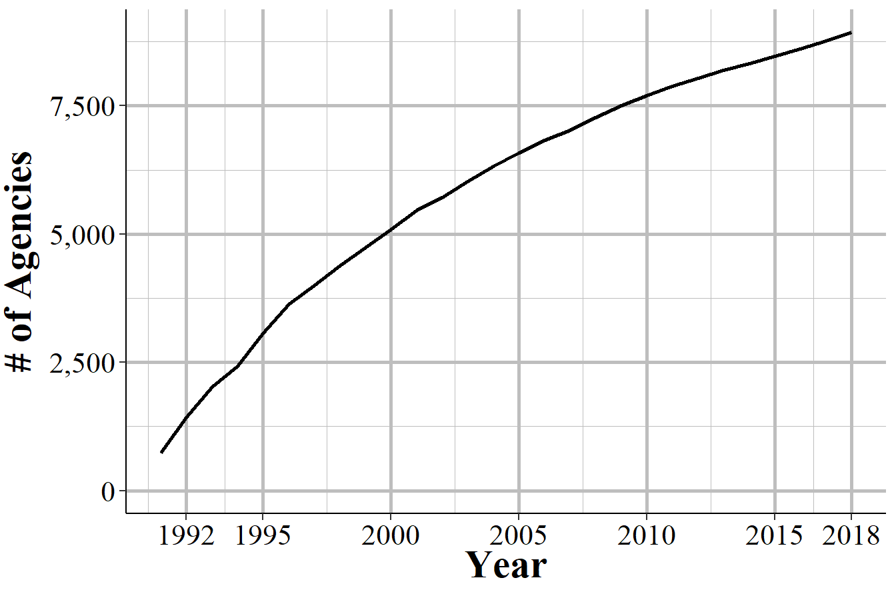
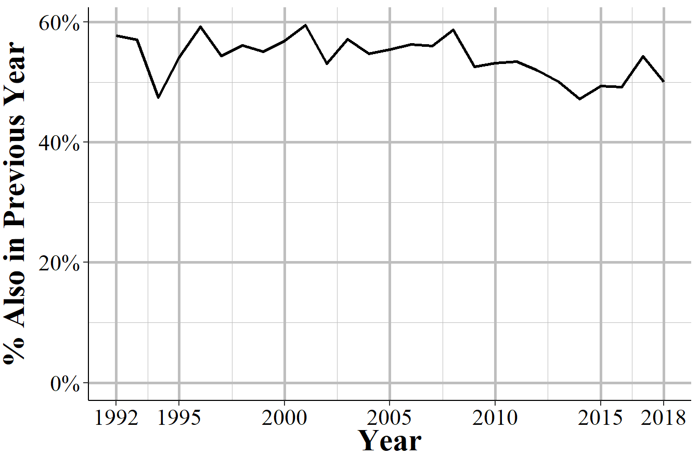
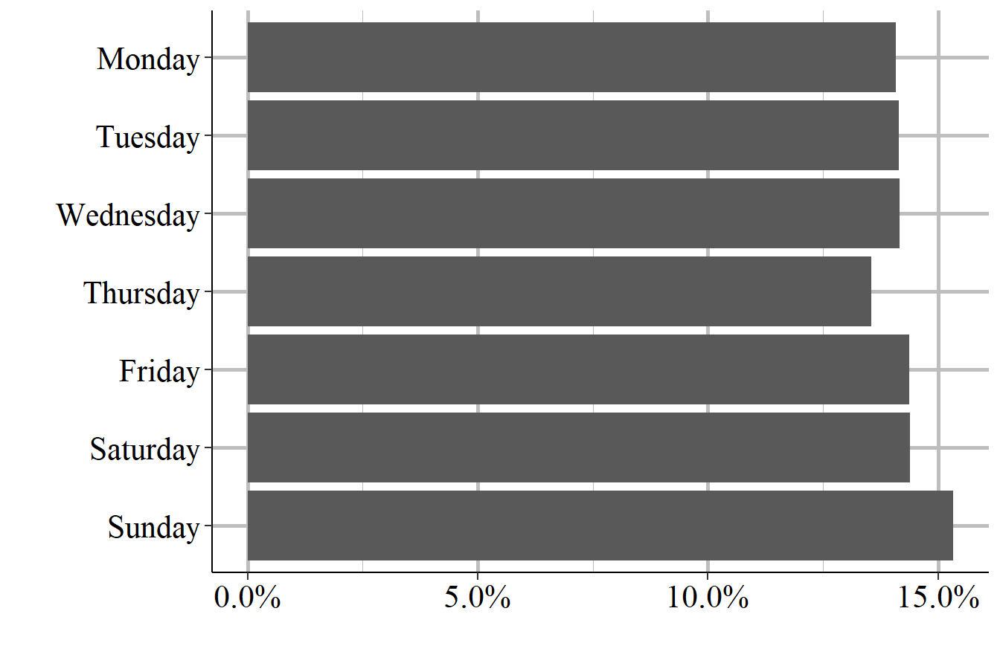
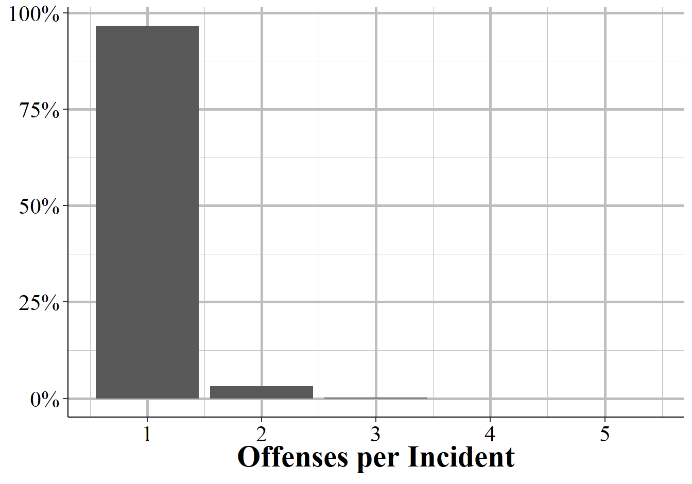

# Hate Crime Data {#hate_crimes}


This dataset covers crimes that are reported to the police and judged by the police to be motivated by hate. More specifically, they are, first, crimes which were, second, motivated - at least in part - by bias towards a certain person or group of people because of characteristics about them such as race, sexual orientation, or religion. The first part is key, they must be crimes - and really must be the selection of crimes that the FBI collects for this dataset. Biased actions that don't meet the standard of a crime, or are of a crime not included in this data, are not considered hate crimes. For example, if someone yells at a Black person and uses racial slurs against them, it is clearly a racist action. For it to be included in this data, however, it would have to extend to a threat since "intimidation" is a crime included in this data but lesser actions such as simply insulting someone is not included. For the second part, the bias motivation, it must be against a group that the FBI includes in this data. For example, when this data collection began crimes against transgender people were not counted so if a transgender person was assaulted or killed because they were transgender, this is not a hate crime recorded in the data (though it would have counted in the "Anti-Lesbian, Gay, Bisexual, Or Transgender, Mixed Group (LGBT)" bias motivation which was always reported).^[The first year where transgender as a group was a considered a bias motivation was in 2013.] 

So this data is really a narrower measure of hate crimes than it might seem. In practice it is (some) crimes motivated by (some) kinds of hate that are reported to the police. It is also the most under-reported UCR dataset with most agencies not reporting any hate crimes to the FBI. This leads to huge gaps in the data with some states having zero agencies report crime, agencies reporting some bias motivations but not others, agencies reporting some years but not others. While these problems exist for all of the UCR datasets, it is most severe in this data. This problem is exacerbated by hate crimes being rare even in agencies that report them - with such rare events, even minor changes in which agencies report or which types of offenses they include can have large effects. 

My main takeaway for this data is that it is inappropriate to use for most hate crime research. At most it can be used to look at within-city within-bias-motivation trends, while keeping in mind that even this narrow subset of data is limited by under-reporting by victims and potential changes in police practices of reporting such as how many months of data they report per year. 

## Agencies reporting

We'll start by looking at how many agencies report hate crime each year. This is a bit tricky since there can be multiple ways to examine how agencies report, and since agencies can truly have no hate crimes in a year so it's hard to differentiate the true zeroes from the non-reporters. Figure \@ref(fig:hateAgencies) shows the number of agencies that report at least one hate crime incident in that year. From the start in 1991 there were about 750 agencies reporting and that grew steadily to about 2,000 agencies in year 2000. From there it increased a bit over the next decade before declining to below 1,750 in the early 2010s and rising again to around 2,000 agencies at the end of our data.

<div class="figure" style="text-align: center">

<p class="caption">(\#fig:hateAgencies)The annual number of police agencies that report at least one hate crime incident in that year.</p>
</div>

The 2,000 or so agencies that report each year are not the same every year. Figure \@ref(fig:hateCrimesEver) shows the cumulative number of agencies that have reported at least one hate crime between 1991 and 2018. There is a steady growth in the cumulative number of agencies, with about 350 new agencies each year. This means that each year some new agencies report hate crimes while some agencies that reported a hate crime in the previous year don't report any hate crimes in the current year.

<div class="figure" style="text-align: center">

<p class="caption">(\#fig:hateCrimesEver)The cumulative number of agencies that have reported one or more hate crimes between 1991 to 2018.</p>
</div>

Figure \@ref(fig:hateCrimesPreviousYear) puts this into hard numbers by showing the percent of agencies who reported a hate crime in a certain year who *also* reported a hate crime in the previous year. For most years between 50% and 60% of agencies which reported a hate crime in the year shown on the x-axis also reported a hate crime in the previous year, indicating somewhat high consistency in which agencies have hate crimes. 

<div class="figure" style="text-align: center">

<p class="caption">(\#fig:hateCrimesPreviousYear)The percent of agencies that report a hate crime in a given year that also reported a hate crime in the previous year, 1992-2018.</p>
</div>

Another way to understand reporting is to look at the number of reported hate crimes by state and see which states report and which don't. Figure \@ref(fig:hateCrimesMap) does this for 2018 data by showing the number of reported hate crime incidents by state. While every state other than Wyoming reporting at least one hate crime in 2018, there are large differences between states because even in states that have reporting agencies, not all agencies in that state report. For example, Alabama reported only two hate crimes in 2018, the least of any state other than Wyoming. 

<div class="figure" style="text-align: center">

<p class="caption">(\#fig:hateCrimesMap)Total reported hate crimes by state, 2018.</p>
</div>

Since the number of state-wide hate crimes is partially influenced by population, we'll also look at it as the percent of agencies in the state that report at least one hate crime. Again this is limited by population as agencies in each state cover different populations - and most agencies are small so a few large agencies can account for a large share of crimes, including hate crimes. Still, this is a useful exercise as we can easily see where very few agencies report. Figure \@ref(fig:statePercentReporting) shows the percent of agencies for each state that reported at least one hate crime in 2018. In Connecticut, the state with the highest percent of agencies reporting, 28% of agencies reported at least one hate crime. In 34 states, fewer than 10% of agencies reported a hate crime, and in 19 states fewer than 5% of agencies did so. One interesting finding from this graph is the more liberal states - Connecticut, New Jersey, Vermont, California, Washington - have the highest share of agencies reporting a hate crime, indicating that the culture of the state may influence either the propensity of hate crimes, whether victims report, or whether agencies report hate crimes.   

<div class="figure" style="text-align: center">

<p class="caption">(\#fig:statePercentReporting)The percent of agencies in each state that reported at least one hate crime in 2018.</p>
</div>

## Important variables

This data has the standard set of variables describing the agency that is reporting. This includes the agency ORI - which is the unique ID for that agency - the agency name, their state, and the population under their jurisdiction.

They also have a variable with the exact date that the hate crime occurred on - though not the date it was reported on. Figure \@ref(fig:hateCrimesByDay) shows the percent of hates crimes between 1991 and 2018 that occurred on each day of the week. Interestingly, the most common days for a hate crime to occur is on Friday and Saturday, which is also when non-hate crimes most frequently occur. This suggests that hate crimes do follow the same trends - at least partially - as other crimes.

<div class="figure" style="text-align: center">

<p class="caption">(\#fig:hateCrimesByDay)The day of the week that hate crimes occurred on, 1991-2018.</p>
</div>

Each hate crime incident can cover up to 10 different crimes occurring - e.g. a person who burglarizes a synagogue and spray paints a swastika on the wall would have both vandalism and burglary reported in this data. With each crime, this data has the bias motivation for that crime, the location of the crime (in broad categories, not the actual location in the city like a street address would have), and the number of victims for that offense. In practice, in most hate crimes with multiple offenses recorded, the bias motivation, location, and victim count is the same for each offense.

Figure \@ref(fig:crimesPerHateCrime) shows the number of crimes per incident for each hate crime reported between 1991 and 2018. In 96.6% of cases, there is only one offense in that incident.^[In 0.0005% of hate crimes there is no recorded offense. This is not shown in the graph.] This drops sharply to 3.2% of incidents having two offenses, 0.21% having three offenses, 0.016% having four offenses, and 0.002% having five offenses. Even though this data does allow up to 10 offenses per hate crime incident, there has never been a recorded case with more than five offenses. 

<div class="figure" style="text-align: center">

<p class="caption">(\#fig:crimesPerHateCrime)The number of offenses per hate crime incident.</p>
</div>

### The bias motivation (who the hate is against)

The most important variable in this data is the "bias motivation" which is the FBI's term for the cause of the hate. A hate crime targeted against Black people would be an "anti-Black" bias motivation. For the police to classify an incident as a hate crime, and to assign a particular bias motivation, the police must have *some* evidence that the crime was motivated by hate. The victim saying that the crime is a hate crime alone is not sufficient - though if large portions of the victim's community believe that the crime is a hate crime, this is a factor in the police's assessment. The evidence required is not major, it includes things as explicit as racial slurs said during an incident and less obvious factors like the victim is celebrating their community (e.g. attending a holiday event) or the crime occurring on an important holiday for that community (e.g. Martin Luther King Day, religious holidays). The FBI also encourages police to consider the totality of the evidence even if none alone strongly suggests that the crime was a hate crime in making their determination about whether the incident was a hate crime or not.

This also means that many (likely most) hate crimes will not be recorded as hate crimes since there is no evidence that the crime is motivated by hate. For example, if a man committed a crime against Asian people for crimes because they are Asian, that would in reality be a hate crime. However, if the offender does not say anything anti-Asian to the victim, which is the mostly likely thing to indicate that this is a hate crime, the crime would not likely be recorded as a hate crime. For example, at the time of this writing (Spring, 2021), there are numerous media reports discussing an increase in anti-Asian hate crimes as a result of racism relating to the pandemic.^[This dataset for 2020 won't be released until Fall 2021 so this data is not useful for measuring urgent policies about current events.] This data would likely undercount both anti-Asian behavior and anti-Asian hate crimes. First, if someone walked to an Asian person and called them an anti-Asian slur, that is clearly a hateful act and would be classified as a hate crime under some organization's collections methods. However, as hateful as this incident is, *this alone* would not be classified as a hate crime in this dataset as a slur is not a crime. If accompanied by other criminal behavior, or if it continues to the point where it can be considered intimidation, it would then be classified as a hate crime. Second, crimes against Asian victims that are in fact hate crimes, but have no evidence that they are hate crimes would not be classified as hate crimes in this data. 

Bias motivation is based on the offender's perceptions of the victim so even if they are incorrect in who their victim is, if they intended to target someone for their perceived group membership, that is still a hate crime. For example, if a person assaults a man because they think he is gay, that is a hate crime because the assault was motivated by hate towards gay people. Whether the victim is actually gay or not is not relevant - the offender perceived him to be gay so it is an anti-gay  hate crime. To make this even more complicated, the offender must have committed the crime because they are motivated, at least to some degree, by their bias against the victim. Being biased against the victim but targeting them for some other reason means that the crime is not a hate crime. 

The biases that the FBI includes in this data has grown over time, with new bias motivations being added in 1997, 2012, 2013, and 2015. Table \@ref(fig:hateBiasMotivation) shows each bias motivation in this data, the year it was first reported, how many hate crimes there were for this bias motivation from 1991-2018 and what percent of hate crimes that bias motivation makes up. For ease of seeing how bias motivations changed over time, the table is sorted by year and by frequency of incident within that year. If you're viewing this on a computer or phone, you can sort the table yourself. The year is the first year with that bias motivation - as hate crimes for certain groups are very rare, the bias motivation could have technically been available in previous years. The last column in this table shows the percent of hate crimes from 1991-2018, though this is a very rough measure since some groups are so small that even accounting for a small percent of total hate crimes can mean that are massively disproportionately targeted. 

<div class="figure" style="text-align: center">

```{=html}
<div id="htmlwidget-97e7ac12df1099e60810" style="width:100%;height:auto;" class="datatables html-widget"></div>
<script type="application/json" data-for="htmlwidget-97e7ac12df1099e60810">{"x":{"filter":"none","data":[["1","2","3","4","5","6","7","8","9","10","11","12","13","14","15","16","17","18","19","20","21","22","23","24","25","26","27","28","29","30","31","32","33","34"],["Anti-Eastern Orthodox (Greek, Russian, Etc.)","Anti-Other Christian","Anti-Sikh","Anti-Hindu","Anti-Mormon","Anti-Jehovahs Witness","Anti-Buddhist","Anti-Transgender","Anti-Male","Anti-Native Hawaiian Or Other Pacific Islander","Anti-Gender Non-Conforming","Anti-Female","Anti-Mental Disability","Anti-Physical Disability","Anti-Black","Anti-Jewish","Anti-White","Anti-Male Homosexual (Gay)","Anti-Hispanic","Anti-Ethnicity Other Than Hispanic","Anti-Lesbian, Gay, Bisexual, Or Transgender, Mixed Group (LGBT)","Anti-Asian","Anti-Multi-Racial Group","Anti-Female Homosexual (Lesbian)","Anti-Muslim","Anti-Other Religion","Anti-American Indian Or Native Alaskan","Anti-Catholic","Anti-Protestant","Anti-Multi-Religious Group","Anti-Arab","Anti-Heterosexual","Anti-Bisexual","Anti-Atheism/Agnosticism"],[2015,2015,2015,2015,2015,2015,2015,2013,2013,2013,2012,2012,1997,1997,1991,1991,1991,1991,1991,1991,1991,1991,1991,1991,1991,1991,1991,1991,1991,1991,1991,1991,1991,1991],[131,130,80,40,38,20,19,513,77,49,152,142,944,503,68588,25943,23366,20188,12725,10016,5990,5891,4811,4221,3561,3269,2195,1458,1196,1118,1091,542,527,149],[0.000656039823119645,0.000651031885538579,0.000400635006485279,0.00020031750324264,0.000190301628080508,0.00010015875162132,9.51508140402538e-05,0.00256907197908685,0.000385611193742081,0.000245388941472233,0.00076120651232203,0.000711127136511371,0.00472749307652629,0.00251899260327619,0.343484422810154,0.129920924665595,0.117015469519188,0.10110024388656,0.0637260057190647,0.050159502811957,0.0299975461105853,0.0295017602900597,0.0240931877025085,0.0211385045296795,0.017833265726176,0.0163709479525047,0.0109924229904398,0.00730157299319421,0.00598949334695492,0.00559887421563178,0.00546365990094299,0.00271430216893777,0.00263918310522178,0.000746182699578832]],"container":"<table class=\"display\">\n  <thead>\n    <tr>\n      <th> <\/th>\n      <th>Bias Motivation<\/th>\n      <th>First Year Reported<\/th>\n      <th># of Incidents<\/th>\n      <th>% of Incidents<\/th>\n    <\/tr>\n  <\/thead>\n<\/table>","options":{"pageLength":100,"columnDefs":[{"targets":3,"render":"function(data, type, row, meta) {\n    return type !== 'display' ? data : DTWidget.formatRound(data, 0, 3, \",\", \".\");\n  }"},{"targets":4,"render":"function(data, type, row, meta) {\n    return type !== 'display' ? data : DTWidget.formatPercentage(data, 2, 3, \",\", \".\");\n  }"},{"className":"dt-right","targets":[2,3,4]},{"orderable":false,"targets":0}],"order":[],"autoWidth":false,"orderClasses":false}},"evals":["options.columnDefs.0.render","options.columnDefs.1.render"],"jsHooks":[]}</script>
```

<p class="caption">(\#fig:hateBiasMotivation)The bias motivation for hate crime incidents. In incidents with multiple bias motivation, this shows only the first bias motivation recorded.</p>
</div>

2015 is the most year of new bias motivations, as of data through 2018. This year added a number of religions such as Anti-Buddhist, Anti-Sikh, and Anti-Jehovah's Witness. In 2013, anti-Transgender was added and this is the most common of the bias motivations added since data began in 1991 with 513 hate crimes between 2013-2018 - 0.26% of all hate crimes from 1991-2018. That year also added anti-male and Anti-Native Hawaiian or Other Pacific Islander, which is the most recent racial group added.  In 2012, anti-gender non-conforming and anti-female were included, while in 1997 both anti-mental and anti-physical disability were added. In part due to having fewer years of data available, these newer bias motivations make up a small percent of total hate crimes, accounting for ~1.4%. 

The original hate crimes - that is, those in the data in 1991 when this dataset was released - are far more common. The most common bias motivation is anti-Black at 34% of hate crimes, anti-Jewish at 13%, anti-White at 12%, anti-male homosexual (gay) at 10%, anti-Hispanic at 6%, and anti-ethnicity other than Hispanic (this group means a crime against an ethnic group that isn't Hispanic, though it is occasionally reported as anti-non-Hispanic which is incorrect.) at 5%. All other bias motivations are less than 5% of hate crimes and consist of a variety of ethnic, racial, religious, or sexual orientation. Some hate crimes can potentially fall in multiple categories. For example, there is a bias motivation of "anti-male homosexual (gay)" and of "anti-lesbian, gay, bisexual, or transgender, mixed group (LGBT)" so there is some overlap between them.

### The crime that occurred

The "crime" part of hate crimes is which criminal offense occurred during the incident. A hateful act where the action is not one of the crimes that the FBI records would not be considered a hate crime. This is likely most common when considering something like a person calling someone by a hateful slur (e.g. "You're a [slur]", "go back to your own country") but where the action is not technically a crime. Another layer of difficulty in using this data is that not all crimes that the FBI includes were initially included when data become available in 1991. Every several years the FBI adds new crimes to be included in this data. Table \@ref(fig:hateOffense) shows each crime in the data, the first year that this crime was reported, the total number of these crimes reported between 1991 and 2018, and the percent of all incidents this crime makes up.^[This tables uses only the first offense in an incident so counts are slightly lower than if all crimes in every incident is used.] This table is sorted with the most recent years first, and within year by how common the crime was.

Nearly all hate crimes are vandalism/destruction of property (31%), intimidation (30%), and simple assault (20%) or aggravated assault (11%) with no remaining crime making up more than 2% of total hate crimes. 

<div class="figure" style="text-align: center">

```{=html}
<div id="htmlwidget-d67ca6239c07f31172f5" style="width:100%;height:auto;" class="datatables html-widget"></div>
<script type="application/json" data-for="htmlwidget-d67ca6239c07f31172f5">{"x":{"filter":"none","data":[["1","2","3","4","5","6","7","8","9","10","11","12","13","14","15","16","17","18","19","20","21","22","23","24","25","26","27","28","29","30","31","32","33","34","35","36","37","38","39","40","41","42","43","44","45"],["Human Trafficking - Commercial Sex Acts","Fraud-Other","Bribery","Assisting Or Promoting Prostitution","Purchasing Prostitution","Wire Fraud","Impersonation","Prostitution","Statutory Rape","Theft From Coin-Operated Machine Or Device","Negligent Manslaughter","False Pretenses/Swindle/Confidence Game","Extortion/Blackmail","Incest","Stolen Property Offenses - Receiving, Selling, Etc.","Sexual Assault With An Object","Pocket-Picking","Welfare Fraud","Drug Equipment Violations","Credit Card/Atm Fraud","Embezzlement","Forcible Sodomy","Pornography/Obscene Material","Purse-Snatching","Theft From Building","Kidnapping/Abduction","All Other Larceny","Drug/Narcotic Violations","Theft From Motor Vehicle","Shoplifting","Weapon Law Violations","Theft of Motor Vehicle Parts/Accessories","Counterfeiting/Forgery","Forcible Fondling - Indecent Liberties/Child Molest","Motor Vehicle Theft","Destruction of Property/Vandalism","Intimidation","Simple Assault","Aggravated Assault","Robbery","Burglary/Breaking And Entering","Arson","Theft-Other","Murder/Non-Negligent Manslaughter","Forcible Rape"],[2017,2016,2014,2013,2013,2006,2001,2001,1999,1999,1999,1997,1997,1997,1996,1996,1996,1996,1995,1995,1995,1995,1995,1995,1994,1994,1993,1993,1993,1993,1993,1993,1993,1993,1992,1991,1991,1991,1991,1991,1991,1991,1991,1991,1991],[1,17,2,4,2,18,108,12,12,11,3,230,41,7,94,23,19,2,204,125,56,52,34,23,478,99,1670,862,642,521,289,174,165,142,401,62502,59750,39035,22213,3748,3363,1224,796,265,242],[5.00798774044601e-06,8.51357915875822e-05,1.0015975480892e-05,2.0031950961784e-05,1.0015975480892e-05,9.01437793280282e-05,0.000540862675968169,6.00958528853521e-05,6.00958528853521e-05,5.50878651449061e-05,1.5023963221338e-05,0.00115183718030258,0.000205327497358286,3.50559141831221e-05,0.000470750847601925,0.000115183718030258,9.51517670684742e-05,1.0015975480892e-05,0.00102162949905099,0.000625998467555751,0.000280447313464977,0.000260415362503193,0.000170271583175164,0.000115183718030258,0.00239381813993319,0.000495790786304155,0.00836333952654484,0.00431688543226446,0.00321512812936634,0.00260916161277237,0.0014473084569889,0.000871389866837606,0.000826317977173592,0.000711134259143334,0.00200820308391885,0.313009249753357,0.299227267491649,0.19548680144831,0.111242431678527,0.0187699380511917,0.0168418627711199,0.00612977699430592,0.00398635824139503,0.00132711675121819,0.00121193303318793]],"container":"<table class=\"display\">\n  <thead>\n    <tr>\n      <th> <\/th>\n      <th>Offense<\/th>\n      <th>First Year Reported<\/th>\n      <th># of Incidents<\/th>\n      <th>% of Incidents<\/th>\n    <\/tr>\n  <\/thead>\n<\/table>","options":{"pageLength":100,"columnDefs":[{"targets":3,"render":"function(data, type, row, meta) {\n    return type !== 'display' ? data : DTWidget.formatRound(data, 0, 3, \",\", \".\");\n  }"},{"targets":4,"render":"function(data, type, row, meta) {\n    return type !== 'display' ? data : DTWidget.formatPercentage(data, 2, 3, \",\", \".\");\n  }"},{"className":"dt-right","targets":[2,3,4]},{"orderable":false,"targets":0}],"order":[],"autoWidth":false,"orderClasses":false}},"evals":["options.columnDefs.0.render","options.columnDefs.1.render"],"jsHooks":[]}</script>
```

<p class="caption">(\#fig:hateOffense)The offense type for hate crime incidents. In incidents with multiple offense types, this shows only the first offense type recorded.</p>
</div>

Agencies that report to the FBI's National Incident-Based Reporting System (NIBRS) can also report bias motivations for their crimes, and these reports are included in this dataset. One tricky thing is that the crimes included are different depending on if the agency reported through NIBRS or to the dataset directly, and are not NIBRS reporting agencies. The above table shows all crimes included, but agencies who report directly can only submit a subset of crimes. For these agencies the only possible crimes are the ones that are included Offenses Known and Clearances by Arrest dataset, that is detailed in Chapter \@ref(offensesKnown), as well as vandalism/destruction of property and human trafficking. 

### The location of the crime

This data is interesting because it includes the location - in categories for types of places, not actual location in the city - of the incident. This is important since the type of location can be a factor in whether the incident is classified as a hate crime. For example, spray paint on a synagogue or a mosque is much more likely to be a hate crime than spray paint on a wall of an abandoned building. Table \@ref(fig:hateLocations) shows the locations of hate crimes sorted by the year that location was first included in the data and then by frequency of hate crimes. Each hate crime incident can have multiple locations since each offense can have its own incident, but in most cases (96.6%) a hate crime only has a single location. 

As with the crime and the bias motivation, the available locations have increased as time went on, though these newer locations are relatively uncommon. One important change in location is that starting in 2010 the location of school/college was split to have one location be for elementary and high schools and another location be for colleges and universities. The majority of hate crimes occur in the victim's home (30%), on a road or alley (19%), in an unknown location (13.6%), and in a parking lot or parking garage. All other locations occur in fewer than 5% of hate crimes. 

<div class="figure" style="text-align: center">

```{=html}
<div id="htmlwidget-635350d0fb73ab24a5f0" style="width:100%;height:auto;" class="datatables html-widget"></div>
<script type="application/json" data-for="htmlwidget-635350d0fb73ab24a5f0">{"x":{"filter":"none","data":[["1","2","3","4","5","6","7","8","9","10","11","12","13","14","15","16","17","18","19","20","21","22","23","24","25","26","27","28","29","30","31","32","33","34","35","36","37","38","39","40","41","42","43","44","45"],["Military Installation","Community Center","Dock/Wharf/Freight/Modal Terminal","Shelter - Mission/Homeless","Rest Area","Arena/Stadium/Fairgrounds/Coliseum","Auto Dealership New/Used","Abandoned/Condemned Structure","Daycare Facility","Farm Facility","Amusement Park","Atm Separate From Bank","Tribal Lands","School - Elementary/Secondary","School - College/University","Park/Playground","Shopping Mall","Industrial Site","Camp/Campground","Gambling Facility/Casino/Race Track","Residence/Home","Highway/Road/Alley","Other/Unknown","School/College","Parking Lot/Garage","Church/Synagogue/Temple","Commercial/Office Building","Restaurant","Bar/Nightclub","Government/Public Building","Convenience Store","Specialty Store - Tv, Fur, Etc.","Air/Bus/Train Terminal","Field/Woods","Service/Gas Station","Grocery/Supermarket","Department/Discount Store","Drug Store/Doctors Office/Hospital","Jail/Prison","Hotel/Motel","Construction Site","Bank/Savings And Loan","Liquor Store","Lake/Waterway","Rental Storage Facility"],[2015,2013,2012,2011,2011,2011,2011,2011,2011,2011,2011,2011,2011,2010,2010,2010,2010,2010,2010,2010,1991,1991,1991,1991,1991,1991,1991,1991,1991,1991,1991,1991,1991,1991,1991,1991,1991,1991,1991,1991,1991,1991,1991,1991,1991],[3,75,14,68,44,35,34,31,23,16,14,9,6,1748,1248,646,142,65,23,21,59606,37988,27178,17249,11440,7530,4502,3978,3549,2894,2561,2375,1931,1917,1830,1628,1516,1448,1262,1214,507,418,346,326,188],[1.5026597076826e-05,0.00037566492692065,7.01241196918546e-05,0.000340602867074722,0.000220390090460114,0.000175310299229636,0.000170301433537361,0.000155274836460535,0.000115203910922333,8.01418510764052e-05,7.01241196918546e-05,4.50797912304779e-05,3.0053194153652e-05,0.00875549723009727,0.00625106438395961,0.00323572723720986,0.000711258928303096,0.000325576269997896,0.000115203910922333,0.000105186179537782,0.298558448453763,0.190276789918155,0.136130951784659,0.0863979243260571,0.0573014235196297,0.0377167586628332,0.0225499133466235,0.0199252677238713,0.0177764643418851,0.0144956573134448,0.0128277050379171,0.0118960560191539,0.00967211965178366,0.0096019955320918,0.00916622421686385,0.00815443334702423,0.0075934403894894,0.00725283752241467,0.00632118850365146,0.00608076295042225,0.00253949490598359,0.00209370585937109,0.00173306752952726,0.00163289021568176,0.000941666750147762]],"container":"<table class=\"display\">\n  <thead>\n    <tr>\n      <th> <\/th>\n      <th>Location<\/th>\n      <th>First Year Reported<\/th>\n      <th># of Incidents<\/th>\n      <th>% of Incidents<\/th>\n    <\/tr>\n  <\/thead>\n<\/table>","options":{"pageLength":100,"columnDefs":[{"targets":3,"render":"function(data, type, row, meta) {\n    return type !== 'display' ? data : DTWidget.formatRound(data, 0, 3, \",\", \".\");\n  }"},{"targets":4,"render":"function(data, type, row, meta) {\n    return type !== 'display' ? data : DTWidget.formatPercentage(data, 2, 3, \",\", \".\");\n  }"},{"className":"dt-right","targets":[2,3,4]},{"orderable":false,"targets":0}],"order":[],"autoWidth":false,"orderClasses":false}},"evals":["options.columnDefs.0.render","options.columnDefs.1.render"],"jsHooks":[]}</script>
```

<p class="caption">(\#fig:hateLocations)The location of hate crime incidents. In incidents with multiple locations, this shows only the first location recorded.</p>
</div>

### Number and race of offenders

There are two variables that have information about the people who commit the hate crime: the number of offenders and the race of the offenders (as a single value with the race of the group if all are of the same race or it will say a "multi-racial" group). Unfortunately, important information like the age of the offenders, their criminal history, their relationship to the victim, their gender, or whether they are arrested are completely unavailable in this dataset. 

When the police do not have any information about the number of offenders (which is common in cases of property crimes such as vandalism but rare in violent crimes), this data considers that to have zero offenders. The zero is just a placeholder that means that the police have no idea how many offenders there are, not that they think there were actually no offenders. Figure \@ref(fig:hateCrimeOffenderNumber) shows the percent of hate crimes from 1991-2018 that have each number of offenders recorded. In the actual data it says the actual number of offenders, with the largest group in the current data going to 99 offenders - in this graph I group 10 or more offenders together for simplicity. I also relabel zero offenders as "Unknown" offenders since that's more accurate. The most common number of offenders per hate crime is one offender, at about 46% of hate crimes from 1991-2018 having only one offender. This drops sharply to 9% of hate crimes having 2 offenders and continues to drop as the number of offenders increase. However, about a third (36.8%) of hate crimes have an unknown number of offenders. 

<div class="figure" style="text-align: center">

<p class="caption">(\#fig:hateCrimeOffenderNumber)The race of offenders, as a group, for hate crime incidents, 1991-2018.</p>
</div>


The data also includes the race of the offenders as a group, though not the ethnicity (Hispanic or non-Hispanic) of the offenders. In cases where there are multiple races among offenders, that will be classified as a "multi-racial group". As shown in Figure \@ref(fig:hateCrimeOffenderNumber) The most common racial group is "unknown" since the police do not know the race of the offenders. Then are White offenders at nearly 40% of hate crimes followed by Black offenders at nearly 13% of hate crimes. The remaining racial groups are rare with about 2% of hate crimes being committed by a multi-racial group of offenders and 0.72% of hate crimes committed by Asian or Pacific Islander offenders and 0.54% committed by American Indian or Native Alaskan offenders. 

<div class="figure" style="text-align: center">

<p class="caption">(\#fig:hateCrimeOffenderRace)The race of offenders, as a group, for hate crime incidents, 1991-2018.</p>
</div>
