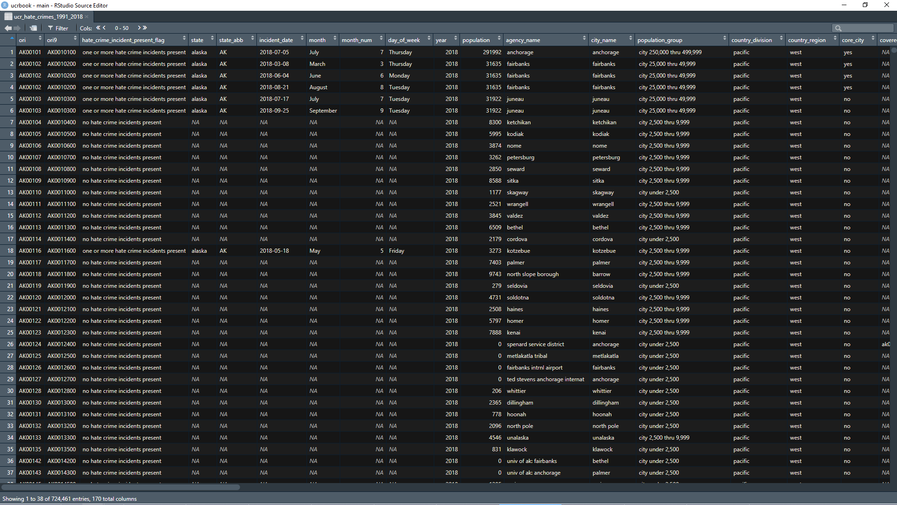
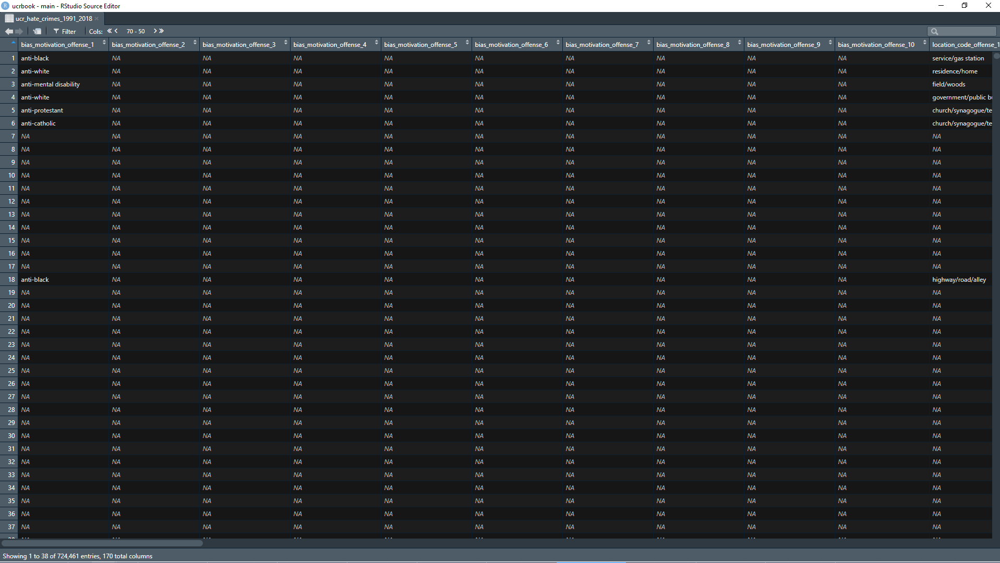

# Hate Crime Data {#hate_crimes}

This dataset covers crimes that are judged by the police to be motivated by hate More specifically, they are crimes whose motivation - at least in part - is bias towards a certain person or group of people because of characteristics about them such as race, sexual orientation, or religion. 


## A brief history of the data

### Changes in definitions

## What does the data look like?

### Raw data


```r
knitr::include_graphics('images/hate_crimes_raw_ascii_1991.PNG')
```

<div class="figure">

<p class="caption">(\#fig:unnamed-chunk-1)Fixed-width ASCII file for the 1991 Hate Crime dataset</p>
</div>

### Cleaned data


```r

```

<div class="figure">

<p class="caption">(\#fig:unnamed-chunk-2)Agency information for the 1991 Hate Crime dataset</p>
</div>


```r

```

<div class="figure">

<p class="caption">(\#fig:unnamed-chunk-3)Crime information for the 1991 Hate Crime dataset</p>
</div>

## What variables are in the data?

### Key variables

### Known issues with the data

## Final thoughts
