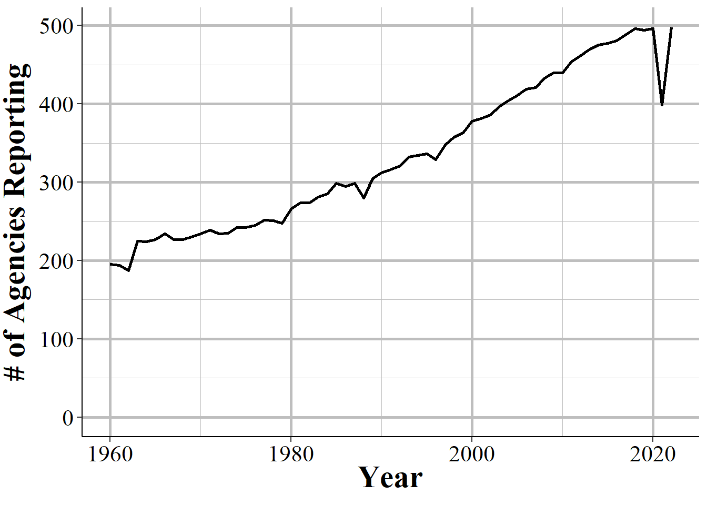
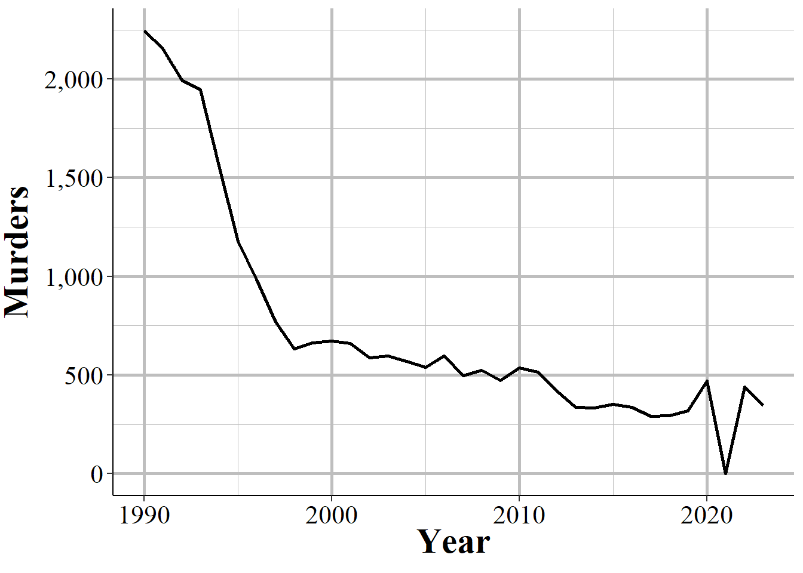
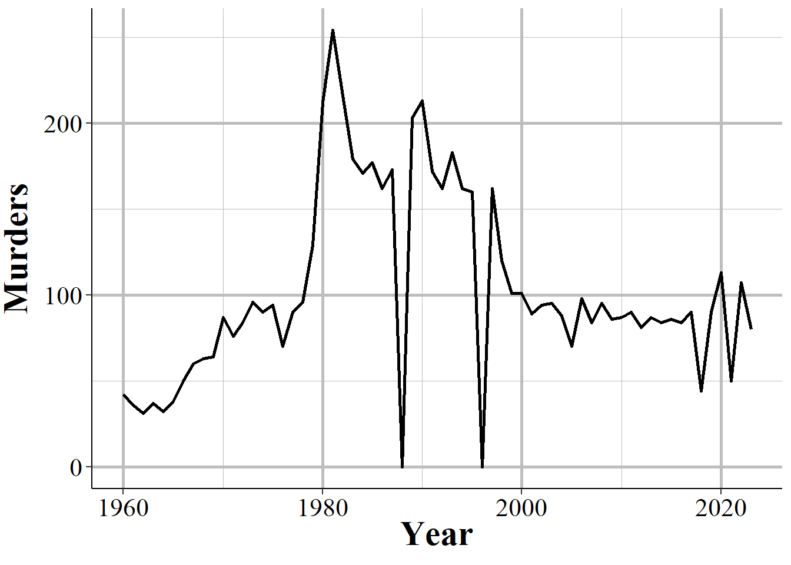

--- 
title: "Uniform Crime Reporting (UCR) Program Data: An Opinionated Guide to FBI Data"
author: "Jacob Kaplan, Ph.D."
date: "2024-08-13"
site: bookdown::bookdown_site
documentclass: book
lof: yes
lot: yes
bibliography: [book.bib, packages.bib]
biblio-style: apalike
link-citations: yes
description: "This is a comprehensive guide to using the FBI's Uniform Crime Reporting Program Data, a collection of crime and arrest datasets which are often referred to as UCR data."
graphics: yes
always_allow_html: yes 
colorlinks: yes
url: "https://ucrbook.com"
fontsize: 12pt
github-repo: "jacobkap/ucrbook"
classoption: openany
linestretch: 1.15
geometry: margin=1in
---


# (PART) Welcome {-}

# Preface 

If you've read an article about crime or arrests in the United States in the last half century, in most cases it was referring to the FBI's Uniform Crime Reporting Program Data, otherwise known as UCR data. UCR data is, with the exception of the more detailed data that only covers murders, a *monthly number of crimes or arrests reported to a single police agency* which is then gathered by the FBI into one file that includes all reporting agencies. It is actually a collection of different datasets, all of which have information about crimes and arrests that occur in a particular jurisdiction. Think of your home town. This data will tell you how many crimes were reported for a small number of crime categories or how many people (broken down by age, sex, and race) were arrested for a (larger) set of crime categories in that city (if the city has multiple police agencies then each agency will report crimes/arrests under their jurisdiction though the largest agency - usually the local police department - will cover the vast majority of crimes/arrests in that city) in a given month. 

This is a very broad measure of crime, and its uses in research - or uses for understanding crime at all - is fairly limited. Yet is has become over much of the last century - and will likely remain among researchers for at least the next decade - the most important crime data in the United States.^[The FBI has said they will no longer accept UCR data after 2020, instead only accepting the more detailed National Incident-Based Reporting System (NIBRS) data. However, only about half of agencies reported NIBRS data in 2019 and this number decreases steadily for earlier years. This means that UCR data has the longevity that NIBRS doesn't have, as most agencies have reported for decades, and will still be useful even though the data becomes increasingly outdated.]

UCR data is important for three reasons: 

1. The definitions are standard, and all agencies (tend to) follow them so you can compare across agencies and over time.^[We'll see many examples of when agencies do not follow the definitions, which really limits this data.]
2. The data is available since 1960 (for most of the datasets) so there is a long period of available data.^[While the original UCR data first reported in 1929, there is only machine-readable data since 1960.]
3. The data is available for most of the 18,000 police agencies in the United States so you can compare across agencies. 

More than many other datasets, there will be times when using UCR data that you'll think "that's weird". This book will cover this weirdness and when we think the weirdness is just an odd - but acceptable - quirk of the data, and when it is a sign of a big problem in the data or in that particular variable and that we should avoid using it. For most of this book we'll be discussing the caveats of the above reasons - or, more directly, why these assumptions are wrong - but these are the reasons why the data is so influential. 

## Goal of the book

By the end of each chapter you should have a firm grasp on the dataset that is covered and how to use it properly. However, this book can't possibly cover every potential use case for the data so make sure to carefully examine the data yourself for your own particular use. 

I get a lot of emails from people asking questions about this data so my own goal is to create a single place that answers as many questions as I can about the data. Again, this is among the most commonly used crime datasets and there are still many current papers published with incorrect information about the data (including such simple aspects like what geographic unit data is in and what time unit it is in). So hopefully this book will decrease the number of misconceptions about this data, increasing overall research quality.

Since manuals are boring, I'll try to include graphs and images to try to alleviate the boredom. That said, I don't think it's possible to make it too fun so sorry in advanced. This book is a mix of facts about the data, such as how many years are available, and my opinions about it, such as whether it is reliable. In cases of facts I'll just say a statement - e.g. "the offenses data is available since 1960". In cases of opinion I'll temper the statement by saying something like "in my opinion..." or "I think". 

## Structure of the book

This book will be divided into ten chapters: this chapter, an intro chapter briefly summarizing each dataset and going over overall issues with UCR data, and seven chapters each covering one of the seven UCR datasets. The final chapter will cover county-level UCR data, a commonly used but highly flawed aggregation of UCR data that I recommend against using. Each chapter will follow the same format: we'll start with a brief summary of the data such as when it first because available and how it can be used. Next we'll look at how many agencies report their data to this dataset, often looking at how to measure this reporting rate a couple of different ways. Finally, we'll cover the important variables included in the data and how to use them properly (including not using them at all) - this will be the bulk of each chapter. 

## Citing this book

If this data was useful in your research, please cite it. To cite this book, please use the below citation: 

Kaplan J (2021). *Uniform Crime Reporting (UCR) Program Data: A Practitioner's Guide to FBI Data*. https://ucrbook.com/. 

BibTeX format:

```bibtex
@Manual{ucrbook,
  title = {Uniform Crime Reporting (UCR) Program Data: A Practitioner's Guide to FBI Data},
  author = {{Jacob Kaplan}},
  year = {2021},
  url = {https://ucrbook.com/},
}
```

## Sources of UCR data

### My own collection

#### openICPSR

#### [Crimedatatool.com][https://crimedatatool.com/]

### NACJD

### FBI (raw data)

### Raw data

### Crime Data Explorer

### Crimes in the United States report


### FBI (Crime Data Explorer)

### FBI (Crimes in the United States Report)

There are a few different sources of UCR data available today. First, and probably most commonly used, is the data put together by the [National Archive of Criminal Justice Data (NACJD)](https://www.icpsr.umich.edu/web/pages/NACJD/index.html)). This a team out of the University of Michigan who manages a huge number of criminal justice datasets and makes them available to the public. If you have any questions about crime data - UCR or other crime data - I highly recommend you reach out to them for answers. They have a collection of data and excellent documentation available for UCR data available on their site [here](https://www.icpsr.umich.edu/web/NACJD/series/57). One limitation to their data, however, is that each year of data is available as an individual file meaning that you'll need to concatenate each year together into a single file. Some years also have different column names (generally minor changes like spelling robbery "rob" one year and "robb" the next) which requires more work to standardize before you could concatenate. They also only have data through 2016 which means that the most recent years (UCR data is available through 2019) of data are (as of this writing) unavailable. 

Next, and most usable for the general public - but limited for researchers - is the FBI's official website [Crime Data Explorer](https://crime-data-explorer.fr.cloud.gov/). On this site you can chose an agency and see annual crime data (remember, UCR data is monthly so this isn't as detailed as it can be) for certain crimes (and not even all the crimes actually available in the data). This is okay for the general public but only provides a fraction of the data available in the actual data so is really not good for researchers. 

It's worth mentioning a final source of UCR information. This is the annual Crimes in the United States report released by the FBI each year around the start of October.^[They also release a report about the first 6-months of the most recent year of data before the October release but this is generally an estimate from a sample of agencies so is far less useful.] As an example, here is the [website for the 2019 report](https://ucr.fbi.gov/crime-in-the-u.s/2019/crime-in-the-u.s.-2019). In this report is summarized data which in most cases estimates missing data and provides information about national and subnational (though rarely city-level) crime data. As with the FBI's site, it is only a fraction of the true data available so is not a very useful source of crime data for quality research. Still, this is a very common source of information used by researchers.


## Recommended reading

While this book is designed to help researchers use this data, the FBI has an excellent manual on this data designed to help police agencies submit their data. That manual, called the "Summary Reporting System (SRS) User Manual" provides excellent definitions and examples of many variables included in the data. In this book when I quote the FBI, such as defining a crime, I quote from this manual. The manual is available to download as a PDF on the FBI's site and I've also posted it on my GitHub page in case the FBI ever take down the PDF.^[This is far more likely to happen as a result of standard government changing a site and forgetting to update the link rather than intentionally making the manual unavailable.] The link on my GitHub page is [here](https://github.com/jacobkap/ucrbook/blob/main/FBI%20Uniform%20Crime%20Reporting%20(UCR)%20Program%20User%20Manual.pdf). I highly recommend that you read this manual before using the data. That manual, alongside this book which tries to explain when and how the agencies don't follow the manual, will provide a solid foundation for your understanding of UCR data.

## How to contribute to this book

If you have any questions, suggestions (such as a topic to cover), or find any issues, please make a post on the [Issues page](https://github.com/jacobkap/ucrbook/issues) for this book on GitHub. On this page you can create a new issue (which is basically just a post on this forum) with a title and a longer description of your issue. You'll need a GitHub account to make a post. Posting here lets me track issues and respond to your message or alert you when the issue is closed (i.e. I've finished or denied the request). Issues are also public so you can see if someone has already posted something similar. 

For more minor issues like typos or grammar mistakes, you can edit the book directly through its GitHub page. That'll make an update for me to accept, which will change the book to include your edit. To do that, click the edit button at the top of the site - the button is highlighted in the below figure. You will need to make a GitHub account to make edits. When you click on that button you'll be taken to a page that looks like a Word Doc where you can make edits. Make any edits you want and then scroll to the bottom of the page. There you can write a short (please, no more than a sentence or two) description of what you've done and then submit the changes for me to review.

<div class="figure" style="text-align: center">

<p class="caption">(\#fig:unnamed-chunk-3)The edit button for how to make edits of this book.</p>
</div>

Please only use the above two methods to contribute or make suggestions about the book. While it's a bit more work for you to do it this way, since you'll need to make a GitHub account if you don't already have one, it helps me organize all the questions in one place and update the book if I decide to add answers to certain questions. 

## How to identify a particular agency (ORI codes) {#ori}

In NIBRS and other FBI data sets, agencies are identified using **OR**iginating Agency **I**dentifiers or an ORI. An ORI is a unique ID code used to identify an agency.^[This is referred to as an "ORI", "ORI code", and "ORI number", all of which mean the same thing.] If we used the agency's name we'd end up with some duplicates since there can be multiple agencies in the country (and in a state, those this is very rare) with the same name. For example, if you looked for the Philadelphia Police Department using the agency name, you'd find both the "Philadelphia Police Department" in Pennsylvania and the one in Mississippi. Each ORI is a 9-digit value starting with the state abbreviation (for some reason the FBI incorrectly puts the abbreviation for Nebraska as NB instead of NE) followed by 7 numbers. In the UCR data (another FBI data set) the ORI uses only a 7-digit code - with only the 5 numbers following the state abbreviation instead of 7. So the NIBRS ORI codes are sometimes called ORI9. For nearly all agencies, the only difference between the UCR ORI and the NIBRS ORI is that the NIBRS ORI has "00" at the end so it is technically 9 characters long but isn't any more specific than the 7-character UCR ORI code. 

When dealing with specific agencies, make sure to use the ORI rather than the agency name to avoid any mistakes. For an easy way to find the ORI number of an agency, use [this page](https://crimedatatool.com/crosswalk.html) on my site. Type an agency name or an ORI code into the search section and it will return everything that is a match.


## The data as you get it from the FBI

We'll finish this overview of the SRS data by briefly talking about format of the data that is released by the FBI, before the processing done by myself or [NACJD](https://www.icpsr.umich.edu/web/pages/NACJD/index.html) that converts the data to a type that software like R or Stata or Excel can understand. The FBI releases their data as fixed-width ASCII files which are basically just an Excel file but with all of the columns squished together. As an example, Figure \@ref(fig:SRSascii) shows what the data looks like as you receive it from the FBI for the Offenses Known and Clearances by Arrest dataset for 1960, the first year with data available. In the figure, it seems like there are multiple rows but that's just because the software that I opened the file in isn't wide enough - in reality what is shown is a single row that is extremely wide because there are over 1,500 columns in this data. If you scroll down enough you'll see the next row, but that isn't shown in the current image. What is shown is a single row with a ton of columns all pushed up next to each other. Since all of the columns are squished together (the gaps are just blank spaces because the value there is a space, but that doesn't mean there is a in the data. Spaces are possible values in the data and are meaningful), you need some way to figure out which parts of the data belong in which column. 

<div class="figure" style="text-align: center">

<p class="caption">(\#fig:SRSascii)Fixed-width ASCII file for the 1960 Offenses Known and Clearances by Arrest dataset.</p>
</div>

<div class="figure" style="text-align: center">

<p class="caption">(\#fig:ascii)Fixed-width ASCII file for the 1991 National Incident-Based Reporting System (NIBRS) dataset.</p>
</div>

The "fixed-width" part of the file type is how this works (the ASCII part basically means it's a text file). Each row is the same width - literally the same number of characters, including blank spaces. So you must tell the software you are using to process this file - by literally writing code in something called a "setup file" but is basically just instructions for whatever software you use (R, SPSS, Stata, SAS can all do this) - which characters are certain columns. For example, in this data the first character says which type of SRS data it is (1 means the Offenses Known and Clearances by Arrest data) and the next two characters (in the setup file written as 2-3 since it is characters 2 through 3 [inclusive]) are the state number (01 is the state code for Alabama). So we can read this row as the first column indicating it is an Offenses Known data, the second column indicating that it is for the state of Alabama, and so on for each of the remaining columns. To read in this data you'll need a setup file that covers every column in the data (some software, like R, can handle just reading in the specific columns you want and don't need to include every column in the setup file). 

The second important thing to know about reading in a fixed-width ASCII file is something called a "value label."^[For most fixed-width ASCII files there are also missing values where it'll have placeholder value such as -8 and the setup file will instruct the software to convert that to NA. SRS data, however, does not have this and does not indicate when values are missing in this manner.] For example, in the above image we saw the characters 2-3 is the state and in the row we have the value "01" which means that the state is "Alabama." Since this type of data is trying to be as small as efficient as possible, it often replaces longer values with shorter one and provides a translation for the software to use to convert it to the proper value when reading it. "Alabama" is more characters than "01" so it saves space to say "01" and just replace that with "Alabama" later on. So "01" would be the "value" and "Alabama" would be the "label" that it changes to once read. 

Fixed-width ASCII files may seem awful to you reading it today, and it is awful to use. But it appears to be an efficient way to store data back many decades ago when data releases began but now is extremely inefficient - in terms of speed, file size, ease of use - compared to modern software so I'm not sure why they *still* release data in this format. But they do, and even the more *modern* (if starting in 1991, before I was born, is modern!) NIBRS data comes in this format. For you, however, the important part to understand is not how exactly to read this type of data, but to understand that people who made this data publicly available (such as myself and the team at NACJD) must make this conversion process.^[For those interested in reading in this type of data, please see my R package asciiSetupReader.] **This conversion process, from fixed-width ASCII to a useful format is the most dangerous step taken in using this data - and one that is nearly entirely unseen by researchers.** 

Every line of code you write (or, for SPSS users, click you make) invites the possibility of making a mistake.^[Even highly experienced programmers who are doing something like can make mistakes. For example, if you type out "2+2" 100 times - something extremely simple that anyone can do - how often will you mistype a character and get a wrong result? I'd guess that at least once you'd make a mistake.] The FBI does not provide a setup file with the fixed-width ASCII data so to read in this data you need to make it yourself. Since some SRS data are massive, this involves assigning the column width for thousands of columns and the value labels for hundreds of different value labels.^[With the exception of the arrest data and some value label changes in hate crimes and homicide data, the setup files remain consistent so a single file will work for all years for a given dataset. You do not need to make a setup file for each year.] A typo anywhere could have potentially far-reaching consequences, so this is a crucial weak point in the data cleaning process - and one in which I have not seen anything written about before. While I have been diligent in checking the setup files and my code to seek out any issues - and I know that NACJD has a robust checking process for their own work - that doesn't mean our work is perfect.^[For evidence of this, please see any of the openICPSR pages for my detail as they detail changes I've made in the data such as decisions on what level to aggregate to and mistakes that I made and later found and fixed.] Even with perfection in processing the raw data to useful files, decisions we make (e.g. what level to aggregate to, what is an outlier) can affect both what type of questions you can ask when using this data, and how well you can answer them.    


## Common issues

In this section we'll discuss issues common to most or all of the SRS datasets. For some of these, we'll come back to the issues in more detail in the chapter for the datasets most affected by the problem. 

### Population

Each of the SRS datasets include a population variable that has the estimated population under the jurisdiction of that agency.^[Jurisdiction here refers to the boundaries of the local government, not any legal authority for where the officer can make arrests. For example, the Los Angeles Police Department's jurisdiction in this case refers to crimes that happen inside the city or are otherwise investigated by the LAPD - and are not primarily investigated by another agency.] This variable is often used to create crime rates that control for population. In cases where jurisdiction overlaps, such as when a city has university police agencies or county sheriffs in counties where the cities in that county have their own police, SRS data assigns the population covered to the most local agency and zero population to the overlapping agency. So an agency's population is the number of people in that jurisdiction that isn't already covered by a different agency. 

For example, the city of Los Angeles in California has nearly four million residents according to the US Census. There are multiple police agencies in the city, including the Los Angeles Police Department, the Los Angeles County Sheriff's Office, the California Highway Patrol that operates in the area, airport and port police, and university police departments. If each agency reported the number of people in their jurisdiction - which all overlap with each other - we would end up with a population far higher than LA's four million people. To prevent double-counting population when agency's jurisdictions overlap, the non-primary agency will report a population of 0, even though they still report crime data like normal. As an example, in 2018 the police department for California State University - Los Angeles reported 92 thefts and a population of 0. Those 92 thefts are not counted in the Los Angeles Police Department data, even though the department counts the population. To get complete crime counts in Los Angeles, you'd need to add up all police agencies within in the city; since the population value is 0 for non-LAPD agencies, both the population and the crime sum will be correct. 

The SRS uses this method even when only parts of a jurisdiction overlaps. Los Angeles County Sheriff has a population of about one million people, far less than the actual county population (the number of residents, according to the Census) of about 10 million people. This is because the other nine million people are accounted for by other agencies, mainly the local police agencies in the cities that make up Los Angeles County. 

The population value is the population who reside in that jurisdiction and does not count people who are in the area but don't live there, such as tourists or people who commute there for work. This means that using the population value to determine a rate can be misleading as some places have much higher numbers of non-residents in the area (e.g. Las Vegas, Washington D.C.) than others. 

### Voluntary reporting {#voluntary}

When an agency reports their data to the FBI, they do so voluntarily - there is no national requirement to report.^[Some states do mandate that their agencies report, but this is not always followed.] This means that there is inconsistency in which agencies report, how many months of the year they report for, and which variables they include in their data submissions. 

In general, more agencies report their data every year and once an agency begins reporting data they tend to keep reporting. The SRS datasets are a collection of separate, though related, datasets and an agency can report to as many of these datasets as they want - an agency that reports to one dataset does not mean that they report to other datasets. Figure \@ref(fig:SRSagenciesReporting) shows the number of agencies that submitted at least one month of data to the Offenses Known and Clearances by Arrest data in the given year. For the first decade of available data under 8,000 agencies reported data and this grew to over 13,500 by the late 1970s before plateauing for about a decade. The number of agencies that reported their data actually declined in the 1990s, driven primarily by many Florida agencies temporarily dropping out, before growing steadily to nearly 17,000 agencies in 2010; from here it kept increasing but slower than before. 

<div class="figure" style="text-align: center">

<p class="caption">(\#fig:SRSagenciesReporting)The annual number of agencies reporting to the Offenses Known and Clearances by Arrest dataset. Reporting is based on the agency reporting at least one month of data in that year.</p>
</div>

There are approximately 18,000 police agencies in the United States so recent data has reports from nearly all agencies, while older data has far fewer agencies reporting. When trying to estimate to larger geographies, such as state or national-level, later years will be more accurate as you're missing less data. For earlier data, however, you're dealing with a smaller share of agencies meaning that you have a large amount of missing data and a less representative sample. 

Figure \@ref(fig:bigAgenciesReporting) repeats the above figure but now including only agencies with 100,000 people or more in their jurisdiction. While these agencies have a far more linear trend than all agencies, the basic lesson is the same: recent data has most agencies reporting; old data excludes many agencies. 

<div class="figure" style="text-align: center">

<p class="caption">(\#fig:bigAgenciesReporting)The annual number of agencies with a population of 100,000 or higher reporting to the Offenses Known and Clearances by Arrest dataset. Reporting is based on the agency reporting at least one month of data in that year.</p>
</div>

This voluntariness extends beyond whether they report or not, but into which variables they report. While in practice most agencies report every crime when they report any, they do have the choice to report only a subset of offenses. This is especially true for subsets of larger categories - such as gun assaults, a subset of aggravated assaults, or marijuana possession arrests which is a subset of drug possession arrests. As an example, Figure \@ref(fig:nycGunAssaults) shows the annual number of aggravated assaults with a gun in New York City. In 2003 the New York Police Department stopped reporting this category of offense, resuming only in 2013. They continued to report the broader aggravated assault category, but not any of the subsections of aggravated assaults which say which weapon was used during the assault.

<div class="figure" style="text-align: center">

<p class="caption">(\#fig:nycGunAssaults)Monthly reports of gun assaults in New York City, 1960-2022.</p>
</div>

Given that agencies can join or drop out of the SRS program at will, and report only partial data, it is highly important to carefully examine your data to make sure that there are no issues caused by this. 

Even when an agency reports SRS data, and even when they report every crime category, they can report fewer than 12 months of data. In some cases they simply report all of their data in December, or report quarterly or semi-annually so some months have zero crimes reported while others count multiple months in that month's data. One example of this is New York City, shown in Figure \@ref(fig:nycMurderMonthly), in the early-2000s to the mid-2010s where they began reporting data quarterly instead of monthly. 

<div class="figure" style="text-align: center">

<p class="caption">(\#fig:nycMurderMonthly)Monthly murders in New York City, 1990-2022. During the 2000s, the police department began reporting quarterly instead of monthly and then resumed monthly reporting.</p>
</div>

When you sum up each month into an annual count, as shown in Figure \@ref(fig:nycMurderYearly), the problem disappears since the zero months are accounted for in the months that have the quarterly data. If you're using monthly data and only examine the data at the annual level, you'll fall into the trap of having incorrect data that is hidden due to the level of aggregation examined. While cases like NYC are obvious when viewed monthly, for people that are including thousands of agencies in their data, it is unfeasible to look at each agency for each crime included. This can introduce errors as the best way to examine the data is manually viewing graphs and the automated method, looking for outliers through some kind of comparison to expected values, can be incorrect.   

<div class="figure" style="text-align: center">

<p class="caption">(\#fig:nycMurderYearly)Annual murders in New York City, 1990-2022.</p>
</div>

In other cases when agencies report fewer than 12 months of the year, they simply report partial data and as a result undercount crimes. Figure \@ref(fig:miamiDadeMurderAnnual) shows annual murders in Miami-Dade, Florida and has three years of this issue occurring. The first two years with this issue are the two where zero murders are reported - this is because the agency didn't report any months of data. The final year is in 2018, the last year of data in this graph, where it looks like murder suddenly dropped significantly. That's just because Miami-Dade only reported through June, so they're missing half of 2018. 

<div class="figure" style="text-align: center">

<p class="caption">(\#fig:miamiDadeMurderAnnual)Annual murders in Miami-Dade, Florida, 1960-2022.</p>
</div>

### Zero crimes vs no reports

When an agency does not report, we see it in the data as reporting zero crimes, not reporting NA or any indicator that they did not report. In cases where the agency says they didn't report that month we can be fairly sure (not entirely since that variable isn't always accurate) that the zero crimes reported are simply that the agency didn't report. In cases where the agency says they report that month but report zero crimes, we can't be sure if that's a true no crimes reported to the agency or the agency not reporting to the SRS. As agencies can report some crimes but not others in a given month and still be considered reporting that month, just saying they reported doesn't mean that the zero is a true zero.

In some cases it is easy to see when a zero crimes reported is actually the agency not reporting. As Figure \@ref(fig:nycGunAssaults) shows with New York City gun assaults, there is a massive and sustained drop-off to zero crimes and then a sudden return years later. Obviously, going from hundreds of crimes to zero crimes is not a matter of crimes not occurring anymore, it is a matter of the agency not reporting - and New York City did report other crimes these years so in the data it says that they reported every month. So in agencies which tend to report many crimes - and many here can be a few as 10 a year since going from 10 to 0 is a big drop - a sudden report of zero crimes is probably just non-reporting. 

Differentiating zero crimes and no reports becomes tricky in agencies that tend to report few crimes, which most small towns do. As an example, Figure \@ref(fig:danvilleRape) shows the annual reports of rape in Danville, California, a city of approximately 45,000 people. The city reports on average 2.8 rapes per year and in five years reported zero rapes. In cases like this it's not clear whether we should consider those zero years as true zeros (that no one was raped or reported their rape to the police) or whether the agency simply didn't report rape data that year.  


<div class="figure" style="text-align: center">

<p class="caption">(\#fig:danvilleRape)Annual rapes reported in Danville, CA, 1960-2022.</p>
</div>

### Agency data covered by another agency
