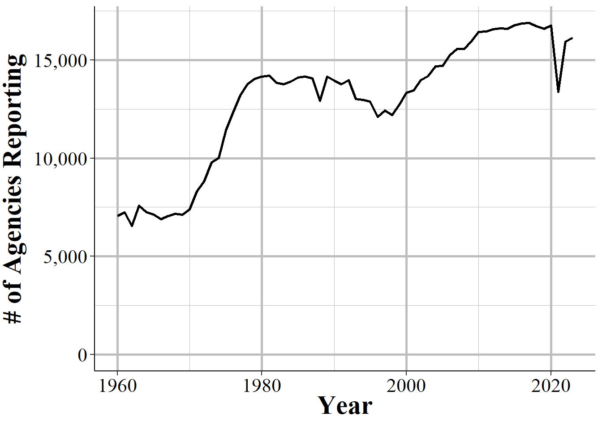
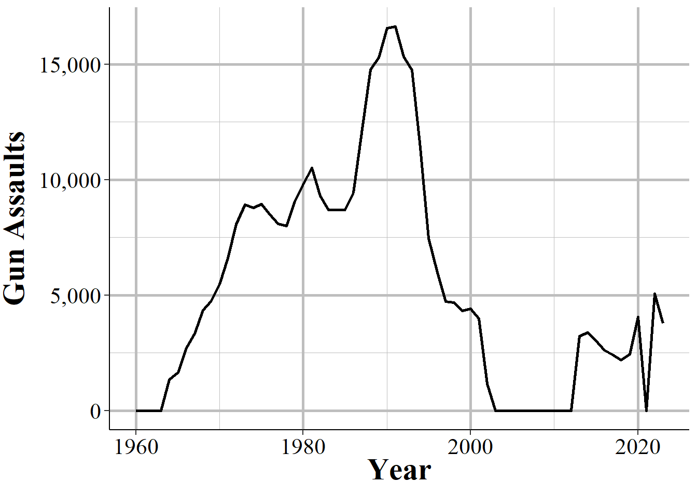
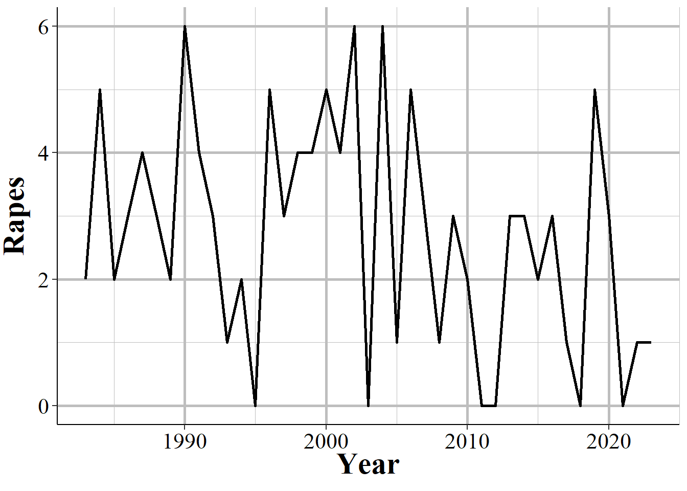

\pagenumbering{roman}
\mainmatter

# (PART) Welcome {.unnumbered}

# Preface

If you have read an article about crime or arrests in the United States in the last half century, in most cases it was referring to the FBI's Uniform Crime Reporting Program Data, otherwise known as UCR data. UCR data is, with the exception of the more detailed data that only covers murders, a *monthly number of crimes or arrests reported to a single police agency* which is then gathered by the FBI into one file that includes all reporting agencies. It is actually a collection of different data sets, all of which have information about crimes and arrests that occur in a particular jurisdiction. Think of your home town. This data will tell you how many crimes were reported for a small number of crime categories or how many people (broken down by age, sex, and race) were arrested for a (larger) set of crime categories in that city (if the city has multiple police agencies then each agency will report crimes/arrests under their jurisdiction though the largest agency - usually the local police department - will cover the vast majority of crimes/arrests in that city) in a given month.

This is a very broad measure of crime, and its uses in research - or uses for understanding crime at all - is fairly limited. Yet is has become over much of the last century - and will likely remain among researchers for at least the next decade - the most important crime data in the United States.

UCR data is important for three reasons:

1.  The definitions are standard, and all agencies (tend to) follow them so you can compare across agencies and over time.[^index-1]
2.  The data is available since 1960 (for most of the data sets) so there is a long period of available data.[^index-2]
3.  The data is available for most of the 18,000 police agencies in the United States so you can compare across agencies.

[^index-1]: We will see many examples of when agencies do not follow the definitions, which really limits this data.

[^index-2]: While the original UCR data first reported in 1929, there is only machine-readable data since 1960.

More than many other data sets, there will be times when using UCR data that you will think "that is weird". This book will cover this weirdness and when we think the weirdness is just an odd - but acceptable - quirk of the data, and when it is a sign of a big problem in the data or in that particular variable and that we should avoid using it. For most of this book we will be discussing the caveats of the above reasons - or, more directly, why these assumptions are wrong - but these are the reasons why the data is so influential.

(\#fig:nibrsAnnualPercentPopulationIndex)The annual percent of the United States population that is covered by an agency reporting data to NIBRS.

(\#fig:nibrsStateParticipation2020Index)The percent of each state's population that is covered by police agencies reporting at least one month of data to NIBRS, 2023 (using 2022 ACS 5-year Census data).

## Goal of the book

By the end of each chapter you should have a firm grasp on the data set that is covered and how to use it properly. However, this book cannot possibly cover every potential use case for the data so make sure to carefully examine the data yourself for your own particular use.

I get a lot of emails from people asking questions about this data so my own goal is to create a single place that answers as many questions as I can about the data. Again, this is among the most commonly used crime data sets and there are still many current papers published with incorrect information about the data (including such simple aspects like what geographic unit data is in and what time unit it is in). So hopefully this book will decrease the number of misconceptions about this data, increasing overall research quality.

## Structure of the book

This book will be divided into two sections: Summary Reporting System (SRS) and National Incident-Based Reporting System (NIBRS). These are the two main branches, so to speak, of FBI crime data. The SRS data is, with some exceptions, aggregate data with information about crimes and arrests at the monthly level for each police agency that reports data. This is the older branch and was the original data collected nearly a century ago when the UCR Program started in 1929. This is the much more prominent branch and most research and news reports rely on data from here. It is also a dying branch. It is being replaced by the NIBRS branch which contains far more detailed information about every crime, victim, and offender. It allows us to answer many more questions than "how many murders happened in Philadelphia in July of 2021" which are the main types of questions answered by SRS. Police agencies have increasingly reported NIBRS rather than SRS data, particularly since 2015 when the FBI stated an ending date to their SRS collection. The FBI formally killed the SRS branch in 2020 when they stopped collecting data from this branch and only allowed submissions from NIBRS. 

But this is quite a misnomer. First, while the FBI did indeed stop collecting SRS data - or at least some of the data sets from SRS - starting January 1, 2021, they quickly backtracked and began accepting all SRS data again starting in 2022. Second, NIBRS data can be converted to SRS data through some basic data cleaning and aggregation so collecting NIBRS effectively means also collecting SRS data. And when agencies report only NIBRS the FBI converts and releases that data as its SRS version. So SRS data will never die, even if the FBI again decides to stop collecting it.^[Which I suspect they will eventually as NIBRS reporting rates increase above 90%. Though at this point ]

In fact I'd argue that the SRS branch will always be the most important branch

But this is a bit of a misnomer. 

ten chapters: this chapter, an intro chapter briefly summarizing each data set and going over overall issues with UCR data, and seven chapters each covering one of the seven UCR data sets. The final chapter will cover county-level UCR data, a commonly used but highly flawed aggregation of UCR data that I recommend against using. Each chapter will follow the same format: we will start with a brief summary of the data such as when it first because available and how it can be used. Next we will look at how many agencies report their data to this data set, often looking at how to measure this reporting rate a couple of different ways. Finally, we will cover the important variables included in the data and how to use them properly (including not using them at all) - this will be the bulk of each chapter.

## How to identify a particular agency (ORI codes) {#ori}

In NIBRS and other FBI data sets, agencies are identified using **OR**iginating Agency **I**dentifiers or an ORI. An ORI is a unique ID code used to identify an agency.[^index-3] If we used the agency's name we would end up with some duplicates since there can be multiple agencies in the country (and in a state, those this is very rare) with the same name. For example, if you looked for the Philadelphia Police Department using the agency name, you would find both the "Philadelphia Police Department" in Pennsylvania and the one in Mississippi. Each ORI is a 9-digit value starting with the state abbreviation[^index-4] followed by 7 numbers. In the UCR data (another FBI data set) the ORI uses only a 7-digit code - with only the 5 numbers following the state abbreviation instead of 7. So the NIBRS ORI codes are sometimes called ORI9. For nearly all agencies, the only difference between the UCR ORI and the NIBRS ORI is that the NIBRS ORI has "00" at the end so it is technically 9 characters long but is not any more specific than the 7-character UCR ORI code.

[^index-3]: This is referred to as an "ORI", "ORI code", and "ORI number", all of which mean the same thing.

[^index-4]: The abbreviation for Nebraska is "NB" rather than the more commonly used "NE."

When dealing with specific agencies, make sure to use the ORI rather than the agency name to avoid any mistakes. For an easy way to find the ORI number of an agency, use [this page](https://crimedatatool.com/crosswalk.html) on my site. Type an agency name or an ORI code into the search section and it will return everything that is a match.

## Common issues

In this section we will discuss issues common to most or all of the SRS data sets. For some of these, we will come back to the issues in more detail in the chapter for the data sets most affected by the problem.

### Population

Each of the SRS data sets include a population variable that has the estimated population under the jurisdiction of that agency.[^index-10] This variable is often used to create crime rates that control for population. In cases where jurisdiction overlaps, such as when a city has university police agencies or county sheriffs in counties where the cities in that county have their own police, SRS data assigns the population covered to the most local agency and zero population to the overlapping agency. So an agency's population is the number of people in that jurisdiction that is not already covered by a different agency.

[^index-10]: Jurisdiction here refers to the boundaries of the local government, not any legal authority for where the officer can make arrests. For example, the Los Angeles Police Department's jurisdiction in this case refers to crimes that happen inside the city or are otherwise investigated by the LAPD - and are not primarily investigated by another agency.

For example, the city of Los Angeles in California has nearly four million residents according to the US Census. There are multiple police agencies in the city, including the Los Angeles Police Department, the Los Angeles County Sheriff's Office, the California Highway Patrol that operates in the area, airport and port police, and university police departments. If each agency reported the number of people in their jurisdiction - which all overlap with each other - we would end up with a population far higher than LA's four million people. To prevent double-counting population when agency's jurisdictions overlap, the non-primary agency will report a population of 0, even though they still report crime data like normal. As an example, in 2018 the police department for California State University - Los Angeles reported 92 thefts and a population of 0. Those 92 thefts are not counted in the Los Angeles Police Department data, even though the department counts the population. To get complete crime counts in Los Angeles, you would need to add up all police agencies within in the city; since the population value is 0 for non-LAPD agencies, both the population and the crime sum will be correct.

The SRS uses this method even when only parts of a jurisdiction overlaps. Los Angeles County Sheriff has a population of about one million people, far less than the actual county population (the number of residents, according to the Census) of about 10 million people. This is because the other nine million people are accounted for by other agencies, mainly the local police agencies in the cities that make up Los Angeles County.

The population value is the population who reside in that jurisdiction and does not count people who are in the area but do not live there, such as tourists or people who commute there for work. This means that using the population value to determine a rate can be misleading as some places have much higher numbers of non-residents in the area (e.g. Las Vegas, Washington D.C.) than others.

### Voluntary reporting {#voluntary}

When an agency reports their data to the FBI, they do so voluntarily - there is no national requirement to report.[^index-11] This means that there is inconsistency in which agencies report, how many months of the year they report for, and which variables they include in their data submissions.

[^index-11]: Some states do mandate that their agencies report, but this is not always followed.

(\#fig:nibrsAnnualNumberAgenciesIndex)The annual number of police agencies that report data to NIBRS.

In general, more agencies report their data every year and once an agency begins reporting data they tend to keep reporting. The SRS data sets are a collection of separate, though related, data sets and an agency can report to as many of these data sets as they want - an agency that reports to one data set does not mean that they report to other data sets. Figure \@ref(fig:SRSagenciesReporting) shows the number of agencies that submitted at least one month of data to the Offenses Known and Clearances by Arrest data in the given year. For the first decade of available data under 8,000 agencies reported data and this grew to over 13,500 by the late 1970s before plateauing for about a decade. The number of agencies that reported their data actually declined in the 1990s, driven primarily by many Florida agencies temporarily dropping out, before growing steadily to nearly 17,000 agencies in 2010; from here it kept increasing but slower than before.

(\#fig:SRSagenciesReporting)The annual number of agencies reporting to the Offenses Known and Clearances by Arrest data set. Reporting is based on the agency reporting at least one month of data in that year.

There are approximately 18,000 police agencies in the United States so recent data has reports from nearly all agencies, while older data has far fewer agencies reporting. When trying to estimate to larger geographies, such as state or national-level, later years will be more accurate as you are missing less data. For earlier data, however, you are dealing with a smaller share of agencies meaning that you have a large amount of missing data and a less representative sample.

This voluntariness extends beyond whether they report or not, but into which variables they report. While in practice most agencies report every crime when they report any, they do have the choice to report only a subset of offenses. This is especially true for subsets of larger categories - such as gun assaults, a subset of aggravated assaults, or marijuana possession arrests which is a subset of drug possession arrests. As an example, Figure \@ref(fig:nycGunAssaults) shows the annual number of aggravated assaults with a gun in New York City. In 2003 the New York Police Department stopped reporting this category of offense, resuming only in 2013. They continued to report the broader aggravated assault category, but not any of the subsections of aggravated assaults which say which weapon was used during the assault.

(\#fig:nycGunAssaults)Monthly reports of gun assaults in New York City, 1960-2023.

Given that agencies can join or drop out of the SRS program at will, and report only partial data, it is highly important to carefully examine your data to make sure that there are no issues caused by this.

Even when an agency reports SRS data, and even when they report every crime category, they can report fewer than 12 months of data. In some cases they simply report all of their data in December, or report quarterly or semi-annually so some months have zero crimes reported while others count multiple months in that month's data. One example of this is New York City, shown in Figure \@ref(fig:nycMurderMonthly), in the early-2000s to the mid-2010s where they began reporting data quarterly instead of monthly.

(\#fig:nycMurderMonthly)Monthly murders in New York City, 1990-2023. During the 2000s, the police department began reporting quarterly instead of monthly and then resumed monthly reporting.

When you sum up each month into an annual count, as shown in Figure \@ref(fig:nycMurderYearly), the problem disappears since the zero months are accounted for in the months that have the quarterly data. If you are using monthly data and only examine the data at the annual level, you will fall into the trap of having incorrect data that is hidden due to the level of aggregation examined. While cases like NYC are obvious when viewed monthly, for people that are including thousands of agencies in their data, it is unfeasible to look at each agency for each crime included. This can introduce errors as the best way to examine the data is manually viewing graphs and the automated method, looking for outliers through some kind of comparison to expected values, can be incorrect.

(\#fig:nycMurderYearly)Annual murders in New York City, 1990-2023.

In other cases when agencies report fewer than 12 months of the year, they simply report partial data and as a result undercount crimes. Figure \@ref(fig:miamiDadeMurderAnnual) shows annual murders in Miami-Dade, Florida and has three years of this issue occurring. The first two years with this issue are the two where zero murders are reported - this is because the agency did not report any months of data. The final year is in 2018, the last year of data in this graph, where it looks like murder suddenly dropped significantly. That is just because Miami-Dade only reported through June, so they are missing half of 2018.

(\#fig:miamiDadeMurderAnnual)Annual murders in Miami-Dade, Florida, 1960-2023.

### Zero crimes vs no reports

When an agency does not report, we see it in the data as reporting zero crimes, not reporting NA or any indicator that they did not report. In cases where the agency says they did not report that month we can be fairly sure (not entirely since that variable is not always accurate) that the zero crimes reported are simply that the agency did not report. In cases where the agency says they report that month but report zero crimes, we cannot be sure if that is a true no crimes reported to the agency or the agency not reporting to the SRS. As agencies can report some crimes but not others in a given month and still be considered reporting that month, just saying they reported does not mean that the zero is a true zero.

In some cases it is easy to see when a zero crimes reported is actually the agency not reporting. As Figure \@ref(fig:nycGunAssaults) shows with New York City gun assaults, there is a massive and sustained drop-off to zero crimes and then a sudden return years later. Obviously, going from hundreds of crimes to zero crimes is not a matter of crimes not occurring anymore, it is a matter of the agency not reporting - and New York City did report other crimes these years so in the data it says that they reported every month. So in agencies which tend to report many crimes - and many here can be a few as 10 a year since going from 10 to 0 is a big drop - a sudden report of zero crimes is probably just non-reporting.

Differentiating zero crimes and no reports becomes tricky in agencies that tend to report few crimes, which most small towns do. As an example, Figure \@ref(fig:danvilleRape) shows the annual reports of rape in Danville, California, a city of approximately 45,000 people. The city reports on average 2.8 rapes per year and in five years reported zero rapes. In cases like this it is not clear whether we should consider those zero years as true zeros (that no one was raped or reported their rape to the police) or whether the agency simply did not report rape data that year.

(\#fig:danvilleRape)Annual rapes reported in Danville, CA, 1960-2023.

