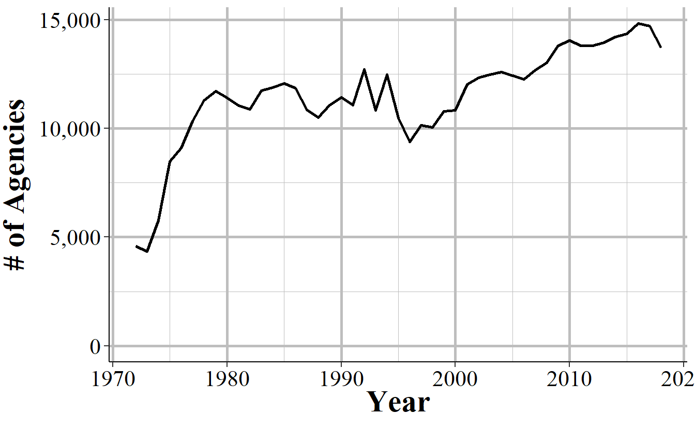

# Law Enforcement Officers Killed and Assaulted (LEOKA) {#leoka}

The Law Enforcement Officers Killed and Assaulted data, often called just by its acronym LEOKA, has two main purposes.^[This data is also sometimes called the "Police Employees" dataset.] First, it provides counts of employees employed by each agency - broken down by if they are civilian employees or sworn officers, and also broken down by gender. And second, it measures how many officers were assaulted or killed (including officers who die accidentally such as in a car crash) in a given month. The assault data is also broken down into shift type and type (e.g. alone, with a partner, on foot, in a car, etc.), the offender's weapon, and type of call they are responding to (e.g. robbery, disturbance, traffic stop). The killed data simply says how many officers are killed feloniously (i.e. murdered) or died accidentally (e.g. car crash) in a given month. The employee information is at the year-level so you know, for example, how many male police officers were employed in a given year at an agency, but don't know any more than that such as how many officers were on patrol, were detectives, were in special units, etc. This dataset is commonly used as a measure of police employees and is a generally reliable - though imperfect as we'll see - measure of how many police are employed by a police agency.  The second part of this data, measuring assaults and deaths,  is more flawed with missing data issues and data error issues (e.g. more officers killed than employed in an agency). 

## Agencies reporting

(\#fig:leokaAgencies)The annual number of police agencies that report at least month of data that year, 1960-2018

(\#fig:leokaAgencies12Months)The annual number of police agencies that report all 12 months of data that year, 1960-2018

## Important variables

### Number of employees 
 
* Female employees
    + Officers
    + Civilians
* Male employees
    + Officers
    + Civilians
    

(\#fig:leokaCivilianOfficers)The number of civilian employees and sworn officers in Philadelphia, 1960-2018

(\#fig:leokaOfficersGender)The number of female and male sworn officers in Philadelphia, 1960-2018

    
### Patrol shifts

* One officer vehicle patrol
    + Day shift
    + Evening shift
    + Night shift
    + Other shift
    + Total shifts - sum of above
* Two officer vehicle patrol
    + Day shift
    + Evening shift
    + Night shift
    + Other shift
    + Total shifts - sum of above
* One officer foot patrol
    + Day shift
    + Evening shift
    + Night shift
    + Other shift
    + Total shifts - sum of above
* Two officer foot patrol
    + Day shift
    + Evening shift
    + Night shift
    + Other shift
    + Total shifts - sum of above
* Other patrols
    + Day shift
    + Evening shift
    + Night shift
    + Other shift
    + Total shifts - sum of above
* Total patrols
    + Day shift
    + Evening shift
    + Night shift
    + Other shift
    + Total shifts - sum of above

### Officers killed

There is almost no information about officers killed. The data only breaks this down into if they died "feloniously" which just means that someone killed them on purpose (e.g. shooting them, intentionally hitting them with a car) or if they died "accidentally" such as if they die during a car crash while on duty. The FBI actually collects more information on officer deaths than they release in this data. This includes the circumstances of each death such as the type of death (e.g. car crash, shooting, ambush, etc.), what weapon the offender had if feloniously killed, and even a detailed written summary of what occurred for each officer killed. They post this information in their annual LEOKA report which is part of their Crime in the United States report. The 2019 report, the latest year available, can be found on their site [here](https://ucr.fbi.gov/leoka/2019/home).

(\#fig:leokaOfficersKilled)The number of officers killed by felony and killed accidentally in Los Angeles, 1960-2018

(\#fig:leokaOfficersKilledNational)The national number of officers killed by felony and killed accidentally, 1960-2018

### Assaults by injury and weapon

* Assaults with injury
    + Offender has firearm
    + Offender had knife
    + Offender had other weapon
    + Offender was unarmed
* Assaults without injury
    + Offender has firearm
    + Offender had knife
    + Offender had other weapon
    + Offender was unarmed
    
    

(\#fig:leokaAssaultsInjuryYear)The annual number of assaults on officers by injury sustained in Los Angeles, 1960-2018.

### Assaults by call type

* Disturbance call (e.g. domestic violence, person carrying a gun in public)
* Burglary
* Robbery
* Officers arresting someone for another crime
* Civil disorder
* Officer has custody of prisoners
* Suspicious persons
* Officers are ambushed
* Mentally deranged person
* Traffic pursuit and traffic stops
* All other call types
* Total - sum of all call types

(\#fig:leokaAssaultCallType)Assaults on Los Angeles Police Department officers by type of call where they were assaulted at, 1960-2018.

* Offender weapons
    + Offender has firearm
    + Offender had knife
    + Offender had other weapon
    + Offender was unarmed
* Type of officer assignment
    + In a vehicle with two officers
    + In a vehicle alone
    + In a vehicle alone but assisted by other officers
    + Detective or special unit alone
    + Detective or special unit assisted by other officers
    + Other assignment alone
    + Other assignment assisted by other officers
* Number of assaults on police cleared

(\#fig:leokaDisturbanceWeapon)The number of assaults on Los Angeles Police Department officers in distrubance calls by the injury sustained by the officer, 1960-2018.

(\#fig:leokaShiftAssignment)The number of assaults on Los Angeles Police Department officers in distrubance calls by the injury sustained by the shift assignment of the officer, 1960-2018.

    
### Assaults by time

* 12:01am - 2:00am
* 2:01am  - 4:00am
* 4:01am  - 6:00am
* 6:01am  - 8:00am
* 8:01am  - 10:00am
* 10:01am - 12:00pm
* 12:01pm - 2:00pm
* 2:01pm  - 4:00pm
* 4:01pm  - 6:00pm
* 6:01pm  - 8:00pm
* 8:01pm  - 10:00pm
* 10:01pm - 12:00am

(\#fig:phoenixAssaultTimes)The number of assaults against Phoenix Police Department officers by hourly grouping for all years with data available, 1971-2018.

