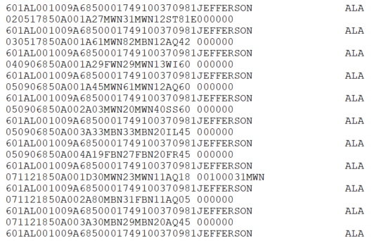

# Supplementary Homicide Reports (SHR) {#shr}


```r
knitr::opts_chunk$set(
  echo    = FALSE,
  warning = FALSE,
  error   = FALSE
)
```

This is the most detailed of the UCR datasets and provides information about the circumstances and participants (victim and offender demographics and relationship status) for homicides.^[If you're familiar with the National Incident-Based Reporting System (NIBRS) data that is replacing UCR, this dataset is the closest UCR data to it, though it is still less detailed than NIBRS data.]For each homicide incident it tells you the age, gender, race, and ethnicity of each victim and offender as well as the relationship between the first victim and each of the offenders (but not the other victims in cases where there are multiple victims). It also tells you the weapon used by each offender and the circumstance of the killing, such as a "lovers triangle" or a gang-related murder. As with other UCR data, it also tells you the agency it occurred in and the month and year when the crime happened. 

While highly detailed compared to other UCR data, there are a number of limitations for this data. 

Since this data is voluntary to 

This    
If this "most detailed" dataset sounds disappointing - and it is! - 

## A brief history of the data

The data is available from the FBI starting in 1975 though, unlike all later years, this year only has information on a single victim and a single offender. For this reason I only release data starting in 1976 where up to 11 victims and 11 offenders are included. This data has been released every year since and the most recent year available is 2019. 

### Changes in definitions

## What does the data look like?

### Raw data

<div class="figure">

<p class="caption">(\#fig:unnamed-chunk-2)Fixed-width ASCII file for the 1985 Supplementary Homicide Reports (SHR) dataset</p>
</div>

### Cleaned data

<div class="figure">

<p class="caption">(\#fig:unnamed-chunk-3)Agency information for the 1985 Supplementary Homicide Reports (SHR) dataset</p>
</div>

<div class="figure">

<p class="caption">(\#fig:unnamed-chunk-4)Crime information for the 1985 Supplementary Homicide Reports (SHR) dataset</p>
</div>

## What variables are in the data?

### Key variables

### Known issues with the data

## Final thoughts
