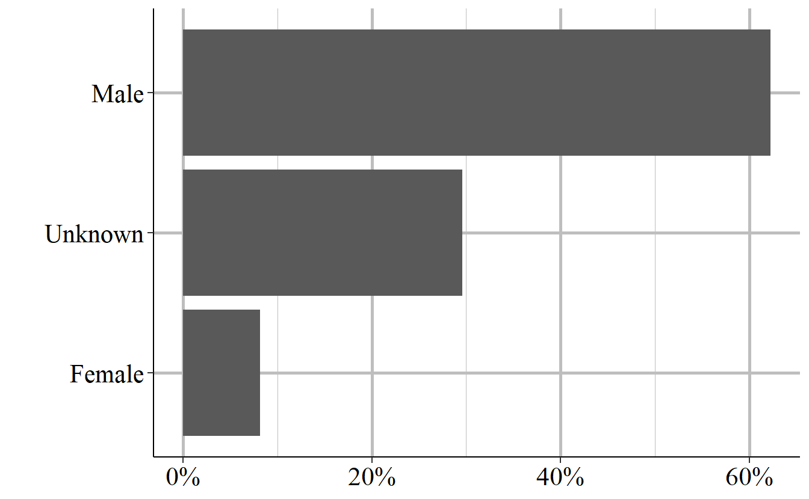

# Supplementary Homicide Reports (SHR) {#shr}


The Supplementary Homicide Reports dataset - often abbreviated to SHR -  is the most detailed of the UCR datasets and provides information about the circumstances and participants (victim and offender demographics and relationship status) for homicides.^[If you're familiar with the National Incident-Based Reporting System (NIBRS) data that is replacing UCR, this dataset is the closest UCR data to it, though it is still less detailed than NIBRS data.] For each homicide incident it tells you the age, gender, race, and ethnicity of each victim and offender as well as the relationship between the first victim and each of the offenders (but not the other victims in cases where there are multiple victims). It also tells you the weapon used by each offender and the circumstance of the killing, such as a "lovers triangle" or a gang-related murder. As with other UCR data, it also tells you the agency it occurred in and the month and year when the crime happened. 


## Agencies reporting

This data only has a report when the agency has a murder that year and since murder is rare it is difficult to measure underreporting. One way we can look at reporting is to compare murders in the SHR data with that of other datasets. We'll look at two of them: the Offenses Known and Clearances by Arrest which is covered in detail in Chapter \@ref(offensesKnown), and the Center for Disease Control and Prevention (CDC) detail on national deaths from homicide.^[CDC WONDER data is available here: https://wonder.cdc.gov/] Both this dataset and the Offenses Known and Clearances by Arrest data are UCR datasets so you may think that the numbers of murders from each dataset should be the same. That is a perfectly reasonable assumption, but since this is UCR data we're talking about, you'd be wrong. Police agencies are free to report to either, both, or neither dataset so while the number of murders are close for each dataset, they are never equal. CDC WONDER data aggregates mortality data (among other data) from state death certificates which reduces the issue of voluntary reporting that we have in UCR data.

Figure \@ref(fig:shrVsOffenses) shows the annual number of murder victims from each of these datasets starting in 1976 for the UCR data and in 1999 for the CDC data.^[1975 is actually the first year that the Supplementary Homicide Reports data is available but that dataset only has info for a single victim and offender - all later years has info for up to 11 victims and offenders - so 1976 is often used as the first year of data]. For the UCR data, in every year the numbers are fairly similar and the trends are the same over time, but the number of murders is never equal. The numbers have actually gotten worse over time with the difference between the datasets increasing and the Offenses Known data having consistently more murders reported than the SHR data since the late 1990s. Compared to the CDC data, however, both UCR datasets - and in particular the SHR data - undercount the number of murders. While trends are the same, UCR data reports thousands fewer murders per year than the CDC data, indicating how much of an issue underreporting is in this data.

<div class="figure" style="text-align: center">

<p class="caption">(\#fig:shrVsOffenses)The annual number of murders from the Supplementary Homicide Report and the Offenses Known and Clearances by Arrest dataset. Numbers differ because agencies voluntarily report and may not report to both datasets.</p>
</div>

## Important variables

There data has demographic information for up to 11 victims and 11 offenders, as well as the information on the weapon used by each offender, the relationship between the first victim and each offender, and the circumstance of the murder. The data also has the traditional UCR set of variables about the agency: their ORI code, population, state, region and the month and year of this data. One key variable that is missing is the outcome of the homicide: there is no information on whether any of the offenders were arrested. 

While there is information on up to 11 victims and offenders, in most cases, there is only a single victim and a single offender in each incident. To see how the breakdown for the number of victims in each incident looks, Figure \@ref(fig:numberSHRVictims) shows the percent of incidents with each possible number of victims.^[There is one incident where there are a reported 12 victims. For simplicity of the graph, this incident is not included.] In nearly all incidents - 96.1% - there was only a single victim. This drops to 3.2% of incidents for two victims, 0.5% for three victims, and only about 0.2% of incidents have four or more victims. 

<div class="figure" style="text-align: center">

<p class="caption">(\#fig:numberSHRVictims)The percent of incidents from 1976-2018 that have 1-11 victims.</p>
</div>

Figure \@ref(fig:numberSHROffenders) shows the breakdown of the number of offenders per homicide incident.^[There is one incident where there are a reported 22 offenders and one with 12 offenders. For simplicity of the graph, these incidents are not included.] It's a little less concentrated than with victims but the vast majority of homicides are committed by one offender - or at least the police only report one offender. About 88% of homicides have only one offender, 8.2% have two, 2.4% have three, and fewer than 1% have four. Fewer than 0.5% of homicides have more than four offenders. However, this is all a bit misleading. In cases where there is no information about the offender, including how many offenders there is, the data simply days that there is a single offender. So the number of homicides with a single offender is an overcount while the number with more offenders is an overcount. 

The variable "situation" says what type of victim-offender number combination the incident is - e.g. "multiple victims/single offender", "single victim/multiple offenders", etc. - and does indicate if the number of offenders is unknown (though curiously there are over 4,000 instances where the number of offenders is unknown but they still say there are two offenders) so you can use this variable to determine if the police don't know how many offenders there is. You're still limited, of course, in that the number of offenders is always what the police think there are, and they may be wrong. So use this variable - and anything that comes from it like the percent of offenders of a certain race - with caution.  

<div class="figure" style="text-align: center">

<p class="caption">(\#fig:numberSHROffenders)The percent of incidents from 1976-2018 that have 1-11 offenders.</p>
</div>

We'll now look at a number of important variables individually. Since the data can potentially have 11 victims and 11 offenders - but in practice has only one each in the vast majority of cases - we'll only look at the first victim/offender for each of these variables. Therefore, the results will not be entirely accurate, but will still give you a good overview of the data. The figures below will use data for all homicides from 1976 to 2018 so will cover all but the most recent year of data. 

### Demographics

There are two broad categories of variables that we'll cover: demographics of the victim and offenders, and characteristics of the case. We start with demographics.

#### Age

This data includes the age (in years) for each victim and each offender. For those under one years old, it also breaks this down into those from birth to six days old "including abandoned infant" and those seven days old to 364 days old. So there's a bit more info on baby murders. It also maxes out the age at 99 so for victims or offenders older than that we don't get their exact age, just text that says "99 years or older" (which I turn to the number 99 in the figures below).  

Figure \@ref(fig:shrOffenderAge) shows the percent of murders from 1976-2018 where the first offender in the case is of each age from 0-99. Offenders with unknown ages are excluded from this graph and make up about 27% of cases. The average (mean) age is 30.9 years old (shown in orange) which is due to a long right tail; the median age is 28 years old. If you look closely at the left side of the graph you can see that there are some very young offenders, with at least one offender aged 0-10 included in the data. It's not clear from this alone that these ages are a data entry. While a two-year-old certainly couldn't murder someone, the data does include deaths caused by "children playing with gun" (homicide circumstances will be discussed in Section \@ref(circumstance)) so these ages could potentially be correct. 

If you're familiar with the age-crime curve in criminology - which basically says crime peaks in late teen years then falls dramatically - this shows that exact curve, though doesn't decline as the individual ages as quickly as we see with less serious crimes. 

<div class="figure" style="text-align: center">

<p class="caption">(\#fig:shrOffenderAge)The age of homicide offenders, based on the first offender in any homicide incident. Victims under age 1 (classified as 'birth to 7 days old, including abandoned infant' and '7 days to 364 days old') and considered 0 years old. Victims reported as '99 years or older' are considered 99 years old.</p>
</div>

Figure \@ref(fig:shrVictimAge) repeats Figure \@ref(fig:shrOffenderAge) but with victim age rather than offender age. The mean victim age (shown in orange) is 32.9 and the median age is 30. Though the age victim age is a bit younger than the average offender age, trends are relatively similar for teenagers and older where deaths spikes in the late teen years and then declines steadily. The major difference is the U-shape for younger victims - for victims under age 15, homicides peak at age 0 (i.e. younger than their first birthday) with ~1.5% of all homicides being this this age. They then decline until plateauing at around age 6 before increasing again in the early teen years. 

<div class="figure" style="text-align: center">

<p class="caption">(\#fig:shrVictimAge)The age of homicide offenders, based on the first offender in any homicide incident. Victims under age 1 (classified as 'birth to 7 days old, including abandoned infant' and '7 days to 364 days old') and considered 0 years old. Victims reported as '99 years or older' are considered 99 years old.</p>
</div>

#### Sex 

We'll next look at victim and offender sex, a simple variable since only male and female are included. 

About 62% of offenders, as seen in Figure \@ref(fig:shrOffenderSex) are male and about 8% are female, indicating a large disparity in the sex of homicide offenders. The remaining 30% of offenders do not have sex data available because the police do not know the sex of this individual. For offenders who aren't arrested, this variable may be inaccurate since it is perceived sex of the offender. 

<div class="figure" style="text-align: center">

<p class="caption">(\#fig:shrOffenderSex)The sex of offenders, 1976-2018.</p>
</div>

There is far less uncertainty for victim sex, with under 0.15% of victims having an unknown sex. Here again there is a large disparity between male and female with about 78% of victims being male and 22% being female. While there are more male victims than male offenders, this is probably just due to there being so many unknown offenders. 

<div class="figure" style="text-align: center">

<p class="caption">(\#fig:shrVictimSex)The sex of victims, 1976-2018.</p>
</div>

#### Race

This data also includes the race of the victims and offenders. This includes the following races: American Indian or Alaskan Native, Asian, Black, Native Hawaiian or Other Pacific Islander, and White. These are the only races included in the data; Hispanic is considered an ethnicity and is available as a separate, though flawed, variable. There is no category for bi- or multi-racial. As with other demographics info for offenders, in cases where no arrest is made (and we don't know in this data if one is made), there's no way to confirm the person's race (and race itself is hard to put into discrete boxes like done here) so these results may not be entirely accurate. 

Figure \@ref(fig:shrOffenderRace) shows the percent of homicides in the data by race. Black and White victims are included are similar percents, at 34.2% and 33.8% of victims, respectively. Given that Black people are only about 13% of the population while White people are 76% of the population, according to 2019 Census data, this shows a large disparity in offender race rates. There are far more Black and far fewer White offenders than would be expected from their percent of the total United States population. The next most common group is Unknown at about 30.5% of offenders. Given that so many offenders have an unknown race, the reliability of the other race measures is limited. The remaining races are Asian at 0.9% of offenders, American Indian or Alaskan Native at 0.6%, and Native Hawaiian or Other Pacific Islander at 0.004%. 

<div class="figure" style="text-align: center">

<p class="caption">(\#fig:shrOffenderRace)The race of offenders, 1976-2018.</p>
</div>

For victim race, seen in Figure \@ref(fig:shrVictimRace), only about 1% of victim races are unknown. This means we can be a lot more confidence in the race of the victims than in the race of the offender. Or, at least the challenge of categorizing people by race is not the major problem, not missing people. As with offenders, White and Black victims are the two most common races, with 49% and 47.7% of victims, respectively. There are almost double the percent of Asian victims than Asian offenders at 1.51% of victims (and 0.9% of offenders). American Indian or Alaskan Natives make up 0.8% of victims while Native Hawaiian or Pacific Islanders make up 0.005% of victims.

<div class="figure" style="text-align: center">

<p class="caption">(\#fig:shrVictimRace)The race of victims, 1976-2018</p>
</div>

#### Ethnicity

The final demographic variable is ethnicity which is whether the victim or offender is Hispanic or not Hispanic. The UCR data has a weird relationship with this variable (which is also in the Arrests by Age, Sex, and Race dataset, discussing in Chapter \@ref(arrests)) where ethnicity is technically a variable in the data but very rarely collected. As such, this is an unreliable variable that if you really want to use, needs careful attention to make sure it is being reported consistently by the agencies that you are looking at. 

The vast majority - 71.6% - of offenders have an unknown ethnicity while 21.5% are not Hispanic and 6.9% are Hispanic. 

<div class="figure" style="text-align: center">

<p class="caption">(\#fig:shrOffenderEthnicity)The ethnicity of offenders, 1976-2018.</p>
</div>

Unlike the other demographic variables, there is still a huge amount of underreporting when it comes to victim ethnicity, though still less than for offender ethnicity. 59% of victims have an unknown ethnicity. Nearly 30% of victims are reported as not Hispanic while 10.8% are reported as Hispanic.

<div class="figure" style="text-align: center">

<p class="caption">(\#fig:shrVictimEthnicity)The ethnicity of victims, 1976-2018.</p>
</div>

### Case characteristics

#### Weapon used

The first variable we'll look at is the weapon used by each offender. Table \@ref(fig:shrWeapon) shows the weapon used by the first offender in every incident from 1976 to 2018. Each offender can only be reported as having a single weapon, so this table essentially shows the number (and percent) of murders caused by this weapon. This isn't entirely true since in reality an offender could use multiple weapons and there can be multiple offenders. 

The most commonly used weapon is a handgun, which is used in nearly half of murders. This is followed by a knife or other sharp weapon used to cut at 15% of murders, and then by "firearm, type not stated" which is just a firearm where we don't know the exact type (it can include handguns) at 7.3% of murders. The fourth most common weapon is "personal weapons" at nearly 6% of murders. "Personal weapons" is a weird term to mean that there was no weapon - the "weapon" was the offender who beat the victim to death. Shotguns are involved in 5% of murders and all other weapons are involved in fewer than 5% of cases. In total there are 19 different weapons included though most are relatively uncommon. 

<div class="figure" style="text-align: center">

```{=html}
<div id="htmlwidget-168d74404fd4dc1e9578" style="width:100%;height:auto;" class="datatables html-widget"></div>
<script type="application/json" data-for="htmlwidget-168d74404fd4dc1e9578">{"x":{"filter":"none","data":[["1","2","3","4","5","6","7","8","9","10","11","12","13","14","15","16","17","18","19"],["Handgun","Knife Or Cutting Instrument","Firearm, Type Not Stated","Personal Weapons - Includes Beating","Shotgun","Other Or Unknown Weapon","Blunt Object","Rifle","Strangulation - Includes Hanging","Fire","Asphyxiation - Includes Death By Gas","Other Gun","Narcotics/Drugs - Includes Sleeping Pills","Drowning","Other Or Type Unknown","Poison - Does Not Include Gas","Explosives","Pushed Or Thrown Out of Window","Narcotics Or Drugs"],[359188,109670,52638,42763,36072,35073,33291,26314,9619,5089,4420,2668,2058,1367,586,467,374,251,48],[0.497520624525594,0.151906764401155,0.0729102604590861,0.0592321415709545,0.0499642637501454,0.0485805229127537,0.0461122284460549,0.0364482045997263,0.0133235266415128,0.00704890602751414,0.00612225675802958,0.00369551607023143,0.00285058923258481,0.00189346719190643,0.000811683814526093,0.000646853824886835,0.00051803711029481,0.000347666616802132,6.64860462410452e-05]],"container":"<table class=\"display\">\n  <thead>\n    <tr>\n      <th> <\/th>\n      <th>Weapon<\/th>\n      <th># of Incidents<\/th>\n      <th>% of Incidents<\/th>\n    <\/tr>\n  <\/thead>\n<\/table>","options":{"pageLength":100,"columnDefs":[{"targets":2,"render":"function(data, type, row, meta) {\n    return type !== 'display' ? data : DTWidget.formatRound(data, 0, 3, \",\", \".\");\n  }"},{"targets":3,"render":"function(data, type, row, meta) {\n    return type !== 'display' ? data : DTWidget.formatPercentage(data, 2, 3, \",\", \".\");\n  }"},{"className":"dt-right","targets":[2,3]},{"orderable":false,"targets":0}],"order":[],"autoWidth":false,"orderClasses":false}},"evals":["options.columnDefs.0.render","options.columnDefs.1.render"],"jsHooks":[]}</script>
```

<p class="caption">(\#fig:shrWeapon)The weapon used in a homicide incident. In cases where there are multiple offenders, shows only the primary weapon for the first offender.</p>
</div>

#### Relationship between first victim and offenders

An interesting and highly useful variable is the relationship between the first victim and each offender. To be clear, this is only for the first victim; we don't have the relationship between other victims and offenders. However, as seen earlier, this isn't *too much* of an issue since nearly all incidents only have a single victim. There are 29 possible relationship types (including "unknown" relationship) which are broken into three categories: legal family members, people known to the victim but who aren't family, and people not known to the victim. 

<div class="figure" style="text-align: center">

```{=html}
<div id="htmlwidget-4cccd2acdd5be5ee9fea" style="width:100%;height:auto;" class="datatables html-widget"></div>
<script type="application/json" data-for="htmlwidget-4cccd2acdd5be5ee9fea">{"x":{"filter":"none","data":[["1","2","3","4","5","6","7","8","9","10","11","12","13","14","15","16","17","18","19","20","21","22","23","24","25","26","27","28","29"],["Unknown","Acquaintance","Stranger","Other - Known To Victim","Wife","Friend","Girlfriend","Husband","Other Family","Son","Boyfriend","Neighbor","Daughter","Brother","Father","Mother","In-Law","Common-Law Wife","Common-Law Husband","Ex-Wife","Stepfather","Homosexual Relationship","Stepson","Sister","Ex-Husband","Stepdaughter","Employer","Employee","Stepmother"],["","Not family (but known)","Not known","Not family (but known)","Family","Not family (but known)","Not family (but known)","Family","Family","Family","Not family (but known)","Not family (but known)","Family","Family","Family","Family","Family","Family","Family","Not family (but known)","Family","Not family (but known)","Family","Family","Not family (but known)","Family","Not family (but known)","Not family (but known)","Family"],[263237,147741,111955,33426,26353,26143,19194,11700,10400,10342,9041,7569,7436,6403,5059,4578,4392,3209,2690,2205,1693,1663,1381,1344,876,747,530,422,227],[0.364616403215708,0.204639894952047,0.155071777227421,0.0462992204511078,0.0365022245122971,0.0362113480599926,0.0265861077406379,0.0162059737712548,0.0144053100188931,0.0143249727130185,0.0125229238346935,0.0104840184166348,0.0102997966635086,0.00886896154336275,0.00700735224861349,0.00634110666023968,0.00608347323105563,0.00444486921640654,0.00372598884142524,0.00305420274919801,0.0023450182559602,0.00230346447705954,0.0019128589553934,0.00186160929474926,0.00121337034389907,0.00103468909462627,0.000734116760578207,0.000584523156535855,0.000314423593681609]],"container":"<table class=\"display\">\n  <thead>\n    <tr>\n      <th> <\/th>\n      <th>Relationship<\/th>\n      <th>Category<\/th>\n      <th># of Incidents<\/th>\n      <th>% of Incidents<\/th>\n    <\/tr>\n  <\/thead>\n<\/table>","options":{"pageLength":100,"columnDefs":[{"targets":3,"render":"function(data, type, row, meta) {\n    return type !== 'display' ? data : DTWidget.formatRound(data, 0, 3, \",\", \".\");\n  }"},{"targets":4,"render":"function(data, type, row, meta) {\n    return type !== 'display' ? data : DTWidget.formatPercentage(data, 2, 3, \",\", \".\");\n  }"},{"className":"dt-right","targets":[3,4]},{"orderable":false,"targets":0}],"order":[],"autoWidth":false,"orderClasses":false}},"evals":["options.columnDefs.0.render","options.columnDefs.1.render"],"jsHooks":[]}</script>
```

<p class="caption">(\#fig:shrRelationship)The relationship between the first victim and the first offender in a homicide incident.</p>
</div>

#### Homicide circumstance {#circumstance}

We also have information on the type of the murder, which this data calls the "circumstance". This comes is relatively broad categories that leave a lot to be desired in our understanding of what led to the murder. Table \@ref(fig:shrCircumstance) shows the number and percent of each circumstance for the first victim of each murder from 1976 to 2018. This data has 33 possible circumstances which it groups into five main categories: murders that coincide with committing another crime ("felony type" murders), murders that don't coincide with another crime ("non-felony type" murders), justifiable homicides, and negligent manslaughter. 

The felony type murders are simply ones where another crime occurred during the murder. While this is called "felony type" it does include other crimes such as theft and gambling (which isn't always a felony) so is a bit of a misnomer. The "non-felony type" are murders that happen without another crime. This includes gang killings (where, supposedly, only the murder occurred), children killed by babysitters, fights among intoxicated (both of alcohol and drugs), and "lover's triangle" killings.  Justifiable homicides are when a person (civilian and police officer who kill a person committing a crime.^[This dataset is one source of information on how many people police kill each year. But it is a large undercount compared to other sources such as the Washington Post collection, so is not a very useful source of information on this topic.] Negligent manslaughter includes accidental shootings such as when children find and shoot a gun, but excludes deaths from traffic accidents. 

The most common circumstances, accounting for 27.4%, 26.4%, and 12.5%, respectively, are "other arguments", "unknown", and "other non-felony type - not specified". Since the data includes "argument over money or property" as one category, the "other arguments" mean that it's an argument for a reason other than over money or property. The "other non-felony type" one does not mean that the murder did not occur alongside another crime, but also doesn't fall into the non-felony categories included. Robbery is the only remaining circumstance with more than 5% of murders, at 8%. 

<div class="figure" style="text-align: center">

```{=html}
<div id="htmlwidget-fd51b65a06c0988da40e" style="width:100%;height:auto;" class="datatables html-widget"></div>
<script type="application/json" data-for="htmlwidget-fd51b65a06c0988da40e">{"x":{"filter":"none","data":[["1","2","3","4","5","6","7","8","9","10","11","12","13","14","15","16","17","18","19","20","21","22","23","24","25","26","27","28","29","30","31","32","33"],["Other Arguments","Unknown","Other Non-Felony Type - Not Specified","Robbery","Narcotic Drug Laws","Juvenile Gang Killings","Felon Killed By Police","Brawl Due To Influence of Alcohol","Argument Over Money Or Property","Other Felony Type - Not Specified","All Suspected Felony Type","Felon Killed By Private Citizen","Lovers Triangle","Burglary","Brawl Due To Influence of Narcotics","Gangland Killings","All Other Manslaughter By Negligence Except Traffic Deaths","Rape","Other Negligent Handling of Gun Which Resulted In Death of Another","Arson","Other Sex Offenses","Child Killed By Babysitter","Children Playing With Gun","Motor Vehicle Theft","Institutional Killings","Gambling","Larceny","Prostitution And Commercialized Vice","Other - Not Specified","Sniper Attack","Victim Shot In Hunting Accident","Gun Cleaning Death - Other Than Self-Inflicted","Abortion"],["Non-Felony Type","","Non-Felony Type","Felony Type","Felony Type","Non-Felony Type","Justifiable Homicide","Non-Felony Type","Non-Felony Type","Felony Type","Felony Type","Justifiable Homicide","Non-Felony Type","Felony Type","Non-Felony Type","Non-Felony Type","Negligent Manslaughter","Felony Type","Negligent Manslaughter","Felony Type","Felony Type","Non-Felony Type","Negligent Manslaughter","Felony Type","Non-Felony Type","Felony Type","Felony Type","Felony Type","Felony Type","Non-Felony Type","Negligent Manslaughter","Negligent Manslaughter","Felony Type"],[197905,190837,90203,57312,26489,23292,16394,15174,14667,13902,12743,12376,10372,6052,4704,4693,4339,4086,3266,2982,1408,1297,1272,1259,1055,1031,753,601,554,474,329,125,10],[0.274123353777793,0.264333283468799,0.124942517272521,0.0793843392118079,0.0366906016433134,0.0322623539384672,0.0227077550432436,0.0210179013679504,0.0203156425045294,0.0192560211425627,0.0176506601510341,0.0171423189224828,0.0143665264919192,0.00838278233022511,0.00651563253162243,0.00650039614602552,0.00601006155499781,0.00565962468626897,0.00452382139631778,0.00413044562272493,0.00195025735640399,0.00179650837447157,0.0017618802253877,0.00174387358786408,0.00146130789133964,0.00142806486821912,0.0010429998504064,0.00083246070397642,0.00076735978369873,0.000656549706630321,0.00045570644194383,0.000173140745419388,1.38512596335511e-05]],"container":"<table class=\"display\">\n  <thead>\n    <tr>\n      <th> <\/th>\n      <th>Circumstance<\/th>\n      <th>Category<\/th>\n      <th># of Incidents<\/th>\n      <th>% of Incidents<\/th>\n    <\/tr>\n  <\/thead>\n<\/table>","options":{"pageLength":100,"columnDefs":[{"targets":3,"render":"function(data, type, row, meta) {\n    return type !== 'display' ? data : DTWidget.formatRound(data, 0, 3, \",\", \".\");\n  }"},{"targets":4,"render":"function(data, type, row, meta) {\n    return type !== 'display' ? data : DTWidget.formatPercentage(data, 2, 3, \",\", \".\");\n  }"},{"className":"dt-right","targets":[3,4]},{"orderable":false,"targets":0}],"order":[],"autoWidth":false,"orderClasses":false}},"evals":["options.columnDefs.0.render","options.columnDefs.1.render"],"jsHooks":[]}</script>
```

<p class="caption">(\#fig:shrCircumstance)The circumstance of the homicide for the first offender in a homicide incident.</p>
</div>

#### Homicide subcircumstance

The "subcircumstance" just tells you more information about justifiable homicides. This includes the circumstance leading up to the "felon" - which is how the person killed is described, though technically they don't need to have committed a felony - was killed. It includes if this person attached an officer (the one who killed them), a different officer, a civilian, or was committing or fleeing a crime. 

<div class="figure" style="text-align: center">

```{=html}
<div id="htmlwidget-b218fe167dece777d134" style="width:100%;height:auto;" class="datatables html-widget"></div>
<script type="application/json" data-for="htmlwidget-b218fe167dece777d134">{"x":{"filter":"none","data":[["1","2","3","4","5","6","7"],["Felon Killed In Commission of A Crime","Felon Attacked Police Officer","Felon Attacked A Civilian","Not Enough Information To Determine","Felon Resisted Arrest","Felon Attacked Fellow Police Officer","Felon Attempted Flight From A Crime"],[10320,8553,4498,2423,1226,951,799],[0.358706986444213,0.297288842544317,0.15634341327772,0.0842196732707682,0.0426138338547098,0.0330552659019812,0.0277719847062913]],"container":"<table class=\"display\">\n  <thead>\n    <tr>\n      <th> <\/th>\n      <th>Subcircumstance<\/th>\n      <th># of Incidents<\/th>\n      <th>% of Incidents<\/th>\n    <\/tr>\n  <\/thead>\n<\/table>","options":{"pageLength":100,"columnDefs":[{"targets":2,"render":"function(data, type, row, meta) {\n    return type !== 'display' ? data : DTWidget.formatRound(data, 0, 3, \",\", \".\");\n  }"},{"targets":3,"render":"function(data, type, row, meta) {\n    return type !== 'display' ? data : DTWidget.formatPercentage(data, 2, 3, \",\", \".\");\n  }"},{"className":"dt-right","targets":[2,3]},{"orderable":false,"targets":0}],"order":[],"autoWidth":false,"orderClasses":false}},"evals":["options.columnDefs.0.render","options.columnDefs.1.render"],"jsHooks":[]}</script>
```

<p class="caption">(\#fig:shrSubCircumstance)The circumstance for the first offender in a homicide incident in cases where the offender is killed. This includes incidents where the only person who dies in the offender.</p>
</div>

