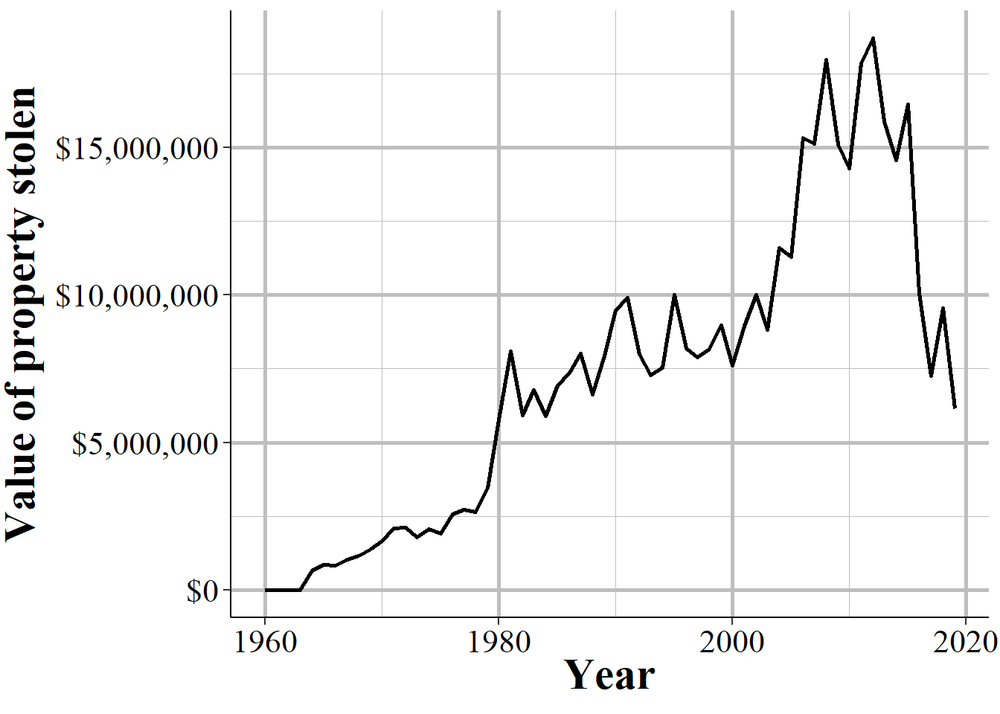
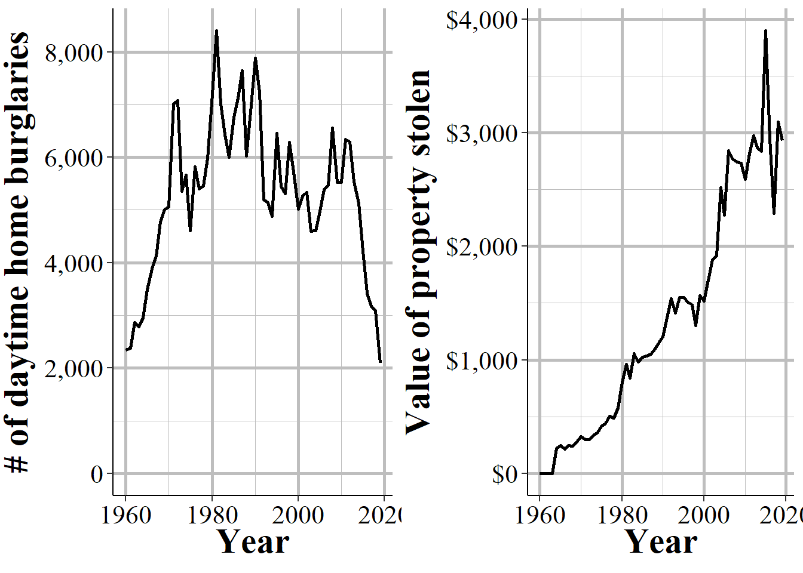
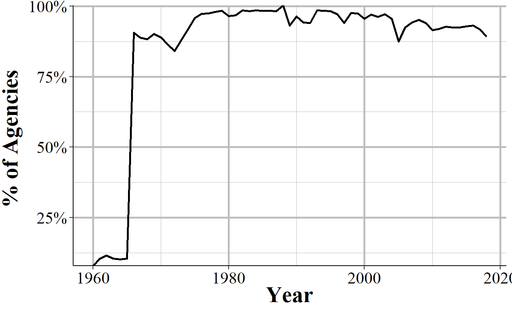
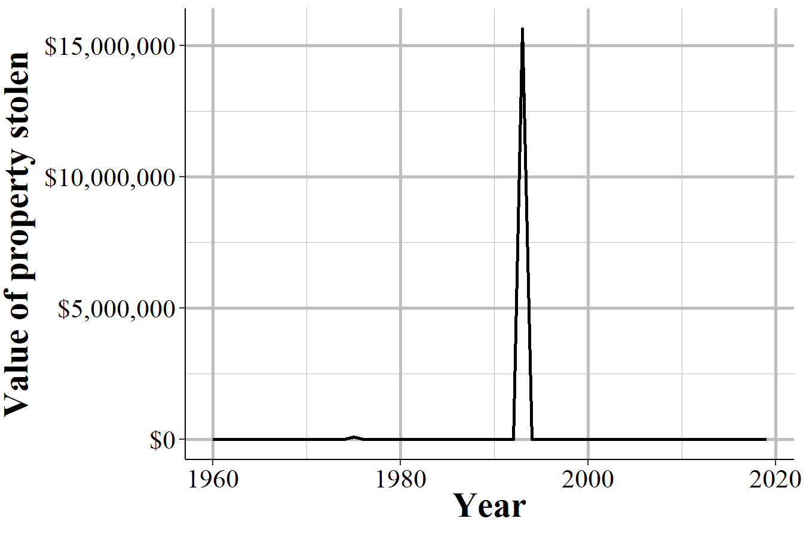
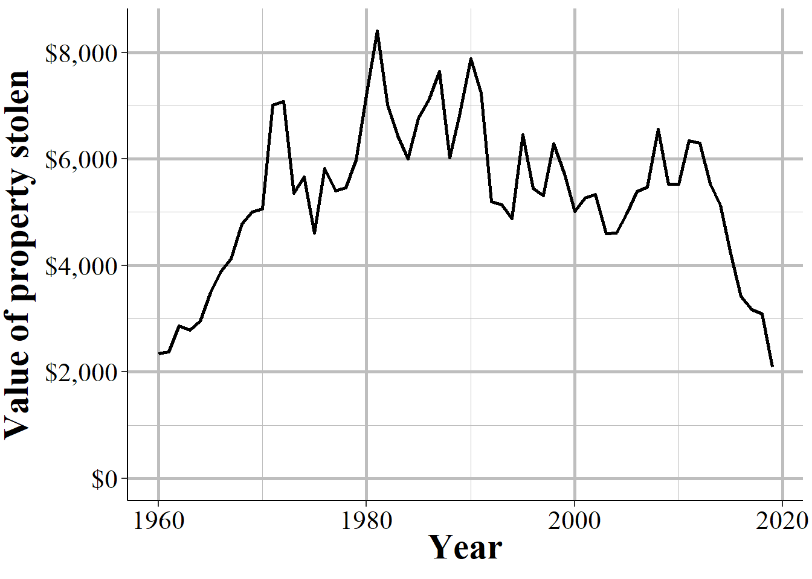

# Property Stolen and Recovered (Supplement to Return A) {#stolen_property}

The Property Stolen and Recovered data - sometimes called the Supplement to Return A (Return A being another name for the Offenses Known and Clearances by Arrest dataset, the "crime" dataset) - provides monthly information about property-related offenses (theft, motor vehicle theft, robbery, and burglary), including the location of the offense (in broad categories like "gas station" or "residence), what was stolen (e.g. clothing, livestock, firearms), and how much the stolen items were worth.^[It also includes the value of items stolen during rapes and murders, if anything was stolen.] The "recovered" part of this dataset covers the type and value of property recovered so you can use this, along with the type and value of property stolen, to determine what percent and type of items the police managed to recover. Like other UCR datasets this is at the agency-month level so you can, for example, learn how often burglaries occur at the victim's home during the day, and if that rate changes over the year or differs across agencies. 

The data, however, provides no information about the offender or the victim (other than if the victim was an individual or a commercial business [based on the location of the incident - "bank", "gas station", etc]). The value of the property stolen is primarily based on the victim's estimate of how much the item is worth (items that are decreased in value once used - such as cars - are supposed to be valued at the current market rate, but the data provides no indication of when it uses the current market rate or the victim's estimate) so it should be used as a very rough estimate of value.  

This data is highly useful to use as a rough measure of the cost of crime. This cost is limited to just the value of the property stolen - so excludes things like injuries, mental health effects of victimization, etc. - but is still better than nothing. Since this data includes both the number of offenses per month (broken down by type of theft and items stolen) and the value of the stolen property, we can also see if the average value of these thefts change over time.

(\#fig:phillyHomeBurglary2)The annual number of burglaries and cost per burglary for daytime home burglaries in Philadelphia, 1960-2019.

## Agencies reporting

We'll start by looking at which agencies report. The data is available from 1960 through 2019 though the columns about the value of the property only begin in 1964. Figure \@ref(fig:propertyAgencies) show the number of agencies each year that reported at least one month during that year. In the first several years of data barely any agencies reported data and then it spiked around 1966 to over 6,000 agencies per year then grew quickly until over 12,000 agencies reported data in the late 1970s. From here it actually gradually declined until fewer than 12,000 agencies in the late 1990s before reversing course again and growing to about 15,000 agencies by 2019 - down several hundred agencies from the peak a few years earlier. 

(\#fig:propertyAgencies)The annual number of police agencies that report at least month of data that year.

Since this data is called the "Supplement to Return A" we would expect that the agencies that report here are the same as the ones that report to the Offenses Known and Clearances by Arrest data, which is also called the Return A dataset. Figure \@ref(fig:agenciesInBoth) shows the percent of agencies in this dataset that are also in the Return A data. Except for the first several years of data in the 1960s, we can see that most years have nearly all agencies reporting to both, though this has declined in recent years. Since the late 1970s nearly 90% of agencies that report to the Offenses Known data also report to this dataset. 

(\#fig:agenciesInBoth)The percent of agencies in the Supplement to Return A data that are also in the Offenses Known and Clearances by Arrest (Return A) data in that year, 1960-2019.

## Important variables

This data can really be broken into two parts: the monthly number of property (including robbery) crimes that occur that are more detailed than in the Offenses Known data, and the value of the property stolen (and recovered) from these crimes.^[I'm really not sure why this data isn't just merged with the Offenses Known data, especially the first part where it's just counts of crimes.] For each category I present the complete breakdown of the available offenses/items stolen and describe some of the important issues to know about them.

### A more detailed breakdown of property (and robbery) crimes

The first part of this data is just a monthly (or yearly in the annual data that I've released - the FBI, however, only releases data monthly so I just aggregated the months together) number of crimes of each type reported to the police (and that a police investigation discovered actually happened. For more on this process, please see Chapter \@ref(actual)). There are six crimes and their subsets included here: burglary, theft, robbery, and motor vehicle theft. The remaining two are rape and murder, but they don't break down these crimes into any subcategories.

Burglary is reported based on whether the building burgled was the victim's residence or not, and also the time of the burglary. Time is either during the day (6am-5:59pm) or night (6:pm-5:59am) or if the time is unknown. For robbery, the subcategories are based on where the robberies occurred such as if it happened in a bank, a gas station, or a street. Theft is divided into three groups based on the value of items stolen: less than \$50, \$50-\$199, and \$200 and up. Finally, motor vehicle theft is broken into where the stolen vehicle was stolen and found: stolen in the reporting agency's jurisdiction and found by the same agency, stolen in the reporting agency's jurisdiction and found by a different agency, and stolen in a different agency's jurisdiction and found by the reporting agency. The complete list of each subsection and a brief definition for the complicated ones are presented below. 

* Burglary
    + Home/residence during the day (6:00am - 5:59pm)
    + Home/residence during the night (6:00pm - 5:59am)
    + Home residence at unknown time
    + Non-residence (i.e. all buildings other than victims home) during the day (6:00am - 5:59pm)
    + Non-residence (i.e. all buildings other than victims home) during the night (6:00pm - 5:59am)
    + Non-residence (i.e. all buildings other than victims home) at unknown time
* Theft/larceny (excluding of a motor vehicle)
    + <\$50
    + \$50-\$199
    + \$200 and up
* Robbery
    + Highway - This is an old term to say a place is outside and in generally accessible and visible areas. This includes robberies on public streets and alleys.
    + Commercial building - This is robberies in a business other than ones stated below. Includes restaurants, stores, hotels, bars. 
    + Gas station
    + Chain/convenience store - a neighborhood store that generally is open late and sells food
    + Home/residence
    + Bank
    + Miscellaneous/other - This is all other robberies not already covered.
* Motor vehicle theft
    + Stolen in current agency jurisdiction and found by that agency
    + Stolen in current agency jurisdiction and found by another agency
    + Stolen in another agency's jurisdiction and recovered by current agency
* Murder
* Rape

### The value of property stolen in property (and robbery) crimes

The cost is the cost for the victim to replace the stolen item. So the current market price for that item (though factoring in the current state the item is in, e.g. if it's already damaged) and, for businesses, the cost to buy that item and *not* the cost they sell it for. This is not an exact science so I recommend only interpreting these values are estimates - and potentially rough estimates. 

This also includes the value of property stolen during rapes and murders. To be clear, this is *only* the value of the property stolen during the crime. The cost of any injuries (mental or physical) or any lasting cost to the victim, their family, and society for these crimes are not included. This, of course, vastly underestimates the cost of these crimes so please don't use this measure as a cost of crime. It is the cost of property only. 

* Burglary
    + Home/residence during the day (6:00am - 5:59pm)
    + Home/residence during the night (6:00pm - 5:59am)
    + Home residence at unknown time
    + Non-residence (i.e. all buildings other than victims home) during the day (6:00am - 5:59pm)
    + Non-residence (i.e. all buildings other than victims home) during the night (6:00pm - 5:59am)
    + Non-residence (i.e. all buildings other than victims home) at unknown time
* Murder
* Rape
* Robbery
    + Highway - This is an old term to say a place is outside and in generally accessible and visible areas. This includes robberies on public streets and alleys.
    + Commercial building - This is robberies in a business other than ones stated below. Includes restaurants, stores, hotels, bars. 
    + Gas station
    + Chain/convenience store - a neighborhood store that generally is open late and sells food
    + Home/residence
    + Bank
    + Miscellaneous/other - This is all other robberies not already covered.
* Theft/larceny (excluding of a motor vehicle)
    + Pick pocket
    + Purse snatching
    + Shoplifting
    + Stealing from a car (but not stealing the car itself)
    + Stealing parts of a car, such as the car battery or the tires
    + Stealing a bicycle
    + Stealing from a building where the offender is allowed to be in (and is not counted already as shoplifting)
    + Stealing from a "coin operated machine" which is mainly vending machines
    + All other thefts
* Currency 
    + This includes all money and signed documents that can be exchanged for money (e.g. checks). Blank checks and credit and debit cards are not included (they are in the Miscellaneous/other  category)
* Jewelry and "previous metals"
    + Only metals that are considered high value are included here. Metals that are generally worth little are counted in the Miscellaneous/other category.
* Clothing and fur 
    + This also includes items that you take with you when leaving the house (except for your phone): wallet, shoes, purse, backpacks.
* Motor vehicle stolen in current agency jurisdiction 
    + This includes only vehicles than can be driven on wheels so excludes trains and anything on water or that can fly.
* Office equipment and electronics 
    + This includes "typewriters" and "magnetic tapes" but is essentially any kind of equipment needed to run a business. So printers, computers, cash registers, computer equipment like a monitor or a mouse, and computer software. These items do not have to be stolen from a commercial building to be included in this category. 
* Sound and picture equipment 
    + This is a kind of odd category that is a product of its time. Anything that produces noise or pictures (including the fancy motion pictures) is included. This includes TVs, cameras, projectors, radios, MP3 players (but not phones that can play music) and (since again, this is a very old dataset) VHS cassettes. 
* Guns 
    + This includes all types of firearms other than toys or BB/pellet/paintball guns. 
* Home furniture 
    + This includes all of the "big things" in a house: begs, chairs, AC units, washer/dryer units, etc. However, items that are in the "Office equipment and electronics" category do not apply. 
* Consumable goods 
    + This is anything that can be consumed such as food, drinks, and drugs, or anything you use in the bathroom.
* Livestock 
    + This is all animals other than ones that you would consider a pet
* Miscellaneous/other 
    + Anything that is not part of the above categories would fall in here. Cell phones and credit cards are included. 
    
    
### Value of recovered property by type of item stolen

For the below subset of items stolen, this data includes the value of the items that were recovered. This is a subset of the section above - the value of property stolen. I don't know why but this data has more values for the property stolen than for property recovered. For example, we know how much was stolen during bank robberies but not how much was recovered from bank robberies. The only info we have for the value of recovered property is for the breakdown in the items themselves - not breakdowns of crimes such as robbery or burglary. So we can know the value of guns recovered, but not if those guns were taken from a burglary, a robbery, a theft, etc. 

Another issue is that it uses the value of the property as it is recovered, not as it is stolen. For example, if someone steals a laptop that's worth \$1,000 and then the police recover it damaged and it's now worth only \$200, we'd see \$1,000 for the stolen column for "office equipment and electronics" and only \$200 for the recovered column for that category. So an agency that recovers 100% of the items that were stolen can appear to only recover a fraction of them since the value of recovered items could be substantially lower than the value of stolen items - and there's no way to know how many items are actually recovered, we must rely on the value of stolen and recovered.^[Even if we look at the Offenses Known and Clearances by Arrest data, that only says if there was an arrest or exceptional clearance in the case, not if the property stolen was recovered]. 

The full list of items recovered included in the data are below:

* Currency 
    + This includes all money and signed documents that can be exchanged for money (e.g. checks). Blank checks and credit and debit cards are not included (they are in the Miscellaneous/other  category)
* Jewelry and "previous metals"
    + Only metals that are considered high value are included here. Metals that are generally worth little are counted in the Miscellaneous/other category.
* Clothing and fur 
    + This also includes items that you take with you when leaving the house (except for your phone): wallet, shoes, purse, backpacks.
* Motor vehicle stolen in current agency jurisdiction 
    + This includes only vehicles than can be driven on wheels so excludes trains and anything on water or that can fly.
* Office equipment and electronics 
    + This includes "typewriters" and "magnetic tapes" but is essentially any kind of equipment needed to run a business. So printers, computers, cash registers, computer equipment like a monitor or a mouse, and computer software. These items do not have to be stolen from a commercial building to be included in this category. 
* Sound and picture equipment 
    + This is a kind of odd category that is a product of its time. Anything that produces noise or pictures (including the fancy motion pictures) is included. This includes TVs, cameras, projectors, radios, MP3 players (but not phones that can play music) and (since again, this is a very old dataset) VHS cassettes. 
* Guns 
    + This includes all types of firearms other than toys or BB/pellet/paintball guns. 
* Home furniture 
    + This includes all of the "big things" in a house: begs, chairs, AC units, washer/dryer units, etc. However, items that are in the "Office equipment and electronics" category do not apply. 
* Consumable goods 
    + This is anything that can be consumed such as food, drinks, and drugs, or anything you use in the bathroom.
* Livestock 
    + This is all animals other than ones that you would consider a pet
* Miscellaneous/other 
    + Anything that is not part of the above categories would fall in here. Cell phones and credit cards are included. 
    
    
## Data errors

This dataset comes with a considerable number of data errors - basically enormous valuations for stolen property. Some of the values are so big that it is clearly an error and not just something very expensive stolen. However, this gets tricky since there can in fact simply be very expensive items stolen and make it look like an error. Some of the stolen property include variables for both the number of items of that type stolen and the total value of the items. From this we can make an average value per item stolen which can help our understanding of what was stolen. However, some items only have the value of the property stolen and the value of property recovered so we actually don't know how many of those items were stolen. These cases makes it even harder to believe that a large value is true and not just a data error since we don't know if the number of these thefts increased, causing the increase in the value reported. We'll look at a few examples of this and see how difficult it can be to trust this data.

First, we'll look at the value of livestock thefts in New York City. Livestock is one of the variables where we know the value stolen and recovered but not how many times it happened. Being a major urban city, we might expect that there are not many livestock animals in the city so the values should be low. Figure \@ref(fig:nycLivestock) shows the annual value of livestock thefts in NYC. There are two major issues here. First, In all but two years they report $0 in livestock thefts. This is likely wrong since even New York City has some livestock (even just the police horses and the horse carriages tourists like) that probably got stolen. The second issues is the massive spike of reported livestock theft value in 1993 with over \$15 million stolen (the only other year with reported thefts is 1975 with \$87,651 stolen). Clearly NYC didn't move from \$0 in thefts for decades to \$15 million in a year and then \$0 again so this is a blatant data error. 

(\#fig:nycLivestock)The annual cost of livestock thefts in New York City, 1960-2019.

(\#fig:phillyHomeBurglary)The annual cost per burglary of daytime home burglaries in Philadelphia, 1960-2019.

