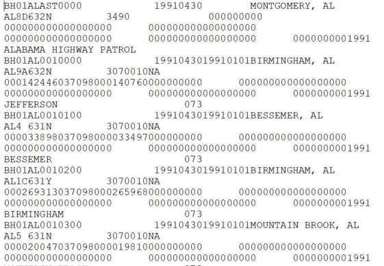

# Hate Crime Data {#hate_crimes}

This dataset covers crimes that are judged by the police to be motivated by hate More specifically, they are crimes whose motivation - at least in part - is bias towards a certain person or group of people because of characteristics about them such as race, sexual orientation, or religion. 


## A brief history of the data

### Changes in definitions

## What does the data look like?

### Raw data

```{r, fig.cap="Fixed-width ASCII file for the 1991 Hate Crime dataset"}

```

### Cleaned data

```{r, fig.cap="Agency information for the 1991 Hate Crime dataset"}
knitr::include_graphics('images/hate_crimes_agency_info.PNG')
```

```{r, fig.cap="Crime information for the 1991 Hate Crime dataset"}
knitr::include_graphics('images/hate_crimes_crime_info.PNG')
```

## What variables are in the data?

### Key variables

### Known issues with the data

## Final thoughts