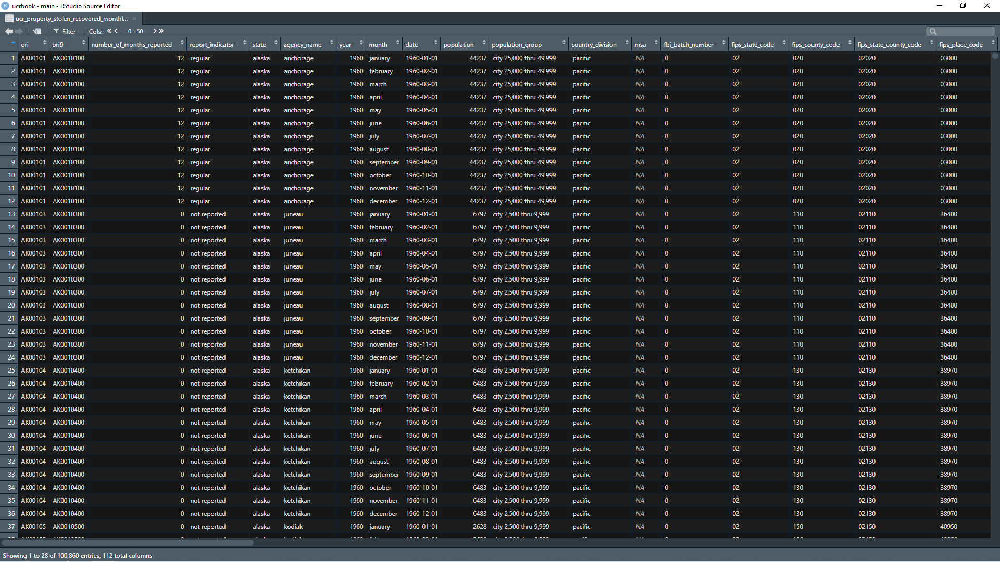

# Property Stolen and Recovered (Supplement to Return A) {#stolen_property}

## A brief history of the data

### Changes in definitions

## What does the data look like?

### Raw data

### Cleaned data

## What variables are in the data?

### Key variables

### Known issues with the data

## Final thoughts