--- 
title: "Uniform Crime Reporting (UCR) Program Data: An Opinionated Guide to FBI Data"
author: "Jacob Kaplan, Ph.D."
date: "2024-09-12"
bibliography: [book.bib]
biblio-style: apalike
link-citations: yes
colorlinks: yes
description: "This is a comprehensive guide to using the FBI's Uniform Crime Reporting Program Data, including the Summary Reporting System (SRS) files and the National Incident-Based Reporting System (NIBRS) files."
url: "https://ucrbook.com"
github-repo: "jacobkap/ucrbook"
site: bookdown::bookdown_site
documentclass: krantz
monofont: "Source Code Pro"
monofontoptions: "Scale=0.7"
graphics: yes
---


\pagenumbering{roman}
\mainmatter
# (PART) Welcome {-}

# Preface 

If you've read an article about crime or arrests in the United States in the last half century, in most cases it was referring to the FBI's Uniform Crime Reporting Program Data, otherwise known as UCR data. UCR data is, with the exception of the more detailed data that only covers murders, a *monthly number of crimes or arrests reported to a single police agency* which is then gathered by the FBI into one file that includes all reporting agencies. It is actually a collection of different datasets, all of which have information about crimes and arrests that occur in a particular jurisdiction. Think of your home town. This data will tell you how many crimes were reported for a small number of crime categories or how many people (broken down by age, sex, and race) were arrested for a (larger) set of crime categories in that city (if the city has multiple police agencies then each agency will report crimes/arrests under their jurisdiction though the largest agency - usually the local police department - will cover the vast majority of crimes/arrests in that city) in a given month. 

This is a very broad measure of crime, and its uses in research - or uses for understanding crime at all - is fairly limited. Yet is has become over much of the last century - and will likely remain among researchers for at least the next decade - the most important crime data in the United States.

UCR data is important for three reasons: 

1. The definitions are standard, and all agencies (tend to) follow them so you can compare across agencies and over time.^[We'll see many examples of when agencies do not follow the definitions, which really limits this data.]
2. The data is available since 1960 (for most of the datasets) so there is a long period of available data.^[While the original UCR data first reported in 1929, there is only machine-readable data since 1960.]
3. The data is available for most of the 18,000 police agencies in the United States so you can compare across agencies. 

More than many other datasets, there will be times when using UCR data that you'll think "that's weird". This book will cover this weirdness and when we think the weirdness is just an odd - but acceptable - quirk of the data, and when it is a sign of a big problem in the data or in that particular variable and that we should avoid using it. For most of this book we'll be discussing the caveats of the above reasons - or, more directly, why these assumptions are wrong - but these are the reasons why the data is so influential. 

<div class="figure" style="text-align: center">
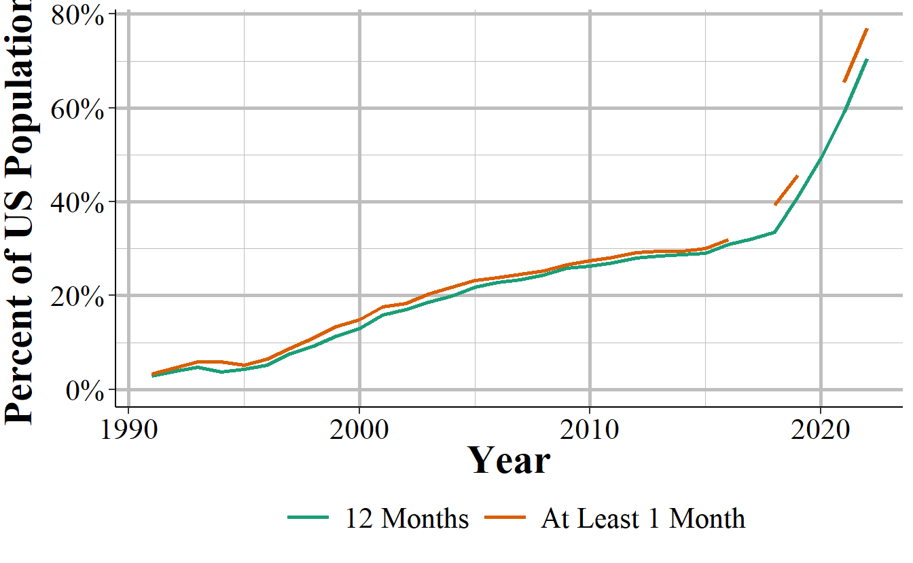
<p class="caption">(\#fig:nibrsAnnualPercentPopulationIndex)The annual percent of the United States population that is covered by an agency reporting data to NIBRS.</p>
</div>


<div class="figure" style="text-align: center">
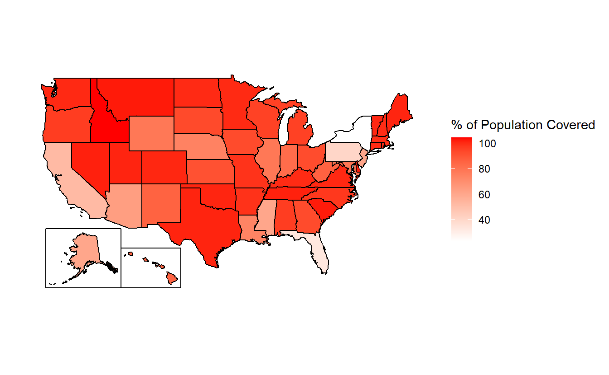
<p class="caption">(\#fig:nibrsStateParticipation2020Index)The percent of each state's population that is covered by police agencies reporting at least one month of data to NIBRS, 2022.</p>
</div>

## Goal of the book

By the end of each chapter you should have a firm grasp on the dataset that is covered and how to use it properly. However, this book can't possibly cover every potential use case for the data so make sure to carefully examine the data yourself for your own particular use. 

I get a lot of emails from people asking questions about this data so my own goal is to create a single place that answers as many questions as I can about the data. Again, this is among the most commonly used crime datasets and there are still many current papers published with incorrect information about the data (including such simple aspects like what geographic unit data is in and what time unit it is in). So hopefully this book will decrease the number of misconceptions about this data, increasing overall research quality.

## Structure of the book

This book will be divided into ten chapters: this chapter, an intro chapter briefly summarizing each dataset and going over overall issues with UCR data, and seven chapters each covering one of the seven UCR datasets. The final chapter will cover county-level UCR data, a commonly used but highly flawed aggregation of UCR data that I recommend against using. Each chapter will follow the same format: we'll start with a brief summary of the data such as when it first because available and how it can be used. Next we'll look at how many agencies report their data to this dataset, often looking at how to measure this reporting rate a couple of different ways. Finally, we'll cover the important variables included in the data and how to use them properly (including not using them at all) - this will be the bulk of each chapter. 

## Citing this book

If this data was useful in your research, please cite it. To cite this book, please use the below citation: 

Kaplan J (2024). *Uniform Crime Reporting (UCR) Program Data: An Opinionated Guide to FBI Data*. https://ucrbook.com/. 

BibTeX format:

```bibtex
@Manual{ucrbook,
  title = {Uniform Crime Reporting (UCR) Program Data: An Opinionated Guide to FBI Data},
  author = {{Jacob Kaplan}},
  year = {2024},
  url = {https://ucrbook.com/},
}
```

## Sources of UCR data

### My own collection

#### openICPSR

#### [Crimedatatool.com][https://crimedatatool.com/]

### NACJD

### FBI (raw data)

### Raw data

### Crime Data Explorer

### Crimes in the United States report


### FBI (Crime Data Explorer)

### FBI (Crimes in the United States Report)

There are a few different sources of UCR data available today. First, and probably most commonly used, is the data put together by the [National Archive of Criminal Justice Data (NACJD)](https://www.icpsr.umich.edu/web/pages/NACJD/index.html)). This a team out of the University of Michigan who manages a huge number of criminal justice datasets and makes them available to the public. If you have any questions about crime data - UCR or other crime data - I highly recommend you reach out to them for answers. They have a collection of data and excellent documentation available for UCR data available on their site [here](https://www.icpsr.umich.edu/web/NACJD/series/57). One limitation to their data, however, is that each year of data is available as an individual file meaning that you'll need to concatenate each year together into a single file. Some years also have different column names (generally minor changes like spelling robbery "rob" one year and "robb" the next) which requires more work to standardize before you could concatenate. They also only have data through 2016 which means that the most recent years (UCR data is available through 2019) of data are (as of this writing) unavailable. 

Next, and most usable for the general public - but limited for researchers - is the FBI's official website [Crime Data Explorer](https://crime-data-explorer.fr.cloud.gov/). On this site you can chose an agency and see annual crime data (remember, UCR data is monthly so this isn't as detailed as it can be) for certain crimes (and not even all the crimes actually available in the data). This is okay for the general public but only provides a fraction of the data available in the actual data so is really not good for researchers. 

It's worth mentioning a final source of UCR information. This is the annual Crimes in the United States report released by the FBI each year around the start of October. As an example, here is the [website for the 2019 report](https://ucr.fbi.gov/crime-in-the-u.s/2019/crime-in-the-u.s.-2019). In this report is summarized data which in most cases estimates missing data and provides information about national and subnational (though rarely city-level) crime data. As with the FBI's site, it is only a fraction of the true data available so is not a very useful source of crime data for quality research. Still, this is a very common source of information used by researchers.


## Recommended reading

While this book is designed to help researchers use this data, the FBI has an excellent manual on this data designed to help police agencies submit their data. That manual, called the "Summary Reporting System (SRS) User Manual" provides excellent definitions and examples of many variables included in the data. In this book when I quote the FBI, such as defining a crime, I quote from this manual. The manual is available to download as a PDF on the FBI's site and I've also posted it on my GitHub page [here](https://github.com/jacobkap/ucrbook/blob/main/FBI%20Uniform%20Crime%20Reporting%20(UCR)%20Program%20User%20Manual.pdf) for convenience. I highly recommend that you read this manual before using the data. That manual, alongside this book which tries to explain when and how the agencies don't follow the manual, will provide a solid foundation for your understanding of UCR data.

## How to contribute to this book

If you have any questions, suggestions (such as a topic to cover), or find any issues, please make a post on the [Issues page](https://github.com/jacobkap/ucrbook/issues) for this book on GitHub. On this page you can create a new issue (which is basically just a post on this forum) with a title and a longer description of your issue. You'll need a GitHub account to make a post. Posting here lets me track issues and respond to your message or alert you when the issue is closed (i.e. I've finished or denied the request). Issues are also public so you can see if someone has already posted something similar. 

For more minor issues like typos or grammar mistakes, you can edit the book directly through its GitHub page. That'll make an update for me to accept, which will change the book to include your edit. To do that, click the edit button at the top of the site - the button is highlighted in the below figure. You will need to make a GitHub account to make edits. When you click on that button you'll be taken to a page that looks like a Word Doc where you can make edits. Make any edits you want and then scroll to the bottom of the page. There you can write a short (please, no more than a sentence or two) description of what you've done and then submit the changes for me to review.

<div class="figure" style="text-align: center">

<p class="caption">(\#fig:unnamed-chunk-3)The edit button for how to make edits of this book.</p>
</div>

Please only use the above two methods to contribute or make suggestions about the book. While it's a bit more work for you to do it this way, since you'll need to make a GitHub account if you don't already have one, it helps me organize all the questions in one place and update the book if I decide to add answers to certain questions. 

## How to identify a particular agency (ORI codes) {#ori}

In NIBRS and other FBI data sets, agencies are identified using **OR**iginating Agency **I**dentifiers or an ORI. An ORI is a unique ID code used to identify an agency.^[This is referred to as an "ORI", "ORI code", and "ORI number", all of which mean the same thing.] If we used the agency's name we'd end up with some duplicates since there can be multiple agencies in the country (and in a state, those this is very rare) with the same name. For example, if you looked for the Philadelphia Police Department using the agency name, you'd find both the "Philadelphia Police Department" in Pennsylvania and the one in Mississippi. Each ORI is a 9-digit value starting with the state abbreviation^[The abbreviation for Nebraska is "NB" rather than the more commonly used "NE."] followed by 7 numbers. In the UCR data (another FBI data set) the ORI uses only a 7-digit code - with only the 5 numbers following the state abbreviation instead of 7. So the NIBRS ORI codes are sometimes called ORI9. For nearly all agencies, the only difference between the UCR ORI and the NIBRS ORI is that the NIBRS ORI has "00" at the end so it is technically 9 characters long but isn't any more specific than the 7-character UCR ORI code. 

When dealing with specific agencies, make sure to use the ORI rather than the agency name to avoid any mistakes. For an easy way to find the ORI number of an agency, use [this page](https://crimedatatool.com/crosswalk.html) on my site. Type an agency name or an ORI code into the search section and it will return everything that is a match.


## The data as you get it from the FBI

We'll finish this overview of the SRS data by briefly talking about format of the data that is released by the FBI, before the processing done by myself or [NACJD](https://www.icpsr.umich.edu/web/pages/NACJD/index.html) that converts the data to a type that software like R or Stata or Excel can understand. The FBI releases their data as fixed-width ASCII files which are basically just an Excel file but with all of the columns squished together. As an example, Figure \@ref(fig:SRSascii) shows what the data looks like as you receive it from the FBI for the Offenses Known and Clearances by Arrest dataset for 1960, the first year with data available. In the figure, it seems like there are multiple rows but that's just because the software that I opened the file in isn't wide enough - in reality what is shown is a single row that is extremely wide because there are over 1,500 columns in this data. If you scroll down enough you'll see the next row, but that isn't shown in the current image. What is shown is a single row with a ton of columns all pushed up next to each other. Since all of the columns are squished together (the gaps are just blank spaces because the value there is a space, but that doesn't mean there is a in the data. Spaces are possible values in the data and are meaningful), you need some way to figure out which parts of the data belong in which column. 

<div class="figure" style="text-align: center">

<p class="caption">(\#fig:SRSascii)Fixed-width ASCII file for the 1960 Offenses Known and Clearances by Arrest dataset.</p>
</div>

<div class="figure" style="text-align: center">
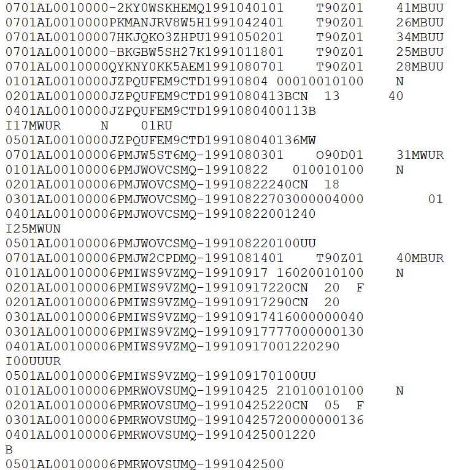
<p class="caption">(\#fig:ascii)Fixed-width ASCII file for the 1991 National Incident-Based Reporting System (NIBRS) dataset.</p>
</div>

The "fixed-width" part of the file type is how this works (the ASCII part basically means it's a text file). Each row is the same width - literally the same number of characters, including blank spaces. So you must tell the software you are using to process this file - by literally writing code in something called a "setup file" but is basically just instructions for whatever software you use (R, SPSS, Stata, SAS can all do this) - which characters are certain columns. For example, in this data the first character says which type of SRS data it is (1 means the Offenses Known and Clearances by Arrest data) and the next two characters (in the setup file written as 2-3 since it is characters 2 through 3 [inclusive]) are the state number (01 is the state code for Alabama). So we can read this row as the first column indicating it is an Offenses Known data, the second column indicating that it is for the state of Alabama, and so on for each of the remaining columns. To read in this data you'll need a setup file that covers every column in the data (some software, like R, can handle just reading in the specific columns you want and don't need to include every column in the setup file). 

The second important thing to know about reading in a fixed-width ASCII file is something called a "value label."^[For most fixed-width ASCII files there are also missing values where it'll have placeholder value such as -8 and the setup file will instruct the software to convert that to NA. SRS data, however, does not have this and does not indicate when values are missing in this manner.] For example, in the above image we saw the characters 2-3 is the state and in the row we have the value "01" which means that the state is "Alabama." Since this type of data is trying to be as small as efficient as possible, it often replaces longer values with shorter one and provides a translation for the software to use to convert it to the proper value when reading it. "Alabama" is more characters than "01" so it saves space to say "01" and just replace that with "Alabama" later on. So "01" would be the "value" and "Alabama" would be the "label" that it changes to once read. 

Fixed-width ASCII files may seem awful to you reading it today, and it is awful to use. But it appears to be an efficient way to store data back many decades ago when data releases began but now is extremely inefficient - in terms of speed, file size, ease of use - compared to modern software so I'm not sure why they *still* release data in this format. But they do, and even the more *modern* (if starting in 1991, before I was born, is modern!) NIBRS data comes in this format. For you, however, the important part to understand is not how exactly to read this type of data, but to understand that people who made this data publicly available (such as myself and the team at NACJD) must make this conversion process.^[For those interested in reading in this type of data, please see my R package asciiSetupReader.] **This conversion process, from fixed-width ASCII to a useful format is the most dangerous step taken in using this data - and one that is nearly entirely unseen by researchers.** 

Every line of code you write (or, for SPSS users, click you make) invites the possibility of making a mistake.^[Even highly experienced programmers who are doing something like can make mistakes. For example, if you type out "2+2" 100 times - something extremely simple that anyone can do - how often will you mistype a character and get a wrong result? I'd guess that at least once you'd make a mistake.] The FBI does not provide a setup file with the fixed-width ASCII data so to read in this data you need to make it yourself. Since some SRS data are massive, this involves assigning the column width for thousands of columns and the value labels for hundreds of different value labels.^[With the exception of the arrest data and some value label changes in hate crimes and homicide data, the setup files remain consistent so a single file will work for all years for a given dataset. You do not need to make a setup file for each year.] A typo anywhere could have potentially far-reaching consequences, so this is a crucial weak point in the data cleaning process - and one in which I have not seen anything written about before. While I have been diligent in checking the setup files and my code to seek out any issues - and I know that NACJD has a robust checking process for their own work - that doesn't mean our work is perfect.^[For evidence of this, please see any of the openICPSR pages for my detail as they detail changes I've made in the data such as decisions on what level to aggregate to and mistakes that I made and later found and fixed.] Even with perfection in processing the raw data to useful files, decisions we make (e.g. what level to aggregate to, what is an outlier) can affect both what type of questions you can ask when using this data, and how well you can answer them.    


## Common issues

In this section we'll discuss issues common to most or all of the SRS datasets. For some of these, we'll come back to the issues in more detail in the chapter for the datasets most affected by the problem. 

### Population

Each of the SRS datasets include a population variable that has the estimated population under the jurisdiction of that agency.^[Jurisdiction here refers to the boundaries of the local government, not any legal authority for where the officer can make arrests. For example, the Los Angeles Police Department's jurisdiction in this case refers to crimes that happen inside the city or are otherwise investigated by the LAPD - and are not primarily investigated by another agency.] This variable is often used to create crime rates that control for population. In cases where jurisdiction overlaps, such as when a city has university police agencies or county sheriffs in counties where the cities in that county have their own police, SRS data assigns the population covered to the most local agency and zero population to the overlapping agency. So an agency's population is the number of people in that jurisdiction that isn't already covered by a different agency. 

For example, the city of Los Angeles in California has nearly four million residents according to the US Census. There are multiple police agencies in the city, including the Los Angeles Police Department, the Los Angeles County Sheriff's Office, the California Highway Patrol that operates in the area, airport and port police, and university police departments. If each agency reported the number of people in their jurisdiction - which all overlap with each other - we would end up with a population far higher than LA's four million people. To prevent double-counting population when agency's jurisdictions overlap, the non-primary agency will report a population of 0, even though they still report crime data like normal. As an example, in 2018 the police department for California State University - Los Angeles reported 92 thefts and a population of 0. Those 92 thefts are not counted in the Los Angeles Police Department data, even though the department counts the population. To get complete crime counts in Los Angeles, you'd need to add up all police agencies within in the city; since the population value is 0 for non-LAPD agencies, both the population and the crime sum will be correct. 

The SRS uses this method even when only parts of a jurisdiction overlaps. Los Angeles County Sheriff has a population of about one million people, far less than the actual county population (the number of residents, according to the Census) of about 10 million people. This is because the other nine million people are accounted for by other agencies, mainly the local police agencies in the cities that make up Los Angeles County. 

The population value is the population who reside in that jurisdiction and does not count people who are in the area but don't live there, such as tourists or people who commute there for work. This means that using the population value to determine a rate can be misleading as some places have much higher numbers of non-residents in the area (e.g. Las Vegas, Washington D.C.) than others. 

### Voluntary reporting {#voluntary}

When an agency reports their data to the FBI, they do so voluntarily - there is no national requirement to report.^[Some states do mandate that their agencies report, but this is not always followed.] This means that there is inconsistency in which agencies report, how many months of the year they report for, and which variables they include in their data submissions. 

In general, more agencies report their data every year and once an agency begins reporting data they tend to keep reporting. The SRS datasets are a collection of separate, though related, datasets and an agency can report to as many of these datasets as they want - an agency that reports to one dataset does not mean that they report to other datasets. Figure \@ref(fig:SRSagenciesReporting) shows the number of agencies that submitted at least one month of data to the Offenses Known and Clearances by Arrest data in the given year. For the first decade of available data under 8,000 agencies reported data and this grew to over 13,500 by the late 1970s before plateauing for about a decade. The number of agencies that reported their data actually declined in the 1990s, driven primarily by many Florida agencies temporarily dropping out, before growing steadily to nearly 17,000 agencies in 2010; from here it kept increasing but slower than before. 

<div class="figure" style="text-align: center">
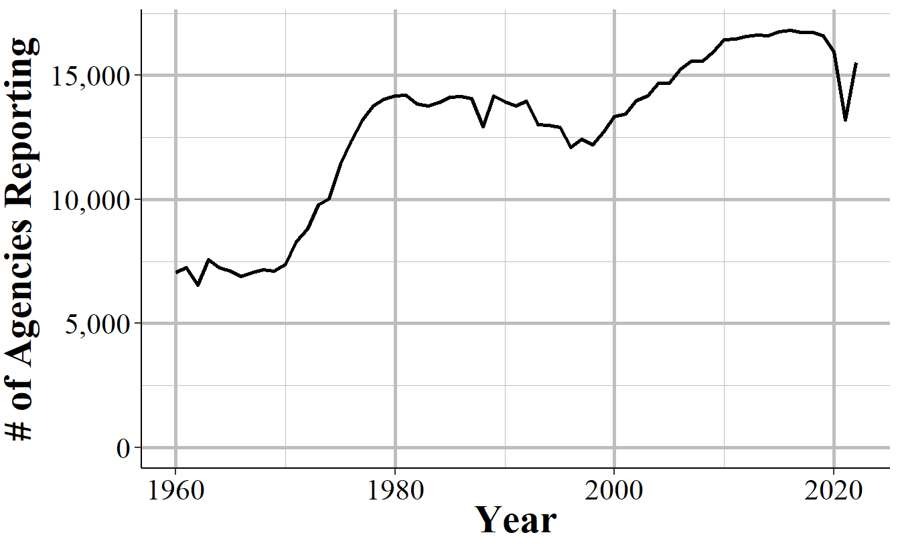
<p class="caption">(\#fig:SRSagenciesReporting)The annual number of agencies reporting to the Offenses Known and Clearances by Arrest dataset. Reporting is based on the agency reporting at least one month of data in that year.</p>
</div>

There are approximately 18,000 police agencies in the United States so recent data has reports from nearly all agencies, while older data has far fewer agencies reporting. When trying to estimate to larger geographies, such as state or national-level, later years will be more accurate as you're missing less data. For earlier data, however, you're dealing with a smaller share of agencies meaning that you have a large amount of missing data and a less representative sample. 

Figure \@ref(fig:bigAgenciesReporting) repeats the above figure but now including only agencies with 100,000 people or more in their jurisdiction. While these agencies have a far more linear trend than all agencies, the basic lesson is the same: recent data has most agencies reporting; old data excludes many agencies. 

<div class="figure" style="text-align: center">
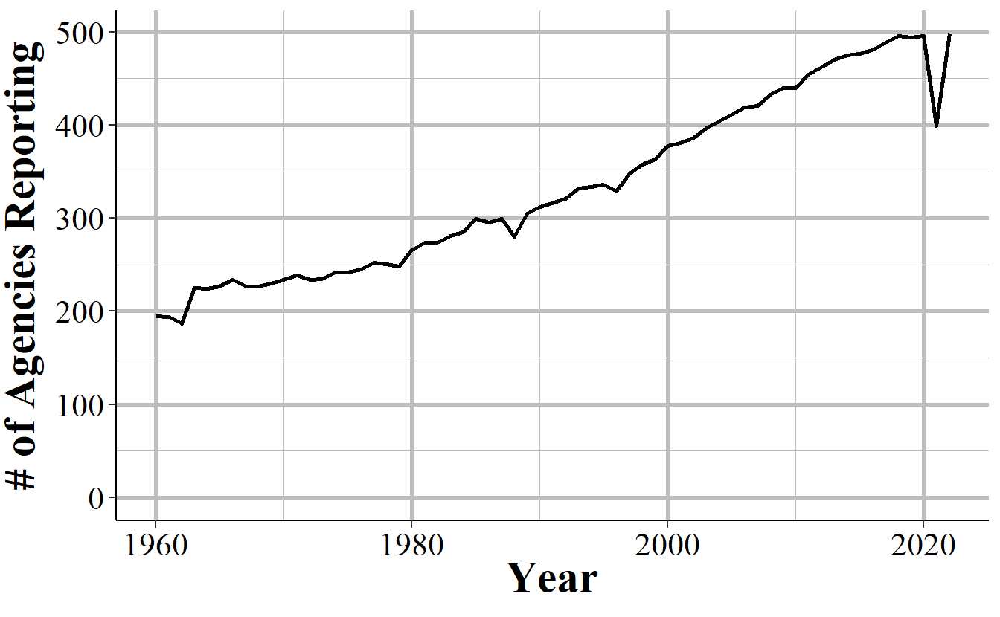
<p class="caption">(\#fig:bigAgenciesReporting)The annual number of agencies with a population of 100,000 or higher reporting to the Offenses Known and Clearances by Arrest dataset. Reporting is based on the agency reporting at least one month of data in that year.</p>
</div>

This voluntariness extends beyond whether they report or not, but into which variables they report. While in practice most agencies report every crime when they report any, they do have the choice to report only a subset of offenses. This is especially true for subsets of larger categories - such as gun assaults, a subset of aggravated assaults, or marijuana possession arrests which is a subset of drug possession arrests. As an example, Figure \@ref(fig:nycGunAssaults) shows the annual number of aggravated assaults with a gun in New York City. In 2003 the New York Police Department stopped reporting this category of offense, resuming only in 2013. They continued to report the broader aggravated assault category, but not any of the subsections of aggravated assaults which say which weapon was used during the assault.

<div class="figure" style="text-align: center">

<p class="caption">(\#fig:nycGunAssaults)Monthly reports of gun assaults in New York City, 1960-2022.</p>
</div>

Given that agencies can join or drop out of the SRS program at will, and report only partial data, it is highly important to carefully examine your data to make sure that there are no issues caused by this. 

Even when an agency reports SRS data, and even when they report every crime category, they can report fewer than 12 months of data. In some cases they simply report all of their data in December, or report quarterly or semi-annually so some months have zero crimes reported while others count multiple months in that month's data. One example of this is New York City, shown in Figure \@ref(fig:nycMurderMonthly), in the early-2000s to the mid-2010s where they began reporting data quarterly instead of monthly. 

<div class="figure" style="text-align: center">

<p class="caption">(\#fig:nycMurderMonthly)Monthly murders in New York City, 1990-2022. During the 2000s, the police department began reporting quarterly instead of monthly and then resumed monthly reporting.</p>
</div>

When you sum up each month into an annual count, as shown in Figure \@ref(fig:nycMurderYearly), the problem disappears since the zero months are accounted for in the months that have the quarterly data. If you're using monthly data and only examine the data at the annual level, you'll fall into the trap of having incorrect data that is hidden due to the level of aggregation examined. While cases like NYC are obvious when viewed monthly, for people that are including thousands of agencies in their data, it is unfeasible to look at each agency for each crime included. This can introduce errors as the best way to examine the data is manually viewing graphs and the automated method, looking for outliers through some kind of comparison to expected values, can be incorrect.   

<div class="figure" style="text-align: center">
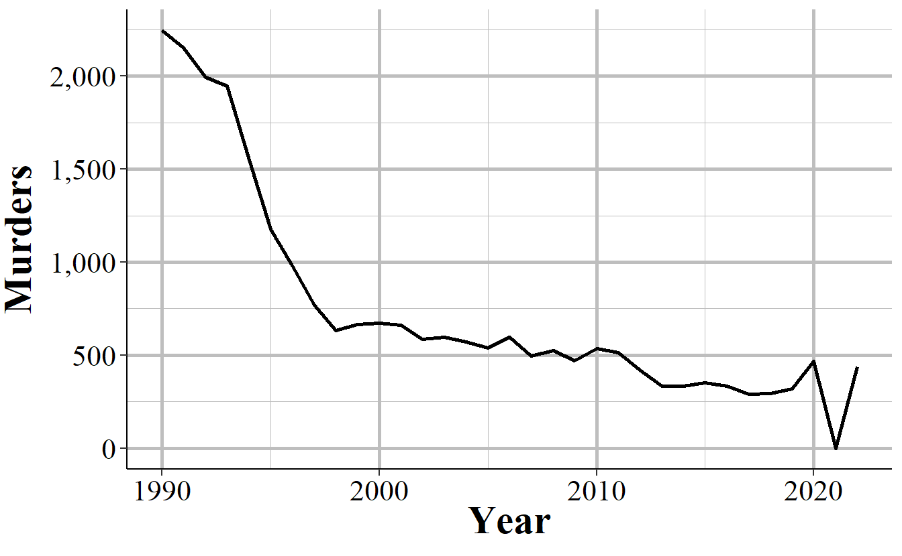
<p class="caption">(\#fig:nycMurderYearly)Annual murders in New York City, 1990-2022.</p>
</div>

In other cases when agencies report fewer than 12 months of the year, they simply report partial data and as a result undercount crimes. Figure \@ref(fig:miamiDadeMurderAnnual) shows annual murders in Miami-Dade, Florida and has three years of this issue occurring. The first two years with this issue are the two where zero murders are reported - this is because the agency didn't report any months of data. The final year is in 2018, the last year of data in this graph, where it looks like murder suddenly dropped significantly. That's just because Miami-Dade only reported through June, so they're missing half of 2018. 

<div class="figure" style="text-align: center">

<p class="caption">(\#fig:miamiDadeMurderAnnual)Annual murders in Miami-Dade, Florida, 1960-2022.</p>
</div>

### Zero crimes vs no reports

When an agency does not report, we see it in the data as reporting zero crimes, not reporting NA or any indicator that they did not report. In cases where the agency says they didn't report that month we can be fairly sure (not entirely since that variable isn't always accurate) that the zero crimes reported are simply that the agency didn't report. In cases where the agency says they report that month but report zero crimes, we can't be sure if that's a true no crimes reported to the agency or the agency not reporting to the SRS. As agencies can report some crimes but not others in a given month and still be considered reporting that month, just saying they reported doesn't mean that the zero is a true zero.

In some cases it is easy to see when a zero crimes reported is actually the agency not reporting. As Figure \@ref(fig:nycGunAssaults) shows with New York City gun assaults, there is a massive and sustained drop-off to zero crimes and then a sudden return years later. Obviously, going from hundreds of crimes to zero crimes is not a matter of crimes not occurring anymore, it is a matter of the agency not reporting - and New York City did report other crimes these years so in the data it says that they reported every month. So in agencies which tend to report many crimes - and many here can be a few as 10 a year since going from 10 to 0 is a big drop - a sudden report of zero crimes is probably just non-reporting. 

Differentiating zero crimes and no reports becomes tricky in agencies that tend to report few crimes, which most small towns do. As an example, Figure \@ref(fig:danvilleRape) shows the annual reports of rape in Danville, California, a city of approximately 45,000 people. The city reports on average 2.8 rapes per year and in five years reported zero rapes. In cases like this it's not clear whether we should consider those zero years as true zeros (that no one was raped or reported their rape to the police) or whether the agency simply didn't report rape data that year.  


<div class="figure" style="text-align: center">

<p class="caption">(\#fig:danvilleRape)Annual rapes reported in Danville, CA, 1960-2022.</p>
</div>

### Agency data covered by another agency

<!--chapter:end:index.Rmd-->

# About the Author {-}

I am a Professional Specialist at the School of Public and International Affairs (SPIA) and a member of Criminal Justice @ SPIA at Princeton University. My research focuses on law enforcement, including its impact on violent crime, the influence of removing 'bad apple' officers on reducing complaints against officers, the extent to which police forces represent the civilian populations they serve, and the role of race and political affiliations in shaping officer behavior. In addition to this, I conduct methodological research focused on the quality and usability of crime data, with a special emphasis on the FBI's Uniform Crime Reporting (UCR) Program.

I am the author of *[A Criminologist's Guide to R: Crime by the Numbers (Chapman & Hall/CRC The R Series, 2022)](https://www.routledge.com/A-Criminologists-Guide-to-R-Crime-by-the-Numbers/Kaplan/p/book/9781032244075)*, an introductory textbook on the R programming language tailored for crime research, with a special focus on data cleaning and analysis. In addition, I have developed several R packages, including [fastDummies](https://jacobkap.github.io/fastDummies/), [asciiSetupReader](https://jacobkap.github.io/asciiSetupReader/), and [predictrace](https://jacobkap.github.io/predictrace/), to streamline the data analysis process for researchers. My website, [Crime Data Tool](https://crimedatatool.com/), offers users an interactive platform to explore crime data from thousands of agencies across hundreds of variables (e.g., arrests, offenses, demographics)—no data or programming skills required.

My research has been published in leading academic journals, such as the *Journal of Quantitative Criminology*, *Journal of Research in Crime and Delinquency*, *Journal of Interpersonal Violence*, and *American Political Science Review*. I hold a B.S. in Criminal Justice from California State University, Sacramento, and a master's and Ph.D. in Criminology from the University of Pennsylvania. I previously served on the FBI’s Criminal Justice Information Services (CJIS) Advisory Policy Board (APB) Uniform Crime Reporting (UCR) Subcommittee.

<!--chapter:end:01_author.Rmd-->

# Supplementary Homicide Reports (SHR) {#shr}


The Supplementary Homicide Reports dataset - often abbreviated to SHR - is the most detailed of the SRS datasets and provides information about the circumstances and participants (victim and offender demographics and relationship status) for homicides. For each homicide incident it tells you the age, gender, race, and ethnicity of each victim and offender as well as the relationship between the first victim and each of the offenders (but not the other victims in cases where there are multiple victims). It also tells you the weapon used by each offender and the circumstance of the killing, such as a "lovers triangle" or a gang-related murder. As with other SRS data, it also tells you the agency it occurred in and the month and year when the crime happened. 

One important point of clarification: this is not the number of murders, though it does track that. This data also includes the number of homicides that are manslaughter by negligence (e.g. children playing with a gun, hunting accident) and justifiable homicides (i.e. not criminal). So be carefully when speaking about this data. It is murders but not only murders so you want to speak precisely. 


## Agencies reporting

This data only has a report when the agency has a homicide that year and since homicides are relatively rare it is difficult to measure underreporting. One way we can look at reporting is to compare homicide in the SHR data with that of other datasets. We'll look at two of them: the Offenses Known and Clearances by Arrest which is covered in detail in Chapter \@ref(offensesKnown), and the Center for Disease Control and Prevention (CDC) data on national deaths from homicide.^[CDC WONDER data is available here: https://wonder.cdc.gov/] Both this dataset and the Offenses Known and Clearances by Arrest data are SHR datasets so you may think that the numbers of homicides from each dataset should be the same. That is a perfectly reasonable assumption, but since this is SHR data we're talking about, you'd be wrong. Police agencies are free to report to either, both, or neither dataset so while the number of homicides are close for each dataset, they are never equal. CDC WONDER data aggregates mortality data (among other data) from state death certificates which reduces the issue of voluntary reporting that we have in SHR data.

Figure \@ref(fig:shrVsOffenses) shows the annual number of homicide victims (including murders and manslaughters) from each of these datasets starting in 1976 for the SHR data and in 1999 for the CDC data.^[1975 is actually the first year that the Supplementary Homicide Reports data is available but that dataset only has info for a single victim and offender - all later years has info for up to 11 victims and offenders - so 1976 is often used as the first year of data] 

For the SHR data, in every year the numbers are fairly similar and the trends are the same over time, but the number of homicides is never equal. The numbers have actually gotten worse over time with the difference between the datasets increasing and the Offenses Known data having consistently more murders reported than the SHR data since the late 1990s. Compared to the CDC data, however, both SHR datasets - and in particular the SHR data - undercount the number of homicides. While trends are the same, SHR data reports thousands fewer murders per year than the CDC data, indicating how much of an issue underreporting is in this data.

<div class="figure" style="text-align: center">

<p class="caption">(\#fig:shrVsOffenses)The annual number of murders and nonngeligent manslaughters from the Supplementary Homicide Report and the Offenses Known and Clearances by Arrest dataset, and homicides from the Center for Disease Control (CDC). Numbers differ because agencies voluntarily report and may not report to both datasets.</p>
</div>

Let's look at Chicago for another example of the differences in reporting from the SHR and the Offenses Known data. Figure \@ref(fig:chicagoSHRvsOffensesKnown) shows the annual number of homicide victims from both datasets. In most years they are pretty similar, excluding a few really odd years in the 1980s and in 1990. But what's also strange is that most years have more SHR victims than Offenses Known victims. So nationally SHR has fewer homicides than Offenses Known but that pattern is reversed in Chicago? This is one of the many quirks of SHR data. And is a warning against treating national trends as local trends; what is true nationally isn't always true in your community. So when you use this data, check everything closely. And once you've done that, check it again. 

<div class="figure" style="text-align: center">
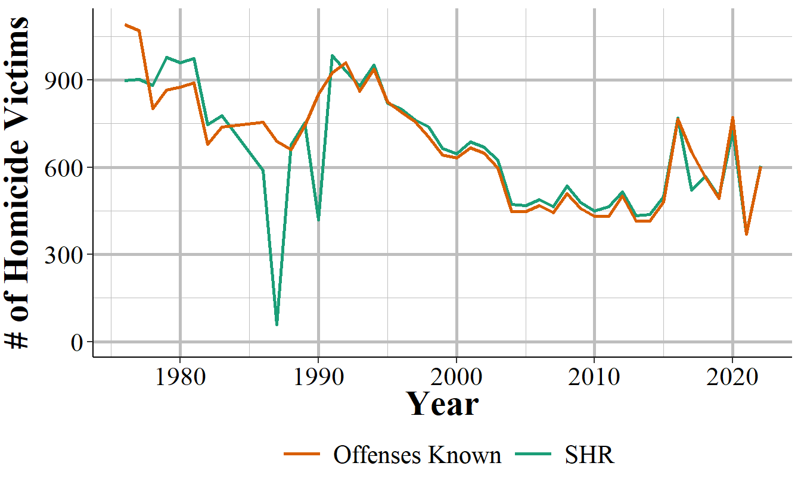
<p class="caption">(\#fig:chicagoSHRvsOffensesKnown)The annual number of homicide victims in Chicago, SHR and Offeksnes Known, 1976-2022.</p>
</div>

Another way to visualize reporting is to see the total number of agencies that report at least one homicide, as depicted in Figure \@ref(fig:shrAnnualAgencies). Here we can see that have about 3,000 agencies reporting. Given that most agencies are small and truly do have zero homicides in a year, that may be reasonable. Agencies that don't have homicides don't submit a report saying so, they just don't submit any data. So that makes it hard to tell when an agency not reporting data is doing so because they choose to not report, or because they have nothing to report. This is most common in small agencies where many years truly have no homicides. But let's look at our biggest agencies, and see how much of an impact it would make to have them not report data.

<div class="figure" style="text-align: center">
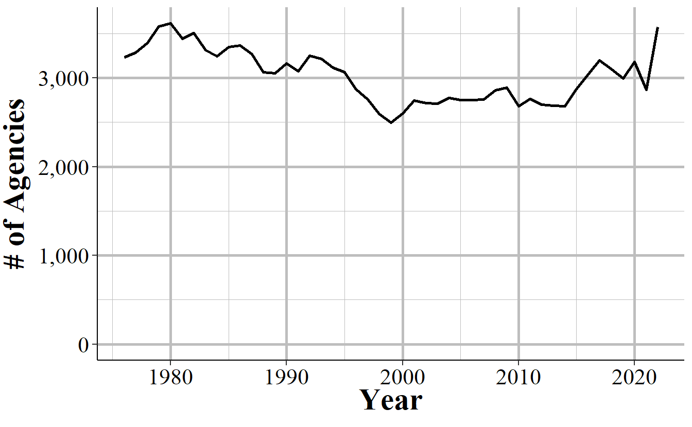
<p class="caption">(\#fig:shrAnnualAgencies)The annual number of agencies that report at least one homicide.</p>
</div>

Figures \@ref(fig:shrTopAgenciesCount) and \@ref(fig:shrTopAgenciesCountPercent) attempt to get at this question by looking the number and percent of all incidents that the top 100, 50 and 10 agencies based on number of homicide incidents make up out of all homicide incidents in each year. These agencies are massively disproportionate in how many homicides they represent - though they are also generally the largest cities in the country so are a small number of agencies but a large share of this nation's population. On average, the 10 agencies with the most homicide incidents each year - which may change every year - have over 4,000 homicide incidents and make up about 1/4 of all homicide incidents reported nationally. The top 50 have about 7,500 incidents a year, accounting for 46% of incidents. The top 100 agencies have a bit under 10,000 incidents a year and make up over 55% of all homicide incidents in the United States. So excluding the largest agencies in the country would certainly undercount homicides.

<div class="figure" style="text-align: center">
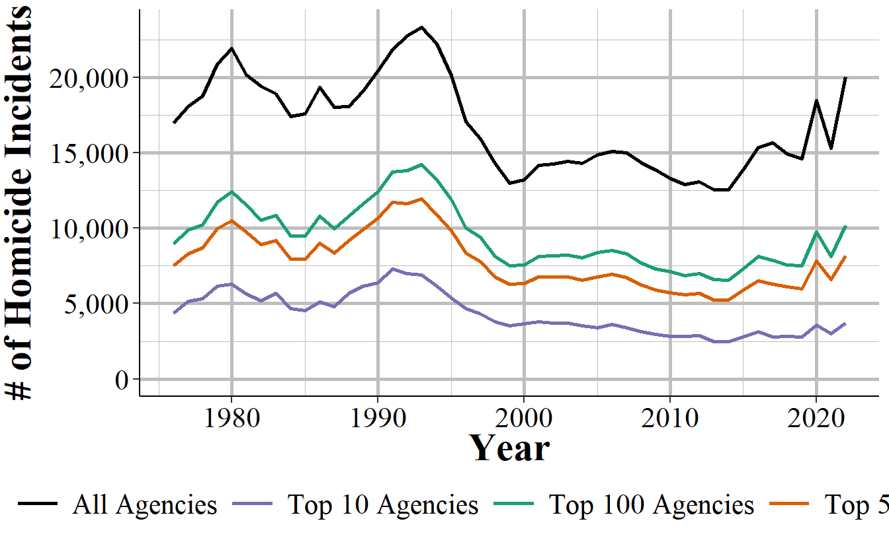
<p class="caption">(\#fig:shrTopAgenciesCount)The annual number of homicide incidents, showing all agencies, the top 100 agencies (by number of homicide incidents), top 50, and top 10 agencies, 1976-2022.</p>
</div>


<div class="figure" style="text-align: center">
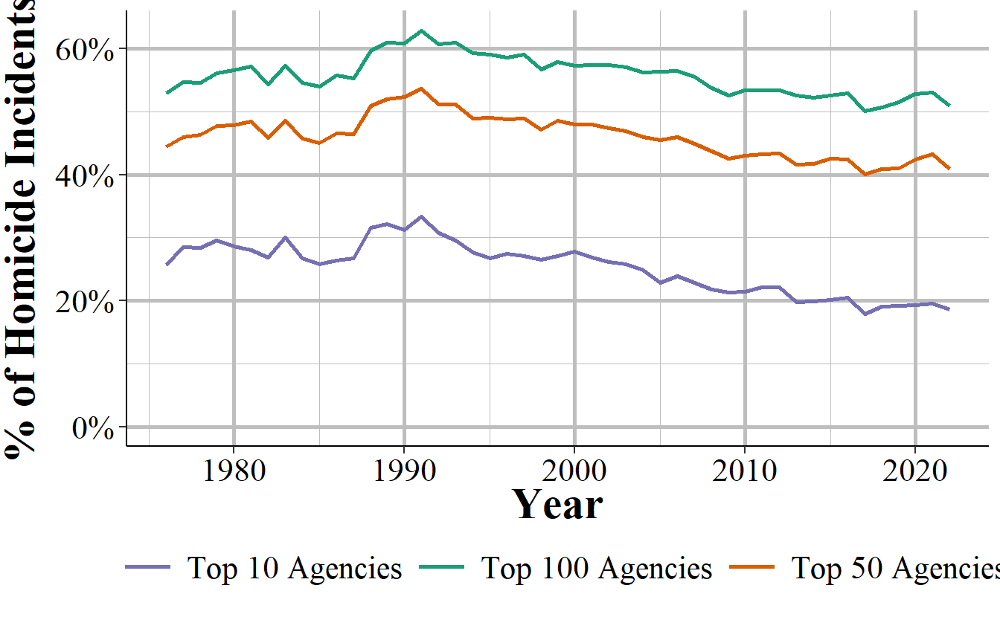
<p class="caption">(\#fig:shrTopAgenciesCountPercent)The annual percent of homicide incidents by the top 100 agencies (by number of homicide incidents), top 50, and top 10 agencies, 1976-2022.</p>
</div>

## Important variables

The data has demographic information for up to 11 victims and 11 offenders, as well as the information on the weapon used by each offender, the relationship between the first victim and each offender, and the circumstance of the homicide. The data also has the traditional SHR set of variables about the agency: their ORI code, population, state, region and the month and year of this data. One key variable that is missing is the outcome of the homicide: there is no information on whether any of the offenders were arrested. 

While there is information on up to 11 victims and offenders, in most cases, there is only a single victim and a single offender in each incident. We can use the additional_victim_count and additional_offender_count columns to see how many additional victims/offenders there are. An additional victim/offender means in addition to the first one. Even though we have columns for up to 11 victims and offenders, in very rare instances the additional_[victim/offender]_count columns may say there are more than 11 victims/offenders.

To see how the breakdown for the number of victims in each incident looks, Figure \@ref(fig:numberSHRVictims) shows the percent of incidents with each possible number of victims.^[There are five incident where there are more than 11 victims. For simplicity of the graph, these incident are excluded.] In nearly all incidents - 96.0% - there was only a single victim. This drops to 3.3% of incidents for two victims, 0.5% for three victims, and only about 0.2% of incidents have four or more victims. 

<div class="figure" style="text-align: center">
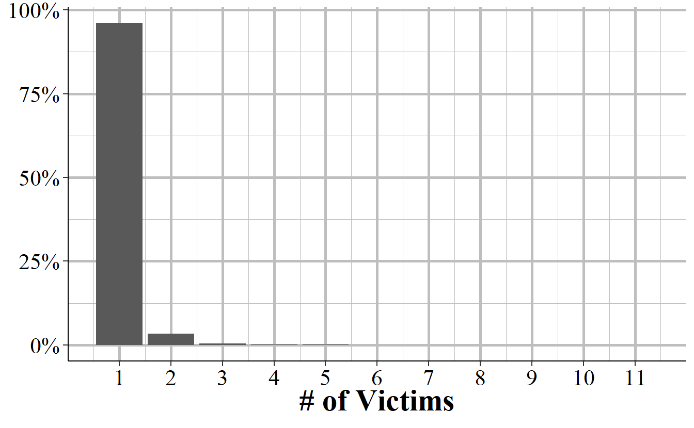
<p class="caption">(\#fig:numberSHRVictims)The percent of incidents that have 1-11 victims.</p>
</div>

Figure \@ref(fig:numberSHROffenders) shows the breakdown of the number of offenders per homicide incident.^[There are seven incidents with more than 11 offenders. For simplicity of the graph, these incidents are excluded.] It's a little less concentrated than with victims but the vast majority of homicides are committed by one offender - or at least the police only report one offender. About 87.6% of homicides have only one offender, 8.4% have two, 2.5% have three, and 1.5% have four. Fewer than 0.5% of homicides have more than four offenders. However, this is all a bit misleading. In cases where there is no information about the offender, including how many offenders there is, the data simply says that there is a single offender. So the number of homicides with a single offender is an over-count while the number with more offenders is an undercount. 

<div class="figure" style="text-align: center">
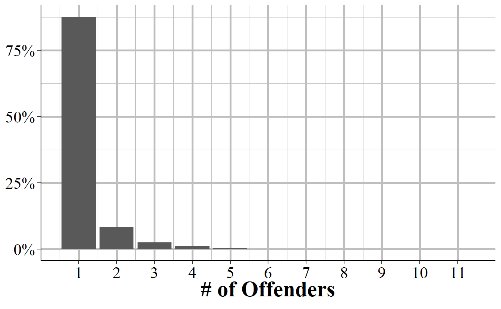
<p class="caption">(\#fig:numberSHROffenders)The percent of incidents that have 1-11 offenders.</p>
</div>

The variable "situation" says what type of victim-offender number combination the incident is - e.g. "multiple victims/single offender", "single victim/multiple offenders", etc. - and does indicate if the number of offenders is unknown (though curiously there are over 4,000 instances where the number of offenders is unknown but they still say there are two offenders) so you can use this variable to determine if the police don't know how many offenders there is. You're still limited, of course, in that the number of offenders is always what the police think there are, and they may be wrong. So use this variable - and anything that comes from it like the percent of offenders of a certain race - with caution. 

We'll now look at a number of important variables individually. Since the data can potentially have 11 victims and 11 offenders - but in practice has only one each in the vast majority of cases - we'll only look at the first victim/offender for each of these variables. Therefore, the results will not be entirely accurate, but will still give you a good overview of the data. The figures below will use data for all homicides from 1976 to 2022 so will cover all currently available years of data. Keep in mind that national trends aren't the same as local trends so what is shown in these figures will probably not be the same as what is happening in your community. And that looking at all homicides means we are including murders, manslaughters, and justifiable homicides. 

### Demographics

There are two broad categories of variables that we'll cover: demographics of the victim and offenders, and characteristics of the case. We start with demographics.

#### Age

This data includes the age (in years) for each victim and each offender. For those under one years old, it also breaks this down into those from birth to six days old "including abandoned infant" and those seven days old to 364 days old. So there's a bit more info on homicides of babies. It also maxes out the age at 99 so for victims or offenders older than that we don't get their exact age, just text that says "99 years or older" (which I turn to the number 99 in the figures below).  

Figure \@ref(fig:shrOffenderAge) shows the percent of homicides where the first offender in the case is of each age from 0-99. Offenders with unknown ages are excluded from this graph and make up about 27% of cases. The average (mean) age is 31.1 years old (shown in orange) which is due to a long right tail; the median age is 28 years old. If you look closely at the left side of the graph you can see that there are some very young offenders, with at least one offender for each year of age from 0 to 10 included in the data. It's not clear from this alone that these ages are a data entry error. While a two-year-old certainly couldn't kill someone, the data does include deaths caused by "children playing with gun" (homicide circumstances will be discussed in Section \@ref(circumstance)) so these ages could potentially be correct. 

If you're familiar with the age-crime curve in criminology - which basically says crime peaks in late teen years then falls dramatically - this shows that exact curve, though is older and doesn't decline as the offender ages as quickly as we see with less serious crimes. 

<div class="figure" style="text-align: center">
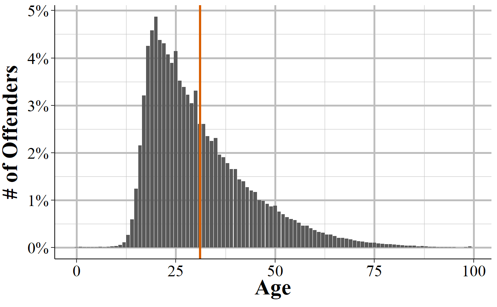
<p class="caption">(\#fig:shrOffenderAge)The age of homicide offenders, based on the first offender in any homicide incident. Offenders under age 1 (classified as 'birth to 7 days old, including abandoned infant' and '7 days to 364 days old') and considered 0 years old. Offenders reported as '99 years or older' are considered 99 years old.</p>
</div>

Figure \@ref(fig:shrVictimAge) repeats Figure \@ref(fig:shrOffenderAge) but with victim age rather than offender age. The mean victim age (shown in orange) is 33 and the median age is 30. Though the average victim age is a bit younger than the average offender age, trends are relatively similar for teenagers and older where deaths spikes in the late teen years and then declines steadily. The major difference is the U-shape for younger victims - for victims under age 15, homicides peak at age 0 (i.e. younger than their first birthday) with ~1.4% of all homicides being this this age. They then decline until plateauing at around age 6 before increasing again in the early teen years. 

<div class="figure" style="text-align: center">
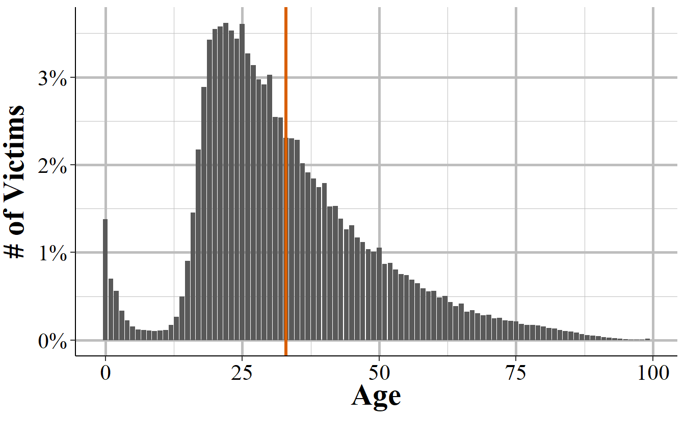
<p class="caption">(\#fig:shrVictimAge)The age of homicide victims, based on the first victims in any homicide incident. Victims under age 1 (classified as 'birth to 7 days old, including abandoned infant' and '7 days to 364 days old') and considered 0 years old. Victims reported as '99 years or older' are considered 99 years old.</p>
</div>

#### Sex 

We'll next look at victim and offender sex, a simple variable since only male and female are included. About 62.2% of offenders, as seen in Figure \@ref(fig:shrOffenderSex), are male and about 8.2% are female, indicating a large disparity in the sex of homicide offenders. The remaining 29.6% of offenders do not have sex data available because the police do not know the sex of this individual. For offenders who aren't arrested, this variable may be inaccurate since it is perceived sex of the offender.^[If we ignore unknown sex, essentially saying that the unknown people will have their sex distributed exactly as the known sex people, 88% are male and 12% are female. However, this assumption is probably wrong since the unknown people may be materially different than the known people, as evidence by them likely not being arrested and committing the crime in a way where even their sex can't be identified. ] 

<div class="figure" style="text-align: center">
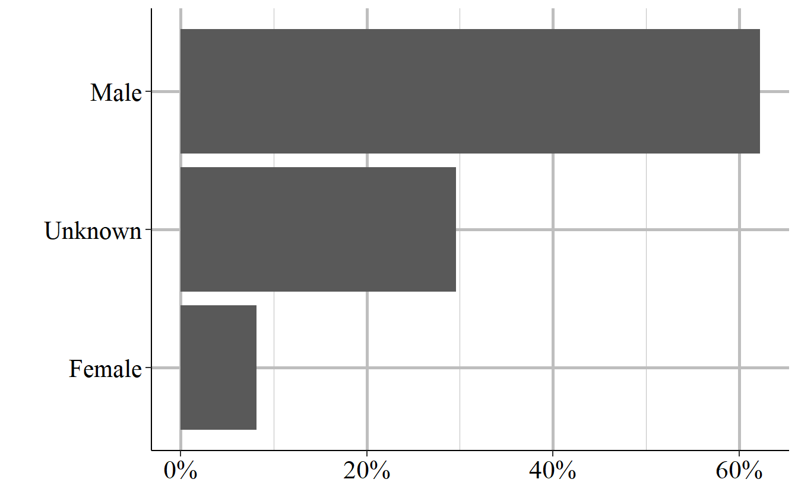
<p class="caption">(\#fig:shrOffenderSex)The sex of offender \#1, 1976-2022.</p>
</div>

There is far less uncertainty for victim sex, with under 0.17% of victims having an unknown sex. Here again there is a large disparity between male and female with about 78.2% of victims being male and 21.6% being female. 

<div class="figure" style="text-align: center">
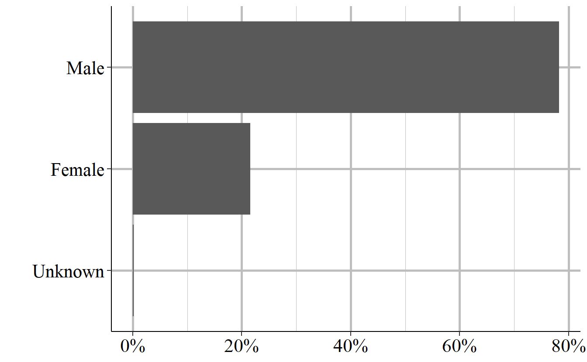
<p class="caption">(\#fig:shrVictimSex)The sex of victim \#1, 1976-2022.</p>
</div>

#### Race

This data also includes the race of the victims and offenders. This includes the following races: American Indian or Alaskan Native, Asian, Black, Native Hawaiian or Other Pacific Islander, and White. These are the only races included in the data; Hispanic is considered an ethnicity and is available as a separate, though flawed, variable. There is no category for bi- or multi-racial. As with other demographics info for offenders, in cases where no arrest is made (and we don't know in this data if one is made), there's no way to confirm the person's race so these results may not be entirely accurate. 

Figure \@ref(fig:shrOffenderRace) shows the percent of homicides in the data by the race of offender #1. Black and White offenders are included are similar percentages, at 34.3% and 33.6% of victims, respectively. The next most common group is Unknown at about 30.6% of offenders. Given that so many offenders have an unknown race, the reliability of race measures is limited. The remaining races are Asian at 0.9% of offenders, American Indian or Alaskan Native at 0.6%, and Native Hawaiian or Other Pacific Islander at 0.02%. 

<div class="figure" style="text-align: center">
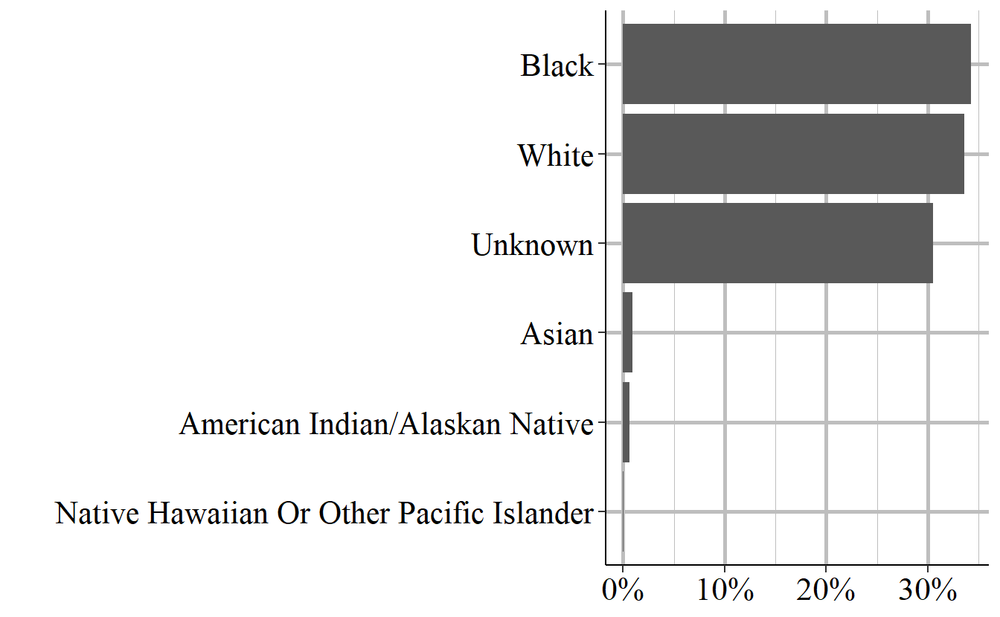
<p class="caption">(\#fig:shrOffenderRace)The race of offender \#1, 1976-2022.</p>
</div>

For victim race, seen in Figure \@ref(fig:shrVictimRace), only about 1% of victim #1 races are unknown. This means we can be a lot more confident in the race of the victims than in the race of the offender. Similar to offenders, White and Black victims are the two most common races, with 48.4% and 48.1% of victims, respectively. There is a greater share of Asian victims than Asian offenders at 1.5% of victims. American Indian or Alaskan Natives make up 0.8% of victims while Native Hawaiian or Pacific Islanders make up 0.02% of victims.

<div class="figure" style="text-align: center">
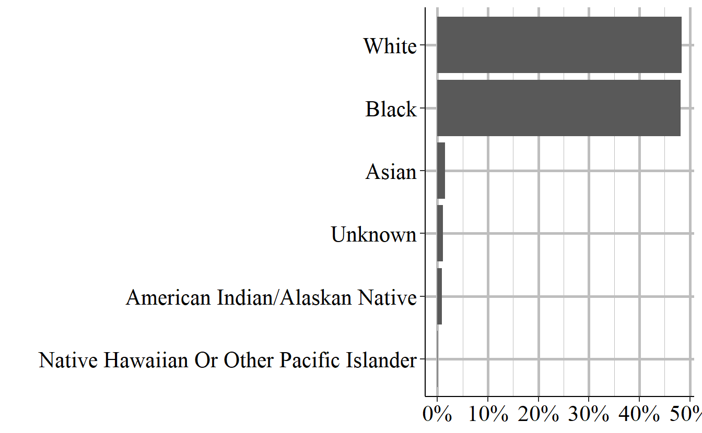
<p class="caption">(\#fig:shrVictimRace)The race of victim \#1, 1976-2022</p>
</div>

#### Ethnicity

The final demographic variable is ethnicity which is whether the victim or offender is Hispanic or not Hispanic. The SHR data has a weird relationship with this variable (which is also in the Arrests by Age, Sex, and Race dataset, discussed in Chapter \@ref(arrests)) where ethnicity is technically a variable in the data but very rarely collected. As such, this is an unreliable variable that if you really want to use needs careful attention to make sure it is being reported consistently by the agencies that you are looking at. 

The vast majority - 69.7% - of offenders have an unknown ethnicity while 23.4% are not Hispanic and 7.1% are Hispanic. 

<div class="figure" style="text-align: center">
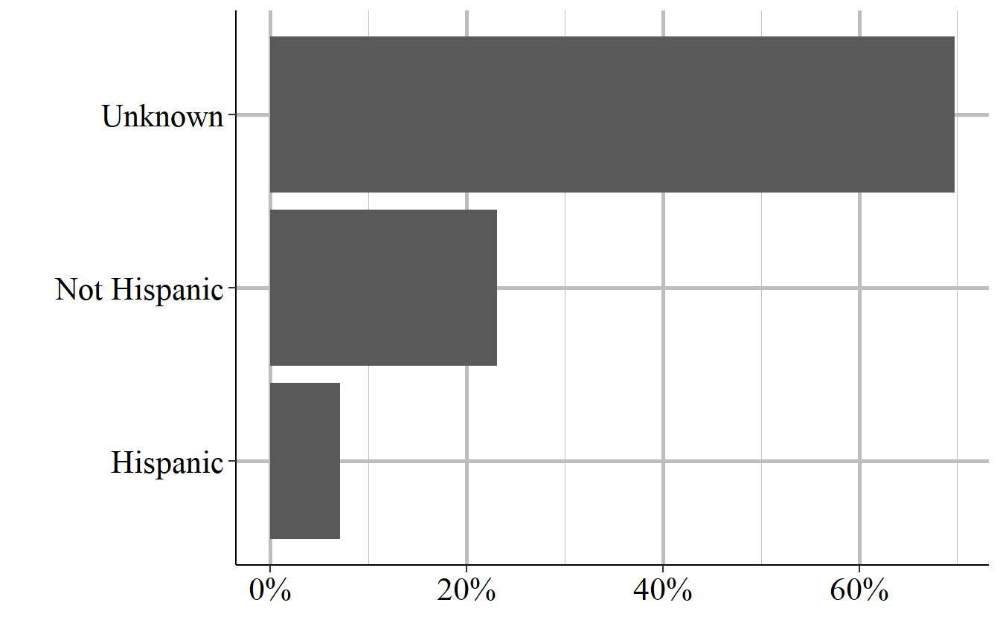
<p class="caption">(\#fig:shrOffenderEthnicity)The ethnicity of offender \#1, 1976-2022.</p>
</div>

Unlike the other demographic variables, there is still a huge amount of underreporting when it comes to victim ethnicity, though still less than for offender ethnicity. 55.6% of victims have an unknown ethnicity. Approximately 33.2% of victim #1 are reported as not Hispanic while 11.1% are reported as Hispanic.

<div class="figure" style="text-align: center">
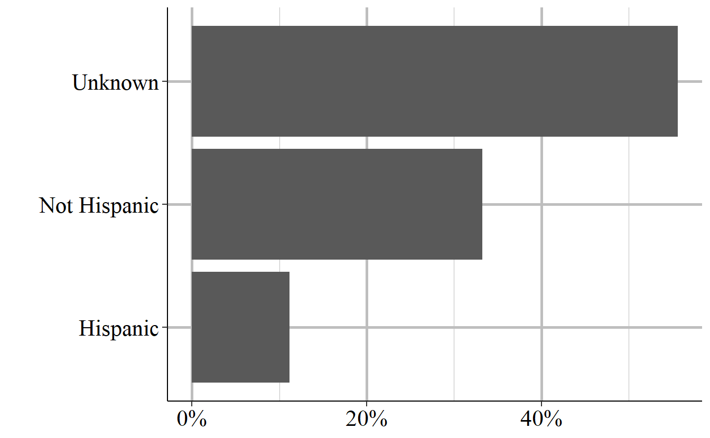
<p class="caption">(\#fig:shrVictimEthnicity)The ethnicity of victim \#1, 1976-2022.</p>
</div>

As an example of agencies under-reporting this variable, let's look at the number of offender #1s in Albuquerque, New Mexico, a city which the [US Census](https://www.census.gov/quickfacts/fact/table/albuquerquecitynewmexico,US/PST045222) says is about 50% Hispanic. Yet the Albuquerque police reported no ethnicity information for almost three decades of data. 

<div class="figure" style="text-align: center">
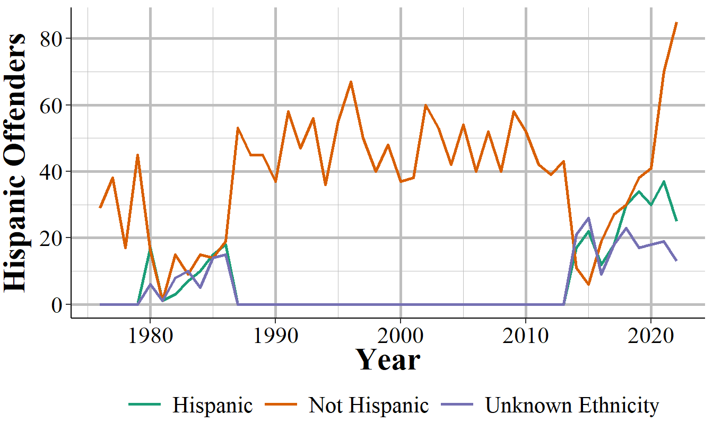
<p class="caption">(\#fig:ABQ)Annual number of offender \#1 who is Hispanic in Albuquerque, New Mexico, 1976-2022.</p>
</div>


### Case characteristics

Now we'll move to facts about each case such as what weapon was used, how people involved knew each other, and what was the (rough) cause of the homicide.

#### Weapon used

The first variable we'll look at is the weapon used by each offender. Table \@ref(tab:shrWeapon) shows the weapon used by the first offender in every incident from 1976 to 2022. Each offender can only be reported as having a single weapon, so this table essentially shows the number (and percent) of homicides caused by this weapon. This isn't entirely true since in reality an offender could use multiple weapons and there can be multiple offenders. In these cases the police include what they believe is the "primary" weapon used by this offender.

The most commonly used weapon is a handgun, which is used in nearly half of homicides. This is followed by a knife or other sharp weapon used to cut at almost 15% of homicides, and then by "firearm, type not stated" which is just a firearm where we don't know the exact type (it can include handguns) at 8.9% of homicides The fourth most common weapon is "personal weapons" at nearly 6% of homicides. "Personal weapons" is a weird term to mean that there was no weapon - the "weapon" was the offender who beat the victim to death. Shotguns are involved in almost 5% of homicides and all other weapons are involved in fewer than 5% of cases. In total there are 19 different weapons included though most are very uncommon. 

<table class="table table-striped" style="width: auto !important; margin-left: auto; margin-right: auto;">
<caption>(\#tab:shrWeapon)The weapon used in a homicide incident, 1976-2022. In cases where there are multiple offenders, shows only the primary weapon for the first offender.</caption>
 <thead>
  <tr>
   <th style="text-align:left;"> Weapon </th>
   <th style="text-align:right;"> # of Incidents </th>
   <th style="text-align:right;"> % of Incidents </th>
  </tr>
 </thead>
<tbody>
  <tr>
   <td style="text-align:left;"> Handgun </td>
   <td style="text-align:right;"> 388,178 </td>
   <td style="text-align:right;"> 49.06\% </td>
  </tr>
  <tr>
   <td style="text-align:left;"> Knife Or Cutting Instrument </td>
   <td style="text-align:right;"> 115,540 </td>
   <td style="text-align:right;"> 14.60\% </td>
  </tr>
  <tr>
   <td style="text-align:left;"> Firearm, Type Not Stated </td>
   <td style="text-align:right;"> 70,632 </td>
   <td style="text-align:right;"> 8.93\% </td>
  </tr>
  <tr>
   <td style="text-align:left;"> Personal Weapons - Includes Beating </td>
   <td style="text-align:right;"> 45,473 </td>
   <td style="text-align:right;"> 5.75\% </td>
  </tr>
  <tr>
   <td style="text-align:left;"> Other Or Unknown Weapon </td>
   <td style="text-align:right;"> 42,002 </td>
   <td style="text-align:right;"> 5.31\% </td>
  </tr>
  <tr>
   <td style="text-align:left;"> Shotgun </td>
   <td style="text-align:right;"> 36,827 </td>
   <td style="text-align:right;"> 4.65\% </td>
  </tr>
  <tr>
   <td style="text-align:left;"> Blunt Object </td>
   <td style="text-align:right;"> 34,716 </td>
   <td style="text-align:right;"> 4.39\% </td>
  </tr>
  <tr>
   <td style="text-align:left;"> Rifle </td>
   <td style="text-align:right;"> 28,108 </td>
   <td style="text-align:right;"> 3.55\% </td>
  </tr>
  <tr>
   <td style="text-align:left;"> Strangulation - Includes Hanging </td>
   <td style="text-align:right;"> 9,763 </td>
   <td style="text-align:right;"> 1.23\% </td>
  </tr>
  <tr>
   <td style="text-align:left;"> Fire </td>
   <td style="text-align:right;"> 5,380 </td>
   <td style="text-align:right;"> 0.68\% </td>
  </tr>
  <tr>
   <td style="text-align:left;"> Asphyxiation - Includes Death By Gas </td>
   <td style="text-align:right;"> 4,804 </td>
   <td style="text-align:right;"> 0.61\% </td>
  </tr>
  <tr>
   <td style="text-align:left;"> Other Gun </td>
   <td style="text-align:right;"> 3,473 </td>
   <td style="text-align:right;"> 0.44\% </td>
  </tr>
  <tr>
   <td style="text-align:left;"> Narcotics/Drugs - Includes Sleeping Pills </td>
   <td style="text-align:right;"> 3,144 </td>
   <td style="text-align:right;"> 0.40\% </td>
  </tr>
  <tr>
   <td style="text-align:left;"> Drowning </td>
   <td style="text-align:right;"> 1,387 </td>
   <td style="text-align:right;"> 0.18\% </td>
  </tr>
  <tr>
   <td style="text-align:left;"> Other Or Type Unknown </td>
   <td style="text-align:right;"> 586 </td>
   <td style="text-align:right;"> 0.07\% </td>
  </tr>
  <tr>
   <td style="text-align:left;"> Poison - Does Not Include Gas </td>
   <td style="text-align:right;"> 531 </td>
   <td style="text-align:right;"> 0.07\% </td>
  </tr>
  <tr>
   <td style="text-align:left;"> Explosives </td>
   <td style="text-align:right;"> 386 </td>
   <td style="text-align:right;"> 0.05\% </td>
  </tr>
  <tr>
   <td style="text-align:left;"> Pushed Or Thrown Out of Window </td>
   <td style="text-align:right;"> 257 </td>
   <td style="text-align:right;"> 0.03\% </td>
  </tr>
  <tr>
   <td style="text-align:left;"> Narcotics Or Drugs </td>
   <td style="text-align:right;"> 48 </td>
   <td style="text-align:right;"> 0.01\% </td>
  </tr>
  <tr>
   <td style="text-align:left;"> Total </td>
   <td style="text-align:right;"> 791,235 </td>
   <td style="text-align:right;"> 100\% </td>
  </tr>
</tbody>
</table>


You may have noticed from the table that AR-15 isn't included. While AR-15 is the commonly discussed in the media and policy circles as a way to control gun violence, it isn't in a category by itself. Instead it is combined with other rifles in the "rifle" weapon group, and makes up about 3.6% of the weapons used by offender #1 in the data. 

Let's check if AR-15s, through our rough proxy of the "rifle" weapon group, is getting more common over time. Figure \@ref(fig:shrRifle) shows the number of homicide incidents (including manslaughters, so not necessarily all murders) where offender #1 used a rifle. Figure \@ref(fig:shrRiflePercent) shows the percent of all homicide incidents where the the weapon was a rifle. Using both of these measures we can see the rifles are getting less common, declining substantially since 1980 though increasing again starting in the mid-2010s.  

<div class="figure" style="text-align: center">
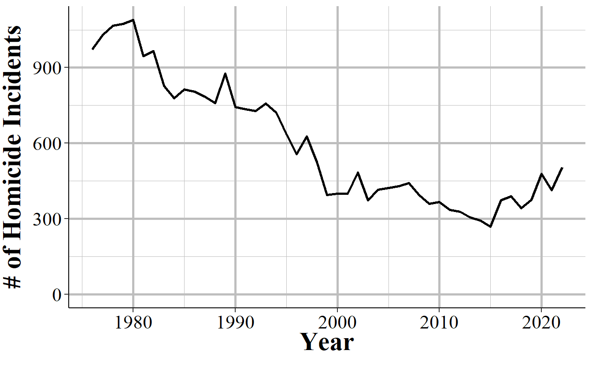
<p class="caption">(\#fig:shrRifle)The annual number of homicide incidents where offender \#1's weapon was a rifle, 1976-2022.</p>
</div>

<div class="figure" style="text-align: center">
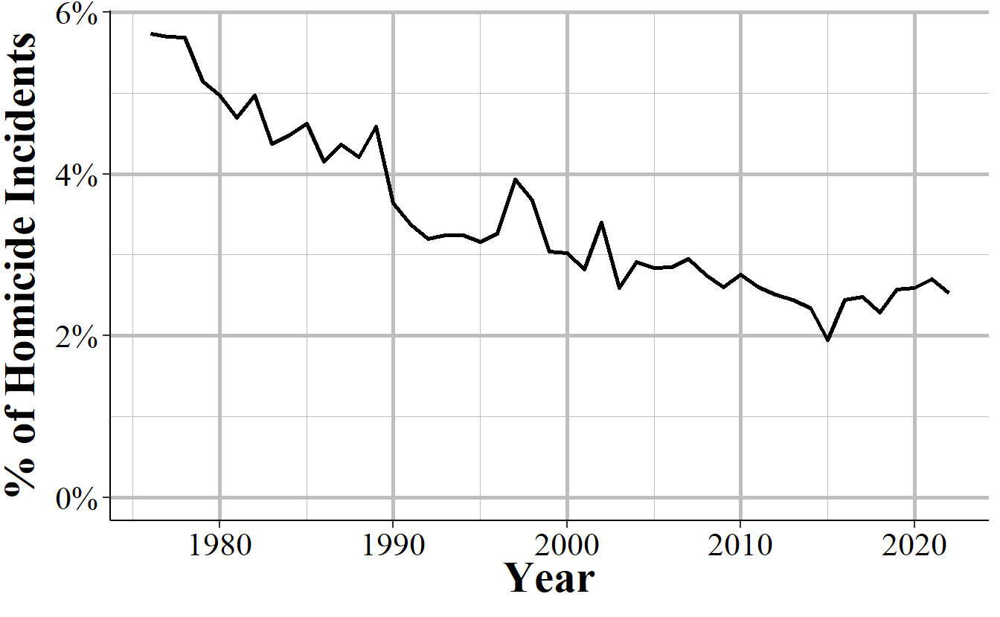
<p class="caption">(\#fig:shrRiflePercent)The annual share of homicide incidents where offender \#1's weapon was a rifle, 1976-2022.</p>
</div>

Now, maybe this weapon is more commonly used in some types of crimes such as school shootings. You could get at that question using this data by seeing if times when a rifle is used that victims or offenders are younger or if the circumstance is something that suggests a school shooting. Unfortunately there is no offense location variable here, though there is in NIBRS and we can largely recreate this data through NIBRS. And of course you can't tell if the weapon is actually an AR-15, only if it is a rifle.

#### Relationship between first victim and offenders

An interesting and highly useful variable is the relationship between the first victim and each offender. To be clear, this is only for the first victim; we don't have the relationship between other victims and offenders. However, as seen earlier, this isn't *too much* of an issue since nearly all incidents only have a single victim. There are 29 possible relationship types (including "unknown" relationship) which are broken into three categories: legal family members, people known to the victim but who aren't family, and people not known to the victim. Table \@ref(tab:shrRelationship) shows these relationships and the number and percent of homicides with these relationships. 

The most common relationship, with about 28% of homicides, is that the police don't know the relationship. So there is a good deal of uncertainty in the relationship between victims and offenders. Next is that the victim is the offender's acquaintance at 19.7% or is a stranger at 15.3%. The next is "other - known to victim" which is similar to being an acquaintance at almost 5% of homicides. This is followed by the victim being the friend of the murderer at 3.6%. The 6th most common relationship, at 3.6% is that the victim is the wife of the offender, so she is murdered by her husband, and is the first familial relationship of this list. The remaining relationships all make up fewer than 3% of all homicides. 

<table class="table table-striped" style="width: auto !important; margin-left: auto; margin-right: auto;">
<caption>(\#tab:shrRelationship)The relationship between the first victim and the first offender in a homicide incident, 1976-2022.</caption>
 <thead>
  <tr>
   <th style="text-align:left;"> Relationship </th>
   <th style="text-align:right;"> Category </th>
   <th style="text-align:right;"> # of Incidents </th>
   <th style="text-align:left;"> % of Incidents </th>
  </tr>
 </thead>
<tbody>
  <tr>
   <td style="text-align:left;"> Unknown </td>
   <td style="text-align:right;">  </td>
   <td style="text-align:right;"> 296,757 </td>
   <td style="text-align:left;"> 37.51\% </td>
  </tr>
  <tr>
   <td style="text-align:left;"> Acquaintance </td>
   <td style="text-align:right;"> Not family (but known) </td>
   <td style="text-align:right;"> 156,115 </td>
   <td style="text-align:left;"> 19.73\% </td>
  </tr>
  <tr>
   <td style="text-align:left;"> Stranger </td>
   <td style="text-align:right;"> Not known </td>
   <td style="text-align:right;"> 120,719 </td>
   <td style="text-align:left;"> 15.26\% </td>
  </tr>
  <tr>
   <td style="text-align:left;"> Other - Known To Victim </td>
   <td style="text-align:right;"> Not family (but known) </td>
   <td style="text-align:right;"> 37,899 </td>
   <td style="text-align:left;"> 4.79\% </td>
  </tr>
  <tr>
   <td style="text-align:left;"> Friend </td>
   <td style="text-align:right;"> Not family (but known) </td>
   <td style="text-align:right;"> 28,411 </td>
   <td style="text-align:left;"> 3.59\% </td>
  </tr>
  <tr>
   <td style="text-align:left;"> Wife </td>
   <td style="text-align:right;"> Family </td>
   <td style="text-align:right;"> 27,977 </td>
   <td style="text-align:left;"> 3.54\% </td>
  </tr>
  <tr>
   <td style="text-align:left;"> Girlfriend </td>
   <td style="text-align:right;"> Not family (but known) </td>
   <td style="text-align:right;"> 21,447 </td>
   <td style="text-align:left;"> 2.71\% </td>
  </tr>
  <tr>
   <td style="text-align:left;"> Husband </td>
   <td style="text-align:right;"> Family </td>
   <td style="text-align:right;"> 12,085 </td>
   <td style="text-align:left;"> 1.53\% </td>
  </tr>
  <tr>
   <td style="text-align:left;"> Other Family </td>
   <td style="text-align:right;"> Family </td>
   <td style="text-align:right;"> 11,760 </td>
   <td style="text-align:left;"> 1.49\% </td>
  </tr>
  <tr>
   <td style="text-align:left;"> Son </td>
   <td style="text-align:right;"> Family </td>
   <td style="text-align:right;"> 11,408 </td>
   <td style="text-align:left;"> 1.44\% </td>
  </tr>
  <tr>
   <td style="text-align:left;"> Boyfriend </td>
   <td style="text-align:right;"> Not family (but known) </td>
   <td style="text-align:right;"> 10,009 </td>
   <td style="text-align:left;"> 1.26\% </td>
  </tr>
  <tr>
   <td style="text-align:left;"> Neighbor </td>
   <td style="text-align:right;"> Not family (but known) </td>
   <td style="text-align:right;"> 8,081 </td>
   <td style="text-align:left;"> 1.02\% </td>
  </tr>
  <tr>
   <td style="text-align:left;"> Daughter </td>
   <td style="text-align:right;"> Family </td>
   <td style="text-align:right;"> 8,056 </td>
   <td style="text-align:left;"> 1.02\% </td>
  </tr>
  <tr>
   <td style="text-align:left;"> Brother </td>
   <td style="text-align:right;"> Family </td>
   <td style="text-align:right;"> 6,961 </td>
   <td style="text-align:left;"> 0.88\% </td>
  </tr>
  <tr>
   <td style="text-align:left;"> Father </td>
   <td style="text-align:right;"> Family </td>
   <td style="text-align:right;"> 5,667 </td>
   <td style="text-align:left;"> 0.72\% </td>
  </tr>
  <tr>
   <td style="text-align:left;"> Mother </td>
   <td style="text-align:right;"> Family </td>
   <td style="text-align:right;"> 5,274 </td>
   <td style="text-align:left;"> 0.67\% </td>
  </tr>
  <tr>
   <td style="text-align:left;"> In-Law </td>
   <td style="text-align:right;"> Family </td>
   <td style="text-align:right;"> 4,608 </td>
   <td style="text-align:left;"> 0.58\% </td>
  </tr>
  <tr>
   <td style="text-align:left;"> Common-Law Wife </td>
   <td style="text-align:right;"> Family </td>
   <td style="text-align:right;"> 3,317 </td>
   <td style="text-align:left;"> 0.42\% </td>
  </tr>
  <tr>
   <td style="text-align:left;"> Common-Law Husband </td>
   <td style="text-align:right;"> Family </td>
   <td style="text-align:right;"> 2,722 </td>
   <td style="text-align:left;"> 0.34\% </td>
  </tr>
  <tr>
   <td style="text-align:left;"> Ex-Wife </td>
   <td style="text-align:right;"> Not family (but known) </td>
   <td style="text-align:right;"> 2,365 </td>
   <td style="text-align:left;"> 0.30\% </td>
  </tr>
  <tr>
   <td style="text-align:left;"> Stepfather </td>
   <td style="text-align:right;"> Family </td>
   <td style="text-align:right;"> 1,864 </td>
   <td style="text-align:left;"> 0.24\% </td>
  </tr>
  <tr>
   <td style="text-align:left;"> Homosexual Relationship </td>
   <td style="text-align:right;"> Not family (but known) </td>
   <td style="text-align:right;"> 1,704 </td>
   <td style="text-align:left;"> 0.22\% </td>
  </tr>
  <tr>
   <td style="text-align:left;"> Sister </td>
   <td style="text-align:right;"> Family </td>
   <td style="text-align:right;"> 1,536 </td>
   <td style="text-align:left;"> 0.19\% </td>
  </tr>
  <tr>
   <td style="text-align:left;"> Stepson </td>
   <td style="text-align:right;"> Family </td>
   <td style="text-align:right;"> 1,500 </td>
   <td style="text-align:left;"> 0.19\% </td>
  </tr>
  <tr>
   <td style="text-align:left;"> Ex-Husband </td>
   <td style="text-align:right;"> Not family (but known) </td>
   <td style="text-align:right;"> 937 </td>
   <td style="text-align:left;"> 0.12\% </td>
  </tr>
  <tr>
   <td style="text-align:left;"> Stepdaughter </td>
   <td style="text-align:right;"> Family </td>
   <td style="text-align:right;"> 792 </td>
   <td style="text-align:left;"> 0.10\% </td>
  </tr>
  <tr>
   <td style="text-align:left;"> Employer </td>
   <td style="text-align:right;"> Not family (but known) </td>
   <td style="text-align:right;"> 564 </td>
   <td style="text-align:left;"> 0.07\% </td>
  </tr>
  <tr>
   <td style="text-align:left;"> Employee </td>
   <td style="text-align:right;"> Not family (but known) </td>
   <td style="text-align:right;"> 451 </td>
   <td style="text-align:left;"> 0.06\% </td>
  </tr>
  <tr>
   <td style="text-align:left;"> Stepmother </td>
   <td style="text-align:right;"> Family </td>
   <td style="text-align:right;"> 250 </td>
   <td style="text-align:left;"> 0.03\% </td>
  </tr>
  <tr>
   <td style="text-align:left;"> Total </td>
   <td style="text-align:right;">  </td>
   <td style="text-align:right;"> 791,236 </td>
   <td style="text-align:left;"> 100\% </td>
  </tr>
</tbody>
</table>


#### Homicide circumstance {#circumstance}

We also have information on the type of the homicide, which this data calls the "circumstance." This comes as relatively broad categories that leave a lot to be desired in our understanding of what led to the homicide. Table \@ref(tab:shrCircumstance) shows the number and percent of each circumstance for the first victim of each homicide from 1976 to 2022. This data has 33 possible circumstances which it groups into four main categories: murders that coincide with committing another crime ("felony type" murders), murders that don't coincide with another crime ("non-felony type" murders), justifiable homicides, and negligent manslaughter. 

The felony type murders are simply ones where another crime occurred during the homicide. While this is called "felony type" it does include other crimes such as theft and gambling (which aren't always a felony) so is a bit of a misnomer. The "non-felony type" are murders that happen without another crime. This includes gang killings (where, supposedly, only the murder occurred), children killed by babysitters, fights among intoxicated (both of alcohol and drugs) people, and "lover's triangle" killings.  Justifiable homicides are when a person (civilian or police officer) kill a person who is committing a crime. Negligent manslaughter includes accidental shootings such as when children find and shoot a gun, but excludes deaths from traffic accidents. 

The most common circumstances, accounting for 27.4%, 26.9%, and 12.5%, respectively, are "Unknown", "Other Arguments", and "Other Non-Felony Type - Not Specified." Since the data includes "Argument Over Money Or Property" as one category, the "Other Arguments" mean that it's an argument for a reason other than over money or property. The "Other Non-Felony Type" one does not mean that the murder did not occur alongside another crime, but also doesn't fall into the non-felony categories included. Robbery is the only remaining circumstance with more than 5% of murders, at 7.4%. 

<table class="table table-striped" style="width: auto !important; margin-left: auto; margin-right: auto;">
<caption>(\#tab:shrCircumstance)The circumstance of the homicide for the first offender in a homicide incident.</caption>
 <thead>
  <tr>
   <th style="text-align:left;"> Circumstance </th>
   <th style="text-align:right;"> Category </th>
   <th style="text-align:right;"> # of Incidents </th>
   <th style="text-align:left;"> % of Incidents </th>
  </tr>
 </thead>
<tbody>
  <tr>
   <td style="text-align:left;"> Unknown </td>
   <td style="text-align:right;">  </td>
   <td style="text-align:right;"> 219,450 </td>
   <td style="text-align:left;"> 27.74\% </td>
  </tr>
  <tr>
   <td style="text-align:left;"> Other Arguments </td>
   <td style="text-align:right;"> Non-Felony Type </td>
   <td style="text-align:right;"> 212,941 </td>
   <td style="text-align:left;"> 26.91\% </td>
  </tr>
  <tr>
   <td style="text-align:left;"> Other Non-Felony Type - Not Specified </td>
   <td style="text-align:right;"> Non-Felony Type </td>
   <td style="text-align:right;"> 98,730 </td>
   <td style="text-align:left;"> 12.48\% </td>
  </tr>
  <tr>
   <td style="text-align:left;"> Robbery </td>
   <td style="text-align:right;"> Felony Type </td>
   <td style="text-align:right;"> 58,885 </td>
   <td style="text-align:left;"> 7.44\% </td>
  </tr>
  <tr>
   <td style="text-align:left;"> Narcotic Drug Laws </td>
   <td style="text-align:right;"> Felony Type </td>
   <td style="text-align:right;"> 28,360 </td>
   <td style="text-align:left;"> 3.58\% </td>
  </tr>
  <tr>
   <td style="text-align:left;"> Juvenile Gang Killings </td>
   <td style="text-align:right;"> Non-Felony Type </td>
   <td style="text-align:right;"> 24,309 </td>
   <td style="text-align:left;"> 3.07\% </td>
  </tr>
  <tr>
   <td style="text-align:left;"> Felon Killed By Police </td>
   <td style="text-align:right;"> Justifiable Homicide </td>
   <td style="text-align:right;"> 17,553 </td>
   <td style="text-align:left;"> 2.22\% </td>
  </tr>
  <tr>
   <td style="text-align:left;"> Other Felony Type - Not Specified </td>
   <td style="text-align:right;"> Felony Type </td>
   <td style="text-align:right;"> 15,460 </td>
   <td style="text-align:left;"> 1.95\% </td>
  </tr>
  <tr>
   <td style="text-align:left;"> Brawl Due To Influence of Alcohol </td>
   <td style="text-align:right;"> Non-Felony Type </td>
   <td style="text-align:right;"> 15,227 </td>
   <td style="text-align:left;"> 1.92\% </td>
  </tr>
  <tr>
   <td style="text-align:left;"> Argument Over Money Or Property </td>
   <td style="text-align:right;"> Non-Felony Type </td>
   <td style="text-align:right;"> 14,972 </td>
   <td style="text-align:left;"> 1.89\% </td>
  </tr>
  <tr>
   <td style="text-align:left;"> Felon Killed By Private Citizen </td>
   <td style="text-align:right;"> Justifiable Homicide </td>
   <td style="text-align:right;"> 13,928 </td>
   <td style="text-align:left;"> 1.76\% </td>
  </tr>
  <tr>
   <td style="text-align:left;"> All Suspected Felony Type </td>
   <td style="text-align:right;"> Felony Type </td>
   <td style="text-align:right;"> 12,975 </td>
   <td style="text-align:left;"> 1.64\% </td>
  </tr>
  <tr>
   <td style="text-align:left;"> All Other Manslaughter By Negligence Except Traffic Deaths </td>
   <td style="text-align:right;"> Negligent Manslaughter </td>
   <td style="text-align:right;"> 8,536 </td>
   <td style="text-align:left;"> 1.08\% </td>
  </tr>
  <tr>
   <td style="text-align:left;"> Domestic Violence (Historically Called Lovers Triangle/Quarrel) </td>
   <td style="text-align:right;">  </td>
   <td style="text-align:right;"> 6,431 </td>
   <td style="text-align:left;"> 0.81\% </td>
  </tr>
  <tr>
   <td style="text-align:left;"> Burglary </td>
   <td style="text-align:right;"> Felony Type </td>
   <td style="text-align:right;"> 6,356 </td>
   <td style="text-align:left;"> 0.80\% </td>
  </tr>
  <tr>
   <td style="text-align:left;"> Gangland Killings </td>
   <td style="text-align:right;"> Non-Felony Type </td>
   <td style="text-align:right;"> 5,809 </td>
   <td style="text-align:left;"> 0.73\% </td>
  </tr>
  <tr>
   <td style="text-align:left;"> Brawl Due To Influence of Narcotics </td>
   <td style="text-align:right;"> Non-Felony Type </td>
   <td style="text-align:right;"> 4,750 </td>
   <td style="text-align:left;"> 0.60\% </td>
  </tr>
  <tr>
   <td style="text-align:left;"> Lovers Triangle </td>
   <td style="text-align:right;"> Non-Felony Type </td>
   <td style="text-align:right;"> 4,158 </td>
   <td style="text-align:left;"> 0.53\% </td>
  </tr>
  <tr>
   <td style="text-align:left;"> Rape </td>
   <td style="text-align:right;"> Felony Type </td>
   <td style="text-align:right;"> 4,142 </td>
   <td style="text-align:left;"> 0.52\% </td>
  </tr>
  <tr>
   <td style="text-align:left;"> Other Negligent Handling of Gun Which Resulted In Death of Another </td>
   <td style="text-align:right;"> Negligent Manslaughter </td>
   <td style="text-align:right;"> 3,877 </td>
   <td style="text-align:left;"> 0.49\% </td>
  </tr>
  <tr>
   <td style="text-align:left;"> Arson </td>
   <td style="text-align:right;"> Felony Type </td>
   <td style="text-align:right;"> 3,304 </td>
   <td style="text-align:left;"> 0.42\% </td>
  </tr>
  <tr>
   <td style="text-align:left;"> Motor Vehicle Theft </td>
   <td style="text-align:right;"> Felony Type </td>
   <td style="text-align:right;"> 1,468 </td>
   <td style="text-align:left;"> 0.19\% </td>
  </tr>
  <tr>
   <td style="text-align:left;"> Children Playing With Gun </td>
   <td style="text-align:right;"> Negligent Manslaughter </td>
   <td style="text-align:right;"> 1,453 </td>
   <td style="text-align:left;"> 0.18\% </td>
  </tr>
  <tr>
   <td style="text-align:left;"> Other Sex Offenses </td>
   <td style="text-align:right;"> Felony Type </td>
   <td style="text-align:right;"> 1,433 </td>
   <td style="text-align:left;"> 0.18\% </td>
  </tr>
  <tr>
   <td style="text-align:left;"> Child Killed By Babysitter </td>
   <td style="text-align:right;"> Non-Felony Type </td>
   <td style="text-align:right;"> 1,342 </td>
   <td style="text-align:left;"> 0.17\% </td>
  </tr>
  <tr>
   <td style="text-align:left;"> Institutional Killings </td>
   <td style="text-align:right;"> Non-Felony Type </td>
   <td style="text-align:right;"> 1,262 </td>
   <td style="text-align:left;"> 0.16\% </td>
  </tr>
  <tr>
   <td style="text-align:left;"> Gambling </td>
   <td style="text-align:right;"> Felony Type </td>
   <td style="text-align:right;"> 1,040 </td>
   <td style="text-align:left;"> 0.13\% </td>
  </tr>
  <tr>
   <td style="text-align:left;"> Larceny </td>
   <td style="text-align:right;"> Felony Type </td>
   <td style="text-align:right;"> 916 </td>
   <td style="text-align:left;"> 0.12\% </td>
  </tr>
  <tr>
   <td style="text-align:left;"> Prostitution And Commercialized Vice </td>
   <td style="text-align:right;"> Felony Type </td>
   <td style="text-align:right;"> 626 </td>
   <td style="text-align:left;"> 0.08\% </td>
  </tr>
  <tr>
   <td style="text-align:left;"> Other - Not Specified </td>
   <td style="text-align:right;"> Felony Type </td>
   <td style="text-align:right;"> 554 </td>
   <td style="text-align:left;"> 0.07\% </td>
  </tr>
  <tr>
   <td style="text-align:left;"> Sniper Attack </td>
   <td style="text-align:right;"> Non-Felony Type </td>
   <td style="text-align:right;"> 480 </td>
   <td style="text-align:left;"> 0.06\% </td>
  </tr>
  <tr>
   <td style="text-align:left;"> Victim Shot In Hunting Accident </td>
   <td style="text-align:right;"> Negligent Manslaughter </td>
   <td style="text-align:right;"> 350 </td>
   <td style="text-align:left;"> 0.04\% </td>
  </tr>
  <tr>
   <td style="text-align:left;"> Gun Cleaning Death - Other Than Self-Inflicted </td>
   <td style="text-align:right;"> Negligent Manslaughter </td>
   <td style="text-align:right;"> 144 </td>
   <td style="text-align:left;"> 0.02\% </td>
  </tr>
  <tr>
   <td style="text-align:left;"> Abortion </td>
   <td style="text-align:right;"> Felony Type </td>
   <td style="text-align:right;"> 14 </td>
   <td style="text-align:left;"> 0.00\% </td>
  </tr>
  <tr>
   <td style="text-align:left;"> Human Trafficking/Commercial Sex Acts </td>
   <td style="text-align:right;">  </td>
   <td style="text-align:right;"> 1 </td>
   <td style="text-align:left;"> 0.00\% </td>
  </tr>
  <tr>
   <td style="text-align:left;"> Total </td>
   <td style="text-align:right;">  </td>
   <td style="text-align:right;"> 791,236 </td>
   <td style="text-align:left;"> 100\% </td>
  </tr>
</tbody>
</table>


#### Homicide subcircumstance

The "subcircumstance" just tells you more information about justifiable homicides. This includes the circumstance leading up to the "felon" - which is how the person killed is described, though technically they don't need to have committed a felony - was killed. It includes if this person attacked an officer (the one who killed them), a different officer, a civilian, or was committing or fleeing a crime. 

This dataset is one source of information on how many people police kill each year. But it is a large undercount compared to other sources such as the Washington Post collection, so is not a very useful source of information on this topic. 

<table class="table table-striped" style="width: auto !important; margin-left: auto; margin-right: auto;">
<caption>(\#tab:shrSubCircumstance)The circumstance for the first offender in a homicide incident in cases where the offender is killed. This includes incidents where the only person who dies in the offender.</caption>
 <thead>
  <tr>
   <th style="text-align:left;"> Subcircumstance </th>
   <th style="text-align:right;"> # of Incidents </th>
   <th style="text-align:right;"> % of Incidents </th>
  </tr>
 </thead>
<tbody>
  <tr>
   <td style="text-align:left;"> Felon Killed In Commission of A Crime </td>
   <td style="text-align:right;"> 11,026 </td>
   <td style="text-align:right;"> 35.02\% </td>
  </tr>
  <tr>
   <td style="text-align:left;"> Felon Attacked Police Officer </td>
   <td style="text-align:right;"> 9,224 </td>
   <td style="text-align:right;"> 29.30\% </td>
  </tr>
  <tr>
   <td style="text-align:left;"> Felon Attacked A Civilian </td>
   <td style="text-align:right;"> 5,499 </td>
   <td style="text-align:right;"> 17.47\% </td>
  </tr>
  <tr>
   <td style="text-align:left;"> Not Enough Information To Determine </td>
   <td style="text-align:right;"> 2,529 </td>
   <td style="text-align:right;"> 8.03\% </td>
  </tr>
  <tr>
   <td style="text-align:left;"> Felon Resisted Arrest </td>
   <td style="text-align:right;"> 1,268 </td>
   <td style="text-align:right;"> 4.03\% </td>
  </tr>
  <tr>
   <td style="text-align:left;"> Felon Attacked Fellow Police Officer </td>
   <td style="text-align:right;"> 1,096 </td>
   <td style="text-align:right;"> 3.48\% </td>
  </tr>
  <tr>
   <td style="text-align:left;"> Felon Attempted Flight From A Crime </td>
   <td style="text-align:right;"> 840 </td>
   <td style="text-align:right;"> 2.67\% </td>
  </tr>
  <tr>
   <td style="text-align:left;"> Total </td>
   <td style="text-align:right;"> 31,482 </td>
   <td style="text-align:right;"> 100\% </td>
  </tr>
</tbody>
</table>


<!--chapter:end:06_shr.Rmd-->

# Hate Crime Data {#hate_crimes}


This dataset covers crimes that are reported to the police and judged by the police to be motivated by hate. More specifically, they are (1) crimes which were (2) motivated - at least in part - by bias towards a certain person or group of people because of characteristics about them such as race, sexual orientation, or religion. The first part is key: incidents must first be crimes—specifically, the types of crimes the FBI includes in this dataset. Actions motivated by bias that do not meet the legal standard of a crime, or fall outside the specific crime categories covered by this data, are not recorded as hate crimes.

For example, if someone yells racial slurs at a Black person, it’s clearly a biased and racist action, but it wouldn’t be included in this data unless it involved a specific crime like intimidation. Racial slurs alone, without additional criminal behavior, are generally not illegal and thus wouldn’t be reported as a hate crime in this dataset. For the second part, the bias motivation, it must be against a group that the FBI includes in this data. For example, when this data collection began in 1991, there was no way to collect information about hate crimes against transgender people specifically. Instead it would be counted in the "Anti-Lesbian, Gay, Bisexual, Or Transgender, Mixed Group (LGBT) bias motivation. So if a transgender person was assaulted or killed because they were transgender, there wouldn't be a way to count that until 2013 when anti-transgender was first recorded in this data. 

In the previous example the offender shouted a racial slur, clear that the actions were motivated by bias. What about a hate crime where there is no explicit evidence of hate? Say, a White man robs a Black man and targets him because he is Black. The offender doesn't wear any insignia suggesting bias and never says a word to the victim. If the offender is never caught this robbery would not be considered a hate crime as there is no evidence that it is motivated by hate. Even if the offender is caught this would only be considered a hate crime if the police uncover evidence of bias, such as a confession or text messages between the offender and another person explaining why the victim was targeted. I think many - perhaps even most - hate crimes fall into this category. Where it was in fact a hate crime but there isn't sufficient evidence - both in terms of evidence the police can gather and even the victim's own perception - that it was a hate crime. 

This data is a more limited measure of hate crimes than it may initially appear. It represents only (some) crimes, motivated by (some) types of hate, that are both reported to the police and where the police have gathered sufficient evidence to determine bias. It is also the dataset with the fewest agencies reporting, with most agencies not reporting any hate crimes to the FBI in a given year. This may be true for most agencies as hate crimes are rare and many agencies are small with relatively few crimes of any type reported. However, there is evidence that some agencies that likely have hate crimes still do not report. This leads to gaps in the data with some states having few agencies that report hate crimes, agencies reporting some bias motivations but not others, and agencies reporting some years but not others. While these problems exist for all of the SRS datasets, it is more severe in this data. This problem is further complicated by hate crimes being rare even in agencies that report them. With such rare events, even minor changes in which agencies report or whether victims report the crime to the police can drastically change the reported number of hate crimes. For these reasons I strongly advise caution to anyone using these data. 

## Agencies reporting

We'll start by looking at how many agencies report hate crime each year. This is a bit tricky since there can be multiple ways to examine how agencies report, and since agencies can truly have no hate crimes in a year it's hard to differentiate the true zeroes from the non-reporters. 

Figure \@ref(fig:hateAgencies) shows the number of agencies that report at least one hate crime incident in that year. During the first year of data in 1991 there were about 750 agencies reporting and that grew steadily to about 2,000 agencies in year 2000. From there it increased a bit over the next decade before declining to below 1,750 in the early 2010s and rising again to around 3,000 agencies at the end of our data.

<div class="figure" style="text-align: center">
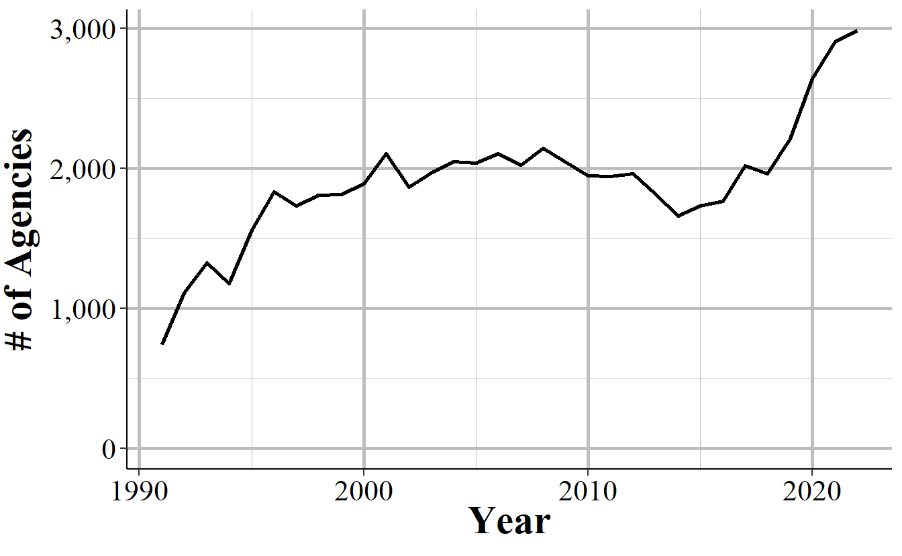
<p class="caption">(\#fig:hateAgencies)The annual number of police agencies that report at least one hate crime incident in that year.</p>
</div>

The 3,000 or so agencies that report each year are not the same every year. Figure \@ref(fig:hateCrimesEver) shows the cumulative number of agencies that have reported at least one hate crime between 1991 and 2022. There is a steady growth in the cumulative number of agencies, with about 350 new agencies each year. In each year some new agencies report hate crimes for the first time while some agencies that reported a hate crime in previous years don't report any hate crimes in the current year.

<div class="figure" style="text-align: center">

<p class="caption">(\#fig:hateCrimesEver)The cumulative number of agencies that have reported one or more hate crimes between 1991 and 2022</p>
</div>

Figure \@ref(fig:hateCrimesPreviousYear) puts this into hard numbers by showing the percent of agencies who reported a hate crime in a certain year who *also* reported a hate crime in the previous year. For most years between 50% and 60% of agencies which reported a hate crime in the year shown on the x-axis also reported a hate crime in the previous year, indicating somewhat high consistency in which agencies have hate crimes. 

<div class="figure" style="text-align: center">
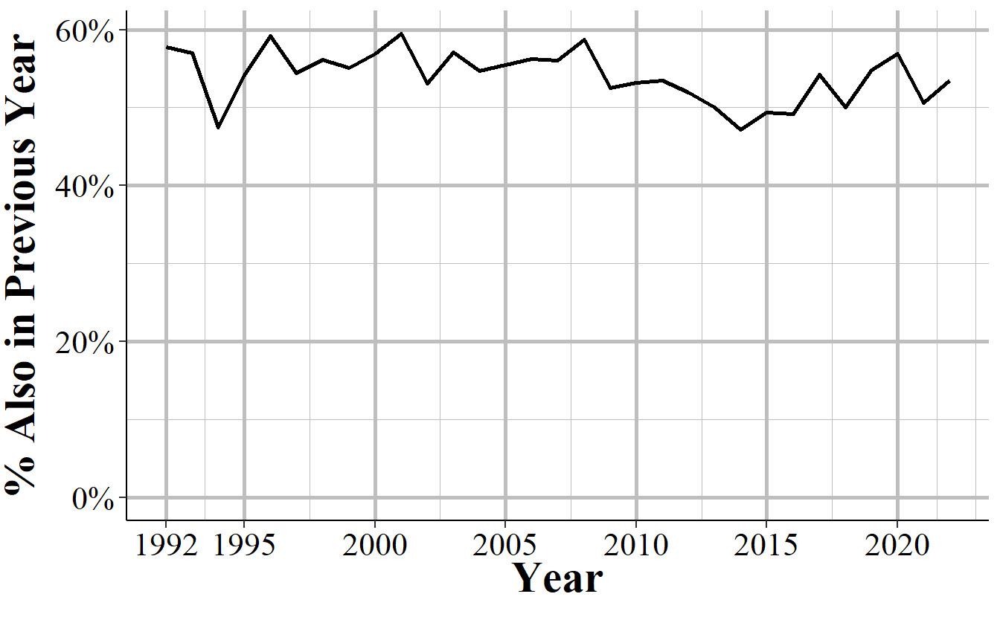
<p class="caption">(\#fig:hateCrimesPreviousYear)The percent of agencies that report a hate crime in a given year that also reported a hate crime in the previous year, 1992-2022</p>
</div>

Another way to understand reporting is to look at the number of reported hate crimes by state and see which states report and which don't. Figure \@ref(fig:hateCrimesMap) does this for 2022 data by showing the number of reported hate crime incidents by state. Unfortunately what we've done here is basically create a population map, though with California as a clear outlier. Counting up and graphing or mapping the number of crimes is a common first response to getting new data but isn't actually that helpful. Here we see that the states with the biggest populations - California, New York, Texas,  - have the most hate crimes. To be more useful let's look at state-level reporting after adjusting to the number of agencies in the state and to the civilian population.

<div class="figure" style="text-align: center">
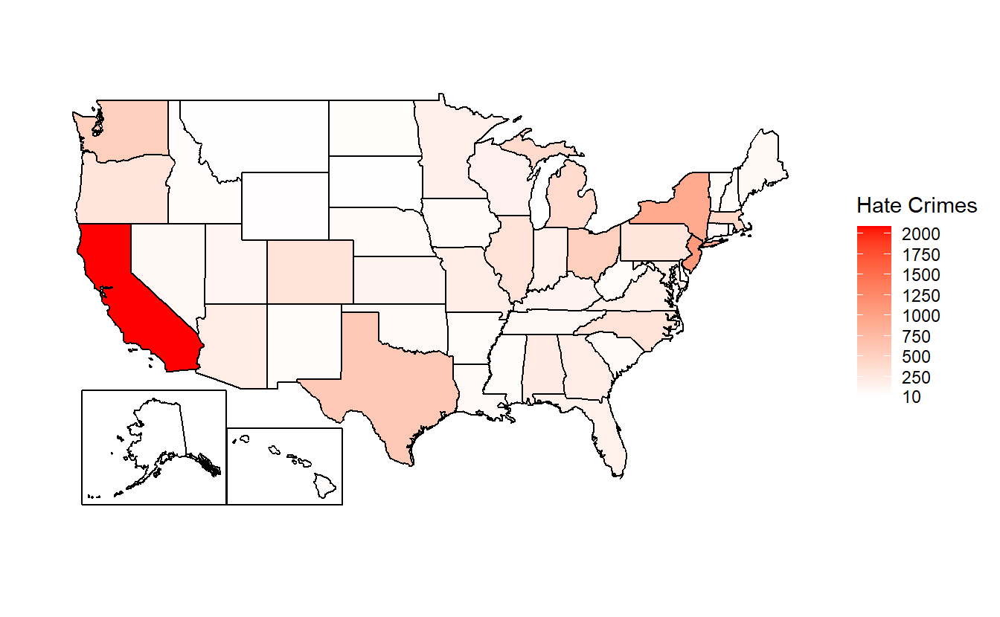
<p class="caption">(\#fig:hateCrimesMap)Total reported hate crimes by state, 2022</p>
</div>


We'll start with the rate of agencies reporting though this incorrectly assumes that each agency in the state is comparable. For example, say a state has 10 agencies; one that has jurisdiction over 91% of the state's population, and nine that have jurisdiction over 1% of the population each. If the one big agency reports and none of the nine do then we'll say that only 10% of agencies report data. But this one covers 91% of the state so this is actually great coverage. Conversely, having that one agency not report means that even with the other nine agencies reporting we actually cover less than one-tenth of the state's population. Still, this is a useful starting point for understanding this data's reporting and usually answering these kinds of questions requires multiple answers that are all wrong in their own way.

Figure \@ref(fig:statePercentReporting) shows the percent of agencies for each state that reported at least one hate crime in 2022. In New Jersey, the state with the highest percent of agencies reporting, 39% of agencies reported at least one hate crime. It's neighboring states of Pennsylvania, Delaware, and New York have a much lower rate of reporting at 4% (the lowest of any state), 11%, and 14%, respectively. This difference is likely due to a 2019 request by the New Jersey Attorney General to police officers that they [https://www.washingtonpost.com/national-security/2022/01/29/hate-crimes-nj-fbi-asian/]("more thoroughly report on bias incidents.") To me this suggests that decisions at the state level can lead to drastic changes in reporting rates by agencies, and is a possible solution to low reporting rates. 

In 15 states, fewer than 10% of agencies reported a hate crime, and in one state (Pennsylvania) fewer than 5% of agencies did so. One interesting finding from this map is the more liberal states - New Jersey, Washington, California, Connecticut, etc. - have the highest share of agencies reporting a hate crime, indicating that the culture of the state may influence either the propensity of hate crimes, whether victims report, whether agencies report hate crimes, or simply that more hate crimes happen in these areas.   

<div class="figure" style="text-align: center">
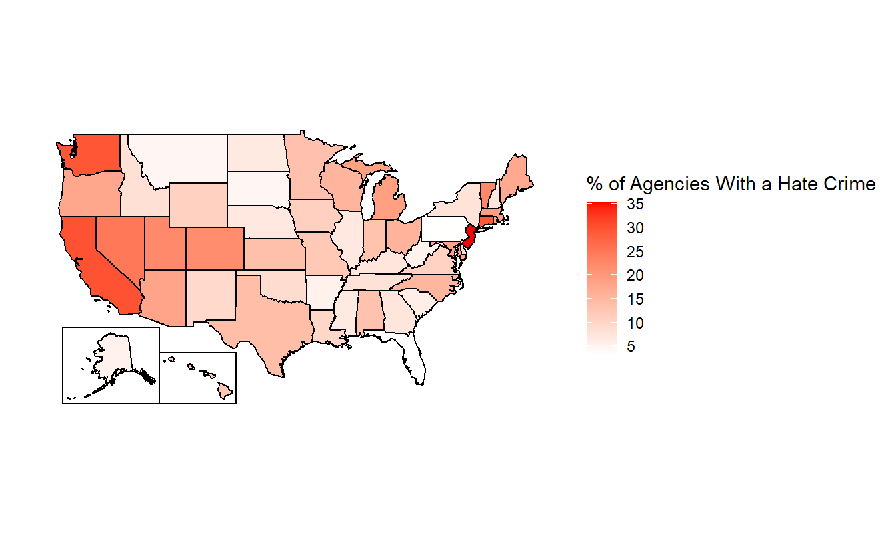
<p class="caption">(\#fig:statePercentReporting)The percent of agencies in each state that reported at least one hate crime in 2022, excluding agencies covered by another agency.</p>
</div>

To examine how population affects our results, Figure \@ref(fig:statePercentReportingPop) shows the percent of each state's population that is covered by an agency that reported at least one hate crime. Results are similar to Figure \@ref(fig:statePercentReporting) but now show that there is more reporting than it appeared in that figure. That is because while not all agencies report a hate crime, the ones that do report are generally larger (in terms of population) than the ones that don't. And that's to be expected since smaller agencies will have fewer crimes than larger ones meaning that it's less likely that have a hate crime.

So measuring by population we see that about half of the people in the country lives in the jurisdiction of an agency which reported at least one hate crime. The average state also covers about half of the population in a hate-crime-reporting agency. The state with the lowest population covered is Mississippi with 17% of its residents in a jurisdiction with an agency reporting data; the state with the highest share is Hawaii at 86%.

Is this good? We don't necessarily want 100% of agencies to report a hate crime since not all agencies will experience a hate crime in their jurisdiction. The ideal dataset would have all hate crimes reported but without knowing how many hates crimes there actually are we can't tell how well this data captures hate crimes.

This is also a fairly poor measure of reporting as it just measures agencies reporting at least one hate crime. If an agency had many hate crimes but only reported very few - and here let's think about that as both agencies not knowing a crime was a hate crime and also knowing but not reporting a hate crime - that's also quite bad for our understanding of hate crimes. However, it is far more likely that a hate crime isn't reported than a non-hate crime being reported as a hate crime. Since we know the likely direction of any errors we can think about this entire dataset as being the lower-bound of hate crime data.

<div class="figure" style="text-align: center">
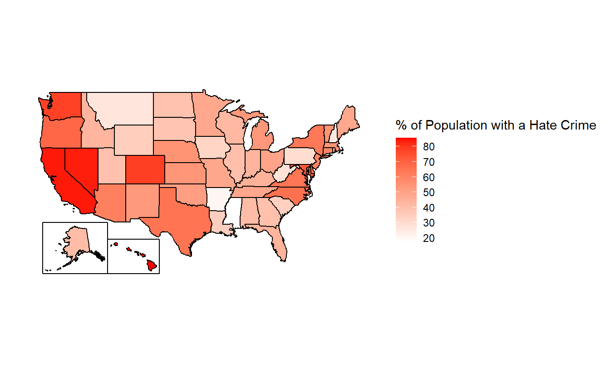
<p class="caption">(\#fig:statePercentReportingPop)The percent of population in each state in agencies that reported at least one hate crime in 2022, excluding agencies that are covered by another agency.</p>
</div>

## Tree of Life synagogue shooting {#treeOfLife}

One way I like to check the quality of data is to see how it reports something that I know occurred. Here we'll look at how the anti-Semitic attack on a synagogue in Pittsburgh was reported. In October of 2018 the deadliest attack on Jewish people in US history occurred at the Tree of Life synagogue in Pittsburgh, PA. There, 11 congregants were murdered, and several other people, including police officers, were injured by the shooter. Yet according to this data, however, those murders never occurred. Not in Pittsburgh at least. No murders with an anti-Jewish bias were reported in Pittsburgh in 2018. Instead, the shooting was reported by the FBI's Pittsburgh field office, which, like many federal agencies that have offices across the country, is included in the data as its own agency.

This is good and bad. Of course it is good that when a crime happens it is reported in the data. The bad part is that it is counted as hate crimes that occurred in the FBI's Pittsburgh agency, and not the Pittsburgh Police Department. Most research occurs at the local level - usually studying an agency or county. So if a study is examining agency-level characteristics that are related to hate crimes it'd almost certainly exclude these murders as they are reported by a federal agency and not the local Pittsburgh agency. 

This also gets complicated as FBI rules say that a crime should be reported by the most local jurisdiction. This is true even when there is overlapping jurisdiction. 11 people were murdered in Pittsburgh, and several Pittsburgh Police officers were injured. That should mean that the crime is reported by Pittsburgh Police, not by the FBI. Pittsburgh does report these murders in their Offenses Known data, making it even more odd that they're Pittsburgh crimes in one dataset and not another.^[The murders of nine Black parishioners in the Emanuel African Methodist Episcopal Church in Charleston, South Carolina, in 2015 was reported by the Charleston Police Department, making it even more inconsistent for when the FBI reports hate crime murders.] 

## Important variables

This data has the standard set of variables describing the agency that is reporting. This includes the agency ORI - which is the unique ID for that agency - the agency name, their state, and the population under their jurisdiction. It then has more detailed information about each crime such as what crime happened, what type of bias it involved, where it occurred, and some demographics of the offender.

### Date and time

This data says the exact date that the hate crime occurred on - though not the date it was reported on. Figure \@ref(fig:hateCrimesByDay) shows the percent of hates crimes between 1991 and 2022 that occurred on each day of the week. Interestingly, the most common days for a hate crime to occur is on Friday, which is also when non-hate crimes most frequently occur. This suggests that hate crimes do follow the same trends - at least partially - as other crimes.

<div class="figure" style="text-align: center">
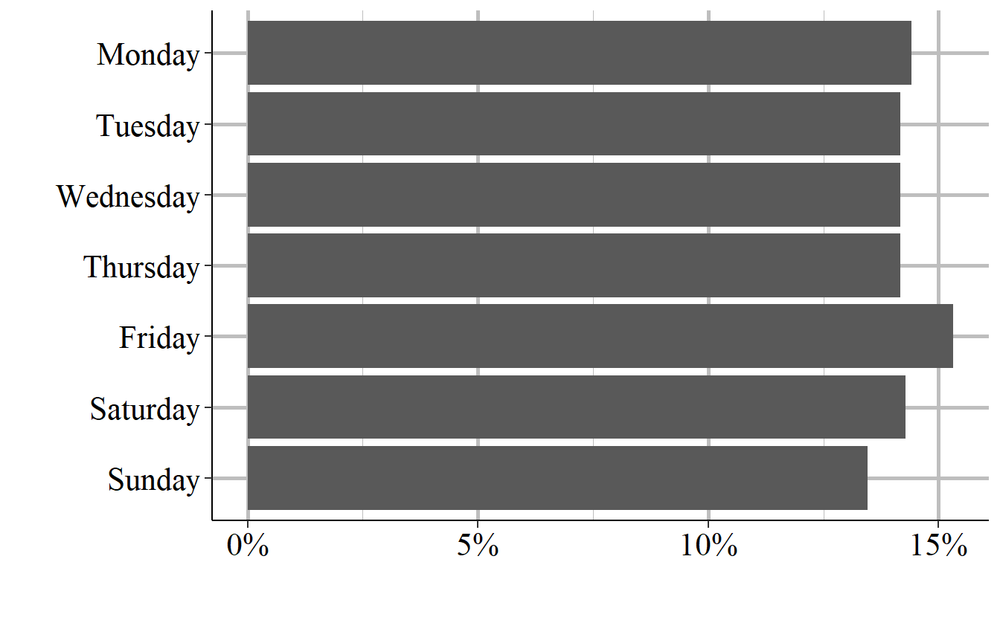
<p class="caption">(\#fig:hateCrimesByDay)The day of the week that hate crimes occurred on, 1991-2022</p>
</div>

We can also look at which day of the month is most common, as shown in Figure \@ref(fig:hateCrimesByMonthDay). There's no pattern that I can see other than the the 1st of the most has the most hate crimes and the end of the month has the fewest. Not all months have more than 28 days so it makes sense that the 29th, 30th, and 31st are the least common days. Is the 1st of the month really the most dangerous? I think this is likely just a quirk of the data, and is something we also see in NIBRS data. When an agency doesn't report an actual date they may use the 1st of the month as a placeholder which then looks to us like the 1st is an especially prolific day for hate crimes. 

<div class="figure" style="text-align: center">
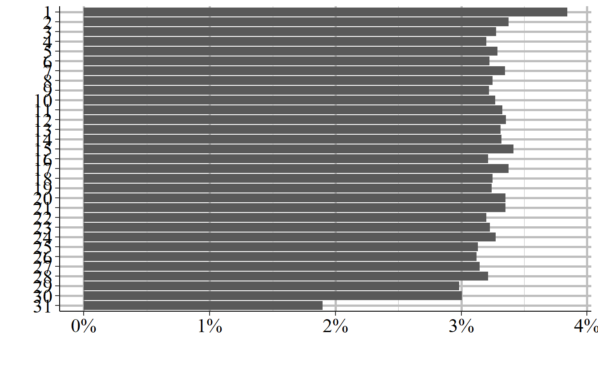
<p class="caption">(\#fig:hateCrimesByMonthDay)The day of the month that hate crimes occurred on, 1991-2022</p>
</div>

### The bias motivation (who the hate is against)

The most important variable in this data is the "bias motivation" which is the FBI's term for the cause of the hate. A hate crime targeted against Black people would be an "anti-Black" bias motivation. For the police to classify an incident as a hate crime, and to assign a particular bias motivation, the police must have *some* evidence that the crime was motivated by hate. The victim saying that the crime is a hate crime alone is not sufficient - though if large portions of the victim's community believe that the crime is a hate crime, this can be a factor in the police's assessment. 

The evidence required is not major. It includes evidence as explicit as slurs said during an incident and less obvious factors like the crime occurring on an important holiday for that community (e.g. Martin Luther King Day, religious holidays). The FBI also encourages police to consider the totality of the evidence even if none alone strongly suggests that the crime was a hate crime in making their determination about whether the incident was a hate crime or not. This also means that many (perhaps most) hate crimes will not be recorded as hate crimes since there is no evidence that the crime is motivated by hate. 

Consider, for example, a person who is biased against Asian people and decides to rob them because they are Asian. This is clearly a hate crime. And say this persons robs 10 Asian people in 10 different incidents, causing 10 hate crimes. All of the victims report it to the police but only two of them tell the police that they think it was a hate crime; the other eight do not think it is a hate crime. Without additional information the police would likely not report any of these robberies as hate crimes. And if all ten of the victims happened to be surveyed about crime victimization, such as through the Bureau of Justice Statistics' National Crime Victimization Survey, only two of the 10 victims would report being the victim of a hate crime. Using FBI data the anti-Asian hate crimes would be zero; using victimization surveys would undercount anti-Asian hate crimes enormously. This is the main problem with using hate crime data, even with perfect reporting or surveys of everyone possibly victimized we may still be getting data that is completely incorrect.

In the FBI data bias motivation is based on the offender's perceptions of the victim so even if they are incorrect in who their victim is, if they intended to target someone for their perceived group membership, that is still a hate crime. For example, if a person assaults a man because they think he is gay, that is a hate crime because the assault was motivated by hate towards gay people. Whether the victim is actually gay or not is not relevant - the offender perceived him to be gay so it is an anti-gay hate crime. To make this even more complicated, the offender must have committed the crime because they are motivated, at least to some degree, by their bias against the victim. Being biased against the victim but targeting them for some other reason means that the crime is not a hate crime. 

The biases that the FBI includes in this data have grown over time, with new bias motivations being added in 1997, 2012, 2013, and 2015. Table \@ref(tab:hateBiasMotivation) shows each bias motivation in this data, the year it was first reported, how many hate crimes there were for this bias motivation from 1991-2022 and what percent of hate crimes that bias motivation makes up. 

To make the most common bias motivations easier to identify, the table is sorted by the frequency of incidents. The "first year" column reflects the first year that the bias motivation was officially recorded, though some biases may have existed earlier but were not yet captured in the data. The last column in this table shows the percent of hate crime incidents from 1991-2022. 

This sorting makes it easy to see the most common bias motivations, but that's not actually that useful to most people since we usually care more about a rate than a count. For example, according to this table there were almost three times as many anti-Black hate crimes than anti-Jewish hate crimes, showing that anti-Black hate crimes are more of a problem in this country. But this isn't right. We can't just count of the number of offenses or we risk accidentally just measuring the population of these groups. Black people, for example, make up about 14% of the United States population while Jewish people make up about 2%.^[For simplicity I am treating these groups as independent though of course some Black people can be Jewish.] If we adjust the numbers to equalize population then we see that there is a much higher anti-Jewish hate crime rate than anti-Black rate. 

And even this isn't that useful since you really need a much deeper dive into the data before pulling out these seemingly simple statistics. For example, maybe areas with more Jewish people have better reporting than areas with more Black people. Or that Jewish victims would report to the police at higher rates than Black victims. Maybe these are both true at certain times between 1992 and 2022 but have changed over the years. It's not hard to think of possible explanations for differences between groups so without running down each of these explanations I recommend caution before putting out even something as seemingly simple at the number of crimes by bias group. 

<table class="table table-striped" style="width: auto !important; margin-left: auto; margin-right: auto;">
<caption>(\#tab:hateBiasMotivation)The bias motivation for hate crime incidents. In incidents with multiple bias motivation, this shows only the first bias motivation recorded.</caption>
 <thead>
  <tr>
   <th style="text-align:left;"> Bias Motivation </th>
   <th style="text-align:right;"> First Year Reported </th>
   <th style="text-align:right;"> # of Incidents </th>
   <th style="text-align:left;"> % of Incidents </th>
  </tr>
 </thead>
<tbody>
  <tr>
   <td style="text-align:left;"> Total </td>
   <td style="text-align:right;">  </td>
   <td style="text-align:right;"> 240,108 </td>
   <td style="text-align:left;"> 100\% </td>
  </tr>
  <tr>
   <td style="text-align:left;"> Anti-Black </td>
   <td style="text-align:right;"> 1991 </td>
   <td style="text-align:right;"> 81,208 </td>
   <td style="text-align:left;"> 33.82\% </td>
  </tr>
  <tr>
   <td style="text-align:left;"> Anti-Jewish </td>
   <td style="text-align:right;"> 1991 </td>
   <td style="text-align:right;"> 29,967 </td>
   <td style="text-align:left;"> 12.48\% </td>
  </tr>
  <tr>
   <td style="text-align:left;"> Anti-White </td>
   <td style="text-align:right;"> 1991 </td>
   <td style="text-align:right;"> 27,360 </td>
   <td style="text-align:left;"> 11.39\% </td>
  </tr>
  <tr>
   <td style="text-align:left;"> Anti-Male Homosexual (Gay) </td>
   <td style="text-align:right;"> 1991 </td>
   <td style="text-align:right;"> 23,862 </td>
   <td style="text-align:left;"> 9.94\% </td>
  </tr>
  <tr>
   <td style="text-align:left;"> Anti-Hispanic </td>
   <td style="text-align:right;"> 1991 </td>
   <td style="text-align:right;"> 15,397 </td>
   <td style="text-align:left;"> 6.41\% </td>
  </tr>
  <tr>
   <td style="text-align:left;"> Anti-Ethnicity Other Than Hispanic </td>
   <td style="text-align:right;"> 1991 </td>
   <td style="text-align:right;"> 11,498 </td>
   <td style="text-align:left;"> 4.79\% </td>
  </tr>
  <tr>
   <td style="text-align:left;"> Anti-Lesbian, Gay, Bisexual, Or Transgender, Mixed Group (LGBT) </td>
   <td style="text-align:right;"> 1991 </td>
   <td style="text-align:right;"> 7,815 </td>
   <td style="text-align:left;"> 3.25\% </td>
  </tr>
  <tr>
   <td style="text-align:left;"> Anti-Asian </td>
   <td style="text-align:right;"> 1991 </td>
   <td style="text-align:right;"> 7,671 </td>
   <td style="text-align:left;"> 3.19\% </td>
  </tr>
  <tr>
   <td style="text-align:left;"> Anti-Multi-Racial Group </td>
   <td style="text-align:right;"> 1991 </td>
   <td style="text-align:right;"> 5,652 </td>
   <td style="text-align:left;"> 2.35\% </td>
  </tr>
  <tr>
   <td style="text-align:left;"> Anti-Female Homosexual (Lesbian) </td>
   <td style="text-align:right;"> 1991 </td>
   <td style="text-align:right;"> 4,876 </td>
   <td style="text-align:left;"> 2.03\% </td>
  </tr>
  <tr>
   <td style="text-align:left;"> Anti-Muslim </td>
   <td style="text-align:right;"> 1991 </td>
   <td style="text-align:right;"> 4,206 </td>
   <td style="text-align:left;"> 1.75\% </td>
  </tr>
  <tr>
   <td style="text-align:left;"> Anti-Other Religion </td>
   <td style="text-align:right;"> 1991 </td>
   <td style="text-align:right;"> 3,621 </td>
   <td style="text-align:left;"> 1.51\% </td>
  </tr>
  <tr>
   <td style="text-align:left;"> Anti-American Indian Or Native Alaskan </td>
   <td style="text-align:right;"> 1991 </td>
   <td style="text-align:right;"> 2,781 </td>
   <td style="text-align:left;"> 1.16\% </td>
  </tr>
  <tr>
   <td style="text-align:left;"> Anti-Catholic </td>
   <td style="text-align:right;"> 1991 </td>
   <td style="text-align:right;"> 1,819 </td>
   <td style="text-align:left;"> 0.76\% </td>
  </tr>
  <tr>
   <td style="text-align:left;"> Anti-Arab </td>
   <td style="text-align:right;"> 1991 </td>
   <td style="text-align:right;"> 1,510 </td>
   <td style="text-align:left;"> 0.63\% </td>
  </tr>
  <tr>
   <td style="text-align:left;"> Anti-Transgender </td>
   <td style="text-align:right;"> 2013 </td>
   <td style="text-align:right;"> 1,500 </td>
   <td style="text-align:left;"> 0.62\% </td>
  </tr>
  <tr>
   <td style="text-align:left;"> Anti-Protestant </td>
   <td style="text-align:right;"> 1991 </td>
   <td style="text-align:right;"> 1,361 </td>
   <td style="text-align:left;"> 0.57\% </td>
  </tr>
  <tr>
   <td style="text-align:left;"> Anti-Mental Disability </td>
   <td style="text-align:right;"> 1997 </td>
   <td style="text-align:right;"> 1,333 </td>
   <td style="text-align:left;"> 0.56\% </td>
  </tr>
  <tr>
   <td style="text-align:left;"> Anti-Multi-Religious Group </td>
   <td style="text-align:right;"> 1991 </td>
   <td style="text-align:right;"> 1,314 </td>
   <td style="text-align:left;"> 0.55\% </td>
  </tr>
  <tr>
   <td style="text-align:left;"> Anti-Physical Disability </td>
   <td style="text-align:right;"> 1997 </td>
   <td style="text-align:right;"> 752 </td>
   <td style="text-align:left;"> 0.31\% </td>
  </tr>
  <tr>
   <td style="text-align:left;"> Anti-Sikh </td>
   <td style="text-align:right;"> 2015 </td>
   <td style="text-align:right;"> 673 </td>
   <td style="text-align:left;"> 0.28\% </td>
  </tr>
  <tr>
   <td style="text-align:left;"> Anti-Bisexual </td>
   <td style="text-align:right;"> 1991 </td>
   <td style="text-align:right;"> 652 </td>
   <td style="text-align:left;"> 0.27\% </td>
  </tr>
  <tr>
   <td style="text-align:left;"> Anti-Heterosexual </td>
   <td style="text-align:right;"> 1991 </td>
   <td style="text-align:right;"> 615 </td>
   <td style="text-align:left;"> 0.26\% </td>
  </tr>
  <tr>
   <td style="text-align:left;"> Anti-Gender Non-Conforming </td>
   <td style="text-align:right;"> 2012 </td>
   <td style="text-align:right;"> 514 </td>
   <td style="text-align:left;"> 0.21\% </td>
  </tr>
  <tr>
   <td style="text-align:left;"> Anti-Female </td>
   <td style="text-align:right;"> 2012 </td>
   <td style="text-align:right;"> 443 </td>
   <td style="text-align:left;"> 0.18\% </td>
  </tr>
  <tr>
   <td style="text-align:left;"> Anti-Other Christian </td>
   <td style="text-align:right;"> 2015 </td>
   <td style="text-align:right;"> 403 </td>
   <td style="text-align:left;"> 0.17\% </td>
  </tr>
  <tr>
   <td style="text-align:left;"> Anti-Eastern Orthodox (Greek, Russian, Etc.) </td>
   <td style="text-align:right;"> 2015 </td>
   <td style="text-align:right;"> 388 </td>
   <td style="text-align:left;"> 0.16\% </td>
  </tr>
  <tr>
   <td style="text-align:left;"> Anti-Atheism/Agnosticism </td>
   <td style="text-align:right;"> 1991 </td>
   <td style="text-align:right;"> 201 </td>
   <td style="text-align:left;"> 0.08\% </td>
  </tr>
  <tr>
   <td style="text-align:left;"> Anti-Native Hawaiian Or Other Pacific Islander </td>
   <td style="text-align:right;"> 2013 </td>
   <td style="text-align:right;"> 184 </td>
   <td style="text-align:left;"> 0.08\% </td>
  </tr>
  <tr>
   <td style="text-align:left;"> Anti-Male </td>
   <td style="text-align:right;"> 2013 </td>
   <td style="text-align:right;"> 171 </td>
   <td style="text-align:left;"> 0.07\% </td>
  </tr>
  <tr>
   <td style="text-align:left;"> Anti-Mormon </td>
   <td style="text-align:right;"> 2015 </td>
   <td style="text-align:right;"> 106 </td>
   <td style="text-align:left;"> 0.04\% </td>
  </tr>
  <tr>
   <td style="text-align:left;"> Anti-Hindu </td>
   <td style="text-align:right;"> 2015 </td>
   <td style="text-align:right;"> 103 </td>
   <td style="text-align:left;"> 0.04\% </td>
  </tr>
  <tr>
   <td style="text-align:left;"> Anti-Buddhist </td>
   <td style="text-align:right;"> 2015 </td>
   <td style="text-align:right;"> 101 </td>
   <td style="text-align:left;"> 0.04\% </td>
  </tr>
  <tr>
   <td style="text-align:left;"> Anti-Jehovahs Witness </td>
   <td style="text-align:right;"> 2015 </td>
   <td style="text-align:right;"> 51 </td>
   <td style="text-align:left;"> 0.02\% </td>
  </tr>
</tbody>
</table>


2015 is the year with the most bias additions, as of data through 2022. This year added a number of religions such as Anti-Buddhist, Anti-Sikh, and Anti-Jehovah's Witness. In 2013, anti-Transgender was added and this is the most common of the bias motivations added since data began in 1991 with 1500 hate crimes between 2013-2022 - 0.62% of all hate crime incidents from 1991-2022. That year also added anti-male and Anti-Native Hawaiian or Other Pacific Islander, which is the most recent racial group added. In 2012, anti-gender non-conforming and anti-female were included, while in 1997 both anti-mental and anti-physical disability were added. In part due to having fewer years of data available, these newer bias motivations make up a small percent of total hate crimes. 

The original hate crimes - that is, those in the data in 1991 when this dataset was released - are far more common. The most common bias motivation is anti-Black at 34% of hate crimes, anti-Jewish at 12%, anti-White at 11%, anti-male homosexual (gay) at 10%, anti-Hispanic at 6%, and anti-ethnicity other than Hispanic (this group means a crime against an ethnic group that isn't Hispanic, though it is occasionally reported as anti-non-Hispanic which is incorrect.) at 5%. All other bias motivations are less than 5% of hate crimes and consist of a variety of ethnic, racial, religious, or sexual orientation. Some hate crimes can potentially fall in multiple categories. For example, there is a bias motivation of "anti-male homosexual (gay)" and of "anti-lesbian, gay, bisexual, or transgender, mixed group (LGBT)" so there is some overlap between them. When an incident involves multiple bias motivations we can track that in the data as police can report up to 10 bias motivations per incident. In practice, however, most incidents involve only a single bias motivation.

### The crime that occurred

The "crime" part of hate crimes is which criminal offense occurred during the incident. A hateful act where the action is not one of the crimes that the FBI records would not be considered a hate crime. This is likely most common when considering something like a person calling someone by a hateful slur (e.g. "You're a [slur]," "go back to your own country", etc.) but where the action is not technically a crime. Another layer of difficulty in using this data is that not all crimes that the FBI includes were initially included when data become available in 1991. Every several years the FBI adds new crimes to be included in this data. Table \@ref(tab:hateOffense) shows each crime in the data, the first year that this crime was reported, the total number of these crimes reported between 1991 and 2022, and the percent of all incidents this crime makes up.^[This tables uses only the first offense in an incident so counts are slightly lower than if all crimes in every incident is used.] 

Each hate crime incident can cover up to 10 different crimes occurring - for example, a person who burglarizes a synagogue and spray paints a swastika on the wall would have both burglary and vandalism reported in this data. With each crime, this data has the bias motivation for that crime, the location of the crime (in broad categories, not the actual location in the city like a street address would have), and the number of victims for that offense. In practice, in most hate crimes with multiple offenses recorded, the bias motivation, location, and victim count is the same for each offense.

Figure \@ref(fig:crimesPerHateCrime) shows the number of crimes per incident for each hate crime reported between 1991 and 2022. In 96.6% of cases, there is only one offense in that incident.^[In 0.0004% of hate crimes there is no recorded offense. This is not shown in the graph.] This drops sharply to 3.2% of incidents having two offenses, 0.21% having three offenses, 0.019% having four offenses, and 0.002% having five offenses. Even though this data does allow up to 10 offenses per hate crime incident, there has never been a recorded case with more than five offenses. Results are nearly identical when examining the number of bias motivations and locations reported in an incident. 

<div class="figure" style="text-align: center">
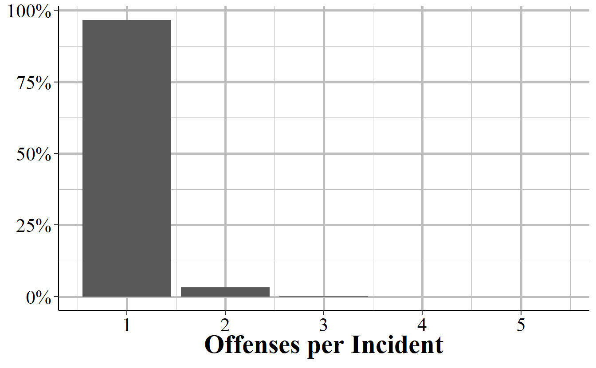
<p class="caption">(\#fig:crimesPerHateCrime)The number of offenses per hate crime incident.</p>
</div>

Nearly all hate crimes are vandalism/destruction of property (30%), intimidation (30%), and simple assault (20%) or aggravated assault (11%) with no remaining crime making up more than 2% of total hate crimes. 

<table class="table table-striped" style="width: auto !important; margin-left: auto; margin-right: auto;">
<caption>(\#tab:hateOffense)The offense type for hate crime incidents. In incidents with multiple offense types, this shows only the first offense type recorded.</caption>
 <thead>
  <tr>
   <th style="text-align:left;"> Offense </th>
   <th style="text-align:right;"> First Year Reported </th>
   <th style="text-align:right;"> # of Incidents </th>
   <th style="text-align:left;"> % of Incidents </th>
  </tr>
 </thead>
<tbody>
  <tr>
   <td style="text-align:left;"> Total </td>
   <td style="text-align:right;">  </td>
   <td style="text-align:right;"> 240,108 </td>
   <td style="text-align:left;"> 100\% </td>
  </tr>
  <tr>
   <td style="text-align:left;"> Destruction of Property/Vandalism </td>
   <td style="text-align:right;"> 1991 </td>
   <td style="text-align:right;"> 72,489 </td>
   <td style="text-align:left;"> 30.19\% </td>
  </tr>
  <tr>
   <td style="text-align:left;"> Intimidation </td>
   <td style="text-align:right;"> 1991 </td>
   <td style="text-align:right;"> 71,583 </td>
   <td style="text-align:left;"> 29.81\% </td>
  </tr>
  <tr>
   <td style="text-align:left;"> Simple Assault </td>
   <td style="text-align:right;"> 1991 </td>
   <td style="text-align:right;"> 47,917 </td>
   <td style="text-align:left;"> 19.96\% </td>
  </tr>
  <tr>
   <td style="text-align:left;"> Aggravated Assault </td>
   <td style="text-align:right;"> 1991 </td>
   <td style="text-align:right;"> 26,879 </td>
   <td style="text-align:left;"> 11.19\% </td>
  </tr>
  <tr>
   <td style="text-align:left;"> Robbery </td>
   <td style="text-align:right;"> 1991 </td>
   <td style="text-align:right;"> 4,339 </td>
   <td style="text-align:left;"> 1.81\% </td>
  </tr>
  <tr>
   <td style="text-align:left;"> Burglary/Breaking And Entering </td>
   <td style="text-align:right;"> 1991 </td>
   <td style="text-align:right;"> 3,890 </td>
   <td style="text-align:left;"> 1.62\% </td>
  </tr>
  <tr>
   <td style="text-align:left;"> All Other Larceny </td>
   <td style="text-align:right;"> 1993 </td>
   <td style="text-align:right;"> 2,584 </td>
   <td style="text-align:left;"> 1.08\% </td>
  </tr>
  <tr>
   <td style="text-align:left;"> Arson </td>
   <td style="text-align:right;"> 1991 </td>
   <td style="text-align:right;"> 1,456 </td>
   <td style="text-align:left;"> 0.61\% </td>
  </tr>
  <tr>
   <td style="text-align:left;"> Drug/Narcotic Violations </td>
   <td style="text-align:right;"> 1993 </td>
   <td style="text-align:right;"> 1,380 </td>
   <td style="text-align:left;"> 0.57\% </td>
  </tr>
  <tr>
   <td style="text-align:left;"> Theft-Other </td>
   <td style="text-align:right;"> 1991 </td>
   <td style="text-align:right;"> 917 </td>
   <td style="text-align:left;"> 0.38\% </td>
  </tr>
  <tr>
   <td style="text-align:left;"> Theft From Motor Vehicle </td>
   <td style="text-align:right;"> 1993 </td>
   <td style="text-align:right;"> 884 </td>
   <td style="text-align:left;"> 0.37\% </td>
  </tr>
  <tr>
   <td style="text-align:left;"> Shoplifting </td>
   <td style="text-align:right;"> 1993 </td>
   <td style="text-align:right;"> 771 </td>
   <td style="text-align:left;"> 0.32\% </td>
  </tr>
  <tr>
   <td style="text-align:left;"> Theft From Building </td>
   <td style="text-align:right;"> 1994 </td>
   <td style="text-align:right;"> 617 </td>
   <td style="text-align:left;"> 0.26\% </td>
  </tr>
  <tr>
   <td style="text-align:left;"> Motor Vehicle Theft </td>
   <td style="text-align:right;"> 1992 </td>
   <td style="text-align:right;"> 577 </td>
   <td style="text-align:left;"> 0.24\% </td>
  </tr>
  <tr>
   <td style="text-align:left;"> Weapon Law Violations </td>
   <td style="text-align:right;"> 1993 </td>
   <td style="text-align:right;"> 469 </td>
   <td style="text-align:left;"> 0.20\% </td>
  </tr>
  <tr>
   <td style="text-align:left;"> Drug Equipment Violations </td>
   <td style="text-align:right;"> 1995 </td>
   <td style="text-align:right;"> 391 </td>
   <td style="text-align:left;"> 0.16\% </td>
  </tr>
  <tr>
   <td style="text-align:left;"> False Pretenses/Swindle/Confidence Game </td>
   <td style="text-align:right;"> 1997 </td>
   <td style="text-align:right;"> 353 </td>
   <td style="text-align:left;"> 0.15\% </td>
  </tr>
  <tr>
   <td style="text-align:left;"> Murder/Non-Negligent Manslaughter </td>
   <td style="text-align:right;"> 1991 </td>
   <td style="text-align:right;"> 330 </td>
   <td style="text-align:left;"> 0.14\% </td>
  </tr>
  <tr>
   <td style="text-align:left;"> Forcible Rape </td>
   <td style="text-align:right;"> 1991 </td>
   <td style="text-align:right;"> 314 </td>
   <td style="text-align:left;"> 0.13\% </td>
  </tr>
  <tr>
   <td style="text-align:left;"> Theft of Motor Vehicle Parts/Accessories </td>
   <td style="text-align:right;"> 1993 </td>
   <td style="text-align:right;"> 249 </td>
   <td style="text-align:left;"> 0.10\% </td>
  </tr>
  <tr>
   <td style="text-align:left;"> Counterfeiting/Forgery </td>
   <td style="text-align:right;"> 1993 </td>
   <td style="text-align:right;"> 245 </td>
   <td style="text-align:left;"> 0.10\% </td>
  </tr>
  <tr>
   <td style="text-align:left;"> Forcible Fondling - Indecent Liberties/Child Molest </td>
   <td style="text-align:right;"> 1993 </td>
   <td style="text-align:right;"> 225 </td>
   <td style="text-align:left;"> 0.09\% </td>
  </tr>
  <tr>
   <td style="text-align:left;"> Credit Card/Atm Fraud </td>
   <td style="text-align:right;"> 1995 </td>
   <td style="text-align:right;"> 182 </td>
   <td style="text-align:left;"> 0.08\% </td>
  </tr>
  <tr>
   <td style="text-align:left;"> Impersonation </td>
   <td style="text-align:right;"> 2001 </td>
   <td style="text-align:right;"> 152 </td>
   <td style="text-align:left;"> 0.06\% </td>
  </tr>
  <tr>
   <td style="text-align:left;"> Kidnapping/Abduction </td>
   <td style="text-align:right;"> 1994 </td>
   <td style="text-align:right;"> 152 </td>
   <td style="text-align:left;"> 0.06\% </td>
  </tr>
  <tr>
   <td style="text-align:left;"> Stolen Property Offenses - Receiving, Selling, Etc. </td>
   <td style="text-align:right;"> 1996 </td>
   <td style="text-align:right;"> 140 </td>
   <td style="text-align:left;"> 0.06\% </td>
  </tr>
  <tr>
   <td style="text-align:left;"> Fraud-Other </td>
   <td style="text-align:right;"> 2016 </td>
   <td style="text-align:right;"> 103 </td>
   <td style="text-align:left;"> 0.04\% </td>
  </tr>
  <tr>
   <td style="text-align:left;"> Forcible Sodomy </td>
   <td style="text-align:right;"> 1995 </td>
   <td style="text-align:right;"> 82 </td>
   <td style="text-align:left;"> 0.03\% </td>
  </tr>
  <tr>
   <td style="text-align:left;"> Pornography/Obscene Material </td>
   <td style="text-align:right;"> 1995 </td>
   <td style="text-align:right;"> 81 </td>
   <td style="text-align:left;"> 0.03\% </td>
  </tr>
  <tr>
   <td style="text-align:left;"> Embezzlement </td>
   <td style="text-align:right;"> 1995 </td>
   <td style="text-align:right;"> 66 </td>
   <td style="text-align:left;"> 0.03\% </td>
  </tr>
  <tr>
   <td style="text-align:left;"> Extortion/Blackmail </td>
   <td style="text-align:right;"> 1997 </td>
   <td style="text-align:right;"> 62 </td>
   <td style="text-align:left;"> 0.03\% </td>
  </tr>
  <tr>
   <td style="text-align:left;"> Sexual Assault With An Object </td>
   <td style="text-align:right;"> 1996 </td>
   <td style="text-align:right;"> 41 </td>
   <td style="text-align:left;"> 0.02\% </td>
  </tr>
  <tr>
   <td style="text-align:left;"> Purse-Snatching </td>
   <td style="text-align:right;"> 1995 </td>
   <td style="text-align:right;"> 29 </td>
   <td style="text-align:left;"> 0.01\% </td>
  </tr>
  <tr>
   <td style="text-align:left;"> Pocket-Picking </td>
   <td style="text-align:right;"> 1996 </td>
   <td style="text-align:right;"> 28 </td>
   <td style="text-align:left;"> 0.01\% </td>
  </tr>
  <tr>
   <td style="text-align:left;"> Wire Fraud </td>
   <td style="text-align:right;"> 2006 </td>
   <td style="text-align:right;"> 26 </td>
   <td style="text-align:left;"> 0.01\% </td>
  </tr>
  <tr>
   <td style="text-align:left;"> Statutory Rape </td>
   <td style="text-align:right;"> 1999 </td>
   <td style="text-align:right;"> 21 </td>
   <td style="text-align:left;"> 0.01\% </td>
  </tr>
  <tr>
   <td style="text-align:left;"> Theft From Coin-Operated Machine Or Device </td>
   <td style="text-align:right;"> 1999 </td>
   <td style="text-align:right;"> 16 </td>
   <td style="text-align:left;"> 0.01\% </td>
  </tr>
  <tr>
   <td style="text-align:left;"> Unknown </td>
   <td style="text-align:right;"> 2018 </td>
   <td style="text-align:right;"> 15 </td>
   <td style="text-align:left;"> 0.01\% </td>
  </tr>
  <tr>
   <td style="text-align:left;"> Prostitution </td>
   <td style="text-align:right;"> 2001 </td>
   <td style="text-align:right;"> 14 </td>
   <td style="text-align:left;"> 0.01\% </td>
  </tr>
  <tr>
   <td style="text-align:left;"> Negligent Manslaughter </td>
   <td style="text-align:right;"> 1999 </td>
   <td style="text-align:right;"> 8 </td>
   <td style="text-align:left;"> 0.00\% </td>
  </tr>
  <tr>
   <td style="text-align:left;"> Welfare Fraud </td>
   <td style="text-align:right;"> 1996 </td>
   <td style="text-align:right;"> 8 </td>
   <td style="text-align:left;"> 0.00\% </td>
  </tr>
  <tr>
   <td style="text-align:left;"> Incest </td>
   <td style="text-align:right;"> 1997 </td>
   <td style="text-align:right;"> 7 </td>
   <td style="text-align:left;"> 0.00\% </td>
  </tr>
  <tr>
   <td style="text-align:left;"> Assisting Or Promoting Prostitution </td>
   <td style="text-align:right;"> 2013 </td>
   <td style="text-align:right;"> 5 </td>
   <td style="text-align:left;"> 0.00\% </td>
  </tr>
  <tr>
   <td style="text-align:left;"> Human Trafficking - Commercial Sex Acts </td>
   <td style="text-align:right;"> 2017 </td>
   <td style="text-align:right;"> 4 </td>
   <td style="text-align:left;"> 0.00\% </td>
  </tr>
  <tr>
   <td style="text-align:left;"> Bribery </td>
   <td style="text-align:right;"> 2014 </td>
   <td style="text-align:right;"> 4 </td>
   <td style="text-align:left;"> 0.00\% </td>
  </tr>
  <tr>
   <td style="text-align:left;"> Purchasing Prostitution </td>
   <td style="text-align:right;"> 2013 </td>
   <td style="text-align:right;"> 2 </td>
   <td style="text-align:left;"> 0.00\% </td>
  </tr>
  <tr>
   <td style="text-align:left;"> Human Trafficking - Involuntary Servitude </td>
   <td style="text-align:right;"> 2021 </td>
   <td style="text-align:right;"> 1 </td>
   <td style="text-align:left;"> 0.00\% </td>
  </tr>
</tbody>
</table>


Agencies that report to the FBI's National Incident-Based Reporting System (NIBRS) can also report bias motivations for their crimes, and these reports are included in this dataset. One tricky thing is that the crimes included are different depending on if the agency reported through NIBRS or to the dataset directly, and are not NIBRS reporting agencies. NIBRS agencies report all of the crimes as the agencies directly submitting SRS data, but have a wider variety of crimes they can report. In practice, however, both NIBRS and SRS reporting agencies can report the most common offenses so there is relatively little difference.

### The location of the crime

This data is interesting because it includes the location - in categories for types of places, not actual addresses - of the incident. This is important since the type of location can be a factor in whether the incident is classified as a hate crime. For example, spray paint on a synagogue or a mosque is much more likely to be a hate crime than spray paint on a wall of an abandoned building. Table \@ref(tab:hateLocations) shows the locations of hate crimes, including the first year that location was reported. Each hate crime incident can have multiple locations (up to ten) since each offense can have its own incident, but in most cases (96.6%) a hate crime only has a single location. 

As with the crime and the bias motivation, the available locations have increased as time went on, though these newer locations are relatively uncommon. One important change in location is that starting in 2010 the location of "school/college" was split to have one location be for elementary and high schools and another location be for colleges and universities. The majority of hate crimes occur in the victim's home (30%), on a road or alley (19%), in an other or unknown location (13%), and in a parking lot or parking garage (6%). All other locations occur in fewer than 5% of hate crimes. 

<table class="table table-striped" style="width: auto !important; margin-left: auto; margin-right: auto;">
<caption>(\#tab:hateLocations)The location of hate crime incidents. In incidents with multiple locations, this shows only the first location recorded.</caption>
 <thead>
  <tr>
   <th style="text-align:left;"> Location </th>
   <th style="text-align:right;"> First Year Reported </th>
   <th style="text-align:right;"> # of Incidents </th>
   <th style="text-align:left;"> % of Incidents </th>
  </tr>
 </thead>
<tbody>
  <tr>
   <td style="text-align:left;"> Total </td>
   <td style="text-align:right;">  </td>
   <td style="text-align:right;"> 239,665 </td>
   <td style="text-align:left;"> 100\% </td>
  </tr>
  <tr>
   <td style="text-align:left;"> Residence/Home </td>
   <td style="text-align:right;"> 1991 </td>
   <td style="text-align:right;"> 70,736 </td>
   <td style="text-align:left;"> 29.51\% </td>
  </tr>
  <tr>
   <td style="text-align:left;"> Highway/Road/Alley </td>
   <td style="text-align:right;"> 1991 </td>
   <td style="text-align:right;"> 45,004 </td>
   <td style="text-align:left;"> 18.78\% </td>
  </tr>
  <tr>
   <td style="text-align:left;"> Other/Unknown </td>
   <td style="text-align:right;"> 1991 </td>
   <td style="text-align:right;"> 31,218 </td>
   <td style="text-align:left;"> 13.03\% </td>
  </tr>
  <tr>
   <td style="text-align:left;"> School/College </td>
   <td style="text-align:right;"> 1991 </td>
   <td style="text-align:right;"> 17,550 </td>
   <td style="text-align:left;"> 7.32\% </td>
  </tr>
  <tr>
   <td style="text-align:left;"> Parking Lot/Garage </td>
   <td style="text-align:right;"> 1991 </td>
   <td style="text-align:right;"> 13,786 </td>
   <td style="text-align:left;"> 5.75\% </td>
  </tr>
  <tr>
   <td style="text-align:left;"> Church/Synagogue/Temple </td>
   <td style="text-align:right;"> 1991 </td>
   <td style="text-align:right;"> 8,926 </td>
   <td style="text-align:left;"> 3.72\% </td>
  </tr>
  <tr>
   <td style="text-align:left;"> Commercial/Office Building </td>
   <td style="text-align:right;"> 1991 </td>
   <td style="text-align:right;"> 5,403 </td>
   <td style="text-align:left;"> 2.25\% </td>
  </tr>
  <tr>
   <td style="text-align:left;"> Restaurant </td>
   <td style="text-align:right;"> 1991 </td>
   <td style="text-align:right;"> 5,099 </td>
   <td style="text-align:left;"> 2.13\% </td>
  </tr>
  <tr>
   <td style="text-align:left;"> Bar/Nightclub </td>
   <td style="text-align:right;"> 1991 </td>
   <td style="text-align:right;"> 4,088 </td>
   <td style="text-align:left;"> 1.71\% </td>
  </tr>
  <tr>
   <td style="text-align:left;"> School - Elementary/Secondary </td>
   <td style="text-align:right;"> 2010 </td>
   <td style="text-align:right;"> 3,919 </td>
   <td style="text-align:left;"> 1.64\% </td>
  </tr>
  <tr>
   <td style="text-align:left;"> Government/Public Building </td>
   <td style="text-align:right;"> 1991 </td>
   <td style="text-align:right;"> 3,545 </td>
   <td style="text-align:left;"> 1.48\% </td>
  </tr>
  <tr>
   <td style="text-align:left;"> Convenience Store </td>
   <td style="text-align:right;"> 1991 </td>
   <td style="text-align:right;"> 3,357 </td>
   <td style="text-align:left;"> 1.40\% </td>
  </tr>
  <tr>
   <td style="text-align:left;"> Specialty Store - Tv, Fur, Etc. </td>
   <td style="text-align:right;"> 1991 </td>
   <td style="text-align:right;"> 2,795 </td>
   <td style="text-align:left;"> 1.17\% </td>
  </tr>
  <tr>
   <td style="text-align:left;"> Air/Bus/Train Terminal </td>
   <td style="text-align:right;"> 1991 </td>
   <td style="text-align:right;"> 2,531 </td>
   <td style="text-align:left;"> 1.06\% </td>
  </tr>
  <tr>
   <td style="text-align:left;"> Service/Gas Station </td>
   <td style="text-align:right;"> 1991 </td>
   <td style="text-align:right;"> 2,287 </td>
   <td style="text-align:left;"> 0.95\% </td>
  </tr>
  <tr>
   <td style="text-align:left;"> Grocery/Supermarket </td>
   <td style="text-align:right;"> 1991 </td>
   <td style="text-align:right;"> 2,178 </td>
   <td style="text-align:left;"> 0.91\% </td>
  </tr>
  <tr>
   <td style="text-align:left;"> Field/Woods </td>
   <td style="text-align:right;"> 1991 </td>
   <td style="text-align:right;"> 2,169 </td>
   <td style="text-align:left;"> 0.91\% </td>
  </tr>
  <tr>
   <td style="text-align:left;"> School - College/University </td>
   <td style="text-align:right;"> 2010 </td>
   <td style="text-align:right;"> 2,068 </td>
   <td style="text-align:left;"> 0.86\% </td>
  </tr>
  <tr>
   <td style="text-align:left;"> Department/Discount Store </td>
   <td style="text-align:right;"> 1991 </td>
   <td style="text-align:right;"> 2,024 </td>
   <td style="text-align:left;"> 0.84\% </td>
  </tr>
  <tr>
   <td style="text-align:left;"> Drug Store/Doctors Office/Hospital </td>
   <td style="text-align:right;"> 1991 </td>
   <td style="text-align:right;"> 1,967 </td>
   <td style="text-align:left;"> 0.82\% </td>
  </tr>
  <tr>
   <td style="text-align:left;"> Park/Playground </td>
   <td style="text-align:right;"> 2010 </td>
   <td style="text-align:right;"> 1,883 </td>
   <td style="text-align:left;"> 0.79\% </td>
  </tr>
  <tr>
   <td style="text-align:left;"> Jail/Prison </td>
   <td style="text-align:right;"> 1991 </td>
   <td style="text-align:right;"> 1,726 </td>
   <td style="text-align:left;"> 0.72\% </td>
  </tr>
  <tr>
   <td style="text-align:left;"> Hotel/Motel </td>
   <td style="text-align:right;"> 1991 </td>
   <td style="text-align:right;"> 1,618 </td>
   <td style="text-align:left;"> 0.68\% </td>
  </tr>
  <tr>
   <td style="text-align:left;"> Construction Site </td>
   <td style="text-align:right;"> 1991 </td>
   <td style="text-align:right;"> 643 </td>
   <td style="text-align:left;"> 0.27\% </td>
  </tr>
  <tr>
   <td style="text-align:left;"> Bank/Savings And Loan </td>
   <td style="text-align:right;"> 1991 </td>
   <td style="text-align:right;"> 556 </td>
   <td style="text-align:left;"> 0.23\% </td>
  </tr>
  <tr>
   <td style="text-align:left;"> Liquor Store </td>
   <td style="text-align:right;"> 1991 </td>
   <td style="text-align:right;"> 459 </td>
   <td style="text-align:left;"> 0.19\% </td>
  </tr>
  <tr>
   <td style="text-align:left;"> Lake/Waterway </td>
   <td style="text-align:right;"> 1991 </td>
   <td style="text-align:right;"> 416 </td>
   <td style="text-align:left;"> 0.17\% </td>
  </tr>
  <tr>
   <td style="text-align:left;"> Shopping Mall </td>
   <td style="text-align:right;"> 2010 </td>
   <td style="text-align:right;"> 268 </td>
   <td style="text-align:left;"> 0.11\% </td>
  </tr>
  <tr>
   <td style="text-align:left;"> Rental Storage Facility </td>
   <td style="text-align:right;"> 1991 </td>
   <td style="text-align:right;"> 257 </td>
   <td style="text-align:left;"> 0.11\% </td>
  </tr>
  <tr>
   <td style="text-align:left;"> Community Center </td>
   <td style="text-align:right;"> 2013 </td>
   <td style="text-align:right;"> 215 </td>
   <td style="text-align:left;"> 0.09\% </td>
  </tr>
  <tr>
   <td style="text-align:left;"> Shelter - Mission/Homeless </td>
   <td style="text-align:right;"> 2011 </td>
   <td style="text-align:right;"> 169 </td>
   <td style="text-align:left;"> 0.07\% </td>
  </tr>
  <tr>
   <td style="text-align:left;"> Industrial Site </td>
   <td style="text-align:right;"> 2010 </td>
   <td style="text-align:right;"> 135 </td>
   <td style="text-align:left;"> 0.06\% </td>
  </tr>
  <tr>
   <td style="text-align:left;"> Arena/Stadium/Fairgrounds/Coliseum </td>
   <td style="text-align:right;"> 2011 </td>
   <td style="text-align:right;"> 88 </td>
   <td style="text-align:left;"> 0.04\% </td>
  </tr>
  <tr>
   <td style="text-align:left;"> Auto Dealership New/Used </td>
   <td style="text-align:right;"> 2011 </td>
   <td style="text-align:right;"> 82 </td>
   <td style="text-align:left;"> 0.03\% </td>
  </tr>
  <tr>
   <td style="text-align:left;"> Camp/Campground </td>
   <td style="text-align:right;"> 2010 </td>
   <td style="text-align:right;"> 77 </td>
   <td style="text-align:left;"> 0.03\% </td>
  </tr>
  <tr>
   <td style="text-align:left;"> Abandoned/Condemned Structure </td>
   <td style="text-align:right;"> 2011 </td>
   <td style="text-align:right;"> 75 </td>
   <td style="text-align:left;"> 0.03\% </td>
  </tr>
  <tr>
   <td style="text-align:left;"> Gambling Facility/Casino/Race Track </td>
   <td style="text-align:right;"> 2010 </td>
   <td style="text-align:right;"> 69 </td>
   <td style="text-align:left;"> 0.03\% </td>
  </tr>
  <tr>
   <td style="text-align:left;"> Rest Area </td>
   <td style="text-align:right;"> 2011 </td>
   <td style="text-align:right;"> 65 </td>
   <td style="text-align:left;"> 0.03\% </td>
  </tr>
  <tr>
   <td style="text-align:left;"> Dock/Wharf/Freight/Modal Terminal </td>
   <td style="text-align:right;"> 2012 </td>
   <td style="text-align:right;"> 47 </td>
   <td style="text-align:left;"> 0.02\% </td>
  </tr>
  <tr>
   <td style="text-align:left;"> Daycare Facility </td>
   <td style="text-align:right;"> 2011 </td>
   <td style="text-align:right;"> 47 </td>
   <td style="text-align:left;"> 0.02\% </td>
  </tr>
  <tr>
   <td style="text-align:left;"> Amusement Park </td>
   <td style="text-align:right;"> 2011 </td>
   <td style="text-align:right;"> 41 </td>
   <td style="text-align:left;"> 0.02\% </td>
  </tr>
  <tr>
   <td style="text-align:left;"> Farm Facility </td>
   <td style="text-align:right;"> 2011 </td>
   <td style="text-align:right;"> 34 </td>
   <td style="text-align:left;"> 0.01\% </td>
  </tr>
  <tr>
   <td style="text-align:left;"> Tribal Lands </td>
   <td style="text-align:right;"> 2011 </td>
   <td style="text-align:right;"> 23 </td>
   <td style="text-align:left;"> 0.01\% </td>
  </tr>
  <tr>
   <td style="text-align:left;"> Atm Separate From Bank </td>
   <td style="text-align:right;"> 2011 </td>
   <td style="text-align:right;"> 17 </td>
   <td style="text-align:left;"> 0.01\% </td>
  </tr>
  <tr>
   <td style="text-align:left;"> Military Installation </td>
   <td style="text-align:right;"> 2015 </td>
   <td style="text-align:right;"> 5 </td>
   <td style="text-align:left;"> 0.00\% </td>
  </tr>
</tbody>
</table>


### Number and race of offenders

There are two variables that have information about the people who commit the hate crime: the number of offenders and the race of the offenders. The offender race is recorded as a single value with the race of the group if all are of the same race or it will say a "multi-racial" group if there are offenders of different races. Unfortunately, important information like the age of the offenders, their criminal history, their relationship to the victim, their gender, or whether they are arrested are completely unavailable in this dataset. These variables, however, are available in NIBRS data. 

As shown in Figure \@ref(fig:hateCrimeOffenderNumber), the most common racial group is "unknown" since the police do not know the race of the offenders. Next are White offenders at nearly 40% of hate crimes followed by Black offenders at nearly 13% of hate crimes. The remaining racial groups are rare with about 2% of hate crimes being committed by a multi-racial group of offenders and 0.8 % of hate crimes committed by Asian or Pacific Islander offenders and 0.6 % committed by American Indian or Native Alaskan offenders. Only 0.05% of offenders are Native Hawaiian or Other Pacific Islander.

<div class="figure" style="text-align: center">
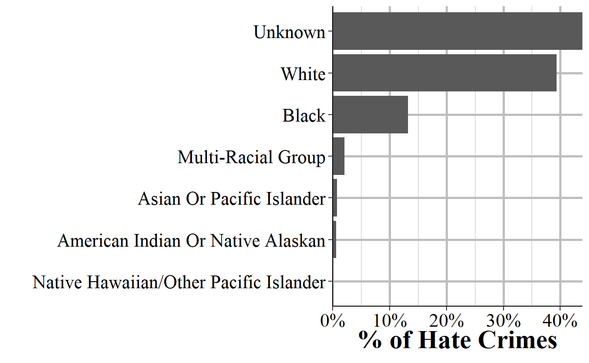
<p class="caption">(\#fig:hateCrimeOffenderRace)The race of offenders, as a group, for hate crime incidents, 1991-2022.</p>
</div>

When the police do not have any information about the number of offenders (which is common in cases of property crimes such as vandalism but rare in violent crimes), this data considers that to have zero offenders. The zero is just a placeholder that means that the police don't know how many offenders there are, not that they think there were actually no offenders. Figure \@ref(fig:hateCrimeOffenderNumber) shows the percent of hate crimes from 1991-2022 that have each number of offenders recorded. In the actual data it says the actual number of offenders, with the largest group in the current data going to 99 offenders - in this graph I group 10 or more offenders together for simplicity. I also relabel zero offenders as "Unknown" offenders since that's more accurate. The most common number of offenders per hate crime is one offender, at about 49% of hate crimes from 1991-2022 having only one offender. This drops sharply to 9% of hate crimes having two offenders and continues to drop as the number of offenders increase. However, about a third (36%) of hate crimes have an unknown number of offenders. 

<div class="figure" style="text-align: center">
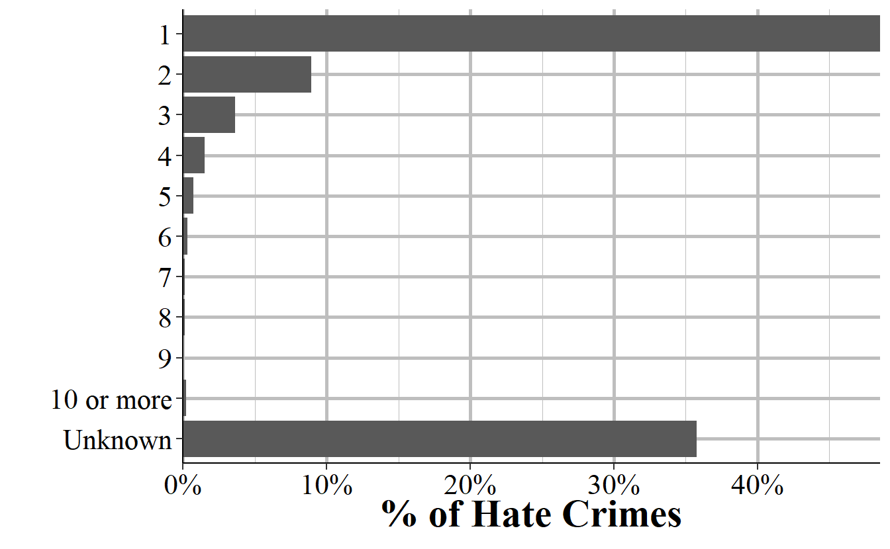
<p class="caption">(\#fig:hateCrimeOffenderNumber)The race of offenders, as a group, for hate crime incidents, 1991-2022.</p>
</div>

### Number of victims 

When considering the data itself, hate crime data is very similar to most other datasets. It's just the number of crimes that were reported to the police, though with the additional step of having evidence of bias. But the difference in use is that while in other crimes the victim is usually, well, the victim, in hate crimes the victim may be a much wider group. Consider a burglary: the homeowner is the direct victim, as their property was targeted. However, the crime can also affect their neighbors, who may now feel unsafe in their own homes, as well as the victim’s family, who may worry about their safety.

Hate crimes, however, tend to affect not just the direct victim but also the entire targeted group, or at least a broader community. A swastika painted on a synagogue, for example, impacts not only the synagogue's congregation but may instill fear in the broader Jewish community. If a swastika, for example, is spray painted on the front door of a synagogue, who is the victim? Directly it'd be whomever owns the synagogue building. But it also affects all members of that congregation. And what about members of other synagogues in the city? What about Jewish people in the city who don't go to synagogue? Even though only a single crime occurred - a vandalism - it is very difficult to count how many victims there were. Is a swastika on a synagogue worse if the synagogue has a small congregation versus a large one? What if it is in a city with only one synagogue compared to a city with many? Is it worse to have a large swastika than a small one? 

If we're trying to use this data to measure hate against a particular group these are questions we need to answer, but are of course impossible to answer with this data. Remember, all of the FBI data is essentially just abstract contextless numbers in a spreadsheet. This is true for all UCR data but especially so for hate crimes where no two hate crimes are equal. One burglary in City A is about equivalent to one burglary in City B. For hate crimes a single incident may affect far more people in City A than in City B. 

In fact, I'd argue that this issue is bad enough that we should be extraordinarily cautious when using this data. Just aggregating up the number of incidents is insufficient to measuring either hate or fear. Sure, you can measure the number of hate crimes reported to the police and where the police found adequate evidence to label the crime as bias motivated. But is that really what you want be measuring when using hate crime data? 

Nonetheless, this is a book about the data. So let's look at one final variable in this data, the number of victims for each incident. This is not going to be true number of people affected by the crime. It's more the number of direct victims for the incident. Whether that is actually better than just counting incidents is dependent on the context of your question and the hate crimes in question. In Figure \@ref(fig:jewishIncidentVictim) I show the annual number of anti-Jewish hate crimes reported by all agencies in the country. As may be expected, there are always more victims than incidents though the trends are extremely similar over the entire period of data. This trend is also present for other bias motivations, such as anti-Black hate crimes shown in Figure \@ref(fig:blackIncidentVictim). 

While this variable is available in the data, I actually think it's best not to use it. I think there is always a danger in being overly precise and, therefore, overly confident about what the data shows. When you use the number of incidents you implicitly allow for each incident to affect multiple people^[One of the points of hate crimes is to cause fear in more than just the direct victim of the crime.] and readers understand that. But if you use this variable and say that "this is the number of victims of this crime" you are implicitly closing that door and therefore being too confident about how many victims of a crime there is. This is especially true for readers who aren't paying close attention - such as academics reviewing papers or New York Times reporters - since they may think you are measuring the number of victims in a better way than you actually are. 

<div class="figure" style="text-align: center">
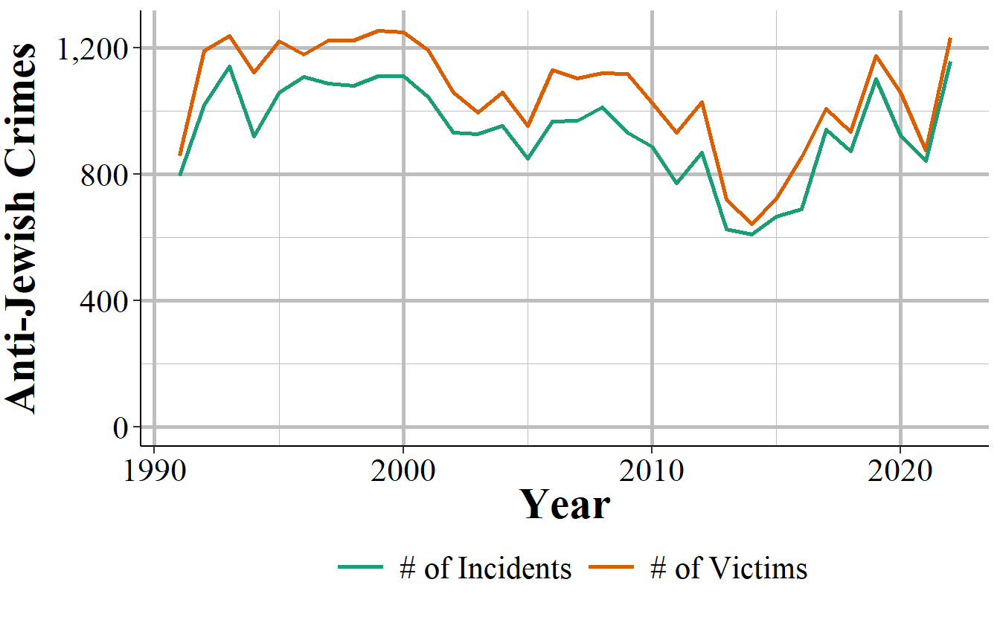
<p class="caption">(\#fig:jewishIncidentVictim)The annual number of anti-Jewish hate crime incidents and victims in the United States, 1991-2022.</p>
</div>

<div class="figure" style="text-align: center">
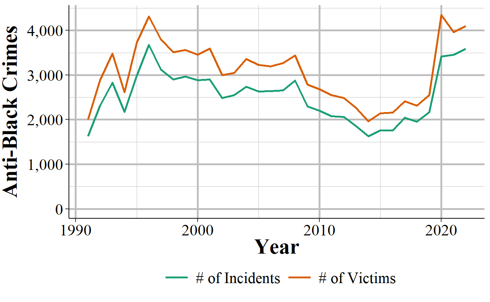
<p class="caption">(\#fig:blackIncidentVictim)The annual number of anti-Black hate crime incidents and victims in the United States, 1991-2022.</p>
</div>


<!--chapter:end:09_hate_crime.Rmd-->

# Administrative and Window Exceptional Clearance Segment 


The Administrative Segment provides information about the incident itself, such as how many victims or offenders there were. In practice this means that it tells us how many other segments - offense, offender, victim, and arrestee segments - there are for this particular incident. It also has several important variables at the incident-level such as what hour of the day the incident occurred and whether the incident date variable is actually just the date the incident was reported. Finally, it tells us whether the case was cleared exceptionally and, if so, what type of exceptional clearance it was. This can tell us, for example, how many crimes were cleared because the offender died or the victim refused to cooperate. As the UCR data doesn't differentiate between normal clearances (i.e. arrest the offender) and exceptional clearances, this provides a far deeper understanding of case outcomes. 

In addition to the variables detailed below, this segment has the traditional agency and incident identifiers: the ORI code, the agency state, the year of this data, and the incident number. 


<div class="figure" style="text-align: center">

<p class="caption">(\#fig:nibrsAdministrativeAgenciesReporting)The annual number of agencies reporting data in the NIBRS Administrative Segment, 1991-2022.</p>
</div>

## The incident and report date

An important variable, especially for policy analyses, is when the crime happened. NIBRS tells you both the date and the hour of the day for when the crime occurred. We'll start with the date. We can convert the date a few different ways, such as daily, weekly, monthly, quarterly. We could use this precise date to do regression discontinuity studies where we look at days just before and just after some policy change or natural experiment. In this chapter we'll look simply at the percent of crimes each month and each day of the month (overall, not within each month).

Figure \@ref(fig:administrativeIncidentMonth) shows the percent of crimes in the 2022 NIBRS data each month. Past research has found that crimes are lowest when it is cold and highest when it is hot (and summer also comes with many teens and young adults out of school so have more free time to offend or be victimized). We find these same results with crime lowest in February and steadily increasing until it peaks in July and August, and then decreasing as weather gets cooler in the fall and winter.

<div class="figure" style="text-align: center">
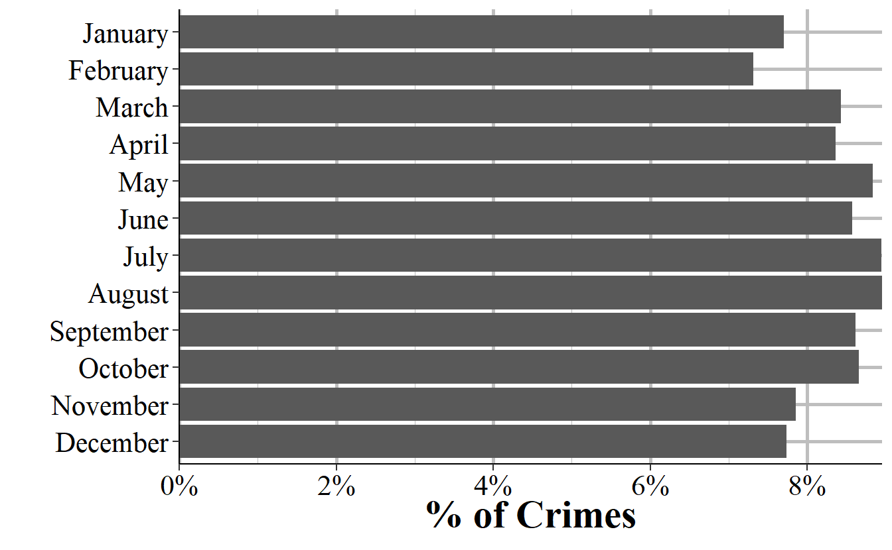
<p class="caption">(\#fig:administrativeIncidentMonth)The percent of crime incidents in 2022 NIBRS by the month of incident.</p>
</div>

We can also look at the days of the month to see if there is any variation here. Figure \@ref(fig:administrativeMonthDayIncident) shows the percent of crimes on each day of the month. There's not much variation other than a few days. The 29th and 30th day of the month have fewer crimes, and the 31st day has by far the fewest crimes. These findings are reasonable since not all months have that many days so by definition there are fewer 31st (and 29th, and 30th) days of the month for crimes to occur on. The most common day of the month is the 1st which accounts for 3.95% of all incidents. There's also a small spike on the 15th on the month with 3.39% of incidents occurring on the 15th. No other date is more than 3.35% of incidents. In this data the agencies must report a date, even if they don't know the exact date; there is no option to put "unknown date". So when these agencies don't know when a crime occurred, they put it as the 1st (or less commonly the 15th) of the month. I call this issue the "first-of-the-month error" and it is one I haven't seen discussed in papers that use daily data from NIBRS. For this reason I'd warn against including the 1st of the month in any analysis where the day of the month is relevant.  

<div class="figure" style="text-align: center">
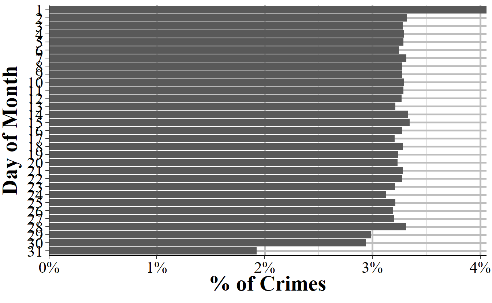
<p class="caption">(\#fig:administrativeMonthDayIncident)The percent of crimes that occur (the day of the incident, even if the crime wasn't reported that day) each day of the month for all agencies reporting to NIBRS in 2022.</p>
</div>

The above graph showed the days of the month where the incident was said to occur. There is also a variable that says if the date included was the incident date or the date the crime was reported to the police. Figure \@ref(fig:administrativeMonthDayReport) replicates Figure \@ref(fig:administrativeMonthDayIncident) but now shows only report dates rather than incident date. There's still a spike for the 1st and 15th but they are very small now and comparable to other days of the month. This provides even more evidence that the incident date spike on the 1st and 15th of the month is just an artifact of agencies putting unknown dates there, rather than a true increase in crime on those days.

<div class="figure" style="text-align: center">
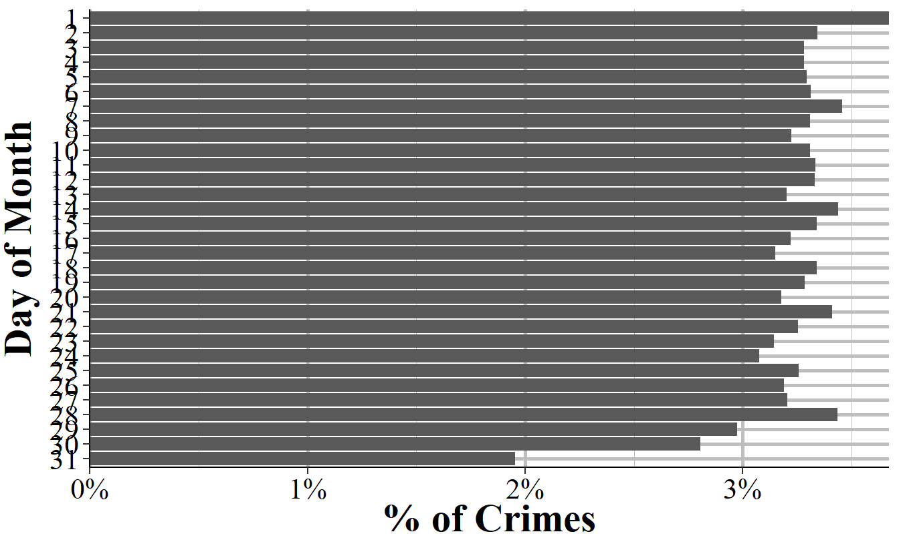
<p class="caption">(\#fig:administrativeMonthDayReport)The percent of crimes that are reported (the day of the report, even if not the day of the incident) each day of the month for all agencies reporting to NIBRS in 2022.</p>
</div>

## Hour of incident

An extremely important aspect of crime data is when exactly the crime occurs. If, for example, crime always spikes when the local high school ends their day that would likely indicate that high school students are involved with crime (both as victims or as offenders). When crime happens also would affect police behavior as they'd likely increase patrol during times of elevated crime. Luckily, NIBRS data does have the time of each incident, though it's only at the hour level.

Figure \@ref(fig:administrativeHours) shows the total number of crimes that occurred in the 2022 NIBRS data for each hour of the day. There are two key trends in this figure. First, past research has found that crime tends to increase during the night (this is especially true during weekends), drop to a daily low in the couple of hours before sunrise, and then slowly increase as the day progresses.^[In all of the nighttime police ride-alongs I've been on the police tend to stop patrolling in early morning (e.g. 3-4am) and go back to the station to do paperwork. I think this likely partially explains the findings that crime is lowest around 4-5am.] What we find here is a little different. Crime peaks at night at 5-5:59pm which is far earlier than other estimates. Since this is all crimes it could be biased by large increases of certain crimes at this time, such as people coming home from work and finding their house burgled. As crimes differ in their timing (e.g. burglary happens often during the day, fights are more common at night), you'll need to merge this segment with the Offense Segment to be able to look at certain types of crimes alone.

The second key trend is the large spike at midnight-12:59am and at noon-12:59pm. The midnight spike certainly seems far too large to be real. The midnight hour is more than double that of neighboring hours, and reverses the trend in the hours before it. Crime increases more at night (though not as much here as in other studies of this topic) but not by such a massive amount. The noon hour is about 50% larger than in the neighboring hours, so is a sizable increase though continues the trend of increasing crime during the day and is a far smaller increase than at midnight. It seems unlikely that this spike is real, though potentially some of it could be. For example, if a lot of people take their lunch at noon then there could be an increase of crime (such as pickpocketing and purse snatching) when these people gather at restaurants and malls to eat. So what are these spikes? There is no option to say that the hour is unknown so the police must put something in, and it seems that they put midnight and noon as the default "unknown hour" hour. Given this, I recommend that you remove the midnight and noon hour from any analysis you do where the time of day is relevant.

<div class="figure" style="text-align: center">
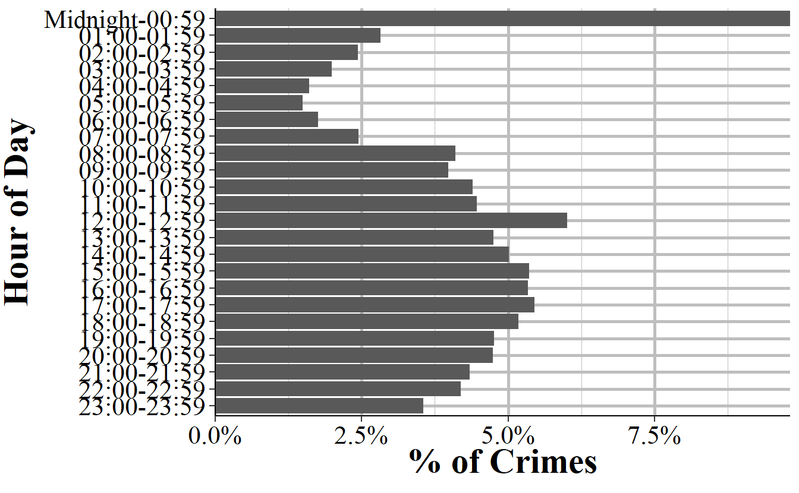
<p class="caption">(\#fig:administrativeHours)The percent of crimes that are reported each hour for all agencies reporting to NIBRS in 2022.</p>
</div>

<div class="figure" style="text-align: center">
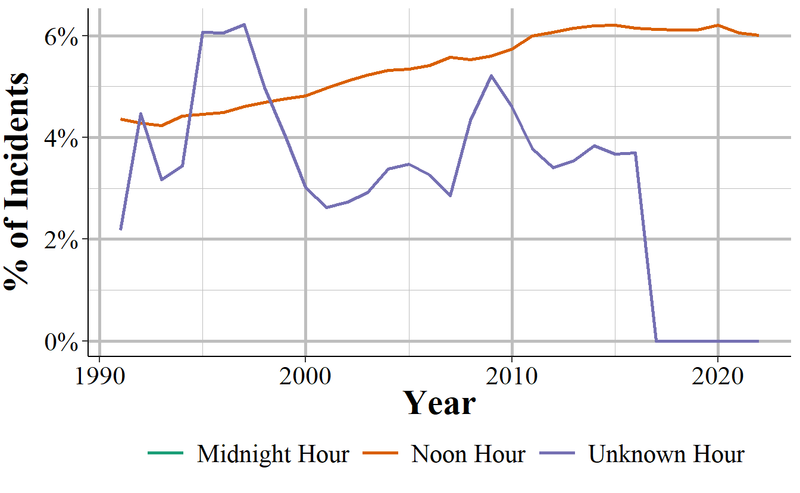
<p class="caption">(\#fig:nibrsAdministrativeHours)Annual percent of incidents that occurred at midnight, noon, and at an unknown time, 1991-2022.</p>
</div>


<table class="table table-striped" style="width: auto !important; margin-left: auto; margin-right: auto;">
<caption>(\#tab:nibrsAdministrativeCommonHours)The most and least common incident hours, and the most common hours excluding midnight and noon.</caption>
 <thead>
  <tr>
   <th style="text-align:left;"> Year </th>
   <th style="text-align:right;"> Most Common </th>
   <th style="text-align:right;"> Least Common </th>
   <th style="text-align:left;"> Most Common, Exclude Midnight </th>
   <th style="text-align:right;"> Most Common, Exclude Midnight/Noon </th>
  </tr>
 </thead>
<tbody>
  <tr>
   <td style="text-align:left;"> 1991 </td>
   <td style="text-align:right;"> 6PM </td>
   <td style="text-align:right;"> 5AM </td>
   <td style="text-align:left;"> 6PM </td>
   <td style="text-align:right;"> 6PM </td>
  </tr>
  <tr>
   <td style="text-align:left;"> 1992 </td>
   <td style="text-align:right;"> Midnight </td>
   <td style="text-align:right;"> 5AM </td>
   <td style="text-align:left;"> 6PM </td>
   <td style="text-align:right;"> 6PM </td>
  </tr>
  <tr>
   <td style="text-align:left;"> 1993 </td>
   <td style="text-align:right;"> Midnight </td>
   <td style="text-align:right;"> 5AM </td>
   <td style="text-align:left;"> 6PM </td>
   <td style="text-align:right;"> 6PM </td>
  </tr>
  <tr>
   <td style="text-align:left;"> 1994 </td>
   <td style="text-align:right;"> Midnight </td>
   <td style="text-align:right;"> 5AM </td>
   <td style="text-align:left;"> 6PM </td>
   <td style="text-align:right;"> 6PM </td>
  </tr>
  <tr>
   <td style="text-align:left;"> 1995 </td>
   <td style="text-align:right;"> Midnight </td>
   <td style="text-align:right;"> 5AM </td>
   <td style="text-align:left;"> 6PM </td>
   <td style="text-align:right;"> 6PM </td>
  </tr>
  <tr>
   <td style="text-align:left;"> 1996 </td>
   <td style="text-align:right;"> Midnight </td>
   <td style="text-align:right;"> 5AM </td>
   <td style="text-align:left;"> 6PM </td>
   <td style="text-align:right;"> 6PM </td>
  </tr>
  <tr>
   <td style="text-align:left;"> 1997 </td>
   <td style="text-align:right;"> Midnight </td>
   <td style="text-align:right;"> 5AM </td>
   <td style="text-align:left;"> 6PM </td>
   <td style="text-align:right;"> 6PM </td>
  </tr>
  <tr>
   <td style="text-align:left;"> 1998 </td>
   <td style="text-align:right;"> Midnight </td>
   <td style="text-align:right;"> 5AM </td>
   <td style="text-align:left;"> 6PM </td>
   <td style="text-align:right;"> 6PM </td>
  </tr>
  <tr>
   <td style="text-align:left;"> 1999 </td>
   <td style="text-align:right;"> Midnight </td>
   <td style="text-align:right;"> 5AM </td>
   <td style="text-align:left;"> 5PM </td>
   <td style="text-align:right;"> 5PM </td>
  </tr>
  <tr>
   <td style="text-align:left;"> 2000 </td>
   <td style="text-align:right;"> Midnight </td>
   <td style="text-align:right;"> 5AM </td>
   <td style="text-align:left;"> 5PM </td>
   <td style="text-align:right;"> 5PM </td>
  </tr>
  <tr>
   <td style="text-align:left;"> 2001 </td>
   <td style="text-align:right;"> Midnight </td>
   <td style="text-align:right;"> 5AM </td>
   <td style="text-align:left;"> 5PM </td>
   <td style="text-align:right;"> 5PM </td>
  </tr>
  <tr>
   <td style="text-align:left;"> 2002 </td>
   <td style="text-align:right;"> Midnight </td>
   <td style="text-align:right;"> 5AM </td>
   <td style="text-align:left;"> 5PM </td>
   <td style="text-align:right;"> 5PM </td>
  </tr>
  <tr>
   <td style="text-align:left;"> 2003 </td>
   <td style="text-align:right;"> Midnight </td>
   <td style="text-align:right;"> 5AM </td>
   <td style="text-align:left;"> 5PM </td>
   <td style="text-align:right;"> 5PM </td>
  </tr>
  <tr>
   <td style="text-align:left;"> 2004 </td>
   <td style="text-align:right;"> Midnight </td>
   <td style="text-align:right;"> 5AM </td>
   <td style="text-align:left;"> 5PM </td>
   <td style="text-align:right;"> 5PM </td>
  </tr>
  <tr>
   <td style="text-align:left;"> 2005 </td>
   <td style="text-align:right;"> Midnight </td>
   <td style="text-align:right;"> 5AM </td>
   <td style="text-align:left;"> 5PM </td>
   <td style="text-align:right;"> 5PM </td>
  </tr>
  <tr>
   <td style="text-align:left;"> 2006 </td>
   <td style="text-align:right;"> Midnight </td>
   <td style="text-align:right;"> 5AM </td>
   <td style="text-align:left;"> 5PM </td>
   <td style="text-align:right;"> 5PM </td>
  </tr>
  <tr>
   <td style="text-align:left;"> 2007 </td>
   <td style="text-align:right;"> Midnight </td>
   <td style="text-align:right;"> 5AM </td>
   <td style="text-align:left;"> 5PM </td>
   <td style="text-align:right;"> 5PM </td>
  </tr>
  <tr>
   <td style="text-align:left;"> 2008 </td>
   <td style="text-align:right;"> Midnight </td>
   <td style="text-align:right;"> 5AM </td>
   <td style="text-align:left;"> 5PM </td>
   <td style="text-align:right;"> 5PM </td>
  </tr>
  <tr>
   <td style="text-align:left;"> 2009 </td>
   <td style="text-align:right;"> Midnight </td>
   <td style="text-align:right;"> 5AM </td>
   <td style="text-align:left;"> Noon </td>
   <td style="text-align:right;"> 5PM </td>
  </tr>
  <tr>
   <td style="text-align:left;"> 2010 </td>
   <td style="text-align:right;"> Midnight </td>
   <td style="text-align:right;"> 5AM </td>
   <td style="text-align:left;"> Noon </td>
   <td style="text-align:right;"> 5PM </td>
  </tr>
  <tr>
   <td style="text-align:left;"> 2011 </td>
   <td style="text-align:right;"> Midnight </td>
   <td style="text-align:right;"> 5AM </td>
   <td style="text-align:left;"> Noon </td>
   <td style="text-align:right;"> 5PM </td>
  </tr>
  <tr>
   <td style="text-align:left;"> 2012 </td>
   <td style="text-align:right;"> Midnight </td>
   <td style="text-align:right;"> 5AM </td>
   <td style="text-align:left;"> Noon </td>
   <td style="text-align:right;"> 5PM </td>
  </tr>
  <tr>
   <td style="text-align:left;"> 2013 </td>
   <td style="text-align:right;"> Midnight </td>
   <td style="text-align:right;"> 5AM </td>
   <td style="text-align:left;"> Noon </td>
   <td style="text-align:right;"> 5PM </td>
  </tr>
  <tr>
   <td style="text-align:left;"> 2014 </td>
   <td style="text-align:right;"> Midnight </td>
   <td style="text-align:right;"> 5AM </td>
   <td style="text-align:left;"> Noon </td>
   <td style="text-align:right;"> 5PM </td>
  </tr>
  <tr>
   <td style="text-align:left;"> 2015 </td>
   <td style="text-align:right;"> Midnight </td>
   <td style="text-align:right;"> 5AM </td>
   <td style="text-align:left;"> Noon </td>
   <td style="text-align:right;"> 5PM </td>
  </tr>
  <tr>
   <td style="text-align:left;"> 2016 </td>
   <td style="text-align:right;"> Midnight </td>
   <td style="text-align:right;"> 5AM </td>
   <td style="text-align:left;"> Noon </td>
   <td style="text-align:right;"> 5PM </td>
  </tr>
  <tr>
   <td style="text-align:left;"> 2017 </td>
   <td style="text-align:right;"> Midnight </td>
   <td style="text-align:right;"> 5AM </td>
   <td style="text-align:left;"> Noon </td>
   <td style="text-align:right;"> 5PM </td>
  </tr>
  <tr>
   <td style="text-align:left;"> 2018 </td>
   <td style="text-align:right;"> Midnight </td>
   <td style="text-align:right;"> 5AM </td>
   <td style="text-align:left;"> Noon </td>
   <td style="text-align:right;"> 5PM </td>
  </tr>
  <tr>
   <td style="text-align:left;"> 2019 </td>
   <td style="text-align:right;"> Midnight </td>
   <td style="text-align:right;"> 5AM </td>
   <td style="text-align:left;"> Noon </td>
   <td style="text-align:right;"> 5PM </td>
  </tr>
  <tr>
   <td style="text-align:left;"> 2020 </td>
   <td style="text-align:right;"> Midnight </td>
   <td style="text-align:right;"> 5AM </td>
   <td style="text-align:left;"> Noon </td>
   <td style="text-align:right;"> 5PM </td>
  </tr>
  <tr>
   <td style="text-align:left;"> 2021 </td>
   <td style="text-align:right;"> Midnight </td>
   <td style="text-align:right;"> 5AM </td>
   <td style="text-align:left;"> Noon </td>
   <td style="text-align:right;"> 5PM </td>
  </tr>
  <tr>
   <td style="text-align:left;"> 2022 </td>
   <td style="text-align:right;"> Midnight </td>
   <td style="text-align:right;"> 5AM </td>
   <td style="text-align:left;"> Noon </td>
   <td style="text-align:right;"> 5PM </td>
  </tr>
</tbody>
</table>


## Exceptional clearance

When we speak of clearances we generally mean that a person was arrested for the crime.^[While a more expansive definition may include a conviction in a court for that crime (including pleading guilty), NIBRS data only extends to the arrest stage so we never know the judicial outcome of the case.] Cases may also be cleared "through exceptional means" which is also called an "exceptional clearance." An exceptional clearance means that the police have identified who the offender is (in cases with multiple offenders, they need to identify only one offender), have sufficient evidence and ability (e.g. know where they are) to arrest this offender but are unable to do so for some reason. Basically, if they could arrest them they would but for some reason they can't. NIBRS data tells us if the case is exceptionally cleared as well as the reason for the exceptional clearance. 

Exceptional clearances are relatively rare, making up about 5% of cases. Figure \@ref(fig:administrativeExceptionalClearances) shows the breakdown of reasons why the case was cleared for these ~5% of cases that are exceptionally cleared. The most common reason, at 47.3% of exceptional clearances, is that the victim refused to cooperate with the police or prosecution. This can include cases where the victim reported their crime to the police and then later decide to stop assisting. The next most common reason, at 45.3% of exceptionally cleared cases, is that the prosecution decides to not prosecute the case. This excludes cases where the prosecution believes that there is not probable cause to make the arrest. Therefore it largely includes cases that the prosecution either doesn't believe they could win or where the agency has a policy of non-prosecution - this is likely increasingly common in jurisdiction which has "progressive prosecutors" who de facto legalize certain crimes.  

The next most common group is when the offender is a juvenile and the police chose to avoid arresting them due to their age. This occurs in minor offenses such as property crimes and the police do give notice to the juvenile offender's parents or guardians about the situation. If the offender is in another agency's jurisdiction (including out of the country) and the agency reporting data is unable to make an arrest, including when the agency who has the offender in their jurisdiction refuses to extradite the offender, the case can be exceptionally cleared. This occurs in 1.6% of exceptional clearances. In these cases we don't know any information about which jurisdiction the offender is in at the time of the exceptional clearance. Finally, if the offender dies (by any means) before the arrest they can't be arrested so the case is exceptionally cleared. This makes up about 0.9% of exceptional clearances. 

<div class="figure" style="text-align: center">
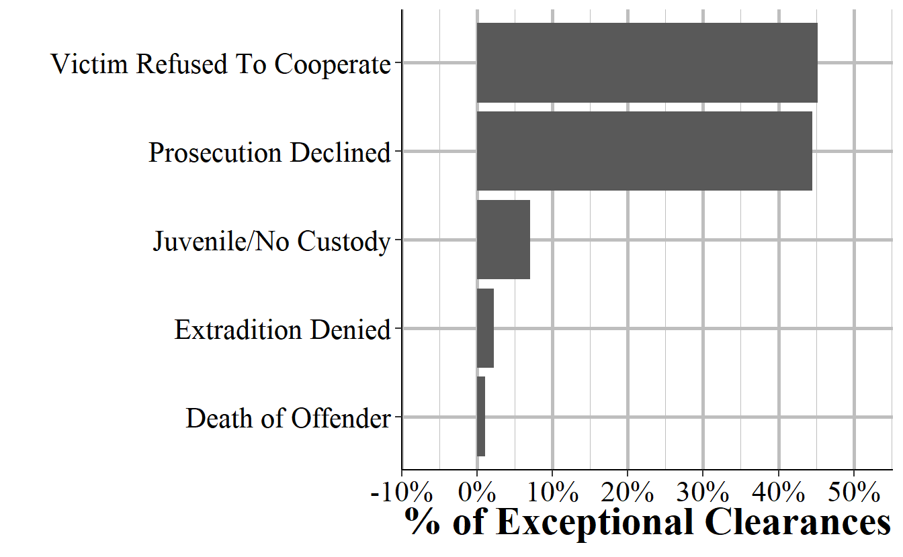
<p class="caption">(\#fig:administrativeExceptionalClearances)The distribution of exceptional clearances for all exceptional clearances reported to NIBRS in 2022.</p>
</div>

<div class="figure" style="text-align: center">
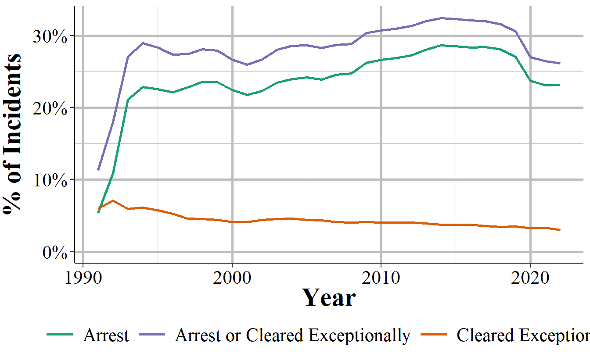
<p class="caption">(\#fig:nibrsAdministrativeClearance)Percent of incidents with an arrest or exceptional clearance, 1991-2022.</p>
</div>

## Number of other segments

The "Administrative" part of this segment is that it tells us about other segments related to this incident. Here we know how many Offense, Offender, Victim, and Arrestee segments there are for the incident. In effect it says how many crimes were committed, offenders involved (at least the number known to police), victims involved, and people arrested for this particular incident. This can be useful both as a check to make sure you're not missing anything when looking at the other segments and to quickly subset data, such as to only single-victim or only multiple-offender incidents. 

### Offense Segments

This variable indicates how many offense segments there are associated with this incident, with the possible values ranging from one to nine. Each incident can have multiple offenses, so this just says how many of these crimes there were. For example, if a person is raped and robbed then there'd be two offense segments related to that incident. Figure \@ref(fig:administrativeOffenseSegments) shows the number of offense segments - and thus the number of crimes - associated with each incident. The vast majority of incidents only have one offense reported, making up 88.4% of incidents.^[In reality a person who commits a crime may be arrested or charged with many (often highly related) offenses related to a single criminal incident. So this data does report fewer incidents than you'd likely find in other data sources, such as if you request data from a local police agency or district attorney's office.] This drops considerably to 10.3% of incidents having two offenses, 1.1% having three, and then under 0.15% of incidents having four through nine offenses.

<div class="figure" style="text-align: center">
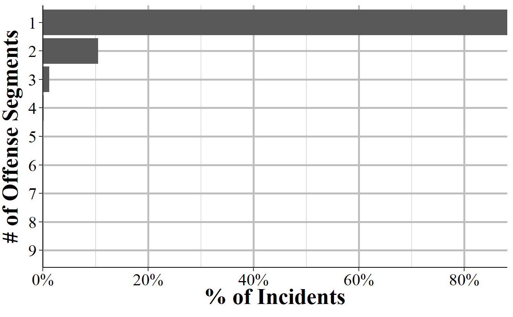
<p class="caption">(\#fig:administrativeOffenseSegments)The distribution for the number of Offender Segments per incident, for all incidents in NIBRS 2022.</p>
</div>


<div class="figure" style="text-align: center">
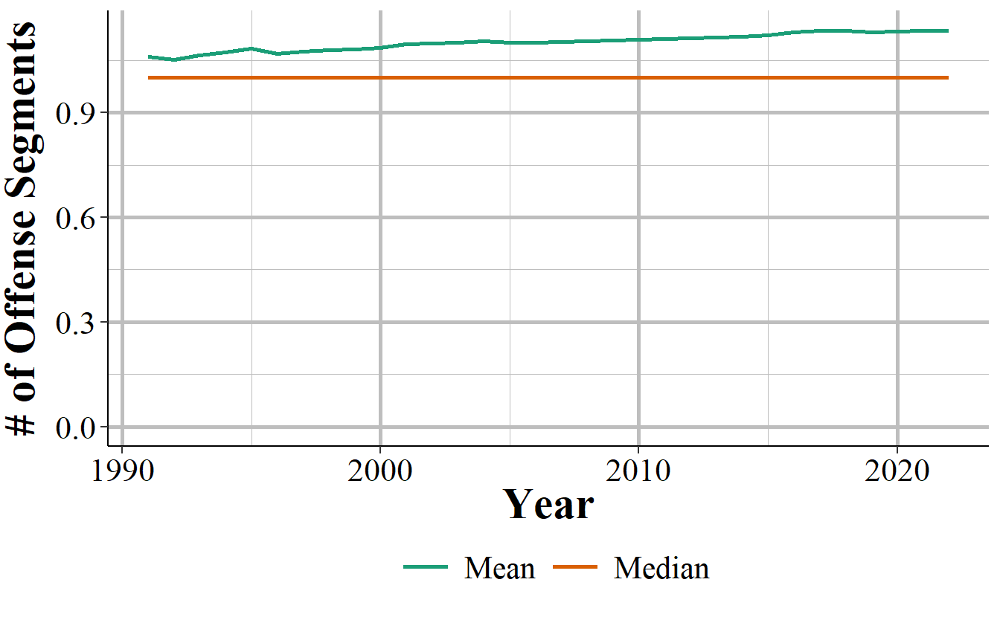
<p class="caption">(\#fig:nibrsAdministrativeNumberOffense)Annual mean and median number of Offense Segments, 1991-2022.</p>
</div>

### Offender Segments

The Administrative Segment tells you how many offenders are involved with an incident. This is, of course, an estimate because in some incidents the police don't know how many people are involved. If, for example, someone was robbed then they can tell the police how many robbers there were. But if someone comes home to find their home burglarized then they don't know how many burglars there were. If there's no video evidence (e.g. a home security camera) and neighbors didn't see anything then the police would not know how many offenders were involved in the incident. In these cases they put in a single offender and in the Offender Segment all of the information about the offender is "unknown." The remaining number of offenders are still estimates as the police may not know for sure how many offenders were involved, but this is more reliable than when there is only a single offender reported. With that major caveat in mind, Figure \@ref(fig:administrativeOffenderSegments) shows the distribution in how many offenders there were per incident. 

The vast majority of incidents have only one (or potentially an unknown number) offenders, at 89.8% percent of incidents. Incidents with two offenders make up only 7.9% of incidents while those with three make up 1.6% of incidents. No other number of offenders make up more than 0.5% of incidents. The data does have the exact number of offenders but I've top coded it to 10 in the graph for simplicity. There can potentially be a large number of offenders involved in an incident and in the 2022 NIBRS data the incident with the higher number of offenders had 81. However, it is exceedingly rare for there to be even more than a handful of offenders. 

<div class="figure" style="text-align: center">
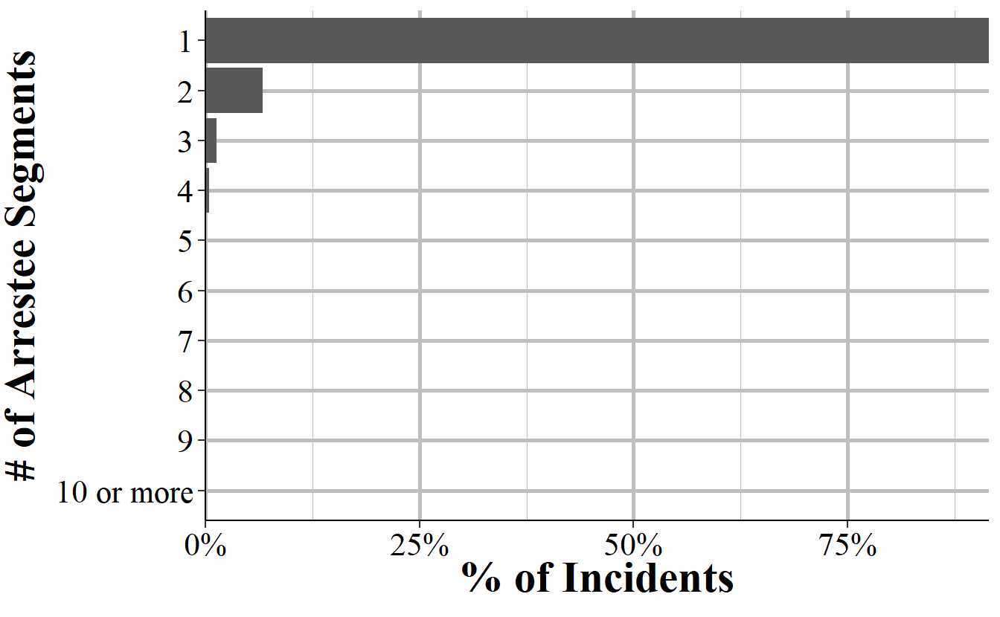
<p class="caption">(\#fig:administrativeOffenderSegments)The distribution for the number of Offender Segments per incident, for all incidents in NIBRS 2022.</p>
</div>


<div class="figure" style="text-align: center">
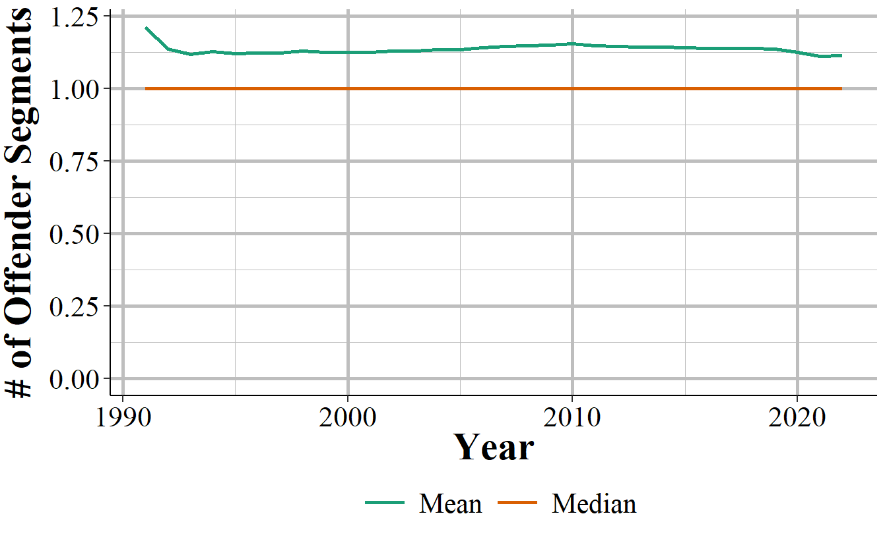
<p class="caption">(\#fig:nibrsAdministrativeNumberOffender)Annual mean and median number of Offender Segments, 1991-2022.</p>
</div>

### Victim Segments


In cases where the offense is a "victimless crime" (or at least one where there's no specific victim) such as a drug offense, the victim and the offender can be the same individual. For other cases, being a victim in an incident just means that you were the victim of at least one offense committed in the incident. Figure \@ref(fig:administrativeVictimSegments) shows the distribution in the number of victims per incident. Like the number of offenses and offenders, this is massively skewed to the left with 90.3% of incidents having a single victim. Incidents with two victims make up 7.9% of the data while incidents with three victims are 1.2%. All remaining numbers of victims are less than one third of one percent of the data each. The data does have the exact number of victims but I've top coded it to 10 in the graph for simplicity. The incident with the most victims in 2022 had 207 victims.  

<div class="figure" style="text-align: center">
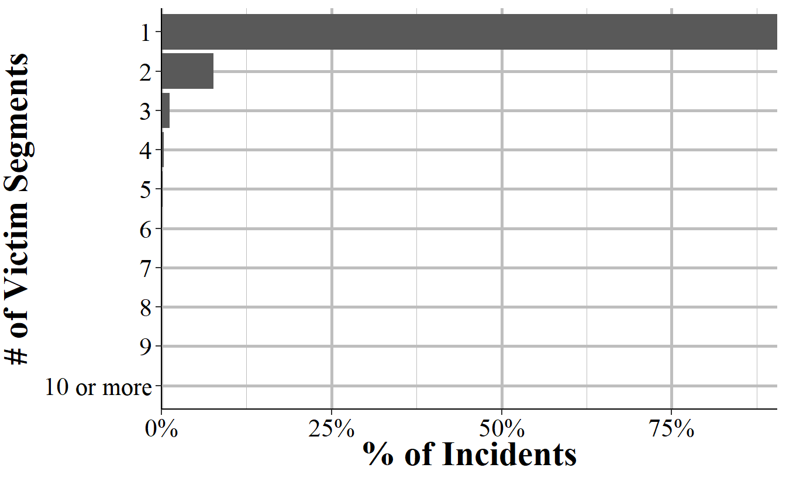
<p class="caption">(\#fig:administrativeVictimSegments)The distribution for the number of Victim Segments per incident, for all incidents in NIBRS 2022.</p>
</div>

<div class="figure" style="text-align: center">
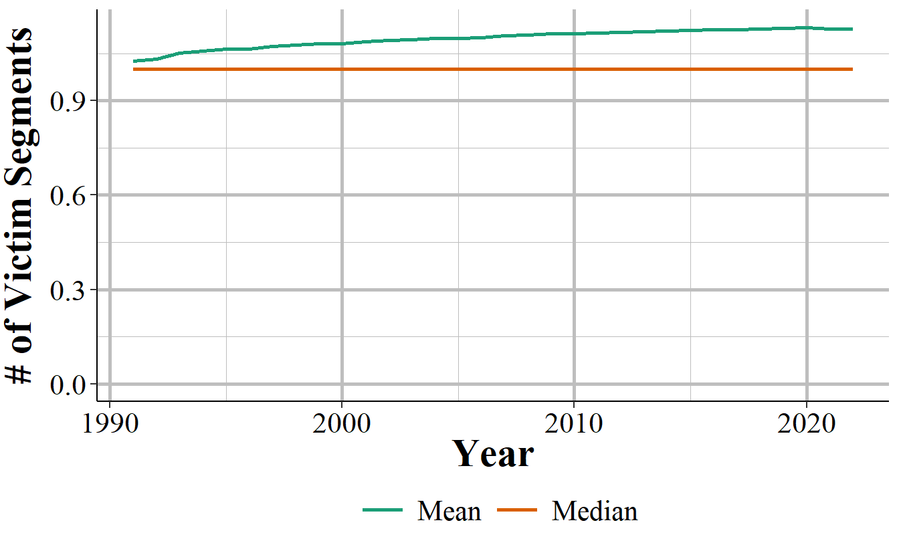
<p class="caption">(\#fig:nibrsAdministrativeNumberVictim)Annual mean and median number of Victim Segments, 1991-2022.</p>
</div>

### Arrestee Segments

Unlike the previous segments, there may not always be an arrestee segment since not all crimes lead to an arrest. Figure \@ref(fig:administrativeArresteeSegments) shows the distribution in the number of arrestee segments per incident in the 2022 NIBRS data. Indeed, the vast majority - 72.9% of incidents - didn't lead to a single arrest. In 24% of incidents a single person was arrested while in 2.5% of incidents two people were arrested. The remaining numbers of people arrested are increasingly small with a little over a third of one percent of incidents having three people arrested and no greater than 0.1% for larger numbers of people arrested. The incident with the most arrests in 2022 led to 81 people arrested. 

<div class="figure" style="text-align: center">
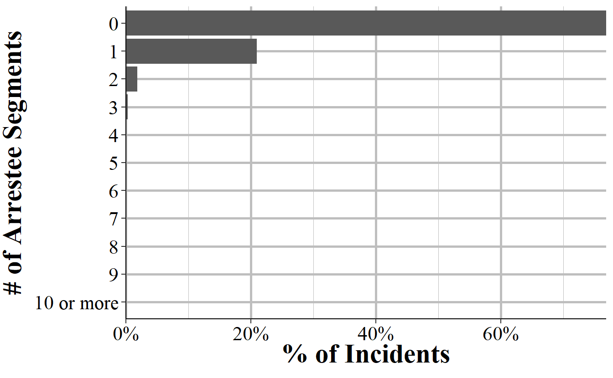
<p class="caption">(\#fig:administrativeArresteeSegments)The distribution for the number of Arrestee Segments per incident, for all incidents in NIBRS 2022.</p>
</div>


Of course, to really understand these arrests we'd need to know how many people committed the crime. Having one arrest for an incident with one offender is good, having one arrest when there are multiple offenders means relatively low clearance rates. While we don't know the true number of offenders (as police may not know how many there actually were), we can use the Offender Segment count as a good estimate. Figure \@ref(fig:administrativePercentArrested) shows the percent of people arrested for each number of offenders in the incident. Keep in mind that when there's one offender reported this can potentially mean the police don't know how many offenders there are, so it's a bit unreliable. There is wide variability in the percent of offenders arrested by the number of offenders in an incident. In cases with one offender, there was an arrest made only 25% of the time. When there are two offenders, about 36% of offenders are arrested, on average, and this steadily declines as the number of offenders increase back down to 25.7% with six offenders. This moves a percentage point or two as the number of offenders increases but not by very much. 

<div class="figure" style="text-align: center">
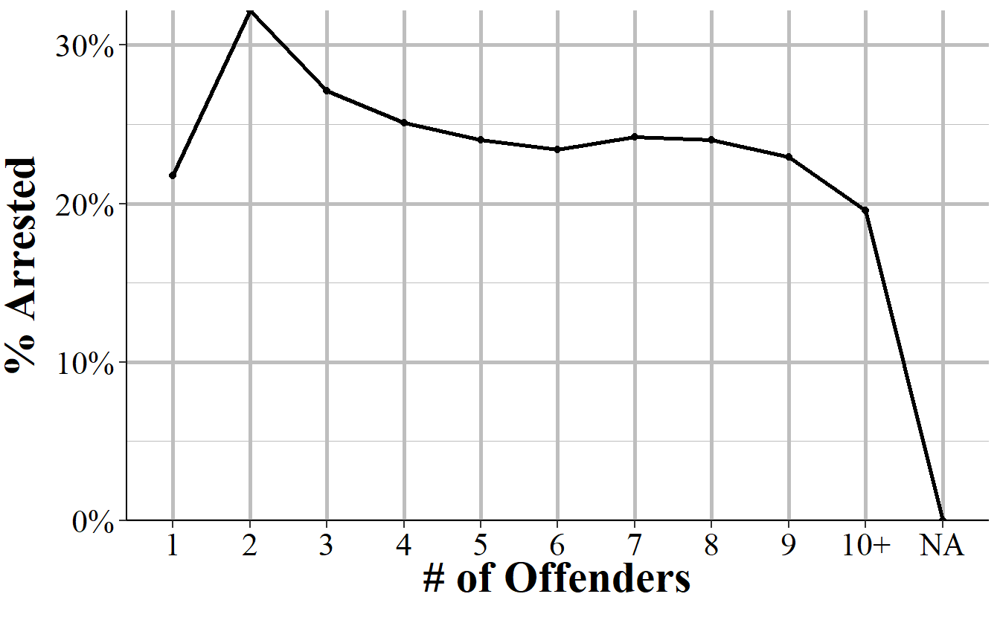
<p class="caption">(\#fig:administrativePercentArrested)The percent of people arrested by the number of offenders in an incident.</p>
</div>

Another way to look at this is to examine the percent of incidents, by number of offenders, where at least one offender was arrested. Here we're asking a very different question than in the above figure. Instead of asking, of all offenders who committed a crime what number are arrested, we want to know of all incidents how many led to at least one arrest. This is actually how the UCR defines clearance rates, at least one person arrested (no matter how many offenders there are) clears the entire incident. 

Figure \@ref(fig:administrativeArrestsAny) shows this analysis by giving the percent of incidents by the number of offenders where at least one offender was arrested. As before, 25% of incidents with one offender had a person arrested. Now we see a steady decline in the percent of incidents arrested as the number of offenders increase. This figure shows that relatively few incidents ever lead to an arrest of at least one offender, and the chance that an arrest is made decreases as the number of offenders increases. These findings suggest that the larger numbers found in Figure \@ref(fig:administrativePercentArrested) are because when at least one offender is arrested in an incident it's also likely that multiple offenders are arrested. 

<div class="figure" style="text-align: center">
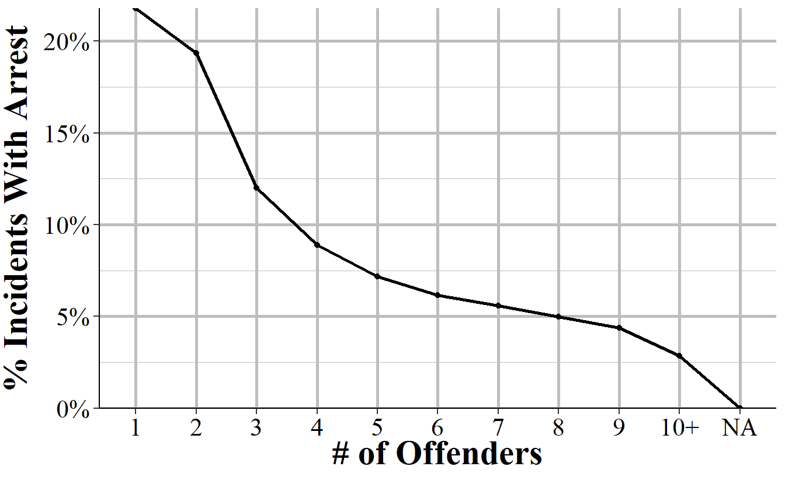
<p class="caption">(\#fig:administrativeArrestsAny)The percent of incidents by number of offenders where at least one offender is arrested.</p>
</div>


<div class="figure" style="text-align: center">
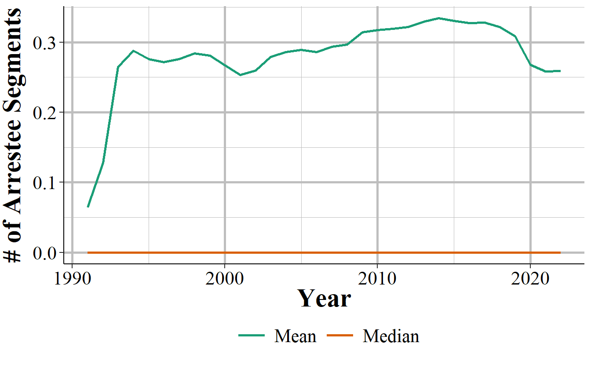
<p class="caption">(\#fig:nibrsAdministrativeNumberArrestee)Annual mean and median number of Arrestee Segments, 1991-2022.</p>
</div>

<!--chapter:end:12_nibrs_administrative.Rmd-->

# Offender Segment


As might be expected, the Offender Segment provides information about who the offender is for each incident, though this is limited to only four demographic variables: age, sex, race, and ethnicity. In incidents with multiple offenders it provides information about each offender. While important factors such as criminal history, socioeconomic status, and motive are missing in the Offender Segment, other segments provide some supplementary details. For example, the Victim Segment reveals the relationship between the offender and victim, and the Offense Segment tells us whether a weapon was used by the offender. These pieces of information allow for a more complete picture, although they remain fragmented across segments.

In cases where there is no information about the offender there will be a single row where all of the offender variables will be "unknown." In these cases having a single row for the offender is merely a placeholder and doesn’t necessarily mean that there was only one offender for that incident. However, there’s no indicator for when this is a placeholder and when there was actually one offender but whose demographic info is unknown.

The Offender Segment is the sparsest of the available segments, and provides only four new variables that are about the offender's demographics. It also includes the standard set of variables: the agency ORI, the incident number, the state the agency is in, and the incident date (though we'd need to check the Administrative Segment to see if this is actually the incident date or the report date). 

As seen with other segment files, the number of agencies reporting has increased steadily since 1991 and then increased much faster starting in 2016 when the FBI started their push for the transition to NIBRS.

<div class="figure" style="text-align: center">
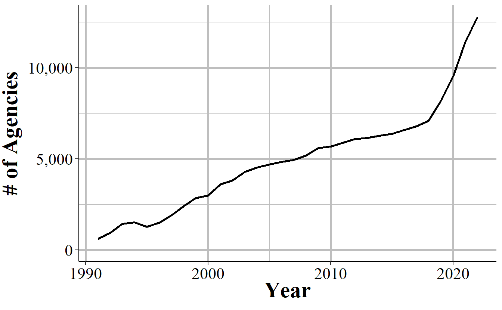
<p class="caption">(\#fig:nibrsOffenderAgenciesReporting)The annual number of agencies reporting data in the NIBRS Offender Segment, 1991-2022.</p>
</div>

## Demographics

There are four demographics variables included in this data: the offenders' age, sex, race, ethnicity. Please note that what we have here are not unique offenders as the same person can be involved in multiple incidents and therefore be counted multiple times. There's no offender ID variable that is consistent across incidents so we can't tell when an offender is involved with different incidents. So be cautious when trying to compare this with some base rate such as percent of people of each age, sex, race, or ethnicity in a population.  

### Age 

The age variable is the suspected age of the offender. This is presented to us as how many years old the offender is, however, agencies can input an age range if they don't know the exact age (e.g. age 20-29) and the FBI will convert that to an exact number by averaging it for us. So if the police say the offender is aged 20-29 (since they don't know for sure), we only see that the offender is 24 years old since the FBI averages the range and then rounds down to make an integer. This value is top-coded to 99 years old with everyone 99 years or older being set as "over 98 years old." Figure \@ref(fig:offenderAge) shows the distribution of offender ages for all known offenders in the 2022 NIBRS data. About 14% of offenders have an unknown age and are excluded from the figure. 

This data supports the widely observed age-crime curve, which shows that criminal activity tends to peak in the late teenage years and gradually declines as individuals age. Interestingly, in the NIBRS data, the most common offender age is 25, indicating a slightly later peak. This shift could reflect changes in the types of offenses reported or evolving offender patterns over time. The age distribution can differ depending on what offenses the offender's committed. To examine that you'll need to merge this segment with the Offense Segment and then subset the offender data by the offense you're interested in.


<div class="figure" style="text-align: center">
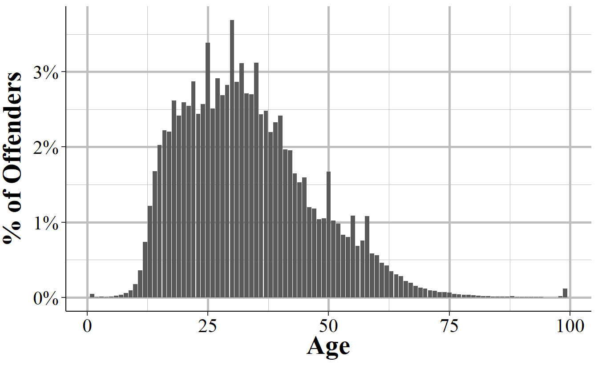
<p class="caption">(\#fig:offenderAge)The age of all offenders reported in the 2022 NIBRS data. Approximately 44 percent of offenders have an unknown age are not shown in the figure.</p>
</div>

The spike you see at the very end of the data is due to the data maxing out possible individual ages at 98, so anyone older is grouped together. Surely very young children aren’t committing crimes, so is this a data error? Mostly yes. These entries likely reflect either data entry mistakes or situations where officers mistakenly input the offender’s age as "1" rather than selecting "unknown." However, in rare cases, this could also include tragic incidents, such as accidental harm caused by a child handling a firearm, which are still recorded as criminal incidents despite no intent. However, the bulk of this, especially for age one, is likely just a data error or the police entering age as one instead of saying that the age is unknown (which they have the option of doing) or simply entering the data incorrectly by mistake.

Another indicator of guesses about age is that three of the five most common ages are 25, 30, and 20 years old. People tend to like multiples of five when making estimates, so these indicate that someone (the victim or the officer) probably didn't know the exact age and so guessed the age or used an age range rather than the exact age. 

Since we have data since 1991 we can look at how age changed over time. In Figure \@ref(fig:nibrsOffenderAge) shows the annual mean and median age of offenders from 1991-2022. The first two years of data we see very old offenders^[At least in terms of expected age of offenders.] with mean age over 50 and median age over 34 each year. That then drops considerably in 1993 to about age 25 and then starts a very slow and consistent increase over time until the average offender is in the early thirties by the latest years of data. Figure \@ref(fig:nibrsOffenderAgeMissing) shows the percent of offenders that have an unknown age which also has some odd and large movements in 1991-1992 then settles to a steady and slow declining trend in 1993 before reversing itself and increasing in the late 2010s. 

So what do we make of these trends? The first thing to keep in mind is that we're doing something fairly dumb. Each year of data we have different agencies reporting meaning that differences over time may simply be due to different agencies providing data. Still, if we had to interpret it I would say that the values in 1991 and 1992 are due to data issues likely caused by growing pains from agencies just starting out using NIBRS. Luckily, since NIBRS data has information on every single offender - rather than being already aggregated like in SRS data - we can check this. Indeed, this appears to simply be a data issue where many agencies put the age of offenders as "over 98 years old" rather than identifying them as unknown. In 1991, for example, 36% of offenders who had a known age were reported to be older than 98 years. When we look at the average age in 1991 when excluding people 99+ years old we get 28 years old, perfectly within expectation when looking at averages after 1992. 

<div class="figure" style="text-align: center">
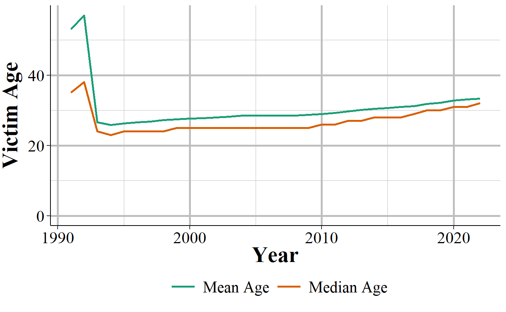
<p class="caption">(\#fig:nibrsOffenderAge)The mean and median age of offenders, 1991-2022.</p>
</div>

<div class="figure" style="text-align: center">
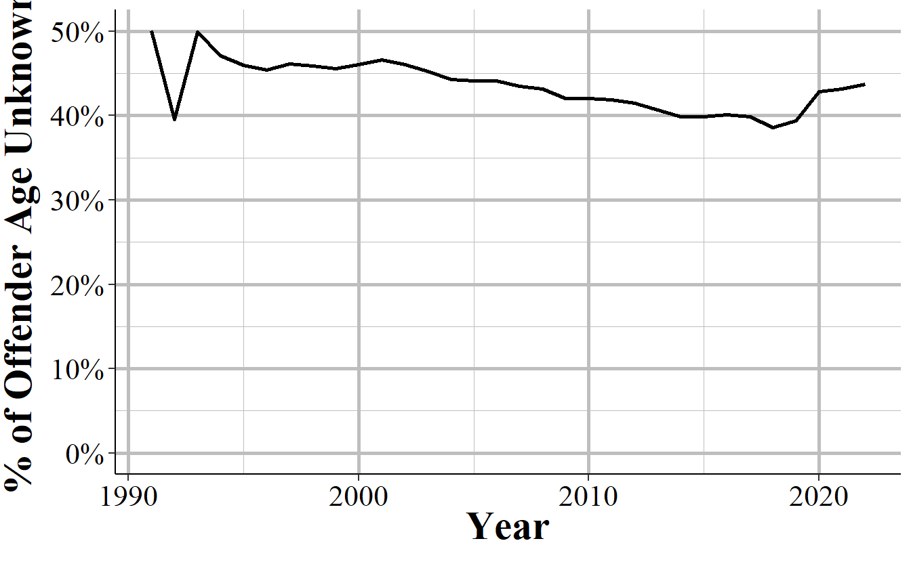
<p class="caption">(\#fig:nibrsOffenderAgeMissing)The percent of offender's age that is unknown, 1991-2022.</p>
</div>


### Sex

The second offender demographic variable available is the offender's sex with male and female being the only available sexes. There is no option for transgender or anything else. Other than arrestees, where police could (though we don't know if they do) use their identification (e.g. driver's license) to determine their sex, this is likely the perceived sex of the offender based on what evidence the officer can collect (e.g. witness statement, video recordings, driver's licenses of the offender if they are caught, etc.). Figure \@ref(fig:nibrsOffenderSex) shows the distribution of offenders by sex for each year of data. The most common sex is male, which is consistent with the literature on who commits crime. About 45% of all offenders were male. Female offenders make up fewer than 20% of offenders though the general trend is that the share of offenders is increasing. Over a third of offenders have an unknown sex with the share being unknown decreasing over time until increasing again in the last several years. Considering that when nothing is known about offenders (including even how many offenders there are) this data includes a single row with "unknown" for all demographic variables, this is actually an undercount of offenders who have unknown sex. Again we see odd results in 1991 and 1992, likely an issue with data entry at the birth of NIBRS.


<div class="figure" style="text-align: center">
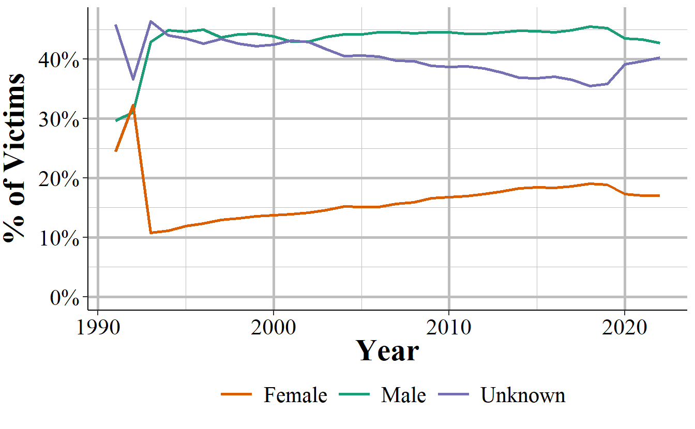
<p class="caption">(\#fig:nibrsOffenderSex)The share of offenders by sex, 1991-2022.</p>
</div>

### Race

The next variable is the race of the offender, categorized as White, Black, American Indian/Alaskan Native, Asian, and Native Hawaiian/Other Pacific Islander. It's important to note that this is often the officer’s perception of race, which can introduce bias or inaccuracies, particularly in cases where there was no arrest or detailed witness account.

Figure \@ref(fig:offenderRace) shows the breakdown in offender races for every offender in our data. The most common offender race in nearly every year is Unknown, with about 40% of offenders not having a known race. This is actually an undercount as in cases where the agency doesn't know anything about the offenders they'll put down a single offender with "unknown" for every demographics variable. So there could potentially be multiple offenders represented when there is a row with an unknown offender race. This is also dependent on the type of crimes committed and when they are committed. For example, a daytime robbery would likely have a known offender race as the victim can clearly see (complexities about identifying people's race aside) the race of the robber. A daytime burglary where no one is home would likely have an unknown offender race and there would be no witnesses. Likewise, a robbery at night could have an unknown offender race because the darkness makes it harder to identify people.

The next most common offender race is White at a bit under 40% in most years, followed by Black at around 20%. The remaining races make up very few offender and are hard to see on the figure. We still see the weird values in 1991 and 1992, this time showing a massive spike in the number of Asian offenders which disappear to less than 1% in 1993. This corresponds to spike in White offenders in 1993, suggesting that some White offenders in 1991-1992 were incorrectly identified as Asian. 


<div class="figure" style="text-align: center">
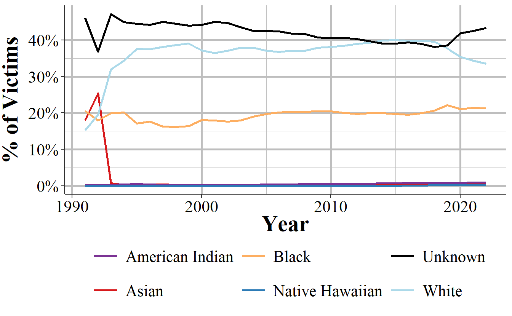
<p class="caption">(\#fig:nibrsOffenderRace)The share of offenders by race, 1991-2022.</p>
</div>

### Ethnicity

Ethnicity data, collected sporadically starting in 2013, is rarely recorded, with the most common entry being "unknown." As we can see in Figure \@ref(fig:nibrsOffenderEthnicity) this variable is very rarely used and for most of the life of NIBRS it wasn't collected. Even when it was collected - which started in 2013, ended after 2016, and then returned in 2021 - the most common value is that the offender's ethnicity was unknown. 

<div class="figure" style="text-align: center">
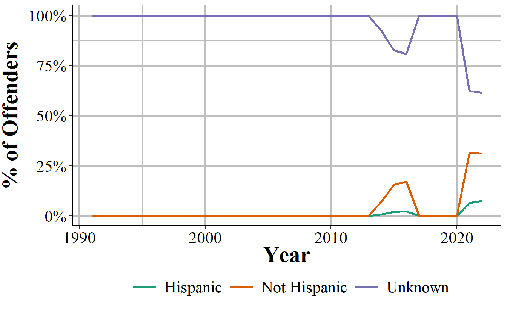
<p class="caption">(\#fig:nibrsOffenderEthnicity)The share of offenders by ethnicity, 1991-2022.</p>
</div>

While the Offender Segment is limited to basic demographics, it remains a valuable resource for identifying broad patterns in offender behavior. By tracking trends over time, researchers can examine shifts in age, sex, and race among offenders, which may inform policy decisions on crime prevention and law enforcement strategies. However, gaps in the data - such as unknown offender details, new agencies reporting data each year, and the absence of critical variables like criminal history - highlight the need for cautious interpretation and cross-referencing with other data sources.

<!--chapter:end:14_nibrs_offender.Rmd-->

