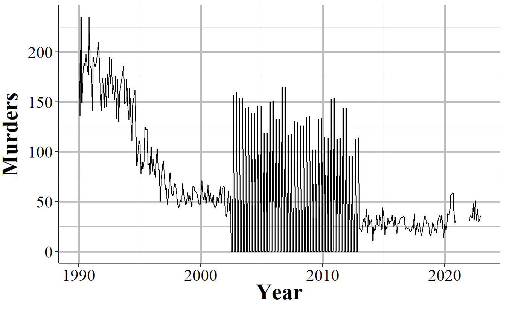
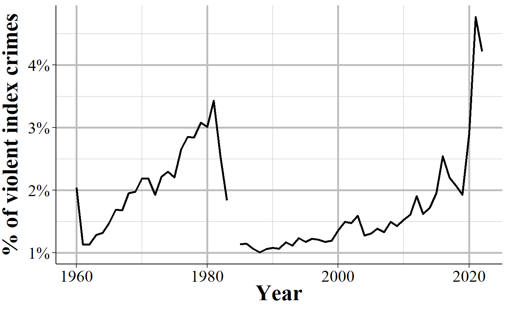
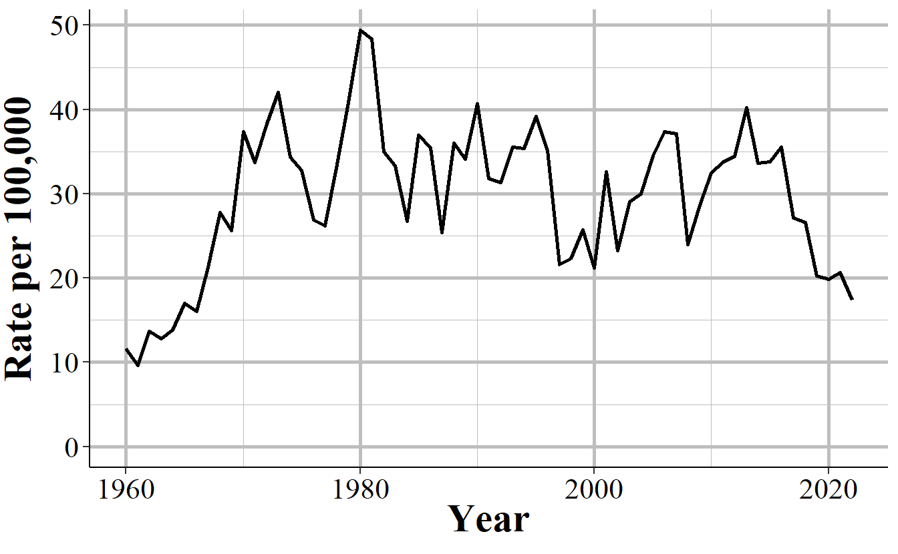
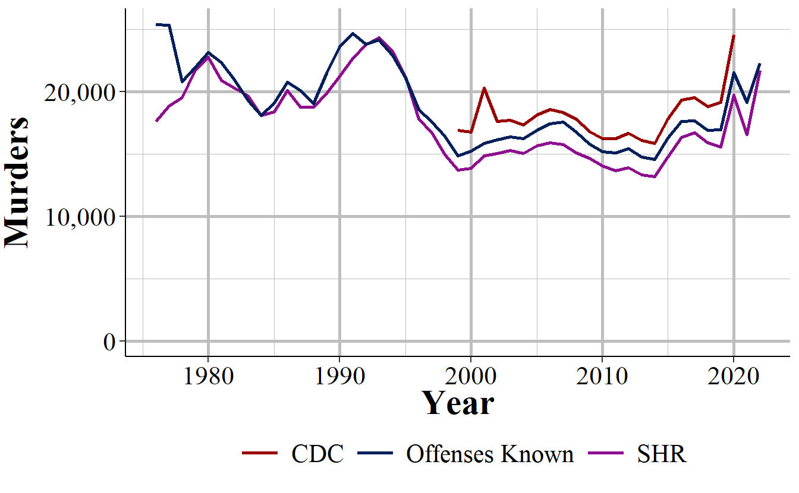
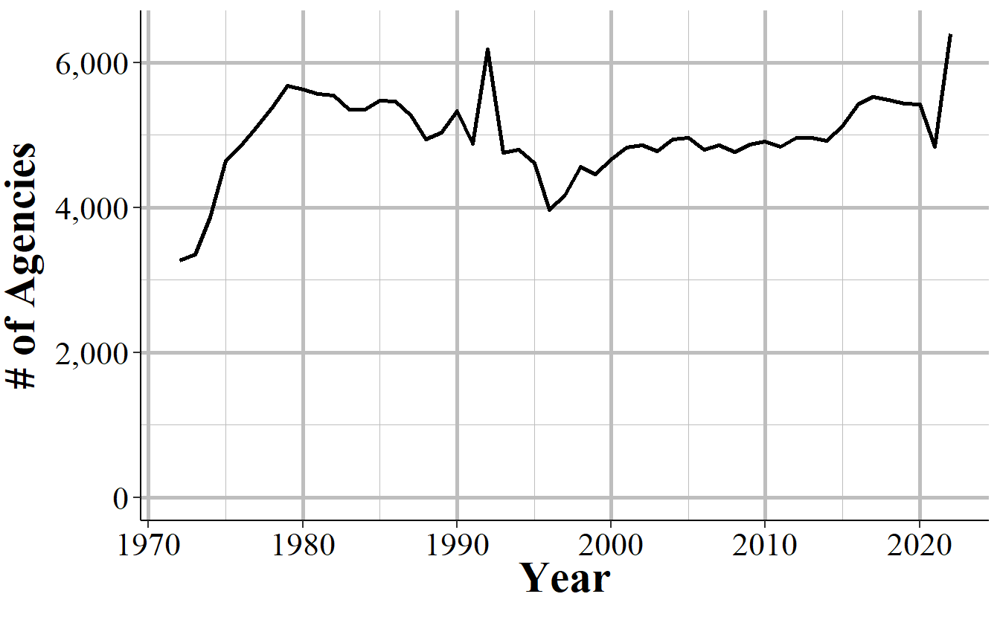
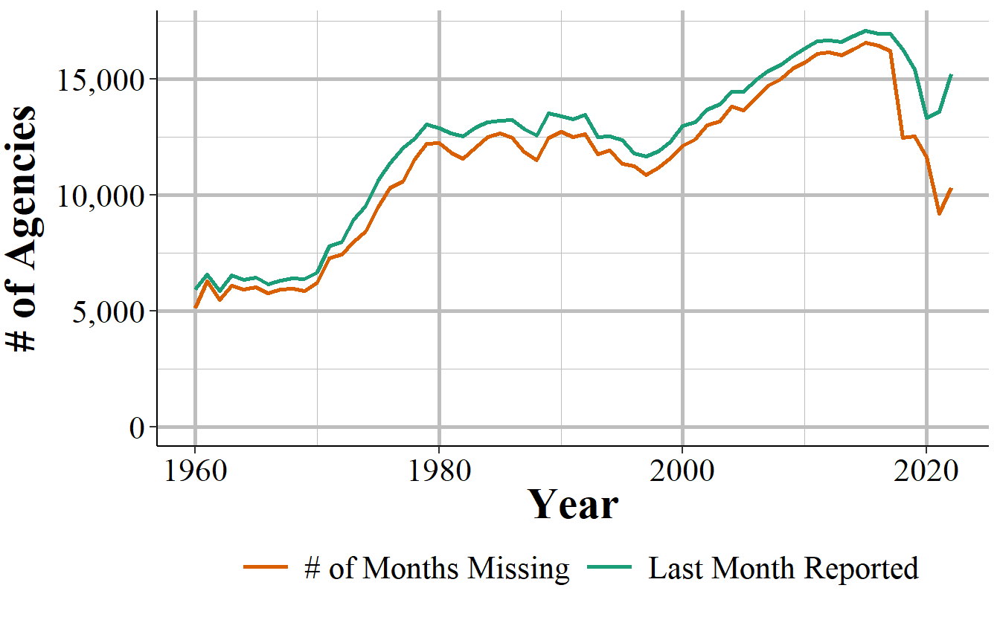
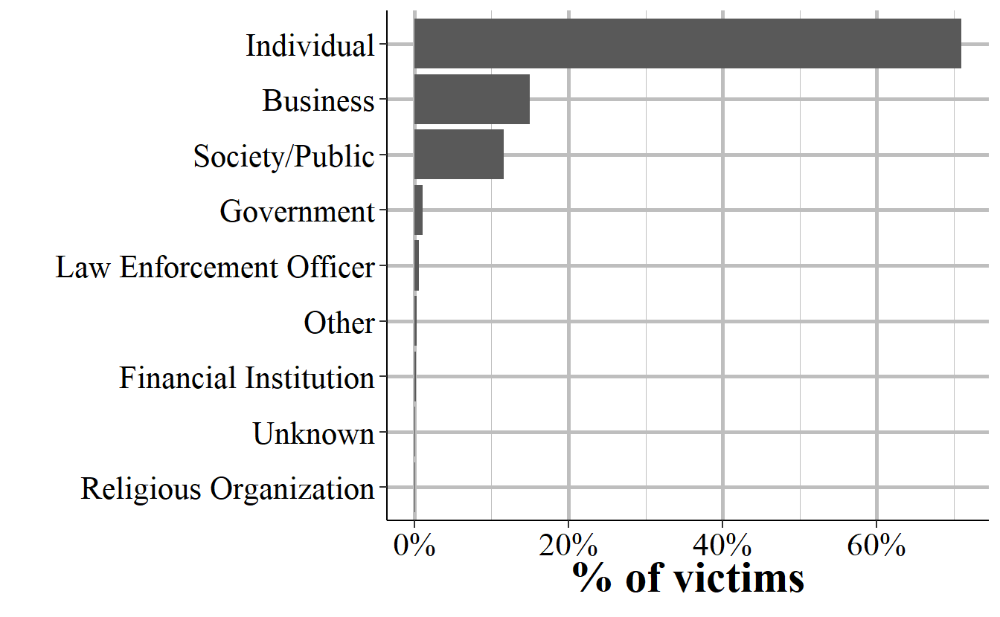
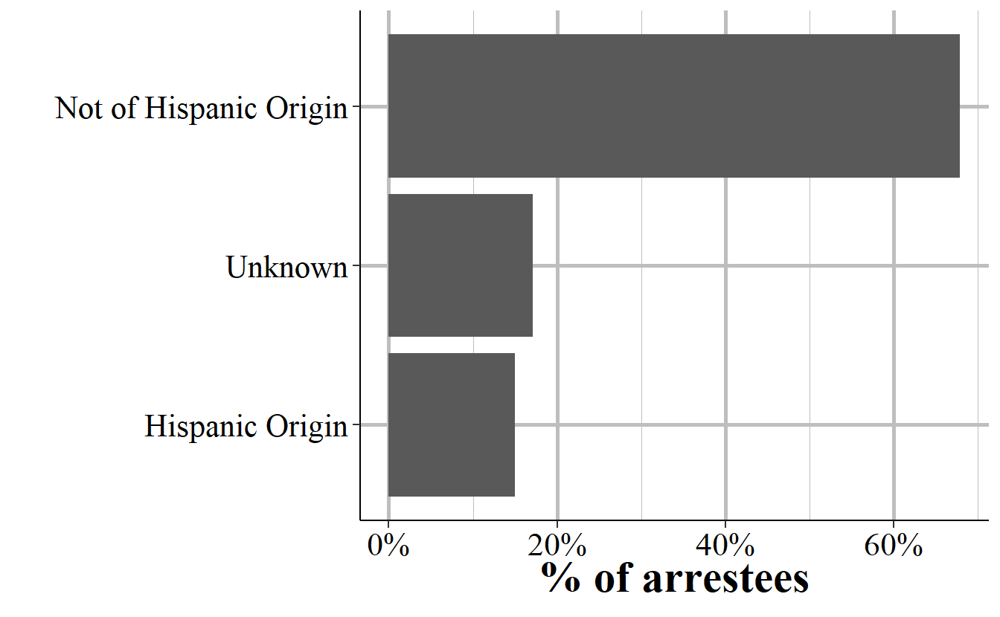

--- 
title: "Uniform Crime Reporting (UCR) Program Data: An Opinionated Guide to FBI Data"
author: "Jacob Kaplan, Ph.D."
date: "2024-09-03"
bibliography: [book.bib]
biblio-style: apalike
link-citations: yes
colorlinks: yes
description: "This is a comprehensive guide to using the FBI's Uniform Crime Reporting Program Data, including the Summary Reporting System (SRS) files and the National Incident-Based Reporting System (NIBRS) files."
url: "https://ucrbook.com"
github-repo: "jacobkap/ucrbook"
site: bookdown::bookdown_site
documentclass: krantz
monofont: "Source Code Pro"
monofontoptions: "Scale=0.7"
graphics: yes
---


\pagenumbering{roman}
\mainmatter
# (PART) Welcome {-}

# Preface 

If you've read an article about crime or arrests in the United States in the last half century, in most cases it was referring to the FBI's Uniform Crime Reporting Program Data, otherwise known as UCR data. UCR data is, with the exception of the more detailed data that only covers murders, a *monthly number of crimes or arrests reported to a single police agency* which is then gathered by the FBI into one file that includes all reporting agencies. It is actually a collection of different datasets, all of which have information about crimes and arrests that occur in a particular jurisdiction. Think of your home town. This data will tell you how many crimes were reported for a small number of crime categories or how many people (broken down by age, sex, and race) were arrested for a (larger) set of crime categories in that city (if the city has multiple police agencies then each agency will report crimes/arrests under their jurisdiction though the largest agency - usually the local police department - will cover the vast majority of crimes/arrests in that city) in a given month. 

This is a very broad measure of crime, and its uses in research - or uses for understanding crime at all - is fairly limited. Yet is has become over much of the last century - and will likely remain among researchers for at least the next decade - the most important crime data in the United States.

UCR data is important for three reasons: 

1. The definitions are standard, and all agencies (tend to) follow them so you can compare across agencies and over time.^[We'll see many examples of when agencies do not follow the definitions, which really limits this data.]
2. The data is available since 1960 (for most of the datasets) so there is a long period of available data.^[While the original UCR data first reported in 1929, there is only machine-readable data since 1960.]
3. The data is available for most of the 18,000 police agencies in the United States so you can compare across agencies. 

More than many other datasets, there will be times when using UCR data that you'll think "that's weird". This book will cover this weirdness and when we think the weirdness is just an odd - but acceptable - quirk of the data, and when it is a sign of a big problem in the data or in that particular variable and that we should avoid using it. For most of this book we'll be discussing the caveats of the above reasons - or, more directly, why these assumptions are wrong - but these are the reasons why the data is so influential. 

## Goal of the book

By the end of each chapter you should have a firm grasp on the dataset that is covered and how to use it properly. However, this book can't possibly cover every potential use case for the data so make sure to carefully examine the data yourself for your own particular use. 

I get a lot of emails from people asking questions about this data so my own goal is to create a single place that answers as many questions as I can about the data. Again, this is among the most commonly used crime datasets and there are still many current papers published with incorrect information about the data (including such simple aspects like what geographic unit data is in and what time unit it is in). So hopefully this book will decrease the number of misconceptions about this data, increasing overall research quality.

Since manuals are boring, I'll try to include graphs and images to try to alleviate the boredom. That said, I don't think it's possible to make it too fun so sorry in advanced. This book is a mix of facts about the data, such as how many years are available, and my opinions about it, such as whether it is reliable. In cases of facts I'll just say a statement - e.g. "the offenses data is available since 1960". In cases of opinion I'll temper the statement by saying something like "in my opinion..." or "I think". 

## Structure of the book

This book will be divided into ten chapters: this chapter, an intro chapter briefly summarizing each dataset and going over overall issues with UCR data, and seven chapters each covering one of the seven UCR datasets. The final chapter will cover county-level UCR data, a commonly used but highly flawed aggregation of UCR data that I recommend against using. Each chapter will follow the same format: we'll start with a brief summary of the data such as when it first because available and how it can be used. Next we'll look at how many agencies report their data to this dataset, often looking at how to measure this reporting rate a couple of different ways. Finally, we'll cover the important variables included in the data and how to use them properly (including not using them at all) - this will be the bulk of each chapter. 

## Citing this book

If this data was useful in your research, please cite it. To cite this book, please use the below citation: 

Kaplan J (2021). *Uniform Crime Reporting (UCR) Program Data: A Practitioner's Guide to FBI Data*. https://ucrbook.com/. 

BibTeX format:

```bibtex
@Manual{ucrbook,
  title = {Uniform Crime Reporting (UCR) Program Data: A Practitioner's Guide to FBI Data},
  author = {{Jacob Kaplan}},
  year = {2021},
  url = {https://ucrbook.com/},
}
```

## Sources of UCR data

### My own collection

#### openICPSR

#### [Crimedatatool.com][https://crimedatatool.com/]

### NACJD

### FBI (raw data)

### Raw data

### Crime Data Explorer

### Crimes in the United States report


### FBI (Crime Data Explorer)

### FBI (Crimes in the United States Report)

There are a few different sources of UCR data available today. First, and probably most commonly used, is the data put together by the [National Archive of Criminal Justice Data (NACJD)](https://www.icpsr.umich.edu/web/pages/NACJD/index.html)). This a team out of the University of Michigan who manages a huge number of criminal justice datasets and makes them available to the public. If you have any questions about crime data - UCR or other crime data - I highly recommend you reach out to them for answers. They have a collection of data and excellent documentation available for UCR data available on their site [here](https://www.icpsr.umich.edu/web/NACJD/series/57). One limitation to their data, however, is that each year of data is available as an individual file meaning that you'll need to concatenate each year together into a single file. Some years also have different column names (generally minor changes like spelling robbery "rob" one year and "robb" the next) which requires more work to standardize before you could concatenate. They also only have data through 2016 which means that the most recent years (UCR data is available through 2019) of data are (as of this writing) unavailable. 

Next, and most usable for the general public - but limited for researchers - is the FBI's official website [Crime Data Explorer](https://crime-data-explorer.fr.cloud.gov/). On this site you can chose an agency and see annual crime data (remember, UCR data is monthly so this isn't as detailed as it can be) for certain crimes (and not even all the crimes actually available in the data). This is okay for the general public but only provides a fraction of the data available in the actual data so is really not good for researchers. 

It's worth mentioning a final source of UCR information. This is the annual Crimes in the United States report released by the FBI each year around the start of October. As an example, here is the [website for the 2019 report](https://ucr.fbi.gov/crime-in-the-u.s/2019/crime-in-the-u.s.-2019). In this report is summarized data which in most cases estimates missing data and provides information about national and subnational (though rarely city-level) crime data. As with the FBI's site, it is only a fraction of the true data available so is not a very useful source of crime data for quality research. Still, this is a very common source of information used by researchers.


## Recommended reading

While this book is designed to help researchers use this data, the FBI has an excellent manual on this data designed to help police agencies submit their data. That manual, called the "Summary Reporting System (SRS) User Manual" provides excellent definitions and examples of many variables included in the data. In this book when I quote the FBI, such as defining a crime, I quote from this manual. The manual is available to download as a PDF on the FBI's site and I've also posted it on my GitHub page [here](https://github.com/jacobkap/ucrbook/blob/main/FBI%20Uniform%20Crime%20Reporting%20(UCR)%20Program%20User%20Manual.pdf) for convenienceq. I highly recommend that you read this manual before using the data. That manual, alongside this book which tries to explain when and how the agencies don't follow the manual, will provide a solid foundation for your understanding of UCR data.

## How to contribute to this book

If you have any questions, suggestions (such as a topic to cover), or find any issues, please make a post on the [Issues page](https://github.com/jacobkap/ucrbook/issues) for this book on GitHub. On this page you can create a new issue (which is basically just a post on this forum) with a title and a longer description of your issue. You'll need a GitHub account to make a post. Posting here lets me track issues and respond to your message or alert you when the issue is closed (i.e. I've finished or denied the request). Issues are also public so you can see if someone has already posted something similar. 

For more minor issues like typos or grammar mistakes, you can edit the book directly through its GitHub page. That'll make an update for me to accept, which will change the book to include your edit. To do that, click the edit button at the top of the site - the button is highlighted in the below figure. You will need to make a GitHub account to make edits. When you click on that button you'll be taken to a page that looks like a Word Doc where you can make edits. Make any edits you want and then scroll to the bottom of the page. There you can write a short (please, no more than a sentence or two) description of what you've done and then submit the changes for me to review.

<div class="figure" style="text-align: center">

<p class="caption">(\#fig:unnamed-chunk-3)The edit button for how to make edits of this book.</p>
</div>

Please only use the above two methods to contribute or make suggestions about the book. While it's a bit more work for you to do it this way, since you'll need to make a GitHub account if you don't already have one, it helps me organize all the questions in one place and update the book if I decide to add answers to certain questions. 

## How to identify a particular agency (ORI codes) {#ori}

In NIBRS and other FBI data sets, agencies are identified using **OR**iginating Agency **I**dentifiers or an ORI. An ORI is a unique ID code used to identify an agency.^[This is referred to as an "ORI", "ORI code", and "ORI number", all of which mean the same thing.] If we used the agency's name we'd end up with some duplicates since there can be multiple agencies in the country (and in a state, those this is very rare) with the same name. For example, if you looked for the Philadelphia Police Department using the agency name, you'd find both the "Philadelphia Police Department" in Pennsylvania and the one in Mississippi. Each ORI is a 9-digit value starting with the state abbreviation (for some reason the FBI incorrectly puts the abbreviation for Nebraska as NB instead of NE) followed by 7 numbers. In the UCR data (another FBI data set) the ORI uses only a 7-digit code - with only the 5 numbers following the state abbreviation instead of 7. So the NIBRS ORI codes are sometimes called ORI9. For nearly all agencies, the only difference between the UCR ORI and the NIBRS ORI is that the NIBRS ORI has "00" at the end so it is technically 9 characters long but isn't any more specific than the 7-character UCR ORI code. 

When dealing with specific agencies, make sure to use the ORI rather than the agency name to avoid any mistakes. For an easy way to find the ORI number of an agency, use [this page](https://crimedatatool.com/crosswalk.html) on my site. Type an agency name or an ORI code into the search section and it will return everything that is a match.


## The data as you get it from the FBI

We'll finish this overview of the SRS data by briefly talking about format of the data that is released by the FBI, before the processing done by myself or [NACJD](https://www.icpsr.umich.edu/web/pages/NACJD/index.html) that converts the data to a type that software like R or Stata or Excel can understand. The FBI releases their data as fixed-width ASCII files which are basically just an Excel file but with all of the columns squished together. As an example, Figure \@ref(fig:SRSascii) shows what the data looks like as you receive it from the FBI for the Offenses Known and Clearances by Arrest dataset for 1960, the first year with data available. In the figure, it seems like there are multiple rows but that's just because the software that I opened the file in isn't wide enough - in reality what is shown is a single row that is extremely wide because there are over 1,500 columns in this data. If you scroll down enough you'll see the next row, but that isn't shown in the current image. What is shown is a single row with a ton of columns all pushed up next to each other. Since all of the columns are squished together (the gaps are just blank spaces because the value there is a space, but that doesn't mean there is a in the data. Spaces are possible values in the data and are meaningful), you need some way to figure out which parts of the data belong in which column. 

<div class="figure" style="text-align: center">

<p class="caption">(\#fig:SRSascii)Fixed-width ASCII file for the 1960 Offenses Known and Clearances by Arrest dataset.</p>
</div>

<div class="figure" style="text-align: center">

<p class="caption">(\#fig:ascii)Fixed-width ASCII file for the 1991 National Incident-Based Reporting System (NIBRS) dataset.</p>
</div>

The "fixed-width" part of the file type is how this works (the ASCII part basically means it's a text file). Each row is the same width - literally the same number of characters, including blank spaces. So you must tell the software you are using to process this file - by literally writing code in something called a "setup file" but is basically just instructions for whatever software you use (R, SPSS, Stata, SAS can all do this) - which characters are certain columns. For example, in this data the first character says which type of SRS data it is (1 means the Offenses Known and Clearances by Arrest data) and the next two characters (in the setup file written as 2-3 since it is characters 2 through 3 [inclusive]) are the state number (01 is the state code for Alabama). So we can read this row as the first column indicating it is an Offenses Known data, the second column indicating that it is for the state of Alabama, and so on for each of the remaining columns. To read in this data you'll need a setup file that covers every column in the data (some software, like R, can handle just reading in the specific columns you want and don't need to include every column in the setup file). 

The second important thing to know about reading in a fixed-width ASCII file is something called a "value label."^[For most fixed-width ASCII files there are also missing values where it'll have placeholder value such as -8 and the setup file will instruct the software to convert that to NA. SRS data, however, does not have this and does not indicate when values are missing in this manner.] For example, in the above image we saw the characters 2-3 is the state and in the row we have the value "01" which means that the state is "Alabama." Since this type of data is trying to be as small as efficient as possible, it often replaces longer values with shorter one and provides a translation for the software to use to convert it to the proper value when reading it. "Alabama" is more characters than "01" so it saves space to say "01" and just replace that with "Alabama" later on. So "01" would be the "value" and "Alabama" would be the "label" that it changes to once read. 

Fixed-width ASCII files may seem awful to you reading it today, and it is awful to use. But it appears to be an efficient way to store data back many decades ago when data releases began but now is extremely inefficient - in terms of speed, file size, ease of use - compared to modern software so I'm not sure why they *still* release data in this format. But they do, and even the more *modern* (if starting in 1991, before I was born, is modern!) NIBRS data comes in this format. For you, however, the important part to understand is not how exactly to read this type of data, but to understand that people who made this data publicly available (such as myself and the team at NACJD) must make this conversion process.^[For those interested in reading in this type of data, please see my R package asciiSetupReader.] **This conversion process, from fixed-width ASCII to a useful format is the most dangerous step taken in using this data - and one that is nearly entirely unseen by researchers.** 

Every line of code you write (or, for SPSS users, click you make) invites the possibility of making a mistake.^[Even highly experienced programmers who are doing something like can make mistakes. For example, if you type out "2+2" 100 times - something extremely simple that anyone can do - how often will you mistype a character and get a wrong result? I'd guess that at least once you'd make a mistake.] The FBI does not provide a setup file with the fixed-width ASCII data so to read in this data you need to make it yourself. Since some SRS data are massive, this involves assigning the column width for thousands of columns and the value labels for hundreds of different value labels.^[With the exception of the arrest data and some value label changes in hate crimes and homicide data, the setup files remain consistent so a single file will work for all years for a given dataset. You do not need to make a setup file for each year.] A typo anywhere could have potentially far-reaching consequences, so this is a crucial weak point in the data cleaning process - and one in which I have not seen anything written about before. While I have been diligent in checking the setup files and my code to seek out any issues - and I know that NACJD has a robust checking process for their own work - that doesn't mean our work is perfect.^[For evidence of this, please see any of the openICPSR pages for my detail as they detail changes I've made in the data such as decisions on what level to aggregate to and mistakes that I made and later found and fixed.] Even with perfection in processing the raw data to useful files, decisions we make (e.g. what level to aggregate to, what is an outlier) can affect both what type of questions you can ask when using this data, and how well you can answer them.    


## Common issues

In this section we'll discuss issues common to most or all of the SRS datasets. For some of these, we'll come back to the issues in more detail in the chapter for the datasets most affected by the problem. 

### Population

Each of the SRS datasets include a population variable that has the estimated population under the jurisdiction of that agency.^[Jurisdiction here refers to the boundaries of the local government, not any legal authority for where the officer can make arrests. For example, the Los Angeles Police Department's jurisdiction in this case refers to crimes that happen inside the city or are otherwise investigated by the LAPD - and are not primarily investigated by another agency.] This variable is often used to create crime rates that control for population. In cases where jurisdiction overlaps, such as when a city has university police agencies or county sheriffs in counties where the cities in that county have their own police, SRS data assigns the population covered to the most local agency and zero population to the overlapping agency. So an agency's population is the number of people in that jurisdiction that isn't already covered by a different agency. 

For example, the city of Los Angeles in California has nearly four million residents according to the US Census. There are multiple police agencies in the city, including the Los Angeles Police Department, the Los Angeles County Sheriff's Office, the California Highway Patrol that operates in the area, airport and port police, and university police departments. If each agency reported the number of people in their jurisdiction - which all overlap with each other - we would end up with a population far higher than LA's four million people. To prevent double-counting population when agency's jurisdictions overlap, the non-primary agency will report a population of 0, even though they still report crime data like normal. As an example, in 2018 the police department for California State University - Los Angeles reported 92 thefts and a population of 0. Those 92 thefts are not counted in the Los Angeles Police Department data, even though the department counts the population. To get complete crime counts in Los Angeles, you'd need to add up all police agencies within in the city; since the population value is 0 for non-LAPD agencies, both the population and the crime sum will be correct. 

The SRS uses this method even when only parts of a jurisdiction overlaps. Los Angeles County Sheriff has a population of about one million people, far less than the actual county population (the number of residents, according to the Census) of about 10 million people. This is because the other nine million people are accounted for by other agencies, mainly the local police agencies in the cities that make up Los Angeles County. 

The population value is the population who reside in that jurisdiction and does not count people who are in the area but don't live there, such as tourists or people who commute there for work. This means that using the population value to determine a rate can be misleading as some places have much higher numbers of non-residents in the area (e.g. Las Vegas, Washington D.C.) than others. 

### Voluntary reporting {#voluntary}

When an agency reports their data to the FBI, they do so voluntarily - there is no national requirement to report.^[Some states do mandate that their agencies report, but this is not always followed.] This means that there is inconsistency in which agencies report, how many months of the year they report for, and which variables they include in their data submissions. 

In general, more agencies report their data every year and once an agency begins reporting data they tend to keep reporting. The SRS datasets are a collection of separate, though related, datasets and an agency can report to as many of these datasets as they want - an agency that reports to one dataset does not mean that they report to other datasets. Figure \@ref(fig:SRSagenciesReporting) shows the number of agencies that submitted at least one month of data to the Offenses Known and Clearances by Arrest data in the given year. For the first decade of available data under 8,000 agencies reported data and this grew to over 13,500 by the late 1970s before plateauing for about a decade. The number of agencies that reported their data actually declined in the 1990s, driven primarily by many Florida agencies temporarily dropping out, before growing steadily to nearly 17,000 agencies in 2010; from here it kept increasing but slower than before. 

<div class="figure" style="text-align: center">

<p class="caption">(\#fig:SRSagenciesReporting)The annual number of agencies reporting to the Offenses Known and Clearances by Arrest dataset. Reporting is based on the agency reporting at least one month of data in that year.</p>
</div>

There are approximately 18,000 police agencies in the United States so recent data has reports from nearly all agencies, while older data has far fewer agencies reporting. When trying to estimate to larger geographies, such as state or national-level, later years will be more accurate as you're missing less data. For earlier data, however, you're dealing with a smaller share of agencies meaning that you have a large amount of missing data and a less representative sample. 

Figure \@ref(fig:bigAgenciesReporting) repeats the above figure but now including only agencies with 100,000 people or more in their jurisdiction. While these agencies have a far more linear trend than all agencies, the basic lesson is the same: recent data has most agencies reporting; old data excludes many agencies. 

<div class="figure" style="text-align: center">

<p class="caption">(\#fig:bigAgenciesReporting)The annual number of agencies with a population of 100,000 or higher reporting to the Offenses Known and Clearances by Arrest dataset. Reporting is based on the agency reporting at least one month of data in that year.</p>
</div>

This voluntariness extends beyond whether they report or not, but into which variables they report. While in practice most agencies report every crime when they report any, they do have the choice to report only a subset of offenses. This is especially true for subsets of larger categories - such as gun assaults, a subset of aggravated assaults, or marijuana possession arrests which is a subset of drug possession arrests. As an example, Figure \@ref(fig:nycGunAssaults) shows the annual number of aggravated assaults with a gun in New York City. In 2003 the New York Police Department stopped reporting this category of offense, resuming only in 2013. They continued to report the broader aggravated assault category, but not any of the subsections of aggravated assaults which say which weapon was used during the assault.

<div class="figure" style="text-align: center">

<p class="caption">(\#fig:nycGunAssaults)Monthly reports of gun assaults in New York City, 1960-2022.</p>
</div>

Given that agencies can join or drop out of the SRS program at will, and report only partial data, it is highly important to carefully examine your data to make sure that there are no issues caused by this. 

Even when an agency reports SRS data, and even when they report every crime category, they can report fewer than 12 months of data. In some cases they simply report all of their data in December, or report quarterly or semi-annually so some months have zero crimes reported while others count multiple months in that month's data. One example of this is New York City, shown in Figure \@ref(fig:nycMurderMonthly), in the early-2000s to the mid-2010s where they began reporting data quarterly instead of monthly. 

<div class="figure" style="text-align: center">

<p class="caption">(\#fig:nycMurderMonthly)Monthly murders in New York City, 1990-2022. During the 2000s, the police department began reporting quarterly instead of monthly and then resumed monthly reporting.</p>
</div>

When you sum up each month into an annual count, as shown in Figure \@ref(fig:nycMurderYearly), the problem disappears since the zero months are accounted for in the months that have the quarterly data. If you're using monthly data and only examine the data at the annual level, you'll fall into the trap of having incorrect data that is hidden due to the level of aggregation examined. While cases like NYC are obvious when viewed monthly, for people that are including thousands of agencies in their data, it is unfeasible to look at each agency for each crime included. This can introduce errors as the best way to examine the data is manually viewing graphs and the automated method, looking for outliers through some kind of comparison to expected values, can be incorrect.   

<div class="figure" style="text-align: center">

<p class="caption">(\#fig:nycMurderYearly)Annual murders in New York City, 1990-2022.</p>
</div>

In other cases when agencies report fewer than 12 months of the year, they simply report partial data and as a result undercount crimes. Figure \@ref(fig:miamiDadeMurderAnnual) shows annual murders in Miami-Dade, Florida and has three years of this issue occurring. The first two years with this issue are the two where zero murders are reported - this is because the agency didn't report any months of data. The final year is in 2018, the last year of data in this graph, where it looks like murder suddenly dropped significantly. That's just because Miami-Dade only reported through June, so they're missing half of 2018. 

<div class="figure" style="text-align: center">

<p class="caption">(\#fig:miamiDadeMurderAnnual)Annual murders in Miami-Dade, Florida, 1960-2022.</p>
</div>

### Zero crimes vs no reports

When an agency does not report, we see it in the data as reporting zero crimes, not reporting NA or any indicator that they did not report. In cases where the agency says they didn't report that month we can be fairly sure (not entirely since that variable isn't always accurate) that the zero crimes reported are simply that the agency didn't report. In cases where the agency says they report that month but report zero crimes, we can't be sure if that's a true no crimes reported to the agency or the agency not reporting to the SRS. As agencies can report some crimes but not others in a given month and still be considered reporting that month, just saying they reported doesn't mean that the zero is a true zero.

In some cases it is easy to see when a zero crimes reported is actually the agency not reporting. As Figure \@ref(fig:nycGunAssaults) shows with New York City gun assaults, there is a massive and sustained drop-off to zero crimes and then a sudden return years later. Obviously, going from hundreds of crimes to zero crimes is not a matter of crimes not occurring anymore, it is a matter of the agency not reporting - and New York City did report other crimes these years so in the data it says that they reported every month. So in agencies which tend to report many crimes - and many here can be a few as 10 a year since going from 10 to 0 is a big drop - a sudden report of zero crimes is probably just non-reporting. 

Differentiating zero crimes and no reports becomes tricky in agencies that tend to report few crimes, which most small towns do. As an example, Figure \@ref(fig:danvilleRape) shows the annual reports of rape in Danville, California, a city of approximately 45,000 people. The city reports on average 2.8 rapes per year and in five years reported zero rapes. In cases like this it's not clear whether we should consider those zero years as true zeros (that no one was raped or reported their rape to the police) or whether the agency simply didn't report rape data that year.  


<div class="figure" style="text-align: center">

<p class="caption">(\#fig:danvilleRape)Annual rapes reported in Danville, CA, 1960-2022.</p>
</div>

### Agency data covered by another agency

<!--chapter:end:index.Rmd-->

# About the Author {-}


**Dr. Jacob Kaplan** is a Professional Specialist at the School of Public and International Affairs at Princeton University. He holds a Ph.D. in Criminology from the University of Pennsylvania. He is a former member of the FBI’s Criminal Justice Information Services (CJIS) Advisory Policy Board (APB) Uniform Crime Reporting (UCR) Subcommittee.

He is the author of several R packages that make it easier to work with data, including  [fastDummies](https://jacobkap.github.io/fastDummies/), [asciiSetupReader](https://jacobkap.github.io/asciiSetupReader/), [predictrace](https://jacobkap.github.io/predictrace/), and [caesar](https://jacobkap.github.io/caesar/). 

For a list of papers he has written, please see [here](https://jacobdkaplan.weebly.com/research.html).

For a list of data he has cleaned and published (including data discussed in this book), please see [here](https://jacobdkaplan.weebly.com/data.html).

<!--chapter:end:01_author.Rmd-->

\mainmatter
# (PART) Summary Reporting System (SRS) {-}

# SRS Overview {#SRSGeneral}

One of the first, and most important, questions I think people have about crime is a simple one: is crime going up? Answering it seems simple - you just count up all the crimes that happen in an area and see if that number of bigger than it was in previous times. 

However, putting this into practice invites a number of questions, all of which affect how we measure crime. First, we need to define what a crime is. Not philosophically what actions are crimes - or what should be crimes - but literally which of the many thousands of different criminal acts (crimes as defined by state or federal law) should be considered in this measure. Should murder count? Most people would say yes. How about jaywalking or speeding? Many would say probably not. Should marital rape be considered a crime? Now, certainly most people (all, I would hope) would say yes. But in much of the United States it wasn't a crime until the 1970s [@bennice2003marital; @mcmahon2009criminalizing]. What about marijuana possession, an act that is illegal nationally and in some states, but legal elsewhere?

Next, we have to know what geographic and time unit to measure crimes at since these decisions determine how precise we can measure crime and when it changed. That is, if you are mugged on Jan 1st at exactly 12:15pm right outside your house, how do we record it? Should we be as precise as including the exact time and location (such as your home address)? Out of privacy concerns to the victim, should we only include a larger time unit (such as hour of the day or just the day without any time of day) or a larger geographic unit (such as a Census Tract or the city)? And what about when there are questions about geographic jurisdiction such as a local police and sheriff overlapping in their patrol area? Or when a crime happens over the course of several hours (e.g. a length burglary or kidnapping)? Should we count the start time, the end time, or somewhere in the middle?

The final question is that when a crime occurs, how do we know? That is, when we want to count how many crimes occurred do we ask people how often they've been victimized, do we ask people how often they commit a crime, do we look at crimes reported to police, crimes charged in a criminal court? Each of these measures will likely give different answers as to how many crimes occurred.\footnote{The Bureau of Justice Statistics does measure crime by asking a random sample of people whether they were the victim of a crime. For more on this, please see their National Crime Victimization Survey reports} And what about crimes where a victim reports it and the police investigate and decide that it didn't occur (e.g. victim reports an act which was not actually illegal)? Or where the police say a crime occurred by the local District Attorney declines to prosecute? 

The FBI answered all of these questions in 1929 when they began the Uniform Crime Reporting (SRS) Program Data, or SRS data for short. **Crime consists of eight crime categories - murder, rape, robbery, aggravated assault, burglary, motor vehicle theft, theft, and simple assault - that are reported to the police and is collected each month from each agency in the country.** So essentially we know how many of a small number of crime categories happen each month in each city (though some cities have multiple police agencies so even this is more complicated than it seems). These decisions, born primarily out of the resource limitations of 1929 (i.e. no computers), have had a major impact on criminology research. The first seven crime categories - known as "Index Crimes" or "Part 1 crimes" (or "Part I" sometimes) - are the ones used to measure crime in many criminology papers, even when the researchers have access to data that covers a broader selection of crimes than these.^[Arson is also an index crime but was added after these initial seven were chosen and is not included in the crimes dataset (though is available separately) so is generally not included in studies that use index crimes.] These are also the crimes that the news uses each year to report on how crime in the United States compares to the previous year. The crime data actually also includes the final crime, simple assault, though it is not included as an index crime and is, therefore, generally ignored by researchers - a large flaw in most studies that we'll discuss in more detail in Section \@ref(indexCrimes). In fact excluding simple assault is such a large issue that doing so has led us to exclude the most common violent crime from most government, news, and academic reports, leading to an undercount of violence in this country by approximately 50%.  

In this chapter we'll provide a brief overview of the datasets that make up the FBI's Summary Reporting System (SRS) which you can think of as the "aggregate" data collection that is part of their Uniform Crime Reporting (UCR) Program Data. These datasets are primarily focused on aggregate data, mostly having monthly counts of crimes without many details about any particular crime. In comparison, the other half of the UCR collection, the National Incident-Based Reporting System (NIBRS) data is focused entirely on providing detail on every individual crime reported to the police. You can actually convert NIBRS data to SRS in most cases - and FBI does for agencies that report only NIBRS data - but there's no way to go from SRS to NIBRS. 

## Crimes included in the SRS datasets

SRS data covers only a subset - and for the crime data, a very small subset - of all crimes that can occur. It also only includes crimes reported to the police. So there are two levels of abstraction from a crime occurring to it being included in the data: a crime must occur that is one of the crimes included in one of the SRS datasets (we detail all of these crimes below) *and* the victim must report the incident to the police. While the crimes included are only a small selection of crimes - which were originally chosen since at the time the SRS was designed these were considered important offenses and among the best reported - this is an important first step to understanding the data.

SRS data should be understood as a loose collection of data that seeks to understand crimes and arrests in the United States. There are seven datasets in the SRS collection that each cover a different topic or a subset of a previously covered topic: crimes, arrests, property crimes specifically, homicides specifically, police officers killed or assaulted, arson specifically, and hate crimes.^[There is also a human trafficking dataset though this is a newer dataset and rarely used so I will not cover it in this book.] In this section we'll go over the crimes included in the two main SRS datasets: Offenses Known and Clearances by Arrest and (which I like to call the "crime" dataset) and the Arrests by Age, Sex, and Race (the "arrests" dataset). These are the most commonly used SRS datasets and the stolen property and homicide datasets are simply more detailed subsets of these datasets. The hate crime dataset can cover a broader selection of offenses than in the crimes or arrests data, so we'll discuss those in Chapter \@ref(hate_crimes). 

## A summary of each SRS dataset

The SRS collection of data can be roughly summarized into two groups: crime data and arrest data. While there are several datasets included in the SRS data collection, they are all extensions of one of the above groups. For arrest data, you have information about who (by race and by age-gender, but not by race-gender or race-age other than within race you know if the arrestee is an adult or a juvenile) was arrested for each crime. For crime data, you have monthly counts of a small number of crimes (many fewer than crimes covered in the arrest data) and then more specialized data on a subset of these crimes - information on homicides, hate crimes, assaults or killings of police officers, and stolen property. 

Each of these datasets will have its own chapter in this book where we discuss the data thoroughly. Here is a very brief summary of each dataset which will help you know which one to use for your research. I still recommend reading that data's chapter since it covers important caveats and uses (or misuses) of the data that won't be covered below. 

### Offenses Known and Clearances by Arrest (1960 - present)

The Offenses Known and Clearances by Arrest dataset - often called Return A, "Offenses Known" or, less commonly, OKCA - is the oldest and most commonly used dataset and measures crimes reported to the police. For this reason it is used as *the* main measure of crime in the United States, and I tend to call it the "crimes dataset." This data answers the most basic questions about crimes: how many occurred? If you see crime data referenced in a news or academic article it is usually this data. This data also includes the number of crimes solved (though with a weaker definition of "solved" than you may think) and the number of crimes in which the agency concluded did not actually occur which they call an "unfounded" crime. This data has the monthly number of crimes - for a select group of crimes types - that occurred in an agency, as well as how many the police investigated and decided did not occur, and the number "cleared" by an arrest.  The data uses something called a Hierarchy Rule which means that in incidents with multiple crimes, only the most serious is recorded - though in practice this affects only a small percent of cases, and primarily affects property crimes.

### Arrests by Age, Sex, and Race (1974 - present)

The Arrests by Age, Sex, and Race dataset - often called ASR, or the "arrests data", or sometimes the "Arrests by Age, Sex, Race, and Ethnicity though this is really misleading since most years don't even report ethnicity data - includes the monthly number of arrests for a variety of crimes and, unlike the crime data, breaks down this data by age and gender. This data includes a broader number of crime categories than the crime dataset (the Offenses Known and Clearances by Arrest data) though is less detailed on violent crimes since it does not breakdown aggravated assault or robberies by weapon type as the Offenses Known data does.

For each crime it says the number of arrests for each gender-age group with younger ages (15-24) showing the arrestee's age to the year (e.g. age 16, age 17) and other ages grouping years together (e.g. age 25-29, 30-34, "under 10"). It also breaks down arrests by race-age by including the number of arrestees of each race (American Indian, Asian, Black, and White are the only included races) and if the arrestee is a juvenile (<18 years old) or an adult. The data does technically include a breakdown by ethnicity-age (e.g. juvenile-Hispanic, juvenile-non-Hispanic) but almost no agencies report this data (for most years zero agencies report ethnicity at all) so in practice the data does not include ethnicity. As the data includes counts of arrestees, people who are arrested multiple times are included in the data multiple times - it is not a measure of unique arrestees. 

### Law Enforcement Officers Killed and Assaulted (LEOKA) (1960 - present)

The Law Enforcement Officers Killed and Assaulted data, often called just by its acronym LEOKA ("LEE-OH-KUH"), has two main purposes.^[This data is also sometimes called the "Police Employees" dataset.] First, it provides counts of employees employed by each agency - broken down by if they are civilian employees or sworn officers, and also broken down by sex (male and female are the only options). And second, it measures how many officers were assaulted or killed (including officers who die accidentally such as in a car crash) in a given month. The assault data is also broken down into shift type (e.g. alone, with a partner, on foot, in a car, etc.), the offender's weapon, and type of call they are responding to (e.g. robbery, disturbance, traffic stop). The killed data simply says how many officers are killed feloniously (i.e. murdered) or died accidentally (e.g. car crash) in a given month. The employee information is at the year-level so you know, for example, how many male police officers were employed in a given year at an agency, but don't know any more than that such as if the number employed changed over the year. This dataset is commonly used as a measure of police employees and is a generally reliable measure of how many police are employed by a police agency. The second part of this data, measuring assaults and deaths, is more flawed with missing data issues and data error issues (e.g. more officers killed than employed in an agency).

### Supplementary Homicide Reports (SHR)

The Supplementary Homicide Reports dataset - often abbreviated to SHR - is the most detailed of the SRS datasets and provides information about the circumstances and participants (victim and offender demographics and relationship status) for homicides. For each homicide incident it tells you the age, gender, race, and ethnicity of each victim and offender as well as the relationship between the first victim and each of the offenders (but not the other victims in cases where there are multiple victims). It also tells you the weapon used by each offender and the circumstance of the killing, such as a "lovers triangle" or a gang-related murder. As with other SRS data, it also tells you the agency it occurred in and the month and year when the crime happened. 

One important point of clarification: this is not the number of murders, though it does track that. This data also includes the number of homicides that are manslaughter by negligence (e.g. children playing with a gun, hunting accident) and justifiable homicides (i.e. not criminal). So be carefully when speaking about this data. It is murders but not only murders so you want to speak precisely. 

### Hate Crime Data (1991 - present)

This dataset covers crimes that are reported to the police and judged by the police to be motivated by hate. More specifically, they are (1) crimes which were (2) motivated - at least in part - by bias towards a certain person or group of people because of characteristics about them such as race, sexual orientation, or religion. The first part is key, they must be crimes - and really must be the selection of crimes that the FBI collects for this dataset. Biased actions that don't meet the standard of a crime, or are of a crime category not included in this data, are not considered hate crimes. For example, if someone yells at a Black person and uses racial slurs against them, it is clearly a racist action. For it to be included in this data, however, it would have to extend to a threat since "intimidation" is a crime included in this data but lesser actions such as simply insulting someone is not included. For the second part, the bias motivation, it must be against a group that the FBI includes in this data. For example, when this data collection began in 1991 crimes against transgender people were not counted so if a transgender person was assaulted or killed because they were transgender, this is not a hate crime recorded in the data (though it would have counted in the "Anti-Lesbian, Gay, Bisexual, Or Transgender, Mixed Group (LGBT)" bias motivation which was always reported).


### Property Stolen and Recovered (Supplement to Return A) (1960 - present)

The Property Stolen and Recovered data - sometimes called the Supplement to Return A (Return A being another name for the Offenses Known and Clearances by Arrest dataset, the "crime" dataset) - provides monthly information about property-related offenses (theft, motor vehicle theft, robbery, and burglary), including the location of the offense (in broad categories like "gas station" or "residence"), what was stolen (e.g. clothing, livestock, firearms), and how much the stolen items were worth.^[It also includes the value of items stolen during rapes and murders, if anything was stolen.] It also includes robberies so is really the "stuff taken during a crime" dataset than the dataset about property crimes. The "recovered" part of this dataset covers the type and value of property recovered so you can use this, along with the type and value of property stolen, to determine what percent and type of items the police managed to recover. 

Like most other SRS datasets this is at the agency-month level so you can, for example, learn how often burglaries occur at the victim's home during the day, and if that rate changes over the year or differs across agencies. The data, however, provides no information about the offender or the victim (other than if the victim was an individual or a commercial business ^[based on the location of the incident - "bank", "gas station", etc.]). The value of the property stolen is primarily based on the victim's estimate of how much the item is worth (items that are decreased in value once used - such as cars - are supposed to be valued at the current market rate, but the data provides no indication of when it uses the current market rate or the victim's estimate) so it should be used as a very rough estimate of value.  

### Arson (1979 - present)

The arson dataset provides monthly counts at the police agency-level for arsons that occur, and includes a breakdown of arsons by the type of arson (e.g. arson of a person's home, arson of a vehicle, arson of a community/public building) and the estimated value of the damage caused by the arson. This data includes all arsons reported to the police or otherwise known to the police (e.g. discovered while on patrol) and also has a count of arsons that lead to an arrest (of at least one person who committed the arson) and reports that turned out to not be arsons (such as if an investigation found that the fire was started accidentally). This is essentially the Offenses Known and Clearances by Arrest data but only for arsons. The data even follows the same definitions for categories such as what counts as a cleared or unfounded crime. The primary additional variable is the estimated damage in dollars caused by the arson. 


<!--chapter:end:02_ucr_general.Rmd-->

---
output:
  pdf_document: default
  html_document: default
---
# Offenses Known and Clearances by Arrest {#offensesKnown}


The Offenses Known and Clearances by Arrest dataset - often called Return A, "Offenses Known" or, less commonly, OKCA - is the oldest and most commonly used dataset and measures crimes reported to the police. For this reason it is used as *the* main measure of crime in the United States, and I tend to call it the "crimes dataset." This data answers the most basic questions about crimes: how many occurred? If you see crime data referenced in a news or academic article it is usually this data. This data also includes the number of crimes solved (though with a weaker definition of "solved" than you may think) and the number of crimes in which the agency concluded did not actually occur which they call an "unfounded" crime. This data has the monthly number of crimes - for a select group of crimes types - that occurred in an agency, as well as how many the police investigated and decided did not occur, and the number "cleared" by an arrest. 

The Offenses Known data has been **the** crime data of record for nearly a century, and will likely still be for the next couple of decades at least. And that's due to its simplicity. This data is (with some exceptions we'll get into) just the monthly number of crimes reported or otherwise known (e.g. discovered while on patrol) to a police agency for a small number of crimes. If you want to know, for example, how many murders or burglaries happened in your city last year, this is the dataset to turn to. This simplicity allows a much wider group of people to use the data; since it is monthly counts of crimes (with no breakdown by location, race, age, injury, etc.) you don't need much programming or analytic skills to use it. 

I argued earlier in this book that NIBRS is a far superior dataset than anything in SRS, and I stand by that. NIBRS is superior in nearly every way. But for most people - the general public, reporters, many academics, etc. - what is important is ease of use and very basic descriptive statistics such as how many crimes happened in my city last year^[Even many academic papers are little more than a difference between two or more cities over time and can be very good research even if the data isn't that complex.], and is it getting more dangerous than it used to be? The Offenses Known data answers that, at least to a point. You can answer more complex questions using NIBRS but most people don't need those questions answered. They're content with what can be answered using the Offenses Known data. And for good reason. "Is crime increasing in my city" is really the first and most important question about crime that people have. 

Part of the superiority of NIBRS is that while it can answer much more complex questions than SRS datasets, it can also answer the same questions that the SRS can. That's because, by design, NIBRS collects the same information as SRS and can be converted to SRS data. Many agencies that submit NIBRS data don't submit SRS data at all, and the FBI converts the NIBRS data to its SRS counterpart for release to the public. This is an almost perfect comparison but not all of the same variables are collected, which will cause some issues that we'll discuss in this chapter. 

One thing you may have heard about this data is that it uses something called the Hierarchy Rule. Basically the rule says that when an incident involves more than one crime, such as a robbery and a murder, you only count the most serious crime. And most serious is based on the hierarchy the FBI has created. This is true and therefore the number of crimes - other than murder which is the most serious - recorded in this data is always an undercount. But you really shouldn't be too concerned about this. As we'll get into below, the Hierarchy Rule affects only a relatively small share of incidents so doesn't undercount crime by too much - and when it does it is primarily undercounting property crime.

## Which crimes are included? {#indexCrimesOffensesKnown}

This dataset contains information on the number of "Index Crimes" (sometimes called Part I crimes) reported to each agency.^[While some people capitalize "Index Crime," I prefer the term in lowercase which is how I'll write it.] These index crimes are a collection of eight crimes that, for historical reasons based largely by perceived importance and reliability of their reporting in the 1920s when the UCR program was first developed, are used as the primary measure of crime today. Other data sets in the UCR, such as the Arrests by Age, Sex, and Race data and the Hate Crime data have more crimes reported. 

The crimes are, in order by the Hierarchy Rule (which we'll discuss next):
    
1. Homicide     
    + Murder and non-negligent manslaughter  
    + Manslaughter by negligence 
2. Rape     
    + Rape     
    + Attempted rape     
3. Robbery     
    + With a firearm     
    + With a knife of cutting instrument     
    + With a dangerous weapon not otherwise specified     
    + Unarmed - using hands, fists, feet, etc.     
4. Aggravated Assault (assault with a weapon or with the intent to cause serious bodily injury)     
    + With a firearm     
    + With a knife of cutting instrument     
    + With a dangerous weapon not otherwise specified     
    + Unarmed - using hands, fists, feet, etc.     
5. Burglary     
    + With forcible entry     
    + Without forcible entry      
    + Attempted burglary with forcible entry     
6. Theft (other than of a motor vehicle)     
7. Motor Vehicle Theft     
    + Cars     
    + Trucks and buses     
    + Other vehicles          
8. Arson     
9. Simple Assault     

Arson is considered an index crime but is not reported in this data - you need to use the separate Arson dataset of the UCR to get access to arson counts. See Chapter \@ref(arsonChapter) for an overview of the Arson data. The ninth crime on that list, simple assault, is not considered an index crime but is nevertheless included in this data. 

Each of the crimes in the list above, and their subcategories, are included in the UCR data. In most news and academic articles, however, you'll see them reported as the total number of index crimes, summing up categories 1-7 and reporting that as "crime."^[I have encountered a shocking number of academic papers and researchers who seem to believe that the subcategories are not included in the data at all.] These index crimes are often divided into violent index crimes - murder, rape, robbery, and aggravated assault - and property index crimes - burglary, theft, motor vehicle theft. For more on index crimes, and the drawbacks of using them, please see Section \@ref(indexCrimes).

### Hierarchy Rule {#hierarchy}

This dataset uses what is called the Hierarchy Rule where only the most serious crime in an incident is reported (except for motor vehicle theft and arson, which are always included).^[FBI documentation actually differs on whether motor vehicle theft is always reported with some documentation saying it is while others placing it in the hierarchy. According to their "Summary Reporting System (SRS) User Manual" Version 1.0 released 6/20/2013, "The offenses of justifiable homicide, motor vehicle theft, and arson are exceptions to the Hierarchy Rule."] For example if there is an incident where the victim is robbed and then murdered, only the murder is counted as it is considered more serious than the robbery. That the data uses the Hierarchy Rule is a frequently cited (by academics, reporters, random people on Twitter) criticism of the data that is, in my opinion, overblown. 

In practice, the Hierarchy Rule has only modest effects on the data, undercounting few crimes. Though the Hierarchy Rule does mean this data is an undercount, data from other sources indicate that it isn't much of an under count. NIBRS data contains every crime that occurs in an incident (i.e. it doesn't use the Hierarchy Rule). Using this we can measure how many crimes the Hierarchy Rule excludes. In approximately 90% of incidents, only one crime is committed.^[According to 2022 NIBRS, 88.15% of incidents have only a single offense.] Additionally, when people talk about "crime" they usually mean murder which, while incomplete to discuss crime, means the UCR data here is accurate on that measure. 

The FBI released a report [available here](https://ucr.fbi.gov/nibrs/2014/resource-pages/effects_of_nibrs_on_crime_statistics_final.pdf) in 2015 that directly examined this issue by taking NIBRS data from 2014 and examined how NIBRS data (which doesn't use the Hierarchy Rule) compares to using the Hierarchy Rule and keeping only the most serious crime. Figure \@ref(fig:fbiHierarchy) is a screenshot from their report showing the percent increases in crimes when including all crimes in an incident relative to following the Hierarchy Rule. They find that 10.6% of incidents have multiple crimes occurring. For violent crime, murder and rape have no change; for the remaining violent crimes - robbery and aggravated assault - crimes increased by 0.6%.^[Murder is not shown in this figure since murder is always reported so cannot change.] Burglary increased by 1% and the largest increases came from theft and motor vehicle theft, increasing by 2.6% and 2.7%, respectively. Curiously, motor vehicle theft increased even though the FBI's documentation for this data says that it is exempt from the Hierarchy Rule and should always be reported. This discrepancy suggests either non-compliance or errors in the FBI's manual.

<div class="figure" style="text-align: center">

<p class="caption">(\#fig:fbiHierarchy)The FBI's findings of how crime reporting changes when using the Hierarchy Rule using NIBRS 2014 data.</p>
</div>

In Table \@ref(tab:nibrsHierarchy) I replicate the FBI's table using NIBRS 2022 data. Results are fairly close. Homicide and rape and unchanged; robbery and aggravated assault both increase by <1%; my count for theft and burglary are a bit smaller, and motor vehicle theft is almost triple the FBI's 2014 number. But these numbers are mostly consistent - particularly so for violent crime - and I expect the differences are just that 2014 and 2022 data are different. So using the Hierarchy Rule does undercount crime, but this is a small undercounting and is primarily led by property crime. Violent crime is only slightly undercounted. And compared to the number of crimes not counted because the victim doesn't reports it to the police, this is a very small share of crimes. 

<table class="table table-striped" style="width: auto !important; margin-left: auto; margin-right: auto;">
<caption>(\#tab:nibrsHierarchy)The percent increase in reported crimes for each index crime if the Hierarchy Rule was not used, NIBRS 2022.</caption>
 <thead>
  <tr>
   <th style="text-align:left;"> Crime </th>
   <th style="text-align:right;"> % increase without Hierarchy Rule </th>
  </tr>
 </thead>
<tbody>
  <tr>
   <td style="text-align:left;"> Homicide </td>
   <td style="text-align:right;"> 0.00 </td>
  </tr>
  <tr>
   <td style="text-align:left;"> Rape </td>
   <td style="text-align:right;"> 0.03 </td>
  </tr>
  <tr>
   <td style="text-align:left;"> Robbery </td>
   <td style="text-align:right;"> 0.54 </td>
  </tr>
  <tr>
   <td style="text-align:left;"> Aggravated Assault </td>
   <td style="text-align:right;"> 0.82 </td>
  </tr>
  <tr>
   <td style="text-align:left;"> Burglary </td>
   <td style="text-align:right;"> 1.57 </td>
  </tr>
  <tr>
   <td style="text-align:left;"> Theft </td>
   <td style="text-align:right;"> 1.47 </td>
  </tr>
  <tr>
   <td style="text-align:left;"> Motor Vehicle Theft </td>
   <td style="text-align:right;"> 7.92 </td>
  </tr>
  <tr>
   <td style="text-align:left;"> Arson </td>
   <td style="text-align:right;"> 7.54 </td>
  </tr>
</tbody>
</table>


### Index ("Part 1") crimes {#indexCrimes}

One of the first things that people tend to learn about SRS crime data is that it covers something called an "index crime."^[Index crimes are sometimes capitalized as "Index Crimes" though I've seen it written both ways. In this book I keep it lowercase as "index crimes."] Index crimes, sometimes written as Part 1 or Part I crimes, are the seven crimes originally chosen by the FBI to be included in their measure of crimes as these offenses were both considered serious and generally well-reported so would be a useful measure of crime. Index crimes are often broken down into property index crimes - burglary, theft, and motor vehicle theft (and arson now, though that's often not included and is reported less often by agencies) - and violent index crimes (murder, rape, robbery, and aggravated assault). The "index" is simply that all of the crimes are summed up into a total count of crimes (violent, property, or total) for that police agency. 

The biggest problem with index crimes is that it is simply the sum of 8 (or 7 since arson data usually isn’t included) crimes. Index crimes have a huge range in their seriousness - it includes, for example, both murder and theft - so summing up the crimes gives each crime equal weight. This approach is flawed as 100 murders is more serious than 100 thefts. This is especially a problem as less serious crimes (theft mostly) are far more common than more serious crimes. In 2017, for example, there were 1.25 million violent index crimes in the United States. That same year had 5.5 million thefts. So using index crimes as your measure of crimes fails to account for the seriousness of crimes. Looking at total index crimes is, in effect, mostly just looking at theft. Looking at violent index crimes alone mostly measures aggravated assault. This is especially a problem because it hides trends in violent crimes. As an example, San Francisco, shown in Figure \@ref(fig:sfThefts), has had a huge increase - about 50% - in index crimes in the last several years. When looking closer, that increase is driven almost entirely by the near doubling of theft since 2011. During the same years, index violent crimes have stayed fairly steady. So the city isn’t getting more dangerous - at least not in terms of violent index crimes increasing - but it appears like it is due to just looking at total index crimes.

<div class="figure" style="text-align: center">

<p class="caption">(\#fig:sfThefts)Thefts and total index crimes in San Francisco, 2000-2022.</p>
</div>

Many researchers divide index crimes into violent and nonviolent categories, which helps but even this isn't entirely sufficient. Take Chicago as an example. It is a city infamous for its large number of murders. But as a fraction of index crimes, Chicago has a rounding error worth of murders. Their 653 murders in 2017 is only 0.5% of total index crimes. For violent index crimes, murder made up 2.2% of crimes that year. As seen in Figure \@ref(fig:chicagoMurder), in no year where data is available did murders account for more than 3.5% of violent index crimes; and, while murders are increasing as a percent of violent index crimes they still account for no more than 2.5% in most recent years. What this means is that changes in murder are very difficult to detect. If Chicago had no murders this year, but a less serious crime (such as theft) increased slightly, we couldn't tell from looking at the number of index crimes, even from violent index crimes. As discussed in the below section, using this sample of crimes as the primary measure of crimes - and particularly of violent crimes - is also misleading as it excludes important - and highly common relative to index crimes - offenses, such as simple assault.

<div class="figure" style="text-align: center">

<p class="caption">(\#fig:chicagoMurder)Murders in Chicago as a percent of violent index crimes, 1960-2022.</p>
</div>


#### What is a violent crime?

An important consideration in using this data is defining what a "violent crime" is. One definition, and the one that I think makes the most sense, is that a violent crime is one that uses force or the threat of force. For example, if I punch you in the face, that is a violent crime. If I stab you, that is a violent crime. While clearly different in terms of severity, both incidents used force so I believe would be classified as a violent crime. The FBI, and most researchers, reporters, and advocates would disagree. Organizations ranging from the [FBI itself](https://SRS.fbi.gov/crime-in-the-u.s/2019/crime-in-the-u.s.-2019/topic-pages/violent-crime) to [Pew Research Center](https://www.pewresearch.org/fact-tank/2020/11/20/facts-about-crime-in-the-u-s/) and advocacy groups like the [Vera Institute of Justice](https://arresttrends.vera.org/data-sources-methodology) and the [ACLU](https://www.aclu.org/report/tale-two-countries-racially-targeted-arrests-era-marijuana-reform) all define the first example as a non-violent crime and the second as a violent crime. They do this for three main reasons. 

The first reason is that simple assault is not an index crime, so they don't include it when measuring violent crime. It is almost a tautology in criminology that you use index crimes as the measure of crime since that's just what people do. As far as I'm aware, this is really the main reason why researchers justify using index crimes: because people in the past used it so that's just what is done now.^[I've also seen the justification that aggravated assault is more serious since it uses a weapon, though as the SRS subcategory of aggravated assault without a weapon clearly shows, aggravated assault does not require use of a weapon.] This strikes me as a particularly awful way of doing anything, more so since simple assault data has been available almost as long as index crime data.^[Simple assault is first available in 1964. Index crime data is available since 1960.]

The second reason - and one that I think makes sense for reporters and advocates who are less familiar with the data, but should be unacceptable to researchers - is that people don't know that simple assault is included, or at least don't have easy access to it. Neither the FBI's annual report [page](https://SRS.fbi.gov/crime-in-the-u.s/2019/crime-in-the-u.s.-2019/home) not their official [crime data tool website](https://crime-data-explorer.fr.cloud.gov/) include simple assault since they only include index crimes. For people who rely only on these sources - and given that using the data itself requires at least some programming skills, I think this accounts for most users and certainly nearly all non-researchers - it is not possible to access simple assault crime data (arrest data does include simple assault on these sites) from these official sources.     

The final reason is that it benefits some people's goals to classify violent crime as only including index crimes. This is because simple assault is extremely common compared to violent index crimes - in many cities simple assault is more common than all violent index crimes put together - so excluding simple assault makes it seem like fewer arrests are violent than they are when including simple assault. For example, a number of articles have noted that marijuana arrests are more common than violent crime arrests [@ingraham2016; @kertscher2019; @devito2020; @earlenbaugh2020; @aclu2020] or that violent crime arrests are only 5\% of all arrests [@neusteter2019every; @speri2019].^[The FBI's report for arrests does include simple assault so the second reason people may not include it does not apply here.] While true when considering only violent index crimes, including simple assault as a violent crime makes these statements false. Some organizations call the violent index crimes "serious violent crimes" which is an improvement but even this is a misnomer since simple assault can lead to more serious harm than aggravated assault. An assault becomes aggravated if using a weapon or there is the *potential* for serious harm, even if no harm actually occurs.^[SRS data provides no information about the harm caused to victims. The new FBI dataset NIBRS actually does have a variable that includes harm to the victim so if you're interested in measuring harm (an understudied topic in criminology), that is the dataset to use.] 

As an example of this last point, Figure \@ref(fig:simpleIndex) shows the number of violent index crimes and simple assaults each year from 1960 to 2018 in Houston, Texas (simple assault is not reported in SRS until 1964, which is why 1960-1963 show zero simple assaults). In every year where simple assault is reported, there are more simple assaults than aggravated assaults. Beginning in the late 1980s, there are also more simple assaults than total violent index crimes. Excluding simple assault from being a violent crime greatly underestimates violence in the country. 

<div class="figure" style="text-align: center">

<p class="caption">(\#fig:simpleIndex)Reported crimes in Houston, Texas, from 1960 to 2018. Violent index crimes are aggravated assault, rape, robbery, and murder.</p>
</div>


## Agencies reporting  {#offensesKnownReporting}

Figure \@ref(fig:offensesAgenciesReporting) shows the annual number of police agencies that reported at least one month that year. With data starting in 1960, there were a little under 7,500 agencies reporting a year until 1970 when the number of agencies began increasing. This continued until the late 1970s when about 14,000 agencies reported, and this remained steady for over a decade before declining in the 1990s until about 12,500 in the latter half of the decade. Then the number of agencies reporting increased steadily until about 16,500 agencies reported in 2010. The number of agencies has slowly increased since then, adding a few hundred agencies from 2010 to 2020. The drop and then partial recovery you see in 2021 and 2022 is from the FBI stopping collection of this data and then restarting that collection in 2021. Most agencies report to NIBRS but the only that still report SRS, and therefore couldn't report in 2021, caused the drop.

There are actually two lines throughout this entire figure, though they are nearly identical until 2018. That is because there are two ways of measuring how many months an agency reports data. The primary one - and the one the FBI itself uses - is through a variable in the data called the "last_month_reported." This is, as it sounds, the last month the agency sent data in. So if an agency reports data in December the variable will have "December" as the last month. If that agency only reported it December the variable will still say "December." Most people use this as the number of months that the agency reported. So a December value is 12 months reported, even though in our example it was the only month with data. 

In the data there are 12 columns - one for each month - that says whether the agency reported data in that month. That's what I use in the green line to measure how many months of data that agency reported. I refer to this in the figure and in the data I have released as the "number of months missing." When looking at agencies reporting only a single month the lines are nearly identical, though the last month reported measure is nearly always larger. This changes in 2018 as a result of the data changing, meaning I needed to use different columns to check starting in that year. That means that post-2018 data may not be comparable to 2018 and earlier using this variable. 

## Negative numbers

One of the most common questions people have about this data is why there are negative numbers, and if they are a mistake. Negative numbers are not a mistake. The SRS data is monthly so police agencies report the number of monthly crimes that are known to them - either reported to them or discovered by the police. In some cases the police will determine that a crime reported to them didn't actually occur - which they called an "unfounded crime." An example that the FBI gives for this is a person reports their wallet stolen (a theft) and then later finds it, so a crime was initially reported but no crime actually occurred. 

How this works when the police input the data is that an unfounded crime is reported both as an unfounded crime and as a negative actual crime - the negative is used to zero out the erroneous report of the actual crime. So the report would look like  1 actual theft (the crime being reported), -1 theft (the crime being discovered as not have happened), and 1 unfounded theft. If both incidents occurred in the same month then this would simply be a single unfounded theft occurring, with no actual theft - literally a value of 1 + -1 = 0 thefts. 

Negative values occur when the unfounding happens in a later month than the crime report. In the theft case, let's say the theft occurred in January and the discovery of the wallet happens in August. Assuming no other crimes occurred, January would have 1 theft, and August would have -1 thefts and 1 unfounded theft. There is no way of determining in which month (or even which year) an unfounded crime was initially reported in. When averaging over the long term, there shouldn't be any negative numbers as the actual and unfounded reports will cancel themselves out. However, when looking at monthly crimes - particularly for rare crimes - you'll still see negative numbers for this reason. Since crimes can be unfounded for reports in previous years, you can actually see entire year's crime counts be negative, though this is much rarer than monthly values.^[From 1960-2022, there were 39 agency-years with a negative count of murders.] 

<div class="figure" style="text-align: center">

<p class="caption">(\#fig:offensesAgenciesReporting)The annual number of agencies reporting at least one month of data, 1960-2022.</p>
</div>

Usually when you are looking at crime data you want annual data, so having agencies report a full year's of data is more important than them submitting just partial data. This is especially important when comparing an agency over time or two different agencies to each other. Obviously, an agency with 6 month of data will have fewer crimes reported than one with 12 months reported, all else being equal. But this is something easy to overlook as it's an easy assumption that agencies will report a full years-worth of data. Unfortunately, this is always true. Some agencies don't report any data and others report only part of the year - though if an agency reports one month they usually do report all 12. Figure \@ref(fig:offensesAgenciesReportingFull) repeats Figure \@ref(fig:offensesAgenciesReporting) but now showing only agencies reporting 12 months of data, using both of our measures. Since 1960 every year has had fewer agencies reporting full data using the "number of months missing" method than the "last month reported" method. 

<div class="figure" style="text-align: center">

<p class="caption">(\#fig:offensesAgenciesReportingFull)The annual number of agencies reporting a full year of data, 1960-2022.</p>
</div>

So using the far more common last month reported method will overestimate how many agencies report a full year of data. In practice, though, this affects very little data. At least when aggregating nationally - which I generally advise against since local crime matters a lot more than national averages. Still, let's look the increase in the total number of crimes reported by 12-month reporting agencies increases from the "number of months missing" measure to the "last month reported" measure, shown in Figure \@ref(fig:murdersBothMeasures). The answer is an extremely small increase, averaging (mean = 0.93, mean = 1.55) about a one percent point increase each year. The differences in measuring how many months are reported can matter a great deal at the agency-level, but does very little when aggregating nationally.

<div class="figure" style="text-align: center">

<p class="caption">(\#fig:murdersBothMeasures)The percent change in the number of murders reported in the United States each year when moving from the number of months missing measure to the last month reported measure, 1960-2022.</p>
</div>

## Important variables

Now let's talk about some important variables in this data such as what it actually measures. For each crime we have four different categories indicating the number of crimes actually committed, the number cleared, and the number determined to not have occurred. Like other UCR data, there are also variables that provide information about the agency - ORI codes, population under jurisdiction - the month and year that the data covers, and how many months reported data. 

### Actual crimes {#actual}

This is the number of offenses that *actually* occurred - where *actually* means that a police investigation found that the crime report was accurate. Occurred is actually a bit of a strong word. These are crimes that come to the police's attention in that month, even if the crime actually occurred before. For example, if someone walks into a police department on February, 2025 and says "last year I killed five people" that would count as five murders in February, 2025 (that is assuming that the police believe that the person is telling the truth). It would not be counted in 2024 when the person says the murders took place. 

Crimes that are reported that the police find did not occur (e.g. report of an arson but turns that the fire began accidentally) are called "unfounded" crimes. So this variable is the one people use to measure *crime*. For example if 10 people are murdered in a city the number of "actual murders" would be 10. A crime is a crime incident, regardless of how many offenders there were. If there are multiple victims in a case, such as a double murder, then it would count as multiple crimes.

Figure \@ref(fig:newarkMurders), for example, shows the number of murders per 100,000 population in Newark, NJ, for 1960-2022. One things stands out. Or doesn't stand out, in a bad way. Newark Police didn't report a full year of data in 2015; they reported only 11 months. It is imperceptible in the figure but if you look at the number of months reported in that year - using either the last month reported or the number of months missing measure - you can see that December is missing. While visualizing the data is often a good way to look for outliers or missingness, it's not enough alone. You need to look at the raw data as well to be safe. 

<div class="figure" style="text-align: center">

<p class="caption">(\#fig:newarkMurders)The annual murder rate per 100,000 people in Newark, NJ, 1960-2022.</p>
</div>


Since this is the number of crimes reported and found to occurred, it undercounts the total number of reported crimes. To get that number you'll need to add actual crimes to unfounded crimes, which we discuss in Section \@ref({unfounded}). However, unfounded crimes are increasingly not being reported as agencies move to NIBRS reporting which does not capture unfounded crimes. 

### Total cleared crimes {#clearedCrimes}

A crime is cleared when an offender is arrested or when the case is considered cleared by exceptional means. To be more specific, this data counts crime as a crime incident, regardless of the number of offenders. For example, if three people robbed a person, that is one crime of robbery, not three separate crimes. This crime is cleared when one of the three robbers is arrested - no matter the outcome for the other two robbers. Arresting all three still counts as a single robbery cleared. If those three people had robbed two people that would be reported as two robberies. The first year with clearance data is in 1963, though that is extremely rare; the vast majority of agencies started reporting this data in 1964.

Even though this dataset is formally named "Offenses Known and Clearances by Arrest" it does include clearances where no one is arrested, which are called "exceptional clearances" or "clearances by exceptional means." For exceptional clearances, police must have identified the offender, have sufficient evidence to arrest that offender, know where they are (so they can actually be apprehended) and only then be unable to make the arrest. Exceptional clearances include cases where the offender dies before an arrest (by any means, including suicide, accidental, illness, killed by someone including a police officer) or when the police are unable to arrest the person since they are already in custody by another jurisdiction (including out of the country or in custody of another agency) and extradition is denied. Two other potential causes of exceptional clearance are when prosecution of the case cannot go forward because the district attorney refuses to prosecute the case, for reasons other than lack of evidence, or when a victim refuses to assist the prosecution in the case. 

Unfortunately, this data does not differentiate between clearances by arrest or by exceptional means so there's no way to determine how many clearances mean the offender is actually arrested - and even more problematic, how many clearances have all of the offenders arrested. NIBRS data does differentiate these types of clearances, another advantage of using it. There is also some evidence that at least some police agencies report classify large numbers of clearances as clearances through exception means (again, we have no way to tell which is which using this data) even though exceptional clearances should be rare given that times where the offender is known but cannot be arrested are likely far less common than when they are arrested. For an investigation into this issue, see the @yeung2018comes article available on ProPublica's website [here](https://www.propublica.org/article/when-it-comes-to-rape-just-because-a-case-is-cleared-does-not-mean-solved)

Clearances are reported in the month that they occur, regardless of when the crime they are clearing occurred. In practice, however, most crimes are cleared in the month that they occur. According to the 2019 NIBRS, it takes on average 7 days between the incident and the arrest (median = 0 days) date when averaging across all crimes - for individual crimes these values will be different. This means that most of the clearances will be for the same month as the initial crime - though this will be less common for crimes that happen at the end of a month. Of course, police agencies can solve older cases - and even target cold cases to be solved - so this is still a degree of uncertainty for which month these clearances are for. 

This means that there are occasionally months - and even years - where there are more reported crimes cleared than crimes that occur.^[In about 1% of agency-years since 1964, the year most agencies started reporting this data, there were more cleared murders than actual murders.] Figure \@ref(fig:lapdClearance), for example, shows the number of actual and cleared murders from the Los Angeles Police Department. In 2013 there were more murders cleared (271) than actual murders (251) In 2020, both values are zero as the LAPD did not report data that year. 

This is actually a good check to see when people who use this data don't actually understand how it works. I've seen published academic papers that say that having more clearances than actual crimes is a data error; clearly they declined to read the official manual (or this book) before they, their editor, and their anonymous reviewers published the paper. 

<div class="figure" style="text-align: center">

<p class="caption">(\#fig:lapdClearance)The annual number of actual and cleared murders from the Los Angeles Police Department, 1960-2022.</p>
</div>

### Crimes cleared where all offenders are under 18 years old

This variable is a subset of the Total Cleared variable and only includes clearances for offenses in which **every** offender is younger than age 18. Since this requires that the police know, or at least believe, the age of every offender, it is probably fairly inaccurate. This category includes cases where the juvenile is given a citation to show up in court for their trial and is not formally arrested and taken into custody. 

### Unfounded crimes {#unfounded}

An unfounded crime is one in which a police investigation has determined that the reported crime did not actually happen. The first year of data that included unfounded crimes was 1979, though most agencies began reporting in 1983. 

For example, I observed during a ride-along a report of a burglary where the homeowners said that they came home, and the front door was open and they thought it might have been their son who forgot to close it but were worried that it could be a burglar, so they called the police just in case. This would be recorded as a burglary and if it turned out to be the son, the police would then record this as an unfounded burglary. 

Other unfounded crimes would include when someone reports a crime but later says that the report wasn't true. For example, a person could report a burglary to the police to collect insurance money on the items they claim was stolen. If the police discover this they would unfound the case - and the lying to the police and fraud would not be counted as neither of those are crimes included in this dataset. The way that the police do this in the data is to record an unfounded crime as a negative actual crime. If there are 10 burglaries already reported and then the above example occurred they would take those 10, add 1 for the report, and then subtract one for when they decide the crime is unfounded. This evens out the data to "erase" the initial report. If the unfounding occurs in a different month than the reported crime then this could lead to negative crimes being reported. This is just another quirk of SRS data and is another good check to see if a person using the data actually understands it as I've also seen people say negative crimes is a data error. 

Figure \@ref(fig:frankenmuthRape) provides one example of this by showing the number of burglaries that the Frankenmuth Police, MI, say actually occurred from 1960-2022. In 1977 they reported -1 burglaries, the result of having more cleared than actual burglaries in that year.

<div class="figure" style="text-align: center">

<p class="caption">(\#fig:frankenmuthRape)The number of actual burglaries reported by the Frankenmuth Police Department, MI, 1960-2022.</p>
</div>

While this is a useful variable, it is not captured in NIBRS data. Instead the number of unfounded crimes is always reported as zero. For example, Figures \@ref(fig:memphisUnfounded) and \@ref(fig:denverUnfounded) show the annual number of unfounded crimes (of any crime type) in Memphis, TN, and Denver, CO, which are two of the earliest large agencies to adopt NIBRS. Memphis started in reporting to NIBRS in 2000 and Denver did so in 2005. These agencies stopped reporting any unfounded crimes either in that or the following year.^[For Memphis, as agencies can report both SRS and NIBRS, that agency may have reported both in 2000 which is why we still see unfounded data that year.]

<div class="figure" style="text-align: center">

<p class="caption">(\#fig:memphisUnfounded)The annual number of unfounded crimes in Memphis, TN, 1983-2022.</p>
</div>


<div class="figure" style="text-align: center">

<p class="caption">(\#fig:denverUnfounded)The annual number of unfounded crimes in Denver, CO, 1983-2022.</p>
</div>


## Important changes

There are two major changes in recording practices over the life of this dataset: an expansion of what counts as rape, and a reduction in what counts as manslaughter. 

### Rape definition change

The FBI changed the definition of rape for UCR data starting in 2013 to a broader definition than the older definition, which is commonly called the "legacy definition" or "legacy" or "historical" rape. The legacy definition is "the carnal knowledge of a female **forcibly** and against her will" (emphasis added). This means that only rape is only included in UCR data when it is a female (of any age, there is no differentiation for child victims) forcibly vaginally penetrated by a penis. This is a narrow definition and excludes a number of sexual acts that people may consider rape such as forced oral or anal sex, and cases with a male victim. 

Starting in 2013, rape has a new, broader definition in the UCR to include oral and anal penetration (by a body part or object) and to allow men to be victims. The new definition is: "Penetration, no matter how slight, of the vagina or anus with any body part or object, or oral penetration by a sex organ of another person, without the consent of the victim." The previous definition included only forcible intercourse against a woman. This definition is far broader and is effectively any non-consensual sexual act. It also includes male victims though the data does not differentiate between male or female (or any other gender) victims. 
 
Both the current and legacy definitions exclude statutory rape and incest other than forcible incest.^[Both of these are recorded in NIBRS.] They both also include lack of consent as cases where the victim cannot give consent, such as if they are too young or are mentally or physically incapacitated - the FBI specifically give the example of being temporarily incapacitated through drugs or alcohol.

As this revised definition is broader than the original one post-2013, rape data is not comparable to pre-2013 data. 2013, however, is simply the year that the FBI required that agencies report using the new definition. As might not be too surprising, not all agencies followed this requirement. We'll look at four examples to show when there is clear evidence that the agency did change their definition in 2013, when it's clear they did so a year later, when it's unclear exactly when they made the change, and when the agency seems to not follow the change at all. 

We'll start with the Philadelphia Police Department shown in Figure \@ref(fig:rapePhilly). It's declining slowly but steadily over the 2000-2012 time period until spiking sharply in 2013. Since the rape definition change in 2013 is far broader than previous year's definition, this makes sense. A broader definition should lead to a sudden increase in reported rapes if the agency is reporting correctly. 

<div class="figure" style="text-align: center">

<p class="caption">(\#fig:rapePhilly)The annual number of rapes reported in Philadelphia, Pennsylvania, 2000-2022.</p>
</div>

In comparison, New York City has the sudden spike a year later, which indicates that they didn't start using the new definition until 2014. Figure \@ref(fig:rapeNYC) shows that rape is fairly steady, though increasing, in the years leading up to 2013 and has almost no change from 2012 to 2013, but a huge increase in 2014 and then steadily increases from there, spiking again in 2018. This seems like a fairly clear indicator that NYC simply didn't follow the new definition until 2014. 

<div class="figure" style="text-align: center">

<p class="caption">(\#fig:rapeNYC)The annual number of rapes reported in New York City, 2000-2022.</p>
</div>

Less clear is what's happening in San Francisco, shown in Figure \@ref(fig:rapeLA). Here we do see an increase in 2013 which while it appears small on the graph is actually a 49% increase from 2012. Then there is a much larger spike in 2014 - a 120% increase - which may suggest that part of the agency started following the new definition in 2013 and the remainder followed in 2014. Or maybe some months used the old definition and others the new definition in 2013, while all of 2014 used the new definition However, increases or decreases are relatively common in San Francisco so it could also be that the agency only switched to the new definition in 2014 and the spike in 2013 is just a coincidence.

<div class="figure" style="text-align: center">

<p class="caption">(\#fig:rapeLA)The annual number of rapes reported in San Francisco, California, 2000-2022.</p>
</div>

Finally, we'll look at Jackson Police Department in Mississippi where the definition change seems to have had no effect. As seen in Figure \@ref(fig:rapeJackson), reported rapes start to undulate in 2010 with 2013 data perfectly in line with the before and after trends - no sign that there is a change in reporting. This suggests that Jackson simply did not follow the definition change and continues to report using the old definition. 

<div class="figure" style="text-align: center">

<p class="caption">(\#fig:rapeJackson)The annual number of rapes reported in Jackson, Mississippi, 2000-2022.</p>
</div>

My takeaway from this is that rape should not be used at all for years after 2012. While the definition change makes pre-2013 and 2013+ years non-comparable, the differences in agency responses to this change - i.e. if they follow the rules or not - is such a mess that the data is too flawed to use. 

### The decline of manslaughter

This data contains two different crime subcategories for homicide: "murder and non-negligent manslaughter," and "manslaughter by negligence." The first is our measure of murder, and it includes everything we traditionally think of when it comes to murder - shootings, stabbings, strangulation, basically any intentional killing of another person.^[Attempted murder is usually classified as an aggravated assault.] Suicides, killing a fetus, and accidental killings (e.g. car crashes) are not considered murders.^[Even the intentional killing of a fetus is classified as an aggravated assault against the mother, not a murder of the fetus.] The second, manslaughter by negligence - usually called just "manslaughter" - is when someone kills another person through "gross negligence" but does not kill them intentionally. This can include accidental killings when the death was caused by gross negligence. The FBI provide examples of this as kids playing with guns and shooting each other (and not knowing the gun was loaded) or a hunter accidentally shooting someone while hunting. After the late 1970s this excludes deaths from traffic accidents caused by negligence, such as hit and runs or DUIs. However, prior to this, these deaths were included, which is the cause of the very high number of manslaughters in the 1960s and 1970s.

Figure \@ref(fig:manslaughterVsMurder) shows the annual number of murders, manslaughters, and the sum of the two nationwide from 1960-2022. This just sums up the total reported counts from every agency each year so part of the increase is simply due to more agencies reporting as the year gets closer to the present day - so please pay attention to the diverging paths of each crime, not the trend for the individual crime over time. Murder is always more common than manslaughter, but these values are not that far apart in the early decade of data and manslaughter doesn't become rare until the end of the 1970s. 

<div class="figure" style="text-align: center">

<p class="caption">(\#fig:manslaughterVsMurder)The annual number of murder and non-negligent manslaughter, manslaughter by negligence, and the sum of the two, nationwide from 1960-2022.</p>
</div>

Figure \@ref(fig:manslaughterPercent) shows another way to look at this data: manslaughter as a percent of reported murder. In the early years of our data manslaughter was fairly common, with about 70-80% as many manslaughters reported as murders. This declined sharply in the mid-1960s until there were around 45% as many manslaughters as murders in the mid-1970s. Again, this declined until it was about 4% in 1980, and it has remained around there ever since. As police behavior could reduce traffic fatalities - and arrests for DUIs and traffic tickets are designed to improve public safety - it is unfortunate the we no longer have data on traffic deaths. 

Manslaughter increased to over 1,000 for the first time since 1978 in 2020, increased against to over 1,700 in 2021 and continued at around that number in 2022. This is possibly related to the increase in murders over the last few years of available data. Unfortunately, this dataset doesn't allow us to do almost anything at figuring out more information than monthly or annual counts. NIBRS, in comparison, allows us to do this kind of deep dive, and for curious readers NIBRS also has manslaughter so you can investigate this question yourself. 

<div class="figure" style="text-align: center">

<p class="caption">(\#fig:manslaughterPercent)Reported manslaughter by negligence as a percent of reported murder and non-negligent manslaughter, nationwide 1960-2022.</p>
</div>


<!--chapter:end:03_offenses_known.Rmd-->

# Property Stolen and Recovered (Supplement to Return A) {#stolen_property}


The Property Stolen and Recovered data - sometimes called the Supplement to Return A (Return A being another name for the Offenses Known and Clearances by Arrest dataset, the "crime" dataset) - provides monthly information about property-related offenses (theft, motor vehicle theft, robbery, and burglary), including the location of the offense (in broad categories like "gas station" or "residence"), what was stolen (e.g. clothing, livestock, firearms), and how much the stolen items were worth.^[It also includes the value of items stolen during rapes and murders, if anything was stolen.] It also includes robberies so is really the "stuff taken during a crime" dataset than the dataset about property crimes. The "recovered" part of this dataset covers the type and value of property recovered so you can use this, along with the type and value of property stolen, to determine what percent and type of items the police managed to recover. 

Like most other SRS datasets this is at the agency-month level so you can, for example, learn how often burglaries occur at the victim's home during the day, and if that rate changes over the year or differs across agencies. The data, however, provides no information about the offender or the victim (other than if the victim was an individual or a commercial business ^[Based on the location of the incident - "bank", "gas station", etc.]). The value of the property stolen is primarily based on the victim's estimate of how much the item is worth (items that are decreased in value once used - such as cars - are supposed to be valued at the current market rate, but the data provides no indication of when it uses the current market rate or the victim's estimate) so it should be used as a very rough estimate of value.  

Before getting into the details of this data, let's look at one example of how this data can measure property crime in a few different ways. This data is highly useful to use as a rough measure of the cost of crime. This cost is limited to just the value of the property stolen - so excludes things like injuries, mental health effects of victimization, etc. - but is still better than nothing. Since this data includes, for some types of property stolen, both the number of offenses per month (broken down by type of theft and items stolen) and the value of the stolen property, we can also see if the average value of these thefts change over time. Though since we don't have the value of items stolen from each individual crime we don't know when outliers are skewing results.

We'll look at home burglaries that occur during the day in Philadelphia. First, we can look at the number of these kinds of burglaries each month or year. Figure \@ref(fig:phillyHomeBurglaryCount) shows the annual number of daytime home burglaries and in recent years it has declined sharply into having the fewest on record in 2020 followed by a very low number of crimes in 2021 and 2022. So citywide, Philadelphia has never been safer (averaging across the last few years) when it comes to daytime home burglaries. As you should be aware by this point in the book, SRS data is optional and not all agencies report data every year. In this case 2019, 2020, and 2021 data are all partial, with only 9, 4, and 9 months, respectively, reported for each of these years. Every previous year other than 1974, 1975, 1988, and 1989^[1974 had11 months, 1975 had 9 months, 1988 had 10 months, and 1989 had 11 months of data.] had a full 12-months of data reported. So it makes sense the 2019-2021 had fewer crimes if they only submitted data for part of the year. This is something that's pretty obvious - you can't compare 12 months of data with <12 months of data - but it's a common mistake so you should check how many months are reported every time you compare multiple years. 

<div class="figure" style="text-align: center">

<p class="caption">(\#fig:phillyHomeBurglaryCount)The annual number of daytime home burglaries reported in Philadelphia, PA, 1960-2022.</p>
</div>
When considering the cost of crime, we also want to know the actually monetary cost of that incident. This encompasses a lot of different values including physical and emotional harm to the victim (including harm to structures such as broken doors and windows) and changes in people's behavior (e.g. quit job to avoid going to a certain part of town), and spending on additional precautions such as a home security system to prevent future crimes. With this data we only have the value of the physical items stolen, so while it is still a cost of crime it's a rather shallow one.  

Figure \@ref(fig:PhillyBurglaryCost) measures this cost of crime by showing the annual sum of the value of the property stolen for daytime home burglaries in Philadelphia. The years without 12 months of data are excluded from the figure. Like many variables in the SRS, there is no reported crime value until 1964 so the data shows a value of 0 from 1960-1963. The trend here is different than the previous graph which showed undulations in the number of burglaries but not major trend changes until the 2010s; here is a steady increase over the long term, though with varying speed of increase, until it peaked in the late 2000s/early 2010s before declining substantially in recent years. While the number of burglaries peaked in the early 1980s, the total value of burglaries didn't peak until the early 2010s, so the cost of this crime (even this very narrow measure of cost) can't be ascertained from knowing the number of burglaries alone. From this measure we can say that daytime home burglaries were worse in the early 2010s and are substantially better currently. At least this is true among burglaries reported to the police in Philly.  

<div class="figure" style="text-align: center">

<p class="caption">(\#fig:PhillyBurglaryCost)The total annual cost of daytime home burglaries in Philadelphia.</p>
</div>

The final way we can measure daytime home burglaries is to put the previous variables together to look at the cost per burglary. This will give us the average amount of property stolen from each burglary victim. Figure \@ref(fig:phillyHomeCostPerBurglary) shows the cost average cost per burglary for each year of data available. Now we have a different story than the other graphs. Even though the number of daytime home burglaries declined substantially over the last decade and the total cost is around the level seen in the 1980s, the cost per burglary remains at record highs in recent years, though down from the peak in the mid-2010s. This suggests that while burglaries are down, the burden on each burglary victim has continued to grow.

A perhaps obvious issue here is that we had no way to determining how much outliers are affecting results. If one year has, for example, a home burglary where $10 million worth of jewelry is stolen then that year's total value of property stolen would be much higher just due to a single burglary. There is, unfortunately, no way to handle this in this dataset, though the NIBRS' version of the data does let you check for outliers.^[Having an outlier, as long as it isn't just a data entry error, shouldn't necessarily mean you remove it. If we removed rare events after all we'd have to drop murders from our data as murders are very uncommon crimes.] 

<div class="figure" style="text-align: center">

<p class="caption">(\#fig:phillyHomeCostPerBurglary)The annual number of burglaries and cost per burglary for daytime home burglaries in Philadelphia, 1960-2022.</p>
</div>

Part of this - and part of the long-term increase seen in Figure \@ref(fig:PhillyBurglaryCost) - is simply due to inflation. \$1 in 1964, the first year we have data on the value of burglaries, is worth \$9.84 in 2023, according to the Bureau of Labor Statistics.^[Based on June of both years] The values in this data are *not* adjusted for inflation so you need to do that adjustment yourself before any analyses, otherwise your results will be quite a bit off. When we adjust all values to 2023 dollars, as shown in Figure \@ref(fig:phillyHomeCostPerBurglaryInflation), the trend becomes changes a bit. There's still a steady increase in cost per burglary over time but it is far more gradual than in Figure \@ref(fig:phillyHomeCostPerBurglary). And now the difference from the cost in early years and late years are far smaller. 

<div class="figure" style="text-align: center">

<p class="caption">(\#fig:phillyHomeCostPerBurglaryInflation)The inflation-adjusted annual number of burglaries and cost per burglary for daytime home burglaries in Philadelphia (2023 dollars), 1960-2022.</p>
</div>

## Agencies reporting

We'll start by looking at which agencies report. The data is available from 1960 through 2022 though the columns about the value of the property only begin in 1964. Figure \@ref(fig:propertyAgencies) show the number of agencies each year that reported at least one month during that year. In the first several years of data barely any agencies reported data and then it spiked around 1966 to over 6,000 agencies per year then grew quickly until over 12,000 agencies reported data in the late 1970s. From here it actually gradually declined until fewer than 12,000 agencies in the late 1990s before reversing course again and growing to about 15,000 agencies by 2019 - down several hundred agencies from the peak a few years earlier. We see the now-typical drop in 2021 as a result of the FBI's death of SRS and then the partial recovery in 2022 when SRS is reborn.

<div class="figure" style="text-align: center">

<p class="caption">(\#fig:propertyAgencies)The annual number of police agencies that report at least month of data that year.</p>
</div>

Trends are fairly similar when looking at agencies that report 12 months of data, as shown in Figure \@ref(fig:propertyAgencies12Month) with a few thousand fewer agencies reporting each year. However, starting in the late 2010s then is a large and sustained drop in the number of agencies reporting, with a deeper decline than among agencies reporting at least one month. 

<div class="figure" style="text-align: center">

<p class="caption">(\#fig:propertyAgencies12Month)The annual number of police agencies that report 12 months of data that year.</p>
</div>

Since this data is called the "Supplement to Return A" we would expect that the agencies that report here are the same as the ones that report to the Offenses Known and Clearances by Arrest data, which is also called the Return A dataset. Figure \@ref(fig:agenciesInBoth) shows the percent of agencies in this dataset that are report at least one month of Return A data. Except for the first several years of data in the 1960s, we can see that most years have nearly all agencies reporting to both, though this has declined in recent years. Since the late 1970s over 90% of agencies that report to the Offenses Known data also report to this dataset. 

<div class="figure" style="text-align: center">

<p class="caption">(\#fig:agenciesInBoth)The percent of agencies in the Supplement to Return A data that report at least one month of data and are also in the Offenses Known and Clearances by Arrest (Return A) data in that year, 1960-2022.</p>
</div>

When filtering the data to agencies that report a full 12 months of both the Return A and the Supplement to Return A, shown in Figure \ref(fig:agenciesInBoth12Month), trends are quite similar to Figure \ref(fig:agenciesInBoth) though now the average percent is around 75% rather than 90%. This translates to around 11k agencies though it drops starting in 2018 until fewer than 8,500 agencies report full data to both datasets in 2022. 

<div class="figure" style="text-align: center">

<p class="caption">(\#fig:agenciesInBoth12Month)The percent of agencies that report 12 months of data to both the the Supplement to Return A data and the Offenses Known and Clearances by Arrest (Return A) data in that year, 1960-2022.</p>
</div>

## Important variables

This data can really be broken into two parts: the monthly number of property (as well as robbery) crimes that occur that are more detailed than in the Offenses Known data, and the value of the property stolen (and recovered) from these crimes.^[I'm really not sure why this data isn't just merged with the Offenses Known data, especially the first part where it's just counts of crimes. You can merge it with the Offenses Known data by joining by the year-month and the ORI (unique agency identifier) columns.] For each category I present the complete breakdown of the available offenses/items stolen and describe some of the important issues to know about them. Like other SRS data, there are also variables that provide information about the agency - ORI codes, population under jurisdiction - the month and year that the data covers, and how many months reported data. 

### A more detailed breakdown of property (and robbery) crimes {#propertycount}

The first part of this data is just a monthly (or yearly in the annual data that I've released^[The FBI, however, only releases data monthly so I just aggregated the months together] number of crimes of each type reported to the police (and that a police investigation discovered actually happened. For more on this process, please see Chapter \@ref(actual)). There are six crimes and their subsets included here: burglary, theft, robbery, and motor vehicle theft. The remaining two are rape and murder, but they don't break down these crimes into any subcategories and are only available starting in 1974.

Burglary is reported based on whether the building burgled was the victim's residence or not, and also the time of the burglary. Time is either during the day (6am-5:59pm) or night (6:pm-5:59am) or if the time is unknown. Data is available since 1960 for both the day and night burglaries, but only since 1964 for the unknown time burglaries. For robbery, the subcategories are based on where the robberies occurred such as if it happened in a bank, a gas station, or a street. 

Theft is divided into two groups. The first group is based on the value of items stolen: less than \$50, \$50-\$199, and \$200 and up. The second group of thefts is broken into the type of theft such as a shoplifting or stealing from someone's car. All theft variables begin in 1960 other than thefts from a coin machine and from a building which start in 1964 and the miscellaneous "All other thefts" variable that has data starting in 1961. Finally, motor vehicle theft is broken into where the stolen vehicle was stolen and found: stolen in the reporting agency's jurisdiction and found by the same agency, stolen in the reporting agency's jurisdiction and found by a different agency, and stolen in a different agency's jurisdiction and found by the reporting agency. 

The complete list of each subsection and a brief definition for the non-obvious ones are presented below. 

* Burglary
    + Home/residence during the day (6:00am - 5:59pm)
    + Home/residence during the night (6:00pm - 5:59am)
    + Home residence at unknown time
    + Non-residence (i.e. all buildings other than victim's home) during the day (6:00am - 5:59pm)
    + Non-residence (i.e. all buildings other than victim's home) during the night (6:00pm - 5:59am)
    + Non-residence (i.e. all buildings other than victim's home) at unknown time
* Theft/larceny (excluding of a motor vehicle)
    + <\$50
    + \$50-\$199
    + \$200 and up
    + Pick pocket
    + Purse snatching
    + Shoplifting
    + Stealing from a car (but not stealing the car itself)
    + Stealing parts of a car, such as the car battery or the tires
    + Stealing a bicycle
    + Stealing from a building where the offender is allowed to be in (and is not counted already as shoplifting)
    + Stealing from a "coin operated machine" which is mainly vending machines
    + All other thefts
* Robbery
    + Highway - This is an old term to say a place is outside and in generally accessible and visible areas. This includes robberies on public streets and alleys.
    + Commercial building - This is robberies in a business other than ones stated below. Includes restaurants, stores, hotels, bars. 
    + Gas station
    + Chain/convenience store - a neighborhood store that generally is open late and sells food
    + Home/residence
    + Bank
    + Miscellaneous/other - This is all other robberies not already covered.
* Motor vehicle theft
    + Stolen in current agency's jurisdiction and found by that agency
    + Stolen in current agency's jurisdiction and found by another agency
    + Stolen in another agency's jurisdiction and recovered by current agency
* Murder
* Rape

### The value of property stolen in property (and robbery) crimes

The next set of variables is the value of the property stolen in each crime, as well as the value of property stolen broken down by the type of property (e.g. clothing, electronics, etc.). To be clear, this is *only* the value of the property stolen during the crime. The cost of any injuries (mental or physical) or any lasting cost to the victim, their family, and society for these crimes are not included. This, of course, vastly underestimates the cost of these crimes so please understand that while this is a measure of the cost of crime, it is only a narrow slice of the true cost.

The cost is the cost for the victim to replace the stolen item. So the current market price for that item (though factoring in the current state the item is in, e.g. if it's already damaged) and, for businesses, the cost to buy that item and *not* the cost they sell it for. While the police can ask the victim how much the property was worth, they aren't required to use the exact amount given as victims may exaggerate the value of items. This is not an exact science, so I recommend only interpreting these values as estimates - and potentially rough estimates. None of this data is adjusted for inflation so if you're comparing values over time you'll need to do that adjustment yourself. 

Though this data starts in 1960, not all variables are available then. 1963 and 1964 saw many new variables added - the values in these variables are reported as 0 in previous years - and in 1974 and 1975 even more variables are added. In 1963 the value of burglaries where the time of the burglary was known, thefts broken down into categories based on the value of property taken, thefts of car parts, theft from cars, shoplifting, and "other" thefts was added to the data. In the following year this data began including the value of property stolen from burglaries where the time of the burglary was unknown was added as well as thefts of bicycles, from "coin operated machines" (i.e. vending machines), purse snatching, and pick pocketing. The value of property stolen during rapes and murders was first reported in 1974. Finally, 1975 was the last year with new variables, with this year including consumable goods, stolen guns, household goods, livestock, office equipment and electronics, and sound and picture equipment.  

The value of the property stolen is broken into two overlapping categories: by crime type, and by type of property that was stolen. These are the exact same categories as covered in Section \@ref(propertycount) but now is the dollar amount of the items stolen from those types of crimes. The second group is what type of items, based on several discrete categories, was stolen. Please note that multiple items can be stolen in each category - i.e. there is no Hierarchy Rule used here^[For more in the Hierarchy Rule that is used in other UCR data, please see Section \@ref(hierarchy)]. And it counts the property stolen for each crime type *as well as* for each item type. So if you sum up all of the crime variables and all of the item type variables together you'll over-count the value of property stolen. Each of the categories and their definitions are detailed below. 

Some of these will overlap with the list in the previous section, though for completeness I'll repeat them. 

Here are the subsets of crimes:
* Burglary
    + Home/residence during the day (6:00am - 5:59pm)
    + Home/residence during the night (6:00pm - 5:59am)
    + Home residence at unknown time
    + Non-residence (i.e. all buildings other than victim's home) during the day (6:00am - 5:59pm)
    + Non-residence (i.e. all buildings other than victim's home) during the night (6:00pm - 5:59am)
    + Non-residence (i.e. all buildings other than victim's home) at unknown time
* Theft/larceny (excluding of a motor vehicle)
    + <\$50
    + \$50-\$199
    + \$200 and up
    + Pick pocket
    + Purse snatching
    + Shoplifting
    + Stealing from a car (but not stealing the car itself)
    + Stealing parts of a car, such as the car battery or the tires
    + Stealing a bicycle
    + Stealing from a building where the offender is allowed to be in (and is not counted already as shoplifting)
    + Stealing from a "coin operated machine" which is mainly vending machines
    + All other thefts
* Robbery
    + Highway - This is an old term to say a place is outside and in generally accessible and visible areas. This includes robberies on public streets and alleys.
    + Commercial building - This is robberies in a business other than ones stated below. Includes restaurants, stores, hotels, bars. 
    + Gas station
    + Chain/convenience store - a neighborhood store that generally is open late and sells food
    + Home/residence
    + Bank
    + Miscellaneous/other - This is all other robberies not already covered.
* Motor vehicle theft
    + Stolen in current agency's jurisdiction and found by that agency
    + Stolen in current agency's jurisdiction and found by another agency
    + Stolen in another agency's jurisdiction and recovered by current agency
* Murder
* Rape

And here are the items stolen:
* Currency 
    + This includes all money and signed documents that can be exchanged for money (e.g. checks). Blank checks and credit and debit cards are not included (they are in the Miscellaneous/other  category)
* Jewelry and "precious metals"
    + Only metals that are considered high value are included here. Metals that are generally worth little are counted in the Miscellaneous/other category.
* Clothing and fur 
    + This also includes items that you take with you when leaving the house (except for your phone): wallet, shoes, purse, backpacks.
* Motor vehicle stolen in current agency's jurisdiction 
    + This includes only vehicles than can be driven on wheels so excludes trains and anything on water or that can fly.
* Office equipment and electronics 
    + This includes "typewriters" and "magnetic tapes" but is essentially any kind of equipment needed to run a business. So printers, computers, cash registers, computer equipment like a monitor or a mouse, and computer software. These items do not have to be stolen from a commercial building to be included in this category. 
* Sound and picture equipment 
    + This is a kind of odd category that is a product of its time. Anything that produces noise or pictures (including the fancy motion pictures) is included. This includes TVs, cameras, projectors, radios, MP3 players (but not phones that can play music) and (since again, this is a very old dataset) VHS cassettes. 
* Guns 
    + This includes all types of firearms other than toys or BB/pellet/paintball guns. 
* Home furniture 
    + This includes all of the "big things" in a house: begs, chairs, AC units, washer/dryer units, etc. However, items that are in the "Office equipment and electronics" category do not apply. 
* Consumable goods 
    + This is anything that can be consumed such as food, drinks, and drugs, or anything you use in the bathroom.
* Livestock 
    + This is all animals other than ones that you would consider a pet
* Miscellaneous/other 
    + Anything that is not part of the above categories would fall in here. Cell phones and credit cards are included. 
    
### Value of recovered property by type of item stolen

For the below subset of items stolen, this data includes the value of the items that were recovered. The only info we have for the value of recovered property is for the breakdown in the items themselves - not breakdowns of crimes such as robbery or burglary. So we can know the value of guns recovered, but not if those guns were taken from a burglary, a robbery, a theft, etc. 

While this dataset began in 1960, the recovered property variables begin later, and in different years. For clothing and fur, currency, jewels and precious metals, motor vehicles, miscellaneous/other, and the variable that sums up all of the recovered property variables, the first year with data was 1961. The remaining variables - consumable goods, guns, household goods/home furniture, livestock, office equipment and electronics, and sound and picture equipment - began in 1975.

Another issue is that it uses the value of the property as it is recovered, not as it is stolen. For example, if someone steals a laptop that's worth \$1,000 and then the police recover it damaged and it's now worth only \$200, we'd see \$1,000 for the stolen column for "office equipment and electronics" and only \$200 for the recovered column for that category. So an agency that recovers 100% of the items that were stolen can appear to only recover a fraction of them since the value of recovered items could be substantially lower than the value of stolen items - and there's no way to know how many items are actually recovered, we must rely on the value of stolen and recovered.^[Even if we look at the Offenses Known and Clearances by Arrest data, that only says if there was an arrest or exceptional clearance in the case, not if the property stolen was recovered]

The full list of items recovered are below:

* Currency 
* Jewelry and "precious metals"
* Clothing and fur 
* Motor vehicle stolen in current agency's jurisdiction 
* Office equipment and electronics 
* Sound and picture equipment 
* Guns 
* Household goods/Home furniture 
* Consumable goods 
* Livestock 
* Miscellaneous/other 
    
## Data errors

This dataset comes with a considerable number of data errors - basically enormous valuations for stolen property.^[Since the minimum value is 0 there is less chance of data errors underestimating the value of an item, though some errors must certainly occur.] Some of the values are so big that it is clearly an error and not just something very expensive stolen. However, this gets tricky since there can in fact simply be very expensive items stolen and make it look like an error. Some of the stolen property include variables for both the number of items of that type stolen and the total value of the items. From this we can make an average value per item stolen which can help our understanding of what was stolen. However, some items only have the value of the property stolen and the value of property recovered so we actually don't know how many of those items were stolen. These cases make it even harder to believe that a large value is true and not just a data error since we don't know if the number of these thefts increased, causing the increase in the value reported. We'll look at a couple examples of this and see how difficult it can be to trust this data.

First, we'll look at the value of livestock thefts in New York City. Livestock is one of the variables where we know the value stolen and recovered but not how many times it happened. Being a major urban city, we might expect that there are not many livestock animals in the city so the values should be low. Figure \@ref(fig:nycLivestock) shows the annual value of livestock thefts in NYC. There are two major issues here. First, in all but two years they report $0 in livestock thefts. This is likely wrong since even New York City has some livestock (even just the police horses and the horse carriages tourists like) that probably got stolen. The second issue is the massive spike of reported livestock theft value in 1993 with over \$15 million stolen (the only other year with reported thefts is 1975 with \$87,651 stolen). Clearly NYC didn't move from \$0 in thefts for decades to \$15 million in a year and then \$0 again so this is a blatant data error. 

<div class="figure" style="text-align: center">

<p class="caption">(\#fig:nycLivestock)The annual value of stolen livestock in New York City, 1960-2022.</p>
</div>

It gets harder to determine when a value is a mistake when it is simply a big spike - or drop - in reported value in a dataset that otherwise looks correct. Take, for example, the annual value of stolen clothing and fur in Philadelphia from 1960-2019, shown in Figure \@ref(fig:phillyFurValue). The annual value of these stolen items more than doubled in 1989 compared to the previous year and then declined rapidly in the following year. Is this real? Is it a data error? It's really hard to tell. Here we don't know how many clothing/fur thefts there were, only the value of the total thefts that month (which is aggregated annually here). It continues a multi-year trend of increasing value of thefts but it larger than previous increases in value. And while the spike is very large in percent terms, it's not so extraordinarily huge that we immediately think it's an error - though some outlier detection methods may think so if it's beyond the expected value for that year. 

Remember too that Philly had several years in this time period where only part of that year's data was reported. In fact both 1988 and 1989 had fewer than 12 months of data; as did 1974 and 1975. So the year with <12 months had an atypically high value of clothing and fur stolen. Normally we'd expect less data to lead to smaller numbers. But that's not always true. Sometimes less data is a sign that there's something wrong with the data quality altogether and that we need to be cautious of any value in that year. And even though we know that some years are missing months of data just looking at this figure it's not clear which years those are. So while graphing data helps, it is only by looking at the data itself - and yes, this means you'll likely need to pull out a programming language like R or python, or at the very least use Excel - and look at each data point before trusting this data. 

It's also important to have some understanding of what the data *should* look like when trying to figure out what data point may be incorrect. In this figure we see a huge spike in 1989. If we know, for example, that a ring of fur thieves were active this year, then that makes it far more likely that the data is real. This may be a rather odd example, but it is helpful to try to understand the context of the data to better understand when the "weird" data is an error and when it's just "weird but correct".

<div class="figure" style="text-align: center">

<p class="caption">(\#fig:phillyFurValue)The annual value of stolen clothing and fur in Philadelphia, PA, 1960-2019</p>
</div>

Finally, some errors are so extreme that it is shocking they weren't captured during any of the review points from the police officer entering data in their agency's computer to the FBI releasing this data to the public. For example, Figure \@ref(fig:romeBicycles) shows Rome, New York, a city of about 32,000 people in central New York State. Here's what the reported value of bicycles stolen was for Rome in our data.^[For this example we won't worry about years where <12 months of data were reported.]

<div class="figure" style="text-align: center">

<p class="caption">(\#fig:romeBicycles)The annual value of stolen bicycles in Rome, New York, 1960-2022.</p>
</div>

2020 had a bit of a spike in their stolen bicycle value, from less than $10,000 is the previous few years to over \$5 billion. Yes, that is billion with a "b." 2021 followed by slightly under \$3 billion worth of bicycles stolen. In both years 19 bicycles were reported stolen. 

Bicycles weren't the only thing stolen in Rome. Consumable goods such as food and toiletries were stolen to the tune of \$5 billion in 2020 and \$1 billion in 2022, with only $84,278 worth of goods stolen in 2021. To put this into perspective - not that it's really needed - the total amount of property stolen by theft in 2019, according to this data, was \$8 billion. Rome, NY, superseded that by far just through two groups of property stolen. 

Now, obviously this isn't real. This is just an error with the police entering in the wrong price. But the issue is that through all the layers of checks that occurred - checks by the local police, by the state UCR system (though some agencies submit directly to the FBI) and the FBI themselves - failed to prevent this incorrect data from being published. This is an obvious, glaring error. If this slipped through the cracks, what less glaring issue did too? So you cannot just trust that this data is right. You need to check and recheck^[and check again.] everything before using it. This is the right approach for all data, and especially for this data. 

<div class="figure" style="text-align: center">

<p class="caption">(\#fig:romeConsumable)The annual value of stolen consumable goods in Rome, New York, 1960-2022.</p>
</div>

<!--chapter:end:04_stolen_property.Rmd-->

# Arrests by Age, Sex, and Race {#arrests}


The Arrests by Age, Sex, and Race dataset - often called ASR, or the "arrests data", or sometimes the "Arrests by Age, Sex, Race, and Ethnicity though this is really misleading since most years don't even report ethnicity data - includes the monthly number of arrests for a variety of crimes and, unlike the crime data, breaks down this data by age and gender. This data includes a broader number of crime categories than the crime dataset (the Offenses Known and Clearances by Arrest data) though is less detailed on violent crimes since it does not breakdown aggravated assault or robberies by weapon type as the Offenses Known data does.

For each crime it says the number of arrests for each gender-age group with younger ages (15-24) showing the arrestee's age to the year (e.g. age 16, age 17) and other ages grouping years together (e.g. age 25-29, 30-34, "under 10"). It also breaks down arrests by race-age by including the number of arrestees of each race (American Indian, Asian, Black, and White are the only included races) and if the arrestee is a juvenile (<18 years old) or an adult. The data does technically include a breakdown by ethnicity-age (e.g. juvenile-Hispanic, juvenile-non-Hispanic) but almost no agencies report this data (for most years zero agencies report ethnicity at all) so in practice the data does not include ethnicity. As the data includes counts of arrestees, people who are arrested multiple times are included in the data multiple times - it is not a measure of unique arrestees. 

## Agencies reporting

This data is available from 1974 through 2022 though after 2020 the measure for how many months of data an agency reported changed so post-2020 data is difficult to compare to 2020 and earlier.^[Post-2020 years do have considerably fewer agencies reporting than in previous years.] Figure \@ref(fig:arrestsAgenciesReporting) shows how many agencies reported at least one month of the year for 1974-2020. I'm not sure why there's a dip in 1980. Since it immediately reverses itself in the next year I think it's just a data issue, not a real decrease in the number of agencies that report. The first year of data has about 9,000 agencies reporting and that increases strongly to a little over 13,000 in 1979. Following the odd blip in 1980, the number of agencies remain steady for nearly a decade before declining to a local low of about 11,000 in 1998 before again increasing steadily until the end of the 2010s where nearly 15,000 agencies report. This 15,000, however, still remains under the estimated 18,000 police agencies in the United States and below the reporting rates of UCR data such as the Offenses Known and Clearances by Arrest data. This data is also missing some important cities such as New York City which hasn't reported even a single month since 2002 and Chicago which tends to only report a single month if at all.   

<div class="figure" style="text-align: center">

<p class="caption">(\#fig:arrestsAgenciesReporting)The annual number of agencies reporting at least one month of data in that year.</p>
</div>

If we look at agencies that report all 12 months of the year, as seen in Figure \@ref(fig:arrestsAgenciesReporting12Months), now far fewer agencies report. In almost every year about 45-55% of agencies that report at all report all 12 months. This means that we're missing at least some data for about half of agencies. When an agency reports at all, they tend to report more months than fewer. For example, there are about twice as many agency-years with 11 months reported than with only 1 month reported. So having only about half of agencies report all 12 months of the year doesn't mean that we're missing a ton of data from the remaining half of agencies - but does merit close attention to which agencies you use in your research and how much missingness there is for those agencies. 

<div class="figure" style="text-align: center">

<p class="caption">(\#fig:arrestsAgenciesReporting12Months)The annual number of agencies reporting 12 months of data in that year, 1974-2020.</p>
</div>

Another issue is that agencies can report only some crimes. So, for example, they may report how many people were arrested for theft but not for murder, and it's unclear when that means that truly zero people were arrested for murder and when the agency just didn't report. This isn't in the original data but in my version of this data (available [here](https://www.openicpsr.org/openicpsr/project/102263/version/V15/view)), I added variables for the number of months reported (based on the agency reporting at least arrest for that crime in that year) for each crime category.^[As I noted before, post-2020 data changed the way they reported this variable so the number of months reported is always set to 0, even if they actually did report data.] Again, please note that when there are fewer than 12 months reported in that year for that variable, that could simply mean that there were no arrests for that crime that year (The FBI does tell agencies not to even submit a report in these cases) - but we don't know that for sure. 

## What is an arrest? (what unit is this data in?)

A key part of understanding this data is knowing what unit of analysis it's in. This data is the monthly number of *total arrests for a given crime, with only the most serious crime per incident included*. Consider for example, a person who robs a bank, shooting and killing a guard and pointing their gun at other people in the bank. They are arrested and then released from jail (just imagine that this is true) and are then arrested the next day for shoplifting. And let's further assume that both arrests were in the same month in the same agency. How many arrests are here? They committed multiple crimes in the first incident (murder, robbery, aggravated assault) but in this dataset they would only be classified as an arrest for the most serious crime, murder. And then separately they'd also be an arrested for shoplifting. So assuming that no other arrests occurred in that police agency that month, there would be two arrests reported: one for murder and one for shoplifting. 

There's no way to tell how many unique people were arrested, or of those arrested multiple times which crimes they were arrested for. So if you have 100 arrests there may be 1 person arrested 100 times or 100 people arrested once - though, of course, the true number is likely somewhere in between. This means that studies that try to use this data as a measure of unique people or even the percent of arrestees by group (age, gender, or race) relative to some base rate of the population such as the number of people living in that city are going to be wrong - though how wrong is unclear.^[While all studies are going to be *estimates* of the real effect, that's no reason to be flippant in using data (FBI data or any other data). Without having a high level of confidence that your estimates are close to the actual value, you shouldn't do that study.] 

Common uses of this data - more common in more news articles or advocacy group reports than in peer-reviewed research articles - compare the percent of arrestees of a certain group to the percent of a city's population of that group. Any differences between the arrestee percent and the resident percent is, according to these reports, evidence of a disparity (this is most common for looking at differences by race).^[Disparity, of course, doesn't even mean discrimination.] For example, say a city is equally split between Black and White residents (and no other races are present, for the simplicity of this example). If >50% of arrestees for a particular crime are Black, that is often cited as evidence of anti-Black discrimination. There are two assumptions built into this. First, that offending rates are identical between Black and White residents; second, that reoffending rates are identical. If, for example, Black people in this example commit that crime at higher rates than White people then all else being equal you'd expect this group to have a higher share of arrests than their share of the resident population. Second, it assumes that people of each race are rearrested at similar rates. Put another way, it assumes that if 100 Black people are arrested and 100 White people are arrested, there are an equal number of unique people in each group. If these assumptions are violated - and they certainly are violated to some degree in every use of the data - the conclusions will be wrong. Whether this distinction between arrests and unique people arrested affects your interpretation of the data depends on the study you are doing, but it's important to consider in your research. One way to address this is to use other data on the rate of rearrest by group, though you'd have to be very careful to not extrapolate the results of the other study too far beyond what they could tell you of the specific time and place they studied. 

Another solution would be to try to bound results, such as calculating how extreme your assumptions (e.g. assuming how different the true offense rates between races are) can be for your conclusions to still hold. Going back to the example of a city with 50% White and 50% Black people, say that there are 10 arrests with a split of 1 White and 9 Black arrestees. If offense rates are identical you'd expect 5 White and 5 Black people arrested, not a disparity of 9 to 1. So you could say that this disparity is reasonable if the Black people commit this offense at a rate of nine times as often than White people.^[This is a simplification as there are other things that affect arrests such as witness cooperation,  details of the offense like time of day and location. and (especially in the case of rare events like only 10 arrests) random chance.] Is this bounding assumption reasonable? In this context-less example, I have no idea. There certainly may be cases where it is reasonable but that is context dependent. And - as I keep trying to argue in this book - you need to understand the context of what you are studying. Numbers are not enough. If based on your understanding of the context of what you are studying you believe that it is unreasonable that Black people commit that offense at a rate nine times that of White people, then you may conclude that the disparity is not explained by differences in offending rates. Your next step is to identify another explanation and try to rule that out too. 

### The Hierarchy Rule

In incidents where the arrestee commits multiple crimes, this data uses something called the Hierarchy Rule which says that only the most serious crime is counted as the crime that the person was arrested for. This is a limitation of this dataset that is solved in the FBI's NIBRS data which we will discuss in Chapter \@ref(#arrestee).

For a comprehensive overview of the Hierarchy Rule, please see Section \@ref(hierarchy). Basically, the FBI chose seven crimes in 1929 that they call Index Crimes - or sometimes called Part I crimes - and these were considered the most important crimes to be recorded.^[Partly based on the quality of the data available as they considered these crimes to be a good combination of well-reported and serious.] For more on Index Crimes, please see Section \@ref(indexCrimesOffensesKnown). If a person is arrested for multiple crimes and an Index Crime is one of those crimes, then the Index Crime at the top of the Hierarchy is the one recorded in this data. Section \@ref(arrestsCrimesIncluded) shows all crimes included and the crimes 1-7 as well as 9 (arson) are the Index Crimes. The top of the Hierarchy is the crime with the lowest number. So murder is always reported in incidents where there's a murder; rape is always reported when there's an incident with rape but no murder; etc. 

In incidents where the arrestee committed both an Index Crime and a Part II crime, then only the top Index Crime is recorded. This can lead to rather silly results since some Part II crimes are certainly more serious than some Index Crimes. Consider, for example, a person arrested for simple assault, carrying a firearm, pimping, and theft. The first three crimes are, in my opinion, clearly more serious than theft. But since theft is an Index Crime, this person would be considered to have been arrested for theft. 

The remaining crimes are called Part II crimes and are not arranged in any particular way. So a lower value numbered crime is not higher on the Hierarchy than a higher value number - Part II crimes don't follow the Hierarchy. If all of the crimes in an incident are Part II crimes then the agency must decide for themselves which crime is the most serious. This can lead to agencies deciding their own hierarchy differently than others which makes this data much less comparable across agencies than if there was a standard rule.^[This here is another example of where the "Uniform" part of Uniform Crime Reporting is more of a suggestion than a rule.]  

## Crimes included {#arrestsCrimesIncluded}

1. Homicide
  + Murder and non-negligent manslaughter
  + Manslaughter by negligence
2. Rape
3. Robbery
4. Aggravated assault
5. Burglary 
6. Theft (other than of a motor vehicle)
7. Motor vehicle theft
8. Simple assault
9. Arson
10. Forgery and counterfeiting
11. Fraud
12. Embezzlement
13. Stolen property - buying, receiving, and possessing
14. Vandalism
15. Weapons offenses - carrying, possessing, etc.
16. Prostitution and commercialized vice
17. Sex offenses - other than rape or prostitution
18. Drug abuse violations - total
  + Drug sale or manufacturing
    - Opium and cocaine, and their derivatives (including morphine and heroin)
    - Marijuana
    - Synthetic narcotics
    - Other dangerous non-narcotic drugs
  + Drug possession
    - Opium and cocaine, and their derivatives (including morphine and heroin)
    - Marijuana
    - Synthetic narcotics
    - Other dangerous non-narcotic drugs
19. Gambling - total
  + Bookmaking - horse and sports
  + Number and lottery
  + All other gambling
20. Offenses against family and children - nonviolent acts against family members. Includes neglect or abuse, nonpayment of child support or alimony.
21. Driving under the influence (DUI)
22. Liquor law violations - Includes illegal production, possession (e.g. underage) or sale of alcohol, open container, or public use laws. Does not include DUIs and drunkenness.
23. Drunkenness - i.e. public intoxication
24. Disorderly conduct
25. Vagrancy - includes begging, loitering (for adults only), homelessness, and being a "suspicious person."
26. All other offenses (other than traffic) - a catch-all category for any arrest that is not otherwise specified in this list. Does not include traffic offenses. Very wide variety of crimes are included - use caution when using!
27. Suspicion - "Arrested for no specific offense and released without formal charges being placed."
28. Curfew and loitering law violations - for minors only.
29. Runaways - for minors only.

## Important variables

This data has the standard set of variables describing the agency that is reporting. This includes the agency ORI - which is the unique ID for that agency - the agency name, their state, the population under their jurisdiction, and the month and year of the data.

For each crime this data provides the number of arrests in that month (or year for the annual data) broken down by age (within this, by sex), by race (within this, by if they are a juvenile or an adult), and by ethnicity though this is an enormously flawed variable. Finally, we also know the number of juvenile arrests that ended in a few possible outcomes (e.g. released without charges, referred to juvenile court), though we don't know the crime that led to these arrests. We'll get into each of these variables below. 

### Age

For each crime the data provides the number of people of each sex by age, with several years in the peak offending age given as the specific age and younger and older ages broken into groups. Only female and male options are available, and there is no variable for "unknown" sex. There is also no option for transgender so whether the sex for that arrestee is their biological sex or their current gender is likely dependent on the policy of the arresting agency. So to get a total arrests for that crime for that age, just add the female and male variables together. Below are the ages or age categories included in the data, and these are the same for female and male arrestees.

* Female
    + Under 10
    + 10-12
    + 13-14
    + 15
    + 16
    + 17
    + 18
    + 19
    + 20
    + 21
    + 22
    + 23
    + 24
    + 25-29
    + 30-34
    + 35-39
    + 40-44
    + 45-49
    + 50-54
    + 55-59
    + 60-64
    + 65 and older
* Male
    + Under 10
    + 10-12
    + 13-14
    + 15
    + 16
    + 17
    + 18
    + 19
    + 20
    + 21
    + 22
    + 23
    + 24
    + 25-29
    + 30-34
    + 35-39
    + 40-44
    + 45-49
    + 50-54
    + 55-59
    + 60-64
    + 65 and older
    
One way to use this data is to look at the age-crime curve of offending. The age-crime curve is a criminological finding that crime trends to grow in the early teenage years to peaking around age 18 before declining sharply. So essentially people commit crime as teenagers and then tend to fizzle out as they get older. Figure \@ref(fig:phillyRapeAge) shows this trend for male arrestees of rape in Philadelphia from 1974-2022, which is every year of data we have available. A major problem with this figure is that some of the ages are for single years and some are for age categories. In the graph there were 793 arrests for rape for people aged 24. The next age is the category of aged 25-29 and there were 3,604 arrests for this age group. One way to address this is to assume that each age in the category has the same number of arrests, so dividing 3,604 by 5 gives us about 721 arrests per age. Assuming equal arrests by age, however, is not consistent with either the literature on the age-crime curve or the findings in this figure for previous ages, as the number of arrests by age is, overall, going down since age 18. So instead of assuming equality, would we assume that older ages have fewer arrests than younger ages (maybe taking the percent change from the previous years where we do have individual ages available)? This is a tricky question to answer and it makes these kinds of analyses really hard to do - and very imprecise since all of your assumptions will be wrong, though hopefully not *too* wrong. 

<div class="figure" style="text-align: center">

<p class="caption">(\#fig:phillyRapeAge)The total number of rapes by male arrestees reported by arrestee age in Philadelphia, 1974-2022.</p>
</div>

### Race

The data also breaks down the number of arrests for each crime by race, with the only included races being American Indian, Asian, Black, and White.^[There is no option for a person who is mixed-race. Only one race may be chosen.] This is further broken down into if the arrestee was an adult (18 years or older) or a juvenile (under 18). Whether the arrestee is Hispanic is in a separate (and nearly universally non-reported variable). Since the ethnicity variable is separate, and since the data is not at the arrestee-level unit, there's no way to interact the race and ethnicity variables. So, for example, there is no way to determine how many White-Hispanic or White-Non-Hispanic arrestees. Just total White arrestees and total Hispanic arrestees. 

As with race variables in other UCR datasets - and, really, any dataset - you should be cautious about using this variables since it is the officer's perception of the arrestee's race - though of course some arrests do have other data about the arrestee's race such as what they tell the officer. In cases where the arrestee is carrying identification such as a driver's license this variable is likely to be extremely well reported. However, we can't tell from this data whether the race is based on something like a license or is merely the officer's perception.^[In my experience working directly with police data where I can identify a person arrested multiple times in about 5-10% of cases they have at least one arrest where their reported race is different than other arrests. Such as a person arrested five times and being reported as White four times and Black once. This is probably a mix of officers perceiving people differently (e.g. mixed race people) and having different officers report different race for the same person, and human error when entering data. But all of it suggests that there is at least some uncertainty in this variable.] 

Even though there is information about the specific age of arrestee (or the age range, depending on the arrestee's age) and their gender, there is no gender information combined with race and no age beyond the adult/juvenile binary. If you add up all arrests that are broken down by gender-age and compare it to the sum of all of the arrests broken down by adult/juvenile-race here, in some cases these numbers don't add up. That's because while most agencies do report the age variables, not all agencies report the race variables. So summing up the race variables will actually undercount the total number of arrests. 

* Adult
    + American Indian
    + Asian
    + Black
    + White
* Juvenile
    + American Indian
    + Asian
    + Black
    + White
    
Figure \@ref(fig:phillyMarijuanaRacePercent) shows one example of an analysis of this data by showing the percent of arrests of adults for marijuana possession by the arrestee's race in Philadelphia, PA for all years of data we have available, 1976-2022. At the bottom are American Indian and Asian arrestees who make up nearly none of the arrests for this crime. Black arrestees, shown in purple, make up the bulk of arrests with only a few years making up under 60% of arrests and growing to around 80% of arrests since the mid-2000s. As White arrestees, shown in black, are the only other race category included, they make up a near perfect mirror image of Black arrestees, composing of around 40% of arrests until decreasing starting in the 1990s to end up with about 20% of arrests in recent years. 

<div class="figure" style="text-align: center">

<p class="caption">(\#fig:phillyMarijuanaRacePercent)The annual percent of adult marijuana possession arrests in Philadelphia by arrestee race, 1976-2022.</p>
</div>

Interestingly, while the disparity between Black-White arrests has grown dramatically in recent decades, the total number of arrests have a very different trend as shown in Figure \@ref(fig:phillyMarijuanaRaceCount). Total marijuana possession arrests declined in the mid-1980s then increased in the mid-1990s from only a few hundred arrests in the early 1990s to nearly 6,000 arrests in the late-2000s before dropping precipitously to about 700 each year in the late-2010s. Yet throughout this latter period as a percent of arrests, Black people consistently grew for years before plateauing around 2007 with a small decline in the last few years including a drop to 35 in 2020 and then a rebound in following years. Philadelphia decriminalized marijuana possession in 2014 under Mayor Nutter which is right when the steepest decline in arrests happened, though in the last couple of years also saw a decline in arrests. This suggests that who is arrested, in terms of race, is relatively unrelated to the total number of arrests, at least for marijuana.
    
<div class="figure" style="text-align: center">

<p class="caption">(\#fig:phillyMarijuanaRaceCount)The annual number of adult marijuana possession arrests in Philadelphia by arrestee race, 1976-2022.</p>
</div>
  
### Ethnicity

While technically included, the ethnicity variable is largely useless since for most years no agencies reported it and for the years where agencies do report ethnicity, not all agencies do so. The ethnicities included are Hispanic and non-Hispanic and are broken down by if the arrestee is an adult (18+ years old) or a juvenile (<18 years old).

* Adult
    + Hispanic
    + Non-Hispanic
* Juvenile
    + Hispanic
    + Non-Hispanic

Figure \@ref(fig:theftHispanic) shows the annual number of Hispanic arrestees for theft for all agencies that reported any data that year.^[Theft is used as it's one of the most common crimes.] For several years no agencies reported until the number of Hispanic arrestees start climbing in 1980 and peaks in 1986 at about 136,000 arrestees. Then there are zero Hispanic arrestees for a few years, four Hispanic arrestees in 1990, and then again zero Hispanic arrestees, this time for decades. Only in 2017 do the number of Hispanic theft arrestees begin to creep up. From 2017 to 2022 (the last year available at the time of this writing) there are Hispanic arrestees reported every year, though now only about 60,000 per year.
    
<div class="figure" style="text-align: center">

<p class="caption">(\#fig:theftHispanic)The national annual number of Hispanic arrestees for theft. This includes all agencies that year that reporting any number of months. Hispanic arrestees include both juvenile and adult arrestees</p>
</div>

Perhaps a better way to look at this data is to see what percent of agencies report ethnicity data. Figure \@ref(fig:theftHispanicPercentAgencies) show the percent of agencies each year that report at least one Hispanic or non-Hispanic (which are the only choices, but showing only Hispanic arrests would exclude agencies where no Hispanic people truly were arrested) arrest for theft, of all agencies that reported theft data. About 90-95% of agencies reported ethnicity data in the early 80s and then only a couple agencies report in 1990 and 1991. Other than those agencies, none report between 1987 and 2017. Starting in 2017, 36% of agencies report and this number has grown by about five percentage points a year to 56% in 2022 Since only a bit over half of agencies currently report, I strongly recommend against using these variables, even for the recent years of data. 

<div class="figure" style="text-align: center">

<p class="caption">(\#fig:theftHispanicPercentAgencies)The annual percent of agencies that report theft arrests that reported at least one Hispanic person or one non-Hispanic person arrested for theft. Arrestees include both juvenile and adult arrestees.</p>
</div>

### Juvenile referrals

The final variable of interest are five mutually exclusive outcomes for juveniles who are arrested by the police for a crime that if they were adults would have been counted as a formal arrest. This variable is not available for data after 2020.

Unlike the rest of this dataset where juvenile is defined as being under the age of 18, these variables allow states to use their own definition of juvenile. So potentially the limit for who is a juvenile could be below the age of 18, and nothing in the data indicates when this is so - you'd have to check each state to see their definition and if it changed over time. There is no breakdown by crime so this gives you the outcomes for juveniles arrested for all crimes in that agency. Please note that the number of juveniles in other variables and the number here do not always line up, which is a mix of underreporting of this variable, arrests for other jurisdictions are not counted as an arrest in the above variables, and different age definitions for who is a juvenile. A juvenile may potentially get multiple referrals, such as being released and then later referred to court. But in this data only the *initial* referral is included. It is also unclear - and likely determined by a particular agency's policy - what is reported when there are multiple initial referrals. Below are the five potential outcomes and definitions of each: 

* Handled within department and released
    + Juvenile is arrested but then released without any formal charges. Generally released to adult relatives with a warning but no formal charge.
* Referred to juvenile court or probation department
* Referred to welfare agency
* Referred to other police agency
    + This includes when the agency makes an arrest on behalf of a different agency, such as when the juvenile committed a crime in that different agency's jurisdiction. People arrested in this category are also not included in the other variables for juvenile arrests (e.g. arrests by age) as that only includes people who committed a crime in the agency's own jurisdiction. 
* Referred to criminal or adult court
    + These are juveniles who are referred to be tried in criminal court as adults. This is for states that allow juveniles to be tried as adults. This is the police's recommendation that they be tried as adults, regardless of the decision of the district attorney or court for whether that juvenile is ultimately tried as an adult. 

We can look at an example of this in Figure \@ref(fig:phillyJuvenileReferrals) which shows the annual number of referral types in the entire United States from 1974-2020 For all the first couple of years almost all of the referrals have either been that the agency handles the arrest internally and releases the juvenile without any formal charges, or that the juvenile is formally arrested and referred to juvenile court. This is a pretty consistent trend with those two categories being the predominant outcome for juveniles arrested in other agencies and over time. In most years handled internally is the most common outcome though juvenile court is occasionally more common, including in recent years.  

<div class="figure" style="text-align: center">

<p class="caption">(\#fig:phillyJuvenileReferrals)The annual number of juvenile referrals in the United States by referral type, 1974-2020.</p>
</div>

<!--chapter:end:05_arrests.Rmd-->

# Supplementary Homicide Reports (SHR) {#shr}


The Supplementary Homicide Reports dataset - often abbreviated to SHR - is the most detailed of the SRS datasets and provides information about the circumstances and participants (victim and offender demographics and relationship status) for homicides. For each homicide incident it tells you the age, gender, race, and ethnicity of each victim and offender as well as the relationship between the first victim and each of the offenders (but not the other victims in cases where there are multiple victims). It also tells you the weapon used by each offender and the circumstance of the killing, such as a "lovers triangle" or a gang-related murder. As with other SRS data, it also tells you the agency it occurred in and the month and year when the crime happened. 

One important point of clarification: this is not the number of murders, though it does track that. This data also includes the number of homicides that are manslaughter by negligence (e.g. children playing with a gun, hunting accident) and justifiable homicides (i.e. not criminal). So be carefully when speaking about this data. It is murders but not only murders so you want to speak precisely. 


## Agencies reporting

This data only has a report when the agency has a homicide that year and since homicides are relatively rare it is difficult to measure underreporting. One way we can look at reporting is to compare homicide in the SHR data with that of other datasets. We'll look at two of them: the Offenses Known and Clearances by Arrest which is covered in detail in Chapter \@ref(offensesKnown), and the Center for Disease Control and Prevention (CDC) data on national deaths from homicide.^[CDC WONDER data is available here: https://wonder.cdc.gov/] Both this dataset and the Offenses Known and Clearances by Arrest data are SHR datasets so you may think that the numbers of homicides from each dataset should be the same. That is a perfectly reasonable assumption, but since this is SHR data we're talking about, you'd be wrong. Police agencies are free to report to either, both, or neither dataset so while the number of homicides are close for each dataset, they are never equal. CDC WONDER data aggregates mortality data (among other data) from state death certificates which reduces the issue of voluntary reporting that we have in SHR data.

Figure \@ref(fig:shrVsOffenses) shows the annual number of homicide victims (including murders and manslaughters) from each of these datasets starting in 1976 for the SHR data and in 1999 for the CDC data.^[1975 is actually the first year that the Supplementary Homicide Reports data is available but that dataset only has info for a single victim and offender - all later years has info for up to 11 victims and offenders - so 1976 is often used as the first year of data] 

For the SHR data, in every year the numbers are fairly similar and the trends are the same over time, but the number of homicides is never equal. The numbers have actually gotten worse over time with the difference between the datasets increasing and the Offenses Known data having consistently more murders reported than the SHR data since the late 1990s. Compared to the CDC data, however, both SHR datasets - and in particular the SHR data - undercount the number of homicides. While trends are the same, SHR data reports thousands fewer murders per year than the CDC data, indicating how much of an issue underreporting is in this data.

<div class="figure" style="text-align: center">

<p class="caption">(\#fig:shrVsOffenses)The annual number of murders from the Supplementary Homicide Report and the Offenses Known and Clearances by Arrest dataset. Numbers differ because agencies voluntarily report and may not report to both datasets.</p>
</div>

Let's look at Chicago for another example of the differences in reporting from the SHR and the Offenses Known data. Figure \@ref(fig:chicagoSHRvsOffensesKnown) shows the annual number of homicide victims from both datasets. In most years they are pretty similar, excluding a few really odd years in the 1980s and in 1990. But what's also strange is that most years have more SHR victims than Offenses Known victims. So nationally SHR has fewer homicides than Offenses Known but that pattern is reversed in Chicago? This is one of the many quirks of SHR data. And is a warning against treating national trends as local trends; what is true nationally isn't always true in your community. So when you use this data, check everything closely. And once you've done that, check it again. 

<div class="figure" style="text-align: center">

<p class="caption">(\#fig:chicagoSHRvsOffensesKnown)The annual number of homicide victims in Chicago, SHR and Offeksnes Known, 1976-2022.</p>
</div>

Another way to visualize reporting is to see the total number of agencies that report at least one homicide, as depicted in Figure \@ref(fig:shrAnnualAgencies). Here we can see that have about 3,000 agencies reporting. Given that most agencies are small and truly do have zero homicides in a year, that may be reasonable. Agencies that don't have homicides don't submit a report saying so, they just don't submit any data. So that makes it hard to tell when an agency not reporting data is doing so because they choose to not report, or because they have nothing to report. This is most common in small agencies where many years truly have no homicides. But let's look at our biggest agencies, and see how much of an impact it would make to have them not report data.

<div class="figure" style="text-align: center">

<p class="caption">(\#fig:shrAnnualAgencies)The annual number of agencies that report at least one homicide.</p>
</div>

Figures \@ref(fig:shrTopAgenciesCount) and \@ref(fig:shrTopAgenciesCountPercent) attempt to get at this question by looking the number and percent of all incidents that the top 100, 50 and 10 agencies based on number of homicide incidents make up out of all homicide incidents in each year. These agencies are massively disproportionate in how many homicides they represent - though they are also generally the largest cities in the country so are a small number of agencies but a large share of this nation's population. On average, the 10 agencies with the most homicide incidents each year - which may change every year - have over 4,000 homicide incidents and make up about 1/4 of all homicide incidents reported nationally. The top 50 have about 7,500 incidents a year, accounting for 46% of incidents. The top 100 agencies have a bit under 10,000 incidents a year and make up over 55% of all homicide incidents in the United States. So excluding the largest agencies in the country would certainly undercount homicides.

<div class="figure" style="text-align: center">

<p class="caption">(\#fig:shrTopAgenciesCount)The annual number of homicide incidents, showing all agencies, the top 100 agencies (by number of homicide incidents), top 50, and top 10 agencies, 1976-2022.</p>
</div>


<div class="figure" style="text-align: center">

<p class="caption">(\#fig:shrTopAgenciesCountPercent)The annual percent of homicide incidents by the top 100 agencies (by number of homicide incidents), top 50, and top 10 agencies, 1976-2022.</p>
</div>

## Important variables

The data has demographic information for up to 11 victims and 11 offenders, as well as the information on the weapon used by each offender, the relationship between the first victim and each offender, and the circumstance of the homicide. The data also has the traditional SHR set of variables about the agency: their ORI code, population, state, region and the month and year of this data. One key variable that is missing is the outcome of the homicide: there is no information on whether any of the offenders were arrested. 

While there is information on up to 11 victims and offenders, in most cases, there is only a single victim and a single offender in each incident. We can use the additional_victim_count and additional_offender_count columns to see how many additional victims/offenders there are. An additional victim/offender means in addition to the first one. Even though we have columns for up to 11 victims and offenders, in very rare instances the additional_[victim/offender]_count columns may say there are more than 11 victims/offenders.

To see how the breakdown for the number of victims in each incident looks, Figure \@ref(fig:numberSHRVictims) shows the percent of incidents with each possible number of victims.^[There are five incident where there are more than 11 victims. For simplicity of the graph, these incident are excluded.] In nearly all incidents - 96.0% - there was only a single victim. This drops to 3.3% of incidents for two victims, 0.5% for three victims, and only about 0.2% of incidents have four or more victims. 

<div class="figure" style="text-align: center">

<p class="caption">(\#fig:numberSHRVictims)The percent of incidents that have 1-11 victims.</p>
</div>

Figure \@ref(fig:numberSHROffenders) shows the breakdown of the number of offenders per homicide incident.^[There are seven incidents with more than 11 offenders. For simplicity of the graph, these incidents are excluded.] It's a little less concentrated than with victims but the vast majority of homicides are committed by one offender - or at least the police only report one offender. About 87.6% of homicides have only one offender, 8.4% have two, 2.5% have three, and 1.5% have four. Fewer than 0.5% of homicides have more than four offenders. However, this is all a bit misleading. In cases where there is no information about the offender, including how many offenders there is, the data simply says that there is a single offender. So the number of homicides with a single offender is an over-count while the number with more offenders is an undercount. 

<div class="figure" style="text-align: center">

<p class="caption">(\#fig:numberSHROffenders)The percent of incidents that have 1-11 offenders.</p>
</div>

The variable "situation" says what type of victim-offender number combination the incident is - e.g. "multiple victims/single offender", "single victim/multiple offenders", etc. - and does indicate if the number of offenders is unknown (though curiously there are over 4,000 instances where the number of offenders is unknown but they still say there are two offenders) so you can use this variable to determine if the police don't know how many offenders there is. You're still limited, of course, in that the number of offenders is always what the police think there are, and they may be wrong. So use this variable - and anything that comes from it like the percent of offenders of a certain race - with caution. 

We'll now look at a number of important variables individually. Since the data can potentially have 11 victims and 11 offenders - but in practice has only one each in the vast majority of cases - we'll only look at the first victim/offender for each of these variables. Therefore, the results will not be entirely accurate, but will still give you a good overview of the data. The figures below will use data for all homicides from 1976 to 2022 so will cover all currently available years of data. Keep in mind that national trends aren't the same as local trends so what is shown in these figures will probably not be the same as what is happening in your community. And that looking at all homicides means we are including murders, manslaughters, and justifiable homicides. 

### Demographics

There are two broad categories of variables that we'll cover: demographics of the victim and offenders, and characteristics of the case. We start with demographics.

#### Age

This data includes the age (in years) for each victim and each offender. For those under one years old, it also breaks this down into those from birth to six days old "including abandoned infant" and those seven days old to 364 days old. So there's a bit more info on homicides of babies. It also maxes out the age at 99 so for victims or offenders older than that we don't get their exact age, just text that says "99 years or older" (which I turn to the number 99 in the figures below).  

Figure \@ref(fig:shrOffenderAge) shows the percent of homicides where the first offender in the case is of each age from 0-99. Offenders with unknown ages are excluded from this graph and make up about 27% of cases. The average (mean) age is 31.1 years old (shown in orange) which is due to a long right tail; the median age is 28 years old. If you look closely at the left side of the graph you can see that there are some very young offenders, with at least one offender for each year of age from 0 to 10 included in the data. It's not clear from this alone that these ages are a data entry error. While a two-year-old certainly couldn't kill someone, the data does include deaths caused by "children playing with gun" (homicide circumstances will be discussed in Section \@ref(circumstance)) so these ages could potentially be correct. 

If you're familiar with the age-crime curve in criminology - which basically says crime peaks in late teen years then falls dramatically - this shows that exact curve, though is older and doesn't decline as the offender ages as quickly as we see with less serious crimes. 

<div class="figure" style="text-align: center">

<p class="caption">(\#fig:shrOffenderAge)The age of homicide offenders, based on the first offender in any homicide incident. Offenders under age 1 (classified as 'birth to 7 days old, including abandoned infant' and '7 days to 364 days old') and considered 0 years old. Offenders reported as '99 years or older' are considered 99 years old.</p>
</div>

Figure \@ref(fig:shrVictimAge) repeats Figure \@ref(fig:shrOffenderAge) but with victim age rather than offender age. The mean victim age (shown in orange) is 33 and the median age is 30. Though the average victim age is a bit younger than the average offender age, trends are relatively similar for teenagers and older where deaths spikes in the late teen years and then declines steadily. The major difference is the U-shape for younger victims - for victims under age 15, homicides peak at age 0 (i.e. younger than their first birthday) with ~1.4% of all homicides being this this age. They then decline until plateauing at around age 6 before increasing again in the early teen years. 

<div class="figure" style="text-align: center">

<p class="caption">(\#fig:shrVictimAge)The age of homicide victims, based on the first victims in any homicide incident. Victims under age 1 (classified as 'birth to 7 days old, including abandoned infant' and '7 days to 364 days old') and considered 0 years old. Victims reported as '99 years or older' are considered 99 years old.</p>
</div>

#### Sex 

We'll next look at victim and offender sex, a simple variable since only male and female are included. About 62.2% of offenders, as seen in Figure \@ref(fig:shrOffenderSex), are male and about 8.2% are female, indicating a large disparity in the sex of homicide offenders. The remaining 29.6% of offenders do not have sex data available because the police do not know the sex of this individual. For offenders who aren't arrested, this variable may be inaccurate since it is perceived sex of the offender.^[If we ignore unknown sex, essentially saying that the unknown people will have their sex distributed exactly as the known sex people, 88% are male and 12% are female. However, this assumption is probably wrong since the unknown people may be materially different than the known people, as evidence by them likely not being arrested and committing the crime in a way where even their sex can't be identified. ] 

<div class="figure" style="text-align: center">

<p class="caption">(\#fig:shrOffenderSex)The sex of offender \#1, 1976-2022.</p>
</div>

There is far less uncertainty for victim sex, with under 0.17% of victims having an unknown sex. Here again there is a large disparity between male and female with about 78.2% of victims being male and 21.6% being female. 

<div class="figure" style="text-align: center">

<p class="caption">(\#fig:shrVictimSex)The sex of victim \#1, 1976-2022.</p>
</div>

#### Race

This data also includes the race of the victims and offenders. This includes the following races: American Indian or Alaskan Native, Asian, Black, Native Hawaiian or Other Pacific Islander, and White. These are the only races included in the data; Hispanic is considered an ethnicity and is available as a separate, though flawed, variable. There is no category for bi- or multi-racial. As with other demographics info for offenders, in cases where no arrest is made (and we don't know in this data if one is made), there's no way to confirm the person's race so these results may not be entirely accurate. 

Figure \@ref(fig:shrOffenderRace) shows the percent of homicides in the data by the race of offender #1. Black and White offenders are included are similar percentages, at 34.3% and 33.6% of victims, respectively. The next most common group is Unknown at about 30.6% of offenders. Given that so many offenders have an unknown race, the reliability of race measures is limited. The remaining races are Asian at 0.9% of offenders, American Indian or Alaskan Native at 0.6%, and Native Hawaiian or Other Pacific Islander at 0.02%. 

<div class="figure" style="text-align: center">

<p class="caption">(\#fig:shrOffenderRace)The race of offender \#1, 1976-2022.</p>
</div>

For victim race, seen in Figure \@ref(fig:shrVictimRace), only about 1% of victim #1 races are unknown. This means we can be a lot more confident in the race of the victims than in the race of the offender. Similar to offenders, White and Black victims are the two most common races, with 48.4% and 48.1% of victims, respectively. There is a greater share of Asian victims than Asian offenders at 1.5% of victims. American Indian or Alaskan Natives make up 0.8% of victims while Native Hawaiian or Pacific Islanders make up 0.02% of victims.

<div class="figure" style="text-align: center">

<p class="caption">(\#fig:shrVictimRace)The race of victim \#1, 1976-2022</p>
</div>

#### Ethnicity

The final demographic variable is ethnicity which is whether the victim or offender is Hispanic or not Hispanic. The SHR data has a weird relationship with this variable (which is also in the Arrests by Age, Sex, and Race dataset, discussed in Chapter \@ref(arrests)) where ethnicity is technically a variable in the data but very rarely collected. As such, this is an unreliable variable that if you really want to use needs careful attention to make sure it is being reported consistently by the agencies that you are looking at. 

The vast majority - 69.7% - of offenders have an unknown ethnicity while 23.4% are not Hispanic and 7.1% are Hispanic. 

<div class="figure" style="text-align: center">

<p class="caption">(\#fig:shrOffenderEthnicity)The ethnicity of offender \#1, 1976-2022.</p>
</div>

Unlike the other demographic variables, there is still a huge amount of underreporting when it comes to victim ethnicity, though still less than for offender ethnicity. 55.6% of victims have an unknown ethnicity. Approximately 33.2% of victim #1 are reported as not Hispanic while 11.1% are reported as Hispanic.

<div class="figure" style="text-align: center">

<p class="caption">(\#fig:shrVictimEthnicity)The ethnicity of victim \#1, 1976-2022.</p>
</div>

As an example of agencies under-reporting this variable, let's look at the number of offender #1s in Albuquerque, New Mexico, a city which the [US Census](https://www.census.gov/quickfacts/fact/table/albuquerquecitynewmexico,US/PST045222) says is about 50% Hispanic. Yet the Albuquerque police reported no ethnicity information for almost three decades of data. 

<div class="figure" style="text-align: center">

<p class="caption">(\#fig:ABQ)Annual number of offender \#1 who is Hispanic in Albuquerque, New Mexico, 1976-2022.</p>
</div>


### Case characteristics

Now we'll move to facts about each case such as what weapon was used, how people involved knew each other, and what was the (rough) cause of the homicide.

#### Weapon used

The first variable we'll look at is the weapon used by each offender. Table \@ref(tab:shrWeapon) shows the weapon used by the first offender in every incident from 1976 to 2022. Each offender can only be reported as having a single weapon, so this table essentially shows the number (and percent) of homicides caused by this weapon. This isn't entirely true since in reality an offender could use multiple weapons and there can be multiple offenders. In these cases the police include what they believe is the "primary" weapon used by this offender.

The most commonly used weapon is a handgun, which is used in nearly half of homicides. This is followed by a knife or other sharp weapon used to cut at almost 15% of homicides, and then by "firearm, type not stated" which is just a firearm where we don't know the exact type (it can include handguns) at 8.9% of homicides The fourth most common weapon is "personal weapons" at nearly 6% of homicides. "Personal weapons" is a weird term to mean that there was no weapon - the "weapon" was the offender who beat the victim to death. Shotguns are involved in almost 5% of homicides and all other weapons are involved in fewer than 5% of cases. In total there are 19 different weapons included though most are very uncommon. 

<table class="table table-striped" style="width: auto !important; margin-left: auto; margin-right: auto;">
<caption>(\#tab:shrWeapon)The weapon used in a homicide incident, 1976-2022. In cases where there are multiple offenders, shows only the primary weapon for the first offender.</caption>
 <thead>
  <tr>
   <th style="text-align:left;"> Weapon </th>
   <th style="text-align:right;"> # of Incidents </th>
   <th style="text-align:right;"> % of Incidents </th>
  </tr>
 </thead>
<tbody>
  <tr>
   <td style="text-align:left;"> Handgun </td>
   <td style="text-align:right;"> 388,178 </td>
   <td style="text-align:right;"> 49.06\% </td>
  </tr>
  <tr>
   <td style="text-align:left;"> Knife Or Cutting Instrument </td>
   <td style="text-align:right;"> 115,540 </td>
   <td style="text-align:right;"> 14.60\% </td>
  </tr>
  <tr>
   <td style="text-align:left;"> Firearm, Type Not Stated </td>
   <td style="text-align:right;"> 70,632 </td>
   <td style="text-align:right;"> 8.93\% </td>
  </tr>
  <tr>
   <td style="text-align:left;"> Personal Weapons - Includes Beating </td>
   <td style="text-align:right;"> 45,473 </td>
   <td style="text-align:right;"> 5.75\% </td>
  </tr>
  <tr>
   <td style="text-align:left;"> Other Or Unknown Weapon </td>
   <td style="text-align:right;"> 42,002 </td>
   <td style="text-align:right;"> 5.31\% </td>
  </tr>
  <tr>
   <td style="text-align:left;"> Shotgun </td>
   <td style="text-align:right;"> 36,827 </td>
   <td style="text-align:right;"> 4.65\% </td>
  </tr>
  <tr>
   <td style="text-align:left;"> Blunt Object </td>
   <td style="text-align:right;"> 34,716 </td>
   <td style="text-align:right;"> 4.39\% </td>
  </tr>
  <tr>
   <td style="text-align:left;"> Rifle </td>
   <td style="text-align:right;"> 28,108 </td>
   <td style="text-align:right;"> 3.55\% </td>
  </tr>
  <tr>
   <td style="text-align:left;"> Strangulation - Includes Hanging </td>
   <td style="text-align:right;"> 9,763 </td>
   <td style="text-align:right;"> 1.23\% </td>
  </tr>
  <tr>
   <td style="text-align:left;"> Fire </td>
   <td style="text-align:right;"> 5,380 </td>
   <td style="text-align:right;"> 0.68\% </td>
  </tr>
  <tr>
   <td style="text-align:left;"> Asphyxiation - Includes Death By Gas </td>
   <td style="text-align:right;"> 4,804 </td>
   <td style="text-align:right;"> 0.61\% </td>
  </tr>
  <tr>
   <td style="text-align:left;"> Other Gun </td>
   <td style="text-align:right;"> 3,473 </td>
   <td style="text-align:right;"> 0.44\% </td>
  </tr>
  <tr>
   <td style="text-align:left;"> Narcotics/Drugs - Includes Sleeping Pills </td>
   <td style="text-align:right;"> 3,144 </td>
   <td style="text-align:right;"> 0.40\% </td>
  </tr>
  <tr>
   <td style="text-align:left;"> Drowning </td>
   <td style="text-align:right;"> 1,387 </td>
   <td style="text-align:right;"> 0.18\% </td>
  </tr>
  <tr>
   <td style="text-align:left;"> Other Or Type Unknown </td>
   <td style="text-align:right;"> 586 </td>
   <td style="text-align:right;"> 0.07\% </td>
  </tr>
  <tr>
   <td style="text-align:left;"> Poison - Does Not Include Gas </td>
   <td style="text-align:right;"> 531 </td>
   <td style="text-align:right;"> 0.07\% </td>
  </tr>
  <tr>
   <td style="text-align:left;"> Explosives </td>
   <td style="text-align:right;"> 386 </td>
   <td style="text-align:right;"> 0.05\% </td>
  </tr>
  <tr>
   <td style="text-align:left;"> Pushed Or Thrown Out of Window </td>
   <td style="text-align:right;"> 257 </td>
   <td style="text-align:right;"> 0.03\% </td>
  </tr>
  <tr>
   <td style="text-align:left;"> Narcotics Or Drugs </td>
   <td style="text-align:right;"> 48 </td>
   <td style="text-align:right;"> 0.01\% </td>
  </tr>
  <tr>
   <td style="text-align:left;"> Total </td>
   <td style="text-align:right;"> 791,235 </td>
   <td style="text-align:right;"> 100\% </td>
  </tr>
</tbody>
</table>


You may have noticed from the table that AR-15 isn't included. While AR-15 is the commonly discussed in the media and policy circles as a way to control gun violence, it isn't in a category by itself. Instead it is combined with other rifles in the "rifle" weapon group, and makes up about 3.6% of the weapons used by offender #1 in the data. 

Let's check if AR-15s, through our rough proxy of the "rifle" weapon group, is getting more common over time. Figure \@ref(fig:shrRifle) shows the number of homicide incidents (including manslaughters, so not necessarily all murders) where offender #1 used a rifle. Figure \@ref(fig:shrRiflePercent) shows the percent of all homicide incidents where the the weapon was a rifle. Using both of these measures we can see the rifles are getting less common, declining substantially since 1980 though increasing again starting in the mid-2010s.  

<div class="figure" style="text-align: center">

<p class="caption">(\#fig:shrRifle)The annual number of homicide incidents where offender \#1's weapon was a rifle, 1976-2022.</p>
</div>

<div class="figure" style="text-align: center">

<p class="caption">(\#fig:shrRiflePercent)The annual share of homicide incidents where offender \#1's weapon was a rifle, 1976-2022.</p>
</div>

Now, maybe this weapon is more commonly used in some types of crimes such as school shootings. You could get at that question using this data by seeing if times when a rifle is used that victims or offenders are younger or if the circumstance is something that suggests a school shooting. Unfortunately there is no offense location variable here, though there is in NIBRS and we can largely recreate this data through NIBRS. And of course you can't tell if the weapon is actually an AR-15, only if it is a rifle.

#### Relationship between first victim and offenders

An interesting and highly useful variable is the relationship between the first victim and each offender. To be clear, this is only for the first victim; we don't have the relationship between other victims and offenders. However, as seen earlier, this isn't *too much* of an issue since nearly all incidents only have a single victim. There are 29 possible relationship types (including "unknown" relationship) which are broken into three categories: legal family members, people known to the victim but who aren't family, and people not known to the victim. Table \@ref(tab:shrRelationship) shows these relationships and the number and percent of homicides with these relationships. 

The most common relationship, with about 28% of homicides, is that the police don't know the relationship. So there is a good deal of uncertainty in the relationship between victims and offenders. Next is that the victim is the offender's acquaintance at 19.7% or is a stranger at 15.3%. The next is "other - known to victim" which is similar to being an acquaintance at almost 5% of homicides. This is followed by the victim being the friend of the murderer at 3.6%. The 6th most common relationship, at 3.6% is that the victim is the wife of the offender, so she is murdered by her husband, and is the first familial relationship of this list. The remaining relationships all make up fewer than 3% of all homicides. 

<table class="table table-striped" style="width: auto !important; margin-left: auto; margin-right: auto;">
<caption>(\#tab:shrRelationship)The relationship between the first victim and the first offender in a homicide incident, 1976-2022.</caption>
 <thead>
  <tr>
   <th style="text-align:left;"> Relationship </th>
   <th style="text-align:right;"> Category </th>
   <th style="text-align:right;"> # of Incidents </th>
   <th style="text-align:left;"> % of Incidents </th>
  </tr>
 </thead>
<tbody>
  <tr>
   <td style="text-align:left;"> Unknown </td>
   <td style="text-align:right;">  </td>
   <td style="text-align:right;"> 296,757 </td>
   <td style="text-align:left;"> 37.51\% </td>
  </tr>
  <tr>
   <td style="text-align:left;"> Acquaintance </td>
   <td style="text-align:right;"> Not family (but known) </td>
   <td style="text-align:right;"> 156,115 </td>
   <td style="text-align:left;"> 19.73\% </td>
  </tr>
  <tr>
   <td style="text-align:left;"> Stranger </td>
   <td style="text-align:right;"> Not known </td>
   <td style="text-align:right;"> 120,719 </td>
   <td style="text-align:left;"> 15.26\% </td>
  </tr>
  <tr>
   <td style="text-align:left;"> Other - Known To Victim </td>
   <td style="text-align:right;"> Not family (but known) </td>
   <td style="text-align:right;"> 37,899 </td>
   <td style="text-align:left;"> 4.79\% </td>
  </tr>
  <tr>
   <td style="text-align:left;"> Friend </td>
   <td style="text-align:right;"> Not family (but known) </td>
   <td style="text-align:right;"> 28,411 </td>
   <td style="text-align:left;"> 3.59\% </td>
  </tr>
  <tr>
   <td style="text-align:left;"> Wife </td>
   <td style="text-align:right;"> Family </td>
   <td style="text-align:right;"> 27,977 </td>
   <td style="text-align:left;"> 3.54\% </td>
  </tr>
  <tr>
   <td style="text-align:left;"> Girlfriend </td>
   <td style="text-align:right;"> Not family (but known) </td>
   <td style="text-align:right;"> 21,447 </td>
   <td style="text-align:left;"> 2.71\% </td>
  </tr>
  <tr>
   <td style="text-align:left;"> Husband </td>
   <td style="text-align:right;"> Family </td>
   <td style="text-align:right;"> 12,085 </td>
   <td style="text-align:left;"> 1.53\% </td>
  </tr>
  <tr>
   <td style="text-align:left;"> Other Family </td>
   <td style="text-align:right;"> Family </td>
   <td style="text-align:right;"> 11,760 </td>
   <td style="text-align:left;"> 1.49\% </td>
  </tr>
  <tr>
   <td style="text-align:left;"> Son </td>
   <td style="text-align:right;"> Family </td>
   <td style="text-align:right;"> 11,408 </td>
   <td style="text-align:left;"> 1.44\% </td>
  </tr>
  <tr>
   <td style="text-align:left;"> Boyfriend </td>
   <td style="text-align:right;"> Not family (but known) </td>
   <td style="text-align:right;"> 10,009 </td>
   <td style="text-align:left;"> 1.26\% </td>
  </tr>
  <tr>
   <td style="text-align:left;"> Neighbor </td>
   <td style="text-align:right;"> Not family (but known) </td>
   <td style="text-align:right;"> 8,081 </td>
   <td style="text-align:left;"> 1.02\% </td>
  </tr>
  <tr>
   <td style="text-align:left;"> Daughter </td>
   <td style="text-align:right;"> Family </td>
   <td style="text-align:right;"> 8,056 </td>
   <td style="text-align:left;"> 1.02\% </td>
  </tr>
  <tr>
   <td style="text-align:left;"> Brother </td>
   <td style="text-align:right;"> Family </td>
   <td style="text-align:right;"> 6,961 </td>
   <td style="text-align:left;"> 0.88\% </td>
  </tr>
  <tr>
   <td style="text-align:left;"> Father </td>
   <td style="text-align:right;"> Family </td>
   <td style="text-align:right;"> 5,667 </td>
   <td style="text-align:left;"> 0.72\% </td>
  </tr>
  <tr>
   <td style="text-align:left;"> Mother </td>
   <td style="text-align:right;"> Family </td>
   <td style="text-align:right;"> 5,274 </td>
   <td style="text-align:left;"> 0.67\% </td>
  </tr>
  <tr>
   <td style="text-align:left;"> In-Law </td>
   <td style="text-align:right;"> Family </td>
   <td style="text-align:right;"> 4,608 </td>
   <td style="text-align:left;"> 0.58\% </td>
  </tr>
  <tr>
   <td style="text-align:left;"> Common-Law Wife </td>
   <td style="text-align:right;"> Family </td>
   <td style="text-align:right;"> 3,317 </td>
   <td style="text-align:left;"> 0.42\% </td>
  </tr>
  <tr>
   <td style="text-align:left;"> Common-Law Husband </td>
   <td style="text-align:right;"> Family </td>
   <td style="text-align:right;"> 2,722 </td>
   <td style="text-align:left;"> 0.34\% </td>
  </tr>
  <tr>
   <td style="text-align:left;"> Ex-Wife </td>
   <td style="text-align:right;"> Not family (but known) </td>
   <td style="text-align:right;"> 2,365 </td>
   <td style="text-align:left;"> 0.30\% </td>
  </tr>
  <tr>
   <td style="text-align:left;"> Stepfather </td>
   <td style="text-align:right;"> Family </td>
   <td style="text-align:right;"> 1,864 </td>
   <td style="text-align:left;"> 0.24\% </td>
  </tr>
  <tr>
   <td style="text-align:left;"> Homosexual Relationship </td>
   <td style="text-align:right;"> Not family (but known) </td>
   <td style="text-align:right;"> 1,704 </td>
   <td style="text-align:left;"> 0.22\% </td>
  </tr>
  <tr>
   <td style="text-align:left;"> Sister </td>
   <td style="text-align:right;"> Family </td>
   <td style="text-align:right;"> 1,536 </td>
   <td style="text-align:left;"> 0.19\% </td>
  </tr>
  <tr>
   <td style="text-align:left;"> Stepson </td>
   <td style="text-align:right;"> Family </td>
   <td style="text-align:right;"> 1,500 </td>
   <td style="text-align:left;"> 0.19\% </td>
  </tr>
  <tr>
   <td style="text-align:left;"> Ex-Husband </td>
   <td style="text-align:right;"> Not family (but known) </td>
   <td style="text-align:right;"> 937 </td>
   <td style="text-align:left;"> 0.12\% </td>
  </tr>
  <tr>
   <td style="text-align:left;"> Stepdaughter </td>
   <td style="text-align:right;"> Family </td>
   <td style="text-align:right;"> 792 </td>
   <td style="text-align:left;"> 0.10\% </td>
  </tr>
  <tr>
   <td style="text-align:left;"> Employer </td>
   <td style="text-align:right;"> Not family (but known) </td>
   <td style="text-align:right;"> 564 </td>
   <td style="text-align:left;"> 0.07\% </td>
  </tr>
  <tr>
   <td style="text-align:left;"> Employee </td>
   <td style="text-align:right;"> Not family (but known) </td>
   <td style="text-align:right;"> 451 </td>
   <td style="text-align:left;"> 0.06\% </td>
  </tr>
  <tr>
   <td style="text-align:left;"> Stepmother </td>
   <td style="text-align:right;"> Family </td>
   <td style="text-align:right;"> 250 </td>
   <td style="text-align:left;"> 0.03\% </td>
  </tr>
  <tr>
   <td style="text-align:left;"> Total </td>
   <td style="text-align:right;">  </td>
   <td style="text-align:right;"> 791,236 </td>
   <td style="text-align:left;"> 100\% </td>
  </tr>
</tbody>
</table>


#### Homicide circumstance {#circumstance}

We also have information on the type of the homicide, which this data calls the "circumstance." This comes as relatively broad categories that leave a lot to be desired in our understanding of what led to the homicide. Table \@ref(tab:shrCircumstance) shows the number and percent of each circumstance for the first victim of each homicide from 1976 to 2022. This data has 33 possible circumstances which it groups into four main categories: murders that coincide with committing another crime ("felony type" murders), murders that don't coincide with another crime ("non-felony type" murders), justifiable homicides, and negligent manslaughter. 

The felony type murders are simply ones where another crime occurred during the homicide. While this is called "felony type" it does include other crimes such as theft and gambling (which aren't always a felony) so is a bit of a misnomer. The "non-felony type" are murders that happen without another crime. This includes gang killings (where, supposedly, only the murder occurred), children killed by babysitters, fights among intoxicated (both of alcohol and drugs) people, and "lover's triangle" killings.  Justifiable homicides are when a person (civilian or police officer) kill a person who is committing a crime. Negligent manslaughter includes accidental shootings such as when children find and shoot a gun, but excludes deaths from traffic accidents. 

The most common circumstances, accounting for 27.4%, 26.9%, and 12.5%, respectively, are "Unknown", "Other Arguments", and "Other Non-Felony Type - Not Specified." Since the data includes "Argument Over Money Or Property" as one category, the "Other Arguments" mean that it's an argument for a reason other than over money or property. The "Other Non-Felony Type" one does not mean that the murder did not occur alongside another crime, but also doesn't fall into the non-felony categories included. Robbery is the only remaining circumstance with more than 5% of murders, at 7.4%. 

<table class="table table-striped" style="width: auto !important; margin-left: auto; margin-right: auto;">
<caption>(\#tab:shrCircumstance)The circumstance of the homicide for the first offender in a homicide incident.</caption>
 <thead>
  <tr>
   <th style="text-align:left;"> Circumstance </th>
   <th style="text-align:right;"> Category </th>
   <th style="text-align:right;"> # of Incidents </th>
   <th style="text-align:left;"> % of Incidents </th>
  </tr>
 </thead>
<tbody>
  <tr>
   <td style="text-align:left;"> Unknown </td>
   <td style="text-align:right;">  </td>
   <td style="text-align:right;"> 219,450 </td>
   <td style="text-align:left;"> 27.74\% </td>
  </tr>
  <tr>
   <td style="text-align:left;"> Other Arguments </td>
   <td style="text-align:right;"> Non-Felony Type </td>
   <td style="text-align:right;"> 212,941 </td>
   <td style="text-align:left;"> 26.91\% </td>
  </tr>
  <tr>
   <td style="text-align:left;"> Other Non-Felony Type - Not Specified </td>
   <td style="text-align:right;"> Non-Felony Type </td>
   <td style="text-align:right;"> 98,730 </td>
   <td style="text-align:left;"> 12.48\% </td>
  </tr>
  <tr>
   <td style="text-align:left;"> Robbery </td>
   <td style="text-align:right;"> Felony Type </td>
   <td style="text-align:right;"> 58,885 </td>
   <td style="text-align:left;"> 7.44\% </td>
  </tr>
  <tr>
   <td style="text-align:left;"> Narcotic Drug Laws </td>
   <td style="text-align:right;"> Felony Type </td>
   <td style="text-align:right;"> 28,360 </td>
   <td style="text-align:left;"> 3.58\% </td>
  </tr>
  <tr>
   <td style="text-align:left;"> Juvenile Gang Killings </td>
   <td style="text-align:right;"> Non-Felony Type </td>
   <td style="text-align:right;"> 24,309 </td>
   <td style="text-align:left;"> 3.07\% </td>
  </tr>
  <tr>
   <td style="text-align:left;"> Felon Killed By Police </td>
   <td style="text-align:right;"> Justifiable Homicide </td>
   <td style="text-align:right;"> 17,553 </td>
   <td style="text-align:left;"> 2.22\% </td>
  </tr>
  <tr>
   <td style="text-align:left;"> Other Felony Type - Not Specified </td>
   <td style="text-align:right;"> Felony Type </td>
   <td style="text-align:right;"> 15,460 </td>
   <td style="text-align:left;"> 1.95\% </td>
  </tr>
  <tr>
   <td style="text-align:left;"> Brawl Due To Influence of Alcohol </td>
   <td style="text-align:right;"> Non-Felony Type </td>
   <td style="text-align:right;"> 15,227 </td>
   <td style="text-align:left;"> 1.92\% </td>
  </tr>
  <tr>
   <td style="text-align:left;"> Argument Over Money Or Property </td>
   <td style="text-align:right;"> Non-Felony Type </td>
   <td style="text-align:right;"> 14,972 </td>
   <td style="text-align:left;"> 1.89\% </td>
  </tr>
  <tr>
   <td style="text-align:left;"> Felon Killed By Private Citizen </td>
   <td style="text-align:right;"> Justifiable Homicide </td>
   <td style="text-align:right;"> 13,928 </td>
   <td style="text-align:left;"> 1.76\% </td>
  </tr>
  <tr>
   <td style="text-align:left;"> All Suspected Felony Type </td>
   <td style="text-align:right;"> Felony Type </td>
   <td style="text-align:right;"> 12,975 </td>
   <td style="text-align:left;"> 1.64\% </td>
  </tr>
  <tr>
   <td style="text-align:left;"> All Other Manslaughter By Negligence Except Traffic Deaths </td>
   <td style="text-align:right;"> Negligent Manslaughter </td>
   <td style="text-align:right;"> 8,536 </td>
   <td style="text-align:left;"> 1.08\% </td>
  </tr>
  <tr>
   <td style="text-align:left;"> Domestic Violence (Historically Called Lovers Triangle/Quarrel) </td>
   <td style="text-align:right;">  </td>
   <td style="text-align:right;"> 6,431 </td>
   <td style="text-align:left;"> 0.81\% </td>
  </tr>
  <tr>
   <td style="text-align:left;"> Burglary </td>
   <td style="text-align:right;"> Felony Type </td>
   <td style="text-align:right;"> 6,356 </td>
   <td style="text-align:left;"> 0.80\% </td>
  </tr>
  <tr>
   <td style="text-align:left;"> Gangland Killings </td>
   <td style="text-align:right;"> Non-Felony Type </td>
   <td style="text-align:right;"> 5,809 </td>
   <td style="text-align:left;"> 0.73\% </td>
  </tr>
  <tr>
   <td style="text-align:left;"> Brawl Due To Influence of Narcotics </td>
   <td style="text-align:right;"> Non-Felony Type </td>
   <td style="text-align:right;"> 4,750 </td>
   <td style="text-align:left;"> 0.60\% </td>
  </tr>
  <tr>
   <td style="text-align:left;"> Lovers Triangle </td>
   <td style="text-align:right;"> Non-Felony Type </td>
   <td style="text-align:right;"> 4,158 </td>
   <td style="text-align:left;"> 0.53\% </td>
  </tr>
  <tr>
   <td style="text-align:left;"> Rape </td>
   <td style="text-align:right;"> Felony Type </td>
   <td style="text-align:right;"> 4,142 </td>
   <td style="text-align:left;"> 0.52\% </td>
  </tr>
  <tr>
   <td style="text-align:left;"> Other Negligent Handling of Gun Which Resulted In Death of Another </td>
   <td style="text-align:right;"> Negligent Manslaughter </td>
   <td style="text-align:right;"> 3,877 </td>
   <td style="text-align:left;"> 0.49\% </td>
  </tr>
  <tr>
   <td style="text-align:left;"> Arson </td>
   <td style="text-align:right;"> Felony Type </td>
   <td style="text-align:right;"> 3,304 </td>
   <td style="text-align:left;"> 0.42\% </td>
  </tr>
  <tr>
   <td style="text-align:left;"> Motor Vehicle Theft </td>
   <td style="text-align:right;"> Felony Type </td>
   <td style="text-align:right;"> 1,468 </td>
   <td style="text-align:left;"> 0.19\% </td>
  </tr>
  <tr>
   <td style="text-align:left;"> Children Playing With Gun </td>
   <td style="text-align:right;"> Negligent Manslaughter </td>
   <td style="text-align:right;"> 1,453 </td>
   <td style="text-align:left;"> 0.18\% </td>
  </tr>
  <tr>
   <td style="text-align:left;"> Other Sex Offenses </td>
   <td style="text-align:right;"> Felony Type </td>
   <td style="text-align:right;"> 1,433 </td>
   <td style="text-align:left;"> 0.18\% </td>
  </tr>
  <tr>
   <td style="text-align:left;"> Child Killed By Babysitter </td>
   <td style="text-align:right;"> Non-Felony Type </td>
   <td style="text-align:right;"> 1,342 </td>
   <td style="text-align:left;"> 0.17\% </td>
  </tr>
  <tr>
   <td style="text-align:left;"> Institutional Killings </td>
   <td style="text-align:right;"> Non-Felony Type </td>
   <td style="text-align:right;"> 1,262 </td>
   <td style="text-align:left;"> 0.16\% </td>
  </tr>
  <tr>
   <td style="text-align:left;"> Gambling </td>
   <td style="text-align:right;"> Felony Type </td>
   <td style="text-align:right;"> 1,040 </td>
   <td style="text-align:left;"> 0.13\% </td>
  </tr>
  <tr>
   <td style="text-align:left;"> Larceny </td>
   <td style="text-align:right;"> Felony Type </td>
   <td style="text-align:right;"> 916 </td>
   <td style="text-align:left;"> 0.12\% </td>
  </tr>
  <tr>
   <td style="text-align:left;"> Prostitution And Commercialized Vice </td>
   <td style="text-align:right;"> Felony Type </td>
   <td style="text-align:right;"> 626 </td>
   <td style="text-align:left;"> 0.08\% </td>
  </tr>
  <tr>
   <td style="text-align:left;"> Other - Not Specified </td>
   <td style="text-align:right;"> Felony Type </td>
   <td style="text-align:right;"> 554 </td>
   <td style="text-align:left;"> 0.07\% </td>
  </tr>
  <tr>
   <td style="text-align:left;"> Sniper Attack </td>
   <td style="text-align:right;"> Non-Felony Type </td>
   <td style="text-align:right;"> 480 </td>
   <td style="text-align:left;"> 0.06\% </td>
  </tr>
  <tr>
   <td style="text-align:left;"> Victim Shot In Hunting Accident </td>
   <td style="text-align:right;"> Negligent Manslaughter </td>
   <td style="text-align:right;"> 350 </td>
   <td style="text-align:left;"> 0.04\% </td>
  </tr>
  <tr>
   <td style="text-align:left;"> Gun Cleaning Death - Other Than Self-Inflicted </td>
   <td style="text-align:right;"> Negligent Manslaughter </td>
   <td style="text-align:right;"> 144 </td>
   <td style="text-align:left;"> 0.02\% </td>
  </tr>
  <tr>
   <td style="text-align:left;"> Abortion </td>
   <td style="text-align:right;"> Felony Type </td>
   <td style="text-align:right;"> 14 </td>
   <td style="text-align:left;"> 0.00\% </td>
  </tr>
  <tr>
   <td style="text-align:left;"> Human Trafficking/Commercial Sex Acts </td>
   <td style="text-align:right;">  </td>
   <td style="text-align:right;"> 1 </td>
   <td style="text-align:left;"> 0.00\% </td>
  </tr>
  <tr>
   <td style="text-align:left;"> Total </td>
   <td style="text-align:right;">  </td>
   <td style="text-align:right;"> 791,236 </td>
   <td style="text-align:left;"> 100\% </td>
  </tr>
</tbody>
</table>


#### Homicide subcircumstance

The "subcircumstance" just tells you more information about justifiable homicides. This includes the circumstance leading up to the "felon" - which is how the person killed is described, though technically they don't need to have committed a felony - was killed. It includes if this person attacked an officer (the one who killed them), a different officer, a civilian, or was committing or fleeing a crime. 

This dataset is one source of information on how many people police kill each year. But it is a large undercount compared to other sources such as the Washington Post collection, so is not a very useful source of information on this topic. 

<table class="table table-striped" style="width: auto !important; margin-left: auto; margin-right: auto;">
<caption>(\#tab:shrSubCircumstance)The circumstance for the first offender in a homicide incident in cases where the offender is killed. This includes incidents where the only person who dies in the offender.</caption>
 <thead>
  <tr>
   <th style="text-align:left;"> Subcircumstance </th>
   <th style="text-align:right;"> # of Incidents </th>
   <th style="text-align:right;"> % of Incidents </th>
  </tr>
 </thead>
<tbody>
  <tr>
   <td style="text-align:left;"> Felon Killed In Commission of A Crime </td>
   <td style="text-align:right;"> 11,026 </td>
   <td style="text-align:right;"> 35.02\% </td>
  </tr>
  <tr>
   <td style="text-align:left;"> Felon Attacked Police Officer </td>
   <td style="text-align:right;"> 9,224 </td>
   <td style="text-align:right;"> 29.30\% </td>
  </tr>
  <tr>
   <td style="text-align:left;"> Felon Attacked A Civilian </td>
   <td style="text-align:right;"> 5,499 </td>
   <td style="text-align:right;"> 17.47\% </td>
  </tr>
  <tr>
   <td style="text-align:left;"> Not Enough Information To Determine </td>
   <td style="text-align:right;"> 2,529 </td>
   <td style="text-align:right;"> 8.03\% </td>
  </tr>
  <tr>
   <td style="text-align:left;"> Felon Resisted Arrest </td>
   <td style="text-align:right;"> 1,268 </td>
   <td style="text-align:right;"> 4.03\% </td>
  </tr>
  <tr>
   <td style="text-align:left;"> Felon Attacked Fellow Police Officer </td>
   <td style="text-align:right;"> 1,096 </td>
   <td style="text-align:right;"> 3.48\% </td>
  </tr>
  <tr>
   <td style="text-align:left;"> Felon Attempted Flight From A Crime </td>
   <td style="text-align:right;"> 840 </td>
   <td style="text-align:right;"> 2.67\% </td>
  </tr>
  <tr>
   <td style="text-align:left;"> Total </td>
   <td style="text-align:right;"> 31,482 </td>
   <td style="text-align:right;"> 100\% </td>
  </tr>
</tbody>
</table>


<!--chapter:end:06_shr.Rmd-->

# Law Enforcement Officers Killed and Assaulted (LEOKA) {#leoka}


The Law Enforcement Officers Killed and Assaulted data (sometimes referred to as the "Police Employees" dataset), often called just by its acronym LEOKA ("LEE-OH-KUH"), has two main purposes. First, it provides counts of employees employed by each agency - broken down by if they are civilian employees or sworn officers, and also broken down by sex (male and female are the only options). And second, it measures how many officers were assaulted or killed (including officers who die accidentally such as in a car crash) in a given month. The assault data is also broken down into shift type (e.g. alone, with a partner, on foot, in a car, etc.), the offender's weapon, and type of call they are responding to (e.g. robbery, disturbance, traffic stop). The killed data simply says how many officers are killed feloniously (i.e. murdered) or died accidentally (e.g. car crash) in a given month. The employee information is at the year-level so you know, for example, how many male police officers were employed in a given year at an agency, but don't know any more than that such as if the number employed changed over the year. This dataset is commonly used as a measure of police employees and is a generally reliable measure of how many police are employed by a police agency. The second part of this data, measuring assaults and deaths, is more flawed with missing data issues and data error issues (e.g. more officers killed than employed in an agency).

## Agencies reporting

Figure \@ref(fig:leokaAgencies) shows the annual number of police agencies that reported at least one month that year. The first year of data available, 1960, has about 8,400 agencies reporting though this quickly drops to a trough of around 4,800 agencies that last for several years. After some undulations in the 1970s, reporting agencies steadily increases to nearly 14,000 agencies in the 1980s and remains steady until declining to around 12,000 by the late 1990s. Then reporting again steadily increases through 2020 to about 16,000 agencies by the end. 2021 has a massive drop in reporting to only about 5,000 agencies and then slightly increasing in 2022.^[This returns us to the low point of historical collection all the back in the 1960s.] 

The decline after 2020 is part of what I've referred to as the "death and rebirth" of the SRS. 2020 was the last year that the FBI accepted SRS data - though in 2022 they began accepting SRS submissions again. As noted in previous chapters, this death and rebirth led to changes in both which agencies reported and what data was reported. In 2021 when only NIBRS was collected, no SRS agencies could report, but even once they began to accept SRS data again the damage was done. Some agencies were transitioning from SRS to NIBRS so reported neither, while others likely made the decision to stick to NIBRS only - perhaps caused by their data vendor no longer supporting SRS data. 

<div class="figure" style="text-align: center">

<p class="caption">(\#fig:leokaAgencies)The annual number of police agencies that report at least month of data that year, 1960-2022</p>
</div>

Part of the decline we see in Figure \@ref(fig:leokaAgencies) is because starting in 2018 - for reasons I am unsure of - many more agencies started reporting having zero employees. In Figure \@ref(fig:leokaAgenciesEmployees) we can see the annual number of agencies that report having at least one employee (civilian or sworn officer). Compared to Figure \@ref(fig:leokaAgencies) we see more agencies reporting since the 200s, and an earlier but less steep drop in reporting.

<div class="figure" style="text-align: center">

<p class="caption">(\#fig:leokaAgenciesEmployees)The annual number of police agencies that report having at least one employee, 1960-2022</p>
</div>

I mentioned that LEOKA has two purposes: employee information and assaults on officers information. You should really think about this data as two separate datasets as agencies can report one, both, or neither part. In practice, more agencies report data on the number of employees they have than they do for assaults on officers. In Figure \@ref(fig:leokaAgenciesAssaults) we can see that in most years of data fewer than 6,000 (out of ~18k agencies in the country) report having at least one officer assaulted. The year with the most agencies reporting >1 assault was 2022 with 6,397 agencies. Most years average about 5,000 agencies reporting at least one assault on an officer. Though there is variation over time, the trend is much more settled than in the previous figures without any sharp decline in recent years. Assaults on officers is *relatively* rare, at least considering how many officer-civilian interactions occur. And many agencies are small with relatively little crime. So agencies that say they had zero assaults on officers may in fact truly have zero assaults. However, there are agencies that likely do have assaults on officers - such as large, high crime agencies which report assaults in other years - which report zero assaults in some months or years. So you'll need to be careful when determining if a zero report is a true zero rather than an agency submitting incomplete data.

<div class="figure" style="text-align: center">

<p class="caption">(\#fig:leokaAgenciesAssaults)The annual number of police agencies that report having at least one employee, 1960-2022</p>
</div>

## Important variables

The important variables can be divided into two sections: information on people employed by the department, and information about assaults against officers. The employee information is a snapshot in time during the year while the assault information tells you the number of assaults, broken down several different ways, for each month of the year. Like other UCR data, there are also variables that provide information about the agency - ORI codes, population under jurisdiction - the month and year that the data covers, and how many months reported data. 

### Number of employees 

This data includes the number of people employed by the department with breakdowns by if they are civilian employees or sworn officers (i.e. carries a gun and badge and can make arrests) as well as by gender. The only genders available are female and male. This is the number of employees as of Halloween that year so it is a single point in time. Though this helps us as it is consistent every year, we don't know exactly when certain officer classes start, which we'd likely see through a jump in employment that year, or if employment or hiring patterns change over the year. 
 
* Female employees
    + Officers
    + Civilians
* Male employees
    + Officers
    + Civilians

One of the claims made around the massive crime spike during Covid is that it was caused, at least in part, by an exodus of police officers. Fewer police officers led to more crime. Luckily, we can easily determine if there were fewer officers employed starting in 2020. In Figure \@ref(fig:leokaNationalEmployees) we have the total number of sworn officers and civilian employees in the country from 1960 through 2022. The number of both groups has fairly steadily increased since 1960 until plateuing around 2010 and then fairly sharply dropping in 2018 before rebounding a bit in 2022. So the number of employees dropped before 2020, actually increased a tiny bit in 20202 itself, and increased in 2022. Obviously all the claims about a declining number of officers was wrong. 

Well, not quite. This country's population has grown quite a bit since 1960 so we really want to do some kind of rate of officers per civilian population. And as we saw earlier not all agencies report data. So changes over time may really just be changes in which agencies report data. For a good comparison we need to look at only agencies that have reported data for every year we are interested in. And that's all assuming we actually care about national trends which we really shouldn't. Crime is a local issue; what happens in your community - be it whether officers are leaving or crime is increasing - matters a whole lot more than what is happening across the country.^[Of course what happens nationally may be reflected locally, but there's no good reason to focus on national data in lieu of local data.]

<div class="figure" style="text-align: center">

<p class="caption">(\#fig:leokaNationalEmployees)The number of civilian employees and sworn officers in the United States, 1960-2022</p>
</div>

So now lets look at a local example: the Philadelphia Police Department as shown in Figure \@ref(fig:leokaCivilianOfficers). The number of civilian employees has remained at a little under 1,000 employees from about 1970 through the end of our data, though declining very slightly since the middle 2000s. This is curious since the city's population and crime trends have changed dramatically over this time and the ability of civilian employees to contribute has also changed, such as that they now have computers.^[The last time I heard, which was several years ago, patrol officers in Philadelphia still had to write up certain reports using typewriters. So tech apparently is still about 1960 level.] In contrast, the number of police has changed far more than civilians, growing rapidly in the 1960s and 1970s to peaking at a little over 8,000 officers in the mid-1970s before declining substantially to the 6,000s. in the late-1980s. As with some larger agencies nationwide, the number of officers increased in the 1990s and then has decreased steadily in ensuing years. By recent years there are about as many officers as in the late-1980s, even though the city's population has grown substantially since then. What stands out is that in 2020 there are zero sworn officers or civilians employees. By 2022 there are fewer sworn officers but more civilian employees than in 2020. 2021 is simply due to Philly reporting zero employees in that year, though obviously this isn't actually a reflection of reality. When looking at only one city like we do here it is glaringly obvious that there's a data issue. The problem is that when looking at aggregate data, like we do in Figure \@ref(fig:leokaNationalEmployees) it is much harder, without additional data cleaning steps, to determine what is a data error and what is a true change.  
    
<div class="figure" style="text-align: center">

<p class="caption">(\#fig:leokaCivilianOfficers)The number of civilian employees and sworn officers in the Philadelphia Police Department, 1960-2022</p>
</div>

We can also look at the number of officers (or civilian employees) by gender. Figure \@ref(fig:leokaOfficersGender) shows the percent of Philadelphia police officers by gender while Figure \@ref(fig:leokaOfficersGenderCount) shows the number of officers. For the first decade of data all female officers (or civilians) were recorded as male, so that variable should be interpreted as "total officers" until 1971 when it is split into gender. Starting at basically 0% of officers in 1971, female officers grew until they made up about a quarter of officers in 2000 and then has declined slowly since then.^[Please note that since Philly didn't report in 2021 the 2021 value is NA, and is shown in the figure as the 2020 data point drawing a straight line to the 2022 data point.] 

<div class="figure" style="text-align: center">

<p class="caption">(\#fig:leokaOfficersGender)The percent of female and male sworn officers in Philadelphia, 1960-2022</p>
</div>

<div class="figure" style="text-align: center">

<p class="caption">(\#fig:leokaOfficersGenderCount)The number of female and male sworn officers in Philadelphia, 1960-2022</p>
</div>


### Officers killed

There is almost no information about officers killed. The data only breaks this down into if they died "feloniously" which just means that someone killed them on purpose (e.g. shooting them, intentionally hitting them with a car) or if they died "accidentally" such as if they die during a car crash while on duty. The FBI actually collects more information on officer deaths than they release in this data. This includes the circumstances of each death such as the type of death (e.g. car crash, shooting, ambush, etc.), what weapon the offender had if feloniously killed, and even a detailed written summary of what occurred for each officer killed. They post this information in their annual LEOKA report which is part of their Crime in the United States report. The 2019 report, for example, can be found on their site [here](https://ucr.fbi.gov/leoka/2019/home).

We can look at what data is available through Figure \@ref(fig:leokaOfficersKilled) which shows the number of Los Angeles Police Department officers killed over time. There are no accidental killings until 1975 though this is misleading because that accidental killings variable is not reported until 1971, which is a year in which many other variables in this data began reporting. So we actually have no idea how many officers were killed accidentally from 1960-1970 since this variable is always reported as 0. In general it seems like there is about one officer killed per year in recent decades while the period from 1980 to 2000 was the time of highest danger with as many as five officers killed in a single year. We can also see some trend changes with felonious killings more common than accidental killings in the 1990s and then accidental killings becoming far more common starting in 2000.

<div class="figure" style="text-align: center">

<p class="caption">(\#fig:leokaOfficersKilled)The number of officers killed by felony and killed accidentally in Los Angeles, 1960-2022</p>
</div>

We can also look at the national number of officers killed as shown in Figure \@ref(fig:leokaOfficersKilledNational). Please note that this is simply summing up the number of officers killed by all agencies that report that year so changes over time are certainly partially due to different agencies reporting each year. Therefore, we'll focus on interpreting the different between felony and accidental killings rather than counts over time - though even this may be off if agencies that reported more felony or more accidental killings differ in their reporting over time. Again we see that there are no officers killed accidentally, due to that variable not being reported, until 1971. The difference between officers killed by felony and killed accidentally is widest are the start of our data and narrows considerable until there are only several more felonious killings than accidental killings by the late 1990s. This trend reverses in the early 2010s with accidental killings decreasing and felonious killings increasing again. 

The last several years of data have extremely few officers killed accidentally, with fewer than 10 a year since 2018 and even zero officers killed in 2021. According to the website [Officer Down Memorial Page](https://www.odmp.org/search/year?year=2021), there were 719 officers who died in 2021, including some that should meet the killed accidentally criteria.^[The vast majority of officers who died in 2021 died from Covid.] For example, 23 officers were reported to have been killed by an automobile crash. So this data on officers killed is incorrect, is an undercount, and should be used only with a great deal of caution. 

<div class="figure" style="text-align: center">

<p class="caption">(\#fig:leokaOfficersKilledNational)The national number of officers killed by felony and killed accidentally, 1960-2022</p>
</div>

### Assaults by injury and weapon

This data breaks down the monthly number of assaults on officers in a few different ways. Here, we'll look at the number of assaults where the officer is injured or not injured and within these categories by which weapon the offender had. This is the number of officers assaulted so if an incident has three officers assaulted, that will count as three different assaults. If the offender used multiple weapons then only the most serious weapon would be counted. For example, if an offender used a knife and a gun during the assault, the assault would be counted as a gun assault. Unfortunately we only know if an officer was injured or not and not the severity of the injury. So we can't tell if the officer is merely bruised or was shot or stabbed. 

* Assaults with injury
    + Offender has firearm
    + Offender had knife
    + Offender had other weapon
    + Offender was unarmed
* Assaults without injury
    + Offender has firearm
    + Offender had knife
    + Offender had other weapon
    + Offender was unarmed
    
We can start by looking at the breakdown of assaults by injury and weapon type for officers in the Los Angeles Police Department. Figure \@ref(fig:leokaAssaultTypeInjury) shows the number of assaults from all years reported for these categories. Over the complete time period there were almost 43,000 officers assaulted with about three-quarters of these assaults - 33,000 assaults - leading to no injuries. This data shows the number of officers assaulted, not unique officers, so an officer can potentially be included in the data multiple times if they are assaulted multiple times over a year. A little under a quarter of assaults lead to officer injury with most of these from unarmed offenders. Interestingly, there are far more gun and knife assaults where the officer is not injured than where the officer is injured. There are likely cases when the offender threatens the officer with the weapon but doesn't shoot or stab the officer. 
    
<div class="figure" style="text-align: center">

<p class="caption">(\#fig:leokaAssaultTypeInjury)The total number of assaults on officers by injury sustained and offender weapon in Los Angeles, 1960-2022.</p>
</div>

We can also look at assaults over time. Figure \@ref(fig:leokaAssaultsInjuryYear) shows the number of assaults, assaults with injury, and assault without injury for the Los Angeles Police Department from 1960 to 2018. We can immediately see some data issues are there are years with no assaults recorded. And in the late-2000s there is a sudden drop from about 250 assaults with injuries per year in the previous few decades to nearly zero officer injuries reported a year. This strongly suggests some change in reporting rather than a true decrease in assaults with injuries. For the decades where the data is less obviously wrong, there is a consistent trend of most assaults leading to no injuries, though the distance between the number of injury and non-injury assaults fluctuates over time. 

<div class="figure" style="text-align: center">

<p class="caption">(\#fig:leokaAssaultsInjuryYear)The annual number of assaults on officers by injury sustained in Los Angeles, 1960-2022.</p>
</div>


### Assaults by call type

The next group of ways that assaults are broken down is by the type of call the officer is assigned when they are assaulted. For example, if an officer is responding to a burglary report, any assault they experience on that call will be classified as "burglary" related. In addition, we know how many assaults were cleared by arrest or cleared through exceptional means (for more on this, please see Section \@ref(clearedCrimes)) though it doesn't differentiate between the two. Since assaults are based on the number of officers assaulted, not the number of incidents where officers are assaulted, arresting a single person can clear multiple assaults. The possible call types are below:

* Disturbance call (e.g. domestic violence, person carrying a gun in public)
* Burglary
* Robbery
* Officers arresting someone for another crime
* Civil disorder
* Officer has custody of prisoners
* Suspicious persons
* Officers are ambushed
* Mentally deranged person
* Traffic pursuit and traffic stops
* All other call types
* Total - sum of all call types

Figure \@ref(fig:leokaAssaultCallType) shows the number of assaults on Los Angeles Police Department officers by the type of call for 1960-2022. There were about 41,000 assaults against Los Angeles Police Department officers with a little over 33,500 of these assaults cleared. An important thing to note is that the number of assaults here is less than the nearly 43,000 assaults for the same agency over the same time period we saw in Figure \@ref(fig:leokaAssaultTypeInjury). This is because some variables are not reported for all years and agencies are free to report which variables they want to report in any given year. This makes it massively tricky to use this data since even simple statistics for the same agency for supposedly the same variable (here it's technically different variables but should still be the total number of officers assaulted) can be different.

The most common type of call where officers are assaulted are disturbance calls which include domestic violence and reports of dangerous individuals such as people carrying guns in public. The least common call type is ambush calls, though in these calls the police are called to a scene by the offender who intends to assault or kill the officers, so is likely far more dangerous than other call types, even though it is rare. 

<div class="figure" style="text-align: center">

<p class="caption">(\#fig:leokaAssaultCallType)Assaults on Los Angeles Police Department officers by type of call where they were assaulted at, 1960-2022.</p>
</div>

Within these call types is also a breakdown by offender weapon use, with the same weapons as above, and the type of officer assignment which is essentially if they are alone or not and if they're on foot or not. Finally, it says how many assaults are cleared by arrest or cleared through exceptional means, though it doesn't differentiate between the two. The shift assignment is essentially how they go through their normal day, if this is in a vehicle, alone, as a detective, or under a different assignment (including being off-duty). For example, being in a vehicle with two officers  means that their normal assignment is driving in a vehicle, not that they were actually assaulted in said vehicle. This also doesn't necessarily mean that these are the only officers at the scene. It is simply the shift assignment of the officer who is assaulted. For example, if an officer who normally works alone in a vehicle shows up to a scene where other officers are present, and who are under different shift assignments, and gets assaulted - and no one else gets assaulted - that is an assault for officers "in a vehicle alone". 

* Offender weapons
    + Offender has firearm
    + Offender had knife
    + Offender had other weapon
    + Offender was unarmed
* Type of officer shift assignment
    + In a vehicle with two officers
    + In a vehicle alone
    + In a vehicle alone but assisted by other officers
    + Detective or special unit alone
    + Detective or special unit assisted by other officers
    + Other assignment alone
    + Other assignment assisted by other officers
* Number of assaults on police cleared

We'll look specifically at disturbance calls since they are the most common call type, at least for the Los Angeles Police Department. Figure \@ref(fig:leokaDisturbanceWeapon) shows the total number of disturbance assaults by offender weapon in Los Angeles. Most assaults have an unarmed offender with a sharp decline to the number of offenders with a weapon other than a gun or knife. Assaults by a gun and by a knife are the least common. 

<div class="figure" style="text-align: center">

<p class="caption">(\#fig:leokaDisturbanceWeapon)The number of assaults on Los Angeles Police Department officers in disturbance calls by the injury sustained by the officer, 1960-2022.</p>
</div>

Again using disturbance calls for the Los Angeles Police Department, we can look at assaults by the officer assignment, as seen in Figure \@ref(fig:leokaShiftAssignment). In the vast majority of assaults it is of officers who are in a vehicle along with a partner. This drops very sharply to several hundred assaults on detectives who are assisting other officers and then increasingly declines to the other shift assignments to the least common assault being against detectives who are acting alone. So are officers in two-man vehicles are much higher risk of assaults than officers alone or of detectives? Almost certainly not. To determine the risk for officers we need to know how officers are generally deployed. If the vast majority of officers are in two-man cars then it makes sense that the vast majority of assaults are on these assignments. Like most FBI data - and most crime data in general - we have the numerator (in this case the number of assaults by shift assignment type) and don't have a proper denominator (such as the distribution of shift assignments for all LAPD officers) to determine a rate of risk. Without this we can present some descriptive statistics but can't be more useful by determining, for example, if officers in certain shift assignments are at higher risks of being assaulted. 

<div class="figure" style="text-align: center">

<p class="caption">(\#fig:leokaShiftAssignment)The number of assaults on Los Angeles Police Department officers in disturbance calls by the injury sustained by the shift assignment of the officer, 1960-2022.</p>
</div>

    
### Assaults by time

The final breakdown in assaults is by the time they occur, divided into 12 two-hour chunks starting at 12:01am. Like some other variables this data is only available starting in 1971. There is no more information than total assaults in this time so we don't know if the assaults led to injuries, the type of call or shift assignment the officer was on, or the offender's weapons. 

* 12:01am - 2:00am
* 2:01am  - 4:00am
* 4:01am  - 6:00am
* 6:01am  - 8:00am
* 8:01am  - 10:00am
* 10:01am - 12:00pm
* 12:01pm - 2:00pm
* 2:01pm  - 4:00pm
* 4:01pm  - 6:00pm
* 6:01pm  - 8:00pm
* 8:01pm  - 10:00pm
* 10:01pm - 12:00am

We'll look at these time chunks in Figure \@ref(fig:phoenixAssaultTimes) which shows the total number of assaults by time of day from 1971 to 2018 in Phoenix, Arizona. The most common times for officers to be assaulted looks pretty similar to when crime is highest: late night and early morning. The 12:01am to 2am chunk is the most common time followed by 10pm to midnight, with assaults increasing at the day grows later and at its lowest point from 6-8am. This strongly suggests that officers are assaulted at crime scenes, such as responding to crimes or making arrests.^[In the chapters on NIBRS I'll argue against placing too much trust about time which includes midnight, such as the 12:01am to 2am chunk here, because there is evidence that some agencies may use it as the default time when the true time is unknown. That probably happens here as well. While in nearly every officer assault the time should be known, there may still be instances where the reported time is unknown, such as an officer being assaulted at a certain time but forgetting to mark it when entering the report.] 

<div class="figure" style="text-align: center">

<p class="caption">(\#fig:phoenixAssaultTimes)The number of assaults against Phoenix Police Department officers by hourly grouping for all years with data available, 1971-2018.</p>
</div>


<!--chapter:end:07_leoka.Rmd-->

# Arson {#arsonChapter}


The arson dataset provides monthly counts at the police agency-level for arsons that occur, and includes a breakdown of arsons by the type of arson (e.g. arson of a person's home, arson of a vehicle, arson of a community/public building) and the estimated value of the damage caused by the arson. We have arson data from 1979 to 2022. 

This data includes all arsons reported to the police or otherwise known to the police (e.g. discovered while on patrol) and also has a count of arsons that lead to an arrest (of at least one person who committed the arson) and reports that turned out to not be arsons (such as if an investigation found that the fire was started accidentally). This is essentially the Offenses Known and Clearances by Arrest data, detailed in Chapter \@ref(offensesKnown), but only for arsons. The data even follows the same definitions for categories such as what counts as a cleared or unfounded crime. The primary additional variable is the estimated damage in dollars caused by the arson. As much of this information is the same as detailed in Chapter \@ref(offensesKnown), this chapter will be brief. If you have a question about definitions, please refer to that chapter. 

For each type of arson it includes the number of arsons where the structure was uninhabited or otherwise not in use, so you can estimate the percent of arsons of buildings which had the potential to harm people. This measure is for structures where people normally did not inhabit the structure - such as a vacant building where no one lives. A home where no one is home *at the time of the arson* does not count as an uninhabited building.

In cases where the arson led to a death, that death would be recorded as a murder on the Offenses Known and Clearances by Arrest dataset - but not indicated anywhere on this dataset. If an individual who responds to the arson dies because of it, such as a police officer or a firefighter, this is not considered a homicide (though the officer death is still included in the Law Enforcement Officers Killed and Assaulted data) unless the arsonist intended to cause their deaths. Even though the Offenses Known data uses the Hierarchy Rule, where only the most serious offense that occurs is recorded, all arsons are reported - arson is exempt from the Hierarchy Rule. 

## Agencies reporting

This dataset measures how many months that an agency reports data over a year in the same way as the Offenses Known data does: the standard FBI definition using the last month reported, and my own measure counting how many months reported data according to a column for each month that says so.^[This is different than identifying how many months have an arson as there may be months that truly do not have any arsons. We don't want to count those are non-reporting months.] And just like the Offenses Known data, the variable I use for my own measurement changed in 2018, leading to fewer months of data reported and making it non-comparable to pre-2018 data. The variable changed again in 2021 and said that all agencies always reported data in every month, making the variable useless. 

In Figure \@ref(fig:arsonAgencies) we can see the annual number of agencies that reported at least one month of data using both measures. These measures are nearly identical every year with the last month reported having slightly more agencies reported, but they are effectively the same. This changes in 2018 as my measure declines considerably and then skyrockets to nearly 25,000 agencies in 2021 and 2022. The last month reported variable declines considerably in 2021, consistent with the FBI ending SRS collection, and then rebounds in 2022 when the FBI reopens SRS collection. How can there be more than 18k agencies reporting? The 18k number is the estimated number of agencies that are active. Agencies that can respond to crimes and do investigations. Remember that SRS data goes back decades - the Offenses Known data is available since 1930. So agencies can come and go, with agencies shutting down or joining with other agencies. Over time this adds up to thousands of agencies other than the 18k we normal think about. 


<div class="figure" style="text-align: center">

<p class="caption">(\#fig:arsonAgencies)The annual number of police agencies that report at least month of data that year, 1979-2022.</p>
</div>

In Figure \@ref(fig:arsonAgencies12Months) we can see the same graph as before but now for agencies reporting 12 months of data that year. The trends in both measures are the same, at least until 2018, with the last month reported measure always being a bit higher than the number of months missing measure. Which measure is better to use? In general I'd say my own measure but obviously that doesn't work starting in 2018. In practice both measures are quite similar so the decision on which to use depends on your own use-case such as if you are looking at data after 2017. 

<div class="figure" style="text-align: center">

<p class="caption">(\#fig:arsonAgencies12Months)The annual number of police agencies that report 12 months of data that year, 1979-2022.</p>
</div>

## Important variables

Similar to the Offenses Known and Clearances by Arrest data, this data shows the monthly number of crimes - in this case only arsons - reported or discovered by the police, the number found by police to be unfounded, and the number cleared by the police. In addition, it includes the number of arsons in structures that were uninhabited, and the estimated cost of the damage caused by the arsons. For each variable, the arsons are also broken into several categories of arsons, which we'll talk about in Section \@ref(arsonType). Like other SRS datasets, there are also variables that provide information about the agency - ORI codes, population under jurisdiction - the month and year that the data covers, and how many months reported data. When another agency submits data for the given agency, that is noted in the data through the "covered_by_ori" variable.

### Types of arsons {#arsonType}

For each of the outcome categories detailed below, this dataset has information for ten different *types* of arson. Some arsons can burn down multiple types or structures or cars - fire, after all, tends to spread. This data defines the arson based on where the fire originated, regardless of what burns after that. This is true even if the damage is more severe for a type other than where the fire started. For example, a [recent fire in California][https://www.nbcnews.com/news/us-news/man-pushing-burning-car-ravine-started-park-fire-burning-45000-acres-c-rcna163697] was started by a man "pushing a burning car into a ravine." That fire, known as the  Park Fire is still burning as of this writing (summer, 2024) and has burned over 429,000 acres and over 600 buildings. This fire would be classified as a motor vehicle arson because the fire started in a vehicle. 

There are seven arsons types for buildings, two for vehicles, and one as an "other" category that includes arsons of outdoor areas like parks or forests (though this group does not have any subcategories so all you know is the arson is neither of a building or a vehicle). For both the buildings and the vehicle arson types there is also a "total buildings" and "total vehicles" category that is just the sum of each subcategory; there is also a "grant total" variable that sums all building, vehicle, and other arsons. For each of the building arsons we also have variables that say how many of the arsons were of uninhabited buildings.

1. Total structures (buildings)
  + Single occupancy (e.g. single family homes)
  + Other residential (e.g. hotel, apartment)
  + Storage (warehouses, storage facilities)
  + Industrial
  + Other commercial (e.g. restaurant, office building, car dealership)
  + Community/public (e.g. government buildings, hospitals, community centers, places of worship)
  + All other structures (all buildings that don't fit in another category')
2. Total mobile vehicles (vehicles)
  + Motor vehicles (a car that runs on a road such as a SUV, sedan, motorcycle)
  + Other mobile vehicles (other mobile objects such as airplanes and boats)
3. Other (everything that does not fit in a previous category)
4. Grand total (all arsons of any category)

Some arsons can burn down multiple types or structures or cars - fire, after all, tends to spread. This data defines the arson based on where the fire originated, regardless of what burns after that. This is true even if the damage is more severe for a type other than where the fire started. For example, a (recent fire in California)[https://www.nbcnews.com/news/us-news/man-pushing-burning-car-ravine-started-park-fire-burning-45000-acres-c-rcna163697] was started by a man "pushing a burning car into a ravine." That fire, known as the  Park Fire is still burning as of this writing (summer, 2024) and has burned over 429,000 acres and over 600 buildings. This fire would be classified as a motor vehicle arson because the fire started in a vehicle. 

### Actual arsons

This variable includes the number of arsons either reported to the police or otherwise known to the police in that month and that the police determine to actually be arsons - that is, reports that are not unfounded. This is based only on the police's determination that an arson occurred, not the decision of other groups like a court or the conviction of someone for the crime. This is the number of arsons, regardless of their severity. An arson that burns down a single vehicle is treated as one arson, as is an arson that burns down a vehicle, 429 thousand acres of land, and 600 buildings. 

### Unfounded arsons

This variable shows the number of arsons reports that the police determined to not actually be arsons. For example, if a house burns down and police think it was arson but later determine that it was an accident, it would be an unfounded arson. 

### Reported arsons

This variable is the sum of actual arsons and unfounded arsons - it is the total number of arsons that were reported or known to the police, even if a later investigation found that it wasn't actually an arson. Since this is the sum of two already present variables - and is less informative than the two variables are as separate variables - I'm not exactly sure why it's included.

### Cleared arsons

This shows the number of arsons where at least one offender is arrested or when an arrest cannot be made for some reason, but the police know who the offender is - the latter option is called "exceptional clearances" or "clearances by exceptional means." There is no way to tell if a clearance is due to an arrest or due to exceptional means.^[NIBRS data does tell more information about the type of arrest, but SRS data does not].

Please note that this data is at the incident-level which means that having multiple people arrested for an incident still only is a clearance for that single incident. If there are multiple people who committed the arson only one needs to be arrested or exceptionally cleared for the incident to be cleared.

Clearances are also reported in the month they occur, not in the month that the initial crime happened. This can lead to cases where there are more clearances than crimes, incorrectly leading to the conclusion that police solve >100% of crimes. Figure \@ref(fig:arsonClearance) shows the number of actual arsons (reports that are founded) and clearances for single-family home arsons in League City, Texas, a city of about 100,000 outside of Houston. In most years there were fewer clearances than arsons, but in four years (1982, 1981, 1992, and 2007) there were more clearances than arsons. 

<div class="figure" style="text-align: center">

<p class="caption">(\#fig:arsonClearance)The annual number of single-family home arsons and clearances in League City, Texas, 1979-2022.</p>
</div>

### Cleared for arsons where all offenders are under age 18

This variable is the same for normal clearances but only for arsons where every offender is under the age of 18. In these cases a clearance by arrest can include citing the juvenile offender with an order to go to court to stand trial, even if the juvenile is not actually taken into police custody. As this variable requires that the police know every offender (to be able to determine that they are all under 18), it is likely flawed and not a very useful variable to use. 

### Uninhabited building arsons

This data also includes the number of arsons that occur in uninhabited structures. These structures must be uninhabited in the long-term, not simply having no one inside them when the arson occurs. The FBI defines these are structures that are "uninhabited, abandoned, deserted, or not normally in use" at the time of the arson. For example, a vacation home whose owners aren't living in at the time would be "not normally in use" so would be an uninhabited building. A business that is closed when the fire started, but is open during the day, is not an uninhabited building. 

### Estimated damage cost

The final variable is the estimated cost of the arson. This is how much the police estimates the value (in dollars) of the damaged or destroyed property is. Since this is the value of property damage, injuries to people (including non-physical injuries such as trauma or mental health costs) are not included. Since this is estimated damage it may be inaccurate to some degree. This variable is the sum of monthly estimated cost so while you can get the average cost by dividing this by the number of actual offenses, this average may be significantly off due to having extremely small or large values in your data. This value may be $0 since arsons include attempted arsons which may cause little or no damage. Please note that this value is not inflation-adjusted so you will have to adjust the value yourself. 

## Data errors

Like the other SRS data, there are some cases where there are obvious data entry errors leading to impossible numbers of reported arsons or the price of an arson. As an example, Figure \@ref(fig:residenceArson) shows the annual number of single-family home arsons in Byron City, Illinois, which has a population of slightly over 3,600 people. Every year with data available there are zero arsons reported until 2003 when 469 arsons are reported. Since it is exceedingly unlikely that suddenly an eighth of the city each suffered different arson attacks, and the city never again had a residence arson, this is almost certainly a data entry error. As arsons are relatively rare, having errors - and especially ones like this - can drastically change the results of your analysis so it is important to check your data carefully for more errors. 

<div class="figure" style="text-align: center">

<p class="caption">(\#fig:residenceArson)Annual single-family home arsons in Byron  City, Illinois. The sudden spike to over 400 arsons in a single year is an example of data errors in this dataset, 1979-2022. </p>
</div>

There are also cases where it is less clear when a value is a data error or is simply due to an outlier - but real - value. For example, Figure \@ref(fig:arsonCost) shows the annual average cost of a single-family home fire in Los Angeles, California. In most years the value is low. Since an arson can cause little or no damage, these low values likely mean that on average only part of the house was damaged, not the entire house. In 2009, however, the average damage is about $540,000 per arson. Is this a data entry error that simply inputs a damage value that is too high? It certainly appears to be a data error since it's a sudden huge jump in damage value. However, it could also be that some extraordinarily expensive homes were destroyed that year. In 2009 Los Angeles only reported 63 single-family home arsons so having one, or a few, super mansions - which LA has plenty of - destroyed could mean that this huge value is real. 

<div class="figure" style="text-align: center">

<p class="caption">(\#fig:arsonCost)The annual cost per arson for single family homes in Los Angeles, California, 1979-2022.</p>
</div>

<!--chapter:end:08_arson.Rmd-->

# Hate Crime Data {#hate_crimes}


This dataset covers crimes that are reported to the police and judged by the police to be motivated by hate. More specifically, they are (1) crimes which were (2) motivated - at least in part - by bias towards a certain person or group of people because of characteristics about them such as race, sexual orientation, or religion. The first part is key, they must be crimes - and really must be the selection of crimes that the FBI collects for this dataset. Biased actions that don't meet the standard of a crime, or are of a crime category not included in this data, are not considered hate crimes. For example, if someone yells at a Black person and uses racial slurs against them, it is clearly a racist action. For it to be included in this data, however, it would have to extend to a threat since "intimidation" is a crime included in this data but lesser actions such as simply insulting someone is not included. For the second part, the bias motivation, it must be against a group that the FBI includes in this data. For example, when this data collection began in 1991 crimes against transgender people were not counted so if a transgender person was assaulted or killed because they were transgender, this is not a hate crime recorded in the data (though it would have counted in the "Anti-Lesbian, Gay, Bisexual, Or Transgender, Mixed Group (LGBT)" bias motivation which was always reported).^[The first year where transgender as a group was a considered a bias motivation was in 2013.] 

In this example the offender shouted a racial slur, making it clear that their actions were motivated by bias. What about a hate crime where there is no explicit evidence of hate? Say, a White man robs a Black man and targets him because he is Black. The offender doesn't wear any insignia suggesting bias and never says a word to the victim. If the offender is never caught this robbery would not be considered a hate crime as there is no evidence that it is motivated by hate. Even if the offender is caught this would only be considered a hate crime if the police uncover evidence of bias, such as a confession or text messages between the offender and another person explaining why the victim was targeted. I think many - perhaps even most - hate crimes fall into this category. Where it was in fact a hate crime but there isn't sufficient evidence - both in terms of evidence the police can gather and even the victim's own perception - that it was a hate crime. 

So this data is really a narrower measure of hate crimes than it might seem. In practice it is (some) crimes motivated by (some) kinds of hate that are reported to the police. It is also the dataset with the fewest agencies reporting, with most agencies not reporting any hate crimes to the FBI in a given year. This may be true for most agencies as hate crimes are rare and many agencies are small with relatively few crimes of any type reported. However, there is evidence that some agencies that likely have hate crimes still do not report. This leads to gaps in the data with some states having zero agencies report crime, agencies reporting some bias motivations but not others, agencies reporting some years but not others. While these problems exist for all of the SRS datasets, it is more severe in this data. This problem is exacerbated by hate crimes being rare even in agencies that report them - with such rare events, even minor changes in which agencies report or whether victims report the crime to the police can drastically change the number of hate crimes in this data. 

## Agencies reporting

We'll start by looking at how many agencies report hate crime each year. This is a bit tricky since there can be multiple ways to examine how agencies report, and since agencies can truly have no hate crimes in a year so it's hard to differentiate the true zeroes from the non-reporters. 

Figure \@ref(fig:hateAgencies) shows the number of agencies that report at least one hate crime incident in that year. During the first year of data in 1991 there were about 750 agencies reporting and that grew steadily to about 2,000 agencies in year 2000. From there it increased a bit over the next decade before declining to below 1,750 in the early 2010s and rising again to around 3,000 agencies at the end of our data.

<div class="figure" style="text-align: center">

<p class="caption">(\#fig:hateAgencies)The annual number of police agencies that report at least one hate crime incident in that year.</p>
</div>

The 3,000 or so agencies that report each year are not the same every year. Figure \@ref(fig:hateCrimesEver) shows the cumulative number of agencies that have reported at least one hate crime between 1991 and 2022. There is a steady growth in the cumulative number of agencies, with about 350 new agencies each year. In each year some new agencies report hate crimes for the first time while some agencies that reported a hate crime in previous years don't report any hate crimes in the current year.

<div class="figure" style="text-align: center">

<p class="caption">(\#fig:hateCrimesEver)The cumulative number of agencies that have reported one or more hate crimes between 1991 and 2022</p>
</div>

Figure \@ref(fig:hateCrimesPreviousYear) puts this into hard numbers by showing the percent of agencies who reported a hate crime in a certain year who *also* reported a hate crime in the previous year. For most years between 50% and 60% of agencies which reported a hate crime in the year shown on the x-axis also reported a hate crime in the previous year, indicating somewhat high consistency in which agencies have hate crimes. 

<div class="figure" style="text-align: center">

<p class="caption">(\#fig:hateCrimesPreviousYear)The percent of agencies that report a hate crime in a given year that also reported a hate crime in the previous year, 1992-2020</p>
</div>

Another way to understand reporting is to look at the number of reported hate crimes by state and see which states report and which don't. Figure \@ref(fig:hateCrimesMap) does this for 2022 data by showing the number of reported hate crime incidents by state. While every state reported at least one hate crime in 2022, there are large differences between states because even in states that have reporting agencies, not all agencies in that state report. In Florida, for example, only 3% of agencies reported having at least one hate crime. 

<div class="figure" style="text-align: center">

<p class="caption">(\#fig:hateCrimesMap)Total reported hate crimes by state, 2022</p>
</div>

Since the number of state-wide hate crimes is partially influenced by population, we'll also look at it as the percent of agencies in the state that report at least one hate crime. Again this is limited by population as agencies in each state cover different populations - and most agencies are small so a few large agencies can account for a large share of crimes, including hate crimes. Still, this is a useful exercise as we can easily see where very few agencies report. Figure \@ref(fig:statePercentReporting) shows the percent of agencies for each state that reported at least one hate crime in 2022. In New Jersey, the state with the highest percent of agencies reporting, 35% of agencies reported at least one hate crime. In 22 states, fewer than 10% of agencies reported a hate crime, and in four states fewer than 5% of agencies did so. One interesting finding from this graph is the more liberal states - New Jersey, Washington, California, Connecticut, etc. - have the highest share of agencies reporting a hate crime, indicating that the culture of the state may influence either the propensity of hate crimes, whether victims report, or whether agencies report hate crimes.   

<div class="figure" style="text-align: center">

<p class="caption">(\#fig:statePercentReporting)The percent of agencies in each state that reported at least one hate crime in 2022.</p>
</div>

To examine how population affects our results, Figure \@ref(fig:statePercentReportingPop) shows the percent of each state's population that is covered by an agency that reported at least one hate crime. Results are similar to Figure \@ref(fig:statePercentReporting) but now show that there is more reporting than it appeared in that figure. That is because while not all agencies report a hate crime, the ones that don't report are generally smaller than the ones that do. So measuring by population we see that about half of the people in the country lives in the jurisdiction of an agency which reported at least one hate crime. The average state also covers about half of the population in a hate-crime-reporting agency. 

Is this good? We don't necessarily want 100% of agencies to report a hate crime since not all agencies will experience a hate crime in their jurisdiction. The idea dataset would have all hate crimes reported  but without knowing how many hates crimes there actually are we can't tell how well this data captures hate crimes.

<div class="figure" style="text-align: center">

<p class="caption">(\#fig:statePercentReportingPop)The percent of population in each state in agencies that reported at least one hate crime in 2022.</p>
</div>

## Tree of Life synagogue shooting {#treeOfLife}

One way I like to check the quality of data is to see how it reports something that I know occurred. Here we'll look at how the anti-Semitic attack on a synagogue in Pittsburgh was reported. In October of 2018 the deadliest attack on Jewish people in US history occurred at the Tree of Life synagogue in Pittsburgh, PA. There, 11 congregants were murdered, and several other people, including police officers, were injured by the shooter. According to this data, however, those murders never occurred. Not in Pittsburgh at least. No murders with an anti-Jewish bias were reported in Pittsburgh were reported in 2018. Instead, the shooting was reported by the FBI's Pittsburgh field office, which, like many federal agencies that have offices across the country, is included in the data as its own agency.

This is good and bad. Of course it is good that when a crime happens it is reported in the data. The bad part is that it is counted as hate crimes that occurred in the FBI's Pittsburgh agency, and not the Pittsburgh Police Department. Most research occurs at the local level - usually studying an agency or county. So if a study is examining agency-level characteristics that are related to hate crimes it'd almost certainly exclude these murders as they are reported by a federal agency and not the local Pittsburgh agency. 

This also gets complicated as FBI rules say that a crime should be reported by the most local jurisdiction. This is true even when there is overlapping jurisdiction. 11 people were murdered in Pittsburgh, and several Pittsburgh Police officers were injured. That should mean that the crime is reported by Pittsburgh Police, not by the FBI. Pittsburgh does report these murders in their Offenses Known data, making it even more odd that they're Pittsburgh crimes in one dataset and not another.^[The murders of nine Black parishioners in the Emanuel African Methodist Episcopal Church in Charleston, South Carolina, in 2015 was reported by the Charleston Police Department, making it even more inconsistent for when the FBI reports hate crime murders.] 

## Important variables

This data has the standard set of variables describing the agency that is reporting. This includes the agency ORI - which is the unique ID for that agency - the agency name, their state, and the population under their jurisdiction.

They also have a variable with the exact date that the hate crime occurred on - though not the date it was reported on. Figure \@ref(fig:hateCrimesByDay) shows the percent of hates crimes between 1991 and 2022 that occurred on each day of the week. Interestingly, the most common days for a hate crime to occur is on Friday, which is also when non-hate crimes most frequently occur. This suggests that hate crimes do follow the same trends - at least partially - as other crimes.

<div class="figure" style="text-align: center">

<p class="caption">(\#fig:hateCrimesByDay)The day of the week that hate crimes occurred on, 1991-2022</p>
</div>

We can also look at which day of the month is most common, as shown in Figure \@ref(fig:hateCrimesByMonthDay). There's no pattern that I can see other than the the 1st of the most has the most hate crimes and the end of the month has the fewest. Not all months have more than 28 days so it makes sense that the 29th, 30th, and 31st are the least common day. Is the 1st of the month really the most dangerous? I think this is likely just a quirk of the data, and is something we also see in NIBRS data. When an agency doesn't report an actual date they may use the 1st of the month as a placeholder which then looks to us like the 1st is an especially prolific day for hate crimes. 

<div class="figure" style="text-align: center">

<p class="caption">(\#fig:hateCrimesByMonthDay)The day of the month that hate crimes occurred on, 1991-2022</p>
</div>


Each hate crime incident can cover up to 10 different crimes occurring - e.g. a person who burglarizes a synagogue and spray paints a swastika on the wall would have both burglary and vandalism reported in this data. With each crime, this data has the bias motivation for that crime, the location of the crime (in broad categories, not the actual location in the city like a street address would have), and the number of victims for that offense. In practice, in most hate crimes with multiple offenses recorded, the bias motivation, location, and victim count is the same for each offense.

Figure \@ref(fig:crimesPerHateCrime) shows the number of crimes per incident for each hate crime reported between 1991 and 2022. In 96.6% of cases, there is only one offense in that incident.^[In 0.0004% of hate crimes there is no recorded offense. This is not shown in the graph.] This drops sharply to 3.2% of incidents having two offenses, 0.21% having three offenses, 0.019% having four offenses, and 0.002% having five offenses. Even though this data does allow up to 10 offenses per hate crime incident, there has never been a recorded case with more than five offenses. Results are nearly identical when examining the number of bias motivations and locations reported in an incident. 

<div class="figure" style="text-align: center">

<p class="caption">(\#fig:crimesPerHateCrime)The number of offenses per hate crime incident.</p>
</div>

### The bias motivation (who the hate is against)

The most important variable in this data is the "bias motivation" which is the FBI's term for the cause of the hate. A hate crime targeted against Black people would be an "anti-Black" bias motivation. For the police to classify an incident as a hate crime, and to assign a particular bias motivation, the police must have *some* evidence that the crime was motivated by hate. The victim saying that the crime is a hate crime alone is not sufficient - though if large portions of the victim's community believe that the crime is a hate crime, this is a factor in the police's assessment. The evidence required is not major. It includes things as explicit as racial slurs said during an incident and less obvious factors like the crime occurring on an important holiday for that community (e.g. Martin Luther King Day, religious holidays). The FBI also encourages police to consider the totality of the evidence even if none alone strongly suggests that the crime was a hate crime in making their determination about whether the incident was a hate crime or not. This also means that many (perhaps most) hate crimes will not be recorded as hate crimes since there is no evidence that the crime is motivated by hate. 

Consider, for example, a person who is biased against Asian people and decides to rob them because they are Asian. This is clearly a hate crime. And say this persons robs 10 Asian people in 10 different incidents, causing 10 hate crimes. All of the victims report it to the police but only two of them tell the police that they think it was a hate crime; the other eight do not think it is a hate crime. Without additional information the police would likely not report any of these robberies as hate crimes. And if all ten of the victims happened to be surveyed about crime victimization, such as through the Bureau of Justice Statistics' National Crime Victimization Survey, only two of the 10 victims would report being the victim of a hate crime. Using FBI data the anti-Asian hate crimes would be zero; using victimization surveys would undercount anti-Asian hate crimes enormously. This is the main problem with using hate crime data, even with perfect reporting or surveys of everyone possibly victimized we may still be getting data that is completely incorrect.

In the FBI data Bias motivation is based on the offender's perceptions of the victim so even if they are incorrect in who their victim is, if they intended to target someone for their perceived group membership, that is still a hate crime. For example, if a person assaults a man because they think he is gay, that is a hate crime because the assault was motivated by hate towards gay people. Whether the victim is actually gay or not is not relevant - the offender perceived him to be gay so it is an anti-gay hate crime. To make this even more complicated, the offender must have committed the crime because they are motivated, at least to some degree, by their bias against the victim. Being biased against the victim but targeting them for some other reason means that the crime is not a hate crime. 

The biases that the FBI includes in this data has grown over time, with new bias motivations being added in 1997, 2012, 2013, and 2015. Table \@ref(tab:hateBiasMotivation) shows each bias motivation in this data, the year it was first reported, how many hate crimes there were for this bias motivation from 1991-2022 and what percent of hate crimes that bias motivation makes up. For ease of seeing the most common biases, the table is sorted by frequency of incidents. The year is the first year with that bias motivation - as hate crimes for certain groups are very rare, the bias motivation could have technically been available in previous years. The last column in this table shows the percent of hate crime incidents from 1991-2022, though this is a very rough measure since some groups are so small that even accounting for a small percent of total hate crimes can mean that are massively disproportionately targeted. 

<table class="table table-striped" style="width: auto !important; margin-left: auto; margin-right: auto;">
<caption>(\#tab:hateBiasMotivation)The bias motivation for hate crime incidents. In incidents with multiple bias motivation, this shows only the first bias motivation recorded.</caption>
 <thead>
  <tr>
   <th style="text-align:left;"> Bias Motivation </th>
   <th style="text-align:right;"> First Year Reported </th>
   <th style="text-align:right;"> # of Incidents </th>
   <th style="text-align:left;"> % of Incidents </th>
  </tr>
 </thead>
<tbody>
  <tr>
   <td style="text-align:left;"> Total </td>
   <td style="text-align:right;">  </td>
   <td style="text-align:right;"> 240,108 </td>
   <td style="text-align:left;"> 100\% </td>
  </tr>
  <tr>
   <td style="text-align:left;"> Anti-Black </td>
   <td style="text-align:right;"> 1991 </td>
   <td style="text-align:right;"> 81,208 </td>
   <td style="text-align:left;"> 33.82\% </td>
  </tr>
  <tr>
   <td style="text-align:left;"> Anti-Jewish </td>
   <td style="text-align:right;"> 1991 </td>
   <td style="text-align:right;"> 29,967 </td>
   <td style="text-align:left;"> 12.48\% </td>
  </tr>
  <tr>
   <td style="text-align:left;"> Anti-White </td>
   <td style="text-align:right;"> 1991 </td>
   <td style="text-align:right;"> 27,360 </td>
   <td style="text-align:left;"> 11.39\% </td>
  </tr>
  <tr>
   <td style="text-align:left;"> Anti-Male Homosexual (Gay) </td>
   <td style="text-align:right;"> 1991 </td>
   <td style="text-align:right;"> 23,862 </td>
   <td style="text-align:left;"> 9.94\% </td>
  </tr>
  <tr>
   <td style="text-align:left;"> Anti-Hispanic </td>
   <td style="text-align:right;"> 1991 </td>
   <td style="text-align:right;"> 15,397 </td>
   <td style="text-align:left;"> 6.41\% </td>
  </tr>
  <tr>
   <td style="text-align:left;"> Anti-Ethnicity Other Than Hispanic </td>
   <td style="text-align:right;"> 1991 </td>
   <td style="text-align:right;"> 11,498 </td>
   <td style="text-align:left;"> 4.79\% </td>
  </tr>
  <tr>
   <td style="text-align:left;"> Anti-Lesbian, Gay, Bisexual, Or Transgender, Mixed Group (LGBT) </td>
   <td style="text-align:right;"> 1991 </td>
   <td style="text-align:right;"> 7,815 </td>
   <td style="text-align:left;"> 3.25\% </td>
  </tr>
  <tr>
   <td style="text-align:left;"> Anti-Asian </td>
   <td style="text-align:right;"> 1991 </td>
   <td style="text-align:right;"> 7,671 </td>
   <td style="text-align:left;"> 3.19\% </td>
  </tr>
  <tr>
   <td style="text-align:left;"> Anti-Multi-Racial Group </td>
   <td style="text-align:right;"> 1991 </td>
   <td style="text-align:right;"> 5,652 </td>
   <td style="text-align:left;"> 2.35\% </td>
  </tr>
  <tr>
   <td style="text-align:left;"> Anti-Female Homosexual (Lesbian) </td>
   <td style="text-align:right;"> 1991 </td>
   <td style="text-align:right;"> 4,876 </td>
   <td style="text-align:left;"> 2.03\% </td>
  </tr>
  <tr>
   <td style="text-align:left;"> Anti-Muslim </td>
   <td style="text-align:right;"> 1991 </td>
   <td style="text-align:right;"> 4,206 </td>
   <td style="text-align:left;"> 1.75\% </td>
  </tr>
  <tr>
   <td style="text-align:left;"> Anti-Other Religion </td>
   <td style="text-align:right;"> 1991 </td>
   <td style="text-align:right;"> 3,621 </td>
   <td style="text-align:left;"> 1.51\% </td>
  </tr>
  <tr>
   <td style="text-align:left;"> Anti-American Indian Or Native Alaskan </td>
   <td style="text-align:right;"> 1991 </td>
   <td style="text-align:right;"> 2,781 </td>
   <td style="text-align:left;"> 1.16\% </td>
  </tr>
  <tr>
   <td style="text-align:left;"> Anti-Catholic </td>
   <td style="text-align:right;"> 1991 </td>
   <td style="text-align:right;"> 1,819 </td>
   <td style="text-align:left;"> 0.76\% </td>
  </tr>
  <tr>
   <td style="text-align:left;"> Anti-Arab </td>
   <td style="text-align:right;"> 1991 </td>
   <td style="text-align:right;"> 1,510 </td>
   <td style="text-align:left;"> 0.63\% </td>
  </tr>
  <tr>
   <td style="text-align:left;"> Anti-Transgender </td>
   <td style="text-align:right;"> 2013 </td>
   <td style="text-align:right;"> 1,500 </td>
   <td style="text-align:left;"> 0.62\% </td>
  </tr>
  <tr>
   <td style="text-align:left;"> Anti-Protestant </td>
   <td style="text-align:right;"> 1991 </td>
   <td style="text-align:right;"> 1,361 </td>
   <td style="text-align:left;"> 0.57\% </td>
  </tr>
  <tr>
   <td style="text-align:left;"> Anti-Mental Disability </td>
   <td style="text-align:right;"> 1997 </td>
   <td style="text-align:right;"> 1,333 </td>
   <td style="text-align:left;"> 0.56\% </td>
  </tr>
  <tr>
   <td style="text-align:left;"> Anti-Multi-Religious Group </td>
   <td style="text-align:right;"> 1991 </td>
   <td style="text-align:right;"> 1,314 </td>
   <td style="text-align:left;"> 0.55\% </td>
  </tr>
  <tr>
   <td style="text-align:left;"> Anti-Physical Disability </td>
   <td style="text-align:right;"> 1997 </td>
   <td style="text-align:right;"> 752 </td>
   <td style="text-align:left;"> 0.31\% </td>
  </tr>
  <tr>
   <td style="text-align:left;"> Anti-Sikh </td>
   <td style="text-align:right;"> 2015 </td>
   <td style="text-align:right;"> 673 </td>
   <td style="text-align:left;"> 0.28\% </td>
  </tr>
  <tr>
   <td style="text-align:left;"> Anti-Bisexual </td>
   <td style="text-align:right;"> 1991 </td>
   <td style="text-align:right;"> 652 </td>
   <td style="text-align:left;"> 0.27\% </td>
  </tr>
  <tr>
   <td style="text-align:left;"> Anti-Heterosexual </td>
   <td style="text-align:right;"> 1991 </td>
   <td style="text-align:right;"> 615 </td>
   <td style="text-align:left;"> 0.26\% </td>
  </tr>
  <tr>
   <td style="text-align:left;"> Anti-Gender Non-Conforming </td>
   <td style="text-align:right;"> 2012 </td>
   <td style="text-align:right;"> 514 </td>
   <td style="text-align:left;"> 0.21\% </td>
  </tr>
  <tr>
   <td style="text-align:left;"> Anti-Female </td>
   <td style="text-align:right;"> 2012 </td>
   <td style="text-align:right;"> 443 </td>
   <td style="text-align:left;"> 0.18\% </td>
  </tr>
  <tr>
   <td style="text-align:left;"> Anti-Other Christian </td>
   <td style="text-align:right;"> 2015 </td>
   <td style="text-align:right;"> 403 </td>
   <td style="text-align:left;"> 0.17\% </td>
  </tr>
  <tr>
   <td style="text-align:left;"> Anti-Eastern Orthodox (Greek, Russian, Etc.) </td>
   <td style="text-align:right;"> 2015 </td>
   <td style="text-align:right;"> 388 </td>
   <td style="text-align:left;"> 0.16\% </td>
  </tr>
  <tr>
   <td style="text-align:left;"> Anti-Atheism/Agnosticism </td>
   <td style="text-align:right;"> 1991 </td>
   <td style="text-align:right;"> 201 </td>
   <td style="text-align:left;"> 0.08\% </td>
  </tr>
  <tr>
   <td style="text-align:left;"> Anti-Native Hawaiian Or Other Pacific Islander </td>
   <td style="text-align:right;"> 2013 </td>
   <td style="text-align:right;"> 184 </td>
   <td style="text-align:left;"> 0.08\% </td>
  </tr>
  <tr>
   <td style="text-align:left;"> Anti-Male </td>
   <td style="text-align:right;"> 2013 </td>
   <td style="text-align:right;"> 171 </td>
   <td style="text-align:left;"> 0.07\% </td>
  </tr>
  <tr>
   <td style="text-align:left;"> Anti-Mormon </td>
   <td style="text-align:right;"> 2015 </td>
   <td style="text-align:right;"> 106 </td>
   <td style="text-align:left;"> 0.04\% </td>
  </tr>
  <tr>
   <td style="text-align:left;"> Anti-Hindu </td>
   <td style="text-align:right;"> 2015 </td>
   <td style="text-align:right;"> 103 </td>
   <td style="text-align:left;"> 0.04\% </td>
  </tr>
  <tr>
   <td style="text-align:left;"> Anti-Buddhist </td>
   <td style="text-align:right;"> 2015 </td>
   <td style="text-align:right;"> 101 </td>
   <td style="text-align:left;"> 0.04\% </td>
  </tr>
  <tr>
   <td style="text-align:left;"> Anti-Jehovahs Witness </td>
   <td style="text-align:right;"> 2015 </td>
   <td style="text-align:right;"> 51 </td>
   <td style="text-align:left;"> 0.02\% </td>
  </tr>
</tbody>
</table>


2015 is the year with the most bias additions, as of data through 2022. This year added a number of religions such as Anti-Buddhist, Anti-Sikh, and Anti-Jehovah's Witness. In 2013, anti-Transgender was added and this is the most common of the bias motivations added since data began in 1991 with 1500 hate crimes between 2013-2022 - 0.63% of all hate crime incidents from 1991-2022. That year also added anti-male and Anti-Native Hawaiian or Other Pacific Islander, which is the most recent racial group added. In 2012, anti-gender non-conforming and anti-female were included, while in 1997 both anti-mental and anti-physical disability were added. In part due to having fewer years of data available, these newer bias motivations make up a small percent of total hate crimes. 

The original hate crimes - that is, those in the data in 1991 when this dataset was released - are far more common. The most common bias motivation is anti-Black at 34% of hate crimes, anti-Jewish at 12%, anti-White at 11%, anti-male homosexual (gay) at 10%, anti-Hispanic at 6%, and anti-ethnicity other than Hispanic (this group means a crime against an ethnic group that isn't Hispanic, though it is occasionally reported as anti-non-Hispanic which is incorrect.) at 5%. All other bias motivations are less than 5% of hate crimes and consist of a variety of ethnic, racial, religious, or sexual orientation. Some hate crimes can potentially fall in multiple categories. For example, there is a bias motivation of "anti-male homosexual (gay)" and of "anti-lesbian, gay, bisexual, or transgender, mixed group (LGBT)" so there is some overlap between them.

### The crime that occurred

The "crime" part of hate crimes is which criminal offense occurred during the incident. A hateful act where the action is not one of the crimes that the FBI records would not be considered a hate crime. This is likely most common when considering something like a person calling someone by a hateful slur (e.g. "You're a [slur]," "go back to your own country", etc.) but where the action is not technically a crime. Another layer of difficulty in using this data is that not all crimes that the FBI includes were initially included when data become available in 1991. Every several years the FBI adds new crimes to be included in this data. Table \@ref(tab:hateOffense) shows each crime in the data, the first year that this crime was reported, the total number of these crimes reported between 1991 and 2022, and the percent of all incidents this crime makes up.^[This tables uses only the first offense in an incident so counts are slightly lower than if all crimes in every incident is used.] 

Nearly all hate crimes are vandalism/destruction of property (30%), intimidation (30%), and simple assault (20%) or aggravated assault (11%) with no remaining crime making up more than 2% of total hate crimes. 

<table class="table table-striped" style="width: auto !important; margin-left: auto; margin-right: auto;">
<caption>(\#tab:hateOffense)The offense type for hate crime incidents. In incidents with multiple offense types, this shows only the first offense type recorded.</caption>
 <thead>
  <tr>
   <th style="text-align:left;"> Offense </th>
   <th style="text-align:right;"> First Year Reported </th>
   <th style="text-align:right;"> # of Incidents </th>
   <th style="text-align:left;"> % of Incidents </th>
  </tr>
 </thead>
<tbody>
  <tr>
   <td style="text-align:left;"> Total </td>
   <td style="text-align:right;">  </td>
   <td style="text-align:right;"> 240,108 </td>
   <td style="text-align:left;"> 100\% </td>
  </tr>
  <tr>
   <td style="text-align:left;"> Destruction of Property/Vandalism </td>
   <td style="text-align:right;"> 1991 </td>
   <td style="text-align:right;"> 72,489 </td>
   <td style="text-align:left;"> 30.19\% </td>
  </tr>
  <tr>
   <td style="text-align:left;"> Intimidation </td>
   <td style="text-align:right;"> 1991 </td>
   <td style="text-align:right;"> 71,583 </td>
   <td style="text-align:left;"> 29.81\% </td>
  </tr>
  <tr>
   <td style="text-align:left;"> Simple Assault </td>
   <td style="text-align:right;"> 1991 </td>
   <td style="text-align:right;"> 47,917 </td>
   <td style="text-align:left;"> 19.96\% </td>
  </tr>
  <tr>
   <td style="text-align:left;"> Aggravated Assault </td>
   <td style="text-align:right;"> 1991 </td>
   <td style="text-align:right;"> 26,879 </td>
   <td style="text-align:left;"> 11.19\% </td>
  </tr>
  <tr>
   <td style="text-align:left;"> Robbery </td>
   <td style="text-align:right;"> 1991 </td>
   <td style="text-align:right;"> 4,339 </td>
   <td style="text-align:left;"> 1.81\% </td>
  </tr>
  <tr>
   <td style="text-align:left;"> Burglary/Breaking And Entering </td>
   <td style="text-align:right;"> 1991 </td>
   <td style="text-align:right;"> 3,890 </td>
   <td style="text-align:left;"> 1.62\% </td>
  </tr>
  <tr>
   <td style="text-align:left;"> All Other Larceny </td>
   <td style="text-align:right;"> 1993 </td>
   <td style="text-align:right;"> 2,584 </td>
   <td style="text-align:left;"> 1.08\% </td>
  </tr>
  <tr>
   <td style="text-align:left;"> Arson </td>
   <td style="text-align:right;"> 1991 </td>
   <td style="text-align:right;"> 1,456 </td>
   <td style="text-align:left;"> 0.61\% </td>
  </tr>
  <tr>
   <td style="text-align:left;"> Drug/Narcotic Violations </td>
   <td style="text-align:right;"> 1993 </td>
   <td style="text-align:right;"> 1,380 </td>
   <td style="text-align:left;"> 0.57\% </td>
  </tr>
  <tr>
   <td style="text-align:left;"> Theft-Other </td>
   <td style="text-align:right;"> 1991 </td>
   <td style="text-align:right;"> 917 </td>
   <td style="text-align:left;"> 0.38\% </td>
  </tr>
  <tr>
   <td style="text-align:left;"> Theft From Motor Vehicle </td>
   <td style="text-align:right;"> 1993 </td>
   <td style="text-align:right;"> 884 </td>
   <td style="text-align:left;"> 0.37\% </td>
  </tr>
  <tr>
   <td style="text-align:left;"> Shoplifting </td>
   <td style="text-align:right;"> 1993 </td>
   <td style="text-align:right;"> 771 </td>
   <td style="text-align:left;"> 0.32\% </td>
  </tr>
  <tr>
   <td style="text-align:left;"> Theft From Building </td>
   <td style="text-align:right;"> 1994 </td>
   <td style="text-align:right;"> 617 </td>
   <td style="text-align:left;"> 0.26\% </td>
  </tr>
  <tr>
   <td style="text-align:left;"> Motor Vehicle Theft </td>
   <td style="text-align:right;"> 1992 </td>
   <td style="text-align:right;"> 577 </td>
   <td style="text-align:left;"> 0.24\% </td>
  </tr>
  <tr>
   <td style="text-align:left;"> Weapon Law Violations </td>
   <td style="text-align:right;"> 1993 </td>
   <td style="text-align:right;"> 469 </td>
   <td style="text-align:left;"> 0.20\% </td>
  </tr>
  <tr>
   <td style="text-align:left;"> Drug Equipment Violations </td>
   <td style="text-align:right;"> 1995 </td>
   <td style="text-align:right;"> 391 </td>
   <td style="text-align:left;"> 0.16\% </td>
  </tr>
  <tr>
   <td style="text-align:left;"> False Pretenses/Swindle/Confidence Game </td>
   <td style="text-align:right;"> 1997 </td>
   <td style="text-align:right;"> 353 </td>
   <td style="text-align:left;"> 0.15\% </td>
  </tr>
  <tr>
   <td style="text-align:left;"> Murder/Non-Negligent Manslaughter </td>
   <td style="text-align:right;"> 1991 </td>
   <td style="text-align:right;"> 330 </td>
   <td style="text-align:left;"> 0.14\% </td>
  </tr>
  <tr>
   <td style="text-align:left;"> Forcible Rape </td>
   <td style="text-align:right;"> 1991 </td>
   <td style="text-align:right;"> 314 </td>
   <td style="text-align:left;"> 0.13\% </td>
  </tr>
  <tr>
   <td style="text-align:left;"> Theft of Motor Vehicle Parts/Accessories </td>
   <td style="text-align:right;"> 1993 </td>
   <td style="text-align:right;"> 249 </td>
   <td style="text-align:left;"> 0.10\% </td>
  </tr>
  <tr>
   <td style="text-align:left;"> Counterfeiting/Forgery </td>
   <td style="text-align:right;"> 1993 </td>
   <td style="text-align:right;"> 245 </td>
   <td style="text-align:left;"> 0.10\% </td>
  </tr>
  <tr>
   <td style="text-align:left;"> Forcible Fondling - Indecent Liberties/Child Molest </td>
   <td style="text-align:right;"> 1993 </td>
   <td style="text-align:right;"> 225 </td>
   <td style="text-align:left;"> 0.09\% </td>
  </tr>
  <tr>
   <td style="text-align:left;"> Credit Card/Atm Fraud </td>
   <td style="text-align:right;"> 1995 </td>
   <td style="text-align:right;"> 182 </td>
   <td style="text-align:left;"> 0.08\% </td>
  </tr>
  <tr>
   <td style="text-align:left;"> Impersonation </td>
   <td style="text-align:right;"> 2001 </td>
   <td style="text-align:right;"> 152 </td>
   <td style="text-align:left;"> 0.06\% </td>
  </tr>
  <tr>
   <td style="text-align:left;"> Kidnapping/Abduction </td>
   <td style="text-align:right;"> 1994 </td>
   <td style="text-align:right;"> 152 </td>
   <td style="text-align:left;"> 0.06\% </td>
  </tr>
  <tr>
   <td style="text-align:left;"> Stolen Property Offenses - Receiving, Selling, Etc. </td>
   <td style="text-align:right;"> 1996 </td>
   <td style="text-align:right;"> 140 </td>
   <td style="text-align:left;"> 0.06\% </td>
  </tr>
  <tr>
   <td style="text-align:left;"> Fraud-Other </td>
   <td style="text-align:right;"> 2016 </td>
   <td style="text-align:right;"> 103 </td>
   <td style="text-align:left;"> 0.04\% </td>
  </tr>
  <tr>
   <td style="text-align:left;"> Forcible Sodomy </td>
   <td style="text-align:right;"> 1995 </td>
   <td style="text-align:right;"> 82 </td>
   <td style="text-align:left;"> 0.03\% </td>
  </tr>
  <tr>
   <td style="text-align:left;"> Pornography/Obscene Material </td>
   <td style="text-align:right;"> 1995 </td>
   <td style="text-align:right;"> 81 </td>
   <td style="text-align:left;"> 0.03\% </td>
  </tr>
  <tr>
   <td style="text-align:left;"> Embezzlement </td>
   <td style="text-align:right;"> 1995 </td>
   <td style="text-align:right;"> 66 </td>
   <td style="text-align:left;"> 0.03\% </td>
  </tr>
  <tr>
   <td style="text-align:left;"> Extortion/Blackmail </td>
   <td style="text-align:right;"> 1997 </td>
   <td style="text-align:right;"> 62 </td>
   <td style="text-align:left;"> 0.03\% </td>
  </tr>
  <tr>
   <td style="text-align:left;"> Sexual Assault With An Object </td>
   <td style="text-align:right;"> 1996 </td>
   <td style="text-align:right;"> 41 </td>
   <td style="text-align:left;"> 0.02\% </td>
  </tr>
  <tr>
   <td style="text-align:left;"> Purse-Snatching </td>
   <td style="text-align:right;"> 1995 </td>
   <td style="text-align:right;"> 29 </td>
   <td style="text-align:left;"> 0.01\% </td>
  </tr>
  <tr>
   <td style="text-align:left;"> Pocket-Picking </td>
   <td style="text-align:right;"> 1996 </td>
   <td style="text-align:right;"> 28 </td>
   <td style="text-align:left;"> 0.01\% </td>
  </tr>
  <tr>
   <td style="text-align:left;"> Wire Fraud </td>
   <td style="text-align:right;"> 2006 </td>
   <td style="text-align:right;"> 26 </td>
   <td style="text-align:left;"> 0.01\% </td>
  </tr>
  <tr>
   <td style="text-align:left;"> Statutory Rape </td>
   <td style="text-align:right;"> 1999 </td>
   <td style="text-align:right;"> 21 </td>
   <td style="text-align:left;"> 0.01\% </td>
  </tr>
  <tr>
   <td style="text-align:left;"> Theft From Coin-Operated Machine Or Device </td>
   <td style="text-align:right;"> 1999 </td>
   <td style="text-align:right;"> 16 </td>
   <td style="text-align:left;"> 0.01\% </td>
  </tr>
  <tr>
   <td style="text-align:left;"> Unknown </td>
   <td style="text-align:right;"> 2018 </td>
   <td style="text-align:right;"> 15 </td>
   <td style="text-align:left;"> 0.01\% </td>
  </tr>
  <tr>
   <td style="text-align:left;"> Prostitution </td>
   <td style="text-align:right;"> 2001 </td>
   <td style="text-align:right;"> 14 </td>
   <td style="text-align:left;"> 0.01\% </td>
  </tr>
  <tr>
   <td style="text-align:left;"> Negligent Manslaughter </td>
   <td style="text-align:right;"> 1999 </td>
   <td style="text-align:right;"> 8 </td>
   <td style="text-align:left;"> 0.00\% </td>
  </tr>
  <tr>
   <td style="text-align:left;"> Welfare Fraud </td>
   <td style="text-align:right;"> 1996 </td>
   <td style="text-align:right;"> 8 </td>
   <td style="text-align:left;"> 0.00\% </td>
  </tr>
  <tr>
   <td style="text-align:left;"> Incest </td>
   <td style="text-align:right;"> 1997 </td>
   <td style="text-align:right;"> 7 </td>
   <td style="text-align:left;"> 0.00\% </td>
  </tr>
  <tr>
   <td style="text-align:left;"> Assisting Or Promoting Prostitution </td>
   <td style="text-align:right;"> 2013 </td>
   <td style="text-align:right;"> 5 </td>
   <td style="text-align:left;"> 0.00\% </td>
  </tr>
  <tr>
   <td style="text-align:left;"> Human Trafficking - Commercial Sex Acts </td>
   <td style="text-align:right;"> 2017 </td>
   <td style="text-align:right;"> 4 </td>
   <td style="text-align:left;"> 0.00\% </td>
  </tr>
  <tr>
   <td style="text-align:left;"> Bribery </td>
   <td style="text-align:right;"> 2014 </td>
   <td style="text-align:right;"> 4 </td>
   <td style="text-align:left;"> 0.00\% </td>
  </tr>
  <tr>
   <td style="text-align:left;"> Purchasing Prostitution </td>
   <td style="text-align:right;"> 2013 </td>
   <td style="text-align:right;"> 2 </td>
   <td style="text-align:left;"> 0.00\% </td>
  </tr>
  <tr>
   <td style="text-align:left;"> Human Trafficking - Involuntary Servitude </td>
   <td style="text-align:right;"> 2021 </td>
   <td style="text-align:right;"> 1 </td>
   <td style="text-align:left;"> 0.00\% </td>
  </tr>
</tbody>
</table>


Agencies that report to the FBI's National Incident-Based Reporting System (NIBRS) can also report bias motivations for their crimes, and these reports are included in this dataset. One tricky thing is that the crimes included are different depending on if the agency reported through NIBRS or to the dataset directly, and are not NIBRS reporting agencies. NIBRS agencies report all of the crimes as the agencies directly submitting SRS data, but have a wider variety of crimes they can report. In practice, however, both NIBRS and SRS reporting agencies can report the most common offenses so there is relatively little difference.

### The location of the crime

This data is interesting because it includes the location - in categories for types of places, not actual location in the city - of the incident. This is important since the type of location can be a factor in whether the incident is classified as a hate crime. For example, spray paint on a synagogue or a mosque is much more likely to be a hate crime than spray paint on a wall of an abandoned building. Table \@ref(tab:hateLocations) shows the locations of hate crimes = including the first year that location was report. Each hate crime incident can have multiple locations since each offense can have its own incident, but in most cases (96.6%) a hate crime only has a single location. 

As with the crime and the bias motivation, the available locations have increased as time went on, though these newer locations are relatively uncommon. One important change in location is that starting in 2010 the location of school/college was split to have one location be for elementary and high schools and another location be for colleges and universities. The majority of hate crimes occur in the victim's home (30%), on a road or alley (19%), in an other or unknown location (13%), and in a parking lot or parking garage (6%). All other locations occur in fewer than 5% of hate crimes. 

<table class="table table-striped" style="width: auto !important; margin-left: auto; margin-right: auto;">
<caption>(\#tab:hateLocations)The location of hate crime incidents. In incidents with multiple locations, this shows only the first location recorded.</caption>
 <thead>
  <tr>
   <th style="text-align:left;"> Location </th>
   <th style="text-align:right;"> First Year Reported </th>
   <th style="text-align:right;"> # of Incidents </th>
   <th style="text-align:left;"> % of Incidents </th>
  </tr>
 </thead>
<tbody>
  <tr>
   <td style="text-align:left;"> Total </td>
   <td style="text-align:right;">  </td>
   <td style="text-align:right;"> 239,665 </td>
   <td style="text-align:left;"> 100\% </td>
  </tr>
  <tr>
   <td style="text-align:left;"> Residence/Home </td>
   <td style="text-align:right;"> 1991 </td>
   <td style="text-align:right;"> 70,736 </td>
   <td style="text-align:left;"> 29.51\% </td>
  </tr>
  <tr>
   <td style="text-align:left;"> Highway/Road/Alley </td>
   <td style="text-align:right;"> 1991 </td>
   <td style="text-align:right;"> 45,004 </td>
   <td style="text-align:left;"> 18.78\% </td>
  </tr>
  <tr>
   <td style="text-align:left;"> Other/Unknown </td>
   <td style="text-align:right;"> 1991 </td>
   <td style="text-align:right;"> 31,218 </td>
   <td style="text-align:left;"> 13.03\% </td>
  </tr>
  <tr>
   <td style="text-align:left;"> School/College </td>
   <td style="text-align:right;"> 1991 </td>
   <td style="text-align:right;"> 17,550 </td>
   <td style="text-align:left;"> 7.32\% </td>
  </tr>
  <tr>
   <td style="text-align:left;"> Parking Lot/Garage </td>
   <td style="text-align:right;"> 1991 </td>
   <td style="text-align:right;"> 13,786 </td>
   <td style="text-align:left;"> 5.75\% </td>
  </tr>
  <tr>
   <td style="text-align:left;"> Church/Synagogue/Temple </td>
   <td style="text-align:right;"> 1991 </td>
   <td style="text-align:right;"> 8,926 </td>
   <td style="text-align:left;"> 3.72\% </td>
  </tr>
  <tr>
   <td style="text-align:left;"> Commercial/Office Building </td>
   <td style="text-align:right;"> 1991 </td>
   <td style="text-align:right;"> 5,403 </td>
   <td style="text-align:left;"> 2.25\% </td>
  </tr>
  <tr>
   <td style="text-align:left;"> Restaurant </td>
   <td style="text-align:right;"> 1991 </td>
   <td style="text-align:right;"> 5,099 </td>
   <td style="text-align:left;"> 2.13\% </td>
  </tr>
  <tr>
   <td style="text-align:left;"> Bar/Nightclub </td>
   <td style="text-align:right;"> 1991 </td>
   <td style="text-align:right;"> 4,088 </td>
   <td style="text-align:left;"> 1.71\% </td>
  </tr>
  <tr>
   <td style="text-align:left;"> School - Elementary/Secondary </td>
   <td style="text-align:right;"> 2010 </td>
   <td style="text-align:right;"> 3,919 </td>
   <td style="text-align:left;"> 1.64\% </td>
  </tr>
  <tr>
   <td style="text-align:left;"> Government/Public Building </td>
   <td style="text-align:right;"> 1991 </td>
   <td style="text-align:right;"> 3,545 </td>
   <td style="text-align:left;"> 1.48\% </td>
  </tr>
  <tr>
   <td style="text-align:left;"> Convenience Store </td>
   <td style="text-align:right;"> 1991 </td>
   <td style="text-align:right;"> 3,357 </td>
   <td style="text-align:left;"> 1.40\% </td>
  </tr>
  <tr>
   <td style="text-align:left;"> Specialty Store - Tv, Fur, Etc. </td>
   <td style="text-align:right;"> 1991 </td>
   <td style="text-align:right;"> 2,795 </td>
   <td style="text-align:left;"> 1.17\% </td>
  </tr>
  <tr>
   <td style="text-align:left;"> Air/Bus/Train Terminal </td>
   <td style="text-align:right;"> 1991 </td>
   <td style="text-align:right;"> 2,531 </td>
   <td style="text-align:left;"> 1.06\% </td>
  </tr>
  <tr>
   <td style="text-align:left;"> Service/Gas Station </td>
   <td style="text-align:right;"> 1991 </td>
   <td style="text-align:right;"> 2,287 </td>
   <td style="text-align:left;"> 0.95\% </td>
  </tr>
  <tr>
   <td style="text-align:left;"> Grocery/Supermarket </td>
   <td style="text-align:right;"> 1991 </td>
   <td style="text-align:right;"> 2,178 </td>
   <td style="text-align:left;"> 0.91\% </td>
  </tr>
  <tr>
   <td style="text-align:left;"> Field/Woods </td>
   <td style="text-align:right;"> 1991 </td>
   <td style="text-align:right;"> 2,169 </td>
   <td style="text-align:left;"> 0.91\% </td>
  </tr>
  <tr>
   <td style="text-align:left;"> School - College/University </td>
   <td style="text-align:right;"> 2010 </td>
   <td style="text-align:right;"> 2,068 </td>
   <td style="text-align:left;"> 0.86\% </td>
  </tr>
  <tr>
   <td style="text-align:left;"> Department/Discount Store </td>
   <td style="text-align:right;"> 1991 </td>
   <td style="text-align:right;"> 2,024 </td>
   <td style="text-align:left;"> 0.84\% </td>
  </tr>
  <tr>
   <td style="text-align:left;"> Drug Store/Doctors Office/Hospital </td>
   <td style="text-align:right;"> 1991 </td>
   <td style="text-align:right;"> 1,967 </td>
   <td style="text-align:left;"> 0.82\% </td>
  </tr>
  <tr>
   <td style="text-align:left;"> Park/Playground </td>
   <td style="text-align:right;"> 2010 </td>
   <td style="text-align:right;"> 1,883 </td>
   <td style="text-align:left;"> 0.79\% </td>
  </tr>
  <tr>
   <td style="text-align:left;"> Jail/Prison </td>
   <td style="text-align:right;"> 1991 </td>
   <td style="text-align:right;"> 1,726 </td>
   <td style="text-align:left;"> 0.72\% </td>
  </tr>
  <tr>
   <td style="text-align:left;"> Hotel/Motel </td>
   <td style="text-align:right;"> 1991 </td>
   <td style="text-align:right;"> 1,618 </td>
   <td style="text-align:left;"> 0.68\% </td>
  </tr>
  <tr>
   <td style="text-align:left;"> Construction Site </td>
   <td style="text-align:right;"> 1991 </td>
   <td style="text-align:right;"> 643 </td>
   <td style="text-align:left;"> 0.27\% </td>
  </tr>
  <tr>
   <td style="text-align:left;"> Bank/Savings And Loan </td>
   <td style="text-align:right;"> 1991 </td>
   <td style="text-align:right;"> 556 </td>
   <td style="text-align:left;"> 0.23\% </td>
  </tr>
  <tr>
   <td style="text-align:left;"> Liquor Store </td>
   <td style="text-align:right;"> 1991 </td>
   <td style="text-align:right;"> 459 </td>
   <td style="text-align:left;"> 0.19\% </td>
  </tr>
  <tr>
   <td style="text-align:left;"> Lake/Waterway </td>
   <td style="text-align:right;"> 1991 </td>
   <td style="text-align:right;"> 416 </td>
   <td style="text-align:left;"> 0.17\% </td>
  </tr>
  <tr>
   <td style="text-align:left;"> Shopping Mall </td>
   <td style="text-align:right;"> 2010 </td>
   <td style="text-align:right;"> 268 </td>
   <td style="text-align:left;"> 0.11\% </td>
  </tr>
  <tr>
   <td style="text-align:left;"> Rental Storage Facility </td>
   <td style="text-align:right;"> 1991 </td>
   <td style="text-align:right;"> 257 </td>
   <td style="text-align:left;"> 0.11\% </td>
  </tr>
  <tr>
   <td style="text-align:left;"> Community Center </td>
   <td style="text-align:right;"> 2013 </td>
   <td style="text-align:right;"> 215 </td>
   <td style="text-align:left;"> 0.09\% </td>
  </tr>
  <tr>
   <td style="text-align:left;"> Shelter - Mission/Homeless </td>
   <td style="text-align:right;"> 2011 </td>
   <td style="text-align:right;"> 169 </td>
   <td style="text-align:left;"> 0.07\% </td>
  </tr>
  <tr>
   <td style="text-align:left;"> Industrial Site </td>
   <td style="text-align:right;"> 2010 </td>
   <td style="text-align:right;"> 135 </td>
   <td style="text-align:left;"> 0.06\% </td>
  </tr>
  <tr>
   <td style="text-align:left;"> Arena/Stadium/Fairgrounds/Coliseum </td>
   <td style="text-align:right;"> 2011 </td>
   <td style="text-align:right;"> 88 </td>
   <td style="text-align:left;"> 0.04\% </td>
  </tr>
  <tr>
   <td style="text-align:left;"> Auto Dealership New/Used </td>
   <td style="text-align:right;"> 2011 </td>
   <td style="text-align:right;"> 82 </td>
   <td style="text-align:left;"> 0.03\% </td>
  </tr>
  <tr>
   <td style="text-align:left;"> Camp/Campground </td>
   <td style="text-align:right;"> 2010 </td>
   <td style="text-align:right;"> 77 </td>
   <td style="text-align:left;"> 0.03\% </td>
  </tr>
  <tr>
   <td style="text-align:left;"> Abandoned/Condemned Structure </td>
   <td style="text-align:right;"> 2011 </td>
   <td style="text-align:right;"> 75 </td>
   <td style="text-align:left;"> 0.03\% </td>
  </tr>
  <tr>
   <td style="text-align:left;"> Gambling Facility/Casino/Race Track </td>
   <td style="text-align:right;"> 2010 </td>
   <td style="text-align:right;"> 69 </td>
   <td style="text-align:left;"> 0.03\% </td>
  </tr>
  <tr>
   <td style="text-align:left;"> Rest Area </td>
   <td style="text-align:right;"> 2011 </td>
   <td style="text-align:right;"> 65 </td>
   <td style="text-align:left;"> 0.03\% </td>
  </tr>
  <tr>
   <td style="text-align:left;"> Dock/Wharf/Freight/Modal Terminal </td>
   <td style="text-align:right;"> 2012 </td>
   <td style="text-align:right;"> 47 </td>
   <td style="text-align:left;"> 0.02\% </td>
  </tr>
  <tr>
   <td style="text-align:left;"> Daycare Facility </td>
   <td style="text-align:right;"> 2011 </td>
   <td style="text-align:right;"> 47 </td>
   <td style="text-align:left;"> 0.02\% </td>
  </tr>
  <tr>
   <td style="text-align:left;"> Amusement Park </td>
   <td style="text-align:right;"> 2011 </td>
   <td style="text-align:right;"> 41 </td>
   <td style="text-align:left;"> 0.02\% </td>
  </tr>
  <tr>
   <td style="text-align:left;"> Farm Facility </td>
   <td style="text-align:right;"> 2011 </td>
   <td style="text-align:right;"> 34 </td>
   <td style="text-align:left;"> 0.01\% </td>
  </tr>
  <tr>
   <td style="text-align:left;"> Tribal Lands </td>
   <td style="text-align:right;"> 2011 </td>
   <td style="text-align:right;"> 23 </td>
   <td style="text-align:left;"> 0.01\% </td>
  </tr>
  <tr>
   <td style="text-align:left;"> Atm Separate From Bank </td>
   <td style="text-align:right;"> 2011 </td>
   <td style="text-align:right;"> 17 </td>
   <td style="text-align:left;"> 0.01\% </td>
  </tr>
  <tr>
   <td style="text-align:left;"> Military Installation </td>
   <td style="text-align:right;"> 2015 </td>
   <td style="text-align:right;"> 5 </td>
   <td style="text-align:left;"> 0.00\% </td>
  </tr>
</tbody>
</table>


### Number and race of offenders

There are two variables that have information about the people who commit the hate crime: the number of offenders and the race of the offenders. The offender race is recorded as a single value with the race of the group if all are of the same race or it will say a "multi-racial" group. Unfortunately, important information like the age of the offenders, their criminal history, their relationship to the victim, their gender, or whether they are arrested are completely unavailable in this dataset. These variables, however, are available in NIBRS data. 

When the police do not have any information about the number of offenders (which is common in cases of property crimes such as vandalism but rare in violent crimes), this data considers that to have zero offenders. The zero is just a placeholder that means that the police don't know how many offenders there are, not that they think there were actually no offenders. Figure \@ref(fig:hateCrimeOffenderNumber) shows the percent of hate crimes from 1991-2022 that have each number of offenders recorded. In the actual data it says the actual number of offenders, with the largest group in the current data going to 99 offenders - in this graph I group 10 or more offenders together for simplicity. I also relabel zero offenders as "Unknown" offenders since that's more accurate. The most common number of offenders per hate crime is one offender, at about 49% of hate crimes from 1991-2022 having only one offender. This drops sharply to 9% of hate crimes having two offenders and continues to drop as the number of offenders increase. However, about a third (36%) of hate crimes have an unknown number of offenders. 

<div class="figure" style="text-align: center">

<p class="caption">(\#fig:hateCrimeOffenderNumber)The race of offenders, as a group, for hate crime incidents, 1991-2022.</p>
</div>

The data also includes the race of the offenders as a group, though not the ethnicity (Hispanic or non-Hispanic) of the offenders. In cases where there are multiple races among offenders, that will be classified as a "multi-racial group". As shown in Figure \@ref(fig:hateCrimeOffenderNumber) The most common racial group is "unknown" since the police do not know the race of the offenders. Then are White offenders at nearly 40% of hate crimes followed by Black offenders at nearly 13% of hate crimes. The remaining racial groups are rare with about 2% of hate crimes being committed by a multi-racial group of offenders and 0.8 % of hate crimes committed by Asian or Pacific Islander offenders and 0.6 % committed by American Indian or Native Alaskan offenders. Only 0.05% of offenders are Native Hawaiian or Other Pacific Islander.

<div class="figure" style="text-align: center">

<p class="caption">(\#fig:hateCrimeOffenderRace)The race of offenders, as a group, for hate crime incidents, 1991-2022.</p>
</div>

### Number of victims 

When considering the data itself, hate crime data is very similar to most other datasets. It's just the number of crimes that were reported to the police, though with the additional step of having evidence of bias. But the difference in use is that while in other crimes the victim is usually, well, the victim, in hate crimes the victim may be a much wider group. Let's say a person's home is burglarized. The resident is clearly the victim as it was their house targeted. Their neighbors may also feel some effect if they are now concerned about their own home. And the victim's family will likely be concern. But the victim group is very limited and is directly related to the crime. Hate crimes tend to affect everyone in the targeted group, or at least a much wider span of people than something like burglary. If a swastika, for example, is spray painted on the front door of a synagogue who is the victim? Directly it'd be whomever owns the synagogue building. But it also affects all members of that congregation. And what about members of other synagogues in the city? What about Jewish people in the city who don't go to synagogue? Even though only a single crime occurred - a vandalism - it is very difficult to count how many victims there were. Is a swastika on a synagogue worse if the synagogue has a small congregation versus a large one? What if it is in a city with only one synagogue compared to a city with many? Is it worse to have a large swastika than a small one? 

If we're trying to use this data to measure hate against a particular group these are questions we need to answer, but are of course impossible to answer with this data. Remember, all of the FBI data is essentially just abstract contextless numbers in a spreadsheet. This is true for all UCR data but especially so for hate crimes where no two hate crimes are equal. One burglary in City A is about equivalent to one burglary in City B. For hate crimes a single incident may affect far more people in City A than in City B. 

In fact, I'd argue that this issue is bad enough that we should be extraordinarily cautious when using this data. Just aggregating up the number of incidents is insufficient to measuring either hate or fear. Sure, you can measure the number of hate crimes reported to the police and where the police found adequate evidence to label the crime as bias motivated. But is that really what you want be measuring when using hate crime data? 

Nonetheless, this is a book about the data. So let's look at one final variable in this data, the number of victims for each incident. This is not going to be true number of people affected by the crime. It's more the number of direct victims for the incident. Whether that is actually better than just counting incidents is dependent on the context of your question and the hate crimes in question. In Figure \@ref(fig:jewishIncidentVictim) I show the annual number of anti-Jewish hate crimes reported by all agencies in the country. As may be expected there are always more victims than incidents though the trends are extremely similar over the entire period of data. This trend is also present for other bias motivations, such as anti-Black hate crimes shown in Figure \@ref(fig:blackIncidentVictim). 

While this variable is available in the data, I actually think it's best not to use it. I think there is always a danger in being overly precise and, therefore, overly confident about what the data shows. When you use the number of incidents you implicitly allow for each incident to affect multiple people^[One of the points of hate crimes is to cause fear in more than just the direct victim of the crime.] and readers understand that. But if you use this variable and say that "this is the number of victims of this crime" you are implicitly closing that door and therefore being too confident about how many victims of a crime there is. This is especially true for readers who aren't paying close attention - such as academics reviewing papers - since they may think you are measuring the number of victims in a better way than you actually are. 

<div class="figure" style="text-align: center">

<p class="caption">(\#fig:jewishIncidentVictim)The annual number of anti-Jewish hate crime incidents and victims in the United States, 1991-2022.</p>
</div>

<div class="figure" style="text-align: center">

<p class="caption">(\#fig:blackIncidentVictim)The annual number of anti-Black hate crime incidents and victims in the United States, 1991-2022.</p>
</div>


<!--chapter:end:09_hate_crime.Rmd-->

# County-Level Data


SRS data is only available at the agency-level.^[Even for county-level agencies such as Sheriff's Offices, the data is only for crimes in that agency's jurisdiction. So the county sheriff reports crimes that they responded to but not crimes within the county that other agencies, such as a city police force, responded to.] This has caused a lot of problems for researchers because many variables from other datasets (e.g. CDC data, economic data) is primarily available at the county-level. Their solution to this problem is to aggregate the data to the county-level by summing all the agencies in a particular county.^[Because the county-level data imputes missing months, this dataset is only available at the annual-level, not at the monthly level.]

More specifically, nearly all researchers who use this county-level data use the National Archive for Criminal Justice Data (NACJD)'s [datasets](https://www.icpsr.umich.edu/web/NACJD/series/57) which have done the aggregation themselves^[Full disclosure, I used to have my own version of this data available on openICPSR and followed NACJD's method. My reasoning was that people were using it anyways and I wanted to make sure that they knew the problem of the data, so I included the issues with this data in the documentation when downloading it. However, I decided that the data was more flawed than I originally thought so I took down the data.]. These are not official FBI datasets but "UCR staff were consulted in developing the new adjustment procedures".^[This chapter isn't a critique of NACJD, merely of a single dataset collection that they released using imputation methods from decades ago.] The "new" procedures is because NACJD changed their missing data imputation procedure starting with 1994 SRS data, and for this chapter I'll only focus on this "new" procedure. 

It makes sense to aggregate SRS data to the county-level. That level is often times more useful to analyze than the agency-level. But there are two problems with county-level SRS data: 1) agencies in multiple counties, 2) and agencies with missing data.^[These problems are in addition to all the other quirks and issues with SRS data that have been discussed throughout this book.]

The first issue is in distributing crimes across counties when an agency is in multiple counties. If, for example, New York City had 100 murders in a given year, how do you create county-level data from this? SRS data only tells you how many crimes happened in a particular agency, not where in the jurisdiction it happened. So we have no idea how many of these 100 murders happened in Kings County, how many happened in Bronx County, and so on. 

SRS data does, however, tell you how many counties the agency is in and the population of each. They only do this for up to three counties so in cases like New York City you don't actually have every county the agency is part of.^[For New York City specifically NACJD does distribute to all five counties, and does so by county population.] NACJD's method is to distribute crimes *according to the population of the agency in each county*. In the New York City example, Kings County is home to about 31% of the people in NYC while Bronx County is home to about 17%. So Kings County would get 31 murders while Bronx County gets 17 murders. The problem with this is the crime is not evenly distributed by population. Indeed, crime is generally extremely concentrated in a small number of areas in a city. Even if 100% of the murders in NYC actually happened in Bronx County, only 17% would get assigned there. So for agencies in multiple counties could have their crimes distributed among their different counties incorrectly. This is not that big of a deal, however, as most agencies are only in a single county. It is likely incorrect given how crime is concentrated, but affects relatively little in our data so is not worth much worry. 

The second problem is the one we need to be concerned about. This issue is that not all agencies report data, and even those that do may report only partially (e.g. report fewer than 12 months of the year). So by necessity the missing data has to be filled in somehow. All methods of estimating missing data are wrong, some are useful. How useful are the methods used for SRS data? I'll argue that they're not useful enough to be used in most crime research. This is by no means the first argument against using that data. Most famously is [Maltz and Targonski's (2002)](https://link.springer.com/article/10.1023/A:1016060020848) paper in the Journal of Quantitative Criminology about the issues with this data. They concluded that "Until improved methods of imputing county-level crime data are developed, tested, and implemented, they should not be used, especially in policy studies" which is a conclusion I also hold. 

County-level data aggregates both crimes from the Offenses Known and Clearances by Arrests dataset and arrests from the Arrests by Age, Sex, and Race dataset, which has lower reporting (and thus more missingness) than the crime data. For simplicity, in this chapter we'll use the crime data as an example. We'll do so in a number of different ways to try to really understand how much data is missing and how it changed over time. Estimation is largely the same for arrests and county-level arrests is far less commonly used

Since these methods are for dealing with missing data, if there is no missing data then it doesn't matter how good or bad the estimation process is. Counties where all agencies report full data are perfectly fine to use without concerning yourself with anything from this chapter. In this chapter we'll also look at where counties have missing data and how that changed over time. 

## Current usage

Even with the well-known flaws of this data, it remains a popular dataset. A search on Google Scholar for ["county-level UCR"](https://scholar.google.com/scholar?q=county-level+ucr&hl=en&as_sdt=0,20) returns 5,580 results as of this writing in summer 2024. About half of these results are from 2015 or later. In addition to use by researchers, the county-level UCR data is used by organizations such as the FBI in their annual [Crimes in the United States](https://ucr.fbi.gov/crime-in-the-u.s) report (which is essentially the report that informs the media and the public about crime, even though it's actually only a subset of their published UCR data) and [Social Explorer](https://www.socialexplorer.com/explore-maps), a website that makes it extremely convenient to examine US Census data. 

## How much data is missing

Since estimating missing data only matters when the data is missing, let's look at how many agencies report less than a full year of data.

For each of the below graphs and tables we use the Offenses Known and Clearances by Arrest data for 1960-2022 and exclude any agency that are "special jurisdictions". Special jurisdiction agencies are, as it seems, special agencies that tend to have an extremely specific jurisdiction and goals. These include agencies such as port authorities, alcohol beverage control, university police, and airport police. These agencies tend to cover a tiny geographic area and have both very low crime and very low reporting rates.[^ucr_county-7] So to prevent missingness being overcounted due to these weird agencies I'm excluding them from the below examples. I'm also excluding federal agencies as these operate much the same as special jurisdiction agencies. Since some estimation is based on state-level data and I present maps that exclude territories, I am also going to subset the data to only agencies in a state or in Washington DC. 

[^ucr_county-7]: Even though these are unusual agencies, in real analyses using UCR data at the county-level you'd like want to include them. Or justify why you're not including them.

We'll first look at how many months are reported in the 2017. Table \@ref(tab:countyMonthsReportedDefinitions) shows the number of months reported using two ways to measure how many months an agency has reported data, the "last month reported" and the "number of months missing" measure that we considered in Section \@ref(offensesKnownReporting). The data changed how some of the variables were used starting in 2018, making post-2017 data unreliable for the "number of months missing variable. 

The table shows what percent of agencies that reported data had data for each possible number of months: 0 through 12 months. Column 2 shows the percent for the "last month reported" method while column 3 shows the percent for my "number of months missing" method. And the final column shows the percent change^[Not the percentage point difference.] from moving from the 1st to 2nd measure. 

Ultimately the measures are quite similar though systematically overcount reporting using the 1st method. Both show that about 27% of agencies reported zero months. The 1st method has about 69% of agencies reporting 12 months while the 2nd method has 66%, a difference of about 5% which is potentially a sizable difference depending on exactly which agencies are missing. The remaining nearly 4% of agencies all have far more people in the 2nd method than in the first, which is because in the 1st method those agencies are recorded as having 12 months since they reported in December but not actually all 12 months of the year. There are huge percent increases in moving from the 1st to 2nd method for 1-11 months reported though this is due to having very few agencies report this many months. Most months have only about 50 agencies in the 1st method and about 70 in the 2nd, so the actual difference is not that large. 

<table class="table table-striped" style="width: auto !important; margin-left: auto; margin-right: auto;">
<caption>(\#tab:countyMonthsReportedDefinitions)The number of months reported to the 2017 Offenses Known and Clearances by Arrest data using two definitions of months reported. The 'Last Month' definition is the preferred measure of months reported by both the FBI and researchers, though this overcounts months.</caption>
 <thead>
  <tr>
   <th style="text-align:left;"> Months Reported </th>
   <th style="text-align:right;"> Last Month Definition </th>
   <th style="text-align:right;"> Months Not Missing Definition </th>
   <th style="text-align:right;"> Percent Difference </th>
  </tr>
 </thead>
<tbody>
  <tr>
   <td style="text-align:left;width: 1in; "> 0 </td>
   <td style="text-align:right;width: 1in; "> 1,626 (8.35%) </td>
   <td style="text-align:right;width: 1in; "> 1,626 (8.35%) </td>
   <td style="text-align:right;width: 1in; "> +0.00 </td>
  </tr>
  <tr>
   <td style="text-align:left;width: 1in; "> 1 </td>
   <td style="text-align:right;width: 1in; "> 60 (0.31%) </td>
   <td style="text-align:right;width: 1in; "> 113 (0.58%) </td>
   <td style="text-align:right;width: 1in; "> +88.33 </td>
  </tr>
  <tr>
   <td style="text-align:left;width: 1in; "> 2 </td>
   <td style="text-align:right;width: 1in; "> 40 (0.21%) </td>
   <td style="text-align:right;width: 1in; "> 75 (0.39%) </td>
   <td style="text-align:right;width: 1in; "> +87.50 </td>
  </tr>
  <tr>
   <td style="text-align:left;width: 1in; "> 3 </td>
   <td style="text-align:right;width: 1in; "> 44 (0.23%) </td>
   <td style="text-align:right;width: 1in; "> 159 (0.82%) </td>
   <td style="text-align:right;width: 1in; "> +261.36 </td>
  </tr>
  <tr>
   <td style="text-align:left;width: 1in; "> 4 </td>
   <td style="text-align:right;width: 1in; "> 46 (0.24%) </td>
   <td style="text-align:right;width: 1in; "> 71 (0.36%) </td>
   <td style="text-align:right;width: 1in; "> +54.35 </td>
  </tr>
  <tr>
   <td style="text-align:left;width: 1in; "> 5 </td>
   <td style="text-align:right;width: 1in; "> 45 (0.23%) </td>
   <td style="text-align:right;width: 1in; "> 85 (0.44%) </td>
   <td style="text-align:right;width: 1in; "> +88.89 </td>
  </tr>
  <tr>
   <td style="text-align:left;width: 1in; "> 6 </td>
   <td style="text-align:right;width: 1in; "> 45 (0.23%) </td>
   <td style="text-align:right;width: 1in; "> 76 (0.39%) </td>
   <td style="text-align:right;width: 1in; "> +68.89 </td>
  </tr>
  <tr>
   <td style="text-align:left;width: 1in; "> 7 </td>
   <td style="text-align:right;width: 1in; "> 61 (0.31%) </td>
   <td style="text-align:right;width: 1in; "> 90 (0.46%) </td>
   <td style="text-align:right;width: 1in; "> +47.54 </td>
  </tr>
  <tr>
   <td style="text-align:left;width: 1in; "> 8 </td>
   <td style="text-align:right;width: 1in; "> 60 (0.31%) </td>
   <td style="text-align:right;width: 1in; "> 94 (0.48%) </td>
   <td style="text-align:right;width: 1in; "> +56.67 </td>
  </tr>
  <tr>
   <td style="text-align:left;width: 1in; "> 9 </td>
   <td style="text-align:right;width: 1in; "> 67 (0.34%) </td>
   <td style="text-align:right;width: 1in; "> 114 (0.59%) </td>
   <td style="text-align:right;width: 1in; "> +70.15 </td>
  </tr>
  <tr>
   <td style="text-align:left;width: 1in; "> 10 </td>
   <td style="text-align:right;width: 1in; "> 173 (0.89%) </td>
   <td style="text-align:right;width: 1in; "> 273 (1.4%) </td>
   <td style="text-align:right;width: 1in; "> +57.80 </td>
  </tr>
  <tr>
   <td style="text-align:left;width: 1in; "> 11 </td>
   <td style="text-align:right;width: 1in; "> 232 (1.19%) </td>
   <td style="text-align:right;width: 1in; "> 474 (2.43%) </td>
   <td style="text-align:right;width: 1in; "> +104.31 </td>
  </tr>
  <tr>
   <td style="text-align:left;width: 1in; "> 12 </td>
   <td style="text-align:right;width: 1in; "> 16,968 (87.16%) </td>
   <td style="text-align:right;width: 1in; "> 16,217 (83.31%) </td>
   <td style="text-align:right;width: 1in; "> -4.43 </td>
  </tr>
</tbody>
</table>


We can look at how these trends change over time in Figure \@ref(fig:countyAnyMonthReported) that shows the annual number of agencies that reported at least one month of data in that year. Both measures have the exact same trend with the last month reported measure always being a bit higher than the number of months missing method, at least until the data change in 2018 that renders my method unreliable. 

<div class="figure" style="text-align: center">

<p class="caption">(\#fig:countyAnyMonthReported)The annual number of agencies that reported at least 12 months of data in that year.</p>
</div>

For the remainder of this chapter we'll treat the last month reported variable as our measure of how many months an agency reports data. I believe that pre-2018 this is not as good a measure at the number of months missing, but it has the benefit of consistency post-2017. So keep in mind that the true number of agencies reporting fewer than 12 months of data is a bit larger than what it seems when using this measure. 

<div class="figure" style="text-align: center">

<p class="caption">(\#fig:stateMap2022)The share of the population in each state covered by an agency reporting 12 months of data based on their last month reported being December, 2022.</p>
</div>


<div class="figure" style="text-align: center">

<p class="caption">(\#fig:countyMap2022)The share of the population in each county covered by an agency reporting 12 months of data based on their last month reported being December, 2022.</p>
</div>


<div class="figure" style="text-align: center">

<p class="caption">(\#fig:countyMap2010)The share of the population in each county covered by an agency reporting 12 months of data based on their last month reported being December, 2010.</p>
</div>

<div class="figure" style="text-align: center">

<p class="caption">(\#fig:countyMap2000)The share of the population in each county covered by an agency reporting 12 months of data based on their last month reported being December, 2000.</p>
</div>

## Current imputation practices

There are three paths that the county-level UCR data takes when dealing with the agency-level data before aggregating it to the county-level. The path each agency is on is dependent on how many months of data they report. Figure \@ref(fig:countyImputation) shows each of these three paths. We'll look in detail at these paths in the below sections, but for now we'll briefly summarize each path. 

First, if an agency reports only two or fewer months, the entire agency's data (that is, any month that they do report) is deleted and their annual data is replaced with the average of agencies that are: 1) in the same state, 2) in the same population group (i.e. very roughly the same size), 3) and that reported all 12 months of the year (i.e. reported in December but potentially not any other month). 

When an agency reports 3-11 months, those months of data are multiplied by 12/numbers-of-months-reported so it just upweights the available data to account for the missing months, assuming that missing months are like the present months. 

Finally, for agencies that reported all 12 months there's nothing missing so it just uses the data as it is.

<div class="figure" style="text-align: center">

<p class="caption">(\#fig:countyImputation)The imputation procedure for missing data based on the number of months missing.</p>
</div>

### 1-9 months missing

When there are 1-9 months reported the missing months are imputed by multiplying the reported months of data by 12/numbers-of-months-reported, essentially just scaling up the reported months. For example, if 6 months are reported then it multiplies each crime values by 12/6=2, doubling each reported crime value. This method makes the assumption that missing values are similar to present ones, at on average. Given that there are seasonal differences in crime - which tends to increase in the summer and decrease in the winter - how accurate this replacement is depends on how consistent crime is over the year and which months are missing. Miss the summer months and you'll undercount crime. Miss the winter months and you'll overcount crime. Miss random months and you'll be wrong randomly (and maybe it'll balance out but maybe it won't).

We'll look at a number of examples and simulations about how accurate this method is. For each example we'll use agencies that reported in 2018 so we have a real comparison when using their method of replacing "missing" months.

Starting with Table \@ref(tab:CountyPhillyMurders), we will see the change in the actual annual count of murders in Philadelphia when replacing data from each month. Each row shows what happens when you assume that month - and only that month - is missing and interpolate using the current 12/numbers-of-months-reported method. Column 1 shows the month that we are "replacing" while column 2 shows the actual number of murders in that month and the percent of annual murders in parentheses. Column 3 shows the actual annual murders which is 351 in 2018; column 4 shows the annual murder count when imputing the "missing" month" and column 5 shows the percent change between columns 3 and 4.

If each month had the same number of crimes we'd expect each month to account for 8.33% of the year's total. That's not what we're seeing in Philadelphia for murders as the percentages range from 5.13% in both January and April to 12.25% in December. This means that replacing these months will not give us an accurate count of crimes as crime is not distributed evenly across months. Indeed, as seen in column 5, on average, the annual sum of murders when imputing a single month is 1.85% off from the real value. When imputing the worst (as far as its effect on results) months you can report murder as either 4.27% lower than it is or 3.5% higher than it is.

<table class="table table-striped" style="width: auto !important; margin-left: auto; margin-right: auto;">
<caption>(\#tab:CountyPhillyMurders)The imputed number of murders in Philadelphia in 2022 when missing a single month. This shows how different the imputed value is to the real value for each month missing.</caption>
 <thead>
  <tr>
   <th style="text-align:left;"> Month </th>
   <th style="text-align:right;"> Murders That Month </th>
   <th style="text-align:right;"> Actual Annual Murders </th>
   <th style="text-align:right;"> Imputed Annual Murders </th>
   <th style="text-align:right;"> Percent Change </th>
  </tr>
 </thead>
<tbody>
  <tr>
   <td style="text-align:left;"> January </td>
   <td style="text-align:right;"> 46 (8.95%) </td>
   <td style="text-align:right;"> 514 </td>
   <td style="text-align:right;"> 511 </td>
   <td style="text-align:right;"> -0.58 </td>
  </tr>
  <tr>
   <td style="text-align:left;"> February </td>
   <td style="text-align:right;"> 38 (7.39%) </td>
   <td style="text-align:right;"> 514 </td>
   <td style="text-align:right;"> 519 </td>
   <td style="text-align:right;"> +0.97 </td>
  </tr>
  <tr>
   <td style="text-align:left;"> March </td>
   <td style="text-align:right;"> 40 (7.78%) </td>
   <td style="text-align:right;"> 514 </td>
   <td style="text-align:right;"> 517 </td>
   <td style="text-align:right;"> +0.58 </td>
  </tr>
  <tr>
   <td style="text-align:left;"> April </td>
   <td style="text-align:right;"> 34 (6.61%) </td>
   <td style="text-align:right;"> 514 </td>
   <td style="text-align:right;"> 524 </td>
   <td style="text-align:right;"> +1.95 </td>
  </tr>
  <tr>
   <td style="text-align:left;"> May </td>
   <td style="text-align:right;"> 56 (10.89%) </td>
   <td style="text-align:right;"> 514 </td>
   <td style="text-align:right;"> 500 </td>
   <td style="text-align:right;"> -2.72 </td>
  </tr>
  <tr>
   <td style="text-align:left;"> June </td>
   <td style="text-align:right;"> 52 (10.12%) </td>
   <td style="text-align:right;"> 514 </td>
   <td style="text-align:right;"> 504 </td>
   <td style="text-align:right;"> -1.95 </td>
  </tr>
  <tr>
   <td style="text-align:left;"> July </td>
   <td style="text-align:right;"> 55 (10.70%) </td>
   <td style="text-align:right;"> 514 </td>
   <td style="text-align:right;"> 501 </td>
   <td style="text-align:right;"> -2.53 </td>
  </tr>
  <tr>
   <td style="text-align:left;"> August </td>
   <td style="text-align:right;"> 46 (8.95%) </td>
   <td style="text-align:right;"> 514 </td>
   <td style="text-align:right;"> 511 </td>
   <td style="text-align:right;"> -0.58 </td>
  </tr>
  <tr>
   <td style="text-align:left;"> September </td>
   <td style="text-align:right;"> 40 (7.78%) </td>
   <td style="text-align:right;"> 514 </td>
   <td style="text-align:right;"> 517 </td>
   <td style="text-align:right;"> +0.58 </td>
  </tr>
  <tr>
   <td style="text-align:left;"> October </td>
   <td style="text-align:right;"> 42 (8.17%) </td>
   <td style="text-align:right;"> 514 </td>
   <td style="text-align:right;"> 515 </td>
   <td style="text-align:right;"> +0.19 </td>
  </tr>
  <tr>
   <td style="text-align:left;"> November </td>
   <td style="text-align:right;"> 25 (4.86%) </td>
   <td style="text-align:right;"> 514 </td>
   <td style="text-align:right;"> 533 </td>
   <td style="text-align:right;"> +3.70 </td>
  </tr>
  <tr>
   <td style="text-align:left;"> December </td>
   <td style="text-align:right;"> 40 (7.78%) </td>
   <td style="text-align:right;"> 514 </td>
   <td style="text-align:right;"> 517 </td>
   <td style="text-align:right;"> +0.58 </td>
  </tr>
</tbody>
</table>


Part of the reason for the percent difference for murders when replacing a month found above is that there was high variation in the number of murders per month with some months having more than double the number as other months. We'll look at what happens when crimes are far more evenly distributed across months in Table \@ref(tab:countyPhillyThefts). This table replicates Table \@ref(tab:CountyPhillyMurders) but uses thefts in Philadelphia in 2022 instead of murders. Here the monthly share of thefts ranged only from 6.85% to 9.16% so month-to-month variation is not very large. Now the percent change never increases above an absolute value of 1.62 and changes by an average of 0.77%. In cases like this, the imputation method is less of a problem.

<table class="table table-striped" style="width: auto !important; margin-left: auto; margin-right: auto;">
<caption>(\#tab:countyPhillyThefts)The imputed number of thefts in Philadelphia in 2022 when missing a single month. This shows how different the imputed value is to the real value for each month missing.</caption>
 <thead>
  <tr>
   <th style="text-align:left;"> Month </th>
   <th style="text-align:right;"> Thefts That Month </th>
   <th style="text-align:right;"> Actual Annual Thefts </th>
   <th style="text-align:right;"> Imputed Annual Thefts </th>
   <th style="text-align:right;"> Percent Change </th>
  </tr>
 </thead>
<tbody>
  <tr>
   <td style="text-align:left;"> January </td>
   <td style="text-align:right;"> 3,080 (6.41%) </td>
   <td style="text-align:right;"> 48,067 </td>
   <td style="text-align:right;"> 49,077 </td>
   <td style="text-align:right;"> +2.10 </td>
  </tr>
  <tr>
   <td style="text-align:left;"> February </td>
   <td style="text-align:right;"> 2,929 (6.09%) </td>
   <td style="text-align:right;"> 48,067 </td>
   <td style="text-align:right;"> 49,241 </td>
   <td style="text-align:right;"> +2.44 </td>
  </tr>
  <tr>
   <td style="text-align:left;"> March </td>
   <td style="text-align:right;"> 3,546 (7.38%) </td>
   <td style="text-align:right;"> 48,067 </td>
   <td style="text-align:right;"> 48,568 </td>
   <td style="text-align:right;"> +1.04 </td>
  </tr>
  <tr>
   <td style="text-align:left;"> April </td>
   <td style="text-align:right;"> 3,619 (7.53%) </td>
   <td style="text-align:right;"> 48,067 </td>
   <td style="text-align:right;"> 48,489 </td>
   <td style="text-align:right;"> +0.88 </td>
  </tr>
  <tr>
   <td style="text-align:left;"> May </td>
   <td style="text-align:right;"> 4,063 (8.45%) </td>
   <td style="text-align:right;"> 48,067 </td>
   <td style="text-align:right;"> 48,004 </td>
   <td style="text-align:right;"> -0.13 </td>
  </tr>
  <tr>
   <td style="text-align:left;"> June </td>
   <td style="text-align:right;"> 4,425 (9.21%) </td>
   <td style="text-align:right;"> 48,067 </td>
   <td style="text-align:right;"> 47,609 </td>
   <td style="text-align:right;"> -0.95 </td>
  </tr>
  <tr>
   <td style="text-align:left;"> July </td>
   <td style="text-align:right;"> 4,566 (9.50%) </td>
   <td style="text-align:right;"> 48,067 </td>
   <td style="text-align:right;"> 47,456 </td>
   <td style="text-align:right;"> -1.27 </td>
  </tr>
  <tr>
   <td style="text-align:left;"> August </td>
   <td style="text-align:right;"> 4,798 (9.98%) </td>
   <td style="text-align:right;"> 48,067 </td>
   <td style="text-align:right;"> 47,203 </td>
   <td style="text-align:right;"> -1.80 </td>
  </tr>
  <tr>
   <td style="text-align:left;"> September </td>
   <td style="text-align:right;"> 4,477 (9.31%) </td>
   <td style="text-align:right;"> 48,067 </td>
   <td style="text-align:right;"> 47,553 </td>
   <td style="text-align:right;"> -1.07 </td>
  </tr>
  <tr>
   <td style="text-align:left;"> October </td>
   <td style="text-align:right;"> 4,618 (9.61%) </td>
   <td style="text-align:right;"> 48,067 </td>
   <td style="text-align:right;"> 47,399 </td>
   <td style="text-align:right;"> -1.39 </td>
  </tr>
  <tr>
   <td style="text-align:left;"> November </td>
   <td style="text-align:right;"> 4,022 (8.37%) </td>
   <td style="text-align:right;"> 48,067 </td>
   <td style="text-align:right;"> 48,049 </td>
   <td style="text-align:right;"> -0.04 </td>
  </tr>
  <tr>
   <td style="text-align:left;"> December </td>
   <td style="text-align:right;"> 3,924 (8.16%) </td>
   <td style="text-align:right;"> 48,067 </td>
   <td style="text-align:right;"> 48,156 </td>
   <td style="text-align:right;"> +0.19 </td>
  </tr>
</tbody>
</table>


Given that the imputation method is largely dependent on consistency across months, what happens when crime is very rare? Table \@ref(tab:countyDanvilleVehicle) shows what happens when replacing a single month for motor vehicle thefts in Danville, California, a small town which had 22 of these thefts in 2022. While possible to still have an even distribution of crimes over months, this is less likely when it comes to rare events. Here, having so few motor vehicle thefts means that small changes in monthly crimes can have an outsize effect. The average absolute value percent change now is 7.3% and this ranges from a -15.68% difference to a +9.1% difference from the real annual count. This means that having even a single month missing can vastly overcount or undercount the real values.

<table class="table table-striped" style="width: auto !important; margin-left: auto; margin-right: auto;">
<caption>(\#tab:countyDanvilleVehicle)The imputed number of motor vehicle thefts in Danville, California, in 2022 when missing a single month. This shows how different the imputed value is to the real value for each month missing.</caption>
 <thead>
  <tr>
   <th style="text-align:left;"> Month </th>
   <th style="text-align:right;"> Vehicle Thefts That Month </th>
   <th style="text-align:right;"> Actual Annual Vehicle Thefts </th>
   <th style="text-align:right;"> Imputed Annual Vehicle Thefts </th>
   <th style="text-align:right;"> Percent Change </th>
  </tr>
 </thead>
<tbody>
  <tr>
   <td style="text-align:left;"> January </td>
   <td style="text-align:right;"> 2 (7.41%) </td>
   <td style="text-align:right;"> 27 </td>
   <td style="text-align:right;"> 27 </td>
   <td style="text-align:right;"> +0.00 </td>
  </tr>
  <tr>
   <td style="text-align:left;"> February </td>
   <td style="text-align:right;"> 2 (7.41%) </td>
   <td style="text-align:right;"> 27 </td>
   <td style="text-align:right;"> 27 </td>
   <td style="text-align:right;"> +0.00 </td>
  </tr>
  <tr>
   <td style="text-align:left;"> March </td>
   <td style="text-align:right;"> 1 (3.70%) </td>
   <td style="text-align:right;"> 27 </td>
   <td style="text-align:right;"> 28 </td>
   <td style="text-align:right;"> +3.70 </td>
  </tr>
  <tr>
   <td style="text-align:left;"> April </td>
   <td style="text-align:right;"> 4 (14.81%) </td>
   <td style="text-align:right;"> 27 </td>
   <td style="text-align:right;"> 25 </td>
   <td style="text-align:right;"> -7.41 </td>
  </tr>
  <tr>
   <td style="text-align:left;"> May </td>
   <td style="text-align:right;"> 6 (22.22%) </td>
   <td style="text-align:right;"> 27 </td>
   <td style="text-align:right;"> 23 </td>
   <td style="text-align:right;"> -14.81 </td>
  </tr>
  <tr>
   <td style="text-align:left;"> June </td>
   <td style="text-align:right;"> 0 (0.00%) </td>
   <td style="text-align:right;"> 27 </td>
   <td style="text-align:right;"> 29 </td>
   <td style="text-align:right;"> +7.41 </td>
  </tr>
  <tr>
   <td style="text-align:left;"> July </td>
   <td style="text-align:right;"> 2 (7.41%) </td>
   <td style="text-align:right;"> 27 </td>
   <td style="text-align:right;"> 27 </td>
   <td style="text-align:right;"> +0.00 </td>
  </tr>
  <tr>
   <td style="text-align:left;"> August </td>
   <td style="text-align:right;"> 1 (3.70%) </td>
   <td style="text-align:right;"> 27 </td>
   <td style="text-align:right;"> 28 </td>
   <td style="text-align:right;"> +3.70 </td>
  </tr>
  <tr>
   <td style="text-align:left;"> September </td>
   <td style="text-align:right;"> 1 (3.70%) </td>
   <td style="text-align:right;"> 27 </td>
   <td style="text-align:right;"> 28 </td>
   <td style="text-align:right;"> +3.70 </td>
  </tr>
  <tr>
   <td style="text-align:left;"> October </td>
   <td style="text-align:right;"> 3 (11.11%) </td>
   <td style="text-align:right;"> 27 </td>
   <td style="text-align:right;"> 26 </td>
   <td style="text-align:right;"> -3.70 </td>
  </tr>
  <tr>
   <td style="text-align:left;"> November </td>
   <td style="text-align:right;"> 3 (11.11%) </td>
   <td style="text-align:right;"> 27 </td>
   <td style="text-align:right;"> 26 </td>
   <td style="text-align:right;"> -3.70 </td>
  </tr>
  <tr>
   <td style="text-align:left;"> December </td>
   <td style="text-align:right;"> 2 (7.41%) </td>
   <td style="text-align:right;"> 27 </td>
   <td style="text-align:right;"> 27 </td>
   <td style="text-align:right;"> +0.00 </td>
  </tr>
</tbody>
</table>


In the above three tables we looked at what happens if a single month is missing. Below we'll look at the results of simulating when between 1 and 9 months are missing for an agency. Table \@ref(tab:countyPhillyMurderMonthsMissing) looks at murder in Philadelphia again but now randomizes removing between 1 and 9 months of the year and interpolating the annual murder count using the current method. For each number of months removed I run 10,000 simulations.[^ucr_county-8] Given that I am literally randomly choosing which months to say are missing, I am assuming that missing data is missing completely at random. This is a very bold assumption and one that is the best-case scenario since it means that missing data is not related to crimes, police funding/staffing, or anything else relevant. So you should read the below tables as the most optimistic (and thus likely wrong) outcomes.

[^ucr_county-8]: This is actually more than I need to run to get the same results..

For each number of months reported the table shows the actual annual murder (which never changes) and the imputed mean, median, modal, minimum, and maximum annual murder count. As a function of the randomization, the imputed mean is always nearly identical to the real value. The most important columns, I believe, are the minimum and maximum imputed value since these show the worst-case scenario - that is, what happens when the month(s) least like the average month is replaced. Since as researchers we should try to minimize the harm caused from our work if it is wrong, I think it is safest to assume that if data is missing it is missing in the worst possible way. While this is a conservative approach, doing so otherwise leads to the greatest risk of using incorrect data, and incorrect results - and criminology is a field important enough to necessitate this caution.

As might be expected, as the number of months missing increases the quality of the imputation decreases. The minimum is further and further below the actual value while the maximum is further and further above the actual value.

<table class="table table-striped" style="width: auto !important; margin-left: auto; margin-right: auto;">
<caption>(\#tab:countyPhillyMurderMonthsMissing)A simulation showing how the imputed values of murders in Philadelphia in 2022 changes as the number of months to impute changes. For each number of months missing (and thus, imputed) 10,000 simulations are run removing and imputing those months of data.</caption>
 <thead>
  <tr>
   <th style="text-align:left;"> # of Months Missing </th>
   <th style="text-align:right;"> Mean Imputed Value </th>
   <th style="text-align:right;"> Median Imputed Value </th>
   <th style="text-align:right;"> Minimum Imputed Value </th>
   <th style="text-align:right;"> Maximum Imputed Value </th>
  </tr>
 </thead>
<tbody>
  <tr>
   <td style="text-align:left;"> Full data </td>
   <td style="text-align:right;"> 514.00 </td>
   <td style="text-align:right;"> 514.00 </td>
   <td style="text-align:right;"> 514.00 </td>
   <td style="text-align:right;"> 514.00 </td>
  </tr>
  <tr>
   <td style="text-align:left;"> 1 month </td>
   <td style="text-align:right;"> 514.08 </td>
   <td style="text-align:right;"> 517.09 </td>
   <td style="text-align:right;"> 499.64 </td>
   <td style="text-align:right;"> 533.45 </td>
  </tr>
  <tr>
   <td style="text-align:left;"> 2 </td>
   <td style="text-align:right;"> 514.12 </td>
   <td style="text-align:right;"> 513.60 </td>
   <td style="text-align:right;"> 483.60 </td>
   <td style="text-align:right;"> 546.00 </td>
  </tr>
  <tr>
   <td style="text-align:left;"> 3 </td>
   <td style="text-align:right;"> 513.81 </td>
   <td style="text-align:right;"> 513.33 </td>
   <td style="text-align:right;"> 468.00 </td>
   <td style="text-align:right;"> 556.00 </td>
  </tr>
  <tr>
   <td style="text-align:left;"> 4 </td>
   <td style="text-align:right;"> 514.15 </td>
   <td style="text-align:right;"> 513.00 </td>
   <td style="text-align:right;"> 457.50 </td>
   <td style="text-align:right;"> 565.50 </td>
  </tr>
  <tr>
   <td style="text-align:left;"> 5 </td>
   <td style="text-align:right;"> 513.95 </td>
   <td style="text-align:right;"> 514.29 </td>
   <td style="text-align:right;"> 444.00 </td>
   <td style="text-align:right;"> 577.71 </td>
  </tr>
  <tr>
   <td style="text-align:left;"> 6 </td>
   <td style="text-align:right;"> 514.05 </td>
   <td style="text-align:right;"> 514.00 </td>
   <td style="text-align:right;"> 434.00 </td>
   <td style="text-align:right;"> 594.00 </td>
  </tr>
  <tr>
   <td style="text-align:left;"> 7 </td>
   <td style="text-align:right;"> 514.45 </td>
   <td style="text-align:right;"> 513.60 </td>
   <td style="text-align:right;"> 424.80 </td>
   <td style="text-align:right;"> 612.00 </td>
  </tr>
  <tr>
   <td style="text-align:left;"> 8 </td>
   <td style="text-align:right;"> 513.85 </td>
   <td style="text-align:right;"> 516.00 </td>
   <td style="text-align:right;"> 411.00 </td>
   <td style="text-align:right;"> 627.00 </td>
  </tr>
  <tr>
   <td style="text-align:left;"> 9 </td>
   <td style="text-align:right;"> 513.02 </td>
   <td style="text-align:right;"> 512.00 </td>
   <td style="text-align:right;"> 388.00 </td>
   <td style="text-align:right;"> 652.00 </td>
  </tr>
</tbody>
</table>


This problem is even more pronounced when looking at agencies with fewer crimes and less evenly distributed crimes. Table \@ref(tab:countyDanvilleBurglaryMonthsMissing) repeats the above table but now looks at motor vehicle thefts in Danville, California. By the time 5 months are missing, the minimum value is nearly half of the actual value while the maximum value is a little under 50% larger than the actual value. By 9 months missing, possible imputed values range from 0% of the actual value to over twice as large as the actual value.

<table class="table table-striped" style="width: auto !important; margin-left: auto; margin-right: auto;">
<caption>(\#tab:countyDanvilleBurglaryMonthsMissing)A simulation showing how the imputed values of motor vehicle thefts in Danville, California, in 2022 changes as the number of months to impute changes. For each number of months missing (and thus, imputed) 10,000 simulations are run for removing and imputing those months of data.</caption>
 <thead>
  <tr>
   <th style="text-align:left;"> # of Months Missing </th>
   <th style="text-align:right;"> Mean Imputed Value </th>
   <th style="text-align:right;"> Median Imputed Value </th>
   <th style="text-align:right;"> Minimum Imputed Value </th>
   <th style="text-align:right;"> Maximum Imputed Value </th>
  </tr>
 </thead>
<tbody>
  <tr>
   <td style="text-align:left;"> Full data </td>
   <td style="text-align:right;"> 27.00 </td>
   <td style="text-align:right;"> 27.00 </td>
   <td style="text-align:right;"> 27.00 </td>
   <td style="text-align:right;"> 27.00 </td>
  </tr>
  <tr>
   <td style="text-align:left;"> 1 month </td>
   <td style="text-align:right;"> 26.99 </td>
   <td style="text-align:right;"> 27.27 </td>
   <td style="text-align:right;"> 22.91 </td>
   <td style="text-align:right;"> 29.45 </td>
  </tr>
  <tr>
   <td style="text-align:left;"> 2 </td>
   <td style="text-align:right;"> 27.01 </td>
   <td style="text-align:right;"> 27.60 </td>
   <td style="text-align:right;"> 20.40 </td>
   <td style="text-align:right;"> 31.20 </td>
  </tr>
  <tr>
   <td style="text-align:left;"> 3 </td>
   <td style="text-align:right;"> 26.98 </td>
   <td style="text-align:right;"> 28.00 </td>
   <td style="text-align:right;"> 18.67 </td>
   <td style="text-align:right;"> 33.33 </td>
  </tr>
  <tr>
   <td style="text-align:left;"> 4 </td>
   <td style="text-align:right;"> 26.96 </td>
   <td style="text-align:right;"> 27.00 </td>
   <td style="text-align:right;"> 16.50 </td>
   <td style="text-align:right;"> 36.00 </td>
  </tr>
  <tr>
   <td style="text-align:left;"> 5 </td>
   <td style="text-align:right;"> 26.89 </td>
   <td style="text-align:right;"> 27.43 </td>
   <td style="text-align:right;"> 15.43 </td>
   <td style="text-align:right;"> 37.71 </td>
  </tr>
  <tr>
   <td style="text-align:left;"> 6 </td>
   <td style="text-align:right;"> 26.94 </td>
   <td style="text-align:right;"> 26.00 </td>
   <td style="text-align:right;"> 14.00 </td>
   <td style="text-align:right;"> 40.00 </td>
  </tr>
  <tr>
   <td style="text-align:left;"> 7 </td>
   <td style="text-align:right;"> 26.96 </td>
   <td style="text-align:right;"> 26.40 </td>
   <td style="text-align:right;"> 12.00 </td>
   <td style="text-align:right;"> 43.20 </td>
  </tr>
  <tr>
   <td style="text-align:left;"> 8 </td>
   <td style="text-align:right;"> 27.01 </td>
   <td style="text-align:right;"> 27.00 </td>
   <td style="text-align:right;"> 9.00 </td>
   <td style="text-align:right;"> 48.00 </td>
  </tr>
  <tr>
   <td style="text-align:left;"> 9 </td>
   <td style="text-align:right;"> 26.93 </td>
   <td style="text-align:right;"> 24.00 </td>
   <td style="text-align:right;"> 8.00 </td>
   <td style="text-align:right;"> 52.00 </td>
  </tr>
</tbody>
</table>


<table class="table table-striped" style="width: auto !important; margin-left: auto; margin-right: auto;">
<caption>(\#tab:countyMurderMonthsMissing)A simulation showing how the imputed values of murder in Danville, California, in 2019 changes as the number of months to impute changes. For each number of months missing (and thus, imputed) 10,000 simulations are run for removing and imputing those months of data.</caption>
 <thead>
  <tr>
   <th style="text-align:left;"> # of Months Missing </th>
   <th style="text-align:right;"> Mean Imputed Value </th>
   <th style="text-align:right;"> Median Imputed Value </th>
   <th style="text-align:right;"> Minimum Imputed Value </th>
   <th style="text-align:right;"> Maximum Imputed Value </th>
  </tr>
 </thead>
<tbody>
  <tr>
   <td style="text-align:left;"> Full data </td>
   <td style="text-align:right;"> 1.00 </td>
   <td style="text-align:right;"> 1.00 </td>
   <td style="text-align:right;"> 1 </td>
   <td style="text-align:right;"> 1.00 </td>
  </tr>
  <tr>
   <td style="text-align:left;"> 1 month </td>
   <td style="text-align:right;"> 1.00 </td>
   <td style="text-align:right;"> 1.09 </td>
   <td style="text-align:right;"> 0 </td>
   <td style="text-align:right;"> 1.09 </td>
  </tr>
  <tr>
   <td style="text-align:left;"> 2 </td>
   <td style="text-align:right;"> 1.00 </td>
   <td style="text-align:right;"> 1.20 </td>
   <td style="text-align:right;"> 0 </td>
   <td style="text-align:right;"> 1.20 </td>
  </tr>
  <tr>
   <td style="text-align:left;"> 3 </td>
   <td style="text-align:right;"> 1.01 </td>
   <td style="text-align:right;"> 1.33 </td>
   <td style="text-align:right;"> 0 </td>
   <td style="text-align:right;"> 1.33 </td>
  </tr>
  <tr>
   <td style="text-align:left;"> 4 </td>
   <td style="text-align:right;"> 1.01 </td>
   <td style="text-align:right;"> 1.50 </td>
   <td style="text-align:right;"> 0 </td>
   <td style="text-align:right;"> 1.50 </td>
  </tr>
  <tr>
   <td style="text-align:left;"> 5 </td>
   <td style="text-align:right;"> 1.01 </td>
   <td style="text-align:right;"> 1.71 </td>
   <td style="text-align:right;"> 0 </td>
   <td style="text-align:right;"> 1.71 </td>
  </tr>
  <tr>
   <td style="text-align:left;"> 6 </td>
   <td style="text-align:right;"> 1.01 </td>
   <td style="text-align:right;"> 2.00 </td>
   <td style="text-align:right;"> 0 </td>
   <td style="text-align:right;"> 2.00 </td>
  </tr>
  <tr>
   <td style="text-align:left;"> 7 </td>
   <td style="text-align:right;"> 1.00 </td>
   <td style="text-align:right;"> 0.00 </td>
   <td style="text-align:right;"> 0 </td>
   <td style="text-align:right;"> 2.40 </td>
  </tr>
  <tr>
   <td style="text-align:left;"> 8 </td>
   <td style="text-align:right;"> 1.01 </td>
   <td style="text-align:right;"> 0.00 </td>
   <td style="text-align:right;"> 0 </td>
   <td style="text-align:right;"> 3.00 </td>
  </tr>
  <tr>
   <td style="text-align:left;"> 9 </td>
   <td style="text-align:right;"> 1.01 </td>
   <td style="text-align:right;"> 0.00 </td>
   <td style="text-align:right;"> 0 </td>
   <td style="text-align:right;"> 4.00 </td>
  </tr>
</tbody>
</table>


### 10-12 months missing

In cases where there are more than 9 months of data missing, the current imputation method replaces the entire year of data for that agency with the average of the crime for agencies who reported 12 months of data, are in the same state and in the same population group as the given agency. Considering that when an agency reports data it tends to report every month of the year - and about a quarter of agencies still do not report any months of data - this is a far bigger issue than when agencies are missing 1-9 months of data. The imputation process is also far worse here.

Whereas with 1-9 months missing the results were at least based on the own agency's data, and were actually not terribly wrong (depending on the specific agency and crime patterns) when only a small number of months were missing, the imputation for 10+ months missing is nonsensical. It assumes that these agencies are much like similarly sized agencies in the same state.

There are two major problems here. First, similarly sized agencies are based on the population group which is quite literally just a category indicating how big the agency is when grouped into rather arbitrary categories. These categories can range quite far - with agencies having millions more people than other agencies in the same category in some cases - so in most cases "similarly sized" agencies are not that similarly sized. The second issue is simply the assumption that population is all that important to crime rates. Population is certainly important to crime counts; New York City is going to have many more crimes than small towns purely due to its huge population, even though NYC has a low crime rate. But there is still huge variation in crimes among cities of the same or similar size as crime tends to concentrate in certain areas. So replacing an agency's annual crime counts with that or other agencies (even the average of other agencies) will give you a very wrong count.

For this method of replacing missing data to be accurate agencies in the same population group in each state would need to have very similar crime counts. Otherwise it is assuming that missing agencies are just average (literally) in terms of crime. This again assumes that missing data is missing at random, which is unlikely to be true.

In each of the below examples we use data from 2022 Offenses Known and Clearances by Arrest and use only agencies whose final month reported was December. This makes it the actual agencies in each population group that would replace agencies that are missing 10 or more months of data in 2022. As agencies can - and do - report different numbers of months each year, these numbers would be a little different if using any year other than 2022.

For each population group we'll look at the mean, median, and maximum number of murders plus aggravated assaults with a gun.[^ucr_county-9] This is essentially a measure of the most serious violent crimes as the difference between gun assaults and murders is, to some degree, a matter of luck (e.g. where the person is shot can make the difference between an assault and a murder).[^ucr_county-10] This is actually not available in NACJD's county-level UCR data as they don't separate gun assaults from other aggravated assaults, though that data is available in the agency-level UCR data. If we see a wide range in the number of murders+gun-assaults in the below table, that'll indicate that this method of imputing missing data is highly flawed.

[^ucr_county-9]: Aggravated assaults with a gun include but are not limited to shootings. The gun does not need to be fired to be considered an aggregated assault.

[^ucr_county-10]: Attempted murders are considered aggravated assaults in the UCR.

Table \@ref(tab:countyPopulationGroupStatsNational) shows these values for all agencies in the United States who reported 12 months of data (based on the "December last month reported" definition) in 2022. The actual imputation process only looks at agencies in the same state, but this is still information at seeing broad trends - and we'll look at two specific states below. Column 1 shows each of the population groups in the data while the remaining columns show the mean, median, minimum, and maximum number of murders+gun-assaults in 2022, respectively.[^ucr_county-11] For each population group there is a large range of values, as seen from the minimum and maximum values. There are also large differences in the mean and median values for larger (25,000+ population) agencies, particularly when compared to the top and bottom of the range of values. Using this imputation method will, in most cases (but soon we'll see an instance where there's an exception) provide substantially different values than the real (but unknown) values.

[^ucr_county-11]: The agency-level UCR data actually has more population groups than this list, but NACJD has grouped some together. Given that some states may have few (or no) agencies in a population group, combining more groups together does alleviate the problem of having no comparison cities but at the tradeoff of making the comparison less similar to the given agency.

<table class="table table-striped" style="width: auto !important; margin-left: auto; margin-right: auto;">
<caption>(\#tab:countyPopulationGroupStatsNational)The mean, median, minimum, and maximum agency-level murder count nationwide for all population groups in the 2022 Offenses Known and Clearances by Arrests data, based on agencies reporting their last month of data was in December.</caption>
 <thead>
  <tr>
   <th style="text-align:left;"> Population Group </th>
   <th style="text-align:right;"> Mean Murder </th>
   <th style="text-align:right;"> Median Murder </th>
   <th style="text-align:right;"> 90th Percentile Murder </th>
   <th style="text-align:right;"> Minimum Murder </th>
   <th style="text-align:left;"> Max Murder </th>
  </tr>
 </thead>
<tbody>
  <tr>
   <td style="text-align:left;"> City Under 2,500 </td>
   <td style="text-align:right;"> 0 </td>
   <td style="text-align:right;"> 0 </td>
   <td style="text-align:right;"> 0 </td>
   <td style="text-align:right;"> 0 </td>
   <td style="text-align:left;"> 26 </td>
  </tr>
  <tr>
   <td style="text-align:left;"> City 2,500-9,999 </td>
   <td style="text-align:right;"> 0 </td>
   <td style="text-align:right;"> 0 </td>
   <td style="text-align:right;"> 1 </td>
   <td style="text-align:right;"> 0 </td>
   <td style="text-align:left;"> 10 </td>
  </tr>
  <tr>
   <td style="text-align:left;"> City 10,000-24,999 </td>
   <td style="text-align:right;"> 0 </td>
   <td style="text-align:right;"> 0 </td>
   <td style="text-align:right;"> 2 </td>
   <td style="text-align:right;"> 0 </td>
   <td style="text-align:left;"> 58 </td>
  </tr>
  <tr>
   <td style="text-align:left;"> City 25,000-49,999 </td>
   <td style="text-align:right;"> 1 </td>
   <td style="text-align:right;"> 0 </td>
   <td style="text-align:right;"> 4 </td>
   <td style="text-align:right;"> 0 </td>
   <td style="text-align:left;"> 21 </td>
  </tr>
  <tr>
   <td style="text-align:left;"> City 50,000-99,999 </td>
   <td style="text-align:right;"> 3 </td>
   <td style="text-align:right;"> 2 </td>
   <td style="text-align:right;"> 8 </td>
   <td style="text-align:right;"> 0 </td>
   <td style="text-align:left;"> 47 </td>
  </tr>
  <tr>
   <td style="text-align:left;"> City 100,000-249,999 </td>
   <td style="text-align:right;"> 10 </td>
   <td style="text-align:right;"> 5 </td>
   <td style="text-align:right;"> 22 </td>
   <td style="text-align:right;"> 0 </td>
   <td style="text-align:left;"> 142 </td>
  </tr>
  <tr>
   <td style="text-align:left;"> City 250,000+ </td>
   <td style="text-align:right;"> 94 </td>
   <td style="text-align:right;"> 45 </td>
   <td style="text-align:right;"> 237 </td>
   <td style="text-align:right;"> 0 </td>
   <td style="text-align:left;"> 604 </td>
  </tr>
  <tr>
   <td style="text-align:left;"> MSA Counties and MSA State Police </td>
   <td style="text-align:right;"> 2 </td>
   <td style="text-align:right;"> 0 </td>
   <td style="text-align:right;"> 4 </td>
   <td style="text-align:right;"> 0 </td>
   <td style="text-align:left;"> 141 </td>
  </tr>
  <tr>
   <td style="text-align:left;"> Non-MSA Counties and Non-MSA State Police </td>
   <td style="text-align:right;"> 0 </td>
   <td style="text-align:right;"> 0 </td>
   <td style="text-align:right;"> 1 </td>
   <td style="text-align:right;"> 0 </td>
   <td style="text-align:left;"> 29 </td>
  </tr>
</tbody>
</table>


<table class="table table-striped" style="width: auto !important; margin-left: auto; margin-right: auto;">
<caption>(\#tab:countyPopulationGroupStats)The mean, median, minimum, 90th percentile, and maximum agency-level murder count nationwide for all population groups in the 2022 Offenses Known and Clearances by Arrests data, based on agencies reporting their last month of data was in December.</caption>
 <thead>
  <tr>
   <th style="text-align:left;"> Population Group </th>
   <th style="text-align:right;"> Mean Murder </th>
   <th style="text-align:right;"> Median Murder </th>
   <th style="text-align:right;"> 90th Percentile Murder </th>
   <th style="text-align:right;"> Minimum Murder </th>
   <th style="text-align:left;"> Max Murder </th>
  </tr>
 </thead>
<tbody>
  <tr>
   <td style="text-align:left;"> City Under 2,500 </td>
   <td style="text-align:right;"> 0 </td>
   <td style="text-align:right;"> 0 </td>
   <td style="text-align:right;"> 0 </td>
   <td style="text-align:right;"> 0 </td>
   <td style="text-align:left;"> 26 </td>
  </tr>
  <tr>
   <td style="text-align:left;"> City 2,500-9,999 </td>
   <td style="text-align:right;"> 0 </td>
   <td style="text-align:right;"> 0 </td>
   <td style="text-align:right;"> 1 </td>
   <td style="text-align:right;"> 0 </td>
   <td style="text-align:left;"> 10 </td>
  </tr>
  <tr>
   <td style="text-align:left;"> City 10,000-24,999 </td>
   <td style="text-align:right;"> 0 </td>
   <td style="text-align:right;"> 0 </td>
   <td style="text-align:right;"> 2 </td>
   <td style="text-align:right;"> 0 </td>
   <td style="text-align:left;"> 58 </td>
  </tr>
  <tr>
   <td style="text-align:left;"> City 25,000-49,999 </td>
   <td style="text-align:right;"> 1 </td>
   <td style="text-align:right;"> 0 </td>
   <td style="text-align:right;"> 4 </td>
   <td style="text-align:right;"> 0 </td>
   <td style="text-align:left;"> 21 </td>
  </tr>
  <tr>
   <td style="text-align:left;"> City 50,000-99,999 </td>
   <td style="text-align:right;"> 3 </td>
   <td style="text-align:right;"> 2 </td>
   <td style="text-align:right;"> 8 </td>
   <td style="text-align:right;"> 0 </td>
   <td style="text-align:left;"> 47 </td>
  </tr>
  <tr>
   <td style="text-align:left;"> City 100,000-249,999 </td>
   <td style="text-align:right;"> 10 </td>
   <td style="text-align:right;"> 5 </td>
   <td style="text-align:right;"> 22 </td>
   <td style="text-align:right;"> 0 </td>
   <td style="text-align:left;"> 142 </td>
  </tr>
  <tr>
   <td style="text-align:left;"> City 250,000+ </td>
   <td style="text-align:right;"> 94 </td>
   <td style="text-align:right;"> 45 </td>
   <td style="text-align:right;"> 237 </td>
   <td style="text-align:right;"> 0 </td>
   <td style="text-align:left;"> 604 </td>
  </tr>
  <tr>
   <td style="text-align:left;"> MSA Counties and MSA State Police </td>
   <td style="text-align:right;"> 2 </td>
   <td style="text-align:right;"> 0 </td>
   <td style="text-align:right;"> 4 </td>
   <td style="text-align:right;"> 0 </td>
   <td style="text-align:left;"> 141 </td>
  </tr>
  <tr>
   <td style="text-align:left;"> Non-MSA Counties and Non-MSA State Police </td>
   <td style="text-align:right;"> 0 </td>
   <td style="text-align:right;"> 0 </td>
   <td style="text-align:right;"> 1 </td>
   <td style="text-align:right;"> 0 </td>
   <td style="text-align:left;"> 29 </td>
  </tr>
</tbody>
</table>


Since the actual imputation process looks only at agencies in the same state, we'll look at two example states - Texas and Maine - and see how trends differ from nationally. These states are chosen as Texas is a very large (both in population and in number of jurisdictions) state with some areas of high crime while Maine is a small, more rural state with very low crime. Table \@ref(tab:countyPopulationGroupStatsTexas) shows results in Texas. Here, the findings are very similar to that of Table \@ref(tab:countyPopulationGroupStatsNational). While the numbers are different, and the maximum value is substantially smaller than using all agencies in the country, the basic findings of a wide range of values - especially at larger population groups - is the same.

<table class="table table-striped" style="width: auto !important; margin-left: auto; margin-right: auto;">
<caption>(\#tab:countyPopulationGroupStatsTexas)The mean, median, minimum, 90th percentile, and maximum agency-level murder count in Texas for all population groups in the 2022 Offenses Known and Clearances by Arrests data, based on agencies reporting their last month of data was in December.</caption>
 <thead>
  <tr>
   <th style="text-align:left;"> Population Group </th>
   <th style="text-align:right;"> Mean Murder </th>
   <th style="text-align:right;"> Median Murder </th>
   <th style="text-align:right;"> 90th Percentile Murder </th>
   <th style="text-align:right;"> Minimum Murder </th>
   <th style="text-align:left;"> Max Murder </th>
  </tr>
 </thead>
<tbody>
  <tr>
   <td style="text-align:left;"> City Under 2,500 </td>
   <td style="text-align:right;"> 0 </td>
   <td style="text-align:right;"> 0 </td>
   <td style="text-align:right;"> 0 </td>
   <td style="text-align:right;"> 0 </td>
   <td style="text-align:left;"> 2 </td>
  </tr>
  <tr>
   <td style="text-align:left;"> City 2,500-9,999 </td>
   <td style="text-align:right;"> 0 </td>
   <td style="text-align:right;"> 0 </td>
   <td style="text-align:right;"> 1 </td>
   <td style="text-align:right;"> 0 </td>
   <td style="text-align:left;"> 3 </td>
  </tr>
  <tr>
   <td style="text-align:left;"> City 10,000-24,999 </td>
   <td style="text-align:right;"> 0 </td>
   <td style="text-align:right;"> 0 </td>
   <td style="text-align:right;"> 2 </td>
   <td style="text-align:right;"> 0 </td>
   <td style="text-align:left;"> 22 </td>
  </tr>
  <tr>
   <td style="text-align:left;"> City 25,000-49,999 </td>
   <td style="text-align:right;"> 1 </td>
   <td style="text-align:right;"> 1 </td>
   <td style="text-align:right;"> 3 </td>
   <td style="text-align:right;"> 0 </td>
   <td style="text-align:left;"> 8 </td>
  </tr>
  <tr>
   <td style="text-align:left;"> City 50,000-99,999 </td>
   <td style="text-align:right;"> 2 </td>
   <td style="text-align:right;"> 2 </td>
   <td style="text-align:right;"> 7 </td>
   <td style="text-align:right;"> 0 </td>
   <td style="text-align:left;"> 13 </td>
  </tr>
  <tr>
   <td style="text-align:left;"> City 100,000-249,999 </td>
   <td style="text-align:right;"> 6 </td>
   <td style="text-align:right;"> 5 </td>
   <td style="text-align:right;"> 14 </td>
   <td style="text-align:right;"> 0 </td>
   <td style="text-align:left;"> 23 </td>
  </tr>
  <tr>
   <td style="text-align:left;"> City 250,000+ </td>
   <td style="text-align:right;"> 93 </td>
   <td style="text-align:right;"> 33 </td>
   <td style="text-align:right;"> 222 </td>
   <td style="text-align:right;"> 1 </td>
   <td style="text-align:left;"> 433 </td>
  </tr>
  <tr>
   <td style="text-align:left;"> MSA Counties and MSA State Police </td>
   <td style="text-align:right;"> 4 </td>
   <td style="text-align:right;"> 1 </td>
   <td style="text-align:right;"> 10 </td>
   <td style="text-align:right;"> 0 </td>
   <td style="text-align:left;"> 141 </td>
  </tr>
  <tr>
   <td style="text-align:left;"> Non-MSA Counties and Non-MSA State Police </td>
   <td style="text-align:right;"> 0 </td>
   <td style="text-align:right;"> 0 </td>
   <td style="text-align:right;"> 1 </td>
   <td style="text-align:right;"> 0 </td>
   <td style="text-align:left;"> 7 </td>
  </tr>
</tbody>
</table>


Now we'll look at data from Maine, as shown in Table \@ref(tab:countyPopulationGroupStatsMaine). Here, results are much better: there is a narrow range in values meaning that the imputation would be very similar to the real values. This is driven mainly by Maine being a tiny state, with only one city larger than 50,000 people (Portland) and Maine being an extremely safe state so most places have zero murders+gun-assaults. In cases like this, where both crime and population size are consistent across the state (which is generally caused by everywhere having low crime), this imputation process can work well.

<table class="table table-striped" style="width: auto !important; margin-left: auto; margin-right: auto;">
<caption>(\#tab:countyPopulationGroupStatsMaine)The mean, median, minimum, 90th percentile, and maximum agency-level murder count in Maine for all population groups in the 2022 Offenses Known and Clearances by Arrests data, based on agencies reporting their last month of data was in December.</caption>
 <thead>
  <tr>
   <th style="text-align:left;"> Population Group </th>
   <th style="text-align:right;"> Mean Murder </th>
   <th style="text-align:right;"> Median Murder </th>
   <th style="text-align:right;"> 90th Percentile Murder </th>
   <th style="text-align:right;"> Minimum Murder </th>
   <th style="text-align:right;"> Max Murder </th>
  </tr>
 </thead>
<tbody>
  <tr>
   <td style="text-align:left;"> City Under 2,500 </td>
   <td style="text-align:right;"> 0 </td>
   <td style="text-align:right;"> 0 </td>
   <td style="text-align:right;"> 0 </td>
   <td style="text-align:right;"> 0 </td>
   <td style="text-align:right;"> 1 </td>
  </tr>
  <tr>
   <td style="text-align:left;"> City 2,500-9,999 </td>
   <td style="text-align:right;"> 0 </td>
   <td style="text-align:right;"> 0 </td>
   <td style="text-align:right;"> 0 </td>
   <td style="text-align:right;"> 0 </td>
   <td style="text-align:right;"> 1 </td>
  </tr>
  <tr>
   <td style="text-align:left;"> City 10,000-24,999 </td>
   <td style="text-align:right;"> 0 </td>
   <td style="text-align:right;"> 0 </td>
   <td style="text-align:right;"> 1 </td>
   <td style="text-align:right;"> 0 </td>
   <td style="text-align:right;"> 2 </td>
  </tr>
  <tr>
   <td style="text-align:left;"> City 25,000-49,999 </td>
   <td style="text-align:right;"> 1 </td>
   <td style="text-align:right;"> 0 </td>
   <td style="text-align:right;"> 2 </td>
   <td style="text-align:right;"> 0 </td>
   <td style="text-align:right;"> 3 </td>
  </tr>
  <tr>
   <td style="text-align:left;"> City 50,000-99,999 </td>
   <td style="text-align:right;"> 5 </td>
   <td style="text-align:right;"> 5 </td>
   <td style="text-align:right;"> 5 </td>
   <td style="text-align:right;"> 5 </td>
   <td style="text-align:right;"> 5 </td>
  </tr>
  <tr>
   <td style="text-align:left;"> City 100,000-249,999 </td>
   <td style="text-align:right;"> - </td>
   <td style="text-align:right;"> - </td>
   <td style="text-align:right;"> - </td>
   <td style="text-align:right;"> - </td>
   <td style="text-align:right;"> - </td>
  </tr>
  <tr>
   <td style="text-align:left;"> City 250,000+ </td>
   <td style="text-align:right;"> - </td>
   <td style="text-align:right;"> - </td>
   <td style="text-align:right;"> - </td>
   <td style="text-align:right;"> - </td>
   <td style="text-align:right;"> - </td>
  </tr>
  <tr>
   <td style="text-align:left;"> MSA Counties and MSA State Police </td>
   <td style="text-align:right;"> 0 </td>
   <td style="text-align:right;"> 0 </td>
   <td style="text-align:right;"> 0 </td>
   <td style="text-align:right;"> 0 </td>
   <td style="text-align:right;"> 0 </td>
  </tr>
  <tr>
   <td style="text-align:left;"> Non-MSA Counties and Non-MSA State Police </td>
   <td style="text-align:right;"> 0 </td>
   <td style="text-align:right;"> 0 </td>
   <td style="text-align:right;"> 0 </td>
   <td style="text-align:right;"> 0 </td>
   <td style="text-align:right;"> 13 </td>
  </tr>
</tbody>
</table>


<!--chapter:end:10_ucr_county.Rmd-->

# (PART) National Incident-Based Reporting System (NIBRS) {-}

# NIBRS Overview


Nearly a century ago the FBI started collecting data on crime that occurred in the United States as a way to better understand and respond to crime. This data, the [Uniform Crime Reporting (UCR) Program Data](https://ucrbook.com/), is a monthly count of the number of crime incidents (in cases where more than one crime happens per incident, only the most serious crime is included) in each police agency that reports data.^[This data has been expanded since it began in 1929 to include information on arrests, hate crimes, and stolen property.] Other than for homicides (which provides info about each victim and offender), only the number of crimes that occurred is included. So we know, for example, the number of robberies in a city but nothing about who the victims or offenders were, when in that month (day or time of day) the robberies occurred, or the type of location where they happened. To address these limitations the FBI started a new dataset in 1991, the National Incident-Based Reporting System data - which is known by its abbreviation NIBRS - and is the topic of this book. Relative to the FBI's UCR data there are far fewer "weird things" in NIBRS data. Still, we'll cover instances of the "weirdness" in the data, such as the why crime always goes up on the 1st of the month, or why there are more crimes at noon than at nearly all other hours of the day. We'll also be discussing how much of the detailed information that should be available in the data is missing, and when that affects which questions we can answer.

NIBRS data provides detailed information on every crime reported to the police, including victim and offender demographics, whether the offender was arrested (and the type of arrest it was), what date and time of day (by hour only) it happened on, the victim-offender relationship, and the crime location (as a location type, not the exact address). It also covers a far wider range of crimes than UCR data did. With the exception of UCR data on assaults against police officers, all NIBRS data can be converted back to UCR data, making it fully backwards compatible and, therefore, comparable to UCR data. In many ways NIBRS data is a massive improvement over UCR data. This data allows for a deeper understanding of crime and it has led to an explosion of research that allows a far more detailed analysis of crime and crime-policies than the blunt UCR data. 

However, there is a major limitation to this data: most agencies don't use it. [According to the FBI](https://www.fbi.gov/news/pressrel/press-releases/fbi-releases-2019-nibrs-crime-data) only about 8,500 police agencies, covering about 45% of the US population, reported NIBRS data in 2019 (the latest year currently available). This is fewer than half of the about 18,000 police agencies in the United States. This is an even larger problem than it seems as the agencies that do report - especially in earlier years of the data - are disproportionately small and rural. So we're missing out of data from most major cities. A number of states don't have any agencies reporting, making this data relatively biased at least in terms of geography and city size. **Even so, the FBI has said that they are moving entirely to NIBRS data starting in 2021, and will no longer even collect UCR data.** While NIBRS can be converted to UCR data, meaning we can have consistent statistics over time, for agencies that don't report to NIBRS, we have no information on their crimes. In effect, unless the majority of agencies suddenly switch to NIBRS - which, given that the high level of detail relative to UCR data makes moving to NIBRS a costly and timely switch - we will be flying blind for most crime in the country. 

## Problems with NIBRS

There are three major problems with NIBRS data, with the first two related to the lack of reporting. First, we are potentially looking at a massive loss of data when UCR data ends in 2020 - it takes over a year for data to be released so even though I'm writing this in Spring 2021, 2019 UCR and NIBRS data are the latest years available. 2020 data won't be released by the FBI until September or October of this year. Considering the huge crime changes during 2020 - and the latest evidence suggests that the violent crime increase is continuing (and in places even accelerating) in 2021 - losing standardized crime data for most cities (and especially the largest cities) is a very bad thing. Moving the majority of agencies over to NIBRS so quickly may also risk the integrity of the data.^["Quickly" is a bit of a misnomer as agencies were free to report to NIBRS since it began in 1991 and the FBI had announced many years ago that they'd only collect NIBRS in 2021. Still, given that the majority of agencies don't report to NIBRS and 2020 had a plague, the switch is likely to introduce issues and should be delayed.] As they rush to comply with the FBI's order that they only will accept NIBRS data, there will likely be more mistakes made and erroneous data included in NIBRS data. This will likely include both knowledge problems with agencies not understanding how to properly report data and the simply issue of typos leading to wrong info being entered. Though the FBI does do quality assurance checks, no check is foolproof - and their checks in UCR data have still allowed clearly impossible data to be entered (e.g. millions of arsons reported in a month in a small town). So while I always urge caution when using any data - caution that should be accompanied by a thorough examination of your data before using it - NIBRS data from 2020 and beyond merits extra attention.

The second problem is that even if suddenly all agencies do start reporting in 2021, we'd only have a single year of data available. Even for agencies that already report, we generally don't have too many years of data for them. This really limits the kind of research since we can do since it's hard to know if a finding is based on a trend or is just a weird outlier without having many years of data available. For the agencies where 2020 is the first year, we'll likely to have to wait a few years to even figure out what "normal" crime is supposed to look like. This means that for the next several years at least we'll be mostly using NIBRS data as UCR-like datasets, aggregated to the month- or year-level so we can compare it with UCR data from the past. Luckily, this problem will be alleviated the longer we wait as more years of data will become available. 

The final issue is that this data is massive. A single year of 2019 data - with <50% of agencies reporting, and few large agencies reporting - has about 6.5 million crime incidents recorded. Since each crime incident can have multiple victims, offenders, and crimes, there are more rows for these datasets.^[While people generally refer to NIBRS just as "NIBRS data" it is actually a collection multiple different datasets all - with a few exceptions - corresponding to a single crime incident. For example, if you care about victim info you'll look in the victim file called the "Victim Segment" (each of the datasets are called "Segments" since they are part of the whole picture of the crime incident) and likely will merge it with other data, such as when are where the crime occurred which is in the "Offense Segment". In most cases you'll merge together multiple datasets from the NIBRS collection to be able to answer the question that you have.] Once all agencies report - though it's doubtful that'll ever occur, though we may come close - we're looking at tens of millions of rows per year. And even now if we wanted to look at a decade of data we're going to be dealing with over 50 million rows of data. So this data requires both good hardware - a strong laptop or server is necessary - and good programming skills, which most academics sorely lack. If you can, buy more RAM for your computer as that's much easier than having to write complicated code to deal with large data. I want to stress this point. If you intend to work with NIBRS data for any significant amount of time you should buy the most RAM your computer can use (RAM is very cheap now) and install it. I'd recommend at least 16GB but more is better. While computers can handle NIBRS with less RAM, it'll just lead to you spending more time writing code to deal with big data and it'll inevitably still run slower than buying extra RAM. 

### NIBRS allows for different units of analysis

A major benefit of UCR data is that you have very limited choices. If you wanted to measure crime your only choice was to use their monthly aggregated police agency-level data. This makes working with the data relatively easy, even though what work you could do was limited. NIBRS data takes an opposite approach. It provides detailed data and largely leaves it up to the users for what to do with it. This flexibility is also a curse. For every use of this data you will need to decide which unit of analysis to use - and NIBRS provides a few options.

If you're interested in measuring rape you could do so in several different ways, each of which addresses a different part of crime measurement and will lead to different answers to your questions: the number of crime incidents, the number of victims, the number of offenders, and the number of crimes. Let's use an incident where four men rape a single woman as an example. Even if we somehow solve the issue of victims not reporting their rapes, we still have a few different ways of even measuring rape.  First, we can follow the old UCR measure of incident-level and say that this is one rape since only one crime incident occurred (even though there were multiple offenders). Second, we could look at the victim-level, which again is one rape as there was only one victim. Or at the offender-level, which now has four rapes since each offender would be responsible the rape. Finally we could look at the offense-level. Even though the four men were involved in the rape incident, potentially not all of them would have actually committed the rape (and would have the offense in NIBRS data as something else such as assault or attempted rape if they didn't complete the act). Some could have acted as, for example, lookouts so would be involved with the incident but not the rape. So through this measure we'd have between one and four rapes, depending on the exact circumstances. Each way of measuring could lead to substantially different understandings of rape, and this is the kind of complexity that we'll have to wrangle with when using NIBRS data.

Since this data includes multiple crimes in each criminal incident, unlike the UCR which includes only the most serious crime per incident, we can also measure crime in its relationship to other crimes. In the above example we're interested in rapes. The UCR method would measure it as the number of rapes in incidents where rape is the most serious charge ("most serious" is based on the FBI's hierarchy of offenses, following what they call the Hierarchy Rule) but this undercounts crimes where rape happened alongside another, more serious, offense.^[Based on the Hierarchy Rule, only murder is more serious.] So we can also look at incidents where any offense that occurred was a rape. Using this method we can examine how often rape - or any crime we're interested in - co-occurs with other offenses, which provides more information on how crime happens that looking at one crime alone. For example, we could see how often burglary-rapes occur, a crime which is far different than spousal-rape, and in UCR data we'd have no way of differentiating the two. In most cases, however, only one offense occurs per criminal incident (at least as reported in the data), so the opportunity to explore co-occurrence is relatively limited.

## Crimes included in NIBRS

NIBRS data contains far more crime categories than in the UCR data, particularly far more than [UCR crime data](https://ucrbook.com/ucrGeneral.html#crimes-in-the-offenses-known-and-clearances-by-arrest-dataset) which contained only eight crimes (and their subcategories of crimes). It also includes several more crime categories than in the [UCR arrest data](https://ucrbook.com/ucrGeneral.html#crimes-in-the-arrests-by-age-sex-and-race-dataset) which is far more expansive than the UCR crime dataset. Compared to UCR data, however, there are occasionally more steps you must take to get the same crime category. For example, UCR crime data has the number of gun assaults each month. NIBRS data has the number of aggravated assaults only, but has a variable indicating what weapon the offender used. So you can find out how many aggravated assaults used a gun, giving you the same data as in the UCR, but you need to take extra steps to get there. 

Likewise the UCR arrest data has the number of people arrested for selling drugs (broken down into a few different categories of drugs). NIBRS data has if the crime type was a "drug/narcotic violation" which means any crime having to deal with drugs possession, sale, or manufacturing, and excluding drug equipment crimes. We then have to look first at the subcategory of offenses to see if the arrest was for possession, for sale, for manufacturing, or some other kind of drug crime. The final step to be comparable to UCR data is to look at the type of drug involved in the crime. You'll often have to do steps like this during NIBRS research. NIBRS data is available in multiple files that all (for the most part) correspond with each other so you'll tend to have to combine them together to get the complete data you want. 

The crimes included in NIBRS are broken into two categories: Group A and Group B crimes.

### Group A crimes

The first set of crimes included are Group A crimes and these are really the main crimes included in NIBRS. For each of these crimes we have full data on the victim, the offender, the offense, any property stolen or damaged (or for drug crimes, seized by the police), and info about the arrestee (if any). Of course, not all of this data may be available (e.g. information on the offender is unknown) so there can be significant amounts of missing data, but each crime incident does have corresponding files with this information.

The complete list of Group A crimes is below. I've bolded the Index Crimes which are a flawed, but ubiquitous measure of crime used in the UCR crime data as the main measure of crime in the United States. The Index Crimes are murder, rape (sexual assault with an object and sodomy are only considered rape using the FBI new definition that began in 2013), aggravated assault, robbery (these four are the "Violent Index Crimes"), burglary, motor vehicle theft, and theft (these are the "Property Index Crimes". Theft here is broken down into several types of theft like purse-snatching and shoplifting. In the UCR crime dataset it is only "theft".). Arson is also technically an Index Crime (arson is considered a property crime) but is generally excluded. Using Index Crimes as your measure of crime is a bad idea (see [here for more on this](https://www.propublica.org/article/the-secret-irs-files-trove-of-never-before-seen-records-reveal-how-the-wealthiest-avoid-income-tax)) but it's good that all of the Index Crimes are available in NIBRS so we have continuity of data from when agencies move from UCR to NIBRS.

* __Aggravated Assault__                                 
* __All Other Larceny__                                  
* Animal Cruelty                                     
* Arson                                              
* Assisting Or Promoting Prostitution                
* Betting/Wagering                                   
* Bribery                                            
* __Burglary/Breaking And Entering__                     
* Counterfeiting/Forgery                             
* Credit Card/ATM Fraud                              
* Destruction/Damage/Vandalism of Property           
* Drug Equipment Violations                          
* Drug/Narcotic Violations                           
* Embezzlement                                       
* Extortion/Blackmail                                
* False Pretenses/Swindle/Confidence Game            
* Fondling (Incident Liberties/Child Molest)         
* Gambling Equipment Violations                      
* Hacking/Computer Invasion                          
* Human Trafficking - Commercial Sex Acts            
* Human Trafficking - Involuntary Servitude          
* Identity Theft                                     
* Impersonation                                      
* Incest                                             
* Intimidation                                       
* Justifiable Homicide                               
* Kidnapping/Abduction                               
* __Motor Vehicle Theft__                                
* __Murder/Non-negligent Manslaughter__                   
* __Negligent Manslaughter__                             
* Operating/Promoting/Assisting Gambling             
* Pocket-Picking                                     
* Pornography/Obscene Material                       
* Prostitution                                       
* Purchasing Prostitution                            
* __Purse-Snatching__                                    
* __Rape__                                               
* __Robbery__                                            
* __Sexual Assault With An Object__                      
* __Shoplifting__                                        
* __Simple Assault__                                     
* __Sodomy__                                             
* Sports Tampering                                   
* Statutory Rape                                     
* Stolen Property Offenses (Receiving, Selling, Etc.)
* __Theft From Building__                                
* __Theft From Coin-Operated Machine Or Device__         
* __Theft From Motor Vehicle__                           
* __Theft of Motor Vehicle Parts/Accessories__           
* Weapon Law Violations                              
* Welfare Fraud                                      
* Wire Fraud 

### Group B crimes

The other set of crimes included in NIBRS are called Group B crimes. For these crimes, only the arrestee segment is available, meaning that we have far more limited data on these incidents than for Group A crimes. Unlike Group A, we only have data here when a person was arrested for the crime, so we don't know how often they occur without an arrest made. These crimes are considered Group B rather than Group A, according to the FBI, because they are less serious or less common than Group A crimes. This isn't really true though. They are certainly less serious than the most serious Group A crimes but include offenses more serious than some Group A crimes. For example, DUIs can potentially lead to serious injury if they crash into someone (if they did then that would likely be considered a charge like manslaughter or assault, but DUIs still have the *potential* to cause great harm) and peeping toms are an invasion of privacy and can cause serious distress to their victims. Relative to crimes like shoplifting, Group B offenses can indeed be more serious. Group B crimes are also quite common, particularly the catch-all category All Other Offenses. 

One way I like to think of Group B crimes is that they're mostly - excluding peeping tom - victim-less crimes, or more specifically crimes without a specific victim. For example, in DUIs there's no individual victim; public drunkenness may disturb certain people around the event but they aren't the victims of the drunkenness. There are Group A crimes where the same is true, such as drug offenses, but I think this is a helpful way of thinking about Group B crimes. 

* All Other Offenses - excludes traffic violations
* Bad Checks                          
* Curfew/Loitering/Vagrancy Violations
* Disorderly Conduct                  
* Driving Under The Influence (DUI)
* Drunkenness                         
* Family Offenses, Nonviolent
* Liquor Law Violations               
* Peeping Tom
* Runaway - only for minors (data ends in 2011)
* Trespass of Real Property

## Differences from UCR data

While NIBRS data is a far more expansive and detailed dataset than the UCR data, in most cases you can convert NIBRS to UCR which allows for continuation of data over time. So the switch from UCR to NIBRS adds a lot of information but loses relatively little. That relatively little amount of difference, however, can impact the types of questions we can ask so they are detailed below.

### NIBRS does not have unfounded crimes

In UCR data, which provides monthly counts of crimes (as well as more detailed info on hate crimes and homicides, and monthly counts of arrests), there is a count of "unfounded" crimes in each month. An unfounded crime is just one which was previously reported and then new evidence finds out that it never actually occurred (or that it isn't for the crime that was reported). For example, if you misplace your wallet but think it is stolen you may call the police and report it stolen. This would be recorded in UCR data as a theft. If you then find your wallet and tell the police, then it would be changed to an unfounded crime since the reported theft never actually happened. NIBRS data does not include unfounded data at all so you don't know how many reported crimes turn out to not be true. In practice, this doesn't matter too much as unfounded crimes are rare, constituting generally under 2% of each crime type. The major exception is in rape, where some agencies report that over 10% of rapes in certain years are unfounded. For more on this issue with rape, please see this section of my UCR book [here](https://ucrbook.com/offensesKnown.html#unfounded-crimes). 
Given that UCR data already has major issue with rape data, including both changes in the definition of rape in 2013 and evidence that the number of cleared rapes is greatly exaggerated (see [this report from ProPublica](https://www.propublica.org/article/when-it-comes-to-rape-just-because-a-case-is-cleared-does-not-mean-solved) for more info on this), losing unfounded rapes means losing a not insignificant number of likely real rapes. 

Unfounded crimes are also a way that the UCR used to identify justifiable homicides and when police killed someone. But that way was not always used properly and NIBRS data already includes justifiable homicide as a crime category so this isn't a problem.

#### NIBRS does not have negative numbers

Negative numbers in UCR data are because when a crime is reported and then later unfounded, in the month that it is unfounded it is classified as -1 crimes. This is so over the long term (i.e. more than a single month) the positive (but incorrect, and therefore later unfounded) reports and the negative reports to deal with unfounding would equal out so you have the actual number of crimes. In practice though this tended to end up confusing users - though only users who didn't read the manual. Since NIBRS does not have unfounded data, and since it isn't aggregated beyond the incident-level anyways, there are no negative numbers in NIBRS data.


## A summary of each segment file

NIBRS data is often discussed - and is used - as if it were a single file with all of this information available. But it actually comes as multiple different files that each provide different information about a crime incident, including at different levels of analysis so users must clean each segment before merging them together. In this section we'll discuss each of the segments and how they are related to each other. First, keep in mind that NIBRS is at its core an incident-level dataset (hence the "Incident-Based" part of its name). Everything that we have stems from the incident, even though we can get more detailed and look at, for example, individual victims in an incident or even offenses within an incident. Figure \@ref(fig:segmentFlowchart) shows the seven main segments and how they relate to each other. There are also three segments called "window segments" - there is one for arrestees, one of exceptional clearances (i.e. police could have made an arrest but didn't for some reason but still consider the case closed), and one for property - that do not have an associated segment with them, they only have the information available in the given "window" segment. We'll talk about window segments more in Section \@ref(window) below.

<div class="figure" style="text-align: center">

<p class="caption">(\#fig:segmentFlowchart)The association of each segment file in the NIBRS dataset.</p>
</div>

The first two boxes in Figure \@ref(fig:segmentFlowchart), colored in orange, are not part of NIBRS but are part of the data generating process. First, obviously, a crime has to occur. The police then have to learn about the crime. This can happen in two ways. First, they can discover it themselves while on patrol. This is common in crimes such as drug possession or sale as well as any crime that occurs outdoors, which is largely where police are able to observe behavior. The second way is that the victim or witness to a crime reports it. So if they call the police to report a crime, the police learn about it from that call. We don't actually know from the data how the police learned of a crime but it's important to think about this data generating process when using the data. 
Alongside the crime being reported (or discovered) to the police, agencies must then report the crime to NIBRS. All crimes that occur in that agency's jurisdiction *should* be reported, but that's not always the case. Since reporting is voluntary (at least nationally, though some states do require agencies to report data), agencies are free to report as many or as few crimes as they wish. This often occurs when agencies report only parts of the year, excluding certain months, so you should ensure that the agency reported data for each month you're interested in.

Once a crime occurs and is reported to the police, it can be recorded to NIBRS in two ways, depending on the type of crime that occurred. If it is one of the Group B crimes, then we only get a Group B Arrestee Segment which is the same as the normal arrestee segment which we discuss in more detail below as well as in Chapter \@ref(arrestee). In this segment we have useful variables including the type of arrest (e.g. arrested by a warrant), what crime was committed, demographics of the arrestee, and weapon use. However, we're missing a wealth of information that is available in the other segments. When the crime is one of the Group A crimes, we get all of this additional information.

For Group A crimes, we get every other segment, starting with the Administrative Segment. The Administrative Segment is largely a meta-segment - it provides information about other segments. The Administrative Segment is the only incident-level segment of the collection and provides information that is consistent across every offense in the incident such as the incident date and time (in hours of the day). It also includes the type of exceptional clearance for the incident, if the incident was exceptionally cleared. The key part of this segment, however, is that it tells you how many of the Offense, Offender, Victim, and Property segments that are associated with this incident. There are always at least one of these segments per incident, but can potentially be multiple of each segment. These other segments do exactly what their name suggests, providing information about the offenses, offender, victims, and stolen or damaged property for each crime incident. Each of these segments, including the Administrative Segment, have the agency identifier code (the ORI code which is discussed on Section \@ref(ori)) and an incident number (which is just a randomly generated unique identifier for that incident) so you can merge the files together. Please note that the incident number of only unique *within* an agency. So there can - and are - incident numbers that are identical across different agencies but are for different incidents. To avoid this issue, make sure you match based on *both* the ORI code and the incident number (or make a new variable with just combines the ORI code and incident number together).

At the bottom is the Arrestee Segment which is only available when a person was arrested for that incident. This provides a bit more detailed data than the Offender Segment for everyone who was arrested for the incident. Now, in reality arrestees aren't necessarily a subset of offenders as some people arrested may not be the ones included in the offender data. Consider, for example, a crime where police initially think two people committed it but end up arresting three people for the crime. The third person would be in the arrestee file but not the offender file. However, in this data there is never a case where there are more arrestees than offenders so it appears that if an offender is arrested who wasn't previously known to the police, they add a corresponding offender segment row for that arrestee.

### Administrative Segment

The Administrative Segment provides information about the incident itself, such as how many victims or offenders there were. In practice this means that it tells us how many other segments - offense, offender, victim, and arrestee segments - there are for this particular incident. It also has several important variables at the incident-level such as what hour of the day the incident occurred and whether the incident date variable is actually just the date the incident was reported. Finally, it tells us whether the case was cleared exceptionally and, if so, what type of exceptional clearance it was. This can tell us, for example, how many crimes were cleared because the offender died or the victim refused to cooperate. As the UCR data doesn't differentiate between normal clearances (i.e. arrest the offender) and exceptional clearances, this provides a far deeper understanding of case outcomes. 

### Offense Segment

This segment provides information about the offense that occurred, and each incident can have multiple offenses. This data tells you which offense occurred and for a subset of offenses it also provides a more detailed subcategory of offense, allowing a deeper dive into what exactly happened. For example, for animal abuse there are four subcategories of offenses: simple/gross neglect of an animal, intentional abuse or torture, animal sexual abuse (bestiality), and organized fighting of animals such as dog or cock fights. This segment also says what date the crime occurred on, where the crime occurred - in categories such as residence or sidewalk rather than exact coordinates in a city - whether the offender is suspected of using drugs, alcohol, or "computer equipment" (which includes cell phones) during the crime, and which weapon was used. In cases where the weapon was a firearm it says whether that weapon was fully automatic or not. It also provides information on if the crime was a hate crime by including a variable on the bias motivation (if any) of the offender. This is based on evidence that the crime was motivated, at least in part, by the victim's group (e.g. race, sexuality, religion, etc.). There are 34 possible bias motivations and while hate crimes could potentially be motivated by bias against multiple groups, this data only allows for a single bias motivation.

### Offender Segment

As might be expected, the Offender Segment provides information about who the offender is for each incident, though this is limited to only demographic variables. So we know the age, sex, and race of each offender but nothing else. This means that important variables such as criminal history, ethnicity, socioeconomic status, and motive are missing. In the Victim Segment we learn about the relationship between the victim and offender, and in the Offense Segment we learn which weapon (if any) the offender used. So there is some other data on the offender in other segments but it's quite limited. This data has one row per offender so incidents with multiple offenders have multiple rows. In cases where there is no information about the offender there will be a single row where all of the offender variables will be "unknown." In these cases having a single row for the offender is merely a placeholder and doesn't necessarily mean that there was only one offender for that incident. However, there's no indicator for when this is a placeholder and when there was actually one offender but whose demographic info is unknown.

### Victim Segment

The Victim Segment provides data at the victim-level and includes information about who the victim is and their relationship to offenders. This data tells us what "type" of victim it is with the type meaning if they are a police officer, a civilian (called an "Individual" victim and basically any person who isn't a police officer), a business, the government, etc. It also includes the standard demographics variables in other segments - age, race, sex, ethnicity - as well as whether the victim is a resident (i.e. do they live there?) of the jurisdiction where they were victimized. We also learn from this data what types of injuries (if any) the victim suffered as a result of the crime. This is limited to physical injuries - excluding important outcomes such as mental duress or PTSD - but allows for a much better measure of harm from crime than simply assuming (or using past studies that tend to be old and only look at the cost of crime) what harm comes from certain offenses. There are seven possible injury types (including no injury at all) and victims can report up to five of these injuries so we have a fairly detailed measure of victim injury.

One highly interesting variable in this segment is the relationship between the victim and the offender (for up to 10 offenders). This includes, for example, if the victim was the offender's wife, their child, employee, or if the stranger was unknown to them, with 27 total possible relationship categories. You can use this to determine which incidents were crimes by strangers, identify domestic violence, or simply learn about the victim-offender relationship for certain types of crimes. This variable is only available when the victim is a police officer or an "individual." This makes some sense though there could actually be cases where non-human victims (e.g. businesses, religious organizations) do have a relationship with the offender such as an employee stealing from a store. Related to the victim-offender relationship, this segment provides a bit of information about the motive for the crime. For aggravated assaults and homicides, there is a variable with the "circumstance" of the offense which is essentially the reason why the crime occurred. For example, possible circumstances include arguments between people, hunting accidents, child playing with weapon, and mercy killings. 

### Arrestee and Group B Arrestee Segment

The Arrestee Segment has information on the person arrested in an incident and has a number of variables that look at same as in previous segments but with subtle differences. This segment covers the arrestee's age, sex, and race, ethnicity, and residency status (of the city, not as a United States citizen). Age, sex, and race are also in the Offender Segment but can differ as not all offenders are arrested. It also says the crime the arrestee was arrested for (which in some cases is different than the crime committed in the offense since an arrest can clear multiple incidents), the weapon carried during the arrest (which may be different than the weapon used during the offense) and if this weapon (if it is a firearm) was an automatic weapon. There are a few completely new variables including the date of the arrest and the type of arrest. The type of arrest is simply whether the person was arrested by police who viewed the crime, if the arrest followed an arrest warrant or a previous arrest (i.e. arrested for a different crime and then police find out you also committed this one so they consider you arrested for this one too), and whether the person was cited by police and ordered to appear in court but not formally taken into custody. Finally, for juvenile arrestees it says whether arrestees were "handled within the department" which means they were released without formal sanctions or were "referred to other authorities" such as juvenile or criminal court, a welfare agency, or probation or parole department (for those on probation or parole). 

### Property Segment

The Property Segment provides a bit more info than would be expected from the name. For each item involved in the crime it tells you what category that items falls into, with 68 total categories of types of property (including "other") ranging from explosives and pets to money and alcohol. It also tells you the estimated value of that item. This data covers more than just items stolen during a crime. For each item it tells you what happened to that item such as if it was stolen, damaged, seized by police (such as illegal items like drugs), recovered by police, or burned during an arson.

For drug offenses it includes the drugs seized by police. For these offenses, the data tells us the type of drug, with 16 different drug categories ranging from specific ones like marijuana or heroin to broader categories such as "other narcotics". There can be up to three different drugs included in this data - if the person has more than three types of drugs seized then the third drug category will simply indicate that there are more than three drugs, so we learn what the first two drugs are but not the third or greater drugs are in these cases. For each drug we also know exactly how much was seized with one variable saying the amount the police found and another saying the units we should we reading that amount as (e.g. pills, grams, plants). 

### Window segments {#window}

The final set of segments are the "Window" segments which are partial reports meaning that the incident doesn't have all of the other segment files associated with it. There are three window segments Window Arrestee, Window Property, and Window Exceptional Clearance. All three are very rare relative to non-window data and are generally no more than several thousand incidents per year (the non-window data is several million per year). Window files are here when the crime occurred before the agency started reporting to NIBRS and then the arrest happened after they switched to NIBRS. 

## Which agencies report data

So if this data has the same info (other than unfounded and negative crimes) as UCR data, but is also far more detailed, why do people ever use UCR data? Besides NIBRS being more complicated to use, far fewer agencies report NIBRS data than do UCR data. Nearly all agencies report crime data for UCR, though fewer do so for some of the UCR datasets such as arrests or arsons - for more, please see my [UCR book](https://ucrbook.com/). In comparison, fewer than half of agencies report to NIBRS, and these agencies are disproportionately smaller and more rural. Starting with 2021 data, the FBI has stopped collecting UCR data, instead only collecting NIBRS data. So if - and this is a very large if - many more agencies move to NIBRS in 2021, we'll start having much more detail from a very representative sample of agencies. Even so, most research - especially policy analyses - requires many years of data so it'll take many years before the full potential of NIBRS data can be realized.

We'll look here at how many agencies report at least one crime each year between 1991 - the first year of data - and 2019 - the latest year of data - as well as compare NIBRS reporting to UCR reporting. Figure \@ref(fig:agenciesReporting) shows the number of agencies each year that reported at least one incident. Keep in mind that there are about 18,000 police agencies in the United States. Only a little over 600 agencies reported in 1991. This has grown pretty linearly, adding a few hundred agencies each year though that trend accelerated in recent years. In 2019, nearly 8,200 agencies reported at least some data to NIBRS. Compared to the estimated 18,000 police agencies in the United States, however, this is still fewer than half of agencies. The data shown here is potentially an overcount, however, as it includes agencies reporting any crime that year, even if they don't report every month. 

<div class="figure" style="text-align: center">

<p class="caption">(\#fig:agenciesReporting)The annual number of agencies reporting at least one incident in that year.</p>
</div>

Another way to look at reporting is comparing it to reporting to UCR. Figure \@ref(fig:agenciesReportingMap) shows the number of agencies in each state that report NIBRS data in 2019. Since 2019 is the year with the most participation, this does overstate reporting for previous years. This map pretty closely follows a population map of the US. Texas had the most agencies, followed by Michigan and Ohio. The southern states have more agencies reporting than the lightly populated northern states. The issue here is that a number of states are in white, indicating that very few agencies reported. Indeed, four of the most populated states - California, New York, Florida, and New Jersey - don't have any agencies at all that report NIBRS data.

<div class="figure" style="text-align: center">

<p class="caption">(\#fig:agenciesReportingMap)The number of agencies in each state that reported at least one crime in 2022 to NIBRS.</p>
</div>

Since the number of agencies in a state is partially just a factor of population, Figure \@ref(fig:agenciesReportingMapPercent) shows each state as a percent of agencies in that state that report to NIBRS that also reported to the UCR Offenses Known and Clearances by Arrest (the "crime" dataset) in 2019.^[This is the UCR dataset which has the highest reporting rate.] Not all agencies in the US reported to UCR in 2019 -  and a small number reported to NIBRS but not UCR in 2019 - but this is a fairly good measure of reporting rates. Here the story looks a bit different than in the previous figure. Now we can tell that among north-western states and states along the Appalachian Mountains, nearly all agencies report. In total, 18 states have 90% or more of agencies that reported to UCR in 2019 also reporting to NIBRS. Thirteen agencies have fewer than 10% of agencies reporting to NIBRS that also reported to UCR, with 5 of these having 0% of agencies reporting. The remaining states average about 56% of agencies reporting. So when using NIBRS data, keep in mind that you have very good coverage of certain states, and very poor coverage of other states. And the low - or zero - reporting states are systematically high population states.    

<div class="figure" style="text-align: center">

<p class="caption">(\#fig:agenciesReportingMapPercent)Agencies in each state reporting at least one crime to NIBRS in 2022 as a percent of agencies that reported UCR Offenses Known and Clearances by Arrests data in 2022.</p>
</div>

For ease of reference, Table \@ref(tab:agenciesReportingTable) shows the number of agencies in each state reporting to NIBRS and to UCR in 2019, and the percent shown in Figure \@ref(fig:agenciesReportingMapPercent). 

<table class="table table-striped" style="width: auto !important; margin-left: auto; margin-right: auto;">
<caption>(\#tab:agenciesReportingTable)The number of agencies in each state reporting to NIBRS and to UCR in 2019. Also shows NIBRS reporting in each state as a percent of UCR reporting.</caption>
 <thead>
  <tr>
   <th style="text-align:left;"> State </th>
   <th style="text-align:right;"> NIBRS Agencies </th>
   <th style="text-align:right;"> UCR Agencies </th>
   <th style="text-align:right;"> \% of UCR Agencies </th>
  </tr>
 </thead>
<tbody>
  <tr>
   <td style="text-align:left;"> Alabama </td>
   <td style="text-align:right;"> 393 </td>
   <td style="text-align:right;"> 414 </td>
   <td style="text-align:right;"> 94.93\% </td>
  </tr>
  <tr>
   <td style="text-align:left;"> Alaska </td>
   <td style="text-align:right;"> 32 </td>
   <td style="text-align:right;"> 33 </td>
   <td style="text-align:right;"> 96.97\% </td>
  </tr>
  <tr>
   <td style="text-align:left;"> Arizona </td>
   <td style="text-align:right;"> 88 </td>
   <td style="text-align:right;"> 108 </td>
   <td style="text-align:right;"> 81.48\% </td>
  </tr>
  <tr>
   <td style="text-align:left;"> Arkansas </td>
   <td style="text-align:right;"> 292 </td>
   <td style="text-align:right;"> 294 </td>
   <td style="text-align:right;"> 99.32\% </td>
  </tr>
  <tr>
   <td style="text-align:left;"> California </td>
   <td style="text-align:right;"> 530 </td>
   <td style="text-align:right;"> 665 </td>
   <td style="text-align:right;"> 79.7\% </td>
  </tr>
  <tr>
   <td style="text-align:left;"> Colorado </td>
   <td style="text-align:right;"> 225 </td>
   <td style="text-align:right;"> 233 </td>
   <td style="text-align:right;"> 96.57\% </td>
  </tr>
  <tr>
   <td style="text-align:left;"> Connecticut </td>
   <td style="text-align:right;"> 104 </td>
   <td style="text-align:right;"> 107 </td>
   <td style="text-align:right;"> 97.2\% </td>
  </tr>
  <tr>
   <td style="text-align:left;"> Delaware </td>
   <td style="text-align:right;"> 62 </td>
   <td style="text-align:right;"> 63 </td>
   <td style="text-align:right;"> 98.41\% </td>
  </tr>
  <tr>
   <td style="text-align:left;"> District of Columbia </td>
   <td style="text-align:right;"> 2 </td>
   <td style="text-align:right;"> 2 </td>
   <td style="text-align:right;"> 100\% </td>
  </tr>
  <tr>
   <td style="text-align:left;"> Florida </td>
   <td style="text-align:right;"> 78 </td>
   <td style="text-align:right;"> 372 </td>
   <td style="text-align:right;"> 20.97\% </td>
  </tr>
  <tr>
   <td style="text-align:left;"> Georgia </td>
   <td style="text-align:right;"> 425 </td>
   <td style="text-align:right;"> 457 </td>
   <td style="text-align:right;"> 93\% </td>
  </tr>
  <tr>
   <td style="text-align:left;"> Guam </td>
   <td style="text-align:right;"> 1 </td>
   <td style="text-align:right;"> 1 </td>
   <td style="text-align:right;"> 100\% </td>
  </tr>
  <tr>
   <td style="text-align:left;"> Hawaii </td>
   <td style="text-align:right;"> 3 </td>
   <td style="text-align:right;"> 3 </td>
   <td style="text-align:right;"> 100\% </td>
  </tr>
  <tr>
   <td style="text-align:left;"> Idaho </td>
   <td style="text-align:right;"> 111 </td>
   <td style="text-align:right;"> 110 </td>
   <td style="text-align:right;"> 100.91\% </td>
  </tr>
  <tr>
   <td style="text-align:left;"> Illinois </td>
   <td style="text-align:right;"> 497 </td>
   <td style="text-align:right;"> 522 </td>
   <td style="text-align:right;"> 95.21\% </td>
  </tr>
  <tr>
   <td style="text-align:left;"> Indiana </td>
   <td style="text-align:right;"> 205 </td>
   <td style="text-align:right;"> 212 </td>
   <td style="text-align:right;"> 96.7\% </td>
  </tr>
  <tr>
   <td style="text-align:left;"> Iowa </td>
   <td style="text-align:right;"> 225 </td>
   <td style="text-align:right;"> 228 </td>
   <td style="text-align:right;"> 98.68\% </td>
  </tr>
  <tr>
   <td style="text-align:left;"> Kansas </td>
   <td style="text-align:right;"> 320 </td>
   <td style="text-align:right;"> 327 </td>
   <td style="text-align:right;"> 97.86\% </td>
  </tr>
  <tr>
   <td style="text-align:left;"> Kentucky </td>
   <td style="text-align:right;"> 394 </td>
   <td style="text-align:right;"> 432 </td>
   <td style="text-align:right;"> 91.2\% </td>
  </tr>
  <tr>
   <td style="text-align:left;"> Louisiana </td>
   <td style="text-align:right;"> 137 </td>
   <td style="text-align:right;"> 151 </td>
   <td style="text-align:right;"> 90.73\% </td>
  </tr>
  <tr>
   <td style="text-align:left;"> Maine </td>
   <td style="text-align:right;"> 129 </td>
   <td style="text-align:right;"> 131 </td>
   <td style="text-align:right;"> 98.47\% </td>
  </tr>
  <tr>
   <td style="text-align:left;"> Maryland </td>
   <td style="text-align:right;"> 77 </td>
   <td style="text-align:right;"> 150 </td>
   <td style="text-align:right;"> 51.33\% </td>
  </tr>
  <tr>
   <td style="text-align:left;"> Massachusetts </td>
   <td style="text-align:right;"> 378 </td>
   <td style="text-align:right;"> 384 </td>
   <td style="text-align:right;"> 98.44\% </td>
  </tr>
  <tr>
   <td style="text-align:left;"> Michigan </td>
   <td style="text-align:right;"> 595 </td>
   <td style="text-align:right;"> 603 </td>
   <td style="text-align:right;"> 98.67\% </td>
  </tr>
  <tr>
   <td style="text-align:left;"> Minnesota </td>
   <td style="text-align:right;"> 398 </td>
   <td style="text-align:right;"> 411 </td>
   <td style="text-align:right;"> 96.84\% </td>
  </tr>
  <tr>
   <td style="text-align:left;"> Mississippi </td>
   <td style="text-align:right;"> 150 </td>
   <td style="text-align:right;"> 152 </td>
   <td style="text-align:right;"> 98.68\% </td>
  </tr>
  <tr>
   <td style="text-align:left;"> Missouri </td>
   <td style="text-align:right;"> 471 </td>
   <td style="text-align:right;"> 498 </td>
   <td style="text-align:right;"> 94.58\% </td>
  </tr>
  <tr>
   <td style="text-align:left;"> Montana </td>
   <td style="text-align:right;"> 106 </td>
   <td style="text-align:right;"> 110 </td>
   <td style="text-align:right;"> 96.36\% </td>
  </tr>
  <tr>
   <td style="text-align:left;"> Nebraska </td>
   <td style="text-align:right;"> 238 </td>
   <td style="text-align:right;"> 263 </td>
   <td style="text-align:right;"> 90.49\% </td>
  </tr>
  <tr>
   <td style="text-align:left;"> Nevada </td>
   <td style="text-align:right;"> 52 </td>
   <td style="text-align:right;"> 54 </td>
   <td style="text-align:right;"> 96.3\% </td>
  </tr>
  <tr>
   <td style="text-align:left;"> New Hampshire </td>
   <td style="text-align:right;"> 208 </td>
   <td style="text-align:right;"> 213 </td>
   <td style="text-align:right;"> 97.65\% </td>
  </tr>
  <tr>
   <td style="text-align:left;"> New Jersey </td>
   <td style="text-align:right;"> 307 </td>
   <td style="text-align:right;"> 543 </td>
   <td style="text-align:right;"> 56.54\% </td>
  </tr>
  <tr>
   <td style="text-align:left;"> New Mexico </td>
   <td style="text-align:right;"> 93 </td>
   <td style="text-align:right;"> 96 </td>
   <td style="text-align:right;"> 96.88\% </td>
  </tr>
  <tr>
   <td style="text-align:left;"> New York </td>
   <td style="text-align:right;"> 149 </td>
   <td style="text-align:right;"> 560 </td>
   <td style="text-align:right;"> 26.61\% </td>
  </tr>
  <tr>
   <td style="text-align:left;"> North Carolina </td>
   <td style="text-align:right;"> 395 </td>
   <td style="text-align:right;"> 407 </td>
   <td style="text-align:right;"> 97.05\% </td>
  </tr>
  <tr>
   <td style="text-align:left;"> North Dakota </td>
   <td style="text-align:right;"> 111 </td>
   <td style="text-align:right;"> 111 </td>
   <td style="text-align:right;"> 100\% </td>
  </tr>
  <tr>
   <td style="text-align:left;"> Ohio </td>
   <td style="text-align:right;"> 629 </td>
   <td style="text-align:right;"> 638 </td>
   <td style="text-align:right;"> 98.59\% </td>
  </tr>
  <tr>
   <td style="text-align:left;"> Oklahoma </td>
   <td style="text-align:right;"> 443 </td>
   <td style="text-align:right;"> 457 </td>
   <td style="text-align:right;"> 96.94\% </td>
  </tr>
  <tr>
   <td style="text-align:left;"> Oregon </td>
   <td style="text-align:right;"> 181 </td>
   <td style="text-align:right;"> 212 </td>
   <td style="text-align:right;"> 85.38\% </td>
  </tr>
  <tr>
   <td style="text-align:left;"> Pennsylvania </td>
   <td style="text-align:right;"> 130 </td>
   <td style="text-align:right;"> 1123 </td>
   <td style="text-align:right;"> 11.58\% </td>
  </tr>
  <tr>
   <td style="text-align:left;"> Rhode Island </td>
   <td style="text-align:right;"> 47 </td>
   <td style="text-align:right;"> 49 </td>
   <td style="text-align:right;"> 95.92\% </td>
  </tr>
  <tr>
   <td style="text-align:left;"> South Carolina </td>
   <td style="text-align:right;"> 351 </td>
   <td style="text-align:right;"> 472 </td>
   <td style="text-align:right;"> 74.36\% </td>
  </tr>
  <tr>
   <td style="text-align:left;"> South Dakota </td>
   <td style="text-align:right;"> 102 </td>
   <td style="text-align:right;"> 107 </td>
   <td style="text-align:right;"> 95.33\% </td>
  </tr>
  <tr>
   <td style="text-align:left;"> Tennessee </td>
   <td style="text-align:right;"> 397 </td>
   <td style="text-align:right;"> 399 </td>
   <td style="text-align:right;"> 99.5\% </td>
  </tr>
  <tr>
   <td style="text-align:left;"> Texas </td>
   <td style="text-align:right;"> 1041 </td>
   <td style="text-align:right;"> 1064 </td>
   <td style="text-align:right;"> 97.84\% </td>
  </tr>
  <tr>
   <td style="text-align:left;"> Utah </td>
   <td style="text-align:right;"> 133 </td>
   <td style="text-align:right;"> 135 </td>
   <td style="text-align:right;"> 98.52\% </td>
  </tr>
  <tr>
   <td style="text-align:left;"> Vermont </td>
   <td style="text-align:right;"> 85 </td>
   <td style="text-align:right;"> 88 </td>
   <td style="text-align:right;"> 96.59\% </td>
  </tr>
  <tr>
   <td style="text-align:left;"> Virginia </td>
   <td style="text-align:right;"> 405 </td>
   <td style="text-align:right;"> 410 </td>
   <td style="text-align:right;"> 98.78\% </td>
  </tr>
  <tr>
   <td style="text-align:left;"> Washington </td>
   <td style="text-align:right;"> 240 </td>
   <td style="text-align:right;"> 246 </td>
   <td style="text-align:right;"> 97.56\% </td>
  </tr>
  <tr>
   <td style="text-align:left;"> West Virginia </td>
   <td style="text-align:right;"> 201 </td>
   <td style="text-align:right;"> 214 </td>
   <td style="text-align:right;"> 93.93\% </td>
  </tr>
  <tr>
   <td style="text-align:left;"> Wisconsin </td>
   <td style="text-align:right;"> 361 </td>
   <td style="text-align:right;"> 403 </td>
   <td style="text-align:right;"> 89.58\% </td>
  </tr>
  <tr>
   <td style="text-align:left;"> Wyoming </td>
   <td style="text-align:right;"> 49 </td>
   <td style="text-align:right;"> 50 </td>
   <td style="text-align:right;"> 98\% </td>
  </tr>
</tbody>
</table>


<!--chapter:end:11_nibrs_general.Rmd-->

# Administrative and Window Exceptional Clearance Segment 


The Administrative Segment provides information about the incident itself, such as how many victims or offenders there were. In practice this means that it tells us how many other segments - offense, offender, victim, and arrestee segments - there are for this particular incident. It also has several important variables at the incident-level such as what hour of the day the incident occurred and whether the incident date variable is actually just the date the incident was reported. Finally, it tells us whether the case was cleared exceptionally and, if so, what type of exceptional clearance it was. This can tell us, for example, how many crimes were cleared because the offender died or the victim refused to cooperate. As the UCR data doesn't differentiate between normal clearances (i.e. arrest the offender) and exceptional clearances, this provides a far deeper understanding of case outcomes. 

In addition to the variables detailed below, this segment has the traditional agency and incident identifiers: the ORI code, the agency state, the year of this data, and the incident number. 

## The incident and report date

An important variable, especially for policy analyses, is when the crime happened. NIBRS tells you both the date and the hour of the day for when the crime occurred. We'll start with the date. We can convert the date a few different ways, such as daily, weekly, monthly, quarterly. We could use this precise date to do regression discontinuity studies where we look at days just before and just after some policy change or natural experiment. In this chapter we'll look simply at the percent of crimes each month and each day of the month (overall, not within each month).

Figure \@ref(fig:administrativeIncidentMonth) shows the percent of crimes in the 2022 NIBRS data each month. Past research has found that crimes are lowest when it is cold and highest when it is hot (and summer also comes with many teens and young adults out of school so have more free time to offend or be victimized). We find these same results with crime lowest in February and steadily increasing until it peaks in July and August, and then decreasing as weather gets cooler in the fall and winter.

<div class="figure" style="text-align: center">

<p class="caption">(\#fig:administrativeIncidentMonth)The percent of crime incidents in 2022 NIBRS by the month of incident.</p>
</div>

We can also look at the days of the month to see if there is any variation here. Figure \@ref(fig:administrativeMonthDayIncident) shows the percent of crimes on each day of the month. There's not much variation other than a few days. The 29th and 30th day of the month have fewer crimes, and the 31st day has by far the fewest crimes. These findings are reasonable since not all months have that many days so by definition there are fewer 31st (and 29th, and 30th) days of the month for crimes to occur on. The most common day of the month is the 1st which accounts for 3.95% of all incidents. There's also a small spike on the 15th on the month with 3.39% of incidents occurring on the 15th. No other date is more than 3.35% of incidents. In this data the agencies must report a date, even if they don't know the exact date; there is no option to put "unknown date". So when these agencies don't know when a crime occurred, they put it as the 1st (or less commonly the 15th) of the month. I call this issue the "first-of-the-month error" and it is one I haven't seen discussed in papers that use daily data from NIBRS. For this reason I'd warn against including the 1st of the month in any analysis where the day of the month is relevant.  

<div class="figure" style="text-align: center">

<p class="caption">(\#fig:administrativeMonthDayIncident)The percent of crimes that occur (the day of the incident, even if the crime wasn't reported that day) each day of the month for all agencies reporting to NIBRS in 2022.</p>
</div>

The above graph showed the days of the month where the incident was said to occur. There is also a variable that says if the date included was the incident date or the date the crime was reported to the police. Figure \@ref(fig:administrativeMonthDayReport) replicates Figure \@ref(fig:administrativeMonthDayIncident) but now shows only report dates rather than incident date. There's still a spike for the 1st and 15th but they are very small now and comparable to other days of the month. This provides even more evidence that the incident date spike on the 1st and 15th of the month is just an artifact of agencies putting unknown dates there, rather than a true increase in crime on those days.

<div class="figure" style="text-align: center">

<p class="caption">(\#fig:administrativeMonthDayReport)The percent of crimes that are reported (the day of the report, even if not the day of the incident) each day of the month for all agencies reporting to NIBRS in 2022.</p>
</div>

## Hour of incident

An extremely important aspect of crime data is when exactly the crime occurs. If, for example, crime always spikes when the local high school ends their day that would likely indicate that high school students are involved with crime (both as victims or as offenders). When crime happens also would affect police behavior as they'd likely increase patrol during times of elevated crime. Luckily, NIBRS data does have the time of each incident, though it's only at the hour level.

Figure \@ref(fig:administrativeHours) shows the total number of crimes that occurred in the 2022 NIBRS data for each hour of the day. There are two key trends in this figure. First, past research has found that crime tends to increase during the night (this is especially true during weekends), drop to a daily low in the couple of hours before sunrise, and then slowly increase as the day progresses.^[In all of the nighttime police ride-alongs I've been on the police tend to stop patrolling in early morning (e.g. 3-4am) and go back to the station to do paperwork. I think this likely partially explains the findings that crime is lowest around 4-5am.] What we find here is a little different. Crime peaks at night at 5-5:59pm which is far earlier than other estimates. Since this is all crimes it could be biased by large increases of certain crimes at this time, such as people coming home from work and finding their house burgled. As crimes differ in their timing (e.g. burglary happens often during the day, fights are more common at night), you'll need to merge this segment with the Offense Segment to be able to look at certain types of crimes alone.

The second key trend is the large spike at midnight-12:59am and at noon-12:59pm. The midnight spike certainly seems far too large to be real. The midnight hour is more than double that of neighboring hours, and reverses the trend in the hours before it. Crime increases more at night (though not as much here as in other studies of this topic) but not by such a massive amount. The noon hour is about 50% larger than in the neighboring hours, so is a sizable increase though continues the trend of increasing crime during the day and is a far smaller increase than at midnight. It seems unlikely that this spike is real, though potentially some of it could be. For example, if a lot of people take their lunch at noon then there could be an increase of crime (such as pickpocketing and purse snatching) when these people gather at restaurants and malls to eat. So what are these spikes? There is no option to say that the hour is unknown so the police must put something in, and it seems that they put midnight and noon as the default "unknown hour" hour. Given this, I recommend that you remove the midnight and noon hour from any analysis you do where the time of day is relevant.

<div class="figure" style="text-align: center">

<p class="caption">(\#fig:administrativeHours)The percent of crimes that are reported each hour for all agencies reporting to NIBRS in 2022.</p>
</div>

## Exceptional clearance

When we speak of clearances we generally mean that a person was arrested for the crime.^[While a more expansive definition may include a conviction in a court for that crime (including pleading guilty), NIBRS data only extends to the arrest stage so we never know the judicial outcome of the case.] Cases may also be cleared "through exceptional means" which is also called an "exceptional clearance." An exceptional clearance means that the police have identified who the offender is (in cases with multiple offenders, they need to identify only one offender), have sufficient evidence and ability (e.g. know where they are) to arrest this offender but are unable to do so for some reason. Basically, if they could arrest them they would but for some reason they can't. NIBRS data tells us if the case is exceptionally cleared as well as the reason for the exceptional clearance. 

Exceptional clearances are relatively rare, making up about 5% of cases. Figure \@ref(fig:administrativeExceptionalClearances) shows the breakdown of reasons why the case was cleared for these ~5% of cases that are exceptionally cleared. The most common reason, at 47.3% of exceptional clearances, is that the victim refused to cooperate with the police or prosecution. This can include cases where the victim reported their crime to the police and then later decide to stop assisting. The next most common reason, at 45.3% of exceptionally cleared cases, is that the prosecution decides to not prosecute the case. This excludes cases where the prosecution believes that there is not probable cause to make the arrest. Therefore it largely includes cases that the prosecution either doesn't believe they could win or where the agency has a policy of non-prosecution - this is likely increasingly common in jurisdiction which has "progressive prosecutors" who de facto legalize certain crimes.  

The next most common group is when the offender is a juvenile and the police chose to avoid arresting them due to their age. This occurs in minor offenses such as property crimes and the police do give notice to the juvenile offender's parents or guardians about the situation. If the offender is in another agency's jurisdiction (including out of the country) and the agency reporting data is unable to make an arrest, including when the agency who has the offender in their jurisdiction refuses to extradite the offender, the case can be exceptionally cleared. This occurs in 1.6% of exceptional clearances. In these cases we don't know any information about which jurisdiction the offender is in at the time of the exceptional clearance. Finally, if the offender dies (by any means) before the arrest they can't be arrested so the case is exceptionally cleared. This makes up about 0.9% of exceptional clearances. 

<div class="figure" style="text-align: center">

<p class="caption">(\#fig:administrativeExceptionalClearances)The distribution of exceptional clearances for all exceptional clearances reported to NIBRS in 2022.</p>
</div>


## Number of other segments

The "Administrative" part of this segment is that it tells us about other segments related to this incident. Here we know how many Offense, Offender, Victim, and Arrestee segments there are for the incident. In effect it says how many crimes were committed, offenders involved (at least the number known to police), victims involved, and people arrested for this particular incident. This can be useful both as a check to make sure you're not missing anything when looking at the other segments and to quickly subset data, such as to only single-victim or only multiple-offender incidents. 

### Offense Segments

This variable indicates how many offense segments there are associated with this incident, with the possible values ranging from one to nine. Each incident can have multiple offenses, so this just says how many of these crimes there were. For example, if a person is raped and robbed then there'd be two offense segments related to that incident. Figure \@ref(fig:administrativeOffenseSegments) shows the number of offense segments - and thus the number of crimes - associated with each incident. The vast majority of incidents only have one offense reported, making up 88.4% of incidents.^[In reality a person who commits a crime may be arrested or charged with many (often highly related) offenses related to a single criminal incident. So this data does report fewer incidents than you'd likely find in other data sources, such as if you request data from a local police agency or district attorney's office.] This drops considerably to 10.3% of incidents having two offenses, 1.1% having three, and then under 0.15% of incidents having four through nine offenses.

<div class="figure" style="text-align: center">

<p class="caption">(\#fig:administrativeOffenseSegments)The distribution for the number of Offender Segments per incident, for all incidents in NIBRS 2022.</p>
</div>

### Offender Segments

The Administrative Segment tells you how many offenders are involved with an incident. This is, of course, an estimate because in some incidents the police don't know how many people are involved. If, for example, someone was robbed then they can tell the police how many robbers there were. But if someone comes home to find their home burglarized then they don't know how many burglars there were. If there's no video evidence (e.g. a home security camera) and neighbors didn't see anything then the police would not know how many offenders were involved in the incident. In these cases they put in a single offender and in the Offender Segment all of the information about the offender is "unknown." The remaining number of offenders are still estimates as the police may not know for sure how many offenders were involved, but this is more reliable than when there is only a single offender reported. With that major caveat in mind, Figure \@ref(fig:administrativeOffenderSegments) shows the distribution in how many offenders there were per incident. 

The vast majority of incidents have only one (or potentially an unknown number) offenders, at 89.8% percent of incidents. Incidents with two offenders make up only 7.9% of incidents while those with three make up 1.6% of incidents. No other number of offenders make up more than 0.5% of incidents. The data does have the exact number of offenders but I've top coded it to 10 in the graph for simplicity. There can potentially be a large number of offenders involved in an incident and in the 2022 NIBRS data the incident with the higher number of offenders had 81. However, it is exceedingly rare for there to be even more than a handful of offenders. 

<div class="figure" style="text-align: center">

<p class="caption">(\#fig:administrativeOffenderSegments)The distribution for the number of Offender Segments per incident, for all incidents in NIBRS 2022.</p>
</div>

### Victim Segments


In cases where the offense is a "victimless crime" (or at least one where there's no specific victim) such as a drug offense, the victim and the offender can be the same individual. For other cases, being a victim in an incident just means that you were the victim of at least one offense committed in the incident. Figure \@ref(fig:administrativeVictimSegments) shows the distribution in the number of victims per incident. Like the number of offenses and offenders, this is massively skewed to the left with 90.3% of incidents having a single victim. Incidents with two victims make up 7.9% of the data while incidents with three victims are 1.2%. All remaining numbers of victims are less than one third of one percent of the data each. The data does have the exact number of victims but I've top coded it to 10 in the graph for simplicity. The incident with the most victims in 2022 had 207 victims.  

<div class="figure" style="text-align: center">

<p class="caption">(\#fig:administrativeVictimSegments)The distribution for the number of Victim Segments per incident, for all incidents in NIBRS 2022.</p>
</div>

### Arrestee Segments

Unlike the previous segments, there may not always be an arrestee segment since not all crimes lead to an arrest. Figure \@ref(fig:administrativeArresteeSegments) shows the distribution in the number of arrestee segments per incident in the 2022 NIBRS data. Indeed, the vast majority - 72.9% of incidents - didn't lead to a single arrest. In 24% of incidents a single person was arrested while in 2.5% of incidents two people were arrested. The remaining numbers of people arrested are increasingly small with a little over a third of one percent of incidents having three people arrested and no greater than 0.1% for larger numbers of people arrested. The incident with the most arrests in 2022 led to 81 people arrested. 

<div class="figure" style="text-align: center">

<p class="caption">(\#fig:administrativeArresteeSegments)The distribution for the number of Arrestee Segments per incident, for all incidents in NIBRS 2022.</p>
</div>


Of course, to really understand these arrests we'd need to know how many people committed the crime. Having one arrest for an incident with one offender is good, having one arrest when there are multiple offenders means relatively low clearance rates. While we don't know the true number of offenders (as police may not know how many there actually were), we can use the Offender Segment count as a good estimate. Figure \@ref(fig:administrativePercentArrested) shows the percent of people arrested for each number of offenders in the incident. Keep in mind that when there's one offender reported this can potentially mean the police don't know how many offenders there are, so it's a bit unreliable. There is wide variability in the percent of offenders arrested by the number of offenders in an incident. In cases with one offender, there was an arrest made only 25% of the time. When there are two offenders, about 36% of offenders are arrested, on average, and this steadily declines as the number of offenders increase back down to 25.7% with six offenders. This moves a percentage point or two as the number of offenders increases but not by very much. 

<div class="figure" style="text-align: center">

<p class="caption">(\#fig:administrativePercentArrested)The percent of people arrested by the number of offenders in an incident.</p>
</div>

Another way to look at this is to examine the percent of incidents, by number of offenders, where at least one offender was arrested. Here we're asking a very different question than in the above figure. Instead of asking, of all offenders who committed a crime what number are arrested, we want to know of all incidents how many led to at least one arrest. This is actually how the UCR defines clearance rates, at least one person arrested (no matter how many offenders there are) clears the entire incident. 

Figure \@ref(fig:administrativeArrestsAny) shows this analysis by giving the percent of incidents by the number of offenders where at least one offender was arrested. As before, 25% of incidents with one offender had a person arrested. Now we see a steady decline in the percent of incidents arrested as the number of offenders increase. This figure shows that relatively few incidents ever lead to an arrest of at least one offender, and the chance that an arrest is made decreases as the number of offenders increases. These findings suggest that the larger numbers found in Figure \@ref(fig:administrativePercentArrested) are because when at least one offender is arrested in an incident it's also likely that multiple offenders are arrested. 

<div class="figure" style="text-align: center">

<p class="caption">(\#fig:administrativeArrestsAny)The percent of incidents by number of offenders where at least one offender is arrested.</p>
</div>


<!--chapter:end:12_nibrs_administrative.Rmd-->

# Offense Segment {#offenseSegment}


This segment provides information about the offense that occurred, and each incident can have multiple offenses. This data tells you which offense occurred and for a subset of offenses it also provides a more detailed subcategory of offense, allowing a deeper dive into what exactly happened. For example, for animal abuse there are four subcategories of offenses: simple/gross neglect of an animal, intentional abuse or torture, animal sexual abuse (bestiality), and organized fighting of animals such as dog or cock fights. This segment also says what date the crime occurred on, where the crime occurred - in categories such as residence or sidewalk rather than exact coordinates in a city - whether the offender is suspected of using drugs, alcohol, or "computer equipment" (which includes cell phones) during the crime, and which weapon was used. In cases where the weapon was a firearm it says whether that weapon was fully automatic or not. It also provides information on if the crime was a hate crime by including a variable on the bias motivation (if any) of the offender. This is based on evidence that the crime was motivated, at least in part, by the victim's group (e.g. race, sexuality, religion, etc.). There are 34 possible bias motivations and while hate crimes could potentially be motivated by bias against multiple groups, this data only allows for a single bias motivation.

In addition to the variables detailed below this segment has the traditional agency and incident identifiers: the ORI code, the agency state, the year of this data, and the incident number. It also has the date of the incident, which is also included in the Administrative Segment.^[Potentially some offenses could occur after the incident date. For example, if an incident happened at 11:50pm and it had multiple crimes involved, some of them may occur the follow day, such as at 12:01am.] 

## Crime category

The first important variable in the Offense Segment is figuring out exactly what offense was committed. This tells you what crime occurred in the incident. There can be multiple crimes in a single incident so this provides info about each crime that occurred. To figure out which offenses belong together, just look at the incident number and the ORI. Within ORI, each incident number is a unique identifier for an incident. Each crime is mutually exclusive and crimes which are elements of another crime are counted only as the crime they are elements of. For example, robberies are basically theft plus assault/intimidation - it is the use of force or threat of force (assault or intimidation) to take property (theft). A case of robbery in this data would only count as robbery, not as robbery and theft and assault/intimidation. If there are these crimes together in an incident that's because that crime *also* occurred separately. For example, if someone is robbed and after the robbery is over (i.e. they hand over their belongings) they are then punched repeatedly, that could potentially be classified as a robbery and an assault. 

Table \@ref(tab:offenseCrimeCategories) shows each possible crime in the data and how common it was in 2019. It's sorted by frequency instead of alphabetically so it's easier to see which crimes are most common. There were about 7.4 million crimes reported to NIBRS in 2019.  The most common crime is simple assault - which is an assault that didn't use a weapon and didn't result in serious injury - at 12.7% of crimes, or about 944k crimes. If you think this is odd because property crimes are more common than violent crimes, you'd be right. NIBRS data is pretty specific in its crime categories so it splits up certain crimes into a number of different categories. Theft is the most common crime committed in the United States. In NIBRS it's broken into several different types of theft so you need to combine them together to actually measure theft in its entirety. Of the top 6 most common crimes, theft crimes make up ranks 3, 5, and 6 (all other larceny, theft from motor vehicle, and shoplifting). 

Though each agency is supposed to report the same crimes - using the exact same definition of the crimes so the data is consistent - that isn't always true in practice. For example, animal cruelty became a NIBRS crime in 2018 (before that it wasn't an option so agencies could not report it) and likely most agencies in the US have had at least one animal abuse crime since then. In 2018, however, reporting was concentrated in a small number of states, meaning that not all agencies reported that offense. The concentration in certain states suggests that this low reporting is due to agencies in certain states deciding (or not being able to, such as if having older reporting systems which don't have animal cruelty as an option) not to report that offense at all. Reporting has increased in 2019 (though still remains highly concentrated), suggesting that over time more agencies begin reporting crimes as they are added. Therefore, I strongly suggest examining your data over time and across geographic areas to see if there are any biases before using it. 

<table class="table table-striped" style="width: auto !important; margin-left: auto; margin-right: auto;">
<caption>(\#tab:offenseCrimeCategories)The number and percent of crimes reported from all agencies in 2022, by crime category.</caption>
 <thead>
  <tr>
   <th style="text-align:left;"> Crime Category </th>
   <th style="text-align:right;"> \# of Offenses </th>
   <th style="text-align:right;"> \% of Offenses </th>
  </tr>
 </thead>
<tbody>
  <tr>
   <td style="text-align:left;"> Assault Offenses - Simple Assault </td>
   <td style="text-align:right;"> 1,725,221 </td>
   <td style="text-align:right;"> 13.57\% </td>
  </tr>
  <tr>
   <td style="text-align:left;"> Destruction/Damage/Vandalism of Property </td>
   <td style="text-align:right;"> 1,499,936 </td>
   <td style="text-align:right;"> 11.80\% </td>
  </tr>
  <tr>
   <td style="text-align:left;"> Larceny/Theft Offenses - All Other Larceny </td>
   <td style="text-align:right;"> 1,341,444 </td>
   <td style="text-align:right;"> 10.55\% </td>
  </tr>
  <tr>
   <td style="text-align:left;"> Drug/Narcotic Offenses - Drug/Narcotic Violations </td>
   <td style="text-align:right;"> 993,308 </td>
   <td style="text-align:right;"> 7.81\% </td>
  </tr>
  <tr>
   <td style="text-align:left;"> Larceny/Theft Offenses - Theft From Motor Vehicle </td>
   <td style="text-align:right;"> 851,640 </td>
   <td style="text-align:right;"> 6.70\% </td>
  </tr>
  <tr>
   <td style="text-align:left;"> Larceny/Theft Offenses - Shoplifting </td>
   <td style="text-align:right;"> 733,952 </td>
   <td style="text-align:right;"> 5.77\% </td>
  </tr>
  <tr>
   <td style="text-align:left;"> Motor Vehicle Theft </td>
   <td style="text-align:right;"> 721,788 </td>
   <td style="text-align:right;"> 5.68\% </td>
  </tr>
  <tr>
   <td style="text-align:left;"> Burglary/Breaking And Entering </td>
   <td style="text-align:right;"> 673,144 </td>
   <td style="text-align:right;"> 5.30\% </td>
  </tr>
  <tr>
   <td style="text-align:left;"> Assault Offenses - Aggravated Assault </td>
   <td style="text-align:right;"> 540,892 </td>
   <td style="text-align:right;"> 4.25\% </td>
  </tr>
  <tr>
   <td style="text-align:left;"> Assault Offenses - Intimidation </td>
   <td style="text-align:right;"> 474,517 </td>
   <td style="text-align:right;"> 3.73\% </td>
  </tr>
  <tr>
   <td style="text-align:left;"> Drug/Narcotic Offenses - Drug Equipment Violations </td>
   <td style="text-align:right;"> 467,075 </td>
   <td style="text-align:right;"> 3.67\% </td>
  </tr>
  <tr>
   <td style="text-align:left;"> Larceny/Theft Offenses - Theft of Motor Vehicle Parts/Accessories </td>
   <td style="text-align:right;"> 378,447 </td>
   <td style="text-align:right;"> 2.98\% </td>
  </tr>
  <tr>
   <td style="text-align:left;"> Fraud Offenses - False Pretenses/Swindle/Confidence Game </td>
   <td style="text-align:right;"> 337,056 </td>
   <td style="text-align:right;"> 2.65\% </td>
  </tr>
  <tr>
   <td style="text-align:left;"> Weapon Law Violations - Weapon Law Violations </td>
   <td style="text-align:right;"> 326,104 </td>
   <td style="text-align:right;"> 2.57\% </td>
  </tr>
  <tr>
   <td style="text-align:left;"> Larceny/Theft Offenses - Theft From Building </td>
   <td style="text-align:right;"> 279,349 </td>
   <td style="text-align:right;"> 2.20\% </td>
  </tr>
  <tr>
   <td style="text-align:left;"> Fraud Offenses - Credit Card/Atm Fraud </td>
   <td style="text-align:right;"> 190,962 </td>
   <td style="text-align:right;"> 1.50\% </td>
  </tr>
  <tr>
   <td style="text-align:left;"> Fraud Offenses - Identity Theft </td>
   <td style="text-align:right;"> 186,144 </td>
   <td style="text-align:right;"> 1.46\% </td>
  </tr>
  <tr>
   <td style="text-align:left;"> Robbery </td>
   <td style="text-align:right;"> 149,999 </td>
   <td style="text-align:right;"> 1.18\% </td>
  </tr>
  <tr>
   <td style="text-align:left;"> Counterfeiting/Forgery </td>
   <td style="text-align:right;"> 147,991 </td>
   <td style="text-align:right;"> 1.16\% </td>
  </tr>
  <tr>
   <td style="text-align:left;"> Stolen Property Offenses (Receiving, Selling, Etc.) </td>
   <td style="text-align:right;"> 115,472 </td>
   <td style="text-align:right;"> 0.91\% </td>
  </tr>
  <tr>
   <td style="text-align:left;"> Sex Offenses - Fondling (Incident Liberties/Child Molest) </td>
   <td style="text-align:right;"> 80,711 </td>
   <td style="text-align:right;"> 0.63\% </td>
  </tr>
  <tr>
   <td style="text-align:left;"> Fraud Offenses - Impersonation </td>
   <td style="text-align:right;"> 79,049 </td>
   <td style="text-align:right;"> 0.62\% </td>
  </tr>
  <tr>
   <td style="text-align:left;"> Sex Offenses - Rape </td>
   <td style="text-align:right;"> 76,495 </td>
   <td style="text-align:right;"> 0.60\% </td>
  </tr>
  <tr>
   <td style="text-align:left;"> Pornography/Obscene Material </td>
   <td style="text-align:right;"> 39,885 </td>
   <td style="text-align:right;"> 0.31\% </td>
  </tr>
  <tr>
   <td style="text-align:left;"> Kidnapping/Abduction </td>
   <td style="text-align:right;"> 39,148 </td>
   <td style="text-align:right;"> 0.31\% </td>
  </tr>
  <tr>
   <td style="text-align:left;"> Fraud Offenses - Wire Fraud </td>
   <td style="text-align:right;"> 38,373 </td>
   <td style="text-align:right;"> 0.30\% </td>
  </tr>
  <tr>
   <td style="text-align:left;"> Embezzlement </td>
   <td style="text-align:right;"> 32,487 </td>
   <td style="text-align:right;"> 0.26\% </td>
  </tr>
  <tr>
   <td style="text-align:left;"> Arson </td>
   <td style="text-align:right;"> 30,178 </td>
   <td style="text-align:right;"> 0.24\% </td>
  </tr>
  <tr>
   <td style="text-align:left;"> Larceny/Theft Offenses - Pocket-Picking </td>
   <td style="text-align:right;"> 21,078 </td>
   <td style="text-align:right;"> 0.17\% </td>
  </tr>
  <tr>
   <td style="text-align:left;"> Animal Cruelty </td>
   <td style="text-align:right;"> 20,527 </td>
   <td style="text-align:right;"> 0.16\% </td>
  </tr>
  <tr>
   <td style="text-align:left;"> Extortion/Blackmail </td>
   <td style="text-align:right;"> 20,305 </td>
   <td style="text-align:right;"> 0.16\% </td>
  </tr>
  <tr>
   <td style="text-align:left;"> Sex Offenses - Sodomy </td>
   <td style="text-align:right;"> 18,353 </td>
   <td style="text-align:right;"> 0.14\% </td>
  </tr>
  <tr>
   <td style="text-align:left;"> Murder/Nonnegligent Manslaughter </td>
   <td style="text-align:right;"> 14,994 </td>
   <td style="text-align:right;"> 0.12\% </td>
  </tr>
  <tr>
   <td style="text-align:left;"> Larceny/Theft Offenses - Purse-Snatching </td>
   <td style="text-align:right;"> 11,278 </td>
   <td style="text-align:right;"> 0.09\% </td>
  </tr>
  <tr>
   <td style="text-align:left;"> Fraud Offenses - Hacking/Computer Invasion </td>
   <td style="text-align:right;"> 8,151 </td>
   <td style="text-align:right;"> 0.06\% </td>
  </tr>
  <tr>
   <td style="text-align:left;"> Sex Offenses - Sexual Assault With An Object </td>
   <td style="text-align:right;"> 7,871 </td>
   <td style="text-align:right;"> 0.06\% </td>
  </tr>
  <tr>
   <td style="text-align:left;"> Sex Offenses - Statutory Rape </td>
   <td style="text-align:right;"> 7,752 </td>
   <td style="text-align:right;"> 0.06\% </td>
  </tr>
  <tr>
   <td style="text-align:left;"> Prostitution Offenses - Prostitution </td>
   <td style="text-align:right;"> 7,670 </td>
   <td style="text-align:right;"> 0.06\% </td>
  </tr>
  <tr>
   <td style="text-align:left;"> Larceny/Theft Offenses - Theft From Coin-Operated Machine Or Device </td>
   <td style="text-align:right;"> 5,500 </td>
   <td style="text-align:right;"> 0.04\% </td>
  </tr>
  <tr>
   <td style="text-align:left;"> Fraud Offenses - Welfare Fraud </td>
   <td style="text-align:right;"> 4,580 </td>
   <td style="text-align:right;"> 0.04\% </td>
  </tr>
  <tr>
   <td style="text-align:left;"> Prostitution Offenses - Assisting Or Promoting Prostitution </td>
   <td style="text-align:right;"> 2,961 </td>
   <td style="text-align:right;"> 0.02\% </td>
  </tr>
  <tr>
   <td style="text-align:left;"> Prostitution Offenses - Purchasing Prostitution </td>
   <td style="text-align:right;"> 2,380 </td>
   <td style="text-align:right;"> 0.02\% </td>
  </tr>
  <tr>
   <td style="text-align:left;"> Human Trafficking - Commercial Sex Acts </td>
   <td style="text-align:right;"> 1,818 </td>
   <td style="text-align:right;"> 0.01\% </td>
  </tr>
  <tr>
   <td style="text-align:left;"> Negligent Manslaughter </td>
   <td style="text-align:right;"> 1,588 </td>
   <td style="text-align:right;"> 0.01\% </td>
  </tr>
  <tr>
   <td style="text-align:left;"> Sex Offenses - Incest </td>
   <td style="text-align:right;"> 1,175 </td>
   <td style="text-align:right;"> 0.01\% </td>
  </tr>
  <tr>
   <td style="text-align:left;"> Gambling Offenses - Operating/Promoting/Assisting Gambling </td>
   <td style="text-align:right;"> 909 </td>
   <td style="text-align:right;"> 0.01\% </td>
  </tr>
  <tr>
   <td style="text-align:left;"> Bribery </td>
   <td style="text-align:right;"> 652 </td>
   <td style="text-align:right;"> 0.01\% </td>
  </tr>
  <tr>
   <td style="text-align:left;"> Gambling Offenses - Betting/Wagering </td>
   <td style="text-align:right;"> 649 </td>
   <td style="text-align:right;"> 0.01\% </td>
  </tr>
  <tr>
   <td style="text-align:left;"> Justifiable Homicide - Not A Crime </td>
   <td style="text-align:right;"> 617 </td>
   <td style="text-align:right;"> 0.00\% </td>
  </tr>
  <tr>
   <td style="text-align:left;"> Gambling Offenses - Gambling Equipment Violations </td>
   <td style="text-align:right;"> 560 </td>
   <td style="text-align:right;"> 0.00\% </td>
  </tr>
  <tr>
   <td style="text-align:left;"> Human Trafficking - Involuntary Servitude </td>
   <td style="text-align:right;"> 416 </td>
   <td style="text-align:right;"> 0.00\% </td>
  </tr>
  <tr>
   <td style="text-align:left;"> Commerce Violations - Federal Liquor Offenses </td>
   <td style="text-align:right;"> 145 </td>
   <td style="text-align:right;"> 0.00\% </td>
  </tr>
  <tr>
   <td style="text-align:left;"> Fugitive Offenses - Flight To Avoid Prosecution </td>
   <td style="text-align:right;"> 68 </td>
   <td style="text-align:right;"> 0.00\% </td>
  </tr>
  <tr>
   <td style="text-align:left;"> Sex Offenses - Failure To Register As A Sex Offender </td>
   <td style="text-align:right;"> 27 </td>
   <td style="text-align:right;"> 0.00\% </td>
  </tr>
  <tr>
   <td style="text-align:left;"> Fraud Offenses - Money Laundering </td>
   <td style="text-align:right;"> 7 </td>
   <td style="text-align:right;"> 0.00\% </td>
  </tr>
  <tr>
   <td style="text-align:left;"> Weapon Law Violations - Explosives </td>
   <td style="text-align:right;"> 4 </td>
   <td style="text-align:right;"> 0.00\% </td>
  </tr>
  <tr>
   <td style="text-align:left;"> Fugitive Offenses - Harboring Escappee/Concealing From Arrest </td>
   <td style="text-align:right;"> 3 </td>
   <td style="text-align:right;"> 0.00\% </td>
  </tr>
  <tr>
   <td style="text-align:left;"> Immigration Violations - Illegal Entry Into The United States </td>
   <td style="text-align:right;"> 3 </td>
   <td style="text-align:right;"> 0.00\% </td>
  </tr>
  <tr>
   <td style="text-align:left;"> Gambling Offenses - Sports Tampering </td>
   <td style="text-align:right;"> 3 </td>
   <td style="text-align:right;"> 0.00\% </td>
  </tr>
  <tr>
   <td style="text-align:left;"> Fugitive Offenses - Flight To Avoid Deportation </td>
   <td style="text-align:right;"> 1 </td>
   <td style="text-align:right;"> 0.00\% </td>
  </tr>
  <tr>
   <td style="text-align:left;"> Weapon Law Violations - Violation of National Firearm Act of 1934 </td>
   <td style="text-align:right;"> 1 </td>
   <td style="text-align:right;"> 0.00\% </td>
  </tr>
  <tr>
   <td style="text-align:left;"> Total </td>
   <td style="text-align:right;"> 12,712,813 </td>
   <td style="text-align:right;"> 100\% </td>
  </tr>
</tbody>
</table>


## Offense subtype

In addition to the broader crime committed, NIBRS does allow for a "subtype" of crime variable which gives us a bit more information about what crime occurred (the variable is technically called the "type of criminal activity"). This is especially useful for certain crimes where it's not clear exactly what they're referring to from the crime category alone. For example, for drug crimes we generally differentiate possession from sale or manufacturing. NIBRS combines everything into "drug/narcotic violations (crimes for drug materials such as syringes are classified as "drug equipment violations"). So we need to use the subtype variable to figure out what type of drug crime it is. Looking at the subtype we can see if the arrest is for ``distributing/selling", ``operating/promoting/assisting", ``possessing/concealing", ``transporting/transmitting/importing", or ``using/consuming". There can be up to three subtypes per offense, so potentially an arrest can be related to something such as both possessing and selling drugs. 

There are also some unexpected subtypes related to certain offenses. For example, there are a few dozen drug offenses that also have the subtype of "exploiting children". This subtype is generally for cases where a child is abused, but happens here for drug offenses that don't have any associated child abuse (or for some of them, doesn't have any other crime at all) offense. The reason, I believe, for this category is that these offenses occurred in public so could have been viewed by children, and were labeled as exploiting children for that reason. If you're studying crimes against children, pulling from this variable would likely overcount crimes so - as always - you should make sure that the data you carefully check your data for odd things like this.^[Whether children viewing a crime, even a drug crime, would count as a crime against children would, of course, depend on your definition.]

This data is only available for the below subset of crimes, and isn't always present even for these crimes.

* Aggravated Assault
* Animal Cruelty
* Counterfeiting/Forgery
* Drug Equipment Violations
* Drug/Narcotic Violations
* Fondling (Incident Liberties/Child Molest)
* Gambling Equipment Violations
* Intimidation
* Kidnapping/Abduction
* Murder/Non-negligent Manslaughter
* Negligent Manslaughter
* Pornography/Obscene Material
* Rape
* Robbery
* Sexual Assault With An Object
* Simple Assault
* Sodomy
* Stolen Property Offenses (Receiving, Selling, Etc.)
* Weapon Law Violations

<table class="table table-striped" style="width: auto !important; margin-left: auto; margin-right: auto;">
<caption>(\#tab:offenseCrimeSubcategories)The number and percent of crime subtypes. This breakdown is only available for a subset of offenses.</caption>
 <thead>
  <tr>
   <th style="text-align:left;"> Crime Subcategory </th>
   <th style="text-align:right;"> \# of Offenses </th>
   <th style="text-align:right;"> \% of Offenses </th>
  </tr>
 </thead>
<tbody>
  <tr>
   <td style="text-align:left;"> None/Unknown Gang Involvement (Mutually Exclusive) </td>
   <td style="text-align:right;"> 1,707,560 </td>
   <td style="text-align:right;"> 44.55\% </td>
  </tr>
  <tr>
   <td style="text-align:left;"> Possessing/Concealing </td>
   <td style="text-align:right;"> 1,625,157 </td>
   <td style="text-align:right;"> 42.40\% </td>
  </tr>
  <tr>
   <td style="text-align:left;"> Using/Consuming </td>
   <td style="text-align:right;"> 187,874 </td>
   <td style="text-align:right;"> 4.90\% </td>
  </tr>
  <tr>
   <td style="text-align:left;"> Distributing/Selling </td>
   <td style="text-align:right;"> 120,107 </td>
   <td style="text-align:right;"> 3.13\% </td>
  </tr>
  <tr>
   <td style="text-align:left;"> Buying/Receiving </td>
   <td style="text-align:right;"> 66,675 </td>
   <td style="text-align:right;"> 1.74\% </td>
  </tr>
  <tr>
   <td style="text-align:left;"> Cultivating/Manufacturing/Publishing </td>
   <td style="text-align:right;"> 38,428 </td>
   <td style="text-align:right;"> 1.00\% </td>
  </tr>
  <tr>
   <td style="text-align:left;"> Operating/Promoting/Assisting </td>
   <td style="text-align:right;"> 23,630 </td>
   <td style="text-align:right;"> 0.62\% </td>
  </tr>
  <tr>
   <td style="text-align:left;"> Transporting/Transmitting/Importing </td>
   <td style="text-align:right;"> 15,816 </td>
   <td style="text-align:right;"> 0.41\% </td>
  </tr>
  <tr>
   <td style="text-align:left;"> Simple/Gross Neglect (Unintentionally, Intentionally, Or Knowingly Failing To Provide Food, Water, Shelter, Veterinary Care, Hoarding, Etc.) </td>
   <td style="text-align:right;"> 13,144 </td>
   <td style="text-align:right;"> 0.34\% </td>
  </tr>
  <tr>
   <td style="text-align:left;"> Exploiting Children </td>
   <td style="text-align:right;"> 12,861 </td>
   <td style="text-align:right;"> 0.34\% </td>
  </tr>
  <tr>
   <td style="text-align:left;"> Other Gang </td>
   <td style="text-align:right;"> 10,516 </td>
   <td style="text-align:right;"> 0.27\% </td>
  </tr>
  <tr>
   <td style="text-align:left;"> Intentional Abuse And Torture (Tormenting, Mutilating, Poisoning, Or Abandonment) </td>
   <td style="text-align:right;"> 6,835 </td>
   <td style="text-align:right;"> 0.18\% </td>
  </tr>
  <tr>
   <td style="text-align:left;"> Juvenile Gang Involvement </td>
   <td style="text-align:right;"> 3,790 </td>
   <td style="text-align:right;"> 0.10\% </td>
  </tr>
  <tr>
   <td style="text-align:left;"> Animal Sexual Abuse (Bestiality) </td>
   <td style="text-align:right;"> 293 </td>
   <td style="text-align:right;"> 0.01\% </td>
  </tr>
  <tr>
   <td style="text-align:left;"> Organized Abuse (Dog Fighting And Cock Fighting) </td>
   <td style="text-align:right;"> 255 </td>
   <td style="text-align:right;"> 0.01\% </td>
  </tr>
  <tr>
   <td style="text-align:left;"> Total </td>
   <td style="text-align:right;"> 3,832,941 </td>
   <td style="text-align:right;"> 100\% </td>
  </tr>
</tbody>
</table>


We'll look in more detail about the subtype of offenses for animal cruelty. Table \@ref(tab:offenseCrimeSubcategories) shows each possible subtype for animal cruelty and how often they occur. There were about 10,000 cases of animal cruelty reporting to NIBRS in 2019 and over two-thirds are for neglect of the animal. Over a quarter are for torturing or abandoning the poor animal. And the remaining small share of offenses are for sexual abuse of the animal or for forcing them to fight other animals. These subtypes provide a lot more information about the crime that occurred, but still have some uncertainties. We don't, for example, know the type of animal involved or the severity of the abuse (other than that it was serious enough for police to become involved). Still, this is a large improvement in our understanding of this crime (and others which have subtypes), and a colossal improvement when compared with UCR data. 

<table class="table table-striped" style="width: auto !important; margin-left: auto; margin-right: auto;">
<caption>(\#tab:offenseCrimeSubcategoriesAnimalAbuse)(\#tab:offenseCrimeSubcategoriesAnimalAbuse)The number and percent of crime subtypes for animal abuse.</caption>
 <thead>
  <tr>
   <th style="text-align:left;"> Crime Subcategory </th>
   <th style="text-align:right;"> \# of Offenses </th>
   <th style="text-align:right;"> \% of Offenses </th>
  </tr>
 </thead>
<tbody>
  <tr>
   <td style="text-align:left;"> Simple/Gross Neglect (Unintentionally, Intentionally, Or Knowingly Failing To Provide Food, Water, Shelter, Veterinary Care, Hoarding, Etc.) </td>
   <td style="text-align:right;"> 13,144 </td>
   <td style="text-align:right;"> 64.03\% </td>
  </tr>
  <tr>
   <td style="text-align:left;"> Intentional Abuse And Torture (Tormenting, Mutilating, Poisoning, Or Abandonment) </td>
   <td style="text-align:right;"> 6,835 </td>
   <td style="text-align:right;"> 33.30\% </td>
  </tr>
  <tr>
   <td style="text-align:left;"> Animal Sexual Abuse (Bestiality) </td>
   <td style="text-align:right;"> 293 </td>
   <td style="text-align:right;"> 1.43\% </td>
  </tr>
  <tr>
   <td style="text-align:left;"> Organized Abuse (Dog Fighting And Cock Fighting) </td>
   <td style="text-align:right;"> 255 </td>
   <td style="text-align:right;"> 1.24\% </td>
  </tr>
  <tr>
   <td style="text-align:left;"> Total </td>
   <td style="text-align:right;"> 20,527 </td>
   <td style="text-align:right;"> 100\% </td>
  </tr>
</tbody>
</table>


## Offense completed

For each offense, this segment also tells you if the offense was completed or only attempted. Some offenses, such as simple and aggravated assault or homicide, are only labeled as completed. This is because an attempted murder, for example, would be classified as aggravated assault. Since crimes in NIBRS are mutually exclusive, there cannot be both attempted murder and aggravated assault, so only aggravated assault is included. This does limit the data as it is important to know when an aggravated assault is done with the intent to kill the victim and when it's just to seriously harm the victim (though measuring this would likely be extremely imprecise since it requires knowing the motives of the offender). For other crimes, we do know if each crime was completed or not. In the vast majority of offenses they are completed.^[This is likely in part due to completed crimes being easier to detect than attempted crimes. For example, if someone breaks into your house you'll likely discover that and alert the police. If someone tries to break in but fails (even something such as trying your front door to see if it is locked and then leaving because it could be considered attempted burglary) there is much less evidence so it probably doesn't come to the police's attention as much.] Table \@ref(tab:offensesCompleted) shows the percent of each crime category in 2019 NIBRS data that was completed or was only attempted.

<table class="table table-striped" style="width: auto !important; margin-left: auto; margin-right: auto;">
<caption>(\#tab:offensesCompleted)The percent of crimes completed or attempted, by crime category.</caption>
 <thead>
  <tr>
   <th style="text-align:left;"> Crime Category </th>
   <th style="text-align:right;"> \% Completed </th>
   <th style="text-align:right;"> % Attempted </th>
  </tr>
 </thead>
<tbody>
  <tr>
   <td style="text-align:left;"> Animal Cruelty </td>
   <td style="text-align:right;"> 97.25 \% </td>
   <td style="text-align:right;"> 2.75 \% </td>
  </tr>
  <tr>
   <td style="text-align:left;"> Arson </td>
   <td style="text-align:right;"> 95.1 \% </td>
   <td style="text-align:right;"> 4.9 \% </td>
  </tr>
  <tr>
   <td style="text-align:left;"> Assault Offenses - Aggravated Assault </td>
   <td style="text-align:right;"> 100 \% </td>
   <td style="text-align:right;"> 0 \% </td>
  </tr>
  <tr>
   <td style="text-align:left;"> Assault Offenses - Intimidation </td>
   <td style="text-align:right;"> 100 \% </td>
   <td style="text-align:right;"> 0 \% </td>
  </tr>
  <tr>
   <td style="text-align:left;"> Assault Offenses - Simple Assault </td>
   <td style="text-align:right;"> 100 \% </td>
   <td style="text-align:right;"> 0 \% </td>
  </tr>
  <tr>
   <td style="text-align:left;"> Bribery </td>
   <td style="text-align:right;"> 83.9 \% </td>
   <td style="text-align:right;"> 16.1 \% </td>
  </tr>
  <tr>
   <td style="text-align:left;"> Burglary/Breaking And Entering </td>
   <td style="text-align:right;"> 93.55 \% </td>
   <td style="text-align:right;"> 6.45 \% </td>
  </tr>
  <tr>
   <td style="text-align:left;"> Commerce Violations - Federal Liquor Offenses </td>
   <td style="text-align:right;"> 64.83 \% </td>
   <td style="text-align:right;"> 35.17 \% </td>
  </tr>
  <tr>
   <td style="text-align:left;"> Counterfeiting/Forgery </td>
   <td style="text-align:right;"> 95.72 \% </td>
   <td style="text-align:right;"> 4.28 \% </td>
  </tr>
  <tr>
   <td style="text-align:left;"> Destruction/Damage/Vandalism of Property </td>
   <td style="text-align:right;"> 99.43 \% </td>
   <td style="text-align:right;"> 0.57 \% </td>
  </tr>
  <tr>
   <td style="text-align:left;"> Drug/Narcotic Offenses - Drug Equipment Violations </td>
   <td style="text-align:right;"> 99.81 \% </td>
   <td style="text-align:right;"> 0.19 \% </td>
  </tr>
  <tr>
   <td style="text-align:left;"> Drug/Narcotic Offenses - Drug/Narcotic Violations </td>
   <td style="text-align:right;"> 99.63 \% </td>
   <td style="text-align:right;"> 0.37 \% </td>
  </tr>
  <tr>
   <td style="text-align:left;"> Embezzlement </td>
   <td style="text-align:right;"> 98.73 \% </td>
   <td style="text-align:right;"> 1.27 \% </td>
  </tr>
  <tr>
   <td style="text-align:left;"> Extortion/Blackmail </td>
   <td style="text-align:right;"> 60.81 \% </td>
   <td style="text-align:right;"> 39.19 \% </td>
  </tr>
  <tr>
   <td style="text-align:left;"> Fraud Offenses - Credit Card/Atm Fraud </td>
   <td style="text-align:right;"> 94.19 \% </td>
   <td style="text-align:right;"> 5.81 \% </td>
  </tr>
  <tr>
   <td style="text-align:left;"> Fraud Offenses - False Pretenses/Swindle/Confidence Game </td>
   <td style="text-align:right;"> 92.36 \% </td>
   <td style="text-align:right;"> 7.64 \% </td>
  </tr>
  <tr>
   <td style="text-align:left;"> Fraud Offenses - Hacking/Computer Invasion </td>
   <td style="text-align:right;"> 89.18 \% </td>
   <td style="text-align:right;"> 10.82 \% </td>
  </tr>
  <tr>
   <td style="text-align:left;"> Fraud Offenses - Identity Theft </td>
   <td style="text-align:right;"> 95.33 \% </td>
   <td style="text-align:right;"> 4.67 \% </td>
  </tr>
  <tr>
   <td style="text-align:left;"> Fraud Offenses - Impersonation </td>
   <td style="text-align:right;"> 92.43 \% </td>
   <td style="text-align:right;"> 7.57 \% </td>
  </tr>
  <tr>
   <td style="text-align:left;"> Fraud Offenses - Money Laundering </td>
   <td style="text-align:right;"> 85.71 \% </td>
   <td style="text-align:right;"> 14.29 \% </td>
  </tr>
  <tr>
   <td style="text-align:left;"> Fraud Offenses - Welfare Fraud </td>
   <td style="text-align:right;"> 90.15 \% </td>
   <td style="text-align:right;"> 9.85 \% </td>
  </tr>
  <tr>
   <td style="text-align:left;"> Fraud Offenses - Wire Fraud </td>
   <td style="text-align:right;"> 92.04 \% </td>
   <td style="text-align:right;"> 7.96 \% </td>
  </tr>
  <tr>
   <td style="text-align:left;"> Fugitive Offenses - Flight To Avoid Prosecution </td>
   <td style="text-align:right;"> 30.88 \% </td>
   <td style="text-align:right;"> 69.12 \% </td>
  </tr>
  <tr>
   <td style="text-align:left;"> Fugitive Offenses - Harboring Escappee/Concealing From Arrest </td>
   <td style="text-align:right;"> 100 \% </td>
   <td style="text-align:right;"> 0 \% </td>
  </tr>
  <tr>
   <td style="text-align:left;"> Gambling Offenses - Betting/Wagering </td>
   <td style="text-align:right;"> 83.36 \% </td>
   <td style="text-align:right;"> 16.64 \% </td>
  </tr>
  <tr>
   <td style="text-align:left;"> Gambling Offenses - Gambling Equipment Violations </td>
   <td style="text-align:right;"> 91.43 \% </td>
   <td style="text-align:right;"> 8.57 \% </td>
  </tr>
  <tr>
   <td style="text-align:left;"> Gambling Offenses - Operating/Promoting/Assisting Gambling </td>
   <td style="text-align:right;"> 85.7 \% </td>
   <td style="text-align:right;"> 14.3 \% </td>
  </tr>
  <tr>
   <td style="text-align:left;"> Gambling Offenses - Sports Tampering </td>
   <td style="text-align:right;"> 66.67 \% </td>
   <td style="text-align:right;"> 33.33 \% </td>
  </tr>
  <tr>
   <td style="text-align:left;"> Human Trafficking - Commercial Sex Acts </td>
   <td style="text-align:right;"> 91.09 \% </td>
   <td style="text-align:right;"> 8.91 \% </td>
  </tr>
  <tr>
   <td style="text-align:left;"> Human Trafficking - Involuntary Servitude </td>
   <td style="text-align:right;"> 91.11 \% </td>
   <td style="text-align:right;"> 8.89 \% </td>
  </tr>
  <tr>
   <td style="text-align:left;"> Immigration Violations - Illegal Entry Into The United States </td>
   <td style="text-align:right;"> 100 \% </td>
   <td style="text-align:right;"> 0 \% </td>
  </tr>
  <tr>
   <td style="text-align:left;"> Justifiable Homicide - Not A Crime </td>
   <td style="text-align:right;"> 100 \% </td>
   <td style="text-align:right;"> 0 \% </td>
  </tr>
  <tr>
   <td style="text-align:left;"> Kidnapping/Abduction </td>
   <td style="text-align:right;"> 94.82 \% </td>
   <td style="text-align:right;"> 5.18 \% </td>
  </tr>
  <tr>
   <td style="text-align:left;"> Larceny/Theft Offenses - All Other Larceny </td>
   <td style="text-align:right;"> 98.8 \% </td>
   <td style="text-align:right;"> 1.2 \% </td>
  </tr>
  <tr>
   <td style="text-align:left;"> Larceny/Theft Offenses - Pocket-Picking </td>
   <td style="text-align:right;"> 98.83 \% </td>
   <td style="text-align:right;"> 1.17 \% </td>
  </tr>
  <tr>
   <td style="text-align:left;"> Larceny/Theft Offenses - Purse-Snatching </td>
   <td style="text-align:right;"> 98.19 \% </td>
   <td style="text-align:right;"> 1.81 \% </td>
  </tr>
  <tr>
   <td style="text-align:left;"> Larceny/Theft Offenses - Shoplifting </td>
   <td style="text-align:right;"> 98.68 \% </td>
   <td style="text-align:right;"> 1.32 \% </td>
  </tr>
  <tr>
   <td style="text-align:left;"> Larceny/Theft Offenses - Theft From Building </td>
   <td style="text-align:right;"> 99.27 \% </td>
   <td style="text-align:right;"> 0.73 \% </td>
  </tr>
  <tr>
   <td style="text-align:left;"> Larceny/Theft Offenses - Theft From Coin-Operated Machine Or Device </td>
   <td style="text-align:right;"> 89.76 \% </td>
   <td style="text-align:right;"> 10.24 \% </td>
  </tr>
  <tr>
   <td style="text-align:left;"> Larceny/Theft Offenses - Theft From Motor Vehicle </td>
   <td style="text-align:right;"> 92.84 \% </td>
   <td style="text-align:right;"> 7.16 \% </td>
  </tr>
  <tr>
   <td style="text-align:left;"> Larceny/Theft Offenses - Theft of Motor Vehicle Parts/Accessories </td>
   <td style="text-align:right;"> 97.81 \% </td>
   <td style="text-align:right;"> 2.19 \% </td>
  </tr>
  <tr>
   <td style="text-align:left;"> Motor Vehicle Theft </td>
   <td style="text-align:right;"> 94.69 \% </td>
   <td style="text-align:right;"> 5.31 \% </td>
  </tr>
  <tr>
   <td style="text-align:left;"> Murder/Nonnegligent Manslaughter </td>
   <td style="text-align:right;"> 100 \% </td>
   <td style="text-align:right;"> 0 \% </td>
  </tr>
  <tr>
   <td style="text-align:left;"> Negligent Manslaughter </td>
   <td style="text-align:right;"> 100 \% </td>
   <td style="text-align:right;"> 0 \% </td>
  </tr>
  <tr>
   <td style="text-align:left;"> Pornography/Obscene Material </td>
   <td style="text-align:right;"> 97.17 \% </td>
   <td style="text-align:right;"> 2.83 \% </td>
  </tr>
  <tr>
   <td style="text-align:left;"> Prostitution Offenses - Assisting Or Promoting Prostitution </td>
   <td style="text-align:right;"> 94.97 \% </td>
   <td style="text-align:right;"> 5.03 \% </td>
  </tr>
  <tr>
   <td style="text-align:left;"> Prostitution Offenses - Prostitution </td>
   <td style="text-align:right;"> 95.62 \% </td>
   <td style="text-align:right;"> 4.38 \% </td>
  </tr>
  <tr>
   <td style="text-align:left;"> Prostitution Offenses - Purchasing Prostitution </td>
   <td style="text-align:right;"> 90.29 \% </td>
   <td style="text-align:right;"> 9.71 \% </td>
  </tr>
  <tr>
   <td style="text-align:left;"> Robbery </td>
   <td style="text-align:right;"> 90.17 \% </td>
   <td style="text-align:right;"> 9.83 \% </td>
  </tr>
  <tr>
   <td style="text-align:left;"> Sex Offenses - Failure To Register As A Sex Offender </td>
   <td style="text-align:right;"> 100 \% </td>
   <td style="text-align:right;"> 0 \% </td>
  </tr>
  <tr>
   <td style="text-align:left;"> Sex Offenses - Fondling (Incident Liberties/Child Molest) </td>
   <td style="text-align:right;"> 97.12 \% </td>
   <td style="text-align:right;"> 2.88 \% </td>
  </tr>
  <tr>
   <td style="text-align:left;"> Sex Offenses - Incest </td>
   <td style="text-align:right;"> 96.43 \% </td>
   <td style="text-align:right;"> 3.57 \% </td>
  </tr>
  <tr>
   <td style="text-align:left;"> Sex Offenses - Rape </td>
   <td style="text-align:right;"> 96.7 \% </td>
   <td style="text-align:right;"> 3.3 \% </td>
  </tr>
  <tr>
   <td style="text-align:left;"> Sex Offenses - Sexual Assault With An Object </td>
   <td style="text-align:right;"> 97.33 \% </td>
   <td style="text-align:right;"> 2.67 \% </td>
  </tr>
  <tr>
   <td style="text-align:left;"> Sex Offenses - Sodomy </td>
   <td style="text-align:right;"> 97.16 \% </td>
   <td style="text-align:right;"> 2.84 \% </td>
  </tr>
  <tr>
   <td style="text-align:left;"> Sex Offenses - Statutory Rape </td>
   <td style="text-align:right;"> 97.3 \% </td>
   <td style="text-align:right;"> 2.7 \% </td>
  </tr>
  <tr>
   <td style="text-align:left;"> Stolen Property Offenses (Receiving, Selling, Etc.) </td>
   <td style="text-align:right;"> 98.73 \% </td>
   <td style="text-align:right;"> 1.27 \% </td>
  </tr>
  <tr>
   <td style="text-align:left;"> Weapon Law Violations - Violation of National Firearm Act of 1934 </td>
   <td style="text-align:right;"> 100 \% </td>
   <td style="text-align:right;"> 0 \% </td>
  </tr>
  <tr>
   <td style="text-align:left;"> Weapon Law Violations - Weapon Law Violations </td>
   <td style="text-align:right;"> 98.81 \% </td>
   <td style="text-align:right;"> 1.19 \% </td>
  </tr>
</tbody>
</table>


## Drug, alcohol, or computer use

Intoxication, mainly by alcohol, is known to be a major correlate (and cause) of crime. Drunk people commit a lot of crime (even though most drunk people never commit crime). Drunk people are also better targets for crime so are chosen by certain offenders who want an easy victim. NIBRS tries to capture this by telling us if the offender is *suspected of using* drugs (just "drugs" as we don't know which drug was involved, though we could look in the Property Segment to see what drug [if any] was seized by the police), alcohol, or "computer equipment" which also includes cell phones. Computer equipment is more relevant for certain crimes such as fraud or pornography/obscene materials. For each offense there are three variables about usage of any of these so potentially the offender could have used all three. The data doesn't get any more specific than if the offender is *suspected of using* these items. So we don't know how intoxicated they are or what they used the computer equipment for. Just that they're suspected of using it. And suspected is key. We don't know for sure if they used it. If, for example, a victim says that their mugger was drunk, NIBRS will say they're suspected of using alcohol, even though there's no definitive proof such as a blood test or breathalyzer. Unlike some past variables like offense subtype where it applies to only a subset of crimes, this variable is available for every crime. 

Figure \@ref(fig:offenseDrugAlcoholComputer) shows the distribution is suspected usage for all offenses in 2019 NIBRS. This is just from the first suspected use variable for simplicity of the graph, even though there are three variables on this topic. The most common outcome is "Not Applicable" at 87.6% of offenses. Not Applicable actually just means that the offender was not suspected of using drugs, alcohol, or computer equipment. I'm not sure why it's called that but that's how NIBRS calls "none of the above". Since Not Applicable is so common, Figure \@ref(fig:offenseDrugAlcoholComputerAny) shows the distribution when excluding that option.

<div class="figure" style="text-align: center">

<p class="caption">(\#fig:offenseDrugAlcoholComputer)The distribution of drug, alcohol, or computer use for all offenses in 2022</p>
</div>

Drug usage is the most common thing offenders are suspected of using. In about 66% of offenses where the offender is suspected of using something (of the drugs, alcohol, or "computer equipment" choices), that something is drugs. Again, we don't know what type of drug was used, only that it wasn't alcohol. Alcohol follows at 28% while computer equipment is only 6.1%. 

<div class="figure" style="text-align: center">

<p class="caption">(\#fig:offenseDrugAlcoholComputerAny)The distribution of drug, alcohol, or computer use for offenses where there was usage of one of these items. For easier viewing of how this variable is distributed, this figure excludes all offenses where there was no drug, alcohol, or computer use or the variable was NA.</p>
</div>

## Crime location

NIBRS tells us where each crime happened, giving more of a type of location rather than the precise location (e.g. coordinates) where it happened. Table \@ref(tab:offenseLocation) shows the 46 different location types where each offense could occur, sorted by most common to least common location. The most common place for a crime to occur is in someone's own home, at 40.4% of crimes. This makes a bit of sense as people spend a lot of time at home and certain crimes, such as burglary and domestic violence, happen a lot of the victim's own home. Crimes happening on a road or alley make up the second most common location at 16% and parking lot or garage follows at 8.6%. The remaining locations only make up 5% or fewer of offense locations.

But keep in mind that some locations may be an overly specific location that fits well into a broader category that you're interested in. For example, if you care about crimes that happen in stores you'd look at "Bank/Savings and Loan", "Restaurant", "Bar/Nightclub" among other locations, which combined have a lot more offenses than any one individually. This is a recurring theme of NIBRS data - you have a lot of data and some of it is so specific that you need to do extra work to aggregate data into units you want.

<table class="table table-striped" style="width: auto !important; margin-left: auto; margin-right: auto;">
<caption>(\#tab:offenseLocation)The location of crimes for all offenses reported in 2022.</caption>
 <thead>
  <tr>
   <th style="text-align:left;"> Crime Location </th>
   <th style="text-align:right;"> \# of Offenses </th>
   <th style="text-align:right;"> \% of Offenses </th>
  </tr>
 </thead>
<tbody>
  <tr>
   <td style="text-align:left;"> Residence/Home </td>
   <td style="text-align:right;"> 4,782,593 </td>
   <td style="text-align:right;"> 37.62\% </td>
  </tr>
  <tr>
   <td style="text-align:left;"> Highway/Road/Alley </td>
   <td style="text-align:right;"> 2,159,647 </td>
   <td style="text-align:right;"> 16.99\% </td>
  </tr>
  <tr>
   <td style="text-align:left;"> Parking Lot/Garage </td>
   <td style="text-align:right;"> 1,245,424 </td>
   <td style="text-align:right;"> 9.80\% </td>
  </tr>
  <tr>
   <td style="text-align:left;"> Other/Unknown </td>
   <td style="text-align:right;"> 614,236 </td>
   <td style="text-align:right;"> 4.83\% </td>
  </tr>
  <tr>
   <td style="text-align:left;"> Department/Discount Store </td>
   <td style="text-align:right;"> 495,673 </td>
   <td style="text-align:right;"> 3.90\% </td>
  </tr>
  <tr>
   <td style="text-align:left;"> Commercial/Office Building </td>
   <td style="text-align:right;"> 293,432 </td>
   <td style="text-align:right;"> 2.31\% </td>
  </tr>
  <tr>
   <td style="text-align:left;"> Specialty Store (Tv, Fur, Etc.) </td>
   <td style="text-align:right;"> 285,175 </td>
   <td style="text-align:right;"> 2.24\% </td>
  </tr>
  <tr>
   <td style="text-align:left;"> Convenience Store </td>
   <td style="text-align:right;"> 282,025 </td>
   <td style="text-align:right;"> 2.22\% </td>
  </tr>
  <tr>
   <td style="text-align:left;"> Grocery/Supermarket </td>
   <td style="text-align:right;"> 263,737 </td>
   <td style="text-align:right;"> 2.07\% </td>
  </tr>
  <tr>
   <td style="text-align:left;"> Hotel/Motel/Etc. </td>
   <td style="text-align:right;"> 226,396 </td>
   <td style="text-align:right;"> 1.78\% </td>
  </tr>
  <tr>
   <td style="text-align:left;"> School - Elementary/Secondary </td>
   <td style="text-align:right;"> 222,077 </td>
   <td style="text-align:right;"> 1.75\% </td>
  </tr>
  <tr>
   <td style="text-align:left;"> Restaurant </td>
   <td style="text-align:right;"> 203,154 </td>
   <td style="text-align:right;"> 1.60\% </td>
  </tr>
  <tr>
   <td style="text-align:left;"> Service/Gas Station </td>
   <td style="text-align:right;"> 190,517 </td>
   <td style="text-align:right;"> 1.50\% </td>
  </tr>
  <tr>
   <td style="text-align:left;"> Drug Store/Doctors Office/Hospital </td>
   <td style="text-align:right;"> 138,569 </td>
   <td style="text-align:right;"> 1.09\% </td>
  </tr>
  <tr>
   <td style="text-align:left;"> Cyberspace </td>
   <td style="text-align:right;"> 127,061 </td>
   <td style="text-align:right;"> 1.00\% </td>
  </tr>
  <tr>
   <td style="text-align:left;"> Bank/Savings And Loan </td>
   <td style="text-align:right;"> 121,775 </td>
   <td style="text-align:right;"> 0.96\% </td>
  </tr>
  <tr>
   <td style="text-align:left;"> Park/Playground </td>
   <td style="text-align:right;"> 112,826 </td>
   <td style="text-align:right;"> 0.89\% </td>
  </tr>
  <tr>
   <td style="text-align:left;"> Bar/Nightclub </td>
   <td style="text-align:right;"> 87,592 </td>
   <td style="text-align:right;"> 0.69\% </td>
  </tr>
  <tr>
   <td style="text-align:left;"> Government/Public Building </td>
   <td style="text-align:right;"> 87,227 </td>
   <td style="text-align:right;"> 0.69\% </td>
  </tr>
  <tr>
   <td style="text-align:left;"> Rental Storage Facility </td>
   <td style="text-align:right;"> 82,479 </td>
   <td style="text-align:right;"> 0.65\% </td>
  </tr>
  <tr>
   <td style="text-align:left;"> Construction Site </td>
   <td style="text-align:right;"> 72,579 </td>
   <td style="text-align:right;"> 0.57\% </td>
  </tr>
  <tr>
   <td style="text-align:left;"> School - College/University </td>
   <td style="text-align:right;"> 65,940 </td>
   <td style="text-align:right;"> 0.52\% </td>
  </tr>
  <tr>
   <td style="text-align:left;"> Jail/Prison </td>
   <td style="text-align:right;"> 65,250 </td>
   <td style="text-align:right;"> 0.51\% </td>
  </tr>
  <tr>
   <td style="text-align:left;"> Air/Bus/Train Terminal </td>
   <td style="text-align:right;"> 58,884 </td>
   <td style="text-align:right;"> 0.46\% </td>
  </tr>
  <tr>
   <td style="text-align:left;"> Shopping Mall </td>
   <td style="text-align:right;"> 57,199 </td>
   <td style="text-align:right;"> 0.45\% </td>
  </tr>
  <tr>
   <td style="text-align:left;"> Field/Woods </td>
   <td style="text-align:right;"> 54,266 </td>
   <td style="text-align:right;"> 0.43\% </td>
  </tr>
  <tr>
   <td style="text-align:left;"> Church/Synagogue/Temple </td>
   <td style="text-align:right;"> 42,293 </td>
   <td style="text-align:right;"> 0.33\% </td>
  </tr>
  <tr>
   <td style="text-align:left;"> Auto Dealership New/Used </td>
   <td style="text-align:right;"> 42,120 </td>
   <td style="text-align:right;"> 0.33\% </td>
  </tr>
  <tr>
   <td style="text-align:left;"> Gambling Facility/Casino/Race Track </td>
   <td style="text-align:right;"> 32,557 </td>
   <td style="text-align:right;"> 0.26\% </td>
  </tr>
  <tr>
   <td style="text-align:left;"> School/College </td>
   <td style="text-align:right;"> 30,474 </td>
   <td style="text-align:right;"> 0.24\% </td>
  </tr>
  <tr>
   <td style="text-align:left;"> Liquor Store </td>
   <td style="text-align:right;"> 28,907 </td>
   <td style="text-align:right;"> 0.23\% </td>
  </tr>
  <tr>
   <td style="text-align:left;"> Industrial Site </td>
   <td style="text-align:right;"> 22,938 </td>
   <td style="text-align:right;"> 0.18\% </td>
  </tr>
  <tr>
   <td style="text-align:left;"> Community Center </td>
   <td style="text-align:right;"> 14,362 </td>
   <td style="text-align:right;"> 0.11\% </td>
  </tr>
  <tr>
   <td style="text-align:left;"> Camp/Campground </td>
   <td style="text-align:right;"> 12,287 </td>
   <td style="text-align:right;"> 0.10\% </td>
  </tr>
  <tr>
   <td style="text-align:left;"> Shelter - Mission/Homeless </td>
   <td style="text-align:right;"> 11,573 </td>
   <td style="text-align:right;"> 0.09\% </td>
  </tr>
  <tr>
   <td style="text-align:left;"> Lake/Waterway </td>
   <td style="text-align:right;"> 11,237 </td>
   <td style="text-align:right;"> 0.09\% </td>
  </tr>
  <tr>
   <td style="text-align:left;"> Farm Facility </td>
   <td style="text-align:right;"> 10,580 </td>
   <td style="text-align:right;"> 0.08\% </td>
  </tr>
  <tr>
   <td style="text-align:left;"> Arena/Stadium/Fairgrounds/Coliseum </td>
   <td style="text-align:right;"> 9,586 </td>
   <td style="text-align:right;"> 0.08\% </td>
  </tr>
  <tr>
   <td style="text-align:left;"> Atm Separate From Bank </td>
   <td style="text-align:right;"> 9,214 </td>
   <td style="text-align:right;"> 0.07\% </td>
  </tr>
  <tr>
   <td style="text-align:left;"> Abandoned/Condemned Structure </td>
   <td style="text-align:right;"> 8,757 </td>
   <td style="text-align:right;"> 0.07\% </td>
  </tr>
  <tr>
   <td style="text-align:left;"> Amusement Park </td>
   <td style="text-align:right;"> 7,275 </td>
   <td style="text-align:right;"> 0.06\% </td>
  </tr>
  <tr>
   <td style="text-align:left;"> Daycare Facility </td>
   <td style="text-align:right;"> 7,268 </td>
   <td style="text-align:right;"> 0.06\% </td>
  </tr>
  <tr>
   <td style="text-align:left;"> Dock/Wharf/Freight/Model Terminal </td>
   <td style="text-align:right;"> 6,469 </td>
   <td style="text-align:right;"> 0.05\% </td>
  </tr>
  <tr>
   <td style="text-align:left;"> Tribal Lands </td>
   <td style="text-align:right;"> 5,372 </td>
   <td style="text-align:right;"> 0.04\% </td>
  </tr>
  <tr>
   <td style="text-align:left;"> Rest Area </td>
   <td style="text-align:right;"> 3,216 </td>
   <td style="text-align:right;"> 0.03\% </td>
  </tr>
  <tr>
   <td style="text-align:left;"> Military Installation </td>
   <td style="text-align:right;"> 595 </td>
   <td style="text-align:right;"> 0.00\% </td>
  </tr>
  <tr>
   <td style="text-align:left;"> Total </td>
   <td style="text-align:right;"> 12,712,813 </td>
   <td style="text-align:right;"> 100\% </td>
  </tr>
</tbody>
</table>


## Weapons {#offenseWeapons}

Using a weapon during a crime can greatly increase the severity of the offense, as evidenced by increased sanctions for using a weapon (and particularly a gun) and the enormous amount of attention - by the media, the public, and researchers - on gun crimes. Luckily, NIBRS data tells us the weapon used in certain offenses. There can be up to three different weapon types included in an offense. NIBRS data doesn't provide a weapon used for all offenses, just for the ones that they deem to be violent crimes, and thus could involve a weapon. Please note that this is the weapons used in some capacity during the crime, not necessarily to harm the victim.^[The Victim Segment does have data on victim injuries though it doesn't say which weapon caused the injuries] For example, if a gun is involved in a crime, that gun may have been fired and missed the victim, fired and hit the victim, used to beat the victim, or merely brandished. From this data alone we don't know how it was used. 

The list of offenses where there is data on weapon usage is below:

* Aggravated Assault
* Extortion/Blackmail
* Fondling (Incident Liberties/Child Molest)
* Human Trafficking - Commercial Sex Acts
* Human Trafficking - Involuntary Servitude
* Justifiable Homicide
* Kidnapping/Abduction
* Murder/Nonnegligent Manslaughter
* Negligent Manslaughter
* Rape
* Robbery
* Sexual Assault With An Object
* Simple Assault
* Sodomy
* Weapon Law Violations

Table \@ref(tab:offenseWeapon) shows the breakdown in the weapons used in the above offenses. There were about 1.6 million offenses reported in NIBRS in 2019 that could have used a weapon. The most common weapon used was only the offender's body at 57.8% of offenses. The "personal weapons (hands, feet, teeth, etc.) basically means that the offender used or threatened force but wasn't carrying a weapon. So this includes things like punching, kicking, biting, wrestling, and anything you may see in a boxing or MMA match. Strangulation can be done without any weapons but as strangulation is its own weapon, it is not included in the "personal weapons" category. The next most common group is the offender doesn't have any weapons, and doesn't use their body as a weapon, at a little over 10% of offenses, following by the offender using a handgun in 9.4% of offenses. 

"Other" is the next most common category which just means any weapon not already included in the weapon categories. Knife/cutting instrument makes up 4.5% of offenses and is a rather broad category, composed of anything that could cut or pierce someone's body. The most likely weapon in this category is a knife, but can extend to rarer items like broken glass or a sword. The remaining weapon groups are rarer than 4% of offenses, but given that NIBRS covers so many crimes these weapons still occur in hundreds or thousands of cases.

<table class="table table-striped" style="width: auto !important; margin-left: auto; margin-right: auto;">
<caption>(\#tab:offenseWeapon)The weapon used by an offender in the crime for all offenses reported in 2019. The use means that it was part of the crime though may not have been physically discharged. For example, pointing a gun at someone even without firing the gun is still using it.</caption>
 <thead>
  <tr>
   <th style="text-align:left;"> Weapon Used </th>
   <th style="text-align:right;"> \# of Offenses </th>
   <th style="text-align:right;"> \% of Offenses </th>
  </tr>
 </thead>
<tbody>
  <tr>
   <td style="text-align:left;"> Personal Weapons (Hands, Feet, Teeth, Etc.) </td>
   <td style="text-align:right;"> 1,606,675 </td>
   <td style="text-align:right;"> 53.47\% </td>
  </tr>
  <tr>
   <td style="text-align:left;"> Handgun </td>
   <td style="text-align:right;"> 338,577 </td>
   <td style="text-align:right;"> 11.27\% </td>
  </tr>
  <tr>
   <td style="text-align:left;"> None </td>
   <td style="text-align:right;"> 335,457 </td>
   <td style="text-align:right;"> 11.17\% </td>
  </tr>
  <tr>
   <td style="text-align:left;"> Other </td>
   <td style="text-align:right;"> 215,383 </td>
   <td style="text-align:right;"> 7.17\% </td>
  </tr>
  <tr>
   <td style="text-align:left;"> Firearm (Type Not Stated) </td>
   <td style="text-align:right;"> 148,388 </td>
   <td style="text-align:right;"> 4.94\% </td>
  </tr>
  <tr>
   <td style="text-align:left;"> Knife/Cutting Instrument (Ice Pick, Screwdriver, Ax, Etc.) </td>
   <td style="text-align:right;"> 124,928 </td>
   <td style="text-align:right;"> 4.16\% </td>
  </tr>
  <tr>
   <td style="text-align:left;"> Unknown </td>
   <td style="text-align:right;"> 87,932 </td>
   <td style="text-align:right;"> 2.93\% </td>
  </tr>
  <tr>
   <td style="text-align:left;"> Blunt Object (Club, Hammer, Etc.) </td>
   <td style="text-align:right;"> 61,767 </td>
   <td style="text-align:right;"> 2.06\% </td>
  </tr>
  <tr>
   <td style="text-align:left;"> Motor Vehicle </td>
   <td style="text-align:right;"> 29,078 </td>
   <td style="text-align:right;"> 0.97\% </td>
  </tr>
  <tr>
   <td style="text-align:left;"> Rifle </td>
   <td style="text-align:right;"> 17,093 </td>
   <td style="text-align:right;"> 0.57\% </td>
  </tr>
  <tr>
   <td style="text-align:left;"> Other Firearm </td>
   <td style="text-align:right;"> 12,213 </td>
   <td style="text-align:right;"> 0.41\% </td>
  </tr>
  <tr>
   <td style="text-align:left;"> Asphyxiation (By Drowning, Strangulation, Suffocation, Gas, Etc.) </td>
   <td style="text-align:right;"> 11,853 </td>
   <td style="text-align:right;"> 0.39\% </td>
  </tr>
  <tr>
   <td style="text-align:left;"> Shotgun </td>
   <td style="text-align:right;"> 8,857 </td>
   <td style="text-align:right;"> 0.29\% </td>
  </tr>
  <tr>
   <td style="text-align:left;"> Drugs/Narcotics/Sleeping Pills </td>
   <td style="text-align:right;"> 2,362 </td>
   <td style="text-align:right;"> 0.08\% </td>
  </tr>
  <tr>
   <td style="text-align:left;"> Explosives </td>
   <td style="text-align:right;"> 1,832 </td>
   <td style="text-align:right;"> 0.06\% </td>
  </tr>
  <tr>
   <td style="text-align:left;"> Fire/Incendiary Device </td>
   <td style="text-align:right;"> 1,476 </td>
   <td style="text-align:right;"> 0.05\% </td>
  </tr>
  <tr>
   <td style="text-align:left;"> Poison (Include Gas) </td>
   <td style="text-align:right;"> 664 </td>
   <td style="text-align:right;"> 0.02\% </td>
  </tr>
  <tr>
   <td style="text-align:left;"> 16 </td>
   <td style="text-align:right;"> 1 </td>
   <td style="text-align:right;"> 0.00\% </td>
  </tr>
  <tr>
   <td style="text-align:left;"> 17 </td>
   <td style="text-align:right;"> 1 </td>
   <td style="text-align:right;"> 0.00\% </td>
  </tr>
  <tr>
   <td style="text-align:left;"> Total </td>
   <td style="text-align:right;"> 3,004,537 </td>
   <td style="text-align:right;"> 100\% </td>
  </tr>
</tbody>
</table>


## Automatic weapons

When the weapon involved was a firearm there is a variable which indicates that the firearm was fully automatic. To be clear, this means that when you pull the trigger once the gun will fire multiple bullets. Semi-automatic firearms are **not** automatic firearms. Of course, saying a gun is fully automatic requires either the policing seizing the gun or the gun being fired (and for witnesses to accurately determine that it is fully automatic). Since most crimes are never solved (and even those that lead to an arrest may not lead to the gun being seized - though some guns are seized even without an arrest, such as if the gun is left at the crime scene) and most gun crimes don't actually involve the gun being fired, this variable is likely very imprecise. Still, Figure \@ref(fig:offenseAutomaticWeapon) shows the percent of firearms used in offenses in 2019 that are reported to be fully automatic. Even though there can be up to three weapons used in an offense, this figure only looks at the first weapon. The most common guns to be automatic are rifles and handguns, both with about 4.5% of all uses being of an automatic weapon. The remaining categories are all under 3% of uses. 

<div class="figure" style="text-align: center">

<p class="caption">(\#fig:offenseAutomaticWeapon)The percent of firearms used that were fully automatic, for all offenses in 2022.</p>
</div>

## Burglary info

For burglary offenses specifically there are two variables that provide a little more information on the offense. The first variable is the number of "premises" that the burglar entered. This is only available when the location for the offense is either hotel/motel or a rental storage facility. So the "premise" can really be thought of as a room in the building, not that they break into multiple hotels. Figure \@ref(fig:offensePremisesEntered) shows the breakdown in the number of premises entered during a burglary incident. The graph is capped at 10 or more but in 2019 the highest number was 99 buildings entered, which is the maximum value the police can enter, so in reality it may have been higher. The vast majority of hotel/motel and storage facility burglaries only have one room entered, with 85% of these burglaries only being on a single room. This declines enormously to 4.7% burglarizing two rooms and then nearly halves to 2.5% burglarizing three rooms. This trend continues as the number of rooms increase. 

<div class="figure" style="text-align: center">

<p class="caption">(\#fig:offensePremisesEntered)The distribution in the number of premises entered during burglaries. This info is only available for burglaries in a hotel/motel or rental storage facilities.</p>
</div>

The second variable, and one where there is data from every burglary reported regardless of location, says whether the burglar entered the building forcibly or not. A burglary without force is one when the burglary *only* enters through unlocked doors or windows. The *only* means that if they entered through an unlocked door or window and then forced open another door or window, the entire burglary is classified as forcible entry. Forcible entry is any when the burglar has to access a locked door or window *through any means of entering*. This is very broad and includes actions ranging from breaking the window - which people generally think of when it comes to forcible entry - to less obvious uses of force like picking the lock or even using a passcard (e.g. a hotel room card) to unlock the door. The FBI also includes when a burglar enters a building legally and then stays past their allowed time (e.g. walk into a store and hide somewhere until past closing time). 

Figure \@ref(fig:offensesTypeOfEntry) shows the breakdown in burglaries by type of entry. The majority of burglaries, 57.6%, use force at some point in the burglary. 42.4% don't use force at all. There's no option for "unknown" if force was used so my guess is that when in doubt - that is, when there's no evidence of force - the police report that no force is used.  

<div class="figure" style="text-align: center">

<p class="caption">(\#fig:offensesTypeOfEntry)The percent of burglaries reported in 2022 where the burglary entered the structure forcibly or non-forcibly.</p>
</div>

## Hate crime indicator (bias motivation)

For each offense NIBRS indicates whether it had a bias motivation, which is NIBRS way of saying if it was a hate crime or not. For the police to classify an incident as a hate crime, and to assign a particular bias motivation, the police must have some evidence that the crime was motivated by hate. The victim saying that the crime is a hate crime alone is not sufficient - though if large portions of the victim’s community believe that the crime is a hate crime, this is a factor in the police’s assessment. The evidence required is not major, it includes things as explicit as racial slurs said during an incident and less obvious factors like if the crime happened while the victim was celebrating their community (e.g. attending a holiday event) or the crime occurring on an important holiday for that community (e.g. Martin Luther King Day, religious holidays). The FBI also encourages police to consider the totality of the evidence even if none alone strongly suggests that the crime was a hate crime in making their determination about whether the incident was a hate crime or not.

This also means that many (likely most) hate crimes will not be recorded as hate crimes since there is no evidence that the crime is motivated by hate. For example, if a man targeted Asian people for crimes because they are Asian, that would in reality be a hate crime. However, if the offender does not say anything anti-Asian to the victim, which is the mostly likely thing to indicate that this is a hate crime, the crime would not likely be recorded as a hate crime. At the time of this writing (Spring 2021), there are numerous media reports discussing an increase in anti-Asian hate crimes as a result of racism relating to the pandemic. This data would likely undercount both anti-Asian behavior and anti-Asian hate crimes. 

First, if someone walked to an Asian person and called them an anti-Asian slur, that is clearly a hateful act and would be classified as a hate crime under some organization’s collections methods. However, as hateful as this incident is, this alone would not be classified as a hate crime in this dataset as a slur is not a crime. If accompanied by other criminal behavior, or if it continues to the point where it can be considered intimidation, it would then be classified as a hate crime. Second, crimes against Asian victims that are in fact hate crimes, but have no evidence that they are hate crimes would not be classified as hate crimes in this data.

Bias motivation is based on the offender’s perceptions of the victim so even if they are incorrect in who their victim is, if they intended to target someone for their perceived group membership, that is still a hate crime. For example, if a person assaults a man because they think he is gay, that is a hate crime because the assault was motivated by hate towards gay people. Whether the victim is actually gay or not is not relevant - the offender perceived him to be gay so it is an anti-gay hate crime. To make this even more complicated, the offender must have committed the crime because they are motivated, at least to some degree, by their bias against the victim. Being biased against the victim but targeting them for some other reason means that the crime is not a hate crime.

Table \@ref(tab:offenseBiasMotivation) shows the percent of all offenses in 2019 that were classified with or without a bias motivation. Nearly all offenses - 99.14% - are without a bias motivation meaning that they are not considered hate crimes. This still leaves a 63,876 offenses classified as hate crimes. 

<table class="table table-striped" style="width: auto !important; margin-left: auto; margin-right: auto;">
<caption>(\#tab:offenseBiasMotivation)The number and percent of offenders that had a bias motivation or not for all offenses reported in 2022.</caption>
 <thead>
  <tr>
   <th style="text-align:left;"> Bias Motivation </th>
   <th style="text-align:right;"> \# of Offenses </th>
   <th style="text-align:right;"> \% of Offenses </th>
  </tr>
 </thead>
<tbody>
  <tr>
   <td style="text-align:left;"> No Bias Motivation </td>
   <td style="text-align:right;"> 12,610,154 </td>
   <td style="text-align:right;"> 99.19\% </td>
  </tr>
  <tr>
   <td style="text-align:left;"> Bias Motivation </td>
   <td style="text-align:right;"> 102,659 </td>
   <td style="text-align:right;"> 0.81\% </td>
  </tr>
  <tr>
   <td style="text-align:left;"> Total </td>
   <td style="text-align:right;"> 12,712,813 </td>
   <td style="text-align:right;"> 100\% </td>
  </tr>
</tbody>
</table>


Table \@ref(tab:offenseBiasMotivationBiases) shows the breakdown in the bias motivation of hate crimes, for all incidents where the crime is considered a hate crime. The most common bias motivation is anti-Black, which accounts for 29% of all hate crimes in the data. This is followed by anti-White at 12.7% and "anti-male homosexual (gay)" at almost 8% of crimes. The only other biases that make up more than 5% of hate crimes are anti-Hispanic and anti-Jewish.^[Looking at the raw percents is a rather naive measure as it assumes that all groups have equal risk of hate crimes. Certain groups, such as Jews and transgender people, make up a relatively small share of the percent of hate crimes but when considering their percent of the overall population (itself only a slightly better measure as even total population doesn't account for true opportunity to be victimized) are victimized at much higher rates than many other groups.]

Some of these groups are also subsets of larger groups. For example, anti-Muslim, anti-Arab, and anti-Sikh (while Sikhs are not Muslim or Arabic, some Sikhs have been targeted by people who incorrectly believe that they are) are probably all the same bias motivation. Likewise, attacks on LGBT people are in multiple categories, which allows for a more detailed understanding of these hate crimes but requires aggregation to look at them as a group. While this aggregation is easy enough to do, accidentally missing any of the subcategories could vastly undercount offenses against the larger category.  

<table class="table table-striped" style="width: auto !important; margin-left: auto; margin-right: auto;">
<caption>(\#tab:offenseBiasMotivationBiases)The bias motivation (i.e. if hate crime or not and what type of hate crime) for all offenses reported in 2022 that were classified as hate crimes. For easier viewing of how hate crimes are broken down, this excludes all offenses where there was no bias motivation.</caption>
 <thead>
  <tr>
   <th style="text-align:left;"> Bias Motivation </th>
   <th style="text-align:right;"> \# of Offenses </th>
   <th style="text-align:right;"> \% of Offenses </th>
  </tr>
 </thead>
<tbody>
  <tr>
   <td style="text-align:left;"> Anti-Black </td>
   <td style="text-align:right;"> 2,806 </td>
   <td style="text-align:right;"> 31.43\% </td>
  </tr>
  <tr>
   <td style="text-align:left;"> Anti-White </td>
   <td style="text-align:right;"> 890 </td>
   <td style="text-align:right;"> 9.97\% </td>
  </tr>
  <tr>
   <td style="text-align:left;"> Anti-Gay (Male) </td>
   <td style="text-align:right;"> 752 </td>
   <td style="text-align:right;"> 8.42\% </td>
  </tr>
  <tr>
   <td style="text-align:left;"> Anti-Jewish </td>
   <td style="text-align:right;"> 577 </td>
   <td style="text-align:right;"> 6.46\% </td>
  </tr>
  <tr>
   <td style="text-align:left;"> Anti-Lesbian, Gay, Bisexual, Or Transgender (Mixed Group) </td>
   <td style="text-align:right;"> 571 </td>
   <td style="text-align:right;"> 6.39\% </td>
  </tr>
  <tr>
   <td style="text-align:left;"> Anti-Hispanic </td>
   <td style="text-align:right;"> 561 </td>
   <td style="text-align:right;"> 6.28\% </td>
  </tr>
  <tr>
   <td style="text-align:left;"> Anti-Asian </td>
   <td style="text-align:right;"> 304 </td>
   <td style="text-align:right;"> 3.40\% </td>
  </tr>
  <tr>
   <td style="text-align:left;"> Anti-Other Race/Ethnicity/National Origin </td>
   <td style="text-align:right;"> 300 </td>
   <td style="text-align:right;"> 3.36\% </td>
  </tr>
  <tr>
   <td style="text-align:left;"> Anti-Transgender </td>
   <td style="text-align:right;"> 262 </td>
   <td style="text-align:right;"> 2.93\% </td>
  </tr>
  <tr>
   <td style="text-align:left;"> Anti-Multi-Racial Group </td>
   <td style="text-align:right;"> 215 </td>
   <td style="text-align:right;"> 2.41\% </td>
  </tr>
  <tr>
   <td style="text-align:left;"> Anti-American Indian Or Alaskan Native </td>
   <td style="text-align:right;"> 187 </td>
   <td style="text-align:right;"> 2.09\% </td>
  </tr>
  <tr>
   <td style="text-align:left;"> Anti-Sikh </td>
   <td style="text-align:right;"> 178 </td>
   <td style="text-align:right;"> 1.99\% </td>
  </tr>
  <tr>
   <td style="text-align:left;"> Anti-Lesbian (Female) </td>
   <td style="text-align:right;"> 149 </td>
   <td style="text-align:right;"> 1.67\% </td>
  </tr>
  <tr>
   <td style="text-align:left;"> Anti-Islamic (Muslim) </td>
   <td style="text-align:right;"> 121 </td>
   <td style="text-align:right;"> 1.36\% </td>
  </tr>
  <tr>
   <td style="text-align:left;"> Anti-Gender Non-Conforming </td>
   <td style="text-align:right;"> 118 </td>
   <td style="text-align:right;"> 1.32\% </td>
  </tr>
  <tr>
   <td style="text-align:left;"> Anti-Other Christian </td>
   <td style="text-align:right;"> 94 </td>
   <td style="text-align:right;"> 1.05\% </td>
  </tr>
  <tr>
   <td style="text-align:left;"> Anti-Mental Disability </td>
   <td style="text-align:right;"> 93 </td>
   <td style="text-align:right;"> 1.04\% </td>
  </tr>
  <tr>
   <td style="text-align:left;"> Anti-Other Religion </td>
   <td style="text-align:right;"> 84 </td>
   <td style="text-align:right;"> 0.94\% </td>
  </tr>
  <tr>
   <td style="text-align:left;"> Anti-Physical Disability </td>
   <td style="text-align:right;"> 76 </td>
   <td style="text-align:right;"> 0.85\% </td>
  </tr>
  <tr>
   <td style="text-align:left;"> Anti-Arab </td>
   <td style="text-align:right;"> 76 </td>
   <td style="text-align:right;"> 0.85\% </td>
  </tr>
  <tr>
   <td style="text-align:left;"> Anti-Catholic </td>
   <td style="text-align:right;"> 76 </td>
   <td style="text-align:right;"> 0.85\% </td>
  </tr>
  <tr>
   <td style="text-align:left;"> Anti-Eastern Orthodox (Greek, Russian, Etc.) </td>
   <td style="text-align:right;"> 75 </td>
   <td style="text-align:right;"> 0.84\% </td>
  </tr>
  <tr>
   <td style="text-align:left;"> Anti-Female </td>
   <td style="text-align:right;"> 71 </td>
   <td style="text-align:right;"> 0.80\% </td>
  </tr>
  <tr>
   <td style="text-align:left;"> Anti-Protestant </td>
   <td style="text-align:right;"> 56 </td>
   <td style="text-align:right;"> 0.63\% </td>
  </tr>
  <tr>
   <td style="text-align:left;"> Anti-Multi-Religious Group </td>
   <td style="text-align:right;"> 42 </td>
   <td style="text-align:right;"> 0.47\% </td>
  </tr>
  <tr>
   <td style="text-align:left;"> Anti-Bisexual </td>
   <td style="text-align:right;"> 34 </td>
   <td style="text-align:right;"> 0.38\% </td>
  </tr>
  <tr>
   <td style="text-align:left;"> Anti-Mormon </td>
   <td style="text-align:right;"> 32 </td>
   <td style="text-align:right;"> 0.36\% </td>
  </tr>
  <tr>
   <td style="text-align:left;"> Anti-Native Hawaiian Or Other Pacific Islander </td>
   <td style="text-align:right;"> 26 </td>
   <td style="text-align:right;"> 0.29\% </td>
  </tr>
  <tr>
   <td style="text-align:left;"> Anti-Heterosexual </td>
   <td style="text-align:right;"> 21 </td>
   <td style="text-align:right;"> 0.24\% </td>
  </tr>
  <tr>
   <td style="text-align:left;"> Anti-Hindu </td>
   <td style="text-align:right;"> 20 </td>
   <td style="text-align:right;"> 0.22\% </td>
  </tr>
  <tr>
   <td style="text-align:left;"> Anti-Buddhist </td>
   <td style="text-align:right;"> 19 </td>
   <td style="text-align:right;"> 0.21\% </td>
  </tr>
  <tr>
   <td style="text-align:left;"> Anti-Male </td>
   <td style="text-align:right;"> 18 </td>
   <td style="text-align:right;"> 0.20\% </td>
  </tr>
  <tr>
   <td style="text-align:left;"> Anti-Atheism/Agnosticism </td>
   <td style="text-align:right;"> 14 </td>
   <td style="text-align:right;"> 0.16\% </td>
  </tr>
  <tr>
   <td style="text-align:left;"> Anti-Jehovahs Witness </td>
   <td style="text-align:right;"> 11 </td>
   <td style="text-align:right;"> 0.12\% </td>
  </tr>
  <tr>
   <td style="text-align:left;"> Total </td>
   <td style="text-align:right;"> 8,929 </td>
   <td style="text-align:right;"> 100\% </td>
  </tr>
</tbody>
</table>


<!--chapter:end:13_nibrs_offense.Rmd-->

# Offender Segment


As might be expected, the Offender Segment provides information about who the offender is for each incident, though this is limited to only demographic variables. In incidents with multiple offenders it provides information about each offender. From this data we know the age, sex, and race of each offender but nothing else. This means that important variables such as criminal history, socioeconomic status, and motive are missing. In the Victim Segment we learn about the relationship between the victim and offender, and in the Offense Segment we learn which weapon (if any) the offender used. So there is some other data on the offender in other segments but it's quite limited. In cases where there is no information about the offender there will be a single row where all of the offender variables will be "unknown." In these cases having a single row for the offender is merely a placeholder and doesn't necessarily mean that there was only one offender for that incident. However, there's no indicator for when this is a placeholder and when there was actually one offender but whose demographic info is unknown.

The Offender Segment is the sparsest of the available segments, and provides only three new variables that are about the offender's demographics. It also includes the standard set of variables: the agency ORI, the incident number, the state the agency is in, and the incident date (though we'd need to check the Administrative Segment to see if this is actually the incident date or the report date).

## Demographics

There are three demographics variables included in this data: the offenders' age, sex, and race. Please note that what we have here are not unique offenders as someone may be involved in multiple crimes. There's no offender ID variable that is consistent across incidents so we can't tell when an offender is involved with different incidents (except in cases where they are arrested, see Chapter \@ref(arrestee) for more).So be cautious when trying to compare this with some base rate such as percent of people of each age/sex/race in a population.  

### Age 

The age variable is the suspected age of the offender. This is presented to us as whole years though agencies can input an age range if they don't know the exact age (e.g. age 20-29) and the FBI will convert that to an exact number by averaging it for us. So if the police say the offender is aged 20-29 (since they don't know for sure), we only see that the offender is 24 years old since the FBI (for some reason) rounds down. This value is top-coded to 99 years old with everyone 99 years or older being set as "over 98 years old." Figure \@ref(fig:offenderAge) shows the distribution of offender ages for all known offenders in the 2019 NIBRS data. About 14% of offenders have an unknown age and are excluded from the figure. 

This figure shows the percent of offenders at each age that make up known offenders in the data (known here meaning that we have info on their age, not that their identity is known). If you're familiar with research on the age-crime curve, which says that crimes peak in the late teens and then rapidly decrease, this essentially replicates those findings. There are some differences between this figure and past age-crime research as crime peaks later here, in the mid-20s (the most common age is 25), but the general trend of crime being largely a "young person" phenomenon holds consistent. This also depends on exactly which crime occurs as different crimes have different age-crime trends, so you'll need to merge this segment with the Offense Segment to be able to subset by crime committed. 

<div class="figure" style="text-align: center">

<p class="caption">(\#fig:offenderAge)The age of all offenders reported in the 2022 NIBRS data. Approximately 44 percent of offenders have an unknown age are not shown in the figure.</p>
</div>

The spike you see at the very end of the data is due to the data maxing out possible individual ages at 98, so anyone older is grouped together. There's also a spike at age 1 - and other offenders at very young ages - which is the youngest possible age. Surely very young children aren't going around attacking people, so is this a data error? Yes. But it could actually be partially real as there are very rare cases where children harm or kill someone while playing with a gun and are included in the data. These aren't crimes as we conventionally think of them - and the "offenders" won't be criminally charged - but are still included in the data. However, the bulk of this, especially for age 1, is likely just a data error or the police entering age 1 instead of saying that the age is unknown (which they have the option of doing).    

Another indicator of guesses about age is that three of the five most common ages are 25, 30, and 20 years old. People tend to like multiples of five when making estimates, so these indicate that someone (the victim or the officer) probably didn't know the exact age and so guessed the age. 

### Sex

The second offender demographic variable available is the offender's sex with male and female being the only available sexes. There is no option for transgender or any other identify. Other than arrestees, where police could (though we don't know if they do) use their identification (e.g. driver's license) to determine their sex, this is the perceived sex of the offender. Figure \@ref(fig:offenderSex) shows the distribution of offenders by sex. The most common sex is male, which is consistent with the literature on who commits crime. About 45% of all offenders were male. Female  offenders make up nearly 19% of offenders. Over a third - 35.9% - of offenders have an unknown sex. Considering that when nothing is known about offenders (including even how many offenders there are) this data includes a single row with "unknown" for all demographic variables, this is actually an undercount of offenders who have unknown sex. 

<div class="figure" style="text-align: center">

<p class="caption">(\#fig:offenderSex)The sex of all offenders reported in the 2022 NIBRS data.</p>
</div>

### Race

The final variable available is the race of the offender. The only possible races are White, Black, American Indian/Alaskan Native, Asian, and Native Hawaiian/Other Pacific Islander. These categories are mutually exclusive so people cannot be labeled as mixed race, they must be put into one of the categories. Other than offenders who were arrested, and thus police can clearly see them and potentially ask them what race they are, this variable is likely a rough estimate of a person's race.     

Figure \@ref(fig:offenderRace) shows the breakdown in offender races for every offender in the 2019 data. The most common offender race is Unknown, with about 38.5% of offenders not having a known race. This 38.5% of actually an undercount as in cases where the agency doesn't know anything about the offenders they'll put down a single offender with "unknown" for every demographics variable. So there could potentially be multiple offenders represented when there is a row with an unknown offender race. This is also dependent on the type of crimes committed and when they are committed. For example, a daytime robbery would likely have a known offender race as the victim can clearly see (complexities about identifying people's race aside) the race of the robber. A daytime burglary where no one is home would likely have an unknown offender race and there'd be no witnesses. Likewise, a robbery at night could have an unknown offender race because the darkness makes it harder to identify people.

The next most common offender race is White at 38.7% followed by Black at 22.1%. The remaining races make up only a little over 1.5% of offenders, with American Indian/Alaskan Native at 0.77%, Asian at 0.63%, and Native Hawaiian/Other Pacific Islander at 0.24%.

<div class="figure" style="text-align: center">

<p class="caption">(\#fig:offenderRace)The race of all offenders reported in the 2022 NIBRS data.</p>
</div>


<!--chapter:end:14_nibrs_offender.Rmd-->

# Victim Segment


The Victim Segment provides data at the victim-level and includes information about who the victim is and their relationship to offenders. This data tells us what "type" of victim it is with the type meaning if they are a police officer, a civilian ("Individual" and basically any person who isn't a police officer), a business, the government, etc. It also includes the standard demographics variables in other segments - age, race, sex, ethnicity - as well as whether the victim is a resident (i.e. do they live there?) of the jurisdiction where they were victimized. We also learn from this data what types of injuries (if any) the victim suffered as a result of the crime. This is limited to physical injuries - excluding important outcomes such as mental duress or PTSD - but allows for a much better measure of harm from crime than simply assuming (or using past studies that tend to be old and only look at the cost of crime) what harm comes from certain offenses. There are seven possible injury types (including no injury at all) and victims can report up to five of these injuries so we have a fairly detailed measure of victim injury.

One highly interesting variable in this segment is the relationship between the victim and the offender (for up to 10 offenders). This includes, for example, if the victim was the offender's wife, their child, employee, or if the stranger was unknown to them, with 27 total possible relationship categories. You can use this to determine which incidents were crimes by strangers, identify domestic violence, or simply learn who tends to commit crimes against certain types of victims. This variable is only available when the victim is a police officer or an "individual." This makes some sense though there could actually be cases where non-human victims (e.g. businesses, religious organizations) do have a relationship with the offender such as an employee stealing from a store. Related to the victim-offender relationship, this segment provides a bit of information about the motive for the crime. For aggravated assaults and homicides, there is a variable with the "circumstance" of the offense which is essentially the reason why the crime occurred. For example, possible circumstances are arguments between people, hunting accidents, child playing with weapon, and domestic violence. 

In addition to the variables detailed below this segment has the traditional agency and incident identifiers: the ORI code, the agency state, the year of this data, and the incident number. It also has a "victim sequence number" which is a number identifying the victim in an incident since some incidents have multiple victims. 

## Crime category

The first variable we'll look at is the crime the victim experienced. This is a bit different than the offenses in the Offense Segment as not all victims in an incident are victimized by all of the crimes involved. For example, if a couple is assaulted and the woman is raped, the woman would experience rape and assault while the man only experiences assault. NIBRS allows for up to 10 offenses per victim and these are supposed to be ranked in order of seriousness. So the first variable has the most serious offense, the second has the second most serious offense, and so on. This is true is most cases but some have more minor crimes presented before more serious crimes. This seems to just be a data entry issue and nothing systematic but you should still check all offense variables if you're interested in finding the most serious crime per victim. 

There are 52 possible offenses included in this segment and Table \@ref(tab:victimCrimeCategory) shows how frequent each offense is. Though there are 10 possible offenses per victim, this table only looks at the first offense. The most common offense is simple assault, affecting 12.7% of victims or 944k people. This is followed by damage, vandalism, or destruction of property for 11% of victims. About 9.6% of victims experience drugs/narcotic violations, and these victims are likely also the offenders in the case (all incidents must have a victim recorded so in drug crimes the victims are also the offenders in most cases). Theft crimes, broken into some subcategories like "all other larceny" and "theft from motor vehicle" make up the three of the top six crimes (ranks 3, 5, and 6) people are victimized by. And the only remaining crime that accounts for 5% or more of offenses is burglary at 6.4%.

<table class="table table-striped" style="width: auto !important; margin-left: auto; margin-right: auto;">
<caption>(\#tab:victimCrimeCategory)The number and percent of crimes committed against each victim. For victims with multiple crimes committed against them, this shows the most serious crime.</caption>
 <thead>
  <tr>
   <th style="text-align:left;"> Crime Category </th>
   <th style="text-align:right;"> \# of Victims </th>
   <th style="text-align:right;"> \% of Victims </th>
  </tr>
 </thead>
<tbody>
  <tr>
   <td style="text-align:left;"> Assault Offenses - Simple Assault </td>
   <td style="text-align:right;"> 1,963,108 </td>
   <td style="text-align:right;"> 15.51\% </td>
  </tr>
  <tr>
   <td style="text-align:left;"> Larceny/Theft Offenses - All Other Larceny </td>
   <td style="text-align:right;"> 1,349,448 </td>
   <td style="text-align:right;"> 10.67\% </td>
  </tr>
  <tr>
   <td style="text-align:left;"> Destruction/Damage/Vandalism of Property </td>
   <td style="text-align:right;"> 1,204,569 </td>
   <td style="text-align:right;"> 9.52\% </td>
  </tr>
  <tr>
   <td style="text-align:left;"> Drug/Narcotic Offenses - Drug/Narcotic Violations </td>
   <td style="text-align:right;"> 993,317 </td>
   <td style="text-align:right;"> 7.85\% </td>
  </tr>
  <tr>
   <td style="text-align:left;"> Larceny/Theft Offenses - Theft From Motor Vehicle </td>
   <td style="text-align:right;"> 959,554 </td>
   <td style="text-align:right;"> 7.58\% </td>
  </tr>
  <tr>
   <td style="text-align:left;"> Burglary/Breaking And Entering </td>
   <td style="text-align:right;"> 757,933 </td>
   <td style="text-align:right;"> 5.99\% </td>
  </tr>
  <tr>
   <td style="text-align:left;"> Larceny/Theft Offenses - Shoplifting </td>
   <td style="text-align:right;"> 747,655 </td>
   <td style="text-align:right;"> 5.91\% </td>
  </tr>
  <tr>
   <td style="text-align:left;"> Motor Vehicle Theft </td>
   <td style="text-align:right;"> 703,215 </td>
   <td style="text-align:right;"> 5.56\% </td>
  </tr>
  <tr>
   <td style="text-align:left;"> Assault Offenses - Aggravated Assault </td>
   <td style="text-align:right;"> 669,067 </td>
   <td style="text-align:right;"> 5.29\% </td>
  </tr>
  <tr>
   <td style="text-align:left;"> Assault Offenses - Intimidation </td>
   <td style="text-align:right;"> 537,389 </td>
   <td style="text-align:right;"> 4.25\% </td>
  </tr>
  <tr>
   <td style="text-align:left;"> Larceny/Theft Offenses - Theft of Motor Vehicle Parts/Accessories </td>
   <td style="text-align:right;"> 387,566 </td>
   <td style="text-align:right;"> 3.06\% </td>
  </tr>
  <tr>
   <td style="text-align:left;"> Fraud Offenses - False Pretenses/Swindle/Confidence Game </td>
   <td style="text-align:right;"> 333,517 </td>
   <td style="text-align:right;"> 2.64\% </td>
  </tr>
  <tr>
   <td style="text-align:left;"> Larceny/Theft Offenses - Theft From Building </td>
   <td style="text-align:right;"> 276,139 </td>
   <td style="text-align:right;"> 2.18\% </td>
  </tr>
  <tr>
   <td style="text-align:left;"> Weapon Law Violations - Weapon Law Violations </td>
   <td style="text-align:right;"> 240,037 </td>
   <td style="text-align:right;"> 1.90\% </td>
  </tr>
  <tr>
   <td style="text-align:left;"> Robbery </td>
   <td style="text-align:right;"> 194,500 </td>
   <td style="text-align:right;"> 1.54\% </td>
  </tr>
  <tr>
   <td style="text-align:left;"> Fraud Offenses - Identity Theft </td>
   <td style="text-align:right;"> 177,323 </td>
   <td style="text-align:right;"> 1.40\% </td>
  </tr>
  <tr>
   <td style="text-align:left;"> Fraud Offenses - Credit Card/Atm Fraud </td>
   <td style="text-align:right;"> 159,970 </td>
   <td style="text-align:right;"> 1.26\% </td>
  </tr>
  <tr>
   <td style="text-align:left;"> Drug/Narcotic Offenses - Drug Equipment Violations </td>
   <td style="text-align:right;"> 159,409 </td>
   <td style="text-align:right;"> 1.26\% </td>
  </tr>
  <tr>
   <td style="text-align:left;"> Counterfeiting/Forgery </td>
   <td style="text-align:right;"> 143,052 </td>
   <td style="text-align:right;"> 1.13\% </td>
  </tr>
  <tr>
   <td style="text-align:left;"> Stolen Property Offenses (Receiving, Selling, Etc.) </td>
   <td style="text-align:right;"> 111,630 </td>
   <td style="text-align:right;"> 0.88\% </td>
  </tr>
  <tr>
   <td style="text-align:left;"> Sex Offenses - Fondling (Incident Liberties/Child Molest) </td>
   <td style="text-align:right;"> 87,715 </td>
   <td style="text-align:right;"> 0.69\% </td>
  </tr>
  <tr>
   <td style="text-align:left;"> Sex Offenses - Rape </td>
   <td style="text-align:right;"> 76,759 </td>
   <td style="text-align:right;"> 0.61\% </td>
  </tr>
  <tr>
   <td style="text-align:left;"> Fraud Offenses - Impersonation </td>
   <td style="text-align:right;"> 75,089 </td>
   <td style="text-align:right;"> 0.59\% </td>
  </tr>
  <tr>
   <td style="text-align:left;"> Kidnapping/Abduction </td>
   <td style="text-align:right;"> 43,094 </td>
   <td style="text-align:right;"> 0.34\% </td>
  </tr>
  <tr>
   <td style="text-align:left;"> Pornography/Obscene Material </td>
   <td style="text-align:right;"> 39,629 </td>
   <td style="text-align:right;"> 0.31\% </td>
  </tr>
  <tr>
   <td style="text-align:left;"> Fraud Offenses - Wire Fraud </td>
   <td style="text-align:right;"> 36,975 </td>
   <td style="text-align:right;"> 0.29\% </td>
  </tr>
  <tr>
   <td style="text-align:left;"> Arson </td>
   <td style="text-align:right;"> 35,241 </td>
   <td style="text-align:right;"> 0.28\% </td>
  </tr>
  <tr>
   <td style="text-align:left;"> Embezzlement </td>
   <td style="text-align:right;"> 32,065 </td>
   <td style="text-align:right;"> 0.25\% </td>
  </tr>
  <tr>
   <td style="text-align:left;"> Larceny/Theft Offenses - Pocket-Picking </td>
   <td style="text-align:right;"> 21,080 </td>
   <td style="text-align:right;"> 0.17\% </td>
  </tr>
  <tr>
   <td style="text-align:left;"> Animal Cruelty </td>
   <td style="text-align:right;"> 20,100 </td>
   <td style="text-align:right;"> 0.16\% </td>
  </tr>
  <tr>
   <td style="text-align:left;"> Extortion/Blackmail </td>
   <td style="text-align:right;"> 19,953 </td>
   <td style="text-align:right;"> 0.16\% </td>
  </tr>
  <tr>
   <td style="text-align:left;"> Sex Offenses - Sodomy </td>
   <td style="text-align:right;"> 17,447 </td>
   <td style="text-align:right;"> 0.14\% </td>
  </tr>
  <tr>
   <td style="text-align:left;"> Murder/Nonnegligent Manslaughter </td>
   <td style="text-align:right;"> 16,414 </td>
   <td style="text-align:right;"> 0.13\% </td>
  </tr>
  <tr>
   <td style="text-align:left;"> Larceny/Theft Offenses - Purse-Snatching </td>
   <td style="text-align:right;"> 11,048 </td>
   <td style="text-align:right;"> 0.09\% </td>
  </tr>
  <tr>
   <td style="text-align:left;"> Sex Offenses - Statutory Rape </td>
   <td style="text-align:right;"> 7,984 </td>
   <td style="text-align:right;"> 0.06\% </td>
  </tr>
  <tr>
   <td style="text-align:left;"> Sex Offenses - Sexual Assault With An Object </td>
   <td style="text-align:right;"> 7,425 </td>
   <td style="text-align:right;"> 0.06\% </td>
  </tr>
  <tr>
   <td style="text-align:left;"> Prostitution Offenses - Prostitution </td>
   <td style="text-align:right;"> 7,113 </td>
   <td style="text-align:right;"> 0.06\% </td>
  </tr>
  <tr>
   <td style="text-align:left;"> Fraud Offenses - Hacking/Computer Invasion </td>
   <td style="text-align:right;"> 6,380 </td>
   <td style="text-align:right;"> 0.05\% </td>
  </tr>
  <tr>
   <td style="text-align:left;"> Larceny/Theft Offenses - Theft From Coin-Operated Machine Or Device </td>
   <td style="text-align:right;"> 5,630 </td>
   <td style="text-align:right;"> 0.04\% </td>
  </tr>
  <tr>
   <td style="text-align:left;"> Fraud Offenses - Welfare Fraud </td>
   <td style="text-align:right;"> 4,415 </td>
   <td style="text-align:right;"> 0.03\% </td>
  </tr>
  <tr>
   <td style="text-align:left;"> Prostitution Offenses - Assisting Or Promoting Prostitution </td>
   <td style="text-align:right;"> 2,378 </td>
   <td style="text-align:right;"> 0.02\% </td>
  </tr>
  <tr>
   <td style="text-align:left;"> Prostitution Offenses - Purchasing Prostitution </td>
   <td style="text-align:right;"> 2,184 </td>
   <td style="text-align:right;"> 0.02\% </td>
  </tr>
  <tr>
   <td style="text-align:left;"> Negligent Manslaughter </td>
   <td style="text-align:right;"> 1,750 </td>
   <td style="text-align:right;"> 0.01\% </td>
  </tr>
  <tr>
   <td style="text-align:left;"> Human Trafficking - Commercial Sex Acts </td>
   <td style="text-align:right;"> 1,749 </td>
   <td style="text-align:right;"> 0.01\% </td>
  </tr>
  <tr>
   <td style="text-align:left;"> Sex Offenses - Incest </td>
   <td style="text-align:right;"> 1,277 </td>
   <td style="text-align:right;"> 0.01\% </td>
  </tr>
  <tr>
   <td style="text-align:left;"> Gambling Offenses - Operating/Promoting/Assisting Gambling </td>
   <td style="text-align:right;"> 822 </td>
   <td style="text-align:right;"> 0.01\% </td>
  </tr>
  <tr>
   <td style="text-align:left;"> Justifiable Homicide - Not A Crime </td>
   <td style="text-align:right;"> 634 </td>
   <td style="text-align:right;"> 0.01\% </td>
  </tr>
  <tr>
   <td style="text-align:left;"> Gambling Offenses - Betting/Wagering </td>
   <td style="text-align:right;"> 600 </td>
   <td style="text-align:right;"> 0.00\% </td>
  </tr>
  <tr>
   <td style="text-align:left;"> Bribery </td>
   <td style="text-align:right;"> 567 </td>
   <td style="text-align:right;"> 0.00\% </td>
  </tr>
  <tr>
   <td style="text-align:left;"> Human Trafficking - Involuntary Servitude </td>
   <td style="text-align:right;"> 506 </td>
   <td style="text-align:right;"> 0.00\% </td>
  </tr>
  <tr>
   <td style="text-align:left;"> Gambling Offenses - Gambling Equipment Violations </td>
   <td style="text-align:right;"> 313 </td>
   <td style="text-align:right;"> 0.00\% </td>
  </tr>
  <tr>
   <td style="text-align:left;"> Commerce Violations - Federal Liquor Offenses </td>
   <td style="text-align:right;"> 145 </td>
   <td style="text-align:right;"> 0.00\% </td>
  </tr>
  <tr>
   <td style="text-align:left;"> Fugitive Offenses - Flight To Avoid Prosecution </td>
   <td style="text-align:right;"> 66 </td>
   <td style="text-align:right;"> 0.00\% </td>
  </tr>
  <tr>
   <td style="text-align:left;"> Sex Offenses - Failure To Register As A Sex Offender </td>
   <td style="text-align:right;"> 27 </td>
   <td style="text-align:right;"> 0.00\% </td>
  </tr>
  <tr>
   <td style="text-align:left;"> Fraud Offenses - Money Laundering </td>
   <td style="text-align:right;"> 7 </td>
   <td style="text-align:right;"> 0.00\% </td>
  </tr>
  <tr>
   <td style="text-align:left;"> Weapon Law Violations - Explosives </td>
   <td style="text-align:right;"> 4 </td>
   <td style="text-align:right;"> 0.00\% </td>
  </tr>
  <tr>
   <td style="text-align:left;"> Fugitive Offenses - Harboring Escappee/Concealing From Arrest </td>
   <td style="text-align:right;"> 3 </td>
   <td style="text-align:right;"> 0.00\% </td>
  </tr>
  <tr>
   <td style="text-align:left;"> Immigration Violations - Illegal Entry Into The United States </td>
   <td style="text-align:right;"> 3 </td>
   <td style="text-align:right;"> 0.00\% </td>
  </tr>
  <tr>
   <td style="text-align:left;"> Gambling Offenses - Sports Tampering </td>
   <td style="text-align:right;"> 2 </td>
   <td style="text-align:right;"> 0.00\% </td>
  </tr>
  <tr>
   <td style="text-align:left;"> Fugitive Offenses - Flight To Avoid Deportation </td>
   <td style="text-align:right;"> 1 </td>
   <td style="text-align:right;"> 0.00\% </td>
  </tr>
  <tr>
   <td style="text-align:left;"> Weapon Law Violations - Violation of National Firearm Act of 1934 </td>
   <td style="text-align:right;"> 1 </td>
   <td style="text-align:right;"> 0.00\% </td>
  </tr>
  <tr>
   <td style="text-align:left;"> Total </td>
   <td style="text-align:right;"> 12,652,993 </td>
   <td style="text-align:right;"> 100\% </td>
  </tr>
</tbody>
</table>


## Victim type

I spoke above as if all victims are people who are victimized. This isn't entirely true. Some victims may be organizations, businesses, or other inanimate objects. NIBRS has nine different types of victims (including "unknown" type and "other" type) in the data and it tells us which type each victim is. 

Figure \@ref(fig:victimType) shows each of the victim types and how commonly they appear in the data. Two key ones are "individual" at 69.4% of victims and law enforcement officer at 0.5% of victims. Law enforcement officers who are victimized are only classified as law enforcement officers when they are the victims of murder, aggravated or simple assault, or intimidation. Otherwise they're labeled as "individual" victims. So an individual is a person who is either not a law enforcement officer or who is an officer but isn't victimized by one of the approved crimes. These two are special types of victims as all other variables in this segment apply only to them. This is because non-humans cannot have demographic information, injuries (injury to property would be detailed in the Property Segment in Chapter \@ref(property)), or relationships.^[Businesses may have some form of demographic information if you think about demographics of the owners or managers. However, that information is not available. If the business was targeted due to the owner's demographics then that may be considered a hate crime and be reported in the Offense Segment.]

The next most common type is business at 15.6% of victims, "society/public" at 12.9% of victims, and the government in 1% of victims. When the victim is society/public that means that the offense is a "victimless crime" or one where there is no specific victim. This includes drug offenses, animal cruelty (animals cannon be victims in this data), prostitution-related offenses (purchasing, promoting, and being a prostitute), pornography/obscene materials, and weapon offenses. The remaining categories - financial institution, other victim type, unknown victim type, and religion organization - are each under 0.25% of victims. 

<div class="figure" style="text-align: center">

<p class="caption">(\#fig:victimType)The distribution of the type of victim. Victim types are mutually exclusive.</p>
</div>

## Injury

An important variable that's completely missing in UCR data is how injured the victim was. NIBRS has eight different categories of victim injuries ranging from no injury to serious injuries such as "possible internal injury" or "apparent broken bones". NIBRS includes five variables for victim injuries so up to five of the seven injury types (if there is no injury, that will take up the first variable and no others will be recorded) per victim. These injuries should be thought of as suspected injuries based on observations by the officer or what the victim says. These do not need to be confirmed by a doctor. Therefore there is some imprecision on the exact victim injury. For example, "possible internal injury" means only the possibility, even if the victim doesn't turn out to have internal injuries.

However, it is still a useful measure of victim injury and is highly necessary given that UCR data doesn't provide any indication about injury. As academics continue to argue about which crimes are serious, this variable can provide information as to exactly how injured victims are from the crime. Not all crimes have this information. The FBI only includes this info for what they consider violent crimes which are listed below (since victims may have up to 10 offenses recorded, only one offense has to be among the below list for injury to be recorded). 

* Aggravated assault
* Extortion/blackmail
* Fondling
* Human trafficking - commercial sex acts
* Human trafficking - involuntary servitude
* Kidnapping/abduction
* Rape
* Robbery
* Sexual assault with an object
* Simple assault
* Sodomy

Even though there are up to five victim injuries recorded, for the below graphs I'm just looking at the first variable. Injuries are sorted by seriousness with the first recorded injury more serious than the second, and so on, so this will look at the most serious injuries victims received. As with most variables in this data, only "individual" and law enforcement officer victims have this info. 

Figure \@ref(fig:victimInjury) shows the eight injury categories and how common they are for all victims with this information reported. The most common type is "none" at 52.6% of injuries which means the victim didn't suffer any injuries at all. This is followed by 42.0% of victims suffering "apparent minor injuries." The six serious injuries are far lesson common and given that nearly a third of victims suffer none or minor injuries are hard to see on the graph. To make it easier to see, Figure \@ref(fig:victimInjuryExcludeNone) shows the breakdown in victim injury excluding those who didn't suffer an injury or those who suffered a minor injury. 

<div class="figure" style="text-align: center">

<p class="caption">(\#fig:victimInjury)The distribution of the injury sustained by the victim. Only individual and law enforcement officer victims have this variable available.</p>
</div>

For the group who suffered one of the six more serious injury types, 32.1% suffered an "other major injury" which is a serious injury other than one of the other categories. This is followed by 25.8% having a serious laceration (a laceration is a cut), 21.6% having a possible internal injury, and 12.5% having an apparent broken bone. About 6.5% of these victims became unconscious at some point in the incident, and 1.5% lost at least one tooth. 

Trends for law enforcement officer victims (not shown) are nearly identical for those with an injury but have more victims reporting no injury at all relative to non-law enforcement officer victims.

<div class="figure" style="text-align: center">

<p class="caption">(\#fig:victimInjuryExcludeNone)The distribution of the injury sustained by the victim for those who had an injury other than 'none' or 'apparent minor injuries'.</p>
</div>

## Relationship to offender

One interesting variable in this segment is that we know the relationship between the victim and the offender. There are 27 possible relationship types (including “unknown” relationship) which can be broken into three broad categories: legal family members, people known to the victim but who aren’t family, and people not known to the victim. These relationship categories are mutually exclusive. If, for example, there were two possible relationship categories that apply, such as the victim was both the friend and the neighbor of the offender, only a single category would be reported. 

Table \@ref(tab:victimRelationship) shows each of the relationship categories and how frequently they occur. The most common relationship category, accounting for 19.8% of relationships was that the relationship was unknown. This is followed by 14.4% of victims being the boyfriend or girlfriend (we can find out which by looking at their sex) of the offender. Then victims were the acquaintance of or a stranger to the offender at 13% and 12.8%, respectively. The only other categories that account for over 5% of victims are the victim being "otherwise known" to the offender at 9.5% and being the spouse of the offender at 5.4%. One relationship to note is that when the victim "was child" that means they were the offender's biological or adopted child. This doesn't mean that they are actually a child (<18 years old). 

If you're familiar with the FBI's [Supplementary Homicide Report](https://ucrbook.com/shr.html) data, this variable  - and the two following variables - is also in that dataset. 

<table class="table table-striped" style="width: auto !important; margin-left: auto; margin-right: auto;">
<caption>(\#tab:victimRelationship)The distribution of the relationship between the victim and the offender. Only individual and law enforcement officer victims have this variable available.</caption>
 <thead>
  <tr>
   <th style="text-align:left;"> Crime Category </th>
   <th style="text-align:right;"> \# of Victims </th>
   <th style="text-align:right;"> \% of Victims </th>
  </tr>
 </thead>
<tbody>
  <tr>
   <td style="text-align:left;"> Relationship Unknown </td>
   <td style="text-align:right;"> 1,117,979 </td>
   <td style="text-align:right;"> 24.31\% </td>
  </tr>
  <tr>
   <td style="text-align:left;"> Victim Was Stranger </td>
   <td style="text-align:right;"> 669,425 </td>
   <td style="text-align:right;"> 14.56\% </td>
  </tr>
  <tr>
   <td style="text-align:left;"> Victim Was Boyfriend/Girlfriend </td>
   <td style="text-align:right;"> 538,762 </td>
   <td style="text-align:right;"> 11.72\% </td>
  </tr>
  <tr>
   <td style="text-align:left;"> Victim Was Acquaintance </td>
   <td style="text-align:right;"> 505,720 </td>
   <td style="text-align:right;"> 11.00\% </td>
  </tr>
  <tr>
   <td style="text-align:left;"> Victim Was Otherwise Known </td>
   <td style="text-align:right;"> 384,883 </td>
   <td style="text-align:right;"> 8.37\% </td>
  </tr>
  <tr>
   <td style="text-align:left;"> Victim Was Spouse </td>
   <td style="text-align:right;"> 209,028 </td>
   <td style="text-align:right;"> 4.55\% </td>
  </tr>
  <tr>
   <td style="text-align:left;"> Victim Was Ex-Relationship (Ex-Boyfriend/Ex-Girlfriend) </td>
   <td style="text-align:right;"> 172,218 </td>
   <td style="text-align:right;"> 3.75\% </td>
  </tr>
  <tr>
   <td style="text-align:left;"> Victim Was Parent </td>
   <td style="text-align:right;"> 163,978 </td>
   <td style="text-align:right;"> 3.57\% </td>
  </tr>
  <tr>
   <td style="text-align:left;"> Victim Was Child </td>
   <td style="text-align:right;"> 128,085 </td>
   <td style="text-align:right;"> 2.79\% </td>
  </tr>
  <tr>
   <td style="text-align:left;"> Victim Was Other Family Member </td>
   <td style="text-align:right;"> 113,811 </td>
   <td style="text-align:right;"> 2.48\% </td>
  </tr>
  <tr>
   <td style="text-align:left;"> Victim Was Sibling </td>
   <td style="text-align:right;"> 102,790 </td>
   <td style="text-align:right;"> 2.24\% </td>
  </tr>
  <tr>
   <td style="text-align:left;"> Victim Was Friend </td>
   <td style="text-align:right;"> 100,191 </td>
   <td style="text-align:right;"> 2.18\% </td>
  </tr>
  <tr>
   <td style="text-align:left;"> Victim Was Offender </td>
   <td style="text-align:right;"> 93,715 </td>
   <td style="text-align:right;"> 2.04\% </td>
  </tr>
  <tr>
   <td style="text-align:left;"> Victim Was Neighbor </td>
   <td style="text-align:right;"> 86,725 </td>
   <td style="text-align:right;"> 1.89\% </td>
  </tr>
  <tr>
   <td style="text-align:left;"> Victim Was Ex-Spouse </td>
   <td style="text-align:right;"> 52,407 </td>
   <td style="text-align:right;"> 1.14\% </td>
  </tr>
  <tr>
   <td style="text-align:left;"> Victim Was Common-Law Spouse </td>
   <td style="text-align:right;"> 25,507 </td>
   <td style="text-align:right;"> 0.55\% </td>
  </tr>
  <tr>
   <td style="text-align:left;"> Victim Was In-Law </td>
   <td style="text-align:right;"> 19,763 </td>
   <td style="text-align:right;"> 0.43\% </td>
  </tr>
  <tr>
   <td style="text-align:left;"> Victim Was Step-Child </td>
   <td style="text-align:right;"> 19,401 </td>
   <td style="text-align:right;"> 0.42\% </td>
  </tr>
  <tr>
   <td style="text-align:left;"> Victim Was Grandparent </td>
   <td style="text-align:right;"> 19,054 </td>
   <td style="text-align:right;"> 0.41\% </td>
  </tr>
  <tr>
   <td style="text-align:left;"> Victim Was Step-Parent </td>
   <td style="text-align:right;"> 15,982 </td>
   <td style="text-align:right;"> 0.35\% </td>
  </tr>
  <tr>
   <td style="text-align:left;"> Victim Was Employee </td>
   <td style="text-align:right;"> 14,920 </td>
   <td style="text-align:right;"> 0.32\% </td>
  </tr>
  <tr>
   <td style="text-align:left;"> Victim Was Child of Boyfriend/Girlfriend </td>
   <td style="text-align:right;"> 14,423 </td>
   <td style="text-align:right;"> 0.31\% </td>
  </tr>
  <tr>
   <td style="text-align:left;"> Victim Was Employer </td>
   <td style="text-align:right;"> 13,567 </td>
   <td style="text-align:right;"> 0.30\% </td>
  </tr>
  <tr>
   <td style="text-align:left;"> Victim Was Grandchild </td>
   <td style="text-align:right;"> 8,776 </td>
   <td style="text-align:right;"> 0.19\% </td>
  </tr>
  <tr>
   <td style="text-align:left;"> Victim Was Step-Sibling </td>
   <td style="text-align:right;"> 4,616 </td>
   <td style="text-align:right;"> 0.10\% </td>
  </tr>
  <tr>
   <td style="text-align:left;"> Victim Was Babysittee (The Baby) </td>
   <td style="text-align:right;"> 2,399 </td>
   <td style="text-align:right;"> 0.05\% </td>
  </tr>
  <tr>
   <td style="text-align:left;"> Total </td>
   <td style="text-align:right;"> 4,598,125 </td>
   <td style="text-align:right;"> 100\% </td>
  </tr>
</tbody>
</table>


We also know the relationship between victim and offender when the victim is a law enforcement officer. As shown in Table \@ref(tab:victimRelationshipPolice), most of the time the officer didn't know the offender, with 58.9% of victimizations being this relationship type. This is followed by 18.7% where the officer knew the offender, including if they were familiar with the person by arresting or stopping them previously. In about 18.5% we don't know the relationship as it is unknown and in 3.2% the officer and the offender were acquaintances. There are also a number of unlikely (and some impossible) relationships like the three in which the officer was the offender's child and the one in which the officer was a baby who was abused by their babysitter. These seem to be clear indications that there are some data errors with this variable. 

<table class="table table-striped" style="width: auto !important; margin-left: auto; margin-right: auto;">
<caption>(\#tab:victimRelationshipPolice)The distribution of the relationship between the victim and the offender for law enforcement officer victims.</caption>
 <thead>
  <tr>
   <th style="text-align:left;"> Crime Category </th>
   <th style="text-align:right;"> \# of Victims </th>
   <th style="text-align:right;"> \% of Victims </th>
  </tr>
 </thead>
<tbody>
  <tr>
   <td style="text-align:left;"> Victim Was Stranger </td>
   <td style="text-align:right;"> 40,978 </td>
   <td style="text-align:right;"> 56.20\% </td>
  </tr>
  <tr>
   <td style="text-align:left;"> Relationship Unknown </td>
   <td style="text-align:right;"> 16,873 </td>
   <td style="text-align:right;"> 23.14\% </td>
  </tr>
  <tr>
   <td style="text-align:left;"> Victim Was Otherwise Known </td>
   <td style="text-align:right;"> 12,381 </td>
   <td style="text-align:right;"> 16.98\% </td>
  </tr>
  <tr>
   <td style="text-align:left;"> Victim Was Acquaintance </td>
   <td style="text-align:right;"> 2,151 </td>
   <td style="text-align:right;"> 2.95\% </td>
  </tr>
  <tr>
   <td style="text-align:left;"> Victim Was Employee </td>
   <td style="text-align:right;"> 158 </td>
   <td style="text-align:right;"> 0.22\% </td>
  </tr>
  <tr>
   <td style="text-align:left;"> Victim Was Boyfriend/Girlfriend </td>
   <td style="text-align:right;"> 110 </td>
   <td style="text-align:right;"> 0.15\% </td>
  </tr>
  <tr>
   <td style="text-align:left;"> Victim Was Spouse </td>
   <td style="text-align:right;"> 55 </td>
   <td style="text-align:right;"> 0.08\% </td>
  </tr>
  <tr>
   <td style="text-align:left;"> Victim Was Other Family Member </td>
   <td style="text-align:right;"> 31 </td>
   <td style="text-align:right;"> 0.04\% </td>
  </tr>
  <tr>
   <td style="text-align:left;"> Victim Was In-Law </td>
   <td style="text-align:right;"> 27 </td>
   <td style="text-align:right;"> 0.04\% </td>
  </tr>
  <tr>
   <td style="text-align:left;"> Victim Was Parent </td>
   <td style="text-align:right;"> 26 </td>
   <td style="text-align:right;"> 0.04\% </td>
  </tr>
  <tr>
   <td style="text-align:left;"> Victim Was Neighbor </td>
   <td style="text-align:right;"> 19 </td>
   <td style="text-align:right;"> 0.03\% </td>
  </tr>
  <tr>
   <td style="text-align:left;"> Victim Was Sibling </td>
   <td style="text-align:right;"> 18 </td>
   <td style="text-align:right;"> 0.02\% </td>
  </tr>
  <tr>
   <td style="text-align:left;"> Victim Was Friend </td>
   <td style="text-align:right;"> 17 </td>
   <td style="text-align:right;"> 0.02\% </td>
  </tr>
  <tr>
   <td style="text-align:left;"> Victim Was Step-Sibling </td>
   <td style="text-align:right;"> 13 </td>
   <td style="text-align:right;"> 0.02\% </td>
  </tr>
  <tr>
   <td style="text-align:left;"> Victim Was Ex-Relationship (Ex-Boyfriend/Ex-Girlfriend) </td>
   <td style="text-align:right;"> 11 </td>
   <td style="text-align:right;"> 0.02\% </td>
  </tr>
  <tr>
   <td style="text-align:left;"> Victim Was Employer </td>
   <td style="text-align:right;"> 8 </td>
   <td style="text-align:right;"> 0.01\% </td>
  </tr>
  <tr>
   <td style="text-align:left;"> Victim Was Offender </td>
   <td style="text-align:right;"> 8 </td>
   <td style="text-align:right;"> 0.01\% </td>
  </tr>
  <tr>
   <td style="text-align:left;"> Victim Was Ex-Spouse </td>
   <td style="text-align:right;"> 8 </td>
   <td style="text-align:right;"> 0.01\% </td>
  </tr>
  <tr>
   <td style="text-align:left;"> Victim Was Common-Law Spouse </td>
   <td style="text-align:right;"> 6 </td>
   <td style="text-align:right;"> 0.01\% </td>
  </tr>
  <tr>
   <td style="text-align:left;"> Victim Was Child </td>
   <td style="text-align:right;"> 6 </td>
   <td style="text-align:right;"> 0.01\% </td>
  </tr>
  <tr>
   <td style="text-align:left;"> Victim Was Step-Child </td>
   <td style="text-align:right;"> 5 </td>
   <td style="text-align:right;"> 0.01\% </td>
  </tr>
  <tr>
   <td style="text-align:left;"> Victim Was Babysittee (The Baby) </td>
   <td style="text-align:right;"> 3 </td>
   <td style="text-align:right;"> 0.00\% </td>
  </tr>
  <tr>
   <td style="text-align:left;"> Victim Was Step-Parent </td>
   <td style="text-align:right;"> 3 </td>
   <td style="text-align:right;"> 0.00\% </td>
  </tr>
  <tr>
   <td style="text-align:left;"> Victim Was Grandparent </td>
   <td style="text-align:right;"> 1 </td>
   <td style="text-align:right;"> 0.00\% </td>
  </tr>
  <tr>
   <td style="text-align:left;"> Victim Was Child of Boyfriend/Girlfriend </td>
   <td style="text-align:right;"> 1 </td>
   <td style="text-align:right;"> 0.00\% </td>
  </tr>
  <tr>
   <td style="text-align:left;"> Total </td>
   <td style="text-align:right;"> 72,917 </td>
   <td style="text-align:right;"> 100\% </td>
  </tr>
</tbody>
</table>


## Aggravated assault and homicide circumstances

In cases of aggravated assault or homicide we have some information about the motive of the offender. There can be up to two motives, what NIBRS calls circumstances, for each of these offenses. Table \@ref(tab:victimAggAssault) shows all of the possible circumstances in the data, and shows the frequency only of the first circumstance. The most common circumstance is that there was an argument, and this accounts for 42.7% of these victims. The next most common is 24% which had unknown circumstances followed by 18.7% with "other" circumstances. The next most common group is "lovers' quarrel" which the FBI relabeled as "domestic violence" beginning in 2019. This group accounts for 9.4% of victims. Assault on law enforcement officers is the next most common group at 2.8% of victims. All other groups are less common than 2% of victims. 

<table class="table table-striped" style="width: auto !important; margin-left: auto; margin-right: auto;">
<caption>(\#tab:victimAggAssault)The distribution of circumstances for aggravated assault and homicides.</caption>
 <thead>
  <tr>
   <th style="text-align:left;"> Circumstance </th>
   <th style="text-align:right;"> Crime Category </th>
   <th style="text-align:right;"> \# of Victims </th>
   <th style="text-align:left;"> \% of Victims </th>
  </tr>
 </thead>
<tbody>
  <tr>
   <td style="text-align:left;"> Argument </td>
   <td style="text-align:right;"> Aggravated Assault/Murder </td>
   <td style="text-align:right;"> 263,394 </td>
   <td style="text-align:left;"> 37.82\% </td>
  </tr>
  <tr>
   <td style="text-align:left;"> Unknown Circumstances </td>
   <td style="text-align:right;"> Aggravated Assault/Murder </td>
   <td style="text-align:right;"> 176,578 </td>
   <td style="text-align:left;"> 25.35\% </td>
  </tr>
  <tr>
   <td style="text-align:left;"> Other Circumstances </td>
   <td style="text-align:right;"> Aggravated Assault/Murder </td>
   <td style="text-align:right;"> 135,511 </td>
   <td style="text-align:left;"> 19.46\% </td>
  </tr>
  <tr>
   <td style="text-align:left;"> Domestic Violence </td>
   <td style="text-align:right;"> Aggravated Assault/Murder </td>
   <td style="text-align:right;"> 83,118 </td>
   <td style="text-align:left;"> 11.93\% </td>
  </tr>
  <tr>
   <td style="text-align:left;"> Assault On Law Enforcement Officer(S) </td>
   <td style="text-align:right;"> Aggravated Assault/Murder </td>
   <td style="text-align:right;"> 19,495 </td>
   <td style="text-align:left;"> 2.80\% </td>
  </tr>
  <tr>
   <td style="text-align:left;"> Other Felony Involved </td>
   <td style="text-align:right;"> Aggravated Assault/Murder </td>
   <td style="text-align:right;"> 9,213 </td>
   <td style="text-align:left;"> 1.32\% </td>
  </tr>
  <tr>
   <td style="text-align:left;"> Gangland </td>
   <td style="text-align:right;"> Aggravated Assault/Murder </td>
   <td style="text-align:right;"> 2,938 </td>
   <td style="text-align:left;"> 0.42\% </td>
  </tr>
  <tr>
   <td style="text-align:left;"> Drug Dealing </td>
   <td style="text-align:right;"> Aggravated Assault/Murder </td>
   <td style="text-align:right;"> 2,326 </td>
   <td style="text-align:left;"> 0.33\% </td>
  </tr>
  <tr>
   <td style="text-align:left;"> Juvenile Gang </td>
   <td style="text-align:right;"> Aggravated Assault/Murder </td>
   <td style="text-align:right;"> 1,509 </td>
   <td style="text-align:left;"> 0.22\% </td>
  </tr>
  <tr>
   <td style="text-align:left;"> Other Negligent Killings </td>
   <td style="text-align:right;"> Negligent Manslaughter </td>
   <td style="text-align:right;"> 1,433 </td>
   <td style="text-align:left;"> 0.21\% </td>
  </tr>
  <tr>
   <td style="text-align:left;"> Criminal Killed By Private Citizen </td>
   <td style="text-align:right;"> Justifiable Homicide </td>
   <td style="text-align:right;"> 409 </td>
   <td style="text-align:left;"> 0.06\% </td>
  </tr>
  <tr>
   <td style="text-align:left;"> Other Negligent Weapon Handling </td>
   <td style="text-align:right;"> Negligent Manslaughter </td>
   <td style="text-align:right;"> 270 </td>
   <td style="text-align:left;"> 0.04\% </td>
  </tr>
  <tr>
   <td style="text-align:left;"> Criminal Killed By Police Officer </td>
   <td style="text-align:right;"> Justifiable Homicide </td>
   <td style="text-align:right;"> 225 </td>
   <td style="text-align:left;"> 0.03\% </td>
  </tr>
  <tr>
   <td style="text-align:left;"> Mercy Killing </td>
   <td style="text-align:right;"> Aggravated Assault/Murder </td>
   <td style="text-align:right;"> 47 </td>
   <td style="text-align:left;"> 0.01\% </td>
  </tr>
  <tr>
   <td style="text-align:left;"> Child Playing With Weapon </td>
   <td style="text-align:right;"> Negligent Manslaughter </td>
   <td style="text-align:right;"> 40 </td>
   <td style="text-align:left;"> 0.01\% </td>
  </tr>
  <tr>
   <td style="text-align:left;"> Gun-Cleaning Accident </td>
   <td style="text-align:right;"> Negligent Manslaughter </td>
   <td style="text-align:right;"> 4 </td>
   <td style="text-align:left;"> 0.00\% </td>
  </tr>
  <tr>
   <td style="text-align:left;"> Hunting Accident </td>
   <td style="text-align:right;"> Negligent Manslaughter </td>
   <td style="text-align:right;"> 3 </td>
   <td style="text-align:left;"> 0.00\% </td>
  </tr>
  <tr>
   <td style="text-align:left;"> Total </td>
   <td style="text-align:right;"> Aggravated Assault/Murder </td>
   <td style="text-align:right;"> 696,513 </td>
   <td style="text-align:left;"> 100\% </td>
  </tr>
</tbody>
</table>


## Justifiable homicide circumstance

We know a little bit more in cases of justifiable homicides. Here, we know the circumstances behind the homicide. Figure \@ref(fig:victimJustifiableHomicide) shows the circumstance breakdown for all 308 justifiable homicides reported in 2019. The most common reason, at 34.4% of justifiable homicides is because the offender attacked a civilian. In 21% of justifiable homicides the offender attacked a police officer and was killed by the same officer. In 6.5% the offender attacked a police officer and was killed by a different officer. This is followed by 28% being killed during the commission of a crime. In 4.9% of justifiable homicides, the circumstance is unknown. 3.6% had the offender killed while fleeing from a crime and 1% were killed while resisting arrest.

<div class="figure" style="text-align: center">

<p class="caption">(\#fig:victimJustifiableHomicide)The distribution of circumstances for justifiable homicides (N = 308 in 2022 for all agencies reporting).</p>
</div>

## Demographics

As only people have demographics, these variables only apply when the victim is an individual or a law enforcement officer. The demographics here cover victim age, race, sex, ethnicity, and whether they live in the jurisdiction of the agency where they were victimized. For the following graphs I'll be using all victims, not separating by if they are an "individual" or a law enforcement officer. 

### Residence status

This segment tells us if the victim is a resident of the jurisdiction they were victimized in. This basically means whether or not they live in the city where the crime happened. It has nothing to do with residence status or citizenship status in the United States. The FBI defines residence as their legal permanent address though it's unclear how that is handled for people without this info (though this is far less likely to be a problem here than for arrestees which also report this variable) and when people live permanently in a different spot than their legal address. This variable is useful when trying to figure out if victims are those who live in the area or live outside of it, such as tourists or workers who live nearby. Since crime rates are usually crimes per residents in the jurisdiction, this can be used to determine how reliable that denominator is. If many victims are residents then it makes much more sense than if few are.   

Table \@ref(fig:victimResidenceStatus) shows the residence status for all individual or law enforcement officer victims. The vast majority, 67%, of victims are residents of the jurisdiction where they were victimized while 12.5% were not residents. 20.4% of victims have an unknown resident status.    

<div class="figure" style="text-align: center">

<p class="caption">(\#fig:victimResidenceStatus)The distribution of residence status for all victims reported to NIBRS in 2022. Residence status is residence in the police agency's jurisdiction (e.g. do you live in the city you were victimized in?). It is unrelated to citizenship or immigration status.</p>
</div>

One proposed measure to improve policing is to require police officers (or at least newly hired officers) live in the city where they work. The idea here is that people will do a better job if it affects the place they consider home.^[Since crime is generally concentrated in a small number of impoverished parts of town, and police likely won't live in these parts, this probably won't be very effective.] Luckily for us, NIBRS includes law enforcement officers in their measure of whether the victim lives in the jurisdiction where they were victimized. Since law enforcement officers are only recorded to be victims when on the job, this is one measure of where officers live.

Figure \@ref(fig:victimResidenceStatusPolice) shows the residence status for law enforcement officer victims. Most law enforcement officer victims reside in their jurisdiction with being 53.2% residents and 13.3% being non-residents. However, there is a lot of uncertainty as 33.5% have an unknown residence status. 

<div class="figure" style="text-align: center">

<p class="caption">(\#fig:victimResidenceStatusPolice)The distribution of residence status for all Law Enforcement Officer victims.</p>
</div>

### Age

This variable is the age of the victim when the crime occurred, regardless of when they reported the crime. Age is given as how many years old the victim is, with a few exceptions. Victims older than 98 are grouped together as "over 98 years old" while victims younger than 1 years old are broken down into "under 24 hours (neonate)", "1-6 days old", and "7-364 days old". About 1.4% of victim ages are unknown. 

Figure \@ref(fig:victimAge) shows the percent of victims at each age available. This is pretty similar to the age of offenders shown in Figure \@ref(fig:offenderAge) with a peak in the mid to late 20s with a long decline after. The most common victim age is 27 followed by 28, 29, and 30. Relative to offender ages, there are far more young victims. About 2.8% of victims, or 145k victims, in 2019 were aged 14 or younger. However, remember that this is for all victims of any crime so age trends may differ by which crime you're looking at.

<div class="figure" style="text-align: center">

<p class="caption">(\#fig:victimAge)The age of all victims reported in the 2022 NIBRS data.</p>
</div>

### Sex

As with the Offender and the Arrestee Segments, we know the sex of the victim. The only choices are female, male, and unknown sex. There is no option for transgender or any other identify. Since the victim can tell the police their sex, and the police can see them clearly in most cases (though this may not be true if the victim reports a crime over the phone by calling 911 but then doesn't stay to be interviewed) so is more reliable than in the Offender Segment which may include guesses about the offender. The most common victim sex is female at 50.8% of victims, followed closely by male at 48.4%. Only about 0.8% of victims have an unknown sex. It's interesting that female victims are so common since most criminology research finds that male victims are so common. I think this is likely due to criminologists primarily focusing on murder and index violent crimes as their measure of crime, which ignores many other crimes.^[Murder and other violent crimes are mainly men hurting/killing other men, except in domestic violence which is primarily men hurting/killing women.]  

<div class="figure" style="text-align: center">

<p class="caption">(\#fig:victimSex)The sex of all victims reported in the 2022 NIBRS data.</p>
</div>

### Race

For each victim we also know their race. The only possible races are White, Black, American Indian/Alaskan Native, Asian, and Native Hawaiian/Other Pacific Islander. These categories are mutually exclusive so people cannot be labeled as mixed race, they must be put into one of the categories. Since the police generally can talk to the victim it is possible that they ask the victim what race they are rather than just guess based on appearance. However, this may differ based on agency and the officer taking the report so may be inconsistent. 

Figure \@ref(fig:victimRace) shows the breakdown in victims by race. Most victims are White at about 67.8% of victims, followed by Black victims at 23.4%. 5.6% have an unknown race. The remaining victims are made up of 1.9% Asian victims, 0,7% American Indian/Alaskan Native victims, and 0.5% Native Hawaiian/Pacific Islander.

<div class="figure" style="text-align: center">

<p class="caption">(\#fig:victimRace)The race of all victims reported in the 2022 NIBRS data.</p>
</div>

### Ethnicity

The final demographics variable for victims is their ethnicity, which is whether they are Hispanic or not. Ethnicity is an optional variable so agencies don't have to ever report it. This means that some agencies never report it, some always report it, and some report it only sometimes. The "sometimes report" agencies are probably the most dangerous to use since it's unclear when they report it, which could lead to biased data (such as only reporting it when the suspect is confirmed Hispanic or not, which may not be how other agencies define it). 

There’s also the question of reliability of the ethnicity data. Someone being Hispanic or not is likely just what the arrestees calls themselves or what the arresting officer perceives them to be. Both are important ways of measuring ethnicity but get at different things. Perception is more important for studies of bias, self-identification for differences among groups of people such as arrest rates by ethnicity. And the subjectivity of who is classified as Hispanic means that this measurement may differ by agency and by officer, making it imprecise.

Figure \@ref(fig:victimEthnicity) shows the breakdown in arrests by victim ethnicity for all victims in 2019. Most arrestees - 62.2% - are not Hispanic. Only 10.5% are reported to be Hispanic but a much higher percent of arrestees - 27.2% - have an unknown ethnicity. Given that over a quarter of victims don't have ethnicity data, if you'd like to use this variable I recommend that you carefully examine the data to ensure that the agencies you're looking at (if you don't use all agencies in the data) have a much higher reporting rate. 

<div class="figure" style="text-align: center">

<p class="caption">(\#fig:victimEthnicity)The ethnicity of all victims reported in the 2022 NIBRS data.</p>
</div>


<!--chapter:end:15_nibrs_victim.Rmd-->

---
always_allow_html: true
header-includes:
- \usepackage{pdflscape}
- \usepackage{booktabs}
---

# Arrestee, Group B Arrestee, and Window Arrestee Segment  {#arrestee}


The Arrestee Segment has information on the person arrested in an incident and has a number of variables that look at same as in previous segments but with subtle differences. This segment covers the arrestee's age, sex, and race, ethnicity, and residency status (of the city, not as a United States citizen). Age, sex, and race are also in the Offender Segment but can differ as not all offenders are arrested. It also says the crime the arrestee was arrested for (which in some cases is different than the crime committed in the offense since an arrest can clear multiple incidents), the weapon carried during the arrest (which may be different than the weapon used during the offense) and if this weapon (if it is a firearm) was an automatic weapon. There are a few completely new variables including the date of the arrest and the type of arrest. The type of arrest is simply whether the person was arrested by police who viewed the crime, if the arrest followed an arrest warrant or a previous arrest (i.e. arrested for a different crime and then police find out you also committed this one so they consider you arrested for this one too), and whether the person was cited by police and ordered to appear in court but not formally taken into custody. Finally, for juvenile arrestees it says whether arrestees were "handled within the department" which means they were released without formal sanctions or were "referred to other authorities" such as juvenile or criminal court, a welfare agency, or probation or parole department (for those on probation or parole). 

This chapter also covers the Group B Arrestee Segment and the Window Arrestee Segment. The Arrestee Segment covers arrests for Group A offenses and there are corresponding Offense, Offender, and Victim segments for these incidents. Group B offenses, however, only have information about the arrest so incidents in this segment do not have any corresponding segments with it. Since Group B only has arrests without any associated incident, instead of the incident number variable like other segments have, this segment has an "arrest transaction incident number" which works the same as a normal incident number. Likewise, the Window Arrestee Segment isn't associated with any other segments as the "window" part means that they are only partial reports. The Window Arrestee Segment has the same variables as the normal Arrestee Segment but also has 10 variables on each of the offenses committed (up to 10 offenses) during the incident. This is really to try to provide a bit of information that you'd otherwise get from the other segments but don't since this is a window segment.

For the rest of this chapter I'll be using examples from the Arrestee Segment and not the Group B Arrestee (except for a table showing each Group B offense) or the Window Arrestee Segment. 

In addition to the variables detailed below this, segment has the traditional agency and incident identifiers: the ORI code, the agency state, the year of this data, and the incident number. It also has an "arrestee sequence number" which is an identifier for an arrestee in an incident since incidents can have multiple people arrested. This is just the number of each arrestee and to my knowledge is not associated with how involved the arrestee is. Being the 1st arrestee, for example, doesn't mean that individual played a greater role in the crime than the 2nd arrestee.

## Crimes arrested for

This segment tells us which offense the arrestee was arrested for. There are a couple of caveats with this data. First, there can be up to 10 crimes per incident but this segment only tells you the most serious offense (based on the agency's decision of which is most serious). This can be solved partially by merging this segment with the Offense Segment and getting all of the offenses related to the incident. It's only partially solved because the crime the person is arrested for may not necessarily be the crime involved in the incident. This is because a person can be arrested for a certain crime (e.g. shoplifting) and then the police find out that there are also responsible for a more serious crime (e.g. aggravated assault). Their arrest crime is shoplifting and they'll be associated with the incident for the aggravated assault.

One interesting part of this segment is that while it's associated with Group A offenses, as someone may be arrested for a crime other than the crime in the incident, arrests can include Group B offenses. So the Group B Arrestee Segment can really be thought of as an arrest for a Group B offense where the arrestee isn't associated with a previous Group A incident (other than ones that already led to an arrest since that incident would then be considered clear and the present arrest won't be associated with it). We'll look first at the crimes people were arrested for in the main Arrestee Segment, which includes both Group A and Group B offenses as possible arrest crimes, and then at the Group B Arrestee Segment which only includes Group B offenses.

### Arrestee Segment arrest crimes

Table \@ref(tab:arresteeCrime) shows the number and percent of arrests for all arrests associated with a Group A crime incident. Perhaps unsurprising, drug crimes are the most common arrest making up a quarter of all arrests (30% when including drug equipment crimes). Simple assault (assault without a weapon or without seriously injuring the victim) is the next most common at 19% of arrests, and aggravated assault is the 4th most common arrest crime at 6.3% of arrests. Theft, which NIBRS breaks into a number of subcategories of theft such as shoplifting and "all other larceny" is among the most common arrest crimes, making up ranks 3 and 6 of the top 6, as well as several other subcategories later on. The remaining crimes are all relatively rare, consisting of under 5% of arrests each. This is due to how the top crimes are broad categories (e.g. drug offenses ranges from simple possession to large scale sales but is all grouped into "drug/narcotic violations" here) while other crimes are specific (e.g. purse-snatching is a very specific form of theft).  

<table class="table table-striped" style="width: auto !important; margin-left: auto; margin-right: auto;">
<caption>(\#tab:arresteeCrime)The number and percent of arrests for Group A crimes for all arrests reported to NIBRS in 2022.</caption>
 <thead>
  <tr>
   <th style="text-align:left;"> Crime Category </th>
   <th style="text-align:right;"> \# of Offenses </th>
   <th style="text-align:right;"> \% of Offenses </th>
  </tr>
 </thead>
<tbody>
  <tr>
   <td style="text-align:left;"> Drug/Narcotic Offenses - Drug/Narcotic Violations </td>
   <td style="text-align:right;"> 651,593 </td>
   <td style="text-align:right;"> 22.44\% </td>
  </tr>
  <tr>
   <td style="text-align:left;"> Assault Offenses - Simple Assault </td>
   <td style="text-align:right;"> 625,914 </td>
   <td style="text-align:right;"> 21.55\% </td>
  </tr>
  <tr>
   <td style="text-align:left;"> Larceny/Theft Offenses - Shoplifting </td>
   <td style="text-align:right;"> 262,281 </td>
   <td style="text-align:right;"> 9.03\% </td>
  </tr>
  <tr>
   <td style="text-align:left;"> Assault Offenses - Aggravated Assault </td>
   <td style="text-align:right;"> 217,608 </td>
   <td style="text-align:right;"> 7.49\% </td>
  </tr>
  <tr>
   <td style="text-align:left;"> Drug/Narcotic Offenses - Drug Equipment Violations </td>
   <td style="text-align:right;"> 142,720 </td>
   <td style="text-align:right;"> 4.91\% </td>
  </tr>
  <tr>
   <td style="text-align:left;"> Weapon Law Violations - Weapon Law Violations </td>
   <td style="text-align:right;"> 123,203 </td>
   <td style="text-align:right;"> 4.24\% </td>
  </tr>
  <tr>
   <td style="text-align:left;"> Larceny/Theft Offenses - All Other Larceny </td>
   <td style="text-align:right;"> 121,677 </td>
   <td style="text-align:right;"> 4.19\% </td>
  </tr>
  <tr>
   <td style="text-align:left;"> Destruction/Damage/Vandalism of Property </td>
   <td style="text-align:right;"> 113,049 </td>
   <td style="text-align:right;"> 3.89\% </td>
  </tr>
  <tr>
   <td style="text-align:left;"> Assault Offenses - Intimidation </td>
   <td style="text-align:right;"> 85,136 </td>
   <td style="text-align:right;"> 2.93\% </td>
  </tr>
  <tr>
   <td style="text-align:left;"> Burglary/Breaking And Entering </td>
   <td style="text-align:right;"> 82,832 </td>
   <td style="text-align:right;"> 2.85\% </td>
  </tr>
  <tr>
   <td style="text-align:left;"> All Other Offenses </td>
   <td style="text-align:right;"> 71,084 </td>
   <td style="text-align:right;"> 2.45\% </td>
  </tr>
  <tr>
   <td style="text-align:left;"> Stolen Property Offenses (Receiving, Selling, Etc.) </td>
   <td style="text-align:right;"> 57,907 </td>
   <td style="text-align:right;"> 1.99\% </td>
  </tr>
  <tr>
   <td style="text-align:left;"> Motor Vehicle Theft </td>
   <td style="text-align:right;"> 52,882 </td>
   <td style="text-align:right;"> 1.82\% </td>
  </tr>
  <tr>
   <td style="text-align:left;"> Robbery </td>
   <td style="text-align:right;"> 38,048 </td>
   <td style="text-align:right;"> 1.31\% </td>
  </tr>
  <tr>
   <td style="text-align:left;"> Fraud Offenses - False Pretenses/Swindle/Confidence Game </td>
   <td style="text-align:right;"> 31,922 </td>
   <td style="text-align:right;"> 1.10\% </td>
  </tr>
  <tr>
   <td style="text-align:left;"> Larceny/Theft Offenses - Theft From Motor Vehicle </td>
   <td style="text-align:right;"> 23,673 </td>
   <td style="text-align:right;"> 0.82\% </td>
  </tr>
  <tr>
   <td style="text-align:left;"> Counterfeiting/Forgery </td>
   <td style="text-align:right;"> 20,107 </td>
   <td style="text-align:right;"> 0.69\% </td>
  </tr>
  <tr>
   <td style="text-align:left;"> Larceny/Theft Offenses - Theft From Building </td>
   <td style="text-align:right;"> 18,030 </td>
   <td style="text-align:right;"> 0.62\% </td>
  </tr>
  <tr>
   <td style="text-align:left;"> Driving Under The Influence </td>
   <td style="text-align:right;"> 16,410 </td>
   <td style="text-align:right;"> 0.57\% </td>
  </tr>
  <tr>
   <td style="text-align:left;"> Disorderly Conduct </td>
   <td style="text-align:right;"> 13,700 </td>
   <td style="text-align:right;"> 0.47\% </td>
  </tr>
  <tr>
   <td style="text-align:left;"> Kidnapping/Abduction </td>
   <td style="text-align:right;"> 12,869 </td>
   <td style="text-align:right;"> 0.44\% </td>
  </tr>
  <tr>
   <td style="text-align:left;"> Fraud Offenses - Impersonation </td>
   <td style="text-align:right;"> 11,225 </td>
   <td style="text-align:right;"> 0.39\% </td>
  </tr>
  <tr>
   <td style="text-align:left;"> Trespass of Real Property </td>
   <td style="text-align:right;"> 10,687 </td>
   <td style="text-align:right;"> 0.37\% </td>
  </tr>
  <tr>
   <td style="text-align:left;"> Sex Offenses - Fondling (Incident Liberties/Child Molest) </td>
   <td style="text-align:right;"> 10,298 </td>
   <td style="text-align:right;"> 0.35\% </td>
  </tr>
  <tr>
   <td style="text-align:left;"> Sex Offenses - Rape </td>
   <td style="text-align:right;"> 8,956 </td>
   <td style="text-align:right;"> 0.31\% </td>
  </tr>
  <tr>
   <td style="text-align:left;"> Murder/Nonnegligent Manslaughter </td>
   <td style="text-align:right;"> 8,284 </td>
   <td style="text-align:right;"> 0.29\% </td>
  </tr>
  <tr>
   <td style="text-align:left;"> Fraud Offenses - Credit Card/Atm Fraud </td>
   <td style="text-align:right;"> 7,281 </td>
   <td style="text-align:right;"> 0.25\% </td>
  </tr>
  <tr>
   <td style="text-align:left;"> Embezzlement </td>
   <td style="text-align:right;"> 6,689 </td>
   <td style="text-align:right;"> 0.23\% </td>
  </tr>
  <tr>
   <td style="text-align:left;"> Fraud Offenses - Identity Theft </td>
   <td style="text-align:right;"> 6,414 </td>
   <td style="text-align:right;"> 0.22\% </td>
  </tr>
  <tr>
   <td style="text-align:left;"> Arson </td>
   <td style="text-align:right;"> 6,338 </td>
   <td style="text-align:right;"> 0.22\% </td>
  </tr>
  <tr>
   <td style="text-align:left;"> Prostitution Offenses - Prostitution </td>
   <td style="text-align:right;"> 5,843 </td>
   <td style="text-align:right;"> 0.20\% </td>
  </tr>
  <tr>
   <td style="text-align:left;"> Larceny/Theft Offenses - Theft of Motor Vehicle Parts/Accessories </td>
   <td style="text-align:right;"> 5,621 </td>
   <td style="text-align:right;"> 0.19\% </td>
  </tr>
  <tr>
   <td style="text-align:left;"> Pornography/Obscene Material </td>
   <td style="text-align:right;"> 5,187 </td>
   <td style="text-align:right;"> 0.18\% </td>
  </tr>
  <tr>
   <td style="text-align:left;"> Liquor Law Violations </td>
   <td style="text-align:right;"> 4,142 </td>
   <td style="text-align:right;"> 0.14\% </td>
  </tr>
  <tr>
   <td style="text-align:left;"> Animal Cruelty </td>
   <td style="text-align:right;"> 3,904 </td>
   <td style="text-align:right;"> 0.13\% </td>
  </tr>
  <tr>
   <td style="text-align:left;"> Family Offenses, Nonviolent </td>
   <td style="text-align:right;"> 3,629 </td>
   <td style="text-align:right;"> 0.12\% </td>
  </tr>
  <tr>
   <td style="text-align:left;"> Larceny/Theft Offenses - Pocket-Picking </td>
   <td style="text-align:right;"> 3,323 </td>
   <td style="text-align:right;"> 0.11\% </td>
  </tr>
  <tr>
   <td style="text-align:left;"> Sex Offenses - Sodomy </td>
   <td style="text-align:right;"> 2,081 </td>
   <td style="text-align:right;"> 0.07\% </td>
  </tr>
  <tr>
   <td style="text-align:left;"> Prostitution Offenses - Assisting Or Promoting Prostitution </td>
   <td style="text-align:right;"> 1,559 </td>
   <td style="text-align:right;"> 0.05\% </td>
  </tr>
  <tr>
   <td style="text-align:left;"> Sex Offenses - Statutory Rape </td>
   <td style="text-align:right;"> 1,472 </td>
   <td style="text-align:right;"> 0.05\% </td>
  </tr>
  <tr>
   <td style="text-align:left;"> Prostitution Offenses - Purchasing Prostitution </td>
   <td style="text-align:right;"> 1,274 </td>
   <td style="text-align:right;"> 0.04\% </td>
  </tr>
  <tr>
   <td style="text-align:left;"> Curfew/Loitering/Vagrancy Violations </td>
   <td style="text-align:right;"> 1,191 </td>
   <td style="text-align:right;"> 0.04\% </td>
  </tr>
  <tr>
   <td style="text-align:left;"> Larceny/Theft Offenses - Purse-Snatching </td>
   <td style="text-align:right;"> 959 </td>
   <td style="text-align:right;"> 0.03\% </td>
  </tr>
  <tr>
   <td style="text-align:left;"> Sex Offenses - Sexual Assault With An Object </td>
   <td style="text-align:right;"> 912 </td>
   <td style="text-align:right;"> 0.03\% </td>
  </tr>
  <tr>
   <td style="text-align:left;"> Negligent Manslaughter </td>
   <td style="text-align:right;"> 858 </td>
   <td style="text-align:right;"> 0.03\% </td>
  </tr>
  <tr>
   <td style="text-align:left;"> Larceny/Theft Offenses - Theft From Coin-Operated Machine Or Device </td>
   <td style="text-align:right;"> 500 </td>
   <td style="text-align:right;"> 0.02\% </td>
  </tr>
  <tr>
   <td style="text-align:left;"> Extortion/Blackmail </td>
   <td style="text-align:right;"> 458 </td>
   <td style="text-align:right;"> 0.02\% </td>
  </tr>
  <tr>
   <td style="text-align:left;"> Human Trafficking - Commercial Sex Acts </td>
   <td style="text-align:right;"> 374 </td>
   <td style="text-align:right;"> 0.01\% </td>
  </tr>
  <tr>
   <td style="text-align:left;"> Gambling Offenses - Betting/Wagering </td>
   <td style="text-align:right;"> 365 </td>
   <td style="text-align:right;"> 0.01\% </td>
  </tr>
  <tr>
   <td style="text-align:left;"> Fraud Offenses - Wire Fraud </td>
   <td style="text-align:right;"> 360 </td>
   <td style="text-align:right;"> 0.01\% </td>
  </tr>
  <tr>
   <td style="text-align:left;"> Gambling Offenses - Operating/Promoting/Assisting Gambling </td>
   <td style="text-align:right;"> 279 </td>
   <td style="text-align:right;"> 0.01\% </td>
  </tr>
  <tr>
   <td style="text-align:left;"> Sex Offenses - Incest </td>
   <td style="text-align:right;"> 207 </td>
   <td style="text-align:right;"> 0.01\% </td>
  </tr>
  <tr>
   <td style="text-align:left;"> Bribery </td>
   <td style="text-align:right;"> 200 </td>
   <td style="text-align:right;"> 0.01\% </td>
  </tr>
  <tr>
   <td style="text-align:left;"> Fraud Offenses - Hacking/Computer Invasion </td>
   <td style="text-align:right;"> 125 </td>
   <td style="text-align:right;"> 0.00\% </td>
  </tr>
  <tr>
   <td style="text-align:left;"> Failure To Appear </td>
   <td style="text-align:right;"> 119 </td>
   <td style="text-align:right;"> 0.00\% </td>
  </tr>
  <tr>
   <td style="text-align:left;"> Fraud Offenses - Welfare Fraud </td>
   <td style="text-align:right;"> 112 </td>
   <td style="text-align:right;"> 0.00\% </td>
  </tr>
  <tr>
   <td style="text-align:left;"> Gambling Offenses - Gambling Equipment Violations </td>
   <td style="text-align:right;"> 102 </td>
   <td style="text-align:right;"> 0.00\% </td>
  </tr>
  <tr>
   <td style="text-align:left;"> Human Trafficking - Involuntary Servitude </td>
   <td style="text-align:right;"> 80 </td>
   <td style="text-align:right;"> 0.00\% </td>
  </tr>
  <tr>
   <td style="text-align:left;"> Runaway </td>
   <td style="text-align:right;"> 42 </td>
   <td style="text-align:right;"> 0.00\% </td>
  </tr>
  <tr>
   <td style="text-align:left;"> Fugitive Offenses - Flight To Avoid Prosecution </td>
   <td style="text-align:right;"> 24 </td>
   <td style="text-align:right;"> 0.00\% </td>
  </tr>
  <tr>
   <td style="text-align:left;"> Sex Offenses - Failure To Register As A Sex Offender </td>
   <td style="text-align:right;"> 11 </td>
   <td style="text-align:right;"> 0.00\% </td>
  </tr>
  <tr>
   <td style="text-align:left;"> Commerce Violations - Federal Liquor Offenses </td>
   <td style="text-align:right;"> 9 </td>
   <td style="text-align:right;"> 0.00\% </td>
  </tr>
  <tr>
   <td style="text-align:left;"> Gambling Offenses - Sports Tampering </td>
   <td style="text-align:right;"> 3 </td>
   <td style="text-align:right;"> 0.00\% </td>
  </tr>
  <tr>
   <td style="text-align:left;"> Immigration Violations - Illegal Entry Into The United States </td>
   <td style="text-align:right;"> 1 </td>
   <td style="text-align:right;"> 0.00\% </td>
  </tr>
  <tr>
   <td style="text-align:left;"> Weapon Law Violations - Explosives </td>
   <td style="text-align:right;"> 1 </td>
   <td style="text-align:right;"> 0.00\% </td>
  </tr>
  <tr>
   <td style="text-align:left;"> Fugitive Offenses - Harboring Escappee/Concealing From Arrest </td>
   <td style="text-align:right;"> 1 </td>
   <td style="text-align:right;"> 0.00\% </td>
  </tr>
  <tr>
   <td style="text-align:left;"> Perjury </td>
   <td style="text-align:right;"> 1 </td>
   <td style="text-align:right;"> 0.00\% </td>
  </tr>
  <tr>
   <td style="text-align:left;"> Federal Resource Violations </td>
   <td style="text-align:right;"> 1 </td>
   <td style="text-align:right;"> 0.00\% </td>
  </tr>
  <tr>
   <td style="text-align:left;"> Total </td>
   <td style="text-align:right;"> 2,904,147 </td>
   <td style="text-align:right;"> 100\% </td>
  </tr>
</tbody>
</table>


### Group B Segment arrest crimes

Table \@ref(tab:GroupBarresteeCrime) shows the number and percent of arrests for all arrests associated with a Group B crime incident. The offense categories overlap with Table \@ref(tab:arresteeCrime) but these are for separate arrests, a single arrest cannot be in both segments. Unhelpfully, the most common Group B offense is "All other offenses" which means that it's a crime that isn't covered in either the Group A or the Group B crime categories. However, this can also include Group A or Group B crimes if they are not completed. So an attempted or a conspiracy to commit a Group A or B crime can go in this category. At 57% of Group B arrests, this very vague category covers a huge amount of arrests. The next most common Group B arrest is driving under the influence of drugs or alcohol, and this occurred in 18.4% - or 352k times - of arrests.

Trespassing makes up 5.7% of arrests and this is unlawfully entering someone's property, including a building. The difference between this and burglary is that this is entering without any intent to commit theft or a felony. Disorderly conduct is a broad category ranging from indecent exposure (which should be its own sex offense but isn't for some reason) to "profanity" and noise violations, and it makes up 6.2% of arrests. So be cautious with this offense as it ranges from very minor to quite serious and there's no distinguishing what actually happened. Drunkenness and liquor law violations make up 6% and 3.6% of arrests, respectively. The difference is that drunkenness is when someone is seriously drunk in public (to the point where they can't control their own body) and liquor law violations are about illegal making or selling of liquor. So basically bootlegging, selling alcohol without a license (or to people not allowed to drink, like minors), or avoiding paying tax on alcohol sales. "Family Offenses, Nonviolent" is also a rather vague category and includes "nonviolent abuse" (which I guess means emotional abusive) as well as neglecting the child in a few different ways like not paying alimony and deserting the child. Since these are arrests, the actions have to reach the level of criminal behavior, simply being an awful parent (or even leaving the child, as long as they have another adult to watch them) is not this offense. Runaways is an offense that only applies to people under age 18. The remaining categories are all rare and none are more than 1% of arrests.

<table class="table table-striped" style="width: auto !important; margin-left: auto; margin-right: auto;">
<caption>(\#tab:GroupBarresteeCrime)The number and percent of arrests for Group B crimes for all arrests reported to NIBRS in 2022.</caption>
 <thead>
  <tr>
   <th style="text-align:left;"> Crime Category </th>
   <th style="text-align:right;"> \# of Offenses </th>
   <th style="text-align:right;"> \% of Offenses </th>
  </tr>
 </thead>
<tbody>
  <tr>
   <td style="text-align:left;"> All Other Offenses </td>
   <td style="text-align:right;"> 1,470,699 </td>
   <td style="text-align:right;"> 58.45\% </td>
  </tr>
  <tr>
   <td style="text-align:left;"> Driving Under The Influence </td>
   <td style="text-align:right;"> 565,429 </td>
   <td style="text-align:right;"> 22.47\% </td>
  </tr>
  <tr>
   <td style="text-align:left;"> Trespass of Real Property </td>
   <td style="text-align:right;"> 177,586 </td>
   <td style="text-align:right;"> 7.06\% </td>
  </tr>
  <tr>
   <td style="text-align:left;"> Disorderly Conduct </td>
   <td style="text-align:right;"> 176,937 </td>
   <td style="text-align:right;"> 7.03\% </td>
  </tr>
  <tr>
   <td style="text-align:left;"> Liquor Law Violations </td>
   <td style="text-align:right;"> 72,044 </td>
   <td style="text-align:right;"> 2.86\% </td>
  </tr>
  <tr>
   <td style="text-align:left;"> Family Offenses, Nonviolent </td>
   <td style="text-align:right;"> 33,545 </td>
   <td style="text-align:right;"> 1.33\% </td>
  </tr>
  <tr>
   <td style="text-align:left;"> Curfew/Loitering/Vagrancy Violations </td>
   <td style="text-align:right;"> 16,266 </td>
   <td style="text-align:right;"> 0.65\% </td>
  </tr>
  <tr>
   <td style="text-align:left;"> Failure To Appear </td>
   <td style="text-align:right;"> 1,816 </td>
   <td style="text-align:right;"> 0.07\% </td>
  </tr>
  <tr>
   <td style="text-align:left;"> Runaway </td>
   <td style="text-align:right;"> 1,629 </td>
   <td style="text-align:right;"> 0.06\% </td>
  </tr>
  <tr>
   <td style="text-align:left;"> Federal Resource Violations </td>
   <td style="text-align:right;"> 15 </td>
   <td style="text-align:right;"> 0.00\% </td>
  </tr>
  <tr>
   <td style="text-align:left;"> Perjury </td>
   <td style="text-align:right;"> 1 </td>
   <td style="text-align:right;"> 0.00\% </td>
  </tr>
  <tr>
   <td style="text-align:left;"> Total </td>
   <td style="text-align:right;"> 2,515,967 </td>
   <td style="text-align:right;"> 100\% </td>
  </tr>
</tbody>
</table>


## Arrest date

For each arrest we know the exact date of the arrest. As with the incident date, there is evidence that when agencies don't know the exact arrest date, they put down the first of the month. However, this is far less of a problem than with the incident date, likely because since the agency is doing the arresting they know exactly when they do it. Instead of looking at arrests by day of the month, we'll use both the arrest date and the incident date to look at how long it takes for crimes to get solved. 

Figure \@ref(fig:arrestsDaysUntilArrest) shows how long it takes for arrests to be made. The shortest time is zero days which means the arrest and the incident happened on the same day and the longest is 461 days after the incident. About 76.5% of arrests happen on the same day as the incident while 6.6% happen on the next day. 1.4% happen the following day and 1% on the day after this. This trend of a lower probability of the case being solved as the time from the incident increases continues throughout the figure. Including dates up to 461 days is a bit ridiculous since it's impossible to see trends among the early dates other than zero days, but it's a good demonstration of how massively concentrated arrests are that occur on the same day of the incident. The lesson here is that if an arrest isn't made on the day of the incident (such as at the scene of the crime), it's very unlikely that'll it'll be made at all (and most crimes never lead to an arrest). 

<div class="figure" style="text-align: center">

<p class="caption">(\#fig:arrestsDaysUntilArrest)The distribution of the number of days from the incident to the arrest date. In 2022 the maximum days from incident to arrest was 461 days. Zero days means that the arrest occurred on the same day as the incident.</p>
</div>

Figure \@ref(fig:arrestsDaysUntilArrestBarplot) groups the larger number of days together to make it easier to see trends early after the incident. Here we can see much better how the percent of arrests move quickly downwards after zero days. 

<div class="figure" style="text-align: center">

<p class="caption">(\#fig:arrestsDaysUntilArrestBarplot)The number of days from the incident to the arrest date. Values over 10 days are grouped to better see the distribution for arrests that took fewer than 10 days. Zero days means that the arrest occurred on the same day as the incident.</p>
</div>

## Weapons

In the Offense Segment we get info on what weapon (if any) was used during the crime. Here, we see what weapon the person arrested was carrying *when they were arrested.* There is probably a very large overlap here, especially given that the vast majority of arrests happen on the same day as the offense, so probably happen at the scene of the crime (and we'll see exactly which ones do happen there later on in this chapter). Compared to the weapons covered in the Offense Segment - see Section \@ref(offenseWeapons) for more - the weapons here are only a narrow subset, and cover mostly firearms. This is partly because the most common "weapon" in the Offense Segment is that the offender used their body as a weapon (e.g. punching, kicking) and everyone arrested has a body so it doesn't make sense to count that as a weapon. Each arrestee can carry up to two weapons, but we'll only look at the first weapon for the below graphs. Please note that this is weapons found on the arrestee, and doesn't mean that they used the weapon during the arrest. 

Figure \@ref(fig:arresteeWeapon) shows the breakdown in the weapon carried by the arrestee during the arrest. In 94% of arrests, the arrestee was not carrying any weapon. Since this graph shows arrests for all crimes, it makes a good deal of sense. Most crimes are non-violent so we'd expect those people to not carry a weapon. Since so few arrestees have weapons, we'll look at the breakdown among those who were carrying a weapon in Figure \@ref(fig:arresteeWeaponArmed). 

<div class="figure" style="text-align: center">

<p class="caption">(\#fig:arresteeWeapon)The weapon found on the arrestee for all arrestees reported in 2022.</p>
</div>

To see the weapons carried when the arrestee had a weapon, Figure \@ref(fig:arresteeWeaponArmed) shows the breakdown in which weapon they carried. About 43.8% of people arrested who had a weapon were carrying a handgun followed by 30% with some kind of "lethal cutting instrument" like a knife. While rifles, and especially "assault rifles", are what people (and especially politicians and the media) focus on when talking about violent crime, handguns are actually the most common gun to be used in a crime so it makes sense that handguns are the most frequently found weapon. "Firearm (type not stated)"  basically means that the type of firearm used is unknown so can belong in one of the firearm categories and makes up 9% of weapons. Blunt instruments (including bats, clubs, and brass knuckles) follow at 6.9% of weapons. And the remaining weapons included are "other firearm" (so any other than ones specified) at 5.8%, rifle at 2.3%, and shotgun at 2%. 

<div class="figure" style="text-align: center">

<p class="caption">(\#fig:arresteeWeaponArmed)The distribution of weapon usage for all arrestees in 2022 who were arrested with a weapon (i.e. excludes unarmed arrestees).</p>
</div>

## Automatic weapons

This variable tells you if the weapon the arrestee was carrying was a gun whether that gun was fully automatic. To be clear, this means that when you pull the trigger once the gun will fire multiple bullets. Semi-automatic firearms are not automatic firearms. The Offense Segment also has a variable indicating if the offender used an automatic weapon but there they didn't necessarily recover the gun so it's much less reliable than in this segment where the police have the gun and are able to test it.^[It's not clear whether they actually test it or simply go by the design of the gun, such as if the model allows for fully automatic firing.] The percent of guns that are fully automatic are fairly similar between the weapons seized at arrest, as shown in Figure \@ref(fig:arresteeAutomaticWeapon) and those used in the offense as shown in Figure \@ref(fig:offenseAutomaticWeapon) in Chapter \@ref(offenseSegment). Figure \@ref(fig:arresteeAutomaticWeapon) shows that about 5.6% of rifles seized by police during an arrest were fully automatic. About 4.9% of handguns are automatic while "firearm (type not stated) are automatic in 4.3% of cases. Shotguns and  "other firearm" category are the least likely to be automatic at about 2.5% and 1.1% of weapons, respectively. 

<div class="figure" style="text-align: center">

<p class="caption">(\#fig:arresteeAutomaticWeapon)The percent of firearms the arrestee was carrying that were fully automatic, for arrestees in 2022.</p>
</div>

## Type of arrest

While arrests are sometimes talked about as if they are a homogeneous group (likely in big part because UCR data doesn't differentiate types of arrests), NIBRS data breaks them down into three different types of arrests. Figure \@ref(fig:arresteeTypeOfArrest) shows the distribution in the type of arrest for all arrestees in the 2022 NIBRS data. The most common type is "On-View" which means that the person is arrested at the scene by an officer. For example, if police respond to a bank robbery and nab the robbers as they run out of the bank, this is an on-view arrest. On-view arrests make up the majority - 50.9% - of arrests.

The next type of arrest is a "warrant/previous incident report" and this makes up 26.8% of arrests. In these cases the police had an arrest warrant and found the person and arrested them based on that warrant. This also includes when a person is arrested and found to have been involved in previous incidents. Then these previous incidents would be considered cleared from this single arrest. In these cases NIBRS has an indicator variable, called the "multiple arrestee indicator" to tell us that this individual is responsible for multiple incidents cleared so we avoid counting them twice (as their demographics will be the same each time). In this variable it says "count arrestee" if this is their only arrest or if this is the first arrest that is counted in cases where multiple incidents are cleared by the arrest, and "multiple" otherwise. 

Finally, people can get a "summoned/cited" arrest which isn't really an arrest at all. This is when they are given a subpoena that says that must go to court to be tried for a crime, but they are not formally arrested and taken into police custody (i.e. they are never handcuffed, taken to a police precinct or to jail). About 22.2% of arrests are this form of arrest.

<div class="figure" style="text-align: center">

<p class="caption">(\#fig:arresteeTypeOfArrest)The distribution of arrests by type of arrest. Previous Incident Report includes cases where an individual was arrested for a separate crime and are then reported as also arrested for this incident.</p>
</div>

## Disposition for juvenile arrestees

For juvenile arrestees - those under age 18 *at the time of the arrest* (and, by definition they'd also be under age 18 during the incident) - there is some information about the outcome of the arrest.^[There are a few people older than 18 with this variable but it's so rare that I think that they're just incorrectly inputted ages.] There are two possible outcomes (which NIBRS calls "dispositions"): being referred to other (that is, other than the arresting agency) authorities or handled within the arresting agency. Figure \@ref(fig:arresteeJuvenileDisposition) shows this breakdown and being referred to other authorities is the most common outcome at 72.6% of juvenile arrests. This is a very broad category and the "other authorities" can range from juvenile or adult court (so the police recommend that they be prosecuted) to welfare agencies and being sent to other police agencies (such as if they committed a crime elsewhere and are being extradited). The other category, being handled within the department, means that the police release the juvenile without any formal action taken (but they may give the juvenile a warning). In these cases the juvenile is released to an adult (including but not limited to family members or guardians) and the case is essentially dropped. In about 0.001% of juvenile arrests the disposition is unknown.^[A juvenile can potentially get multiple dispositions, such as if they're initially released but later the police recommend them for prosecution. It's not clear which outcome is recorded in these cases. In UCR data, however, only the initial disposition is recorded so that is likely how it also is in NIBRS.] 

<div class="figure" style="text-align: center">

<p class="caption">(\#fig:arresteeJuvenileDisposition)For juvenile arrestees (under age 18), the distribution of case outcomes.</p>
</div>

## Demographics

This segment provides several variables related to who the arrestee is. Age, race, and sex overlap with the Offender Segment but this segment also adds ethnicity and whether they live in the jurisdiction of the agency (i.e. the city the police patrols) they were arrested by.

### Residence status

The first variable we'll look at is the residence status for the arrestee. This is residence in the jurisdiction that arrested them and it has nothing to do with residence status or citizenship status in the United States. People tend to commit crimes (and are the victims of crimes) very close to where they live, so this provides some evidence for that. We don't know where the arrestee lives, but know if they live in the jurisdiction or not. This is useful because some areas (e.g. Las Vegas, Washington DC, urban city centers where people commute to work) likely have a lot more people moving into those areas during the day but who live else compared to places like rural towns or suburbs. So it's helpful to be able to distinguish locals arrested with people who may be tourists or come into town just to commit the crime.^[In a ride-along I was on, a woman who lived over an hour from the city I was in was caught shoplifting clothes.] 

One thing to be cautious about is that residence status may be an imprecise measure of where someone actually lives. How it's defined may differ by agency which could affect comparability across agencies. For example, if it's defined as official residence (such as address on a driver's license) that may be incorrect for a sizable share of the population (e.g. many college students live far from where their driver's license address is).^[One another ride-along, a man from Florida was arrested for stealing from a local store (in California).] If residence status is based on asking the arrestee, they may of course lie to the police. There's also the question of how to label people who are truly transient such as homeless people who may move from city to city. The FBI defines residence as their legal permanent address though it's unclear how that is handled for people without this info and when people live permanently in a different spot than their legal address.  

Figure \@ref(fig:arresteeResidenceStatus) shows the percent of arrestees in 2022 who were residents or not (or whose status was unknown) of the jurisdiction that arrested them. Most people were arrested near where they live, with 56.9% of arrestees being residents, compared with 23.3% not being residents. However, about one-fifth of arrestees had an unknown residence status so the percents of resident and non-resident may change dramatically if we didn't have any unknowns. 

<div class="figure" style="text-align: center">

<p class="caption">(\#fig:arresteeResidenceStatus)The distribution of residence status for all arrestees reported to NIBRS in 2022. Residence status is residence in the arresting agency's jurisdiction (e.g. do you live in the city you were arrested in?). It is unrelated to citizenship or immigration status.</p>
</div>

### Age

This variable is the age at the arrest, which may be different than age during the crime. As in the Offender Segment we are given the exact age (in years) but agencies can input a range of possible ages with the FBI giving us the average of this range (rounding down, not to the nearest integer) in the data. In Figure \@ref(fig:offenderAge) in the Offense Segment, this can be seen in the sudden spikes in the percent of offenders of a certain age and that some of the most common ages are divisible by five (e.g. 20, 25, 30). There are also far fewer unknown ages in this data with only 0.1% of arrestees having a missing age. This is reasonable as a person arrested is present for the police to learn their age from something like a driver's license or past criminal records, or estimate the age by looking at the arrestee. Like in the Offender Segment, age as a specific year is cutoff at 98 with all older ages grouped simply as "over 98 years old".

Figure \@ref(fig:arresteeAge) shows the percent of arrestees at every age available. Relative to Figure \@ref(fig:offenderAge), this graph is far smoother, indicating that there was less estimating ages and more knowing the actual age. While the trend is the same for both of these graphs, the arrestee data doesn't have any odd spikes with certain ages. Age we see that the percent of people arrested increases as they age, peaking in the early twenties before declining and then peaking age even higher in the late 20s. After this, there is a long steady decline as the arrestee ages.     

<div class="figure" style="text-align: center">

<p class="caption">(\#fig:arresteeAge)The age of all arrestees reported in the 2022 NIBRS data.</p>
</div>

### Sex

We also know the sex of the arrestee. The only options for this variable are male and female and there is never missing data so the police always choose one of these two choices. There is no option for transgender or any other identity. Figure \@ref(fig:arresteeSex) shows the distribution of arrestees by sex. The vast majority, 70.5% of arrestees are male and the remaining 29.5% are female. This is a higher rate of female arrestees than you might expect - past research has found that crime is largely a male-phenomenon, even greater than found here (though "crime" in most criminology research is only murder or violent index crimes) - and that's because there are differences in sex involvement by type of crime. For rape, as an example, 97.8% of arrestees in 2022 were male. Shoplifting was an even 50% split between female and male arrestees.

<div class="figure" style="text-align: center">

<p class="caption">(\#fig:arresteeSex)The sex of all arrestees reported in the 2022 NIBRS data.</p>
</div>

### Race

For each arrestee we know their race, with possible races being White, Black, American Indian/Alaskan Native, Asian, and Native Hawaiian/Pacific Islander. Unlike sex, the police can say that the race is unknown.^[I've been told that measuring race at all is itself racist so should never been done, even in research. This from a group of people who also said they have no need to actually evaluate police racial bias properly (i.e. using a regression with control variables) since they already knew the answer. Luckily I am no longer a postdoc.] As each arrestee is visible to the police, and can self-report race or provide official records (e.g. criminal history or jail admission data) which may say their race, there is far less uncertainty for arrestee race than offender race where 38.5% of the data is missing. As with any measure of race there is still some degree of uncertainty since people's race are not always obvious and may not fit tidily into each of the mutually exclusive groups available in NIBRS data (e.g. there is no option for mixed race). 

Figure \@ref(fig:arresteeRace) shows the breakdown for the races of each arrestee. White arrestees are most common at 64.2% of arrestees, following by Black arrestees at 29.8%. Only 3.1% of arrestees have an unknown race. The remaining small share of arrestees is made up of American Indian/Alaskan Native at 1.6%, Asian at 1%, and Native Hawaiian/Pacific Islander at 0.3% of arrestees.

<div class="figure" style="text-align: center">

<p class="caption">(\#fig:arresteeRace)The race of all arrestees reported in the 2022 NIBRS data.</p>
</div>

### Ethnicity

Finally, there is data on the race of the arrestee so we know if they are Hispanic or not. Ethnicity is so poorly used in the UCR data (e.g. UCR stopped collecting it for arrests for most years available and most agencies still don't report it) that I recommended in the [UCR book](https://ucrbook.com/) against ever using it. For NIBRS, there is far less data missing so it's not as much of a problem to use ethnicity as it is with UCR data. The issue remains as to what agencies are actually reporting this data or in which scenarios this variable is reported or not even in agencies that generally do report it. 

Ethnicity is an optional variable so agencies are never required to report it. This means that there's a greater chance that it'll be used only in non-random situations (which would make the data biased in some unknown way). There's also the question of reliability of the ethnicity data. Someone being Hispanic or not is likely just what the arrestees calls themselves or what the arresting officer perceives them to be. Both are important ways of measuring ethnicity but get at different things. Perception is more important for studies of bias, self-identification for differences among groups of people such as arrest rates by ethnicity. And the subjectivity of who is classified as Hispanic means that this measurement may differ by agency and by officer, making it imprecise.

Figure \@ref(fig:arresteeEthnicity) shows the breakdown in arrests by arrestee ethnicity. Most arrestees - 72.5% - are not Hispanic. Only 10% are reported to be Hispanic but an even higher percent of arrestees - 16.8% - have an unknown ethnicity so the true percent or Hispanic or non-Hispanic arrestee may be different than shown here. 

<div class="figure" style="text-align: center">

<p class="caption">(\#fig:arresteeEthnicity)The ethnicity of all arrestees reported in the 2022 NIBRS data.</p>
</div>

<!--chapter:end:16_nibrs_arrestee.Rmd-->

# Property and Window Property Segment {#property}


The Property Segment provides a bit more info than would be expected from the name. For each item involved in the crime it tells you what category that items falls into, with 68 total categories (including "other") ranging from explosives and pets to money and alcohol. It also tells you the estimated value of that item. This data covers more than just items stolen during a crime. For each item it tells you what happened to that item such as if it was stolen, damaged, seized by police (such as illegal items like drugs), recovered (from being stolen) by police, or burned during an arson.

For drug offenses it includes the drugs seized by police. For these offenses, the data tells us the type of drug, with 16 different drug categories ranging from specific ones like marijuana or heroin to broader categories such as "other narcotics". There can be up to three different drugs included in this data - if the person has more than three types of drugs seized then the third drug category will simply indicate that there are more than three drugs, so we learn what the first two drugs are but not the third or greater drugs are in these cases. For each drug we also know exactly how much was seized with one variable saying the amount the police found and another saying the units we should we reading that amount as (e.g. pills, grams, plants). 

In addition to the variables detailed below, this segment has the traditional agency and incident identifiers: the ORI code, the agency state, the year of this data, the incident number, and the incident date.

The Window Property Segment has the same variables as the normal Property Segment but also has 10 variables on each of the offenses committed (up to 10 offenses) during the incident. This is really to try to provide a bit of information that you’d otherwise get from the other segments but don’t since this is a window segment. For the rest of this chapter I’ll be using examples from the Property Segment and not the Window Property.

## Type of property loss {#propertyLoss}

This segment contains information on all property involved in the incident, other than the weapon used by the offender. Property can be involved in multiple ways - such as being stolen, destroyed, or that the stolen property is recovered by the police - so NIBRS breaks this info into seven different categories (eight when including "unknown" type). Figure \@ref(fig:propertyTypeLoss) shows each of these categories as how often they occur. The most common category, at 60.7% of the rows in this segment, is when the item is taken from the victim by the offender. This includes when the offender stole the item, took it by force in a robbery, tricked the victim (e.g. offender committed fraud), and any other way to illegal get the item (e.g. extortion, ransom, bribery). Though it includes all these types of ways to illegally take the item, it is often just called "stolen" property and I'll refer to it as such in this chapter just for simplicity of writing.  

The next most common group, at 13.3%, is when the item was seized by the police. This excludes items that were stolen and that the police recovered. It includes all types of property that the offender illegally had but is primary for drug crimes where the drug or drug equipment was seized. This segment also includes property damaged, destroyed, or vandalized by the offender and this type makes up 11.2% of the data. Following this, about 9% of rows are for recovered property which is when one of the previously stolen items is recovered by the police.

Next is "none" which only means that no property was stolen or damaged but that it could have been. For example, if someone tries to grab a person's purse but fails, that would be considered "none" since the purse wasn't actually taken. The remaining types are when the item was a counterfeit/forgery, at 1.2%, was burned (such as during an arson) at 0.2%, or when the type of loss is unknown at 0.2% 

<div class="figure" style="text-align: center">

<p class="caption">(\#fig:propertyTypeLoss)The type of loss or if the item is recovered.</p>
</div>

## Description of property

There are 68 different categories of properties (including the catch-all "other" category for anything not explicitly in a different category) that NIBRS covers. This also includes "identity - intangible" which means that someone stole the victim's identity. Identity isn't property since it's not a physical thing but is nonetheless included here (items related to one's identity such as social security cards are included in a different category called "identity documents"). Each of these categories can appear in any of the seven different types of property loss discussed above. For simplicity of writing, and because Table \@ref(tab:propertyStolenDescription) covers items stolen, I'll be talking below about items lost by being stolen, though everything does apply to other types of loss too. 

The property included in NIBRS can move from very broad categories like "merchandise" to more specific items such as livestock, aircraft, and pets. The property categories are mutually exclusive so a single item cannon be counted in different categories. If, for example, laptop is stolen that could potentially go in "computer hardware/software" or "office-type equipment" but it wouldn't be in both, it would only be recorded in one of the two. In cases where multiple items of the same type are stolen - such as someone stealing multiple laptops in a single crime - we don't actually know how many items were stolen. Just that at least one item of that category was stolen in the incident. We then know the total estimated value of the items stolen in that incident which we can use to estimate the number of items stolen (as long as the know the average value per item in that category) though this would be a very imprecise measure. The exception to this is for stolen vehicles where we know exactly how many were stolen and how many were recovered.

Table \@ref(tab:propertyStolenDescription) shows each of the 68 different types of property in NIBRS and shows the number of incidents where they were stolen for all incidents in the 2022 NIBRS data. Multiple different categories of property can be stolen in a single incident. The most common type of property stolen, at 14.3% of all property is "other" which isn't really that helpful to us. We know it's not one of the other 67 categories but not exactly what was stolen. Next, are money at 11.8% and then purses/handbags/wallets at 5.6%. This makes a lot of sense. People steal things for financial gain and the easiest way to get that gain is stealing money directly (or wallets and purses which often have money inside). Stealing property that you then have to sell or trade to get what you want (money or other property) is a lot harder, which is likely why it's less common. 

There are about 4.8 million rows in the Property Segment where the item was stolen (the other 3.1 million rows are about property that was seized by police, recovered, damaged, or one of the other types of property loss detailed in Section \@ref(propertyLoss)). As such, even items stolen very rarely can occur thousands or tens of thousands of times. For example, pets were the property stolen about 0.14% of the time and that tiny percent still accounts of 6,821 incidents with a pet stolen. Given the huge number of rows in this data - and as more agencies report to NIBRS this will grow quickly - it can be possible to study specific types of property, such as pets stolen, that wouldn't be possible with a more narrow dataset (both in terms of how specific the items they include are, and the size of the data). 

<table class="table table-striped" style="width: auto !important; margin-left: auto; margin-right: auto;">
<caption>(\#tab:propertyStolenDescription)The number and percent of property stolen (including forcibly taken such as during a robbery) in a crime, for all offenses in 2022. Each incident can have multiple items stolen.</caption>
 <thead>
  <tr>
   <th style="text-align:left;"> Property </th>
   <th style="text-align:right;"> # of Property Stolen </th>
   <th style="text-align:right;"> % of Property Stolen </th>
  </tr>
 </thead>
<tbody>
  <tr>
   <td style="text-align:left;"> Other </td>
   <td style="text-align:right;"> 1,149,292 </td>
   <td style="text-align:right;"> 15.09\% </td>
  </tr>
  <tr>
   <td style="text-align:left;"> Money </td>
   <td style="text-align:right;"> 824,234 </td>
   <td style="text-align:right;"> 10.82\% </td>
  </tr>
  <tr>
   <td style="text-align:left;"> Automobiles </td>
   <td style="text-align:right;"> 570,623 </td>
   <td style="text-align:right;"> 7.49\% </td>
  </tr>
  <tr>
   <td style="text-align:left;"> Vehicle Parts/Accessories </td>
   <td style="text-align:right;"> 535,780 </td>
   <td style="text-align:right;"> 7.03\% </td>
  </tr>
  <tr>
   <td style="text-align:left;"> Purses/Handbags/Wallets </td>
   <td style="text-align:right;"> 377,761 </td>
   <td style="text-align:right;"> 4.96\% </td>
  </tr>
  <tr>
   <td style="text-align:left;"> Clothes/Furs </td>
   <td style="text-align:right;"> 348,984 </td>
   <td style="text-align:right;"> 4.58\% </td>
  </tr>
  <tr>
   <td style="text-align:left;"> Credit/Debit Cards </td>
   <td style="text-align:right;"> 313,888 </td>
   <td style="text-align:right;"> 4.12\% </td>
  </tr>
  <tr>
   <td style="text-align:left;"> Tools - Power/Hand </td>
   <td style="text-align:right;"> 309,668 </td>
   <td style="text-align:right;"> 4.07\% </td>
  </tr>
  <tr>
   <td style="text-align:left;"> Merchandise </td>
   <td style="text-align:right;"> 289,078 </td>
   <td style="text-align:right;"> 3.79\% </td>
  </tr>
  <tr>
   <td style="text-align:left;"> Consumable Goods </td>
   <td style="text-align:right;"> 253,272 </td>
   <td style="text-align:right;"> 3.32\% </td>
  </tr>
  <tr>
   <td style="text-align:left;"> Identity Documents </td>
   <td style="text-align:right;"> 252,837 </td>
   <td style="text-align:right;"> 3.32\% </td>
  </tr>
  <tr>
   <td style="text-align:left;"> Portible Electronic Communications </td>
   <td style="text-align:right;"> 244,450 </td>
   <td style="text-align:right;"> 3.21\% </td>
  </tr>
  <tr>
   <td style="text-align:left;"> Computer Hardware/Software </td>
   <td style="text-align:right;"> 201,441 </td>
   <td style="text-align:right;"> 2.64\% </td>
  </tr>
  <tr>
   <td style="text-align:left;"> Household Goods </td>
   <td style="text-align:right;"> 200,120 </td>
   <td style="text-align:right;"> 2.63\% </td>
  </tr>
  <tr>
   <td style="text-align:left;"> Firearms </td>
   <td style="text-align:right;"> 170,635 </td>
   <td style="text-align:right;"> 2.24\% </td>
  </tr>
  <tr>
   <td style="text-align:left;"> Identity - Intangible </td>
   <td style="text-align:right;"> 162,824 </td>
   <td style="text-align:right;"> 2.14\% </td>
  </tr>
  <tr>
   <td style="text-align:left;"> Radios/Tvs/Vcrs </td>
   <td style="text-align:right;"> 144,002 </td>
   <td style="text-align:right;"> 1.89\% </td>
  </tr>
  <tr>
   <td style="text-align:left;"> Jewelry/Precious Metals </td>
   <td style="text-align:right;"> 141,635 </td>
   <td style="text-align:right;"> 1.86\% </td>
  </tr>
  <tr>
   <td style="text-align:left;"> Bicycles </td>
   <td style="text-align:right;"> 123,395 </td>
   <td style="text-align:right;"> 1.62\% </td>
  </tr>
  <tr>
   <td style="text-align:left;"> Documents - Personal Or Business </td>
   <td style="text-align:right;"> 94,572 </td>
   <td style="text-align:right;"> 1.24\% </td>
  </tr>
  <tr>
   <td style="text-align:left;"> Trucks </td>
   <td style="text-align:right;"> 93,364 </td>
   <td style="text-align:right;"> 1.23\% </td>
  </tr>
  <tr>
   <td style="text-align:left;"> Alcohol </td>
   <td style="text-align:right;"> 75,575 </td>
   <td style="text-align:right;"> 0.99\% </td>
  </tr>
  <tr>
   <td style="text-align:left;"> Other Motor Vehicles </td>
   <td style="text-align:right;"> 59,593 </td>
   <td style="text-align:right;"> 0.78\% </td>
  </tr>
  <tr>
   <td style="text-align:left;"> Negotiable Instruments </td>
   <td style="text-align:right;"> 54,250 </td>
   <td style="text-align:right;"> 0.71\% </td>
  </tr>
  <tr>
   <td style="text-align:left;"> Office-Type Equipment </td>
   <td style="text-align:right;"> 53,825 </td>
   <td style="text-align:right;"> 0.71\% </td>
  </tr>
  <tr>
   <td style="text-align:left;"> Lawn/Yard/Garden Equipment </td>
   <td style="text-align:right;"> 47,867 </td>
   <td style="text-align:right;"> 0.63\% </td>
  </tr>
  <tr>
   <td style="text-align:left;"> Trailers </td>
   <td style="text-align:right;"> 45,526 </td>
   <td style="text-align:right;"> 0.60\% </td>
  </tr>
  <tr>
   <td style="text-align:left;"> Building Materials </td>
   <td style="text-align:right;"> 43,258 </td>
   <td style="text-align:right;"> 0.57\% </td>
  </tr>
  <tr>
   <td style="text-align:left;"> Drugs/Narcotics </td>
   <td style="text-align:right;"> 42,540 </td>
   <td style="text-align:right;"> 0.56\% </td>
  </tr>
  <tr>
   <td style="text-align:left;"> Recreational/Sports Equipment </td>
   <td style="text-align:right;"> 40,414 </td>
   <td style="text-align:right;"> 0.53\% </td>
  </tr>
  <tr>
   <td style="text-align:left;"> Nonnegotiable Instruments </td>
   <td style="text-align:right;"> 31,060 </td>
   <td style="text-align:right;"> 0.41\% </td>
  </tr>
  <tr>
   <td style="text-align:left;"> Fuel </td>
   <td style="text-align:right;"> 30,233 </td>
   <td style="text-align:right;"> 0.40\% </td>
  </tr>
  <tr>
   <td style="text-align:left;"> Camping/Hunting/Fishing Equipment/Supplies </td>
   <td style="text-align:right;"> 28,371 </td>
   <td style="text-align:right;"> 0.37\% </td>
  </tr>
  <tr>
   <td style="text-align:left;"> Photographic/Optical Equipment </td>
   <td style="text-align:right;"> 27,502 </td>
   <td style="text-align:right;"> 0.36\% </td>
  </tr>
  <tr>
   <td style="text-align:left;"> Heavy Construction/Industrial Equipment </td>
   <td style="text-align:right;"> 24,878 </td>
   <td style="text-align:right;"> 0.33\% </td>
  </tr>
  <tr>
   <td style="text-align:left;"> Metals, Non-Precious </td>
   <td style="text-align:right;"> 18,589 </td>
   <td style="text-align:right;"> 0.24\% </td>
  </tr>
  <tr>
   <td style="text-align:left;"> Collections/Collectibles </td>
   <td style="text-align:right;"> 18,126 </td>
   <td style="text-align:right;"> 0.24\% </td>
  </tr>
  <tr>
   <td style="text-align:left;"> Firearm Accessories </td>
   <td style="text-align:right;"> 18,115 </td>
   <td style="text-align:right;"> 0.24\% </td>
  </tr>
  <tr>
   <td style="text-align:left;"> Weapons - Other </td>
   <td style="text-align:right;"> 17,843 </td>
   <td style="text-align:right;"> 0.23\% </td>
  </tr>
  <tr>
   <td style="text-align:left;"> Pending Inventory (Of Property) </td>
   <td style="text-align:right;"> 17,818 </td>
   <td style="text-align:right;"> 0.23\% </td>
  </tr>
  <tr>
   <td style="text-align:left;"> Recordings - Audio/Visual </td>
   <td style="text-align:right;"> 17,146 </td>
   <td style="text-align:right;"> 0.23\% </td>
  </tr>
  <tr>
   <td style="text-align:left;"> Medical/Medical Lab Equipment </td>
   <td style="text-align:right;"> 13,153 </td>
   <td style="text-align:right;"> 0.17\% </td>
  </tr>
  <tr>
   <td style="text-align:left;"> Musical Instruments </td>
   <td style="text-align:right;"> 12,275 </td>
   <td style="text-align:right;"> 0.16\% </td>
  </tr>
  <tr>
   <td style="text-align:left;"> Recreational Vehicles </td>
   <td style="text-align:right;"> 11,395 </td>
   <td style="text-align:right;"> 0.15\% </td>
  </tr>
  <tr>
   <td style="text-align:left;"> Pets </td>
   <td style="text-align:right;"> 11,368 </td>
   <td style="text-align:right;"> 0.15\% </td>
  </tr>
  <tr>
   <td style="text-align:left;"> Farm Equipment </td>
   <td style="text-align:right;"> 8,892 </td>
   <td style="text-align:right;"> 0.12\% </td>
  </tr>
  <tr>
   <td style="text-align:left;"> Artistic Supplies/Accessories </td>
   <td style="text-align:right;"> 6,265 </td>
   <td style="text-align:right;"> 0.08\% </td>
  </tr>
  <tr>
   <td style="text-align:left;"> Chemicals </td>
   <td style="text-align:right;"> 5,326 </td>
   <td style="text-align:right;"> 0.07\% </td>
  </tr>
  <tr>
   <td style="text-align:left;"> Explosives </td>
   <td style="text-align:right;"> 4,542 </td>
   <td style="text-align:right;"> 0.06\% </td>
  </tr>
  <tr>
   <td style="text-align:left;"> Gambling Equipment </td>
   <td style="text-align:right;"> 4,482 </td>
   <td style="text-align:right;"> 0.06\% </td>
  </tr>
  <tr>
   <td style="text-align:left;"> Watercraft </td>
   <td style="text-align:right;"> 4,064 </td>
   <td style="text-align:right;"> 0.05\% </td>
  </tr>
  <tr>
   <td style="text-align:left;"> Drug/Narcotic Equipment </td>
   <td style="text-align:right;"> 4,000 </td>
   <td style="text-align:right;"> 0.05\% </td>
  </tr>
  <tr>
   <td style="text-align:left;"> Watercraft Equipment/Parts/Accessories </td>
   <td style="text-align:right;"> 3,186 </td>
   <td style="text-align:right;"> 0.04\% </td>
  </tr>
  <tr>
   <td style="text-align:left;"> Law Enforcement Equipment </td>
   <td style="text-align:right;"> 2,773 </td>
   <td style="text-align:right;"> 0.04\% </td>
  </tr>
  <tr>
   <td style="text-align:left;"> Livestock </td>
   <td style="text-align:right;"> 2,242 </td>
   <td style="text-align:right;"> 0.03\% </td>
  </tr>
  <tr>
   <td style="text-align:left;"> Logging Equipment </td>
   <td style="text-align:right;"> 1,470 </td>
   <td style="text-align:right;"> 0.02\% </td>
  </tr>
  <tr>
   <td style="text-align:left;"> Structures - Other </td>
   <td style="text-align:right;"> 1,311 </td>
   <td style="text-align:right;"> 0.02\% </td>
  </tr>
  <tr>
   <td style="text-align:left;"> Crops </td>
   <td style="text-align:right;"> 1,199 </td>
   <td style="text-align:right;"> 0.02\% </td>
  </tr>
  <tr>
   <td style="text-align:left;"> Buses </td>
   <td style="text-align:right;"> 1,121 </td>
   <td style="text-align:right;"> 0.01\% </td>
  </tr>
  <tr>
   <td style="text-align:left;"> Aircraft Parts/Accessories </td>
   <td style="text-align:right;"> 1,053 </td>
   <td style="text-align:right;"> 0.01\% </td>
  </tr>
  <tr>
   <td style="text-align:left;"> Structures - Single Occupancy Dwellings </td>
   <td style="text-align:right;"> 624 </td>
   <td style="text-align:right;"> 0.01\% </td>
  </tr>
  <tr>
   <td style="text-align:left;"> Structures - Storage </td>
   <td style="text-align:right;"> 546 </td>
   <td style="text-align:right;"> 0.01\% </td>
  </tr>
  <tr>
   <td style="text-align:left;"> Aircraft </td>
   <td style="text-align:right;"> 491 </td>
   <td style="text-align:right;"> 0.01\% </td>
  </tr>
  <tr>
   <td style="text-align:left;"> Structures - Commercial/Business </td>
   <td style="text-align:right;"> 438 </td>
   <td style="text-align:right;"> 0.01\% </td>
  </tr>
  <tr>
   <td style="text-align:left;"> Structures - Other Dwellings </td>
   <td style="text-align:right;"> 348 </td>
   <td style="text-align:right;"> 0.00\% </td>
  </tr>
  <tr>
   <td style="text-align:left;"> Special Category </td>
   <td style="text-align:right;"> 281 </td>
   <td style="text-align:right;"> 0.00\% </td>
  </tr>
  <tr>
   <td style="text-align:left;"> Structures - Industrial Manufacturing </td>
   <td style="text-align:right;"> 224 </td>
   <td style="text-align:right;"> 0.00\% </td>
  </tr>
  <tr>
   <td style="text-align:left;"> Structures - Public/Community </td>
   <td style="text-align:right;"> 207 </td>
   <td style="text-align:right;"> 0.00\% </td>
  </tr>
  <tr>
   <td style="text-align:left;"> Total </td>
   <td style="text-align:right;"> 7,617,660 </td>
   <td style="text-align:right;"> 100\% </td>
  </tr>
</tbody>
</table>


As seen in Table \@ref(tab:propertySeizedDescription), all of the 68 different types of properties available in NIBRS can and, in 2022, were seized by police during an incident at least once. This includes atypical property like building material, musical instruments, and pets (and leads me to think that at least some of this is incorrectly labeled as property seized by the police). The vast majority of property seized by police, however, is drugs. 63.2% of the property seized were drugs themselves while 27.3% were equipment related to the drugs. The remaining items were mostly "other" (i.e. anything not explicitly categorized here) at 2.6%, money at 2%, firearms at 0.9%, and then a bunch of very rarely seized items. 

<table class="table table-striped" style="width: auto !important; margin-left: auto; margin-right: auto;">
<caption>(\#tab:propertySeizedDescription)The number and percent of property seized by police (excludes recovering property that was stolen, for all offenses in 2022. Each incident can have multiple items seized.</caption>
 <thead>
  <tr>
   <th style="text-align:left;"> Property </th>
   <th style="text-align:right;"> # of Property Seized </th>
   <th style="text-align:right;"> % of Property Seized </th>
  </tr>
 </thead>
<tbody>
  <tr>
   <td style="text-align:left;"> Drugs/Narcotics </td>
   <td style="text-align:right;"> 916,616 </td>
   <td style="text-align:right;"> 63.68\% </td>
  </tr>
  <tr>
   <td style="text-align:left;"> Drug/Narcotic Equipment </td>
   <td style="text-align:right;"> 391,785 </td>
   <td style="text-align:right;"> 27.22\% </td>
  </tr>
  <tr>
   <td style="text-align:left;"> Other </td>
   <td style="text-align:right;"> 37,857 </td>
   <td style="text-align:right;"> 2.63\% </td>
  </tr>
  <tr>
   <td style="text-align:left;"> Money </td>
   <td style="text-align:right;"> 21,762 </td>
   <td style="text-align:right;"> 1.51\% </td>
  </tr>
  <tr>
   <td style="text-align:left;"> Firearms </td>
   <td style="text-align:right;"> 17,471 </td>
   <td style="text-align:right;"> 1.21\% </td>
  </tr>
  <tr>
   <td style="text-align:left;"> Portible Electronic Communications </td>
   <td style="text-align:right;"> 7,798 </td>
   <td style="text-align:right;"> 0.54\% </td>
  </tr>
  <tr>
   <td style="text-align:left;"> Firearm Accessories </td>
   <td style="text-align:right;"> 4,740 </td>
   <td style="text-align:right;"> 0.33\% </td>
  </tr>
  <tr>
   <td style="text-align:left;"> Automobiles </td>
   <td style="text-align:right;"> 4,037 </td>
   <td style="text-align:right;"> 0.28\% </td>
  </tr>
  <tr>
   <td style="text-align:left;"> Documents - Personal Or Business </td>
   <td style="text-align:right;"> 3,580 </td>
   <td style="text-align:right;"> 0.25\% </td>
  </tr>
  <tr>
   <td style="text-align:left;"> Identity Documents </td>
   <td style="text-align:right;"> 3,477 </td>
   <td style="text-align:right;"> 0.24\% </td>
  </tr>
  <tr>
   <td style="text-align:left;"> Purses/Handbags/Wallets </td>
   <td style="text-align:right;"> 2,852 </td>
   <td style="text-align:right;"> 0.20\% </td>
  </tr>
  <tr>
   <td style="text-align:left;"> Weapons - Other </td>
   <td style="text-align:right;"> 2,699 </td>
   <td style="text-align:right;"> 0.19\% </td>
  </tr>
  <tr>
   <td style="text-align:left;"> Credit/Debit Cards </td>
   <td style="text-align:right;"> 1,981 </td>
   <td style="text-align:right;"> 0.14\% </td>
  </tr>
  <tr>
   <td style="text-align:left;"> Consumable Goods </td>
   <td style="text-align:right;"> 1,954 </td>
   <td style="text-align:right;"> 0.14\% </td>
  </tr>
  <tr>
   <td style="text-align:left;"> Office-Type Equipment </td>
   <td style="text-align:right;"> 1,899 </td>
   <td style="text-align:right;"> 0.13\% </td>
  </tr>
  <tr>
   <td style="text-align:left;"> Vehicle Parts/Accessories </td>
   <td style="text-align:right;"> 1,712 </td>
   <td style="text-align:right;"> 0.12\% </td>
  </tr>
  <tr>
   <td style="text-align:left;"> Negotiable Instruments </td>
   <td style="text-align:right;"> 1,521 </td>
   <td style="text-align:right;"> 0.11\% </td>
  </tr>
  <tr>
   <td style="text-align:left;"> Recordings - Audio/Visual </td>
   <td style="text-align:right;"> 1,505 </td>
   <td style="text-align:right;"> 0.10\% </td>
  </tr>
  <tr>
   <td style="text-align:left;"> Computer Hardware/Software </td>
   <td style="text-align:right;"> 1,494 </td>
   <td style="text-align:right;"> 0.10\% </td>
  </tr>
  <tr>
   <td style="text-align:left;"> Alcohol </td>
   <td style="text-align:right;"> 1,433 </td>
   <td style="text-align:right;"> 0.10\% </td>
  </tr>
  <tr>
   <td style="text-align:left;"> Clothes/Furs </td>
   <td style="text-align:right;"> 1,350 </td>
   <td style="text-align:right;"> 0.09\% </td>
  </tr>
  <tr>
   <td style="text-align:left;"> Household Goods </td>
   <td style="text-align:right;"> 1,300 </td>
   <td style="text-align:right;"> 0.09\% </td>
  </tr>
  <tr>
   <td style="text-align:left;"> Explosives </td>
   <td style="text-align:right;"> 1,267 </td>
   <td style="text-align:right;"> 0.09\% </td>
  </tr>
  <tr>
   <td style="text-align:left;"> Tools - Power/Hand </td>
   <td style="text-align:right;"> 1,131 </td>
   <td style="text-align:right;"> 0.08\% </td>
  </tr>
  <tr>
   <td style="text-align:left;"> Nonnegotiable Instruments </td>
   <td style="text-align:right;"> 1,106 </td>
   <td style="text-align:right;"> 0.08\% </td>
  </tr>
  <tr>
   <td style="text-align:left;"> Merchandise </td>
   <td style="text-align:right;"> 525 </td>
   <td style="text-align:right;"> 0.04\% </td>
  </tr>
  <tr>
   <td style="text-align:left;"> Gambling Equipment </td>
   <td style="text-align:right;"> 503 </td>
   <td style="text-align:right;"> 0.03\% </td>
  </tr>
  <tr>
   <td style="text-align:left;"> Radios/Tvs/Vcrs </td>
   <td style="text-align:right;"> 467 </td>
   <td style="text-align:right;"> 0.03\% </td>
  </tr>
  <tr>
   <td style="text-align:left;"> Heavy Construction/Industrial Equipment </td>
   <td style="text-align:right;"> 407 </td>
   <td style="text-align:right;"> 0.03\% </td>
  </tr>
  <tr>
   <td style="text-align:left;"> Other Motor Vehicles </td>
   <td style="text-align:right;"> 363 </td>
   <td style="text-align:right;"> 0.03\% </td>
  </tr>
  <tr>
   <td style="text-align:left;"> Jewelry/Precious Metals </td>
   <td style="text-align:right;"> 358 </td>
   <td style="text-align:right;"> 0.02\% </td>
  </tr>
  <tr>
   <td style="text-align:left;"> Medical/Medical Lab Equipment </td>
   <td style="text-align:right;"> 329 </td>
   <td style="text-align:right;"> 0.02\% </td>
  </tr>
  <tr>
   <td style="text-align:left;"> Trucks </td>
   <td style="text-align:right;"> 274 </td>
   <td style="text-align:right;"> 0.02\% </td>
  </tr>
  <tr>
   <td style="text-align:left;"> Photographic/Optical Equipment </td>
   <td style="text-align:right;"> 231 </td>
   <td style="text-align:right;"> 0.02\% </td>
  </tr>
  <tr>
   <td style="text-align:left;"> Identity - Intangible </td>
   <td style="text-align:right;"> 217 </td>
   <td style="text-align:right;"> 0.02\% </td>
  </tr>
  <tr>
   <td style="text-align:left;"> Chemicals </td>
   <td style="text-align:right;"> 181 </td>
   <td style="text-align:right;"> 0.01\% </td>
  </tr>
  <tr>
   <td style="text-align:left;"> Bicycles </td>
   <td style="text-align:right;"> 160 </td>
   <td style="text-align:right;"> 0.01\% </td>
  </tr>
  <tr>
   <td style="text-align:left;"> Pending Inventory (Of Property) </td>
   <td style="text-align:right;"> 142 </td>
   <td style="text-align:right;"> 0.01\% </td>
  </tr>
  <tr>
   <td style="text-align:left;"> Camping/Hunting/Fishing Equipment/Supplies </td>
   <td style="text-align:right;"> 96 </td>
   <td style="text-align:right;"> 0.01\% </td>
  </tr>
  <tr>
   <td style="text-align:left;"> Collections/Collectibles </td>
   <td style="text-align:right;"> 94 </td>
   <td style="text-align:right;"> 0.01\% </td>
  </tr>
  <tr>
   <td style="text-align:left;"> Recreational/Sports Equipment </td>
   <td style="text-align:right;"> 81 </td>
   <td style="text-align:right;"> 0.01\% </td>
  </tr>
  <tr>
   <td style="text-align:left;"> Law Enforcement Equipment </td>
   <td style="text-align:right;"> 68 </td>
   <td style="text-align:right;"> 0.00\% </td>
  </tr>
  <tr>
   <td style="text-align:left;"> Metals, Non-Precious </td>
   <td style="text-align:right;"> 54 </td>
   <td style="text-align:right;"> 0.00\% </td>
  </tr>
  <tr>
   <td style="text-align:left;"> Farm Equipment </td>
   <td style="text-align:right;"> 54 </td>
   <td style="text-align:right;"> 0.00\% </td>
  </tr>
  <tr>
   <td style="text-align:left;"> Artistic Supplies/Accessories </td>
   <td style="text-align:right;"> 53 </td>
   <td style="text-align:right;"> 0.00\% </td>
  </tr>
  <tr>
   <td style="text-align:left;"> Building Materials </td>
   <td style="text-align:right;"> 49 </td>
   <td style="text-align:right;"> 0.00\% </td>
  </tr>
  <tr>
   <td style="text-align:left;"> Trailers </td>
   <td style="text-align:right;"> 45 </td>
   <td style="text-align:right;"> 0.00\% </td>
  </tr>
  <tr>
   <td style="text-align:left;"> Structures - Other </td>
   <td style="text-align:right;"> 40 </td>
   <td style="text-align:right;"> 0.00\% </td>
  </tr>
  <tr>
   <td style="text-align:left;"> Recreational Vehicles </td>
   <td style="text-align:right;"> 34 </td>
   <td style="text-align:right;"> 0.00\% </td>
  </tr>
  <tr>
   <td style="text-align:left;"> Crops </td>
   <td style="text-align:right;"> 29 </td>
   <td style="text-align:right;"> 0.00\% </td>
  </tr>
  <tr>
   <td style="text-align:left;"> Lawn/Yard/Garden Equipment </td>
   <td style="text-align:right;"> 29 </td>
   <td style="text-align:right;"> 0.00\% </td>
  </tr>
  <tr>
   <td style="text-align:left;"> Fuel </td>
   <td style="text-align:right;"> 23 </td>
   <td style="text-align:right;"> 0.00\% </td>
  </tr>
  <tr>
   <td style="text-align:left;"> Structures - Storage </td>
   <td style="text-align:right;"> 20 </td>
   <td style="text-align:right;"> 0.00\% </td>
  </tr>
  <tr>
   <td style="text-align:left;"> Aircraft </td>
   <td style="text-align:right;"> 17 </td>
   <td style="text-align:right;"> 0.00\% </td>
  </tr>
  <tr>
   <td style="text-align:left;"> Musical Instruments </td>
   <td style="text-align:right;"> 16 </td>
   <td style="text-align:right;"> 0.00\% </td>
  </tr>
  <tr>
   <td style="text-align:left;"> Pets </td>
   <td style="text-align:right;"> 11 </td>
   <td style="text-align:right;"> 0.00\% </td>
  </tr>
  <tr>
   <td style="text-align:left;"> Aircraft Parts/Accessories </td>
   <td style="text-align:right;"> 10 </td>
   <td style="text-align:right;"> 0.00\% </td>
  </tr>
  <tr>
   <td style="text-align:left;"> Livestock </td>
   <td style="text-align:right;"> 9 </td>
   <td style="text-align:right;"> 0.00\% </td>
  </tr>
  <tr>
   <td style="text-align:left;"> Structures - Public/Community </td>
   <td style="text-align:right;"> 8 </td>
   <td style="text-align:right;"> 0.00\% </td>
  </tr>
  <tr>
   <td style="text-align:left;"> Structures - Commercial/Business </td>
   <td style="text-align:right;"> 7 </td>
   <td style="text-align:right;"> 0.00\% </td>
  </tr>
  <tr>
   <td style="text-align:left;"> Buses </td>
   <td style="text-align:right;"> 6 </td>
   <td style="text-align:right;"> 0.00\% </td>
  </tr>
  <tr>
   <td style="text-align:left;"> Watercraft Equipment/Parts/Accessories </td>
   <td style="text-align:right;"> 6 </td>
   <td style="text-align:right;"> 0.00\% </td>
  </tr>
  <tr>
   <td style="text-align:left;"> Structures - Industrial Manufacturing </td>
   <td style="text-align:right;"> 4 </td>
   <td style="text-align:right;"> 0.00\% </td>
  </tr>
  <tr>
   <td style="text-align:left;"> Structures - Single Occupancy Dwellings </td>
   <td style="text-align:right;"> 4 </td>
   <td style="text-align:right;"> 0.00\% </td>
  </tr>
  <tr>
   <td style="text-align:left;"> Logging Equipment </td>
   <td style="text-align:right;"> 4 </td>
   <td style="text-align:right;"> 0.00\% </td>
  </tr>
  <tr>
   <td style="text-align:left;"> Watercraft </td>
   <td style="text-align:right;"> 3 </td>
   <td style="text-align:right;"> 0.00\% </td>
  </tr>
  <tr>
   <td style="text-align:left;"> Structures - Other Dwellings </td>
   <td style="text-align:right;"> 3 </td>
   <td style="text-align:right;"> 0.00\% </td>
  </tr>
  <tr>
   <td style="text-align:left;"> Special Category </td>
   <td style="text-align:right;"> 2 </td>
   <td style="text-align:right;"> 0.00\% </td>
  </tr>
  <tr>
   <td style="text-align:left;"> Total </td>
   <td style="text-align:right;"> 1,439,363 </td>
   <td style="text-align:right;"> 100\% </td>
  </tr>
</tbody>
</table>


## Value of stolen property

For all types of property loss other than the property being seized by the police (and when the type is "unknown") there is data on the estimated value of that property. This is estimates by the police but is supposed to be the current value of the item (e.g. a stolen car is what it currently sells for, not what the buyer bought it for) and is the cost it'll take for the victim to replace the item. To be a bit more specific, this variable is the sum of items stolen in this category. For example, if someone burglarizes a house and steals three rings from the victim, this would not count as three thefts of a ring. It would be recorded as loss of jewelry and the value would be the total value of all three rings.

The police can take the victim's estimation into consideration but aren't supposed to immediately accept it as victims may exaggerate values (especially for insurance purposes). When items are recovered, the police put in the value at the time of recovery which may be substantially different than at the time of the loss if the item is damaged or destroyed.

We can use this variable to look at the value of items lost by the victim. Figure \@ref(fig:propertyValuePropertyLevel) looks at the value per item stolen in a crime (if incidents have multiple items stolen, this counts them all separately). This includes items lost by theft, robbery, and burglary so is part of the "Stolen/Robbed/Etc." category of types of property loss. It excludes items damaged or destroyed or burned (there is info about the value of property in these incidents but these are not shown in the figure). To make this graph a bit simpler I've rounded all values to the nearest \$100 so items valued at \$0 mean that they are worth between \$1 and \$50. I've also capped the largest value to \$1,000,000 and set the x-axis on the log scale since the data skews very much to the right. The average item lost was worth \$3,217 and the median was worth \$150. Most items lost were relative cheap with 34.9% worth under \$50 and 13.5% worth between \$51 and \$149. There is a sharp decline in the frequency of property stolen as the value increases. So while some extremely valuable items are lost during crimes, they are much less common than relatively low-value items. 

<div class="figure" style="text-align: center">

<p class="caption">(\#fig:propertyValuePropertyLevel)The distribution of the value of property stolen. Values are capped at 1,000,000 and each value is rounded to the nearest 100. The x-axis is set on the log scale as this distribution is hugely right skewed.</p>
</div>

Since multiple items can be stolen in a single incident, to better understand the cost of crime for the victim we probably want to add up all of the property to the incident-level. Figure \@ref(fig:propertyValuePropertyLevel) does this and shows the cost of property stolen per incident. The trend is nearly identical to Figure \@ref(tab:propertySeizedDescription) but the value is a bit higher than before. Now fewer than a quarter of incidents result in a loss of <\$50 and the average cost per incident is \$4,731 (median = \$300).

<div class="figure" style="text-align: center">

<p class="caption">(\#fig:propertyValueIncidentLevel)The incident-level distribution of the value of property stolen. As values are aggregated to the incident-level, these are higher than the above graph which shows each item individually. Values are capped at 1,000,000 and each value is rounded to the nearest 100. The x-axis is set on the log scale as this distribution is hugely right skewed.</p>
</div>

## Date property was recovered

This segment tells us both when the incident happened and, for stolen property, when the item was recovered. We can use this to look at how long it generally takes for property to be recovered (though most property stolen is never recovered). Figure \@ref(fig:propertyDaysUntilRecovered) shows the number of days it takes for property to be recovered. Though this data gives us the exact date, allowing for the precise number of days from property loss to recovery, this graph groups days greater than nine days to simplify the graph. The maximum number of days in the 2022 NIBRS data is 450 days so showing all days would be a rather unhelpful graph.   

The majority - 60.8% - of property lost is recovered on the same day, which is shown as zero days. We saw in Figure \@ref(fig:arrestsDaysUntilArrest) that the vast majority of arrests happen on the same day as the incident so it makes sense the most property would too.^[I'd expect most property to be recovered on the arrestee's body.] A smaller and smaller share of property is recovered as the number of days from the incident increase, a trend also found in the time to arrest graph. The lesson here seems to be that if you're a victim of a crime and had something taken, unless it's recovered very quickly it's unlikely to be recovered at all. 

<div class="figure" style="text-align: center">

<p class="caption">(\#fig:propertyDaysUntilRecovered)The distribution of the number of days from the incident to the property recovered date. In 2022 the maximum days from incident to arrest was 456 days. Zero days means that the arrest occurred on the same day as the incident. </p>
</div>

## Drugs

This segment also provides information about drugs seized by the police. This also includes cases where the police would have seized the drugs if the offender didn't destroy it somehow, such as flushing it down the toilet. For each drug seized there is information on what type of drug it was and how much of the drug was seized. There can be up to three drugs seized in an incident and data is available for each type of drug. The exception, however, is when there are more than three drugs seized in an incident. In that case, info on the third drug just says that there were more than three drugs involved. So you'd have info on the first two drugs but none on the third through however many (and it doesn't say how many) drugs. For the below table and figure I only look at the first drug seized, so the numbers shown are undercounts. 

The ordering of drugs when there are multiple drugs is based on how much drugs were recovered and the seriousness of the drugs. For example, heroin is probably considered more serious than marijuana, but overall ranking of drugs is a subjective assessment depending on the department. Is heroin more serious than meth? That decision likely varies by the agency and their situation in regard to what drugs they often seize. 

### Suspected drug type

The drugs in NIBRS are the "suspected drug types" which means that they are what the police believe the drugs to be, even if there is not definitive proof (such as a crime lab testing for what type of drug it is) that the drug is what they say it is. There are 15 possible drug types in NIBRS (16 when including "unknown drug type") and each is shown in Table \@ref(tab:propertyDrugs) along with how often they occur in the data. Some of these drug types are specific enough to only include a single drug while others are groups of drug types, such as hallucinogens or stimulants (and they include all of these types other than specifically stated drugs).

Not too surprising, marijuana is the most common drug seized at 47% - or 455k incidents with it seized - of the data. This is followed by amphetamines/methamphetamines (including what we'd normally just call meth) at 20.7% and then heroin at 8.5%. Interestingly, cocaine and crack cocaine (which are always separate categories) both occur in 5.09% of drugs seized. Given the large disparity in sentences for these types of drugs, and that "crack wars" were a major purported cause of violent crime in the 1980s and 1990s, I expected crack cocaine to be much more common than normal cocaine. The remaining drug types are all less than 5% of drugs seized each and has some groupings of drug types (e.g. stimulants) rather than specific drug types (though some of these categories, such as LSD, are specific drugs). 

<table class="table table-striped" style="width: auto !important; margin-left: auto; margin-right: auto;">
<caption>(\#tab:propertyDrugs)The number and percent of drugs seized by police by type of drug, for all drugs seized in 2022.</caption>
 <thead>
  <tr>
   <th style="text-align:left;"> Drug Type </th>
   <th style="text-align:right;"> \# of Drugs </th>
   <th style="text-align:right;"> \% of Drugs </th>
  </tr>
 </thead>
<tbody>
  <tr>
   <td style="text-align:left;"> Marijuana </td>
   <td style="text-align:right;"> 557,044 </td>
   <td style="text-align:right;"> 44.09\% </td>
  </tr>
  <tr>
   <td style="text-align:left;"> Amphetamines/Methamphetamines </td>
   <td style="text-align:right;"> 301,759 </td>
   <td style="text-align:right;"> 23.88\% </td>
  </tr>
  <tr>
   <td style="text-align:left;"> Other Narcotics: Codeine, Demerol, Dihydromorphinone Or Dilaudid, Hydrocodone Or Percodan, Methadone, Etc. </td>
   <td style="text-align:right;"> 78,941 </td>
   <td style="text-align:right;"> 6.25\% </td>
  </tr>
  <tr>
   <td style="text-align:left;"> Cocaine (All Forms Except Crack) </td>
   <td style="text-align:right;"> 73,157 </td>
   <td style="text-align:right;"> 5.79\% </td>
  </tr>
  <tr>
   <td style="text-align:left;"> Heroin </td>
   <td style="text-align:right;"> 68,859 </td>
   <td style="text-align:right;"> 5.45\% </td>
  </tr>
  <tr>
   <td style="text-align:left;"> Crack Cocaine </td>
   <td style="text-align:right;"> 64,853 </td>
   <td style="text-align:right;"> 5.13\% </td>
  </tr>
  <tr>
   <td style="text-align:left;"> Other Drugs: Antidepressants (Elavil, Triavil, Tofranil, Etc.), Aromatic Hydrocarbons, Propoxyphene Or Darvon, Tranquilizers (Chlordiazepoxide Or Librium, Diazepam Or Valium, Etc.), Etc. </td>
   <td style="text-align:right;"> 47,748 </td>
   <td style="text-align:right;"> 3.78\% </td>
  </tr>
  <tr>
   <td style="text-align:left;"> Unknown Type Drug </td>
   <td style="text-align:right;"> 26,787 </td>
   <td style="text-align:right;"> 2.12\% </td>
  </tr>
  <tr>
   <td style="text-align:left;"> Opium </td>
   <td style="text-align:right;"> 11,881 </td>
   <td style="text-align:right;"> 0.94\% </td>
  </tr>
  <tr>
   <td style="text-align:left;"> Other Hallucinogrens: BMDA (White Acid), DMT, MDA, MDMA, Mescaline Or Peyote, Psilocybin, STP, Etc. </td>
   <td style="text-align:right;"> 8,799 </td>
   <td style="text-align:right;"> 0.70\% </td>
  </tr>
  <tr>
   <td style="text-align:left;"> Hashish </td>
   <td style="text-align:right;"> 6,963 </td>
   <td style="text-align:right;"> 0.55\% </td>
  </tr>
  <tr>
   <td style="text-align:left;"> Other Depressants: Glutethimide Or Doriden, Methaqualone Or Quaalude, Pentazocine Or Talwin, Etc. </td>
   <td style="text-align:right;"> 6,825 </td>
   <td style="text-align:right;"> 0.54\% </td>
  </tr>
  <tr>
   <td style="text-align:left;"> Other Stimulants: Adipex, Fastine And Ionamin (Derivatives of Phentermine), Benzedrine, Didrex, Methylphenidate Or Ritalin, Phenmetrazine Or Preludin, Tenuate, Etc. </td>
   <td style="text-align:right;"> 3,996 </td>
   <td style="text-align:right;"> 0.32\% </td>
  </tr>
  <tr>
   <td style="text-align:left;"> Barbiturates </td>
   <td style="text-align:right;"> 1,582 </td>
   <td style="text-align:right;"> 0.13\% </td>
  </tr>
  <tr>
   <td style="text-align:left;"> PCP </td>
   <td style="text-align:right;"> 1,510 </td>
   <td style="text-align:right;"> 0.12\% </td>
  </tr>
  <tr>
   <td style="text-align:left;"> LSD </td>
   <td style="text-align:right;"> 1,461 </td>
   <td style="text-align:right;"> 0.12\% </td>
  </tr>
  <tr>
   <td style="text-align:left;"> Morphine </td>
   <td style="text-align:right;"> 1,271 </td>
   <td style="text-align:right;"> 0.10\% </td>
  </tr>
  <tr>
   <td style="text-align:left;"> Total </td>
   <td style="text-align:right;"> 1,263,436 </td>
   <td style="text-align:right;"> 100\% </td>
  </tr>
</tbody>
</table>


### Amount of drugs

For each drug type we know exactly how much was seized (at least we do other than for the 6.7% where the amount is "not reported"). Since different drug types are measured in different ways, this data also tells us what units the amount seized is in. So you'll need to look at both the amount and the units to understand how much drugs were actually seized. The possible units are listed below:   

* Dosage Unit/Items (Pills, Etc.)
* Fluid Ounce
* Gallon                   
* Gram
* Kilogram       
* Liter                   
* Milliliter
* Number of Plants           
* Ounce
* Pound

Once you know the units you can look at the amount of drugs seized. The amount is specific up to the thousandths place though the integer and the numbers after the decimal point are actually in different columns in the data. For example, if police seized 1.257 grams of heroin, the 1 gram and the 0.257 grams would be in separate columns. As an example, we'll look at Figure \@ref(fig:propertyMarijuanaGramMeasures) which shows the number of grams seized for marijuana. This is only looking at the column with the amount in integers, so parts of a gram are excluded (but are available in the data). This also excludes any case where the marijuana seized was measured in a unit other than gram, such as number of plants, ounces, or pounds. Even though the data shows the number of grams as actual integers, not grouped at all, I do group the larger values together to make the graph simpler. 

So with those caveats, we can see what amounts of marijuana, measured in grams, are most frequently seized. Generally, the amount of marijuana seized is in small amounts with 22.5% being 1-2 grams (since we don't include the parts of a gram we can only say that it is 1 to 1.999 grams) and 18.6% being less than one gram. As the amount of drugs increase, the percent of seizures that involve this number of drugs decreases. It's a bit curious that they include grams for values over 28 since 28.3495 grams is one ounce so it'd make sense to just start reporting in units of ounces instead of just increasingly large number of grams.

<div class="figure" style="text-align: center">

<p class="caption">(\#fig:propertyMarijuanaGramMeasures)For drugs seized that are measured in grams, this figure shows the distribution in the number of grams seized. Values over 10 grams are grouped together for easier interpretation of lower values of drugs seized.</p>
</div>


<!--chapter:end:17_nibrs_property.Rmd-->

\backmatter

# References {-}

<!--chapter:end:18_references.Rmd-->

